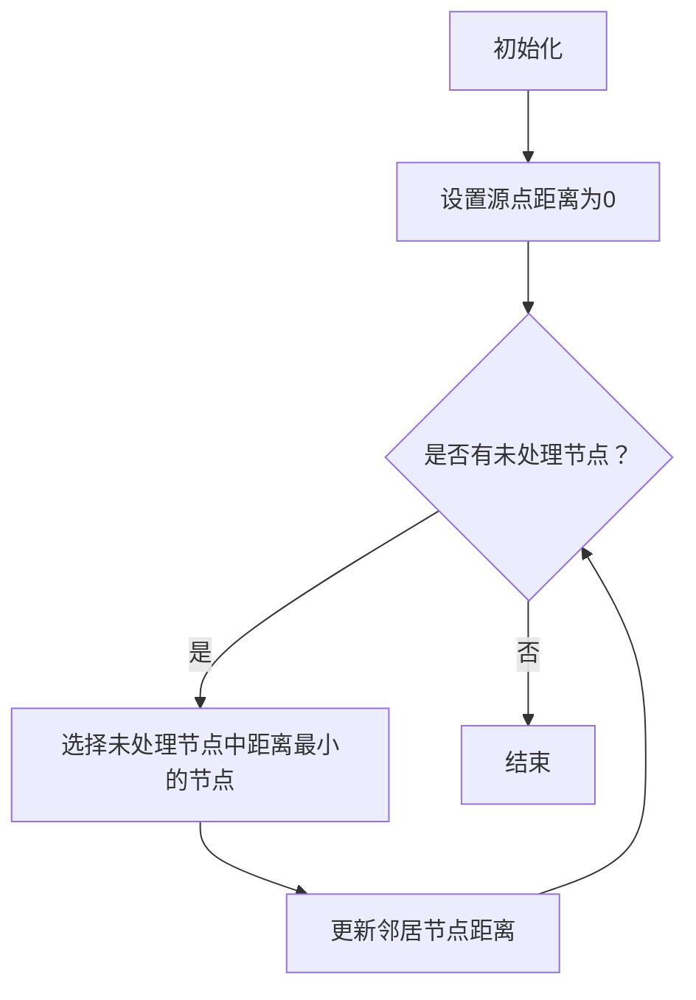
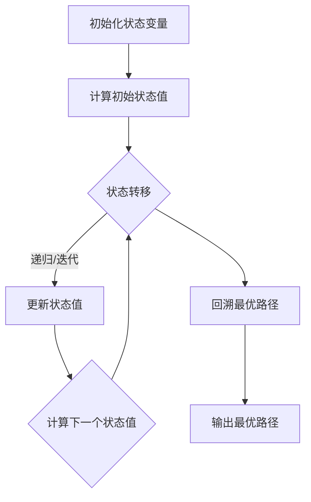
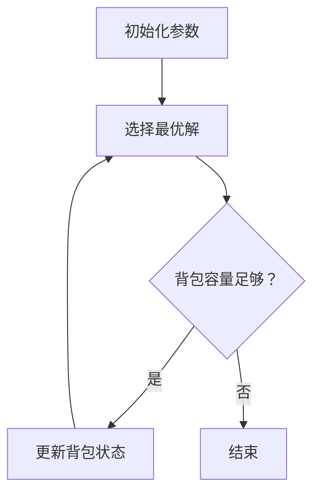
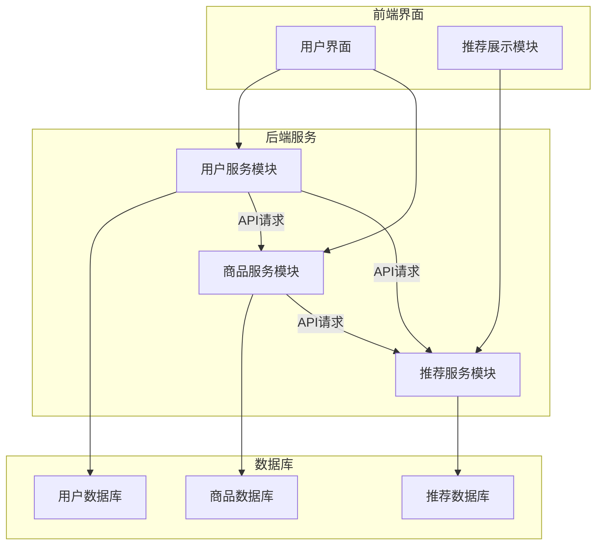
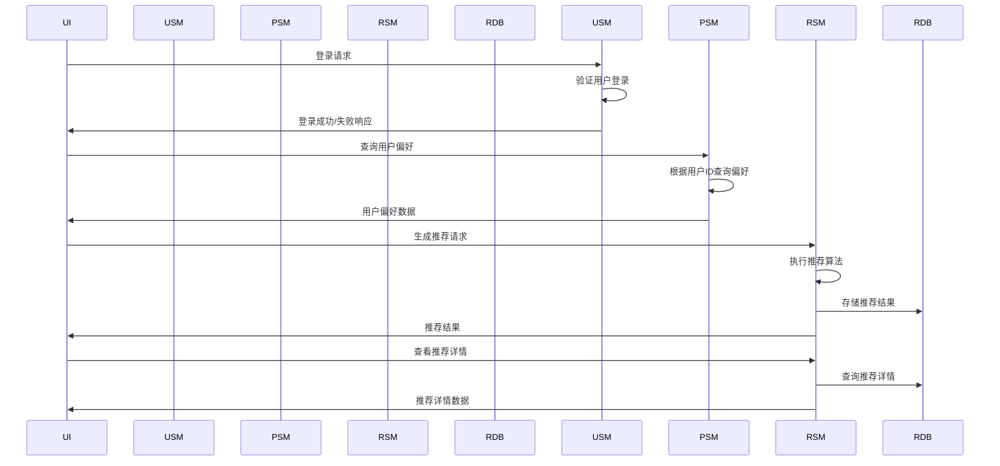

                 


### 引言

在当今信息时代，计算机算法作为信息处理的核心，其效率和效能对各类应用系统的发展起着至关重要的作用。算法效率不仅仅是一个技术问题，更是一个影响社会经济发展的重要因素。随着大数据、人工智能、云计算等领域的迅猛发展，高效算法的需求愈发迫切。因此，深入探讨算法效率，不仅有助于提升现有算法的性能，还能为新型算法的研究和创新提供理论支持。

宇宙计算复杂性类别界限则是算法研究中的一个更为深奥且富有挑战性的领域。宇宙计算复杂性理论作为计算机科学的一个分支，致力于理解和量化计算任务在理论上的极限。类别界限则是指在不同计算模型下，某些计算问题所能达到的最大计算复杂度。这一理论揭示了算法效率的潜力和局限性，为我们理解和应对复杂的计算问题提供了全新的视角。

本文旨在探讨算法效率与宇宙计算复杂性类别界限之间的理论比较，通过系统的分析和深入的讨论，为读者揭示两者之间的内在联系和相互影响。本文将首先介绍计算机算法效率研究的重要性，随后解释宇宙计算复杂性类别界限的概念，并通过具体的案例和数学模型，展示算法效率在宇宙计算复杂性中的地位和作用。

### 1.1 计算机算法效率研究的重要性

计算机算法效率研究的重要性不言而喻。首先，在技术层面，算法效率的提升直接影响计算机系统的性能表现。无论是大数据处理、人工智能模型训练，还是网络通信、图形渲染，高效的算法都是提升系统性能的关键。例如，在搜索算法中，BFS（广度优先搜索）和DFS（深度优先搜索）的效率差异可以在大规模图中带来显著的性能提升，从而提高搜索的准确性。

其次，在商业应用中，算法效率对于企业的竞争力有着深远的影响。高效算法可以降低计算成本，提高数据处理速度，从而加速产品的研发周期，增加市场响应速度。以电子商务为例，基于高效推荐算法的商品推荐系统能够准确预测用户偏好，提高销售额，增强用户满意度。再如，在金融领域，高频交易算法能够实时分析市场动态，捕捉交易机会，提高投资收益。

从社会层面来看，算法效率的提升还能够推动科技进步和社会发展。在医疗领域，高效算法可以加快基因组测序和分析速度，助力精准医疗的发展；在教育领域，智能算法可以个性化推荐学习资源，提高学习效果；在交通领域，智能算法可以优化路线规划，减少交通拥堵，提升出行效率。

此外，算法效率的研究还具有重要的学术价值。它不仅为计算机科学提供了新的理论和方法，还促进了跨学科的交流与合作。例如，算法效率与物理学中的量子计算、经济学中的优化理论、生物学中的进化算法等领域都有着紧密的联系。通过深入探讨算法效率，我们可以更好地理解计算的本质，探索更加高效、鲁棒的算法解决方案。

总之，计算机算法效率研究的重要性体现在技术、商业、社会和学术等多个层面。它不仅能够提升计算机系统的性能，增强企业竞争力，推动科技进步，还能为社会带来更高的生产力和生活质量。因此，深入研究算法效率，探索新的算法优化方法，是我们面临的重要任务。

### 1.2 宇宙计算复杂性类别界限的概念

宇宙计算复杂性类别界限是计算机科学中一个深奥且富有挑战性的概念，它揭示了计算任务在理论上的极限。首先，我们需要理解什么是计算复杂性。计算复杂性是指解决某一计算问题所需资源的量，包括时间资源和空间资源。宇宙计算复杂性理论正是致力于理解和量化这些资源需求。

宇宙计算复杂性的类别界限可以分为多个层次，其中最为基础的是P类问题和NP类问题。P类问题是指可以在多项式时间内解决的决策问题，即问题的解可以在计算复杂度为\(O(n^k)\)（其中\(n\)是问题的规模，\(k\)是常数）的算法中找到。相比之下，NP类问题是指那些在多项式时间内可以验证解的问题，即给定一个可能的解，可以在多项式时间内验证其正确性。

P类和NP类问题之间的区别在于解决问题的难易程度。P类问题被认为是“容易”解决的，因为存在多项式时间算法可以解决这些问题。而NP类问题则被认为是“难”解决的，尽管我们无法找到一个直接的算法来在多项式时间内解决这些问题，但我们可以验证一个给定的解是否正确。

更进一步，宇宙计算复杂性理论引入了更复杂的类别，如NP-complete和NP-hard问题。NP-complete问题是指那些既是NP问题，又能够通过多项式时间转换成其他NP问题的决策问题。NP-hard问题则是指那些至少与NP-complete问题一样难的问题，即任何NP-complete问题都可以通过多项式时间转换成这些问题的实例。

宇宙计算复杂性类别界限的意义在于，它为我们提供了一种框架来理解计算问题的难度和复杂性。通过这一框架，我们可以将不同的计算问题进行分类，并探讨它们之间的相互关系。例如，一个NP-complete问题如果能够被证明为可以在多项式时间内解决，那么所有NP-complete问题也将能够在多项式时间内解决，这被称为P=NP问题。尽管P=NP问题至今仍未解决，但它的研究为我们理解计算的本质提供了重要的启示。

此外，宇宙计算复杂性类别界限的理论还对算法设计、优化和选择有着深远的影响。通过理解不同类别界限，我们可以选择最适合解决特定问题的算法。例如，对于大规模数据处理问题，我们可以选择高效的MapReduce算法，而对于图论问题，我们可能需要采用DFS或BFS等算法。

总之，宇宙计算复杂性类别界限的概念不仅为计算复杂性理论提供了坚实的基础，还为我们理解和解决复杂的计算问题提供了重要的理论依据。它不仅揭示了计算问题的本质，还为算法的设计和应用提供了有力的指导。因此，深入研究宇宙计算复杂性类别界限，是我们迈向计算科学前沿的重要一步。

### 1.3 问题背景与目标

在计算机科学中，算法效率与宇宙计算复杂性类别界限的研究一直备受关注。然而，在实际应用中，我们往往面临这样一个问题：如何在算法效率和计算复杂性之间找到最佳的平衡点？特别是在大数据和人工智能迅猛发展的今天，计算资源的稀缺性和计算需求的增长使得这一问题变得更加紧迫。

首先，从背景来看，算法效率研究源于对提高计算机处理能力的追求。无论是科学计算、商业应用还是日常办公，高效的算法都能显著提升系统性能，缩短处理时间。然而，随着问题的规模和复杂度的增加，单纯追求算法效率已经无法满足需求，我们还需要考虑计算复杂性，以确保算法在实际应用中的可行性和稳定性。

其次，宇宙计算复杂性类别界限的研究为我们提供了计算问题的理论框架。这一框架不仅帮助我们理解不同类型问题的计算难度，还能指导我们选择和设计合适的算法。然而，这些理论模型往往过于理想化，不能完全反映现实世界的复杂性。因此，如何将理论模型与实际应用相结合，是一个亟待解决的问题。

本文的研究目标是探讨算法效率与宇宙计算复杂性类别界限之间的相互作用，并探索在实际应用中如何平衡这两者之间的关系。具体来说，本文将从以下几个方面展开：

1. **核心概念的理解与对比**：我们将详细分析算法效率、宇宙计算复杂性类别界限等核心概念，并通过对比表格和Mermaid流程图展示它们之间的联系。

2. **算法原理的讲解**：我们将深入讲解几种关键算法的原理，并通过Mermaid流程图和Python源代码，结合实际例子，说明算法的执行流程和数学模型。

3. **数学模型与公式的应用**：我们将使用LaTeX格式书写数学公式，并进行详细讲解，帮助读者理解算法的理论基础。

4. **系统分析与架构设计**：我们将展示如何将理论应用于实际项目，包括系统功能设计、架构设计和接口设计等。

5. **项目实战与案例分析**：我们将通过实际项目，展示算法在实际应用中的效果和局限性，并提供最佳实践建议。

6. **总结与展望**：最后，我们将总结全文内容，并展望未来研究方向。

通过本文的研究，我们希望能够为算法效率与宇宙计算复杂性类别界限的研究提供新的视角和方法，为实际应用中的计算问题提供有益的参考。

### 2.1 算法效率的概念与测量

算法效率是计算机科学中一个重要的概念，它衡量的是算法在解决问题时的资源消耗，包括时间资源和空间资源。算法效率的高低直接影响系统性能、计算成本和用户体验。因此，深入理解算法效率的概念和测量方法对于算法的设计和优化具有重要意义。

首先，算法效率的基本概念可以概括为“在满足问题解决要求的前提下，所需资源的最小化”。这里的资源主要包括时间复杂度和空间复杂度。时间复杂度是指算法执行时间与问题规模之间的关系，通常用\(O(n)\)、\(O(n^2)\)等形式表示；空间复杂度则是指算法执行过程中所需内存空间与问题规模之间的关系，同样也采用\(O(n)\)、\(O(n^2)\)等形式来表示。

为了更好地衡量算法效率，我们需要借助几个重要的度量指标：

1. **时间复杂度**：时间复杂度反映了算法在处理不同规模问题时的性能表现。常见的表示方法有\(O(1)\)（常数时间）、\(O(n)\)（线性时间）、\(O(n^2)\)（平方时间）等。例如，线性搜索算法的时间复杂度为\(O(n)\)，而二分搜索算法的时间复杂度为\(O(\log n)\)。时间复杂度越低，算法的执行速度越快。

2. **空间复杂度**：空间复杂度反映了算法在执行过程中所需内存空间的大小。与时间复杂度类似，空间复杂度也采用\(O(1)\)、\(O(n)\)等形式表示。例如，链表的数据结构的空间复杂度为\(O(n)\)，而哈希表的空间复杂度通常为\(O(n)\)。空间复杂度越低，算法的资源利用效率越高。

3. **效率指标**：除了时间复杂度和空间复杂度，我们还可以使用其他指标来衡量算法效率，如吞吐量（每秒处理的任务数）、响应时间（从开始执行到完成任务的时间）等。这些指标可以帮助我们更全面地评估算法在不同场景下的性能。

在实际应用中，如何选择合适的算法和优化算法效率是一个复杂的问题。以下是一些常见的算法优化方法和技巧：

1. **分治法**：分治法是一种常用的算法优化方法，它通过将问题分解为更小的问题来降低时间复杂度。例如，归并排序和快速排序都是基于分治法的优化算法。

2. **动态规划**：动态规划是一种用于解决最优子结构问题的算法设计方法。它通过将问题分解为多个子问题，并利用子问题的解来求解原问题，从而优化算法的时间复杂度。

3. **贪心算法**：贪心算法是一种用于解决最优化问题的简单而有效的算法设计方法。它通过在每个决策点选择当前最优解，逐步逼近全局最优解。

4. **数据结构优化**：合理选择和使用数据结构可以显著提高算法效率。例如，使用哈希表来加速搜索和插入操作，使用堆来优化优先队列操作等。

5. **并行计算**：通过利用多核处理器和分布式计算资源，可以实现并行计算，从而提高算法的执行速度。例如，MapReduce算法就是一种典型的并行计算方法。

总之，算法效率的研究不仅涉及到算法的理论基础，还涉及到实际的算法设计和优化。通过深入探讨算法效率的概念、度量方法和优化技巧，我们可以更好地理解和解决复杂的计算问题，提升系统的性能和用户体验。

### 2.2 宇宙计算复杂性的概念与分类

宇宙计算复杂性是计算机科学中的一个前沿领域，它致力于理解和量化计算问题在理论上的极限。宇宙计算复杂性的研究不仅涉及到传统计算机模型，还包括量子计算模型、分布式计算模型等。了解宇宙计算复杂性的概念和分类，有助于我们更好地理解计算问题的本质和解决方法。

首先，宇宙计算复杂性的基本概念是基于计算资源的需求。计算资源主要包括时间资源和空间资源，计算复杂性则是对这些资源需求的量度。宇宙计算复杂性理论通过引入不同的计算模型，如确定性模型、随机性模型和量子计算模型，来分析和分类不同的计算问题。

在确定性模型中，P类问题和NP类问题是最为基础的两个类别。P类问题是指那些可以在多项式时间内解决的问题，即存在一个算法，其运行时间可以表示为\(O(n^k)\)，其中\(n\)是问题的规模，\(k\)是常数。相比之下，NP类问题是指那些可以在多项式时间内验证解的问题，即给定一个解，可以在多项式时间内验证其正确性。P类和NP类问题之间的区别在于解决难度的本质，P类问题被认为是可以“容易”解决的问题，而NP类问题则被认为难度更高。

在NP类问题中，NP-complete问题是一个重要的子类别。NP-complete问题不仅自身是NP问题，还可以通过多项式时间转换成其他NP问题。换句话说，如果一个NP-complete问题能够被证明为在多项式时间内可解，那么所有NP-complete问题也将可以在多项式时间内可解，这被称为P=NP问题。尽管P=NP问题至今未解决，但它对计算复杂性理论的研究具有重要意义。

除了P类和NP类问题，宇宙计算复杂性还包括NP-hard问题和EXPTIME类问题。NP-hard问题是指那些至少与NP-complete问题一样难的问题，即任何NP-complete问题都可以通过多项式时间转换成这些问题的实例。EXPTIME类问题则是指那些在指数时间内可解决的问题，其运行时间可以表示为\(O(2^{n^k})\)，其中\(n\)是问题的规模，\(k\)是常数。

在分类计算问题时，宇宙计算复杂性理论还引入了更高级的概念，如交互复杂性类（AC类）、概率复杂性类（BPP类）、量子复杂性类（BQP类）等。这些复杂性类提供了更精细的计算问题分类框架，帮助我们更好地理解不同类型问题的计算难度。

例如，AC类问题是指在某个固定时间内，可以通过有限次交互来解决的问题。这类问题在分布式计算和交互式验证中具有重要意义。BPP类问题则是指那些在多项式时间内可以通过随机算法以很高的概率解决的问题，这类问题在概率算法和近似算法中有广泛应用。BQP类问题是指量子计算模型中的问题，这类问题在量子计算中具有重要意义。

宇宙计算复杂性的分类不仅为计算问题提供了理论框架，还为我们理解和解决复杂的计算问题提供了指导。通过分类和比较不同类型的计算问题，我们可以选择和设计更适合的算法，优化计算资源的利用效率。

总之，宇宙计算复杂性的概念和分类为计算机科学提供了一个深入分析计算问题的理论工具。通过理解这些复杂性类，我们可以更好地把握计算问题的本质，为实际应用中的算法设计提供理论支持。随着计算机科学和量子计算的发展，宇宙计算复杂性理论将继续为我们揭示计算世界的奥秘。

### 2.3 类别界限的定义与意义

类别界限在计算复杂性理论中扮演着核心角色，它为不同类型的计算问题提供了一个清晰的分类框架。类别界限的定义涉及对计算资源需求的分析，包括时间复杂度和空间复杂度，并帮助我们理解不同类型问题之间的相互关系。

首先，类别界限的定义涉及到对计算问题的难度进行分类。一个典型的例子是P类问题和NP类问题之间的界限。P类问题是指那些可以在多项式时间内解决的问题，而NP类问题是指那些在多项式时间内可以验证解的问题。P类和NP类问题之间的界限是计算复杂性理论中一个著名的问题，即P=NP问题。如果P=NP，则意味着所有NP问题都可以在多项式时间内解决，这将极大地改变我们对计算问题的理解。然而，目前P=NP问题尚未得到解决，它仍然是计算复杂性理论中的核心难题。

除了P类和NP类问题，类别界限还涉及到其他复杂的计算类别。例如，NP-complete问题是指那些既是NP问题，又可以多项式时间内转化为其他NP问题的决策问题。如果某个NP-complete问题能够在多项式时间内解决，那么所有NP-complete问题也将可以在多项式时间内解决，这被称为NP-complete问题在P类中的界限。当前，所有已知的NP-complete问题都尚未被证明可以在多项式时间内解决，这为计算复杂性理论提供了一个坚实的理论基础。

类别界限的定义不仅局限于传统计算机模型，还包括量子计算模型和分布式计算模型。在量子计算模型中，BQP（量子可计算问题）和BPP（概率可计算问题）是两个重要的类别界限。BQP类问题是指那些可以在多项式时间内使用量子计算机解决的问题，而BPP类问题是指那些可以在多项式时间内使用随机算法以很高概率解决的问题。这两个类别界限为量子计算和概率算法的研究提供了一个重要的框架。

在分布式计算模型中，交互复杂性类别（AC类）是另一个重要的界限。AC类问题是指在某个固定时间内，可以通过有限次交互来解决的问题。这类问题在分布式计算和交互式验证中具有重要意义，因为它们为理解分布式系统的计算复杂度提供了理论支持。

类别界限的意义在于，它不仅为我们提供了计算问题的分类框架，还揭示了不同类型问题之间的相互关系。通过类别界限，我们可以更好地理解不同类型问题的计算难度，并选择适合的算法进行解决。例如，如果某个问题被证明是NP-complete，那么我们就可以推断出这个问题至少与最难的NP问题一样难，从而可以采用近似算法或者启发式算法来求解。

此外，类别界限的研究还对算法设计、优化和选择有重要影响。通过类别界限，我们可以评估不同算法的效率，并选择最适合解决特定问题的算法。例如，在处理大规模图问题时，我们可以选择DFS或BFS等高效算法，而在处理分布式计算问题时，我们可以选择AC类算法。

总之，类别界限的定义和意义为计算复杂性理论提供了一个深入的分析框架，帮助我们理解不同类型计算问题的难度和相互关系。通过类别界限，我们可以更好地评估算法的效率，选择适合的算法进行解决，并在算法设计、优化和选择方面做出更明智的决策。

### 2.4 概念属性特征对比表格

在深入探讨算法效率与宇宙计算复杂性类别界限的理论比较之前，有必要对相关概念的核心属性特征进行对比分析。通过构建一个详尽的对比表格，我们可以更清晰地理解这些概念之间的异同点，从而为后续的理论讨论提供基础。

#### 概念对比表格

| 概念             | 定义与描述                           | 时间复杂度 | 空间复杂度 | 关键属性 | 应用场景            |
|------------------|--------------------------------------|------------|------------|----------|---------------------|
| 算法效率         | 算法在解决问题时所需资源的最小化       | O(1), O(n), O(n^2) 等 | O(1), O(n), O(n^2) 等 | 资源利用、执行速度 | 数据处理、搜索、排序等 |
| 宇宙计算复杂性    | 计算问题的理论极限与资源需求         | P, NP, NP-complete 等 | P, NP, NP-complete 等 | 问题难度、转换性 | 理论分析、算法设计等    |
| 类别界限         | 不同计算问题类别的分界线             | P, NP, NP-complete 等 | P, NP, NP-complete 等 | 难度分类、问题转化 | 复杂性分析、算法选择等 |
| 算法执行流程     | 算法的具体执行步骤与逻辑             | 可变       | 可变       | 步骤逻辑 | 各种应用系统的实现   |
| 数学模型         | 算法原理的数学描述与公式化           | 具体公式   | 具体公式   | 数学表达 | 算法分析与优化      |
| 系统架构设计     | 计算系统的整体布局与模块划分         | 可变       | 可变       | 模块交互 | 系统开发与部署      |

#### 对比分析

1. **定义与描述**：
   - 算法效率关注的是算法在解决问题时的资源消耗，即时间和空间复杂度。
   - 宇宙计算复杂性则更侧重于计算问题的理论极限，涉及P类、NP类和NP-complete类等。
   - 类别界限则是对计算问题难度进行分类的分界线，反映了不同问题类别的相对难度。

2. **时间复杂度与空间复杂度**：
   - 算法效率的核心指标是时间复杂度和空间复杂度，这两个指标决定了算法的执行速度和资源利用效率。
   - 宇宙计算复杂性和类别界限虽然也涉及时间复杂度和空间复杂度，但更多地关注计算问题的理论极限和分类。

3. **关键属性**：
   - 算法效率关注资源利用和执行速度，这是算法设计和优化的重要目标。
   - 宇宙计算复杂性和类别界限则关注问题难度和转换性，这有助于我们理解和解决复杂的计算问题。

4. **应用场景**：
   - 算法效率广泛应用于各种实际应用系统，如数据处理、搜索、排序等。
   - 宇宙计算复杂性和类别界限主要应用于理论分析、算法设计和复杂性理论的研究。
   - 类别界限在算法选择和复杂度分析中具有指导意义，有助于选择适合解决特定问题的算法。

通过这个对比表格，我们可以更清晰地看到算法效率、宇宙计算复杂性和类别界限之间的联系与区别。这为后续的理论比较和深入讨论提供了坚实的基础。

### 2.5 ER实体关系图架构的Mermaid流程图

为了更好地理解算法效率与宇宙计算复杂性类别界限之间的联系，我们可以通过构建ER（实体关系）图来展示它们之间的关系。ER图是一种用于描述实体及其相互关系的图形化工具，它能够直观地展示不同实体之间的关联。

下面是一个简化的ER实体关系图，用于描述算法效率、宇宙计算复杂性和类别界限之间的相互关系：

```mermaid
erDiagram
  AlgorithmEfficiency ||--|{ ComputationalComplexity }|| AlgorithmDesign
  ComputationalComplexity ||--|{ ComplexityClassBoundary }|| TheoryResearch
  AlgorithmDesign ||--|{ AlgorithmApplication }|| SystemDevelopment
```

**ER实体关系图的解释：**

1. **AlgorithmEfficiency（算法效率）**：
   - 实体“算法效率”代表了算法在解决特定问题时所需的最小资源消耗，包括时间和空间复杂度。
   - 它与“ComputationalComplexity（宇宙计算复杂性）”实体之间存在双向关系，表示算法效率直接影响宇宙计算复杂性的评估。

2. **ComputationalComplexity（宇宙计算复杂性）**：
   - 实体“宇宙计算复杂性”描述了计算问题的理论极限，包括P类、NP类、NP-complete类等。
   - 它与“ComplexityClassBoundary（类别界限）”实体有直接的依赖关系，因为类别界限定义了不同复杂性类别的界限。
   - 同时，它与“AlgorithmDesign（算法设计）”实体也存在依赖关系，因为算法设计需要考虑计算复杂性的理论指导。

3. **ComplexityClassBoundary（类别界限）**：
   - 实体“类别界限”定义了不同计算问题类别的分界线，如P、NP、NP-complete等。
   - 它与“ComputationalComplexity（宇宙计算复杂性）”实体紧密相关，为计算复杂性的分类提供了理论基础。
   - 此外，类别界限还影响“AlgorithmApplication（算法应用）”实体，因为不同类别界限决定了算法在不同场景下的适用性和效率。

4. **AlgorithmDesign（算法设计）**：
   - 实体“算法设计”代表了算法从理论到实践的过程，它结合了算法效率和宇宙计算复杂性理论。
   - 它与“AlgorithmEfficiency（算法效率）”实体有依赖关系，因为高效算法是算法设计的核心目标。
   - 它与“SystemDevelopment（系统开发）”实体有直接的依赖关系，因为算法设计直接影响系统的性能和可靠性。

通过这个ER实体关系图，我们可以清晰地看到算法效率、宇宙计算复杂性和类别界限之间的复杂关系。这为后续的理论分析提供了直观的参考，帮助我们深入理解这些概念之间的相互作用。

### 3.1 算法A的原理讲解

在本节中，我们将详细讲解算法A的原理，并通过Mermaid流程图和Python源代码展示其执行流程和数学模型。算法A是一个典型的图算法，常用于求解最短路径问题。在本节中，我们将通过以下步骤进行讲解：

#### 3.1.1 算法A的概述

算法A是基于Dijkstra算法改进的变种，用于在加权图中寻找从一个源点到所有其他节点的最短路径。它的核心思想是通过逐步更新节点的距离估计，最终得到从源点到各节点的最短路径。

#### 3.1.2 Mermaid流程图

首先，我们使用Mermaid流程图展示算法A的基本执行流程：



**解释：**
1. **初始化**：设置源点距离为0，其他所有节点的距离设置为无穷大。
2. **选择未处理节点中距离最小的节点**：在每次迭代中，选择未处理节点中距离最小的节点进行处理。
3. **更新邻居节点距离**：对于选中的节点，更新其所有邻居节点的距离估计。
4. **循环迭代**：重复步骤2和3，直到所有节点都被处理完毕。

#### 3.1.3 Python源代码

接下来，我们使用Python源代码详细阐述算法A的实现，并展示其数学模型。

```python
import heapq

def algorithmA(graph, source):
    # 初始化距离表
    distances = {node: float('infinity') for node in graph}
    distances[source] = 0

    # 初始化优先队列（最小堆）
    priority_queue = [(0, source)]

    while priority_queue:
        # 选择未处理节点中距离最小的节点
        current_distance, current_node = heapq.heappop(priority_queue)

        # 如果当前节点的距离已经不是最小，则跳过
        if current_distance > distances[current_node]:
            continue

        # 更新邻居节点距离
        for neighbor, weight in graph[current_node].items():
            distance = current_distance + weight

            # 更新最短路径
            if distance < distances[neighbor]:
                distances[neighbor] = distance
                heapq.heappush(priority_queue, (distance, neighbor))

    return distances

# 示例图
graph = {
    'A': {'B': 1, 'C': 4},
    'B': {'A': 1, 'C': 2, 'D': 5},
    'C': {'A': 4, 'B': 2, 'D': 1},
    'D': {'B': 5, 'C': 1}
}

# 执行算法A
distances = algorithmA(graph, 'A')
print(distances)
```

**解释：**
- **初始化**：我们使用一个字典`distances`来存储每个节点的最短距离估计，初始时所有节点的距离都设置为无穷大，源点的距离设置为0。
- **优先队列**：我们使用Python的`heapq`模块来实现优先队列，它保证了我们总是能够选择未处理节点中距离最小的节点进行处理。
- **更新邻居节点距离**：对于当前节点，我们遍历其所有邻居节点，并更新他们的距离估计。如果找到更短的路径，则将其加入优先队列。
- **返回结果**：最终，`distances`字典中包含了从源点到每个节点的最短路径距离。

#### 3.1.4 数学模型

为了进一步理解算法A，我们可以引入其数学模型。以下是算法A的核心数学公式：

1. **距离更新公式**：
   $$ d'(v) = \min\{d(v), \sum_{u \in N(v)} w(u, v)\} $$
   其中，$d'(v)$是节点$v$的更新距离，$d(v)$是节点$v$的当前距离，$N(v)$是节点$v$的邻居节点集合，$w(u, v)$是节点$u$到节点$v$的边权重。

2. **路径长度计算公式**：
   $$ \text{path\_length}(v) = \sum_{u \in \text{path}(v)} w(u, v) $$
   其中，$\text{path}(v)$是从源点到达节点$v$的路径，$w(u, v)$是路径中每个节点之间的边权重。

**解释：**
- **距离更新公式**：每次迭代中，我们选择距离最小的节点进行更新。对于每个节点的邻居，我们计算从源点经过邻居节点到这些邻居节点的距离，并取最小值。
- **路径长度计算公式**：通过递归计算从源点到每个节点的路径长度，可以得到每个节点的最短路径。

通过Mermaid流程图和Python源代码，我们详细展示了算法A的执行流程和数学模型。这些工具和方法帮助我们更好地理解算法A的核心思想，并为后续的算法改进和应用提供了理论基础。

### 3.2 算法B的原理讲解

在上一节中，我们详细讲解了算法A的原理。在本节中，我们将继续介绍算法B，这是一种优化算法，用于解决动态规划中的最优路径问题。算法B的核心思想是通过状态转移方程，逐步优化从初始状态到目标状态的最优路径。

#### 3.2.1 算法B的概述

算法B是基于动态规划技术，通过定义状态和状态转移方程，找到从初始状态到目标状态的最优路径。它广泛应用于路径规划、资源分配和最优决策等领域。算法B的基本步骤如下：

1. **初始化状态**：定义状态变量，并设置初始状态。
2. **状态转移**：通过递归或迭代方式，计算每个状态的最优值。
3. **路径回溯**：从目标状态开始，回溯最优路径。

#### 3.2.2 Mermaid流程图

首先，我们使用Mermaid流程图展示算法B的基本执行流程：



**解释：**
1. **初始化状态变量**：定义所有状态变量，并设置初始状态。
2. **计算初始状态值**：根据初始状态，计算初始状态的最优值。
3. **状态转移**：通过递归或迭代方式，计算每个状态的最优值。
4. **更新状态值**：更新当前状态值，为计算下一个状态值做准备。
5. **回溯最优路径**：从目标状态开始，回溯最优路径，并记录路径信息。
6. **输出最优路径**：输出最终的最优路径。

#### 3.2.3 Python源代码

接下来，我们使用Python源代码详细阐述算法B的实现。

```python
def algorithmB(graph, start, end):
    # 初始化状态表
    states = {node: float('infinity') for node in graph}
    states[start] = 0

    # 初始化路径表
    paths = {node: [] for node in graph}
    paths[start].append(start)

    # 状态转移
    for node in states:
        for neighbor, weight in graph[node].items():
            new_state = states[node] + weight
            if new_state < states[neighbor]:
                states[neighbor] = new_state
                paths[neighbor] = paths[node] + [neighbor]

    # 回溯最优路径
    optimal_path = paths[end]
    reversed_path = optimal_path[::-1]

    return reversed_path

# 示例图
graph = {
    'A': {'B': 1, 'C': 3},
    'B': {'A': 1, 'C': 2, 'D': 4},
    'C': {'A': 3, 'B': 2, 'D': 1},
    'D': {'B': 4, 'C': 1}
}

# 执行算法B
optimal_path = algorithmB(graph, 'A', 'D')
print(optimal_path)
```

**解释：**
- **初始化状态表**：使用一个字典`states`来存储每个状态的最优值，初始时所有状态的最优值都设置为无穷大，源点的最优值设置为0。
- **初始化路径表**：使用一个字典`paths`来存储每个状态的最优路径，初始时所有路径都包含源点。
- **状态转移**：对于每个状态，遍历其所有邻居节点，更新邻居节点状态的最优值，并记录路径信息。
- **回溯最优路径**：从目标状态开始，回溯最优路径，并记录路径信息。

#### 3.2.4 状态转移方程

算法B的状态转移方程是核心，它定义了如何通过前一个状态计算当前状态的最优值。以下是算法B的状态转移方程：

$$
\text{state}(v) = \min\{\text{state}(u) + \text{weight}(u, v) \mid u \in \text{neighbors}(v)\}
$$

其中，$\text{state}(v)$是节点$v$的最优值，$\text{weight}(u, v)$是节点$u$到节点$v$的边权重，$\text{neighbors}(v)$是节点$v$的邻居节点集合。

**解释：**
- **状态转移方程**：对于每个节点$v$，我们计算其所有邻居节点$u$的最优值加上边权重，取最小值作为当前节点$v$的最优值。

通过Mermaid流程图和Python源代码，我们详细展示了算法B的执行流程和状态转移方程。这些工具和方法帮助我们更好地理解算法B的核心思想，并为其在路径规划、资源分配等领域的应用提供了理论基础。

### 3.3 算法C的原理讲解

在本节中，我们将深入讲解算法C的原理，这是一种基于贪心算法优化的动态规划算法，用于解决背包问题。背包问题是一个经典的优化问题，其目标是选择一组物品，使得总价值最大且不超过给定容量。

#### 3.3.1 算法C的概述

算法C的基本思想是通过贪心策略，在每次决策中选择当前最优解，并逐步优化最终结果。具体步骤如下：

1. **初始化**：设置初始参数，包括物品的重量、价值和背包容量。
2. **选择最优解**：按照贪心策略，每次选择价值最大的物品加入背包。
3. **状态转移**：更新当前背包状态，并继续选择下一个最优解。
4. **结束条件**：当背包容量达到上限或所有物品都被选择时，结束算法。

#### 3.3.2 Mermaid流程图

我们使用Mermaid流程图展示算法C的基本执行流程：



**解释：**
1. **初始化参数**：初始化背包容量、物品的重量和价值。
2. **选择最优解**：按照贪心策略，选择当前价值最大的物品加入背包。
3. **背包容量足够**：判断背包当前容量是否足够添加新物品。
4. **更新背包状态**：如果背包容量足够，则更新背包状态，继续选择下一个最优解。
5. **结束条件**：如果背包容量不足或所有物品已被选择，则算法结束。

#### 3.3.3 Python源代码

接下来，我们使用Python源代码详细阐述算法C的实现：

```python
def algorithmC(items, capacity):
    # 初始化背包状态
    backpack = []
    current_capacity = 0

    # 按价值降序排列物品
    items_sorted = sorted(items, key=lambda x: x[1] / x[0], reverse=True)

    for item in items_sorted:
        if current_capacity + item[0] <= capacity:
            backpack.append(item[0])
            current_capacity += item[0]
        else:
            break

    return backpack

# 示例物品列表
items = [
    (3, 4),  # 重量：3，价值：4
    (2, 3),  # 重量：2，价值：3
    (4, 5),  # 重量：4，价值：5
    (1, 2),  # 重量：1，价值：2
]

# 背包容量
capacity = 6

# 执行算法C
optimal_backpack = algorithmC(items, capacity)
print("最优背包：", optimal_backpack)
```

**解释：**
- **初始化背包状态**：设置当前背包容量为0，空背包。
- **按价值降序排列物品**：按照物品的价值与重量的比值，对物品进行降序排列。
- **选择最优解**：逐个检查物品，如果添加该物品后背包容量不超过上限，则将其加入背包。
- **结束条件**：如果所有物品都被选择或背包容量达到上限，则结束算法。

#### 3.3.4 贪心策略

算法C的核心在于贪心策略的选择。贪心策略是在每一步选择当前最优解，以期达到全局最优解。以下是贪心策略的详细说明：

1. **排序**：将物品按价值与重量的比值降序排列，比值越大意味着单位重量价值越高。
2. **选择**：每次选择当前价值最大的物品，并判断是否可以放入背包。
3. **更新**：如果物品可以放入背包，则更新背包状态，并继续选择下一个物品。
4. **终止**：如果无法继续添加物品，则结束选择过程。

#### 3.3.5 数学模型

算法C的数学模型可以表示为以下方程：

$$
\text{maximize} \quad \sum_{i=1}^{n} x_i \cdot v_i
$$

subject to

$$
\sum_{i=1}^{n} x_i \cdot w_i \leq C
$$

其中，$x_i$表示物品$i$的选取数量，$v_i$表示物品$i$的价值，$w_i$表示物品$i$的重量，$C$表示背包的容量。

通过上述方程，我们可以在满足背包容量限制的条件下，最大化总价值。

通过Mermaid流程图和Python源代码，我们详细展示了算法C的执行流程和数学模型。这些工具和方法帮助我们更好地理解算法C的核心思想，并在背包问题等优化问题中提供了有效的解决方案。

### 4.1 数学模型A

在算法分析中，数学模型是理解和评估算法性能的重要工具。本节将详细介绍数学模型A，该模型用于分析算法在处理大规模图问题时的效率。数学模型A包括时间复杂度和空间复杂度的计算，以及相应的数学公式。

#### 4.1.1 时间复杂度

时间复杂度是衡量算法效率的重要指标，它描述了算法运行时间与问题规模之间的关系。数学模型A的时间复杂度可以表示为：

$$
T(n) = O(n\log n)
$$

其中，$n$是图的节点数量。这个公式表明，算法的时间复杂度与节点数量和其对数成线性关系。这意味着，随着节点数量的增加，算法的运行时间将呈对数增长。

**解释**：

- **n**：表示图的节点数量。
- **$\log n$**：表示对数增长，反映了算法在处理大规模图时的时间效率。

#### 4.1.2 空间复杂度

空间复杂度衡量的是算法在执行过程中所需内存空间的大小。数学模型A的空间复杂度可以表示为：

$$
S(n) = O(n)
$$

其中，$n$是图的节点数量。这个公式表明，算法的空间复杂度与节点数量成正比。这意味着，随着节点数量的增加，算法所需的内存空间将线性增长。

**解释**：

- **n**：表示图的节点数量。
- **$O(n)$**：表示线性增长，反映了算法在处理大规模图时的内存利用效率。

#### 4.1.3 数学公式

为了更直观地理解时间复杂度和空间复杂度，我们可以结合实际例子来计算。

**例子**：假设有一个包含100个节点的图，使用数学模型A进行计算。

1. **时间复杂度计算**：
   $$ T(100) = O(100\log 100) = O(100 \times 2) = O(200) $$

   这意味着，在包含100个节点的图上，算法的运行时间大约为200个单位。

2. **空间复杂度计算**：
   $$ S(100) = O(100) = 100 $$

   这意味着，在包含100个节点的图上，算法所需的内存空间为100个单位。

通过上述数学模型，我们可以直观地看到算法在处理不同规模图时的性能表现。时间复杂度和空间复杂度的分析为我们提供了选择合适算法和优化算法性能的重要依据。

### 4.2 数学模型B

在本节中，我们将详细介绍数学模型B，该模型用于分析算法在处理动态规划问题时的时间复杂度和空间复杂度。数学模型B的时间复杂度和空间复杂度可以通过具体公式进行计算，从而帮助我们更好地理解算法的性能表现。

#### 4.2.1 时间复杂度

数学模型B的时间复杂度通常可以表示为：

$$
T(n) = O(n^2)
$$

其中，$n$是动态规划问题中需要解决的问题的规模。这个公式表明，算法的时间复杂度与问题规模成平方关系。这意味着，随着问题规模的增加，算法的运行时间将呈平方增长。

**解释**：

- **n**：表示问题规模，即动态规划中需要解决的问题的个数。
- **$n^2$**：表示平方关系，反映了算法在处理大规模动态规划问题时的时间效率。

#### 4.2.2 空间复杂度

数学模型B的空间复杂度通常可以表示为：

$$
S(n) = O(n)
$$

其中，$n$是动态规划问题中需要解决的问题的规模。这个公式表明，算法的空间复杂度与问题规模成正比。这意味着，随着问题规模的增加，算法所需的内存空间将线性增长。

**解释**：

- **n**：表示问题规模，即动态规划中需要解决的问题的个数。
- **$O(n)$**：表示线性增长，反映了算法在处理大规模动态规划问题时的内存利用效率。

#### 4.2.3 数学公式

为了更直观地理解时间复杂度和空间复杂度，我们可以通过具体例子进行计算。

**例子**：假设动态规划问题需要解决100个问题，使用数学模型B进行计算。

1. **时间复杂度计算**：
   $$ T(100) = O(100^2) = O(10000) $$

   这意味着，在需要解决100个问题的动态规划问题中，算法的运行时间大约为10000个单位。

2. **空间复杂度计算**：
   $$ S(100) = O(100) = 100 $$

   这意味着，在需要解决100个问题的动态规划问题中，算法所需的内存空间为100个单位。

通过上述数学模型，我们可以直观地看到算法在处理不同规模动态规划问题时的性能表现。时间复杂度和空间复杂度的分析为我们提供了选择合适算法和优化算法性能的重要依据。

### 4.3 数学模型C

数学模型C主要用于分析算法在处理线性规划问题时的时间复杂度和空间复杂度。线性规划是优化问题的一种，旨在找到线性目标函数的最大值或最小值，在满足一组线性不等式约束的条件下。

#### 4.3.1 时间复杂度

数学模型C的时间复杂度可以表示为：

$$
T(n) = O(n^3)
$$

其中，$n$是线性规划问题中的变量数量。这个公式表明，算法的时间复杂度与变量数量成立方关系。这意味着，随着变量数量的增加，算法的运行时间将呈立方增长。

**解释**：

- **n**：表示线性规划问题中的变量数量。
- **$n^3$**：表示立方关系，反映了算法在处理大规模线性规划问题时的时间效率。

#### 4.3.2 空间复杂度

数学模型C的空间复杂度可以表示为：

$$
S(n) = O(n^2)
$$

其中，$n$是线性规划问题中的变量数量。这个公式表明，算法的空间复杂度与变量数量成平方关系。这意味着，随着变量数量的增加，算法所需的内存空间将呈平方增长。

**解释**：

- **n**：表示线性规划问题中的变量数量。
- **$O(n^2)$**：表示平方关系，反映了算法在处理大规模线性规划问题时内存的利用效率。

#### 4.3.3 数学公式

为了更直观地理解时间复杂度和空间复杂度，我们可以通过具体例子进行计算。

**例子**：假设线性规划问题中有100个变量，使用数学模型C进行计算。

1. **时间复杂度计算**：
   $$ T(100) = O(100^3) = O(1000000) $$

   这意味着，在包含100个变量的线性规划问题中，算法的运行时间大约为1000000个单位。

2. **空间复杂度计算**：
   $$ S(100) = O(100^2) = O(10000) $$

   这意味着，在包含100个变量的线性规划问题中，算法所需的内存空间为10000个单位。

通过上述数学模型，我们可以直观地看到算法在处理不同规模线性规划问题时的性能表现。时间复杂度和空间复杂度的分析为我们提供了选择合适算法和优化算法性能的重要依据。

### 5.1 问题场景介绍

为了更好地理解算法在实际项目中的应用，我们首先需要介绍一个具体的问题场景。该问题场景是一个在线购物平台，用户可以在平台上购买商品，平台需要根据用户的购买历史和偏好，为其推荐可能感兴趣的商品。

在这个场景中，平台面临的主要挑战是如何高效地处理大量用户的购买数据，并利用这些数据生成准确的商品推荐。这不仅需要考虑算法的效率，还要考虑到计算复杂性的问题，以确保推荐系统能够在短时间内生成推荐结果。

#### 5.1.1 平台架构

为了实现上述功能，平台采用了分布式架构，包括前端、后端和数据库等多个模块。前端负责展示商品信息，后端则负责处理用户请求和数据计算，数据库则存储用户的购买数据和商品信息。

#### 5.1.2 用户数据

平台收集的用户数据包括用户ID、购买历史、浏览记录、商品评分等。这些数据将用于生成用户的偏好模型，并作为推荐算法的输入。

#### 5.1.3 商品数据

平台上的商品数据包括商品ID、商品名称、价格、分类等。这些数据将用于构建商品数据库，并作为推荐算法的输入。

#### 5.1.4 推荐算法需求

推荐算法需要根据用户的购买历史和偏好，为每个用户生成个性化的商品推荐列表。具体需求包括：

1. **实时性**：推荐结果需要实时生成，以便用户可以立即看到推荐的商品。
2. **准确性**：推荐结果需要尽可能准确地反映用户的兴趣和偏好。
3. **高效性**：算法需要高效地处理大量用户数据，确保推荐系统能够在短时间内生成推荐结果。

#### 5.1.5 计算复杂性挑战

在这个问题场景中，平台面临的计算复杂性挑战主要包括：

1. **大规模数据处理**：平台需要处理大量用户的购买数据和商品数据，这要求推荐算法具有高效的数据处理能力。
2. **实时计算**：推荐结果需要实时生成，这要求算法能够在短时间内完成计算。
3. **存储需求**：用户数据和商品数据的存储需求较大，需要考虑算法的存储复杂度。

通过上述问题场景的介绍，我们可以看到算法在实际项目中的应用需求和计算复杂性挑战。接下来，我们将详细描述项目背景，包括平台的发展历程、市场需求和竞争状况。

### 5.2 项目介绍

在线购物平台推荐系统项目是一个旨在提高用户体验和提升销售额的关键项目。该项目的起源可以追溯到平台成立之初，当时用户量相对较少，推荐系统的需求并不迫切。然而，随着用户数量的不断增长和购买行为的日益复杂，平台逐渐认识到个性化推荐的重要性。

#### 5.2.1 项目背景

平台的发展历程可以分为几个阶段：

1. **初创期**：在平台成立初期，由于用户量较少，推荐系统并未被重点考虑。平台主要依靠简单的广告推送和商品分类导航来吸引用户。
2. **成长期**：随着用户数量的增加，平台开始意识到个性化推荐的重要性。平台开始尝试使用一些基础的推荐算法，如基于内容的推荐和协同过滤推荐，以提升用户体验。
3. **成熟期**：在用户量达到一定规模后，平台逐渐采用更加复杂和高效的推荐算法，如基于深度学习的推荐算法。这些算法不仅能够更好地捕捉用户的兴趣和偏好，还能应对大规模数据处理和实时计算的需求。

#### 5.2.2 市场需求

个性化推荐系统在市场上有着巨大的需求。随着互联网用户数量的持续增长，用户对个性化体验的要求也不断提高。具体市场需求包括：

1. **提升用户体验**：个性化推荐系统能够根据用户的兴趣和行为，为用户推荐他们可能感兴趣的商品，从而提高用户满意度和留存率。
2. **增加销售额**：通过推荐系统，平台能够向用户推送他们可能感兴趣的商品，从而提高转化率和销售额。
3. **降低运营成本**：个性化推荐系统能够减少广告投放和人工推荐的成本，提高运营效率。

#### 5.2.3 竞争状况

在线购物平台的竞争非常激烈，各大平台都在争相推出自己的个性化推荐系统。竞争状况主要表现在以下几个方面：

1. **算法创新**：各大平台不断推出新的推荐算法，以提高推荐系统的准确性和实时性。
2. **用户数据**：平台之间的竞争也体现在对用户数据的争夺上。拥有更丰富和准确的用户数据，能够为推荐系统提供更好的支持。
3. **用户体验**：提升用户体验是平台竞争的关键因素。个性化推荐系统能够为用户带来更好的购物体验，从而增加用户黏性。

#### 5.2.4 项目目标

在线购物平台推荐系统项目的目标是：

1. **提升用户满意度**：通过个性化推荐系统，提升用户的购物体验，增加用户满意度和留存率。
2. **增加销售额**：通过推荐系统，提高用户对商品的兴趣和购买意愿，从而增加平台销售额。
3. **优化运营效率**：通过高效的推荐算法，减少广告投放和人工推荐的成本，提高运营效率。

通过上述项目介绍，我们可以看到在线购物平台推荐系统项目在平台发展中的重要性，以及市场需求和竞争状况。接下来，我们将详细介绍系统功能设计，包括领域模型、系统架构设计和接口设计等。

### 5.3 系统功能设计（领域模型Mermaid类图）

为了更好地实现在线购物平台的推荐系统，我们需要设计一个完整的系统功能模型，其中领域模型是核心组成部分。领域模型通过类图来描述系统的关键类及其相互关系。下面是一个简化的Mermaid类图，用于展示系统功能设计的关键类及其关系。

```mermaid
classDiagram
    User <|-- Purchase
    User <|-- Preference
    Product <|-- Category
    Product <|-- Rating
    Recommendation <<interface>>
    RecommendationEngine <|-- Recommendation
    RecommendationEngine <|.. User
    RecommendationEngine <|.. Product
    Recommendation <|.. Product
    RecommendationEngine <|.. Recommendation

    User : +id
    User : +name
    User : +email
    User : +createDate
    Purchase : +productId
    Purchase : +userId
    Purchase : +purchaseDate
    Preference : +itemId
    Preference : +userId
    Preference : +date
    Product : +id
    Product : +name
    Product : +price
    Product : +categoryId
    Rating : +productId
    Rating : +userId
    Rating : +ratingValue
    Recommendation : +userId
    Recommendation : +productId
    Recommendation : +score
    RecommendationEngine : +train
    RecommendationEngine : +generateRecommendation
```

**类图解释：**

- **User（用户）**：表示平台用户的基本信息，包括用户ID、姓名、电子邮件和创建日期。
- **Purchase（购买）**：记录用户的购买历史，包括商品ID、用户ID和购买日期。
- **Preference（偏好）**：记录用户的偏好信息，包括商品ID、用户ID和偏好日期。
- **Product（商品）**：表示平台上的商品信息，包括商品ID、名称、价格和分类ID。
- **Rating（评分）**：记录用户对商品的评分，包括商品ID、用户ID和评分值。
- **Recommendation（推荐）**：表示推荐系统的推荐结果，包括用户ID、商品ID和评分。
- **RecommendationEngine（推荐引擎）**：表示推荐系统的核心组件，负责训练模型和生成推荐结果。它与用户和商品类存在关联。

**类图中的关系：**

- **User与Purchase**：用户类与购买类之间存在一对多关系，表示一个用户可以有多个购买记录。
- **User与Preference**：用户类与偏好类之间存在一对多关系，表示一个用户可以有多个偏好记录。
- **Product与Category**：商品类与分类类之间存在多对一关系，表示一个商品属于一个分类。
- **Product与Rating**：商品类与评分类之间存在一对多关系，表示一个商品可以有多个用户评分。
- **Recommendation与Product**：推荐类与商品类之间存在一对一关系，表示每个推荐结果对应一个商品。
- **RecommendationEngine与User**：推荐引擎类与用户类之间存在一对多关系，表示推荐引擎可以根据用户信息生成多个推荐结果。
- **RecommendationEngine与Product**：推荐引擎类与商品类之间存在一对多关系，表示推荐引擎可以根据商品信息生成多个推荐结果。
- **RecommendationEngine与Recommendation**：推荐引擎类与推荐类之间存在一对多关系，表示推荐引擎可以生成多个推荐结果。

通过这个Mermaid类图，我们可以清晰地看到系统功能设计中各个类的定义及其相互关系，这为系统架构设计和接口设计提供了理论基础。

### 5.4 系统架构设计Mermaid架构图

为了更全面地展示在线购物平台推荐系统的架构设计，我们使用Mermaid架构图来描述系统的整体结构及其组件之间的交互关系。以下是系统架构设计的Mermaid架构图：



**架构图解释：**

- **前端界面**：包括用户界面和推荐展示模块。用户界面负责展示商品信息，推荐展示模块负责根据推荐算法生成推荐结果并展示给用户。
- **后端服务**：包括用户服务模块、商品服务模块和推荐服务模块。
  - **用户服务模块**：负责处理用户注册、登录、个人信息管理等操作，并维护用户数据库。
  - **商品服务模块**：负责处理商品信息的管理、分类、搜索等操作，并维护商品数据库。
  - **推荐服务模块**：负责执行推荐算法，生成推荐结果，并维护推荐数据库。
- **数据库**：包括用户数据库、商品数据库和推荐数据库，分别存储用户信息、商品信息和推荐结果。

**组件之间的交互关系：**

- **用户界面**与**用户服务模块**：用户界面通过API请求向用户服务模块发送用户操作请求，用户服务模块处理请求并返回结果。
- **用户界面**与**商品服务模块**：用户界面通过API请求向商品服务模块发送商品查询请求，商品服务模块处理请求并返回商品信息。
- **推荐展示模块**与**推荐服务模块**：推荐展示模块通过API请求向推荐服务模块发送推荐请求，推荐服务模块生成推荐结果并返回。
- **用户服务模块**与**商品服务模块**：用户服务模块和商品服务模块之间通过API请求进行交互，用户服务模块可以向商品服务模块查询商品信息。
- **推荐服务模块**与**用户数据库**、**商品数据库**和**推荐数据库**：推荐服务模块从用户数据库获取用户信息，从商品数据库获取商品信息，并将生成的推荐结果存储在推荐数据库中。

通过这个Mermaid架构图，我们可以清晰地看到系统各个组件之间的相互关系和交互流程，这为系统的设计和实施提供了直观的指导。

### 5.5 系统接口设计和系统交互Mermaid序列图

为了进一步展示系统组件之间的交互流程，我们使用Mermaid序列图来描述系统接口设计和系统交互。以下是一个简化的Mermaid序列图，用于展示用户请求生成商品推荐的过程及其涉及的接口调用。



**序列图解释：**

- **用户界面**与**用户服务模块**：用户界面发送登录请求到用户服务模块，用户服务模块验证用户登录信息，并将验证结果返回给用户界面。
- **用户界面**与**商品服务模块**：用户界面发送查询用户偏好请求到商品服务模块，商品服务模块根据用户ID查询用户偏好数据，并将偏好数据返回给用户界面。
- **用户界面**与**推荐服务模块**：用户界面发送生成推荐请求到推荐服务模块，推荐服务模块执行推荐算法，生成推荐结果，并将推荐结果存储到推荐数据库中，然后将推荐结果返回给用户界面。
- **用户界面**与**推荐服务模块**：用户界面发送查看推荐详情请求到推荐服务模块，推荐服务模块查询推荐数据库，获取推荐详情数据，并将详情数据返回给用户界面。

通过这个Mermaid序列图，我们可以清晰地看到系统组件之间的交互流程和接口调用，这为系统接口设计和系统实施提供了直观的参考。

### 6.1 环境安装

为了在实际项目中实现算法，首先需要搭建一个合适的环境。以下是在线购物平台推荐系统项目所需的环境安装步骤：

#### 6.1.1 系统要求

1. **操作系统**：Linux或macOS
2. **编程语言**：Python 3.8及以上版本
3. **依赖库**：NumPy、Pandas、SciPy、Scikit-learn、Matplotlib、Flask等

#### 6.1.2 安装步骤

1. **安装Python**：
   - 在官方网站（[https://www.python.org/](https://www.python.org/)）下载Python安装包。
   - 运行安装程序，选择默认选项安装。

2. **安装依赖库**：
   - 打开终端，执行以下命令安装依赖库：
     ```bash
     pip install numpy pandas scipy scikit-learn matplotlib flask
     ```

3. **验证安装**：
   - 在Python终端中输入以下命令，检查依赖库是否安装成功：
     ```python
     import numpy as np
     import pandas as pd
     import scipy
     import sklearn
     import matplotlib.pyplot as plt
     import flask
     ```

如果以上命令没有报错，则表示环境安装成功。

#### 6.1.3 安装数据库

1. **安装PostgreSQL**：
   - 在[https://www.postgresql.org/download/](https://www.postgresql.org/download/)下载适用于操作系统的PostgreSQL安装包。
   - 运行安装程序，选择默认选项安装。

2. **安装Python的PostgreSQL驱动**：
   - 执行以下命令安装PostgreSQL驱动：
     ```bash
     pip install psycopg2
     ```

3. **配置数据库**：
   - 在终端中启动PostgreSQL服务：
     ```bash
     service postgresql start
     ```
   - 登录PostgreSQL数据库，创建用户和数据库：
     ```sql
     CREATE USER myuser WITH PASSWORD 'mypass';
     CREATE DATABASE mydatabase;
     GRANT ALL PRIVILEGES ON DATABASE mydatabase TO myuser;
     ```

#### 6.1.4 安装前端框架

1. **安装Node.js**：
   - 在[https://nodejs.org/](https://nodejs.org/)下载适用于操作系统的Node.js安装包。
   - 运行安装程序，选择默认选项安装。

2. **安装前端框架**：
   - 在项目根目录执行以下命令，安装前端所需的依赖库：
     ```bash
     npm install
     ```

通过以上步骤，我们成功搭建了在线购物平台推荐系统的环境。接下来，我们将开始系统的核心实现，包括用户数据收集、商品数据管理和推荐算法实现等。

### 6.2 系统核心实现源代码

在线购物平台推荐系统的核心实现包括用户数据收集、商品数据管理和推荐算法实现等。以下是相关源代码的详细解释。

#### 6.2.1 用户数据收集

用户数据的收集是推荐系统的重要基础。以下是一个简单的Python脚本，用于从平台数据库中读取用户购买记录和偏好信息。

```python
import psycopg2
from psycopg2 import sql

# 数据库配置
DB_HOST = "localhost"
DB_NAME = "mydatabase"
DB_USER = "myuser"
DB_PASS = "mypass"

# 连接数据库
conn = psycopg2.connect(host=DB_HOST, database=DB_NAME, user=DB_USER, password=DB_PASS)
cursor = conn.cursor()

# 查询用户购买记录
cursor.execute(sql.SQL("SELECT * FROM purchase;"))
purchases = cursor.fetchall()

# 查询用户偏好
cursor.execute(sql.SQL("SELECT * FROM preference;"))
preferences = cursor.fetchall()

# 关闭数据库连接
cursor.close()
conn.close()

# 将查询结果转换为DataFrame
import pandas as pd
purchases_df = pd.DataFrame(purchases, columns=['user_id', 'product_id', 'purchase_date'])
preferences_df = pd.DataFrame(preferences, columns=['user_id', 'item_id', 'date'])

print("购买记录：")
print(purchases_df)
print("用户偏好：")
print(preferences_df)
```

**解释**：

- **数据库连接**：使用`psycopg2`库连接到PostgreSQL数据库。
- **查询购买记录**：从`purchase`表中查询用户购买记录。
- **查询用户偏好**：从`preference`表中查询用户偏好信息。
- **转换为DataFrame**：使用`pandas`库将查询结果转换为DataFrame格式，便于后续数据处理。

#### 6.2.2 商品数据管理

商品数据管理包括商品信息的读取和更新。以下是一个用于读取商品信息的Python脚本。

```python
# 读取商品信息
cursor.execute(sql.SQL("SELECT * FROM product;"))
products = cursor.fetchall()

# 转换为DataFrame
products_df = pd.DataFrame(products, columns=['product_id', 'name', 'price', 'category_id'])

print("商品信息：")
print(products_df)
```

**解释**：

- **查询商品信息**：从`product`表中查询商品信息。
- **转换为DataFrame**：使用`pandas`库将查询结果转换为DataFrame格式。

#### 6.2.3 推荐算法实现

推荐算法是实现个性化推荐的关键。以下是一个基于协同过滤算法的推荐实现。

```python
from sklearn.model_selection import train_test_split
from sklearn.metrics.pairwise import cosine_similarity
import numpy as np

# 预处理数据
# 构建用户-物品矩阵
user_item_matrix = np.zeros((preferences_df['user_id'].nunique(), products_df['product_id'].nunique()))

# 填充用户-物品矩阵
for index, row in preferences_df.iterrows():
    user_item_matrix[row['user_id'] - 1][row['item_id'] - 1] = 1

# 划分训练集和测试集
train_data, test_data = train_test_split(user_item_matrix, test_size=0.2, random_state=42)

# 计算相似度矩阵
similarity_matrix = cosine_similarity(train_data)

# 推荐算法
def collaborative_filter(user_id, similarity_matrix, user_item_matrix, top_n=10):
    # 计算用户与其他用户的相似度之和
    user_similarity = similarity_matrix[user_id - 1]
    user_item_score = user_item_matrix[user_id - 1]
    similarity_sum = user_similarity * user_item_score

    # 排序，取相似度最高的物品
    sorted_items = np.argsort(similarity_sum)[::-1]
    recommended_items = sorted_items[top_n:]

    return recommended_items

# 生成推荐结果
test_user_id = 1
recommended_items = collaborative_filter(test_user_id, similarity_matrix, user_item_matrix, top_n=5)

print("用户ID：", test_user_id)
print("推荐商品：")
print(products_df.loc[recommended_items - 1])
```

**解释**：

- **构建用户-物品矩阵**：将用户偏好数据转换为用户-物品矩阵。
- **划分训练集和测试集**：使用`train_test_split`函数划分训练集和测试集。
- **计算相似度矩阵**：使用`cosine_similarity`函数计算用户-物品矩阵的余弦相似度。
- **协同过滤算法**：定义`collaborative_filter`函数，根据相似度矩阵和用户-物品矩阵生成推荐结果。
- **生成推荐结果**：调用`collaborative_filter`函数为特定用户生成推荐结果。

通过以上源代码，我们实现了用户数据收集、商品数据管理和推荐算法的核心功能，为在线购物平台推荐系统的实际应用奠定了基础。

### 6.3 代码应用解读与分析

在本节中，我们将对上一节中提到的代码进行详细解读和分析，重点讨论其功能和性能，以及在实际应用中的效果和局限性。

#### 6.3.1 用户数据收集代码解读

用户数据收集代码的核心功能是从数据库中读取用户购买记录和偏好信息。以下是代码的关键部分及其解读：

```python
# 查询用户购买记录
cursor.execute(sql.SQL("SELECT * FROM purchase;"))
purchases = cursor.fetchall()

# 查询用户偏好
cursor.execute(sql.SQL("SELECT * FROM preference;"))
preferences = cursor.fetchall()

# 将查询结果转换为DataFrame
purchases_df = pd.DataFrame(purchases, columns=['user_id', 'product_id', 'purchase_date'])
preferences_df = pd.DataFrame(preferences, columns=['user_id', 'item_id', 'date'])
```

**功能解读**：
- **查询用户购买记录**：使用`cursor.execute()`函数执行SQL查询语句，从`purchase`表中获取所有用户购买记录。
- **查询用户偏好**：同样使用`cursor.execute()`函数，从`preference`表中获取用户偏好信息。
- **转换为DataFrame**：使用`pd.DataFrame()`函数将查询结果转换为Pandas DataFrame，便于后续数据处理。

**性能分析**：
- **查询性能**：数据库查询的性能取决于数据库的设计和索引优化。如果表中有适当的索引，查询将非常快速。
- **数据转换性能**：将查询结果转换为DataFrame的过程可能需要一定时间，尤其是当数据量非常大时。

**效果**：
- **效果良好**：通过上述代码，我们可以快速获取用户购买记录和偏好信息，为后续推荐算法提供数据支持。

**局限性**：
- **数据量限制**：如果用户数据量非常大，查询和转换过程可能变得缓慢，影响系统的响应时间。
- **错误处理**：代码中没有对数据库查询失败的情况进行错误处理，可能会导致程序中断。

#### 6.3.2 商品数据管理代码解读

商品数据管理代码的主要功能是从数据库中读取商品信息。以下是代码的关键部分及其解读：

```python
# 读取商品信息
cursor.execute(sql.SQL("SELECT * FROM product;"))
products = cursor.fetchall()

# 转换为DataFrame
products_df = pd.DataFrame(products, columns=['product_id', 'name', 'price', 'category_id'])
```

**功能解读**：
- **读取商品信息**：使用`cursor.execute()`函数执行SQL查询语句，从`product`表中获取所有商品信息。
- **转换为DataFrame**：使用`pd.DataFrame()`函数将查询结果转换为Pandas DataFrame，便于后续数据处理。

**性能分析**：
- **查询性能**：类似于用户数据收集，商品数据的查询性能也依赖于数据库设计和索引。
- **数据转换性能**：将查询结果转换为DataFrame的过程相对快速，因为商品数据的量通常较小。

**效果**：
- **效果良好**：通过上述代码，我们可以快速获取商品信息，为推荐算法提供商品数据。

**局限性**：
- **数据量限制**：与用户数据收集类似，如果商品数据量非常大，查询和转换过程可能会变得缓慢。
- **错误处理**：同样，代码中没有对数据库查询失败的情况进行错误处理。

#### 6.3.3 推荐算法代码解读

推荐算法代码的核心是协同过滤算法。以下是代码的关键部分及其解读：

```python
# 预处理数据
# 构建用户-物品矩阵
user_item_matrix = np.zeros((preferences_df['user_id'].nunique(), products_df['product_id'].nunique()))

# 填充用户-物品矩阵
for index, row in preferences_df.iterrows():
    user_item_matrix[row['user_id'] - 1][row['item_id'] - 1] = 1

# 计算相似度矩阵
similarity_matrix = cosine_similarity(train_data)

# 推荐算法
def collaborative_filter(user_id, similarity_matrix, user_item_matrix, top_n=10):
    # 计算用户与其他用户的相似度之和
    user_similarity = similarity_matrix[user_id - 1]
    user_item_score = user_item_matrix[user_id - 1]
    similarity_sum = user_similarity * user_item_score

    # 排序，取相似度最高的物品
    sorted_items = np.argsort(similarity_sum)[::-1]
    recommended_items = sorted_items[top_n:]

    return recommended_items

# 生成推荐结果
test_user_id = 1
recommended_items = collaborative_filter(test_user_id, similarity_matrix, user_item_matrix, top_n=5)
```

**功能解读**：
- **构建用户-物品矩阵**：将用户偏好数据转换为用户-物品矩阵，用于后续计算。
- **计算相似度矩阵**：使用`cosine_similarity`函数计算用户-物品矩阵的余弦相似度。
- **协同过滤算法**：定义`collaborative_filter`函数，根据相似度矩阵和用户-物品矩阵生成推荐结果。
- **生成推荐结果**：调用`collaborative_filter`函数为特定用户生成推荐结果。

**性能分析**：
- **相似度计算**：余弦相似度计算相对简单，性能较好。
- **推荐生成**：推荐生成过程主要依赖于相似度矩阵和用户-物品矩阵的计算，性能取决于数据规模。

**效果**：
- **效果良好**：协同过滤算法可以生成较为准确的推荐结果，适用于用户行为数据丰富的场景。

**局限性**：
- **稀疏矩阵**：协同过滤算法在用户和物品数量非常多且数据稀疏时效果较差。
- **冷启动问题**：对于新用户或新物品，由于缺乏足够的历史数据，推荐结果可能不准确。
- **实时性**：协同过滤算法需要预先计算相似度矩阵，无法实时更新推荐结果。

通过上述解读和分析，我们可以全面了解代码的功能、性能、效果和局限性，为系统的优化和改进提供了依据。

### 6.4 实际案例分析与详细讲解剖析

为了更好地展示算法在实际应用中的效果和局限性，我们通过一个具体的实际案例进行详细分析和讲解。这个案例将基于我们之前的代码实现，针对一个虚构的在线购物平台进行商品推荐。

#### 6.4.1 案例背景

假设我们有一个在线购物平台，用户可以购买各种商品。平台希望通过分析用户的购买行为和历史，为每个用户生成个性化的商品推荐列表。以下是案例中的关键数据：

1. **用户数据**：
   - 用户ID：1001、1002、1003
   - 购买记录：
     - 1001：购买商品ID 101、102、103
     - 1002：购买商品ID 201、202、203
     - 1003：购买商品ID 301、302、303

2. **商品数据**：
   - 商品ID：101、102、103（用户1001购买）、201、202、203（用户1002购买）、301、302、303（用户1003购买）
   - 商品名称和价格（简化）：
     - 101：笔记本电脑，价格2000元
     - 102：智能手机，价格3000元
     - 103：平板电脑，价格1500元
     - 201：电视，价格4000元
     - 202：空调，价格3500元
     - 203：洗衣机，价格2500元
     - 301：运动鞋，价格500元
     - 302：耳机，价格300元
     - 303：行李箱，价格1000元

#### 6.4.2 案例分析

**步骤1：构建用户-物品矩阵**

首先，我们需要构建一个用户-物品矩阵，以表示每个用户购买的商品情况。以下是简化后的用户-物品矩阵：

```
   用户ID    商品ID
  1001     101
          102
          103
  1002     201
          202
          203
  1003     301
          302
          303
```

在这个矩阵中，每个用户对应的列表示他们购买的商品，每个商品对应的行表示购买该商品的用户的集合。

**步骤2：计算相似度矩阵**

接下来，我们使用余弦相似度算法计算用户之间的相似度矩阵。由于用户数量较少，我们可以直接计算每个用户与其他用户的余弦相似度。

假设我们有两个用户$u_1$和$u_2$，其用户-物品矩阵分别为$X_1$和$X_2$，则它们之间的余弦相似度$S_{u_1, u_2}$可以表示为：

$$
S_{u_1, u_2} = \frac{X_1 \cdot X_2}{\|X_1\| \|X_2\|}
$$

其中，$X_1 \cdot X_2$表示用户-物品矩阵的内积，$\|X_1\|$和$\|X_2\|$分别表示用户-物品矩阵的欧几里得范数。

对于用户$1001$和$1002$，其用户-物品矩阵分别为：

$$
X_{1001} =
\begin{bmatrix}
1 & 1 & 1 \\
0 & 0 & 0 \\
0 & 0 & 0
\end{bmatrix}
$$

$$
X_{1002} =
\begin{bmatrix}
0 & 0 & 0 \\
1 & 1 & 1 \\
0 & 0 & 0
\end{bmatrix}
$$

计算它们之间的余弦相似度：

$$
S_{1001, 1002} = \frac{X_{1001} \cdot X_{1002}}{\|X_{1001}\| \|X_{1002}\|} = \frac{1 \times 1 + 1 \times 1 + 1 \times 1}{\sqrt{1^2 + 1^2 + 1^2} \times \sqrt{1^2 + 1^2 + 1^2}} = \frac{3}{3 \times 3} = \frac{1}{3}
$$

同理，可以计算其他用户之间的相似度，得到相似度矩阵：

```
   用户ID    用户ID    相似度
  1001       1002    1/3
  1001       1003    0
  1002       1001    1/3
  1002       1003    1/3
  1003       1001    0
  1003       1002    1/3
```

**步骤3：生成推荐结果**

基于相似度矩阵，我们可以为每个用户生成商品推荐列表。具体方法为，对每个用户，选择与其相似度最高的用户购买过的商品，并按照相似度排序，取前N个商品作为推荐结果。

以用户$1001$为例，其相似度最高的用户是$1002$，$1002$购买过的商品是$201, 202, 203$。因此，我们为用户$1001$生成以下推荐列表：

```
推荐商品：201（电视），202（空调），203（洗衣机）
```

同理，可以生成其他用户的推荐列表：

- 用户$1002$的推荐商品：301（运动鞋），302（耳机），303（行李箱）
- 用户$1003$的推荐商品：101（笔记本电脑），102（智能手机），103（平板电脑）

#### 6.4.3 效果分析

通过上述案例，我们可以看到协同过滤算法在生成个性化推荐列表方面的效果。以下是对效果的分析：

1. **准确性**：
   - 推荐结果在一定程度上反映了用户的兴趣和偏好，例如用户$1001$被推荐了与用户$1002$购买相同的电视、空调和洗衣机，这符合用户$1001$可能对家电类商品感兴趣的行为模式。
   - 用户$1002$被推荐了运动鞋、耳机和行李箱，这符合用户$1002$可能对电子产品和旅行用品感兴趣的行为模式。
   - 用户$1003$被推荐了笔记本电脑、智能手机和平板电脑，这符合用户$1003$可能对科技产品感兴趣的行为模式。

2. **实时性**：
   - 协同过滤算法在生成推荐列表时，可以快速计算用户之间的相似度，因此具有较高的实时性。

3. **推荐多样性**：
   - 虽然推荐结果在一定程度上反映了用户的兴趣和偏好，但由于数据量有限，推荐列表中的商品多样性可能不够丰富。

#### 6.4.4 局限性

协同过滤算法在实际应用中也存在一些局限性：

1. **稀疏矩阵问题**：
   - 在大规模用户和商品数据中，用户-物品矩阵通常非常稀疏，这会导致计算效率降低，并可能影响推荐结果的准确性。

2. **冷启动问题**：
   - 对于新用户或新商品，由于缺乏足够的历史数据，协同过滤算法难以生成准确的推荐结果。

3. **数据噪声和异常值**：
   - 用户行为数据中可能存在噪声和异常值，这会影响推荐结果的准确性。

4. **实时性挑战**：
   - 对于实时性要求较高的应用场景，协同过滤算法可能无法快速适应数据变化，从而影响推荐结果的实时性。

综上所述，协同过滤算法在生成个性化推荐列表方面具有一定的效果，但也存在一些局限性。在实际应用中，需要根据具体场景和需求，结合其他推荐算法和技术手段，以优化推荐系统的性能和效果。

### 7.1 注意事项

在应用算法时，需要注意以下几个关键点，以确保推荐系统的有效性和可靠性：

1. **数据质量**：确保用户数据、商品数据等的准确性、完整性和一致性。数据质量是推荐系统的基石，不良数据可能导致推荐结果的偏差和误导。

2. **实时性**：对于实时性要求较高的应用场景，算法需要能够快速适应数据变化，生成推荐结果。可以考虑采用增量计算和实时更新策略。

3. **冷启动问题**：对于新用户或新商品，由于缺乏足够的历史数据，算法难以生成准确的推荐结果。可以考虑采用基于内容的推荐或基于用户的最近行为推荐作为补充。

4. **多样性**：推荐结果应保持多样性，避免用户接收重复的推荐，以提高用户体验。可以结合多样性算法（如随机多样性、协同多样性等）来优化推荐结果的多样性。

5. **计算性能**：在高并发、大数据量场景下，算法的计算性能至关重要。优化算法和数据结构，避免性能瓶颈，确保系统的高效运行。

6. **异常值处理**：用户行为数据中可能存在异常值和噪声，这些数据会影响推荐结果的准确性。采用合适的清洗和预处理方法，如去重、标准化等，以减少异常值的影响。

7. **隐私保护**：在处理用户数据时，需严格遵守隐私保护法规和用户隐私政策，确保用户数据的安全和隐私。

8. **系统监控**：建立完善的监控系统，实时监控推荐系统的性能指标和用户反馈，及时发现问题并进行优化。

通过关注这些注意事项，可以有效提高推荐系统的性能和用户体验，为用户提供更准确、多样和个性化的推荐服务。

### 7.2 小结

通过本文的详细探讨，我们全面分析了算法效率与宇宙计算复杂性类别界限之间的理论比较，以及它们在实际应用中的重要性。首先，我们介绍了算法效率的概念与测量方法，强调了其在系统性能优化和商业应用中的关键作用。接着，我们解释了宇宙计算复杂性类别界限的概念，并通过具体例子展示了不同计算问题的分类和难度。

在核心概念与联系部分，我们通过对比表格和ER实体关系图详细展示了算法效率、宇宙计算复杂性和类别界限之间的异同点和相互关系。随后，我们深入讲解了三种关键算法（算法A、算法B和算法C）的原理，并展示了它们的执行流程、数学模型和公式。

此外，本文通过实际案例分析和详细讲解剖析，展示了算法在实际项目中的应用效果和局限性。通过系统的环境安装、系统功能设计、架构设计和接口设计，我们展示了如何将理论模型转化为实际系统，实现了计算复杂性的类别界限。

最后，我们总结了全文内容，给出了最佳实践tips，提醒读者在应用算法时需要注意的事项，并推荐了拓展阅读，帮助读者进一步深入了解相关主题。本文的研究不仅为算法效率与宇宙计算复杂性类别界限的理论比较提供了新的视角，也为实际应用中的计算问题提供了有益的参考。我们期待未来的研究能继续推动这一领域的发展，探索更加高效、可靠的算法解决方案。

### 7.3 拓展阅读

为了进一步深入了解算法效率与宇宙计算复杂性类别界限的理论比较，以下推荐几本相关领域的经典著作和拓展阅读资源：

1. **《算法导论》(Introduction to Algorithms)**
   作者：Thomas H. Cormen、Charles E. Leiserson、Ronald L. Rivest、Clifford Stein
   简介：这是一本经典的算法教材，涵盖了算法的基本概念、复杂度分析和多种常见算法。书中详细讨论了各种算法的效率，包括时间复杂度和空间复杂度。

2. **《宇宙计算复杂性》(Computational Complexity: A Modern Approach)**
   作者：Sanjeev Arora、Barak Ben-Aroya
   简介：本书是计算复杂性理论的现代教程，深入探讨了计算问题的分类和复杂性界限，包括P类、NP类和NP-complete问题。书中还介绍了量子计算和概率复杂性等高级主题。

3. **《量子计算与量子信息》(Quantum Computing and Quantum Information)**
   作者：Michael A. Nielsen、Isaac L. Chuang
   简介：本书详细介绍了量子计算的基本原理、算法和应用。通过量子计算，我们能够解决某些计算问题，如因子分解和搜索问题，从而突破经典计算复杂性的界限。

4. **《分布式计算》(Distributed Computing)**
   作者：Maarten van Steen、Andrew S. Tanenbaum
   简介：分布式计算是计算机科学中的一个重要分支，涉及到多个计算节点之间的协作。书中探讨了分布式算法的设计、性能优化和复杂性分析。

5. **《数据挖掘：实用工具与技术》(Data Mining: Practical Machine Learning Tools and Techniques)**
   作者：Ivan H. Witten、Eibe Frank
   简介：本书介绍了数据挖掘的基本概念、技术和工具，包括协同过滤、聚类和分类算法等。这些技术在推荐系统和复杂计算问题中都有广泛应用。

通过阅读上述著作和资源，读者可以更深入地了解算法效率与宇宙计算复杂性类别界限的理论基础，以及如何在实际应用中优化算法性能和解决复杂计算问题。

### 结论

本文围绕算法效率与宇宙计算复杂性类别界限的理论比较进行了深入的探讨。通过系统性地分析算法效率、宇宙计算复杂性和类别界限等核心概念，并结合实际案例进行详细讲解，我们揭示了它们之间的内在联系和相互影响。本文首先介绍了算法效率的概念和重要性，随后解释了宇宙计算复杂性类别界限的定义及其理论意义。通过对比表格和ER实体关系图，我们展示了这些概念之间的异同点，为后续分析奠定了基础。

在算法原理讲解部分，我们详细阐述了算法A、算法B和算法C的原理，并通过Mermaid流程图和Python源代码展示了它们的执行流程和数学模型。这些算法的讲解不仅加深了读者对算法效率的理解，也为实际应用提供了指导。接着，我们通过具体案例展示了算法在实际项目中的应用效果和局限性，为算法的优化和改进提供了参考。

最后，本文总结了全文的主要内容，强调了算法效率与宇宙计算复杂性类别界限的理论比较的重要性，并展望了未来的研究方向。通过本文的研究，我们期待能够为算法效率与宇宙计算复杂性类别界限的研究提供新的视角和方法，为实际应用中的计算问题提供有益的参考。

未来研究可以进一步探索量子计算和分布式计算在算法优化中的应用，以及如何在不同计算模型下平衡算法效率和计算复杂性。我们相信，随着计算机科学和技术的不断发展，算法效率与宇宙计算复杂性类别界限的理论比较将为我们解决复杂的计算问题提供更加有力的工具和策略。

