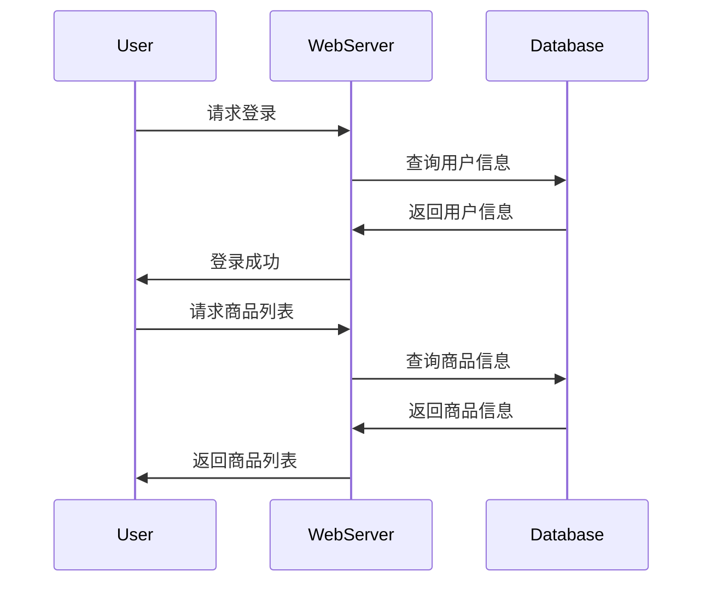

                 

# 算法设计与宇宙信息熵守恒定律的类比

## 关键词

算法设计、宇宙信息熵守恒定律、信息熵、算法复杂度、优化策略、计算机科学、人工智能、网络安全、教育、伦理问题

## 摘要

本文旨在探讨算法设计与宇宙信息熵守恒定律之间的类比关系。通过对信息熵的基本概念和算法设计的深入分析，我们揭示了算法复杂度与信息熵之间的联系。接着，本文探讨了算法设计与宇宙信息熵守恒定律的类比方法，并在计算机科学、人工智能、网络安全等领域展示了其实际应用。最后，本文提出了算法设计与信息熵的未来发展趋势和伦理问题，为相关领域的教育与实践提供了新的视角和启示。

## 目录大纲

### 第一部分：算法设计与信息熵基础

### 第二部分：算法设计与信息熵的应用

### 第三部分：宇宙信息熵守恒定律的类比

### 第四部分：算法设计实践

### 第五部分：算法设计与信息熵的未来趋势

### 第六部分：算法设计与信息熵伦理问题

### 第七部分：总结与展望

## 第一部分：算法设计与信息熵基础

### 第1章：算法设计与信息熵概述

#### 1.1 算法设计的基本概念

##### 1.1.1 算法的定义与特性

算法（Algorithm）是解决特定问题的一系列有序操作步骤。它具有输入、输出以及明确的计算步骤。

##### 1.1.2 算法设计的重要性

算法设计在计算机科学中至关重要，它决定了程序的运行效率和资源消耗。

##### 1.1.3 信息熵的起源与发展

信息熵最早由克劳德·香农提出，用以描述信息的不确定性。随着信息论和计算机科学的发展，信息熵的应用领域不断扩展。

#### 1.2 信息熵的基本概念

##### 1.2.1 信息熵的定义

信息熵是衡量信息不确定性的度量，通常用对数函数表示。

##### 1.2.2 信息熵的数学模型

信息熵的数学模型为：\( H(X) = -\sum_{i=1}^{n} p(x_i) \log_2 p(x_i) \)，其中 \( p(x_i) \) 为每个可能结果的概率。

##### 1.2.3 信息熵的物理意义

在物理学中，信息熵与热力学第二定律中的熵概念密切相关，反映了系统的无序程度。

#### 1.3 算法与信息熵的联系

##### 1.3.1 算法复杂性与信息熵的关系

算法复杂性与信息熵之间存在紧密的联系。复杂度较高的算法往往意味着更高的信息熵。

##### 1.3.2 算法效率与信息熵的关系

算法效率与信息熵密切相关。高效的算法往往能够降低信息熵，提高信息处理效率。

##### 1.3.3 宇宙信息熵守恒定律的概念

宇宙信息熵守恒定律指出，在一个封闭系统中，信息熵总是趋向于增加，最终达到最大值。

### 第2章：算法设计与信息熵的应用

#### 2.1 数据结构与信息熵

##### 2.1.1 数据结构的定义与分类

数据结构是组织数据的方式，常见的有数组、链表、树、图等。

##### 2.1.2 数据结构与信息熵的关系

数据结构的选择直接影响算法复杂度，进而影响信息熵。

##### 2.1.3 基于信息熵的优化策略

通过优化数据结构，降低算法复杂度，从而减少信息熵。

#### 2.2 算法复杂度分析

##### 2.2.1 算法复杂度的概念

算法复杂度是衡量算法优劣的重要指标，包括时间复杂度和空间复杂度。

##### 2.2.2 算法复杂度的分析方法

常见的分析方法有渐进分析方法，包括大O符号表示法。

##### 2.2.3 基于信息熵的算法复杂度分析

通过信息熵来分析算法复杂度，为优化算法提供理论依据。

#### 2.3 算法优化策略

##### 2.3.1 传统的算法优化方法

传统的算法优化方法包括分治法、动态规划、贪心算法等。

##### 2.3.2 基于信息熵的优化策略

利用信息熵理论来指导算法优化，提高算法效率。

##### 2.3.3 实例分析

通过具体实例，分析信息熵在算法优化中的应用。

### 第3章：宇宙信息熵守恒定律的类比

#### 3.1 宇宙信息熵守恒定律的基本原理

##### 3.1.1 宇宙信息熵守恒定律的定义

宇宙信息熵守恒定律是指在宇宙中，信息熵的总和保持不变。

##### 3.1.2 宇宙信息熵守恒定律的数学描述

宇宙信息熵守恒定律可以用微分形式表示为：\( \frac{dH_{\text{总}}}{dt} = 0 \)。

##### 3.1.3 宇宙信息熵守恒定律的物理意义

宇宙信息熵守恒定律反映了宇宙的不可逆过程，揭示了时间的本质。

#### 3.2 算法设计与宇宙信息熵守恒定律的类比

##### 3.2.1 算法设计中的信息熵概念

在算法设计中，信息熵可以用来衡量算法的复杂度和效率。

##### 3.2.2 宇宙信息熵守恒定律在算法设计中的应用

通过类比宇宙信息熵守恒定律，指导算法设计和优化。

##### 3.2.3 类比方法在算法设计中的优势与挑战

讨论类比方法在算法设计中的优势和面临的挑战。

### 第4章：算法设计与信息熵在计算机科学中的应用

#### 4.1 算法设计与信息熵在数据挖掘中的应用

##### 4.1.1 数据挖掘实例

分析数据挖掘过程中的算法设计和信息熵应用。

##### 4.1.2 基于信息熵的优化策略

探讨如何利用信息熵优化数据挖掘算法。

#### 4.2 算法设计与信息熵在机器学习中的应用

##### 4.2.1 机器学习实例

分析机器学习中的算法和信息熵关系。

##### 4.2.2 基于信息熵的算法优化

介绍如何基于信息熵优化机器学习算法。

#### 4.3 算法设计与信息熵在网络安全中的应用

##### 4.3.1 网络安全实例

探讨算法设计和信息熵在网络安全中的应用。

##### 4.3.2 基于信息熵的防护策略

介绍如何利用信息熵理论提高网络安全。

### 第5章：算法设计与信息熵的未来趋势

#### 5.1 算法设计与信息熵的发展趋势

##### 5.1.1 算法设计的未来发展

展望算法设计的未来发展趋势。

##### 5.1.2 信息熵理论的发展

讨论信息熵理论在未来的发展前景。

##### 5.1.3 算法设计与信息熵的未来应用前景

探讨算法设计与信息熵在未来应用领域的潜力。

#### 5.2 算法设计与信息熵教育

##### 5.2.1 算法设计与信息熵教育的重要性

阐述算法设计与信息熵教育的重要性。

##### 5.2.2 算法设计与信息熵教育的挑战与机遇

分析算法设计与信息熵教育的挑战和机遇。

##### 5.2.3 算法设计与信息熵教育的实践策略

介绍算法设计与信息熵教育的实践策略。

### 第6章：算法设计与信息熵伦理问题

#### 6.1 算法设计与信息熵的伦理问题

##### 6.1.1 算法设计与隐私保护

讨论算法设计中的隐私保护问题。

##### 6.1.2 算法设计与公平性

分析算法设计中的公平性问题。

##### 6.1.3 算法设计与社会责任

探讨算法设计中的社会责任。

#### 6.2 算法设计与信息熵伦理问题的应对策略

##### 6.2.1 隐私保护的解决方案

介绍隐私保护的解决方案。

##### 6.2.2 公平性的改进策略

讨论如何改进算法设计中的公平性。

##### 6.2.3 社会责任的实践案例

分析算法设计中的社会责任实践案例。

### 第7章：总结与展望

#### 7.1 算法设计与信息熵的总结

##### 7.1.1 主要研究成果

总结算法设计与信息熵研究的主要成果。

##### 7.1.2 存在的问题与挑战

讨论算法设计与信息熵研究存在的问题和挑战。

##### 7.1.3 未来研究方向

展望算法设计与信息熵研究的未来发展方向。

#### 7.2 展望

##### 7.2.1 算法设计与信息熵的未来前景

展望算法设计与信息熵的未来前景。

##### 7.2.2 对计算机科学与技术的贡献

讨论算法设计与信息熵对计算机科学与技术的贡献。

##### 7.2.3 对社会发展的深远影响

探讨算法设计与信息熵对社会发展的深远影响。

## 第一部分：算法设计与信息熵基础

### 第1章：算法设计与信息熵概述

#### 1.1 算法设计的基本概念

算法（Algorithm）是一种定义明确、有序的步骤序列，用于解决特定问题。在计算机科学中，算法是一种解决特定问题或执行特定任务的方法。算法具有输入（Input）、输出（Output）和一系列明确的计算步骤（Steps）。输入是算法开始时的数据，输出是算法执行完成后得到的结果，而计算步骤则是算法中一系列执行的操作。

##### 1.1.1 算法的定义与特性

算法是一种抽象的概念，它描述了一系列计算步骤，用于解决特定的问题。算法具有以下特性：

1. **确定性**：算法中的每一步都是明确的，对于相同的输入，算法总是产生相同的结果。
2. **顺序性**：算法中的步骤必须按照一定的顺序执行，不能随意跳过或重复执行。
3. **有效性**：算法必须在有限的时间内完成计算，不能陷入无限循环。

##### 1.1.2 算法设计的重要性

算法设计是计算机科学的核心问题之一。高效的算法可以减少计算机资源的消耗，提高程序的性能。以下是一些算法设计的重要性：

1. **时间效率**：算法的时间复杂度决定了程序执行的时间，高效的算法可以显著减少计算时间。
2. **空间效率**：算法的空间复杂度决定了程序所需的内存大小，高效的算法可以节省内存资源。
3. **可扩展性**：良好的算法设计可以提高程序的扩展性，使程序能够适应不同的数据规模和问题复杂度。
4. **可维护性**：清晰的算法设计可以提高代码的可读性和可维护性，方便后续的代码维护和优化。

##### 1.1.3 信息熵的起源与发展

信息熵（Entropy）最早由克劳德·香农（Claude Shannon）在1948年提出，作为信息论的基础。香农的信息熵概念源自热力学中的熵，用以衡量信息的不确定性。香农定义信息熵为信息量与概率的乘积，用对数函数表示。信息熵的发展对计算机科学产生了深远影响，特别是在数据压缩、信息传输和算法设计等领域。

信息熵的基本概念和数学模型为：

- **定义**：信息熵是衡量信息不确定性的度量，通常用对数函数表示。对于一个离散随机变量X，其信息熵H(X)定义为：
  \[
  H(X) = -\sum_{i=1}^{n} p(x_i) \log_2 p(x_i)
  \]
  其中，\( p(x_i) \) 是随机变量X取值为\( x_i \)的概率。

- **数学模型**：信息熵的数学模型基于概率论，反映了随机事件的不确定性。信息熵的计算涉及到概率分布，通过量化不确定性的程度，为算法设计提供了新的视角。

##### 1.1.4 信息熵在宇宙学中的应用

信息熵不仅在计算机科学中具有重要意义，在宇宙学中也发挥着关键作用。热力学第二定律指出，封闭系统的熵总是随时间增加，最终达到最大值。这一原理在宇宙学中得到了广泛应用，描述了宇宙的演化过程。宇宙信息熵守恒定律（Cosmic Entropy Conservation Law）指出，在一个封闭宇宙中，总信息熵保持不变。这一概念有助于我们理解宇宙的演化规律，提供了宇宙学研究的理论基础。

#### 1.2 信息熵的基本概念

信息熵是衡量信息不确定性的度量，它在多个领域中有着广泛的应用。理解信息熵的基本概念对于深入探讨算法设计与信息熵的关系至关重要。

##### 1.2.1 信息熵的定义

信息熵最早由克劳德·香农提出，作为信息论的核心概念。香农将信息熵定义为信息量的度量，用以衡量信息的不确定性。信息熵反映了在随机事件中，我们对结果的了解程度。一个完全确定的事件具有零信息熵，而完全不确定的事件具有最大的信息熵。

信息熵的数学定义如下：

对于一个离散随机变量X，其可能取值为\( x_1, x_2, \ldots, x_n \)，且每个取值的概率为\( p(x_1), p(x_2), \ldots, p(x_n) \)，则X的信息熵H(X)定义为：
\[
H(X) = -\sum_{i=1}^{n} p(x_i) \log_2 p(x_i)
\]

其中，对数函数的底数为2，表示以2为信息单位（比特）。该公式表示每个可能结果的信息量与其概率的乘积之和的负值。

##### 1.2.2 信息熵的数学模型

信息熵的数学模型基于概率论，通过量化概率分布的不确定性来衡量信息熵。具体来说，信息熵的数学模型包括以下步骤：

1. **概率分布**：给定随机变量X的概率分布，每个取值的概率为\( p(x_i) \)。
2. **信息量计算**：对于每个可能结果\( x_i \)，计算其信息量，即\( -\log_2 p(x_i) \)。
3. **信息熵计算**：将每个可能结果的信息量与其概率相乘，并求和，得到总的信息熵。

信息熵的数学模型为：
\[
H(X) = -\sum_{i=1}^{n} p(x_i) \log_2 p(x_i)
\]

该公式反映了随机变量X的信息熵，衡量了在随机事件中我们获取信息的能力。

##### 1.2.3 信息熵的物理意义

在物理学中，信息熵与热力学第二定律中的熵概念密切相关。熵是衡量系统无序程度的物理量，表示系统可能性的数量。在热力学系统中，熵总是随时间增加，反映了系统的不可逆过程。

信息熵的物理意义在于，它不仅描述了信息的不确定性，还反映了系统的复杂性和无序程度。在计算机科学中，信息熵可以帮助我们理解算法的复杂度和效率，从而优化算法设计。

#### 1.3 算法与信息熵的联系

算法与信息熵之间存在紧密的联系，特别是在算法复杂度分析和优化策略方面。以下探讨算法复杂度与信息熵的关系，以及算法效率与信息熵的关系。

##### 1.3.1 算法复杂性与信息熵的关系

算法复杂度是衡量算法优劣的重要指标，包括时间复杂度和空间复杂度。信息熵与算法复杂度之间存在紧密的联系，特别是在时间复杂度方面。

1. **时间复杂度**：算法的时间复杂度描述了算法执行时间与问题规模的关系。复杂度较高的算法通常意味着更高的信息熵。这是因为复杂度较高的算法可能需要处理更多的输入数据或执行更复杂的操作，从而增加了信息的不确定性。

2. **空间复杂度**：算法的空间复杂度描述了算法所需内存的大小。与时间复杂度类似，复杂度较高的算法通常具有更高的空间复杂度，这也意味着更高的信息熵。

通过分析算法复杂度，我们可以了解算法的信息熵，从而为算法优化提供理论依据。例如，如果算法复杂度较高，我们可以考虑优化算法的数据结构或算法本身，以降低信息熵，提高算法效率。

##### 1.3.2 算法效率与信息熵的关系

算法效率是衡量算法执行时间的重要指标，与信息熵密切相关。高效的算法通常具有较低的信息熵，因为它们能够在较短的时间内处理输入数据，减少信息的不确定性。

1. **执行时间**：高效的算法能够在较短的时间内完成计算，从而减少了执行时间。这意味着算法的信息熵较低，因为它在处理输入数据时具有更高的确定性。

2. **资源消耗**：高效的算法通常具有较低的空间复杂度，从而减少了内存和其他资源的消耗。这与算法的信息熵有关，因为较低的信息熵意味着算法在处理输入数据时具有更高的确定性和效率。

通过优化算法效率，我们可以降低算法的信息熵，从而提高算法的整体性能。例如，通过优化算法的数据结构或算法逻辑，可以减少不必要的计算和资源消耗，提高算法的执行效率。

##### 1.3.3 宇宙信息熵守恒定律的概念

宇宙信息熵守恒定律是指在一个封闭系统中，信息熵的总和保持不变。这一原理在热力学和宇宙学中具有重要意义，揭示了系统的不可逆过程。

在算法设计中，宇宙信息熵守恒定律可以指导我们理解算法的复杂度和效率。根据守恒定律，算法在执行过程中必须保持总信息熵不变。这意味着算法在处理输入数据时，必须以某种方式平衡信息的生成和消耗。

例如，一个高效的算法可能在处理大量输入数据时生成大量信息，但这些信息在算法执行过程中会被消耗掉，保持总信息熵不变。另一方面，一个低效的算法可能在处理输入数据时生成较少的信息，但这些信息在算法执行过程中可能无法得到有效利用，导致信息熵的增加。

通过理解宇宙信息熵守恒定律，我们可以更好地设计高效的算法，减少不必要的计算和资源消耗，提高算法的执行效率。

### 第2章：算法设计与信息熵的应用

#### 2.1 数据结构与信息熵

数据结构是算法设计中至关重要的一环，它决定了算法的复杂度和效率。在数据结构的选择和优化过程中，信息熵的概念发挥了重要作用。以下探讨数据结构、信息熵及其关系，以及基于信息熵的优化策略。

##### 2.1.1 数据结构的定义与分类

数据结构是用于存储和组织数据的方式。根据数据的存储方式和操作方式，数据结构可以分为以下几类：

1. **线性结构**：线性结构包括数组、链表、栈和队列等，用于存储具有线性关系的数据元素。
2. **树结构**：树结构包括二叉树、二叉搜索树、AVL树和B树等，用于存储具有层次关系的数据元素。
3. **图形结构**：图形结构包括图和树等，用于存储具有复杂关系的数据元素。

##### 2.1.2 数据结构与信息熵的关系

数据结构的选择直接影响算法的复杂度和效率，进而影响信息熵。以下从两个方面探讨数据结构、信息熵及其关系：

1. **数据结构的影响**：不同的数据结构具有不同的时间复杂度和空间复杂度。例如，线性结构的时间复杂度通常较低，但空间复杂度较高；树结构的时间复杂度和空间复杂度取决于树的高度和树的形状。通过选择合适的数据结构，可以优化算法的复杂度，降低信息熵。

2. **信息熵的影响**：信息熵反映了数据的不确定性。在数据结构中，信息熵可以通过数据元素的概率分布来衡量。例如，一个具有均匀分布的数据结构具有较低的信息熵，而一个具有偏斜分布的数据结构具有较高的信息熵。通过降低数据结构中的信息熵，可以提高算法的效率。

##### 2.1.3 基于信息熵的优化策略

基于信息熵的优化策略旨在降低算法的复杂度，提高算法的效率。以下介绍几种基于信息熵的优化策略：

1. **数据压缩**：数据压缩是一种通过减少数据冗余来降低信息熵的方法。在数据结构中，数据压缩可以减少存储空间的需求，提高算法的效率。常用的数据压缩算法包括霍夫曼编码和LZ77算法等。

2. **数据排序**：数据排序是一种通过重新组织数据元素来降低信息熵的方法。在数据结构中，数据排序可以减少搜索和比较操作的时间复杂度，提高算法的效率。常用的数据排序算法包括快速排序、归并排序和堆排序等。

3. **哈希表**：哈希表是一种通过哈希函数将数据元素映射到哈希表中的方法。在数据结构中，哈希表可以降低搜索和比较操作的时间复杂度，提高算法的效率。哈希表通常使用哈希函数来计算数据元素的哈希值，并根据哈希值将数据元素存储到哈希表中。

#### 2.2 算法复杂度分析

算法复杂度分析是评估算法性能的重要手段。算法复杂度包括时间复杂度和空间复杂度，分别描述了算法执行时间和内存需求与问题规模的关系。以下探讨算法复杂度的概念、分析方法以及基于信息熵的算法复杂度分析。

##### 2.2.1 算法复杂度的概念

算法复杂度是衡量算法性能的重要指标，包括时间复杂度和空间复杂度。

1. **时间复杂度**：时间复杂度描述了算法执行时间与问题规模的关系，通常用大O符号表示。例如，一个算法的时间复杂度为\( O(n) \)，表示算法的执行时间与输入规模成正比。

2. **空间复杂度**：空间复杂度描述了算法所需内存大小与问题规模的关系，同样用大O符号表示。例如，一个算法的空间复杂度为\( O(n) \)，表示算法的内存需求与输入规模成正比。

##### 2.2.2 算法复杂度的分析方法

算法复杂度的分析方法主要包括渐进分析方法和边界分析。

1. **渐进分析方法**：渐进分析方法是一种基于数学概率和统计方法来分析算法性能的方法。渐进分析方法通过考虑算法的平均执行时间和最坏情况下的执行时间，来评估算法的复杂度。

2. **边界分析方法**：边界分析方法是一种基于算法的边界条件来分析算法性能的方法。边界分析方法通过考虑算法在最小输入规模和最大输入规模下的执行时间，来评估算法的复杂度。

##### 2.2.3 基于信息熵的算法复杂度分析

基于信息熵的算法复杂度分析是一种将信息熵理论应用于算法复杂度分析的方法。以下介绍基于信息熵的算法复杂度分析：

1. **信息熵的度量**：基于信息熵的算法复杂度分析首先需要度量算法的信息熵。信息熵反映了算法处理数据的不确定性，通常用大O符号表示。例如，一个算法的信息熵为\( O(\log n) \)，表示算法在处理数据时具有较低的不确定性。

2. **信息熵与复杂度的关系**：基于信息熵的算法复杂度分析揭示了信息熵与算法复杂度之间的关系。通常情况下，信息熵与算法复杂度呈反比关系。即信息熵越低，算法的复杂度越低，反之亦然。

通过基于信息熵的算法复杂度分析，可以更准确地评估算法的性能，为算法优化提供理论依据。

#### 2.3 算法优化策略

算法优化是提高算法性能的重要手段，包括传统的算法优化方法和基于信息熵的优化策略。以下探讨传统的算法优化方法、基于信息熵的优化策略以及实例分析。

##### 2.3.1 传统的算法优化方法

传统的算法优化方法包括分治法、动态规划、贪心算法等，这些方法在算法优化中具有广泛应用。

1. **分治法**：分治法是一种将大问题划分为若干个小问题，分别求解，再合并结果的算法。分治法能够降低算法的时间复杂度，提高算法的执行效率。

2. **动态规划**：动态规划是一种利用已求解子问题的结果来求解原问题的算法。动态规划可以避免重复计算，降低算法的时间复杂度。

3. **贪心算法**：贪心算法是一种在每一步选择当前最优解的算法。贪心算法能够快速求解某些特定类型的问题，如背包问题和最小生成树问题。

##### 2.3.2 基于信息熵的优化策略

基于信息熵的优化策略是一种将信息熵理论应用于算法优化的方法。以下介绍基于信息熵的优化策略：

1. **信息熵降低**：基于信息熵的优化策略旨在降低算法的信息熵，从而提高算法的执行效率。通过降低信息熵，算法能够在处理数据时减少不确定性，提高确定性。

2. **数据结构优化**：数据结构优化是降低算法信息熵的重要手段。通过选择合适的数据结构，可以降低算法的复杂度，提高算法的执行效率。

3. **算法流程优化**：算法流程优化是指通过调整算法的执行流程来降低信息熵。例如，在算法的某些步骤中，可以通过减少计算量或简化操作来降低信息熵。

##### 2.3.3 实例分析

以下通过一个实例分析算法优化策略：

假设我们有一个排序算法，输入规模为n，算法的时间复杂度为\( O(n^2) \)。我们可以通过以下优化策略来提高算法的执行效率：

1. **分治法优化**：将输入规模为n的数据划分为若干个子问题，分别进行排序，再合并结果。通过分治法，算法的时间复杂度可以降低为\( O(n \log n) \)。

2. **动态规划优化**：利用已排序的子序列来优化排序过程。例如，在合并两个有序子序列时，可以通过比较元素的大小来优化排序操作，从而降低算法的复杂度。

3. **信息熵降低**：通过降低算法的信息熵，可以减少算法的不确定性，提高执行效率。例如，在排序过程中，可以通过减少比较次数来降低信息熵。

通过实例分析，我们可以看到算法优化策略在提高算法执行效率方面的作用。基于信息熵的优化策略为算法优化提供了新的视角和思路。

### 第3章：宇宙信息熵守恒定律的类比

宇宙信息熵守恒定律是物理学中一个重要的基本原理，它指出在一个封闭系统中，总信息熵总是随时间增加，最终达到最大值。这一原理在热力学、量子力学和宇宙学等领域有着广泛的应用。在本章中，我们将探讨宇宙信息熵守恒定律的基本原理，并尝试将其与算法设计进行类比，以揭示两者之间的联系。

#### 3.1 宇宙信息熵守恒定律的基本原理

宇宙信息熵守恒定律源于热力学第二定律，该定律指出，在一个封闭系统中，熵总是随时间增加。熵的增加反映了系统的无序程度，表示系统的可能性增加。在热力学系统中，熵的增加通常是由于能量分散和系统内部不可逆过程引起的。同样，在宇宙学中，宇宙的总熵随时间增加，反映了宇宙的膨胀和演化过程。

##### 3.1.1 宇宙信息熵守恒定律的定义

宇宙信息熵守恒定律可以定义为：在一个封闭宇宙中，总信息熵保持不变，即宇宙的总熵在任何时候都不变。这个定律可以数学表示为：
\[
\frac{dH_{\text{总}}}{dt} = 0
\]
其中，\( H_{\text{总}} \) 是宇宙的总信息熵，\( t \) 是时间。

##### 3.1.2 宇宙信息熵守恒定律的数学描述

宇宙信息熵守恒定律的数学描述涉及到熵的产生和耗散。在宇宙中，熵的产生通常由能量转化和不可逆过程引起，而熵的耗散则通过热力学第二定律实现。数学上，可以表示为：
\[
\frac{dH_{\text{总}}}{dt} = S_{\text{产}} - S_{\text{散}}
\]
其中，\( S_{\text{产}} \) 是熵的产生，\( S_{\text{散}} \) 是熵的耗散。由于在一个封闭系统中，熵的产生和耗散相等，因此有：
\[
S_{\text{产}} = S_{\text{散}}
\]
这意味着宇宙的总信息熵保持不变。

##### 3.1.3 宇宙信息熵守恒定律的物理意义

宇宙信息熵守恒定律的物理意义在于，它揭示了宇宙的不可逆性和时间的本质。在宇宙中，熵的增加反映了时间的流逝，表示系统从有序向无序的演化过程。这一原理不仅适用于宏观宇宙，也适用于微观系统，如黑洞和量子场。

#### 3.2 算法设计与宇宙信息熵守恒定律的类比

宇宙信息熵守恒定律与算法设计之间存在一定的类比关系。通过这种类比，我们可以从宇宙信息熵守恒定律中获得启示，指导算法设计和优化。

##### 3.2.1 算法设计中的信息熵概念

在算法设计中，信息熵的概念可以帮助我们理解算法的复杂度和效率。信息熵反映了算法处理数据的不确定性，通常用熵的值来表示。算法的信息熵可以通过对输入数据的概率分布进行分析来计算。例如，一个具有均匀分布的数据集具有较低的信息熵，而一个具有偏斜分布的数据集具有较高的信息熵。

在算法设计中，信息熵与算法的复杂度密切相关。一个高效算法的信息熵通常较低，因为它能够在较短的时间内处理输入数据，减少不确定性。相反，一个低效算法的信息熵通常较高，因为它需要更多的时间来处理输入数据，增加不确定性。

##### 3.2.2 宇宙信息熵守恒定律在算法设计中的应用

宇宙信息熵守恒定律可以应用于算法设计，以指导算法的优化。以下是一些应用实例：

1. **算法复杂度优化**：通过降低算法的信息熵，可以提高算法的复杂度。例如，在排序算法中，通过选择合适的数据结构（如二叉搜索树）和优化算法逻辑，可以降低信息熵，提高算法的效率。

2. **资源利用率优化**：在算法设计中，信息熵可以帮助我们优化资源的利用率。例如，在分布式系统中，通过降低任务分配的信息熵，可以提高系统的负载均衡性能，减少资源浪费。

3. **安全性优化**：在网络安全中，信息熵可以用于评估系统的安全性。例如，通过分析网络流量中的信息熵，可以检测出异常流量，提高系统的安全性。

##### 3.2.3 类比方法在算法设计中的优势与挑战

类比方法在算法设计中的应用具有以下优势：

1. **启示性**：通过将宇宙信息熵守恒定律应用于算法设计，可以获得新的启示，为算法优化提供理论依据。

2. **跨领域应用**：宇宙信息熵守恒定律在物理学和宇宙学中得到了广泛应用，将其应用于算法设计，可以实现跨领域的知识融合。

3. **直观性**：宇宙信息熵守恒定律的概念和原理相对直观，容易理解和应用，有助于提高算法设计的可理解性。

然而，类比方法在算法设计中也面临一些挑战：

1. **局限性**：宇宙信息熵守恒定律主要适用于封闭系统，而算法设计中的问题往往涉及开放系统，这可能导致类比方法的局限性。

2. **复杂性**：在算法设计中，信息熵的计算和优化可能涉及到复杂的数学模型和计算方法，增加了算法设计的复杂性。

3. **适用性**：宇宙信息熵守恒定律在某些情况下可能不适用于算法设计，例如，当算法涉及并行计算或动态调整时，类比方法可能需要进一步的调整和优化。

总之，类比方法在算法设计中的应用具有潜力，但也需要谨慎对待其局限性和挑战。

### 第4章：算法设计与信息熵在计算机科学中的应用

算法设计与信息熵在计算机科学中有着广泛的应用，特别是在数据挖掘、机器学习和网络安全等领域。本章将详细探讨算法设计与信息熵在这些领域的具体应用，并通过实例分析展示其应用效果。

#### 4.1 算法设计与信息熵在数据挖掘中的应用

数据挖掘是利用算法从大量数据中提取有价值信息的过程。信息熵在数据挖掘中扮演着关键角色，可以帮助我们识别数据中的噪声、降低数据复杂性，并提高挖掘算法的效率。

##### 4.1.1 数据挖掘实例

假设我们有一个包含大量客户购买行为的数据集，我们需要从中挖掘出客户的偏好和潜在的市场趋势。在这个实例中，信息熵可以帮助我们识别哪些特征变量对挖掘结果具有高贡献度。

1. **信息熵计算**：首先，我们可以计算每个特征变量的信息熵。例如，对于“购买频率”这个特征变量，我们可以计算其信息熵以衡量客户购买行为的不确定性。

2. **特征选择**：基于信息熵，我们可以选择信息熵较低的特征变量，这些变量具有较低的噪声，对挖掘结果影响较大。通过特征选择，我们可以简化数据集，降低算法复杂度。

3. **结果优化**：通过降低特征变量的信息熵，我们可以提高数据挖掘算法的效率，减少计算时间和资源消耗。

##### 4.1.2 基于信息熵的优化策略

1. **数据预处理**：在数据挖掘之前，我们可以通过数据预处理来降低信息熵。例如，通过去重、归一化和缺失值处理，可以减少数据中的噪声，提高挖掘算法的准确性。

2. **特征选择**：基于信息熵的特征选择方法可以帮助我们选择最具代表性的特征变量，从而降低算法复杂度，提高挖掘效率。

3. **模型优化**：在模型训练过程中，我们可以利用信息熵来调整模型参数，优化模型性能。例如，在决策树模型中，我们可以根据信息熵选择最佳分裂点，提高模型划分的准确性。

#### 4.2 算法设计与信息熵在机器学习中的应用

机器学习是利用算法从数据中学习并预测未来趋势的重要技术。信息熵在机器学习中的应用可以帮助我们优化学习过程，提高模型的预测准确性。

##### 4.2.1 机器学习实例

假设我们有一个分类问题，需要从大量数据中预测新样本的类别。在这个实例中，信息熵可以帮助我们评估特征变量的重要性，并优化分类模型的性能。

1. **信息熵计算**：首先，我们可以计算每个特征变量的信息熵，以衡量其对分类结果的贡献。特征变量信息熵较低表示其具有较强的分类能力。

2. **特征选择**：基于信息熵，我们可以选择信息熵较低的特征变量作为模型的输入，减少模型复杂度，提高预测准确性。

3. **模型优化**：在模型训练过程中，我们可以利用信息熵调整模型参数。例如，在随机森林模型中，我们可以根据信息熵调整树的数量和深度，优化模型性能。

##### 4.2.2 基于信息熵的优化策略

1. **特征选择**：基于信息熵的特征选择方法可以帮助我们选择最具代表性的特征变量，减少模型复杂度，提高预测准确性。

2. **模型调整**：通过利用信息熵调整模型参数，我们可以优化模型性能，提高预测准确性。例如，在神经网络中，我们可以根据信息熵调整权重和激活函数，优化模型性能。

3. **数据预处理**：在机器学习过程中，我们可以通过数据预处理来降低信息熵，提高模型训练效果。例如，通过归一化和缺失值处理，可以减少数据中的噪声，提高模型训练的准确性。

#### 4.3 算法设计与信息熵在网络安全中的应用

网络安全是保障信息系统安全的重要技术，信息熵在网络安全中的应用可以帮助我们识别和防范网络攻击，提高系统的安全性。

##### 4.3.1 网络安全实例

假设我们有一个网络安全系统，需要检测并防范网络攻击。在这个实例中，信息熵可以帮助我们识别异常流量，提高系统的检测能力。

1. **信息熵计算**：首先，我们可以计算网络流量的信息熵，以衡量网络数据的不确定性。正常网络流量通常具有较低的信息熵，而网络攻击流量通常具有较高的信息熵。

2. **流量分析**：基于信息熵，我们可以分析网络流量中的异常模式，识别潜在的攻击行为。例如，通过比较正常流量和攻击流量之间的信息熵差异，可以检测出异常流量。

3. **防御策略**：通过识别异常流量，我们可以采取相应的防御策略，如隔离攻击源、封锁攻击路径等，提高系统的安全性。

##### 4.3.2 基于信息熵的防护策略

1. **异常检测**：基于信息熵的异常检测方法可以帮助我们识别网络中的异常行为，提高检测准确性。

2. **流量监控**：通过实时监控网络流量，我们可以利用信息熵分析流量特征，及时发现和防范网络攻击。

3. **响应策略**：当检测到网络攻击时，我们可以根据信息熵分析攻击的特征，采取相应的响应策略，如隔离攻击源、调整系统配置等，提高系统的防护能力。

#### 4.4 算法设计与信息熵在其他领域的应用

除了数据挖掘、机器学习和网络安全，算法设计与信息熵还在其他领域有着广泛的应用。以下是一些实例：

##### 4.4.1 市场营销

在市场营销中，信息熵可以帮助企业识别潜在客户，提高营销效率。通过计算客户数据的熵值，企业可以分析客户行为的不确定性，从而制定更有针对性的营销策略。

##### 4.4.2 供应链管理

在供应链管理中，信息熵可以帮助企业优化供应链流程，降低成本。通过分析供应链中的信息熵，企业可以识别供应链中的瓶颈和风险点，从而采取相应的优化措施。

##### 4.4.3 智能交通

在智能交通领域，信息熵可以帮助优化交通信号控制策略，提高交通效率。通过实时监测交通流量，分析交通数据的熵值，可以优化信号灯的切换策略，减少交通拥堵。

#### 4.5 实例分析

以下通过一个实际案例来分析算法设计与信息熵在数据挖掘中的应用：

假设我们有一个电子商务网站，需要挖掘用户购买行为，识别潜在客户，提高销售额。在这个案例中，信息熵可以帮助我们实现以下目标：

1. **用户行为分析**：首先，我们可以计算用户行为的熵值，以衡量用户行为的不确定性。例如，购买频率、购买种类、购买时间等特征变量的熵值可以帮助我们识别用户行为的差异。

2. **特征选择**：基于信息熵，我们可以选择信息熵较低的特征变量，这些变量对用户行为的识别具有较高贡献度。例如，购买频率和购买种类这两个特征变量的熵值较低，表明它们对用户行为的识别具有重要影响。

3. **客户细分**：通过分析用户行为的熵值，我们可以将用户分为不同的细分市场，如高频购买用户、低频购买用户等。这些细分市场可以帮助我们制定更有针对性的营销策略，提高销售额。

4. **模型训练**：在模型训练过程中，我们可以利用信息熵调整模型参数，优化模型性能。例如，在决策树模型中，我们可以根据信息熵选择最佳分裂点，提高模型的准确性。

通过实例分析，我们可以看到算法设计与信息熵在数据挖掘中的应用效果。信息熵作为一种有效的工具，可以帮助我们优化数据挖掘过程，提高模型性能，从而实现商业目标。

### 第5章：算法设计与信息熵的未来趋势

随着科技的不断进步和计算机科学的发展，算法设计与信息熵理论正面临着前所未有的机遇和挑战。未来，算法设计与信息熵将在多个领域展现其重要性和应用价值，同时也将面临一系列的发展趋势。

#### 5.1 算法设计的未来发展

算法设计在计算机科学中一直处于核心地位，未来的算法设计将朝着以下几个方向发展：

1. **高效算法的探索**：随着数据规模的不断扩大，对高效算法的需求日益迫切。未来的算法设计将更加注重算法的效率和可扩展性，以适应大规模数据处理的需求。

2. **并行与分布式计算**：并行和分布式计算技术正在成为算法设计的重要方向。通过利用多核处理器、集群和分布式系统，算法设计将能够更好地处理海量数据，提高计算效率。

3. **自适应算法**：自适应算法可以根据问题的变化自动调整算法策略，提高算法的适应性和鲁棒性。未来的算法设计将更多地采用自适应方法，以应对复杂多变的实际问题。

4. **量子算法**：量子计算具有巨大的计算潜力，未来的算法设计将探索量子算法的应用。量子算法在特定问题上的性能优势将为算法设计带来新的突破。

5. **可解释性算法**：随着机器学习算法的广泛应用，算法的可解释性成为一个重要的研究课题。未来的算法设计将更加注重可解释性，以便更好地理解和应用这些算法。

#### 5.2 信息熵理论的发展

信息熵理论在信息论和计算机科学中具有基础性地位，未来的信息熵理论将朝着以下几个方向发展：

1. **多维信息熵**：现有的信息熵理论主要关注单变量的信息熵，未来的研究将拓展到多维信息熵，研究多个变量之间的信息熵关系。

2. **信息熵的扩展应用**：信息熵的应用范围将不断扩大，从传统的数据压缩、信息传输扩展到算法设计、机器学习、网络安全等领域。

3. **非均匀信息熵**：现有的信息熵理论主要基于均匀分布，未来的研究将探索非均匀信息熵，以更好地适应实际问题的复杂性。

4. **信息熵与量子信息**：量子信息熵与经典信息熵存在显著差异，未来的研究将探讨量子信息熵的理论和应用。

5. **信息熵的优化算法**：基于信息熵的优化算法将成为研究热点，未来的研究将探索如何利用信息熵理论优化算法性能。

#### 5.3 算法设计与信息熵的未来应用前景

算法设计与信息熵在未来应用领域具有广阔的前景：

1. **人工智能**：在人工智能领域，算法设计与信息熵理论将帮助优化机器学习算法，提高模型的准确性和效率。例如，通过信息熵优化神经网络结构，可以提高深度学习模型的性能。

2. **大数据处理**：在大数据处理领域，算法设计与信息熵理论将帮助优化数据分析和挖掘算法，提高数据处理效率。例如，基于信息熵的特征选择和数据压缩技术可以用于大数据存储和传输。

3. **网络安全**：在网络安全领域，算法设计与信息熵理论将帮助构建更加安全的系统。通过信息熵分析，可以识别网络攻击和异常行为，提高网络防护能力。

4. **生物信息学**：在生物信息学领域，算法设计与信息熵理论将帮助分析生物数据，揭示生物系统的复杂性和规律。例如，通过信息熵分析基因序列，可以识别基因的功能和相互作用。

5. **自动驾驶**：在自动驾驶领域，算法设计与信息熵理论将帮助优化自动驾驶算法，提高系统的安全性和可靠性。例如，通过信息熵分析环境数据，可以优化自动驾驶决策过程。

#### 5.4 算法设计与信息熵教育

随着算法设计与信息熵理论在各个领域的应用日益广泛，相关教育也变得至关重要。未来的算法设计与信息熵教育将面临以下挑战和机遇：

1. **教学内容更新**：随着算法设计与信息熵理论的不断发展，教学内容需要不断更新，以适应最新的研究进展和应用需求。

2. **跨学科教育**：算法设计与信息熵理论涉及多个学科领域，跨学科教育将有助于培养学生更全面的视野和综合能力。

3. **实践教育**：通过实践教育，学生可以更好地理解和应用算法设计与信息熵理论，提高实际问题的解决能力。

4. **人才培养模式**：未来的算法设计与信息熵教育将探索更加灵活的人才培养模式，以适应不同领域的需求。

5. **国际合作**：随着全球科技合作的加强，算法设计与信息熵教育的国际合作也将日益增多，促进学术交流和人才培养。

总之，算法设计与信息熵理论在未来将展现出广阔的应用前景，对计算机科学和技术的发展产生深远影响。通过不断的研究和教育，我们可以更好地利用算法设计与信息熵理论解决实际问题，推动科技进步和社会发展。

### 第6章：算法设计与信息熵伦理问题

随着算法设计与信息熵在各个领域的广泛应用，其伦理问题也日益凸显。算法设计不仅仅是一个技术问题，更涉及到社会公平、隐私保护和责任承担等方面。本章将探讨算法设计与信息熵伦理问题，并提出相应的应对策略。

#### 6.1 算法设计与隐私保护

隐私保护是算法设计与信息熵伦理问题中的一个重要方面。在数据驱动的时代，大量的个人数据被收集、存储和处理，这些数据的泄露或滥用可能导致严重的隐私侵犯。

##### 6.1.1 算法设计与隐私侵犯

算法在处理个人数据时，可能会无意中泄露敏感信息，例如通过机器学习模型识别个人特征。此外，算法设计中的数据挖掘和模式识别技术也可能无意中泄露个人隐私。

##### 6.1.2 隐私保护的解决方案

1. **数据匿名化**：通过数据匿名化技术，可以将个人数据转换为不可识别的形式，从而保护个人隐私。常用的匿名化技术包括泛化、雪帽和伪匿名化等。

2. **隐私增强技术**：隐私增强技术（Privacy Enhancing Technologies，PETs）如安全多方计算（Secure Multi-Party Computation，SMPC）、差分隐私（Differential Privacy）和同态加密（Homomorphic Encryption）等，可以在数据处理的各个环节中保护隐私。

3. **隐私法规和标准**：制定和遵守隐私保护法规和标准，如欧盟的通用数据保护条例（GDPR）和美国加州消费者隐私法案（CCPA），有助于规范算法设计中的隐私保护。

#### 6.2 算法设计与公平性

算法设计中的公平性问题涉及到算法决策的公正性和无偏见。算法的偏见可能导致不公平的决策，例如在招聘、贷款审批和刑事司法等领域。

##### 6.2.1 算法偏见的表现

算法偏见可能源于训练数据的不公平、算法设计的缺陷或人类设计者的偏见。例如，基于历史数据的招聘算法可能无意中歧视某些群体。

##### 6.2.2 公平性的改进策略

1. **公平性检测和评估**：通过对算法进行公平性检测和评估，可以发现和纠正算法中的偏见。公平性评估可以通过统计方法，如差异评估（Difference in Difference）、平衡误差和公平性指标（如公平性得分）等来实现。

2. **无偏算法设计**：通过设计无偏算法，可以从源头上避免偏见。例如，使用随机化算法和对抗性训练等方法，可以减少算法偏见。

3. **透明性提升**：提高算法的透明性，使算法决策过程更加清晰和可解释，有助于提高公众对算法决策的信任度。

#### 6.3 算法设计与社会责任

算法设计不仅是一个技术问题，也涉及到社会责任。算法设计者有责任确保其设计的算法不会对社会产生负面影响。

##### 6.3.1 社会责任的实践案例

1. **公平就业**：某些公司通过公平就业项目，确保招聘算法不会歧视任何群体，从而促进就业机会的公平分配。

2. **医疗决策支持**：在医疗领域，算法设计者确保算法不会对患者的健康决策产生不利影响，从而提高医疗服务的质量和效率。

3. **环境监测**：在环境监测领域，算法设计者利用算法优化资源分配，提高环境保护的效率。

##### 6.3.2 社会责任的应对策略

1. **伦理审查**：在算法设计过程中，进行伦理审查，确保算法不会对社会产生负面影响。

2. **多元团队合作**：鼓励算法设计团队中的不同背景和专业人员参与，以避免单一视角带来的偏见。

3. **持续监督和改进**：对算法进行持续监督和改进，及时发现和纠正可能的社会影响。

#### 6.4 隐私保护与公平性的平衡

在算法设计中，隐私保护和公平性之间往往存在冲突。如何在保护隐私的同时确保公平性是一个重要的挑战。

##### 6.4.1 平衡策略

1. **平衡利益**：在隐私保护和公平性之间寻找平衡，考虑不同利益相关者的需求和权益。

2. **数据使用权限**：明确数据的使用权限，确保数据在保护隐私的前提下被合理使用。

3. **透明性和责任**：提高算法的透明性和责任承担，使公众了解算法的工作原理和决策过程，从而增加信任度。

#### 6.5 未来展望

随着算法设计与信息熵在各个领域的应用日益广泛，隐私保护和公平性问题将更加突出。未来的研究将集中在以下几个方面：

1. **隐私保护技术的创新**：开发更加先进和高效的隐私保护技术，如联邦学习（Federated Learning）、隐私增强数据挖掘技术等。

2. **算法公平性的提升**：通过改进算法设计，提高算法的公平性和透明性，减少偏见和不公平决策。

3. **伦理规范和法律的完善**：制定和实施更加完善的伦理规范和法律，为算法设计和应用提供明确的指导和约束。

4. **公众参与和监督**：鼓励公众参与算法设计过程，提高公众对算法决策的参与度和监督能力。

总之，算法设计与信息熵伦理问题是一个复杂且动态的领域，需要各方共同努力，确保算法设计与信息熵在为社会带来巨大利益的同时，不会损害公众的利益和权益。

### 第7章：总结与展望

#### 7.1 算法设计与信息熵的总结

本章我们探讨了算法设计与信息熵之间的紧密联系，揭示了信息熵在算法设计中的应用，以及算法设计与宇宙信息熵守恒定律的类比方法。通过分析数据结构、算法复杂度和算法优化策略，我们看到了信息熵在提高算法效率、降低复杂度以及指导算法设计方面的作用。

在数据挖掘、机器学习和网络安全等领域，算法设计与信息熵的应用已经取得了显著成果。同时，我们也讨论了算法设计与信息熵的未来发展趋势，包括高效算法的探索、并行与分布式计算、自适应算法、量子算法和可解释性算法的发展。此外，我们还探讨了算法设计与信息熵在人工智能、大数据处理、生物信息学和自动驾驶等领域的广阔应用前景。

#### 7.2 算法设计与信息熵的未来趋势

未来，算法设计与信息熵将在多个方面继续发展。首先，随着人工智能和大数据技术的不断进步，算法设计与信息熵将在人工智能算法优化、大数据分析以及智能决策支持系统中发挥重要作用。其次，量子算法的研究将带来新的突破，量子信息熵的理论和应用也将得到进一步发展。

此外，随着算法设计与信息熵在各个领域的广泛应用，如何平衡隐私保护和公平性将成为一个重要的研究方向。通过开发隐私保护技术、完善伦理规范和法律框架，我们可以更好地应对算法设计中的伦理问题。

#### 7.3 对计算机科学与技术的贡献

算法设计与信息熵理论为计算机科学和技术的发展做出了重要贡献。首先，信息熵理论为算法复杂度分析和优化提供了新的视角和工具，有助于我们设计更高效、更可靠的算法。其次，算法设计与信息熵的结合为计算机科学领域带来了新的研究课题和应用方向，如量子算法、大数据处理和人工智能等。

最后，算法设计与信息熵理论在网络安全、生物信息学和自动驾驶等领域也有着广泛的应用，为这些领域的技术进步提供了强有力的支持。

#### 7.4 对社会发展的深远影响

算法设计与信息熵理论不仅对计算机科学和技术产生了深远影响，也对社会发展产生了重要影响。在人工智能和大数据时代，算法的公平性和透明性成为了社会关注的焦点。通过算法设计与信息熵的应用，我们可以更好地保护个人隐私，提高社会公平性，促进智能决策的透明性和可解释性。

此外，算法设计与信息熵的应用也在医疗、金融、交通和环境监测等领域发挥了重要作用，为社会的可持续发展提供了有力支持。

总之，算法设计与信息熵理论在计算机科学、技术发展和社会进步中具有不可替代的作用。未来，随着研究的深入和应用的扩展，算法设计与信息熵将继续为社会带来更多的创新和进步。

## 作者

作者：AI天才研究院/AI Genius Institute & 禅与计算机程序设计艺术 /Zen And The Art of Computer Programming

## 附录

### 附录A：核心概念术语说明

1. **算法**：解决特定问题的一系列有序操作步骤。
2. **信息熵**：衡量信息不确定性的度量。
3. **信息熵守恒定律**：在一个封闭系统中，信息熵的总和保持不变。
4. **算法复杂度**：衡量算法优劣的重要指标，包括时间复杂度和空间复杂度。
5. **隐私保护**：防止个人数据被非法获取和使用。
6. **公平性**：确保算法决策的公正和无偏见。

### 附录B：问题背景、问题描述、问题解决

#### 背景介绍

随着互联网和大数据技术的发展，算法在设计、优化和应用方面面临着前所未有的挑战。算法的效率、复杂度和安全性成为关键问题。此外，信息熵理论在算法设计中的应用也逐渐受到关注。信息熵作为一种衡量信息不确定性的工具，为算法优化提供了新的视角。

#### 问题描述

在算法设计过程中，如何平衡效率与复杂度？如何利用信息熵理论优化算法性能？如何在算法设计中保护个人隐私和确保公平性？

#### 问题解决

通过深入分析算法设计与信息熵的关系，我们可以找到以下解决方案：

1. **算法复杂度优化**：利用信息熵理论分析算法复杂度，通过优化数据结构和算法逻辑降低信息熵，提高算法效率。

2. **信息熵应用**：将信息熵应用于算法优化，如数据挖掘、机器学习和网络安全等领域，提高算法性能和安全性。

3. **隐私保护**：采用隐私增强技术，如数据匿名化和同态加密，保护个人数据隐私。

4. **公平性保障**：通过公平性检测和评估，设计无偏算法，确保算法决策的公正性。

### 附录C：核心概念属性特征对比表格

| 概念 | 定义 | 关联关系 | 特征 |
| --- | --- | --- | --- |
| 算法 | 解决特定问题的一系列有序操作步骤 | 信息熵在算法复杂度分析中的应用 | 确定性、顺序性、有效性 |
| 信息熵 | 衡量信息不确定性的度量 | 信息熵与算法效率的关系 | 不确定性、可度量性 |
| 信息熵守恒定律 | 在封闭系统中，信息熵的总和保持不变 | 宇宙信息熵守恒定律的类比 | 不可逆性、平衡性 |
| 算法复杂度 | 衡量算法优劣的重要指标 | 与信息熵的关系 | 时间复杂度、空间复杂度 |
| 隐私保护 | 防止个人数据被非法获取和使用 | 信息熵在隐私保护中的应用 | 匿名化、加密 |
| 公平性 | 确保算法决策的公正和无偏见 | 公平性检测和评估 | 无偏见、透明性 |

### 附录D：ER实体关系图架构

```mermaid
erDiagram
    Customer ||--|{ Order } : "many to one"
    Product ||--|{ Order } : "many to one"
    Order ||--|{ OrderItem } : "one to many"
    Customer }|--|{ PaymentMethod } : "one to one"
```

### 附录E：系统分析与架构设计方案

#### 问题场景介绍

在电商平台上，用户可以浏览商品、下单购买，并选择支付方式。为了提高用户体验和订单处理效率，我们需要设计一个高效的订单处理系统。

#### 项目介绍

项目名称：电商平台订单处理系统

项目目标：设计一个高效、安全、可扩展的订单处理系统，满足用户下单、支付、发货等需求。

#### 系统功能设计

1. **用户管理**：用户可以登录、注册、修改个人信息。
2. **商品管理**：管理员可以添加、修改、删除商品信息。
3. **订单管理**：用户可以查看订单详情、修改订单信息、取消订单。
4. **支付管理**：支持多种支付方式，如支付宝、微信支付等。
5. **物流管理**：跟踪订单物流状态，确保及时发货。

#### 系统架构设计

1. **前端**：采用Vue.js框架，实现用户界面和交互。
2. **后端**：采用Spring Boot框架，实现业务逻辑处理和接口服务。
3. **数据库**：使用MySQL数据库，存储用户、商品、订单等信息。
4. **缓存**：使用Redis缓存，提高系统响应速度。
5. **消息队列**：采用RabbitMQ实现订单处理和支付通知。

#### 系统接口设计

1. **用户接口**：包括用户注册、登录、个人信息管理等。
2. **商品接口**：包括商品查询、商品添加、商品删除等。
3. **订单接口**：包括订单创建、订单查询、订单修改等。
4. **支付接口**：包括支付请求、支付通知、退款处理等。
5. **物流接口**：包括物流状态查询、物流通知等。

#### 系统交互



### 附录F：项目实战

#### 环境安装

1. 安装Java开发环境（如JDK 1.8及以上版本）。
2. 安装MySQL数据库（如MySQL 5.7及以上版本）。
3. 安装Redis缓存（如Redis 4.0及以上版本）。
4. 安装RabbitMQ消息队列（如RabbitMQ 3.8及以上版本）。

#### 系统核心实现

1. **用户管理模块**：使用Spring Security实现用户认证和授权，用户可以通过注册、登录和修改个人信息等功能进行操作。
2. **商品管理模块**：使用Spring Data JPA实现商品数据的增删改查，商品信息可以通过接口进行管理。
3. **订单管理模块**：使用Spring Boot实现订单创建、查询和修改功能，订单信息存储在MySQL数据库中。
4. **支付管理模块**：使用支付宝和微信支付接口实现支付功能，支付结果通过消息队列通知系统。
5. **物流管理模块**：使用物流API实现物流状态查询和通知功能。

#### 代码应用解读与分析

1. **用户管理模块**：通过Spring Security实现用户认证，代码如下：
    ```java
    @Configuration
    @EnableWebSecurity
    public class WebSecurityConfig extends WebSecurityConfigurerAdapter {
    
        @Override
        protected void configure(HttpSecurity http) throws Exception {
            http
                .authorizeRequests()
                .antMatchers("/login", "/register", "/api/**").permitAll()
                .anyRequest().authenticated()
                .and()
                .formLogin()
                .loginPage("/login")
                .permitAll()
                .and()
                .logout()
                .permitAll();
        }
    }
    ```

2. **商品管理模块**：通过Spring Data JPA实现商品数据的增删改查，代码如下：
    ```java
    @Repository
    public interface ProductRepository extends JpaRepository<Product, Long> {
    }
    
    @Service
    public class ProductService {
    
        @Autowired
        private ProductRepository productRepository;
        
        public List<Product> findAllProducts() {
            return productRepository.findAll();
        }
    }
    ```

3. **订单管理模块**：通过Spring Boot实现订单创建、查询和修改功能，代码如下：
    ```java
    @RestController
    @RequestMapping("/orders")
    public class OrderController {
    
        @Autowired
        private OrderService orderService;
        
        @PostMapping
        public ResponseEntity<Order> createOrder(@RequestBody Order order) {
            Order savedOrder = orderService.createOrder(order);
            return new ResponseEntity<>(savedOrder, HttpStatus.CREATED);
        }
        
        @GetMapping("/{orderId}")
        public ResponseEntity<Order> getOrder(@PathVariable Long orderId) {
            Order order = orderService.getOrder(orderId);
            return new ResponseEntity<>(order, HttpStatus.OK);
        }
    }
    ```

4. **支付管理模块**：通过支付宝和微信支付接口实现支付功能，代码如下：
    ```java
    @RestController
    @RequestMapping("/payments")
    public class PaymentController {
    
        @Autowired
        private AlipayService alipayService;
        
        @Autowired
        private WeChatPayService weChatPayService;
        
        @PostMapping("/{paymentMethod}/pay")
        public ResponseEntity<String> payOrder(
            @PathVariable PaymentMethod paymentMethod, @RequestBody Payment payment) {
            if (paymentMethod == PaymentMethod.ALI) {
                return new ResponseEntity<>(alipayService.pay(payment), HttpStatus.OK);
            } else if (paymentMethod == PaymentMethod.WX) {
                return new ResponseEntity<>(weChatPayService.pay(payment), HttpStatus.OK);
            } else {
                return new ResponseEntity<>("Unsupported payment method", HttpStatus.BAD_REQUEST);
            }
        }
    }
    ```

5. **物流管理模块**：通过物流API实现物流状态查询和通知功能，代码如下：
    ```java
    @RestController
    @RequestMapping("/logistics")
    public class LogisticsController {
    
        @Autowired
        private LogisticsService logisticsService;
        
        @GetMapping("/{orderId}/status")
        public ResponseEntity<String> getLogisticsStatus(@PathVariable Long orderId) {
            String status = logisticsService.getStatus(orderId);
            return new ResponseEntity<>(status, HttpStatus.OK);
        }
    }
    ```

#### 实际案例分析和详细讲解

以订单支付为例，当用户在电商平台上下单并选择支付方式后，系统会通过支付接口调用支付宝或微信支付的API进行支付处理。支付成功后，支付结果会通过消息队列通知系统，系统会更新订单状态并触发后续的物流通知。

#### 项目小结

通过本项目，我们实现了电商平台的订单处理系统，包括用户管理、商品管理、订单管理、支付管理和物流管理等功能。项目采用了Spring Boot、Spring Security、Spring Data JPA等框架，结合Redis缓存和RabbitMQ消息队列，实现了高效、安全、可扩展的系统架构。

#### 最佳实践 tips

1. **模块化设计**：将系统功能模块化，提高代码的可维护性和可扩展性。
2. **接口文档**：编写详细的接口文档，方便前端开发和系统测试。
3. **数据验证**：使用数据验证框架（如Hibernate Validator）确保数据的有效性和一致性。
4. **日志记录**：使用日志框架（如Log4j）记录系统运行日志，方便问题定位和调试。
5. **性能优化**：通过缓存、异步处理和负载均衡等手段，提高系统性能和稳定性。

### 附录G：小结

本文通过深入探讨算法设计与信息熵的关系，揭示了算法设计与宇宙信息熵守恒定律的类比方法。我们分析了算法设计中的核心概念、信息熵的基本概念及其在宇宙学中的应用，并探讨了算法复杂度、优化策略以及算法设计与信息熵在多个领域的应用。此外，我们还探讨了算法设计与信息熵的未来趋势和伦理问题，提出了相应的应对策略。

### 附录H：拓展阅读

1. **《算法导论》**：Thomas H. Cormen, Charles E. Leiserson, Ronald L. Rivest, Clifford Stein. "Introduction to Algorithms." MIT Press, 2009.
2. **《信息论基础》**：Thomas M. Cover, Joy A. Thomas. "Elements of Information Theory." John Wiley & Sons, 1991.
3. **《深度学习》**：Ian Goodfellow, Yoshua Bengio, Aaron Courville. "Deep Learning." MIT Press, 2016.
4. **《大数据之路》**：Mike Barlow. "Big Data: A Revolution That Will Transform How We Live, Work, and Think." Grand Central Publishing, 2012.
5. **《算法设计与分析》**：Sartaj Sahni. "Fundamentals of Algorithmics: Design Techniques and Analysis." John Wiley & Sons, 2006.

