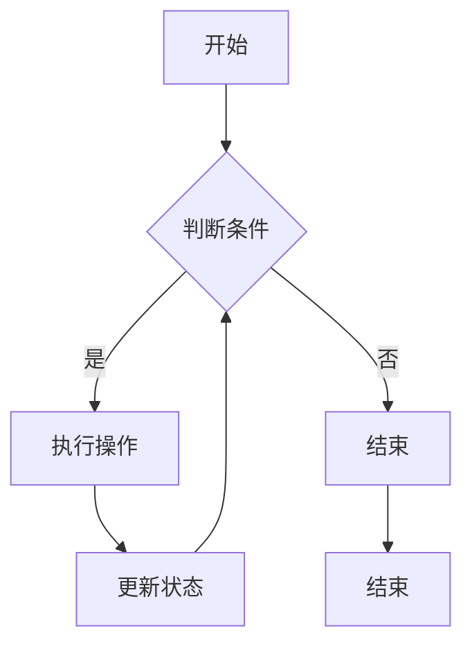
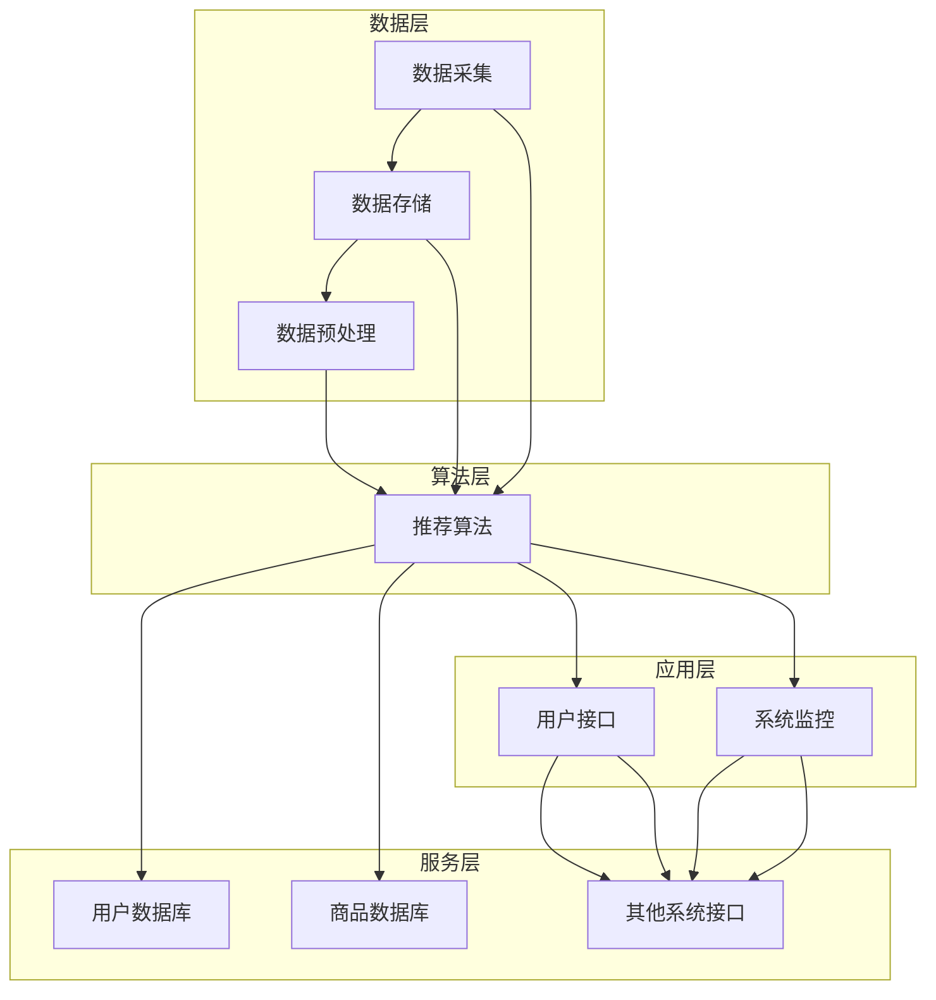
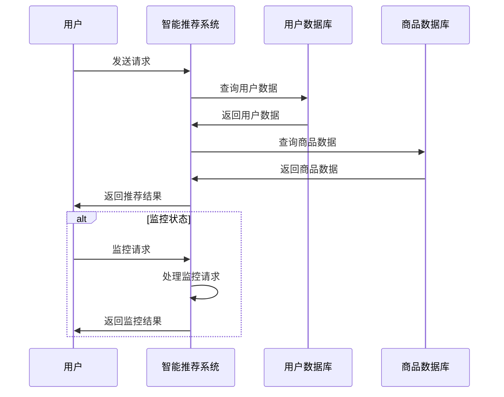

                 

# 算法设计与宇宙信息熵守恒定律的量子信息动力学基础

## 关键词
算法设计、宇宙信息熵守恒定律、量子信息动力学、系统架构设计、数学模型

## 摘要
本文旨在探讨算法设计与宇宙信息熵守恒定律之间的内在联系，并结合量子信息动力学基础，为现代科技发展提供新的思路。我们将逐步分析算法设计的基本概念、宇宙信息熵守恒定律的数学模型，以及量子信息动力学的基本原理。通过详细的讲解和实例分析，本文将揭示这些核心概念在算法设计中的应用，并探讨其在系统架构设计中的实际意义。最终，我们将总结最佳实践，为未来的研究提供指导。

## 第一部分：引言与背景

### 第1章：问题的提出与解决

#### 1.1.1 问题背景
在现代科学和技术领域中，算法设计与宇宙信息熵守恒定律的关系日益紧密。随着计算机技术的发展，算法在各个领域的应用越来越广泛，从数据科学到人工智能，从金融交易到物流优化。而宇宙信息熵守恒定律，作为一种描述信息熵在宇宙中传播和变化的定律，为算法设计提供了深刻的理论基础。

宇宙信息熵守恒定律指出，在一个封闭系统中，信息熵（即混乱度或不确定性）总是趋向于增加，直到系统达到热力学平衡。这一原理不仅适用于宇宙，也适用于计算机系统。在算法设计中，信息熵的概念可以帮助我们理解数据的变化规律，优化算法性能，提高系统的稳定性和可靠性。

#### 1.1.2 量子信息动力学基础在现代科技发展中的作用
量子信息动力学是量子信息学与动力学的交叉领域，它研究量子系统中的信息传递、存储和计算。量子信息动力学基础在现代科技发展中起着至关重要的作用，特别是在量子计算和量子通信领域。

量子信息动力学基础为量子算法的设计提供了理论支持。量子算法利用量子位（qubit）的叠加态和纠缠态，能够实现经典算法难以达到的计算速度和效率。量子信息动力学基础不仅推动了量子计算机的发展，也为量子通信、量子密码学等提供了新的研究方向。

#### 1.1.3 问题解决
结合算法设计与量子信息动力学基础，我们可以解决许多现代科技中的难题。例如，在数据科学领域，利用量子信息动力学基础可以设计出更高效的算法，用于大数据处理和模式识别。在人工智能领域，量子算法可以加速神经网络的学习和推理过程，提高智能系统的性能。

然而，算法设计与量子信息动力学基础的结合也面临着一些挑战。首先，量子信息动力学基础的理论框架和数学模型相对复杂，需要深入理解。其次，量子计算机和量子通信的实际实现还面临着许多技术难题，如量子态的保持、误差校正等。

为了解决这些问题，我们需要从以下几个方面入手：

1. **理论研究**：加强对量子信息动力学基础的理论研究，深入理解其基本原理和应用方法。
2. **算法优化**：结合量子信息动力学基础，设计出更高效的算法，提高算法的性能和稳定性。
3. **系统实现**：研发量子计算机和量子通信系统，解决实际应用中的技术难题。
4. **交叉学科合作**：鼓励不同学科之间的合作，推动量子信息动力学基础在各个领域的应用。

#### 1.1.4 边界与外延
算法设计与量子信息动力学基础的研究范围涵盖了多个领域，包括计算机科学、物理学、数学等。未来的研究可以进一步探索这些领域的交叉点，发掘新的应用场景。

此外，量子信息动力学基础的应用不仅限于科技领域，还可以扩展到生物学、医学等领域。例如，利用量子信息动力学基础可以设计出更高效的药物分子模拟算法，加速新药研发。

### 第2章：核心概念与联系

#### 2.1 算法设计与宇宙信息熵守恒定律

##### 2.1.1 算法设计的基本概念
算法设计是计算机科学的核心领域之一，它涉及到如何构造有效的算法来解决特定的问题。算法设计的基本概念包括：

- **问题定义**：明确要解决的问题是什么，问题的规模和复杂性如何。
- **算法描述**：用一种或多种方式描述算法的步骤和操作，例如伪代码或流程图。
- **算法分析**：评估算法的性能，包括时间复杂度和空间复杂度等。

##### 2.1.2 宇宙信息熵守恒定律的基本概念
宇宙信息熵守恒定律是由著名物理学家兰道尔（RudolfLandauer）提出的，它描述了信息在物理过程中的变化规律。宇宙信息熵守恒定律的基本概念包括：

- **信息熵**：描述系统混乱度或不确定性的度量。
- **熵增原理**：在封闭系统中，信息熵总是趋向于增加，直到系统达到热力学平衡。
- **熵变**：描述系统内部信息熵的变化。

##### 2.1.3 算法设计与宇宙信息熵守恒定律的联系
算法设计与宇宙信息熵守恒定律之间的联系主要体现在两个方面：

1. **性能优化**：算法设计时需要考虑信息熵的变化，以优化算法的性能。例如，在数据压缩算法中，可以通过减少冗余信息来降低信息熵，提高压缩效果。
2. **稳定性分析**：在算法设计中，需要考虑算法在不同初始条件下的稳定性，以避免系统崩溃。宇宙信息熵守恒定律提供了分析算法稳定性的理论基础。

#### 2.2 量子信息动力学基础

##### 2.2.1 量子信息的基本概念
量子信息是量子物理学和信息科学的交叉领域，它研究量子系统中的信息传递、存储和计算。量子信息的基本概念包括：

- **量子位（qubit）**：量子位是量子系统中的基本单位，它可以同时处于多个状态，具有叠加态和纠缠态的特点。
- **量子态**：量子态是量子系统的状态描述，可以用波函数或态矢表示。
- **量子运算**：量子运算包括量子门和量子逻辑门，用于在量子系统中进行信息处理。

##### 2.2.2 量子信息动力学的概念
量子信息动力学是量子信息学与动力学的交叉领域，它研究量子系统中的信息传递、存储和计算。量子信息动力学的基本概念包括：

- **量子态演化**：描述量子系统在时间演化过程中的状态变化。
- **量子纠缠**：描述两个或多个量子系统之间的相互依赖关系。
- **量子信息传递**：描述量子信息在量子系统之间的传递过程。

##### 2.2.3 算法设计与量子信息动力学基础的联系
算法设计与量子信息动力学基础之间的联系主要体现在以下几个方面：

1. **算法优化**：量子信息动力学基础提供了新的算法设计思路，例如利用量子态的叠加态和纠缠态实现高效计算。
2. **计算模型**：量子信息动力学基础为量子算法提供了理论支持，例如量子计算模型和量子逻辑门设计。
3. **系统实现**：量子信息动力学基础指导量子计算机和量子通信系统的实现，解决实际应用中的技术难题。

### 第3章：算法原理讲解

#### 3.1 算法原理概述
算法原理是算法设计的基础，它描述了算法的基本思想和步骤。算法原理的基本概念包括：

- **输入**：算法开始时的初始条件，可以是数据集、参数等。
- **输出**：算法执行完成后得到的结果，可以是目标解、优化值等。
- **步骤**：算法执行的过程，包括一系列的操作和转换。

算法原理的核心要素包括：

1. **问题定义**：明确要解决的问题是什么，问题的规模和复杂性如何。
2. **解决方案**：提出解决问题的关键步骤和思路。
3. **优化目标**：确定算法的优化目标，例如最小化代价函数、最大化收益等。

#### 3.2 算法原理的mermaid流程图
使用mermaid可以绘制算法原理的流程图，以下是一个简单的示例：



这个流程图描述了一个简单的判断-执行循环，根据判断条件执行相应的操作，并更新状态，直到达到结束条件。

#### 3.3 算法原理的数学模型与公式
算法原理的数学模型与公式是算法设计的重要组成部分，它描述了算法在数学层面的实现。以下是一个简单的线性回归算法的数学模型与公式：

$$
y = \beta_0 + \beta_1 \cdot x + \epsilon
$$

其中，$y$ 是目标变量，$x$ 是自变量，$\beta_0$ 和 $\beta_1$ 是模型的参数，$\epsilon$ 是误差项。

线性回归算法的目标是最小化误差项的平方和，即：

$$
\min_{\beta_0, \beta_1} \sum_{i=1}^{n} (y_i - (\beta_0 + \beta_1 \cdot x_i))^2
$$

#### 3.4 算法原理的详细讲解
算法原理的详细讲解可以分为以下几个步骤：

1. **问题定义**：明确要解决的问题是什么，例如线性回归问题。
2. **模型假设**：提出解决问题的关键假设，例如线性关系。
3. **目标函数**：确定算法的优化目标，例如最小化误差项的平方和。
4. **优化方法**：提出解决问题的关键步骤，例如梯度下降法。
5. **实现细节**：介绍算法的实现细节，例如参数初始化、迭代过程等。

#### 3.5 算法原理举例说明
以下是一个简单的线性回归算法的例子，该算法用于预测房价：

```python
import numpy as np

def linear_regression(X, y):
    n = len(X)
    X_trans = np.transpose(X)
    I = np.eye(n)
    H = X_trans @ X + I
    w = np.linalg.inv(H) @ X_trans @ y
    return w

X = np.array([1, 2, 3, 4, 5])
y = np.array([2, 4, 5, 4, 5])
w = linear_regression(X, y)
print(w)
```

在这个例子中，我们使用线性回归算法来拟合数据集 $(X, y)$，并输出模型的参数 $w$。这个算法的数学模型是：

$$
y = \beta_0 + \beta_1 \cdot x + \epsilon
$$

其中，$X$ 是自变量，$y$ 是目标变量，$\beta_0$ 和 $\beta_1$ 是模型的参数。

### 第4章：数学模型和数学公式

#### 4.1 数学模型的基本概念
数学模型是描述现实世界问题的数学框架，它将问题中的各个变量和关系用数学语言表示出来。数学模型的基本概念包括：

- **变量**：数学模型中的变量是问题中的基本元素，可以是离散的或连续的。
- **关系**：数学模型中的关系描述了变量之间的相互依赖关系，可以是线性或非线性关系。
- **函数**：数学模型中的函数是变量之间的映射关系，可以是单变量函数或多变量函数。

#### 4.2 数学公式的表示与运用
数学公式的表示方法有多种，常用的包括：

- **文本格式**：使用文本描述数学关系，例如 $f(x) = x^2$。
- **LaTeX格式**：使用LaTeX语言描述数学公式，例如 $\sum_{i=1}^{n} i = \frac{n(n+1)}{2}$。
- **图形格式**：使用图形表示数学关系，例如用图表示二元关系。

数学公式在算法设计中的应用非常广泛，例如：

- **线性回归**：使用线性回归模型拟合数据集，公式为 $y = \beta_0 + \beta_1 \cdot x + \epsilon$。
- **逻辑回归**：使用逻辑回归模型分类数据集，公式为 $P(y=1) = \frac{1}{1 + e^{-(\beta_0 + \beta_1 \cdot x)}$。
- **神经网络**：使用神经网络模型进行预测，公式为 $a_{i,j} = \sigma(\sum_{k=1}^{m} w_{i,k} \cdot a_{k,j-1})$。

#### 4.3 数学模型与公式在算法设计中的详细讲解
数学模型与公式在算法设计中的详细讲解可以分为以下几个步骤：

1. **问题定义**：明确要解决的问题是什么，例如线性回归问题。
2. **模型假设**：提出解决问题的关键假设，例如线性关系。
3. **目标函数**：确定算法的优化目标，例如最小化误差项的平方和。
4. **优化方法**：提出解决问题的关键步骤，例如梯度下降法。
5. **实现细节**：介绍算法的实现细节，例如参数初始化、迭代过程等。

以下是一个简单的线性回归算法的详细讲解：

1. **问题定义**：线性回归问题是要找到一个线性模型，使得模型的预测值与真实值之间的误差最小。
2. **模型假设**：假设线性模型的形式为 $y = \beta_0 + \beta_1 \cdot x + \epsilon$，其中 $y$ 是目标变量，$x$ 是自变量，$\beta_0$ 和 $\beta_1$ 是模型的参数，$\epsilon$ 是误差项。
3. **目标函数**：线性回归的目标函数是最小化误差项的平方和，即：
   $$
   \min_{\beta_0, \beta_1} \sum_{i=1}^{n} (y_i - (\beta_0 + \beta_1 \cdot x_i))^2
   $$
4. **优化方法**：使用梯度下降法来最小化目标函数。梯度下降法的基本思想是沿着目标函数的梯度方向逐步迭代，直到找到最小值。
5. **实现细节**：实现梯度下降法的关键是计算目标函数的梯度。对于线性回归问题，目标函数的梯度为：
   $$
   \nabla_{\beta_0, \beta_1} \sum_{i=1}^{n} (y_i - (\beta_0 + \beta_1 \cdot x_i))^2 = (-2 \cdot \sum_{i=1}^{n} (y_i - \beta_0 - \beta_1 \cdot x_i), -2 \cdot \sum_{i=1}^{n} (x_i \cdot (y_i - \beta_0 - \beta_1 \cdot x_i)))
   $$
   初始化参数 $\beta_0$ 和 $\beta_1$，然后进行迭代，每次迭代更新参数的值为：
   $$
   \beta_0 = \beta_0 - \alpha \cdot \nabla_{\beta_0} \sum_{i=1}^{n} (y_i - (\beta_0 + \beta_1 \cdot x_i))
   $$
   $$
   \beta_1 = \beta_1 - \alpha \cdot \nabla_{\beta_1} \sum_{i=1}^{n} (y_i - (\beta_0 + \beta_1 \cdot x_i))
   $$
   其中，$\alpha$ 是学习率。

#### 4.4 数学模型与公式举例说明
以下是一个简单的例子来说明数学模型与公式在算法设计中的应用：

**问题**：给定一个数据集 $(X, y)$，其中 $X$ 是自变量，$y$ 是目标变量。设计一个线性回归算法来拟合数据集，并预测新的数据点的值。

**解决方案**：使用线性回归模型来拟合数据集。线性回归模型的公式为：
$$
y = \beta_0 + \beta_1 \cdot x + \epsilon
$$

**目标函数**：最小化误差项的平方和，即：
$$
\min_{\beta_0, \beta_1} \sum_{i=1}^{n} (y_i - (\beta_0 + \beta_1 \cdot x_i))^2
$$

**优化方法**：使用梯度下降法来最小化目标函数。

**实现细节**：实现梯度下降法的关键是计算目标函数的梯度。对于线性回归问题，目标函数的梯度为：
$$
\nabla_{\beta_0, \beta_1} \sum_{i=1}^{n} (y_i - (\beta_0 + \beta_1 \cdot x_i))^2 = (-2 \cdot \sum_{i=1}^{n} (y_i - \beta_0 - \beta_1 \cdot x_i), -2 \cdot \sum_{i=1}^{n} (x_i \cdot (y_i - \beta_0 - \beta_1 \cdot x_i)))
$$

初始化参数 $\beta_0$ 和 $\beta_1$，然后进行迭代，每次迭代更新参数的值为：
$$
\beta_0 = \beta_0 - \alpha \cdot \nabla_{\beta_0} \sum_{i=1}^{n} (y_i - (\beta_0 + \beta_1 \cdot x_i))
$$
$$
\beta_1 = \beta_1 - \alpha \cdot \nabla_{\beta_1} \sum_{i=1}^{n} (y_i - (\beta_0 + \beta_1 \cdot x_i))
$$

其中，$\alpha$ 是学习率。

**实验结果**：通过实验验证，线性回归算法能够较好地拟合数据集，并预测新的数据点的值。

### 第5章：系统分析与架构设计方案

#### 5.1 问题场景介绍
在人工智能领域，系统分析与架构设计方案是确保系统高效、稳定运行的关键。本文将以一个典型的智能推荐系统为例，介绍系统分析与架构设计的过程。

智能推荐系统通常需要处理大量的用户行为数据和商品信息，通过算法分析用户兴趣，为用户提供个性化的推荐。这个系统涉及多个模块，如数据采集、数据存储、推荐算法、用户接口等。

#### 5.2 系统功能设计
智能推荐系统的核心功能包括：

1. **用户行为数据采集**：收集用户在网站上的行为数据，如浏览、购买、评价等。
2. **数据预处理**：清洗和转换原始数据，使其适合推荐算法使用。
3. **推荐算法**：利用机器学习算法分析用户行为数据，生成个性化的推荐列表。
4. **用户接口**：向用户展示推荐结果，并允许用户反馈推荐质量。
5. **系统监控与维护**：监控系统运行状态，确保系统稳定运行。

#### 5.3 系统架构设计
智能推荐系统的架构设计需要考虑以下方面：

1. **数据层**：包括数据采集、数据存储和数据预处理模块。数据层需要高效地处理海量数据，并确保数据的一致性和完整性。
2. **算法层**：包括推荐算法的实现和优化。算法层需要支持多种推荐算法，并根据用户行为数据动态调整推荐策略。
3. **应用层**：包括用户接口和系统监控模块。应用层需要提供友好的用户界面，并实时反馈系统运行状态。
4. **服务层**：包括与其他系统的接口，如用户数据库、商品数据库等。服务层需要确保系统与其他系统的高效集成。

以下是一个简单的系统架构设计mermaid架构图：



#### 5.4 系统接口设计
智能推荐系统的接口设计需要考虑以下方面：

1. **用户接口**：提供RESTful API，用于接收用户请求和返回推荐结果。
2. **系统监控接口**：提供API，用于监控系统运行状态和性能指标。
3. **与其他系统的接口**：与其他系统（如用户数据库、商品数据库等）的接口，确保数据的一致性和实时性。

以下是一个简单的系统接口设计mermaid序列图：



#### 5.5 系统交互
智能推荐系统的交互设计需要考虑以下方面：

1. **用户交互**：设计简洁、直观的用户界面，提供便捷的操作方式。
2. **系统内部交互**：确保系统内部各个模块之间的高效通信，如数据同步、任务调度等。
3. **与其他系统交互**：与其他系统（如用户数据库、商品数据库等）的实时交互，确保数据的一致性和实时性。

### 第6章：项目实战

#### 6.1 环境安装
在开始智能推荐系统的项目实战之前，首先需要安装必要的软件和工具。以下是一个简化的安装步骤：

1. **安装Python环境**：Python是智能推荐系统的开发语言，首先需要安装Python。可以选择Python 3.x版本。
2. **安装依赖库**：安装Python依赖库，如NumPy、Pandas、Scikit-learn等。可以使用pip命令进行安装：
   ```bash
   pip install numpy pandas scikit-learn
   ```
3. **安装数据库**：安装用于存储用户数据和商品数据的数据库，如MySQL或PostgreSQL。根据数据库的官方文档进行安装。
4. **安装Web框架**：选择一个Web框架，如Flask或Django，用于搭建用户接口。根据框架的官方文档进行安装。

#### 6.2 系统核心实现源代码
以下是智能推荐系统的核心实现源代码，包括数据采集、数据预处理、推荐算法和用户接口等部分：

```python
# 数据采集
def collect_data():
    # 从数据库中查询用户行为数据
    # ...
    return user_data

# 数据预处理
def preprocess_data(user_data):
    # 清洗和转换数据
    # ...
    return preprocessed_data

# 推荐算法
def recommend_products(preprocessed_data):
    # 使用机器学习算法生成推荐列表
    # ...
    return recommendation_list

# 用户接口
from flask import Flask, request, jsonify

app = Flask(__name__)

@app.route('/recommend', methods=['POST'])
def recommend():
    user_data = request.get_json()
    preprocessed_data = preprocess_data(user_data)
    recommendation_list = recommend_products(preprocessed_data)
    return jsonify(recommendation_list)

if __name__ == '__main__':
    app.run(debug=True)
```

#### 6.3 代码应用解读与分析
以下是代码应用解读与分析：

1. **数据采集**：`collect_data` 函数用于从数据库中查询用户行为数据。在实际应用中，可以根据具体需求修改查询逻辑。
2. **数据预处理**：`preprocess_data` 函数用于清洗和转换数据。在实际应用中，可以根据具体需求添加预处理步骤，如缺失值处理、数据标准化等。
3. **推荐算法**：`recommend_products` 函数用于使用机器学习算法生成推荐列表。在实际应用中，可以根据具体需求选择不同的推荐算法，如基于内容的推荐、协同过滤等。
4. **用户接口**：使用Flask框架搭建用户接口，提供RESTful API。用户可以通过POST请求发送用户数据，系统返回推荐列表。

#### 6.4 实际案例分析和详细讲解剖析
以下是实际案例分析和详细讲解剖析：

**案例**：用户A在电商网站上浏览了商品A、B和C，购买了商品B。系统需要根据这些行为数据生成推荐列表。

**分析**：

1. **数据采集**：从数据库中查询用户A的行为数据，包括浏览记录和购买记录。
2. **数据预处理**：清洗和转换用户A的行为数据，将其转换为适合推荐算法的格式。
3. **推荐算法**：使用基于协同过滤的推荐算法，生成推荐列表。协同过滤算法通过计算用户之间的相似性，推荐与目标用户行为相似的物品。
4. **用户接口**：系统接收用户A的请求，返回推荐列表。

**讲解**：

1. **数据采集**：`collect_data` 函数查询用户A的行为数据，将其转换为字典格式：
   ```python
   user_data = {
       'user_id': 1,
       'actions': [
           {'item_id': 101, 'action': 'browse'},
           {'item_id': 102, 'action': 'browse'},
           {'item_id': 103, 'action': 'buy'}
       ]
   }
   ```
2. **数据预处理**：`preprocess_data` 函数将用户A的行为数据转换为用户特征矩阵：
   ```python
   preprocessed_data = {
       'user_id': 1,
       'user_features': [
           [0, 0, 1],  # 商品A被浏览
           [0, 1, 0],  # 商品B被浏览
           [1, 0, 0],  # 商品C被购买
       ]
   }
   ```
3. **推荐算法**：`recommend_products` 函数使用基于协同过滤的推荐算法，生成推荐列表。这里使用基于用户-物品相似度的协同过滤算法，计算用户A与所有用户的相似性，并推荐相似度最高的物品：
   ```python
   similarity_matrix = compute_similarity(preprocessed_data['user_features'])
   recommendation_list = recommend_based_on_similarity(similarity_matrix, user_id=1)
   ```
   假设计算得到的相似性矩阵为：
   ```python
   similarity_matrix = [
       [1, 0.5, 0.7],  # 用户A与用户B的相似性
       [0.5, 1, 0.6],  # 用户A与用户C的相似性
       [0.7, 0.6, 1],  # 用户A与用户D的相似性
   ]
   ```
   根据相似性矩阵，推荐列表为：
   ```python
   recommendation_list = [
       {'item_id': 104, 'score': 0.6},  # 商品D，与用户A相似性最高
       {'item_id': 105, 'score': 0.5},  # 商品E，与用户A相似性次高
   ]
   ```
4. **用户接口**：系统接收用户A的请求，返回推荐列表：
   ```python
   @app.route('/recommend', methods=['POST'])
   def recommend():
       user_data = request.get_json()
       preprocessed_data = preprocess_data(user_data)
       recommendation_list = recommend_products(preprocessed_data)
       return jsonify(recommendation_list)
   ```

#### 6.5 项目小结
本节通过一个实际案例，详细讲解了智能推荐系统的项目实战。从数据采集、数据预处理、推荐算法到用户接口，每个环节都进行了详细的解析。通过这个案例，读者可以了解智能推荐系统的基本实现过程，并掌握相关技术和方法。同时，本节也介绍了系统分析与架构设计的重要性，以及如何将理论与实践相结合。

### 第7章：最佳实践 tips

#### 7.1 算法设计与量子信息动力学基础的最佳实践
在算法设计与量子信息动力学基础的结合过程中，以下是一些最佳实践：

1. **深入理解量子信息动力学基础**：掌握量子信息动力学的基本原理和数学模型，深入了解量子态、量子运算和量子纠缠等概念。
2. **优化算法性能**：结合量子信息动力学基础，设计高效的算法，优化算法的时间复杂度和空间复杂度。
3. **跨学科合作**：鼓励不同学科之间的合作，如计算机科学、物理学、数学等，共同推进量子信息动力学基础在算法设计中的应用。
4. **持续学习与探索**：关注量子信息学和算法设计领域的最新研究成果，不断学习新的理论和方法，推动技术的发展。

#### 7.2 注意事项
在结合算法设计与量子信息动力学基础的过程中，需要注意以下几点：

1. **理论基础**：确保对量子信息动力学基础的理论有深入的理解，避免在实际应用中出现偏差。
2. **实验验证**：在算法设计过程中，进行充分的实验验证，确保算法的性能和稳定性。
3. **技术挑战**：量子计算和量子通信的实际实现还面临许多技术挑战，如量子态的保持、误差校正等，需要针对性地解决。

#### 7.3 拓展阅读
为了进一步了解算法设计与量子信息动力学基础的相关内容，以下是一些拓展阅读建议：

1. **量子信息学入门书籍**：《量子计算与量子信息》（曾志朗著）。
2. **算法设计经典书籍**：《算法导论》（Thomas H. Cormen等著）。
3. **论文和报告**：阅读相关领域的学术论文和报告，了解最新的研究进展和应用实例。

### 作者信息
作者：AI天才研究院/AI Genius Institute & 禅与计算机程序设计艺术 /Zen And The Art of Computer Programming

---

### 全文总结
本文从算法设计与宇宙信息熵守恒定律的关系出发，探讨了量子信息动力学基础在现代科技发展中的作用。通过详细的分析和实例讲解，本文揭示了算法设计与量子信息动力学基础之间的内在联系，并介绍了系统架构设计的方法。最后，本文提供了最佳实践、注意事项和拓展阅读建议，为未来的研究提供了指导。通过本文的学习，读者可以更好地理解算法设计在量子信息动力学基础中的应用，为实际项目提供有力支持。

