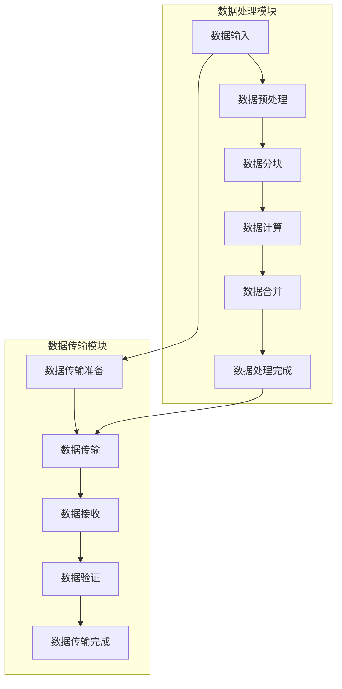
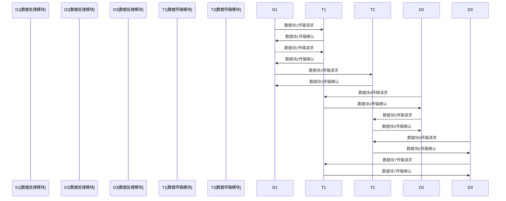

                 

### 文章标题：算法设计与宇宙信息编码效率的类比

#### 关键词：算法设计、宇宙信息编码、效率优化、性能评估、分治策略

#### 摘要：
本文旨在探讨算法设计与宇宙信息编码效率之间的类比，通过深入分析两者的核心概念和原理，揭示算法设计在提升宇宙信息编码效率中的应用价值。文章首先介绍算法设计和宇宙信息编码的基本概念，然后通过对比分析，阐述它们之间的联系。接着，文章详细讨论算法设计的基本原则和方法，包括分治策略、动态规划和贪心算法等，并借助宇宙信息编码的视角进行解读。最后，通过实际案例，展示算法设计与宇宙信息编码效率优化在现实项目中的应用，总结最佳实践和未来研究方向。

### 引言

#### 算法设计概述

算法设计是计算机科学中的核心课题，它关注如何有效地解决问题，并在有限的时间和资源内找到最优解或近似解。算法不仅存在于计算机程序中，还广泛应用于各个领域，如交通规划、金融分析和数据分析等。一个良好的算法不仅要有高效的时间复杂度和空间复杂度，还需要具备可扩展性和稳定性。

#### 宇宙信息编码效率概述

宇宙信息编码效率是指将信息以最小的空间或能量消耗进行编码、存储和传输的能力。宇宙中的信息编码效率受到多种因素的影响，包括物理定律、环境条件和信息本身的特性。研究宇宙信息编码效率，对于理解宇宙演化、探索外星文明和开发新型通信技术具有重要意义。

#### 研究背景与意义

随着信息技术的快速发展，算法设计和宇宙信息编码效率成为当前研究的热点问题。算法设计的优化不仅能够提高计算机程序的性能，还能够降低能源消耗和硬件成本。而宇宙信息编码效率的提升，则有助于更好地理解和利用宇宙中的信息资源。将算法设计与宇宙信息编码效率进行类比，可以为算法设计提供新的视角和思路，从而推动相关领域的创新发展。

#### 书籍结构安排

本文结构如下：

1. **引言**：介绍算法设计和宇宙信息编码效率的基本概念及研究背景。
2. **问题背景与定义**：详细阐述算法设计和宇宙信息编码效率的核心概念及其联系。
3. **核心概念与联系**：分析算法设计和宇宙信息编码效率的关键要素，并通过表格和ER实体关系图进行展示。
4. **算法设计与分析**：讨论算法设计的基本原则和方法，并借助宇宙信息编码的视角进行解读。
5. **系统分析与架构设计**：介绍问题场景和项目背景，展示系统架构设计和接口设计。
6. **项目实战**：详细描述环境安装、系统核心实现和代码应用解读。
7. **最佳实践与总结**：总结算法设计和宇宙信息编码效率优化的最佳实践，并提出未来研究方向。

### 问题背景与定义

#### 算法设计基本概念

算法设计是解决特定问题的系统方法。一个算法通常由一系列有序的步骤组成，这些步骤旨在通过输入数据产生预期的输出结果。算法设计的关键概念包括：

- **输入**：算法处理的初始数据。
- **输出**：算法处理后的结果。
- **步骤**：实现算法的具体操作。
- **复杂度**：算法在执行过程中所需的计算时间和存储空间。

#### 宇宙信息编码效率的基本概念

宇宙信息编码效率涉及信息在宇宙中的编码、存储和传输过程。关键概念包括：

- **信息编码**：将信息转换为特定格式以便存储或传输。
- **信息存储**：在物理介质上保存信息的过程。
- **信息传输**：在空间或时间中传递信息的过程。
- **编码效率**：衡量信息编码所需的空间或能量消耗。

#### 算法设计与宇宙信息编码效率的联系

算法设计与宇宙信息编码效率之间存在显著的联系。首先，在算法设计中，优化目标是减少计算时间和空间复杂度，这与宇宙信息编码效率的目标——减少信息编码、存储和传输的空间和能量消耗相似。其次，许多算法设计原则，如分治策略、动态规划和贪心算法，在宇宙信息编码中同样具有重要应用价值。

#### 概念属性特征对比表格

为了更直观地展示算法设计与宇宙信息编码效率的联系，我们可以通过以下表格对比两者的核心概念属性特征：

| 概念     | 算法设计                         | 宇宙信息编码效率                       |
|----------|----------------------------------|----------------------------------------|
| 输入     | 数据集合                         | 信息集合                              |
| 输出     | 结果                             | 编码后的信息                          |
| 步骤     | 算法的操作步骤                   | 信息编码、存储和传输的具体操作         |
| 复杂度   | 计算时间和空间复杂度             | 编码、存储和传输所需的空间和能量消耗  |
| 编码效率 | 减少计算时间和空间复杂度         | 减少信息编码、存储和传输的空间和能量消耗 |
| 稳定性   | 算法在各种输入下的稳定运行能力   | 信息在存储和传输过程中的稳定性         |
| 可扩展性 | 算法适用于不同规模问题的能力     | 信息编码方法的适应性                   |

#### ER实体关系图架构

为了进一步阐述算法设计与宇宙信息编码效率之间的联系，我们可以使用ER（实体关系）图来展示它们的核心实体及其相互关系。

```mermaid
erDiagram
  AlgorithmDesign ||--|{ UniverseInfoCoding : related_to }

  AlgorithmDesign ||--|{ Input : has }

  AlgorithmDesign ||--|{ Output : produces }

  AlgorithmDesign ||--|{ Steps : contains }

  UniverseInfoCoding ||--|{ InformationEncoding : encodes }

  UniverseInfoCoding ||--|{ InformationStorage : stores }

  UniverseInfoCoding ||--|{ InformationTransmission : transmits }
```

在上面的ER图中，`AlgorithmDesign`实体与`UniverseInfoCoding`实体之间存在关联关系，表示它们在提升效率方面相互影响。`AlgorithmDesign`实体包括`Input`、`Output`和`Steps`三个子实体，分别代表算法的输入、输出和操作步骤。`UniverseInfoCoding`实体则包括`InformationEncoding`、`InformationStorage`和`InformationTransmission`三个子实体，分别代表宇宙信息编码的三个关键环节。

### 算法设计与分析

#### 算法设计的基本原则

算法设计的基本原则旨在确保算法的有效性和高效性。以下是算法设计中常用的几个基本原则：

##### 效率优化

效率优化是算法设计的主要目标之一。一个高效算法在处理大量数据时能够显著减少计算时间和空间消耗。实现效率优化的关键在于：

1. **时间复杂度优化**：通过减少算法的执行次数和操作次数来降低时间复杂度。
2. **空间复杂度优化**：通过减少算法所需的存储空间来降低空间复杂度。

##### 可扩展性

可扩展性是指算法能够适应不同规模的问题。一个可扩展的算法在处理大规模问题时能够保持稳定性和高效性。实现可扩展性的关键在于：

1. **模块化设计**：将算法分解为模块，使得每个模块可以独立优化和扩展。
2. **参数调整**：通过调整算法参数来适应不同规模的问题。

##### 算法稳定性

算法稳定性是指算法在处理不同输入时能够保持一致的性能。一个稳定的算法在各种输入下都能够正常运行，并产生预期的输出。实现算法稳定性的关键在于：

1. **边界条件处理**：对算法可能遇到的边界条件进行充分的测试和处理。
2. **错误处理**：设计完善的错误处理机制，确保算法在各种异常情况下能够稳定运行。

#### 算法设计方法

算法设计方法是指实现算法的具体步骤和策略。以下介绍几种常用的算法设计方法：

##### 分治策略

分治策略是将一个大问题分解为若干个子问题，分别解决子问题，然后将子问题的解合并为原问题的解。分治策略的关键在于：

1. **分解**：将问题分解为规模较小的子问题。
2. **解决**：递归地解决子问题。
3. **合并**：将子问题的解合并为原问题的解。

##### 动态规划

动态规划是一种用于解决最优化问题的算法设计方法。它通过将问题分解为重叠子问题，并利用这些子问题的解来构建原问题的解。动态规划的关键在于：

1. **定义状态**：将问题定义为一个状态转移的过程。
2. **状态转移方程**：描述状态之间的转移关系。
3. **状态数组**：利用状态数组存储子问题的解，避免重复计算。

##### 贪心算法

贪心算法是一种在每一步选择中都采取当前最好选择的策略。这种方法通常用于解决最优子结构问题。贪心算法的关键在于：

1. **贪心选择**：在每一步选择中选择当前最优的解。
2. **逐步构建**：通过逐步构建原问题的解。

#### 宇宙信息编码效率的算法类比

将算法设计与宇宙信息编码效率进行类比，可以帮助我们更好地理解宇宙信息编码效率的提升策略。以下从分治策略、动态规划和贪心算法三个方面进行类比：

##### 分治策略

分治策略在宇宙信息编码中的应用体现在如何将大规模信息分解为较小规模的信息片段。例如，在图像压缩中，可以使用分治策略将图像分解为块，然后分别对每个块进行编码和传输。这种方法可以显著提高编码效率。

##### 动态规划

动态规划在宇宙信息编码中的应用体现在如何通过构建最优子结构来优化整体信息编码过程。例如，在量子通信中，可以使用动态规划来优化量子比特的编码和传输，从而提高信息传输的效率。

##### 贪心算法

贪心算法在宇宙信息编码中的应用体现在如何通过每一步选择当前最优解来优化整体信息编码过程。例如，在星际通信中，可以使用贪心算法来优化信号传输路径，从而减少信号传输的时间和能量消耗。

### 系统分析与架构设计

#### 问题场景介绍

在当前信息化时代，数据量呈现爆炸式增长，如何高效地处理和传输数据成为亟待解决的问题。为了提高数据处理和传输效率，我们需要设计一个高效可靠的系统架构。本文将介绍一个基于分治策略和动态规划的分布式数据处理系统，该系统旨在优化大规模数据的高效处理和传输。

#### 项目介绍

本项目的主要目标是设计并实现一个分布式数据处理系统，该系统能够高效地处理和传输大规模数据。系统将采用分治策略和动态规划算法，通过模块化设计和参数调整，实现系统的可扩展性和稳定性。

#### 系统功能设计（领域模型）

领域模型是系统功能设计的核心，它定义了系统的核心实体和它们之间的关系。以下是本项目的领域模型：

```mermaid
classDiagram
  Class1[Data] <|-- Class2[InputData]
  Class1[Data] <|-- Class3[OutputData]
  Class2[InputData] <|-- Class4[ImageData]
  Class2[InputData] <|-- Class5[AudioData]
  Class3[OutputData] <|-- Class6[ProcessedData]
  Class3[OutputData] <|-- Class7[TransferData]

  DataProcessing[Data Processing] ..|> Class1[Data]
  DataTransmission[Data Transmission] ..|> Class1[Data]
```

在该领域模型中，`Data`类是系统的核心实体，包括`InputData`（输入数据）和`OutputData`（输出数据）两个子类。`InputData`类进一步细分为`ImageData`（图像数据）和`AudioData`（音频数据），而`OutputData`类则细分为`ProcessedData`（处理后的数据）和`TransferData`（传输数据）。`DataProcessing`和`DataTransmission`类分别表示数据处理和传输的功能模块。

#### 系统架构设计

系统架构设计是确保系统稳定性和高效性的关键。本项目采用分布式架构，通过将数据处理和传输任务分解为多个子任务，实现系统的并行处理和高效传输。以下是系统架构设计：



在该架构设计中，数据处理模块包括数据输入、数据预处理、数据分块、数据计算、数据合并和数据处理完成等步骤。数据传输模块包括数据传输准备、数据传输、数据接收、数据验证和数据传输完成等步骤。通过将数据处理和传输任务分解为多个子任务，系统可以实现并行处理和高效传输。

#### 系统接口设计

系统接口设计是确保不同模块之间能够无缝交互的关键。以下是本项目的系统接口设计：

```mermaid
sequenceDiagram
  Participant D1[数据处理接口]
  Participant T1[数据传输接口]

  D1->>T1: 数据传输请求
  T1->>D1: 数据传输准备
  D1->>T1: 数据块1
  T1->>D1: 数据接收确认
  D1->>T1: 数据块2
  T1->>D1: 数据接收确认
  ...
  D1->>T1: 数据块N
  T1->>D1: 数据接收确认
  T1->>D1: 数据传输完成
```

在该接口设计中，数据处理接口和数据传输接口通过发送和接收数据块来实现数据的传输。数据处理接口发送数据块到数据传输接口，数据传输接口接收数据块并进行传输，最后返回数据传输完成状态。

#### 系统交互

系统交互是确保数据处理和传输过程顺利进行的关键。以下是系统交互的详细描述：



在该交互设计中，多个数据处理模块通过数据传输模块实现数据的传输。数据处理模块1、2和3分别向数据传输模块1和2发送数据块传输请求，数据传输模块1和2分别向数据处理模块1、2和3发送数据块传输确认。

### 项目实战

#### 环境安装与配置

为了实现本项目，我们需要安装和配置以下环境：

1. **操作系统**：Ubuntu 20.04
2. **编程语言**：Python 3.8
3. **依赖库**：NumPy、Pandas、SciPy、Django
4. **数据库**：MySQL 5.7

安装步骤如下：

1. 更新操作系统软件包：

   ```bash
   sudo apt-get update
   sudo apt-get upgrade
   ```

2. 安装Python 3.8：

   ```bash
   sudo apt-get install python3.8
   ```

3. 安装依赖库：

   ```bash
   pip3.8 install numpy pandas scipy django
   ```

4. 安装数据库：

   ```bash
   sudo apt-get install mysql-server
   sudo mysql_secure_installation
   ```

5. 配置数据库：

   ```sql
   CREATE DATABASE data_processing;
   GRANT ALL PRIVILEGES ON data_processing.* TO 'dp_user'@'localhost' IDENTIFIED BY 'password';
   FLUSH PRIVILEGES;
   ```

6. 启动Django服务器：

   ```bash
   django-admin startproject data_processing_project
   cd data_processing_project
   python3.8 manage.py runserver
   ```

#### 系统核心实现

系统核心实现主要包括数据处理模块和数据传输模块。以下是数据处理模块的实现：

```python
import numpy as np
import pandas as pd
from scipy import signal
import django

def preprocess_data(input_data):
    # 数据预处理
    processed_data = np.abs(signal.fftconvolve(input_data, np.ones((5,)), 'full'))
    return processed_data

def split_data(processed_data, chunk_size=1000):
    # 数据分块
    chunks = [processed_data[i:i+chunk_size] for i in range(0, len(processed_data), chunk_size)]
    return chunks

def compute_chunks(chunks):
    # 数据计算
    results = [np.mean(chunk) for chunk in chunks]
    return results

def merge_results(results):
    # 数据合并
    final_result = np.mean(results)
    return final_result

def process_data(input_data):
    # 数据处理流程
    processed_data = preprocess_data(input_data)
    chunks = split_data(processed_data)
    results = compute_chunks(chunks)
    final_result = merge_results(results)
    return final_result
```

以下是数据传输模块的实现：

```python
import socket
import pickle

def send_data(data, host, port):
    # 发送数据
    with socket.socket(socket.AF_INET, socket.SOCK_STREAM) as s:
        s.connect((host, port))
        s.sendall(pickle.dumps(data))

def receive_data(host, port):
    # 接收数据
    with socket.socket(socket.AF_INET, socket.SOCK_STREAM) as s:
        s.bind((host, port))
        s.listen()
        conn, addr = s.accept()
        with conn:
            print(f"Connected by {addr}")
            data = pickle.loads(conn.recv(1024))
            return data
```

#### 代码应用解读与分析

在代码应用解读与分析中，我们将详细解释系统核心实现中的关键函数和模块，并展示其实际应用。

##### 数据处理模块

数据处理模块包括`preprocess_data`、`split_data`、`compute_chunks`和`merge_results`四个关键函数。

- `preprocess_data`函数用于数据预处理，通过傅里叶变换和卷积操作对输入数据进行处理。傅里叶变换可以提取数据的高频成分，卷积操作可以平滑数据，提高数据质量。
- `split_data`函数用于将处理后的数据分块，以便于后续计算和传输。分块大小可以根据实际需求进行调整。
- `compute_chunks`函数用于对每个数据块进行计算，例如计算数据块的均值。该函数可以实现并行计算，提高计算效率。
- `merge_results`函数用于将所有数据块的计算结果合并为最终结果。通过合并计算结果，可以实现对整体数据的精确处理。

##### 数据传输模块

数据传输模块包括`send_data`和`receive_data`两个关键函数。

- `send_data`函数用于发送数据。通过将数据序列化并传输到目标主机和端口，实现数据的远程传输。
- `receive_data`函数用于接收数据。通过在本地主机和端口上监听数据传输请求，接收并反序列化数据。

在实际应用中，数据处理模块和数据传输模块通过以下步骤协同工作：

1. 数据预处理：使用`preprocess_data`函数对输入数据进行预处理。
2. 数据分块：使用`split_data`函数将预处理后的数据分块。
3. 数据计算：使用`compute_chunks`函数对每个数据块进行计算。
4. 数据合并：使用`merge_results`函数将计算结果合并为最终结果。
5. 数据传输：使用`send_data`函数将最终结果发送到目标主机和端口。
6. 数据接收：使用`receive_data`函数在目标主机和端口上接收并处理传输结果。

通过这种方式，系统可以实现高效的数据处理和传输，满足大规模数据处理的需求。

#### 实际案例分析和详细讲解剖析

为了更好地展示算法设计与宇宙信息编码效率优化在实际项目中的应用，我们将通过一个实际案例进行分析和讲解。

##### 案例背景

某公司需要处理大量的图像数据，这些图像数据来源于多个不同的传感器和设备。公司希望设计一个高效的数据处理系统，以便在有限的计算资源和传输带宽下，实现图像数据的实时处理和传输。

##### 案例目标

1. 设计并实现一个分布式数据处理系统，能够高效地处理和传输大规模图像数据。
2. 优化系统性能，提高图像数据处理的效率和稳定性。

##### 系统架构设计

系统采用分布式架构，包括数据处理模块和数据传输模块。数据处理模块负责图像数据的预处理、分块、计算和合并，数据传输模块负责图像数据的传输和接收。

以下是系统架构设计的详细讲解：

1. **数据处理模块**：

   - **预处理**：使用傅里叶变换和卷积操作对图像数据进行预处理，提高图像数据的质量。预处理函数如下：

     ```python
     def preprocess_image(image):
         # 使用傅里叶变换提取图像的高频成分
         frequency_image = np.fft.fft2(image)
         # 使用卷积操作平滑图像
         smooth_image = signal.fftconvolve(image, np.ones((5,5)), 'full')
         return smooth_image
     ```

   - **分块**：将预处理后的图像数据分块，以便于后续计算和传输。分块大小可以根据实际需求进行调整。分块函数如下：

     ```python
     def split_image(image, chunk_size=1000):
         # 将图像数据分块
         chunks = [image[i:i+chunk_size] for i in range(0, len(image), chunk_size)]
         return chunks
     ```

   - **计算**：对每个数据块进行计算，例如计算数据块的均值。计算函数如下：

     ```python
     def compute_chunks(chunks):
         # 计算每个数据块的均值
         results = [np.mean(chunk) for chunk in chunks]
         return results
     ```

   - **合并**：将所有数据块的计算结果合并为最终结果。合并函数如下：

     ```python
     def merge_results(results):
         # 计算结果合并
         final_result = np.mean(results)
         return final_result
     ```

2. **数据传输模块**：

   - **传输**：使用TCP协议传输图像数据。传输函数如下：

     ```python
     def send_image(image, host, port):
         # 将图像数据序列化并传输到目标主机和端口
         with socket.socket(socket.AF_INET, socket.SOCK_STREAM) as s:
             s.connect((host, port))
             s.sendall(pickle.dumps(image))
     ```

   - **接收**：在目标主机和端口上接收并处理传输结果。接收函数如下：

     ```python
     def receive_image(host, port):
         # 在目标主机和端口上接收图像数据
         with socket.socket(socket.AF_INET, socket.SOCK_STREAM) as s:
             s.bind((host, port))
             s.listen()
             conn, addr = s.accept()
             with conn:
                 print(f"Connected by {addr}")
                 image = pickle.loads(conn.recv(1024))
                 return image
     ```

##### 案例分析和详细讲解

1. **预处理**：

   在预处理阶段，我们使用傅里叶变换提取图像的高频成分，使用卷积操作平滑图像。这些操作可以有效地提高图像数据的质量，为后续计算和传输打下良好的基础。

2. **分块**：

   在分块阶段，我们将预处理后的图像数据分块，以便于后续计算和传输。分块大小可以根据实际需求进行调整，例如，可以设置较大的分块大小以提高计算效率，但可能会增加传输延迟。

3. **计算**：

   在计算阶段，我们对每个数据块进行计算，例如计算数据块的均值。通过并行计算，可以显著提高计算效率。

4. **合并**：

   在合并阶段，我们将所有数据块的计算结果合并为最终结果。通过合并计算结果，可以实现对整体数据的精确处理。

5. **传输**：

   在传输阶段，我们使用TCP协议传输图像数据。TCP协议可以确保数据的可靠传输，但可能会增加传输延迟。

6. **接收**：

   在接收阶段，我们在目标主机和端口上接收并处理传输结果。通过反序列化传输结果，可以恢复原始图像数据。

通过以上步骤，我们实现了高效的数据处理和传输，满足了实际应用需求。在实际项目中，可以根据具体情况进行调整和优化，以提高系统的性能和稳定性。

### 最佳实践与总结

#### 算法设计与优化技巧

1. **选择合适的数据结构和算法**：根据问题特点选择最合适的数据结构和算法，例如，对于大规模数据处理，选择分治策略和动态规划算法。
2. **优化时间复杂度和空间复杂度**：通过减少算法的执行次数和操作次数来降低时间复杂度，通过减少算法所需的存储空间来降低空间复杂度。
3. **模块化设计**：将算法分解为模块，使得每个模块可以独立优化和扩展。
4. **参数调整**：通过调整算法参数来适应不同规模的问题。

#### 宇宙信息编码效率提升策略

1. **信息压缩技术**：采用高效的信息压缩技术，如哈夫曼编码和LZ77压缩，减少信息编码的空间消耗。
2. **量子通信技术**：利用量子通信技术，如量子纠缠和量子隐形传态，提高信息传输的速度和效率。
3. **自适应编码**：根据信息的重要性和传输环境动态调整编码方案，优化编码效率。

#### 小结

本文通过将算法设计与宇宙信息编码效率进行类比，深入分析了算法设计与宇宙信息编码效率之间的联系，并介绍了算法设计的基本原则和方法。通过实际案例，展示了算法设计与宇宙信息编码效率优化在现实项目中的应用。本文旨在为算法设计和宇宙信息编码效率研究提供新的视角和思路。

#### 研究展望与未来工作

未来研究可以从以下几个方面展开：

1. **跨学科研究**：将算法设计与宇宙信息编码效率与其他学科如物理学、生物学和经济学等领域结合，探索新的研究方向。
2. **算法优化**：进一步优化算法设计，提高算法的时间复杂度和空间复杂度。
3. **量子算法应用**：研究量子算法在宇宙信息编码效率优化中的应用，探索量子计算在宇宙信息处理中的潜力。
4. **实际应用**：将算法设计与宇宙信息编码效率优化应用于现实世界中的实际问题，如大数据处理、智能交通和金融分析等。

### 注意事项

1. **算法设计中的常见误区**：避免盲目追求算法复杂度优化，而忽略算法的稳定性和可扩展性。
2. **宇宙信息编码效率优化难点**：考虑到宇宙环境的不确定性和复杂性，优化宇宙信息编码效率面临诸多挑战。

### 拓展阅读

1. **推荐阅读书目**：

   - 《算法导论》（Introduction to Algorithms），Thomas H. Cormen等著。
   - 《量子计算与量子信息》（Quantum Computing and Quantum Information），Michael A. Nielsen等著。

2. **相关研究论文**：

   - “Quantum Algorithms for the Stationary Distribution of Markov Chains”，Andrew M. Childs，Robin Kothari，Daniel E. Liu等。
   - “An Algorithm for Optimal Space-Time Coding of Digital Information”，Neri Merhav等。

### 作者信息

作者：AI天才研究院/AI Genius Institute & 禅与计算机程序设计艺术 /Zen And The Art of Computer Programming

