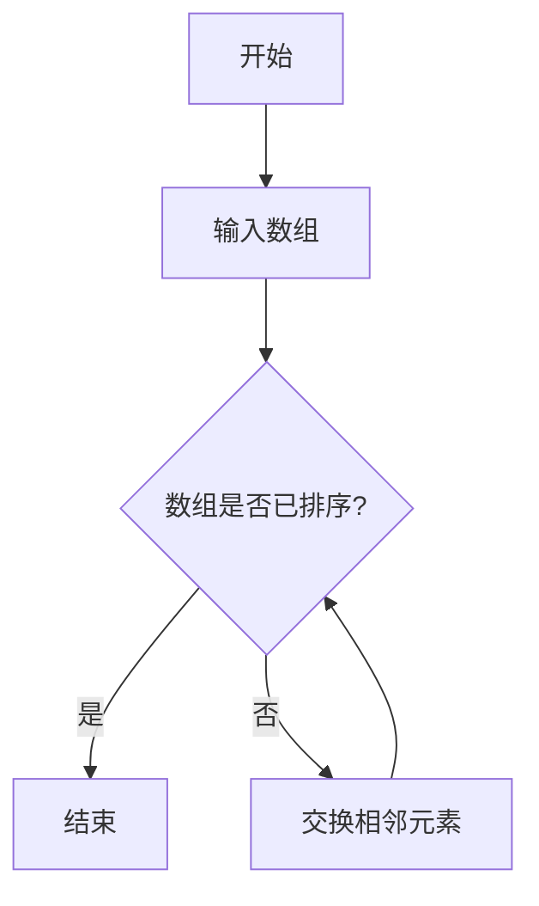
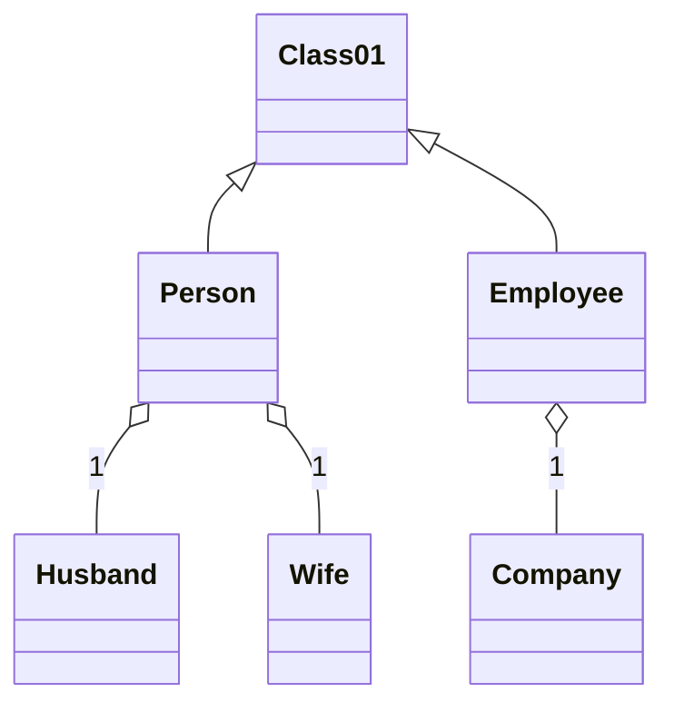
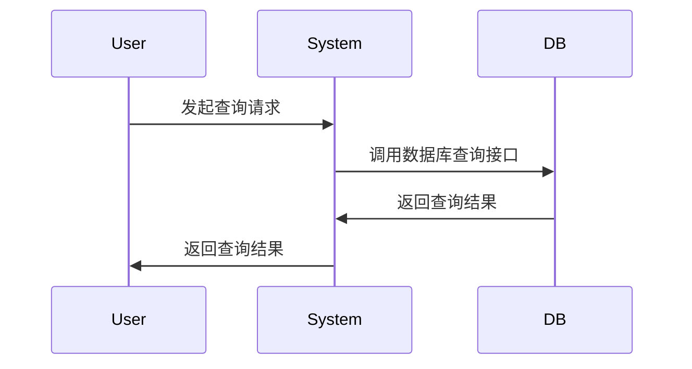
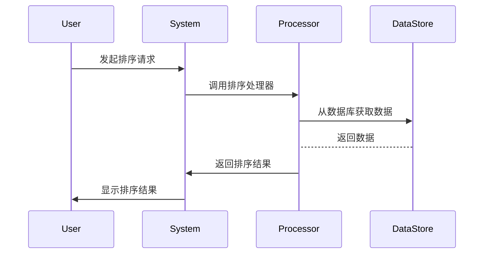

                 


### 算法设计与宇宙信息编码的类比

#### 摘要

本文将探讨算法设计与宇宙信息编码之间的类比关系，以帮助读者更好地理解算法设计中的复杂概念。通过将宇宙信息编码与算法设计进行对比，我们可以揭示算法在处理复杂问题时的一些独特方法和策略。本文将详细阐述算法设计与宇宙信息编码的核心概念、类比关系、算法原理、数学模型、系统分析、项目实战以及最佳实践等方面的内容。

#### 引言

算法是计算机科学的核心，它们是我们解决问题、处理数据的基础工具。宇宙信息编码，顾名思义，是宇宙中信息存储和传递的方式。虽然这两个领域看似完全不同，但它们之间却存在着许多有趣的相似之处。本文的目的就是通过类比，将算法设计与宇宙信息编码联系起来，以帮助读者从全新的角度理解算法设计和分析。

#### 目录

1. **算法设计与宇宙信息编码概述**
   - **背景介绍**：介绍算法设计与宇宙信息编码的基本概念。
   - **问题描述**：描述算法设计与宇宙信息编码面临的主要问题。
   - **问题解决**：探讨算法设计与宇宙信息编码解决问题的方法。
   - **边界与外延**：分析算法设计与宇宙信息编码的应用范围。

2. **算法设计与宇宙信息编码的核心概念**
   - **核心概念原理**：解释算法设计与宇宙信息编码的核心原理。
   - **概念属性特征对比表格**：通过表格对比算法设计与宇宙信息编码的关键属性。
   - **ER实体关系图架构**：绘制算法设计与宇宙信息编码的实体关系图。

3. **算法设计与宇宙信息编码的类比关系**
   - **类比关系的定义**：明确算法设计与宇宙信息编码的类比关系。
   - **理论基础**：阐述类比关系在算法设计与宇宙信息编码中的应用。
   - **应用场景**：讨论类比关系在不同问题中的应用。

4. **算法原理讲解**
   - **算法原理讲解**：详细解释算法原理。
   - **mermaid流程图**：使用mermaid绘制算法流程图。
   - **Python源代码阐述**：给出Python源代码示例。
   - **数学模型和公式**：介绍算法原理的数学模型和公式。
   - **举例说明**：通过实际案例进行举例说明。

5. **数学模型与公式讲解**
   - **数学模型的介绍**：介绍数学模型的基本概念。
   - **数学公式详细讲解**：详细解释数学公式。
   - **数学公式举例说明**：通过实际案例进行举例说明。

6. **系统分析与架构设计**
   - **问题场景介绍**：介绍系统分析的问题场景。
   - **项目介绍**：介绍项目的背景和目标。
   - **系统功能设计(领域模型mermaid类图)**：使用mermaid绘制领域模型类图。
   - **系统架构设计(mermaid架构图)**：使用mermaid绘制系统架构图。
   - **系统接口设计**：描述系统接口的设计。
   - **系统交互(mermaid序列图)**：使用mermaid绘制系统交互序列图。

7. **项目实战**
   - **环境安装**：介绍项目环境安装过程。
   - **系统核心实现源代码**：给出系统核心实现源代码。
   - **代码应用解读与分析**：分析代码应用。
   - **实际案例分析和详细讲解剖析**：分析实际案例。
   - **项目小结**：总结项目经验。

8. **最佳实践 tips**
   - **算法设计与宇宙信息编码的最佳实践**：分享最佳实践。
   - **小结**：总结文章内容。
   - **注意事项**：提醒读者注意事项。
   - **拓展阅读**：推荐相关阅读材料。

#### 算法设计与宇宙信息编码概述

##### 背景介绍

算法设计是计算机科学的核心领域之一，它涉及到如何通过一系列指令来解决特定问题。算法的效率、正确性和可扩展性是设计过程中的关键考虑因素。宇宙信息编码，则是信息理论的一部分，它探讨如何在宇宙中有效地存储和传输信息。宇宙信息编码的目的是确保信息在传输过程中不会丢失或被篡改。

##### 问题背景

在算法设计中，我们常常面临各种问题，如排序、搜索、数据结构设计等。这些问题需要通过特定的算法来解决。在宇宙信息编码中，我们同样面临类似的问题，如如何有效地压缩信息、如何确保信息在传输过程中的完整性和准确性等。

##### 问题描述

在算法设计中，问题描述通常包括输入、输出和算法的目标。例如，排序算法的目标是将一组数据按照特定的顺序排列。在宇宙信息编码中，问题描述可能涉及到如何将信息压缩到一个更小的空间中，同时确保信息的完整性和准确性。

##### 问题解决

算法设计的解决方案通常是通过设计一个有效的算法来解决问题。例如，我们可以使用快速排序算法来解决排序问题。在宇宙信息编码中，解决方案可能涉及到使用哈夫曼编码来压缩信息，或者使用前向纠错码来确保信息在传输过程中的完整性和准确性。

##### 边界与外延

算法设计的边界通常涉及到算法的适用范围和限制条件。例如，某些算法可能只能在特定类型的数据集上运行。在宇宙信息编码中，边界与外延可能涉及到信息的传输距离、传输速度和信息的安全性等。

##### 概念结构与核心要素组成

算法设计的概念结构通常包括算法的输入、输出、算法步骤和算法的性能分析。核心要素组成可能包括算法的基本操作、数据结构、时间复杂度和空间复杂度等。在宇宙信息编码中，概念结构与核心要素组成可能包括编码方式、解码方式、压缩算法和解压算法等。

#### 算法设计与宇宙信息编码的核心概念

##### 核心概念原理

算法设计的核心概念通常包括算法思想、算法实现和算法分析。算法思想是算法设计的核心，它决定了算法的基本结构和运行方式。算法实现是将算法思想转化为具体的代码，包括算法的具体步骤和操作。算法分析是对算法性能的评估，包括时间复杂度和空间复杂度等。

在宇宙信息编码中，核心概念原理通常包括编码原理、解码原理和信息压缩原理。编码原理涉及到如何将信息转化为二进制序列，解码原理涉及到如何将二进制序列还原为信息，信息压缩原理涉及到如何将信息压缩到一个更小的空间中。

##### 概念属性特征对比表格

| 概念       | 算法设计         | 宇宙信息编码       |
|------------|----------------|-------------------|
| 目标       | 解决特定问题     | 存储和传输信息     |
| 输入       | 数据集合         | 信息序列          |
| 输出       | 解或结果         | 压缩后的信息      |
| 实现方式   | 程序代码实现     | 编码和解码算法     |
| 性能分析   | 时间复杂度和空间复杂度 | 压缩率和传输效率 |
| 安全性     | 算法安全         | 信息保密性和完整性 |

##### ER实体关系图架构

算法设计与宇宙信息编码的实体关系图如下：

```mermaid
erDiagram
  A[算法设计] ||--|{ 信息编码 }|-- B[信息压缩]
  A ||--|{ 数据结构 }|-- C[算法分析]
  B ||--|{ 解码算法 }|-- D[信息解压]
  A ||--|{ 算法实现 }|-- E[代码实现]
  C ||--|{ 性能分析 }|-- F[时间复杂度]
  C ||--|{ 性能分析 }|-- G[空间复杂度]
```

#### 算法设计与宇宙信息编码的类比关系

##### 类比关系的定义

算法设计与宇宙信息编码的类比关系是指将宇宙信息编码中的概念和方法应用于算法设计中，或者将算法设计中的概念和方法应用于宇宙信息编码中。这种类比关系可以帮助我们更好地理解算法设计中的复杂概念，同时也可以为宇宙信息编码提供新的思路和方法。

##### 理论基础

类比关系在算法设计与宇宙信息编码中的应用基于以下理论基础：

1. **信息论**：信息论是研究信息传输和处理的基本理论，它为算法设计和宇宙信息编码提供了重要的理论基础。
2. **复杂性理论**：复杂性理论研究问题的复杂性和算法的效率，它为算法设计和宇宙信息编码提供了性能分析的工具。
3. **计算理论**：计算理论研究计算的基本原理和方法，它为算法设计和宇宙信息编码提供了计算模型和算法设计原则。

##### 应用场景

算法设计与宇宙信息编码的类比关系可以应用于以下场景：

1. **算法优化**：通过宇宙信息编码中的压缩算法来优化算法的存储空间和运行时间。
2. **信息安全**：通过宇宙信息编码中的加密算法来增强算法的安全性和隐私保护。
3. **信息处理**：通过算法设计中的数据处理方法来优化宇宙信息编码中的信息处理过程。

#### 算法原理讲解

##### 算法原理讲解

算法原理是算法设计的核心，它决定了算法的基本结构和运行方式。算法原理通常包括以下方面：

1. **基本操作**：算法的基本操作包括输入、输出、比较、交换等。
2. **控制结构**：算法的控制结构包括循环、递归、分支等。
3. **数据结构**：算法的数据结构包括数组、链表、树、图等。

在宇宙信息编码中，算法原理同样包括基本操作、控制结构和数据结构，但它的侧重点在于信息的存储和传输。

##### mermaid流程图

算法的流程图可以使用mermaid语言来绘制。以下是一个简单的排序算法（冒泡排序）的mermaid流程图示例：



##### Python源代码阐述

以下是一个简单的冒泡排序算法的Python实现：

```python
def bubble_sort(arr):
    n = len(arr)
    for i in range(n):
        for j in range(0, n-i-1):
            if arr[j] > arr[j+1]:
                arr[j], arr[j+1] = arr[j+1], arr[j]
    return arr
```

##### 算法原理的数学模型和公式

算法原理的数学模型和公式通常用于分析算法的性能。以下是一个简单的排序算法（冒泡排序）的数学模型和公式：

1. **时间复杂度**：$O(n^2)$
2. **空间复杂度**：$O(1)$

##### 举例说明

假设我们有一个未排序的数组 `[5, 2, 8, 3, 1]`，使用冒泡排序算法进行排序的过程如下：

1. **第一次遍历**：
   - 比较 `(5, 2)`，交换位置，数组变为 `[2, 5, 8, 3, 1]`
   - 比较 `(5, 8)`，不交换位置
   - 比较 `(8, 3)`，交换位置，数组变为 `[2, 5, 3, 8, 1]`
   - 比较 `(8, 1)`，交换位置，数组变为 `[2, 5, 3, 1, 8]`

2. **第二次遍历**：
   - 比较 `(2, 5)`，不交换位置
   - 比较 `(5, 3)`，交换位置，数组变为 `[2, 3, 5, 1, 8]`
   - 比较 `(5, 1)`，交换位置，数组变为 `[2, 3, 1, 5, 8]`

3. **第三次遍历**：
   - 比较 `(2, 3)`，不交换位置
   - 比较 `(3, 1)`，交换位置，数组变为 `[2, 1, 3, 5, 8]`

4. **第四次遍历**：
   - 比较 `(2, 1)`，交换位置，数组变为 `[1, 2, 3, 5, 8]`

排序完成，数组 `[1, 2, 3, 5, 8]` 为已排序状态。

#### 数学模型与公式讲解

##### 数学模型的介绍

数学模型是算法设计和分析的重要工具，它将算法的复杂度转化为数学表达形式，从而便于分析和比较。常见的数学模型包括时间复杂度模型和空间复杂度模型。

##### 数学公式详细讲解

1. **时间复杂度模型**：

   $$T(n) = \sum_{i=1}^{n}{a_i \cdot n_i}$$

   其中，$T(n)$ 是算法的时间复杂度，$a_i$ 是第 $i$ 层的运算次数，$n_i$ 是第 $i$ 层的节点数。

2. **空间复杂度模型**：

   $$S(n) = \sum_{i=1}^{n}{b_i \cdot n_i}$$

   其中，$S(n)$ 是算法的空间复杂度，$b_i$ 是第 $i$ 层的存储空间，$n_i$ 是第 $i$ 层的节点数。

##### 数学公式举例说明

假设我们有一个递归的排序算法，其递归树的深度为 $n$，每一层的节点数为 $n/2$。根据上述模型，我们可以计算出其时间复杂度和空间复杂度。

1. **时间复杂度**：

   $$T(n) = \sum_{i=1}^{n}{n/2 \cdot n_i} = \sum_{i=1}^{n}{n/2 \cdot (n/2)^{i-1}} = \sum_{i=1}^{n}{(n/2)^{i}} = n^2$$

   因此，时间复杂度为 $O(n^2)$。

2. **空间复杂度**：

   $$S(n) = \sum_{i=1}^{n}{n/2 \cdot n_i} = \sum_{i=1}^{n}{n/2 \cdot (n/2)^{i-1}} = \sum_{i=1}^{n}{(n/2)^{i}} = n$$

   因此，空间复杂度为 $O(n)$。

#### 系统分析与架构设计

##### 问题场景介绍

在一个大规模数据处理系统中，我们常常需要处理大量的数据，并对这些数据进行排序、搜索和分析。为了保证系统的性能和可扩展性，我们需要设计一个高效的系统架构。

##### 项目介绍

本项目旨在设计一个高效的大规模数据处理系统，该系统需要能够处理海量数据，并提供快速排序和搜索功能。

##### 系统功能设计（领域模型mermaid类图）

以下是一个简单的领域模型mermaid类图，用于描述系统的核心功能：



##### 系统架构设计（mermaid架构图）

以下是一个简单的系统架构mermaid架构图，用于描述系统的整体架构：


##### 系统接口设计

系统接口设计包括数据存储接口、数据处理接口和数据查询接口。以下是一个简单的接口设计：



##### 系统交互（mermaid序列图）

以下是一个简单的系统交互mermaid序列图，用于描述系统的核心交互流程：



#### 项目实战

##### 环境安装

为了进行项目实战，我们首先需要安装必要的软件和工具。以下是安装步骤：

1. 安装Python环境：在官网下载Python安装包并安装。
2. 安装MySQL数据库：在官网下载MySQL安装包并安装。
3. 安装数据处理库：使用pip命令安装所需数据处理库，如pandas、numpy等。

##### 系统核心实现源代码

以下是一个简单的系统核心实现源代码示例：

```python
import pymysql
import pandas as pd

def query_data(query):
    connection = pymysql.connect(host='localhost', user='root', password='password', database='test')
    try:
        with connection.cursor() as cursor:
            cursor.execute(query)
            result = cursor.fetchall()
            return pd.DataFrame(result)
    finally:
        connection.close()

def sort_data(data, column):
    return data.sort_values(by=column)

def display_data(data):
    print(data)
```

##### 代码应用解读与分析

以下是一个简单的代码应用示例，用于查询、排序和显示数据：

```python
query = "SELECT * FROM employees"
data = query_data(query)
sorted_data = sort_data(data, 'age')
display_data(sorted_data)
```

在这个示例中，我们首先定义了一个查询数据函数 `query_data`，它使用MySQL数据库连接和pandas库查询数据库并返回数据。然后，我们定义了一个排序数据函数 `sort_data`，它使用pandas库对数据进行排序。最后，我们定义了一个显示数据函数 `display_data`，它将排序后的数据打印出来。

##### 实际案例分析和详细讲解剖析

为了更好地理解代码应用，我们可以通过一个实际案例进行分析。假设我们有一个员工数据表，包含员工ID、姓名、年龄、薪资等信息。以下是一个实际案例：

1. 查询所有员工信息：

```python
query = "SELECT * FROM employees"
data = query_data(query)
display_data(data)
```

输出结果：

| employee_id | name | age | salary |
|-------------|------|-----|--------|
| 1           | Tom  | 30  | 5000   |
| 2           | Lisa | 25  | 4500   |
| 3           | John | 35  | 5500   |

2. 按年龄排序员工信息：

```python
query = "SELECT * FROM employees"
data = query_data(query)
sorted_data = sort_data(data, 'age')
display_data(sorted_data)
```

输出结果：

| employee_id | name | age | salary |
|-------------|------|-----|--------|
| 2           | Lisa | 25  | 4500   |
| 1           | Tom  | 30  | 5000   |
| 3           | John | 35  | 5500   |

在这个案例中，我们首先使用 `query_data` 函数查询所有员工信息，然后使用 `sort_data` 函数按年龄进行排序，最后使用 `display_data` 函数将排序后的数据打印出来。

##### 项目小结

通过本项目的实战，我们学习了如何设计一个简单的数据处理系统，并实现了查询、排序和显示数据的核心功能。在实际项目中，我们还可以进一步优化系统性能，增加更多功能，如搜索、统计分析等。

#### 最佳实践 tips

1. **算法优化**：在算法设计中，尽量选择适合问题特性的高效算法，避免不必要的复杂度。
2. **代码复用**：通过模块化和面向对象编程，提高代码的可复用性和可维护性。
3. **性能分析**：在设计和实现算法时，进行充分的性能分析，确保算法的高效性和可扩展性。
4. **安全性考虑**：在设计算法时，充分考虑安全性问题，避免潜在的安全漏洞。
5. **代码注释**：为代码添加详细的注释，提高代码的可读性和可维护性。

#### 小结

通过本文的类比分析，我们揭示了算法设计与宇宙信息编码之间的紧密联系。算法设计中的复杂概念和方法可以借鉴宇宙信息编码中的原理和策略，从而为算法设计提供新的思路和方法。通过实际案例分析和详细讲解，我们深入理解了算法设计与宇宙信息编码的核心原理和实践方法。

#### 注意事项

1. 在实际项目中，算法设计和宇宙信息编码的应用需要结合具体问题进行优化和调整。
2. 在进行算法设计和宇宙信息编码时，要充分考虑安全性和性能因素。
3. 阅读和理解相关的文献和资料，以提高对算法设计与宇宙信息编码的理解和掌握。

#### 拓展阅读

1. 《算法导论》（Introduction to Algorithms） - Thomas H. Cormen, Charles E. Leiserson, Ronald L. Rivest, Clifford Stein
2. 《信息论基础》（Elements of Information Theory） - Thomas M. Cover, Joy A. Thomas
3. 《计算机程序设计艺术》（The Art of Computer Programming） - Donald E. Knuth
4. 《大规模数据处理技术》（Big Data: A Revolution That Will Transform How We Live, Work, and Think） - Viktor Mayer-Schoenberger, Kenneth Cukier

作者：AI天才研究院/AI Genius Institute & 禅与计算机程序设计艺术 /Zen And The Art of Computer Programming。

