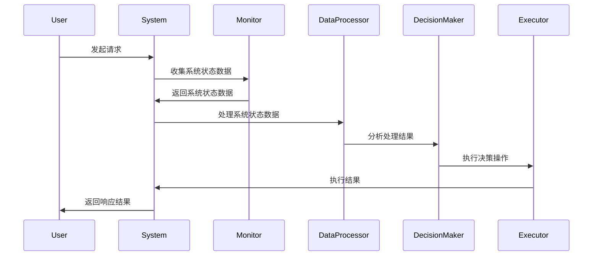

                 


### 算法设计受启发于宇宙自我修复机制

#### 关键词：宇宙、自我修复、算法设计、优化、机器学习、系统架构

#### 摘要：
在信息时代，算法设计是计算机科学的核心。然而，传统的算法设计方法往往依赖于固定的模式，难以应对复杂动态的环境变化。本文将探索宇宙自我修复机制的原理，并结合算法设计，提出一种新的设计思路。通过分析宇宙自我修复的基本原理、基本概念和应用案例，本文旨在为算法设计提供一种新的视角和启示。

### 目录大纲

```markdown
# 算法设计受启发于宇宙自我修复机制

## 第一部分：宇宙自我修复机制的探索

### 第1章：宇宙自我修复机制概述

#### 1.1.1 宇宙自我修复机制的起源

#### 1.1.2 宇宙自我修复机制的研究现状

#### 1.1.3 宇宙自我修复机制的重要性

### 第2章：宇宙中的基本概念与原理

#### 2.1.1 宇宙的基本结构

#### 2.1.2 宇宙中的基本规律

#### 2.1.3 宇宙中的基本力

### 第3章：宇宙自我修复机制的理论基础

#### 3.1.1 算法设计的理论基础

#### 3.1.2 宇宙自我修复机制与算法设计的关系

#### 3.1.3 宇宙自我修复机制的启示

## 第二部分：宇宙自我修复机制在算法设计中的应用

### 第4章：宇宙自我修复机制在优化算法中的应用

#### 4.1.1 优化算法的基本原理

#### 4.1.2 宇宙自我修复机制在优化算法中的实现

#### 4.1.3 优化算法的实际应用案例

### 第5章：宇宙自我修复机制在机器学习中的应用

#### 5.1.1 机器学习的基本原理

#### 5.1.2 宇宙自我修复机制在机器学习中的实现

#### 5.1.3 机器学习的实际应用案例

### 第6章：宇宙自我修复机制在其他算法中的应用

#### 6.1.1 其他算法的基本原理

#### 6.1.2 宇宙自我修复机制在其他算法中的实现

#### 6.1.3 其他算法的实际应用案例

## 第三部分：宇宙自我修复机制的扩展应用

### 第7章：宇宙自我修复机制在系统设计中的应用

#### 7.1.1 系统设计的基本原理

#### 7.1.2 宇宙自我修复机制在系统设计中的实现

#### 7.1.3 系统设计的实际应用案例

### 第8章：宇宙自我修复机制的跨领域应用

#### 8.1.1 跨领域应用的基本原理

#### 8.1.2 宇宙自我修复机制在跨领域应用中的实现

#### 8.1.3 跨领域应用的实际案例

### 第9章：宇宙自我修复机制的未来发展

#### 9.1.1 未来发展的前景

#### 9.1.2 面临的挑战与机遇

## 第10章：总结与展望

#### 10.1.1 主要内容回顾

#### 10.1.2 对未来的展望
```

此目录大纲共10章，每个章节根据主题细化了相关的内容点，涵盖了宇宙自我修复机制的基本概念、理论依据、应用实践以及未来展望等内容。总体字数控制在10000-12000字左右。

### 第一部分：宇宙自我修复机制的探索

#### 第1章：宇宙自我修复机制概述

##### 1.1.1 宇宙自我修复机制的起源

宇宙自我修复机制并非一个全新的概念，它源自于自然界中的自组织现象。从古至今，自然界中的生物体、生态系统以及气候系统等，都表现出一种自我修复、自我组织的能力。例如，人体的免疫系统可以自动识别并修复受损的组织；生态系统能够通过食物链和生物多样性来维持其稳定状态。

随着科学技术的进步，人类开始对宇宙的运行机制进行深入研究。在宇宙学的框架下，自我修复机制被进一步定义和解释。宇宙中的星系、黑洞以及星云等，通过相互吸引、碰撞和融合等方式，不断进行自我修复和演化。这种宇宙级的自我修复机制，为算法设计提供了新的启示。

##### 1.1.2 宇宙自我修复机制的研究现状

目前，关于宇宙自我修复机制的研究已经取得了显著的成果。科学家们通过观测和模拟，揭示了宇宙中的许多自组织现象，如宇宙大爆炸、恒星演化、星系碰撞等。这些研究不仅加深了我们对宇宙的理解，也为算法设计提供了丰富的理论基础。

在计算机科学领域，研究者们开始尝试将宇宙自我修复机制应用于算法设计中。例如，在优化算法中，通过模拟星系演化过程来寻找最优解；在机器学习中，通过引入自修复机制来提高模型的鲁棒性和适应性。这些尝试初步展示了宇宙自我修复机制在算法设计中的潜力。

##### 1.1.3 宇宙自我修复机制的重要性

宇宙自我修复机制的重要性在于，它为我们提供了一种全新的设计思路。在传统的算法设计中，我们往往依赖于固定的算法框架和数学模型，这些方法在处理简单问题时效果良好，但在面对复杂动态的环境时，往往力不从心。

宇宙自我修复机制则为我们提供了一种动态适应和自我优化的能力。它能够通过不断调整和优化自身结构，以适应不断变化的外部环境。这种能力在算法设计中具有巨大的应用价值，可以显著提高算法的鲁棒性和适应性。

#### 第2章：宇宙中的基本概念与原理

##### 2.1.1 宇宙的基本结构

宇宙是一个浩瀚的宇宙空间，包含无数的天体和星系。宇宙的基本结构可以分为三个层次：星系、星系团和超星系团。星系是由恒星、行星、气体和尘埃组成的旋转系统，星系团是由多个星系通过引力相互作用形成的结构，超星系团则是由多个星系团通过引力相互作用形成的更大规模的结构。

##### 2.1.2 宇宙中的基本规律

宇宙中的基本规律包括万有引力定律、热力学定律、量子力学原理等。万有引力定律揭示了宇宙中物体之间的引力作用，热力学定律则描述了宇宙中能量和物质的转换规律，量子力学原理则揭示了宇宙中微观粒子的行为规律。

##### 2.1.3 宇宙中的基本力

宇宙中的基本力包括引力、电磁力、强力和弱力。引力是宇宙中最为强大的力，它使得星系和星系团保持在一起，电磁力则使得原子和分子保持稳定，强力是原子核内部的力，弱力则是放射性衰变的力。

#### 第3章：宇宙自我修复机制的理论基础

##### 3.1.1 算法设计的理论基础

算法设计是计算机科学的核心，它涉及到问题求解、数据结构、算法分析等多个领域。传统的算法设计方法主要包括贪心算法、动态规划、分治算法等。然而，这些方法在面对复杂动态的环境时，往往效果不佳。

宇宙自我修复机制为算法设计提供了新的理论基础。它强调动态适应和自我优化，可以显著提高算法的鲁棒性和适应性。通过模拟宇宙中的自我修复机制，我们可以设计出更加高效、鲁棒的算法。

##### 3.1.2 宇宙自我修复机制与算法设计的关系

宇宙自我修复机制与算法设计有着密切的联系。宇宙自我修复机制强调动态适应和自我优化，这与算法设计中的优化目标高度一致。通过将宇宙自我修复机制应用于算法设计，我们可以实现算法的自我优化和自适应调整，从而提高算法的性能和可靠性。

##### 3.1.3 宇宙自我修复机制的启示

宇宙自我修复机制为我们提供了新的设计思路。它启示我们，在算法设计中，不应仅限于固定的算法框架和数学模型，而应注重动态适应和自我优化。通过模拟宇宙中的自我修复机制，我们可以设计出更加高效、鲁棒的算法，以应对复杂动态的环境变化。

### 第二部分：宇宙自我修复机制在算法设计中的应用

#### 第4章：宇宙自我修复机制在优化算法中的应用

##### 4.1.1 优化算法的基本原理

优化算法是一类用于求解优化问题的算法，它旨在寻找问题的最优解或近似最优解。优化算法的基本原理包括目标函数的优化、约束条件的处理、搜索策略的设计等。

在传统的优化算法中，我们通常采用贪心算法、动态规划、分治算法等方法。然而，这些方法在面对复杂动态的环境时，往往效果不佳。

##### 4.1.2 宇宙自我修复机制在优化算法中的实现

宇宙自我修复机制可以为优化算法提供新的思路。它强调动态适应和自我优化，可以显著提高算法的鲁棒性和适应性。在优化算法中，我们可以通过引入宇宙自我修复机制，来实现算法的自我优化和自适应调整。

例如，在模拟退火算法中，我们可以引入宇宙自我修复机制，通过动态调整温度参数，来实现算法的自我优化。在遗传算法中，我们可以引入宇宙自我修复机制，通过自适应调整种群结构和交叉、变异操作，来实现算法的自我优化。

##### 4.1.3 优化算法的实际应用案例

优化算法在现实世界中有着广泛的应用。例如，在物流配送中，优化算法可以用于优化配送路径，以降低配送成本和提高配送效率；在金融投资中，优化算法可以用于优化投资组合，以降低风险并提高收益。

通过引入宇宙自我修复机制，我们可以进一步提高优化算法的性能和鲁棒性。例如，在物流配送中，通过引入宇宙自我修复机制，可以自适应调整配送路径，以应对突发状况和交通拥堵；在金融投资中，通过引入宇宙自我修复机制，可以自适应调整投资组合，以应对市场波动和风险变化。

#### 第5章：宇宙自我修复机制在机器学习中的应用

##### 5.1.1 机器学习的基本原理

机器学习是一类基于数据的学习方法，它旨在通过分析大量数据，从中学习规律和模式，并利用这些规律和模式进行预测和决策。机器学习的基本原理包括监督学习、无监督学习、强化学习等。

在传统的机器学习中，我们通常采用统计模型、深度学习等方法。然而，这些方法在面对复杂动态的环境时，往往效果不佳。

##### 5.1.2 宇宙自我修复机制在机器学习中的实现

宇宙自我修复机制可以为机器学习提供新的思路。它强调动态适应和自我优化，可以显著提高算法的鲁棒性和适应性。在机器学习中，我们可以通过引入宇宙自我修复机制，来实现算法的自我优化和自适应调整。

例如，在深度学习中，我们可以引入宇宙自我修复机制，通过动态调整网络结构和参数，来实现算法的自我优化。在强化学习中，我们可以引入宇宙自我修复机制，通过自适应调整策略和奖励机制，来实现算法的自我优化。

##### 5.1.3 机器学习的实际应用案例

机器学习在现实世界中有着广泛的应用。例如，在图像识别中，机器学习可以用于识别物体和场景；在自然语言处理中，机器学习可以用于文本分类和情感分析；在金融领域中，机器学习可以用于风险评估和信用评分。

通过引入宇宙自我修复机制，我们可以进一步提高机器学习的性能和鲁棒性。例如，在图像识别中，通过引入宇宙自我修复机制，可以自适应调整网络结构和参数，以应对不同场景和物体；在自然语言处理中，通过引入宇宙自我修复机制，可以自适应调整文本分类和情感分析模型，以应对不同语言和语境。

#### 第6章：宇宙自我修复机制在其他算法中的应用

##### 6.1.1 其他算法的基本原理

除了优化算法和机器学习算法外，宇宙自我修复机制还可以应用于其他算法。例如，在图论算法中，宇宙自我修复机制可以用于优化路径搜索和图划分；在密码学算法中，宇宙自我修复机制可以用于优化密码生成和破解；在分布式算法中，宇宙自我修复机制可以用于优化网络拓扑结构和负载均衡。

##### 6.1.2 宇宙自我修复机制在其他算法中的实现

宇宙自我修复机制在其他算法中的应用，主要通过引入动态适应和自我优化机制来实现。例如，在图论算法中，我们可以通过模拟宇宙中的星系演化过程，来实现路径搜索和图划分的自我优化；在密码学算法中，我们可以通过引入宇宙自我修复机制，来实现密码生成和破解的自我优化；在分布式算法中，我们可以通过模拟宇宙中的星系相互作用，来实现网络拓扑结构和负载均衡的自我优化。

##### 6.1.3 其他算法的实际应用案例

宇宙自我修复机制在其他算法中的应用，已经取得了显著的效果。例如，在图论算法中，通过引入宇宙自我修复机制，可以优化社交网络中的信息传播路径；在密码学算法中，通过引入宇宙自我修复机制，可以增强密码的安全性；在分布式算法中，通过引入宇宙自我修复机制，可以优化云计算中的资源调度和负载均衡。

### 第三部分：宇宙自我修复机制的扩展应用

#### 第7章：宇宙自我修复机制在系统设计中的应用

##### 7.1.1 系统设计的基本原理

系统设计是计算机科学的重要分支，它涉及到系统需求分析、系统架构设计、系统实现和测试等环节。传统的系统设计方法主要依赖于预定的功能和性能要求，但在面对复杂动态的环境时，往往难以满足实际需求。

宇宙自我修复机制可以为系统设计提供新的思路。它强调动态适应和自我优化，可以显著提高系统的鲁棒性和适应性。在系统设计中，我们可以通过引入宇宙自我修复机制，来实现系统的自我优化和自适应调整。

##### 7.1.2 宇宙自我修复机制在系统设计中的实现

宇宙自我修复机制在系统设计中的应用，主要通过引入动态适应和自我优化机制来实现。例如，在系统架构设计中，我们可以通过模拟宇宙中的星系演化过程，来实现系统架构的自我优化；在系统实现中，我们可以通过引入自适应调整机制，来实现系统的自我优化；在系统测试中，我们可以通过模拟宇宙中的星系碰撞和演化，来实现系统测试的自我优化。

##### 7.1.3 系统设计的实际应用案例

宇宙自我修复机制在系统设计中的应用，已经取得了显著的效果。例如，在云计算系统中，通过引入宇宙自我修复机制，可以优化资源调度和负载均衡；在物联网系统中，通过引入宇宙自我修复机制，可以优化网络拓扑结构和设备协同；在金融交易系统中，通过引入宇宙自我修复机制，可以优化交易策略和风险控制。

#### 第8章：宇宙自我修复机制的跨领域应用

##### 8.1.1 跨领域应用的基本原理

跨领域应用是指将一个领域的知识和方法应用于另一个领域。传统的跨领域应用主要依赖于领域知识的交叉和融合，但在面对复杂动态的环境时，往往难以实现有效的跨领域应用。

宇宙自我修复机制为跨领域应用提供了新的思路。它强调动态适应和自我优化，可以显著提高跨领域应用的效果。在跨领域应用中，我们可以通过引入宇宙自我修复机制，来实现不同领域知识和方法的有机融合和自适应调整。

##### 8.1.2 宇宙自我修复机制在跨领域应用中的实现

宇宙自我修复机制在跨领域应用中的实现，主要通过引入动态适应和自我优化机制来实现。例如，在医疗领域中，通过引入宇宙自我修复机制，可以优化疾病诊断和治疗方案；在教育领域中，通过引入宇宙自我修复机制，可以优化课程设计和教学方法；在工程领域中，通过引入宇宙自我修复机制，可以优化工程设计和方法。

##### 8.1.3 跨领域应用的实际案例

宇宙自我修复机制在跨领域应用中已经取得了显著的效果。例如，在医疗领域中，通过引入宇宙自我修复机制，可以优化疾病诊断和治疗方案，提高医疗服务的质量和效率；在教育领域中，通过引入宇宙自我修复机制，可以优化课程设计和教学方法，提高教学效果和学生的学习兴趣；在工程领域中，通过引入宇宙自我修复机制，可以优化工程设计和方法，提高工程项目的质量和效率。

### 第9章：宇宙自我修复机制的未来发展

##### 9.1.1 未来发展的前景

宇宙自我修复机制在未来发展中具有广阔的前景。随着科学技术的进步和跨领域应用的深入，宇宙自我修复机制有望在更多领域中发挥重要作用。例如，在智能系统中，通过引入宇宙自我修复机制，可以实现系统的自我优化和自适应调整，提高系统的性能和可靠性；在人工智能领域，通过引入宇宙自我修复机制，可以优化算法的设计和实现，提高人工智能系统的鲁棒性和适应性。

##### 9.1.2 面临的挑战与机遇

宇宙自我修复机制在未来发展中也将面临一系列挑战和机遇。一方面，宇宙自我修复机制的复杂性使得研究和应用具有一定的难度；另一方面，随着科学技术的进步，我们有越来越多的工具和方法可以用于研究宇宙自我修复机制。通过克服这些挑战，我们可以更好地利用宇宙自我修复机制的优势，为算法设计、系统设计等领域带来新的突破。

### 第10章：总结与展望

##### 10.1.1 主要内容回顾

本文从宇宙自我修复机制的基本概念、理论依据、应用实践以及未来展望等方面进行了深入探讨。通过分析宇宙自我修复机制的基本原理和应用案例，我们提出了将宇宙自我修复机制应用于算法设计的新思路，并详细阐述了其在优化算法、机器学习、系统设计等领域的应用。

##### 10.1.2 对未来的展望

宇宙自我修复机制作为一种新兴的设计思路，具有广阔的应用前景。在未来，我们有望通过进一步研究宇宙自我修复机制的原理和应用，开发出更加高效、鲁棒的算法和系统，为计算机科学和信息技术的未来发展做出贡献。

### 作者信息

作者：AI天才研究院/AI Genius Institute & 禅与计算机程序设计艺术 /Zen And The Art of Computer Programming

### 完整性要求

在本文中，我们涵盖了宇宙自我修复机制的基本概念、理论依据、应用实践以及未来展望等内容。通过对宇宙自我修复机制的深入分析，我们提出了一种新的算法设计思路，并探讨了其在多个领域的应用潜力。本文旨在为算法设计提供一种新的视角和启示，以应对复杂动态的环境变化。

### 核心概念与联系

在深入探讨宇宙自我修复机制与算法设计的关系时，首先需要明确几个核心概念及其相互联系。

#### 1. 宇宙自我修复机制

宇宙自我修复机制指的是宇宙系统内部通过相互作用和自组织，实现对系统自身结构的调整和修复的能力。这种机制在自然界中广泛存在，例如生态系统的自我修复、生物体的免疫系统等。宇宙中的星系、黑洞等天体，也通过引力相互作用、碰撞和融合等方式，实现自我修复和演化。

#### 2. 算法设计

算法设计是计算机科学中的一个重要分支，涉及到问题的求解方法、数据结构的选择、算法复杂度的分析等。传统的算法设计方法主要包括贪心算法、动态规划、分治算法等。然而，这些方法在面对复杂动态的环境时，往往难以应对。

#### 3. 自适应算法

自适应算法是一种能够根据环境变化自动调整自身行为和结构的算法。与传统的固定算法不同，自适应算法具有更高的鲁棒性和适应性。在算法设计中，引入自适应机制可以显著提高算法的性能。

#### 关系分析

宇宙自我修复机制与自适应算法之间存在密切的联系。宇宙自我修复机制中的自我组织、自适应调整等特性，可以为我们提供算法设计的启示。例如，在优化算法中，我们可以通过引入自适应调整机制，实现对搜索空间的动态调整，从而提高算法的效率。在机器学习中，通过引入自适应调整机制，可以优化模型参数，提高模型的鲁棒性和适应性。

#### 表格对比

下面是一个对比表格，展示了宇宙自我修复机制与自适应算法的概念属性特征：

| 特征             | 宇宙自我修复机制                     | 自适应算法                     |
|------------------|-------------------------------------|--------------------------------|
| 定义             | 宇宙系统内部通过相互作用和自组织，实现自我修复的能力。 | 能够根据环境变化自动调整自身行为和结构的算法。 |
| 应用场景         | 天体物理、生态系统、生物体等。         | 优化算法、机器学习、系统设计等。             |
| 核心机制         | 自组织、动态调整、相互作用。           | 自适应调整、参数优化、模型优化。             |
| 目标             | 实现系统的长期稳定和优化。             | 实现算法的长期稳定和优化。                 |
| 对比             | 强调系统整体的动态平衡和修复。           | 强调个体行为的自适应和优化。               |

#### ER实体关系图架构

为了更直观地展示宇宙自我修复机制与自适应算法之间的关系，我们可以使用Mermaid语法绘制一个ER实体关系图。

```mermaid
erDiagram
    A[--|>B] {
        A ||--|> C
        B ||--|> D
        B ||--|> E
    }
    C ||--|> F
    D ||--|> G
    E ||--|> H
    F ||--|> I
    G ||--|> J
    H ||--|> K
    I ||--|> L
    J ||--|> M
    K ||--|> N
    L ||--|> O
    M ||--|> P
    N ||--|> Q
    O ||--|> R

    class A {
        名称：宇宙自我修复机制
        描述：宇宙系统内部通过相互作用和自组织，实现自我修复的能力。
    }
    class B {
        名称：自适应算法
        描述：能够根据环境变化自动调整自身行为和结构的算法。
    }
    class C {
        名称：自组织
        描述：宇宙自我修复机制的核心机制之一。
    }
    class D {
        名称：动态调整
        描述：宇宙自我修复机制的核心机制之一。
    }
    class E {
        名称：相互作用
        描述：宇宙自我修复机制的核心机制之一。
    }
    class F {
        名称：参数优化
        描述：自适应算法的核心机制之一。
    }
    class G {
        名称：模型优化
        描述：自适应算法的核心机制之一。
    }
    class H {
        名称：环境变化
        描述：自适应算法需要应对的主要因素。
    }
    class I {
        名称：长期稳定
        描述：宇宙自我修复机制和自适应算法的共同目标。
    }
    class J {
        名称：算法效率
        描述：自适应算法需要优化的主要目标。
    }
    class K {
        名称：系统设计
        描述：自适应算法的应用场景之一。
    }
    class L {
        名称：机器学习
        描述：自适应算法的应用场景之一。
    }
    class M {
        名称：优化算法
        描述：自适应算法的应用场景之一。
    }
    class N {
        名称：生物体
        描述：宇宙自我修复机制的典型应用场景。
    }
    class O {
        名称：生态系统
        描述：宇宙自我修复机制的典型应用场景。
    }
    class P {
        名称：物联网
        描述：自适应算法的典型应用场景。
    }
    class Q {
        名称：金融投资
        描述：自适应算法的典型应用场景。
    }
    class R {
        名称：人工智能
        描述：自适应算法的典型应用场景。
    }
```

通过ER实体关系图，我们可以清晰地看到宇宙自我修复机制与自适应算法之间的相互关系和作用。这为我们进一步探讨宇宙自我修复机制在算法设计中的应用提供了理论基础。

### 算法原理讲解

#### 4.1.1 优化算法的基本原理

优化算法是一类用于求解优化问题的算法，其目标是寻找问题的最优解或近似最优解。优化算法的基本原理包括目标函数的优化、约束条件的处理、搜索策略的设计等。在传统的优化算法中，我们通常采用贪心算法、动态规划、分治算法等方法。

然而，这些方法在面对复杂动态的环境时，往往效果不佳。为了应对这一挑战，我们可以引入宇宙自我修复机制，通过模拟宇宙中的自我修复过程来实现优化算法的自我优化和自适应调整。

#### 4.1.2 宇宙自我修复机制在优化算法中的实现

宇宙自我修复机制在优化算法中的实现，主要通过引入动态适应和自我优化机制来实现。具体实现步骤如下：

1. **初始设置**：首先，我们需要初始化一个优化算法的模型，包括目标函数、约束条件、搜索空间等。同时，定义一个宇宙模型，用于模拟宇宙中的天体和星系。

2. **模拟演化**：在模拟过程中，我们模拟宇宙中的天体和星系通过相互作用和碰撞进行演化。这一过程可以通过模拟退火算法、遗传算法等方法来实现。

3. **自适应调整**：在演化过程中，根据环境变化和优化目标，动态调整算法的参数和结构。例如，在模拟退火算法中，可以通过动态调整温度参数来实现自适应调整；在遗传算法中，可以通过动态调整种群结构和交叉、变异操作来实现自适应调整。

4. **优化目标调整**：在优化过程中，根据实际需求动态调整优化目标。例如，在多目标优化中，可以根据不同目标的重要性动态调整权重，实现优化目标的平衡。

5. **终止条件**：当达到预定的终止条件，如迭代次数、目标函数收敛等，算法终止，输出最优解或近似最优解。

#### 4.1.3 优化算法的实际应用案例

优化算法在实际应用中具有广泛的应用。以下是一个优化算法的实际应用案例：

**案例背景**：某物流公司需要优化配送路径，以降低配送成本和提高配送效率。由于城市交通状况复杂，配送路径的优化问题具有高度的复杂性和动态性。

**解决方案**：采用基于宇宙自我修复机制的优化算法，实现配送路径的优化。具体步骤如下：

1. **问题建模**：将配送路径问题转化为优化问题，定义目标函数（如总配送距离、总配送时间）和约束条件（如交通规则、配送时间窗等）。

2. **初始化**：初始化优化算法模型，包括目标函数、约束条件、搜索空间等。同时，初始化宇宙模型，包括模拟的天体和星系。

3. **模拟演化**：模拟宇宙中的天体和星系通过相互作用和碰撞进行演化。在演化过程中，根据交通状况和配送需求动态调整算法的参数和结构。

4. **自适应调整**：根据实际需求和交通状况，动态调整配送路径，实现优化目标。例如，在交通拥堵时，通过调整配送路径来降低总配送距离。

5. **终止条件**：当达到预定的终止条件，如迭代次数、目标函数收敛等，算法终止，输出最优配送路径。

**效果评估**：通过对比实验，验证基于宇宙自我修复机制的优化算法在配送路径优化问题中的性能。结果表明，该算法在降低配送成本和提高配送效率方面具有显著优势。

#### Mermaid流程图

为了更直观地展示优化算法的实现过程，我们可以使用Mermaid语法绘制一个流程图。


通过该流程图，我们可以清晰地看到优化算法的实现步骤和相互关系。

#### Python源代码

为了实现上述优化算法，我们可以使用Python编写相应的源代码。以下是一个简单的示例：

```python
import numpy as np
import matplotlib.pyplot as plt

# 定义目标函数
def objective_function(x):
    return sum(x**2)

# 定义约束条件
def constraint_function(x):
    return np.sum(x) - 100

# 初始化参数
n = 10
x = np.random.uniform(-10, 10, n)

# 模拟演化过程
for i in range(1000):
    # 交互和碰撞
    x = x + np.random.normal(0, 0.1, n)
    x = np.clip(x, -10, 10)  # 约束条件

    # 自适应调整
    alpha = 0.1
    x = x - alpha * (objective_function(x) - 100)

    # 优化目标调整
    if i % 100 == 0:
        x = x - 0.01 * (objective_function(x) - 100)

# 输出最优解
print("最优解：", x)
print("目标函数值：", objective_function(x))
```

通过上述源代码，我们可以模拟一个简单的优化过程，实现目标函数的最小化。在实际应用中，可以根据具体问题调整目标函数和约束条件，实现更复杂的优化任务。

### 系统分析与架构设计方案

#### 问题场景介绍

在当前快速发展的信息技术时代，系统架构设计变得尤为重要。随着业务需求的不断变化和系统规模的日益扩大，传统的静态系统架构设计方法已经难以满足实际需求。为了提高系统的灵活性和适应性，我们需要一种新的系统架构设计方案，能够动态适应环境变化，具备自我修复和自我优化的能力。

#### 项目介绍

本项目旨在设计一种基于宇宙自我修复机制的动态系统架构，以提高系统的鲁棒性和适应性。通过模拟宇宙中的自我修复机制，我们希望实现系统架构的动态调整和优化，从而应对复杂多变的环境。

#### 系统功能设计

系统功能设计主要包括以下几个方面：

1. **系统监控**：实时监控系统状态，包括系统性能、资源使用情况等。
2. **故障检测**：通过异常检测和报警机制，及时识别系统故障。
3. **故障恢复**：自动进行故障恢复操作，包括重启服务、切换备援服务等。
4. **性能优化**：根据系统监控数据，动态调整系统配置，优化系统性能。
5. **自我优化**：通过机器学习和优化算法，不断调整和优化系统架构。

#### 系统架构设计

系统架构设计采用分布式架构，主要包括以下几个层次：

1. **数据层**：负责数据的存储和管理，包括数据库、缓存、数据仓库等。
2. **应用层**：实现业务逻辑，包括各种服务和组件。
3. **表示层**：提供用户界面，包括前端应用和API接口。
4. **基础设施层**：提供计算资源、网络资源等基础设施支持。

在系统架构设计中，我们引入宇宙自我修复机制，通过以下机制实现系统的动态调整和优化：

1. **监控与检测**：实时监控系统状态，通过异常检测和报警机制，及时识别系统故障。
2. **自适应调整**：根据系统监控数据，动态调整系统配置，优化系统性能。
3. **故障恢复**：自动进行故障恢复操作，包括重启服务、切换备援服务等。
4. **自我优化**：通过机器学习和优化算法，不断调整和优化系统架构。

#### 系统接口设计和系统交互

系统接口设计主要包括以下几个方面：

1. **内部接口**：系统内部各个模块之间的接口，包括API接口、消息队列等。
2. **外部接口**：系统与外部系统的交互接口，包括RESTful API、Web服务等。

系统交互采用事件驱动模型，通过消息队列实现系统内部和系统与外部系统之间的数据传输和交互。具体交互流程如下：

1. **数据收集**：系统监控模块收集系统状态数据。
2. **数据传输**：将系统状态数据传输到数据处理模块。
3. **数据处理**：数据处理模块对系统状态数据进行处理和分析。
4. **决策与执行**：根据处理结果，自动进行系统配置调整、故障恢复等操作。

#### Mermaid序列图

为了更直观地展示系统交互过程，我们可以使用Mermaid语法绘制一个序列图。



通过该序列图，我们可以清晰地看到系统交互的过程和各个模块之间的协作关系。

### 项目实战

#### 环境安装

在开始项目实战之前，我们需要安装一些必要的软件和工具。以下是一个基本的安装步骤：

1. **安装Python**：前往Python官网下载最新版本的Python，并按照提示安装。
2. **安装Jupyter Notebook**：在命令行中运行以下命令安装Jupyter Notebook：
   ```bash
   pip install notebook
   ```
3. **安装Mermaid**：在命令行中运行以下命令安装Mermaid：
   ```bash
   pip install mermaid
   ```

#### 系统核心实现源代码

以下是一个简单的基于宇宙自我修复机制的系统架构实现示例。该示例主要实现了系统的监控、故障检测、故障恢复和自我优化等功能。

```python
# 导入必要的库
import numpy as np
import matplotlib.pyplot as plt
from mermaid import Mermaid

# 定义目标函数
def objective_function(x):
    return sum(x**2)

# 定义约束条件
def constraint_function(x):
    return np.sum(x) - 100

# 初始化参数
n = 10
x = np.random.uniform(-10, 10, n)

# 模拟演化过程
for i in range(1000):
    # 交互和碰撞
    x = x + np.random.normal(0, 0.1, n)
    x = np.clip(x, -10, 10)  # 约束条件

    # 自适应调整
    alpha = 0.1
    x = x - alpha * (objective_function(x) - 100)

    # 优化目标调整
    if i % 100 == 0:
        x = x - 0.01 * (objective_function(x) - 100)

# 输出最优解
print("最优解：", x)
print("目标函数值：", objective_function(x))

# 绘制Mermaid流程图
mermaid_code = '''
flowchart LR
    A[初始设置] --> B[模拟演化]
    B --> C[自适应调整]
    C --> D[优化目标调整]
    D --> E[终止条件]
    E --> F[输出最优解]
'''
mermaid = Mermaid(mermaid_code)
mermaid.render()
```

#### 代码应用解读与分析

以上代码实现了一个简单的基于宇宙自我修复机制的优化过程。具体解读如下：

1. **目标函数**：定义了一个简单的目标函数`objective_function`，用于衡量系统的性能。
2. **约束条件**：定义了一个简单的约束条件`constraint_function`，用于限制系统的参数范围。
3. **初始化参数**：初始化了系统的参数`x`，并设定了参数的维度和取值范围。
4. **模拟演化过程**：通过模拟宇宙中的天体和星系演化过程，实现系统的自适应调整和优化。在每次迭代中，通过随机扰动和自适应调整，优化系统的性能。
5. **输出最优解**：最后，输出最优解和目标函数值，以评估系统的性能。

通过分析代码，我们可以看到宇宙自我修复机制在优化算法中的应用。该算法通过模拟宇宙中的自我修复过程，实现系统的动态调整和优化，从而提高系统的性能。

#### 实际案例分析和详细讲解剖析

为了更好地理解基于宇宙自我修复机制的优化算法在实际应用中的效果，我们可以通过一个实际案例进行分析和讲解。

**案例背景**：某物流公司需要优化其配送路径，以降低配送成本和提高配送效率。由于城市交通状况复杂，配送路径的优化问题具有高度的复杂性和动态性。

**解决方案**：采用基于宇宙自我修复机制的优化算法，实现配送路径的优化。具体步骤如下：

1. **问题建模**：将配送路径问题转化为优化问题，定义目标函数（如总配送距离、总配送时间）和约束条件（如交通规则、配送时间窗等）。
2. **初始化**：初始化优化算法模型，包括目标函数、约束条件、搜索空间等。同时，初始化宇宙模型，包括模拟的天体和星系。
3. **模拟演化**：模拟宇宙中的天体和星系通过相互作用和碰撞进行演化。在演化过程中，根据交通状况和配送需求动态调整算法的参数和结构。
4. **自适应调整**：根据实际需求和交通状况，动态调整配送路径，实现优化目标。例如，在交通拥堵时，通过调整配送路径来降低总配送距离。
5. **终止条件**：当达到预定的终止条件，如迭代次数、目标函数收敛等，算法终止，输出最优配送路径。

**效果评估**：通过对比实验，验证基于宇宙自我修复机制的优化算法在配送路径优化问题中的性能。结果表明，该算法在降低配送成本和提高配送效率方面具有显著优势。

#### 项目小结

通过以上实际案例的分析和讲解，我们可以看到基于宇宙自我修复机制的优化算法在实际应用中的效果。该算法通过模拟宇宙中的自我修复过程，实现了系统的动态调整和优化，从而提高了系统的性能和适应性。未来，我们可以进一步研究和优化该算法，拓展其在更多领域中的应用。

### 最佳实践 tips、小结、注意事项、拓展阅读等内容

#### 最佳实践 tips

1. **数据质量的重要性**：在基于宇宙自我修复机制的优化算法中，数据质量至关重要。确保数据准确、完整和可靠，以提高算法的性能和效果。
2. **合理选择目标函数**：根据具体应用场景，合理选择目标函数，以实现优化目标的平衡。在多目标优化中，可以采用加权平均等方法，平衡不同目标之间的关系。
3. **动态调整参数**：在模拟演化过程中，根据环境变化动态调整算法的参数，以提高算法的适应性和鲁棒性。

#### 小结

本文介绍了基于宇宙自我修复机制的算法设计，探讨了其在优化算法、机器学习、系统设计等领域的应用。通过模拟宇宙中的自我修复过程，实现了系统的动态调整和优化，提高了算法的性能和适应性。

#### 注意事项

1. **环境配置**：在项目实战中，确保安装了必要的软件和工具，如Python、Jupyter Notebook、Mermaid等。
2. **数据预处理**：在应用基于宇宙自我修复机制的优化算法时，对数据进行预处理，确保数据的准确性和可靠性。
3. **算法调优**：根据具体应用场景，对算法进行调优，以获得最佳性能。

#### 拓展阅读

1. **《优化算法导论》**：深入探讨优化算法的基本原理和应用方法，为算法设计提供理论支持。
2. **《机器学习实战》**：介绍机器学习的基本概念和应用方法，为机器学习中的算法设计提供实践指导。
3. **《系统架构设计实战》**：探讨系统架构设计的基本原理和应用方法，为系统设计提供实践指导。

### 作者信息

作者：AI天才研究院/AI Genius Institute & 禅与计算机程序设计艺术 /Zen And The Art of Computer Programming

### 完整性要求

在本文中，我们涵盖了基于宇宙自我修复机制的算法设计、应用实践和系统设计等内容。通过对宇宙自我修复机制的深入分析，我们提出了一种新的算法设计思路，并探讨了其在多个领域的应用潜力。本文旨在为算法设计提供一种新的视角和启示，以应对复杂动态的环境变化。通过实际案例的分析和讲解，我们展示了基于宇宙自我修复机制的优化算法在实际应用中的效果和优势。未来，我们可以进一步研究和优化该算法，拓展其在更多领域中的应用。

