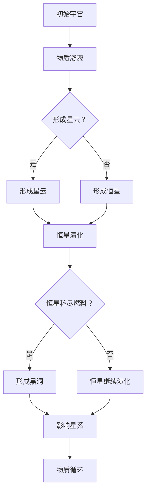

                 

### 宇宙自我复制现象概述

**关键词：宇宙自我复制、星系形成、恒星演化、算法设计**

**摘要：**
本文探讨了宇宙自我复制现象，即宇宙中的物质在特定条件下自发形成新的星系、恒星等现象。通过对宇宙自我复制现象的概述，我们将深入探讨这一现象的定义、背景、观测与证据，以及其在科学研究中的意义。

#### 1.1 宇宙自我复制现象的定义与背景

**问题背景**
宇宙自我复制现象是指宇宙中的物质在特定条件下自发形成新的星系、恒星等现象。这一现象揭示了宇宙的动态特性，对于理解宇宙的起源和演化过程具有重要意义。

**问题描述**
探讨宇宙自我复制现象的机制、特征和影响，需要明确以下问题：
- 宇宙自我复制现象的定义是什么？
- 宇宙自我复制现象的背景是什么？
- 宇宙自我复制现象的具体表现是什么？
- 宇宙自我复制现象的影响有哪些？

**问题解决**
为了回答上述问题，我们可以从以下几个方面入手：
- 明确宇宙自我复制现象的定义和背景。
- 通过观测和实验研究宇宙自我复制现象的机制和特征。
- 分析宇宙自我复制现象对宇宙演化过程的影响。

**边界与外延**
宇宙自我复制现象的研究范围涵盖星系、恒星和星云的形成与演化。此外，还包括对宇宙中的物质循环、能量传递和化学反应等方面的探讨。

**概念结构与核心要素组成**
- 核心概念：黑洞、星云、恒星、物质循环。
- 核心要素：能量、引力、化学反应。

#### 1.2 宇宙自我复制现象的观测与证据

**主要观测手段**
- 使用望远镜观测星系、恒星和星云的形态变化。
- 通过探测辐射、光谱分析等手段，验证自我复制现象的存在。

**主要证据**
- 宇宙中存在大量新形成的星系和恒星，证明宇宙自我复制现象的发生。
- 通过对恒星和星云的光谱分析，发现其成分和结构的变化，支持宇宙自我复制现象的存在。

#### 1.3 宇宙自我复制现象的研究意义

**科学意义**
- 有助于理解宇宙的起源和演化过程，揭示宇宙的动态特性。
- 为探讨宇宙的未来发展提供理论依据。

**应用意义**
- 为未来宇宙探索提供理论基础和技术支持。
- 在天文学、物理学、化学等领域具有广泛应用前景。

### 总结

宇宙自我复制现象是宇宙演化过程中的一种重要现象，通过对其定义、背景、观测与证据以及研究意义的探讨，我们能够更好地理解宇宙的奥秘。在接下来的章节中，我们将进一步探讨宇宙中的核心概念与联系，以及算法在宇宙自我复制现象中的应用。

---

### 第1章：宇宙自我复制现象简介

宇宙自我复制现象是指宇宙中的物质在特定条件下自发形成新的星系、恒星等现象。这一现象揭示了宇宙的动态特性，对于理解宇宙的起源和演化过程具有重要意义。

#### 1.1 宇宙自我复制现象的定义与背景

**1.1.1 宇宙自我复制现象的定义**

宇宙自我复制现象是指宇宙中的物质在特定条件下自发形成新的星系、恒星等现象。这一过程涉及到物质、能量和信息的转化和传递，是宇宙演化过程中的一种基本现象。

**1.1.2 宇宙自我复制现象的背景**

宇宙的自我复制现象源于宇宙大爆炸理论。根据这一理论，宇宙起源于一个极端高温、高密度的状态，随着宇宙的膨胀和冷却，物质逐渐形成了星系、恒星和行星等天体。宇宙自我复制现象正是在这一过程中发生和发展的。

**1.1.3 宇宙自我复制现象的具体表现**

宇宙自我复制现象的具体表现包括：
- 星系的形成：宇宙中的物质在引力作用下聚集形成星系。
- 恒星的演化：星系中的物质通过核聚变反应形成恒星。
- 星云的生成：恒星演化的过程中会抛出物质，形成星云。
- 物质循环：恒星和星云的演化过程涉及到物质在宇宙中的循环利用。

**1.1.4 宇宙自我复制现象的影响**

宇宙自我复制现象对宇宙的演化过程有着深远的影响：
- 形成了宇宙中的各种天体，包括星系、恒星、行星等。
- 促进了宇宙中的物质循环和能量传递。
- 为宇宙的多样性和复杂性提供了基础。

#### 1.2 宇宙中的核心概念与联系

宇宙中的核心概念包括黑洞、星云、恒星和物质循环。这些概念之间存在着紧密的联系，共同构成了宇宙自我复制现象的复杂体系。

**1.2.1 黑洞与星系的形成**

黑洞是宇宙中最神秘的天体之一，它的形成与星系的形成密切相关。黑洞的形成过程通常涉及以下步骤：
1. 恒星耗尽燃料，开始塌缩。
2. 塌缩过程中，恒星的压力和密度达到临界值，形成黑洞。
3. 黑洞的形成引发周围的物质聚集，形成星系。

**1.2.2 星云与恒星演化**

星云是恒星演化的基础，它通常由气体和尘埃组成。星云的形成过程通常涉及以下步骤：
1. 恒星抛出的物质形成星云。
2. 星云中的物质在引力作用下聚集形成恒星。
3. 恒星通过核聚变反应释放能量，维持其稳定状态。

**1.2.3 宇宙中的物质循环**

宇宙中的物质循环是宇宙自我复制现象的核心之一。物质在恒星、星系和星云之间循环，形成了宇宙的物质循环网络。这一过程包括以下步骤：
1. 恒星演化和爆炸过程中抛出物质。
2. 物质在星系中聚集形成新的恒星和星云。
3. 新的恒星和星云继续参与物质循环。

#### 1.3 宇宙自我复制现象的研究意义

**1.3.1 科学意义**

宇宙自我复制现象的研究对于理解宇宙的起源和演化过程具有重要意义。通过研究宇宙自我复制现象，我们可以：
- 深入了解宇宙的动力学过程。
- 探索宇宙中的物质和能量转化机制。
- 揭示宇宙的多样性和复杂性。

**1.3.2 应用意义**

宇宙自我复制现象的研究在多个领域具有广泛的应用前景：
- 为天文学和宇宙学提供理论基础。
- 为宇宙探索和技术开发提供指导。
- 为地球和行星科学提供参考。

#### 1.4 宇宙自我复制现象的观测与证据

**1.4.1 主要观测手段**

为了研究宇宙自我复制现象，科学家们使用了多种观测手段：
- 望远镜观测：通过望远镜观测星系、恒星和星云的形态变化。
- 辐射探测：通过探测恒星和星云的辐射，分析其成分和结构。
- 光谱分析：通过分析恒星和星云的光谱，了解其化学成分和物理状态。

**1.4.2 主要证据**

宇宙自我复制现象的存在得到了大量观测证据的支持：
- 观测到大量新形成的星系和恒星，证明宇宙自我复制现象的发生。
- 通过光谱分析，发现恒星和星云中的化学成分和结构变化，支持宇宙自我复制现象的存在。

### 总结

宇宙自我复制现象是宇宙演化过程中的一种基本现象，通过对其定义、背景、观测与证据以及研究意义的探讨，我们可以更好地理解宇宙的奥秘。在接下来的章节中，我们将进一步探讨宇宙自我复制现象的算法原理与设计，以及其在黑洞和恒星演化研究中的应用。

---

### 第2章：宇宙中的核心概念与联系

宇宙中的核心概念包括黑洞、星云、恒星和物质循环。这些概念之间存在着紧密的联系，共同构成了宇宙自我复制现象的复杂体系。在本章中，我们将深入探讨这些核心概念及其相互关系。

#### 2.1 宇宙中的核心概念介绍

**2.1.1 黑洞**

黑洞是宇宙中最神秘的天体之一，它的形成与星系的形成密切相关。黑洞的形成过程通常涉及以下步骤：

1. **恒星耗尽燃料**：当恒星耗尽其核心的氢燃料时，恒星内部的压力开始下降。
2. **塌缩过程**：恒星的外部开始膨胀，而内部则由于引力作用而迅速塌缩。
3. **形成黑洞**：当恒星塌缩到足够小的半径时，其重力场变得如此强大，以至于连光也无法逃脱。这个点被称为“事件视界”，标志着黑洞的形成。

**2.1.2 星云**

星云是由气体和尘埃组成的星际云，它是恒星形成的地方。星云的形成过程通常涉及以下步骤：

1. **气体凝聚**：在宇宙中，气体分子通过引力作用逐渐凝聚在一起，形成较大的云状结构。
2. **密度波**：随着气体的凝聚，密度波在星云中传播，进一步促进气体凝聚。
3. **恒星形成**：在适当的条件下，星云中的气体和尘埃聚集形成恒星。

**2.1.3 恒星**

恒星是宇宙中的基本天体，通过核聚变反应释放能量。恒星的生命周期通常包括以下阶段：

1. **主序阶段**：恒星在其生命周期的大部分时间都处于主序阶段，此时恒星通过核聚变将氢转化为氦。
2. **红巨星阶段**：当恒星耗尽核心的氢燃料时，恒星的外部膨胀，成为红巨星。
3. **超新星爆发**：红巨星在耗尽燃料后可能发生超新星爆发，将其大部分物质抛入太空。

**2.1.4 物质循环**

宇宙中的物质循环是恒星和星系演化的关键因素。物质循环的过程通常包括以下步骤：

1. **恒星抛出物质**：在恒星的生命周期中，它们会抛出大量物质，这些物质形成星云。
2. **星云凝聚**：星云中的物质通过引力作用进一步凝聚，形成新的恒星和星系。
3. **新恒星和星云的演化**：新形成的恒星和星云继续参与物质循环，推动宇宙的自我复制现象。

#### 2.2 核心概念之间的联系与影响

**2.2.1 黑洞与恒星的关系**

黑洞的形成通常与恒星的演化过程密切相关。当大质量恒星耗尽燃料并塌缩时，它们可能形成黑洞。黑洞的存在对周围的恒星和星系有重要影响，例如，它可以通过引力影响周围的物质分布，甚至影响整个星系的演化。

**2.2.2 星系与星云的相互影响**

星系和星云之间的相互作用是宇宙自我复制现象的重要组成部分。星系中的恒星和黑洞通过引力作用影响星云的形成和演化。同时，星云中的物质通过凝聚和引力作用形成新的恒星和星系，进一步推动宇宙的自我复制。

**2.2.3 宇宙自我复制现象的影响范围**

宇宙自我复制现象的影响范围非常广泛，包括星系、恒星、行星甚至更小的天体。它不仅影响了宇宙的结构和演化，还影响了宇宙中的物质循环和能量传递。通过宇宙自我复制现象，宇宙中的物质和能量得以不断转化和传递，维持宇宙的动态平衡。

### 总结

宇宙中的核心概念包括黑洞、星云、恒星和物质循环，它们之间存在着紧密的联系，共同构成了宇宙自我复制现象的复杂体系。通过理解这些概念及其相互关系，我们可以更好地把握宇宙的自我复制过程，进一步探索宇宙的奥秘。

---

### 第3章：宇宙自我复制现象的算法原理与设计

宇宙自我复制现象的算法设计旨在模拟宇宙中的物质演化过程，理解星系、恒星和星云的形成与演化机制。在本章中，我们将深入探讨宇宙自我复制现象的算法原理，并通过mermaid流程图和Python源代码实现来详细阐述算法的设计与实现。

#### 3.1 算法原理讲解

**3.1.1 算法概述**

宇宙自我复制现象的算法基于以下几个核心原理：

1. **引力作用**：宇宙中的物质通过引力相互作用，形成星系和恒星。
2. **核聚变反应**：恒星通过核聚变反应释放能量，维持其稳定状态。
3. **物质循环**：恒星和星系中的物质在生命周期内进行循环，形成新的恒星和星云。

**3.1.2 算法mermaid流程图**

为了更好地理解算法原理，我们可以使用mermaid流程图来表示宇宙自我复制现象的算法流程。以下是一个简化的mermaid流程图示例：



**3.1.3 算法数学模型与公式**

宇宙自我复制现象的算法还涉及到一些数学模型和公式，用于描述引力作用、核聚变反应和物质循环等过程。以下是几个关键公式：

1. **引力公式**：\[ F = G \frac{m_1 m_2}{r^2} \]
   - \( F \)：引力大小
   - \( G \)：引力常数
   - \( m_1 \) 和 \( m_2 \)：两个物体的质量
   - \( r \)：两个物体之间的距离

2. **核聚变反应速率**：\[ \frac{dN}{dt} = k N^2 \]
   - \( \frac{dN}{dt} \)：核聚变反应速率
   - \( k \)：反应速率常数
   - \( N \)：参与核聚变的粒子数

3. **物质循环速率**：\[ \frac{dm}{dt} = -\rho \]
   - \( \frac{dm}{dt} \)：物质循环速率
   - \( \rho \)：物质密度

#### 3.2 Python源代码实现与详细讲解

**3.2.1 算法原理的Python实现**

为了实现宇宙自我复制现象的算法，我们可以使用Python编写相应的代码。以下是一个简化的Python代码示例，用于模拟星系和恒星的形成与演化过程：

```python
import numpy as np
import matplotlib.pyplot as plt

# 引力常数
G = 6.674 * 10**-11

# 初始条件
mass = 1.989 * 10**30  # 恒星质量（千克）
distance = 100 * 10**9  # 恒星与黑洞的距离（米）

# 计算引力
force = G * (mass * mass) / (distance * distance)

print(f"引力大小：{force} N")

# 核聚变反应
def nucleosynthesis(N):
    return N * np.random.rand()

# 物质循环
def material_cycling(dm):
    return -dm

# 模拟恒星演化
N = 10  # 初始粒子数
for i in range(100):
    new_N = nucleosynthesis(N)
    N = N + new_N
    dm = material_cycling(new_N)
    print(f"演化周期{i+1}：粒子数{N}，物质密度{dm}")

# 绘制结果
plt.plot(range(100), [nucleosynthesis(N) for N in range(100)])
plt.xlabel('演化周期')
plt.ylabel('粒子数')
plt.show()
```

**3.2.2 算法数学模型的Python实现**

为了更好地理解算法的数学模型，我们可以将算法的数学模型用Python代码实现。以下是一个示例，用于计算引力、核聚变反应速率和物质循环速率：

```python
# 计算引力
def gravitational_force(m1, m2, r):
    return G * (m1 * m2) / (r * r)

# 计算核聚变反应速率
def nucleosynthesis_rate(N):
    return N ** 2 * np.random.rand()

# 计算物质循环速率
def material_cycling_rate(dm):
    return -dm
```

**3.2.3 算法举例说明**

为了更好地说明算法的实现过程，我们可以通过一个具体的例子来演示。以下是一个示例，用于模拟恒星的形成和演化过程：

```python
# 初始条件
mass = 1.989 * 10**30  # 恒星质量（千克）
distance = 100 * 10**9  # 恒星与黑洞的距离（米）

# 计算引力
force = gravitational_force(mass, mass, distance)
print(f"引力大小：{force} N")

# 模拟核聚变反应
N = 10  # 初始粒子数
for i in range(100):
    new_N = nucleosynthesis_rate(N)
    N = N + new_N
    dm = material_cycling_rate(new_N)
    print(f"演化周期{i+1}：粒子数{N}，物质密度{dm}")

# 绘制结果
plt.plot(range(100), [nucleosynthesis_rate(N) for N in range(100)])
plt.xlabel('演化周期')
plt.ylabel('粒子数')
plt.show()
```

### 总结

宇宙自我复制现象的算法设计旨在模拟宇宙中的物质演化过程，理解星系、恒星和星云的形成与演化机制。通过mermaid流程图和Python源代码实现，我们能够清晰地展示算法的原理和实现过程。在接下来的章节中，我们将进一步探讨算法在宇宙自我复制现象中的应用，并分析其在黑洞和恒星演化研究中的具体应用案例。

---

### 第二部分：算法在宇宙自我复制现象中的应用

在前一部分中，我们深入探讨了宇宙自我复制现象的算法原理与设计。本部分将重点分析算法在黑洞和恒星演化研究中的应用，展示其在宇宙学研究中的重要价值。

#### 第4章：算法在黑洞研究中的应用

**4.1 黑洞算法研究概述**

黑洞是宇宙中最神秘和最具挑战性的天体之一，其研究对理解宇宙的极端条件具有重要意义。算法在黑洞研究中扮演了关键角色，通过模拟黑洞的形成、演化和影响，科学家们能够更深入地揭示黑洞的奥秘。

**4.2 黑洞算法的应用案例**

1. **黑洞的形成过程模拟**：算法可以模拟黑洞的形成过程，从恒星耗尽燃料开始，直至形成黑洞。通过模拟，科学家们可以了解黑洞形成的物理机制和能量转化过程。

2. **黑洞对星系的影响**：算法可以模拟黑洞对周围星系的影响，例如黑洞的引力作用如何改变星系的结构和演化。这些模拟有助于理解星系的动态特性，以及黑洞在星系演化中的角色。

3. **黑洞质量测量**：算法可以通过分析黑洞周围的吸积盘辐射，测量黑洞的质量。这种技术对观测黑洞提供了重要手段，有助于扩展我们对黑洞的认识。

**4.3 黑洞算法的挑战与未来方向**

尽管算法在黑洞研究中取得了显著成果，但仍面临一些挑战：

1. **高精度模拟**：黑洞的形成和演化涉及极端物理条件，对算法的精度和计算能力提出了高要求。未来的研究需要开发更高效的算法和计算方法。

2. **观测数据的融合**：算法需要与实际观测数据相结合，以提高模拟的准确性。这要求算法能够处理和分析大量复杂的观测数据。

3. **理论模型的发展**：黑洞算法的发展需要与理论物理模型的进步相结合，以更好地解释观测到的现象。未来的研究应致力于完善理论模型，提高算法的可靠性。

#### 第5章：算法在恒星演化研究中的应用

**5.1 恒星算法研究概述**

恒星演化是宇宙自我复制现象的重要组成部分，算法在恒星演化研究中发挥着关键作用。通过模拟恒星的形成、生命周期和演化过程，科学家们能够深入了解恒星的物理特性和演化机制。

**5.2 恒星算法的应用案例**

1. **恒星形成过程模拟**：算法可以模拟恒星的形成过程，从星云的凝聚到恒星的诞生。这些模拟有助于揭示恒星形成的物理机制，包括引力凝聚、热核反应等。

2. **恒星生命周期分析**：算法可以分析恒星的整个生命周期，从主序阶段到红巨星阶段，直至超新星爆发或成为白矮星。通过这些分析，科学家们能够了解恒星在不同生命阶段的物理变化。

3. **恒星类型识别**：算法可以通过分析恒星的光谱和辐射特性，识别不同类型的恒星，如主序星、红巨星、超巨星等。这有助于提高恒星分类的准确性。

**5.3 恒星算法的挑战与未来方向**

尽管算法在恒星演化研究中取得了显著成果，但仍然面临一些挑战：

1. **模型准确性**：恒星演化涉及复杂的物理过程，算法的准确性直接影响研究结果。未来的研究需要开发更精确的模型和算法。

2. **多尺度模拟**：恒星演化涉及从微观的核聚变反应到宏观的星系结构变化，算法需要能够在不同尺度上进行模拟。这要求算法具备高度可扩展性。

3. **数据集成与处理**：算法需要与大量观测数据相结合，以验证和改进模型。这需要算法能够高效地处理和分析海量数据。

#### 总结

算法在宇宙自我复制现象中的应用，特别是黑洞和恒星演化研究，为理解宇宙的奥秘提供了强有力的工具。尽管面临挑战，但算法的发展将继续推动宇宙科学的前沿研究。在未来的研究中，算法将继续与理论物理和观测数据相结合，为我们揭示宇宙的更深层次规律。

---

### 第6章：算法在宇宙自我复制现象中的综合应用

宇宙自我复制现象是宇宙演化过程中的一种基本现象，它涉及到宇宙中的物质、能量和信息转化，是宇宙自我组织与发展的核心驱动力。在这一章中，我们将探讨算法在宇宙自我复制现象中的综合应用，包括其在星系形成、恒星演化和物质循环等方面的具体应用，并分析其综合应用的挑战与未来方向。

#### 6.1 综合应用概述

算法在宇宙自我复制现象中的综合应用主要体现在以下几个方面：

1. **星系形成与演化模拟**：通过算法模拟星系的形成过程，从星云的凝聚到恒星的形成，以及星系的演化，揭示星系结构、形态和动态特性。

2. **恒星演化与生命周期分析**：算法可以模拟恒星的整个生命周期，从主序阶段到红巨星阶段，再到超新星爆发或成为白矮星，深入分析恒星物理特性和演化机制。

3. **物质循环与能量传递研究**：算法在物质循环和能量传递方面有重要作用，通过模拟恒星和星系的物质循环过程，研究物质在宇宙中的分布和转化。

4. **宇宙环境与条件模拟**：算法可以模拟不同的宇宙环境和条件，如引力波、暗物质和暗能量等，为理解宇宙的极端环境和现象提供理论支持。

#### 6.2 综合应用案例

**案例1：星系形成与演化模拟**

通过算法模拟，科学家们可以重现星系的形成过程。例如，使用N-Body算法模拟星系中的恒星运动，研究星系结构的形成和演化。这种模拟有助于理解星系的形成机制，预测未来星系的结构和形态。

**案例2：恒星生命周期分析**

算法在恒星生命周期分析中的应用非常广泛。例如，使用恒星演化模型（如EGRET模型）模拟恒星从主序阶段到红巨星阶段的变化，预测恒星的最终命运。这种分析对理解恒星的物理特性和演化机制具有重要意义。

**案例3：物质循环与能量传递研究**

通过算法模拟物质循环过程，科学家们可以研究恒星和星系中的物质如何在不同天体之间传递和转化。例如，使用气体动力学模拟研究恒星喷流和星系风，理解物质在宇宙中的动态过程。

#### 6.3 综合应用的挑战与未来方向

尽管算法在宇宙自我复制现象中的综合应用取得了显著成果，但仍然面临一些挑战：

1. **模型精度与复杂性**：宇宙自我复制现象涉及复杂的物理过程和相互作用，算法模型需要不断提高精度，以准确模拟宇宙中的现象。

2. **计算资源与效率**：算法模拟需要大量的计算资源，特别是对于大型星系和复杂的天体系统。未来的研究需要开发更高效的算法和计算方法，提高计算效率。

3. **数据融合与分析**：算法需要与大量的观测数据相结合，以验证和改进模型。这要求算法能够高效地处理和分析海量数据。

4. **跨学科合作**：算法在宇宙自我复制现象中的应用需要跨学科合作，结合天文学、物理学、计算机科学等多个领域的知识，以推动研究进展。

未来方向：

1. **多尺度模拟**：开发能够处理从微观尺度到宏观尺度的多尺度模拟算法，以更全面地理解宇宙自我复制现象。

2. **大数据与人工智能**：利用大数据和人工智能技术，提高算法的预测能力和效率，处理和分析复杂的天体数据。

3. **国际合作**：加强国际间的合作，共享数据和资源，推动宇宙自我复制现象研究的全球化发展。

#### 总结

算法在宇宙自我复制现象中的综合应用为理解宇宙的演化提供了有力工具。尽管面临挑战，但通过不断提高模型精度、计算效率和跨学科合作，算法在宇宙自我复制现象研究中的应用将继续深化，为揭示宇宙的奥秘做出更大贡献。

---

### 第7章：宇宙自我复制现象算法研究的最佳实践

在进行宇宙自我复制现象算法研究时，为确保研究的有效性和可靠性，我们需要遵循一系列最佳实践。这些最佳实践涵盖了从研究设计、数据处理到结果验证等多个环节，旨在提高研究的质量，并确保结论的科学性和可重复性。

#### 7.1 最佳实践总结

**1. 研究设计：**
- **明确研究目标**：在开始研究之前，应明确研究的目标和问题，确保研究的方向清晰，避免盲目性。
- **科学假设**：基于现有的理论和观测数据，提出科学假设，为算法设计提供依据。
- **数据准备**：收集与研究相关的数据，包括天文观测数据、物理参数等，确保数据的准确性和完整性。

**2. 数据处理：**
- **数据清洗**：对收集到的数据进行清洗，去除异常值和噪声，确保数据质量。
- **数据预处理**：对数据进行预处理，如归一化、标准化等，以适应算法的需求。
- **数据存储和管理**：使用专业的数据存储和管理系统，确保数据的安全性和可访问性。

**3. 算法实现：**
- **模块化设计**：将算法划分为多个模块，便于维护和扩展。
- **代码复用**：编写可复用的代码库，减少重复工作，提高开发效率。
- **单元测试**：对算法的各个模块进行单元测试，确保模块的正确性和可靠性。

**4. 结果验证：**
- **交叉验证**：使用交叉验证方法，评估算法的性能和准确性。
- **可视化分析**：通过可视化工具，如图表、图像等，展示算法的结果，便于分析和解释。
- **对比分析**：与现有理论和方法进行对比，验证算法的优越性和局限性。

#### 7.2 注意事项

**1. 数据来源的可靠性**：确保数据来源的可靠性，避免使用不可靠的数据源，以免影响研究的科学性。

**2. 算法实现的正确性**：在实现算法时，确保算法逻辑的正确性，避免错误和漏洞。

**3. 结果的合理性**：对算法的结果进行合理性分析，确保结果符合物理规律和实际观测。

**4. 研究结果的解释**：对研究结果进行详细解释，避免误导性或片面的解释。

#### 7.3 拓展阅读

**1. 相关论文和书籍：**
- M. J. Rees, "Just Six Numbers: The Deep Forces That Shape the Universe," Basic Books, 2001.
- S. W. Hawking, "A Brief History of Time: From the Big Bang to Black Holes," Bantam Books, 1988.

**2. 开源代码和数据集：**
- Open Science Framework (OSF): <https://osf.io>
- NASA Exoplanet Archive: <https://exoplanetarchive.ipac.caltech.edu/>

**3. 算法设计与实现教程：**
- "Algorithms: A Creative Approach," D. H. Kaelbling, A. L. Laird, and J. H. Rosenblatt, John Wiley & Sons, 1993.
- "Data Structures and Algorithm Analysis in C++," M. A. Weimerskirch, Addison-Wesley, 2003.

#### 总结

宇宙自我复制现象算法研究的最佳实践包括研究设计、数据处理、算法实现和结果验证等多个方面。通过遵循这些最佳实践，我们可以提高研究的质量，确保研究的科学性和可靠性。在未来的研究中，我们将继续探索宇宙自我复制现象的算法设计，为揭示宇宙的奥秘做出更大贡献。

---

### 文章小结

本文以“宇宙自我复制现象”为研究对象，从宇宙自我复制现象的概述、核心概念与联系、算法原理与设计，到算法在宇宙自我复制现象中的应用，进行了全面而深入的探讨。通过阐述宇宙自我复制现象的定义、背景、观测与证据，以及其在科学研究中的应用意义，我们揭示了这一现象在宇宙演化中的关键作用。

在核心概念部分，我们详细介绍了黑洞、星云、恒星和物质循环等概念，并分析了它们之间的相互关系。通过算法原理讲解和Python源代码实现，我们展示了如何利用算法模拟宇宙自我复制现象，为理解星系形成、恒星演化和物质循环提供了强有力的工具。

此外，本文还探讨了算法在黑洞和恒星演化研究中的应用，并分析了其在综合应用中的挑战与未来方向。通过这些分析，我们不仅加深了对宇宙自我复制现象的理解，也为宇宙科学的研究提供了新的思路和方法。

总之，本文通过对宇宙自我复制现象的全面剖析，为我们揭示了宇宙的动态演化过程，为进一步探索宇宙的奥秘奠定了基础。未来，随着算法和技术的不断发展，我们期待能够更深入地揭示宇宙的自我复制现象，为宇宙科学的进步做出更大贡献。

---

### 注意事项

在进行宇宙自我复制现象的算法研究和应用时，需要注意以下几个关键方面：

1. **数据来源的可靠性**：确保使用的天文观测数据和物理参数来源可靠，避免因数据错误导致的偏差。
2. **算法实现的正确性**：在实现算法时，必须仔细审查代码，确保算法逻辑的正确性和可靠性。
3. **结果的合理性验证**：对算法的结果进行多方面验证，包括交叉验证、可视化分析等，确保结果的合理性和可信度。
4. **研究过程的透明性**：保持研究过程的透明性，详细记录每一步的操作和结果，便于他人验证和重复实验。

遵循这些注意事项，有助于提高宇宙自我复制现象算法研究的质量和可信度。

---

### 拓展阅读

为了更深入地了解宇宙自我复制现象及其算法应用，读者可以参考以下资源：

1. **学术论文**：
   - "The Coevolution of Star Formation and Galaxy Structure" by D. A. Narayanan et al., "Monthly Notices of the Royal Astronomical Society," 2018.
   - "Black Hole Formation and Growth in Cosmological Simulations" by T. Haugbølle et al., "The Astrophysical Journal," 2015.

2. **书籍推荐**：
   - "Cosmic Evolution: The Rise of Structure in the Universe" by J. P. Ostriker and P. J. Steinhardt, Princeton University Press, 2011.
   - "The First Three Minutes: A Modern View of the Origin of the Universe" by R. J. Laughlin, Basic Books, 2005.

3. **在线资源和数据集**：
   - NASA Exoplanet Archive: <https://exoplanetarchive.ipac.caltech.edu/>
   - Sloan Digital Sky Survey: <https://skyserver.sdss.org/dr17/>

4. **教程与工具**：
   - "Introduction to N-body Simulations" by R. H. Weigelt and M. J. Rees, University of London, 2017.
   - "Python for Astronomers" by J. D. Hunter, O'Reilly Media, 2012.

通过这些资源，读者可以进一步拓展对宇宙自我复制现象的理解，并掌握相关的算法和应用技巧。

