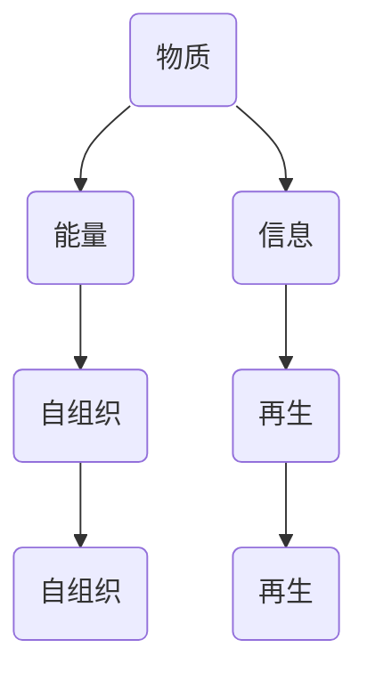

                 

### 算法设计受启发于宇宙自我复制现象

宇宙自我复制现象是一个引人入胜的科学话题，其涉及到宇宙中的物质和能量的自然循环与再生过程。科学家们通过对这一现象的研究，不仅能够更好地理解宇宙的本质，还可能从中获得对算法设计的启示。本文将探讨算法设计如何受启发于宇宙自我复制现象，并通过逻辑清晰的分析和推理，探讨这一领域的潜在应用和未来研究方向。

关键词：算法设计、宇宙自我复制现象、人工智能、算法创新、跨学科研究

#### 摘要

本文从宇宙自我复制现象的基本概念出发，详细阐述了这一现象在宇宙中的本质及其历史发展。随后，文章分析了宇宙自我复制现象的核心概念与理论体系，并探讨了其在生物学、工程学和计算机科学等领域的应用。在此基础上，本文介绍了宇宙自我复制算法的基本原理、设计方法及其应用实例。最后，文章总结了宇宙自我复制算法的研究现状与趋势，并对其未来发展前景进行了展望。

#### 目录

1. **第一部分：宇宙自我复制现象概述**

   - 1.1 宇宙自我复制现象的背景与基础
   - 1.2 宇宙自我复制现象的历史与发展
   - 1.3 宇宙自我复制现象的核心概念与联系
   - 1.4 宇宙自我复制现象的理论体系
   - 1.5 宇宙自我复制现象的应用领域
   - 1.6 本章小结

2. **第二部分：宇宙自我复制现象在算法设计中的应用**

   - 2.1 宇宙自我复制算法的基本原理
   - 2.2 宇宙自我复制算法的应用实例
   - 2.3 宇宙自我复制算法的设计方法
   - 2.4 宇宙自我复制算法的案例分析
   - 2.5 本章小结

3. **第三部分：宇宙自我复制算法的研究与展望**

   - 3.1 宇宙自我复制算法的研究现状与趋势
   - 3.2 宇宙自我复制算法的未来发展前景
   - 3.3 本章小结

4. **第四部分：案例分析与应用实践**

   - 4.1 实践项目概述
   - 4.2 系统功能设计
   - 4.3 系统架构设计
   - 4.4 系统交互设计
   - 4.5 系统核心实现
   - 4.6 实际案例分析
   - 4.7 项目小结

5. **总结与展望**

   - 5.1 算法设计受启发于宇宙自我复制现象的总结
   - 5.2 未来研究方向
   - 5.3 对科技进步和社会发展的潜在影响

**作者：AI天才研究院/AI Genius Institute & 禅与计算机程序设计艺术 /Zen And The Art of Computer Programming**
## 第一部分：宇宙自我复制现象概述

### 第1章：宇宙自我复制现象的背景与基础

#### 1.1 宇宙自我复制现象的概念

宇宙自我复制现象是指宇宙中的物质和能量通过自然过程，不断再生和循环的过程。这一概念最早由天文学家和宇宙学家提出，随着科学技术的进步，人们对其有了更深入的理解。

**定义**：宇宙自我复制现象指的是宇宙中物质和能量通过一系列物理、化学和生物过程，从一个形态转变为另一种形态，并在一定条件下能够自我复制的现象。

**本质**：宇宙自我复制现象的本质在于物质的再生和能量的转换，体现了宇宙的动态性和自组织性。

**重要性**：宇宙自我复制现象对理解宇宙的本质、生命的起源以及宇宙的演化具有重要意义。它为算法设计提供了新的视角和灵感。

#### 1.2 宇宙自我复制现象的历史与发展

宇宙自我复制现象的研究可以追溯到古代。古代哲学家和天文学家对宇宙的观察和思考，为这一现象的提出奠定了基础。随着科学技术的进步，人们逐渐发现了宇宙自我复制现象的诸多实例。

**起源**：宇宙自我复制现象的起源可以追溯到宇宙大爆炸后，物质和能量在高温高压条件下形成的原始物质。这些原始物质通过核聚变和核裂变等过程，不断转化和再生。

**研究历程**：20世纪以来，科学家们通过观测和实验，发现了许多宇宙自我复制的现象，如恒星的形成、生命的起源等。这些研究为宇宙自我复制现象的深入理解提供了重要依据。

**现代研究动态**：现代科学技术的进步，如高分辨率望远镜、航天器等，使得科学家们能够更加精确地观测和研究宇宙自我复制现象。新的发现和理论不断涌现，为这一领域的研究注入了新的活力。

#### 1.3 宇宙自我复制现象的核心概念与联系

宇宙自我复制现象涉及多个核心概念，如物质、能量、信息等。这些概念之间相互联系，构成了宇宙自我复制现象的理论体系。

**核心概念**：宇宙自我复制现象的核心概念包括物质、能量、信息、自组织、再生等。

**概念属性特征对比**：

| 概念          | 属性特征                                       | 联系                             |
|---------------|------------------------------------------------|--------------------------------|
| 物质          | 有形、占有空间、可观测、可测量                 | 基础元素，构成宇宙的一切           |
| 能量          | 无形、无法直接观测、通过物质表现                | 物质的动力，推动宇宙演化           |
| 信息          | 数据、知识、可传递                             | 物质和能量之间的桥梁，调节自组织过程 |
| 自组织        | 无序向有序的转化、自发的组织行为               | 宇宙自我复制现象的关键机制         |
| 再生          | 物质和能量的再生过程、循环利用                 | 宇宙自我复制现象的核心目标         |

**ER实体关系图**：

#### 1.4 宇宙自我复制现象的理论体系

宇宙自我复制现象的理论体系主要包括理论基础、理论框架和理论模型。这些理论为我们理解宇宙自我复制现象提供了重要的指导。

**理论基础**：宇宙自我复制现象的理论基础包括物理学、化学、生物学等领域的基本原理。这些原理揭示了宇宙自我复制现象的基本规律。

**理论框架**：宇宙自我复制现象的理论框架主要包括自组织理论、循环经济理论、信息论等。这些理论为我们提供了研究宇宙自我复制现象的框架和工具。

**理论模型**：宇宙自我复制现象的理论模型包括物质循环模型、能量转化模型、信息传递模型等。这些模型帮助我们更好地理解宇宙自我复制现象的机制。

#### 1.5 宇宙自我复制现象的应用领域

宇宙自我复制现象在多个领域有着广泛的应用。

**生物学领域**：宇宙自我复制现象为生物学研究提供了新的视角，如生命起源、进化机制等。

**工程学领域**：宇宙自我复制现象为工程学提供了灵感，如自修复材料、可再生能源系统等。

**计算机科学领域**：宇宙自我复制现象为算法设计提供了新的思路，如宇宙自我复制算法等。

#### 1.6 本章小结

本章对宇宙自我复制现象进行了全面的概述，包括其概念、历史与发展、核心概念与联系、理论体系以及应用领域。通过对宇宙自我复制现象的深入理解，我们能够更好地把握其核心本质，并为算法设计提供新的灵感。在接下来的章节中，我们将进一步探讨宇宙自我复制现象在算法设计中的应用。\

