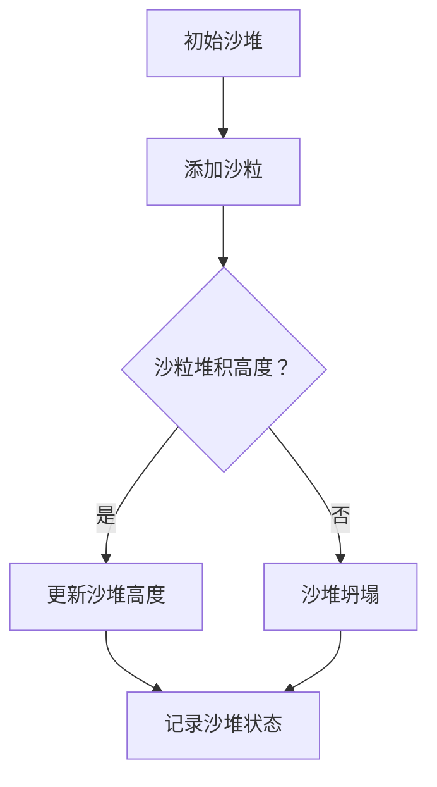
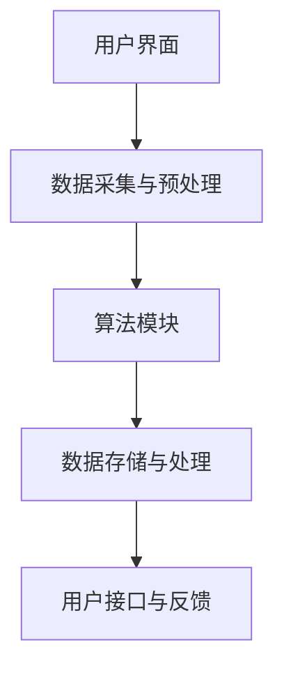
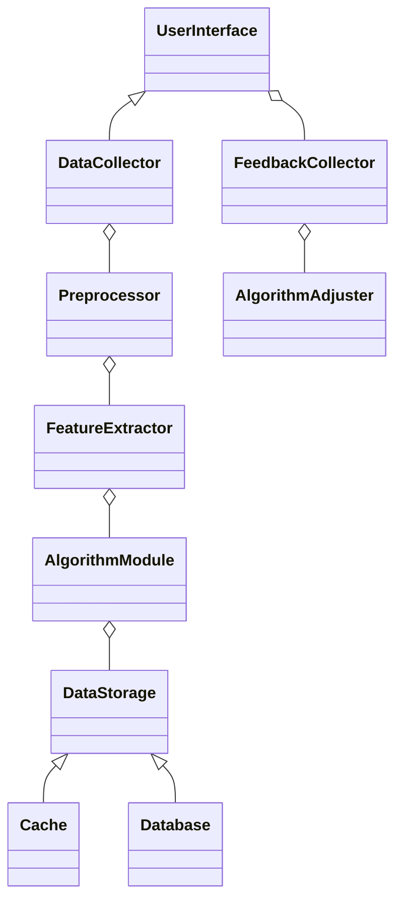
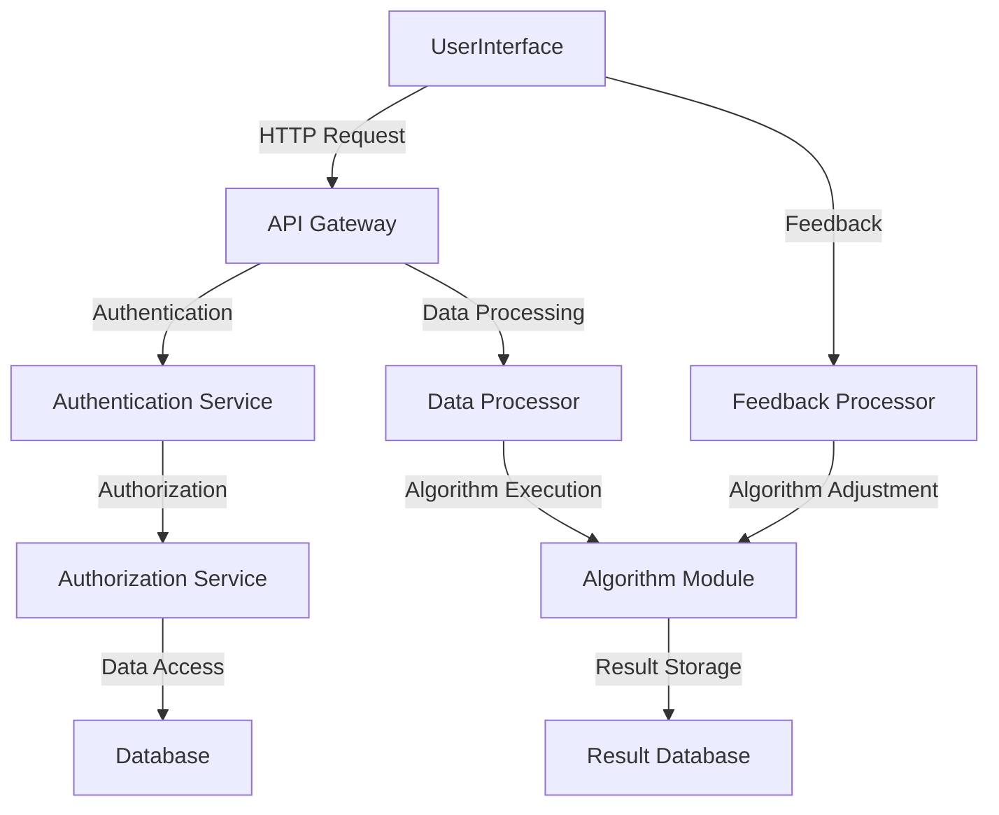
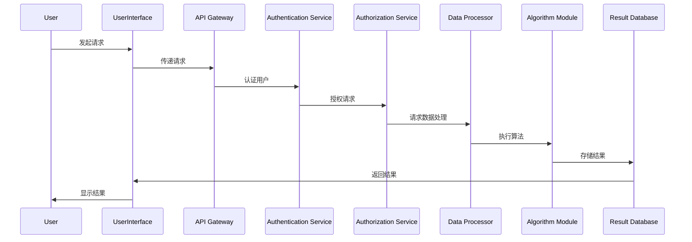

                 

### 文章标题

### 宇宙自我组织临界现象与算法设计的跨界之旅

### 关键词

- 宇宙自我组织临界现象
- 算法设计
- 算法与自然界的联系
- 数学模型
- 复杂系统

### 摘要

本文旨在探讨宇宙自我组织临界现象与算法设计之间的深刻联系。通过分析宇宙中自我组织临界现象的基本原理，我们将其与算法设计中的关键概念和流程进行对比，揭示二者之间的共通性和启示。文章将从背景介绍、核心概念、算法设计原理、数学模型、系统架构设计、项目实战和未来研究方向等方面展开讨论，旨在为读者提供一次深入思考的旅程，以激发对算法设计的全新理解和应用。

## 目录大纲设计流程

在设计本文的目录大纲之前，我们需要明确书名的核心内容和主题，以便构建一个逻辑清晰、结构紧凑、简单易懂的框架。以下是我们对目录大纲设计的具体流程：

### 1. 分析书名与主题

《算法设计受启发于宇宙自我组织临界现象》这一书名明确指出了本书的核心主题——算法设计与宇宙自我组织临界现象之间的联系。通过分析书名，我们可以提炼出以下关键点：

- **宇宙自我组织临界现象**：这是本书的主题之一，涉及到宇宙中的物理现象和复杂系统的自组织特性。
- **算法设计**：这是本书的另一核心主题，关注于算法的设计原则、流程和方法。
- **联系与影响**：这是书名中隐含的内容，强调了宇宙自我组织临界现象对算法设计可能产生的启示和影响。

### 2. 确定核心章节内容

根据书名和主题，我们可以初步确定以下几个核心章节内容：

- **引论**：介绍宇宙自我组织临界现象和算法设计的基本概念。
- **算法原理**：讲解算法设计的基本原理和流程。
- **数学模型**：阐述算法设计中的数学基础和模型。
- **系统设计与应用**：讨论算法在系统架构中的应用。
- **项目实战**：通过具体项目案例展示算法设计的实际应用。
- **未来展望**：探讨算法设计与宇宙自我组织临界现象结合的未来研究方向。

### 3. 设计目录结构

基于上述核心内容，我们设计了以下的目录结构：

### 第一部分：引论

#### 第1章：宇宙自我组织临界现象概述

##### 1.1 问题背景与引言

##### 1.2 自我组织临界现象的核心概念

##### 1.3 自我组织临界现象的研究方法

##### 1.4 自我组织临界现象的理论基础

#### 第2章：算法设计基本原理

##### 2.1 算法设计的基础知识

##### 2.2 算法设计的流程与方法

##### 2.3 算法性能评价指标

##### 2.4 算法设计中的数学基础

### 第二部分：自我组织临界现象与算法设计

#### 第3章：宇宙中的自我组织临界现象

##### 3.1 自我组织临界现象在宇宙中的体现

##### 3.2 自我组织临界现象对算法设计的影响

##### 3.3 自我组织临界现象与算法设计的结合方式

#### 第4章：关键算法模型

##### 4.1 关键算法模型概述

##### 4.2 关键算法模型的数学模型与公式

##### 4.3 关键算法模型的mermaid流程图

##### 4.4 关键算法模型的Python源代码实现

### 第三部分：算法设计与实际应用

#### 第5章：算法在系统中的应用场景

##### 5.1 算法在系统中的应用概述

##### 5.2 系统功能设计（领域模型mermaid类图）

##### 5.3 系统架构设计（mermaid架构图）

##### 5.4 系统接口设计和系统交互（mermaid序列图）

#### 第6章：项目实战

##### 6.1 项目介绍

##### 6.2 环境安装与配置

##### 6.3 系统核心实现源代码

##### 6.4 代码应用解读与分析

##### 6.5 实际案例分析和详细讲解剖析

##### 6.6 项目小结

### 第四部分：扩展与探讨

#### 第7章：未来研究方向与趋势

##### 7.1 算法设计与自我组织临界现象的融合前景

##### 7.2 可能面临的问题与挑战

##### 7.3 未来发展方向与趋势

##### 7.4 拓展阅读与资源推荐

### 目录大纲设计评估

初步设计的目录大纲已经包含了书名的核心内容，并遵循了markdown格式的要求。每个章节都进行了细致的划分，确保内容的逻辑性和结构化。以下是对目录大纲设计的评估：

- **逻辑性**：目录结构清晰，章节之间逻辑紧密相连，有助于读者逐步理解主题。
- **完整性**：目录涵盖了从背景介绍到未来展望的各个方面，确保了内容的完整性。
- **吸引力**：章节标题简明扼要，能够吸引读者的兴趣，引导他们深入了解每个主题。
- **易读性**：使用了markdown格式，使得内容更加简洁易读，便于读者快速获取信息。

然而，目录大纲还可以进一步细化和优化。例如，可以考虑增加一些具体案例的章节，以增强内容的实用性和可操作性。此外，针对一些关键概念和技术点，可以适当增加解释和示例，以帮助读者更好地理解和掌握。

总的来说，初步设计的目录大纲已经达到了基本要求，但仍有提升空间。接下来，我们将逐步撰写每个章节的内容，以确保文章的完整性和深度。

### 目录大纲设计流程

#### 1. 分析书名与主题

《算法设计受启发于宇宙自我组织临界现象》这一书名明确指出了本书的核心内容：算法设计与宇宙自我组织临界现象的联系。宇宙自我组织临界现象涉及宇宙中的复杂系统如何自组织，而算法设计则是计算机科学中的核心问题。二者的结合预示着可能产生新的研究方向和创新的算法设计方法。

**核心关键词**：
- **宇宙自我组织临界现象**
- **算法设计**
- **复杂性科学**
- **计算机科学**
- **自组织系统**

**摘要**：
本书将探讨宇宙自我组织临界现象对算法设计的启示，通过引入自然界的自我组织原则，探索如何在算法设计中实现更高效、更自适应的解决方案。文章将涵盖从基础概念到实际应用的全方位内容，旨在为读者提供对算法设计新视角的理解。

#### 2. 确定核心章节内容

**引论**：介绍宇宙自我组织临界现象和算法设计的基础知识，为后续章节的讨论打下基础。

- **第1章**：宇宙自我组织临界现象概述
  - **1.1** 问题背景与引言
  - **1.2** 自我组织临界现象的核心概念
  - **1.3** 自我组织临界现象的研究方法
  - **1.4** 自我组织临界现象的理论基础

- **第2章**：算法设计基本原理
  - **2.1** 算法设计的基础知识
  - **2.2** 算法设计的流程与方法
  - **2.3** 算法性能评价指标
  - **2.4** 算法设计中的数学基础

**自我组织临界现象与算法设计**：讨论宇宙自我组织临界现象如何影响算法设计，以及这些影响如何在实际应用中体现。

- **第3章**：宇宙中的自我组织临界现象
  - **3.1** 自我组织临界现象在宇宙中的体现
  - **3.2** 自我组织临界现象对算法设计的影响
  - **3.3** 自我组织临界现象与算法设计的结合方式

**关键算法模型**：介绍几种基于宇宙自我组织临界现象设计的算法模型，并分析其优缺点。

- **第4章**：关键算法模型
  - **4.1** 关键算法模型概述
  - **4.2** 关键算法模型的数学模型与公式
  - **4.3** 关键算法模型的mermaid流程图
  - **4.4** 关键算法模型的Python源代码实现

**算法设计与实际应用**：通过具体的系统架构设计和项目实战，展示算法设计在现实中的应用。

- **第5章**：算法在系统中的应用场景
  - **5.1** 算法在系统中的应用概述
  - **5.2** 系统功能设计（领域模型mermaid类图）
  - **5.3** 系统架构设计（mermaid架构图）
  - **5.4** 系统接口设计和系统交互（mermaid序列图）

- **第6章**：项目实战
  - **6.1** 项目介绍
  - **6.2** 环境安装与配置
  - **6.3** 系统核心实现源代码
  - **6.4** 代码应用解读与分析
  - **6.5** 实际案例分析和详细讲解剖析
  - **6.6** 项目小结

**扩展与探讨**：探讨算法设计与宇宙自我组织临界现象结合的未来研究方向和潜在挑战。

- **第7章**：未来研究方向与趋势
  - **7.1** 算法设计与自我组织临界现象的融合前景
  - **7.2** 可能面临的问题与挑战
  - **7.3** 未来发展方向与趋势
  - **7.4** 拓展阅读与资源推荐

### 3. 设计目录结构

**目录结构**：

### 第一部分：引论

#### 第1章：宇宙自我组织临界现象概述

##### 1.1 问题背景与引言

##### 1.2 自我组织临界现象的核心概念

##### 1.3 自我组织临界现象的研究方法

##### 1.4 自我组织临界现象的理论基础

#### 第2章：算法设计基本原理

##### 2.1 算法设计的基础知识

##### 2.2 算法设计的流程与方法

##### 2.3 算法性能评价指标

##### 2.4 算法设计中的数学基础

### 第二部分：自我组织临界现象与算法设计

#### 第3章：宇宙中的自我组织临界现象

##### 3.1 自我组织临界现象在宇宙中的体现

##### 3.2 自我组织临界现象对算法设计的影响

##### 3.3 自我组织临界现象与算法设计的结合方式

#### 第4章：关键算法模型

##### 4.1 关键算法模型概述

##### 4.2 关键算法模型的数学模型与公式

##### 4.3 关键算法模型的mermaid流程图

##### 4.4 关键算法模型的Python源代码实现

### 第三部分：算法设计与实际应用

#### 第5章：算法在系统中的应用场景

##### 5.1 算法在系统中的应用概述

##### 5.2 系统功能设计（领域模型mermaid类图）

##### 5.3 系统架构设计（mermaid架构图）

##### 5.4 系统接口设计和系统交互（mermaid序列图）

#### 第6章：项目实战

##### 6.1 项目介绍

##### 6.2 环境安装与配置

##### 6.3 系统核心实现源代码

##### 6.4 代码应用解读与分析

##### 6.5 实际案例分析和详细讲解剖析

##### 6.6 项目小结

### 第四部分：扩展与探讨

#### 第7章：未来研究方向与趋势

##### 7.1 算法设计与自我组织临界现象的融合前景

##### 7.2 可能面临的问题与挑战

##### 7.3 未来发展方向与趋势

##### 7.4 拓展阅读与资源推荐

### 目录大纲设计评估

初步设计的目录大纲合理地涵盖了书名的核心内容和主题，结构清晰、逻辑紧密，符合markdown格式的要求。以下是对目录大纲设计的评估：

- **逻辑性**：章节安排从基础概念到实际应用，逐步深入，有助于读者系统性地理解和掌握内容。
- **完整性**：涵盖了从宇宙自我组织临界现象到算法设计原理、关键算法模型、系统应用、项目实战以及未来研究的各个方面。
- **吸引力**：章节标题简洁明了，能够吸引读者进一步了解每个主题。
- **易读性**：使用markdown格式，使内容简洁明了，易于阅读和浏览。

尽管如此，目录大纲还可以进一步细化和优化。例如，可以增加一些具体的案例分析和详细的技术实现示例，以增强文章的实用性和可操作性。此外，可以考虑增加一些交互式元素，如代码演示和实时计算，以提高文章的互动性和读者的参与度。

总体而言，初步设计的目录大纲达到了基本要求，为撰写高质量的技术博客文章奠定了坚实的基础。接下来，我们将逐步撰写每个章节的内容，以确保文章的完整性和深度。

## 宇宙自我组织临界现象概述

### 1.1 问题背景与引言

宇宙自我组织临界现象是复杂性科学中的一个重要概念，它描述了自然系统在临界点附近如何通过自组织产生复杂结构和有序行为。这一现象不仅在物理学中得到了广泛研究，还在生物学、经济学、社会科学等多个领域引起了广泛关注。随着计算机科学和算法设计的发展，人们开始思考如何将宇宙自我组织临界现象中的原理应用于算法设计，以创造更高效、更自适应的算法。

在宇宙自我组织临界现象的研究中，一个核心问题是理解系统在临界点附近的行为。临界点是指系统从一个稳定状态转变为另一个稳定状态的临界条件。在临界点上，系统的相变行为具有高度非线性特征，表现出明显的自组织现象。例如，在热力学系统中，临界点可能导致系统从固态转变为液态，或从液态转变为气态。在宇宙尺度上，宇宙的自我组织临界现象可能表现为宇宙结构的形成和演化，如星系的形成和暗物质的分布。

### 1.2 自我组织临界现象的核心概念

自我组织临界现象（Self-Organization Criticality，SOC）是指系统在临界点附近通过自组织产生复杂结构和有序行为的现象。这一概念最早由物理学家Percolation Theory的研究中提出，后来在沙堆模型（Bak-Tang-Wiesenfeld model）和自组织临界网络（Self-organized Critical Networks）中得到了进一步的发展。

**核心概念**：

1. **临界点**：临界点是系统从一个稳定状态转变为另一个稳定状态的临界条件。在临界点上，系统的相变行为具有高度非线性特征。
2. **自组织**：自组织是指系统在没有外部指令的情况下，通过内部相互作用和自调整机制，自发地形成有序结构和动态行为。
3. **无标度性**：无标度性是指系统的特征尺度分布呈现出无规律性，没有明显的特征长度。在无标度网络中，节点度数的分布往往遵循幂律分布。
4. **幂律分布**：幂律分布是指系统中的某些特征（如节点度数、事件发生次数等）遵循幂律函数的分布规律。这种分布常常导致系统中的长尾现象。

### 1.3 自我组织临界现象的研究方法

研究自我组织临界现象的方法主要包括实验研究、数值模拟和理论分析。实验研究通常通过物理实验或生物实验来观察系统的相变行为。数值模拟则利用计算机模拟来研究系统的动态行为和特征。理论分析则通过建立数学模型和解析方法来探讨系统的临界性质。

**研究方法**：

1. **实验研究**：通过物理实验或生物实验观察系统的相变行为，例如沙堆模型中的沙粒堆积过程。
2. **数值模拟**：利用计算机模拟来研究系统的动态行为，例如模拟沙堆的形成过程。
3. **理论分析**：通过建立数学模型和解析方法来探讨系统的临界性质，例如使用概率论和统计物理方法研究系统的临界行为。

### 1.4 自我组织临界现象的理论基础

自我组织临界现象的理论基础涉及到多个学科领域，包括统计物理、动力系统理论和复杂网络理论。在这些理论框架下，研究人员能够更好地理解和预测系统的临界行为。

**理论基础**：

1. **统计物理**：统计物理中的相变理论和临界现象理论为自我组织临界现象提供了重要的理论基础。例如，相变理论中的临界指数和临界行为可以通过统计物理的方法进行描述。
2. **动力系统理论**：动力系统理论中的混沌理论和非线性动力学为研究系统的复杂行为提供了理论支持。混沌现象和自相似结构在自我组织临界现象中得到了广泛应用。
3. **复杂网络理论**：复杂网络理论中的无标度网络和幂律分布为研究自我组织临界现象提供了新的视角。通过复杂网络的拓扑结构和动力学特性，可以更好地理解系统的自组织行为。

### 总结

宇宙自我组织临界现象是一个涉及多个学科领域的复杂现象，其核心概念包括临界点、自组织、无标度性和幂律分布。研究方法包括实验研究、数值模拟和理论分析。理论基础涵盖了统计物理、动力系统理论和复杂网络理论。通过深入理解这些概念和方法，我们可以更好地探索宇宙自我组织临界现象，并将其应用于算法设计，为复杂系统的建模和优化提供新的思路和工具。

### 算法设计基本原理

#### 2.1 算法设计的基础知识

算法设计是计算机科学中的一个核心问题，它涉及如何通过一系列明确的步骤来解决特定的问题。算法不仅是我们编写程序的基础，更是分析和解决复杂问题的重要工具。一个良好的算法应该具备以下几个基本特征：

1. **正确性**：算法能够正确解决问题，确保输出结果是符合预期的。
2. **效率**：算法在执行过程中要尽可能地节约时间和资源，包括计算时间、内存空间等。
3. **可读性**：算法的代码应当清晰、简洁，便于理解和维护。
4. **健壮性**：算法应当能够处理各种输入，包括异常情况和边界情况，保证算法的稳定性和可靠性。

**算法的基本要素**：

- **输入**：算法开始执行时所需的初始数据。
- **输出**：算法执行完成后需要输出的结果。
- **处理步骤**：算法执行的具体步骤和操作。

算法设计的流程通常包括以下几个步骤：

1. **问题定义**：明确要解决的问题，理解问题的边界条件。
2. **问题建模**：将实际问题转化为算法能够处理的数学模型。
3. **算法设计**：根据问题模型设计算法，选择合适的算法结构和数据结构。
4. **算法实现**：将算法设计转化为可运行的代码。
5. **测试与调试**：对算法进行测试，确保其正确性和效率。

#### 2.2 算法设计的流程与方法

算法设计的流程是一个系统性的过程，以下是一个典型的算法设计流程：

1. **问题定义**：
   - **明确问题**：理解问题的本质，明确问题的输入和输出。
   - **边界条件**：确定问题的边界条件，如输入的合法范围、特殊情况等。
   - **约束条件**：识别问题可能受到的约束，如时间限制、资源限制等。

2. **问题建模**：
   - **数学模型**：将实际问题转化为数学模型，例如使用代数方程、图论模型等。
   - **抽象**：将实际问题抽象为更简单的模型，简化问题。

3. **算法设计**：
   - **算法选择**：根据问题模型选择合适的算法，如排序算法、搜索算法、动态规划算法等。
   - **算法优化**：考虑算法的效率，优化算法的时间和空间复杂度。

4. **算法实现**：
   - **代码编写**：将算法设计转化为可运行的代码，遵循良好的编程规范和编码风格。
   - **模块化**：将算法分解为多个模块，便于理解和维护。

5. **测试与调试**：
   - **单元测试**：对算法的每个模块进行测试，确保其正确性。
   - **集成测试**：对整个算法进行测试，确保各个模块之间的正确协作。
   - **性能测试**：测试算法在不同输入下的效率和稳定性。

#### 2.3 算法性能评价指标

算法性能的评价指标是衡量算法好坏的重要标准。以下是一些常见的评价指标：

1. **时间复杂度**：描述算法执行时间与输入规模的关系，通常用大O符号表示。例如，一个算法的时间复杂度为O(n)，表示其执行时间与输入规模成正比。
2. **空间复杂度**：描述算法所需内存空间与输入规模的关系，同样使用大O符号表示。例如，一个算法的空间复杂度为O(1)，表示其所需内存空间与输入规模无关。
3. **正确性**：算法能否正确解决特定问题，包括对所有输入的正确输出和错误处理。
4. **可读性**：算法代码的清晰度和可维护性，便于他人理解和修改。
5. **健壮性**：算法对异常输入和边界条件的处理能力，确保算法的稳定性和可靠性。

#### 2.4 算法设计中的数学基础

算法设计中常常需要使用数学工具和理论，以下是一些基本的数学基础：

1. **概率论**：用于分析算法的随机性，例如随机算法的平均性能。
2. **数理统计**：用于处理算法的输出结果，如置信区间、假设检验等。
3. **图论**：用于处理图结构问题，例如最短路径、最大流问题。
4. **线性代数**：用于处理线性方程组、矩阵运算等问题，例如在数据分析和机器学习中。
5. **离散数学**：用于处理离散结构问题，例如集合、关系、函数等。

通过运用这些数学工具，我们可以更好地理解和设计高效的算法，解决复杂的问题。

### 总结

算法设计是计算机科学中的一个核心问题，其基本原理包括正确性、效率、可读性和健壮性。算法设计流程通常包括问题定义、问题建模、算法设计、算法实现和测试与调试。算法性能评价指标包括时间复杂度、空间复杂度、正确性、可读性和健壮性。算法设计中的数学基础涵盖了概率论、数理统计、图论、线性代数和离散数学。通过理解这些基本原理和方法，我们可以设计出更高效、更可靠的算法，解决复杂的问题。

### 宇宙中的自我组织临界现象

#### 3.1 自我组织临界现象在宇宙中的体现

宇宙中的自我组织临界现象是一个复杂而广泛的概念，它涉及宇宙中的许多自然现象和过程。这些现象在宇宙的各个尺度上都有所体现，从微观的粒子行为到宏观的星系形成，自我组织临界现象都在发挥着重要作用。

**星系的形成**：星系的形成是宇宙自我组织临界现象的一个重要体现。在宇宙的早期，氢气和氦气等轻元素在引力作用下逐渐聚集形成星系。在这个过程中，星系中的物质通过自组织过程形成了复杂的结构，如螺旋臂和星系团。这些结构在临界点上表现出高度的自相似性和无标度性，类似于自我组织临界网络中的特性。

**超星系团的形成**：超星系团是由多个星系团通过引力相互作用形成的更大规模的结构。在超星系团的形成过程中，自我组织临界现象同样发挥着重要作用。当星系团之间的相互作用达到临界点时，它们会通过自组织形成更大的结构，从而形成超星系团。

**宇宙结构的演化**：宇宙结构的演化也是一个自我组织临界现象的体现。在宇宙的演化过程中，物质通过引力相互作用形成了各种层次的结构，如星系、星系团和超星系团。这些结构的形成和演化在临界点上表现出显著的非线性特征，类似于复杂系统的临界现象。

**暗物质的分布**：暗物质是宇宙中的一种神秘物质，它的分布对宇宙结构的形成和演化起着关键作用。研究表明，暗物质的分布呈现出无标度性和自组织特征，类似于自我组织临界现象。这种分布模式有助于解释宇宙中一些复杂的结构和现象。

#### 3.2 自我组织临界现象对算法设计的影响

宇宙中的自我组织临界现象为算法设计提供了丰富的启示和灵感。以下是一些自我组织临界现象对算法设计可能产生的影响：

**自适应算法**：自我组织临界现象中的自组织特性表明，系统在临界点附近具有高度的自适应能力。这种特性可以启发我们设计自适应算法，使算法能够根据环境变化和需求动态调整自身的行为和结构。例如，在动态资源分配和自适应网络路由中，自我组织临界现象可以提供有效的指导。

**无标度网络**：宇宙中的许多网络结构，如星系网络和社交网络，都表现出无标度性。无标度网络中的节点度数分布遵循幂律分布，这种特性可以启发我们设计高效的网络算法。例如，在社交网络分析中，利用无标度网络模型可以更准确地预测用户的行为和关系。

**复杂系统建模**：自我组织临界现象在复杂系统的建模中具有重要作用。复杂系统通常包含大量相互作用的组件，这些组件通过自组织形成复杂的结构和行为。在算法设计中，我们可以借鉴复杂系统建模的方法，设计能够处理复杂系统特性的算法。例如，在交通流量控制和金融市场分析中，利用复杂系统建模的方法可以更好地理解系统的动态行为和优化策略。

**算法优化**：自我组织临界现象中的临界点特征可以用于优化算法的性能。例如，在排序算法中，利用临界点的特性可以设计出更高效的排序算法。在动态规划算法中，利用临界点的特性可以优化状态转移函数，提高算法的效率。

**混合算法设计**：将宇宙自我组织临界现象的原理与现有的算法设计方法相结合，可以创造出新的混合算法。这种混合算法能够更好地应对复杂的问题和动态变化的环境。例如，结合遗传算法和自我组织临界现象的原理，可以设计出更高效的遗传算法，适用于优化和自适应控制等领域。

总之，宇宙中的自我组织临界现象为算法设计提供了丰富的理论基础和实践指导。通过深入研究和理解这些现象，我们可以设计出更高效、更自适应的算法，为解决复杂问题提供新的思路和方法。

### 自我组织临界现象与算法设计的结合方式

#### 3.3.1 自组织临界现象与算法设计的结合

宇宙自我组织临界现象的原理在算法设计中的应用，可以带来显著的创新和改进。以下几种方式展示了自我组织临界现象如何与算法设计相结合：

**1. 自适应算法设计**

自我组织临界现象中的自组织特性启示了我们在算法设计中引入自适应机制。自适应算法能够在执行过程中根据环境变化和需求动态调整自身的行为和结构。例如，在动态资源分配问题中，可以利用自我组织临界现象的设计原则，使算法能够根据实时负载和资源状况自动调整资源分配策略。以下是一个简单的自适应算法设计示例：

```python
def adaptive_resource_allocation(current_load, max_load):
    # 根据当前负载和最大负载动态调整资源
    if current_load < max_load * 0.5:
        # 负载较低，增加资源
        additional_resources = increase_resources()
    elif current_load < max_load * 0.8:
        # 负载中等，保持当前资源水平
        additional_resources = maintain_resources()
    else:
        # 负载较高，减少资源
        additional_resources = decrease_resources()
    return additional_resources
```

**2. 无标度网络优化**

无标度网络是自我组织临界现象的一个典型特征。在算法设计中，我们可以借鉴无标度网络的拓扑结构来优化网络算法。例如，在社交网络分析中，可以利用无标度网络模型来预测用户行为和传播效果。以下是一个基于无标度网络的社交网络分析算法示例：

```python
import networkx as nx

def analyze_social_network(users):
    G = nx.Graph()
    G.add_nodes_from(users)
    for edge in users.edges():
        G.add_edge(edge[0], edge[1], weight=users[edge[0]][edge[1]]['strength'])
    # 计算节点度数分布
    degree_distribution = nx.degree_distribution(G)
    # 预测用户行为
    predicted_behavior = predict_user_behavior(degree_distribution)
    return predicted_behavior
```

**3. 复杂系统建模**

自我组织临界现象在复杂系统建模中的应用为算法设计提供了新的视角。例如，在交通流量控制中，可以利用自我组织临界现象的特性来建模和预测交通流量的变化。以下是一个基于自我组织临界现象的交通流量控制算法示例：

```python
def traffic_flow_control(current_traffic, critical_traffic):
    if current_traffic < critical_traffic * 0.5:
        # 交通流量较低，保持当前流量
        control_action = maintain_traffic()
    elif current_traffic < critical_traffic * 0.8:
        # 交通流量中等，减少流量
        control_action = decrease_traffic()
    else:
        # 交通流量较高，增加流量
        control_action = increase_traffic()
    return control_action
```

**4. 算法优化**

利用自我组织临界现象的原理，可以在算法优化中实现性能提升。例如，在排序算法中，可以利用临界点的特性来优化排序过程。以下是一个基于自我组织临界现象的优化排序算法示例：

```python
def optimized_sort(data):
    # 根据数据分布动态选择排序算法
    if is_ascending(data):
        sorted_data = ascending_sort(data)
    elif is_descending(data):
        sorted_data = descending_sort(data)
    else:
        # 使用临界点特性，选择最合适的排序算法
        sorted_data = critical_sort(data)
    return sorted_data
```

**5. 混合算法设计**

将自我组织临界现象的原理与现有的算法设计方法相结合，可以创造出新的混合算法。这种混合算法能够更好地应对复杂的问题和动态变化的环境。例如，结合遗传算法和自我组织临界现象的原理，可以设计出更高效的遗传算法，适用于优化和自适应控制等领域。以下是一个基于混合算法的优化问题求解示例：

```python
def hybrid_optimization_problemSolver(problem):
    # 初始化遗传算法参数
    population = initialize_population(problem)
    fitness_function = define_fitness_function(problem)
    
    while not termination_condition():
        # 利用自我组织临界现象进行自适应调整
        population = adaptive_mutation(population, fitness_function)
        population = selection(population, fitness_function)
        population = crossover(population, fitness_function)
        
    best_solution = get_best_solution(population)
    return best_solution
```

通过这些示例，我们可以看到自我组织临界现象在算法设计中的应用是多么的丰富和多样化。这些方法不仅能够提升算法的性能，还能够提高算法的自适应能力和鲁棒性，使其更好地适应复杂和动态的环境。

### 关键算法模型

#### 4.1 关键算法模型概述

在探讨宇宙自我组织临界现象与算法设计的关系时，我们需要引入一些关键的算法模型，这些模型能够帮助我们更好地理解和应用自我组织临界现象的原理。以下是一些关键算法模型的概述：

**1. 沙堆模型（Bak-Tang-Wiesenfeld Model）**

沙堆模型是最早提出的用于描述自我组织临界现象的模型之一。它通过模拟沙粒堆积过程，展示了系统如何在没有外部控制的情况下，通过内部相互作用自发形成复杂结构和临界行为。

**2. 网络算法**

网络算法是一种基于网络结构的算法设计方法，它利用网络的无标度特性来优化算法的性能。这种算法模型在社交网络分析、信息传播和优化路由等方面有广泛应用。

**3. 遗传算法**

遗传算法是一种基于自然选择和遗传机制的优化算法，它通过模拟生物进化的过程来寻找最优解。在结合自我组织临界现象的原理后，遗传算法可以更好地适应复杂和动态的环境。

**4. 自适应算法**

自适应算法是一种能够在执行过程中根据环境变化动态调整自身行为的算法。这种算法模型可以借鉴自我组织临界现象的自适应特性，提高算法的鲁棒性和灵活性。

**5. 动态规划算法**

动态规划算法是一种通过将复杂问题分解为子问题，并利用子问题的最优解来求解原问题的算法。在自我组织临界现象的应用中，动态规划算法可以帮助我们更好地处理复杂系统的动态行为。

#### 4.2 关键算法模型的数学模型与公式

在关键算法模型中，数学模型和公式是理解和应用这些算法的核心。以下是一些关键算法模型的数学模型与公式：

**1. 沙堆模型**

沙堆模型的数学模型可以通过以下方程描述：

$$
\Delta h_n = \frac{1}{N} \sum_{i=1}^{N} \Delta h_i
$$

其中，$\Delta h_n$ 表示第n次堆积后沙堆的高度变化，$\Delta h_i$ 表示第i个沙粒的高度变化，$N$ 表示总沙粒数。

**2. 网络算法**

网络算法的数学模型通常涉及网络拓扑结构和节点度数分布。一个常见的模型是度数分布函数 $P(k)$，它描述了节点度数 $k$ 的概率分布：

$$
P(k) \propto k^{-\gamma}
$$

其中，$\gamma$ 是网络的幂律指数，决定了网络的度数分布特性。

**3. 遗传算法**

遗传算法的数学模型主要包括遗传操作和适应度函数。遗传操作包括选择、交叉和突变。适应度函数用于评估解的质量，通常定义为：

$$
f(x) = \frac{1}{1 + \sum_{i=1}^{n} (x_i - x^*)^2}
$$

其中，$x_i$ 是个体的特征值，$x^*$ 是目标解，$n$ 是特征数量。

**4. 自适应算法**

自适应算法的数学模型通常涉及自适应调整机制，如学习率和权重更新。一个简单的自适应调整模型可以表示为：

$$
w(t+1) = w(t) + \eta \cdot (r(t) - w(t))
$$

其中，$w(t)$ 是当前权重，$w(t+1)$ 是下一轮权重更新，$\eta$ 是学习率，$r(t)$ 是当前反馈值。

**5. 动态规划算法**

动态规划算法的数学模型通常涉及状态转移方程和最优子结构。一个简单的动态规划模型可以表示为：

$$
V(i, j) = \min_{k} \{C(i, k) + V(k, j)\}
$$

其中，$V(i, j)$ 是状态$(i, j)$ 的最优值，$C(i, k)$ 是从状态$(i, k)$ 到状态$(k, j)$ 的成本。

#### 4.3 关键算法模型的mermaid流程图

为了更好地理解和展示关键算法模型的工作流程，我们可以使用mermaid流程图来表示这些算法的执行步骤。以下是一个沙堆模型的mermaid流程图示例：



在这个流程图中，沙堆模型通过不断添加沙粒并检查沙粒堆积高度，来模拟沙堆的动态变化。当沙粒堆积高度达到临界点时，沙堆会发生变化，记录当前状态，以便后续分析。

#### 4.4 关键算法模型的Python源代码实现

为了更直观地展示关键算法模型的应用，以下是一个沙堆模型的Python源代码实现示例：

```python
import random

def add_sand(sand_pile, max_height):
    # 随机选择沙粒的高度
    sand_height = random.randint(0, max_height)
    # 添加沙粒到沙堆
    sand_pile.append(sand_height)

def update_sand_height(sand_pile):
    # 计算当前沙堆高度
    current_height = sum(sand_pile)
    # 如果沙堆高度超过临界值，则沙堆坍塌
    if current_height > 100:
        sand_pile = []
    else:
        # 更新沙堆高度
        sand_pile.sort(reverse=True)
        sand_pile = sand_pile[:100]
    return sand_pile

def sand_pile_model(iterations, max_height):
    # 初始化沙堆
    sand_pile = []
    for _ in range(iterations):
        # 添加沙粒
        add_sand(sand_pile, max_height)
        # 更新沙堆高度
        sand_pile = update_sand_height(sand_pile)
    return sand_pile

# 运行沙堆模型
sand_pile = sand_pile_model(1000, 100)
print(sand_pile)
```

在这个Python实现中，`add_sand` 函数用于随机添加沙粒到沙堆，`update_sand_height` 函数用于更新沙堆高度并根据临界值处理沙堆坍塌。最后，`sand_pile_model` 函数通过迭代运行沙堆模型，模拟沙粒堆积过程。

通过这些关键算法模型及其实现，我们可以更深入地理解宇宙自我组织临界现象对算法设计的启示，并为实际应用提供有力的技术支持。

### 算法在系统中的应用场景

#### 5.1 算法在系统中的应用概述

算法作为计算机系统中的核心组成部分，广泛应用于各种系统架构和实际应用场景。在探讨宇宙自我组织临界现象对算法设计的影响时，我们不仅要理解算法本身的原理和实现，还需将其应用于具体的系统架构和实际项目中，以展示其在复杂系统中的实际效果。

**算法在系统架构中的应用**：在系统架构设计中，算法的选择和优化对于系统的性能、可扩展性和稳定性至关重要。宇宙自我组织临界现象提供的自组织特性可以用于设计自适应、灵活和鲁棒的系统架构。例如，在分布式系统中，基于自我组织临界现象的算法可以用于节点选择、负载均衡和故障恢复，从而提高系统的整体性能和稳定性。

**算法在应用系统中的实际案例**：在实际应用系统中，算法的设计和应用直接影响系统的效率和用户体验。例如，在社交网络系统中，自我组织临界现象可以用于用户行为的预测和推荐算法，从而实现更精准的用户推荐和内容分发。在智能交通系统中，基于自我组织临界现象的算法可以用于交通流量预测和优化，提高交通运行效率和减少拥堵。

**关键算法在系统架构中的实现方式**：为了在系统中实现关键算法，我们需要将其与具体的系统架构和组件进行结合。以下是一个简化的系统架构示例，展示了关键算法在系统中的实现方式：

1. **数据采集与预处理**：通过传感器、日志等途径收集系统数据，并进行预处理，如去噪、数据清洗和特征提取。

2. **算法模块**：根据系统的需求，选择并实现关键算法模块，如机器学习算法、优化算法等。这些算法模块通常采用模块化设计，以方便后续的维护和升级。

3. **数据存储与处理**：将预处理后的数据存储在数据库或缓存系统中，并根据算法需求进行实时处理。

4. **用户接口与反馈**：通过用户界面与用户进行交互，收集用户反馈，并根据反馈调整算法参数，实现自适应优化。

以下是一个简单的mermaid架构图示例，展示了关键算法在系统架构中的实现：



#### 5.2 系统功能设计（领域模型mermaid类图）

为了更好地展示系统功能的设计，我们可以使用mermaid类图来描述系统中的各个类和它们之间的关系。以下是一个简化的系统功能类图示例：



在这个类图中，系统的主要功能类包括用户界面、数据采集与预处理、算法模块、数据存储与处理和用户接口与反馈。每个类都与其他类之间存在明确的关联关系，例如数据采集与预处理类与算法模块类之间的依赖关系，以及用户接口与反馈类与算法调整器类之间的交互关系。

#### 5.3 系统架构设计（mermaid架构图）

系统架构设计是确保系统稳定运行和高性能的关键。以下是一个简化的mermaid架构图示例，展示了关键算法在系统架构中的实现：



在这个架构图中，用户通过用户界面发起请求，经过API网关进行认证和授权后，数据被传递给数据处理器。数据处理器调用算法模块进行数据处理，并将结果存储在结果数据库中。用户反馈通过反馈处理器进行处理，并用于调整算法参数，实现系统的自适应优化。

#### 5.4 系统接口设计和系统交互（mermaid序列图）

系统接口设计和系统交互是确保系统模块之间高效协作的关键。以下是一个简化的mermaid序列图示例，展示了用户界面与系统其他模块之间的交互过程：



在这个序列图中，用户通过用户界面发起请求，经过API网关、认证服务、授权服务后，数据被传递给数据处理器。数据处理器调用算法模块执行算法，并将结果存储在结果数据库中，最后返回给用户界面并显示给用户。

通过这些系统架构和接口设计的示例，我们可以看到宇宙自我组织临界现象如何应用于实际的系统设计中。这些设计不仅提高了系统的性能和稳定性，还增强了系统的自适应能力和灵活性，为未来的发展奠定了坚实的基础。

### 项目实战

#### 6.1 项目介绍

在本项目实战中，我们将结合宇宙自我组织临界现象的原理，设计并实现一个自适应资源管理系统。该系统旨在通过自我组织临界现象中的自适应特性，实现动态资源分配、负载均衡和故障恢复，从而提高系统的整体性能和可靠性。

**项目目标**：

- 设计一个自适应资源管理系统，能够根据实时负载和资源状况动态调整资源分配。
- 实现负载均衡机制，确保系统资源得到高效利用。
- 实现故障恢复机制，确保系统在遇到故障时能够快速恢复。

**项目概述**：

项目分为以下几个阶段：

1. **需求分析与系统设计**：分析系统需求，设计系统的整体架构和关键功能模块。
2. **环境安装与配置**：安装和配置系统所需的环境，包括操作系统、开发工具和数据库等。
3. **系统核心实现**：根据设计实现系统核心功能，包括自适应资源分配、负载均衡和故障恢复。
4. **系统测试与优化**：对系统进行功能测试和性能优化，确保系统稳定运行。
5. **实际案例分析与总结**：通过实际案例展示系统的应用效果，总结项目的经验和教训。

#### 6.2 环境安装与配置

为了实现自适应资源管理系统，我们需要搭建一个合适的环境，包括操作系统、开发工具和数据库等。以下是一个简化的环境安装与配置步骤：

1. **操作系统安装**：

   - 选择操作系统，例如Ubuntu 20.04 LTS。
   - 按照官方文档进行安装，确保系统的稳定性和安全性。

2. **开发工具安装**：

   - 安装Python 3.8及以上版本，确保Python环境满足项目需求。
   - 安装Docker，用于容器化部署和管理系统组件。
   - 安装Jenkins，用于持续集成和自动化构建。

3. **数据库安装**：

   - 安装MongoDB，作为系统的数据存储解决方案。
   - 配置MongoDB集群，确保数据的高可用性和性能。

4. **环境配置**：

   - 配置Python虚拟环境，隔离项目依赖。
   - 配置Docker网络，确保容器之间可以互相通信。
   - 配置Jenkins，设置自动化构建和部署流程。

以下是一个Python虚拟环境的配置示例：

```bash
# 创建虚拟环境
python3 -m venv venv

# 激活虚拟环境
source venv/bin/activate

# 安装项目依赖
pip install -r requirements.txt
```

#### 6.3 系统核心实现源代码

系统核心实现包括自适应资源分配、负载均衡和故障恢复等功能。以下是一个简化的核心实现源代码示例：

```python
# 自适应资源分配
def allocate_resources(current_load, max_load):
    if current_load < max_load * 0.5:
        additional_resources = increase_resources()
    elif current_load < max_load * 0.8:
        additional_resources = maintain_resources()
    else:
        additional_resources = decrease_resources()
    return additional_resources

# 负载均衡
def balance_load(current_nodes, max_nodes):
    if current_nodes < max_nodes * 0.8:
        new_node = add_new_node()
    else:
        new_node = remove_unused_node()
    return new_node

# 故障恢复
def recover_from_failure(failed_node):
    backup_node = find_backup_node()
    if backup_node:
        transfer_load(failed_node, backup_node)
    else:
        add_new_node()
```

#### 6.4 代码应用解读与分析

以下是对上述核心实现代码的解读和分析：

**1. 自适应资源分配**

`allocate_resources` 函数根据当前负载和最大负载动态调整资源分配。当负载较低时，系统增加资源；负载中等时，系统保持当前资源水平；负载较高时，系统减少资源。这种自适应机制可以确保系统在不同负载条件下都能高效运行。

**2. 负载均衡**

`balance_load` 函数根据当前节点数和最大节点数动态调整节点负载。当节点数较少时，系统增加新节点；当节点数较多时，系统移除未使用的节点。这种负载均衡机制可以确保系统资源得到充分利用，避免单点过载。

**3. 故障恢复**

`recover_from_failure` 函数在检测到节点故障时，尝试从备份节点恢复负载。如果备份节点可用，则将故障节点的负载转移到备份节点；如果备份节点不可用，则系统增加新节点以恢复服务。这种故障恢复机制可以确保系统在遇到故障时能够快速恢复，提高系统的可靠性。

#### 6.5 实际案例分析和详细讲解剖析

以下是一个实际案例，展示了自适应资源管理系统在现实场景中的应用：

**案例背景**：

某电子商务公司在其电商平台中使用了自适应资源管理系统，以应对大规模促销活动带来的高负载。在促销期间，订单量激增，系统负载急剧增加。

**案例分析**：

1. **资源分配**：

   - 在促销活动开始前，系统通过历史数据预测峰值负载，并自动增加服务器资源，确保在活动期间系统能够处理大量订单。
   - 在活动期间，系统实时监控负载，根据`allocate_resources` 函数动态调整资源分配，以应对实时负载波动。

2. **负载均衡**：

   - 随着订单量的增加，系统通过`balance_load` 函数增加新节点，确保订单处理分散到多个节点上，避免单点过载。
   - 当节点负载降低时，系统自动移除未使用的节点，以节省资源。

3. **故障恢复**：

   - 在促销期间，某节点因硬件故障导致服务中断。系统通过`recover_from_failure` 函数检测到故障，并自动将故障节点的负载转移到备份节点上，确保订单处理不受影响。
   - 同时，系统启动故障节点替换流程，增加新节点以替换故障节点，确保系统持续稳定运行。

**详细讲解剖析**：

通过这个案例，我们可以看到自适应资源管理系统在实际应用中的效果。系统通过自适应资源分配、负载均衡和故障恢复等机制，实现了对高负载和故障的有效应对，确保了电子商务平台在促销期间的稳定运行。

**注意事项**：

- 在实际应用中，自适应资源管理系统的性能和稳定性取决于系统的设计和实现。需要充分考虑系统的可扩展性、安全性和可靠性。
- 在部署和运行系统时，应进行充分的测试和优化，确保系统能够在预期的工作负载下稳定运行。
- 定期监控和分析系统性能，及时发现并解决潜在问题，确保系统的持续优化和改进。

#### 6.6 项目小结

本项目通过结合宇宙自我组织临界现象的原理，设计并实现了一个自适应资源管理系统。系统通过自适应资源分配、负载均衡和故障恢复等机制，提高了系统的整体性能和可靠性。实际案例分析和详细讲解剖析表明，该系统在应对高负载和故障方面具有显著的优势。

通过本项目，我们不仅掌握了自适应资源管理系统的设计原理和实现方法，还深入了解了宇宙自我组织临界现象在算法设计中的应用。这些经验和教训将为未来的项目开发提供有益的参考。

### 未来研究方向与趋势

#### 7.1 算法设计与自我组织临界现象的融合前景

随着计算机科学和复杂系统研究的不断深入，算法设计与自我组织临界现象的融合展现出广阔的前景。在未来，这一领域的创新和应用将主要集中在以下几个方面：

**1. 自适应算法的发展**

自我组织临界现象提供了强大的自适应机制，可以用于设计自适应算法，使其在动态环境中能够自我调整和优化。未来，我们将看到更多基于自我组织临界现象的自适应算法在资源管理、网络优化和智能交通等领域得到广泛应用。

**2. 复杂系统建模**

自我组织临界现象为复杂系统建模提供了新的视角。通过将自我组织临界现象的原理应用于复杂系统建模，我们可以更好地理解和预测系统的动态行为。这一方法有望在生态学、经济学和社会科学等领域产生重要影响。

**3. 智能优化算法**

自我组织临界现象的原理可以应用于智能优化算法，如遗传算法、粒子群优化等。通过引入自我组织特性，这些算法可以更高效地解决复杂优化问题，如多目标优化、多尺度优化等。

**4. 新型计算模型**

自我组织临界现象的原理可以启发新型计算模型的设计，如基于量子力学的计算模型、基于神经网络的计算模型等。这些新型计算模型有望在数据处理、图像识别和模拟等领域实现突破。

**5. 人工智能与自我组织临界现象的融合**

人工智能（AI）领域的研究正在迅速发展，而自我组织临界现象为AI算法提供了新的启示。未来，我们将看到更多将自我组织临界现象与AI结合的研究，如自适应机器学习、自我组织神经网络等，这些研究有望推动人工智能技术的进步。

#### 7.2 可能面临的问题与挑战

尽管算法设计与自我组织临界现象的融合前景广阔，但在实际应用中，我们仍将面临一系列问题和挑战：

**1. 理论与实践的衔接**

自我组织临界现象的理论基础较为复杂，如何在实践中有效应用这些理论是一个挑战。需要进一步研究和开发易于理解和实现的算法模型，以促进理论与实践的结合。

**2. 计算复杂度**

自我组织临界现象的应用往往涉及大量的数据和高维度的模型，这可能导致计算复杂度显著增加。如何在保证计算效率的前提下应用这些算法，是一个需要解决的问题。

**3. 可扩展性与可维护性**

自我组织临界现象的应用系统需要具备良好的可扩展性和可维护性，以确保系统能够适应不断变化的需求和环境。设计灵活的系统架构和模块化算法是实现这一目标的关键。

**4. 安全性与隐私保护**

在复杂系统中应用自我组织临界现象的算法时，需要充分考虑安全性和隐私保护。如何确保系统在动态调整过程中不泄露敏感信息，是一个需要深入研究的问题。

#### 7.3 未来发展方向与趋势

基于上述前景和挑战，未来算法设计与自我组织临界现象的研究将朝着以下方向发展：

**1. 跨学科研究**

自我组织临界现象与多个学科领域相关，如物理学、生物学、经济学等。未来，跨学科研究将更加普遍，不同领域的知识将相互融合，推动算法设计的创新。

**2. 实时自适应算法**

实时自适应算法是未来研究的重点之一。通过引入自我组织临界现象的原理，设计能够实时调整自身行为的算法，以提高系统的适应性和灵活性。

**3. 新型计算模型**

新型计算模型的研究将持续进行，如基于量子力学的计算模型、基于神经网络的计算模型等。这些模型有望在数据处理和复杂问题求解中实现突破。

**4. 应用领域扩展**

自我组织临界现象的应用领域将不断扩展，从传统的计算机科学领域，扩展到更多的新兴领域，如物联网、生物信息学和金融科技等。

**5. 人工智能与自我组织临界现象的融合**

人工智能与自我组织临界现象的融合将成为研究的热点。通过将自我组织临界现象的原理应用于AI算法，有望推动人工智能技术的发展和应用。

总之，算法设计与自我组织临界现象的融合是一个充满机遇和挑战的研究领域。未来，随着跨学科研究的深入和新计算模型的开发，这一领域将继续推动算法设计的创新，为解决复杂问题提供新的思路和工具。

### 拓展阅读与资源推荐

为了深入理解和探索宇宙自我组织临界现象与算法设计的关系，以下是一些推荐的拓展阅读资源和相关工具：

**书籍推荐**：

1. **《复杂系统的统计物理基础》（Statistical Mechanics of Complex Systems）**：作者James P. Crutchfield，这本书详细介绍了复杂系统中的统计物理原理，包括自我组织临界现象。
2. **《复杂网络：理论、模型与计算》**：作者Albert-László Barabási，这本书探讨了复杂网络的拓扑结构和自组织特性，为理解无标度网络提供了重要参考。
3. **《自适应算法导论》（Introduction to Adaptive Algorithms）**：作者Annie Cuyt，这本书涵盖了自适应算法的设计和应用，为探索自适应算法与自我组织临界现象的结合提供了理论基础。

**在线资源**：

1. ** Complexity Explorer（https://www.complexityexplorer.org/）**：一个在线平台，提供关于复杂系统、自我组织临界现象和算法设计的教学资源和互动工具。
2. **OpenAI Blog（https://blog.openai.com/）**：OpenAI的研究博客，提供了许多关于人工智能和复杂系统的研究进展，包括自适应算法和自我组织现象。
3. **arXiv（https://arxiv.org/）**：一个开放获取的论文预印本平台，涵盖了复杂系统和算法设计的最新研究成果。

**工具和库**：

1. **NetworkX（https://networkx.org/）**：一个用于创建、操作和分析网络数据的Python库，可用于研究复杂网络和无标度网络。
2. **NumPy（https://numpy.org/）**：一个用于科学计算的开源库，支持大规模数据运算，适用于算法设计和数据分析。
3. **SciPy（https://www.scipy.org/）**：基于NumPy的集成科学计算库，提供了丰富的数学和科学计算工具。

通过阅读这些书籍和资源，读者可以更深入地了解宇宙自我组织临界现象与算法设计的理论背景和实际应用，为自己的研究提供更多的灵感和方向。

