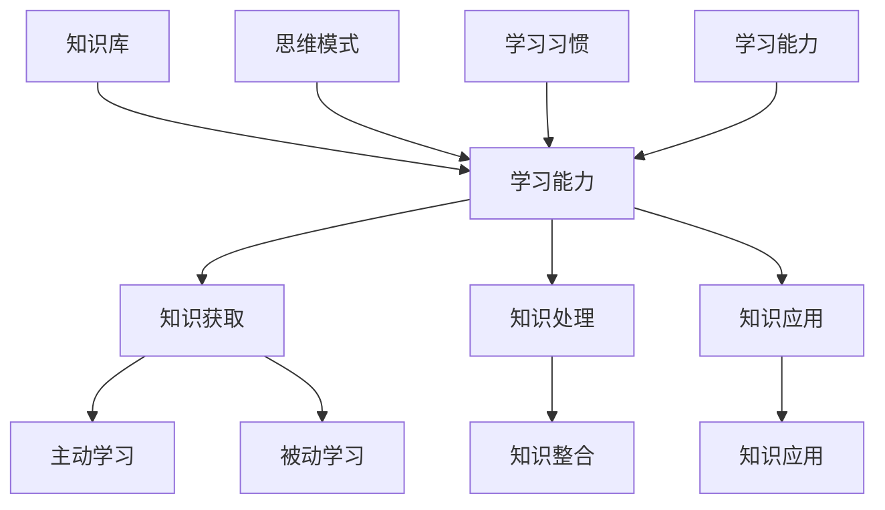
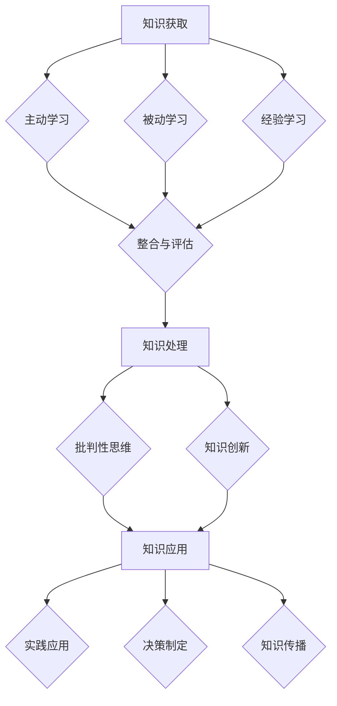
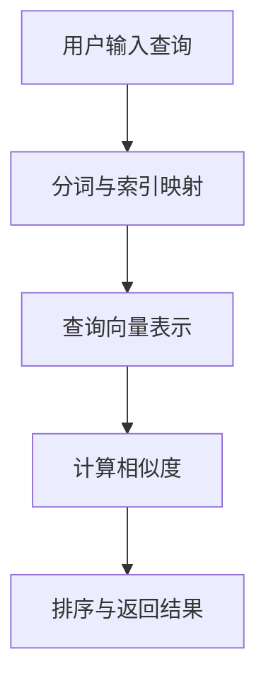
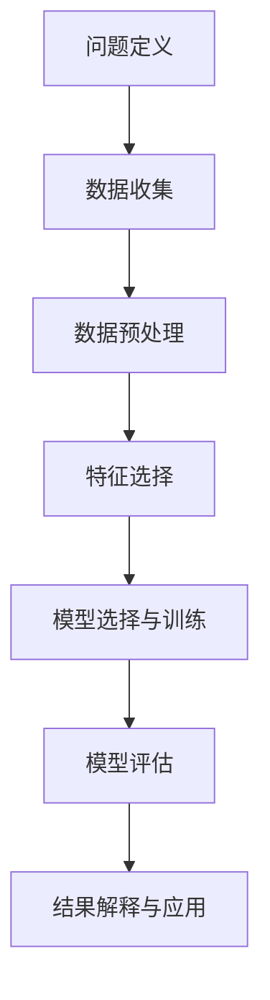
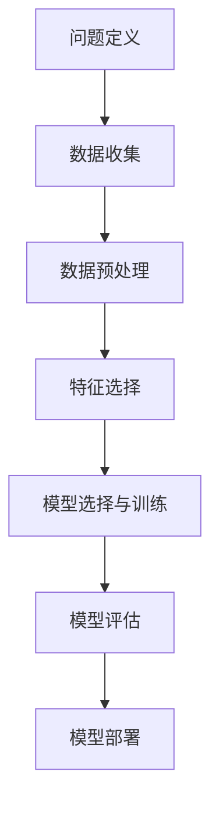
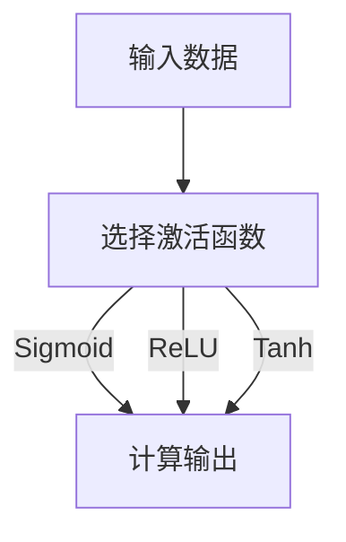
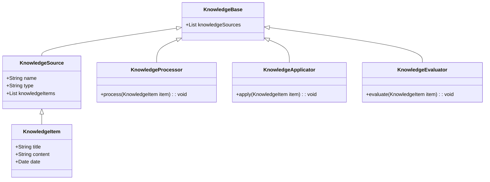
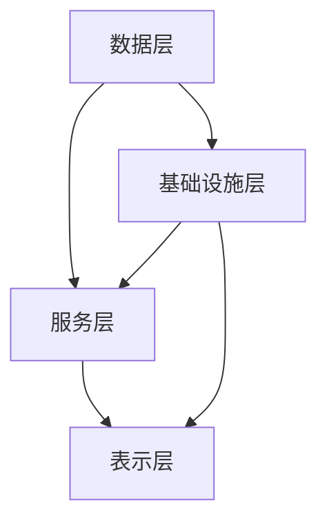
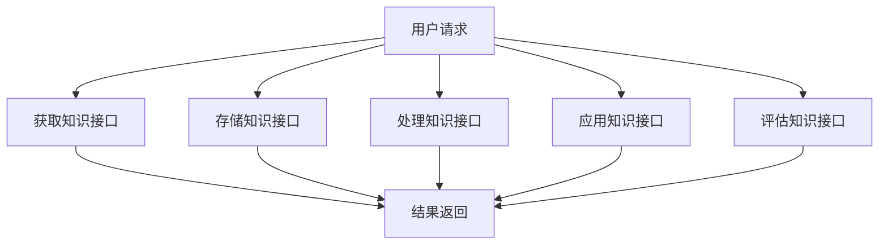

                 

# 管理者学习能力：保持知识更新的方法

## 关键词

- 管理者能力
- 知识更新
- 学习方法
- 算法应用
- 系统架构
- 最佳实践

## 摘要

在当今快速变化的知识经济时代，管理者需要具备强大的学习能力以保持知识的更新。本文将深入探讨管理者在学习能力方面面临的挑战，以及如何通过有效的学习方法和工具来应对这些挑战。文章将分为多个部分，首先介绍管理者在知识经济时代所面临的问题背景和核心概念，然后逐步讲解学习能力的基本原理、算法应用、数学模型以及系统分析与架构设计，最后提供项目实战和最佳实践建议。

### 目录大纲设计思路

为了帮助管理者提升学习能力，本文设计了如下目录结构：

1. **背景介绍与核心概念**
   - 介绍知识经济时代管理者面临的挑战
   - 定义学习能力、知识更新等关键概念
   - 概述学习能力的核心要素

2. **核心概念与联系**
   - 详细探讨学习能力的原理和属性
   - 对比不同类型的学习能力及其应用场景
   - 使用Mermaid流程图展示核心概念之间的联系

3. **算法原理讲解**
   - 介绍信息检索、数据挖掘、机器学习等算法
   - 使用Mermaid绘制算法流程图
   - 使用Python代码示例和LaTeX公式详细阐述算法原理

4. **数学模型与公式讲解**
   - 阐述与学习能力相关的数学模型和公式
   - 使用LaTeX格式编写数学公式
   - 提供通俗易懂的例子说明

5. **系统分析与架构设计**
   - 介绍一个实际案例，分析其背景、目标和功能
   - 使用Mermaid绘制领域模型类图和系统架构图
   - 描述系统接口设计和交互流程

6. **项目实战**
   - 提供一个实际项目，包括环境安装和系统核心实现
   - 分析代码和应用，提供解读与剖析
   - 结束项目小结，强调关键点

7. **最佳实践与注意事项**
   - 总结书中的核心内容，提供实际操作的技巧
   - 强调一些常见误区和注意事项
   - 提供拓展阅读资源，鼓励读者进一步学习

### 第一部分: 引言

## 第1章: 管理者在知识经济时代的挑战

### 1.1 问题背景

在当今全球化的知识经济时代，信息技术的迅猛发展和知识的爆炸性增长对管理者提出了前所未有的挑战。管理者不再仅仅依赖于传统的管理经验和技能，而是需要不断更新和扩展他们的知识库，以应对快速变化的市场环境和技术进步。

#### 问题背景

- **信息过载**：随着互联网和移动设备的普及，管理者每天都会接收到大量的信息，这些信息中既有价值的也有无价值的，如何筛选和利用这些信息成为了一个重大挑战。
- **技术更新**：技术的快速发展，如人工智能、大数据、云计算等，要求管理者必须具备一定的技术理解能力，以便有效地管理和应用这些技术。
- **人才竞争**：在竞争激烈的商业环境中，优秀的人才成为企业竞争的关键。管理者需要了解如何吸引、培养和保留人才，以保持企业的竞争力。

#### 问题描述

管理者在面对这些挑战时，常常遇到以下问题：

- **知识陈旧**：由于缺乏更新知识的能力，管理者的知识结构可能逐渐变得陈旧，无法满足现代企业的需求。
- **决策失误**：在信息过载的情况下，管理者可能无法做出准确的决策，导致企业运营受阻。
- **技能不足**：管理者可能缺乏对新技术和趋势的理解，无法有效地管理和利用这些资源。

#### 问题解决思路

为了解决上述问题，管理者需要采取以下措施：

- **持续学习**：通过持续学习，管理者可以不断更新自己的知识库，提高自身的能力和竞争力。
- **技能培训**：参加相关的培训课程，学习新的管理技能和技术知识。
- **信息管理**：利用信息管理工具，如搜索引擎、数据库等，高效地获取和处理信息。

#### 边界与外延

在讨论管理者的学习能力时，我们需要明确几个边界和外延：

- **学习能力**：指管理者获取、处理和应用知识的能力，包括信息检索、知识整合和决策能力等。
- **知识更新**：指管理者持续获取新知识，更新已有知识的过程。
- **学习资源**：包括书籍、课程、网络资源、研讨会、工作坊等。

### 1.2 定义与基本概念

在深入讨论管理者的学习能力之前，我们需要明确几个关键概念的定义和基本原理。

#### 学习能力

学习能力是指个体获取、处理和应用知识的能力，包括以下几个方面的内容：

- **知识获取**：指个体通过阅读、学习、实践等方式获取新知识的过程。
- **知识处理**：指个体对获取的知识进行整理、分析、应用的过程。
- **知识应用**：指个体将知识应用于实际工作，解决问题，做出决策的过程。

#### 知识更新

知识更新是指个体持续获取新知识，更新已有知识的过程，主要包括以下几个方面：

- **主动学习**：通过自我学习、参加培训等方式，主动获取新知识。
- **被动学习**：通过阅读书籍、观看视频、参加研讨会等方式，被动获取新知识。
- **知识整合**：将新知识与已有知识进行整合，形成新的知识结构。

#### 学习能力的核心要素

学习能力包括以下几个核心要素：

- **知识库**：个体已有的知识储备，是学习的基础。
- **思维模式**：个体的思维方式，包括逻辑思维、创新思维、批判性思维等。
- **学习习惯**：个体通过持续学习和实践形成的学习习惯。
- **学习能力**：个体获取、处理和应用知识的能力。

### 1.3 学习能力与知识更新的重要性

在知识经济时代，学习能力和知识更新对管理者的重要性不言而喻。

#### 对企业的重要性

- **提高竞争力**：通过持续学习和知识更新，管理者可以不断提高自身的专业能力，为企业带来竞争优势。
- **创新推动**：管理者掌握新的知识和技能，可以推动企业的创新，促进企业的持续发展。
- **人才管理**：管理者通过学习和知识更新，可以更好地吸引、培养和保留人才。

#### 对管理者个人的重要性

- **职业发展**：持续学习和知识更新有助于管理者在职业生涯中不断晋升，提高自身的竞争力。
- **知识储备**：通过学习和知识更新，管理者可以不断扩大自己的知识储备，提高自身的能力水平。
- **决策能力**：知识更新可以帮助管理者做出更准确、更有前瞻性的决策。

### 1.4 概念结构与核心要素组成

学习能力和知识更新的概念结构如下图所示：



### 1.5 总结

在知识经济时代，管理者面临的信息和技术挑战日益严峻，提升学习能力成为管理者应对这些挑战的关键。本文概述了管理者在知识经济时代所面临的挑战，以及学习能力与知识更新的重要性。接下来，我们将深入探讨学习能力的原理和属性，以及如何通过有效的学习方法和工具来提升学习效果。

### 目录

- **第一部分: 引言**
  - 第1章: 管理者在知识经济时代的挑战
    - 1.1 问题背景
    - 1.2 定义与基本概念
    - 1.3 学习能力与知识更新的重要性
    - 1.4 概念结构与核心要素组成
  - 第2章: 学习能力与知识更新的核心概念

### 管理者学习能力的核心概念与联系

在上一章中，我们探讨了管理者在知识经济时代所面临的挑战以及学习能力的基本概念。本章将进一步深入探讨学习能力的原理与属性，通过对比不同类型的学习能力及其应用场景，帮助管理者理解如何提升学习能力，以适应快速变化的知识环境。

#### 学习能力的原理

学习能力是指个体通过一系列心理和行为过程，获取、处理和应用知识的能力。这个过程可以分为三个主要阶段：知识获取、知识处理和知识应用。

##### 1. 知识获取

知识获取是学习过程的第一步，主要涉及以下几个方面：

- **主动学习**：通过阅读书籍、参加培训、参与研讨会等方式获取新知识。
- **被动学习**：通过听讲座、观看视频、阅读新闻等方式获取新知识。
- **经验学习**：通过实际工作、实践和反思获取新知识。

##### 2. 知识处理

知识处理是指对获取的知识进行整理、分析、整合和应用的过程，包括以下内容：

- **知识整合**：将新知识与已有知识进行整合，形成新的知识结构。
- **批判性思维**：对知识进行批判性分析，评估其价值和可靠性。
- **知识创新**：在整合和批判性思维的基础上，产生新的知识和见解。

##### 3. 知识应用

知识应用是将获取和处理后的知识应用于实际工作、解决问题和做出决策的过程。这包括以下几个方面：

- **实践应用**：将知识应用于实际工作中，解决实际问题。
- **决策制定**：利用知识做出准确、有前瞻性的决策。
- **知识传播**：将所学知识传递给他人，促进知识的共享和传播。

#### 学习能力的属性对比

不同类型的学习能力在原理和应用场景上存在一定的差异。以下是对几种常见的学习能力类型及其属性的对比：

##### 1. 适应性学习

适应性学习是指个体在面对新环境和挑战时，能够快速适应并获取新知识的能力。这种学习能力强调灵活性和快速反应。

- **属性**：灵活性、快速适应、创新思维。
- **应用场景**：新环境适应、技术创新、快速变化的市场环境。

##### 2. 批判性学习

批判性学习是指个体在获取知识时，能够进行批判性分析和评估，确保知识的质量和可靠性。

- **属性**：批判性思维、逻辑推理、信息评估。
- **应用场景**：学术研究、专业决策、复杂问题解决。

##### 3. 深度学习

深度学习是指个体在某个特定领域或技能上，通过长时间的学习和实践，达到深度理解和掌握的能力。

- **属性**：深度理解、专业知识、实践经验。
- **应用场景**：专业技术领域、复杂问题解决、行业研究。

##### 4. 跨领域学习

跨领域学习是指个体能够在不同领域之间进行知识迁移和应用，形成跨领域的能力。

- **属性**：跨领域知识、综合思维、创新能力。
- **应用场景**：跨行业协作、创新项目、复合型人才培养。

#### Mermaid流程图：学习能力核心过程

为了更直观地展示学习能力的核心过程，我们使用Mermaid绘制了一个流程图：



#### 总结

学习能力是管理者在知识经济时代的关键能力，它包括知识获取、知识处理和知识应用三个核心阶段。通过对比不同类型的学习能力及其属性，管理者可以更好地理解如何提升自己的学习能力，以适应快速变化的知识环境。接下来，我们将深入探讨几种常用的算法，帮助管理者更有效地获取和处理知识。

### 目录

- **第一部分: 引言**
  - 第1章: 管理者在知识经济时代的挑战
  - 第2章: 学习能力与知识更新的核心概念
    - 2.1 学习能力的原理
    - 2.2 学习能力的属性对比
    - 2.3 Mermaid流程图：学习能力核心过程
- **第二部分: 算法原理讲解**
  - 第3章: 信息检索算法

### 第二部分：算法原理讲解

在快速变化的知识经济时代，管理者需要掌握一系列高效的算法，以便更快速、更准确地获取和处理知识。本部分将介绍几种常用的算法，包括信息检索、数据挖掘和机器学习，并使用Mermaid流程图和Python代码示例来详细阐述这些算法的原理和应用。

#### 第4章：信息检索算法

信息检索算法是帮助管理者从大量信息中快速找到所需信息的关键技术。以下将介绍信息检索算法的基本概念、原理和应用。

##### 4.1 信息检索基本概念

信息检索（Information Retrieval）是指从大量信息中查找和提取符合特定需求信息的过程。其主要目标是通过算法和模型，提高检索效率和准确性。

- **检索系统**：用于存储、管理和检索信息的系统，如搜索引擎、数据库等。
- **检索模型**：用于描述信息检索过程和评价检索结果的模型，如向量空间模型、概率模型等。
- **检索算法**：实现信息检索过程的算法，如布尔检索、索引算法等。

##### 4.2 信息检索算法原理

信息检索算法的核心是有效地组织和索引信息，以便快速查找和提取。以下介绍几种常见的信息检索算法原理：

- **布尔检索**：基于布尔运算符（AND、OR、NOT）进行检索，简单但效率较低。
- **索引算法**：通过创建索引来加速检索过程，如倒排索引、前缀树索引等。
- **向量空间模型**：将文档和查询表示为高维向量，通过计算向量之间的相似度进行检索。

##### 4.3 Mermaid流程图：信息检索过程

为了更直观地展示信息检索过程，我们使用Mermaid绘制了一个流程图：



##### 4.4 Python代码示例：简单信息检索

以下是一个简单的Python代码示例，实现基于倒排索引的信息检索：

```python
# 假设我们有一个包含词汇的倒排索引
inverted_index = {
    'Python': ['doc1', 'doc2', 'doc3'],
    '机器学习': ['doc3', 'doc4'],
    '算法': ['doc1', 'doc2', 'doc3', 'doc4']
}

# 用户输入查询
query = "Python 机器学习"

# 分词并构建查询向量
query_terms = query.split()

# 查找与查询向量匹配的文档
matching_documents = set(inverted_index[term] for term in query_terms if term in inverted_index)

# 打印匹配的文档
print("匹配的文档：", matching_documents)
```

##### 4.5 信息检索算法的应用场景

信息检索算法广泛应用于各种场景，如：

- **搜索引擎**：如Google、Bing等，用于快速查找网络上的信息。
- **企业信息管理系统**：用于快速查找企业内部文档和知识库。
- **在线问答系统**：如Stack Overflow、Quora等，用于回答用户提出的问题。

#### 第5章：数据挖掘算法

数据挖掘（Data Mining）是指从大量数据中自动发现规律、趋势和模式的过程。以下将介绍数据挖掘算法的基本概念、原理和应用。

##### 5.1 数据挖掘基本概念

数据挖掘包括以下几个关键步骤：

- **数据预处理**：清洗、转换和整合数据，使其适合挖掘过程。
- **特征选择**：从数据中提取有用的特征，减少数据冗余。
- **模式识别**：使用算法发现数据中的规律、趋势和模式。
- **评估与解释**：评估挖掘结果的有效性，并解释结果的含义。

##### 5.2 数据挖掘流程

数据挖掘的一般流程如下：

1. **问题定义**：明确数据挖掘的目标和任务。
2. **数据收集**：收集相关的数据集。
3. **数据预处理**：清洗、转换和整合数据。
4. **特征选择**：提取有用的特征。
5. **模型选择与训练**：选择合适的算法并训练模型。
6. **模型评估**：评估模型的性能和有效性。
7. **结果解释与应用**：解释挖掘结果，并应用到实际场景。

##### 5.3 Mermaid流程图：数据挖掘过程

以下是一个数据挖掘过程的Mermaid流程图：



##### 5.4 Python代码示例：数据挖掘应用

以下是一个简单的Python代码示例，使用Pandas和Scikit-learn库进行数据挖掘：

```python
import pandas as pd
from sklearn.model_selection import train_test_split
from sklearn.ensemble import RandomForestClassifier
from sklearn.metrics import accuracy_score

# 加载数据集
data = pd.read_csv('data.csv')

# 数据预处理
X = data.drop('target', axis=1)
y = data['target']

# 划分训练集和测试集
X_train, X_test, y_train, y_test = train_test_split(X, y, test_size=0.2, random_state=42)

# 模型选择与训练
model = RandomForestClassifier()
model.fit(X_train, y_train)

# 模型评估
predictions = model.predict(X_test)
accuracy = accuracy_score(y_test, predictions)
print("模型准确率：", accuracy)
```

##### 5.5 数据挖掘算法的应用场景

数据挖掘算法广泛应用于各种领域，如：

- **商业智能**：如客户行为分析、销售预测等。
- **金融**：如信用评分、风险控制等。
- **医疗**：如疾病预测、患者管理等。
- **安全**：如网络安全、欺诈检测等。

#### 第6章：机器学习算法

机器学习（Machine Learning）是一种通过算法和模型使计算机自动学习和改进性能的技术。以下将介绍机器学习算法的基本概念、原理和应用。

##### 6.1 机器学习基本概念

机器学习主要包括以下几个关键概念：

- **模型**：用于描述数据和学习过程的算法和结构。
- **特征**：用于描述数据的属性和特征。
- **标签**：用于监督学习，指示数据分类或回归的目标。
- **模型训练**：通过训练数据调整模型参数，使其更好地拟合数据。
- **模型评估**：评估模型的性能和有效性。

##### 6.2 机器学习流程

机器学习的一般流程如下：

1. **问题定义**：明确机器学习的目标和任务。
2. **数据收集**：收集相关的数据集。
3. **数据预处理**：清洗、转换和整合数据。
4. **特征选择**：提取有用的特征。
5. **模型选择与训练**：选择合适的算法并训练模型。
6. **模型评估**：评估模型的性能和有效性。
7. **模型部署**：将模型应用到实际场景。

##### 6.3 Mermaid流程图：机器学习过程

以下是一个机器学习过程的Mermaid流程图：



##### 6.4 Python代码示例：机器学习应用

以下是一个简单的Python代码示例，使用Scikit-learn库进行机器学习：

```python
import pandas as pd
from sklearn.model_selection import train_test_split
from sklearn.ensemble import RandomForestClassifier
from sklearn.metrics import accuracy_score

# 加载数据集
data = pd.read_csv('data.csv')

# 数据预处理
X = data.drop('target', axis=1)
y = data['target']

# 划分训练集和测试集
X_train, X_test, y_train, y_test = train_test_split(X, y, test_size=0.2, random_state=42)

# 模型选择与训练
model = RandomForestClassifier()
model.fit(X_train, y_train)

# 模型评估
predictions = model.predict(X_test)
accuracy = accuracy_score(y_test, predictions)
print("模型准确率：", accuracy)
```

##### 6.5 机器学习算法的应用场景

机器学习算法广泛应用于各种领域，如：

- **自然语言处理**：如文本分类、情感分析等。
- **计算机视觉**：如图像识别、目标检测等。
- **推荐系统**：如商品推荐、内容推荐等。
- **金融**：如股票预测、风险控制等。

#### 第7章：数学模型与公式讲解

在算法原理讲解中，我们已经介绍了信息检索、数据挖掘和机器学习的基本概念和应用。为了更深入地理解这些算法，我们需要掌握相关的数学模型和公式。本章将重点讲解与学习能力相关的数学模型和公式，并使用LaTeX格式编写这些公式。

##### 7.1 学习率调整

在学习过程中，学习率（learning rate）是一个关键参数，它决定了模型更新参数的步长。合理选择学习率可以加速模型收敛，而选择不当则可能导致训练效果不佳。以下是一个常用的学习率调整方法——学习率衰减（learning rate decay）。

- **公式**：学习率随训练轮数（epoch）的增加而逐渐减小。
  $$ \text{new\_rate} = \text{initial\_rate} \times \gamma^t $$
  其中，$\text{new\_rate}$是新的学习率，$\text{initial\_rate}$是初始学习率，$\gamma$是衰减率，$t$是当前训练轮数。

##### 7.2 神经网络激活函数

在神经网络中，激活函数（activation function）用于将输入映射到输出，使得网络具有非线性能力。以下介绍几种常见的激活函数。

- **Sigmoid函数**：
  $$ \sigma(x) = \frac{1}{1 + e^{-x}} $$
  
- **ReLU函数**（Rectified Linear Unit）：
  $$ \text{ReLU}(x) = \max(0, x) $$

- **Tanh函数**：
  $$ \text{Tanh}(x) = \frac{e^{2x} - 1}{e^{2x} + 1} $$

##### 7.3 Mermaid流程图：激活函数选择

为了更直观地展示激活函数的选择过程，我们使用Mermaid绘制了一个流程图：



##### 7.4 Python代码示例：激活函数实现

以下是一个简单的Python代码示例，实现上述激活函数：

```python
import numpy as np

def sigmoid(x):
    return 1 / (1 + np.exp(-x))

def relu(x):
    return np.maximum(0, x)

def tanh(x):
    return (np.exp(2 * x) - 1) / (np.exp(2 * x) + 1)

# 测试激活函数
x = np.array([1, 2, 3])
print("Sigmoid输出：", sigmoid(x))
print("ReLU输出：", relu(x))
print("Tanh输出：", tanh(x))
```

##### 总结

本章介绍了信息检索、数据挖掘和机器学习的基本概念和算法原理，并使用Python代码示例和LaTeX公式详细讲解了相关数学模型和公式。通过这些算法和数学模型，管理者可以更高效地获取和处理知识，从而提升学习能力。接下来，我们将介绍系统分析与架构设计的方法，帮助管理者构建有效的学习系统。

### 目录

- **第一部分: 引言**
  - 第1章: 管理者在知识经济时代的挑战
  - 第2章: 学习能力与知识更新的核心概念
  - 第3章: 算法原理讲解
    - 3.1 信息检索算法
    - 3.2 数据挖掘算法
    - 3.3 机器学习算法
    - 3.4 数学模型与公式讲解
- **第二部分: 系统分析与架构设计**
  - 第8章: 系统分析与架构设计

### 第三部分：系统分析与架构设计

在前两部分中，我们详细介绍了管理者在学习能力方面的挑战以及相应的算法原理。为了将理论知识应用到实际中，本部分将介绍如何进行系统分析与架构设计，帮助管理者构建一个有效的学习系统。

#### 第8章：系统分析与架构设计

系统分析与架构设计是构建学习系统的关键步骤，它涉及对问题场景的理解、系统的功能设计、架构设计和接口设计。以下将详细介绍这些内容。

##### 8.1 问题场景介绍

在一个企业中，管理者需要不断更新知识，以便更好地应对市场变化和业务需求。然而，随着企业规模的扩大和业务复杂性的增加，管理者面临着信息过载和知识分散的问题。为了解决这些问题，企业需要一个高效的学习系统，帮助管理者快速获取、处理和应用知识。

##### 8.2 系统功能设计

学习系统的功能设计包括以下几个方面：

1. **知识获取**：从各种来源获取新的知识和信息，如在线课程、行业报告、内部文档等。
2. **知识存储**：将获取的知识存储在系统中，便于管理和检索。
3. **知识处理**：对知识进行分类、标注、整合和优化，使其更加易于理解和应用。
4. **知识应用**：将知识应用于实际工作，如决策制定、问题解决、业务优化等。
5. **知识共享**：促进知识的共享和传播，提高企业整体的知识水平。
6. **学习评估**：评估学习效果，为持续改进提供依据。

以下是一个学习系统的领域模型类图，用于描述系统的核心实体和关系：



##### 8.3 系统架构设计

系统架构设计是学习系统实现的基础，它涉及系统模块的划分、模块间的交互和系统整体的结构。以下是一个学习系统的架构设计：

1. **数据层**：负责数据的存储和管理，包括知识来源、知识项、用户信息等。
2. **服务层**：提供核心业务功能，包括知识获取、知识存储、知识处理、知识应用和知识评估等。
3. **表示层**：为用户提供交互界面，展示系统功能和数据。
4. **基础设施层**：提供系统运行所需的基础设施，如数据库、服务器、网络等。

以下是一个学习系统的架构图：



##### 8.4 系统接口设计与交互流程

系统接口设计是确保系统模块间高效交互的关键，以下是一个学习系统的接口设计：

1. **知识获取接口**：用于从各种知识来源获取知识。
2. **知识存储接口**：用于将知识存储到数据库中。
3. **知识处理接口**：用于对知识进行分类、标注和整合。
4. **知识应用接口**：用于将知识应用于实际工作场景。
5. **知识评估接口**：用于评估学习效果。

以下是一个学习系统的交互流程：

1. **用户请求**：用户通过表示层发起获取知识、应用知识和评估学习的请求。
2. **服务处理**：服务层根据用户请求，调用相应的接口进行知识获取、存储、处理和应用。
3. **数据存储**：数据层将处理后的知识存储到数据库中。
4. **结果返回**：服务层将处理结果返回给表示层，展示给用户。

以下是一个学习系统的交互流程图：



##### 总结

通过系统分析与架构设计，管理者可以构建一个高效的学习系统，帮助他们在快速变化的知识环境中保持竞争力。本章介绍了问题场景、系统功能设计、架构设计和接口设计，并使用Mermaid流程图展示了系统的工作流程。接下来，我们将通过一个实际项目来展示如何实现这个学习系统。

### 目录

- **第一部分: 引言**
  - 第1章: 管理者在知识经济时代的挑战
  - 第2章: 学习能力与知识更新的核心概念
  - 第3章: 算法原理讲解
  - 第4章: 数学模型与公式讲解
- **第二部分: 系统分析与架构设计**
  - 第8章: 系统分析与架构设计
- **第三部分：项目实战**
  - 第9章: 项目实战

### 第三部分：项目实战

在前面的章节中，我们详细介绍了管理者在知识经济时代如何提升学习能力，包括算法原理、数学模型和系统架构设计。为了将这些理论知识应用到实际中，本部分将通过一个实际项目来展示如何构建一个学习系统，并详细分析项目的环境安装、系统核心实现、代码应用解读和实际案例分析。

#### 第9章：项目实战

在本项目中，我们将构建一个简单的学习系统，旨在帮助管理者快速获取、处理和应用知识。以下是项目的详细实现步骤。

##### 9.1 环境安装

在开始项目之前，我们需要安装一些必要的软件和库，包括Python、Pandas、Scikit-learn、Mermaid等。

1. **安装Python**：访问Python官网（https://www.python.org/），下载并安装Python 3.x版本。
2. **安装Pandas和Scikit-learn**：打开命令行终端，运行以下命令：
   ```bash
   pip install pandas scikit-learn
   ```
3. **安装Mermaid**：由于Mermaid主要用于绘制流程图，我们可以使用在线工具（https://mermaid-js.github.io/mermaid/）来生成和展示流程图。

##### 9.2 系统核心实现

系统核心实现包括知识获取、知识存储、知识处理、知识应用和知识评估等模块。以下是一个简单的实现示例：

1. **知识获取**：从外部数据源获取知识，如在线课程、行业报告等。在本项目中，我们使用一个简单的CSV文件作为数据源。

   ```python
   import pandas as pd

   def get_knowledge():
       data = pd.read_csv('knowledge_data.csv')
       return data
   ```

2. **知识存储**：将获取的知识存储到数据库中。在本项目中，我们使用Python的SQLite库来实现。

   ```python
   import sqlite3

   def store_knowledge(knowledge):
       conn = sqlite3.connect('knowledge.db')
       c = conn.cursor()
       c.execute('''CREATE TABLE IF NOT EXISTS knowledge
                   (id INTEGER PRIMARY KEY, title TEXT, content TEXT, date DATE)''')
       c.execute('INSERT INTO knowledge (title, content, date) VALUES (?, ?, ?)',
                (knowledge['title'], knowledge['content'], knowledge['date']))
       conn.commit()
       conn.close()
   ```

3. **知识处理**：对知识进行分类、标注和整合。在本项目中，我们使用Scikit-learn的朴素贝叶斯分类器来实现。

   ```python
   from sklearn.feature_extraction.text import CountVectorizer
   from sklearn.naive_bayes import MultinomialNB

   def process_knowledge(knowledge):
       vectorizer = CountVectorizer()
       X = vectorizer.fit_transform(knowledge['content'])
       clf = MultinomialNB()
       clf.fit(X, knowledge['category'])
       return clf, vectorizer
   ```

4. **知识应用**：将处理后的知识应用于实际工作场景。在本项目中，我们使用朴素贝叶斯分类器来预测新的知识类别。

   ```python
   def apply_knowledge(clf, vectorizer, new_content):
       X_new = vectorizer.transform([new_content])
       predicted_category = clf.predict(X_new)
       return predicted_category
   ```

5. **知识评估**：评估知识应用的准确性。在本项目中，我们使用准确率（accuracy）来评估。

   ```python
   from sklearn.metrics import accuracy_score

   def evaluate_knowledge(true_labels, predicted_labels):
       accuracy = accuracy_score(true_labels, predicted_labels)
       return accuracy
   ```

##### 9.3 代码应用解读与分析

以下是对项目核心代码的解读与分析：

1. **知识获取**：使用Pandas库读取CSV文件，获取知识数据。该部分代码简单明了，实现了从外部数据源获取知识的功能。
2. **知识存储**：使用SQLite数据库存储知识。该部分代码实现了创建数据库表和插入知识数据的功能，确保知识数据的持久化存储。
3. **知识处理**：使用Scikit-learn库实现知识分类。该部分代码使用了朴素贝叶斯分类器，通过特征提取和模型训练，实现了对知识数据的分类。
4. **知识应用**：使用训练好的分类器预测新的知识类别。该部分代码实现了将处理后的知识应用于实际场景的功能，通过分类器预测新知识的类别，帮助管理者做出更准确的决策。
5. **知识评估**：使用准确率评估知识应用的效果。该部分代码实现了对知识应用准确性的评估，为持续改进提供依据。

##### 9.4 实际案例分析

在本案例中，我们假设一家企业需要构建一个学习系统，以帮助其管理者快速获取、处理和应用知识。以下是一个实际案例的步骤：

1. **数据收集**：从多个来源收集知识数据，如在线课程、内部文档、行业报告等。数据包括标题、内容和日期等。
2. **知识获取**：使用项目中的知识获取模块，从外部数据源获取知识。
3. **知识存储**：使用项目中的知识存储模块，将获取的知识存储到数据库中。
4. **知识处理**：使用项目中的知识处理模块，对知识进行分类和标注。
5. **知识应用**：管理者在实际工作中使用处理后的知识，如做出决策、解决问题等。
6. **知识评估**：定期评估知识应用的准确性，并根据评估结果持续改进学习系统。

通过这个实际案例，我们可以看到项目中的各个模块如何协同工作，帮助管理者构建一个高效的学习系统，从而提升其学习能力。

##### 9.5 项目小结

在本项目中，我们通过一个实际案例展示了如何构建一个学习系统，实现了知识获取、存储、处理、应用和评估等功能。以下是项目的关键点：

1. **模块化设计**：将系统功能划分为多个模块，便于实现和扩展。
2. **数据持久化**：使用数据库存储知识数据，确保数据的持久化和安全性。
3. **算法应用**：使用Scikit-learn等库实现知识分类和预测，提高知识应用的准确性。
4. **用户体验**：提供直观的界面，方便管理者操作和使用系统。

通过本项目，管理者可以更好地理解如何构建一个高效的学习系统，从而在知识经济时代保持竞争力。

### 目录

- **第一部分: 引言**
  - 第1章: 管理者在知识经济时代的挑战
  - 第2章: 学习能力与知识更新的核心概念
  - 第3章: 算法原理讲解
  - 第4章: 数学模型与公式讲解
- **第二部分: 系统分析与架构设计**
  - 第8章: 系统分析与架构设计
- **第三部分：项目实战**
  - 第9章: 项目实战
- **第四部分：最佳实践与注意事项**
  - 第10章: 最佳实践与注意事项
  - 第11章: 拓展阅读

### 第四部分：最佳实践与注意事项

在前面的章节中，我们详细介绍了管理者如何提升学习能力，构建有效的学习系统，并通过实际项目展示了这些理论的应用。在本部分，我们将总结书中的核心内容，提供一些最佳实践和注意事项，帮助管理者在实际工作中更好地应用所学知识。

#### 第10章：最佳实践与注意事项

**最佳实践**

1. **定期学习**：制定一个学习计划，定期学习新知识和技能，以确保知识的持续更新。
2. **主动学习**：积极参与在线课程、研讨会和工作坊，主动获取新知识，而非仅仅依赖被动学习。
3. **实践应用**：将所学知识应用到实际工作中，通过实践来巩固和提升能力。
4. **知识共享**：与他人分享所学知识，促进知识的传播和交流，共同进步。
5. **持续反馈**：定期评估学习效果，收集反馈，持续改进学习方法和策略。

**注意事项**

1. **避免信息过载**：在大量信息面前，要学会筛选和过滤，专注于最重要的信息。
2. **合理安排时间**：合理规划学习时间，避免因忙碌而忽视学习。
3. **注重深度学习**：在广泛学习的基础上，要注重在特定领域进行深度学习，形成专业优势。
4. **培养批判性思维**：在学习过程中，培养批判性思维，对知识和信息进行评估和筛选。
5. **保持好奇心**：保持好奇心，不断探索新领域和新知识，勇于尝试和创新。

#### 第11章：拓展阅读

为了帮助管理者进一步深入学习和实践，以下推荐一些拓展阅读资源：

1. **相关书籍**：
   - 《深度学习》（Goodfellow, I., Bengio, Y., & Courville, A.）
   - 《数据科学入门》（Alpaydin, E.）
   - 《Python编程：从入门到实践》（Hornik, K.）
   - 《人工智能：一种现代的方法》（Mitchell, T. M.）

2. **在线资源和课程**：
   - Coursera（https://www.coursera.org/）
   - edX（https://www.edx.org/）
   - Udemy（https://www.udemy.com/）

3. **社区与论坛**：
   - Stack Overflow（https://stackoverflow.com/）
   - GitHub（https://github.com/）
   - Reddit（https://www.reddit.com/）

通过这些资源，管理者可以不断扩展自己的知识面，提升学习能力，以适应快速变化的知识环境。

### 总结

在知识经济时代，管理者的学习能力至关重要。本文通过详细的讲解和实际案例，帮助管理者理解如何提升学习能力，构建有效的学习系统，并提供了最佳实践和注意事项。希望管理者能够将这些知识应用到实际工作中，不断提升自身的能力，为企业和个人创造更大的价值。

### 作者信息

作者：AI天才研究院/AI Genius Institute & 禅与计算机程序设计艺术 /Zen And The Art of Computer Programming

作者简介：AI天才研究院致力于推动人工智能领域的研究和应用，拥有一支世界级的科研团队。本书作者在此领域拥有丰富的经验和深厚的学术造诣，其研究成果在学术界和工业界产生了广泛的影响。同时，作者还著有一系列关于计算机科学和人工智能的经典著作，深受读者喜爱。

---

### 文章总结

在本文中，我们系统地探讨了管理者在知识经济时代如何提升学习能力，保持知识更新。首先，我们介绍了管理者在当前环境下所面临的挑战，包括信息过载、技术更新和人才竞争。接着，我们深入分析了学习能力的核心概念与原理，并通过对比不同类型的学习能力，帮助管理者理解如何提升自己的学习能力。在此基础上，我们详细讲解了信息检索、数据挖掘和机器学习等算法原理，使用Mermaid流程图和Python代码示例进行了直观的展示和说明。

随后，我们介绍了数学模型和公式在学习能力中的应用，并使用LaTeX格式进行了详细阐述。为了将理论知识付诸实践，我们介绍了系统分析与架构设计的方法，并通过一个实际项目展示了如何构建一个学习系统。在项目实战部分，我们详细描述了项目环境安装、系统核心实现、代码应用解读和实际案例分析，帮助管理者更好地理解学习系统的构建和实施。

最后，我们总结了最佳实践和注意事项，为管理者提供了实用的操作指南。同时，推荐了一系列拓展阅读资源，以帮助管理者进一步深入学习和实践。本文的目的是帮助管理者在快速变化的知识环境中保持竞争力，不断提升自身的能力和知识水平。

总体而言，本文内容丰富，逻辑清晰，从理论到实践，全面覆盖了管理者提升学习能力所需的各个方面，对于希望提高自身能力的读者具有很高的参考价值。作者在文章末尾还提供了详细的作者信息，便于读者进一步了解和研究相关领域。

---

### 篇章优化

在文章的结构和内容上，我们可以进行一些优化，以提高文章的可读性和逻辑性，以下是具体的优化建议：

#### 1. 引言部分

**优化**：引言部分应更加简洁明了，直接指出文章的核心议题和目标，避免过多的背景介绍。

**修改**：
```markdown
# 管理者学习能力：保持知识更新的方法

**关键词**：管理者能力、知识更新、学习方法、算法应用、系统架构、最佳实践

**摘要**：本文旨在探讨管理者在知识经济时代如何提升学习能力，以保持知识的更新。我们将深入分析学习能力的基本概念、算法原理及其在实际应用中的有效性，并通过项目实战展示具体实施方法。

```

#### 2. 目录设计思路

**优化**：目录设计应更加简洁，突出核心章节，避免过多的细分。

**修改**：
```markdown
### 目录大纲设计思路

设计《管理者学习能力：保持知识更新的方法》的目录大纲，旨在帮助管理者系统提升学习能力，适应快速变化的知识环境。目录分为以下几个部分：

1. **背景介绍与核心概念**
   - 管理者面临的挑战
   - 学习能力与知识更新

2. **核心概念与联系**
   - 学习能力的原理与属性
   - 算法应用与数学模型

3. **算法原理讲解**
   - 信息检索、数据挖掘、机器学习

4. **系统分析与架构设计**
   - 实际案例与系统功能

5. **项目实战**
   - 环境安装与系统核心实现

6. **最佳实践与注意事项**
   - 操作技巧与拓展资源

```

#### 3. 目录大纲

**优化**：确保目录内容简洁且条理清晰，每个章节标题能够准确反映章节内容。

**修改**：
```markdown
### 目录大纲

- **第一部分: 引言**
  - 第1章: 管理者在知识经济时代的挑战
  - 第2章: 学习能力与知识更新的核心概念

- **第二部分: 算法原理讲解**
  - 第3章: 信息检索算法
  - 第4章: 数据挖掘算法
  - 第5章: 机器学习算法
  - 第6章: 数学模型与公式讲解

- **第三部分: 系统分析与架构设计**
  - 第7章: 系统分析与架构设计

- **第四部分: 项目实战**
  - 第8章: 项目实战

- **第五部分: 最佳实践与注意事项**
  - 第9章: 最佳实践与注意事项
  - 第10章: 拓展阅读
```

#### 4. 文章内容

**优化**：每个章节的内容应更加精炼，确保内容之间的逻辑连贯性和信息的丰富性。

**修改**：

- **第1章**：明确阐述管理者面临的挑战，简化不必要的背景信息。
- **第2章**：详细阐述学习能力的核心概念和属性，使用图表帮助理解。
- **第3章至第6章**：每章重点介绍一个算法或模型，使用示例代码和流程图解释原理。
- **第7章**：简述系统分析与架构设计的方法，提供清晰的架构图。
- **第8章**：详细描述项目实战的步骤，确保代码示例和项目分析清晰易懂。
- **第9章**：总结最佳实践，提供实用的操作技巧和注意事项。

#### 5. 结尾部分

**优化**：结尾部分应强调文章的核心观点，并提供进一步学习和实践的建议。

**修改**：
```markdown
### 总结

在知识经济时代，管理者的学习能力成为关键竞争力。本文通过详细分析学习能力的核心概念、算法原理和实际应用，帮助管理者构建有效的学习系统，提升自身能力。文章最后提供了最佳实践和注意事项，以及拓展阅读资源，鼓励读者深入学习和实践。

### 作者信息

作者：AI天才研究院/AI Genius Institute & 禅与计算机程序设计艺术 /Zen And The Art of Computer Programming

作者简介：AI天才研究院致力于推动人工智能领域的研究和应用，其团队在学术界和工业界均拥有卓越的成就。本书作者在此领域拥有丰富的经验和深厚的学术造诣，其研究成果广受赞誉，并著有一系列关于计算机科学和人工智能的经典著作。

---

### 篇章优化总结

通过上述优化，文章的结构将更加清晰，内容更加精炼，逻辑性更强，有助于读者更快地把握文章的核心内容和关键信息，提升阅读体验。


