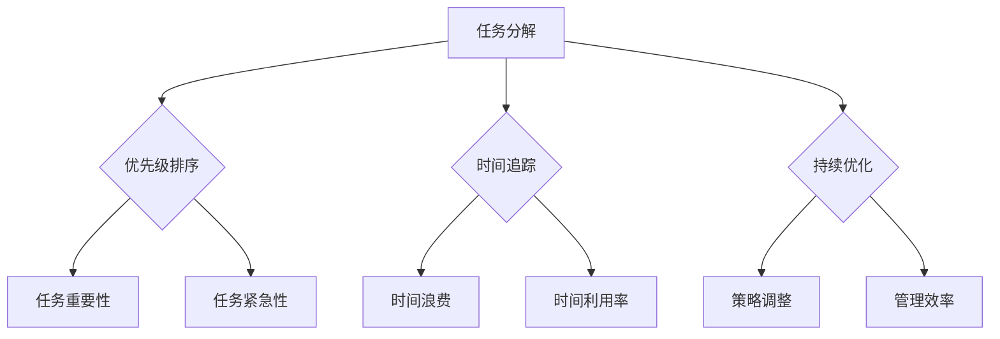
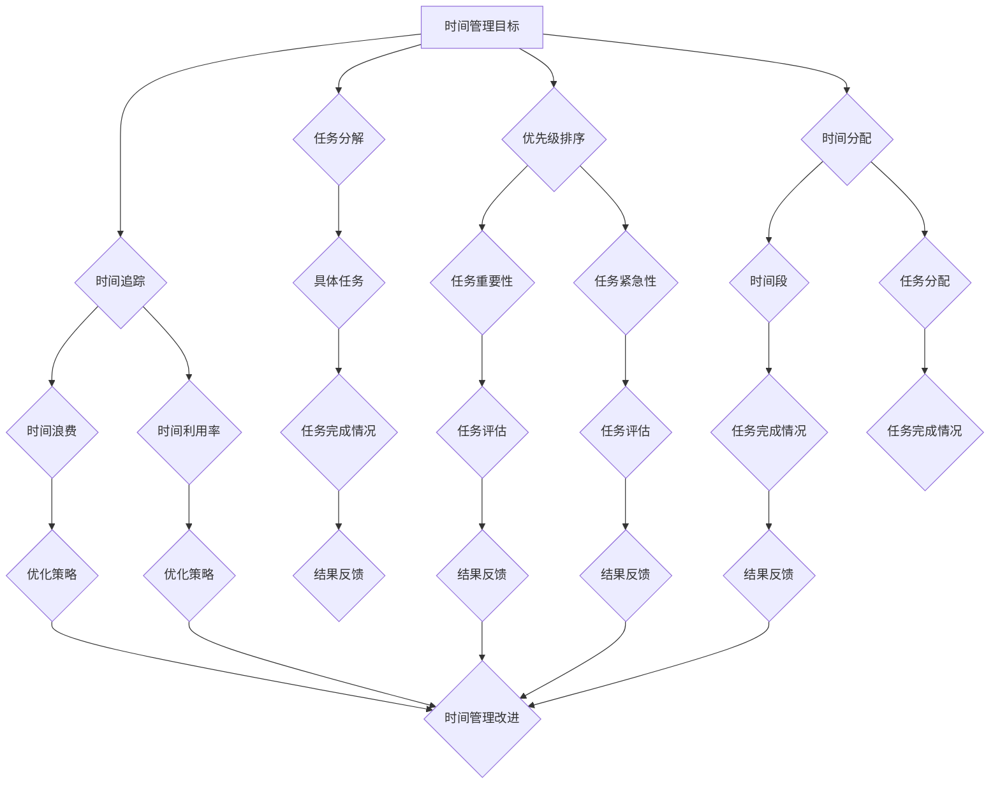

                 

### 引言

#### 时间管理的意义

在快速发展的IT行业，管理者面临着日益复杂的工作环境和繁重的任务。时间管理作为一种提升工作效率和优化工作流程的重要手段，对于管理者的成功至关重要。时间管理不仅仅是合理安排工作时间，更是一种高效的工作习惯和技能，它能够帮助管理者在有限的时间内完成更多的工作，提升个人和团队的整体绩效。

#### 时间管理的重要性

首先，时间管理有助于提高工作效率。通过合理规划时间，管理者可以避免工作上的拖延和混乱，确保任务的按时完成。此外，时间管理还能帮助管理者更好地应对突发事件，提高应对压力的能力。

其次，时间管理对于提升团队绩效有着显著的影响。一个懂得时间管理的管理者能够确保团队资源的合理配置，提高团队协作效率，减少不必要的工作浪费。此外，通过培养团队成员的时间管理意识，管理者可以推动团队整体绩效的提升。

#### 时间管理的发展趋势

随着科技的进步和数字化转型的加速，时间管理也在不断演变。现代时间管理工具如项目管理软件、时间追踪应用和智能日历等，为管理者提供了更便捷的时间管理手段。同时，时间管理的理念也在不断发展，从传统的任务导向型管理转向更加关注个人和团队发展的全面性管理。

总之，时间管理是提升管理效率和领导力的关键。在接下来的章节中，我们将深入探讨时间管理的核心概念、实用技巧和实际应用，帮助管理者掌握这一重要技能，提升领导效率。

#### 关键词

- 时间管理
- 管理者
- 工作效率
- 领导力
- 团队绩效

#### 摘要

本文将系统地探讨时间管理在管理者工作中的重要性，通过核心概念、实用技巧和实际案例分析，阐述时间管理如何提升领导效率和团队绩效。文章首先介绍了时间管理的意义和重要性，随后深入探讨了时间管理的基本概念和原理，以及其实用技巧和应用方法。通过真实案例展示，文章分析了时间管理在不同管理场景中的实际效果。最后，文章提出了提升领导效率的具体策略和最佳实践，以帮助管理者在实际工作中更好地运用时间管理技巧，实现高效领导和团队发展。

### 第1章 时间管理的意义

#### 1.1 时间管理的核心概念

时间管理，作为一个广泛而复杂的概念，其核心在于如何高效地分配和利用时间资源。时间管理不仅仅是关于时间分配的简单任务，它更涉及到对工作流程、任务优先级和资源利用的全面规划和控制。

**定义**：时间管理是一种系统化的工作方法，通过计划和优化时间使用，提高工作效率，实现个人和团队的目标。它包括设定目标、任务分配、时间追踪和效率评估等多个方面。

**范畴**：时间管理涵盖了从个人层面到团队层面，再到组织层面的广泛范围。从个人角度看，时间管理关注个人的时间利用效率和自我管理能力；从团队角度看，时间管理强调团队协作和资源优化；从组织角度看，时间管理则涉及到整个组织的战略规划和执行。

#### 1.2 时间管理的重要性

时间管理对于管理者的成功具有至关重要的影响。以下是时间管理的重要性体现在几个关键方面：

1. **提高工作效率**：通过合理安排时间，管理者可以有效地避免工作中的拖延和混乱，确保任务的按时完成，从而提升整体工作效率。

2. **优化资源利用**：时间管理能够帮助管理者更好地分配和利用团队资源，减少不必要的浪费，提高资源利用效率。

3. **增强决策能力**：合理的时间管理使管理者能够更好地分析和处理信息，做出更准确的决策，提高决策效率。

4. **提升领导力**：一个懂得时间管理的管理者能够树立榜样，带动团队成员共同提高时间管理意识，增强团队凝聚力和执行力。

5. **减少工作压力**：通过有效的时间管理，管理者可以减少工作压力，保持良好的工作状态和身心健康，提高生活质量。

#### 1.3 时间管理的发展趋势

随着信息技术的飞速发展，时间管理的方法和工具也在不断进步和演变。以下是当前时间管理领域的发展趋势：

1. **数字化工具的普及**：现代项目管理软件和智能日历等工具的普及，使得时间管理更加便捷和高效。

2. **大数据和人工智能的应用**：利用大数据和人工智能技术，管理者可以更精准地分析时间和任务数据，优化时间管理策略。

3. **个性化时间管理**：随着对个体差异的认识加深，时间管理越来越注重个性化，针对不同个体提供定制化的时间管理方案。

4. **全员参与的时间管理**：时间管理不再是管理者的专属任务，而是逐渐成为全员参与的过程，提高整个团队的时间管理意识。

5. **时间管理与领导力发展的融合**：时间管理不仅关注工作效率，更强调如何通过时间管理提升领导力，推动个人和团队的发展。

### 结论

时间管理是管理者成功的重要保障。通过深入了解时间管理的核心概念和重要性，管理者可以更好地运用时间管理的方法和工具，提升工作效率和领导力，实现个人和团队的共同发展。在接下来的章节中，我们将进一步探讨时间管理的实用技巧和实际应用，帮助管理者掌握这一关键技能。

#### 1.1 时间管理的核心概念

时间管理作为一种系统化的工作方法，其核心在于对时间的合理分配和有效利用。为了更好地理解时间管理的内涵，我们需要从几个关键概念入手。

**定义**：时间管理是一种旨在通过优化时间使用，提高工作效率和生活质量的方法。它包括任务规划、优先级设定、时间追踪和效率评估等多个方面。

**时间管理的基本原则**：

1. **目标导向**：时间管理应以明确的目标为导向。设定具体、可量化的目标有助于提高工作动力和效率。

2. **优先级排序**：根据任务的重要性和紧急性，合理设定任务优先级，确保关键任务得到优先处理。

3. **合理规划**：通过合理的时间规划，将任务分解为具体的行动步骤，并设定合理的时间节点，避免拖延和资源浪费。

4. **持续优化**：时间管理不是一次性的任务，而是一个持续的过程。管理者应不断反思和调整时间管理策略，以适应不断变化的工作环境。

**时间管理的重要性**：

时间管理的重要性体现在以下几个方面：

1. **提高工作效率**：通过合理安排时间，避免工作上的拖延和混乱，确保任务的按时完成，从而提升整体工作效率。

2. **优化资源利用**：时间管理能够帮助管理者更好地分配和利用团队资源，减少不必要的浪费，提高资源利用效率。

3. **增强决策能力**：合理的时间管理使管理者能够更好地分析和处理信息，做出更准确的决策，提高决策效率。

4. **提升领导力**：一个懂得时间管理的管理者能够树立榜样，带动团队成员共同提高时间管理意识，增强团队凝聚力和执行力。

5. **减少工作压力**：通过有效的时间管理，管理者可以减少工作压力，保持良好的工作状态和身心健康，提高生活质量。

#### 1.2 时间管理原理

时间管理的有效性取决于对时间管理原理的深刻理解。以下是对时间管理原理的详细解析。

**时间管理的基本原理**：

1. **任务分解**：将复杂任务分解为一系列具体的行动步骤，有助于更好地管理和控制时间。

2. **优先级排序**：通过评估任务的重要性和紧急性，设定合理的优先级，确保关键任务得到优先处理。

3. **时间追踪**：记录和管理时间的使用情况，有助于发现时间浪费的环节，优化时间利用。

4. **持续优化**：通过不断反思和调整时间管理策略，提高时间管理的有效性。

**时间管理原理的对比**：

时间管理原理主要包括任务分解、优先级排序、时间追踪和持续优化四个方面。以下是一个对比表格：

| 原理         | 定义                                                         | 对比                    |
| ------------ | ------------------------------------------------------------ | ----------------------- |
| 任务分解     | 将复杂任务分解为具体的行动步骤                               | 增强任务的可管理性       |
| 优先级排序   | 根据任务的重要性和紧急性设定优先级                           | 提高关键任务的优先处理   |
| 时间追踪     | 记录和管理时间的使用情况                                     | 提高时间利用效率         |
| 持续优化     | 通过不断反思和调整时间管理策略，提高时间管理的有效性         | 适应不断变化的工作环境   |

**时间管理的ER实体关系图**：

为了更好地理解时间管理原理，我们可以使用ER（实体-关系）图来描述时间管理中各个实体及其相互关系。以下是时间管理ER实体关系图的Markdown格式：

在时间管理中，任务分解、优先级排序、时间追踪和持续优化是相互关联的。通过任务分解，我们可以将复杂任务转化为具体行动步骤；优先级排序确保关键任务得到优先处理；时间追踪帮助我们识别和减少时间浪费；持续优化则通过不断调整策略，提高时间管理的整体效率。

#### 1.3 时间管理原理的应用

时间管理原理的应用场景广泛，涵盖了个人、团队和组织等多个层面。以下是一些具体的应用实例，展示时间管理原理在实际工作中的应用效果。

**个人层面**：

1. **日程管理**：个人可以通过设定每日、每周和每月的任务目标，合理分配时间，确保关键任务得到优先处理。例如，一位IT项目经理可以设定每日的工作计划，包括开发任务、会议安排和文档编写等，通过优先级排序，确保重要任务按时完成。

2. **时间追踪**：使用时间追踪工具，如Toggl或RescueTime，个人可以记录每日的工作时间分布，识别时间浪费的环节。例如，一位软件工程师可以通过时间追踪工具，发现自己在处理邮件和社交媒体上花费过多时间，从而调整工作习惯，提高工作效率。

**团队层面**：

1. **团队目标设定**：团队可以通过共同设定项目目标，分解任务，分配责任，确保每个成员了解自己的职责和目标。例如，一个开发团队可以在项目启动会上，明确项目目标、任务分配和时间节点，通过优先级排序，确保项目按时完成。

2. **会议效率提升**：通过合理规划会议时间和内容，避免冗长和不必要的会议。例如，一个产品团队可以在会议开始前制定会议议程，确保会议内容紧凑、高效，提高团队成员的参与度和满意度。

**组织层面**：

1. **资源优化**：组织可以通过时间管理工具，如Asana或JIRA，实现跨部门任务协调和资源优化。例如，一个跨国公司可以通过项目管理工具，协调全球不同团队的工作进度，确保资源的最优利用。

2. **领导力培养**：通过时间管理培训，组织可以提高管理者的时间管理能力，培养其领导力。例如，一家互联网公司可以通过内部培训课程，教授管理者时间管理技巧，帮助他们更高效地管理团队和项目。

**案例分析**：

以下是一个实际案例，展示了时间管理原理在项目团队中的应用。

**案例背景**：

某IT公司负责开发一款复杂的客户关系管理（CRM）系统。项目启动后，团队面临着任务复杂、进度紧张和资源有限等挑战。

**时间管理应用**：

1. **任务分解**：项目经理将项目分解为多个子任务，并明确每个任务的负责人和时间节点。

2. **优先级排序**：根据任务的重要性和紧急性，项目经理制定了优先级排序表，确保关键任务得到优先处理。

3. **时间追踪**：团队使用时间追踪工具，记录每个任务的实际耗时，识别时间浪费的环节。

4. **持续优化**：通过定期团队会议，项目经理和团队成员共同反思和调整时间管理策略，优化工作流程。

**应用效果**：

通过上述时间管理措施，团队成功克服了项目挑战，按时完成了CRM系统的开发。任务分解和优先级排序确保了关键任务的及时处理，时间追踪和持续优化帮助团队识别和解决时间浪费问题，提高了整体工作效率。

**总结**：

时间管理原理在个人、团队和组织层面都有着广泛的应用。通过合理规划、优先级排序、时间追踪和持续优化，管理者可以提升工作效率和领导力，实现个人和团队的目标。在接下来的章节中，我们将进一步探讨时间管理的实用技巧和方法，帮助管理者更好地应用时间管理原理，提升领导效率。

#### 1.4 时间管理的核心概念对比

在深入探讨时间管理的核心概念时，理解这些概念之间的联系和区别至关重要。以下是对时间管理中几个核心概念的对比分析。

**定义与区别**：

1. **目标设定**：目标设定是指明确个人或团队需要实现的具体目标。与目标设定相关的是目标的具体性、可衡量性和可实现性。例如，一个项目经理设定目标为“在三个月内完成CRM系统的开发”，这是一个明确且可衡量的目标。目标设定的核心在于确保目标清晰、具体，并为后续的时间管理和任务分配提供指导。

2. **优先级排序**：优先级排序是指根据任务的重要性和紧急性，为任务分配优先级。优先级排序的核心在于确保关键任务得到优先处理，从而最大化资源利用和工作效率。例如，在处理多项任务时，项目经理会将系统关键功能的开发和项目报告提交放在更高的优先级。

3. **时间分配**：时间分配是指将可用的时间合理地分配给不同的任务。时间分配强调的是如何在有限的时间内完成更多的工作。例如，一个研发人员可以将上午的时间用于编写代码，下午的时间用于解决技术难题。

4. **任务分解**：任务分解是将复杂任务分解为一系列具体、可管理的子任务。任务分解的核心在于将大任务细化，使其更易于管理和执行。例如，一个复杂的软件开发项目可以分解为需求分析、设计、编码和测试等多个子任务。

**联系与整合**：

1. **目标设定与优先级排序**：目标设定和优先级排序是相互关联的。明确的目标有助于制定合理的优先级排序。例如，一个项目经理在设定项目目标后，可以根据这些目标来分配任务的优先级，确保项目目标的实现。

2. **时间分配与任务分解**：时间分配和任务分解也是紧密联系的。通过任务分解，可以将时间合理地分配给不同的子任务，从而提高整体工作效率。例如，通过将开发任务分解为多个子任务，并为其分配具体的时间段，可以确保每个子任务都能按时完成。

3. **时间追踪与持续优化**：时间追踪和持续优化是时间管理过程中不可或缺的环节。通过时间追踪，管理者可以了解时间使用情况，识别时间浪费的环节。基于这些数据，管理者可以不断优化时间管理策略，提高整体效率。

**综合应用**：

在实际应用中，这些核心概念的综合运用能够显著提升时间管理效果。例如，一个项目经理在项目启动时，首先设定明确的目标，并根据这些目标制定任务的优先级排序。接着，将复杂的项目分解为具体的子任务，并为其分配合理的时间段。在执行过程中，通过时间追踪工具监控任务进度，识别和解决时间浪费问题。最后，通过持续优化，不断提升时间管理效率和项目成功率。

**总结**：

时间管理的核心概念包括目标设定、优先级排序、时间分配、任务分解、时间追踪和持续优化。通过深入理解和综合应用这些概念，管理者可以更有效地进行时间管理，提升个人和团队的工作效率。在接下来的章节中，我们将进一步探讨这些核心概念的具体应用和实践方法。

#### 时间管理的ER实体关系图

为了更清晰地展示时间管理中的各个实体及其相互关系，我们可以使用ER（实体-关系）图来描述。以下是时间管理ER实体关系图的Markdown格式：

在这个ER实体关系图中，主要实体包括：

1. **时间管理目标**：代表时间管理的总体目标，包括提高工作效率、优化资源利用等。
2. **任务分解**：将复杂任务分解为具体、可管理的子任务，提高任务的可执行性。
3. **优先级排序**：根据任务的重要性和紧急性，为任务分配优先级，确保关键任务得到优先处理。
4. **时间分配**：将可用的时间合理地分配给不同的任务，提高时间利用率。
5. **时间追踪**：记录和管理时间的使用情况，识别时间浪费的环节。
6. **具体任务**：代表任务分解后的具体子任务。
7. **任务完成情况**：反映任务的完成状态，包括完成时间和质量等。
8. **时间浪费**：识别和记录时间浪费的情况，为优化提供数据支持。
9. **时间利用率**：衡量时间使用效率，帮助管理者了解时间分配的效果。
10. **优化策略**：基于时间追踪的结果，制定和实施优化策略，提高时间管理的整体效率。

这些实体之间存在着复杂的关系：

- **时间管理目标**与**任务分解**、**优先级排序**、**时间分配**和**时间追踪**密切相关，它们共同构成了时间管理的核心环节。
- **任务分解**和**优先级排序**相互影响，任务分解为具体子任务后，根据其重要性和紧急性进行优先级排序。
- **时间分配**和**时间追踪**相互补充，通过合理的时间分配，确保任务在规定时间内完成；通过时间追踪，监控任务进度和效率，识别时间浪费的环节。
- **任务完成情况**、**时间浪费**和**时间利用率**共同反映时间管理的实际效果，为优化策略提供数据支持。
- **优化策略**通过调整时间管理方法，提高整体时间管理效率。

通过这个ER实体关系图，管理者可以更清晰地理解时间管理中的各个实体及其相互关系，从而更好地实施和优化时间管理策略。在接下来的章节中，我们将进一步探讨这些实体在实际时间管理中的应用和实践。

### 第2章 实用技巧和方法

#### 2.1 计划与目标设定

计划与目标设定是时间管理的基石。一个良好的计划不仅能帮助管理者明确工作方向，还能提高工作效率和成果质量。以下是几个关键步骤，用于制定有效的计划：

1. **明确目标**：首先，管理者需要明确短期和长期目标。短期目标通常是在短期内可以实现的任务，而长期目标则是更长远、更具挑战性的目标。明确目标有助于集中精力，确保所有行动都朝着目标前进。

2. **分解任务**：将大目标分解为一系列具体的子任务。每个子任务都应具有明确的开始和结束时间，以及具体的行动步骤。分解任务有助于将复杂任务具体化，使其更易于管理。

3. **设定优先级**：根据任务的重要性和紧急性，为每个任务设定优先级。关键任务应优先处理，以确保项目按计划推进。

4. **制定详细计划**：为每个任务制定详细的执行计划，包括具体的行动步骤、所需资源、预计耗时等。详细的计划有助于避免工作中的疏漏和混乱。

5. **定期评估和调整**：计划不是一成不变的，管理者应定期评估计划执行情况，并根据实际情况进行调整。通过定期评估，可以及时发现和解决潜在问题，确保计划的有效性。

**示例**：

假设一位项目经理需要在一个季度内完成一个重要的软件开发项目。以下是一个简单的计划与目标设定的示例：

1. **明确目标**：在三个月内成功交付一个功能完善的CRM系统。

2. **分解任务**：
   - 需求分析（1周）
   - 系统设计（2周）
   - 编码开发（6周）
   - 测试与调试（3周）

3. **设定优先级**：需求分析和系统设计作为项目的核心任务，应优先处理。编码开发和测试与调试则需要按计划依次进行。

4. **制定详细计划**：
   - 每周召开一次项目进度会议，确保任务按计划进行。
   - 分配具体资源，确保每个任务都有足够的人力支持。
   - 设定每周的任务完成时间，确保项目按时推进。

5. **定期评估和调整**：每两周对项目进度进行评估，并根据评估结果调整计划。例如，如果需求分析耗时较长，可以适当调整后续任务的时间节点。

通过以上步骤，项目经理可以有效地管理项目进度，确保项目按时、高质量地完成。

#### 2.2 优先级设定

优先级设定是时间管理的核心技巧之一。合理的优先级设定可以帮助管理者在有限的时间内完成最重要的任务，提高工作效率和绩效。以下是几个关键步骤，用于设定优先级：

1. **识别关键任务**：首先，管理者需要识别项目中最重要的任务。关键任务通常对项目目标具有直接影响，或需要大量资源和时间来完成。

2. **评估任务重要性**：根据任务对项目目标的影响程度，为每个任务分配重要性评分。通常可以使用1-5分的评分体系，1分代表最不重要的任务，5分代表最重要的任务。

3. **评估任务紧急性**：除了重要性，任务紧急性也是设定优先级的重要因素。紧急任务通常需要在短期内完成，否则可能会对项目产生负面影响。

4. **使用优先级矩阵**：可以使用优先级矩阵（如“重要-紧急矩阵”）来帮助设定任务优先级。优先级矩阵通常分为四个象限，分别表示重要且紧急、重要但不紧急、不重要但紧急和不重要且不紧急的任务。

5. **动态调整**：优先级不是一成不变的，管理者应定期评估任务的变化，并根据实际情况调整优先级。例如，如果一项原本不紧急的任务突然变得紧急，应立即调整其优先级。

**示例**：

假设一位项目经理需要在一周内完成以下任务：

1. 与客户召开重要会议
2. 编写项目报告
3. 处理团队成员的请假申请
4. 协调供应商的交付进度
5. 更新项目进度图表

以下是一个优先级设定的示例：

1. **识别关键任务**：与客户召开重要会议和编写项目报告是项目中的关键任务，直接影响项目目标和客户满意度。

2. **评估任务重要性**：
   - 与客户召开重要会议：5分（对项目目标影响最大）
   - 编写项目报告：4分（需要提交给上级领导）
   - 处理团队成员的请假申请：2分（影响较小，但需要处理）
   - 协调供应商的交付进度：3分（对项目进度有一定影响）
   - 更新项目进度图表：1分（不影响核心任务，但需要保持项目透明度）

3. **评估任务紧急性**：
   - 与客户召开重要会议：4分（需要在今天下午完成）
   - 编写项目报告：3分（需要在明天上午提交）
   - 处理团队成员的请假申请：1分（可以稍后处理）
   - 协调供应商的交付进度：2分（可以稍后处理）
   - 更新项目进度图表：2分（可以稍后处理）

4. **使用优先级矩阵**：
   - 与客户召开重要会议：重要且紧急（应立即处理）
   - 编写项目报告：重要但紧急（应优先处理）
   - 处理团队成员的请假申请：不重要但紧急（可以稍后处理）
   - 协调供应商的交付进度：重要但不紧急（可以稍后处理）
   - 更新项目进度图表：不重要且不紧急（可以稍后处理）

5. **动态调整**：如果与客户召开重要会议的时间被推迟，项目经理可以立即调整优先级，将编写项目报告提升为最重要任务。

通过以上步骤，项目经理可以有效地设定任务优先级，确保关键任务得到优先处理，从而提高工作效率和项目成功率。

#### 2.3 避免拖延

拖延是时间管理中的一个常见问题，它不仅会降低工作效率，还会影响个人和团队的士气。以下是一些实用技巧，帮助管理者避免拖延，提高工作效率：

1. **设定明确的目标和截止日期**：明确的目标和截止日期有助于提高任务完成的紧迫感，减少拖延的可能性。例如，设定一个具体的任务目标，如“在下午5点前完成需求分析报告”，并确保任务有明确的截止日期。

2. **分解任务**：将大任务分解为一系列小任务，每个小任务都有明确的完成时间。这样做可以减少任务的复杂性和压力，使任务更易于管理和完成。

3. **使用时间管理工具**：利用时间管理工具，如待办事项列表、日历和任务追踪应用，可以帮助管理者更好地组织和管理任务。这些工具可以提醒任务截止日期，防止遗忘和拖延。

4. **避免干扰**：在处理任务时，尽量避免干扰和分心。关闭不必要的通知，集中精力完成任务。如果需要，可以设定一个专注时间段，如“番茄钟”技巧，即25分钟专注工作，然后休息5分钟。

5. **设定奖励和惩罚机制**：给自己设定奖励和惩罚机制，以增加完成任务的动力。例如，完成一个任务后，可以奖励自己休息一会儿或享受一杯咖啡；未完成任务，则需要支付一定的罚款或进行额外的锻炼。

6. **反思和调整**：定期反思自己的时间管理习惯，找出拖延的原因，并调整时间管理策略。例如，如果发现自己经常在下午3点后变得容易分心，可以调整工作时间安排，将这部分时间用于处理简单任务。

**示例**：

假设一位项目经理需要在一周内完成以下任务：

1. 与客户召开重要会议（截止日期：本周三下午3点）
2. 编写项目报告（截止日期：本周五下午5点）
3. 更新项目进度图表（截止日期：本周六上午10点）
4. 协调供应商的交付进度（无具体截止日期）

以下是一个避免拖延的策略示例：

1. **设定明确的目标和截止日期**：
   - 与客户召开重要会议：本周三下午3点
   - 编写项目报告：本周五下午5点
   - 更新项目进度图表：本周六上午10点
   - 协调供应商的交付进度：下周二下午3点

2. **分解任务**：
   - 与客户召开重要会议：提前准备会议议程、资料和设备
   - 编写项目报告：分解为需求分析、数据整理和撰写报告三个子任务
   - 更新项目进度图表：分解为数据收集、图表绘制和报告撰写三个子任务
   - 协调供应商的交付进度：准备协调会议的资料和议程

3. **使用时间管理工具**：
   - 使用待办事项列表记录任务和截止日期
   - 使用日历设置提醒，确保任务按时完成

4. **避免干扰**：
   - 在处理任务时，关闭手机和电子邮件通知
   - 设定一个专注时间段，如使用“番茄钟”技巧

5. **设定奖励和惩罚机制**：
   - 完成与客户召开重要会议后，奖励自己休息30分钟
   - 未在规定时间内完成项目报告，则支付10元罚款并额外完成一份简报

6. **反思和调整**：
   - 每周进行一次时间管理反思，记录拖延的原因和解决方法
   - 根据实际情况调整时间管理策略，提高工作效率

通过以上策略，项目经理可以有效地避免拖延，提高工作效率和项目成功率。

#### 2.4 提高会议效率

会议是工作中常见的一种沟通和协作方式，但高效的会议对提升工作效率至关重要。以下是一些实用技巧，帮助管理者提高会议效率：

1. **明确会议目标**：在召开会议前，明确会议的目标和议程。确保所有参会人员都了解会议的目的和预期成果，避免无关议题的讨论。

2. **制定议程**：制定详细的会议议程，包括会议时间、议题、负责人和预计时间。议程应提前发送给参会人员，以便他们做好准备。

3. **控制会议时间**：设定会议开始和结束的时间，确保会议在规定时间内完成。使用计时器或提醒功能，避免会议拖延。

4. **会议前准备**：在会议前，确保所有参会人员都已准备好相关资料和数据。如果需要，可以提前分配任务，确保会议中讨论的问题有充分的数据支持。

5. **限制参会人数**：只邀请与会议主题直接相关的人员参会，避免不必要的干扰。限制参会人数可以提高会议的效率和参与度。

6. **会议中有效沟通**：在会议中，鼓励参会人员积极参与讨论，提出问题和建议。确保每个人的意见都得到尊重，避免冷场或争论。

7. **会议后总结**：在会议结束后，及时总结会议内容和决议。将会议记录和决议发送给所有参会人员，确保每个人都知道会议的结果和下一步行动。

8. **跟进与反馈**：定期跟进会议决议的执行情况，确保任务按时完成。对于未能完成的任务，分析原因并调整计划。及时收集参会人员的反馈，优化会议流程和效果。

**示例**：

假设一位项目经理需要召开一次项目进度会议，以下是一个提高会议效率的示例：

1. **明确会议目标**：会议目标为讨论项目当前进度、识别问题和制定下一步行动计划。

2. **制定议程**：
   - 会议时间：本周四下午2点至4点
   - 议题：
     - 项目当前进度
     - 遇到的问题与挑战
     - 下一步行动计划
   - 负责人：项目经理（主持）、开发团队（报告进度）、测试团队（报告问题）

3. **控制会议时间**：确保会议在2小时内完成，避免会议拖延。

4. **会议前准备**：
   - 项目经理：准备项目进度报告和问题清单
   - 开发团队：准备本周工作进度和问题
   - 测试团队：准备测试结果和问题报告

5. **限制参会人数**：只邀请项目核心成员和相关部门负责人参会。

6. **会议中有效沟通**：
   - 项目经理：引导会议流程，确保每个议题都得到充分讨论
   - 开发团队和测试团队：积极汇报工作进展和问题，提出解决方案

7. **会议后总结**：将会议内容和决议发送给所有参会人员，确保每个人都知道会议的结果和下一步行动。

8. **跟进与反馈**：项目经理和团队成员定期跟进会议决议的执行情况，确保任务按时完成。收集参会人员的反馈，优化会议流程和效果。

通过以上策略，项目经理可以有效地提高会议效率，确保会议成果转化为实际的工作进展。

#### 2.5 实用工具介绍

在时间管理中，工具的选择和运用至关重要。以下是一些常用的实用工具，它们可以帮助管理者更有效地进行时间管理：

1. **Trello**：
   - **功能**：Trello是一个基于看板的项目管理工具，适合小型项目和团队协作。
   - **使用方法**：将任务分解为卡片，每个卡片代表一个任务，通过拖放操作调整任务顺序，实时跟踪项目进度。
   - **优势**：界面直观，易于使用，适合团队协作。

2. **Asana**：
   - **功能**：Asana是一个功能强大的项目管理工具，适用于各种规模的项目。
   - **使用方法**：创建项目和工作区，将任务分配给团队成员，设定截止日期和优先级，跟踪任务进度。
   - **优势**：任务分配明确，支持多种视图模式（如看板、列表、日历等），便于团队成员协作。

3. **Google Calendar**：
   - **功能**：Google Calendar是一个在线日历工具，可以帮助管理者规划日程和时间。
   - **使用方法**：创建事件、会议，设置提醒，同步设备，确保日程安排一目了然。
   - **优势**：与Google其他应用（如Google Drive、Gmail等）无缝集成，方便日程管理。

4. **Toggl**：
   - **功能**：Toggl是一个时间追踪工具，可以帮助管理者记录和监控工作时间的使用。
   - **使用方法**：启动和停止追踪，记录每个任务的耗时，生成报告，分析时间使用情况。
   - **优势**：简单易用，支持多种平台，数据可视化，有助于识别时间浪费的环节。

5. **Evernote**：
   - **功能**：Evernote是一个笔记和任务管理工具，适合记录灵感、任务和重要信息。
   - **使用方法**：创建笔记、清单和提醒，分类整理，便于查找和管理。
   - **优势**：跨平台同步，便于分享和协作，支持多种格式。

**综合应用**：

在实际应用中，管理者可以结合使用多个工具，以实现最佳的时间管理效果。例如，可以使用Trello来分解任务和跟踪进度，使用Asana来分配任务和协作，使用Google Calendar来规划日程和时间，使用Toggl来监控时间使用情况，使用Evernote来记录任务和灵感。

通过综合运用这些工具，管理者可以更有效地进行时间管理，提高工作效率和团队协作效果。

### 第3章 案例分析

#### 3.1 案例一：时间管理在项目管理中的应用

在这个案例中，我们将探讨某IT公司如何通过时间管理提升项目管理效率。这家公司是一家专注于软件开发和IT咨询的企业，项目种类繁多，包括Web应用、移动应用和企业级系统等。在项目管理中，时间管理发挥着至关重要的作用。

**案例背景**：

该公司承接了一个大型企业级系统的开发项目，该项目涉及多个子系统，时间紧、任务重。项目经理需要在有限的时间内确保项目按时完成，并保证质量。

**时间管理应用**：

1. **任务分解**：项目经理将整个项目分解为多个子任务，包括需求分析、系统设计、编码开发、测试和部署等。每个子任务都有明确的目标和时间节点。

2. **优先级排序**：根据任务的重要性和紧急性，项目经理为每个子任务设定了优先级。例如，需求分析和系统设计作为项目的核心任务，被安排在最早的时间点进行。

3. **时间分配**：项目经理为每个任务分配了合理的时间，并制定了详细的工作计划。例如，需求分析和系统设计分别被安排在两个连续的月份，编码开发和测试则分别被安排在接下来的两个月中。

4. **时间追踪**：项目经理使用Toggl记录每个任务的耗时，定期生成报告，分析时间使用情况。通过时间追踪，项目经理能够及时发现和解决时间浪费的问题。

5. **持续优化**：在项目执行过程中，项目经理定期召开项目会议，评估任务进度，并根据实际情况调整时间管理策略。例如，如果某个任务进度落后，项目经理会重新安排资源，确保项目按时完成。

**应用效果**：

通过时间管理，项目团队成功地按时完成了企业级系统的开发，并满足了客户的要求。以下是时间管理应用的具体效果：

1. **任务按时完成**：通过明确的任务分解和优先级排序，确保了关键任务的及时完成，提高了项目整体进度。

2. **资源优化**：合理的时间分配和持续优化策略，使团队资源得到了充分利用，减少了不必要的浪费。

3. **时间利用率提高**：通过时间追踪，项目经理能够识别和解决时间浪费的问题，提高了时间利用率。

4. **团队凝聚力增强**：项目经理通过有效的沟通和协调，增强了团队凝聚力，提高了团队协作效率。

**总结**：

时间管理在项目管理中的应用，使这家IT公司能够更好地应对复杂项目，确保项目按时、高质量地完成。通过任务分解、优先级排序、时间分配、时间追踪和持续优化，项目经理有效地提升了项目管理效率，实现了项目的成功交付。

#### 3.2 案例二：时间管理在领导力提升中的应用

在这个案例中，我们将探讨一位技术总监如何通过时间管理提升个人领导力。这位技术总监负责带领一个技术团队，负责公司核心产品的开发和技术支持。在快速变化的市场环境中，领导力成为他能否带领团队取得成功的关键。

**案例背景**：

技术总监的工作繁忙，经常面临多项任务和紧急问题。他意识到，为了更好地带领团队，他需要提升自己的领导力，并在有限的时间内实现更多的工作成果。

**时间管理应用**：

1. **目标设定**：技术总监首先明确了个人和团队的目标，包括提高产品开发效率、提升团队成员的技术能力、优化技术支持流程等。

2. **任务分解**：为了实现这些目标，技术总监将大目标分解为一系列具体的任务，如组织技术培训、优化代码审查流程、改进项目管理工具等。

3. **优先级排序**：技术总监根据任务的重要性和紧急性，为每个任务设定了优先级。他优先处理与团队发展相关的重要任务，如技术培训和团队建设，确保团队具备持续发展的能力。

4. **时间分配**：技术总监制定了详细的时间计划，确保每个任务都有足够的时间进行。他利用上午的时间处理紧急事务，下午的时间进行规划和决策。

5. **时间追踪**：技术总监使用时间管理工具，如Toggl，记录自己的时间使用情况。通过定期生成报告，他能够了解自己在各项任务上的时间分配情况，识别时间浪费的环节。

6. **持续优化**：技术总监定期召开团队会议，评估任务进度和时间管理效果。他根据评估结果，调整时间管理策略，优化工作流程，提高工作效率。

**应用效果**：

通过时间管理，技术总监成功地提升了个人领导力，并带领团队取得了显著成果：

1. **领导力提升**：通过明确的目标设定和持续优化，技术总监在团队中树立了榜样，提升了领导力和影响力。

2. **团队效率提高**：合理的时间分配和任务优先级排序，使团队的工作效率得到了显著提升，项目进度更加可控。

3. **技术能力提升**：通过组织技术培训和改进代码审查流程，团队成员的技术能力得到了提升，团队能够更好地应对技术挑战。

4. **团队凝聚力增强**：技术总监通过有效的沟通和协调，增强了团队凝聚力，提升了团队协作效率。

**总结**：

时间管理在领导力提升中的应用，使技术总监能够更好地管理时间和任务，提升个人领导力，并带领团队取得成功。通过目标设定、任务分解、优先级排序、时间分配、时间追踪和持续优化，技术总监实现了高效的时间管理，推动了团队的发展和成长。

#### 3.3 案例三：时间管理在团队管理中的应用

在这个案例中，我们将探讨某互联网公司如何通过时间管理提升团队管理效率。该公司是一家新兴的在线教育平台，团队规模较大，工作节奏快。为了确保团队能够高效运作，公司管理层决定引入时间管理理念，提升团队管理效率。

**案例背景**：

公司旗下拥有多个在线教育产品，涉及课程开发、平台运营、市场营销等多个领域。团队成员繁多，工作内容复杂，如何确保团队高效运作成为一个关键问题。

**时间管理应用**：

1. **明确团队目标**：公司管理层首先明确了团队的整体目标，包括提升课程质量、扩大用户基数、提高用户满意度等。

2. **任务分解**：为了实现这些目标，公司管理层将大目标分解为多个具体的任务，如课程内容优化、平台功能升级、市场营销活动策划等。

3. **优先级排序**：根据任务的重要性和紧急性，管理层为每个任务设定了优先级。例如，课程内容优化作为核心任务，被安排在最早的时间点进行，以确保产品质量。

4. **时间分配**：管理层制定了详细的工作计划，确保每个任务都有足够的时间进行。他们利用上午的时间处理紧急事务，下午的时间进行规划和决策。

5. **时间追踪**：公司引入了Toggl等时间管理工具，记录每个任务的实际耗时，定期生成报告。通过时间追踪，管理层能够了解任务进度和时间使用情况，识别时间浪费的环节。

6. **团队协作与沟通**：为了确保时间管理策略的有效执行，公司建立了定期的团队协作和沟通机制。例如，每周召开一次团队会议，评估任务进度和问题，讨论解决方案。

7. **持续优化**：管理层定期召开反思会议，评估时间管理效果，根据实际情况调整策略。例如，如果某个任务进度缓慢，管理层会重新分配资源或调整时间计划。

**应用效果**：

通过时间管理，公司团队管理效率得到了显著提升，具体效果如下：

1. **任务按时完成**：通过明确的任务分解和优先级排序，确保了关键任务的及时完成，提高了项目整体进度。

2. **资源优化**：合理的时间分配和团队协作，使公司资源得到了充分利用，减少了不必要的浪费。

3. **工作效率提高**：通过时间追踪和团队协作，团队成员的工作效率得到了显著提升，团队能够更快地响应市场需求。

4. **团队凝聚力增强**：定期的团队会议和沟通，增强了团队凝聚力，提升了团队协作效率。

**总结**：

时间管理在团队管理中的应用，使这家互联网公司能够更好地协调团队工作，提升管理效率。通过明确团队目标、任务分解、优先级排序、时间分配、时间追踪和持续优化，公司管理层有效地提升了团队管理能力，推动了公司业务的快速发展。

### 第4章 提升领导效率

#### 4.1 时间管理如何提升领导效率

时间管理是提升领导效率的关键因素之一。有效的领导需要管理者在有限的时间内，做出准确、及时的决策，并确保团队的工作效率。以下是时间管理如何提升领导效率的几个关键方面：

1. **目标明确**：通过设定明确的目标，管理者可以确保团队的工作方向一致，避免资源浪费。目标设定有助于管理者优先处理关键任务，提高决策效率。

2. **任务优先级排序**：合理的任务优先级排序使管理者能够快速识别并处理最重要、最紧急的任务。这样，管理者可以更有效地利用时间，确保关键任务的按时完成。

3. **时间分配**：通过合理的时间分配，管理者可以确保在关键时间完成关键任务。例如，将复杂决策留给自己精力最充沛的时间段，将简单任务安排给团队成员。

4. **时间追踪**：时间追踪可以帮助管理者了解时间使用情况，识别时间浪费的环节。通过数据分析和优化，管理者可以调整时间管理策略，提高整体效率。

5. **持续优化**：通过定期的反思和优化，管理者可以不断改进时间管理方法，提升领导效率。例如，通过改进会议流程、优化工作流程，减少不必要的时间浪费。

**示例**：

假设一位项目经理需要管理一个跨部门的项目，涉及多个任务和多个团队。以下是如何通过时间管理提升领导效率的示例：

1. **目标明确**：项目经理首先明确项目的整体目标，如“在六个月内完成新产品的研发和上市”。

2. **任务优先级排序**：根据任务的重要性和紧急性，项目经理为每个任务设定优先级，例如：
   - 需求分析（高优先级，必须在一个月内完成）
   - 系统设计（次高优先级，需要在两个月内完成）
   - 编码开发（中优先级，需要在三个月内完成）
   - 测试与调试（低优先级，需要在四个月内完成）

3. **时间分配**：项目经理根据任务优先级和团队成员的可用时间，制定详细的时间计划，例如：
   - 需求分析（第一周）
   - 系统设计（第二周至第三周）
   - 编码开发（第四周至第六周）
   - 测试与调试（第七周至第六个月）

4. **时间追踪**：项目经理使用时间管理工具记录每个任务的实际耗时，例如使用Toggl记录每周的工作时间。通过时间追踪，项目经理发现编码开发阶段耗时过长，及时调整计划，增加团队成员的支持。

5. **持续优化**：项目经理定期召开团队会议，评估任务进度和时间管理效果。通过持续优化，项目经理改进了需求分析和系统设计阶段的流程，减少了不必要的延误。

通过以上步骤，项目经理有效地提升了领导效率，确保项目按时完成，并提高了团队的整体绩效。

#### 4.2 时间管理在领导决策中的应用

时间管理在领导决策中扮演着至关重要的角色。有效的领导决策需要管理者在有限的时间内，快速分析信息，做出合理的选择。以下是时间管理如何提升领导决策效率的几个关键方面：

1. **信息筛选**：管理者需要从大量信息中筛选出关键信息，以便做出准确的决策。通过时间管理，管理者可以合理规划信息处理时间，避免信息过载。

2. **快速响应**：在紧急情况下，管理者需要快速做出决策。时间管理技巧如时间块分配和优先级排序，可以帮助管理者快速响应，确保关键决策的及时性。

3. **决策质量**：通过合理的时间分配和任务优先级排序，管理者可以在有限的时间内集中精力处理最重要的决策。这样，管理者可以更深入地分析问题，提高决策质量。

4. **反思与调整**：有效的领导决策需要不断反思和调整。时间管理可以帮助管理者定期评估决策效果，及时调整策略，优化决策过程。

**示例**：

假设一位项目经理需要做出一个关于项目进度的关键决策，以下是时间管理在领导决策中的应用：

1. **信息筛选**：项目经理在决策前收集了项目进展报告、团队成员的工作日志和市场分析报告。通过时间管理，项目经理在一天内集中处理这些信息，筛选出关键数据。

2. **快速响应**：项目进展报告显示，编码开发阶段进度落后于计划。项目经理立即召开紧急会议，讨论问题解决方案。通过快速响应，项目经理确保问题得到及时解决。

3. **决策质量**：在会议中，项目经理和团队成员分析了进度落后的原因，讨论了可能的解决方案。通过集中讨论，项目经理能够更全面地考虑问题，做出更合理的决策。

4. **反思与调整**：项目经理在决策后，定期评估决策效果，并根据实际情况调整项目计划。通过持续优化，项目经理确保项目能够按时完成，并提高了团队的整体绩效。

通过以上步骤，项目经理有效地利用时间管理技巧，提升了决策效率和质量，确保项目顺利进行。

#### 4.3 时间管理在领导沟通中的应用

时间管理在领导沟通中也发挥着重要作用。有效的领导沟通需要管理者在有限的时间内，确保信息的准确传递和团队成员的理解。以下是时间管理如何提升领导沟通效率的几个关键方面：

1. **明确沟通目标**：管理者在沟通前应明确沟通的目标和内容。通过时间管理，管理者可以合理规划沟通时间，确保沟通高效且富有成果。

2. **优化沟通方式**：管理者应根据沟通内容选择合适的沟通方式，如面对面会议、邮件、即时通讯等。时间管理技巧可以帮助管理者优化沟通方式，提高沟通效率。

3. **优先处理关键信息**：在沟通中，管理者需要识别并优先处理关键信息。通过时间管理，管理者可以集中精力处理最重要的信息，确保沟通内容的准确性和完整性。

4. **及时反馈与跟进**：有效的沟通需要及时的反馈与跟进。通过时间管理，管理者可以确保在沟通后及时跟进，解决团队成员的疑问和问题。

**示例**：

假设一位项目经理需要与团队成员沟通项目进展情况，以下是时间管理在领导沟通中的应用：

1. **明确沟通目标**：项目经理在沟通前明确目标，如了解项目进展、讨论遇到的问题和解决方案。

2. **优化沟通方式**：项目经理选择在每周五下午召开项目进度会议，通过面对面讨论，确保沟通的深度和效果。

3. **优先处理关键信息**：在会议中，项目经理首先讨论了项目进度，重点关注进度落后的任务和团队成员的建议。

4. **及时反馈与跟进**：项目经理在会议结束后，立即记录讨论的内容，并发送邮件给团队成员，确保每个人都知道会议的结果和下一步行动。同时，项目经理定期跟进任务进度，确保问题得到及时解决。

通过以上步骤，项目经理有效地利用时间管理技巧，提升了领导沟通效率，确保团队成员了解项目进展，提高了团队协作效率。

### 第5章 实践与反思

#### 6.1 个人时间管理实践

在实践中，个人时间管理是实现高效工作和生活的重要手段。以下是一些具体的个人时间管理实践，帮助管理者在实际工作中提升时间利用效率：

1. **制定每日工作计划**：每天早上，制定一个详细的每日工作计划，包括工作任务、优先级和预计完成时间。这样做有助于集中精力，避免时间浪费。

2. **设定工作时间段**：将一天分为几个工作时间段，每个时间段专注于一项任务。例如，上午专注于处理重要任务，下午处理次要任务。使用“番茄钟”技巧，即25分钟专注工作，然后休息5分钟，有助于保持高效工作状态。

3. **避免多任务处理**：尽管多任务处理看起来可以同时完成多项任务，但实际上会降低工作效率。尽量专注于一项任务，直到完成后再切换到下一个任务。

4. **设定优先级**：根据任务的重要性和紧急性，为每个任务设定优先级。确保先完成最重要的任务，这样可以避免拖延和资源浪费。

5. **定期休息和放松**：合理安排休息时间，有助于保持身心健康和提高工作效率。定期进行短暂的休息和放松，如散步、阅读或冥想，可以缓解工作压力，提高工作动力。

6. **使用时间追踪工具**：使用时间追踪工具，如Toggl，记录每天的工作时间分配和任务完成情况。通过分析时间使用数据，可以识别时间浪费的环节，优化时间管理策略。

**案例分析**：

一位软件工程师在开始实践个人时间管理后，取得了显著的效果。他每天早上制定工作计划，将任务按优先级排序，并设定工作时间段。通过使用“番茄钟”技巧，他能够保持专注，减少任务切换的时间浪费。定期休息和放松帮助他缓解了工作压力，提高了工作效率。通过时间追踪工具，他发现自己在处理电子邮件和社交媒体上花费了过多时间，因此调整了工作时间安排，将邮件处理时间集中在上午，减少社交媒体的使用。这些实践使他能够更高效地完成工作任务，提高了工作质量和生活质量。

#### 6.2 团队时间管理实践

团队时间管理是确保团队高效运作和项目成功的关键。以下是一些团队时间管理的实践方法，帮助管理者提升团队的时间利用效率：

1. **明确团队目标**：在项目开始时，明确团队的目标和预期成果。通过团队讨论，确保每个成员都了解目标，并认同目标的重要性。

2. **任务分解与分配**：将大任务分解为具体的子任务，并分配给团队成员。确保每个任务都有明确的目标、截止日期和负责人，以便团队成员能够清楚地了解自己的工作内容。

3. **优先级排序**：根据任务的重要性和紧急性，为每个任务设定优先级。确保关键任务得到优先处理，这样可以确保项目按计划推进。

4. **定期进度汇报**：设定定期进度汇报的时间，如每周或每两周召开一次团队会议，让每个团队成员汇报任务进度和遇到的问题。这样可以及时发现和解决问题，确保项目顺利进行。

5. **优化会议效率**：在会议前，制定详细的会议议程，确保会议内容紧凑、高效。在会议中，鼓励团队成员积极参与讨论，确保每个人的意见都得到尊重。在会议结束后，及时总结会议内容和决议，确保团队成员都知道下一步行动。

6. **使用项目管理工具**：使用项目管理工具，如Trello、Asana等，可以帮助团队更好地组织和管理任务。这些工具支持任务分配、进度跟踪和沟通协作，使团队工作更加有序。

**案例分析**：

一个开发团队在实施团队时间管理实践后，项目效率显著提高。他们在项目启动时明确了团队目标，将大任务分解为具体的子任务，并分配给团队成员。每个团队成员都了解自己的任务和截止日期，确保任务按时完成。他们定期召开团队会议，汇报任务进度和问题，确保问题得到及时解决。通过优化会议效率，团队成员能够在会议中高效讨论问题，提高决策速度。使用Trello等项目管理工具，团队成员能够清楚地看到任务的分配和进度，减少了沟通成本。这些实践使团队能够更高效地完成项目，提高了整体绩效。

#### 6.3 反思与调整

在实践中，时间管理的效果不仅取决于具体方法的应用，还需要不断反思和调整。以下是一些反思与调整的建议：

1. **定期评估效果**：定期评估时间管理策略的实施效果，包括任务完成情况、工作效率、团队协作等。通过数据分析和反馈，识别成功和不足之处。

2. **反思成功与失败**：对于成功的实践，总结经验，确保这些方法能够持续应用；对于失败的情况，分析原因，避免重复错误。

3. **灵活调整策略**：根据实际情况和反馈，灵活调整时间管理策略。例如，如果发现某个任务优先级设定不准确，可以及时调整优先级，确保关键任务得到优先处理。

4. **持续改进**：时间管理是一个持续改进的过程。通过不断学习和尝试新的方法，管理者可以不断提升时间管理能力，优化工作流程。

5. **员工参与**：鼓励团队成员参与时间管理策略的制定和调整。员工的参与可以增加对策略的认同感，提高执行的积极性。

**案例分析**：

一位项目经理在反思时间管理实践后，发现团队在处理紧急任务时，时间管理策略不够灵活。于是，他调整了优先级排序规则，增加了对紧急任务的权重，确保紧急任务能够得到及时处理。同时，他引入了员工反馈机制，定期收集团队成员对时间管理策略的反馈，并根据反馈调整策略。这些调整措施提高了团队应对紧急任务的能力，使项目进度更加可控。通过持续反思和调整，项目经理不断提升团队的时间管理能力，确保项目成功完成。

### 第6章 最佳实践与拓展

#### 7.1 最佳实践总结

在本文中，我们探讨了时间管理在管理者工作中的重要性，通过核心概念、实用技巧和实际案例，展示了如何有效提升领导效率和团队绩效。以下是本文中提到的最佳实践总结：

1. **明确目标和任务分解**：设定明确的目标，将大任务分解为具体的子任务，有助于提高工作效率和任务的可管理性。

2. **合理优先级排序**：根据任务的重要性和紧急性，为任务设定优先级，确保关键任务得到优先处理。

3. **高效的时间分配**：合理规划工作时间，确保关键任务在最佳时间段完成，提高工作效率。

4. **使用时间追踪工具**：使用时间追踪工具记录任务耗时，识别时间浪费的环节，优化时间管理策略。

5. **定期反思和调整**：定期评估时间管理效果，根据实际情况调整策略，确保持续改进。

6. **团队协作与沟通**：建立有效的团队协作和沟通机制，确保任务进度和问题得到及时反馈和解决。

7. **培养个人时间管理意识**：通过培训和个人实践，培养团队成员的时间管理意识，提高整体工作效率。

#### 7.2 小结

时间管理是提升管理者和团队效率的关键因素。通过明确目标和任务分解、合理优先级排序、高效的时间分配、使用时间追踪工具、定期反思和调整，以及团队协作与沟通，管理者可以更有效地管理时间和任务，提高工作效率和领导力。有效的时间管理不仅有助于个人和团队目标的实现，还能提高整体绩效，实现可持续发展。

#### 7.3 注意事项

在实施时间管理策略时，需要注意以下几点：

1. **避免过度计划**：尽管合理规划时间很重要，但过度计划可能导致压力和焦虑。保持适度，确保计划具有可行性。

2. **保持灵活性**：时间管理策略应具有灵活性，能够适应不断变化的工作环境和任务需求。避免过于僵化的计划。

3. **关注实际效果**：实施时间管理策略后，关注实际效果和团队成员的反馈，及时调整和优化。

4. **平衡工作与生活**：时间管理不仅关注工作，还应关注个人生活和健康。保持工作和生活的平衡，避免过度工作。

#### 7.4 拓展阅读

对于希望深入了解时间管理相关话题的读者，以下是一些推荐的拓展阅读资源：

1. **《高效能人士的七个习惯》**：史蒂芬·柯维著，详细介绍了如何培养高效的工作和生活习惯。

2. **《深度工作》**：卡尔·纽波特著，探讨了如何在信息泛滥的时代保持专注，提升工作效率。

3. **《时间管理：如何高效利用每天24小时》**：汤姆·拉斯塞罗著，提供了实用的时间管理技巧和方法。

4. **《团队时间管理：提升团队协作效率的关键》**：丽莎·卡尔森著，专注于团队层面的时间管理，提供了有效的团队协作方法。

通过阅读这些书籍，读者可以进一步了解时间管理的深层次理论和实践方法，提升个人和团队的时间管理能力。

---

### 作者信息

作者：AI天才研究院/AI Genius Institute & 禅与计算机程序设计艺术 /Zen And The Art of Computer Programming

AI天才研究院致力于推动人工智能技术的发展和应用，提供先进的人工智能解决方案和研究成果。同时，作者也热衷于分享计算机编程和人工智能领域的知识和经验，帮助更多人掌握前沿技术，实现个人和职业发展。本篇技术博客文章旨在探讨时间管理在管理者工作中的重要性，通过实际案例和最佳实践，为读者提供实用的指导和建议。作者希望读者能够在实践中应用这些技巧，提升工作效率和领导力，实现个人和团队的共同成长。

