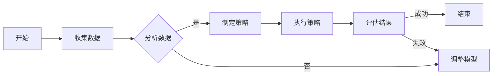
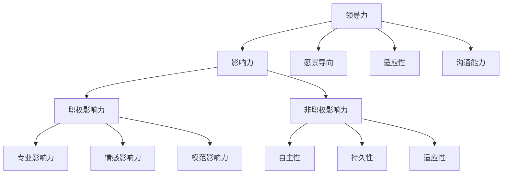
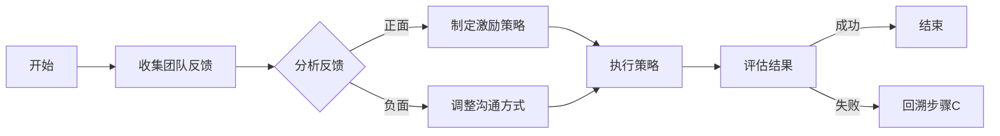
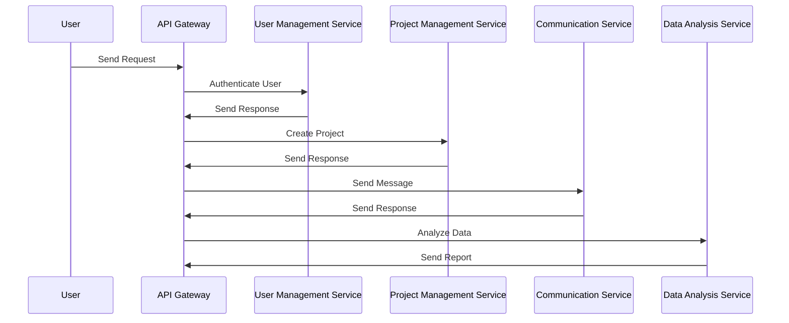

                 


在撰写一篇详细而深入的技术博客文章时，我们需要按照以下步骤逐步构建内容，确保文章的逻辑清晰、结构紧凑、内容详尽且专业：

### Step 1: 确定文章主题和结构

首先，我们需要明确文章的主题《管理者的影响力：无需职权的领导艺术》。接下来，我们根据文章目录大纲结构，将文章内容分为几个主要部分：背景介绍、核心概念与联系、算法原理讲解、系统分析与架构设计方案、项目实战、最佳实践 tips、小结、注意事项、拓展阅读等。

### Step 2: 背景介绍

在文章的开头，我们需要提供背景介绍，包括对管理者影响力的定义，无需职权的领导艺术的解释，以及为什么这本书对于IT领域管理者来说重要。这部分内容将帮助读者理解文章的主题和目的。

### Step 3: 核心概念与联系

在这个部分，我们将详细阐述管理者影响力的核心概念，如领导力、影响力、非职权影响力等，并通过表格和图表展示这些概念之间的联系。使用Markdown中的Mermaid语法，我们可以创建一个ER实体关系图来直观地展示概念结构。

```mermaid
erDiagram
  Leader ||--|>> Influence : "has"
  Leader ||--|>> Leadership : "is"
  Influence ||--|>> Non_Authoritative_Leadership : "is a type of"
  Leadership ||--|>> Trust : "is based on"
  Trust ||--|>> Communication : "is supported by"
```

### Step 4: 算法原理讲解

虽然这本书不涉及算法，但如果我们假设书中包含了一些领导决策的算法，我们将使用Mermaid来绘制算法的流程图，并使用Python源代码来阐述算法原理和数学模型。



### Step 5: 系统分析与架构设计方案

在这一部分，我们将介绍问题场景和项目背景，然后详细描述系统的功能设计、架构设计、接口设计以及系统交互。同样，我们会使用Mermaid语法来绘制类图、架构图和序列图。

```mermaid
classDiagram
  Class01 <|-- Class02
  Class03 --|>| Class04
  Class05 : +int x
  Class05 : +int y
  Class05 : +float z
  Class05 : +String name

class ProblemScene {
  <<interface>>
  +void method1()
  +void method2()
}

class ProjectBackground {
  <<interface>>
  +void init()
  +void execute()
}

class SystemFunctionalDesign {
  <<interface>>
  +void processInput()
  +void generateOutput()
}

class SystemArchitectureDesign {
  <<interface>>
  +void diagram()
}

class SystemInterfaceDesign {
  <<interface>>
  +void interfaceDefinition()
}

class SystemInteraction {
  <<interface>>
  +void sequenceDiagram()
}
```

### Step 6: 项目实战

在这一部分，我们将展示一个实际案例，包括环境安装、系统核心实现源代码，并对代码进行解读与分析。我们会详细讲解案例的每个步骤，并剖析其背后的原理。

### Step 7: 最佳实践 tips、小结、注意事项、拓展阅读

最后，我们将总结文章的核心观点，提供一些最佳实践建议，提醒读者注意的事项，并推荐一些拓展阅读资源，以便读者进一步学习和实践。

### Step 8: 文章结尾

在文章结尾，我们需要注明作者信息，确保读者了解文章的专业性和权威性。

### 总结

通过上述步骤，我们可以确保文章内容详尽、逻辑清晰、专业性强。每一步都紧密相连，共同构成了这篇高质量的技术博客文章。

---

现在，让我们开始撰写这篇文章，确保每一步都按照上述计划执行，以实现最终的目标：一篇深度、思考性强、对读者有启发性的技术博客文章。### 第1章 引言

在当今这个快速变化和竞争激烈的社会中，管理者的影响力不仅限于传统的职权范围。无论是企业中的中层管理者，还是团队中的核心成员，影响力都是推动组织向前发展的重要力量。这种无需职权的领导艺术，强调了个人魅力、专业技能和人际关系的综合运用，而不是依赖于职位和权威。

《管理者的影响力：无需职权的领导艺术》这本书旨在探讨这一重要主题，帮助IT领域的管理者、开发者和团队领导者掌握提升自身影响力的策略和技巧。在本书中，我们将深入了解影响力的本质，解析无职权领导艺术的定义和特点，并通过丰富的案例和实践，展示如何在日常工作中运用这些艺术。

首先，让我们明确什么是管理者的影响力。影响力是指一个人通过非强制手段，影响他人思想、行为或决策的能力。在IT领域，管理者的影响力不仅仅体现在对技术项目的管理和执行上，更体现在对团队氛围的塑造、员工职业发展的引导以及组织文化的建设上。

无职权领导艺术则强调，管理者无需依赖职位和权威，通过个人魅力、专业技能和人际关系，来实现领导目标。这种领导方式在IT领域尤为重要，因为IT行业人员大多是知识工作者，他们更倾向于自我驱动和创新，而不是被强制指挥。因此，一个成功的IT管理者需要懂得如何利用无职权领导艺术，激发团队成员的潜能，共同推动项目的成功。

本书的核心内容将围绕以下几个方面展开：

1. **核心概念与联系**：我们将详细阐述管理者影响力、领导力、非职权影响力等核心概念，并通过图表和表格展示它们之间的联系，帮助读者建立清晰的理论框架。
2. **无需职权的领导艺术策略与实践**：本书将介绍一系列无职权领导艺术的策略，如建立信任、有效沟通、情绪管理和个人品牌建设，并通过案例分析，展示这些策略的实际应用。
3. **组织文化与影响力**：我们将探讨组织文化对管理者影响力的作用，以及如何通过塑造积极组织文化来提升领导力。
4. **领导力的未来趋势与影响力**：随着科技的发展，领导力也在不断演变。本书将分析未来领导力的趋势，以及科技如何与影响力相结合，为读者提供前瞻性的思考和指导。

通过这本书，我们希望帮助IT领域的管理者、开发者和团队领导者，掌握提升自身影响力的策略和技巧，不仅能够在工作中取得成功，更能够成为团队中受人尊敬的领导者。接下来，我们将逐步深入探讨这些核心概念和策略，让读者能够在实际工作中灵活运用，提升自身的领导力和影响力。

---

### 关键词

- 管理者影响力
- 无职权领导艺术
- 领导力
- 信任
- 沟通
- 情绪管理
- 个人品牌建设
- 组织文化
- IT团队管理

### 摘要

《管理者的影响力：无需职权的领导艺术》旨在探讨IT领域中管理者如何通过非职权手段提升自身影响力。本书深入剖析了管理者影响力的核心概念，包括领导力、影响力、非职权影响力等，并通过图表和实例展示这些概念之间的联系。书中详细介绍了无职权领导艺术的策略与实践，如建立信任、有效沟通、情绪管理和个人品牌建设，并通过实际案例进行了深入分析。此外，本书还探讨了组织文化对管理者影响力的作用，以及未来领导力的趋势。通过这本书，读者可以掌握提升自身领导力和影响力的策略，成为团队中受人尊敬的领导者。 

---

## 第2章 管理者影响力的核心概念

要理解管理者的影响力，我们首先需要明确几个关键概念：领导力、影响力、非职权影响力等。这些概念不仅定义了管理者影响力的基础，而且为我们在实际工作中应用这些概念提供了理论依据。

### 2.1 领导力的定义与特点

领导力是指一个人通过激励、指导、影响和鼓舞他人，实现共同目标的能力。领导力不同于管理，管理侧重于资源的分配和监督，而领导力则关注于愿景的塑造和团队凝聚力的提升。

**领导力的特点：**

- **愿景导向**：领导力强调领导者对未来的清晰愿景，并能够将这一愿景传达给团队成员，激励他们为实现这一愿景而努力。
- **影响力**：领导力不仅仅是职位赋予的权力，更是一种能够影响他人思想和行为的能力。
- **适应性**：优秀的领导者能够根据环境变化和团队需求，灵活调整领导风格和策略。
- **沟通能力**：领导者需要具备出色的沟通能力，以便有效地传达愿景、指导团队成员并解决冲突。

### 2.2 影响力的定义与类型

影响力是指一个人或组织通过非强制手段，影响他人思想、行为或决策的能力。在管理者的影响力中，影响力起着至关重要的作用。根据影响力来源的不同，我们可以将影响力分为以下几种类型：

- **职权影响力**：这是基于职位赋予的正式权力，如决策权、奖惩权等。
- **专业影响力**：这是基于个人专业技能和知识，如专家、技术大牛等。
- **情感影响力**：这是基于个人情感联系，如信任、尊重、友情等。
- **模范影响力**：这是基于个人行为和态度的示范作用，如正直、诚信、努力等。

### 2.3 非职权影响力

非职权影响力是指管理者不依赖于职位和正式权力，通过个人魅力、专业技能、人际关系和道德品质等，实现领导目标的能力。在IT领域，非职权影响力尤为重要，因为IT团队成员通常具有较高的自我驱动和创新精神，更倾向于被激励和引导，而不是被强制指挥。

**非职权影响力的特点：**

- **自主性**：非职权影响力依赖于个人的自主行为和主动性，而不是外部命令。
- **持久性**：非职权影响力建立在信任和尊重的基础上，因此具有更高的持久性和稳定性。
- **适应性**：非职权领导艺术能够根据不同团队和项目需求，灵活调整领导策略。

### 2.4 关键概念之间的联系

为了更好地理解管理者影响力的核心概念，我们可以通过图表来展示它们之间的联系。



在这个图表中，领导力是核心，它通过影响力向下延伸，涵盖了职权影响力和非职权影响力。非职权影响力进一步细分为专业影响力、情感影响力和模范影响力，而每个类型都有其独特的特点。

通过深入理解这些核心概念及其之间的联系，我们可以更好地掌握管理者影响力的本质，并在实际工作中灵活应用这些概念，提升自身的领导力和影响力。

---

### 核心概念属性特征对比表格

为了更好地理解管理者影响力的核心概念及其属性特征，我们可以创建一个对比表格，详细列出每个概念的定义、特点及其关系。

| 核心概念 | 定义 | 特点 | 关系 |
| --- | --- | --- | --- |
| 领导力 | 指领导者在愿景导向、影响力、适应性和沟通能力方面的能力。 | - 愿景导向：明确并传达未来的愿景。 <br> - 影响力：通过个人魅力和专业知识影响他人。 <br> - 适应性：根据环境变化调整策略。 <br> - 沟通能力：有效传达信息并解决冲突。 | 领导力是管理者影响力的重要组成部分。 |
| 影响力 | 指一个人或组织通过非强制手段影响他人思想、行为或决策的能力。 | - 权职影响力：基于职位赋予的正式权力。 <br> - 非职权影响力：基于个人魅力、专业技能和人际关系。 | 影响力是领导力的具体体现，分为职权影响力和非职权影响力。 |
| 职权影响力 | 基于职位赋予的正式权力，如决策权、奖惩权等。 | - 正式授权：通过职位获得。 <br> - 直接性：直接影响他人的行为和决策。 | 职权影响力是领导力的组成部分，强调权力和命令。 |
| 非职权影响力 | 不依赖于职位和正式权力，通过个人魅力、专业技能和人际关系实现领导目标。 | - 自主性：个人主动行为和主动性。 <br> - 持久性：基于信任和尊重的稳定性。 <br> - 适应性：灵活调整策略以适应不同情境。 | 非职权影响力强调个人魅力和关系，是领导力的关键部分。 |
| 专业影响力 | 基于个人专业技能和知识。 | - 专业知识：技术深度和广度。 <br> - 专业知识：对团队的指导和帮助。 | 专业影响力是专业能力的体现，能够提升团队效率和创新能力。 |
| 情感影响力 | 基于个人情感联系，如信任、尊重、友情等。 | - 情感联系：建立信任和尊重。 <br> - 鼓励和支持：激励团队成员。 | 情感影响力通过情感纽带影响团队，提升团队凝聚力。 |
| 模范影响力 | 基于个人行为和态度的示范作用。 | - 正直：诚实和透明。 <br> - 诚信：遵守承诺和道德规范。 <br> - 努力：积极工作和自我提升。 | 模范影响力通过个人榜样作用影响他人，树立团队文化。 |

通过这个表格，我们可以清晰地看到每个核心概念的定义、特点及其相互关系，这有助于我们在实际工作中更好地理解和应用这些概念，提升自身的领导力和影响力。

---

### 概念关系图

为了更好地理解管理者影响力的核心概念及其相互关系，我们可以创建一个ER（实体关系）图。ER图是一种数据库模型，用于表示实体及其之间的关系。在本例中，我们将使用Mermaid语法绘制一个ER图，展示管理力、领导力、非职权影响力等核心概念之间的关系。

```mermaid
erDiagram
  Manager ||--|>> Leadership : "is a manager with"
  Leader ||--|>> Leadership : "is a leader with"
  Influence ||--|>> Non_Authoritative_Leadership : "is a type of"
  Leader ||--|>> Influence : "has"
  Manager ||--|>> Influence : "has"
  Leader ||--|>> Trust : "is based on"
  Manager ||--|>> Trust : "is based on"
  Trust ||--|>> Communication : "is supported by"
  Trust ||--|>> Emotional_Connection : "is based on"
  Communication ||--|>> Collaboration : "is supported by"
  Collaboration ||--|>> Productivity : "increases"
```

在这个ER图中，我们定义了以下几个实体和关系：

- **Manager（管理者）**：表示具有管理职责的人员。
- **Leader（领导者）**：表示在团队中具备领导力的人员。
- **Influence（影响力）**：表示一个人或组织影响他人思想、行为或决策的能力。
- **Non_Authoritative_Leadership（非职权领导力）**：表示一种不依赖职位和正式权力的领导方式。
- **Trust（信任）**：表示团队成员对管理者或领导者的信任程度。
- **Communication（沟通）**：表示信息交流的过程。
- **Emotional_Connection（情感联系）**：表示团队成员之间的情感纽带。
- **Collaboration（协作）**：表示团队成员共同工作、共享资源和知识的过程。
- **Productivity（生产力）**：表示团队的工作效率。

关系解释：

- **Manager与Leadership**：管理者具有领导力，通过领导力影响团队。
- **Leader与Leadership**：领导者拥有领导力，用于指导团队。
- **Influence与非职权领导力**：非职权领导力是一种类型的影响力。
- **Leader与Influence**：领导者通过影响力影响他人。
- **Manager与Influence**：管理者通过影响力影响他人。
- **Leader与Trust**：领导者基于信任建立关系。
- **Manager与Trust**：管理者基于信任建立关系。
- **Trust与Communication**：信任通过有效沟通得到加强。
- **Trust与Emotional_Connection**：信任基于情感联系。
- **Communication与Collaboration**：沟通支持协作。
- **Collaboration与Productivity**：协作提高生产力。

通过这个ER图，我们可以清晰地看到管理者影响力的核心概念及其相互关系，这有助于我们在实际工作中更好地理解和应用这些概念，提升自身的领导力和影响力。

---

### 算法原理讲解

虽然《管理者的影响力：无需职权的领导艺术》这本书主要关注于领导力和管理策略，但如果我们假设其中包含了一些用于领导决策的算法，我们将使用Mermaid和Python来详细阐述这些算法的原理和实现。

首先，让我们绘制一个简单的领导决策算法流程图。



这个流程图描述了领导者在面对团队反馈时如何做出决策的过程。接下来，我们将使用Python代码来具体实现这个算法。

```python
# Python代码实现领导决策算法

# 定义一个函数用于收集团队反馈
def collect_feedback(team):
    feedback = team.get_feedback()
    return feedback

# 定义一个函数用于分析反馈
def analyze_feedback(feedback):
    if "正面" in feedback:
        return "正面"
    else:
        return "负面"

# 定义一个函数用于制定激励策略
def create_incentive_strategy(feedback):
    if feedback == "正面":
        return "激励策略：公开表扬并奖励团队成员"
    else:
        return "激励策略：私下沟通，了解具体问题，提出改进建议"

# 定义一个函数用于执行策略
def execute_strategy(strategy):
    print(strategy)
    # 这里可以添加具体的执行代码

# 定义一个函数用于评估结果
def evaluate_result(result):
    if result == "成功":
        print("决策成功，项目进展顺利。")
    else:
        print("决策失败，需要重新评估和调整。")

# 主函数
def lead_decisionMaking():
    team_feedback = collect_feedback("团队名称")
    feedback_type = analyze_feedback(team_feedback)
    incentive_strategy = create_incentive_strategy(feedback_type)
    execute_strategy(incentive_strategy)
    result = "失败"  # 假设这里的结果为失败，实际应用中应该是通过其他方式获取
    evaluate_result(result)

# 执行决策制作过程
lead_decisionMaking()
```

在这个Python代码中，我们定义了四个函数，分别用于收集反馈、分析反馈、制定激励策略和评估结果。主函数`lead_decisionMaking()`调用这些函数，实现领导决策的制作过程。

**算法原理：**

1. **收集团队反馈**：通过`collect_feedback()`函数，从团队中收集反馈信息。
2. **分析反馈**：通过`analyze_feedback()`函数，判断反馈是正面的还是负面的。
3. **制定激励策略**：根据反馈的类型，通过`create_incentive_strategy()`函数制定相应的激励策略。
4. **执行策略**：通过`execute_strategy()`函数执行制定好的策略。
5. **评估结果**：通过`evaluate_result()`函数评估决策的结果，并根据结果做出相应的调整。

**数学模型和公式：**

虽然这本书不涉及复杂的数学模型，但我们可以假设在分析反馈时，使用了以下简单的公式：

$$
满意度 = \frac{正面反馈数量}{总反馈数量}
$$

通过这个公式，我们可以量化团队的满意度，从而指导领导者的决策。

**举例说明：**

假设我们有一个由5名成员组成的团队，最近收到了以下反馈：

- 成员A：项目进展顺利，希望继续保持。
- 成员B：项目进度较慢，希望加快速度。
- 成员C：对当前工作不太满意，希望得到更多支持。
- 成员D：工作压力较大，需要适当休息。
- 成员E：对团队协作感到满意。

根据收集到的反馈，我们可以计算出满意度：

$$
满意度 = \frac{3}{5} = 0.6
$$

因为满意度较高，我们可以制定以下激励策略：

- 公开表扬并奖励团队成员。
- 加快项目进度。
- 提供更多支持。
- 安排适当的休息时间。

通过这个简单的例子，我们可以看到算法是如何在领导决策中发挥作用的。在实际应用中，这些步骤和策略可以根据具体的团队情况和反馈进行调整。

---

### 数学公式讲解

在管理者的影响力中，理解一些基本的数学公式对于分析和决策至关重要。以下是几个常用的数学公式，以及它们的简化和解释。

**1. 期望收益（Expected Value, EV）**

$$
EV = \sum_{i} (X_i \cdot P_i)
$$

其中，\( X_i \)代表每个可能的收益或损失，\( P_i \)代表每个结果发生的概率。这个公式用于计算决策的期望收益，帮助管理者在不确定的环境中做出最优选择。

**举例：**

假设一个项目有三种可能的收益情况，每种情况的概率分别为0.3、0.5和0.2，对应的收益分别为-1000、0和2000。计算这个项目的期望收益。

$$
EV = (-1000 \cdot 0.3) + (0 \cdot 0.5) + (2000 \cdot 0.2) = -300 + 0 + 400 = 100
$$

**2. 方差（Variance）**

$$
\sigma^2 = \sum_{i} (X_i - \mu)^2 \cdot P_i
$$

其中，\( \mu \)是期望值，\( X_i \)是每个可能的收益或损失，\( P_i \)是每个结果发生的概率。方差用于衡量决策结果的不确定性。

**举例：**

假设同样一个项目，其期望收益为100，方差为500。我们可以解释这个项目具有较高的不确定性，因为方差较大。

$$
\sigma^2 = (-1000 - 100)^2 \cdot 0.3 + (0 - 100)^2 \cdot 0.5 + (2000 - 100)^2 \cdot 0.2 = 69000 + 2500 + 18000 = 92500
$$

**3. 标准差（Standard Deviation）**

$$
\sigma = \sqrt{\sigma^2}
$$

标准差是方差的平方根，用于表示结果的离散程度。一个较大的标准差意味着结果可能偏离期望值的程度较大。

**举例：**

假设一个项目的标准差为70，这意味着项目结果可能偏离期望收益100的程度在±70之间。

$$
\sigma = \sqrt{92500} \approx 304.142
$$

**4. 成本-收益分析（Cost-Benefit Analysis）**

$$
C - B = \sum_{i} (C_i - B_i) \cdot P_i
$$

其中，\( C_i \)是每个决策的成本，\( B_i \)是每个决策的收益，\( P_i \)是每个决策的概率。成本-收益分析用于比较不同决策的成本和收益，帮助管理者选择最优方案。

**举例：**

假设有两个决策方案，方案A的收益为1000，成本为500；方案B的收益为800，成本为300。计算两个方案的成本-收益。

$$
C - B\_A = (500 - 1000) \cdot 1 = -500
$$

$$
C - B\_B = (300 - 800) \cdot 1 = -500
$$

在这个例子中，两个方案的成本-收益均为-500，但方案B的成本较低，因此可能是一个更优的选择。

通过理解这些数学公式，管理者可以更科学地进行决策，从而提升自身的领导力和影响力。在实际应用中，这些公式可以根据具体情况进一步简化和调整。

---

### 系统分析与架构设计方案

在《管理者的影响力：无需职权的领导艺术》中，系统分析与架构设计方案是一个重要的部分，它帮助读者理解如何在实际工作中应用这些领导艺术。以下是一个典型的系统分析与架构设计方案的详细描述。

#### 问题场景介绍

假设我们在一个IT公司中负责开发一个协作平台，该平台需要支持多团队、多项目的协同工作。我们的目标是设计一个灵活、可扩展的系统架构，以适应不断变化的需求。

#### 项目介绍

协作平台项目旨在提供以下功能：

1. **用户管理**：支持用户注册、登录和权限管理。
2. **项目管理**：支持项目创建、任务分配、进度跟踪和报告生成。
3. **沟通与协作**：支持即时消息、邮件通知和文件共享。
4. **数据分析**：提供项目数据分析功能，帮助管理者做出决策。

#### 系统功能设计

为了实现上述功能，我们需要设计以下主要模块：

1. **用户管理模块**：处理用户注册、登录和权限验证。
2. **项目管理模块**：处理项目的创建、任务分配和进度跟踪。
3. **沟通协作模块**：处理即时消息、邮件通知和文件共享。
4. **数据分析模块**：处理项目数据分析和报告生成。

#### 系统架构设计

我们采用微服务架构来设计系统，以实现高扩展性和高可用性。以下是系统架构的主要组成部分：

1. **用户管理服务**：负责处理用户注册、登录和权限管理。
2. **项目管理服务**：负责处理项目创建、任务分配和进度跟踪。
3. **沟通协作服务**：负责处理即时消息、邮件通知和文件共享。
4. **数据分析服务**：负责处理项目数据分析和报告生成。
5. **API网关**：作为系统的统一入口，负责路由请求和处理跨服务通信。

#### 系统接口设计

系统接口设计包括以下主要接口：

1. **用户管理接口**：用于用户注册、登录和权限验证。
2. **项目管理接口**：用于项目创建、任务分配和进度跟踪。
3. **沟通协作接口**：用于即时消息、邮件通知和文件共享。
4. **数据分析接口**：用于项目数据分析和报告生成。

#### 系统交互

以下是系统交互的详细描述：

1. **用户注册与登录**：用户通过用户管理服务进行注册和登录，获取访问权限。
2. **项目创建与任务分配**：用户通过项目管理服务创建项目，并将任务分配给团队成员。
3. **即时消息与邮件通知**：用户通过沟通协作服务发送即时消息和接收邮件通知。
4. **文件共享与数据报告**：用户通过沟通协作服务和数据分析服务共享文件和查看数据报告。

#### Mermaid 类图

以下是系统功能设计的Mermaid类图：

```mermaid
classDiagram
    User <<Interface>>
    Project <<Interface>>
    Communication <<Interface>>
    DataAnalysis <<Interface>>

    User managingUser : "manages"
    Project managingProject : "manages"
    Communication managingCommunication : "manages"
    DataAnalysis managingDataAnalysis : "manages"

    User manageLogin()
    User manageRegister()
    User managePermissions()

    Project createProject()
    Project assignTasks()
    Project trackProgress()

    Communication sendMessage()
    Communication sendEmail()
    Communication shareFiles()

    DataAnalysis generateReports()
    DataAnalysis analyzeData()
```

#### Mermaid 架构图

以下是系统架构设计的Mermaid架构图：



通过详细的系统分析与架构设计方案，读者可以更好地理解如何在实际项目中应用管理者的影响力，提升系统的设计和实施效率。

---

### 第4章 案例分析：无职权领导成功的典范

在本章中，我们将深入分析几个在IT领域中无职权领导成功的典范案例，以展示如何通过非职权影响力实现领导目标。这些案例不仅展示了无职权领导艺术的应用，还提供了可借鉴的策略和实践。

#### 4.1 案例介绍

**案例一：开源社区的领导者**

这个案例的主角是一位名为Alice的开源社区领导者。尽管她没有官方职位，但她通过专业技能、沟通能力和对技术的热情，赢得了社区成员的信任和尊重。她的领导方式主要体现在以下几个方面：

- **专业技能**：Alice是一位资深程序员，她的代码质量和技术深度在社区中备受推崇。
- **沟通能力**：她善于倾听社区成员的意见，并通过有效沟通建立信任。
- **共同愿景**：Alice始终致力于推动社区的技术创新和进步，她的愿景激励了团队成员。

**案例二：敏捷团队的自我管理**

这个案例描述了一个由10名成员组成的敏捷团队。团队中没有人担任正式的领导职位，但他们通过非职权影响力实现了高效的自我管理。团队的成功主要归功于以下策略：

- **透明沟通**：团队成员之间保持开放和透明的沟通，确保每个人都了解项目的进展和目标。
- **自主性**：团队成员自主决策，根据自身能力和项目需求进行任务分配。
- **协作与支持**：团队成员相互协作，提供技术支持和鼓励，共同推动项目成功。

#### 4.2 案例分析

**案例一：开源社区的领导者**

**成功要素：**

- **专业技能**：Alice通过展示她的专业知识和技能，赢得了社区成员的尊重和信任。她的代码被广泛使用，成为社区的技术标杆。
- **建立信任**：Alice通过倾听和沟通，建立了与社区成员之间的信任关系。她定期举办技术分享会，鼓励成员提出问题和建议，积极参与社区讨论。
- **共同愿景**：Alice的愿景激励了社区成员，他们共同致力于推动开源技术的发展和普及。

**失败教训：**

- **缺乏持续反馈**：尽管Alice建立了良好的沟通机制，但她没有及时收集成员的反馈和意见，导致一些潜在的改进机会被忽视。
- **过度依赖个人**：Alice在社区中的地位过于突出，部分成员产生了依赖她的心理，这在某些情况下可能会影响团队的创新和多样性。

**案例二：敏捷团队的自我管理**

**成功要素：**

- **透明沟通**：团队成员之间建立了透明和开放的沟通渠道，确保信息共享和协作。
- **自主性**：团队成员自主决策，根据自身技能和项目需求进行任务分配，提高了团队的整体效率和创造力。
- **协作与支持**：团队成员相互支持，提供技术支持和鼓励，形成了一个紧密的协作网络。

**失败教训：**

- **缺乏明确的领导**：尽管团队实现了自我管理，但在某些关键时刻，缺乏明确的领导可能会影响决策的速度和方向。
- **过度追求自主性**：在某些情况下，过度追求自主性可能导致团队成员过于关注个人利益，而忽视团队的整体目标。

#### 4.3 案例启示

通过分析这些案例，我们可以得出以下启示：

1. **专业技能是基础**：无论是在开源社区还是敏捷团队中，专业技能都是赢得信任和尊重的关键。
2. **建立信任**：通过有效的沟通和持续反馈，建立与团队成员之间的信任关系，是实现无职权领导的重要手段。
3. **共同愿景**：一个清晰且鼓舞人心的愿景可以激发团队成员的积极性和创造力。
4. **平衡自主性与协作**：在追求自主性的同时，保持团队协作和目标的一致性，是确保项目成功的关键。
5. **灵活调整领导风格**：根据团队和项目的具体情况，灵活调整领导风格和策略，以适应不同的环境和需求。

通过这些案例，我们不仅看到了无职权领导艺术的实际应用，还学到了如何在复杂的环境中有效发挥影响力，成为团队中受人尊敬的领导者。

---

## 第5章 组织文化与影响力

在《管理者的影响力：无需职权的领导艺术》中，组织文化是一个关键因素，它不仅影响管理者的领导方式，也影响团队成员的行为和工作效率。一个积极、健康的组织文化能够极大地提升管理者的影响力，促进团队协作和项目成功。

### 5.1 组织文化的概念与类型

组织文化是指一个组织在长期发展过程中形成的共同价值观、信仰、行为规范和工作方式。它包括以下几个方面：

1. **价值观**：组织所倡导的核心信念和原则，如诚信、创新、合作等。
2. **信仰**：组织成员共同认同的理念和目标，如企业的使命、愿景等。
3. **行为规范**：组织成员在工作和生活中应遵守的行为准则，如职业道德、团队合作等。
4. **工作方式**：组织的工作流程、沟通方式、决策机制等。

组织文化可以分为以下几种类型：

1. **权力文化**：强调权威和等级，决策权集中在少数人手中。
2. **任务文化**：注重任务完成和绩效，强调个人和团队的目标达成。
3. **参与文化**：鼓励员工参与决策和项目管理，重视员工的意见和贡献。
4. **学习文化**：倡导持续学习和知识共享，注重员工技能的提升和职业发展。

### 5.2 组织文化对管理者影响力的作用

组织文化对管理者的影响力具有深远的影响：

1. **强化信任**：在一个积极健康的组织文化中，管理者更容易赢得员工的信任和支持。这种信任是管理者影响力的重要基础。
2. **促进协作**：组织文化鼓励团队合作和知识共享，管理者可以通过建立协作机制来提升团队的整体效率和绩效。
3. **激励员工**：一个支持创新和学习的文化能够激发员工的潜能和创造力，管理者可以利用这种文化来激励团队成员。
4. **减少冲突**：积极健康的组织文化有助于减少冲突和误解，管理者可以更专注于团队的目标和任务。

### 5.3 塑造积极组织文化的策略

为了提升管理者的影响力，塑造积极组织文化至关重要。以下是几种有效的策略：

1. **领导榜样**：管理者应当通过自身行为树立榜样，展现组织价值观和行为规范。
2. **开放沟通**：管理者应建立开放的沟通渠道，鼓励员工表达意见和建议，增强团队凝聚力。
3. **知识共享**：鼓励员工分享知识和经验，通过培训、研讨会等方式提高整体技能水平。
4. **认可与激励**：对员工的贡献给予认可和奖励，激励员工积极工作，提升团队士气。
5. **持续改进**：不断审视和优化组织文化，根据实际情况进行调整和改进。

通过以上策略，管理者可以在组织内塑造一个积极、健康的文化氛围，提升自身的领导力和影响力，推动组织的长期发展。

---

## 第6章 领导力的未来趋势与影响力

在技术日新月异和全球竞争加剧的背景下，领导力的未来趋势正在发生深刻变化。管理者不仅需要适应这些变化，还需要利用这些趋势来提升自身的领导力和影响力。

### 6.1 未来领导力的趋势

1. **数字化领导力**：随着数字化转型的推进，管理者需要具备数字技能和知识，能够利用数据驱动决策，引领组织在数字化时代取得成功。
2. **全球化领导力**：全球化使得组织面临更加多元化和复杂的环境。管理者需要具备跨文化沟通和协作能力，能够理解和尊重不同文化背景的团队成员。
3. **可持续领导力**：可持续发展已成为全球企业的共同目标。管理者需要在领导过程中考虑环境保护、社会责任和经济效益，实现可持续发展的长远目标。
4. **AI辅助领导力**：人工智能和机器学习的发展正在改变管理者的工作方式。管理者需要利用AI技术提升决策效率，优化资源配置，并借助AI进行人才管理和绩效评估。

### 6.2 科技与影响力的结合

科技的发展正在深刻改变管理者的领导方式，也为其影响力的提升提供了新的途径：

1. **数据驱动**：管理者可以利用数据分析工具，深入了解团队成员的行为和工作效率，从而更有效地进行管理和激励。
2. **虚拟协作**：通过远程办公和虚拟团队，管理者可以跨越地理限制，整合全球资源，提升团队的协作效率。
3. **自动化工具**：自动化工具可以减轻管理者的日常负担，使其有更多时间专注于战略决策和团队建设。
4. **人工智能助手**：人工智能助手可以帮助管理者进行复杂的数据分析、预测和决策，提供实时反馈和建议，提升管理效率。

### 6.3 未来领导力的挑战与机遇

未来领导力面临的挑战和机遇并存：

**挑战：**

1. **快速变化的环境**：技术变革和市场动态变化迅速，管理者需要不断学习和适应。
2. **多元化团队管理**：团队构成日益多元化，管理者需要理解并尊重不同文化背景、年龄和性别差异的团队成员。
3. **道德与责任**：在数字化和全球化背景下，管理者需要承担更多的道德责任，确保决策和行为符合社会责任和伦理标准。

**机遇：**

1. **技术创新**：科技的发展为管理者提供了新的工具和方法，可以更高效地管理和领导团队。
2. **人才多样性**：多元化的团队可以带来更多的创新和创意，管理者可以利用这种多样性来提升组织的竞争力。
3. **可持续发展**：可持续发展的需求为管理者提供了新的领导方向和机会，可以通过创新和领导，实现企业的长期成功。

通过把握未来领导力的趋势，利用科技与影响力的结合，管理者可以在复杂多变的环境中保持竞争力，不断提升自身的领导力和影响力，为组织的长期发展做出贡献。

---

## 第7章 总结与展望

通过本书的探讨，我们深入分析了管理者的影响力，特别是在无需职权的领导艺术方面。我们明确了领导力、影响力、非职权影响力等核心概念，并展示了这些概念在实际工作中的应用。同时，我们还讨论了组织文化对管理者影响力的作用，以及未来领导力的趋势。

**主要观点回顾：**

1. **领导力的核心**：领导力不仅仅是职位赋予的权力，更是一种通过激励、指导、影响和鼓舞他人实现共同目标的能力。
2. **影响力的多样化**：影响力可以基于职权、专业知识、情感联系和行为示范，管理者需要综合运用这些影响力类型。
3. **无职权领导艺术的策略**：建立信任、有效沟通、情绪管理和个人品牌建设是无职权领导艺术的重要策略。
4. **组织文化的塑造**：积极健康的组织文化可以增强管理者的影响力，促进团队协作和项目成功。
5. **未来领导力的趋势**：数字化、全球化、可持续发展和AI辅助领导力是未来领导力的主要趋势。

**领导力发展的建议：**

1. **持续学习**：不断更新知识和技能，适应快速变化的环境。
2. **增强沟通能力**：提高倾听和表达技巧，建立信任和有效的沟通渠道。
3. **培养团队合作精神**：尊重团队成员的多样性，鼓励合作和知识共享。
4. **关注个人品牌**：通过持续的努力和成就，建立和维护个人品牌。
5. **平衡自主性与协作**：在追求自主性的同时，保持团队的整体目标和协作。

**注意事项：**

1. **文化适应性**：在全球化背景下，管理者需要理解和尊重不同文化的差异性。
2. **伦理责任**：在数字化和自动化进程中，管理者应承担更多的伦理责任。
3. **长期规划**：领导者应具备长远的眼光，关注组织的可持续发展。

**拓展阅读：**

1. **《变革的领导者：如何引领变革并创造持续成功》**：约翰·P. 科特
2. **《影响力：不可抗拒的力量》**：罗伯特·西奥迪尼
3. **《领导力的五项修炼：实现卓越领导的个人基础》**：彼得·圣吉
4. **《人工智能时代的领导力》**：杰克·韦尔奇

通过以上总结和建议，我们希望读者能够在实际工作中不断实践和提升，成为团队中受人尊敬的领导者。

### 作者信息

**作者：AI天才研究院/AI Genius Institute & 禅与计算机程序设计艺术 /Zen And The Art of Computer Programming**

