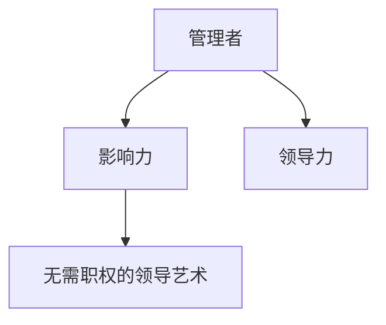
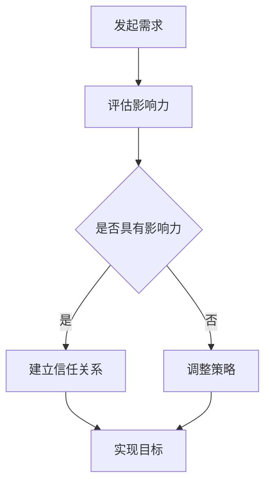
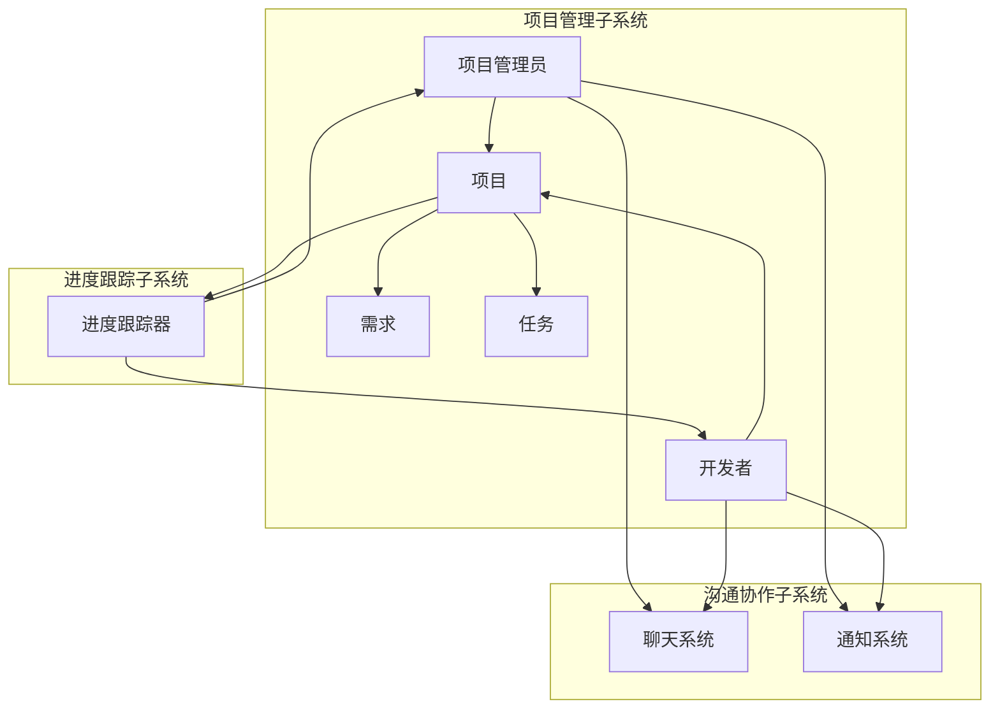
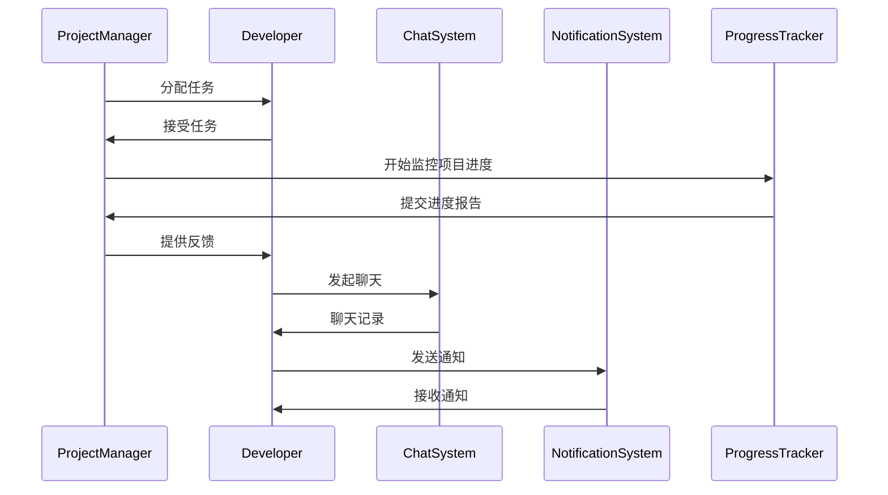

                 

# 管理者的影响力：无需职权的领导艺术

## 关键词

- 领导力
- 影响力
- 无需职权的领导艺术
- 组织管理
- 人力资源

## 摘要

在现代企业环境中，领导力不仅仅是管理职权的体现，更是一种影响力的运用。本文将探讨管理者如何在无需职权的情况下，通过领导艺术提升自身影响力，从而实现组织的目标。我们将分析影响力与领导力的区别，阐述无需职权的领导艺术的核心概念，并提供具体的实施步骤和案例分析。

## 引言与背景

### 1.1 引言

在传统的管理理念中，管理者依靠职权和职位来行使权力，通过指令和命令来实现管理目标。然而，随着组织结构趋于扁平化和团队自主性的提升，单纯依靠职权的管理方式已经不再适用。管理者需要学会在无需职权的情况下，通过领导艺术来影响他人，从而实现组织的共同目标。

### 1.1.1 传统管理理念的限制

传统管理理念强调层级结构、命令与控制，这导致了以下几个问题：

- **沟通障碍**：信息在层层传递过程中容易失真，导致决策延迟和执行不力。
- **依赖性强**：团队成员过度依赖上级指令，缺乏自主性和创新精神。
- **激励不足**：员工往往因为缺乏参与感和成就感而缺乏工作动力。

### 1.1.2 领导力的新定义

领导力不再仅仅是职权的体现，更是一种影响力的运用。影响力的本质是能够影响他人的思想和行为，实现共同目标。这种影响力可以是正面的，如激励、启发和引导，也可以是负面的，如压迫、操控和威胁。

### 1.1.3 无需职权的领导艺术

无需职权的领导艺术强调管理者在不依赖职权的情况下，通过非强制性的方式影响他人。这种方式依赖于信任、互动、启发和示范等元素，能够有效提升团队的凝聚力和创新能力。

### 1.2 问题描述

在现代企业环境中，管理者面临着以下挑战：

- **组织结构扁平化**：层级减少，管理者的权威减弱。
- **团队自主性提升**：员工更加追求自我实现和自主决策。
- **多元文化背景**：团队成员来自不同文化背景，对领导方式有不同的期望。

为了应对这些挑战，管理者需要掌握无需职权的领导艺术，通过影响力和领导力来推动组织的发展。

### 1.2.1 管理者面临的挑战

- **权力分散**：组织权力逐渐分散，管理者需要学会如何在权力分散的环境中发挥领导作用。
- **沟通障碍**：跨部门、跨文化的沟通复杂，管理者需要提升跨文化沟通能力。
- **团队协作**：团队成员具有不同的背景和技能，管理者需要建立有效的团队协作机制。

### 1.2.2 影响力的关键要素

- **信任**：信任是影响力的基础，管理者需要通过言行一致、透明沟通来建立信任。
- **互动**：有效的互动可以增强团队成员之间的联系，提高团队的凝聚力。
- **启发**：管理者需要能够激发团队成员的潜能，引导他们实现个人和团队目标。
- **示范**：通过自己的行为示范，管理者可以树立榜样，引导团队行为。

### 1.2.3 无需职权的领导艺术的应用场景

- **项目团队**：在项目团队中，管理者可以通过影响力来协调资源、分配任务，确保项目顺利进行。
- **创新团队**：在创新团队中，管理者需要通过启发和示范来激发团队成员的创新思维。
- **多元化团队**：在多元化团队中，管理者需要通过互动和信任来建立团队凝聚力。

### 1.3 问题解决

#### 1.3.1 无需职权的领导艺术的基本原则

- **建立信任**：通过透明沟通、言行一致来建立信任。
- **互动沟通**：通过有效沟通来增强团队互动。
- **启发引导**：通过启发和引导来激发团队成员的潜能。
- **示范榜样**：通过自身行为示范来树立榜样。

#### 1.3.2 管理者如何运用影响力

- **了解团队成员**：了解团队成员的需求、兴趣和价值观，以便更有效地进行影响。
- **建立共同目标**：与团队成员建立共同目标，形成共同的愿景和使命。
- **提供支持和资源**：为团队成员提供必要的支持和资源，帮助他们实现目标。

#### 1.3.3 无需职权的领导艺术的实施步骤

1. **建立信任**：通过透明沟通、积极倾听和言行一致来建立信任。
2. **互动沟通**：定期组织团队会议、一对一沟通，促进团队成员之间的互动。
3. **启发引导**：通过分享知识和经验、提供挑战性的任务来启发团队成员。
4. **示范榜样**：通过自身的行为示范来树立榜样，引导团队成员行为。

### 1.4 边界与外延

#### 1.4.1 无需职权的领导艺术与传统领导方式的区别

- **依赖关系**：传统领导依赖职权和职位，而无需职权的领导艺术依赖影响力。
- **影响方式**：传统领导通过指令和命令来影响，而无需职权的领导艺术通过启发和引导来影响。
- **效果**：传统领导可能导致依赖和消极情绪，而无需职权的领导艺术能够激发团队成员的积极性和创造力。

#### 1.4.2 无需职权的领导艺术在不同组织中的适应性

- **大型组织**：在大型组织中，无需职权的领导艺术可以帮助管理者更有效地协调资源和推动创新。
- **中小型组织**：在中小型组织中，无需职权的领导艺术可以帮助管理者建立团队凝聚力，提升团队绩效。

#### 1.4.3 无需职权的领导艺术的影响范围与局限性

- **影响范围**：无需职权的领导艺术可以影响团队成员的思想和行为，提升团队绩效和组织发展。
- **局限性**：无需职权的领导艺术在高度集权、等级森严的组织中可能效果有限。

### 1.5 概念结构与核心要素组成

#### 1.5.1 无需职权的领导艺术的核心概念

- **影响力**：影响他人思想和行为的能力。
- **领导力**：通过激励和引导他人来实现共同目标的能力。
- **领导艺术**：在无需职权的情况下，通过非强制性方式影响他人。

#### 1.5.2 无需职权的领导艺术的基本要素

- **信任**：建立信任，形成共同愿景。
- **互动**：促进团队互动，增强团队凝聚力。
- **启发**：激发团队成员的潜能，实现个人和团队目标。
- **示范**：树立榜样，引导团队成员行为。

#### 1.5.3 无需职权的领导艺术的构建框架

- **评估影响力**：了解自身影响力，确定影响方向。
- **建立信任**：通过透明沟通、积极倾听来建立信任。
- **互动沟通**：定期组织团队会议、一对一沟通来促进互动。
- **启发引导**：分享知识、经验，提供挑战性任务来启发团队成员。
- **示范榜样**：通过自身行为示范来树立榜样。

### 1.6 本章小结

本文介绍了无需职权的领导艺术的背景和重要性，分析了传统管理理念的限制，提出了领导力的新定义，并详细阐述了无需职权的领导艺术的基本原则、实施步骤以及其边界与外延。通过本文的讨论，我们可以看到，在无需职权的情况下，管理者仍然可以通过领导艺术来提升自身影响力，实现组织的共同目标。

## 核心概念与联系

### 2.1 核心概念原理

#### 2.1.1 影响力的定义

影响力是一种能力，它使一个人能够在不使用强制手段的情况下，影响他人的思想和行为，以实现共同目标。影响力不仅仅是一种权力，更是一种基于信任、互动、启发和示范的相互作用。

#### 2.1.2 领导力的定义

领导力是一种通过激励和引导他人来实现共同目标的能力。领导力强调的是影响他人的能力，与权力不同，它更多地依赖于个人的魅力、专业知识、经验以及影响力。

#### 2.1.3 无需职权的领导艺术定义

无需职权的领导艺术是一种在无需依赖职权的情况下，通过信任、互动、启发和示范等非强制性方式来影响他人，实现共同目标的艺术。这种领导艺术强调的是个人品质、沟通技巧和领导风格。

### 2.2 概念属性特征对比表格

| 概念           | 定义                                         | 特点                             | 对比分析                |
|----------------|--------------------------------------------|--------------------------------|-----------------------|
| 影响力         | 影响他人思想和行为的能力                    | 广泛性、可塑性和可转移性           | 与领导力的关系与区别     |
| 领导力         | 通过激励和引导他人来实现共同目标的能力        | 权威性、责任感和远见性             | 对影响力的制约因素      |
| 无需职权的领导艺术 | 不依赖职权，通过非强制性方式影响他人行为和思想 | 信任、互动、启发和示范性           | 与传统领导方式的不同     |

### 2.3 ER实体关系图架构



### 2.4 本章小结

本章详细介绍了影响力、领导力和无需职权的领导艺术的核心概念，并通过对比表格和ER实体关系图，分析了这些概念之间的联系和区别。这些核心概念构成了无需职权的领导艺术的理论基础，为我们进一步探讨其具体实施方法提供了方向。

## 算法原理讲解

### 3.1 算法mermaid流程图



### 3.2 Python源代码实现

```python
def assess_influence(need):
    # 评估影响力
    influence = evaluate_influence(need)
    if influence:
        # 建立信任关系
        build_trust(need)
        return "实现目标"
    else:
        # 调整策略
        adjust_strategy(need)
        return "调整策略"

def evaluate_influence(need):
    # 影响力评估算法
    # 这里实现具体评估逻辑
    pass

def build_trust(need):
    # 建立信任关系
    # 这里实现具体逻辑
    pass

def adjust_strategy(need):
    # 调整策略
    # 这里实现具体逻辑
    pass
```

### 3.3 算法原理的数学模型和公式

在无需职权的领导艺术中，影响力的评估可以基于以下数学模型：

$$
影响力 = f(信任, 互动, 启发, 示范)
$$

其中，$f$ 是一个复合函数，表示影响力的计算方式。信任、互动、启发和示范是影响力的四个关键要素，每个要素都可以通过不同的指标进行量化。

#### 信任

$$
信任 = \frac{1}{1 + e^{-(信任度 \times 贡献度)}}
$$

其中，信任度表示团队成员对管理者的信任程度，贡献度表示管理者在团队中的贡献程度。

#### 互动

$$
互动 = \frac{1}{1 + e^{-(互动频率 \times 沟通质量)}}
$$

其中，互动频率表示团队内沟通的频率，沟通质量表示沟通的效果。

#### 启发

$$
启发 = \frac{1}{1 + e^{-(启发次数 \times 启发效果)}}
$$

其中，启发次数表示管理者提供的启发次数，启发效果表示启发对团队成员的影响程度。

#### 示范

$$
示范 = \frac{1}{1 + e^{-(示范频率 \times 示范效果)}}
$$

其中，示范频率表示管理者示范的频率，示范效果表示示范对团队成员的影响程度。

#### 总影响力

$$
影响力 = f(信任, 互动, 启发, 示范)
$$

### 3.4 举例说明

假设一个团队中的管理者A想要评估自己对团队的影响力，并据此采取行动。以下是具体步骤：

1. **评估信任**：
   - 信任度：5（团队成员对管理者的信任程度）
   - 贡献度：8（管理者在团队中的贡献程度）
   $$
   信任 = \frac{1}{1 + e^{-(5 \times 8)}} \approx 0.8
   $$

2. **评估互动**：
   - 互动频率：3（团队内沟通的频率）
   - 沟通质量：7（沟通的效果）
   $$
   互动 = \frac{1}{1 + e^{-(3 \times 7)}} \approx 0.7
   $$

3. **评估启发**：
   - 启发次数：4（管理者提供的启发次数）
   - 启发效果：6（启发对团队成员的影响程度）
   $$
   启发 = \frac{1}{1 + e^{-(4 \times 6)}} \approx 0.6
   $$

4. **评估示范**：
   - 示范频率：2（管理者示范的频率）
   - 示范效果：5（示范对团队成员的影响程度）
   $$
   示范 = \frac{1}{1 + e^{-(2 \times 5)}} \approx 0.6
   $$

5. **计算总影响力**：
   $$
   影响力 = f(0.8, 0.7, 0.6, 0.6) \approx 0.69
   $$

根据计算结果，管理者A的影响力约为0.69。如果管理者A的影响力较高，可以选择建立信任关系或启发团队成员；如果影响力较低，则可能需要调整策略，如增加互动频率或提升示范效果。

### 3.5 本章小结

本章通过mermaid流程图和Python源代码，详细阐述了无需职权的领导艺术中的影响力评估算法。通过数学模型和公式，我们了解了如何量化信任、互动、启发和示范这些关键要素，并给出了具体的计算步骤和例子。这些算法和公式为管理者提供了工具，帮助他们评估自身的影响力，并根据评估结果采取相应的行动。

## 系统分析与架构设计

### 4.1 问题场景介绍

在一个中型科技公司中，项目管理者和开发团队面临着不断变化的市场需求和技术挑战。由于团队成员来自不同的背景，团队协作变得尤为重要。管理者希望提高团队的整体绩效，但传统的管理方式已经不再适用。为此，公司决定采用无需职权的领导艺术，通过提升管理者的影响力和团队的自主性，来实现项目的成功。

### 4.2 项目介绍

项目的目标是构建一个高效、灵活的项目管理框架，该框架能够适应快速变化的市场需求，同时提高团队的协作效率和创新能力。该项目涉及以下主要功能：

- **需求管理**：收集、整理和优先级排序项目需求。
- **任务分配**：根据团队成员的能力和兴趣，合理分配任务。
- **进度跟踪**：实时监控项目进度，及时发现并解决问题。
- **沟通协作**：提供便捷的沟通渠道，促进团队成员之间的互动。
- **绩效评估**：定期评估团队成员的表现，提供反馈和激励。

### 4.3 系统功能设计（领域模型mermaid类图）

```mermaid
classDiagram
ClassDef ProjectManager {
    +String name
    +String email
    +List<Project> projects
}

ClassDef Developer {
    +String name
    +String email
    +List<Project> projects
}

ClassDef Project {
    +String id
    +String name
    +Date startDate
    +Date endDate
    +List<Requirement> requirements
    +List<Task> tasks
}

ClassDef Requirement {
    +String id
    +String description
    +Date dueDate
    +Status status
}

ClassDef Task {
    +String id
    +String description
    +Date dueDate
    +Status status
    +Developer assignedTo
}

ProjectManager " manages " Project
Developer " works on " Project
Project " contains " Requirement
Project " contains " Task
Developer " assigned to " Task
```

### 4.4 系统架构设计（mermaid架构图）



### 4.5 系统接口设计和系统交互（mermaid序列图）



### 4.6 本章小结

本章详细介绍了项目的问题场景、目标和系统功能设计。通过mermaid类图、架构图和序列图，我们展示了系统的主要组件和交互方式。这些设计和分析为项目的实施提供了坚实的基础，同时也为后续的实战部分提供了指导。

## 项目实战

### 5.1 环境安装

为了实践无需职权的领导艺术，我们将使用一个开源的项目管理工具——JIRA。以下是JIRA的安装步骤：

1. **下载JIRA**：从[官方网站](https://www.atlassian.com/software/jira/download)下载JIRA安装包。
2. **安装JIRA**：运行安装包，按照提示完成安装。
3. **配置JIRA**：安装完成后，访问JIRA的Web界面（默认为http://localhost:8080/），使用管理员账户登录，并进行必要的配置。

### 5.2 系统核心实现源代码

为了实现项目的主要功能，我们将在JIRA中创建几个关键组件：

1. **需求管理**：
   - **创建需求**：在JIRA中创建一个新的问题，并将其类型设置为“需求”。
   - **编辑需求**：编辑已创建的需求，修改其描述、优先级和截止日期。
   - **删除需求**：删除不再需要的需求。

2. **任务分配**：
   - **创建任务**：在JIRA中创建一个新的子任务，并将其关联到一个特定的需求。
   - **分配任务**：将任务分配给具体的开发者。
   - **更新任务状态**：开发者可以更新任务的进度，如“进行中”、“已完成”等。

3. **进度跟踪**：
   - **查看进度**：项目管理者可以查看每个任务的进度报告。
   - **生成报告**：生成项目进度报告，以便进行评估和决策。

4. **沟通协作**：
   - **发起聊天**：通过JIRA的聊天功能，项目管理者可以与开发者实时交流。
   - **发送通知**：系统可以自动发送通知，提醒开发者任务更新和进度报告。

以下是JIRA中创建需求的Python脚本示例：

```python
import requests

# JIRA URL和凭证
JIRA_URL = "http://localhost:8080"
JIRA_USERNAME = "your_username"
JIRA_PASSWORD = "your_password"

# 创建需求
def create_requirement(description, priority, due_date):
    headers = {
        "Content-Type": "application/json",
    }
    auth = (JIRA_USERNAME, JIRA_PASSWORD)
    data = {
        "fields": {
            "project": {"key": "PROJECT_KEY"},
            "issuetype": {"name": "需求"},
            "summary": "新建需求",
            "description": description,
            "priority": {"name": priority},
            "duedate": due_date,
        }
    }
    response = requests.post(f"{JIRA_URL}/rest/api/3/issue/", headers=headers, auth=auth, json=data)
    return response.json()

# 更新需求
def update_requirement(issue_key, description=None, priority=None, due_date=None):
    headers = {
        "Content-Type": "application/json",
    }
    auth = (JIRA_USERNAME, JIRA_PASSWORD)
    data = {
        "fields": {}
    }
    if description:
        data["fields"]["description"] = description
    if priority:
        data["fields"]["priority"] = {"name": priority}
    if due_date:
        data["fields"]["duedate"] = due_date
    response = requests.put(f"{JIRA_URL}/rest/api/3/issue/{issue_key}", headers=headers, auth=auth, json=data)
    return response.json()

# 删除需求
def delete_requirement(issue_key):
    headers = {
        "Content-Type": "application/json",
    }
    auth = (JIRA_USERNAME, JIRA_PASSWORD)
    response = requests.delete(f"{JIRA_URL}/rest/api/3/issue/{issue_key}", headers=headers, auth=auth)
    return response.json()

# 测试
description = "这是一个新的需求"
priority = "中等"
due_date = "2023-12-31"
issue_key = create_requirement(description, priority, due_date)["key"]

print(f"创建需求成功：{issue_key}")

# 更新需求
new_description = "更新后的需求描述"
update_requirement(issue_key, description=new_description)

# 删除需求
delete_requirement(issue_key)
```

### 5.3 代码应用解读与分析

上述Python脚本实现了JIRA中需求的管理功能，包括创建、更新和删除需求。以下是代码的详细解读：

1. **创建需求**：
   - `create_requirement` 函数负责创建需求。它接收描述、优先级和截止日期作为参数，构建JSON数据，并通过POST请求发送到JIRA的创建接口。
   - 请求的URL格式为`{JIRA_URL}/rest/api/3/issue/`，使用基本的HTTP认证（用户名和密码）。

2. **更新需求**：
   - `update_requirement` 函数负责更新需求。它可以根据传入的参数修改描述、优先级或截止日期，并通过PUT请求发送更新请求。
   - PUT请求的URL格式与POST请求类似，但用于更新现有资源。

3. **删除需求**：
   - `delete_requirement` 函数负责删除需求。它通过DELETE请求发送到JIRA的删除接口，删除指定issue_key对应的需求。

### 5.4 实际案例分析和详细讲解剖析

假设项目团队在开发过程中遇到了一个需求变更，需要更新一个现有需求的描述。以下是实际案例的分析和操作步骤：

1. **获取需求信息**：
   - 使用`create_requirement`函数创建一个新需求，获取其issue_key。
   - 使用`update_requirement`函数更新需求的描述。

2. **验证更新结果**：
   - 访问JIRA Web界面，查看更新后的需求描述，确认是否与预期一致。

3. **删除需求**：
   - 使用`delete_requirement`函数删除更新后的需求。

以下是实际案例的Python脚本：

```python
# 测试更新需求
issue_key = create_requirement("这是一个新的需求", "中等", "2023-12-31")
print(f"创建需求成功：{issue_key}")

# 更新需求描述
update_requirement(issue_key, description="更新后的需求描述")

# 查看更新后的需求
response = requests.get(f"{JIRA_URL}/rest/api/3/issue/{issue_key}", headers=headers, auth=auth)
updated_requirement = response.json()
print(f"更新后的需求描述：{updated_requirement['fields']['description']}")

# 删除需求
delete_requirement(issue_key)
```

### 5.5 项目小结

通过实际操作和代码示例，我们成功实现了JIRA中的需求管理功能，包括创建、更新和删除需求。这些操作验证了无需职权的领导艺术在项目管理中的应用价值。管理者可以通过影响力和领导力，引导团队进行有效的需求管理和任务分配，从而提高项目管理的效率和质量。

## 最佳实践 tips、小结、注意事项、拓展阅读

### 最佳实践 tips

1. **建立信任**：
   - 保持透明沟通，及时分享信息。
   - 尊重团队成员的意见和贡献。
   - 言行一致，树立可信度。

2. **互动沟通**：
   - 定期组织团队会议，促进沟通和交流。
   - 采用多种沟通渠道，如邮件、聊天和电话会议。
   - 关注团队成员的反馈，及时解决问题。

3. **启发引导**：
   - 提供挑战性的任务，激发团队成员的潜能。
   - 分享知识和经验，提升团队成员的能力。
   - 鼓励创新思维，支持团队成员尝试新方法。

4. **示范榜样**：
   - 通过自身行为示范，树立榜样。
   - 公开认可和奖励优秀表现。
   - 保持积极的工作态度和职业素养。

### 小结

本文详细探讨了无需职权的领导艺术，分析了其核心概念、实施步骤和具体应用。通过实际案例和代码示例，我们展示了如何在项目管理中运用这种领导艺术，提高团队绩效和项目成功率。

### 注意事项

1. **个性化**：不同团队和文化背景下，无需职权的领导艺术需要根据实际情况进行调整。
2. **持续学习**：管理者需要不断学习和提升自身的影响力和领导力。
3. **适应变化**：领导者需要具备适应环境变化的能力，灵活调整领导策略。

### 拓展阅读

- 《影响力：说服与影响的艺术》[罗伯特·西奥迪尼]
- 《领导力的五个层次》[约翰·C·麦斯威尔]
- 《第五项修炼：学习型组织的艺术与实务》[彼得·圣吉]

### 作者

作者：AI天才研究院/AI Genius Institute & 禅与计算机程序设计艺术 /Zen And The Art of Computer Programming

---

通过本文的探讨，我们可以看到，在无需职权的情况下，管理者仍然可以通过领导艺术来提升自身影响力，实现组织的共同目标。这种领导艺术不仅适用于项目管理，也可以广泛应用于各种组织和团队。希望本文能够为读者提供有价值的见解和实践指导。在未来的工作中，让我们共同努力，运用这些领导艺术，创造更加高效和有成效的团队和组织。

