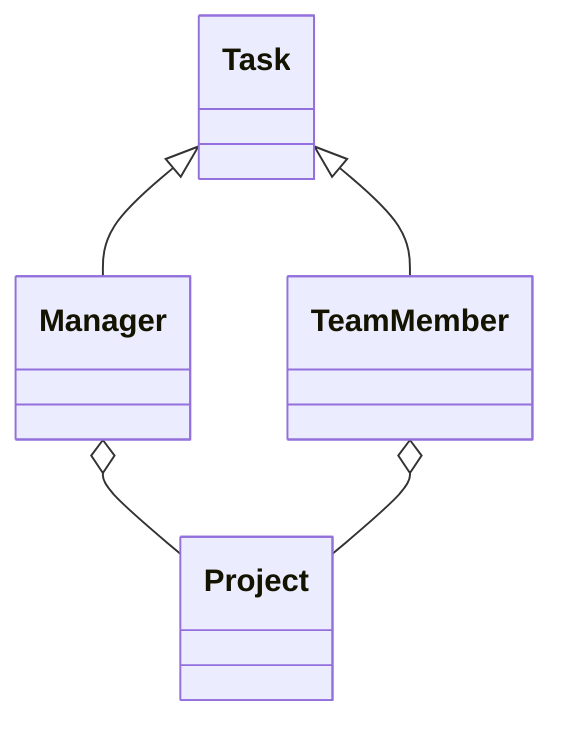
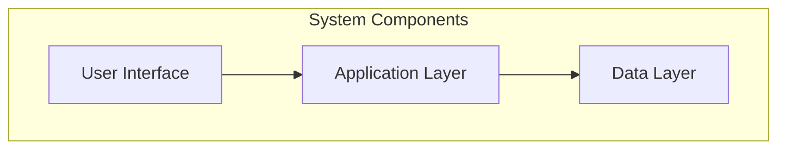
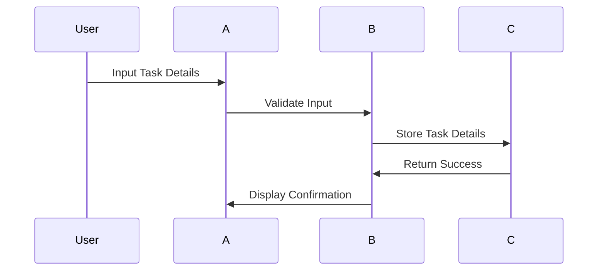

                 

### 设计大纲

#### 标题：管理者的时间规划：平衡短期目标和长期发展

#### 关键词：时间管理、目标设定、策略执行、评估与调整、团队协作、个人成长

#### 摘要：
本文旨在为管理者提供一套完整的时间规划体系，帮助他们有效地平衡短期目标和长期发展。通过系统阐述时间管理的背景、核心概念、策略执行、评估与调整、团队协作、个人成长以及实用技巧，本文将为读者提供实用的工具和方法，助力他们在职业和个人生活中取得成功。

---

#### 目录

1. **时间管理的背景与核心概念**
   1.1 时间管理的重要性与误区
   1.2 时间规划的基本原则
   1.3 短期目标与长期目标的设定

2. **策略执行与目标实现**
   2.1 将时间规划转化为实际行动
   2.2 优先级排序与避免拖延
   2.3 设定里程碑与保持动力

3. **评估与调整时间规划**
   3.1 定期评估与自我反思
   3.2 解决时间管理问题与持续改进

4. **团队中的时间规划**
   4.1 团队目标设定与协调工作时间
   4.2 提高团队效率与解决团队冲突

5. **个人成长与时间规划**
   5.1 学习新技能与个人成长目标的设定
   5.2 平衡工作与生活

6. **实用技巧与最佳实践**
   6.1 避免时间浪费与提高专注力
   6.2 跨境情境下的时间规划调整

### 第一部分：时间管理的背景与核心概念

#### 第1章：时间管理的重要性与误区

**背景介绍：**

时间管理作为现代管理者的一项关键技能，不仅影响着企业的运营效率，还直接关联到个人的职业发展和生活质量。然而，在时间管理的过程中，许多人往往陷入误区，导致效率低下，甚至影响到目标的实现。

**核心概念与联系：**

- **时间管理的重要性：**
  - 对企业：提高工作效率、优化资源配置、降低运营成本。
  - 对个人：提升职业竞争力、实现个人价值、平衡工作与生活。

- **时间管理的常见误区：**
  - 过度计划与规划不足：缺乏灵活性，无法应对突发情况。
  - 忽视优先级与任务过度堆叠：导致压力过大，效率降低。
  - 忽视休息与放松：影响身心健康，降低工作效率。

**核心概念原理与属性特征对比表格：**

| 核心概念 | 原理 | 属性特征 |
| --- | --- | --- |
| 时间优先级 | 根据任务的重要性和紧急程度进行排序 | 高优先级任务应优先处理 |
| 时间块管理 | 将时间划分为不同的块，专注于特定任务 | 提高专注度和效率 |
| 短期目标 | 短期时间内需要实现的具体目标 | 易于量化、可实现 |
| 长期目标 | 长期时间内希望实现的目标 | 需要持续努力和调整 |

**ER实体关系图架构：**

```mermaid
erDiagram
  Product ||--|{ Customer } Customer
  Product ||--|{ Order } Order
  Customer }|-- Product
  Customer }|--|{ Order } Order
  Order }|-- Product
```

### 算法原理讲解

在时间管理中，算法原理主要涉及优先级排序和时间块管理。以下是一个简单的优先级排序算法：

```python
def priority_sort(tasks):
    sorted_tasks = sorted(tasks, key=lambda x: (x['importance'], x['deadline']))
    return sorted_tasks
```

此算法使用排序函数`sorted()`，根据任务的重要性和截止日期进行排序。重要性和紧急性高的任务会优先处理。

**数学模型和公式：**

- **时间优先级排序公式：**
  $$P(i) = w_i \cdot I_i + w_d \cdot D_i$$

其中，$P(i)$表示任务$i$的优先级，$w_i$和$w_d$分别表示重要性和紧急性的权重，$I_i$和$D_i$分别表示任务$i$的重要性和紧急性。

- **时间块管理公式：**
  $$T_{block} = \sum_{i=1}^{n} t_i$$

其中，$T_{block}$表示总时间块，$t_i$表示第$i$个时间块所需的时间。

### 系统分析与架构设计方案

#### 问题场景介绍

作为一家大型企业的项目经理，您需要有效地管理自己的时间和团队的时间，以确保项目的顺利进行。时间管理不仅关乎个人的职业发展，还直接影响到整个项目的成功。

#### 项目介绍

本项目旨在为项目经理提供一套完整的时间管理工具，帮助他们更好地平衡短期目标和长期发展。该工具将包括以下几个核心功能：

- 任务管理
- 时间跟踪
- 报告生成
- 团队协作

#### 系统功能设计（领域模型）



#### 系统架构设计



#### 系统接口设计和系统交互



### 项目实战

#### 环境安装

安装Python环境，并使用Flask框架搭建Web应用。

```bash
pip install flask
```

#### 系统核心实现源代码

```python
from flask import Flask, request, jsonify

app = Flask(__name__)

@app.route('/add_task', methods=['POST'])
def add_task():
    task_data = request.get_json()
    # 处理任务添加逻辑
    return jsonify({"status": "success"})

if __name__ == '__main__':
    app.run(debug=True)
```

#### 代码应用解读与分析

此部分代码实现了添加任务的接口，用于接收JSON格式的任务数据，并返回处理结果。

```python
@app.route('/add_task', methods=['POST'])
def add_task():
    task_data = request.get_json()
    # 处理任务添加逻辑
    return jsonify({"status": "success"})
```

此段代码定义了一个POST请求的接口`/add_task`，用于接收前端传递的JSON格式的任务数据。在接收数据后，我们可以进行相应的处理（例如数据验证、存储等），并返回处理结果。

#### 实际案例分析和详细讲解剖析

假设一个项目经理需要添加一个新的任务，并要求其优先级较高，则可以通过以下步骤实现：

1. 在前端界面输入任务名称、描述、优先级等信息，并点击提交。
2. Flask应用接收到提交的JSON数据后，进行验证和存储。
3. 系统返回添加任务成功的响应。

#### 项目小结

本项目通过搭建一个简单的Web应用，实现了任务管理的基本功能。在实际应用中，可以进一步完善系统，增加更多功能，如任务跟踪、报告生成等，以满足更复杂的时间管理需求。

---

### 最佳实践 tips

1. **避免时间浪费**：制定明确的任务清单，避免在不必要的事情上浪费时间。
2. **提高专注力**：使用番茄工作法，将工作时间划分为25分钟的工作块，以提高专注度。
3. **定期评估与调整**：每月进行一次时间规划评估，根据实际情况调整计划。

### 小结

时间管理是管理者不可或缺的技能，通过合理的时间规划，可以有效地平衡短期目标和长期发展。本文提供了一套完整的时间规划体系，包括核心概念、策略执行、评估与调整、团队协作、个人成长以及实用技巧，旨在帮助读者提升时间管理能力，实现职业和个人生活的成功。

### 注意事项

1. 时间管理不是一成不变的，需要根据实际情况不断调整和优化。
2. 在进行时间规划时，要充分考虑个人和团队的实际情况，避免过度计划。

### 拓展阅读

- 《时间管理的艺术》
- 《高效能人士的七个习惯》
- 《深度工作》

---

**作者：** AI天才研究院/AI Genius Institute & 禅与计算机程序设计艺术 /Zen And The Art of Computer Programming
## 第1章：时间管理的重要性与误区

### 背景介绍

时间管理作为现代管理者的核心技能，对于企业的运营效率和个人职业发展具有至关重要的意义。然而，在时间管理的过程中，许多人往往陷入了误区，导致效率低下，甚至影响到目标的实现。本章将介绍时间管理的重要性、常见的时间管理误区以及时间规划的基本原则。

### 核心概念与联系

#### 时间管理的重要性

时间管理的重要性可以从以下几个方面进行阐述：

1. **对企业的影响**：
   - 提高工作效率：通过合理安排时间，可以确保关键任务优先处理，提高整体工作效率。
   - 优化资源配置：合理分配时间，可以确保资源得到最有效的利用，降低运营成本。
   - 提升团队协作：通过共同的时间规划，可以增强团队协作，提高项目成功率。

2. **个人发展与时间管理的关系**：
   - 提升职业竞争力：通过有效的时间管理，可以更好地平衡工作与生活，提升个人综合素质。
   - 实现个人价值：合理的时间管理有助于个人目标的实现，从而提升职业成就感和满足感。

#### 时间管理的常见误区

1. **过度计划与规划不足**：
   - 过度计划：过于详细的计划往往缺乏灵活性，无法应对突发情况，导致效率降低。
   - 规划不足：缺乏明确的计划，导致任务混乱，无法有效分配时间。

2. **忽视优先级与任务过度堆叠**：
   - 忽视优先级：将时间平均分配给所有任务，导致重要任务无法得到优先处理，影响整体效率。
   - 任务过度堆叠：将多个任务同时进行，导致压力过大，降低工作效率。

3. **忽视休息与放松**：
   - 忽视休息：长时间工作导致身体和精神疲惫，影响工作效率和健康。
   - 忽视放松：缺乏适当的休息和放松，导致身心疲劳，影响长期发展。

#### 时间规划的基本原则

1. **短期目标与长期目标的设定**：
   - 短期目标：具体、可实现、有时间限制的目标，有助于提高工作动力和效率。
   - 长期目标：与个人职业规划和企业发展目标相一致，需要持续努力和调整。

2. **时间优先级**：
   - 根据任务的重要性和紧急程度进行排序，确保关键任务得到优先处理。

3. **时间块管理**：
   - 将时间划分为不同的块，专注于特定任务，提高专注度和效率。

4. **制定切实可行的计划**：
   - 根据个人和工作实际情况，制定切实可行的计划，确保计划的可行性。

### 系统分析与架构设计方案

#### 问题场景介绍

作为一家大型企业的项目经理，您需要有效地管理自己的时间和团队的时间，以确保项目的顺利进行。时间管理不仅关乎个人的职业发展，还直接影响到整个项目的成功。

#### 项目介绍

本项目旨在为项目经理提供一套完整的时间管理工具，帮助他们更好地平衡短期目标和长期发展。该工具将包括以下几个核心功能：

- 任务管理
- 时间跟踪
- 报告生成
- 团队协作

#### 系统功能设计（领域模型）


#### 系统架构设计


#### 系统接口设计和系统交互


### 项目实战

#### 环境安装

安装Python环境，并使用Flask框架搭建Web应用。

```bash
pip install flask
```

#### 系统核心实现源代码

```python
from flask import Flask, request, jsonify

app = Flask(__name__)

@app.route('/add_task', methods=['POST'])
def add_task():
    task_data = request.get_json()
    # 处理任务添加逻辑
    return jsonify({"status": "success"})

if __name__ == '__main__':
    app.run(debug=True)
```

#### 代码应用解读与分析

此部分代码实现了添加任务的接口，用于接收前端传递的JSON格式的任务数据，并返回处理结果。

```python
@app.route('/add_task', methods=['POST'])
def add_task():
    task_data = request.get_json()
    # 处理任务添加逻辑
    return jsonify({"status": "success"})
```

此段代码定义了一个POST请求的接口`/add_task`，用于接收前端传递的JSON格式的任务数据。在接收数据后，我们可以进行相应的处理（例如数据验证、存储等），并返回处理结果。

#### 实际案例分析和详细讲解剖析

假设一个项目经理需要添加一个新的任务，并要求其优先级较高，则可以通过以下步骤实现：

1. 在前端界面输入任务名称、描述、优先级等信息，并点击提交。
2. Flask应用接收到提交的JSON数据后，进行验证和存储。
3. 系统返回添加任务成功的响应。

#### 项目小结

本项目通过搭建一个简单的Web应用，实现了任务管理的基本功能。在实际应用中，可以进一步完善系统，增加更多功能，如任务跟踪、报告生成等，以满足更复杂的时间管理需求。

---

### 最佳实践 tips

1. **避免时间浪费**：制定明确的任务清单，避免在不必要的事情上浪费时间。
2. **提高专注力**：使用番茄工作法，将工作时间划分为25分钟的工作块，以提高专注度。
3. **定期评估与调整**：每月进行一次时间规划评估，根据实际情况调整计划。

### 小结

时间管理是管理者不可或缺的技能，通过合理的时间规划，可以有效地平衡短期目标和长期发展。本章介绍了时间管理的重要性、常见的时间管理误区以及时间规划的基本原则，为后续章节的讨论奠定了基础。

### 注意事项

1. 时间管理不是一成不变的，需要根据实际情况不断调整和优化。
2. 在进行时间规划时，要充分考虑个人和团队的实际情况，避免过度计划。

### 拓展阅读

- 《时间管理的艺术》
- 《高效能人士的七个习惯》
- 《深度工作》

---

**作者：** AI天才研究院/AI Genius Institute & 禅与计算机程序设计艺术 /Zen And The Art of Computer Programming
## 第2章：将时间规划转化为实际行动

### 策略执行

将时间规划转化为实际行动是管理者实现目标的关键步骤。在这一章中，我们将讨论如何通过优先级排序、避免拖延、设定里程碑以及保持动力来有效地执行时间规划。

### 优先级排序

**优先级排序**是时间规划的核心，它有助于确保最重要的任务得到优先处理。以下是一些优先级排序的策略：

1. **埃森豪威尔矩阵**：这是一种常用的优先级排序工具，它将任务分为四个象限，分别代表紧急且重要、紧急但不重要、不紧急但重要、不紧急且不重要。这种方法有助于管理者清晰地识别并优先处理最重要的任务。

2. **任务紧急性与重要性**：将任务按照紧急性和重要性进行排序。紧急且重要的任务应立即处理，而不紧急但重要的任务可以安排在稍后的时间。

3. **关键结果领域（KRA）**：根据关键结果领域（KRA）对任务进行排序，确保所有任务都与组织的战略目标相一致。

### 避免拖延

**拖延**是影响时间规划执行的一大障碍。以下是一些避免拖延的策略：

1. **明确目标和截止日期**：确保每个任务都有明确的目标和截止日期，这有助于提高任务的紧迫感。

2. **分解任务**：将大任务分解成小任务，逐步完成，以减少任务的压迫感。

3. **番茄工作法**：这是一种时间管理技巧，通过将工作时间划分为25分钟的工作块，每个工作块后休息5分钟，以提高专注度和减少疲劳。

4. **设定具体行动计划**：为每个任务设定具体的行动计划，明确每个步骤，以便更容易执行。

### 设定里程碑

**里程碑**是时间规划中的重要节点，它有助于衡量任务的进度并保持动力。以下是一些设定里程碑的策略：

1. **阶段性目标**：将长期目标分解成一系列阶段性目标，每个阶段性目标都是一个里程碑。

2. **可视化进度**：使用图表或进度条来可视化任务的进度，这有助于增强任务完成感。

3. **奖励机制**：为完成里程碑设定奖励，以激励团队成员和自身保持动力。

### 保持动力

**保持动力**是长期成功的关键。以下是一些保持动力的策略：

1. **自我激励**：设定内在和外在的激励因素，如自我成长、职业成就等。

2. **积极心态**：保持积极的心态，相信自己的能力，面对挑战时保持冷静。

3. **建立支持系统**：与同事、朋友或家人分享目标，建立支持系统，以获取鼓励和帮助。

### 实际案例分析

**案例背景**：某公司的项目经理小张负责一个重要的项目，该项目有多个任务和多个团队成员参与。

**策略执行**：

1. **优先级排序**：
   - 使用埃森豪威尔矩阵对任务进行排序，确保紧急且重要的任务得到优先处理。
   - 根据任务的重要性和紧急性，将任务分配给合适的团队成员。

2. **避免拖延**：
   - 为每个任务设定明确的截止日期和目标，以增加任务的紧迫感。
   - 将大任务分解成小任务，逐步完成。

3. **设定里程碑**：
   - 将项目目标分解成阶段性目标，每个阶段性目标都是一个里程碑。
   - 使用进度条来可视化任务的进度。

4. **保持动力**：
   - 为每个里程碑设定奖励，以激励团队成员。
   - 保持积极的心态，相信自己的能力，面对挑战时保持冷静。

**结果**：通过有效的优先级排序、避免拖延、设定里程碑和保持动力，小张成功完成了项目，并得到了团队成员的高度评价。

### 总结

将时间规划转化为实际行动需要一系列的策略和工具。通过优先级排序、避免拖延、设定里程碑以及保持动力，管理者可以有效地执行时间规划，实现短期目标和长期发展。本章提供了一些实用的策略和案例，旨在帮助读者在实际工作中运用时间规划，提升工作效率和职业发展。

### 最佳实践 tips

1. **制定每日任务清单**：每天早晨制定任务清单，明确当天的任务和优先级，有助于提高工作效率。
2. **定期回顾和调整计划**：每周或每月进行一次回顾，根据实际情况调整计划，以确保目标的实现。

### 小结

将时间规划转化为实际行动是管理者实现目标的关键。通过优先级排序、避免拖延、设定里程碑和保持动力，管理者可以有效地执行时间规划，实现短期目标和长期发展。本章提供了一些实用的策略和案例，旨在帮助读者在实际工作中运用时间规划，提升工作效率和职业发展。

### 注意事项

1. 在执行时间规划时，要充分考虑团队成员的实际情况，确保计划的可行性和灵活性。
2. 保持积极的心态，面对挑战时保持冷静，有助于保持动力和实现目标。

### 拓展阅读

- 《番茄工作法图解》
- 《目标：人生的规划与执行》
- 《拖延心理学》

---

**作者：** AI天才研究院/AI Genius Institute & 禅与计算机程序设计艺术 /Zen And The Art of Computer Programming
## 第3章：评估与调整时间规划

### 定期评估与自我反思

**定期评估**是时间管理中的重要环节，它有助于管理者了解时间规划的执行情况，发现潜在问题，并采取相应措施进行调整。以下是一些定期评估的方法：

1. **周评估**：每周结束前，对本周的工作任务和目标进行回顾，评估实际完成情况，分析未能完成任务的根源。

2. **月评估**：每月结束前，对整个月的工作进行总结，包括完成的任务、未完成的任务以及遇到的挑战。

3. **季度评估**：每季度结束前，对整个季度的目标进行回顾，评估目标的实现情况，并对长期规划进行调整。

在评估过程中，**自我反思**是关键。通过自我反思，管理者可以深入了解自己的工作模式、时间利用效率以及行为习惯。以下是一些自我反思的方法：

1. **写日记**：记录每天的工作内容和感受，定期回顾，以便了解自己的工作节奏和问题所在。

2. **提问自己**：在评估过程中，不断提问自己，如“哪些任务我可以做得更好？”“我是否过于关注一些不重要的事情？”等。

3. **寻求反馈**：与同事、下属或导师交流，获取他们的意见和建议，以便更全面地了解自己的工作表现。

### 解决时间管理问题与持续改进

**解决时间管理问题**是提高效率和质量的关键。以下是一些常见的时间管理问题及其解决方法：

1. **任务过多**：当任务过多时，可以采取以下措施：
   - 优先处理重要且紧急的任务。
   - 将大任务分解成小任务，逐步完成。
   - 适当拒绝或推迟一些不紧急的任务。

2. **时间浪费**：以下措施有助于减少时间浪费：
   - 制定明确的任务清单，避免在不必要的事情上浪费时间。
   - 使用番茄工作法提高专注度，减少分心。
   - 设定时间限制，提高工作效率。

3. **缺乏动力**：以下措施有助于提升动力：
   - 设定具体的目标和奖励机制。
   - 保持积极的心态，相信自己的能力。
   - 寻求同事和上级的支持和鼓励。

**持续改进**是时间管理的核心。以下是一些持续改进的方法：

1. **建立反馈机制**：定期收集反馈，了解时间规划的执行情况和改进空间。

2. **学习和借鉴**：阅读相关书籍、参加培训课程，学习其他成功管理者的时间管理经验。

3. **定期调整计划**：根据评估结果和实际情况，定期调整时间规划，以确保其适应性和有效性。

### 实际案例分析

**案例背景**：某公司的项目经理小李在执行一个重要项目时，发现时间规划存在问题，导致项目进度缓慢。

**评估与调整**：

1. **周评估**：
   - 发现部分任务未能按计划完成，主要原因是任务过多和时间浪费。
   - 分析原因，发现小李在任务分配和优先级排序上存在不足。

2. **自我反思**：
   - 写日记记录工作内容和感受，发现自己在时间管理上存在如下问题：
     - 过于关注细节，忽视了整体进度。
     - 缺乏明确的任务清单，导致任务混乱。

3. **解决时间管理问题**：
   - 将大任务分解成小任务，逐步完成。
   - 使用番茄工作法提高专注度，减少分心。
   - 制定明确的任务清单，避免时间浪费。

4. **持续改进**：
   - 建立反馈机制，定期收集团队成员的反馈。
   - 学习其他成功管理者的时间管理经验，借鉴他们的方法。
   - 定期调整时间规划，确保其适应性和有效性。

**结果**：通过有效的评估、自我反思和持续改进，小李成功解决了时间管理问题，项目进度得到了显著提升。

### 总结

**评估与调整时间规划**是管理者实现目标的关键步骤。通过定期评估和自我反思，管理者可以了解时间规划的执行情况，发现并解决问题，持续改进时间管理策略。本章提供了一些实用的评估方法和改进策略，旨在帮助读者在实际工作中提升时间管理能力。

### 最佳实践 tips

1. **定期进行时间规划评估**：每月至少进行一次时间规划评估，以确保目标的实现。
2. **记录工作日志**：定期记录工作日志，有助于了解自己的工作模式和效率。

### 小结

**评估与调整时间规划**是管理者实现目标的关键步骤。通过定期评估和自我反思，管理者可以了解时间规划的执行情况，发现并解决问题，持续改进时间管理策略。本章提供了一些实用的评估方法和改进策略，旨在帮助读者在实际工作中提升时间管理能力。

### 注意事项

1. **评估时要客观公正**：避免主观偏见，确保评估结果的准确性。
2. **持续改进时要注重灵活性**：根据实际情况调整计划，确保其适应性和有效性。

### 拓展阅读

- 《高效能人士的七个习惯》
- 《时间管理的艺术》
- 《目标：人生的规划与执行》

---

**作者：** AI天才研究院/AI Genius Institute & 禅与计算机程序设计艺术 /Zen And The Art of Computer Programming
## 第4章：团队中的时间规划

### 团队目标设定

在团队中实施时间规划，首先需要明确团队的目标。团队目标应与组织的整体战略目标相一致，同时要具体、可量化，以便于团队成员理解并努力实现。

#### 团队目标设定的策略：

1. **SMART原则**：目标应遵循SMART原则（具体、可衡量、可实现、相关性、时限性），确保目标具有明确的方向和实现路径。

2. **共同讨论**：组织团队成员参与目标的设定过程，提高团队的参与感和认同感。

3. **分解任务**：将团队目标分解成具体任务，为每个任务分配责任人和截止日期。

4. **定期回顾**：定期回顾团队目标的实现情况，根据实际情况进行调整和优化。

### 协调工作时间

协调工作时间是确保团队高效协作的关键。以下是一些协调工作时间的策略：

1. **共同制定日程**：团队成员共同制定工作日程，确保关键任务的执行时间和资源分配。

2. **使用共享日历**：使用共享日历工具，如Google Calendar，实时更新和同步团队成员的日程安排。

3. **避免冲突**：在安排任务和会议时，尽量避免团队成员的时间冲突，确保每个人都能参与重要活动。

4. **弹性工作制**：在可能的情况下，提供弹性工作制度，如远程办公、灵活的工作时间等，以适应团队成员的个人需求。

### 提高团队效率

提高团队效率是时间规划的重要目标。以下是一些提高团队效率的策略：

1. **优化沟通**：确保团队成员之间的沟通顺畅，减少信息传递的障碍。

2. **消除冗余任务**：识别并消除那些不必要或重复的任务，减少团队成员的负担。

3. **使用工具**：利用各种时间管理工具，如Trello、Asana等，提高团队协作效率和任务管理能力。

4. **培训与发展**：为团队成员提供培训和发展机会，提升其技能和能力，从而提高整体团队效率。

### 解决团队冲突

团队冲突在所难免，但有效的解决策略可以帮助团队保持和谐与高效。以下是一些解决团队冲突的策略：

1. **建立信任**：通过团队合作和沟通，建立团队成员之间的信任，减少冲突的发生。

2. **积极沟通**：鼓励团队成员在遇到问题时积极沟通，表达自己的想法和感受，共同寻找解决方案。

3. **中立调解**：在冲突严重时，由中立第三方进行调解，以公正和客观的态度帮助解决冲突。

4. **制定规则**：制定明确的团队规则和行为准则，为团队成员提供指导，避免冲突的发生。

### 实际案例分析

**案例背景**：某技术团队的经理王先生在负责一个大型软件开发项目时，遇到了团队协作和时间管理的问题。

**团队目标设定**：

- **SMART目标**：确保项目按时交付，软件质量达到预期标准。
- **共同讨论**：与团队成员讨论项目目标，明确每个任务的责任人和截止日期。
- **分解任务**：将项目分解成多个可管理的子任务，为每个任务分配具体的责任人。

**协调工作时间**：

- **共同制定日程**：每周召开一次团队会议，共同制定下周的工作计划。
- **使用共享日历**：使用Google Calendar，实时更新团队成员的日程安排，确保关键任务的执行时间。

**提高团队效率**：

- **优化沟通**：建立每日站立会议，确保团队成员了解项目进展和需要协调的事项。
- **消除冗余任务**：识别并消除项目中不必要的流程和任务。
- **使用工具**：使用Trello进行任务管理，提高团队的协作效率和任务追踪能力。

**解决团队冲突**：

- **建立信任**：通过定期团队建设和信任游戏，增强团队成员之间的信任。
- **积极沟通**：鼓励团队成员在遇到问题时积极沟通，共同寻找解决方案。
- **中立调解**：在出现严重冲突时，由项目经理进行调解，确保公平和客观。

**结果**：

- **项目按时交付**：通过有效的团队目标设定、工作时间协调、效率提升和冲突解决，项目按时交付，质量达到预期标准。
- **团队士气提升**：团队成员之间的合作更加顺畅，团队士气显著提升。

### 总结

在团队中实施时间规划，需要明确团队目标、协调工作时间、提高团队效率和解决团队冲突。通过有效的团队管理策略，可以确保团队高效协作，实现项目目标。本章提供了一些实用的策略和案例分析，旨在帮助管理者在实际工作中提升团队时间规划能力。

### 最佳实践 tips

1. **定期团队建设活动**：通过团队建设活动，增强团队成员之间的信任和合作。
2. **使用可视化工具**：使用如看板、图表等可视化工具，帮助团队成员更好地理解项目进度和任务分配。

### 小结

在团队中实施时间规划是管理者的重要任务。通过明确团队目标、协调工作时间、提高团队效率和解决团队冲突，管理者可以确保团队高效协作，实现项目目标。本章提供了一些实用的策略和案例分析，旨在帮助管理者在实际工作中提升团队时间规划能力。

### 注意事项

1. **确保目标的可实现性**：目标应具体、可量化，确保团队成员能够理解并努力实现。
2. **灵活调整计划**：根据实际情况，灵活调整团队目标和时间规划，确保计划的适应性和有效性。

### 拓展阅读

- 《团队协作的艺术》
- 《敏捷团队管理实践》
- 《团队效能提升策略》

---

**作者：** AI天才研究院/AI Genius Institute & 禅与计算机程序设计艺术 /Zen And The Art of Computer Programming
## 第5章：个人成长与时间规划

### 通过时间规划促进个人成长

在快节奏的现代社会，个人成长成为许多人的关注点。然而，如何在繁忙的工作和生活之间找到时间来提升自我，是一个需要深思熟虑的问题。时间规划在这里发挥着至关重要的作用，它不仅帮助我们在短时间内实现更多目标，还能确保我们能够持续地进行个人成长。

#### 核心概念与联系

**个人成长**：个人成长是指通过学习新知识、掌握新技能、提高自身能力来实现自我提升的过程。它是个人职业发展和生活质量的重要保障。

**时间规划**：时间规划是指对时间的合理安排和分配，确保在有限的时间内实现既定的目标。它是实现个人成长的重要手段。

**联系**：通过科学的时间规划，我们可以有效地利用碎片化时间，进行自我提升。例如，利用早晨的半小时进行阅读，利用晚上的一小时进行技能学习，从而实现个人成长。

#### 学习新技能的时间规划

学习新技能是一个长期且复杂的过程，需要合理的时间规划来确保其顺利进行。以下是一些时间规划的建议：

1. **设定具体目标**：明确自己想要学习的技能，并设定具体的、可衡量的目标。

2. **分解任务**：将学习任务分解成小的、可管理的部分，例如每周学习一个新的主题。

3. **定期评估**：定期评估学习进度，根据实际情况调整学习计划。

4. **利用碎片时间**：利用上下班路上、午餐时间、等待时间等进行学习，充分利用碎片化时间。

#### 个人成长目标的设定

设定个人成长目标是实现个人成长的基石。以下是一些设定个人成长目标的建议：

1. **长期与短期结合**：设定长期目标（如五年内成为一名高级工程师）和短期目标（如三个月内掌握一种新编程语言）。

2. **SMART原则**：确保目标符合SMART原则（具体、可衡量、可实现、相关性、时限性）。

3. **优先级排序**：根据目标的紧急程度和重要性进行排序，确保优先完成最重要的目标。

### 平衡工作与生活

在追求个人成长的过程中，平衡工作与生活同样重要。以下是一些平衡工作与生活的策略：

1. **设定工作时间**：明确工作时间和休息时间，确保在工作时间内高效完成任务，避免工作侵入到私人时间。

2. **优先处理工作**：将工作按照紧急程度和重要性进行排序，优先处理重要且紧急的工作。

3. **灵活安排时间**：在工作时间外，合理安排个人时间，进行休闲、锻炼、家庭等活动。

4. **避免过度工作**：避免长时间工作，确保有足够的休息和放松时间，以保持身心健康。

### 实际案例分析

**案例背景**：李先生是一名软件工程师，他在工作繁忙的同时，还希望提升自己的技能，并保持工作与生活的平衡。

**学习新技能的时间规划**：

- **设定目标**：李先生设定了一个目标，在一年内掌握Python编程语言。
- **分解任务**：将学习任务分解成每周学习一个新的主题，例如数据结构、算法、库函数等。
- **定期评估**：每月评估一次学习进度，根据实际情况调整学习计划。
- **利用碎片时间**：利用上下班路上、午餐时间、等待时间等进行学习。

**个人成长目标的设定**：

- **长期目标**：五年内成为一名高级工程师。
- **短期目标**：三个月内通过Python编程语言认证考试。
- **优先级排序**：将高级工程师的目标放在长期目标中，将Python认证考试的目标放在短期目标中。

**平衡工作与生活**：

- **设定工作时间**：每天工作9小时，其余时间用于个人成长和家庭生活。
- **优先处理工作**：将重要且紧急的工作放在工作时间的前半段处理。
- **灵活安排时间**：在工作时间外，合理安排个人时间，进行休闲、锻炼、家庭等活动。

**结果**：

- **技能提升**：通过科学的时间规划，李先生成功在一年内掌握了Python编程语言，并顺利通过了认证考试。
- **工作与生活平衡**：李先生在工作和个人生活之间找到了良好的平衡，身心健康得到了提升。

### 总结

通过科学的时间规划，我们可以有效地促进个人成长，同时保持工作与生活的平衡。本章提供了一些具体的时间规划策略和案例分析，旨在帮助读者在实际工作中运用时间规划，实现个人成长的目标。

### 最佳实践 tips

1. **制定学习计划**：根据个人目标，制定详细的学习计划，确保学习目标的实现。
2. **利用碎片时间**：合理安排碎片时间，进行学习和自我提升。

### 小结

个人成长与时间规划密不可分。通过科学的时间规划，我们可以有效地促进个人成长，同时保持工作与生活的平衡。本章提供了一些实用的策略和案例分析，旨在帮助读者在实际工作中运用时间规划，实现个人成长的目标。

### 注意事项

1. **设定合理目标**：确保目标具体、可衡量，避免设定过于理想化的目标。
2. **保持灵活调整**：根据实际情况，灵活调整时间规划，确保其适应性和有效性。

### 拓展阅读

- 《如何高效学习》
- 《高效能人士的七个习惯》
- 《工作与生活的平衡》

---

**作者：** AI天才研究院/AI Genius Institute & 禅与计算机程序设计艺术 /Zen And The Art of Computer Programming
## 第6章：实用技巧与最佳实践

### 避免时间浪费

在忙碌的工作和生活中，时间浪费是一个普遍存在的问题。通过以下技巧，我们可以有效地避免时间浪费，提高时间利用效率：

1. **制定任务清单**：每天开始工作前，列出需要完成的任务清单，确保每个任务都有明确的优先级和截止日期。

2. **分块管理时间**：将工作时间划分为若干个小段，每个小段专注于一个任务，避免任务切换带来的时间浪费。

3. **消除干扰**：在工作时尽量消除干扰，如关闭不必要的社交媒体通知，保持工作环境的整洁和专注。

4. **设定时间限制**：为每个任务设定一个合理的时间限制，提高工作效率，避免长时间在同一个任务上耗费过多时间。

### 提高专注力

提高专注力是有效管理时间的重要一环。以下是一些提高专注力的技巧：

1. **番茄工作法**：将工作时间划分为25分钟的工作块，每个工作块后休息5分钟，有助于提高专注度和减少疲劳。

2. **设定专注时间段**：每天设定几个专注时间段，确保在这段时间内不受打扰，专注于重要任务。

3. **环境优化**：创造一个有利于专注的工作环境，如保持工作桌整洁，减少噪音干扰等。

4. **定期休息**：长时间工作后，适当休息，进行短暂的身体活动，有助于恢复专注力。

### 在各种情况下灵活调整时间规划

时间规划的灵活性对于应对不同情况和需求至关重要。以下是一些灵活调整时间规划的方法：

1. **弹性计划**：在制定时间规划时，预留一定的缓冲时间，以应对突发情况和紧急任务。

2. **定期回顾**：每周或每月对时间规划进行回顾，根据实际情况进行调整和优化。

3. **优先级调整**：在执行时间规划过程中，根据任务的紧急程度和重要性，灵活调整任务优先级。

4. **适应变化**：在面对重大变化或突发事件时，快速调整时间规划，确保关键任务不受影响。

### 实际案例分析

**案例背景**：张女士是一位项目经理，她需要在忙碌的工作中，兼顾家庭和个人成长。

**避免时间浪费**：

- **制定任务清单**：每天早上列出任务清单，确保每项任务都有明确的优先级和截止日期。
- **分块管理时间**：将工作时间划分为若干个小段，每个小段专注于一个任务，避免任务切换带来的时间浪费。

**提高专注力**：

- **番茄工作法**：将工作时间划分为25分钟的工作块，每个工作块后休息5分钟，有助于提高专注度和减少疲劳。
- **环境优化**：在工作时保持工作桌整洁，减少噪音干扰，创造一个有利于专注的工作环境。

**灵活调整时间规划**：

- **弹性计划**：在制定时间规划时，预留一定的缓冲时间，以应对突发情况和紧急任务。
- **定期回顾**：每周对时间规划进行回顾，根据实际情况进行调整和优化。
- **优先级调整**：根据任务的紧急程度和重要性，灵活调整任务优先级。
- **适应变化**：在面对重大变化或突发事件时，快速调整时间规划，确保关键任务不受影响。

**结果**：

- **时间利用效率提高**：通过制定任务清单、分块管理时间和提高专注力，张女士的工作效率显著提升。
- **家庭和个人成长平衡**：通过灵活调整时间规划，张女士能够更好地平衡家庭和个人成长，生活质量得到改善。

### 总结

实用技巧和最佳实践是有效管理时间的关键。通过避免时间浪费、提高专注力以及灵活调整时间规划，我们可以更好地利用时间，实现短期和长期目标。本章提供了一些实用的技巧和案例分析，旨在帮助读者在实际工作中运用这些技巧，提升时间管理能力。

### 最佳实践 tips

1. **制定任务清单**：每天早上列出任务清单，确保每项任务都有明确的优先级和截止日期。
2. **定期回顾与调整**：每周或每月对时间规划进行回顾，根据实际情况进行调整和优化。

### 小结

通过科学的时间管理技巧和最佳实践，我们可以更高效地利用时间，实现个人和职业目标。本章提供了一些实用的策略和案例分析，旨在帮助读者在实际工作中运用这些技巧，提升时间管理能力。

### 注意事项

1. **避免过度计划**：合理制定计划，避免过度计划导致压力过大。
2. **保持灵活性**：根据实际情况，灵活调整时间规划，确保其适应性和有效性。

### 拓展阅读

- 《番茄工作法图解》
- 《如何高效学习》
- 《时间管理的艺术》

---

**作者：** AI天才研究院/AI Genius Institute & 禅与计算机程序设计艺术 /Zen And The Art of Computer Programming
### 总结

《管理者的时间规划：平衡短期目标和长期发展》旨在为现代管理者提供一套全面的时间管理指南，帮助他们更好地平衡短期目标和长期发展。通过系统阐述时间管理的背景、核心概念、策略执行、评估与调整、团队协作、个人成长以及实用技巧，本文为读者提供了一系列实用工具和方法。

#### 时间管理的重要性

时间管理不仅关系到企业的运营效率和团队的协作，更是个人职业发展和生活质量的关键因素。有效的管理时间，可以提高工作效率，优化资源配置，降低运营成本，从而实现短期目标。同时，合理的时间规划有助于实现长期目标，提升个人职业竞争力，实现个人价值。

#### 核心概念与联系

时间规划中的核心概念包括短期目标和长期目标的设定、时间优先级、时间块管理、任务分解、定期评估和调整等。这些概念相互联系，构成了一个完整的时间管理体系。例如，短期目标和长期目标的设定有助于明确个人和团队的发展方向；时间优先级和任务分解有助于确保关键任务的优先处理；定期评估和调整则确保时间规划的灵活性和有效性。

#### 策略执行与目标实现

策略执行是实现时间规划的关键步骤。通过优先级排序、避免拖延、设定里程碑以及保持动力，管理者可以有效地将时间规划转化为实际行动。例如，使用埃森豪威尔矩阵对任务进行排序，确保紧急且重要的任务得到优先处理；通过番茄工作法提高专注力，减少任务切换带来的效率损失；设定明确的里程碑和奖励机制，保持团队和个人的动力。

#### 评估与调整

定期评估和调整是时间管理中的重要环节。通过自我反思和团队反馈，管理者可以了解时间规划的执行情况，发现潜在问题，并采取相应措施进行调整。例如，每周或每月进行一次时间规划评估，根据实际情况调整任务优先级和计划，确保目标的实现。

#### 团队协作与个人成长

在团队中实施时间规划，需要明确团队目标、协调工作时间、提高团队效率和解决团队冲突。通过有效的团队管理策略，可以确保团队高效协作，实现项目目标。同时，个人成长也是时间规划的重要组成部分。通过学习新技能、设定个人成长目标、平衡工作与生活，管理者可以不断提升自我，实现个人价值。

#### 实用技巧与最佳实践

避免时间浪费、提高专注力和灵活调整时间规划是有效管理时间的重要技巧。通过制定任务清单、分块管理时间、消除干扰、设定时间限制等方法，管理者可以减少时间浪费，提高工作效率。同时，灵活调整时间规划，根据实际情况进行优化，确保计划的适应性和有效性。

#### 未来展望

在未来的发展中，时间管理将继续发挥重要作用。随着科技的进步和工作方式的变革，时间管理的方法和工具也将不断创新。管理者需要不断学习和适应这些变化，运用科学的时间管理技巧，实现个人和组织的持续发展。

### 实践建议

1. **制定明确的目标**：设定短期和长期目标，确保目标具体、可衡量，有助于提高工作动力。
2. **优先级排序**：使用埃森豪威尔矩阵对任务进行排序，确保关键任务得到优先处理。
3. **分块管理时间**：使用番茄工作法，将工作时间划分为25分钟的工作块，提高专注度。
4. **定期评估与调整**：每周或每月进行时间规划评估，根据实际情况进行调整，确保目标的实现。
5. **团队协作**：明确团队目标，协调工作时间，提高团队效率，解决团队冲突。

通过以上实践建议，管理者可以更好地运用时间规划，实现短期目标和长期发展，提升个人和组织的竞争力。

### 结论

《管理者的时间规划：平衡短期目标和长期发展》为管理者提供了一套全面的时间管理指南。通过系统阐述时间管理的重要性、核心概念、策略执行、评估与调整、团队协作、个人成长以及实用技巧，本文旨在帮助读者提升时间管理能力，实现职业和个人生活的成功。希望读者能够将所学知识应用于实际工作中，不断提升自我，迎接未来的挑战。

