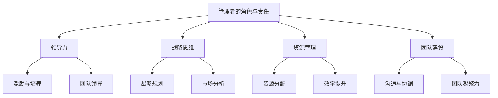

                 

# 管理者的职业规划：设计个人领导力发展路径

## 关键词

- 管理者职业规划
- 个人领导力
- 发展路径
- 自我认知
- 领导力提升
- 职业发展

## 摘要

本文旨在探讨管理者的职业规划，特别是如何设计个人领导力发展路径。文章分为三个主要部分：职业规划的基础、领导力的提升、以及职业规划与领导力提升的综合运用。通过对管理者的角色与责任、自我认知与目标设定、职业发展路径规划等内容的深入分析，本文为管理者提供了全面的职业规划策略。同时，通过领导力基础、团队管理与领导力、领导力的拓展等方面的探讨，帮助管理者提升个人领导力，实现职业生涯的持续成长。

## 目录大纲

### 第一部分：职业规划的基础

#### 第1章：管理者的角色与责任

- **1.1** 问题背景
- **1.2** 问题描述
- **1.3** 问题解决
- **1.4** 边界与外延
- **1.5** 概念结构与核心要素组成

#### 第2章：自我认知与目标设定

- **2.1** 自我认知的重要性
- **2.2** 自我评估的方法
- **2.3** 目标设定的原则
- **2.4** 设定可量化的目标
- **2.5** 如何制定个人成长计划

#### 第3章：职业发展路径规划

- **3.1** 职业发展的阶段
- **3.2** 职业转换策略
- **3.3** 职业规划与组织发展
- **3.4** 如何应对职业瓶颈
- **3.5** 职业发展中的挑战与机遇

### 第二部分：领导力的提升

#### 第4章：领导力基础

- **4.1** 领导力的重要性
- **4.2** 领导力的核心要素
- **4.3** 领导风格与团队效能
- **4.4** 如何构建有效的领导力模型
- **4.5** 领导力与个人成长的关系

#### 第5章：团队管理与领导力

- **5.1** 团队管理的基础
- **5.2** 团队建设策略
- **5.3** 领导者在团队冲突中的角色
- **5.4** 如何提高团队执行力
- **5.5** 团队领导力发展计划

#### 第6章：领导力的拓展

- **6.1** 领导力与组织文化
- **6.2** 创新领导力
- **6.3** 领导力的国际视野
- **6.4** 领导力与个人影响力
- **6.5** 持续提升领导力

#### 第7章：领导力发展实战

- **7.1** 领导力发展的案例研究
- **7.2** 实际案例分析与领导力应用
- **7.3** 如何制定个人领导力发展路径
- **7.4** 领导力发展中的问题与对策
- **7.5** 领导力发展的最佳实践

### 第三部分：职业规划与领导力提升的综合运用

#### 第8章：综合运用

- **8.1** 职业规划与领导力的结合
- **8.2** 如何制定个人领导力发展路径
- **8.3** 跨部门合作与领导力
- **8.4** 领导力在职业生涯中的影响
- **8.5** 领导力发展的长期规划

#### 第9章：职业规划与领导力提升的最佳实践

- **9.1** 成功案例分享
- **9.2** 领导力发展的关键要素
- **9.3** 职业规划与领导力提升的误区
- **9.4** 领导力发展的持续动力
- **9.5** 领导力发展的未来趋势

#### 第10章：小结与展望

- **10.1** 小结与回顾
- **10.2** 领导力与职业发展的关系
- **10.3** 如何持续提升个人领导力
- **10.4** 展望未来：领导力的新趋势
- **10.5** 附录：相关资源与推荐阅读

## 第一部分：职业规划的基础

### 第1章：管理者的角色与责任

#### 1.1 问题背景

在当今快速变化的商业环境中，管理者面临着前所未有的挑战和机遇。随着组织结构的复杂性和不确定性的增加，管理者不仅要掌握传统的管理技能，还需要具备出色的领导力和战略眼光。然而，许多管理者在职业发展的过程中往往遇到瓶颈，无法实现预期的职业目标。因此，了解管理者的角色与责任，设计有效的职业规划，成为提升个人职业成就的关键。

#### 1.2 问题描述

管理者的角色与责任涉及多个方面，包括领导团队、制定战略、管理资源和确保组织目标的实现。具体而言，问题描述可以归纳为以下几点：

- **领导团队**：管理者需要具备激励和培养团队成员的能力，确保团队在高效率下工作。
- **制定战略**：管理者需要制定明确的战略规划，以指导组织的长期发展。
- **管理资源**：管理者需要合理分配和利用组织的资源，确保资源的最大化效益。
- **实现目标**：管理者需要确保组织目标得到有效实现，并为组织创造价值。

#### 1.3 问题解决

为了解决上述问题，管理者需要采取一系列策略和行动：

- **提升领导力**：管理者应通过不断学习和实践，提升个人领导力，成为团队和组织的榜样。
- **强化战略思维**：管理者应培养战略眼光，制定清晰的战略规划，以应对市场变化。
- **优化资源管理**：管理者应提高资源利用效率，通过精细化管理，实现资源的最大化效益。
- **关注团队建设**：管理者应关注团队建设，通过有效的沟通和激励，提高团队的凝聚力和执行力。

#### 1.4 边界与外延

在讨论管理者的角色与责任时，需要明确边界与外延，以确保讨论的准确性和全面性。具体而言，边界包括：

- **管理职责**：管理者的核心职责包括领导团队、制定战略、管理资源和确保目标实现。
- **组织范围**：管理者在履行职责时，需关注组织的整体利益，确保个人行为与组织目标一致。

外延方面，管理者需要关注以下几点：

- **跨部门协作**：管理者需要与其他部门协作，确保组织内部的协调与沟通。
- **外部环境**：管理者需关注外部环境的变化，及时调整战略和决策，以适应市场变化。

#### 1.5 概念结构与核心要素组成

管理者的角色与责任可以看作是一个概念结构，其核心要素包括领导力、战略思维、资源管理和团队建设。以下是一个简化的概念结构图：

### 第2章：自我认知与目标设定

#### 2.1 自我认知的重要性

自我认知是管理者职业规划的重要基础。通过自我认知，管理者可以明确自己的价值观、优势和不足，从而更好地规划职业发展路径。自我认知的重要性体现在以下几个方面：

- **明确职业目标**：自我认知有助于管理者确定职业方向，制定明确的职业目标。
- **发挥优势**：了解自己的优势，有助于管理者在职业生涯中发挥最大潜力。
- **改进不足**：通过自我认知，管理者可以认识到自己的不足，并有针对性地进行改进。

#### 2.2 自我评估的方法

自我评估是自我认知的重要环节。以下是一些常用的自我评估方法：

- **SWOT分析**：SWOT分析是一种常用的自我评估方法，通过对自身的优势（Strengths）、劣势（Weaknesses）、机会（Opportunities）和威胁（Threats）进行综合分析，帮助管理者了解自己的现状。
- **360度反馈**：360度反馈是一种通过收集来自同事、下属和上级的反馈，全面了解自己的方法。这种方法有助于管理者从多个角度认识自己。
- **能力测试**：通过参加各种能力测试，如性格测试、职业能力测试等，管理者可以更深入地了解自己的优势和不足。

#### 2.3 目标设定的原则

目标设定是职业规划的关键步骤。以下是一些目标设定的原则：

- **SMART原则**：SMART原则是一种常用的目标设定方法，即目标应具备具体（Specific）、可衡量（Measurable）、可实现（Achievable）、相关（Relevant）和有时限（Time-bound）。
- **长期与短期目标**：目标应分为长期目标和短期目标，以确保职业发展的连贯性和可持续性。
- **灵活调整**：目标设定应具有灵活性，以便在面临不确定因素时进行调整。

#### 2.4 设定可量化的目标

设定可量化的目标是目标设定的核心。以下是一些设定可量化目标的建议：

- **具体指标**：目标应包含具体指标，如完成的项目数量、提升的绩效指标等。
- **数据支持**：目标设定应基于现有数据和实际情况，以确保目标的可实现性。
- **跟踪与评估**：设定可量化的目标后，管理者应定期跟踪和评估目标的完成情况，以便及时调整和改进。

#### 2.5 如何制定个人成长计划

制定个人成长计划是实现目标的重要手段。以下是一些制定个人成长计划的建议：

- **明确目标**：首先明确个人成长目标，确保计划与目标一致。
- **分解任务**：将个人成长目标分解为具体的任务和行动计划，确保目标的可执行性。
- **时间规划**：为每个任务和行动计划设定时间规划，确保计划的有序进行。
- **资源准备**：为个人成长计划准备所需的资源，如学习资料、培训机会等。
- **持续跟踪**：定期跟踪个人成长计划的执行情况，及时调整和改进。

### 第3章：职业发展路径规划

#### 3.1 职业发展的阶段

职业发展路径规划是一个长期的过程，通常可以分为以下阶段：

- **初始阶段**：在这个阶段，管理者需要明确自己的职业方向，积累相关经验和技能。
- **发展阶段**：在这个阶段，管理者需要不断提升自己的能力，通过项目机会和挑战，积累管理经验和领导能力。
- **成熟阶段**：在这个阶段，管理者需要巩固自己的地位，提升团队和组织的绩效。
- **巅峰阶段**：在这个阶段，管理者需要发挥自己的影响力，为组织创造更大的价值。

#### 3.2 职业转换策略

在职业生涯中，管理者可能会面临职业转换的需求。以下是一些职业转换策略：

- **内部转换**：通过内部调岗或晋升，实现职业转换。这种方式有利于管理者保持职业稳定性和连续性。
- **外部转换**：通过离职或跳槽，实现职业转换。这种方式有助于管理者拓展视野和经验。
- **跨行业转换**：通过跨行业转换，实现职业突破。这种方式需要管理者具备较强的适应能力和学习能力。

#### 3.3 职业规划与组织发展

职业规划与组织发展密切相关。以下是一些职业规划与组织发展的关系：

- **组织目标**：职业规划应与组织目标一致，确保个人目标和组织目标的协同发展。
- **资源支持**：组织应为管理者提供必要的资源支持，如培训、晋升机会等，以促进个人成长。
- **人才培养**：组织应重视人才培养，为管理者提供成长和发展的空间，激发其潜力。

#### 3.4 如何应对职业瓶颈

在职业生涯中，管理者可能会遇到职业瓶颈。以下是一些应对职业瓶颈的策略：

- **反思与调整**：反思自己的职业规划，找出瓶颈的原因，并制定相应的调整计划。
- **学习与提升**：通过学习和提升自己的能力和技能，突破职业瓶颈。
- **寻求外部支持**：寻求外部导师或顾问的帮助，获取新的观点和建议。
- **拓展人际关系**：通过拓展人际关系，获取更多的职业机会和信息。

#### 3.5 职业发展中的挑战与机遇

职业发展过程中，管理者将面临诸多挑战和机遇。以下是一些常见的挑战和机遇：

- **挑战**：市场竞争、技能更新、职业瓶颈等。
- **机遇**：职业转换、晋升机会、新兴行业等。

管理者应积极应对挑战，抓住机遇，实现职业成长。

## 第二部分：领导力的提升

### 第4章：领导力基础

#### 4.1 领导力的重要性

领导力是管理者不可或缺的素质，对于组织的发展至关重要。以下从几个方面阐述领导力的重要性：

- **推动组织发展**：领导力能够激发团队成员的潜能，推动组织实现发展目标。
- **构建团队凝聚力**：领导力能够凝聚团队，形成共同的价值观和目标，提高团队的执行力。
- **塑造组织文化**：领导力能够塑造组织的文化，营造积极向上的工作氛围。
- **提升个人影响力**：领导力能够提升管理者的个人影响力，增强在组织中的地位和认可度。

#### 4.2 领导力的核心要素

领导力并非单一的素质，而是一个多维度的概念。以下是一些领导力的核心要素：

- **沟通能力**：良好的沟通能力是领导力的基础，有助于管理者与团队成员建立有效的沟通和信任。
- **决策能力**：决策能力是领导力的关键，管理者需要具备快速做出正确决策的能力。
- **激励能力**：激励能力是领导力的重要组成部分，管理者需要能够激发团队成员的积极性和创造力。
- **战略思维**：战略思维是领导力的核心，管理者需要具备长远的眼光和战略规划能力。

#### 4.3 领导风格与团队效能

领导风格对团队效能具有重要影响。以下是一些常见的领导风格及其对团队效能的影响：

- **权威型领导**：权威型领导通过明确的指令和严格的控制来管理团队，适用于紧急情况和需要高度统一行动的情境，但可能导致团队缺乏自主性和创造力。
- **民主型领导**：民主型领导鼓励团队成员参与决策，提高团队的凝聚力和创造力，但可能耗费较多时间，且在紧急情况下效率较低。
- **参与型领导**：参与型领导注重团队成员的参与和合作，提高团队的凝聚力和积极性，但需要管理者具备较强的协调和沟通能力。
- **变革型领导**：变革型领导通过激励和引导团队成员实现变革和创新，推动组织发展，但需要管理者具备较强的愿景和影响力。

#### 4.4 如何构建有效的领导力模型

构建有效的领导力模型是提升管理者领导力的关键。以下是一些建议：

- **明确领导目标**：管理者需要明确自己的领导目标，确保领导行为与目标一致。
- **培养核心能力**：管理者需要培养沟通能力、决策能力、激励能力和战略思维等核心能力。
- **实践与反思**：管理者需要通过实践和反思，不断完善自己的领导力模型。
- **学习与借鉴**：管理者可以学习其他成功管理者的领导经验，借鉴其领导方法。

#### 4.5 领导力与个人成长的关系

领导力与个人成长密切相关。以下从几个方面阐述领导力与个人成长的关系：

- **领导力促进个人成长**：领导力能够激发个人的潜能，推动个人成长。
- **个人成长推动领导力**：个人成长有助于管理者提升领导力，实现更高的职业目标。
- **共同成长**：领导力和个人成长相辅相成，管理者通过领导力推动组织发展，同时实现个人成长。

### 第5章：团队管理与领导力

#### 5.1 团队管理的基础

团队管理是管理者的重要职责，以下从几个方面阐述团队管理的基础：

- **团队定义**：团队是由两个或两个以上个体组成的，为实现共同目标而协同工作的组织。
- **团队特征**：团队具有共同的目标、明确的职责、有效的沟通、协作和互相支持。
- **团队管理目标**：团队管理的目标是提高团队的效能，实现团队目标的实现。

#### 5.2 团队建设策略

团队建设是团队管理的重要环节，以下是一些建议：

- **建立共同目标**：团队建设首先需要明确共同的目标，确保团队成员的方向一致。
- **培养团队凝聚力**：通过团队活动、奖励机制等手段，培养团队凝聚力，提高团队成员的归属感和责任感。
- **建立有效的沟通机制**：建立有效的沟通机制，确保团队成员之间能够畅通交流，减少误解和冲突。
- **激发团队成员潜力**：通过培训、激励等手段，激发团队成员的潜力，提高团队的执行力。

#### 5.3 领导者在团队冲突中的角色

团队冲突在所难免，领导者需要在其中发挥关键作用。以下从几个方面阐述领导者在团队冲突中的角色：

- **调解者**：领导者需要充当调解者的角色，帮助解决团队成员之间的冲突。
- **倾听者**：领导者需要倾听团队成员的意见和诉求，理解其立场和情感。
- **协调者**：领导者需要协调团队成员的利益和目标，寻求共赢的解决方案。
- **激励者**：领导者需要激励团队成员，鼓励其积极参与团队建设，化解冲突。

#### 5.4 如何提高团队执行力

提高团队执行力是团队管理的核心任务，以下是一些建议：

- **明确目标和责任**：确保团队成员明确自己的目标和责任，避免目标模糊和责任不清。
- **制定详细的行动计划**：制定详细的行动计划，明确任务分配、时间节点和评估标准。
- **提供必要的资源和支持**：为团队成员提供必要的资源和支持，确保其能够高效完成任务。
- **建立监督和反馈机制**：建立监督和反馈机制，及时发现和解决问题，确保团队执行力的持续提升。

#### 5.5 团队领导力发展计划

为了提升团队领导力，管理者可以制定团队领导力发展计划。以下是一些建议：

- **培训和发展**：为团队成员提供培训和发展机会，提高其领导能力和管理素质。
- **团队建设活动**：定期组织团队建设活动，增强团队成员之间的信任和合作。
- **角色扮演和模拟**：通过角色扮演和模拟，让团队成员体验不同的领导情境，提高其领导力和应变能力。
- **反馈和评估**：定期对团队成员进行反馈和评估，了解其领导力发展情况，提供有针对性的指导和建议。

### 第6章：领导力的拓展

#### 6.1 领导力与组织文化

领导力与组织文化密切相关，以下从几个方面阐述领导力与组织文化的关系：

- **塑造组织文化**：领导者通过自己的行为和决策，塑造组织的文化。
- **传承组织文化**：领导者需要传承和弘扬组织文化，确保其在组织内部得到传承和延续。
- **调整组织文化**：在组织发展过程中，领导者需要根据实际情况调整组织文化，以适应新的环境和挑战。

#### 6.2 创新领导力

创新领导力是领导者的重要素质，以下从几个方面阐述创新领导力：

- **鼓励创新**：领导者需要鼓励团队成员创新，提供创新环境和资源支持。
- **创新思维**：领导者需要具备创新思维，能够提出新的想法和解决方案。
- **创新实践**：领导者需要将创新思维转化为实际行动，推动组织实现创新目标。

#### 6.3 领导力的国际视野

在全球化背景下，领导力的国际视野至关重要。以下从几个方面阐述领导力的国际视野：

- **跨文化管理**：领导者需要具备跨文化管理能力，理解和尊重不同文化的差异。
- **国际交流与合作**：领导者需要积极参与国际交流与合作，拓展视野和经验。
- **全球化思维**：领导者需要具备全球化思维，能够从全球视野审视问题和制定决策。

#### 6.4 领导力与个人影响力

领导力与个人影响力密切相关，以下从几个方面阐述领导力与个人影响力：

- **树立个人品牌**：领导者需要通过自己的行为和成就，树立个人品牌。
- **传递正能量**：领导者需要传递正能量，激发团队成员的积极性和创造力。
- **建立信任关系**：领导者需要建立信任关系，赢得团队成员的信任和支持。

#### 6.5 持续提升领导力

持续提升领导力是领导者的重要任务，以下是一些建议：

- **学习与反思**：领导者需要不断学习和反思，提升自己的领导能力和管理素质。
- **实践与经验**：领导者需要通过实践和经验，不断积累和提升领导力。
- **寻求反馈**：领导者需要主动寻求反馈，了解自己的优势和不足，有针对性地进行改进。
- **参与培训**：领导者可以参加各种培训和研讨会，学习其他成功管理者的经验和技巧。

### 第7章：领导力发展实战

#### 7.1 领导力发展的案例研究

通过领导力发展的案例研究，可以深入了解领导力在实践中的应用和效果。以下是一些建议：

- **案例选择**：选择具有代表性的案例，如成功或失败的领导力案例。
- **案例分析**：对案例进行深入分析，探讨其中的关键因素和成功或失败的原因。
- **案例应用**：将案例应用到实际工作中，借鉴其中的经验和教训，提升自己的领导力。

#### 7.2 实际案例分析与领导力应用

在实际工作中，领导者需要将领导力应用于具体情境，以下是一些建议：

- **情境识别**：识别当前的工作情境，了解其中的问题和挑战。
- **领导力应用**：根据情境需求，选择合适的领导力方法和策略，如激励、沟通、决策等。
- **反馈与调整**：在实际应用过程中，及时收集反馈，了解效果，并根据需要进行调整和改进。

#### 7.3 如何制定个人领导力发展路径

制定个人领导力发展路径是实现领导力持续提升的关键。以下是一些建议：

- **明确目标**：首先明确个人领导力发展的目标，确保路径与目标一致。
- **评估现状**：评估自己的领导力现状，了解自己的优势和不足。
- **制定计划**：根据评估结果，制定具体的领导力发展计划，包括学习、实践、反思等环节。
- **持续行动**：将计划付诸行动，持续提升自己的领导力。

#### 7.4 领导力发展中的问题与对策

在领导力发展过程中，管理者可能会遇到各种问题。以下是一些常见问题及其对策：

- **问题一：缺乏实践经验**  
对策：通过参与实际项目和管理实践，积累经验和技能。
- **问题二：缺乏有效的沟通能力**  
对策：参加沟通技巧培训，学习并实践有效的沟通方法。
- **问题三：缺乏决策能力**  
对策：通过学习和实践，提高自己的决策能力，培养快速做出正确决策的能力。
- **问题四：缺乏战略思维**  
对策：学习战略管理知识，培养战略思维，提高长远规划能力。

#### 7.5 领导力发展的最佳实践

以下是一些领导力发展的最佳实践：

- **持续学习**：领导者需要不断学习新知识、新技能，跟上时代发展的步伐。
- **实践与反思**：将所学知识和技能应用于实际工作，通过反思和总结，不断提升自己的领导力。
- **建立人际网络**：建立广泛的人际网络，学习其他成功管理者的经验和教训。
- **培养团队**：注重团队建设，培养团队成员的领导力，实现团队整体提升。

### 第三部分：职业规划与领导力提升的综合运用

#### 第8章：综合运用

#### 8.1 职业规划与领导力的结合

职业规划与领导力提升相辅相成，以下是如何将两者结合的建议：

- **明确职业目标**：在制定职业规划时，明确个人领导力发展的目标，确保领导力提升与职业目标一致。
- **制定行动计划**：根据职业目标和领导力发展需求，制定具体的行动计划，确保两者的有效结合。
- **持续学习与反思**：将学习与反思贯穿于职业规划和领导力提升的全过程，不断提升自己的能力和素质。

#### 8.2 如何制定个人领导力发展路径

制定个人领导力发展路径是实现领导力持续提升的关键。以下是一些建议：

- **明确发展目标**：首先明确个人领导力发展的目标，确保路径与目标一致。
- **评估现状**：评估自己的领导力现状，了解自己的优势和不足。
- **制定发展计划**：根据评估结果，制定具体的领导力发展计划，包括学习、实践、反思等环节。
- **持续行动**：将计划付诸行动，持续提升自己的领导力。

#### 8.3 跨部门合作与领导力

跨部门合作是现代企业中常见的现象，领导者需要具备跨部门合作的能力，以下是一些建议：

- **建立信任**：通过有效的沟通和协作，建立跨部门之间的信任。
- **明确目标**：确保跨部门合作的每个成员都明确自己的目标，实现协同发展。
- **共享资源**：合理分配和共享资源，提高跨部门合作的效率。
- **激励与奖励**：对跨部门合作中的优秀成员给予激励和奖励，激发其积极性和创造力。

#### 8.4 领导力在职业生涯中的影响

领导力对职业生涯具有重要影响，以下从几个方面阐述：

- **职业晋升**：具备领导力的管理者更容易获得晋升机会，实现职业发展。
- **团队影响力**：领导力能够提升管理者的团队影响力，使其在组织中发挥更大的作用。
- **个人品牌**：领导力能够树立管理者的个人品牌，提高其在行业内的知名度。
- **职业稳定性**：具备领导力的管理者在职场中更具竞争力，有助于提升职业稳定性。

#### 8.5 领导力发展的长期规划

领导力发展需要长期规划，以下是一些建议：

- **设定长期目标**：在制定职业规划时，设定长期领导力发展的目标，确保路径的连贯性和可持续性。
- **持续学习与提升**：通过参加培训、阅读书籍、参加研讨会等方式，不断提升自己的领导力。
- **反思与调整**：定期反思领导力发展情况，根据实际情况进行调整和优化。
- **传承与创新**：在领导力发展过程中，注重传承和创新，为组织培养新一代领导者。

### 第9章：职业规划与领导力提升的最佳实践

#### 9.1 成功案例分享

通过成功案例的分享，可以深入了解职业规划和领导力提升的有效方法。以下是一些建议：

- **案例选择**：选择具有代表性的成功案例，如领导者在职业规划和领导力提升方面的成功实践。
- **案例分析**：对案例进行深入分析，探讨其中的关键因素和成功原因。
- **经验分享**：邀请成功领导者分享他们的经验和心得，为其他管理者提供借鉴。

#### 9.2 领导力发展的关键要素

领导力发展是一个复杂的过程，以下是一些关键要素：

- **自我认知**：明确自己的优势和不足，有针对性地提升自己的领导力。
- **学习与反思**：不断学习新知识、新技能，通过反思和总结，不断提升自己的领导力。
- **实践与经验**：将所学知识和技能应用于实际工作，通过实践积累经验和技能。
- **团队建设**：注重团队建设，培养团队成员的领导力，实现团队整体提升。

#### 9.3 职业规划与领导力提升的误区

在职业规划和领导力提升过程中，管理者容易陷入一些误区。以下是一些常见误区及对策：

- **误区一：急于求成**  
对策：制定合理的规划，持续学习和提升，避免急于求成。
- **误区二：忽视自我认知**  
对策：重视自我认知，明确自己的优势和不足，有针对性地提升自己的领导力。
- **误区三：过度依赖培训**  
对策：将培训与实践相结合，注重实际工作中的经验和技能积累。
- **误区四：忽视团队建设**  
对策：注重团队建设，培养团队成员的领导力，实现团队整体提升。

#### 9.4 领导力发展的持续动力

领导力发展需要持续的动力，以下是一些建议：

- **自我激励**：通过设定目标和奖励机制，激发自我激励的动力。
- **团队支持**：建立团队支持系统，鼓励团队成员相互学习和成长。
- **外部激励**：通过组织激励和认可，激发领导者的持续动力。
- **不断学习**：保持学习的热情，不断学习新知识、新技能，保持领先优势。

#### 9.5 领导力发展的未来趋势

随着社会和科技的发展，领导力发展也面临着新的趋势。以下是一些未来趋势：

- **数字化领导力**：随着数字化技术的普及，领导者需要具备数字化领导力，引导团队适应数字化时代。
- **创新领导力**：创新是企业发展的重要驱动力，领导者需要具备创新领导力，推动组织实现创新发展。
- **全球领导力**：全球化背景下，领导者需要具备全球领导力，理解和尊重不同文化的差异，推动跨国合作。
- **可持续领导力**：可持续发展成为全球关注的重要议题，领导者需要具备可持续领导力，推动组织实现可持续发展。

### 第10章：小结与展望

#### 10.1 小结与回顾

通过对管理者职业规划、领导力提升以及两者综合运用的深入探讨，本文总结了以下几点：

- **职业规划的重要性**：明确的职业规划有助于管理者实现职业目标，提升职业成就。
- **领导力提升的关键**：领导力是管理者不可或缺的素质，提升领导力有助于实现职业发展。
- **综合运用的效果**：将职业规划和领导力提升相结合，可以实现更好的职业发展效果。

#### 10.2 领导力与职业发展的关系

领导力与职业发展密切相关，具备出色领导力的管理者更容易实现职业发展。以下从几个方面阐述领导力与职业发展的关系：

- **领导力促进职业发展**：领导力能够提升管理者的个人魅力和影响力，使其在职场中更具竞争力。
- **职业发展推动领导力**：职业发展过程中，管理者通过实践和挑战，不断提升自己的领导力。
- **共同发展**：领导力和职业发展相辅相成，管理者通过提升领导力，实现职业发展，同时为组织创造价值。

#### 10.3 如何持续提升个人领导力

持续提升个人领导力是实现职业发展的重要途径，以下是一些建议：

- **自我认知**：明确自己的优势和不足，有针对性地提升自己的领导力。
- **学习与反思**：不断学习新知识、新技能，通过反思和总结，不断提升自己的领导力。
- **实践与经验**：将所学知识和技能应用于实际工作，通过实践积累经验和技能。
- **团队建设**：注重团队建设，培养团队成员的领导力，实现团队整体提升。

#### 10.4 展望未来：领导力的新趋势

随着社会和科技的发展，领导力也在不断演变。以下是一些领导力的新趋势：

- **数字化领导力**：随着数字化技术的普及，领导者需要具备数字化领导力，引导团队适应数字化时代。
- **创新领导力**：创新是企业发展的重要驱动力，领导者需要具备创新领导力，推动组织实现创新发展。
- **全球领导力**：全球化背景下，领导者需要具备全球领导力，理解和尊重不同文化的差异，推动跨国合作。
- **可持续领导力**：可持续发展成为全球关注的重要议题，领导者需要具备可持续领导力，推动组织实现可持续发展。

#### 10.5 附录：相关资源与推荐阅读

为了帮助读者进一步了解领导力和职业规划的相关知识，本文提供了以下相关资源与推荐阅读：

- **相关书籍**：《领导力》、《影响力》、《职业规划与个人发展》等。
- **在线课程**：哈佛大学公开课《领导力与个人成长》、Coursera上的《管理者的技能与实践》等。
- **专业网站**：LinkedIn、《哈佛商业评论》、《成功杂志》等。

## 总结

本文从管理者的角色与责任、自我认知与目标设定、职业发展路径规划、领导力的基础、团队管理与领导力、领导力的拓展等多个方面，深入探讨了管理者的职业规划和领导力发展。通过本文的探讨，读者可以了解到职业规划与领导力提升的重要性和方法，为自身职业发展提供有益的指导。

### 第11章：展望领导力的未来

#### 11.1 本书内容总结

本文从管理者的角色与责任、自我认知与目标设定、职业发展路径规划、领导力的基础、团队管理与领导力、领导力的拓展、职业规划与领导力提升的综合运用等多个方面，系统地探讨了管理者的职业规划和领导力发展。通过深入分析，本文为管理者提供了全面的职业规划策略和领导力提升方法，帮助其在职业生涯中实现持续成长。

#### 11.2 对读者的期望

本文旨在为读者提供有价值的见解和实用的策略，帮助其在职业规划和领导力提升方面取得突破。希望读者能够将本文的内容应用到实际工作中，不断反思和调整，以实现个人职业目标。

#### 11.3 领导力发展的关键要点

本文强调了领导力发展的重要性，以下是一些关键要点：

- **明确目标**：设定清晰的职业目标和领导力发展目标，确保路径与目标一致。
- **持续学习**：不断学习新知识、新技能，提升自己的综合素质。
- **实践与反思**：将所学知识和技能应用于实际工作，通过反思和总结，不断提升自己的领导力。
- **团队建设**：注重团队建设，培养团队成员的领导力，实现团队整体提升。

#### 11.4 展望领导力的未来

随着社会和科技的快速发展，领导力也在不断演变。未来领导力的发展趋势包括：

- **数字化领导力**：领导者需要具备数字化领导力，引导团队适应数字化时代。
- **创新领导力**：领导者需要具备创新领导力，推动组织实现创新发展。
- **全球领导力**：领导者需要具备全球领导力，理解和尊重不同文化的差异，推动跨国合作。
- **可持续领导力**：领导者需要具备可持续领导力，推动组织实现可持续发展。

#### 11.5 领导力发展的未来趋势

未来，领导力发展将面临新的挑战和机遇。以下是一些可能的发展趋势：

- **领导力多样性**：领导力多样性将成为未来组织成功的关键因素，领导者需要具备包容性和多样性思维。
- **人工智能与领导力**：人工智能将成为领导者的重要工具，领导者需要学会与人工智能合作，提高决策效率。
- **领导力社会化**：领导力将更加社会化，领导者需要具备社交媒体运营能力，提升个人品牌影响力。
- **领导力全球化**：领导力将更加全球化，领导者需要具备跨文化沟通和协调能力，推动全球业务发展。

作者：AI天才研究院/AI Genius Institute & 禅与计算机程序设计艺术 /Zen And The Art of Computer Programming

## 附录

### 相关资源与推荐阅读

为了帮助读者进一步了解领导力和职业规划的相关知识，本文提供以下相关资源和推荐阅读：

#### 书籍推荐

1. 《领导力：五项修炼》作者：约翰·马奇（John P. Kotter）
2. 《影响力：说服与说服的艺术》作者：罗伯特·西奥迪尼（Robert B. Cialdini）
3. 《职业规划与个人发展》作者：大卫·J·班杜拉（David J. Boud）
4. 《领导者的语言》作者：吉姆·科比（Jim Kouzes）和巴里·波斯纳（Barry Posner）

#### 在线课程

1. 哈佛大学公开课《领导力与个人成长》
2. Coursera上的《管理者的技能与实践》
3. edX上的《领导力：战略思考与决策》

#### 专业网站

1. LinkedIn
2. 《哈佛商业评论》
3. 《成功杂志》

### 注意事项

1. **持续学习**：领导力和职业规划是一个持续的过程，需要不断学习和实践。
2. **自我认知**：了解自己的优势和不足，有针对性地提升领导力。
3. **团队建设**：注重团队建设，培养团队成员的领导力，实现团队整体提升。
4. **灵活应对**：在面对不确定性和挑战时，保持灵活应对的能力。

### 拓展阅读

1. 《领导力的本质》作者：詹姆斯·库泽斯（James M. Kouzes）和巴里·波斯纳（Barry Posner）
2. 《职业规划与职业生涯管理》作者：斯蒂芬·罗宾斯（Stephen P. Robbins）
3. 《创新者的窘境》作者：克莱顿·克里斯滕森（Clayton M. Christensen）

通过以上资源和推荐，读者可以进一步深入了解领导力和职业规划的相关知识，为自己的职业生涯和领导力发展提供有益的指导。作者：AI天才研究院/AI Genius Institute & 禅与计算机程序设计艺术 /Zen And The Art of Computer Programming

