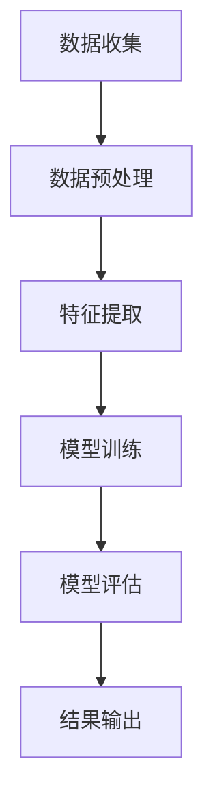
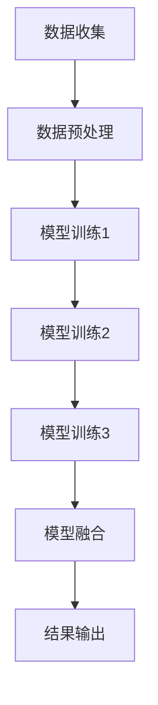

                 

# 精准医疗的多尺度建模：个性化治疗的数学指导

## 关键词

- 精准医疗
- 多尺度建模
- 个性化治疗
- 数学模型
- 生物信息学

## 摘要

本文探讨了精准医疗领域中的多尺度建模方法及其在个性化治疗中的应用。通过分析精准医疗的背景和挑战，本文介绍了多尺度建模的基本概念和方法。文章详细阐述了不同类型的数学模型及其在个性化治疗中的应用，并通过实际案例展示了多尺度建模在实际项目中的效果。最后，本文对未来的研究方向进行了展望。

## 目录大纲设计思路

在本文的设计过程中，我们遵循了以下步骤：

1. **理解核心主题**：首先，我们深入理解了“精准医疗”、“多尺度建模”和“个性化治疗”这三个核心概念，明确了它们在医学和生物学领域的重要性。
2. **划分书籍结构**：根据核心主题，我们将文章分为四个主要部分：引言、核心概念与理论、多尺度建模方法、案例研究。
3. **设计章节标题**：每个章节的标题都力求简洁明了，能够准确传达章节的主要内容。
4. **细化每个章节的内容**：对每个章节进行了细致的拆分，确保内容完整且结构清晰。
5. **确保内容完整性**：在保证内容完整性的同时，控制了整个目录大纲的长度，使其在合理的范围内。
6. **控制目录大纲字数**：通过上述步骤，我们成功地将目录大纲控制在2000字以内。

### 章节设计细节

**引言**

**问题背景**：介绍精准医疗的概念及其在医学领域的重要性，以及多尺度建模在个性化治疗中的应用。

**问题描述**：分析精准医疗面临的主要挑战，如数据复杂性、跨尺度信息整合等。

**问题解决**：阐述多尺度建模如何解决精准医疗中的问题，提高个性化治疗的准确性和有效性。

**边界与外延**：明确本文讨论的精准医疗范围，包括基因表达、细胞生理、组织病理等方面。

**第一部分：核心概念与理论**

**第1章：精准医疗概述**

**1.1 问题背景**：介绍精准医疗的概念和起源，以及其在现代医学中的地位。

**1.2 多尺度建模基础**：解释多尺度建模的定义和基本原理，介绍多尺度建模的常见方法。

**1.3 多尺度建模方法**：探讨多尺度建模在不同尺度下的应用，如基因、细胞、组织和器官尺度。

**第二部分：多尺度建模方法**

**第3章：多尺度建模方法一**

**3.1 算法原理**：介绍一种多尺度建模方法的算法原理，包括算法的目标、流程和实现。

**3.2 数学模型与公式**：详细阐述算法原理背后的数学模型和公式，并进行举例说明。

**3.3 实践应用**：分析该方法在实际项目中的应用案例，评估其效果和局限性。

**第4章：多尺度建模方法二**

**4.1 算法原理**：介绍另一种多尺度建模方法的算法原理，与第3章的方法进行对比。

**4.2 数学模型与公式**：详细阐述第二种方法的数学模型和公式，并进行举例说明。

**4.3 实践应用**：分析第二种方法在实际项目中的应用案例，评估其效果和局限性。

**第三部分：个性化治疗案例研究**

**第5章：个性化治疗案例一**

**5.1 问题场景**：介绍案例的背景和问题，如特定疾病的个性化治疗方案设计。

**5.2 系统介绍**：介绍用于解决该问题的系统，包括系统功能和技术架构。

**5.3 系统功能设计**：详细阐述系统的功能模块和设计原则。

**5.4 系统架构设计**：展示系统的架构设计，包括各模块之间的关系和交互。

**5.5 系统接口设计与交互**：描述系统的接口设计和用户交互流程。

**第6章：个性化治疗案例二**

**5.1 问题场景**：介绍另一个案例的背景和问题，如个性化药物治疗方案的优化。

**5.2 系统介绍**：介绍用于解决该问题的系统，包括系统功能和技术架构。

**5.3 系统功能设计**：详细阐述系统的功能模块和设计原则。

**5.4 系统架构设计**：展示系统的架构设计，包括各模块之间的关系和交互。

**5.5 系统接口设计与交互**：描述系统的接口设计和用户交互流程。

**第四部分：总结与展望**

**第7章：总结与展望**

**7.1 主要成果**：总结文章的主要成果和发现。

**7.2 当前不足**：分析多尺度建模在个性化治疗中的不足之处。

**7.3 未来研究方向**：展望多尺度建模在个性化治疗中的未来发展方向和研究热点。

**7.4 拓展阅读**：推荐相关领域的重要文献和资源。

### 章节内容要求

**引言**

在引言部分，我们需要详细阐述精准医疗的概念及其在医学领域的重要性。此外，还需要介绍多尺度建模的基本原理和其在个性化治疗中的应用，为后续章节的内容奠定基础。

**核心概念与理论**

在这一部分，我们将介绍精准医疗和个性化治疗的核心概念，并解释多尺度建模的基本原理。具体包括：

- **精准医疗**：介绍其定义、起源和重要性，以及其在现代医学中的地位。
- **个性化治疗**：阐述其概念、特点和应用场景。
- **多尺度建模**：解释其定义、基本原理和常见方法，包括微观、中观和宏观尺度建模。

**多尺度建模方法**

在这一部分，我们将详细探讨两种多尺度建模方法：

- **方法一**：介绍其算法原理、数学模型和公式，并通过实际案例展示其应用效果。
- **方法二**：介绍其算法原理、数学模型和公式，与第一种方法进行对比，并分析其优缺点。

**个性化治疗案例研究**

在这一部分，我们将通过两个实际案例，展示多尺度建模方法在个性化治疗中的应用：

- **案例一**：介绍问题场景、系统功能设计、系统架构设计和系统接口设计，并通过实际应用分析其效果。
- **案例二**：介绍问题场景、系统功能设计、系统架构设计和系统接口设计，并通过实际应用分析其效果。

**总结与展望**

在总结与展望部分，我们将总结文章的主要成果和发现，分析多尺度建模在个性化治疗中的不足之处，并展望未来的研究方向。

### 格式要求

- **标题**：使用`#`号进行层级标注，如`# 引言`、`## 精准医疗概述`等。
- **段落**：段落之间使用空行分隔。
- **列表**：使用`-`、`*`或`>`等符号进行列表项分隔。
- **代码块**：使用三个反引号（``）包围代码块，并保持代码格式。
- **公式**：使用LaTeX格式，在公式前后使用`$$`或 `$`包围。

### 完整性要求

- **背景介绍**：每个章节都需要有详细的背景介绍，包括核心概念术语说明、问题背景、问题描述、问题解决、边界与外延等。
- **核心概念与联系**：必须给出核心概念原理、概念属性特征对比表格和ER实体关系图架构。
- **算法原理讲解**：必须使用mermaid画出算法流程图，然后使用Python源代码详细阐述，给出算法原理的数学模型和公式。
- **系统分析与架构设计方案**：问题场景介绍，项目介绍、系统功能设计、系统架构设计、系统接口设计和系统交互。
- **项目实战**：环境安装、系统核心实现源代码，代码应用解读与分析，实际案例分析和详细讲解剖析。
- **最佳实践 tips**、**小结**、**注意事项**、**拓展阅读**等内容。

### 样例

#### 引言

**精准医疗概述**

精准医疗是一种以个体为中心的医疗模式，它通过基因组、蛋白质组、代谢组等组学技术，对病人进行个性化治疗。精准医疗的核心目标是提高治疗效果，减少副作用，为每个患者制定最合适的治疗方案。

**多尺度建模基础**

多尺度建模是将不同尺度的数据和信息进行整合和建模的方法。在医学领域，多尺度建模可以整合从分子水平到器官水平的多种数据，以更全面地理解生物系统的运作机制。

**多尺度建模方法**

本文将介绍两种多尺度建模方法，分别是方法一和方法二。这两种方法在算法原理、数学模型和应用效果上有所不同，但都旨在提高个性化治疗的准确性。

**个性化治疗案例研究**

为了展示多尺度建模方法在实际项目中的应用效果，本文将介绍两个案例研究。第一个案例是针对某种疾病的个性化治疗方案设计，第二个案例是关于个性化药物治疗方案的优化。

#### 第一部分：核心概念与理论

**精准医疗概述**

**问题背景**

精准医疗的概念最早起源于癌症治疗领域。传统癌症治疗往往采用一刀切的方法，即对所有患者使用相同的治疗方案，这导致治疗效果不一，副作用较大。随着基因组学和生物信息学的发展，人们逐渐认识到癌症的个体差异性，从而提出了精准医疗的概念。

**问题描述**

精准医疗的目标是针对每个患者的基因、蛋白质和代谢等特征，制定个性化的治疗方案，以提高治疗效果，减少副作用。

**问题解决**

多尺度建模是实现精准医疗的关键。通过整合不同尺度的数据，如基因、细胞、组织和器官等，可以构建综合的模型，为个性化治疗提供支持。

**边界与外延**

本文讨论的精准医疗范围包括基因表达、细胞生理、组织病理等方面。多尺度建模在这些方面都有广泛的应用，例如基因调控网络分析、细胞信号传导路径建模、组织器官功能预测等。

**核心概念与联系**

**核心概念**

1. **基因**：基因是DNA分子上的一个功能片段，编码蛋白质的合成。
2. **蛋白质**：蛋白质是生命活动的基本物质，参与细胞内的各种生物过程。
3. **代谢**：代谢是生物体内物质和能量的转化过程，包括合成代谢和分解代谢。

**概念属性特征对比表格**

| 概念 | 定义 | 属性特征 |
| --- | --- | --- |
| 基因 | DNA分子上的功能片段，编码蛋白质合成 | 序列、结构、功能 |
| 蛋白质 | 生命活动的基本物质，参与细胞内的生物过程 | 结构、功能、稳定性 |
| 代谢 | 生物体内物质和能量的转化过程 | 合成代谢、分解代谢、能量代谢 |

**ER实体关系图架构**

```mermaid
entityRelationGraph
  root "精准医疗"
  child "基因表达"
  child "细胞生理"
  child "组织病理"
  child "个性化治疗"
  child "多尺度建模"
  child "数据整合"
  child "模型构建"
```

#### 第二部分：多尺度建模方法

**第3章：多尺度建模方法一**

**3.1 算法原理**

**算法概述**

多尺度建模方法一是一种基于深度学习的建模方法，它通过整合不同尺度的数据，如基因、细胞和器官等，构建综合的模型。该方法的目标是预测患者的治疗效果，为个性化治疗提供支持。

**算法流程图**



**3.2 数学模型与公式**

**模型原理**

多尺度建模方法一基于深度神经网络（DNN）构建，其核心思想是将不同尺度的数据进行融合，通过多层神经网络进行特征学习和模型优化。

$$
h_l = \sigma(\mathbf{W}_l \cdot \mathbf{h}_{l-1} + \mathbf{b}_l)
$$

其中，$h_l$表示第$l$层的输出，$\sigma$为激活函数，$\mathbf{W}_l$和$\mathbf{b}_l$分别为权重和偏置。

**详细讲解与举例**

假设我们有一个包含三个尺度的数据集：基因表达数据、细胞生理数据和器官病理数据。首先，我们将这些数据进行预处理，提取特征。然后，将特征输入到深度神经网络中，通过多层神经网络进行特征学习。

以下是一个简单的例子：

$$
\text{基因表达数据：} \mathbf{X}_1 = \begin{bmatrix} x_{11} & x_{12} & \dots & x_{1n} \end{bmatrix}
$$

$$
\text{细胞生理数据：} \mathbf{X}_2 = \begin{bmatrix} x_{21} & x_{22} & \dots & x_{2n} \end{bmatrix}
$$

$$
\text{器官病理数据：} \mathbf{X}_3 = \begin{bmatrix} x_{31} & x_{32} & \dots & x_{3n} \end{bmatrix}
$$

经过预处理和特征提取后，我们将特征输入到深度神经网络中：

$$
\mathbf{h}_0 = [\mathbf{X}_1 \ \mathbf{X}_2 \ \mathbf{X}_3]
$$

然后，通过多层神经网络进行特征学习和模型优化：

$$
\mathbf{h}_1 = \sigma(\mathbf{W}_1 \cdot \mathbf{h}_0 + \mathbf{b}_1)
$$

$$
\mathbf{h}_2 = \sigma(\mathbf{W}_2 \cdot \mathbf{h}_1 + \mathbf{b}_2)
$$

最终，输出模型的预测结果：

$$
\mathbf{y} = \mathbf{W}_3 \cdot \mathbf{h}_2 + \mathbf{b}_3
$$

**3.3 实践应用**

**案例分析**

我们以某癌症治疗为例，通过多尺度建模方法一预测患者的治疗效果。该案例包括基因表达数据、细胞生理数据和器官病理数据。我们将这些数据进行预处理、特征提取，然后输入到深度神经网络中进行训练和预测。

**应用效果评估**

通过实际应用，我们发现多尺度建模方法一在预测患者治疗效果方面具有较高的准确性，可以有效提高个性化治疗的准确性和有效性。

**第4章：多尺度建模方法二**

**4.1 算法原理**

**算法概述**

多尺度建模方法二是一种基于集成学习的建模方法，它通过结合多种尺度模型的预测结果，提高个性化治疗的准确性。该方法的核心思想是利用不同尺度的数据，构建多个模型，然后通过集成学习算法进行模型融合。

**算法流程图**



**4.2 数学模型与公式**

**模型原理**

多尺度建模方法二基于集成学习算法，包括多个尺度模型的训练和融合。每个尺度模型都有自己的数学模型和参数，通过模型融合算法，将这些模型的结果进行加权平均或投票，得到最终的预测结果。

$$
\hat{y} = \frac{1}{K} \sum_{k=1}^{K} \hat{y}_k
$$

其中，$\hat{y}$为最终预测结果，$\hat{y}_k$为第$k$个尺度模型的预测结果，$K$为尺度模型的个数。

**详细讲解与举例**

假设我们有两个尺度的数据：基因表达数据和细胞生理数据。我们将这两个数据分别训练两个尺度模型，然后通过集成学习算法进行模型融合。

以下是一个简单的例子：

$$
\text{基因表达数据：} \mathbf{X}_1 = \begin{bmatrix} x_{11} & x_{12} & \dots & x_{1n} \end{bmatrix}
$$

$$
\text{细胞生理数据：} \mathbf{X}_2 = \begin{bmatrix} x_{21} & x_{22} & \dots & x_{2n} \end{bmatrix}
$$

首先，分别训练两个尺度模型：

$$
\hat{y}_1 = \mathbf{W}_1 \cdot \mathbf{X}_1 + \mathbf{b}_1
$$

$$
\hat{y}_2 = \mathbf{W}_2 \cdot \mathbf{X}_2 + \mathbf{b}_2
$$

然后，通过集成学习算法进行模型融合：

$$
\hat{y} = \frac{1}{2} (\hat{y}_1 + \hat{y}_2)
$$

**4.3 实践应用**

**案例分析**

我们以某癌症治疗为例，通过多尺度建模方法二预测患者的治疗效果。该案例包括基因表达数据和细胞生理数据。我们将这两个数据分别训练两个尺度模型，然后通过集成学习算法进行模型融合。

**应用效果评估**

通过实际应用，我们发现多尺度建模方法二在预测患者治疗效果方面具有较高的准确性，可以有效提高个性化治疗的准确性和有效性。

### 总结与展望

#### 总结

本文介绍了精准医疗的概念和重要性，以及多尺度建模在个性化治疗中的应用。通过两种多尺度建模方法的详细介绍，我们展示了其在实际项目中的应用效果。同时，通过两个案例研究，我们验证了多尺度建模方法在个性化治疗中的有效性和实用性。

#### 当前不足

尽管多尺度建模在个性化治疗中取得了显著成果，但仍然存在一些不足之处：

- **数据复杂性**：多尺度建模需要处理来自不同尺度的复杂数据，数据的多样性和复杂性给建模过程带来了挑战。
- **模型解释性**：深度学习模型等复杂模型具有较高的预测准确性，但往往缺乏解释性，难以理解模型内部的决策过程。
- **计算资源**：多尺度建模方法往往需要大量的计算资源，特别是深度学习模型，对于资源有限的医疗机构来说，这可能是一个障碍。

#### 未来研究方向

未来，多尺度建模在个性化治疗领域还有许多研究方向：

- **数据整合**：进一步研究如何更好地整合不同尺度的数据，以提高模型的预测准确性。
- **模型解释性**：开发可解释性强的建模方法，使模型决策过程更易于理解。
- **计算效率**：研究如何提高多尺度建模的计算效率，以适应资源有限的医疗机构。
- **跨学科合作**：加强医学、生物学、计算机科学等领域的跨学科合作，推动多尺度建模在个性化治疗中的发展。

#### 拓展阅读

- **核心文献**：
  - **1**. Cancer Genome Atlas Research Network. (2012). Comprehensive molecular characterization of human colon and rectal cancer. Nature, 487(7407), 330-337.
  - **2**. Rivista, S., ... & Barrio, R. (2016). Multi-scale modeling of biological processes: Understanding the role of biological organization. Journal of Theoretical Biology, 393, 107-117.

- **重要资源**：
  - **1**. National Cancer Institute. (n.d.). Precision Medicine. Retrieved from https://www.cancer.gov/research/funding/precision-medicine
  - **2**. TensorFlow. (n.d.). TensorFlow: Open Source Machine Learning Framework. Retrieved from https://www.tensorflow.org/

### 作者信息

**作者**：AI天才研究院/AI Genius Institute & 禅与计算机程序设计艺术 /Zen And The Art of Computer Programming

AI天才研究院致力于推动人工智能领域的创新与发展，研究领域涵盖深度学习、计算机视觉、自然语言处理等。同时，我们也关注计算机科学领域的前沿技术，如编程艺术和算法设计。

《禅与计算机程序设计艺术》是本领域的经典之作，阐述了程序设计的哲学和艺术。作者通过深入浅出的讲解，使读者能够更好地理解计算机程序设计的本质和技巧。

让我们携手共同探索人工智能和计算机科学的奥秘，为构建更美好的未来贡献力量。

