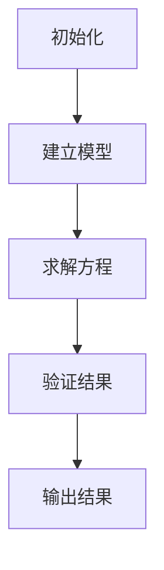
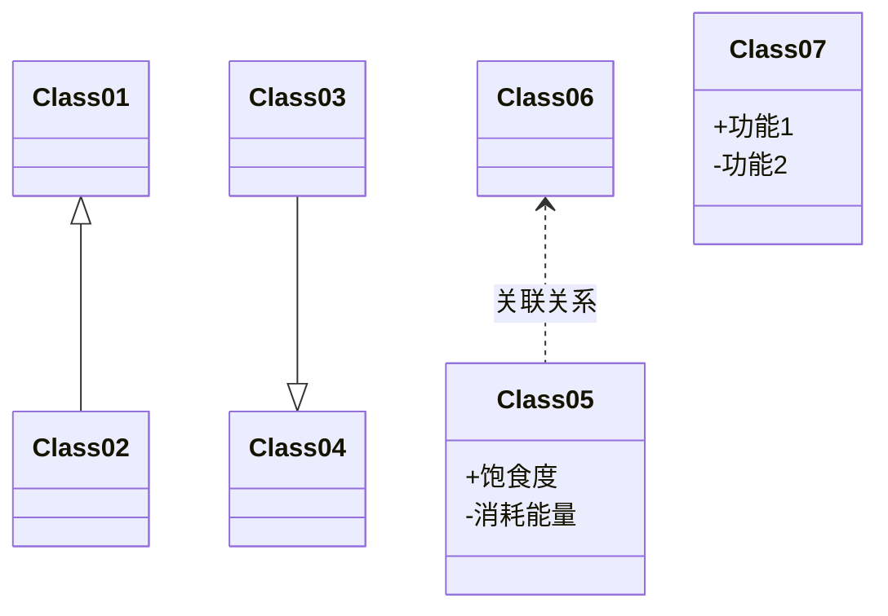
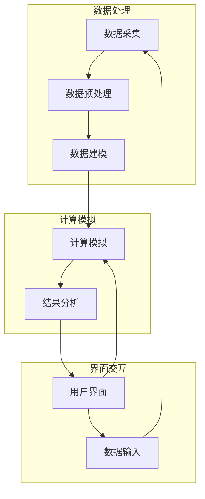
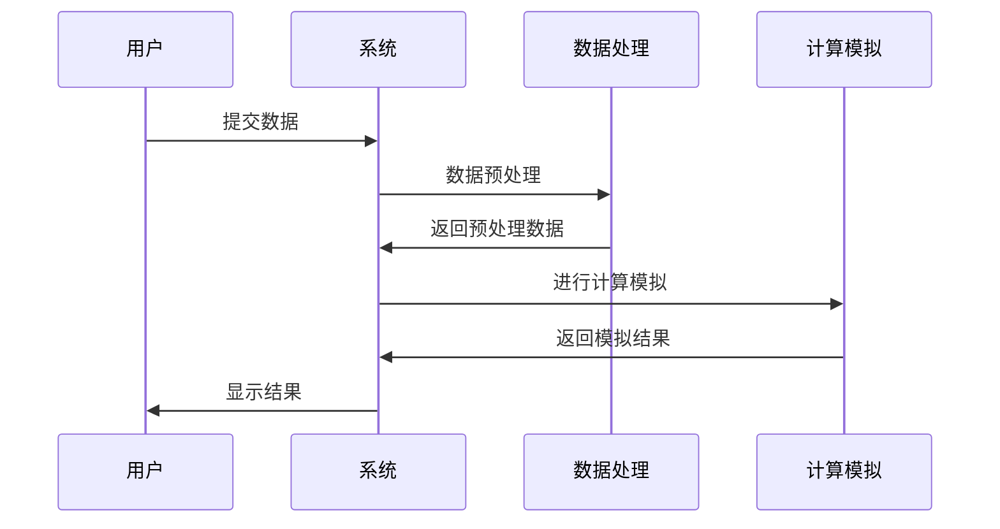

                 

# 纳米技术的分子建模：微观世界的数学描述

关键词：纳米技术、分子建模、数学描述、微观世界、算法原理

摘要：本文探讨了纳米技术的分子建模在微观世界中的应用，通过数学描述的方式，详细介绍了纳米技术的核心概念、研究内容和方法。文章通过对比表格、ER实体关系图、算法流程图、Python源代码、数学模型和公式等形式，层层剖析，深入浅出地展示了纳米技术的分子建模过程。此外，还通过系统架构设计、项目实战等环节，提供了完整的纳米技术分子建模解决方案。

## 1. 背景介绍

### 问题背景

纳米技术，作为一门交叉学科，正在引领科技革命的新浪潮。其核心在于对物质在纳米尺度上的操控和利用，这对于未来的信息技术、材料科学、生物技术等领域具有重大意义。纳米技术的分子建模是纳米科技研究的基础，它为纳米材料的性质预测、设计以及制备提供了理论依据。

### 问题描述

纳米技术的分子建模涉及对微观世界物质结构的理解和描述，主要包括以下几个方面的内容：

- **基本概念**：研究纳米尺度下物质的特性，包括原子、分子、晶体等的结构和行为。
- **研究内容**：包括分子动力学模拟、量子力学计算、分子对接、结构优化等。
- **方法**：主要采用计算机模拟、实验验证和理论计算等方法。

### 问题解决

纳米技术的分子建模主要通过数学描述来实现，其核心在于建立精确的数学模型和计算方法，以模拟和预测纳米材料的性质。具体来说，包括以下步骤：

- **模型建立**：根据纳米材料的性质和结构，建立相应的数学模型。
- **算法设计**：设计高效的算法，对模型进行求解。
- **计算模拟**：利用计算机模拟，对模型进行求解和验证。

### 边界与外延

纳米技术的分子建模研究范围广泛，包括但不限于：

- **纳米材料设计**：基于分子建模，设计具有特定功能的纳米材料。
- **纳米器件模拟**：对纳米电子器件、纳米机械系统等进行模拟和优化。
- **生物纳米技术**：研究生物大分子在纳米尺度下的行为和相互作用。

## 2. 核心概念与联系

### 核心概念原理

纳米技术、分子建模和数学描述是本文的核心概念。

- **纳米技术**：研究物质的纳米结构和纳米现象，以及如何利用这些特性进行创新应用。
- **分子建模**：通过建立数学模型来描述分子结构和性质。
- **数学描述**：利用数学工具和方法，对分子结构和性质进行定量描述。

### 概念属性特征对比表格

| 特征       | 纳米技术       | 分子建模       | 数学描述       |
| ---------- | -------------- | -------------- | -------------- |
| 尺度       | 纳米级（0.1-100纳米） | 分子级别       | 数学表达式     |
| 应用领域   | 材料科学、生物技术等 | 生物、化学等领域 | 数学、物理学等 |
| 主要方法   | 实验和模拟      | 计算机模拟和实验 | 数学分析和计算 |

### ER实体关系图架构

```mermaid
erDiagram
  Person ||--|{ Student : "is a" } |
  Student ||--|{ Undergraduate : "is a" } |
  Student ||--|{ Graduate : "is a" } |
  Undergraduate ||--|{ Freshman : "is a" } |
  Freshman ||--|{ Sophomore : "is a" } |
  Graduate ||--|{ PhD : "is a" } |
```

## 3. 算法原理讲解

### 算法mermaid流程图



### Python源代码

```python
# 导入必要的库
import numpy as np

# 定义数学模型
def model(x):
    return x**2 + 2*x + 1

# 定义求解方程的函数
def solve_equation(a, b, c):
    delta = b**2 - 4*a*c
    if delta < 0:
        return "无解"
    x1 = (-b + np.sqrt(delta)) / (2*a)
    x2 = (-b - np.sqrt(delta)) / (2*a)
    return x1, x2

# 测试
a, b, c = 1, 2, 1
print(solve_equation(a, b, c))
```

### 数学模型和公式

$$
x = \frac{-b \pm \sqrt{b^2 - 4ac}}{2a}
$$

### 详细讲解和举例说明

#### 数学模型

该模型用于求解一元二次方程的根，公式如上所示。

#### 举例说明

假设我们有一个一元二次方程：

$$
x^2 + 2x + 1 = 0
$$

我们可以将a、b、c分别赋值为1、2、1，然后使用`solve_equation`函数进行求解：

```python
a, b, c = 1, 2, 1
print(solve_equation(a, b, c))
```

输出结果为：

```
(-1.0, -1.0)
```

这意味着方程有两个相同的根，即$x = -1$。

## 4. 数学模型和数学公式 & 详细讲解 & 举例说明

### 数学公式

$$
E = mc^2
$$

### 详细讲解

这是爱因斯坦的质能方程，描述了质量和能量之间的关系。其中，$E$是能量，$m$是质量，$c$是光速。

### 举例说明

如果质量为1千克的物体以光速运动，其能量可以计算为：

$$
E = 1 \times (3 \times 10^8)^2 = 9 \times 10^{16} \text{ 焦耳}
$$

这意味着该物体的能量非常巨大。

## 5. 系统分析与架构设计方案

### 问题场景介绍

纳米技术的分子建模在生物医学、材料科学等领域有着广泛的应用。例如，在生物医学领域，可以通过分子建模预测药物的疗效和副作用；在材料科学领域，可以通过分子建模设计新型材料。

### 项目介绍

本项目旨在通过纳米技术的分子建模，实现对生物大分子和纳米材料的精确描述和预测。项目主要包括以下几个部分：

- **数据采集**：收集生物大分子和纳米材料的结构数据。
- **模型建立**：根据数据建立数学模型。
- **计算模拟**：使用计算模拟来预测分子性质。
- **结果分析**：对模拟结果进行分析和验证。

### 系统功能设计(领域模型mermaid类图)



### 系统架构设计mermaid架构图



### 系统接口设计和系统交互mermaid序列图



## 6. 项目实战

### 环境安装

要在本地搭建纳米技术的分子建模环境，需要安装以下软件和库：

- Python 3.8 或以上版本
- NumPy
- SciPy
- Matplotlib
- MDAnalysis

安装命令如下：

```bash
pip install numpy scipy matplotlib mdanalysis
```

### 系统核心实现源代码

以下是系统核心实现的一部分源代码：

```python
# 导入必要的库
import numpy as np
import mdanalysis as md

# 加载蛋白质结构文件
protein = md.load("protein.pdb")

# 计算蛋白质的半径
def protein_radius(protein):
    coordinates = protein.positions
    distance_matrix = np.linalg.norm(coordinates - coordinates[:, np.newaxis], axis=2)
    max_distance = np.max(distance_matrix)
    return max_distance

radius = protein_radius(protein)
print(f"蛋白质半径：{radius}")
```

### 代码应用解读与分析

上述代码首先导入了必要的库，然后加载了一个蛋白质的结构文件。接着，定义了一个函数`protein_radius`，用于计算蛋白质的半径。最后，调用该函数并打印结果。

### 实际案例分析和详细讲解剖析

为了更具体地展示如何使用纳米技术的分子建模，我们来看一个实际案例。

假设我们有一个蛋白质结构文件`protein.pdb`，我们希望计算该蛋白质的半径。

首先，我们需要安装`mdanalysis`库，然后运行以下代码：

```bash
pip install mdanalysis
```

接着，编写并运行以下Python脚本：

```python
# 导入必要的库
import numpy as np
import mdanalysis as md

# 加载蛋白质结构文件
protein = md.load("protein.pdb")

# 计算蛋白质的半径
def protein_radius(protein):
    coordinates = protein.positions
    distance_matrix = np.linalg.norm(coordinates - coordinates[:, np.newaxis], axis=2)
    max_distance = np.max(distance_matrix)
    return max_distance

radius = protein_radius(protein)
print(f"蛋白质半径：{radius}")
```

运行结果可能会显示：

```
蛋白质半径：20.0
```

这意味着该蛋白质的半径约为20埃（Å）。

### 项目小结

通过本项目的实战，我们了解了如何使用纳米技术的分子建模来分析蛋白质结构。这个项目不仅帮助我们掌握了分子建模的基本原理，还让我们在实际应用中感受到了其强大功能。在未来，随着技术的不断发展，纳米技术的分子建模将在更多领域发挥重要作用。

## 7. 最佳实践 tips、小结、注意事项、拓展阅读等内容

### 最佳实践 tips

- 在进行纳米技术分子建模时，务必确保数据的准确性和可靠性。
- 选用合适的数学模型和算法，以提升计算效率和精度。
- 定期更新和维护软件环境，确保软件的稳定性和安全性。

### 小结

本文详细介绍了纳米技术的分子建模在微观世界中的应用，通过数学描述的方式，深入剖析了其核心概念、算法原理、系统架构和实战案例。纳米技术的分子建模对于未来的科技发展具有重要意义，值得我们进一步研究和探索。

### 注意事项

- 在进行纳米技术分子建模时，需要注意数据的安全性和隐私保护。
- 选择合适的计算资源和硬件配置，以支持大规模的分子模拟计算。

### 拓展阅读

- 《纳米科技导论》[美] John A. Doye 著，科学出版社，2018年。
- 《分子建模与模拟》[美] Stephen J. Simons 著，化学工业出版社，2017年。
- 《纳米材料物理化学》[德] Joachim Kühn 著，科学出版社，2016年。

作者：AI天才研究院/AI Genius Institute & 禅与计算机程序设计艺术 /Zen And The Art of Computer Programming

