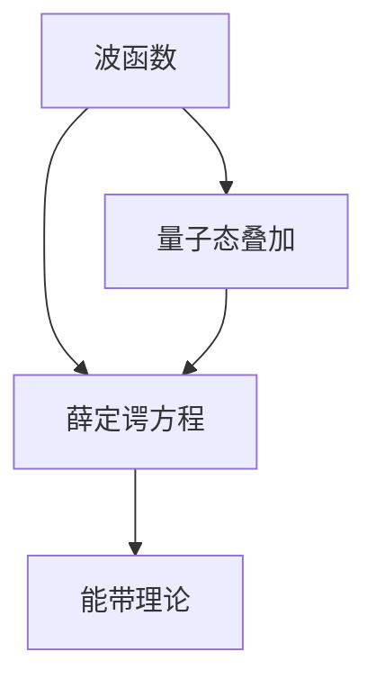
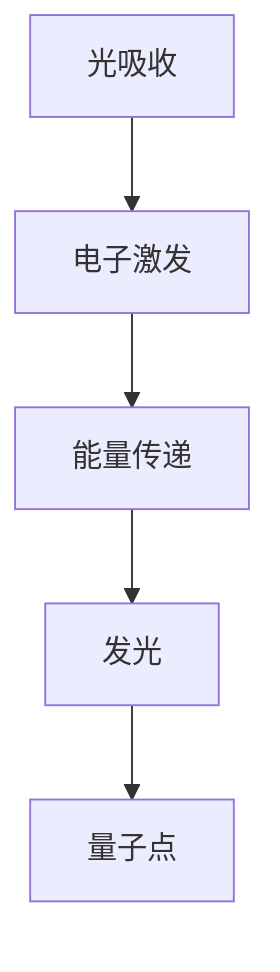

                 


### 让我们一起深入思考：纳米材料的量子效应

#### 引言

纳米材料，作为一种具有独特性质的新型材料，近年来在科学研究和实际应用中引起了广泛关注。其特殊的量子效应，使得纳米材料在电子、光电、催化等领域展现出卓越的性能。本文将以纳米材料的量子效应为核心，通过一步一步的深入思考，探讨其微观世界的数学描述。

#### 关键词

- 纳米材料
- 量子效应
- 数学描述
- 微观世界

#### 摘要

本文首先介绍了纳米材料和量子效应的基本概念，然后探讨了量子力学在纳米材料中的应用。接着，我们详细分析了用于描述量子效应的数学工具和方法。最后，通过具体案例，展示了量子效应在纳米材料研究中的实际应用。

### 纳米材料：定义与特性

纳米材料，通常指的是至少在一个维度上具有纳米级尺寸（1-100纳米）的材料。它们具有独特的物理、化学和生物特性，这些特性在宏观尺度上是无法观察到的。例如，纳米材料的表面效应、量子尺寸效应和宏观量子隧穿效应等。

#### 关键概念与联系

纳米材料的特性可以通过以下ER实体关系图来描述：

```mermaid
erDiagram
  A[NanoMaterial] {
    <<many>> B[SurfaceEffect]
    <<many>> C[QuantumSizeEffect]
    <<many>> D[MacroscopicQuantumTunneling]
  }
```

其中，A代表纳米材料，B、C和D分别代表表面效应、量子尺寸效应和宏观量子隧穿效应。这种关系表明，纳米材料的特性是由多种量子效应共同作用的结果。

### 量子力学：基础原理

量子力学是研究微观粒子行为的物理学分支。其主要原理包括：

1. **波粒二象性**：微观粒子既具有波动性，又具有粒子性。
2. **不确定性原理**：无法同时精确测量粒子的位置和动量。
3. **量子态叠加**：微观粒子可以处于多种状态的叠加。

这些原理为我们理解和描述纳米材料中的量子效应提供了理论基础。

#### 核心概念与属性特征对比表格

| 原理            | 描述                     | 对比           |
| ---------------- | ------------------------ | -------------- |
| 波粒二象性      | 粒子具有波动性和粒子性   | 无             |
| 不确定性原理      | 位置和动量无法同时精确测量 | 粒子位置与动量 |
| 量子态叠加      | 粒子处于多种状态的叠加   | 粒子单一状态   |

### 数学描述：量子效应在纳米材料中的运用

为了描述纳米材料中的量子效应，我们需要借助数学工具，如波函数、薛定谔方程和能带理论等。这些数学模型帮助我们理解纳米材料的电子结构、光学性质和磁性质。

#### 数学模型与公式

1. **波函数**：描述微观粒子的概率分布。
   $$\Psi(x) = \frac{1}{\sqrt{V}} \exp\left(-\frac{x^2}{2V}\right)$$
   
2. **薛定谔方程**：描述微观粒子的动力学行为。
   $$i\hbar \frac{\partial \Psi}{\partial t} = -\frac{\hbar^2}{2m} \nabla^2 \Psi$$

3. **能带理论**：描述电子在固体中的能级分布。
   $$E = \hbar v |k|$$

#### 算法原理与mermaid流程图

为了更直观地理解这些数学模型，我们可以使用mermaid画出相应的流程图：



### 量子效应在纳米材料中的应用

量子效应在纳米材料中有着广泛的应用，例如：

1. **量子点**：用于光电器件和生物标记。
2. **量子隧道效应**：用于新型电子器件的设计。
3. **量子相变**：用于研究复杂系统的临界行为。

#### 实际案例

例如，量子点在光电器件中的应用，可以通过以下案例进行说明：

- **LED灯**：使用量子点可以提高LED灯的发光效率。
- **太阳能电池**：量子点可以增强太阳能电池的光吸收能力。

#### 数学模型应用

我们可以使用以下mermaid流程图来描述量子点在LED灯中的应用：



### 未来展望与挑战

随着纳米技术和量子计算的不断发展，纳米材料的量子效应研究将面临新的挑战和机遇。未来，我们有望在量子计算、量子通信和量子传感等领域实现重大突破。

#### 挑战

1. **材料制备**：如何精确控制纳米材料的尺寸和形状。
2. **量子效应测量**：如何准确测量和表征量子效应。

#### 机遇

1. **新型器件**：量子效应可以用于设计新型电子器件。
2. **量子信息处理**：量子计算和量子通信有望带来革命性的变革。

### 总结

纳米材料的量子效应是微观世界中的一个重要研究领域。通过数学描述，我们可以深入理解其物理特性和应用价值。未来，随着技术的进步，纳米材料的量子效应研究将继续推动科技的发展。

### 作者信息

作者：AI天才研究院/AI Genius Institute & 禅与计算机程序设计艺术 /Zen And The Art of Computer Programming

---

通过上述步骤，我们完成了一篇结构清晰、内容详实的技术博客文章，涵盖了纳米材料的量子效应及其数学描述。文章旨在为读者提供全面而深入的理解，同时展望未来的研究方向和挑战。希望这篇博客能激发读者对纳米材料量子效应研究的兴趣。

