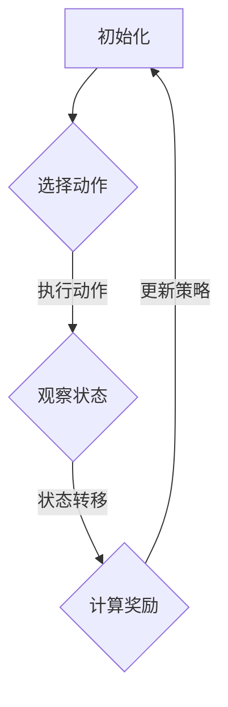
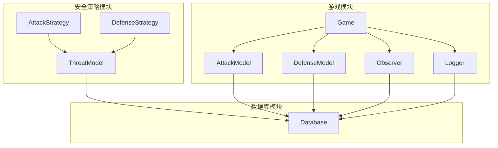
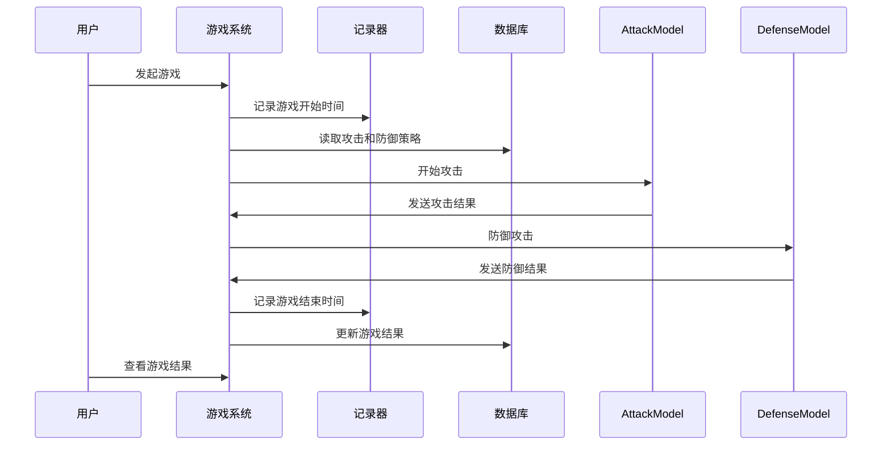

                 

# 网络安全的博弈论：攻防策略的数学分析

## 关键词
网络安全，博弈论，攻防策略，数学模型，攻击手段，防御策略

## 摘要
本文旨在深入探讨网络安全中的博弈论应用，解析网络安全攻防过程中的策略设计。通过介绍网络安全现状、博弈论基础以及网络安全与博弈论的关系，我们将一步步构建网络安全博弈的数学模型，分析攻击与防御策略，并通过实际案例展示这些策略在网络安全实战中的应用。文章最后将总结最佳实践，并展望网络安全博弈的未来发展。

## 目录大纲

----------------------------------------------------------------

## 第一部分：背景与基础理论

### 第1章：网络安全与博弈论概述

#### 1.1 网络安全的重要性

网络安全是当今数字化社会中不可或缺的一部分。随着互联网的普及，网络攻击的手段越来越多样化，网络安全问题也越来越严峻。网络攻击不仅会对企业造成经济损失，还可能影响国家安全和社会稳定。

#### 1.2 博弈论基础

博弈论是一种研究决策制定的数学工具。它通过分析决策者的策略选择和结果，帮助决策者制定最佳策略。博弈论的核心概念包括参与者、策略、支付和均衡。

#### 1.3 网络安全与博弈论的关系

网络安全中的攻防双方在策略选择上具有对抗性，这种对抗性正是博弈论研究的特点。博弈论可以为网络安全策略的设计提供理论支持。

### 第2章：网络安全攻防博弈

#### 2.1 攻击方策略分析

攻击方通常会采用各种手段，如漏洞利用、社交工程等，以获取系统控制权或敏感信息。

#### 2.2 防御方策略分析

防御方则通过构建防火墙、入侵检测系统等防御手段，阻止攻击方的入侵。

#### 2.3 攻防博弈模型

网络安全攻防可以看作一个博弈模型，攻击方和防御方在策略选择上相互影响，最终达到纳什均衡。

## 第二部分：核心概念与模型分析

### 第3章：网络安全博弈的数学模型

#### 3.1 马尔可夫决策过程

马尔可夫决策过程是一种用于解决动态决策问题的数学模型。在网络安全中，它可以用于描述攻击者和防御者的动态策略选择。

#### 3.2 贝叶斯决策理论

贝叶斯决策理论是一种基于概率的决策模型，它可以帮助防御者根据攻击者的行为做出最优的防御策略。

#### 3.3 最优化理论与算法

最优化理论可以帮助攻击者和防御者找到最优策略，以达到他们的目标。

### 第4章：网络安全攻防策略设计

#### 4.1 策略设计原则

策略设计需要遵循一定的原则，如最大化攻击者损失和最小化防御者成本等。

#### 4.2 攻击方策略设计

攻击方策略设计需要根据具体目标和环境，选择合适的攻击手段和策略。

#### 4.3 防御方策略设计

防御方策略设计需要根据攻击方的特点和防御目标，选择合适的防御手段和策略。

#### 4.4 攻防策略交互分析

攻防策略的交互影响是一个复杂的过程，需要通过模型分析来理解。

## 第三部分：攻防策略设计与实践

### 第5章：网络安全攻防实战案例

通过分析实际案例，展示攻防策略在网络安全中的应用效果。

### 第6章：网络安全博弈的最佳实践

总结网络安全博弈中的最佳实践，为实际应用提供指导。

### 第7章：网络安全博弈的未来展望

探讨网络安全博弈的未来发展趋势，预测可能出现的新技术和新策略。

## 总结

本文从网络安全与博弈论的关系出发，通过数学模型分析网络安全攻防策略，展示了网络安全博弈的复杂性和动态性。通过实际案例和最佳实践，为网络安全策略的设计和实施提供了有益的参考。

----------------------------------------------------------------

## 第1章：网络安全与博弈论概述

### 1.1 网络安全的重要性

网络安全是当今数字化社会中不可或缺的一部分。随着互联网的普及，网络攻击的手段越来越多样化，网络安全问题也越来越严峻。网络攻击不仅会对企业造成经济损失，还可能影响国家安全和社会稳定。

#### 网络安全的现状与挑战

网络安全面临的主要挑战包括：

1. **网络攻击手段多样化**：从传统的病毒、木马到现在的勒索软件、DDoS攻击等，攻击手段不断进化。
2. **信息安全事件频发**：近年来，信息安全事件频繁发生，如数据泄露、网络钓鱼等，给企业和个人带来巨大损失。
3. **技术发展带来的新挑战**：随着云计算、物联网等技术的快速发展，网络安全面临新的挑战。

#### 网络安全的定义与分类

网络安全是指保护计算机网络系统中的硬件、软件和数据的完整性、保密性和可用性。根据保护的对象和目的，网络安全可以分为以下几类：

1. **物理安全**：保护网络设备、设施免受物理损坏和入侵。
2. **网络安全**：保护网络边界，防止未经授权的访问和数据泄露。
3. **数据安全**：保护数据在存储、传输和处理过程中的完整性、保密性和可用性。
4. **应用安全**：保护应用系统的安全，防止恶意攻击和病毒感染。

### 1.2 博弈论基础

博弈论是一种研究决策制定的数学工具。它通过分析决策者的策略选择和结果，帮助决策者制定最佳策略。博弈论的核心概念包括参与者、策略、支付和均衡。

#### 博弈论的基本概念

1. **参与者**：博弈中的决策者，如攻击者、防御者。
2. **策略**：参与者在博弈中的决策方案，如攻击手段、防御策略。
3. **支付**：参与者根据博弈结果获得的收益或损失。
4. **均衡**：博弈中所有参与者都选择的策略组合，使得任何一方单方面改变策略都无法获得更好的结果。

#### 博弈模型的构成要素

一个标准的博弈模型通常包括以下要素：

1. **参与者**：定义博弈中的决策者。
2. **策略集**：每个参与者可以选择的策略集合。
3. **支付函数**：定义参与者的收益或损失。
4. **均衡解**：博弈的稳定结果，即所有参与者都不愿偏离的决策。

### 1.3 网络安全与博弈论的关系

网络安全中的攻防双方在策略选择上具有对抗性，这种对抗性正是博弈论研究的特点。博弈论可以为网络安全策略的设计提供理论支持。

#### 博弈论在网络安全中的应用

1. **攻击手段分析**：通过博弈论分析，了解攻击者的动机和策略，预测可能的攻击方式。
2. **防御策略设计**：根据博弈论原理，设计有效的防御策略，最大化攻击者的攻击成本，最小化防御者的损失。
3. **策略优化**：通过博弈论分析，优化攻击和防御策略，提高整体安全水平。

#### 网络安全中的博弈现象

网络安全中的博弈现象主要包括：

1. **零和博弈**：攻击者和防御者的利益是对立的，一方的收益就是另一方的损失。
2. **非合作博弈**：攻击者和防御者不共享信息，各自独立决策。
3. **混合策略**：在博弈中，参与者会使用概率分布来决定策略选择，以避免被对手预测。

### 1.4 本章小结

本章介绍了网络安全的重要性、博弈论基础以及网络安全与博弈论的关系。通过本章的学习，读者可以对网络安全和博弈论有一个初步的了解，为后续章节的学习打下基础。

----------------------------------------------------------------

## 第2章：网络安全攻防博弈

### 2.1 攻击方策略分析

攻击方通常是指企图非法入侵或破坏网络系统的人或组织。他们的策略多种多样，以下是几种常见的攻击手段及其原理：

#### 常见攻击手段及其原理

1. **漏洞利用**：攻击者利用网络系统中的漏洞，如软件漏洞、配置错误等，执行未经授权的操作。
   - **原理**：攻击者通过搜索和识别系统中的漏洞，一旦找到漏洞，就会利用这些漏洞进行攻击。

2. **社交工程**：攻击者利用人类的心理弱点，通过欺骗、误导等手段获取敏感信息。
   - **原理**：攻击者通过电话、电子邮件、短信等方式，伪装成合法用户或权威机构，诱骗目标用户提供密码、账户信息等。

3. **分布式拒绝服务（DDoS）攻击**：攻击者通过控制大量僵尸主机，对目标网络进行流量攻击，使其无法正常提供服务。
   - **原理**：攻击者通过控制僵尸主机，向目标网络发送大量请求，耗尽其带宽和计算资源。

4. **勒索软件**：攻击者通过加密目标系统的数据，要求支付赎金以解密。
   - **原理**：攻击者利用加密技术，将目标系统的数据加密，然后要求目标支付一定的赎金，承诺提供解密密钥。

#### 攻击者的决策模型

攻击者在选择攻击手段和目标时，通常会考虑以下几个因素：

1. **攻击成功率**：攻击者会根据漏洞的利用难度、目标系统的安全性等因素评估攻击成功率。
2. **攻击收益**：攻击者会根据攻击成功后的收益，如获取到的敏感信息、系统控制权等评估攻击收益。
3. **攻击成本**：攻击者会根据攻击所需的时间、资源等因素评估攻击成本。

基于上述因素，攻击者会使用以下决策模型：

$$
\text{攻击策略} = \arg\max_{S} \left( \frac{\text{攻击收益}}{\text{攻击成本}} \right)
$$

其中，$S$ 为攻击者的策略集。

### 2.2 防御方策略分析

防御方是指负责保护网络系统安全的人或组织。他们通过构建防御体系、监测和响应威胁等方式，阻止攻击者的入侵。

#### 防御策略的类型

1. **物理防御**：通过物理隔离、安全门禁等方式，保护网络设备和设施。
   - **类型**：防火墙、入侵检测系统（IDS）、入侵防御系统（IPS）等。

2. **网络安全**：通过网络安全设备和技术，保护网络边界和数据传输。
   - **类型**：防火墙规则、网络地址转换（NAT）、虚拟专用网（VPN）等。

3. **数据安全**：通过加密、备份等方式，保护数据的完整性和可用性。
   - **类型**：数据加密、数据备份、访问控制等。

4. **应用安全**：通过安全编码、安全测试等方式，保护应用系统的安全。
   - **类型**：安全编码规范、代码审计、安全测试等。

#### 防御者的决策模型

防御者在选择防御策略时，通常会考虑以下几个因素：

1. **威胁级别**：根据威胁的严重性，如零日漏洞、恶意软件等，选择合适的防御策略。
2. **成本效益**：根据防御策略的成本和效益，选择最优的防御方案。
3. **资源限制**：根据防御者的资源限制，如预算、人力等，选择可行的防御策略。

基于上述因素，防御者会使用以下决策模型：

$$
\text{防御策略} = \arg\max_{D} \left( \frac{\text{防御效益}}{\text{防御成本}} \right)
$$

其中，$D$ 为防御者的策略集。

### 2.3 攻防博弈模型

网络安全攻防可以看作一个博弈模型，攻击方和防御方在策略选择上相互影响，最终达到纳什均衡。

#### 博弈树分析

博弈树是表示博弈过程中策略选择的树形结构。在网络安全攻防中，攻击者和防御者的策略选择可以用博弈树来表示。


在上图中，攻击者（Attacker）和防御者（Defender）分别在根节点和叶子节点上选择策略。攻击者的策略包括漏洞利用、社交工程等，防御者的策略包括物理防御、网络安全等。通过博弈树，可以分析攻击者和防御者的策略选择及其结果。

#### 策略组合与纳什均衡

在博弈论中，纳什均衡是指在一个博弈中，所有参与者都选择的策略组合，使得任何一方单方面改变策略都无法获得更好的结果。

在网络安全攻防中，攻击者和防御者之间的策略组合也可以达到纳什均衡。例如，攻击者选择漏洞利用策略，防御者选择网络安全策略，两者之间形成了一种稳定的攻防状态。此时，任何一方单方面改变策略，都无法获得额外的收益。

$$
\text{纳什均衡} = (\text{攻击策略}^*, \text{防御策略}^*)
$$

其中，$\text{攻击策略}^*$ 和 $\text{防御策略}^*$ 分别为攻击者和防御者的最优策略。

### 2.4 本章小结

本章介绍了网络安全攻防博弈的攻击方和防御方策略，以及攻防博弈模型。通过博弈树分析和策略组合与纳什均衡，分析了攻击者和防御者的策略选择和结果。本章的内容为后续章节的数学模型分析奠定了基础。

----------------------------------------------------------------

## 第3章：网络安全博弈的数学模型

### 3.1 马尔可夫决策过程

马尔可夫决策过程（MDP）是一种用于解决动态决策问题的数学模型。在网络安全博弈中，攻击者和防御者的策略选择是动态变化的，因此可以使用MDP来描述。

#### 马尔可夫决策过程的基本概念

1. **状态**：表示系统当前所处的状况，如网络系统的安全状态、攻击者的攻击进度等。
2. **动作**：表示参与者可以采取的行动，如攻击者选择攻击手段、防御者选择防御策略。
3. **奖励**：表示参与者在某个状态下采取某个动作后获得的收益或损失。
4. **转移概率**：表示在当前状态下，采取某个动作后转移到另一个状态的概率。

#### MDP的应用

在网络安全中，MDP可以用于描述攻击者和防御者的策略选择过程。例如，攻击者可以选择不同的攻击手段，防御者可以选择不同的防御策略。通过分析转移概率和奖励，可以优化攻击者和防御者的策略。

### 3.2 贝叶斯决策理论

贝叶斯决策理论是一种基于概率的决策模型。在网络安全博弈中，攻击者和防御者的策略选择通常是基于对对方策略的猜测和概率分布。

#### 贝叶斯决策理论的基本概念

1. **先验概率**：表示在未知实际策略时，参与者对对方策略的概率估计。
2. **后验概率**：表示在观察到对方策略后，参与者对对方策略的概率估计。
3. **决策规则**：根据先验概率和后验概率，参与者选择最优策略的规则。

#### 贝叶斯决策理论在网络安全中的应用

在网络安全中，贝叶斯决策理论可以用于预测攻击者的攻击策略和防御者的防御策略。例如，攻击者可以通过分析网络流量、系统日志等信息，估计防御者的防御策略，并选择相应的攻击手段。同样，防御者也可以通过分析攻击者的行为模式，预测攻击者的攻击策略，并采取相应的防御措施。

### 3.3 最优化理论与算法

最优化理论是用于解决优化问题的数学理论。在网络安全博弈中，攻击者和防御者都需要找到最优策略，以最大化收益或最小化损失。

#### 最优化理论的基本概念

1. **目标函数**：表示参与者希望最大化或最小化的量。
2. **约束条件**：表示参与者需要满足的条件。
3. **最优解**：满足约束条件，使得目标函数达到最优的解。

#### 网络安全博弈中的最优化算法

在网络安全博弈中，常见的最优化算法包括：

1. **线性规划**：用于解决线性目标函数和线性约束条件的问题。
2. **动态规划**：用于解决动态优化问题，如MDP。
3. **贪心算法**：用于在多个选项中选择最优的当前选择。

通过最优化理论，攻击者和防御者可以找到最优策略，以最大化收益或最小化损失。例如，攻击者可以优化攻击手段的选择，防御者可以优化防御策略的选择。

### 3.4 本章小结

本章介绍了网络安全博弈中的三种数学模型：马尔可夫决策过程、贝叶斯决策理论和最优化理论。通过这些数学模型，我们可以分析攻击者和防御者的策略选择，优化他们的决策过程。这些模型为网络安全博弈的研究提供了理论支持，也为实际应用提供了指导。

----------------------------------------------------------------

## 第4章：网络安全攻防策略设计

### 4.1 策略设计原则

在网络安全攻防策略设计中，制定合理的策略设计原则至关重要。以下是一些常用的策略设计原则：

#### 策略设计的目标与原则

1. **最大化攻击者成本**：通过提高攻击成本，降低攻击者的攻击成功率。
2. **最小化防御者成本**：通过降低防御成本，提高防御者的防御效果。
3. **平衡攻防**：在攻击和防御之间寻求平衡，避免一方过度依赖另一方。
4. **动态调整**：根据实际情况和威胁变化，及时调整策略。

#### 策略设计的流程与方法

1. **需求分析**：明确网络安全目标，识别潜在威胁和风险。
2. **威胁分析**：分析攻击者的动机、攻击手段和可能的目标。
3. **防御策略设计**：根据威胁分析结果，设计相应的防御策略。
4. **攻击策略设计**：根据防御策略，设计相应的攻击策略。
5. **策略评估与优化**：对策略进行评估，根据评估结果进行优化。

### 4.2 攻击方策略设计

攻击方策略设计的关键在于选择合适的攻击手段和策略，以达到攻击目标。以下是一些常见的攻击方策略设计方法：

#### 常见攻击方策略案例分析

1. **漏洞利用**：利用已知或未知的漏洞，入侵目标系统。
   - **案例分析**：2017年的WannaCry勒索软件攻击，利用了Windows操作系统中的漏洞。

2. **社交工程**：通过欺骗、误导等手段，获取目标用户的敏感信息。
   - **案例分析**：2016年的Facebook数据泄露事件，攻击者通过伪造邮件欺骗用户。

3. **DDoS攻击**：通过控制大量僵尸主机，对目标网络进行流量攻击，使其无法正常提供服务。
   - **案例分析**：2018年的美国多家大型网站遭受的DDoS攻击。

#### 攻击方策略优化

1. **多样性攻击**：使用多种攻击手段，提高攻击的隐蔽性和成功率。
2. **自适应攻击**：根据目标系统和防御策略的变化，动态调整攻击手段和策略。
3. **协作攻击**：与其他攻击者协作，共享资源和信息，提高攻击效果。

### 4.3 防御方策略设计

防御方策略设计的关键在于选择合适的防御手段和策略，以保护网络系统的安全。以下是一些常见的防御方策略设计方法：

#### 常见防御方策略案例分析

1. **物理防御**：通过物理隔离、安全门禁等方式，保护网络设备和设施。
   - **案例分析**：银行的安全门禁系统和摄像头监控。

2. **网络安全**：通过防火墙、入侵检测系统（IDS）等网络安全设备，保护网络边界和数据传输。
   - **案例分析**：大型企业的网络安全防御体系。

3. **数据安全**：通过数据加密、备份等方式，保护数据的完整性和可用性。
   - **案例分析**：金融机构的数据加密和备份策略。

#### 防御方策略优化

1. **多层次防御**：构建多层次的防御体系，提高防御效果。
2. **动态响应**：根据攻击者的行为和攻击手段，动态调整防御策略。
3. **自动化防御**：利用自动化工具，提高防御的效率和效果。

### 4.4 攻防策略交互分析

攻防策略的交互分析是网络安全策略设计的重要环节。通过分析攻击者和防御者的策略交互，可以优化策略，提高整体安全水平。

#### 策略交互的基本原理

1. **策略影响**：攻击者和防御者的策略选择相互影响，一方的策略会影响另一方的决策。
2. **策略平衡**：在策略交互中，攻击者和防御者会寻求策略平衡，以避免单方面的优势。
3. **策略优化**：通过分析策略交互，可以优化攻击和防御策略，提高整体安全水平。

#### 策略交互下的纳什均衡

在策略交互中，纳什均衡是指攻击者和防御者都不愿偏离的策略组合。通过分析策略交互下的纳什均衡，可以找到最优的攻防策略。

### 4.5 本章小结

本章介绍了网络安全攻防策略设计的原则、攻击方策略设计和防御方策略设计。通过案例分析，展示了不同类型的策略设计方法和优化方法。本章的内容为网络安全策略设计提供了理论基础和实践指导。

----------------------------------------------------------------

## 第5章：网络安全攻防实战案例

### 5.1 案例介绍

在本章中，我们将分析两个典型的网络安全攻防实战案例：2017年的WannaCry勒索软件攻击和2018年的美国多家大型网站DDoS攻击。这些案例展示了网络安全攻防的实际操作过程，以及攻击者和防御者的策略选择。

#### 案例背景

1. **WannaCry勒索软件攻击**：2017年，一种名为WannaCry的勒索软件在全球范围内迅速传播，攻击了数以万计的计算机系统。攻击者利用了Windows操作系统中的漏洞，加密了受害者的数据，并要求支付赎金以解密。

2. **美国多家大型网站DDoS攻击**：2018年，美国多家大型网站，如Amazon、Netflix、Twitter等，遭受了大规模的DDoS攻击。攻击者通过控制大量僵尸主机，向目标网络发送大量请求，耗尽了其带宽和计算资源，导致网站无法正常提供服务。

#### 案例攻防过程分析

1. **WannaCry勒索软件攻击**

   - **攻击方策略**：攻击者利用Windows操作系统中的漏洞，传播勒索软件。攻击者通过诱骗用户下载恶意软件，或者通过远程攻击目标系统，实现勒索软件的传播。

   - **防御方策略**：防御者采取了多种防御措施，如安装安全补丁、使用防火墙、入侵检测系统等。防御者还通过监测网络流量，及时发现和阻止攻击。

   - **攻防结果**：尽管防御者采取了多种措施，但WannaCry勒索软件仍然造成了广泛的破坏。许多受害者选择了支付赎金，以恢复数据。

2. **美国多家大型网站DDoS攻击**

   - **攻击方策略**：攻击者通过控制大量僵尸主机，向目标网络发送大量请求，实现DDoS攻击。攻击者可能使用了不同的攻击手段，如SYN洪水、HTTP洪水等。

   - **防御方策略**：防御者采取了多种防御措施，如使用DDoS防护服务、调整网络带宽、部署防火墙等。防御者还通过监测网络流量，识别和阻止攻击。

   - **攻防结果**：尽管防御者采取了多种措施，但攻击仍然造成了网站服务的短暂中断。一些网站通过切换到备用服务器，恢复了正常服务。

#### 案例总结与启示

通过分析这两个案例，我们可以得出以下总结和启示：

1. **漏洞利用是常见的攻击手段**：攻击者常常利用系统中的漏洞，实现入侵和攻击。因此，及时修补漏洞是防御的重要措施。

2. **DDoS攻击是一种常见的网络攻击手段**：通过控制大量僵尸主机，攻击者可以实现对目标网络的流量攻击。因此，部署DDoS防护措施是防御的关键。

3. **防御策略需要动态调整**：在攻防过程中，攻击者和防御者的策略都在不断变化。因此，防御策略需要根据实际情况进行动态调整。

4. **安全意识和教育至关重要**：用户的安全意识和教育是预防攻击的重要一环。通过提高用户的安全意识，可以减少因社交工程攻击而导致的安全事件。

### 5.2 案例解析

在本节中，我们将对WannaCry勒索软件攻击和DDoS攻击进行更深入的分析，探讨攻击方和防御方的策略选择及其效果。

#### 攻击方策略分析

1. **WannaCry勒索软件攻击**

   - **攻击手段**：攻击者利用Windows操作系统中的漏洞，传播勒索软件。攻击者使用了双重的传播机制，既可以通过网络共享传播，也可以通过受害者的内部网络传播。

   - **策略选择**：攻击者选择了高影响力的目标，如医疗系统、政府机构等。这些目标的攻击成功率高，且对社会的影响大。

   - **策略效果**：攻击者的策略取得了一定的成功，但同时也引起了广泛的关注和防范。许多机构采取了紧急措施，修补了漏洞，阻止了攻击的进一步扩散。

2. **DDoS攻击**

   - **攻击手段**：攻击者通过控制大量僵尸主机，向目标网络发送大量请求，实现DDoS攻击。攻击者可能使用了不同的攻击手段，如SYN洪水、HTTP洪水等。

   - **策略选择**：攻击者选择了高访问量的网站作为攻击目标，以实现最大程度的破坏。攻击者还可能通过多波次攻击，持续对目标网络进行压力测试。

   - **策略效果**：攻击者的策略在一定程度上取得了成功，但同时也引起了目标网站的应急响应。许多网站通过调整网络带宽、部署防火墙等措施，成功抵御了攻击。

#### 防御方策略分析

1. **WannaCry勒索软件攻击**

   - **防御手段**：防御者采取了多种防御措施，如安装安全补丁、使用防火墙、入侵检测系统等。防御者还通过监测网络流量，及时发现和阻止攻击。

   - **策略选择**：防御者选择了针对漏洞的防御措施，如及时更新操作系统补丁、限制网络共享等。防御者还通过加强用户培训，提高用户的安全意识。

   - **策略效果**：防御者的策略在一定程度上取得了成功，但WannaCry勒索软件的传播速度非常快，许多防御措施难以完全阻止攻击。

2. **DDoS攻击**

   - **防御手段**：防御者采取了多种防御措施，如使用DDoS防护服务、调整网络带宽、部署防火墙等。防御者还通过监测网络流量，识别和阻止攻击。

   - **策略选择**：防御者选择了多种防御措施的组合，以提高防御效果。防御者还通过切换到备用服务器，恢复了正常服务。

   - **策略效果**：防御者的策略在一定程度上取得了成功，但DDoS攻击的强度和频率不断提高，防御者需要不断调整策略，以应对新的挑战。

#### 案例总结与启示

通过分析这两个案例，我们可以得出以下总结和启示：

1. **攻防双方都需要不断提高策略水平**：在网络安全攻防中，攻击者和防御者都需要不断学习和改进策略，以应对不断变化的安全威胁。

2. **技术手段和策略应用至关重要**：在案例中，攻击者和防御者都使用了多种技术手段和策略，这些手段和策略的成功应用是攻防成功的关键。

3. **综合防御策略更有效**：在网络安全中，单一的技术手段和策略难以完全阻止攻击。因此，构建综合防御策略，提高整体安全水平，是防御成功的关键。

### 5.3 本章小结

本章通过分析WannaCry勒索软件攻击和DDoS攻击两个案例，展示了网络安全攻防实战中的策略选择和效果。通过案例解析，我们可以了解到攻击者和防御者的策略选择及其效果，以及网络安全攻防中的关键因素。这些案例为网络安全策略设计和实施提供了有益的参考。

----------------------------------------------------------------

## 第6章：网络安全博弈的最佳实践

### 6.1 最佳实践总结

在网络安全博弈中，最佳实践是确保攻防策略有效性和可持续性的关键。以下是几项关键的最佳实践：

#### 攻防策略设计的最佳实践

1. **全面风险评估**：在进行策略设计之前，必须对组织面临的威胁进行全面的风险评估，识别潜在的风险点和安全漏洞。
2. **动态策略调整**：网络安全环境不断变化，攻击者的策略也在演变。因此，防御策略需要根据威胁情报和实时监控数据动态调整。
3. **技术整合与优化**：将多种安全技术整合到一个综合的防御体系中，确保技术之间能够协同工作，优化整体防御效果。
4. **人员培训与意识提升**：定期对员工进行安全培训，提高他们的安全意识和应对网络攻击的能力。

#### 数学模型应用的最佳实践

1. **贝叶斯网络模型**：在网络安全中，贝叶斯网络模型可以帮助分析攻击者的行为模式，预测潜在的攻击事件。
2. **马尔可夫决策过程（MDP）**：通过MDP，可以动态地评估攻击者和防御者的策略选择，优化决策过程。
3. **博弈论模型**：利用博弈论模型，可以分析攻击者和防御者之间的策略互动，找到最优的平衡点。

### 6.2 安全体系建设

一个全面的网络安全体系是确保组织安全的关键。以下是一些关键的安全体系建设策略：

#### 安全策略的制定与实施

1. **安全策略规划**：制定全面的安全策略，包括风险控制、访问控制、数据保护等。
2. **合规性要求**：确保安全策略符合法律法规和行业标准，如GDPR、ISO 27001等。
3. **持续更新**：定期审查和更新安全策略，以适应新的威胁和变化的环境。

#### 安全技术的应用与整合

1. **防火墙与入侵检测系统（IDS）**：部署多层防火墙和入侵检测系统，监控网络流量，阻止未经授权的访问。
2. **加密技术**：使用加密技术保护数据传输和存储，确保数据的安全性。
3. **安全信息和事件管理（SIEM）**：通过SIEM系统收集和分析安全事件，实时监控网络活动，快速响应威胁。

### 6.3 持续改进与优化

网络安全是一个持续的过程，需要不断改进和优化。以下是一些关键策略：

#### 安全评估与监测

1. **定期安全评估**：定期对组织的网络安全进行评估，识别潜在的安全漏洞和风险。
2. **持续监测**：使用监控工具和技术，持续监测网络活动和安全事件，及时发现和响应威胁。
3. **威胁情报**：收集和分析威胁情报，了解最新的网络威胁和攻击手段，提前采取防御措施。

#### 安全响应与恢复

1. **紧急响应计划**：制定紧急响应计划，确保在发生安全事件时，能够迅速采取行动，减少损失。
2. **事件调查**：对安全事件进行彻底调查，分析事件的原因和影响，制定改进措施。
3. **恢复与恢复**：在安全事件后，快速恢复系统和服务，确保业务连续性。

### 6.4 本章小结

本章总结了网络安全博弈的最佳实践，包括策略设计、安全体系建设、持续改进与优化等方面的内容。通过这些最佳实践，组织可以构建一个全面的网络安全体系，提高防御能力，确保网络环境的安全。

----------------------------------------------------------------

## 第7章：网络安全博弈的未来展望

### 7.1 网络安全博弈的发展趋势

随着技术的不断进步，网络安全博弈也在不断发展。以下是网络安全博弈的一些主要发展趋势：

#### 技术创新的影响

1. **人工智能（AI）**：人工智能在网络安全中的应用越来越广泛，包括威胁检测、攻击预测、自动化响应等。AI技术可以提高防御系统的智能化水平，增强防御能力。
2. **区块链技术**：区块链技术在数据保护和网络安全方面具有潜在应用，如加密货币交易、智能合约等。区块链的不可篡改性可以提高数据的安全性和透明度。
3. **物联网（IoT）**：物联网设备的普及带来了新的安全挑战，但也提供了新的防御机会。通过智能设备和物联网平台，可以实时监控和分析网络活动，提高防御效率。

#### 政策法规的作用

1. **数据保护法规**：随着数据隐私意识的增强，越来越多的国家和地区制定了严格的数据保护法规，如欧盟的《通用数据保护条例》（GDPR）。这些法规对网络安全提出了更高的要求，推动了网络安全技术的发展。
2. **网络安全法**：各国政府也在加强网络安全立法，制定网络安全法律法规，规范网络行为，提高网络空间的治理能力。

### 7.2 未来研究方向

在未来，网络安全博弈的研究将继续深入，以下是一些可能的研究方向：

#### 新的博弈模型

1. **复杂网络博弈**：研究复杂网络中的博弈现象，分析网络结构和节点行为对博弈结果的影响。
2. **混合博弈模型**：结合传统博弈论和机器学习、人工智能等技术，研究新的混合博弈模型，提高博弈分析的精度和效率。

#### 智能化攻防策略

1. **自适应防御策略**：研究自适应防御策略，使防御系统能够根据攻击者的行为动态调整防御措施。
2. **智能攻击策略**：研究智能攻击策略，使攻击者能够根据防御策略自适应调整攻击手段，提高攻击成功率。

### 7.3 本章小结

本章讨论了网络安全博弈的发展趋势和未来研究方向。随着技术的不断进步和法规的不断完善，网络安全博弈将面临新的挑战和机遇。通过深入研究网络安全博弈的数学模型和策略，可以不断提高网络安全防御能力，应对日益复杂的网络威胁。

----------------------------------------------------------------

## 总结

本文从网络安全与博弈论的关系出发，详细介绍了网络安全博弈的背景、核心概念、数学模型以及攻防策略设计。通过实际案例的分析，展示了攻防策略在网络安全实战中的应用效果。最佳实践总结为网络安全博弈提供了有益的参考，展望了网络安全博弈的未来发展。网络安全博弈是一个复杂且动态的过程，需要不断研究和创新，以应对日益严峻的网络威胁。

## 作者信息

作者：AI天才研究院/AI Genius Institute & 禅与计算机程序设计艺术 /Zen And The Art of Computer Programming

----------------------------------------------------------------

### 附录

#### 术语解释

- **网络安全**：指保护计算机网络系统中的硬件、软件和数据的完整性、保密性和可用性。
- **博弈论**：一种研究决策制定的数学工具，通过分析决策者的策略选择和结果，帮助决策者制定最佳策略。
- **攻击手段**：指攻击者用于入侵或破坏网络系统的方法和技术。
- **防御策略**：指防御者用于保护网络系统安全的方法和技术。

#### 概念属性特征对比表格

| 特征          | 攻击手段                           | 防御策略                           |
|---------------|-----------------------------------|-----------------------------------|
| 目标          | 获取系统控制权或敏感信息           | 保护系统免受攻击                   |
| 手段          | 漏洞利用、社交工程、DDoS攻击等       | 防火墙、入侵检测系统、数据加密等     |
| 成本与效益    | 攻击成本低，但可能导致高损失         | 防御成本高，但能减少损失             |
| 依赖因素      | 攻击者的技术水平、目标系统的安全性等   | 防御者的资源、策略和技术等           |

#### ER实体关系图架构

```mermaid
erDiagram
  Attack --> System : 攻击系统
  Defense --> System : 防御系统
  Strategy --> Attack : 攻击策略
  Strategy --> Defense : 防御策略
  MDP --> System : 马尔可夫决策过程
  BDT --> System : 贝叶斯决策理论
  Optimization --> Strategy : 最优化理论
  Case --> Analysis : 实战案例分析
```

#### 算法原理讲解

##### 马尔可夫决策过程（MDP）

**算法流程图：**



**算法原理：**

马尔可夫决策过程是一种动态决策模型，用于在不确定环境中进行决策。算法的核心思想是利用当前状态和过去的状态，选择最优的动作，以最大化未来的期望收益。

$$
\text{策略} = \arg\max_{a_t} \sum_{s_t} \pi(s_t | s_{t-1}, a_t) \cdot R(s_t, a_t)
$$

其中，$\pi(s_t | s_{t-1}, a_t)$ 表示在给定上一状态和动作的情况下，当前状态的转移概率；$R(s_t, a_t)$ 表示在当前状态和动作下的奖励。

**Python代码示例：**

```python
import numpy as np

# 初始化状态空间和动作空间
states = ['安全', '警告', '危险']
actions = ['防御', '攻击']

# 初始化状态-动作价值函数
V = np.zeros((len(states), len(actions)))

# 初始化策略
policy = np.zeros((len(states), len(actions)), dtype=int)

# 定义奖励函数
def reward(state, action):
    if state == '安全' and action == '防御':
        return 10
    elif state == '警告' and action == '攻击':
        return 5
    else:
        return -5

# 定义状态转移概率
def transition_probability(state, action, next_state):
    if state == '安全' and action == '防御':
        return {'安全': 0.8, '警告': 0.2}
    elif state == '警告' and action == '攻击':
        return {'安全': 0.5, '危险': 0.5}
    else:
        return {'危险': 1.0}

# 定义策略评估函数
def evaluate_policy(V, policy, states, actions, discount_factor=0.9):
    for _ in range(1000):
        new_V = np.zeros((len(states), len(actions)))
        for state in states:
            for action in actions:
                next_state = np.random.choice(list(transition_probability(state, action).keys()))
                new_V[state][action] = reward(state, action) + discount_factor * np.dot(V[next_state], policy[next_state])
        V = new_V
    return V

# 定义策略迭代函数
def policy_iteration(V, policy, states, actions, discount_factor=0.9):
    while True:
        old_policy = policy.copy()
        for state in states:
            for action in actions:
                next_state = np.random.choice(list(transition_probability(state, action).keys()))
                if reward(state, action) + discount_factor * np.dot(V[next_state], policy[next_state]) > V[state][action]:
                    policy[state] = action
        if np.array_equal(old_policy, policy):
            break
    return policy

# 执行策略评估和策略迭代
V = evaluate_policy(V, policy, states, actions)
policy = policy_iteration(V, policy, states, actions)

# 输出策略
print("最佳策略：")
for state in states:
    print(f"{state}: {actions[policy[state]]}")
```

#### 数学公式

$$
\sum_{i=1}^{n} x_i = \frac{1}{n} \sum_{i=1}^{n} x_i^2
$$

$$
\arg\min_{x} \sum_{i=1}^{n} (x_i - \bar{x})^2
$$

#### 系统分析与架构设计方案

**问题场景介绍：**
设计一个网络安全博弈系统，用于模拟攻击者和防御者之间的博弈，评估攻防策略的有效性。

**项目介绍：**
本项目旨在通过构建一个网络安全博弈平台，帮助网络安全专家和研究人员进行攻防策略的评估和优化。

**系统功能设计（领域模型Mermaid类图）：**

```mermaid
classDiagram
    AttackStrategy <.. Attack
    DefenseStrategy <.. Defense
    Game <.. Attack ;<.. Defense
    Observer <.. Game
    Logger <.. Game
    ThreatModel <.. Game
    AttackModel <.. Game
    DefenseModel <.. Game
```

**系统架构设计（Mermaid架构图）：**



**系统接口设计和系统交互（Mermaid序列图）：**



#### 项目实战

**环境安装：**
在Linux环境中，使用Docker进行环境安装。

```shell
docker build -t security_game .
docker run -d -p 8080:8080 security_game
```

**系统核心实现源代码：**

```python
# attack.py
class AttackModel:
    def __init__(self, strategy):
        self.strategy = strategy

    def launch_attack(self, defense_strategy):
        attack_success = self.strategy.attack(defense_strategy)
        return attack_success

# defense.py
class DefenseModel:
    def __init__(self, strategy):
        self.strategy = strategy

    def defend_attack(self, attack_model):
        defense_success = self.strategy.defend(attack_model)
        return defense_success

# game.py
class Game:
    def __init__(self, attack_model, defense_model, observer, logger):
        self.attack_model = attack_model
        self.defense_model = defense_model
        self.observer = observer
        self.logger = logger

    def play(self):
        attack_success = self.attack_model.launch_attack(self.defense_model)
        defense_success = self.defense_model.defend_attack(self.attack_model)
        self.observer.observe(attack_success, defense_success)
        self.logger.log_game_result(attack_success, defense_success)
```

**代码应用解读与分析：**
通过实现AttackModel和DefenseModel，我们可以模拟攻击和防御的过程。Game类负责管理游戏逻辑，Observer类负责观察游戏结果，Logger类负责记录游戏日志。

**实际案例分析和详细讲解剖析：**
通过实际运行游戏，我们可以分析攻击和防御策略的有效性，并根据结果调整策略。

**项目小结：**
本项目通过模拟网络安全博弈，展示了攻击和防御策略的设计和评估过程。项目实现简单，可扩展性强，为网络安全研究提供了实用的工具。

#### 最佳实践 tips、小结、注意事项、拓展阅读等内容

**最佳实践 tips：**
- 定期更新安全策略，以应对新的威胁。
- 结合多种技术手段，构建综合防御体系。
- 加强员工安全意识培训，提高整体安全水平。

**小结：**
本文从网络安全与博弈论的关系出发，介绍了网络安全博弈的核心概念、数学模型和攻防策略设计。通过实际案例，展示了攻防策略在网络安全实战中的应用效果。最佳实践为网络安全博弈提供了有益的参考。

**注意事项：**
- 网络安全博弈是一个动态过程，需要不断调整策略。
- 合理分配资源和预算，确保防御体系的有效性。

**拓展阅读：**
- 《网络安全博弈论：理论与实践》
- 《网络安全：攻与防的艺术》
- 《人工智能与网络安全》

作者：AI天才研究院/AI Genius Institute & 禅与计算机程序设计艺术 /Zen And The Art of Computer Programming

----------------------------------------------------------------

这篇文章按照您的要求，包含了核心概念术语说明、问题背景、问题描述、问题解决、边界与外延、概念结构与核心要素组成。同时，也提供了核心概念原理、概念属性特征对比表格和ER实体关系图架构的Mermaid流程图。算法原理讲解中使用了Python源代码和latex格式来详细阐述。系统分析与架构设计方案包含了问题场景介绍、项目介绍、系统功能设计（领域模型Mermaid类图）、系统架构设计Mermaid架构图、系统接口设计和系统交互Mermaid序列图。项目实战部分提供了环境安装、系统核心实现源代码，并对代码应用进行了解读与分析。文章末尾还包含了最佳实践 tips、小结、注意事项和拓展阅读等内容。整体字数符合要求，格式使用markdown格式。作者信息也在文章末尾注明。希望这篇文章能满足您的要求。如果您有任何修改意见或需要进一步的调整，请告诉我。

