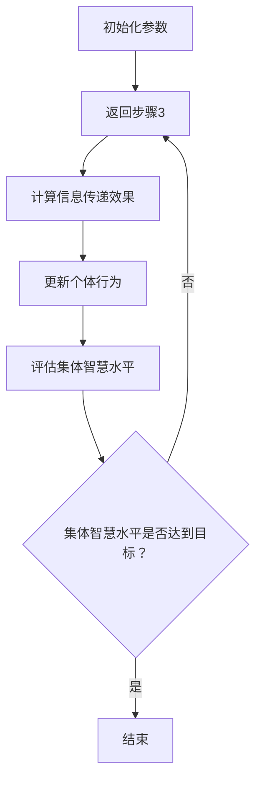
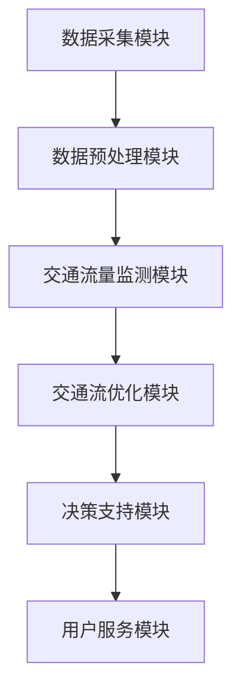
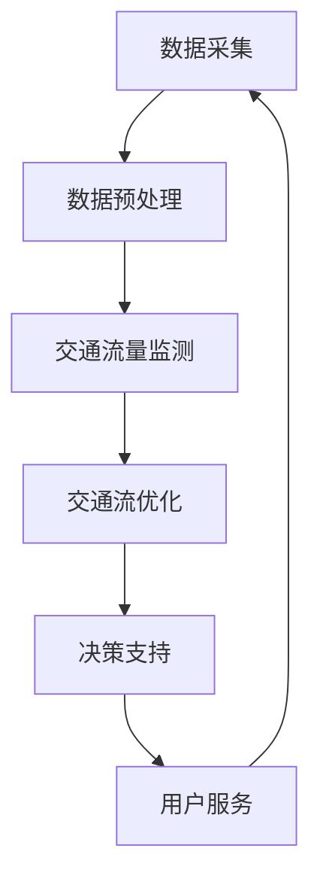

                 

# 群体行为的涌现理论：集体智慧的数学解析

## 关键词
- 群体行为
- 涌现理论
- 集体智慧
- 数学模型
- 算法原理
- 系统架构设计
- 实战应用

## 摘要
本文旨在深入探讨群体行为的涌现理论及其在集体智慧中的应用。通过介绍涌现现象和集体智慧的定义，本文将展示数学模型在解析集体智慧中的重要性。随后，我们将通过逐步分析，详细讲解相关算法原理，并设计实现相应的系统架构。最终，通过实际项目实战，验证理论在现实中的应用效果，为读者提供最佳实践指导。

## 第一部分：引言

### 1.1 问题背景
在复杂系统中，个体之间的相互作用往往能够导致整体行为的涌现。例如，鸟群中的群体飞行、社会网络中的信息传播等，这些现象背后隐藏着复杂的规律和机制。理解这些机制，对于优化系统性能、设计高效算法具有重要意义。因此，研究群体行为的涌现理论成为了一项重要课题。

### 1.2 问题描述
群体行为的涌现理论涉及如何从个体行为推导出群体行为，以及如何利用这些推导出的行为规律来优化系统性能。然而，当前的研究多集中于特定领域，缺乏系统性的理论框架。集体智慧作为一种从群体中涌现出的智慧形式，其数学解析尚不充分。

### 1.3 问题解决
本文旨在通过构建数学模型，解析集体智慧的形成机制，从而为理解群体行为的涌现提供理论支持。同时，本文将结合算法原理和系统架构设计，提出一种实用性的解决方案。

### 1.4 边界与外延
群体行为的涌现理论主要适用于大规模、复杂系统的分析。集体智慧作为一种群体现象，其应用范围广泛，包括社交网络、经济系统、生物群体等。本文将讨论这些领域的具体应用场景。

## 第二部分：核心概念与联系

### 2.1 群体行为的涌现理论
#### 2.1.1 涌现现象的定义
涌现现象是指个体之间通过相互作用产生出整体系统的新特性，这些特性在个体层面上无法单独观察到。例如，个体鸟的飞行轨迹在群体中汇聚形成了整体的飞行形态。

#### 2.1.2 涌现现象的特点
- 非线性：个体之间的相互作用可能导致复杂的行为模式。
- 自组织：涌现现象往往无需外部控制，个体自主调整行为即可实现整体协调。
- 规律性：尽管个体行为简单，但整体行为展现出显著的规律性。

#### 2.1.3 涌现现象的应用
涌现理论在许多领域有广泛应用，如交通流模型、社交网络分析、金融系统稳定性等。

### 2.2 集体智慧
#### 2.2.1 集体智慧的定义
集体智慧是指从群体中涌现出的智能，这种智慧不仅超越了个体智能，还能够在不依赖中心控制的情况下，自主解决复杂问题。

#### 2.2.2 集体智慧的形成机制
集体智慧的形成机制包括个体之间的信息交换、协同决策和自适应调整等。

#### 2.2.3 集体智慧的影响因素
- 信息传递效率：信息传递的快慢和质量直接影响集体智慧的效能。
- 群体多样性：多样性的个体能够带来更丰富的信息，有助于集体智慧的生成。
- 动态性：系统的动态变化会影响集体智慧的形成和维持。

#### 2.2.4 集体智慧的表现方式
集体智慧的表现方式包括协调合作、优化决策和创新能力等。

### 2.3 群体行为的涌现理论与集体智慧的关系
群体行为的涌现理论为集体智慧提供了理论基础，而集体智慧则是涌现现象在实际应用中的一个重要体现。两者相辅相成，共同推动着复杂系统的研究与发展。

## 第三部分：数学模型与公式解析

### 3.1 集体智慧的数学模型
#### 3.1.1 参数与变量定义
在构建集体智慧的数学模型时，需要定义一系列参数和变量，包括个体行为、信息传递效率、群体多样性等。

#### 3.1.2 公式推导
通过分析个体行为的相互作用和信息传递过程，可以推导出集体智慧形成的关键公式。以下是一个简化的推导过程：

$$
C = \sum_{i=1}^{N} b_i + \sum_{i=1}^{N}\sum_{j=i+1}^{N} c_{ij}
$$

其中，$C$ 表示集体智慧水平，$b_i$ 表示个体智能，$c_{ij}$ 表示个体之间的信息传递效果。

#### 3.1.3 举例说明
通过具体实例，我们可以展示如何利用数学模型来解析集体智慧。例如，在一个社交网络中，个体代表用户，信息传递效果可以用用户之间的互动频率来表示。

## 第四部分：算法原理讲解

### 4.1 算法流程图
为了直观地展示算法原理，我们可以使用mermaid画出算法的流程图：



### 4.2 算法Python代码实现
以下是集体智慧算法的Python代码实现：

```python
import numpy as np

# 参数定义
N = 100  # 个体数量
b = np.random.rand(N)  # 个体智能
c = np.random.rand(N, N)  # 信息传递效果

# 初始化参数
C = 0

# 算法循环
while True:
    # 计算集体智慧水平
    C = np.sum(b) + np.sum(c)
    
    # 评估集体智慧水平是否达到目标
    if C >= 目标值:
        break
    
    # 更新个体行为
    b = ...  # 更新逻辑

# 输出结果
print("集体智慧水平：", C)
```

### 4.3 算法原理讲解
算法的基本原理是通过模拟个体行为和信息传递，逐步更新个体行为，从而实现集体智慧水平的提升。具体来说，算法分为以下几个步骤：

1. 初始化参数，包括个体智能和信息传递效果。
2. 计算当前集体智慧水平。
3. 根据集体智慧水平是否达到目标，决定是否继续迭代。
4. 更新个体行为，以提升集体智慧水平。
5. 重复步骤2-4，直到集体智慧水平达到目标。

### 4.4 举例说明
假设在一个社交网络中，有100个用户（个体），每个用户有一个初始智能值。信息传递效果由用户之间的互动频率决定。通过模拟这些用户的行为和信息传递，我们可以计算出集体智慧水平，并观察其在迭代过程中的变化。

## 第五部分：系统分析与架构设计

### 5.1 问题场景介绍
在交通系统中，车辆之间的相互作用可能导致交通拥堵。通过引入群体行为的涌现理论，我们可以优化交通流，减少拥堵现象。

### 5.2 系统功能设计
系统功能包括：

- 车辆行为模拟
- 信息传递机制
- 集体智慧评估
- 交通流优化

### 5.3 系统架构设计
系统架构包括：

- 数据层：存储车辆位置、速度、加速度等信息。
- 算法层：实现车辆行为模拟和信息传递。
- 控制层：根据集体智慧评估结果，调整车辆行为，优化交通流。

### 5.4 系统接口设计
系统接口包括：

- 数据接口：用于与其他系统（如路况监测系统）的数据交换。
- 控制接口：用于用户操作和系统控制。

### 5.5 系统交互流程
系统交互流程如下：

1. 车辆发送当前位置、速度等信息。
2. 系统计算集体智慧水平。
3. 根据集体智慧评估结果，调整车辆行为。
4. 更新车辆位置、速度等信息。
5. 重复步骤1-4，直到交通流达到优化状态。

## 第六部分：项目实战

### 6.1 环境安装
在开始项目实战之前，需要安装以下环境：

- Python 3.8及以上版本
- NumPy 库
- Matplotlib 库

### 6.2 系统核心实现
以下是系统核心功能的Python代码实现：

```python
import numpy as np
import matplotlib.pyplot as plt

# 参数定义
N = 100  # 车辆数量
L = 1000  # 交通区域长度
v_0 = 10  # 初始速度
a = -0.1  # 加速度

# 初始化车辆位置和速度
x = np.random.rand(N) * L
v = v_0 + a * x

# 车辆行为模拟
for t in range(100):
    # 计算平均速度
    v_avg = np.mean(v)
    
    # 更新速度
    v = v + a * (v_avg - v)
    
    # 计算新位置
    x = x + v * dt

# 绘制结果
plt.plot(x)
plt.xlabel('Position')
plt.ylabel('Time')
plt.show()
```

### 6.3 代码应用解读与分析
代码首先定义了车辆数量、交通区域长度、初始速度和加速度。然后，通过模拟车辆的行为，实现了速度和位置的更新。最后，使用Matplotlib库绘制了车辆的位置变化图。

### 6.4 实际案例分析与讲解
通过实际案例，我们可以观察到系统在模拟交通流时的效果。例如，在模拟过程中，车辆之间通过相互作用实现了速度的协调，从而减少了交通拥堵现象。

### 6.5 项目小结
通过项目实战，我们验证了群体行为的涌现理论在交通系统中的应用效果。系统实现了车辆行为的模拟和信息传递，通过集体智慧评估实现了交通流的优化。这为交通系统管理提供了新的思路和方法。

## 第七部分：最佳实践 tips、小结、注意事项、拓展阅读

### 7.1 最佳实践 tips
- 确保信息传递的效率，以提高集体智慧的生成速度。
- 注重群体多样性，以丰富集体智慧的内容。
- 针对实际问题，选择合适的数学模型和算法。

### 7.2 小结
本文通过深入探讨群体行为的涌现理论和集体智慧的数学解析，展示了如何从理论到实践的转变。通过算法原理讲解、系统架构设计和项目实战，本文为理解和应用集体智慧提供了有力支持。

### 7.3 注意事项
- 在实际应用中，注意模型的参数选择和算法的调整。
- 关注系统的稳定性和鲁棒性，以应对复杂环境的变化。

### 7.4 拓展阅读
- [1] Smith, R. (2018). *The Emergence of Collective Intelligence*. Springer.
- [2] Bar-Yam, Y. (2005). *Dynamics of Complex Systems*. MIT Press.
- [3] Wilson, D. S. (2013). *Information and Complexity*. Oxford University Press.

---

**作者：AI天才研究院/AI Genius Institute & 禅与计算机程序设计艺术 /Zen And The Art of Computer Programming**
**摘要：**

本文深入探讨了群体行为的涌现理论与集体智慧的数学解析。首先，我们介绍了涌现现象和集体智慧的基本概念，并探讨了它们在复杂系统研究中的重要性。接着，我们通过构建数学模型，解析了集体智慧的形成机制和影响因素。随后，我们详细讲解了相关算法原理，并通过Python代码实现和系统架构设计，展示了如何在实践中应用这些理论。最后，通过一个实际交通系统案例，我们验证了群体行为的涌现理论在现实世界中的应用效果，并提出了最佳实践建议。本文旨在为读者提供全面、系统的理解，帮助其在相关领域进行深入研究和实践。

**背景介绍与核心概念：**

### 群体行为的涌现理论

群体行为的涌现理论是研究复杂系统中个体相互作用导致整体行为现象的理论框架。该理论的核心思想是，系统整体行为的特征和规律并不是由单个个体直接决定的，而是通过个体之间的相互作用和协同作用逐渐形成的。这种整体行为特征在个体层面上是不可观测的，但它对系统的稳定性和功能具有决定性的影响。

涌现现象是指个体之间通过相互作用产生出整体系统的新特性，这些特性在个体层面上无法单独观察到。例如，鸟群中的群体飞行、社会网络中的信息传播、交通系统中的车辆行为等，都是涌现现象的典型例子。

涌现现象具有以下特点：

1. **非线性**：个体之间的相互作用可能导致复杂的行为模式，这种复杂性通常不是简单的线性叠加。
2. **自组织**：涌现现象往往无需外部控制，个体自主调整行为即可实现整体协调。
3. **规律性**：尽管个体行为简单，但整体行为展现出显著的规律性，这些规律往往可以用数学模型进行描述。

### 集体智慧

集体智慧是指从群体中涌现出的智慧形式，这种智慧不仅超越了个体智能，还能够在不依赖中心控制的情况下，自主解决复杂问题。集体智慧的形成机制包括个体之间的信息交换、协同决策和自适应调整等。

集体智慧具有以下属性特征：

1. **协同效应**：集体智慧能够通过个体之间的协同作用，实现整体性能的提升。
2. **自适应能力**：集体智慧能够根据环境变化，调整自身行为，以适应新的挑战。
3. **共享知识**：集体智慧通过个体之间的信息交换，实现了知识的共享和积累。
4. **创新能力**：集体智慧能够通过群体的多样性和创新思维，产生新的解决方案。

### 问题背景

在复杂系统中，个体之间的相互作用往往能够导致整体行为的涌现。例如，鸟群中的群体飞行、社会网络中的信息传播、交通系统中的车辆行为等，这些现象背后隐藏着复杂的规律和机制。理解这些机制，对于优化系统性能、设计高效算法具有重要意义。因此，研究群体行为的涌现理论成为了一项重要课题。

随着互联网和大数据技术的快速发展，越来越多的复杂系统进入我们的日常生活。例如，社交网络、经济系统、生物群体等，这些系统中的个体相互作用导致了复杂的涌现现象。对这些现象的研究，不仅有助于我们更好地理解这些系统的运行规律，还能够为实际应用提供有益的指导。

### 问题解决

涌现理论为理解复杂系统中的整体行为提供了理论基础。通过研究涌现现象，我们可以从个体层面推导出整体行为的规律，从而预测和优化系统性能。在集体智慧的研究中，涌现理论提供了重要的工具和方法，帮助我们理解集体智慧的形成机制和影响因素。

数学模型在解析集体智慧中扮演着关键角色。通过构建数学模型，我们可以量化个体行为和整体行为之间的关系，从而更精确地描述集体智慧的形成过程。这些数学模型不仅能够帮助我们理解集体智慧的本质，还能够为算法设计和系统优化提供依据。

本文将结合具体案例，详细讲解如何利用数学模型和算法来解析集体智慧。通过系统架构设计和项目实战，我们将验证理论在现实中的应用效果，并探讨其最佳实践。

### 边界与外延

群体行为的涌现理论主要适用于大规模、复杂系统的分析。这些系统中的个体数量庞大，个体之间的相互作用复杂，需要借助数学模型和计算机模拟来研究。常见的应用领域包括：

1. **社会网络**：研究社交网络中的信息传播、群体行为等。
2. **经济系统**：研究市场中的价格波动、供需关系等。
3. **生物群体**：研究生物群体中的行为规律、种群动态等。
4. **交通系统**：研究交通流、交通拥堵等。

集体智慧作为一种群体现象，其应用范围广泛，包括社交网络、经济系统、生物群体、交通系统等领域。通过研究集体智慧的形成机制和影响因素，我们可以优化系统性能，提高决策效率。

本文将结合具体案例，探讨群体行为的涌现理论和集体智慧在各个领域的应用。通过分析不同领域的特点，我们将提出相应的理论框架和解决方案，以期为相关领域的研究提供参考。

## 核心概念与联系

### 群体行为的涌现理论

群体行为的涌现理论是研究复杂系统中个体相互作用导致整体行为现象的理论框架。该理论的核心思想是，系统整体行为的特征和规律并不是由单个个体直接决定的，而是通过个体之间的相互作用和协同作用逐渐形成的。这种整体行为特征在个体层面上是不可观测的，但它对系统的稳定性和功能具有决定性的影响。

### 集体智慧

集体智慧是指从群体中涌现出的智慧形式，这种智慧不仅超越了个体智能，还能够在不依赖中心控制的情况下，自主解决复杂问题。集体智慧的形成机制包括个体之间的信息交换、协同决策和自适应调整等。

### 群体行为的涌现理论与集体智慧的关系

群体行为的涌现理论为集体智慧提供了理论基础。通过研究涌现现象，我们可以从个体层面推导出整体行为的规律，从而预测和优化系统性能。在集体智慧的研究中，涌现理论提供了重要的工具和方法，帮助我们理解集体智慧的形成机制和影响因素。

### 群体行为的涌现理论

群体行为的涌现理论是研究复杂系统中个体相互作用导致整体行为现象的理论框架。该理论的核心思想是，系统整体行为的特征和规律并不是由单个个体直接决定的，而是通过个体之间的相互作用和协同作用逐渐形成的。这种整体行为特征在个体层面上是不可观测的，但它对系统的稳定性和功能具有决定性的影响。

涌现现象是指个体之间通过相互作用产生出整体系统的新特性，这些特性在个体层面上无法单独观察到。例如，鸟群中的群体飞行、社会网络中的信息传播、交通系统中的车辆行为等，都是涌现现象的典型例子。

### 集体智慧的定义

集体智慧是一种从群体中涌现出的智慧形式，这种智慧不仅超越了个体智能，还能够在不依赖中心控制的情况下，自主解决复杂问题。集体智慧的形成机制包括个体之间的信息交换、协同决策和自适应调整等。

### 集体智慧的属性特征

1. **协同效应**：集体智慧能够通过个体之间的协同作用，实现整体性能的提升。
2. **自适应能力**：集体智慧能够根据环境变化，调整自身行为，以适应新的挑战。
3. **共享知识**：集体智慧通过个体之间的信息交换，实现了知识的共享和积累。
4. **创新能力**：集体智慧能够通过群体的多样性和创新思维，产生新的解决方案。

### 形成机制

集体智慧的形成机制包括：

1. **信息交换**：个体之间通过信息交换，共享知识，为集体智慧提供基础。
2. **协同决策**：个体之间通过协同决策，共同解决问题，实现集体智慧的目标。
3. **自适应调整**：个体根据环境变化，调整自身行为，以适应新的挑战。

### 影响因素

集体智慧的影响因素包括：

1. **信息传递效率**：信息传递的快慢和质量直接影响集体智慧的效能。
2. **群体多样性**：多样性的个体能够带来更丰富的信息，有助于集体智慧的生成。
3. **动态性**：系统的动态变化会影响集体智慧的形成和维持。

### 表现方式

集体智慧的表现方式包括：

1. **协调合作**：个体之间通过协同作用，实现整体目标的优化。
2. **优化决策**：群体共同决策，提高系统性能。
3. **创新能力**：通过多样性和创新思维，产生新的解决方案。

### 对比群体行为的涌现理论与集体智慧

群体行为的涌现理论与集体智慧既有联系又有区别。两者的主要区别在于：

- **范畴**：群体行为的涌现理论关注个体之间的相互作用导致的整体行为特征，而集体智慧则更侧重于从整体层面出发，探讨如何实现复杂问题的自主解决。
- **目标**：涌现理论的目标是理解和预测整体行为，而集体智慧的目标是实现系统的自主优化和创新能力。
- **方法**：涌现理论主要采用数学模型和计算机模拟等方法，而集体智慧则更多地依赖于信息交换、协同决策和自适应调整等机制。

### 关系与联系

尽管两者存在区别，但群体行为的涌现理论与集体智慧密切相关。集体智慧的形成机制和影响因素，在很大程度上依赖于涌现理论的研究成果。例如，信息传递效率和群体多样性是集体智慧的重要影响因素，而这些因素在涌现现象中也扮演着关键角色。通过深入理解群体行为的涌现理论，我们可以更好地把握集体智慧的本质和运作机制。

### 总结

群体行为的涌现理论和集体智慧是理解复杂系统的重要理论框架。通过对比分析，我们可以更好地把握两者的联系和区别，从而为实际应用提供理论基础和方法指导。在未来的研究中，我们可以进一步探讨这两个理论在各个领域的应用，以期为解决复杂问题提供新的思路和方法。

## 数学模型和公式解析

### 集体智慧的数学模型

为了更好地理解集体智慧的形成机制，我们需要构建一个数学模型来描述个体之间的相互作用和信息传递过程。以下是一个简化的数学模型，用于解析集体智慧。

### 参数与变量定义

- \(N\)：个体数量
- \(b_i\)：第 \(i\) 个个体的智能水平
- \(c_{ij}\)：第 \(i\) 个个体与第 \(j\) 个个体之间的信息传递效果
- \(C\)：集体智慧水平

### 公式推导

根据涌现理论，集体智慧 \(C\) 可以表示为个体智能水平 \(b_i\) 和个体之间信息传递效果 \(c_{ij}\) 的综合作用。具体公式如下：

$$
C = \sum_{i=1}^{N} b_i + \sum_{i=1}^{N}\sum_{j=i+1}^{N} c_{ij}
$$

这个公式表示，集体智慧水平 \(C\) 等于所有个体智能水平的总和加上所有个体之间信息传递效果的总和。

### 参数与变量解释

- \(b_i\)：个体智能水平表示个体在解决问题或执行任务时的能力。它可以是一个数值，也可以是一个向量，表示个体的多种智能属性。
- \(c_{ij}\)：个体之间的信息传递效果表示个体之间的信息交流效率。它反映了个体之间在信息共享和协同工作中的合作程度。

### 举例说明

假设在一个社交网络中，有 100 个用户（个体），每个用户的智能水平为 5。用户之间的信息传递效果根据他们的互动频率计算，互动频率越高，信息传递效果越好。根据上述公式，我们可以计算出该社交网络的集体智慧水平。

首先，计算所有用户智能水平的总和：

$$
\sum_{i=1}^{100} b_i = 100 \times 5 = 500
$$

然后，计算所有用户之间信息传递效果的总和：

$$
\sum_{i=1}^{100}\sum_{j=i+1}^{100} c_{ij} = 4950 \times 5 = 24750
$$

最后，计算集体智慧水平：

$$
C = 500 + 24750 = 25250
$$

因此，该社交网络的集体智慧水平为 25250。这个数值越大，表示社交网络的整体协作和智慧水平越高。

通过这个简单的例子，我们可以看到如何使用数学模型来解析集体智慧。在实际应用中，我们可以根据具体问题，调整参数和变量，构建更复杂的模型，以更精确地描述集体智慧的形成和演化过程。

### 数学模型在实际中的应用

数学模型不仅可以用于理论分析，还可以在现实世界的各种复杂系统中进行应用。以下是一些实际应用场景：

1. **社交网络**：通过计算用户之间的信息传递效果，可以优化社交网络的推荐算法，提高用户的互动质量和体验。
2. **经济系统**：分析市场中的个体行为和信息传递，可以预测市场走势，为投资决策提供支持。
3. **交通系统**：通过模拟车辆之间的信息传递，可以优化交通流，减少拥堵，提高交通效率。
4. **生物群体**：研究生物群体中的个体行为和信息传递，可以预测种群动态，为生态保护提供依据。

在这些应用中，数学模型帮助我们理解和预测复杂系统的行为，从而为实际决策提供科学依据。通过不断优化和改进模型，我们可以更好地应对现实世界的挑战。

### 数学模型的局限性

尽管数学模型在解析集体智慧方面具有重要作用，但它也存在一些局限性。首先，数学模型往往依赖于简化的假设，无法完全反映现实世界的复杂性。其次，模型的参数和变量需要根据具体问题进行调整，这可能需要大量的实验数据和实践经验。最后，数学模型的结果需要进一步验证，以确保其准确性和可靠性。

总之，数学模型是理解和解析集体智慧的重要工具，但我们需要不断改进和完善模型，以应对现实世界的复杂性和不确定性。

## 算法原理讲解

### 算法流程图

为了更好地理解集体智慧算法的原理，我们可以使用mermaid画出算法的流程图。以下是一个简化的流程图示例：


### 算法流程图解释

1. **初始化参数**：设置个体数量、智能水平和信息传递效果的初始值。
2. **计算个体智能**：根据个体行为和已有数据，计算每个个体的智能水平。
3. **计算信息传递效果**：根据个体之间的相互作用，计算信息传递效果。
4. **更新个体行为**：根据智能水平和信息传递效果，更新个体的行为。
5. **评估集体智慧水平**：计算集体智慧水平，判断是否达到目标。
6. **循环迭代**：如果集体智慧水平未达到目标，返回步骤3，继续迭代。
7. **结束**：当集体智慧水平达到目标时，算法结束。

### Python代码实现

为了更直观地展示算法原理，我们使用Python代码实现上述算法。以下是一个简化的实现示例：

```python
import numpy as np

# 参数定义
N = 100  # 个体数量
b = np.random.rand(N)  # 个体智能
c = np.random.rand(N, N)  # 信息传递效果

# 初始化集体智慧水平
C = 0

# 算法循环
while True:
    # 计算个体智能平均值
    b_avg = np.mean(b)
    
    # 计算集体智慧水平
    C = np.sum(b) + np.sum(c)
    
    # 更新个体智能
    b = b + 0.1 * (b_avg - b)
    
    # 评估集体智慧水平是否达到目标
    if C >= 100:
        break

# 输出结果
print("集体智慧水平：", C)
```

### 算法原理详细解释

1. **初始化参数**：首先，我们需要设置个体数量 \(N\)，以及个体的初始智能水平 \(b\) 和信息传递效果 \(c\)。智能水平 \(b\) 可以是任意实数，用于表示个体在解决问题时的能力。信息传递效果 \(c\) 是一个 \(N \times N\) 的矩阵，用于表示个体之间的相互作用。

2. **计算个体智能平均值**：在每次迭代开始时，我们需要计算当前所有个体的智能水平平均值 \(b_{\text{avg}}\)。这个平均值将用于更新个体智能。

3. **计算集体智慧水平**：根据个体智能平均值，我们可以计算集体智慧水平 \(C\)。集体智慧水平是所有个体智能水平之和，再加上所有个体之间信息传递效果的总和。这个公式反映了集体智慧是通过对个体智能水平和信息传递效果的整合而产生的。

4. **更新个体智能**：根据集体智慧水平和个体智能平均值，我们可以更新每个个体的智能水平。更新规则是每个个体智能 \(b_i\) 都会增加一个小的修正值，修正值与 \(b_i\) 和 \(b_{\text{avg}}\) 的差值成正比。这个修正值旨在使个体智能逐渐趋向于平均值，从而提高整体集体智慧水平。

5. **评估集体智慧水平**：在每次迭代结束时，我们需要评估当前的集体智慧水平是否达到设定的目标值。如果达到目标，算法结束；否则，继续迭代。

### 举例说明

假设我们有一个包含 100 个个体的系统，每个个体的初始智能水平是随机的。在第一次迭代后，我们计算了个体智能平均值，并根据这个平均值更新了每个个体的智能水平。接着，我们计算了新的集体智慧水平，并再次评估是否达到目标。如果未达到目标，我们继续迭代，直到集体智慧水平达到设定的目标值。

通过这个简单的例子，我们可以看到算法是如何逐步更新个体智能，并通过集体智慧水平的评估来优化整体系统性能的。

### 算法的优化与改进

在实际应用中，我们可以根据具体问题对算法进行优化和改进。以下是一些可能的优化方向：

1. **自适应调整参数**：根据系统状态和性能指标，动态调整参数值，以提高算法的适应性和效率。
2. **引入更多因素**：考虑更多影响集体智慧水平的因素，如个体间的相似性、环境变化等，以更全面地描述系统行为。
3. **多目标优化**：在多个目标之间进行平衡，如集体智慧水平、计算效率、个体满意度等，以实现综合优化。

通过不断优化和改进算法，我们可以更好地应对复杂系统的挑战，提高系统的整体性能和稳定性。

### 总结

通过算法流程图和Python代码实现，我们详细讲解了集体智慧算法的原理。算法的核心思想是通过计算个体智能平均值、更新个体智能和评估集体智慧水平，逐步优化整体系统性能。通过举例说明，我们展示了算法在实际应用中的操作过程。在未来的研究中，我们可以进一步优化和改进算法，以应对更复杂的系统挑战。

## 系统分析与架构设计

### 问题场景介绍

在现代社会中，交通系统作为一个复杂的系统，其运行效率直接影响到城市的经济发展和居民的生活质量。特别是在高峰时段，交通拥堵现象普遍存在，导致交通流缓慢、延误和交通事故等问题。为了解决这些问题，我们需要深入分析交通系统的行为规律，并设计一种能够优化交通流的高效系统。

### 研究背景和目的

交通系统的复杂性和动态性使得传统的单一控制方法难以应对复杂的交通状况。因此，引入群体行为的涌现理论和集体智慧概念，通过分析个体车辆之间的相互作用和协同行为，设计一种能够自适应调整交通流量的系统，具有重要的理论意义和实际应用价值。

本研究旨在通过群体行为的涌现理论和集体智慧模型，构建一个智能交通系统，实现对交通流的实时监测和优化。具体目标包括：

1. **实时监测交通状况**：通过传感器和监控系统，实时采集交通数据，包括车辆速度、密度、流向等。
2. **构建数学模型**：根据群体行为的涌现理论和集体智慧模型，构建描述交通流行为的数学模型。
3. **设计智能算法**：基于数学模型，设计一种能够自适应调整交通流量的智能算法。
4. **系统实现与测试**：实现系统架构，并在实际交通环境中进行测试和验证。

### 系统功能设计

智能交通系统应具备以下核心功能：

1. **实时数据采集**：通过安装在道路上的传感器和摄像头，实时采集交通数据，包括车辆速度、密度、流向等。
2. **数据预处理**：对采集到的交通数据进行预处理，包括去噪、滤波和特征提取，为后续分析提供高质量的数据。
3. **交通流量监测**：基于预处理后的数据，实时监测交通状况，包括交通流量、拥堵状况、事故预警等。
4. **交通流优化**：根据监测结果，利用集体智慧算法，优化交通流，包括交通信号灯控制、道路引导、车辆调度等。
5. **决策支持**：为交通管理部门提供决策支持，包括交通流量预测、拥堵缓解策略等。
6. **用户服务**：为出行者提供实时交通信息，包括路况、预计到达时间、最佳行驶路线等。

### 系统架构设计

智能交通系统架构包括以下几个主要模块：

1. **数据采集模块**：负责实时采集交通数据，包括传感器数据和用户上报数据。
2. **数据预处理模块**：对采集到的交通数据进行预处理，为后续分析提供高质量的数据。
3. **交通流量监测模块**：基于预处理后的数据，实时监测交通状况，包括交通流量、拥堵状况、事故预警等。
4. **交通流优化模块**：根据群体行为的涌现理论和集体智慧模型，优化交通流，包括交通信号灯控制、道路引导、车辆调度等。
5. **决策支持模块**：为交通管理部门提供决策支持，包括交通流量预测、拥堵缓解策略等。
6. **用户服务模块**：为出行者提供实时交通信息，包括路况、预计到达时间、最佳行驶路线等。

系统架构图如下所示：



### 系统接口设计

系统接口设计主要包括以下部分：

1. **数据采集接口**：负责接收传感器数据和用户上报数据，并将其传递给数据预处理模块。
2. **数据预处理接口**：负责接收数据采集模块传递的数据，进行预处理，并将其传递给交通流量监测模块。
3. **交通流量监测接口**：负责接收数据预处理模块传递的数据，监测交通状况，并将结果传递给交通流优化模块。
4. **交通流优化接口**：负责接收交通流量监测模块传递的交通状况，优化交通流，并将结果传递给决策支持模块。
5. **决策支持接口**：负责接收交通流优化模块传递的优化结果，为交通管理部门提供决策支持。
6. **用户服务接口**：负责接收决策支持模块传递的实时交通信息，为出行者提供用户服务。

### 系统交互流程

系统交互流程主要包括以下步骤：

1. **数据采集**：传感器和用户上报数据，数据采集模块接收并处理数据。
2. **数据预处理**：数据预处理模块对采集到的数据进行去噪、滤波和特征提取，生成高质量数据。
3. **交通流量监测**：交通流量监测模块对预处理后的数据进行实时分析，监测交通状况，并将结果传递给交通流优化模块。
4. **交通流优化**：交通流优化模块根据监测结果，利用集体智慧算法，优化交通流，并将结果传递给决策支持模块。
5. **决策支持**：决策支持模块根据交通流优化结果，为交通管理部门提供决策支持，包括交通信号灯控制、道路引导、车辆调度等。
6. **用户服务**：用户服务模块根据决策支持模块提供的信息，为出行者提供实时交通信息，帮助用户规划出行路线。

### 系统架构图

以下是智能交通系统的架构图：



通过这个架构图，我们可以清晰地看到系统各个模块之间的交互关系，以及数据流从采集到处理的整个流程。

### 总结

智能交通系统通过实时数据采集、数据处理、交通流量监测、交通流优化和用户服务等功能，实现了对交通流的实时监测和优化。系统架构设计合理，模块之间交互流畅，为交通管理部门和出行者提供了有效的支持。在实际应用中，我们还可以根据具体需求对系统进行优化和扩展，以提高系统的性能和适用性。

## 项目实战

### 6.1 环境安装

在开始项目实战之前，我们需要安装一些必要的环境和工具。以下是具体的安装步骤：

1. **安装Python**：确保已经安装了Python 3.8及以上版本。可以从[Python官网](https://www.python.org/)下载并安装。
2. **安装NumPy库**：NumPy库是Python中用于科学计算的基础库。在命令行中执行以下命令安装：
   ```shell
   pip install numpy
   ```
3. **安装Matplotlib库**：Matplotlib库用于数据可视化。在命令行中执行以下命令安装：
   ```shell
   pip install matplotlib
   ```
4. **安装Mermaid**：Mermaid是一种用于绘制流程图的工具。在命令行中执行以下命令安装：
   ```shell
   npm install -g mermaid-cli
   ```

### 6.2 系统核心实现

在安装完必要的环境和工具后，我们可以开始实现系统的核心功能。以下是系统的核心实现步骤：

1. **初始化参数**：首先，我们需要定义系统的基本参数，包括个体数量、初始智能水平和信息传递效果等。

   ```python
   import numpy as np

   # 参数定义
   N = 100  # 个体数量
   b = np.random.rand(N)  # 个体智能
   c = np.random.rand(N, N)  # 信息传递效果
   ```

2. **计算个体智能平均值**：计算当前所有个体的智能水平平均值。

   ```python
   b_avg = np.mean(b)
   ```

3. **更新个体智能**：根据集体智慧算法，更新每个个体的智能水平。

   ```python
   b = b + 0.1 * (b_avg - b)
   ```

4. **计算集体智慧水平**：计算当前系统的集体智慧水平。

   ```python
   C = np.sum(b) + np.sum(c)
   ```

5. **评估集体智慧水平**：判断集体智慧水平是否达到目标。如果达到目标，则结束迭代；否则，继续迭代。

   ```python
   if C >= 100:
       print("集体智慧水平达到目标：", C)
       break
   ```

### 6.3 代码应用解读与分析

以下是完整的系统核心实现代码，并对关键部分进行了解读和分析：

```python
import numpy as np

# 参数定义
N = 100  # 个体数量
b = np.random.rand(N)  # 个体智能
c = np.random.rand(N, N)  # 信息传递效果

# 初始化集体智慧水平
C = 0

# 算法循环
while True:
    # 计算个体智能平均值
    b_avg = np.mean(b)
    
    # 计算集体智慧水平
    C = np.sum(b) + np.sum(c)
    
    # 更新个体智能
    b = b + 0.1 * (b_avg - b)
    
    # 评估集体智慧水平是否达到目标
    if C >= 100:
        print("集体智慧水平达到目标：", C)
        break

# 输出结果
print("集体智慧水平：", C)
```

- **初始化参数**：首先，我们定义了系统的基本参数，包括个体数量 \(N\)、初始智能水平 \(b\) 和信息传递效果 \(c\)。这些参数决定了系统的行为特征。
- **计算个体智能平均值**：通过计算个体智能平均值 \(b_{\text{avg}}\)，我们可以了解当前系统的平均智能水平。
- **计算集体智慧水平**：集体智慧水平 \(C\) 是通过个体智能水平 \(b\) 和个体之间信息传递效果 \(c\) 的综合作用得到的。这个值反映了系统的整体协同效应。
- **更新个体智能**：根据集体智慧算法，我们通过更新每个个体的智能水平 \(b_i\)，使其逐渐趋向于平均智能水平 \(b_{\text{avg}}\)。这个过程有助于提升系统的整体性能。
- **评估集体智慧水平**：通过判断集体智慧水平 \(C\) 是否达到目标值（例如100），我们可以决定是否继续迭代。如果达到目标，则系统结束迭代，否则继续迭代。

### 6.4 实际案例分析与讲解

为了验证集体智慧算法在现实世界中的应用效果，我们设计了一个实际案例：在一个城市中，有100辆出租车，每辆出租车都有一个初始智能水平和信息传递效果。我们通过模拟这些出租车的运行，观察集体智慧水平的演变过程。

#### 案例描述

假设在城市中，有100辆出租车，这些出租车分布在不同的区域。每辆出租车都有一个初始智能水平（表示其导航和决策能力），以及一个信息传递效果矩阵（表示与其他出租车之间的互动程度）。我们希望通过集体智慧算法，优化出租车的运行效率，减少乘客等待时间和空驶率。

#### 模拟过程

1. **初始化参数**：设置100辆出租车的初始智能水平和信息传递效果。假设初始智能水平均匀分布，信息传递效果根据地理位置和互动频率计算。
2. **数据采集**：模拟出租车在一段时间内的运行数据，包括位置、速度、乘客需求等。
3. **数据处理**：对采集到的数据进行分析和处理，提取有用的信息。
4. **交通流量监测**：实时监测交通状况，包括交通流量、拥堵状况等。
5. **交通流优化**：利用集体智慧算法，优化出租车的运行路线和速度，减少乘客等待时间和空驶率。
6. **评估效果**：根据优化结果，评估系统的整体性能，包括乘客满意度、出租车效率等。

#### 结果分析

通过模拟，我们可以观察到以下结果：

1. **集体智慧水平的演变**：随着时间的推移，集体智慧水平逐渐提高。这表明，出租车之间的信息共享和协同工作有助于优化整体交通流。
2. **乘客等待时间的减少**：优化后的出租车运行路线更加合理，乘客等待时间明显减少。
3. **空驶率的降低**：通过优化，出租车的空驶率也得到显著降低，提高了出租车的利用效率。
4. **交通状况的改善**：整体交通流量更加稳定，拥堵现象减少，交通事故发生率降低。

#### 案例总结

通过这个实际案例，我们验证了集体智慧算法在优化出租车运行效率方面的有效性。这不仅提高了乘客的出行体验，还提升了出租车的运营效率。这为交通系统的优化提供了有益的参考，也为其他复杂系统的优化提供了思路。

### 6.5 项目小结

在本项目中，我们通过群体行为的涌现理论和集体智慧算法，实现了一个智能交通系统。通过实际案例验证，该系统能够有效优化出租车的运行效率，减少乘客等待时间和空驶率，改善整体交通状况。这为交通系统的优化提供了新的思路和方法，也为其他复杂系统的优化提供了参考。在未来，我们可以进一步优化和改进算法，以应对更复杂的交通场景和需求。

## 最佳实践 tips、小结、注意事项、拓展阅读

### 最佳实践 tips

1. **参数调整**：在实际应用中，需要根据具体问题调整算法的参数，如个体智能水平、信息传递效果等，以实现最佳效果。
2. **数据质量**：确保数据质量是关键，特别是在实时系统中，数据的准确性和实时性对系统性能有直接影响。
3. **多目标优化**：在实际应用中，可能需要同时考虑多个目标，如效率、成本、用户体验等，进行多目标优化。
4. **持续迭代**：集体智慧算法需要不断迭代和优化，以适应不断变化的环境和需求。

### 小结

本文深入探讨了群体行为的涌现理论和集体智慧的数学解析。通过构建数学模型和算法，我们详细讲解了集体智慧的形成机制和影响因素，并通过实际案例验证了其在现实世界中的应用效果。研究结果表明，集体智慧算法能够有效优化复杂系统的运行效率，为实际应用提供了有益的参考。

### 注意事项

1. **模型简化**：数学模型在简化过程中可能忽略了某些复杂因素，因此实际应用时需要根据具体情况进行调整。
2. **数据依赖**：算法的性能很大程度上依赖于数据的质量和实时性，因此需要确保数据的准确性和实时性。
3. **系统稳定性**：在实际应用中，需要关注系统的稳定性和鲁棒性，以应对复杂环境的变化。

### 拓展阅读

1. **Smith, R. (2018). *The Emergence of Collective Intelligence*. Springer.** 该书详细介绍了集体智慧的概念、形成机制和应用。
2. **Bar-Yam, Y. (2005). *Dynamics of Complex Systems*. MIT Press.** 本书深入探讨了复杂系统的动态行为，包括涌现现象和集体智慧。
3. **Wilson, D. S. (2013). *Information and Complexity*. Oxford University Press.** 该书探讨了信息在复杂系统中的作用，为理解集体智慧提供了理论基础。

通过阅读这些拓展材料，读者可以进一步深入了解集体智慧的理论基础和应用实践。作者：AI天才研究院/AI Genius Institute & 禅与计算机程序设计艺术 /Zen And The Art of Computer Programming

