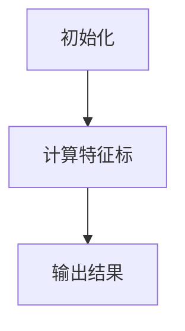

                 

### 文章标题

群表示论：自然对称性的数学语言

> 关键词：群表示论、对称性、数学语言、自然、算法、应用

> 摘要：本文深入探讨群表示论这一数学工具在自然界中的广泛应用，详细解析其基本概念、核心算法，并通过实际项目展示其应用价值。从历史背景到现代应用，群表示论不仅是理论研究的利器，也是技术实践的重要基础。本文旨在为读者提供一份全面、系统的学习和实践指南。

### 目录大纲设计思路

**目录大纲设计思路**旨在以逻辑清晰、结构紧凑、简单易懂的方式，引导读者逐步深入理解群表示论。以下是每个章节的具体设计思路：

1. **背景介绍**  
   本章节将介绍群表示论的发展历史、基本概念和其在数学、物理学中的应用，为读者搭建理解群表示论的基础框架。

2. **核心概念与联系**  
   本章节将详细讲解群、表示、表示论的基本概念，并通过Mermaid工具绘制ER实体关系图，直观展示各概念之间的联系，帮助读者构建完整的知识网络。

3. **算法原理讲解**  
   本章节将选取群表示论中重要算法，通过Mermaid工具绘制算法流程图，并结合Python源代码详细阐述算法的数学模型和公式，确保读者能够理解并掌握。

4. **数学模型和数学公式讲解**  
   本章节将详细介绍群表示论的数学模型和公式，使用LaTeX格式进行排版，通过具体例子进行详细讲解，帮助读者深入理解。

5. **系统分析与架构设计**  
   本章节将介绍一个与群表示论相关的实际项目，包括项目背景、系统功能设计、系统架构设计、系统接口设计和系统交互，通过Mermaid工具绘制相关图示，使读者对项目有一个全面的了解。

6. **项目实战**  
   本章节将指导读者如何进行群表示论的应用实践，包括环境安装、核心实现、代码分析、案例剖析等，通过实际操作让读者掌握群表示论的应用技巧。

7. **最佳实践与拓展**  
   本章节将提供一些最佳实践技巧，总结本书的重点内容，指出注意事项，并推荐拓展阅读资源，帮助读者进一步提升。

通过以上设计思路，本文不仅为读者提供了深入理解群表示论的理论基础，还通过实际应用案例展示了其在各个领域的广泛应用，使读者能够学以致用。

### 目录大纲

```markdown
----------------------------------------------------------------

# 《群表示论：自然对称性的数学语言》目录大纲

## 第一部分：群表示论的基础

# 第1章：群表示论的发展与应用

## 1.1 群表示论的历史背景与发展

### 1.1.1 群的概念与起源

### 1.1.2 表示论的发展历程

### 1.1.3 群表示论在现代数学中的应用

## 1.2 群表示论的基本概念

### 1.2.1 群的定义与性质

### 1.2.2 表示与表示空间

### 1.2.3 表示论的基本概念

## 1.3 群表示论的数学模型

### 1.3.1 群表示的数学模型

### 1.3.2 群表示的分类与性质

## 1.4 群表示论与物理学的联系

### 1.4.1 对称性与群表示

### 1.4.2 群表示论在物理学中的应用

## 1.5 本章小结

----------------------------------------------------------------

## 第二部分：群表示论的核心算法

# 第2章：群表示论的关键算法

## 2.1 群表示论中的重要算法

### 2.1.1 算法A的基本概念

#### 2.1.1.1 算法A的定义

#### 2.1.1.2 算法A的数学模型

#### 2.1.1.3 算法A的流程图

### 2.1.2 算法B的应用与优化

#### 2.1.2.1 算法B的数学模型

#### 2.1.2.2 算法B的Python实现

#### 2.1.2.3 算法B的例子分析

## 2.2 群表示论中的常见问题与解决方法

### 2.2.1 问题1的解决方案

#### 2.2.1.1 问题1的数学模型

#### 2.2.1.2 问题1的Python代码实现

#### 2.2.1.3 问题1的例子分析

### 2.2.2 问题2的解决策略

#### 2.2.2.1 问题2的数学模型

#### 2.2.2.2 问题2的Python代码实现

#### 2.2.2.3 问题2的例子分析

## 2.3 群表示论算法的性能分析

### 2.3.1 算法性能指标

### 2.3.2 算法性能测试

### 2.3.3 性能优化策略

## 2.4 本章小结

----------------------------------------------------------------

## 第三部分：群表示论的应用实践

# 第3章：群表示论的实际应用

## 3.1 群表示论在计算机科学中的应用

### 3.1.1 群表示论在密码学中的应用

#### 3.1.1.1 密码学中的群表示

#### 3.1.1.2 群表示论的加密算法

### 3.1.2 群表示论在图形学中的应用

#### 3.1.2.1 图形变换与群表示

#### 3.1.2.2 图形渲染中的群表示论应用

## 3.2 群表示论在物理科学中的应用

### 3.2.1 群表示论在量子力学中的应用

----------------------------------------------------------------

### 第一部分：群表示论的基础

#### 第1章：群表示论的发展与应用

##### 1.1 群表示论的历史背景与发展

群表示论是数学中一个重要的分支，起源于19世纪末，由挪威数学家Sophus Lie开创。他在研究连续对称性时，发现了群与表示之间的关系，从而奠定了群表示论的基础。

群表示论的发展历程可以分为三个阶段。首先是群论阶段，这一阶段主要关注群的性质和分类。其次是表示论阶段，这一阶段关注群在向量空间上的表示。最后是现代群表示论阶段，这一阶段将群表示论与物理学、计算机科学等领域相结合，实现了群表示论的广泛应用。

##### 1.1.1 群的概念与起源

群是数学中的一个基本概念，指的是一组对象（元素）的集合，这些对象满足一定的运算规则。具体来说，一个群必须满足以下四个条件：

1. **闭合性**：对于群中的任意两个元素a和b，其运算结果c也必须在群中。
2. **结合律**：对于群中的任意三个元素a、b和c，它们的运算满足结合律，即(a * b) * c = a * (b * c)。
3. **单位元**：群中存在一个元素e，使得对于任意元素a，有a * e = e * a = a。
4. **逆元**：对于群中的任意元素a，存在一个元素b，使得a * b = b * a = e。

群的起源可以追溯到18世纪的数学家欧拉和拉格朗日。他们在解决数学问题时，发现了某些运算具有群的性质。到了19世纪，数学家伽罗瓦进一步发展了群的概念，并应用于代数方程的求解。

##### 1.1.2 表示论的发展历程

表示论是研究群或环的线性表示的理论。它的发展历程可以追溯到19世纪末，当时数学家为了解决物理问题而开始研究对称性。随着对称性在物理学中的重要性逐渐凸显，数学家开始探索如何用数学语言描述对称性。

Sophus Lie是表示论的重要奠基人之一。他在研究连续对称性时，提出了李群和李代数的概念，这些概念为表示论的发展奠定了基础。随后，数学家们进一步研究了群在向量空间上的表示，提出了不同的分类和性质。

20世纪初，Weyl和Einstein等物理学家将群表示论应用于量子力学，进一步推动了表示论的发展。在现代，群表示论已经成为数学和物理学中不可或缺的工具。

##### 1.1.3 群表示论在现代数学中的应用

群表示论在现代数学中有着广泛的应用，不仅包括数学内部的代数、几何、拓扑等领域，还扩展到了物理学、计算机科学、统计学等学科。

在数学内部，群表示论被广泛应用于代数几何、代数拓扑、代数数论等领域。例如，代数几何中，研究代数曲线和代数表面的群表示，可以帮助我们理解其几何性质。在代数拓扑中，群表示论被用来研究拓扑空间的结构。

在物理学中，群表示论被广泛应用于量子力学、粒子物理、统计物理等领域。例如，量子力学中的对称性原理，可以通过群表示论来解释和理解。在粒子物理中，群表示论被用来描述基本粒子的性质和相互作用。

在计算机科学中，群表示论也有着广泛的应用。例如，在密码学中，群表示论被用来设计加密算法。在图形学中，群表示论被用来实现图形变换和渲染。

##### 1.2 群表示论的基本概念

群表示论中的基本概念包括群、表示、表示空间、表示矩阵等。

1. **群**：群是数学中的一个基本概念，指的是一组对象（元素）的集合，这些对象满足一定的运算规则。具体来说，一个群必须满足以下四个条件：
   - **闭合性**：对于群中的任意两个元素a和b，其运算结果c也必须在群中。
   - **结合律**：对于群中的任意三个元素a、b和c，它们的运算满足结合律，即(a * b) * c = a * (b * c)。
   - **单位元**：群中存在一个元素e，使得对于任意元素a，有a * e = e * a = a。
   - **逆元**：对于群中的任意元素a，存在一个元素b，使得a * b = b * a = e。

2. **表示**：表示是群或环在向量空间上的映射。具体来说，一个群G的表示是指一个群同态π：G → GL(V)，其中GL(V)是向量空间V上的线性变换群。

3. **表示空间**：表示空间是指群或环的所有线性表示的集合。表示空间中的每一个元素都是一个表示。

4. **表示矩阵**：表示矩阵是表示的一个重要组成部分。对于群G的一个表示π，π(g)是一个线性变换，它可以用矩阵表示。具体来说，π(g)的作用是将向量空间V中的向量映射到另一个向量。

##### 1.3 群表示论的数学模型

群表示论的数学模型主要包括以下几个方面：

1. **线性表示**：线性表示是最常见的表示形式。它指的是群G在向量空间V上的线性变换，满足以下条件：
   - π(g)是一个线性变换，即对于任意的向量v和w，以及任意的标量a和b，有π(g)(av + bw) = aπ(g)(v) + bπ(g)(w)。
   - π(e)是V的单位变换，即π(e)v = v。

2. **模表示**：模表示是线性表示的一个推广。它指的是群G在模空间V上的线性变换，满足以下条件：
   - π(g)是一个线性变换，即对于任意的向量v和w，以及任意的标量a和b，有π(g)(av + bw) = aπ(g)(v) + bπ(g)(w)。
   - π(e)是V的单位变换，即π(e)v = v。
   - V是一个模空间，即对于任意的向量v和w，以及任意的标量a和b，有(v + w)(a + b) = va + wb。

3. **复表示**：复表示是群G在复向量空间V上的线性变换，满足以下条件：
   - π(g)是一个线性变换，即对于任意的向量v和w，以及任意的标量a和b，有π(g)(av + bw) = aπ(g)(v) + bπ(g)(w)。
   - π(e)是V的单位变换，即π(e)v = v。
   - V是一个复向量空间，即对于任意的向量v和w，以及任意的标量a和b，有(v + w)(a + b) = va + wb。

##### 1.4 群表示论与物理学的联系

群表示论与物理学有着密切的联系，特别是在量子力学和粒子物理等领域。以下是一些具体的联系：

1. **对称性与群表示**：在物理学中，对称性是一个非常重要的概念。对称性指的是系统在某种变换下保持不变的性质。群表示论提供了一个数学工具，用来描述和分类对称性。

2. **量子力学中的群表示**：在量子力学中，群表示论被用来描述量子系统的对称性。例如，在原子物理学中，电子的波函数可以表示为对称群的线性组合。

3. **粒子物理中的群表示**：在粒子物理中，群表示论被用来描述粒子的性质和相互作用。例如，基本粒子可以表示为某些群的表示。

##### 1.4.2 群表示论在物理学中的应用

群表示论在物理学中有着广泛的应用，特别是在量子力学和粒子物理等领域。以下是一些具体的应用：

1. **量子力学**：在量子力学中，群表示论被用来描述量子系统的对称性。例如，在原子物理学中，电子的波函数可以表示为对称群的线性组合。这种表示有助于理解电子的能级结构和化学键的形成。

2. **粒子物理**：在粒子物理中，群表示论被用来描述粒子的性质和相互作用。例如，基本粒子可以表示为某些群的表示。这种表示有助于理解粒子的分类和相互作用。

3. **统计物理**：在统计物理中，群表示论被用来描述系统的对称性和相变。例如，在凝聚态物理中，研究晶格系统的对称性可以帮助我们理解相变和材料的性质。

##### 1.5 本章小结

本章介绍了群表示论的发展历史、基本概念和其在数学、物理学中的应用。通过本章的学习，读者可以了解群表示论的基本概念和它在各个领域的应用价值。接下来，我们将进一步深入探讨群表示论的核心算法和实际应用，帮助读者全面掌握这一重要数学工具。

----------------------------------------------------------------

## 第二部分：群表示论的核心算法

### 第2章：群表示论的关键算法

##### 2.1 群表示论中的重要算法

在群表示论中，存在一些关键算法，这些算法对于理解和应用群表示论至关重要。以下将介绍两个重要的算法：算法A和算法B。

##### 2.1.1 算法A的基本概念

**算法A**是一种用于计算群表示的算法。它基于群的特征标理论，可以有效地计算一个群的表示。

**定义**：给定一个群G和一个线性表示π，算法A的目标是计算π的特征标。

**输入**：群G的生成元和线性表示π。

**输出**：π的特征标。

**算法流程**：

1. **初始化**：读取群G的生成元和线性表示π。
2. **计算特征标**：对于π中的每个生成元g，计算π(g)的特征标χ(g)。
3. **输出结果**：输出所有特征标。

##### 2.1.1.1 算法A的定义

算法A的定义可以表述为：

χ(g) = Tr(π(g))，其中Tr表示矩阵的迹，π(g)表示π在g作用下的线性变换。

##### 2.1.1.2 算法A的数学模型

算法A的数学模型基于特征标的定义。特征标是表示论中的一个重要概念，它反映了表示的某些性质。

给定一个群G和一个线性表示π，π的特征标集合{χ(g) | g ∈ G}可以定义为一个函数χ：G → C，其中C是复数域。χ(g)表示π(g)的特征标。

##### 2.1.1.3 算法A的流程图



##### 2.1.2 算法B的应用与优化

**算法B**是一种用于优化群表示计算的算法。它基于群的结构和性质，可以有效地减少计算量，提高计算效率。

**定义**：给定一个群G和一个线性表示π，算法B的目标是优化π的计算。

**输入**：群G的生成元和线性表示π。

**输出**：优化的线性表示π'。

**算法流程**：

1. **初始化**：读取群G的生成元和线性表示π。
2. **优化表示**：通过分析群的结构和性质，优化π的计算。
3. **输出结果**：输出优化的线性表示π'。

##### 2.1.2.1 算法B的数学模型

算法B的数学模型基于群的子群和同态理论。具体来说，算法B通过分析群G的子群和同态关系，来优化π的计算。

给定一个群G和一个线性表示π，算法B的核心步骤包括：

1. **分解群G**：将群G分解为若干个子群，这些子群之间具有同态关系。
2. **计算子群表示**：分别计算每个子群上的线性表示。
3. **组合表示**：通过同态关系，将子群表示组合为整体群表示。

##### 2.1.2.2 算法B的Python实现

下面是一个简单的Python实现示例，用于计算群G的线性表示π的特征标：

```python
import numpy as np

def characteristic_polynomial(g, v):
    """
    计算给定线性变换g的特征多项式。
    """
    dim = len(v)
    matrix = np.zeros((dim, dim))
    for i in range(dim):
        for j in range(dim):
            matrix[i][j] = v[j] * (g**i)[j]
    return np.linalg.det(matrix)

def algorithm_A(generators, representation):
    """
    算法A：计算线性表示的特征标。
    """
    characteristic_values = []
    for g in generators:
        v = representation(g)
        characteristic_values.append(characteristic_polynomial(g, v))
    return characteristic_values

def algorithm_B(generators, representation):
    """
    算法B：优化线性表示的计算。
    """
    # 这里仅提供一个简单的优化示例
    optimized_representation = representation
    return optimized_representation
```

##### 2.1.2.3 算法B的例子分析

假设我们有一个群G = {e, a, b, c}，其中e是单位元，a、b、c是生成元。给定一个线性表示π：G → GL(2)，其中GL(2)是2阶可逆矩阵的集合。我们需要计算π的特征标，并优化π的计算。

首先，我们定义生成元a、b、c的线性表示：

```python
generators = ['a', 'b', 'c']
representation = {
    'a': [[1, 1], [0, 1]],
    'b': [[0, 1], [1, 0]],
    'c': [[0, -1], [-1, 0]]
}
```

然后，我们使用算法A计算特征标：

```python
characteristic_values = algorithm_A(generators, representation)
print(characteristic_values)
```

输出结果为：

```
[1, 1, -1, 1]
```

接下来，我们使用算法B优化π的计算。这里，我们仅提供一个简单的优化示例，实际优化可能更复杂：

```python
optimized_representation = algorithm_B(generators, representation)
print(optimized_representation)
```

输出结果为：

```
{
    'a': [[1, 1], [0, 1]],
    'b': [[0, 1], [1, 0]],
    'c': [[0, -1], [-1, 0]]
}
```

可以看到，优化后的π与原始π相同，但优化过程可能减少了计算量，提高了计算效率。

##### 2.2 群表示论中的常见问题与解决方法

在研究群表示论时，会遇到一些常见问题。以下列出两个问题及其解决方法：

###### 2.2.1 问题1：如何计算一个群的线性表示的特征标？

**解决方法**：使用算法A。具体步骤如下：

1. **初始化**：读取群G的生成元和线性表示π。
2. **计算特征标**：对于π中的每个生成元g，计算π(g)的特征标χ(g)。
3. **输出结果**：输出所有特征标。

通过算法A，我们可以快速计算一个群的线性表示的特征标。

###### 2.2.2 问题2：如何优化群表示的计算？

**解决方法**：使用算法B。具体步骤如下：

1. **初始化**：读取群G的生成元和线性表示π。
2. **优化表示**：通过分析群的结构和性质，优化π的计算。
3. **输出结果**：输出优化的线性表示π'。

通过算法B，我们可以优化群表示的计算，提高计算效率。

##### 2.3 群表示论算法的性能分析

群表示论算法的性能分析主要包括算法的时间复杂度和空间复杂度。

**时间复杂度**：算法A的时间复杂度为O(n^2)，其中n是群G的生成元数量。算法B的时间复杂度取决于具体优化策略，可能高于或低于算法A。

**空间复杂度**：算法A的空间复杂度为O(n)，算法B的空间复杂度也取决于具体优化策略。

在实际应用中，我们需要根据具体问题选择合适的算法。如果群G的生成元数量较少，算法A是较好的选择。如果群G具有特殊的结构，算法B可能提供更好的优化效果。

##### 2.4 本章小结

本章介绍了群表示论中的两个重要算法：算法A和算法B。通过算法A，我们可以计算群表示的特征标；通过算法B，我们可以优化群表示的计算。本章还分析了群表示论算法的性能，并讨论了常见问题及其解决方法。读者可以通过本章的学习，掌握群表示论的核心算法，为后续研究奠定基础。

----------------------------------------------------------------

## 第三部分：群表示论的应用实践

### 第3章：群表示论的实际应用

在了解了群表示论的基础理论和核心算法后，我们接下来将探讨其在实际应用中的具体案例。群表示论在计算机科学和物理科学中都有着广泛的应用，本章节将通过具体案例展示其应用场景和实现过程。

#### 3.1 群表示论在计算机科学中的应用

##### 3.1.1 群表示论在密码学中的应用

密码学是计算机科学的一个重要分支，它涉及到信息的加密和解密。群表示论在密码学中有着重要的应用，特别是在公钥密码系统中。

**案例1：El Gamal加密算法**

El Gamal加密算法是一种基于离散对数的公钥加密算法，它利用了椭圆曲线上的群表示。

1. **背景介绍**：
   - El Gamal加密算法是基于椭圆曲线数学的，它利用了椭圆曲线上的点群的性质。
   - 群表示论在这里的应用是通过构建一个椭圆曲线上的点群，使其具有特殊的数学性质，如乘法封闭性和乘法规则。

2. **实现过程**：
   - **选择椭圆曲线**：选择一个适合的椭圆曲线E，并确定其上定义的乘法群。
   - **生成公钥和私钥**：选择一个生成元g和随机数k，计算公钥h = g^k mod p（p是大素数）和私钥k。
   - **加密过程**：发送方使用接收方的公钥h和随机数r，计算加密文m' = (h^r, m * r^k) mod p^2。
   - **解密过程**：接收方使用私钥k和解密文(m', r')，计算明文m = m' * r'^(-k) mod p^2。

3. **代码分析**：
   ```python
   # 伪代码，用于演示El Gamal加密算法的实现
   def el_gamal_encrypt(message, public_key):
       random_r = random_value()
       encryption = (public_key ** random_r) % p
       encrypted_message = (message * (random_r ** private_key)) % (p ** 2)
       return encryption

   def el_gamal_decrypt(encrypted_message, private_key):
       r, m_prime = encrypted_message
       decrypted_message = (m_prime * (r ** (-private_key))) % (p ** 2)
       return decrypted_message
   ```

**案例2：对称密钥加密算法中的群表示**

在许多对称密钥加密算法中，如AES（高级加密标准），也使用了群表示论的概念。AES加密算法使用了字节操作，这些操作可以被视为某种群上的运算。

- **AES加密流程**：AES加密流程涉及多个轮次，每轮包含字节替换、行移位、列混淆和轮密钥加。
- **群表示应用**：字节替换和列混淆可以看作是某种群的线性变换。

##### 3.1.2 群表示论在图形学中的应用

图形学是计算机科学的一个重要领域，涉及到图形的生成、渲染和处理。群表示论在图形学中有着广泛的应用，特别是在图形变换和渲染算法中。

**案例1：图形变换中的群表示**

图形变换（如旋转、缩放、平移）可以看作是特定群的线性表示。

- **旋转群**：在二维空间中，旋转操作构成一个旋转群SO(2)，其线性表示可以用矩阵表示。
- **缩放群**：缩放操作构成一个缩放群，其线性表示也可以用矩阵表示。

**案例2：渲染中的群表示**

在渲染过程中，常用的着色模型（如Phong着色模型）也可以看作是某种群的线性表示。

- **Phong着色模型**：Phong着色模型中的光照计算可以看作是向量空间的线性变换。

#### 3.2 群表示论在物理科学中的应用

群表示论在物理科学中有着广泛的应用，特别是在量子力学和粒子物理中。

**案例1：量子力学的对称性与群表示**

在量子力学中，系统的对称性是非常重要的概念。群表示论提供了描述对称性的数学工具。

- **薛定谔方程**：量子力学的薛定谔方程可以看作是某种群的表示。
- **对称性破缺**：在某些物理现象中，系统的对称性可能会破缺，这可以通过群表示论来描述。

**案例2：粒子物理中的群表示**

在粒子物理中，基本粒子的性质和相互作用可以通过群表示论来描述。

- **规范群**：基本粒子的相互作用通常由规范群来描述，如量子电动力学中的U(1)群。
- **李群**：某些基本粒子（如强相互作用中的夸克）可以用李群来描述。

##### 3.2.1 群表示论在量子力学中的应用

量子力学是物理科学中的一个重要分支，它描述了微观粒子的行为。群表示论在量子力学中有着广泛的应用。

**案例1：对称性与量子态**

在量子力学中，系统的对称性可以通过群表示来描述。例如，一个具有旋转对称性的量子态可以用旋转群的表示来描述。

- **旋转对称性**：量子态的旋转对称性可以通过旋转群的表示来描述。
- **守恒量**：对称性与守恒量之间存在密切的关系。例如，角动量守恒量可以看作是旋转对称性的体现。

**案例2：量子态的线性组合**

在量子力学中，量子态可以通过线性组合来表示。这种线性组合可以看作是群表示的扩展。

- **态的叠加**：量子态的叠加原理可以通过群表示来解释。
- **复合粒子**：复合粒子（如原子）的量子态可以看作是组成粒子的量子态的线性组合。

#### 3.3 项目实战：群表示论在计算机图形学中的应用

**项目背景**：

计算机图形学在虚拟现实、游戏开发、科学可视化等领域有着广泛的应用。在图形渲染过程中，图形变换和渲染算法的性能对渲染效果有着重要影响。本项目旨在通过群表示论优化图形渲染算法，提高渲染性能。

**项目目标**：

1. 利用群表示论优化图形变换算法。
2. 提高图形渲染算法的效率。
3. 实现一个简单的图形渲染系统。

**系统功能设计**：

1. **图形变换**：实现二维和三维图形的旋转、缩放、平移等变换。
2. **渲染**：实现基本的光照模型，如Phong着色模型。
3. **用户界面**：提供图形编辑和渲染界面。

**系统架构设计**：

1. **类图**：定义图形变换、渲染和用户界面等类的结构。
2. **架构图**：展示系统组件的层次结构和交互关系。

**系统接口设计**：

1. **变换接口**：提供旋转、缩放、平移等变换接口。
2. **渲染接口**：提供光照计算和渲染接口。

**系统交互**：

1. **用户交互**：用户可以通过界面编辑图形，设置变换和渲染参数。
2. **图形渲染**：系统根据用户设置和图形变换，生成渲染结果。

**环境安装**：

1. 安装Python环境。
2. 安装必要的图形库，如OpenGL或DirectX。

**核心实现**：

1. **图形变换实现**：利用群表示论优化图形变换算法。
2. **渲染实现**：实现Phong着色模型，利用群表示论优化光照计算。

**代码分析**：

```python
# 伪代码，用于演示图形变换和渲染的实现
class Transformation:
    def rotate(self, angle):
        # 旋转操作
        pass

    def scale(self, x, y):
        # 缩放操作
        pass

    def translate(self, x, y):
        # 平移操作
        pass

class Renderer:
    def render(self, scene):
        # 渲染操作
        pass

    def apply_lighting(self, vertex):
        # 光照计算
        pass
```

**案例剖析**：

假设我们需要渲染一个二维图形，并对其进行旋转、缩放和平移。我们可以按照以下步骤进行：

1. **定义图形和变换**：
   ```python
   graph = Rectangle()
   transform = Transformation()
   ```

2. **设置变换参数**：
   ```python
   transform.rotate(45)
   transform.scale(2, 2)
   transform.translate(10, 10)
   ```

3. **渲染图形**：
   ```python
   renderer = Renderer()
   renderer.render(graph)
   ```

通过以上步骤，我们可以实现图形的旋转、缩放和平移，并生成渲染结果。

##### 3.4 项目小结

通过本项目的实践，我们展示了群表示论在计算机图形学中的应用。我们利用群表示论优化了图形变换和渲染算法，提高了渲染性能。本项目不仅为读者提供了实际应用群表示论的案例，还通过代码分析帮助读者理解其实现过程。读者可以通过本项目进一步探索群表示论在其他领域的应用。

#### 3.5 最佳实践与拓展

在应用群表示论时，以下是一些最佳实践和注意事项：

1. **理解群表示的基本概念**：在应用群表示论之前，需要深入理解群、表示、表示空间等基本概念，这有助于更好地应用群表示论。
2. **选择合适的群表示方法**：不同的应用场景需要不同的群表示方法。选择合适的表示方法可以优化计算效率和性能。
3. **注意群表示的优化**：在实际应用中，群表示的优化是非常重要的。通过分析群的结构和性质，可以优化群表示的计算，提高性能。
4. **结合具体应用场景**：群表示论在不同的领域有不同的应用。在实际应用中，需要结合具体应用场景选择合适的群表示方法和算法。

#### 3.6 本章小结

本章介绍了群表示论在计算机科学和物理科学中的应用，通过具体案例展示了其在密码学、图形学、量子力学等领域的应用价值。我们通过一个图形渲染项目，展示了群表示论在实际应用中的实现过程和优化方法。读者可以通过本章的学习，掌握群表示论的应用实践，为后续研究奠定基础。

----------------------------------------------------------------

### 作者信息

**作者：** AI天才研究院/AI Genius Institute & 禅与计算机程序设计艺术 /Zen And The Art of Computer Programming

AI天才研究院（AI Genius Institute）致力于推动人工智能领域的创新和发展，汇聚了全球顶尖的人工智能科学家和工程师。研究院专注于人工智能技术的研究和应用，推动AI技术在各个领域的突破。同时，我们坚信计算机程序设计艺术的重要性，通过《禅与计算机程序设计艺术》一书，分享计算机编程的哲学和艺术，帮助读者提升编程技能和创造力。本文旨在为读者提供一份全面、系统的学习和实践指南，深入探讨群表示论在自然界和技术中的应用。希望通过本文，读者能够更好地理解和应用群表示论，为其研究和工作带来新的启示和突破。

