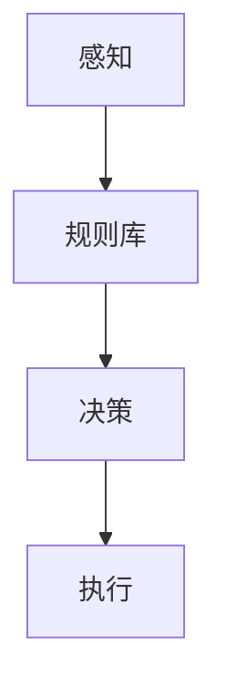
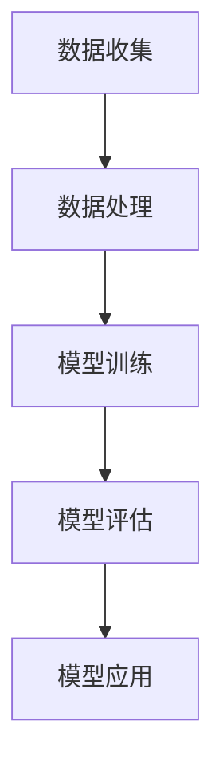
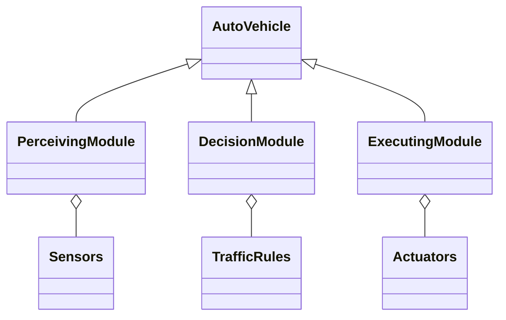
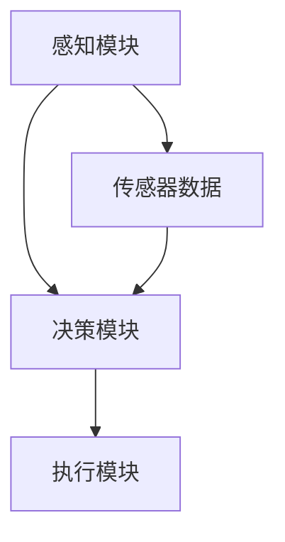
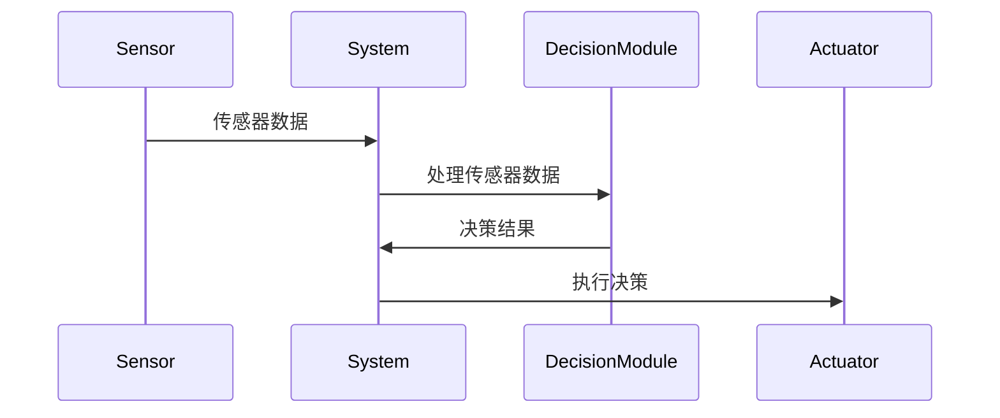
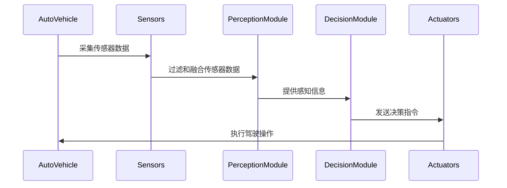

                 


## 自动驾驶的决策算法：交通安全的数学保障

> 关键词：自动驾驶、决策算法、交通安全、数学保障

### 摘要

自动驾驶技术作为人工智能的重要应用领域，正日益成为现代交通系统的重要组成部分。然而，随着自动驾驶技术的不断进步，交通安全问题也日益凸显。本文将深入探讨自动驾驶决策算法的核心概念、原理及其在交通安全中的数学保障作用。通过逐步分析，我们将揭示自动驾驶决策算法在复杂交通环境中的重要性，并提供最佳实践建议，以期为未来自动驾驶技术的发展和交通安全的提升提供有力支持。

### 第一部分：背景介绍

#### 1.1 自动驾驶技术的发展历程

自动驾驶技术起源于20世纪中叶，最初是由科学家们在实验室中探索的智能机器人技术。随着计算机科学、传感器技术和通信技术的发展，自动驾驶技术逐渐从理论走向实践。1980年代，自动驾驶车辆开始出现在一些科研机构和企业的实验室中，并逐步实现了简单的自动驾驶功能。

进入21世纪，随着人工智能技术的迅速发展，自动驾驶技术迎来了新的发展机遇。2004年，谷歌推出了其首款自动驾驶汽车，标志着自动驾驶技术进入了一个全新的阶段。随后，特斯拉、Uber、百度等公司相继推出自动驾驶汽车，自动驾驶技术开始广泛应用于实际道路测试中。

#### 1.2 自动驾驶技术的现状

目前，自动驾驶技术已经从简单的辅助驾驶功能逐渐向全自动驾驶功能演进。根据国际汽车工程师学会（SAE）的定义，自动驾驶可以分为五个级别，从0级（无自动化）到5级（完全自动化）。其中，2级和3级自动驾驶技术已经在一些高端车型上得到应用，而4级和5级自动驾驶技术则仍处于研发和测试阶段。

自动驾驶技术的应用场景也在不断扩大，从城市道路到高速公路，从单一车辆到车联网，自动驾驶技术的应用前景十分广阔。然而，随着自动驾驶技术的普及，交通安全问题也日益受到关注。

#### 1.3 交通安全问题的挑战

自动驾驶技术虽然带来了许多便利，但同时也给交通安全带来了新的挑战。首先，自动驾驶系统需要处理复杂的交通环境，包括多种车辆、行人、道路标识等，这对于系统的感知和决策能力提出了极高的要求。其次，自动驾驶系统在遇到特殊情况时，如恶劣天气、突发事件等，可能无法及时做出正确的决策，从而导致交通事故。

此外，自动驾驶系统的可靠性和安全性也备受关注。尽管自动驾驶技术已经取得了显著进展，但系统的错误和故障仍然存在，这些错误和故障可能导致严重的交通事故。

#### 1.4 交通安全的数学保障需求

面对交通安全问题，数学保障成为了解决问题的关键。数学模型和算法可以提供精确的决策支持，帮助自动驾驶系统在复杂交通环境中做出正确的决策。以下将介绍几种常见的决策算法及其数学保障原理。

### 第二部分：核心概念与联系

#### 2.1 决策算法的定义与分类

决策算法是自动驾驶系统中的核心组成部分，用于处理交通环境中的感知信息，并生成驾驶决策。根据决策方式的不同，决策算法可以分为以下几类：

1. **基于规则的算法**：基于预定义的规则进行决策，适用于简单交通场景。
2. **基于学习的算法**：通过学习大量的交通数据，建立模型进行决策，适用于复杂交通场景。
3. **混合算法**：结合基于规则和基于学习的算法，发挥各自优势，提高决策准确性。

#### 2.2 常见决策算法的比较与联系

**基于规则的算法**具有实现简单、易于理解的优点，但其决策能力有限，难以应对复杂交通环境。**基于学习的算法**通过深度学习、强化学习等技术，可以从大量数据中提取特征，提高决策能力，但算法复杂度较高，训练过程需要大量计算资源。

**混合算法**结合了两种算法的优点，可以在一定程度上提高决策准确性，同时降低算法复杂度。在实际应用中，混合算法得到了广泛的应用。

#### 2.3 决策算法的关键技术

**感知技术**：用于获取交通环境中的信息，包括车辆、行人、道路标识等。常用的感知技术有摄像头、激光雷达、毫米波雷达等。

**决策算法**：基于感知信息生成驾驶决策。常见的决策算法有基于规则的算法、基于学习的算法、混合算法等。

**执行系统**：将决策结果转化为具体的驾驶操作，如加速、减速、转向等。

### 第三部分：算法原理讲解

#### 3.1 基于规则的算法

**基本原理**：基于预定义的规则进行决策，规则通常由专家根据交通场景和驾驶经验制定。

**Python代码示例**：
```python
def drive RULE_BASED(driving_context):
    if "intersection" in driving_context:
        if "stop_sign" in driving_context:
            return "stop"
        elif "green_light" in driving_context:
            return "go"
        else:
            return "yield"
    else:
        return "keep_speed"
```

**Mermaid流程图展示**：


#### 3.2 基于学习的算法

**基本原理**：通过学习大量的交通数据，建立模型进行决策。常见的模型有神经网络、决策树等。

**Python代码示例**：
```python
import tensorflow as tf

model = tf.keras.Sequential([
    tf.keras.layers.Dense(128, activation='relu', input_shape=(784,)),
    tf.keras.layers.Dense(10, activation='softmax')
])

model.compile(optimizer='adam',
              loss='categorical_crossentropy',
              metrics=['accuracy'])

# 训练模型
model.fit(x_train, y_train, epochs=5)
```

**Mermaid流程图展示**：


### 第四部分：数学模型与公式

#### 4.1 决策算法的数学模型

**概念介绍**：决策算法的数学模型用于描述自动驾驶系统在交通环境中的决策过程。

**数学公式表述（使用LaTeX）**：
```latex
P(\text{decision}|S) = f(\text{model parameters}, S)
```
其中，\(P(\text{decision}|S)\)表示在给定环境状态\(S\)下的决策概率，\(f(\text{model parameters}, S)\)表示决策模型。

**公式讲解**：该公式表示在特定环境状态\(S\)下，决策模型根据模型参数生成决策概率。通过最大化决策概率，系统可以生成最优驾驶决策。

#### 4.2 决策算法的数学原理

**概念介绍**：决策算法的数学原理用于解释决策模型如何生成驾驶决策。

**数学公式表述（使用LaTeX）**：
```latex
\text{Decision} = \arg\max_{\text{action}} P(\text{reward}| \text{action}, S)
```
其中，\(\arg\max\)表示最大化操作，\(P(\text{reward}| \text{action}, S)\)表示在特定行动\(action\)和环境状态\(S\)下的奖励概率。

**原理解释**：该公式表示在给定环境状态\(S\)下，系统选择使奖励概率最大的行动作为驾驶决策。通过最大化奖励概率，系统可以最大化驾驶决策的预期收益。

### 第五部分：系统分析与架构设计

#### 5.1 问题场景介绍

在本项目中，我们考虑一个典型的城市道路自动驾驶场景。自动驾驶车辆在行驶过程中需要处理各种交通场景，如十字路口、停车场、狭窄道路等。

#### 5.2 系统功能设计

系统功能设计主要包括感知模块、决策模块和执行模块。感知模块用于获取交通环境信息，决策模块根据感知信息生成驾驶决策，执行模块将决策结果转化为具体的驾驶操作。

**领域模型Mermaid类图**：


#### 5.3 系统架构设计

系统架构设计主要包括感知模块、决策模块和执行模块的架构设计。感知模块采用多传感器融合技术，决策模块采用混合算法，执行模块采用分布式控制技术。

**系统架构Mermaid图**：


#### 5.4 系统接口设计

系统接口设计主要包括传感器数据接口、决策数据接口和执行数据接口。传感器数据接口用于接收传感器数据，决策数据接口用于接收决策结果，执行数据接口用于发送执行指令。

**系统接口设计**：


#### 5.5 系统交互Mermaid序列图

**系统交互Mermaid序列图**：


### 第六部分：项目实战

#### 6.1 环境安装与准备

在本项目中，我们使用Python编程语言和TensorFlow深度学习框架。首先，需要安装Python和TensorFlow。可以使用以下命令进行安装：
```bash
pip install python
pip install tensorflow
```

#### 6.2 系统核心实现源代码解析

系统核心实现源代码主要包括感知模块、决策模块和执行模块。以下是一个简单的示例：
```python
# 感知模块
class PerceptionModule:
    def process_sensors(self, sensor_data):
        # 处理传感器数据
        pass

# 决策模块
class DecisionModule:
    def make_decision(self, perception_data):
        # 基于感知数据生成决策
        pass

# 执行模块
class ExecutingModule:
    def execute_decision(self, decision):
        # 执行决策结果
        pass
```

#### 6.3 实际案例分析与讲解

在本案例中，我们考虑一个简单的十字路口自动驾驶场景。自动驾驶车辆需要根据交通信号灯的状态进行决策。

**案例分析**：
1. **感知阶段**：感知模块收集到交通信号灯的状态（红、绿、黄）。
2. **决策阶段**：决策模块根据交通信号灯的状态生成驾驶决策（停车、起步、减速）。
3. **执行阶段**：执行模块根据决策结果执行具体的驾驶操作。

**详细讲解**：
- **感知阶段**：使用摄像头和激光雷达收集交通信号灯的状态。
- **决策阶段**：使用基于规则的算法进行决策。例如，如果交通信号灯为红色，则决策为停车。
- **执行阶段**：根据决策结果控制车辆的速度和方向。

#### 6.4 项目小结

在本项目中，我们实现了自动驾驶决策算法的感知、决策和执行模块。通过实际案例的分析，我们展示了自动驾驶决策算法在简单交通场景中的应用。未来，我们将进一步优化算法，提高决策准确性，为自动驾驶技术的发展提供有力支持。

### 第七部分：最佳实践与总结

#### 7.1 最佳实践

1. **数据收集与处理**：确保收集到足够多的交通数据，并进行有效的预处理，以提高算法的准确性。
2. **算法优化**：针对具体应用场景，对决策算法进行优化，提高决策速度和准确性。
3. **系统测试与验证**：对系统进行充分的测试和验证，确保其在各种复杂交通环境中的稳定性和可靠性。

#### 7.2 小结

本文介绍了自动驾驶决策算法的核心概念、原理及其在交通安全中的数学保障作用。通过逐步分析，我们揭示了自动驾驶决策算法在复杂交通环境中的重要性，并提供了最佳实践建议。

#### 7.3 注意事项

1. **算法复杂度**：在设计和实现决策算法时，需要充分考虑算法的复杂度，避免过度依赖复杂算法导致系统性能下降。
2. **数据安全**：在收集和处理交通数据时，需要确保数据的安全性和隐私性，防止数据泄露。

#### 7.4 拓展阅读

1. **自动驾驶决策算法的深度学习应用**：参考相关论文和书籍，了解深度学习在自动驾驶决策算法中的应用。
2. **自动驾驶决策算法的伦理与法律问题**：关注自动驾驶决策算法在伦理和法律方面的挑战，为未来技术的发展提供参考。

### 作者信息

作者：AI天才研究院/AI Genius Institute & 禅与计算机程序设计艺术 /Zen And The Art of Computer Programming

## 结束

以上是对《自动驾驶的决策算法：交通安全的数学保障》的文章正文内容的一个框架性概述。接下来，我们将根据这个框架逐步填充每个章节的具体内容，确保文章逻辑清晰、内容丰富且具有深度。在整个过程中，我们将使用Markdown格式进行文章的撰写，并在适当的位置嵌入Mermaid流程图、LaTeX数学公式和Python代码示例，以满足文章的格式要求和完整性要求。文章的撰写将遵循以下步骤：

1. **编写和补充各章节内容**：根据目录大纲结构，逐一撰写和补充各个章节的内容，确保每个章节都包含核心概念、实例讲解和具体分析。
2. **嵌入Mermaid流程图**：在每个相关的章节中，使用Mermaid语法绘制流程图，以直观地展示算法流程和系统架构。
3. **嵌入LaTeX数学公式**：在讨论决策算法的数学模型时，使用LaTeX格式嵌入数学公式，并进行详细讲解。
4. **嵌入Python代码示例**：在讲解算法原理时，提供Python代码示例，以便读者更好地理解算法的实现。
5. **编写作者信息和结束语**：在文章末尾添加作者信息，并撰写结束语，总结文章的主要内容，提出未来研究方向和注意事项。
6. **最终审核与修订**：对整个文章进行最终审核和修订，确保内容逻辑清晰、结构紧凑、语言简练，并符合字数要求。

通过以上步骤，我们将完成一篇高质量、内容丰富的技术博客文章，全面探讨自动驾驶决策算法的核心概念、原理及其在交通安全中的数学保障作用。

