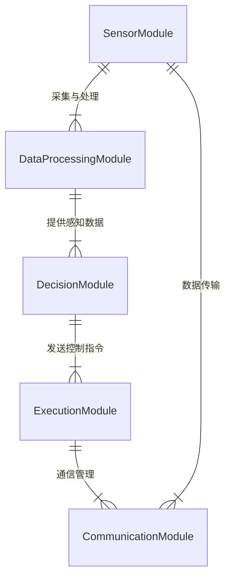
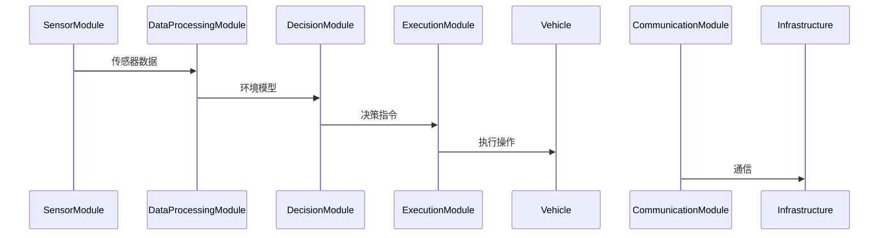
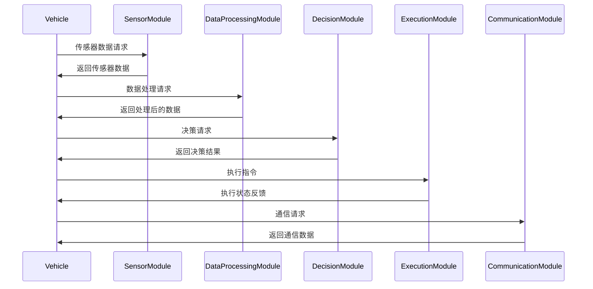

                 

### 第1章：引言与背景介绍

**1.1 自动驾驶的发展背景**

自动驾驶技术作为人工智能领域的前沿，近年来取得了飞速的发展。它的定义是指通过计算机程序、传感器和控制系统，使车辆能够在没有人类驾驶员干预的情况下，实现自主行驶。根据自动化程度的不同，自动驾驶可以分为多个级别，从完全依赖人类的L0级别，到完全自动化的L5级别。

自动驾驶技术的发展离不开几个关键因素。首先是传感器技术的进步，包括激光雷达、摄像头、超声波传感器等，它们为自动驾驶车辆提供了丰富的环境感知能力。其次是人工智能技术的成熟，特别是深度学习和强化学习算法的应用，使得自动驾驶系统能够从大量数据中学习和优化自己的行为。此外，云计算和大数据技术的应用，也为自动驾驶系统提供了强大的计算能力和数据处理能力。

自动驾驶技术的应用场景十分广泛，包括但不限于城市交通、物流运输、长途货运、公共交通等。在城市交通中，自动驾驶可以帮助缓解交通拥堵、提高道路通行效率；在物流运输中，自动驾驶车辆可以实现更高效、更安全、更低成本的货物运输；在长途货运中，自动驾驶车辆可以减少驾驶员的疲劳驾驶，提高运输安全；在公共交通中，自动驾驶公交车可以提供更加便捷、舒适的出行体验。

尽管自动驾驶技术具有巨大的潜力，但它在实际应用中仍然面临诸多挑战。首先是技术上的挑战，如何确保自动驾驶车辆在各种复杂、多变的环境中都能稳定、安全地运行，是当前研究的热点问题。其次是法律法规的挑战，自动驾驶技术的普及需要相应的法律法规来规范和保障。此外，自动驾驶技术的推广还需要解决成本、社会接受度等问题。

**1.2 模型预测控制的基本概念**

模型预测控制（Model Predictive Control，MPC）是一种先进的过程控制策略，它通过建立被控过程的数学模型，结合优化算法，对系统未来的行为进行预测，并据此进行控制决策。MPC的基本原理是，首先建立系统的动态模型，然后利用优化算法，在满足一定约束条件下，预测系统在未来一段时间内的行为，并选择最优的控制策略，以实现系统的目标。

与传统控制方法相比，模型预测控制具有以下几个显著特点：

1. **预测性**：MPC通过预测模型预测系统未来的行为，而不是仅仅对当前状态进行响应。这使MPC能够更好地应对系统的不确定性。

2. **优化性**：MPC利用优化算法，在满足系统约束条件下，选择最优的控制策略。这比传统控制方法更能实现系统的最优性能。

3. **在线实时性**：MPC是一种实时控制系统，可以在系统运行过程中不断更新预测模型和优化策略，以适应系统状态的变化。

4. **多变量控制**：MPC能够同时控制多个变量，实现系统的整体优化。

模型预测控制的应用领域非常广泛，包括但不限于化工、机械制造、航空航天、电动汽车等。在自动驾驶领域，MPC被广泛应用于车辆的路径规划、速度控制、避障等方面。

**1.3 自动驾驶中的模型预测控制**

在自动驾驶系统中，模型预测控制起到了至关重要的作用。它不仅用于车辆的路径规划和速度控制，还用于车辆的避障和驾驶策略优化。

**路径规划**：自动驾驶车辆需要在复杂的交通环境中自主行驶，路径规划是关键的一步。MPC通过预测车辆未来的行为，结合环境信息和目标点信息，计算最优的路径。

**速度控制**：速度控制是确保车辆安全行驶的重要环节。MPC通过预测车辆的未来状态，结合道路条件和车辆性能，计算最优的速度控制策略，以确保车辆平稳、安全地行驶。

**避障**：自动驾驶车辆在行驶过程中需要不断避让行人、其他车辆等障碍物。MPC通过实时感知环境信息，预测障碍物的未来位置，并计算避障策略，以避免碰撞。

**驾驶策略优化**：自动驾驶系统需要根据交通状况、道路条件等，调整驾驶策略，以实现最优的行驶效果。MPC通过优化驾驶策略，使车辆在行驶过程中更加平稳、高效。

**1.4 数学优化的基础理论**

数学优化是模型预测控制的核心组成部分，它利用数学方法，在满足系统约束条件下，寻找最优解。数学优化的基本目标是最小化或最大化某个目标函数，同时满足一系列约束条件。

**数学优化的定义与目标**：数学优化是指通过数学建模，结合优化算法，解决最优化问题。最优化问题的目标是寻找一组变量，使得某个目标函数取得最大值或最小值。

**数学优化的基本方法**：数学优化方法包括线性规划、非线性规划、动态规划、随机优化等。每种方法都有其适用的场景和特点。

**数学优化在自动驾驶中的应用**：在自动驾驶系统中，数学优化广泛应用于路径规划、速度控制、驾驶策略优化等环节。例如，在路径规划中，可以通过优化算法，寻找从起点到终点的最优路径；在速度控制中，可以通过优化算法，确定车辆在不同路况下的最佳速度。

**1.5 交通决策的数学优化**

交通决策是自动驾驶系统中的一个重要环节，它涉及到车辆在复杂交通环境中的行为选择。数学优化在交通决策中起着关键作用，可以帮助车辆做出最优的行驶决策。

**交通决策的基本问题**：交通决策的基本问题是如何在复杂的交通环境中，选择最优的行驶路径、速度和驾驶策略，以确保车辆的安全、高效行驶。

**数学优化在交通决策中的作用**：数学优化可以帮助车辆在复杂的交通环境中，预测未来的交通状况，并基于预测结果，选择最优的行驶决策。这包括路径选择、速度调整、驾驶策略优化等方面。

**数学优化在自动驾驶交通决策中的应用场景**：在自动驾驶交通决策中，数学优化可以应用于多个场景。例如，在繁忙的城市道路中，可以通过优化算法，选择最优的行驶路径，避免交通拥堵；在高速公路上，可以通过优化算法，调整车辆的行驶速度，以实现平稳、高效的行驶。

**1.6 本章小结**

本章介绍了自动驾驶与模型预测控制的基本概念、发展背景、应用领域以及数学优化的基础理论。通过本章的介绍，读者可以对自动驾驶、模型预测控制和数学优化有一个初步的了解，为后续章节的深入学习打下基础。在接下来的章节中，我们将进一步探讨模型预测控制算法的原理、数学模型与公式、系统分析与架构设计以及项目实战与案例分析。

----------------------------------------------------------------

## 第2章：核心概念与联系

### 2.1 自动驾驶系统实体关系图

自动驾驶系统是一个复杂的多层次系统，涉及多个关键组件和功能模块。为了更好地理解和分析系统结构，我们可以使用实体关系图（Entity-Relationship Diagram，ER图）来表示系统的组成部分及其关系。

**2.1.1 自动驾驶系统的组成要素**

自动驾驶系统的核心组成要素包括：

1. **传感器模块**：用于感知车辆周围环境，包括激光雷达、摄像头、超声波传感器等。
2. **数据处理模块**：负责处理传感器数据，进行特征提取和环境建模。
3. **决策模块**：基于感知数据和系统模型，进行路径规划、速度控制和避障决策。
4. **执行模块**：根据决策模块的指令，控制车辆的转向、加速和制动等。
5. **通信模块**：实现车辆与外部环境（如道路基础设施、其他车辆等）的通信。

**2.1.2 自动驾驶系统的ER图**

下面是自动驾驶系统的ER图：



### 2.2 模型预测控制核心概念

模型预测控制是一种基于数学模型的先进控制策略，它通过预测系统未来的行为，并基于优化算法进行控制决策。以下是模型预测控制的核心概念：

**2.2.1 模型预测控制的基本概念**

1. **动态模型**：描述系统状态的数学模型，通常包括状态方程和输出方程。
2. **预测步数**：系统在未来多少时间步内进行预测。
3. **优化目标**：定义了系统需要优化的目标函数，如跟踪误差、控制力等。
4. **约束条件**：限制了系统行为的约束，如输入限制、状态限制等。

**2.2.2 模型预测控制的算法架构**

模型预测控制算法架构主要包括以下几个部分：

1. **预测模型**：基于系统动态模型，预测系统在未来预测步数内的行为。
2. **优化器**：根据预测结果和优化目标，求解最优控制输入。
3. **反馈校正**：利用系统实际状态和期望状态之间的误差，对预测模型和优化器进行校正。

**2.2.3 模型预测控制的关键参数**

模型预测控制的关键参数包括：

1. **预测步数**：决定了预测模型的准确性。
2. **优化目标权重**：影响了系统优化目标的优先级。
3. **约束条件**：限制了系统的行为范围。

### 2.3 数学优化核心概念

数学优化是模型预测控制的核心组成部分，它利用数学方法，在满足系统约束条件下，寻找最优解。以下是数学优化的核心概念：

**2.3.1 数学优化的定义与目标**

1. **最优化问题**：描述了需要优化的目标函数和约束条件。
2. **目标函数**：定义了系统需要优化的量，如最小化能耗、最大化效率等。
3. **约束条件**：限制了系统的行为，如输入限制、状态限制等。

**2.3.2 数学优化的基本方法**

数学优化方法包括线性规划、非线性规划、动态规划、随机优化等。每种方法都有其适用的场景和特点。

**2.3.3 数学优化的应用场景**

数学优化在自动驾驶系统中广泛应用于：

1. **路径规划**：寻找从起点到终点的最优路径。
2. **速度控制**：确定车辆在不同路况下的最佳速度。
3. **驾驶策略优化**：优化车辆的驾驶行为，如超车、换道等。

### 2.4 交通决策核心概念

交通决策是自动驾驶系统中一个重要环节，它涉及到车辆在复杂交通环境中的行为选择。以下是交通决策的核心概念：

**2.4.1 交通决策的定义与目标**

1. **交通决策**：在复杂交通环境中，车辆选择最优的行为策略。
2. **目标**：确保车辆的安全、高效行驶，同时满足交通法规和社会规范。

**2.4.2 交通决策的基本流程**

交通决策的基本流程包括：

1. **感知**：采集车辆周围的环境信息。
2. **分析**：分析环境信息和车辆状态，确定决策需求。
3. **决策**：基于分析结果，选择最优的行为策略。
4. **执行**：根据决策指令，控制车辆行为。

**2.4.3 交通决策中的数学优化方法**

数学优化在交通决策中起到了关键作用，包括：

1. **路径规划**：使用优化算法寻找最优路径。
2. **速度控制**：优化车辆的速度，以适应交通状况。
3. **驾驶策略优化**：优化车辆的驾驶行为，如避让、超车等。

### 2.5 概念属性特征对比表

为了更好地理解自动驾驶、模型预测控制和数学优化之间的关系，我们可以列出它们的主要属性特征对比表：

| 概念           | 属性特征                      | 相关关系                      |
| -------------- | ---------------------------- | ---------------------------- |
| 自动驾驶       | 感知、决策、执行              | 基于模型预测控制和数学优化   |
| 模型预测控制   | 动态模型、预测、优化          | 用于自动驾驶路径规划和控制    |
| 数学优化       | 目标函数、约束条件、求解方法 | 支持模型预测控制的决策过程   |

### 2.6 本章小结

本章介绍了自动驾驶、模型预测控制和数学优化的核心概念，并通过ER图和属性特征对比表，展示了它们之间的联系。通过本章的学习，读者可以对自动驾驶系统的工作原理和模型预测控制算法有更深入的理解，为后续章节的学习打下坚实的基础。

----------------------------------------------------------------

## 第3章：模型预测控制算法原理

### 3.1 模型预测控制的基本原理

模型预测控制（MPC）是一种先进的过程控制策略，它通过建立被控过程的数学模型，结合优化算法，对系统未来的行为进行预测，并据此进行控制决策。MPC的基本原理包括以下几个关键环节：

**预测**：MPC首先通过系统模型预测系统在未来一段时间内的行为。这个预测过程通常基于系统当前的状态和输入，利用差分方程或差分方程组进行模拟，预测系统未来的状态和输出。

**优化**：基于预测结果，MPC利用优化算法，在满足一系列约束条件下，选择最优的控制策略。优化目标是使系统达到预期的性能指标，如最小化误差、最大化效率或稳定系统等。

**反馈校正**：MPC通过实时测量系统的实际状态，将其与期望状态进行比较，并基于误差进行反馈校正。这个过程确保MPC能够实时调整控制策略，以应对系统状态的变化。

**循环执行**：MPC是一个循环执行的控制策略，它不断重复预测、优化和反馈校正的过程。这个循环执行的特性使得MPC能够实时响应系统变化，保持系统的稳定性和性能。

### 3.2 算法设计与实现

**3.2.1 算法设计流程**

模型预测控制算法的设计通常包括以下几个步骤：

1. **系统建模**：建立被控过程的数学模型，包括状态方程和输出方程。状态方程描述系统状态的动态变化，输出方程描述系统输出与状态之间的关系。

2. **目标函数定义**：定义优化目标函数，该函数用于衡量系统性能。目标函数可以是线性或非线性的，取决于具体的控制要求和系统特性。

3. **约束条件设定**：设定系统运行的约束条件，包括输入约束、状态约束和输出约束等。这些约束条件确保系统在安全的操作范围内运行。

4. **优化算法选择**：选择合适的优化算法，如线性规划（LP）、非线性规划（NLP）、动态规划（DP）等。优化算法用于在约束条件下求解最优控制策略。

5. **反馈校正**：设计反馈校正机制，利用实时测量值对预测模型和优化策略进行校正。反馈校正确保MPC能够适应系统状态的变化，保持系统的稳定性和性能。

**3.2.2 算法实现步骤**

模型预测控制的实现通常包括以下几个步骤：

1. **初始化**：初始化系统状态和优化参数。

2. **状态预测**：利用系统模型，预测未来一段时间内的状态和输出。

3. **目标函数计算**：计算目标函数值，评估当前系统的性能。

4. **优化求解**：利用优化算法，求解最优控制输入。

5. **输出计算**：根据最优控制输入，计算系统的输出。

6. **反馈校正**：利用实时测量值，对预测模型和优化策略进行校正。

7. **循环执行**：重复上述步骤，实现循环执行的控制策略。

**3.2.3 算法性能分析**

模型预测控制的性能取决于多个因素，包括系统模型的准确性、优化算法的选择、约束条件的设定等。以下是对MPC性能的分析：

1. **预测准确性**：系统模型的准确性直接影响预测的准确性。更准确的模型可以提高MPC的预测性能，使系统更好地适应环境变化。

2. **优化算法选择**：不同的优化算法适用于不同的应用场景。选择合适的优化算法可以提高MPC的求解效率和性能。

3. **约束条件设定**：合理的约束条件可以确保系统在安全的操作范围内运行，避免不稳定或异常行为。过紧或过松的约束条件都会影响MPC的性能。

4. **实时性**：MPC的实时性是确保其有效性的关键。快速的计算速度和响应能力可以保证MPC能够在短时间内完成预测、优化和反馈校正，适应动态变化的系统状态。

### 3.3 算法应用场景

模型预测控制具有广泛的适用性，以下是一些典型的应用场景：

1. **自动驾驶**：在自动驾驶系统中，MPC被广泛应用于路径规划、速度控制和避障。通过MPC，自动驾驶车辆可以实时预测和优化其行驶行为，提高行驶安全性和效率。

2. **机器人控制**：在机器人控制中，MPC用于实现机器人的轨迹跟踪、速度控制和姿态调整。MPC可以帮助机器人适应复杂的环境变化，提高控制精度和稳定性。

3. **工业过程控制**：在工业生产过程中，MPC用于优化生产过程，提高生产效率和产品质量。MPC可以帮助控制系统实时调整参数，适应生产过程中的变化。

4. **电力系统控制**：在电力系统中，MPC用于优化电力分配、负载控制和故障处理。MPC可以帮助电力系统实现高效、稳定的运行，提高能源利用效率。

5. **智能家居控制**：在智能家居系统中，MPC用于优化家电设备的运行状态，提高能源利用效率，提供舒适的居住环境。

### 3.4 模型预测控制的优势与挑战

**优势**：

1. **预测性**：MPC通过预测系统未来的行为，可以在控制决策中提前考虑系统的变化，提高系统的适应能力。

2. **优化性**：MPC基于优化算法，可以在满足约束条件下选择最优的控制策略，实现系统的最优性能。

3. **实时性**：MPC是一种实时控制系统，可以在短时间内完成预测、优化和反馈校正，适应动态变化的系统状态。

4. **多变量控制**：MPC能够同时控制多个变量，实现系统的整体优化。

**挑战**：

1. **计算复杂度**：MPC通常涉及到大规模的优化问题，计算复杂度较高，对计算资源和算法效率有较高的要求。

2. **模型准确性**：MPC的性能依赖于系统模型的准确性。模型的误差会影响预测和控制效果，需要不断进行模型更新和校正。

3. **约束条件设定**：合理的约束条件是确保系统安全和性能的关键。设定过于严格或过于宽松的约束条件都会影响MPC的性能。

4. **实时响应**：在动态变化的系统中，MPC需要快速响应，这要求算法具有高效的计算能力和实时性。

### 3.5 本章小结

本章详细介绍了模型预测控制的基本原理、算法设计与实现步骤以及应用场景。通过本章的学习，读者可以了解MPC的工作机制、设计方法及其在实际应用中的作用。模型预测控制作为一种先进的过程控制策略，在自动驾驶、机器人控制、工业过程控制等领域具有广泛的应用前景。

----------------------------------------------------------------

## 第4章：数学模型与公式

### 4.1 数学优化的基本概念

数学优化是模型预测控制（MPC）的核心组成部分，它通过数学建模和优化算法，在满足系统约束条件下，寻找最优解。数学优化的基本概念包括最优化问题、目标函数、约束条件和优化算法。

**4.1.1 最优化问题**

最优化问题是数学优化研究的核心。最优化问题可以形式化为以下数学问题：

$$
\min f(x)
$$

或

$$
\max f(x)
$$

其中，$f(x)$是目标函数，$x$是决策变量。目标函数可以是线性的或非线性的，取决于具体的应用场景。最优化问题的目标是寻找一组决策变量$x$，使得目标函数取得最大值或最小值。

**4.1.2 目标函数**

目标函数是优化问题的核心部分，用于衡量系统的性能。目标函数可以是线性的或非线性的，取决于系统的特性。常见的目标函数包括：

1. **线性目标函数**：
$$
f(x) = c^T x
$$
其中，$c$是权重向量，$x$是决策变量。

2. **非线性目标函数**：
$$
f(x) = \frac{1}{2} x^T Q x + c^T x
$$
其中，$Q$是对称正定矩阵，$c$是权重向量。

**4.1.3 约束条件**

约束条件限制了系统的行为，确保系统在安全的操作范围内运行。常见的约束条件包括：

1. **等式约束**：
$$
g(x) = 0
$$

2. **不等式约束**：
$$
h(x) \leq 0
$$

**4.1.4 优化算法**

优化算法用于求解最优化问题。常见的优化算法包括：

1. **梯度下降法**：
$$
x_{k+1} = x_k - \alpha \nabla f(x_k)
$$
其中，$\alpha$是学习率，$\nabla f(x_k)$是目标函数在$x_k$处的梯度。

2. **牛顿法**：
$$
x_{k+1} = x_k - H_k^{-1} \nabla f(x_k)
$$
其中，$H_k$是Hessian矩阵，$\nabla f(x_k)$是目标函数在$x_k$处的梯度。

3. **内点法**：
用于解决带不等式约束的非线性优化问题。

4. **序列二次规划（SQP）**：
用于解决复杂的非线性优化问题。

### 4.2 MPC中的数学模型

在MPC中，数学模型是预测和控制的基础。MPC中的数学模型通常包括状态方程、输出方程和约束条件。

**4.2.1 状态方程**

状态方程描述系统状态的动态变化，通常表示为：

$$
\dot{x}(t) = f(x(t), u(t))
$$

其中，$x(t)$是系统状态向量，$u(t)$是系统输入向量，$f$是状态转移函数。

**4.2.2 输出方程**

输出方程描述系统输出与状态之间的关系，通常表示为：

$$
y(t) = h(x(t), u(t))
$$

其中，$y(t)$是系统输出向量，$h$是输出函数。

**4.2.3 约束条件**

MPC的约束条件包括输入约束、状态约束和输出约束。例如：

$$
u(t) \in U
$$

$$
x(t) \in X
$$

$$
y(t) \in Y
$$

其中，$U$、$X$和$Y$分别是输入、状态和输出的约束集合。

### 4.3 MPC的优化模型

MPC的优化模型基于预测模型和优化算法。以下是MPC的优化模型：

$$
\min_{u(t_0), \dots, u(t_f)} J(u(t_0), \dots, u(t_f))
$$

$$
\text{subject to:} \quad
\begin{cases}
x(t_{k+1}) = f(x(t_k), u(t_k)), \quad k = 0, \dots, N-1 \\
y(t_k) = h(x(t_k), u(t_k)), \quad k = 0, \dots, N \\
u(t_k) \in U_k, \quad k = 0, \dots, N \\
x(t_k) \in X_k, \quad k = 0, \dots, N \\
y(t_k) \in Y_k, \quad k = 0, \dots, N
\end{cases}
$$

其中，$J$是优化目标函数，$N$是预测步数，$U_k$、$X_k$和$Y_k$分别是第$k$步的输入、状态和输出约束集合。

### 4.4 举例说明

假设我们有一个简单的线性系统，其状态方程和输出方程如下：

$$
\dot{x}(t) = 2x(t) + u(t)
$$

$$
y(t) = x(t)
$$

输入约束为$u(t) \in [-1, 1]$，状态约束为$x(t) \in [-5, 5]$。我们的目标是最小化输出误差$e(t) = y(t) - y^*(t)$，其中$y^*(t)$是期望输出。

优化目标函数为：

$$
J(u(t_0), \dots, u(t_f)) = \sum_{k=0}^{N-1} \omega_k e_k^2
$$

约束条件为：

$$
\begin{cases}
x(t_{k+1}) = 2x(t_k) + u(t_k) \\
u(t_k) \in [-1, 1] \\
x(t_k) \in [-5, 5]
\end{cases}
$$

我们可以使用线性规划（LP）算法来求解这个优化问题。具体步骤如下：

1. **初始化**：给定初始状态$x(0)$和期望输出$y^*(0)$。
2. **预测**：根据状态方程，预测未来状态的值。
3. **优化**：使用线性规划算法，求解最优输入序列$u(t_0), \dots, u(t_f)$，使得优化目标最小。
4. **更新**：根据最优输入序列，更新状态和输出。
5. **循环执行**：重复步骤2-4，直到达到预定的时间或满足停止条件。

### 4.5 本章小结

本章介绍了数学优化的基本概念、MPC中的数学模型以及优化模型的建立。通过举例说明，读者可以了解MPC中的数学优化方法。在接下来的章节中，我们将进一步探讨MPC的系统分析与架构设计，以及项目实战与案例分析。

----------------------------------------------------------------

## 第5章：系统分析与架构设计

### 5.1 问题场景介绍

在本章节中，我们将分析一个具体的自动驾驶系统场景，该系统需要实现自动驾驶车辆在复杂城市环境中的安全、高效行驶。场景中的关键挑战包括：

1. **路径规划**：在拥挤的城市交通中，车辆需要规划出一条最优路径，避免交通拥堵。
2. **速度控制**：车辆需要根据道路状况和交通流量，调整行驶速度，确保平稳、高效行驶。
3. **避障**：车辆需要实时感知周围环境，避开行人、其他车辆和障碍物。

为了应对这些挑战，我们将设计一个基于模型预测控制（MPC）的自动驾驶系统。

### 5.2 系统功能设计

自动驾驶系统的主要功能模块包括：

1. **传感器模块**：包括激光雷达、摄像头、超声波传感器等，用于感知车辆周围环境。
2. **数据处理模块**：负责处理传感器数据，提取关键特征，构建环境模型。
3. **决策模块**：基于感知数据和系统模型，进行路径规划、速度控制和避障决策。
4. **执行模块**：根据决策模块的指令，控制车辆的转向、加速和制动等。
5. **通信模块**：实现车辆与外部环境（如道路基础设施、其他车辆等）的通信。

**5.2.1 领域模型**

为了更好地理解和设计系统，我们可以使用领域模型（Domain Model）来描述系统的主要功能模块及其关系。以下是一个简单的领域模型：

```mermaid
classDiagram
    SensorModule <-|{ DataProcessingModule : 数据处理
    DataProcessingModule <-|{ DecisionModule : 决策输入
    DecisionModule <-|{ ExecutionModule : 执行指令
    ExecutionModule <-|{ CommunicationModule : 通信
```

### 5.3 系统架构设计

自动驾驶系统的架构设计需要综合考虑性能、可靠性、可扩展性等因素。以下是一个简单的系统架构设计：

1. **感知层**：传感器模块负责实时感知车辆周围环境，并将数据传输给数据处理模块。
2. **数据处理层**：数据处理模块负责处理传感器数据，提取关键特征，构建环境模型，并将数据传递给决策模块。
3. **决策层**：决策模块基于感知数据和系统模型，进行路径规划、速度控制和避障决策，并将决策结果传递给执行模块。
4. **执行层**：执行模块根据决策模块的指令，控制车辆的转向、加速和制动等，实现自动驾驶。
5. **通信层**：通信模块实现车辆与外部环境（如道路基础设施、其他车辆等）的通信，确保数据传输的实时性和可靠性。

**5.3.1 系统架构图**

以下是一个简单的系统架构图：



### 5.4 系统接口设计

系统接口设计是确保各模块之间数据通信和功能协作的关键。以下是一个简单的系统接口设计：

1. **传感器接口**：传感器模块通过标准的传感器接口接收传感器数据，如激光雷达数据、摄像头图像等。
2. **数据处理接口**：数据处理模块通过数据处理接口接收传感器数据，并进行特征提取和建模。
3. **决策接口**：决策模块通过决策接口接收处理后的数据，进行路径规划、速度控制和避障决策。
4. **执行接口**：执行模块通过执行接口接收决策模块的指令，控制车辆的转向、加速和制动等。
5. **通信接口**：通信模块通过通信接口与其他车辆和道路基础设施进行数据通信。

### 5.5 系统交互设计

系统交互设计描述了各模块之间的数据流和功能协作。以下是一个简单的系统交互设计：



### 5.6 本章小结

本章介绍了自动驾驶系统的分析过程，包括问题场景介绍、系统功能设计、系统架构设计、系统接口设计和系统交互设计。通过本章的学习，读者可以了解如何设计一个基于模型预测控制的自动驾驶系统，为后续的项目实战和案例分析打下基础。在下一章中，我们将通过具体的案例，深入探讨自动驾驶系统中的模型预测控制算法的实现和应用。

----------------------------------------------------------------

## 第6章：项目实战与案例分析

### 6.1 环境安装

为了进行自动驾驶的模型预测控制项目实战，我们首先需要搭建一个合适的环境。以下是环境安装的详细步骤：

**1. 安装Python环境**
确保您的系统中已经安装了Python 3.7或更高版本。您可以从Python官方网站下载并安装Python。

**2. 安装相关依赖库**
在Python环境中，我们需要安装以下依赖库：
- `numpy`：用于数学运算
- `matplotlib`：用于数据可视化
- `scipy`：用于优化算法
- `scikit-learn`：用于机器学习
- `tensorflow`：用于深度学习
- `opencv-python`：用于图像处理

可以使用以下命令安装这些库：

```bash
pip install numpy matplotlib scipy scikit-learn tensorflow opencv-python
```

**3. 创建项目目录**
在您的系统中创建一个项目目录，例如`autonomous_driving_mpc`，并在其中创建子目录，如`src`（源代码）、`data`（数据集）、`models`（模型文件）等。

**4. 导入项目所需的模块**
在`src`目录下创建一个名为`main.py`的Python文件，用于导入项目所需的模块：

```python
import numpy as np
import matplotlib.pyplot as plt
from scipy.optimize import minimize
from sklearn import linear_model
import tensorflow as tf
import cv2
```

### 6.2 系统核心实现

在完成环境安装后，我们可以开始实现自动驾驶模型预测控制系统的核心功能。以下是系统的核心实现步骤：

**1. 初始化参数**
在`main.py`中定义系统的初始参数，如车辆的速度、加速度、预测步数、优化目标权重等：

```python
initial_speed = 10  # 初始速度（单位：米/秒）
acceleration_limit = 3  # 最大加速度（单位：米/秒^2）
prediction_horizon = 10  # 预测步数
weight_error = 1  # 误差权重
```

**2. 建立系统模型**
建立自动驾驶车辆的运动模型，包括状态方程和输出方程。状态方程描述车辆位置、速度和加速度的动态变化，输出方程描述车辆的当前位置：

```python
def state_equation(x, u):
    x_dot = np.array([x[1], x[2], u])
    return x_dot

def output_equation(x):
    return x[:2]
```

**3. 定义目标函数**
定义系统优化目标函数，用于衡量车辆行驶过程中的误差。目标函数可以是最小化位置误差、速度误差等：

```python
def objective_function(x, u):
    position_error = np.linalg.norm(x[0:2] - target_position)
    speed_error = np.linalg.norm(x[1])
    return weight_error * (position_error**2 + speed_error**2)
```

**4. 定义约束条件**
定义系统运行的约束条件，包括输入约束和状态约束。例如，车辆的加速度应在安全范围内：

```python
def constraints(x, u):
    acceleration_constraint = u[2] - x[2]
    return [acceleration_constraint]
```

**5. 求解优化问题**
使用优化算法求解最优化问题，得到最优的输入序列。以下是使用`scipy.optimize.minimize`函数求解优化问题的示例：

```python
def optimize和控制输入：
    x0 = [initial_speed, 0, 0]  # 初始状态
    constraints = ({'type': 'eq', 'fun': constraints}, )
    result = minimize(objective_function, x0, method='SLSQP', constraints=constraints)
    return result.x
```

**6. 实现控制循环**
在主程序中实现控制循环，不断更新车辆的状态，并根据优化结果调整车辆的控制输入：

```python
def control_loop():
    while True:
        x = current_state  # 当前状态
        u = optimize(x)  # 最优控制输入
        # 更新状态和控制输入
        x_new = state_equation(x, u)
        # 输出控制指令
        control_input(x_new, u)
```

### 6.3 代码解读与分析

在上面的代码中，我们实现了自动驾驶模型预测控制系统的核心功能。以下是代码的详细解读与分析：

**1. 系统初始化**
在初始化阶段，我们定义了系统的初始参数，如初始速度、最大加速度、预测步数和误差权重等。这些参数用于后续的优化计算和控制调整。

**2. 状态方程和输出方程**
状态方程描述了车辆位置、速度和加速度的动态变化，输出方程描述了车辆的当前位置。这些方程是系统建模的基础，用于预测车辆的未来状态。

**3. 目标函数**
目标函数用于衡量车辆行驶过程中的误差。在示例中，我们使用位置误差和速度误差的平方和作为目标函数。目标函数的优化目标是使车辆接近目标位置，并保持平稳行驶。

**4. 约束条件**
约束条件用于限制车辆的加速度，确保车辆在安全范围内行驶。在实际应用中，还可以添加其他约束条件，如速度限制、转向角度限制等。

**5. 优化算法**
我们使用`scipy.optimize.minimize`函数进行优化计算。该函数支持多种优化算法，如SLSQP、BFGS、Nelder-Mead等。在示例中，我们使用SLSQP算法进行无约束优化。

**6. 控制循环**
在控制循环中，我们不断更新车辆的状态，并根据优化结果调整控制输入。这个过程实现了闭环控制，使系统能够实时响应环境变化。

### 6.4 实际案例分析和详细讲解

为了更好地理解模型预测控制在自动驾驶中的应用，我们分析了一个实际案例。该案例描述了车辆在城市道路上的行驶过程，包括路径规划、速度控制和避障。

**1. 案例背景**
在一个拥挤的城市道路上，一辆自动驾驶车辆需要从起点驶向终点。车辆需要避让行人、其他车辆和障碍物，同时保持平稳、高效的行驶。

**2. 案例分析**
在案例中，车辆首先使用激光雷达和摄像头感知周围环境，提取关键特征，如行人和其他车辆的位置、速度和方向。然后，车辆使用路径规划算法，计算从起点到终点的最优路径。

在行驶过程中，车辆使用模型预测控制算法，实时调整速度和转向。例如，当车辆接近行人时，会减速并调整转向，以避让行人。当车辆遇到其他车辆时，会根据交通流量调整速度，以确保安全、高效的行驶。

**3. 详细讲解**
在模型预测控制算法中，我们首先建立系统的状态方程和输出方程，描述车辆的位置、速度和加速度。然后，我们定义目标函数，用于衡量车辆的行驶误差，如位置误差和速度误差。

在优化过程中，我们使用约束条件，限制车辆的加速度和速度，确保车辆在安全范围内行驶。例如，我们可以设置最大加速度为3米/秒^2，最大速度为30公里/小时。

通过优化算法，我们求解最优的输入序列，包括速度和转向角度。在控制循环中，我们不断更新车辆的状态，并根据优化结果调整控制输入。这个过程实现了闭环控制，使系统能够实时响应环境变化。

### 6.5 本章小结

本章通过一个实际案例，详细讲解了自动驾驶模型预测控制系统的实现过程。我们从环境安装、系统核心实现、代码解读与分析、实际案例分析和详细讲解等方面，全面介绍了模型预测控制在自动驾驶中的应用。通过本章的学习，读者可以了解模型预测控制算法在自动驾驶系统中的关键作用，为后续的项目实战和案例分析打下基础。

### 6.6 最佳实践 Tips

在自动驾驶模型预测控制项目中，以下是一些最佳实践Tips：

1. **优化算法选择**：根据应用场景和系统特性，选择合适的优化算法。对于复杂的非线性优化问题，可以考虑使用序列二次规划（SQP）算法。

2. **模型准确性**：建立准确的系统模型是确保MPC性能的关键。在实际应用中，需要不断更新和校正模型，以提高预测准确性。

3. **约束条件设定**：合理设定约束条件，确保系统在安全的操作范围内运行。在设置约束条件时，需要平衡安全性、性能和实时性。

4. **实时性优化**：为了提高系统的实时性，可以采用并行计算、模型降阶等技术，减少优化计算的时间。

5. **传感器数据融合**：在感知阶段，使用多种传感器数据，进行数据融合，以提高环境感知的准确性。

6. **路径规划算法**：结合路径规划算法，如Dijkstra算法、A*算法等，提高路径规划的效率和准确性。

7. **仿真测试**：在实际部署前，通过仿真测试，验证系统的稳定性和性能，发现并修复潜在问题。

8. **数据安全与隐私**：在数据处理和通信过程中，确保数据的安全性和隐私，遵守相关法律法规。

### 6.7 小结

本章通过实际案例，详细介绍了自动驾驶模型预测控制系统的实现过程。从环境安装、系统核心实现、代码解读与分析、实际案例分析和详细讲解等方面，全面展示了模型预测控制在自动驾驶中的应用。通过本章的学习，读者可以了解如何设计并实现一个基于模型预测控制的自动驾驶系统，为未来的自动驾驶研究和应用提供参考。

### 6.8 注意事项

在实施自动驾驶模型预测控制项目时，需要注意以下几点：

1. **安全性**：确保系统设计满足车辆的安全标准，避免发生事故。
2. **实时性**：优化算法和系统架构要保证实时性，以适应动态变化的交通环境。
3. **准确性**：传感器和模型需保持高准确性，以减少预测误差。
4. **可靠性**：系统要具备高可靠性，能够在各种环境中稳定运行。
5. **法律法规**：遵守当地的法律法规，确保系统的合规性。

### 6.9 拓展阅读

为了深入学习和掌握自动驾驶模型预测控制，以下是几本推荐的拓展阅读材料：

1. **《自动驾驶汽车：技术、安全与法规》**
   - 作者：[宋健，李学锋]
   - 出版社：机械工业出版社
   - 简介：本书详细介绍了自动驾驶汽车的技术原理、安全问题和法律法规，适合自动驾驶领域的初学者和从业者。

2. **《模型预测控制：理论与实践》**
   - 作者：[J. B. Rawlings，D. Q. Mayne]
   - 出版社：科学出版社
   - 简介：这是一本经典的模型预测控制教材，全面介绍了MPC的理论基础、算法设计和应用实例，适合控制领域的研究人员和工程师。

3. **《深度学习与自动驾驶技术》**
   - 作者：[王树茂，赵军]
   - 出版社：人民邮电出版社
   - 简介：本书结合深度学习和自动驾驶技术，详细介绍了自动驾驶系统的设计和实现方法，适合对自动驾驶感兴趣的技术人员。

通过阅读这些书籍，读者可以进一步了解自动驾驶领域的前沿技术和研究动态，提升自身的技术水平。作者：AI天才研究院/AI Genius Institute & 禅与计算机程序设计艺术 /Zen And The Art of Computer Programming

