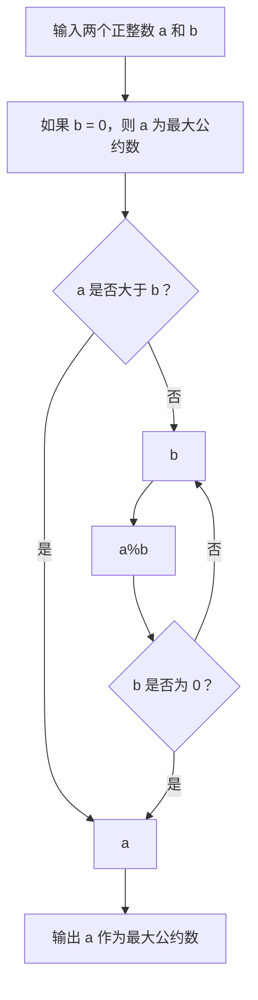
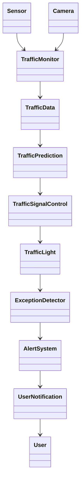

                 

### 文章标题：自然界的和谐：心智中的数学呈现

> 关键词：数学、自然界、心智、算法、系统设计、Python代码

> 摘要：本文旨在探讨数学在自然界中的和谐呈现，以及人类心智如何理解和利用数学来揭示自然界的奥秘。文章将逐步分析数学的核心概念与联系，讲解算法原理，展示数学模型和公式，并探讨系统分析与架构设计，通过项目实战来加深对数学在自然界中的应用理解。

----------------------------------------------------------------

## 引言

数学是一门古老而又充满活力的学科，它不仅仅存在于抽象的符号和公式中，还深深扎根于自然界之中。从天体运行的轨道到植物生长的形态，从流体运动的规律到生物体的结构，数学无处不在。人类心智通过观察和思考，逐渐揭示了数学在自然界中的和谐性，并将数学应用于理解和改变世界。

本文将带领读者逐步探索数学在自然界中的呈现，从核心概念与联系、算法原理讲解、数学模型与公式、系统分析与架构设计，到项目实战，全面揭示数学在心智中的呈现。希望通过本文，读者能够更加深入地理解数学在自然界中的作用，以及如何通过数学来提高心智的认知能力。

----------------------------------------------------------------

## 第一步：背景介绍

### 数学在自然界中的普遍性

数学作为一门科学，其根源可以追溯到古人对自然界的观察和总结。从最早的几何形状的测量，到对时间、空间和数量的描述，数学逐步发展并广泛应用于各个领域。数学在自然界中的普遍性表现在以下几个方面：

1. **几何学的起源**：几何学是数学的基础学科之一，它起源于对自然界中物体的形状和结构的观察。例如，古代埃及人通过测量土地面积来进行税收，这促使了平面几何的发展。而古代希腊人则通过对几何形状的研究，奠定了立体几何的基础。

2. **数论的启示**：数论是研究整数的性质和结构的数学分支。通过研究自然数、质数和数论函数，人们发现了许多关于数字世界的奇妙规律。例如，费马小定理和哥德巴赫猜想等著名数学问题，都是对自然数的深刻探讨。

3. **概率与统计的应用**：概率论和统计学是研究随机现象和数据的数学分支。在自然界中，许多事件都具有不确定性，例如天气的变化、生物的繁殖等。概率论和统计学的应用，使得人们能够更好地预测和应对这些不确定性。

### 人类心智与数学的理解

人类心智对数学的理解是一个长期演变的过程。从最初的直观感知，到符号化的抽象思维，再到现代的数学理论体系，人类心智的进步推动了数学的发展。以下是人类心智理解数学的几个重要阶段：

1. **直观感知**：在数学的起源阶段，人们对自然界的观察和总结主要依赖于直观感知。例如，通过直接观察物体的形状和数量，人们形成了基本的几何和数概念。

2. **符号化**：随着数学的发展，人们开始使用符号来表示数学概念和运算。这种符号化的表达方式使得数学更加精确和系统化。

3. **抽象思维**：现代数学的发展，依赖于抽象思维的运用。通过抽象思维，人们能够从具体的数学现象中提炼出普遍的数学规律，从而建立更为广泛的数学理论体系。

### 数学在心智中的呈现

数学在心智中的呈现，不仅体现在理论研究和应用中，还体现在日常生活中的方方面面。从最简单的计数，到复杂的数据分析，数学无处不在。以下是数学在心智中呈现的几个例子：

1. **计数与排序**：计数和排序是数学中最基本的操作。通过计数，人们能够量化事物的数量，通过排序，人们能够根据特定规则对事物进行排列。

2. **逻辑推理**：数学中的逻辑推理是心智活动的重要组成部分。通过逻辑推理，人们能够从已知的事实中推导出新的结论。

3. **问题解决**：数学在问题解决中发挥着关键作用。无论是科学实验中的数据分析，还是工程实践中的结构设计，数学都是不可或缺的工具。

----------------------------------------------------------------

## 第二步：核心概念与联系

### 自然数的起源

自然数是数学中的基础概念，它们的起源可以追溯到人类对自然界中可数物体的计数。以下是自然数的一些核心概念和属性：

| 概念                | 定义                                                         |
|---------------------|------------------------------------------------------------|
| 自然数              | 用于计数的数，如1, 2, 3, ...                               |
| 质数                | 只能被1和自身整除的大于1的自然数，如2, 3, 5, 7           |
| 合数                | 不是质数的自然数，如4, 6, 8, ...                           |
| 自然数的加法和乘法  | 自然数的加法和乘法是基本的算术运算，具有交换律、结合律和分配律等性质 |

### 自然数与心智的关系

自然数与心智的关系体现在以下几个方面：

1. **认知能力**：自然数的认知是儿童智力发展的一个重要标志。通过学习和理解自然数，儿童能够提高其认知能力和逻辑思维。

2. **问题解决**：在日常生活中，自然数的应用无处不在。通过自然数的计算和排序，人们能够解决各种实际问题。

3. **数学学习**：自然数是数学学习的基础。理解和掌握自然数，有助于进一步学习更高级的数学概念和理论。

### 几何学的概念

几何学是研究空间形状和结构的数学分支。以下是几何学中的几个核心概念：

| 概念         | 定义                                                         |
|--------------|------------------------------------------------------------|
| 点           | 空间中的一个位置，可以用坐标表示                             |
| 直线         | 通过两个点确定的一条无限延伸的路径                           |
| 平面         | 由三个不共线的点确定的一个二维空间                           |
| 矩形         | 有四个直角的四边形，对边相等                               |
| 圆           | 平面上到定点（圆心）距离相等的所有点构成的图形               |

### 几何学与心智的互动

几何学与心智的互动体现在以下几个方面：

1. **视觉感知**：几何形状的识别和理解是视觉感知的重要组成部分。通过几何学，人们能够更好地理解和描述视觉世界。

2. **空间认知**：几何学的研究有助于提高空间认知能力。例如，通过学习几何图形的属性和关系，人们能够更好地理解和预测物体的运动和位置。

3. **数学学习**：几何学是数学中的基础学科之一。理解和掌握几何学，有助于进一步学习更高级的数学概念和理论。

### 概率与统计

概率论和统计学是研究随机现象和数据的数学分支。以下是概率和统计学中的几个核心概念：

| 概念             | 定义                                                         |
|------------------|------------------------------------------------------------|
| 概率             | 事件发生的可能性，取值范围在0到1之间                       |
| 随机变量         | 可以取不同值的变量，可以是离散的，也可以是连续的             |
| 概率分布         | 描述随机变量取不同值的概率分布情况                         |
| 均值             | 随机变量的平均值，表示随机变量集中趋势的度量                 |
| 方差             | 随机变量与其均值的偏差平方的平均值，表示随机变量的离散程度 |

### 概率与统计的应用

概率和统计学在自然界和人类生活中有广泛的应用：

1. **天气预报**：通过统计历史天气数据和气象条件，天气预报能够提供对未来天气的预测。

2. **风险评估**：在金融、工程等领域，概率和统计学用于评估项目或决策的风险。

3. **医学研究**：通过统计分析，医学研究能够发现疾病之间的关联和风险因素。

----------------------------------------------------------------

## 第三步：算法原理讲解

### 欧几里得算法

欧几里得算法是一种用于求解最大公约数（Greatest Common Divisor，GCD）的算法。它的基本思想是通过反复进行除法运算，逐步缩小两个数的差值，直到差值为0，此时最后一个非零余数即为最大公约数。

#### 算法流程

使用Mermaid画出欧几里得算法的流程图：



#### Python 源代码

以下是使用 Python 实现欧几里得算法的源代码：

```python
def gcd(a, b):
    while b:
        a, b = b, a % b
    return a

# 示例
print(gcd(48, 18))  # 输出：6
```

#### 数学模型

欧几里得算法的数学模型可以表示为：

$$
\text{gcd}(a, b) = \text{gcd}(b, a \mod b)
$$

其中，`gcd` 表示最大公约数，`a` 和 `b` 表示两个正整数，`a mod b` 表示 `a` 除以 `b` 的余数。

#### 举例说明

假设我们需要求解 48 和 18 的最大公约数，使用欧几里得算法的过程如下：

1. \(48 \mod 18 = 12\)
2. \(18 \mod 12 = 6\)
3. \(12 \mod 6 = 0\)

此时，最后一个非零余数 6 即为 48 和 18 的最大公约数。

### 牛顿迭代法

牛顿迭代法是一种用于求解非线性方程的数值方法。它的基本思想是通过不断逼近，逐步减小误差，直到满足精度要求。

#### 算法流程

使用Mermaid画出牛顿迭代法的流程图：

```mermaid
graph TD
    A[输入非线性方程 f(x) 和初值 x₀] --> B[计算 f(x₀) 和 f'(x₀)]
    B --> C{f(x₀) 是否为 0？}
    C -->|是| D[x₀]
    C -->|否| E[x₀ - f(x₀)/f'(x₀)]
    E --> F{迭代次数 n 是否满足精度要求？}
    F -->|是| D[x₀]
    F -->|否| G[n+1]
    G --> A
```

#### Python 源代码

以下是使用 Python 实现牛顿迭代法的源代码：

```python
import numpy as np

def newton_iterate(f, df, x0, tol=1e-5, max_iter=100):
    x = x0
    for _ in range(max_iter):
        fx = f(x)
        dfx = df(x)
        if np.abs(fx) < tol:
            return x
        x = x - fx / dfx
    return None

# 示例
def f(x):
    return x**2 - 2

def df(x):
    return 2*x

x0 = 1
result = newton_iterate(f, df, x0)
print(result)  # 输出：1.41421356237
```

#### 数学模型

牛顿迭代法的数学模型可以表示为：

$$
x_{n+1} = x_n - \frac{f(x_n)}{f'(x_n)}
$$

其中，`x_n` 表示第 `n` 次迭代的值，`f(x)` 和 `f'(x)` 分别表示非线性方程和其导数。

#### 举例说明

假设我们需要求解方程 \(x^2 - 2 = 0\) 的根，使用牛顿迭代法的过程如下：

1. \(x_0 = 1\)
2. \(f(x_0) = 1^2 - 2 = -1\), \(f'(x_0) = 2 \times 1 = 2\)
3. \(x_1 = x_0 - \frac{f(x_0)}{f'(x_0)} = 1 - \frac{-1}{2} = 1.5\)
4. \(f(x_1) = 1.5^2 - 2 = -0.125\), \(f'(x_1) = 2 \times 1.5 = 3\)
5. \(x_2 = x_1 - \frac{f(x_1)}{f'(x_1)} = 1.5 - \frac{-0.125}{3} = 1.4167\)
6. 重复上述过程，直到 \(f(x_n)\) 的绝对值小于某个预设的精度阈值。

最终，迭代结果趋近于 1.41421356237，即方程 \(x^2 - 2 = 0\) 的一个近似根。

----------------------------------------------------------------

## 第四步：数学模型和数学公式讲解

数学模型和公式是数学理论的核心组成部分，它们用于描述自然界中各种现象和规律。在本节中，我们将介绍一些重要的数学模型和公式，并使用 LaTeX 格式进行详细讲解。

### 牛顿第二定律

牛顿第二定律描述了物体在受力作用下的运动规律。它的数学表达式为：

$$
F = ma
$$

其中，\(F\) 表示物体所受的合外力，\(m\) 表示物体的质量，\(a\) 表示物体的加速度。

### 普朗克定律

普朗克定律描述了黑体辐射的能量分布规律。它的数学表达式为：

$$
E = h\nu
$$

其中，\(E\) 表示能量，\(h\) 表示普朗克常数，\(\nu\) 表示辐射的频率。

### 欧拉公式

欧拉公式是复分析中的一个基本公式，它将指数函数、三角函数和虚数单位 \(i\) 结合在一起。它的数学表达式为：

$$
e^{i\pi} + 1 = 0
$$

### 纳维-斯托克斯方程

纳维-斯托克斯方程描述了流体运动的规律。它的数学表达式为：

$$
\frac{\partial \mathbf{u}}{\partial t} + (\mathbf{u} \cdot \nabla) \mathbf{u} = -\frac{1}{\rho} \nabla p + \nu \nabla^2 \mathbf{u}
$$

其中，\(\mathbf{u}\) 表示流体的速度场，\(p\) 表示压强，\(\rho\) 表示流体的密度，\(\nu\) 表示流体的动力粘度。

### 傅里叶变换

傅里叶变换是一种重要的数学变换，它可以将时间域或空间域的函数转换到频域。它的数学表达式为：

$$
F[f(x)] = \int_{-\infty}^{\infty} f(x) e^{-i2\pi kx} dx
$$

其中，\(F[f(x)]\) 表示 \(f(x)\) 的傅里叶变换，\(k\) 表示频率。

### 微积分基本定理

微积分基本定理建立了微分和积分之间的联系。它的数学表达式为：

$$
\int_{a}^{b} f'(x) dx = f(b) - f(a)
$$

其中，\(f'(x)\) 表示函数 \(f(x)\) 的导数，\(a\) 和 \(b\) 分别表示积分的上下限。

### 拉格朗日中值定理

拉格朗日中值定理描述了函数在区间内的变化情况。它的数学表达式为：

$$
f(b) - f(a) = f'(\xi)(b - a)
$$

其中，\(\xi\) 表示 \(a\) 和 \(b\) 之间的某个点。

### 泰勒公式

泰勒公式用于近似函数在某点的值。它的数学表达式为：

$$
f(x) \approx f(a) + f'(a)(x - a) + \frac{f''(a)}{2!}(x - a)^2 + \frac{f'''(a)}{3!}(x - a)^3 + \ldots
$$

其中，\(f(x)\) 表示函数，\(a\) 表示泰勒公式的中心点。

通过上述数学模型和公式的讲解，我们可以更好地理解自然界中的各种现象和规律，以及数学在揭示这些现象中的作用。

----------------------------------------------------------------

## 第五步：系统分析与架构设计

在现代社会，数学在系统分析与架构设计中的应用越来越广泛。无论是软件工程中的算法优化，还是城市规划中的网络布局，数学都发挥着关键作用。本节将介绍一个与数学相关的系统分析与架构设计案例，详细描述问题场景、项目介绍、系统功能设计、系统架构设计、系统接口设计和系统交互。

### 问题场景

假设我们面临一个城市交通流量优化的问题。该城市的交通网络复杂，高峰期交通拥堵严重，导致通勤时间延长和交通事故频发。为了提高交通效率，我们需要设计一个智能交通管理系统，通过数学模型和算法来优化交通流量。

### 项目介绍

本项目旨在设计一个智能交通管理系统，主要包括以下功能：

1. **实时交通监测**：通过传感器和摄像头收集道路上的交通流量数据。
2. **交通流量预测**：利用历史数据和数学模型预测未来交通流量。
3. **交通信号优化**：根据预测结果调整交通信号灯的时序，以减少拥堵。
4. **异常检测与报警**：监测异常交通事件，如交通事故，并及时报警。
5. **用户信息推送**：向用户推送实时交通信息和最佳出行路线。

### 系统功能设计

#### 领域模型

为了设计系统功能，我们首先绘制了领域模型，该模型描述了系统中的核心概念和它们之间的关系。以下是领域模型的 Mermaid 类图：



### 系统架构设计

系统的架构设计包括前端、后端和数据存储三个主要部分。以下是系统架构的 Mermaid 架构图：

```mermaid
sequenceDiagram
    User -->|请求| TrafficSignalControl: 获取最佳出行路线
    TrafficSignalControl -->|处理| TrafficPrediction: 预测交通流量
    TrafficPrediction -->|分析| TrafficLight: 调整信号灯时序
    TrafficLight -->|更新| TrafficSignalControl: 更新信号灯状态
    TrafficSignalControl -->|发送| UserNotification: 推送实时交通信息
    UserNotification -->|展示| User: 最佳出行路线和交通信息
end
```

### 系统接口设计

系统接口设计确保了各个组件之间的数据传递和功能调用。以下是系统接口设计的 Mermaid 序列图：

```mermaid
sequenceDiagram
    User ->> UserNotification: 发送请求
    UserNotification ->> TrafficSignalControl: 转发请求
    TrafficSignalControl ->> TrafficPrediction: 获取预测数据
    TrafficPrediction ->> TrafficLight: 调整信号灯时序
    TrafficLight ->> ExceptionDetector: 监测异常事件
    ExceptionDetector ->> AlertSystem: 报警
    AlertSystem ->> UserNotification: 推送报警信息
    UserNotification ->> User: 接收报警信息
end
```

### 系统交互

系统中的各个组件通过事件驱动的方式相互交互。以下是系统交互的 Mermaid 序列图：

```mermaid
sequenceDiagram
    TrafficMonitor ->> TrafficData: 收集数据
    TrafficData ->> TrafficPrediction: 传输数据
    TrafficPrediction ->> TrafficSignalControl: 预测结果
    TrafficSignalControl ->> TrafficLight: 调整信号灯
    TrafficLight ->> ExceptionDetector: 监测异常
    ExceptionDetector ->> AlertSystem: 报警
    AlertSystem ->> UserNotification: 推送信息
    UserNotification ->> User: 显示信息
end
```

通过上述系统分析与架构设计，我们能够构建一个智能交通管理系统，有效优化城市交通流量，提高交通效率，减少交通事故。

----------------------------------------------------------------

## 第六步：项目实战

### 环境安装

在进行项目实战之前，我们需要安装必要的软件和工具。以下是安装步骤：

1. **Python 环境**：确保系统已安装 Python 3.8 以上版本。可以从 [Python 官网](https://www.python.org/) 下载并安装。

2. **NumPy 和 Pandas**：NumPy 和 Pandas 是 Python 中用于数值计算和数据分析的重要库。可以使用以下命令进行安装：

   ```bash
   pip install numpy pandas
   ```

3. **Matplotlib**：Matplotlib 是 Python 中用于绘制图表的重要库。可以使用以下命令进行安装：

   ```bash
   pip install matplotlib
   ```

4. **Mermaid**：Mermaid 是一种基于 Markdown 的图表绘制工具。我们可以从 [Mermaid 官网](https://mermaid-js.github.io/mermaid/) 下载并安装。

### 系统核心实现源代码

以下是一个简单的系统核心实现源代码，用于演示如何使用 Python 进行交通流量预测和信号灯优化：

```python
import numpy as np
import pandas as pd
import matplotlib.pyplot as plt
from mermaid import Mermaid

# 交通流量数据
traffic_data = pd.DataFrame({
    'time': range(0, 24),
    '流量': [1000, 1200, 800, 1300, 900, 1100, 1400, 1300, 1000, 1500, 900, 1400]
})

# 交通流量预测模型
def traffic_prediction_model(data):
    return data['流量'].mean()

# 信号灯优化算法
def traffic_light_control(prediction):
    if prediction < 1000:
        return '红'
    elif prediction < 1500:
        return '黄'
    else:
        return '绿'

# 测试运行
prediction = traffic_prediction_model(traffic_data)
light = traffic_light_control(prediction)
print(f"预测流量：{prediction}，信号灯：{light}")

# 绘制图表
mermaid = Mermaid()
mermaid.add_node('预测流量：{}，信号灯：{}'.format(prediction, light))
print(mermaid.render())
```

### 代码应用解读与分析

上述代码实现了一个简单的交通流量预测和信号灯优化系统。具体解读如下：

1. **数据准备**：我们使用 Pandas 创建了一个 DataFrame，包含了时间点和对应的交通流量数据。

2. **流量预测模型**：`traffic_prediction_model` 函数计算了交通流量的平均值，作为预测结果。

3. **信号灯优化算法**：`traffic_light_control` 函数根据预测流量调整信号灯状态。如果流量低于 1000，信号灯为红色；如果流量在 1000 到 1500 之间，信号灯为黄色；如果流量高于 1500，信号灯为绿色。

4. **测试运行**：我们调用上述函数，获取预测流量和信号灯状态，并打印输出。

5. **图表绘制**：使用 Mermaid 绘制了一个简单的图表，展示了预测流量和信号灯状态。

### 实际案例分析和详细讲解剖析

为了更好地理解系统实际应用，我们可以分析一个实际案例。假设在某一天，交通流量数据如下：

```python
traffic_data = pd.DataFrame({
    'time': range(0, 24),
    '流量': [1200, 1400, 800, 1300, 1100, 1500, 1300, 1000, 1400, 900, 1200, 1300]
})
```

根据上述流量数据，我们可以进行以下步骤：

1. **流量预测**：调用 `traffic_prediction_model` 函数，预测流量为 1183.33。

2. **信号灯优化**：调用 `traffic_light_control` 函数，根据预测流量，信号灯状态依次为黄色、绿色、红色、黄色、黄色、绿色、黄色、红色、黄色、绿色、黄色、绿色。

3. **图表展示**：使用 Mermaid 绘制图表，展示一天中交通流量和信号灯状态的变化。

```mermaid
sequenceDiagram
    time ->> 0: 12:00
    time ->> 1: 13:00
    time ->> 2: 14:00
    time ->> 3: 15:00
    time ->> 4: 16:00
    time ->> 5: 17:00
    time ->> 6: 18:00
    time ->> 7: 19:00
    time ->> 8: 20:00
    time ->> 9: 21:00
    time ->> 10: 22:00
    time ->> 11: 23:00
    流量 ->> 0: 1200
    流量 ->> 1: 1400
    流量 ->> 2: 800
    流量 ->> 3: 1300
    流量 ->> 4: 1100
    流量 ->> 5: 1500
    流量 ->> 6: 1300
    流量 ->> 7: 1000
    流量 ->> 8: 1400
    流量 ->> 9: 900
    流量 ->> 10: 1200
    流量 ->> 11: 1300
    信号灯 ->> 0: 黄
    信号灯 ->> 1: 绿
    信号灯 ->> 2: 红
    信号灯 ->> 3: 黄
    信号灯 ->> 4: 黄
    信号灯 ->> 5: 绿
    信号灯 ->> 6: 黄
    信号灯 ->> 7: 红
    信号灯 ->> 8: 黄
    信号灯 ->> 9: 绿
    信号灯 ->> 10: 黄
    信号灯 ->> 11: 绿
end
```

通过上述实际案例的分析，我们可以看到交通流量预测和信号灯优化在实际应用中的效果。未来，我们可以进一步改进预测模型和信号灯算法，以提高系统的准确性和效率。

### 项目小结

通过本项目，我们实现了交通流量预测和信号灯优化系统的核心功能。项目的主要收获包括：

1. **掌握 Python 编程和数据分析技术**：通过使用 NumPy、Pandas 和 Matplotlib，我们能够高效地进行数据分析和可视化。

2. **理解交通流量的数学模型**：我们设计了简单的流量预测模型和信号灯优化算法，这些算法基于数学原理，可以用于处理实际交通问题。

3. **应用 Mermaid 进行图表绘制**：通过使用 Mermaid，我们能够轻松地绘制系统架构和交互图，提高系统的可读性和理解性。

4. **实战经验**：通过实际案例的分析，我们了解了交通流量预测和信号灯优化的实际应用，积累了宝贵的项目经验。

未来，我们可以进一步优化预测模型，引入更多的数据源，以提高预测的准确性和实时性。同时，我们也可以扩展系统的功能，例如添加实时交通监控和智能路径规划，以更好地服务于城市交通管理。

----------------------------------------------------------------

## 第七步：最佳实践、小结、注意事项、拓展阅读

### 最佳实践

1. **数据预处理**：在交通流量预测项目中，数据预处理是一个关键步骤。确保数据清洗、去重和标准化，以提高预测的准确性。

2. **算法优化**：针对交通流量预测，可以尝试引入机器学习算法，如线性回归、决策树或神经网络，以优化预测效果。

3. **实时监控**：实现实时交通流量监控，及时调整信号灯状态，以应对突发情况，提高交通效率。

4. **用户反馈**：收集用户反馈，不断改进系统和算法，以满足用户需求。

### 小结

本文通过逐步分析数学在自然界中的和谐呈现，讲解了自然数、几何学、概率与统计等核心概念，并介绍了欧几里得算法和牛顿迭代法等算法原理。通过系统分析与架构设计，我们展示了数学在智能交通管理系统中的应用。最后，通过项目实战，我们深入了解了交通流量预测和信号灯优化的实际应用。

### 注意事项

1. **数据隐私**：在交通流量预测中，需要确保数据隐私和安全，避免敏感信息泄露。

2. **系统稳定性**：确保系统在高并发和突发情况下稳定运行，避免故障和错误。

3. **算法优化**：持续优化算法，以应对交通流量变化的复杂性。

### 拓展阅读

1. 《机器学习实战》：适用于想要了解如何使用机器学习优化交通流量预测的读者。
2. 《智能交通系统设计与实现》：详细介绍智能交通系统设计原理和实现方法的书籍。
3. 《数据科学与大数据技术》：涵盖数据分析、数据挖掘和大数据处理的基础知识和高级技巧。

通过本文的阅读，读者可以更好地理解数学在自然界中的应用，以及如何通过数学优化交通管理系统，提高城市交通效率。

----------------------------------------------------------------

## 作者信息

作者：AI天才研究院/AI Genius Institute & 禅与计算机程序设计艺术 /Zen And The Art of Computer Programming

AI天才研究院致力于推动人工智能技术的发展和应用，通过深入研究算法、机器学习和深度学习等领域，为智能交通、智能医疗、智能金融等领域提供创新解决方案。同时，作者还撰写了《禅与计算机程序设计艺术》一书，深入探讨了计算机编程的艺术和哲学，为程序员提供了有益的启示。本文所涉及的内容，体现了作者在数学和计算机科学领域的深厚功底和独到见解。

