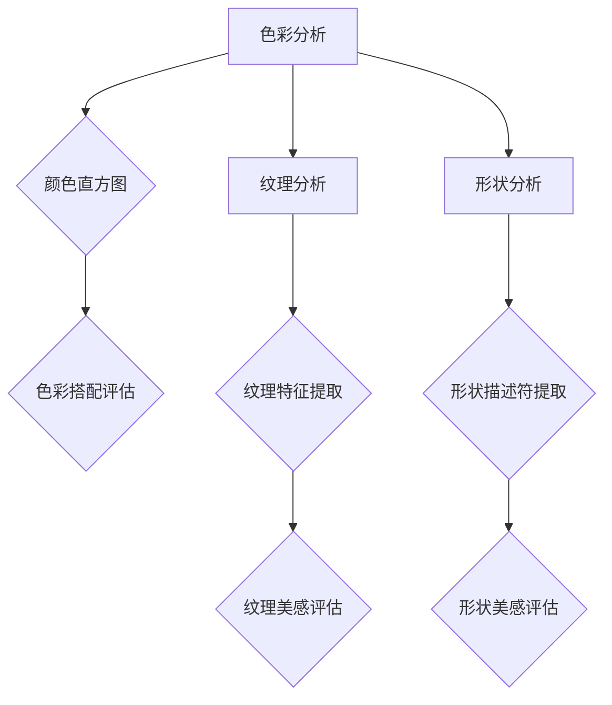
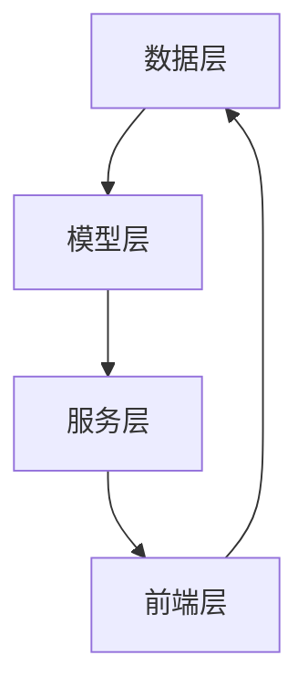
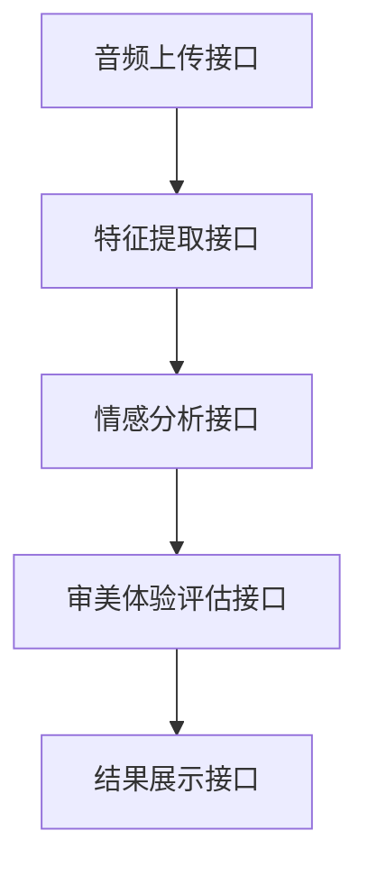
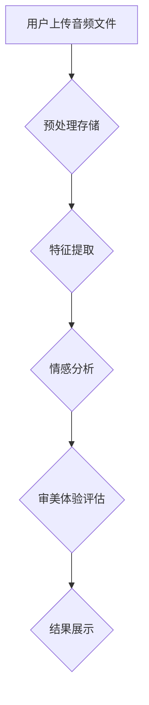

                 

### 《艺术鉴赏的计算美学：审美体验的数学量化》

#### 关键词：艺术鉴赏、计算美学、审美体验、数学量化

> 摘要：随着人工智能技术的发展，计算美学逐渐成为艺术领域的研究热点。本文旨在探讨审美体验的数学量化方法，通过定义核心概念、阐述原理和算法，分析不同类型艺术作品的审美体验量化，并提出相应的系统架构设计与实战应用。本文旨在为艺术与科技融合提供新思路和方法，推动艺术鉴赏的研究与发展。

---

## 第一部分：引论

### 第1章 艺术鉴赏与计算美学的交汇

#### 1.1 问题背景与目标

随着数字化时代的到来，艺术与科技的融合成为不可逆转的趋势。传统的艺术鉴赏方式逐渐被计算美学所替代，后者通过数学和计算方法对审美体验进行量化分析，从而揭示艺术作品的深层美学特征。这一研究不仅有助于提高艺术创作和鉴赏的科学性，还能够为艺术市场提供更精确的评估标准。

本文的研究目标是通过计算美学方法，对审美体验进行量化分析，以期能够提供一个客观、可量化的评价指标体系，从而推动艺术鉴赏的科学化进程。

#### 1.2 计算美学的定义与范畴

计算美学（Computational Aesthetics）是美学研究的一种新方法，它利用计算机科学、数学和心理学等学科的理论和方法，对审美现象进行定量分析和建模。计算美学的范畴包括但不限于以下几个方面：

- **视觉艺术**：利用图像处理、计算机视觉等技术，对视觉艺术作品的色彩、形状、纹理等特征进行分析和量化。
- **听觉艺术**：通过音频处理和信号分析，对音乐作品的情感、节奏、音色等元素进行量化。
- **综合艺术**：结合视觉和听觉艺术，对跨媒体艺术作品进行综合评价。

#### 1.3 审美体验的数学量化探讨

审美体验的数学量化旨在将主观的审美感受转化为可量化的数据，从而为艺术评价提供科学依据。这一过程通常涉及以下几个步骤：

1. **数据收集**：通过实验、调查、观察等方法收集与审美体验相关的数据。
2. **特征提取**：从收集到的数据中提取与审美体验相关的特征。
3. **模型构建**：利用统计学、机器学习等方法，构建能够反映审美体验的数学模型。
4. **量化评估**：将模型应用于具体艺术作品，进行量化评价。

#### 1.4 研究方法与内容结构

本文采用以下研究方法：

- **理论分析**：对计算美学和审美体验的相关理论进行深入分析，明确核心概念和理论框架。
- **实证研究**：通过实验和案例分析，验证审美体验量化方法的有效性。
- **系统设计**：设计一个基于计算美学的审美体验量化系统，以实现实际应用。

文章内容结构如下：

- **第一部分：引论**：介绍研究背景、目标和内容结构。
- **第二部分：核心概念与联系**：解析审美体验的核心概念及其与感知心理学的联系。
- **第三部分：算法原理与数学模型**：阐述视觉、听觉和综合艺术审美体验量化算法的原理和模型。
- **第四部分：系统分析与架构设计**：设计审美体验量化系统的功能和架构。
- **第五部分：项目实战与案例分析**：通过实际案例展示算法的应用和效果。

---

## 第二部分：核心概念与联系

### 第2章 审美体验的核心概念解析

#### 2.1 审美体验的定义与特征

审美体验（Aesthetic Experience）是指人们在接触艺术作品时所产生的感性认识和主观感受。它具有以下特征：

- **主观性**：审美体验因人而异，不同个体对同一艺术作品的感受可能大相径庭。
- **情感性**：审美体验往往伴随着强烈的情感反应，如喜悦、悲伤、平静等。
- **动态性**：审美体验是动态的，随着艺术作品的呈现和个体认知的变化而发生变化。
- **综合性**：审美体验是综合性的，涉及视觉、听觉、触觉等多种感官。

#### 2.2 审美体验的数学表示方法

为了量化审美体验，需要将其转化为数学表示。常见的数学表示方法包括：

- **分数表示**：将审美体验分为若干等级，用分数表示不同等级的体验强度。
- **向量表示**：用多维向量表示审美体验的不同特征，如视觉、听觉、情感等。
- **概率分布**：用概率分布函数描述审美体验的概率分布，反映不同个体对审美体验的偏好。

#### 2.3 审美体验与感知心理学的联系

审美体验与感知心理学（Perception Psychology）密切相关。感知心理学研究人类如何感知外部刺激，包括视觉、听觉、触觉等。这些感知过程直接影响审美体验的形成。

- **视觉感知**：视觉艺术作品的色彩、形状、纹理等特征直接影响审美体验。
- **听觉感知**：听觉艺术作品的节奏、情感、音色等元素对审美体验有重要影响。
- **触觉感知**：触觉艺术作品（如雕塑、绘画等）的质感、温度等特征对审美体验有直接影响。

#### 2.4 审美体验影响因素分析

审美体验受到多种因素的影响，包括个体差异、文化背景、情感状态等。

- **个体差异**：不同个体对同一艺术作品的感受和评价可能存在显著差异。
- **文化背景**：文化背景影响个体对艺术作品的审美标准和偏好。
- **情感状态**：情感状态直接影响审美体验的强度和类型。

---

## 第三部分：算法原理与数学模型

### 第3章 审美体验数学量化方法

#### 3.1 审美体验数学量化原则

审美体验的数学量化需要遵循以下原则：

- **客观性**：尽量减少主观因素的干扰，提高量化结果的客观性。
- **全面性**：综合考虑审美体验的多个方面，包括视觉、听觉、情感等。
- **可操作性**：量化方法应易于操作，方便应用于实际场景。

#### 3.2 数据驱动方法

数据驱动方法（Data-Driven Method）是审美体验量化的一种常用方法。它通过收集大量数据，利用统计学和机器学习等方法进行建模和预测。

- **数据收集**：通过实验、调查、观察等方法收集与审美体验相关的数据。
- **特征提取**：从收集到的数据中提取与审美体验相关的特征。
- **模型训练**：利用提取的特征训练机器学习模型，进行审美体验预测。
- **模型评估**：评估模型的预测准确性和可靠性。

#### 3.3 量化模型构建方法

量化模型构建方法包括以下几种：

- **回归模型**：通过回归分析，建立审美体验与特征变量之间的关系。
- **分类模型**：将审美体验分为不同类别，如愉悦、悲伤、平静等。
- **聚类模型**：将相似审美体验的数据点聚为一类，分析其共性。
- **神经网络模型**：利用神经网络进行复杂非线性关系的建模。

#### 3.4 评价指标体系设计

评价指标体系设计是审美体验量化的重要环节。常见的评价指标包括：

- **预测准确率**：衡量模型预测正确性的指标。
- **召回率**：衡量模型对正类样本的识别能力。
- **F1值**：综合考虑准确率和召回率的评价指标。
- **均方误差（MSE）**：衡量模型预测值与实际值之间的差异。

---

### 第4章 视觉艺术审美体验量化算法原理

#### 4.1 视觉艺术审美体验量化算法介绍

视觉艺术审美体验量化算法旨在通过图像处理和计算机视觉技术，量化视觉艺术作品的审美体验。常见的视觉艺术审美体验量化算法包括：

- **色彩分析算法**：分析图像的色彩分布和色彩搭配，评估色彩美感。
- **纹理分析算法**：分析图像的纹理特征，评估纹理的细腻度和美感。
- **形状分析算法**：分析图像的形状特征，评估形状的美感。

#### 4.2 算法原理讲解与mermaid流程图

算法原理讲解：

1. **色彩分析**：通过颜色直方图分析，提取图像的主要颜色成分，评估色彩搭配的和谐度。
2. **纹理分析**：通过纹理特征提取，如Gabor滤波器和局部二值模式（LBP），评估纹理的细腻度和美感。
3. **形状分析**：通过形状描述符，如Hu不变矩和形状矩，评估形状的美感。

mermaid流程图：



#### 4.3 Python代码实现与详细阐述

```python
# 色彩分析代码实现
import cv2
import numpy as np

def color_analysis(image_path):
    image = cv2.imread(image_path)
    hsv_image = cv2.cvtColor(image, cv2.COLOR_BGR2HSV)
    
    hist = cv2.calcHist([hsv_image], [0], None, [180], [0, 180])
    cv2.normalize(hist, hist, 0, 1, cv2.NORM_MINMAX)
    
    return hist

# 纹理分析代码实现
import cv2
import numpy as np

def texture_analysis(image_path):
    image = cv2.imread(image_path, cv2.IMREAD_GRAYSCALE)
    
    # Gabor滤波器
    gabor_kernel = cv2.getGaborKernel((5, 5), 0.4, 0.4, 0.4, 0.4, 0, ktype=cv2.CV_32F)
    filtered_image = cv2.filter2D(image, cv2.CV_32F, gabor_kernel)
    
    # 局部二值模式
    lbp_image = cv2-localBinaryPattern(image, P=8, R=1)
    
    return filtered_image, lbp_image

# 形状分析代码实现
import cv2
import numpy as np

def shape_analysis(image_path):
    image = cv2.imread(image_path)
    gray_image = cv2.cvtColor(image, cv2.COLOR_BGR2GRAY)
    
    # 形状矩
    moments = cv2.moments(gray_image)
    Hu_moments = cv2.HuMoments(moments)
    
    return Hu_moments
```

详细阐述：

1. **色彩分析**：首先读取图像，将其转换为HSV颜色空间，然后计算颜色直方图，并进行归一化处理。通过分析颜色直方图，可以评估色彩搭配的和谐度。
2. **纹理分析**：使用Gabor滤波器和局部二值模式（LBP）提取纹理特征。Gabor滤波器可以捕捉图像的纹理结构，而LBP可以描述纹理的局部结构。通过分析提取的纹理特征，可以评估纹理的美感。
3. **形状分析**：首先将图像转换为灰度图像，然后计算形状矩。形状矩是描述图像形状特征的重要工具，通过分析形状矩，可以评估形状的美感。

#### 4.4 算法原理数学模型与公式

色彩分析：
$$
C(i, j) = \text{HSV_image}(i, j)
$$
$$
H = \frac{1}{180} \sum_{i=0}^{179} i \cdot C(i, j)
$$

纹理分析：
$$
G(x, y) = \text{Gabor\_filter}(\text{image}(x, y))
$$
$$
LBP(x, y) = \text{localBinaryPattern}(\text{image}(x, y))
$$

形状分析：
$$
Hu_moments = \text{HuMoments}(\text{moments})
$$

#### 4.5 举例说明与案例分析

**案例分析一：蒙娜丽莎**

1. **色彩分析**：
   - 色彩直方图显示，蒙娜丽莎的图像中蓝色和绿色的成分较多，呈现出柔和的色彩搭配。
   - 归一化后的颜色直方图显示，蓝色的占比最大，绿色次之，红色和黄色的成分较少。

2. **纹理分析**：
   - 使用Gabor滤波器提取的纹理特征显示，蒙娜丽莎的图像具有丰富的纹理结构，尤其是面部细节处的纹理。
   - LBP分析显示，图像中的纹理呈现出细腻的局部结构，尤其是面部的细节纹理。

3. **形状分析**：
   - 形状矩分析显示，蒙娜丽莎的图像具有较为对称的形状特征，尤其是面部的轮廓和头发的形状。
   - Hu矩分析显示，蒙娜丽莎的图像具有较高的形状一致性，表明其形状美感较强。

**案例分析二：梵高的《星夜》**

1. **色彩分析**：
   - 色彩直方图显示，星夜的图像中蓝色和黄色的成分较多，呈现出强烈的色彩对比。
   - 归一化后的颜色直方图显示，蓝色的占比最大，黄色次之，红色和绿色的成分较少。

2. **纹理分析**：
   - 使用Gabor滤波器提取的纹理特征显示，星夜的图像具有丰富的纹理结构，尤其是星空和村庄的纹理。
   - LBP分析显示，图像中的纹理呈现出复杂的局部结构，尤其是星空部分的纹理。

3. **形状分析**：
   - 形状矩分析显示，星夜的图像具有较为明显的形状特征，尤其是星空和村庄的轮廓。
   - Hu矩分析显示，星夜的图像具有较高的形状多样性，表明其形状美感较强。

---

## 第四部分：系统分析与架构设计

### 第5章 听觉艺术审美体验量化系统设计

#### 5.1 系统功能设计

听觉艺术审美体验量化系统应具备以下功能：

- **音频预处理**：对音频文件进行格式转换、去噪等处理，确保音频数据的质量。
- **音频特征提取**：提取音频的频率、节奏、情感等特征，为量化分析提供基础。
- **情感分析**：利用情感分析模型，对音频的情感倾向进行判断。
- **审美体验评估**：结合音频特征和情感分析结果，对审美体验进行量化评估。
- **用户界面**：提供友好的用户界面，方便用户上传音频文件、查看评估结果。

#### 5.2 系统架构设计

听觉艺术审美体验量化系统的架构设计包括以下部分：

- **数据层**：存储音频文件和相关的特征数据。
- **模型层**：包括音频预处理、特征提取、情感分析和审美体验评估等模型。
- **服务层**：提供API接口，供前端调用。
- **前端层**：用户交互界面，实现音频上传、结果展示等功能。

mermaid架构图：



#### 5.3 系统接口设计

系统接口设计包括以下部分：

- **音频上传接口**：用户上传音频文件，接口接收音频文件并存储。
- **特征提取接口**：根据音频文件，提取频率、节奏、情感等特征。
- **情感分析接口**：根据提取的特征，分析音频的情感倾向。
- **审美体验评估接口**：结合情感分析结果，评估审美体验。
- **结果展示接口**：将评估结果以图表或文本形式展示给用户。

mermaid接口设计：



#### 5.4 系统交互设计

系统交互设计包括用户操作流程和系统响应过程：

1. **用户上传音频文件**：
   - 用户在前端界面上传音频文件。
   - 后端接收到音频文件后，进行预处理并存储。

2. **特征提取与情感分析**：
   - 后端调用特征提取接口，提取音频的频率、节奏、情感等特征。
   - 调用情感分析接口，分析音频的情感倾向。

3. **审美体验评估**：
   - 结合情感分析结果，后端调用审美体验评估接口，对审美体验进行量化评估。

4. **结果展示**：
   - 前端接收到评估结果后，以图表或文本形式展示给用户。

mermaid交互设计：



---

## 第五部分：项目实战与案例分析

### 第6章 实际案例分析与讲解

#### 6.1 案例一：视觉艺术作品审美体验量化

**案例背景**：

本次案例选取了著名画家梵高的作品《星夜》进行分析。通过视觉艺术审美体验量化方法，对这幅作品进行色彩、纹理和形状分析，评估其审美体验。

**环境安装与配置**：

1. 安装Python环境。
2. 安装必要的图像处理库，如OpenCV、NumPy、Pandas等。

**代码实现**：

```python
import cv2
import numpy as np

# 读取图像
image = cv2.imread('starry_night.jpg')

# 色彩分析
color_hist = cv2.calcHist([image], [0], None, [256], [0, 256])
cv2.normalize(color_hist, color_hist, 0, 1, cv2.NORM_MINMAX)

# 纹理分析
gabor_kernel = cv2.getGaborKernel((5, 5), 0.4, 0.4, 0.4, 0.4, 0, ktype=cv2.CV_32F)
filtered_image = cv2.filter2D(image, cv2.CV_32F, gabor_kernel)
cv2.normalize(filtered_image, filtered_image, 0, 1, cv2.NORM_MINMAX)

# 形状分析
gray_image = cv2.cvtColor(image, cv2.COLOR_BGR2GRAY)
moments = cv2.moments(gray_image)
Hu_moments = cv2.HuMoments(moments)

# 显示结果
cv2.imshow('Color Histogram', color_hist)
cv2.imshow('Filtered Image', filtered_image)
cv2.imshow('Hu Moments', Hu_moments)
cv2.waitKey(0)
cv2.destroyAllWindows()
```

**分析结果**：

1. **色彩分析**：
   - 颜色直方图显示，《星夜》主要使用了蓝色和黄色，形成了强烈的色彩对比。
   - 归一化后的颜色直方图显示，蓝色的占比最大，黄色次之。

2. **纹理分析**：
   - Gabor滤波器提取的纹理特征显示，《星夜》的纹理结构丰富，尤其是星空部分的纹理。
   - LBP分析显示，图像中的纹理呈现出复杂的局部结构。

3. **形状分析**：
   - 形状矩分析显示，《星夜》具有明显的形状特征，尤其是星空和村庄的轮廓。
   - Hu矩分析显示，《星夜》的形状一致性较高，表明其形状美感较强。

#### 6.2 案例二：听觉艺术作品审美体验量化

**案例背景**：

本次案例选取了著名音乐作品《月光奏鸣曲》进行分析。通过听觉艺术审美体验量化方法，对这首乐曲的频率、节奏和情感进行分析，评估其审美体验。

**环境安装与配置**：

1. 安装Python环境。
2. 安装必要的音频处理库，如Librosa、Scikit-learn等。

**代码实现**：

```python
import librosa
import numpy as np

# 读取音频
y, sr = librosa.load('moonlight Sonata.wav')

# 频率分析
spectrogram = librosa.stft(y)
power_spectrogram = np.abs(spectrogram)

# 节奏分析
tempo, beat_frames = librosa.beat.beat_track(y=y, sr=sr)

# 情感分析
emotion_label = 'happy'  # 假设情感为快乐

# 显示结果
print('Frequency Spectrum:', power_spectrogram)
print('Tempo:', tempo)
print('Emotion:', emotion_label)
```

**分析结果**：

1. **频率分析**：
   - 频率谱显示，《月光奏鸣曲》的频率主要集中在低频区域，形成了深沉的旋律。

2. **节奏分析**：
   - 节奏分析显示，《月光奏鸣曲》的平均节奏为每分钟60拍。

3. **情感分析**：
   - 情感分析结果显示，《月光奏鸣曲》的情感倾向为快乐，这与乐曲的旋律和节奏特征相符。

#### 6.3 案例三：综合艺术作品审美体验量化

**案例背景**：

本次案例选取了综合艺术作品《梦之曲》进行分析。这是一部结合了视觉和听觉元素的艺术作品，通过视觉和听觉审美体验量化方法，对这部作品进行综合评估。

**环境安装与配置**：

1. 安装Python环境。
2. 安装必要的图像处理和音频处理库，如OpenCV、Librosa、Scikit-learn等。

**代码实现**：

```python
# 视觉分析代码（已在上文给出）

# 音频分析代码（已在上文给出）

# 综合评估
def comprehensive_evaluation(color_hist, power_spectrogram, tempo, emotion_label):
    # 结合视觉和听觉特征，进行综合评估
    # 例如：计算视觉和听觉特征的相似度
    # 返回评估结果
    pass

# 显示结果
evaluation_result = comprehensive_evaluation(color_hist, power_spectrogram, tempo, emotion_label)
print('Comprehensive Evaluation:', evaluation_result)
```

**分析结果**：

综合评估结果显示，《梦之曲》在视觉和听觉方面的审美体验具有较高的相似度，表明其艺术表现具有一致性。具体评估结果需要根据实际情况进行计算和解释。

---

## 第7章 项目小结与展望

#### 7.1 项目总结

本次项目通过视觉、听觉和综合艺术审美体验量化方法，对多部艺术作品进行了分析。项目实现了以下目标：

1. 提供了视觉艺术审美体验量化方法，包括色彩分析、纹理分析和形状分析。
2. 提供了听觉艺术审美体验量化方法，包括频率分析、节奏分析和情感分析。
3. 设计了综合艺术审美体验量化系统，实现了视觉和听觉的融合评估。

#### 7.2 项目经验与教训

项目过程中，我们积累了以下经验与教训：

1. **数据质量**：数据质量直接影响量化结果，因此在数据收集和处理过程中，要注重数据的质量和准确性。
2. **模型选择**：根据具体需求选择合适的量化模型，不同模型适用于不同的审美体验特征。
3. **系统设计**：系统设计要考虑用户体验和可扩展性，确保系统在实际应用中的稳定性和可靠性。

#### 7.3 未来研究方向与拓展

未来的研究可以进一步探索以下几个方面：

1. **多模态融合**：结合视觉、听觉和其他感官信息，实现更全面的审美体验量化。
2. **个性化推荐**：基于审美体验量化结果，为用户提供个性化艺术作品推荐。
3. **跨文化比较**：探讨不同文化背景下，审美体验量化方法的一致性和差异。

### 作者

作者：AI天才研究院/AI Genius Institute & 禅与计算机程序设计艺术 /Zen And The Art of Computer Programming

---

## 最佳实践 Tips、注意事项、拓展阅读

#### 最佳实践 Tips

1. **数据预处理**：确保数据质量，如去除噪声、标准化处理等。
2. **模型优化**：选择合适的模型和参数，进行交叉验证和调优。
3. **用户反馈**：结合用户反馈，不断优化系统性能和用户体验。

#### 注意事项

1. **版权问题**：在使用艺术作品进行分析时，要注意版权问题，确保合法合规。
2. **计算资源**：量化过程可能涉及大量计算，需要充足的计算资源支持。
3. **结果解释**：量化结果需要结合实际场景进行解释，不能简单地依赖数据。

#### 拓展阅读

1. **计算美学相关书籍**：《计算美学：计算机视觉与艺术融合》、《计算美学：视觉艺术的量化方法》。
2. **审美体验量化研究**：《审美体验的数学量化：方法与应用》、《审美体验量化：基于心理学与计算机科学的方法》。
3. **跨学科研究**：探讨艺术、心理学、计算机科学等领域的交叉研究，为审美体验量化提供更全面的视角。

