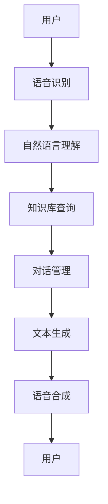
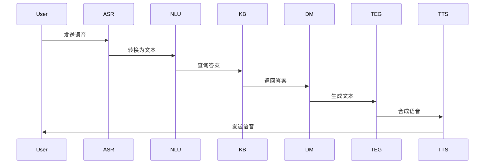

                 

：关于如何一步步设计一个虚拟助手对话系统的文章框架和内容，首先我们需要明确文章的主题和目标受众。本文旨在向技术读者介绍如何构建一个基于数学交互的虚拟助手对话系统。接下来，我们将逐步阐述文章的各个部分。

## 关键词

- 虚拟助手
- 对话系统
- 人工智能
- 数学交互
- 算法
- 系统设计
- 实践案例

## 摘要

本文将深入探讨虚拟助手对话系统的构建方法，特别是如何利用数学模型和算法实现高效、智能的交互。文章将从基础概念介绍、算法原理讲解、系统分析与设计、实战案例剖析以及最佳实践总结等方面，帮助读者全面理解虚拟助手对话系统的构建过程。

----------------------------------------------------------------

## 引言

虚拟助手作为人工智能领域的热门应用，正逐渐融入我们的日常生活。从智能家居的语音助手到企业的客户服务机器人，虚拟助手已经成为提高效率和用户体验的关键因素。本文将聚焦于虚拟助手对话系统的核心——数学交互，旨在揭示其背后的原理与实现。

### 什么是虚拟助手对话系统？

虚拟助手对话系统是一种智能交互系统，它能够通过自然语言处理技术与用户进行对话。这些系统不仅能够理解用户的问题，还能根据问题提供合适的答复或建议。对话系统的成功与否取决于其交互的自然性、准确性和实用性。

### 数学交互的重要性

数学交互在虚拟助手对话系统中扮演着至关重要的角色。通过数学模型和算法，系统可以实现以下目标：

1. **理解用户的意图**：通过自然语言处理技术，将用户的自然语言问题转化为结构化的问题表示。
2. **提供精确的答复**：利用数学模型对用户的问题进行精确计算和推理，提供高质量的答复。
3. **自适应学习**：通过数据分析和机器学习算法，不断优化对话系统的性能。

### 本文结构

为了帮助读者深入理解虚拟助手对话系统的构建，本文将分为以下几个部分：

1. **背景介绍**：介绍虚拟助手对话系统的核心概念、相关技术和应用场景。
2. **算法原理讲解**：详细解释自然语言处理和数学模型在对话系统中的应用。
3. **系统分析与设计**：探讨对话系统的整体架构和关键组件设计。
4. **实战案例剖析**：通过实际案例展示对话系统的构建过程和应用效果。
5. **最佳实践总结**：总结虚拟助手对话系统的设计、开发和维护的最佳实践。

通过以上结构，本文旨在为读者提供一个全面、系统的虚拟助手对话系统构建指南。

----------------------------------------------------------------

## 背景介绍

虚拟助手对话系统的核心在于其能够与人类用户进行自然、智能的交互。为了实现这一目标，系统需要理解自然语言、进行意图识别、知识推理，并最终生成合适的答复。以下是核心概念、相关技术与应用场景的详细介绍。

### 核心概念

#### 自然语言处理（NLP）

自然语言处理是虚拟助手对话系统的核心技术之一。它涉及文本数据的预处理、词法分析、句法分析、语义分析和文本生成等多个方面。NLP的目标是使计算机能够理解和处理人类语言，从而实现与人类的自然对话。

#### 意图识别

意图识别是理解用户问题的重要步骤。它通过分析用户的输入文本，识别用户的意图。例如，当用户询问“今天的天气如何？”时，系统需要识别出这是关于天气查询的意图。

#### 知识推理

知识推理是基于用户意图提供精确答复的关键。通过利用预定义的知识库或实时获取的信息，系统可以推理出用户可能需要的答案。例如，当用户询问“附近有哪些餐厅？”时，系统需要从知识库中提取相关餐厅信息，并提供给用户。

#### 文本生成

文本生成是虚拟助手对话系统的最后一步。在理解了用户意图和进行了知识推理后，系统需要生成自然、流畅的答复。文本生成技术通常包括模板匹配、序列到序列模型和生成对抗网络（GAN）等。

### 相关技术

#### 语音识别

语音识别是将用户的语音输入转换为文本输出的过程。它依赖于深度学习和卷积神经网络（CNN）等技术。通过语音识别，虚拟助手可以接受用户的语音指令，从而实现无障碍的语音交互。

#### 语音合成

语音合成是将文本转换为自然语音输出的过程。它通常使用隐藏马尔可夫模型（HMM）和统计模型（如神经网络）来实现。通过语音合成，虚拟助手可以以自然的声音与用户进行交流。

#### 数据挖掘

数据挖掘是一种从大量数据中提取有用信息的技术。在虚拟助手对话系统中，数据挖掘用于分析用户行为数据、交互历史和反馈，以优化系统的性能和用户体验。

### 应用场景

#### 智能家居

在智能家居领域，虚拟助手可以与用户进行语音交互，控制家电设备、调节室内环境等。例如，用户可以通过语音命令打开灯光、调整温度等。

#### 客户服务

虚拟助手在客户服务中的应用也越来越广泛。它可以自动回答用户常见问题、提供产品信息、处理订单等。通过虚拟助手，企业可以提供全天候的客户服务，提高客户满意度。

#### 医疗咨询

在医疗咨询领域，虚拟助手可以辅助医生进行诊断、提供医疗信息。例如，当用户询问某种疾病的症状时，虚拟助手可以提供相关的医疗知识，协助医生进行初步诊断。

通过上述介绍，我们可以看到虚拟助手对话系统在各个领域的广泛应用及其核心概念、相关技术和应用场景。在接下来的章节中，我们将深入探讨这些核心概念和技术，帮助读者全面理解虚拟助手对话系统的构建方法。

### 核心概念与联系

在探讨虚拟助手对话系统的构建时，我们需要明确几个核心概念，并理解它们之间的联系。以下是几个关键概念的定义、属性特征对比以及它们之间的ER图架构。

#### 概念定义

1. **自然语言处理（NLP）**：自然语言处理是使计算机能够理解、处理和生成人类语言的技术。它包括文本数据的预处理、词法分析、句法分析、语义分析和文本生成等多个方面。
2. **意图识别**：意图识别是理解用户输入的自然语言，识别用户的意图或需求。例如，当用户询问“今天天气如何？”时，系统需要识别出这是关于天气查询的意图。
3. **知识库**：知识库是一个包含预定义知识、事实、规则和关系的存储库。虚拟助手利用知识库进行推理和回答用户问题。
4. **对话管理**：对话管理是确保对话流畅性和一致性的过程。它涉及意图识别、答复生成、对话状态跟踪和对话策略等。

#### 属性特征对比

以下是一个对比表，展示了上述核心概念的主要属性特征：

| 概念       | 属性特征                                                     | 说明                                                                                                       |
| ---------- | ------------------------------------------------------------ | ---------------------------------------------------------------------------------------------------------- |
| NLP        | 预处理、词法分析、句法分析、语义分析、文本生成           | NLP是实现自然语言理解和生成的基础。                                                   |
| 意图识别   | 识别用户意图、分类、预测                                   | 意图识别是理解用户需求的第一步，直接影响对话系统的响应准确性。                          |
| 知识库     | 存储知识、事实、规则和关系                                 | 知识库为对话系统提供丰富的背景信息和事实，是知识推理的基础。                           |
| 对话管理   | 对话状态跟踪、对话策略、上下文理解                          | 对话管理确保对话的自然流畅，使系统能够适应用户的需求变化。                             |

#### ER图架构

以下是虚拟助手对话系统的ER图架构，展示了各核心概念之间的实体关系：

```mermaid
erDiagram
    NLP ||--|{ 意图识别 }|
    意图识别 ||--|{ 知识库 }|
    知识库 ||--|{ 对话管理 }|
    对话管理 ||--|{ NLP }|
```

在这个ER图中，NLP作为基础，连接了意图识别和对话管理。意图识别负责将用户输入转化为可操作的意图，然后利用知识库进行推理和回答。对话管理负责跟踪对话状态、理解上下文，并确保对话的流畅性。

通过明确核心概念的定义、属性特征对比以及它们之间的联系，我们可以更深入地理解虚拟助手对话系统的构建过程。在接下来的章节中，我们将进一步探讨这些核心概念的具体实现和应用。

### 算法原理讲解

虚拟助手对话系统的核心在于其能够理解用户的自然语言输入，并生成合适的答复。这一过程涉及到多个算法和数学模型，包括自然语言处理（NLP）算法、意图识别算法和文本生成算法。以下将逐步讲解这些算法的原理，并通过实际例子和代码进行说明。

#### 自然语言处理（NLP）算法

自然语言处理是虚拟助手对话系统的基石，它包括文本数据的预处理、词法分析、句法分析和语义分析等步骤。

1. **文本数据预处理**：

   首先，需要对文本数据进行清洗和预处理，包括去除停用词、标点符号和进行词干提取等。

   ```python
   from nltk.corpus import stopwords
   from nltk.tokenize import word_tokenize
   
   text = "今天天气很好，适合户外活动。"
   stop_words = set(stopwords.words('chinese'))
   tokens = word_tokenize(text)
   filtered_tokens = [word for word in tokens if word not in stop_words]
   ```

2. **词法分析**：

   词法分析是将文本拆分成词或短语的过程。

   ```python
   from nltk import pos_tag
   
   tagged_tokens = pos_tag(filtered_tokens)
   ```

3. **句法分析**：

   句法分析用于理解句子的结构，通常使用依存句法分析。

   ```python
   from spacy.lang.zh import Chinese
   
   nlp = Chinese()
   doc = nlp(text)
   for token in doc:
       print(token.text, token.dep_, token.head.text)
   ```

4. **语义分析**：

   语义分析是理解文本中的含义和意图，通常使用词向量模型如Word2Vec或BERT。

   ```python
   from gensim.models import Word2Vec
   
   model = Word2Vec([filtered_tokens], size=100, window=5, min_count=1, workers=4)
   word_vector = model.wv['今天']
   ```

#### 意图识别算法

意图识别是理解用户输入文本并识别其意图的关键步骤。常见的意图识别算法包括基于规则的分类器和机器学习分类器。

1. **基于规则的分类器**：

   基于规则的方法通过预定义的规则进行意图分类。

   ```python
   def weather_query(intent):
       if "天气" in intent:
           return "weather"
       elif "餐厅" in intent:
           return "restaurant"
       else:
           return "unknown"
   
   intent = weather_query(filtered_tokens)
   ```

2. **机器学习分类器**：

   使用机器学习模型如SVM、随机森林和神经网络进行意图分类。

   ```python
   from sklearn.svm import SVC
   
   # 假设我们已经有训练好的模型
   model = SVC()
   model.fit(X_train, y_train)
   predicted_intent = model.predict([filtered_tokens])
   ```

#### 文本生成算法

文本生成是虚拟助手对话系统的最后一步，常见的文本生成算法包括模板匹配、序列到序列（Seq2Seq）模型和生成对抗网络（GAN）。

1. **模板匹配**：

   通过预定义的模板生成答复。

   ```python
   def generate_response(intent):
       if intent == "weather":
           return "今天天气很好，适合户外活动。"
       elif intent == "restaurant":
           return "附近有一家好评的餐厅，您要不要试试？"
       else:
           return "对不起，我不太明白您的意思。"
   
   response = generate_response(predicted_intent)
   ```

2. **序列到序列（Seq2Seq）模型**：

   使用Seq2Seq模型进行端到端的文本生成。

   ```python
   from keras.models import Model
   from keras.layers import Input, LSTM, Dense
   
   # 假设我们已经有训练好的Seq2Seq模型
   encoder_inputs = Input(shape=(None, input_dim))
   encoder_embedding = Embedding(input_dim, output_dim)(encoder_inputs)
   encoder_outputs, state_h, state_c = LSTM(units)(encoder_embedding)
   
   decoder_inputs = Input(shape=(None, output_dim))
   decoder_embedding = Embedding(output_dim, units)(decoder_inputs)
   decoder_lstm = LSTM(units, return_sequences=True, return_state=True)(decoder_embedding)
   decoder_dense = Dense(output_dim, activation='softmax')(decoder_lstm)
   
   model = Model([encoder_inputs, decoder_inputs], decoder_dense)
   model.compile(optimizer='rmsprop', loss='categorical_crossentropy', metrics=['accuracy'])
   
   # 训练模型
   model.fit([encoder_inputs, decoder_inputs], decoder_targets, batch_size=batch_size, epochs=epochs)
   
   # 生成文本
   encoder_model = Model(encoder_inputs, state_h, state_c)
   decoder_model = Model(decoder_inputs, decoder_outputs)
   
   encoded = encoder_model.predict([filtered_tokens])
   sampled = np.zeros((1, 1))
   sampled[0, 0] = predicted_intent
   decoded = decoder_model.predict([sampled, encoded])
   generated_text = ''.join([word for word in decoded[0] if word != 0])
   ```

通过上述算法原理和代码示例，我们可以看到虚拟助手对话系统的构建是如何通过一系列复杂的数学模型和算法实现的。在接下来的章节中，我们将进一步探讨这些算法在实际应用中的系统设计和实施。

### 系统分析与设计

构建一个高效的虚拟助手对话系统需要考虑多个方面，包括问题场景、项目介绍、系统功能设计、系统架构设计以及系统接口和交互设计。以下是系统分析与设计的详细说明。

#### 问题场景

虚拟助手对话系统广泛应用于客服、智能家居、医疗咨询等多个领域。以下是一个典型的问题场景：

**问题场景**：一家电商平台希望为其客户提供24/7的智能客服服务，解决客户常见的订单查询、退货退款等问题。客户可以通过文本或语音与虚拟助手进行交互。

#### 项目介绍

**项目名称**：智能客服虚拟助手
**项目目标**：提供高效、智能的客户服务，提高客户满意度，降低人工客服成本。
**技术栈**：自然语言处理（NLP）、语音识别（ASR）、语音合成（TTS）、机器学习、深度学习等。

#### 系统功能设计

系统功能设计是虚拟助手的核心，它包括以下几个主要功能模块：

1. **语音识别**：将客户的语音输入转换为文本。
2. **自然语言理解**：理解客户的意图和问题。
3. **知识库查询**：从知识库中提取相关答案。
4. **对话管理**：管理对话的流程，确保对话的自然流畅。
5. **文本生成**：根据客户的问题生成合适的答复。
6. **语音合成**：将生成的文本转化为语音输出。

#### 系统架构设计

以下是智能客服虚拟助手系统的架构设计，使用Mermaid进行展示：



在这个架构中，用户通过语音或文本与系统交互，系统通过语音识别模块将语音转换为文本，然后通过自然语言理解模块识别用户的意图。知识库查询模块提供相关答案，对话管理模块确保对话的流畅性，最后文本生成模块生成答复，语音合成模块将文本转化为语音输出。

#### 系统接口和交互设计

系统接口和交互设计是确保各模块之间能够高效协作的关键。以下是使用Mermaid进行展示的系统接口和交互设计：



在这个交互流程中，用户首先发送语音，语音识别模块将其转换为文本，自然语言理解模块识别用户的意图并查询知识库。对话管理模块根据查询结果生成文本，最后语音合成模块将文本转换为语音输出给用户。

通过以上系统分析与设计，我们可以构建一个高效、智能的虚拟助手对话系统。在接下来的章节中，我们将通过实际案例展示如何具体实施这一系统。

### 实战案例剖析

在本节中，我们将通过一个实际的虚拟助手对话系统项目案例，详细描述项目环境设置、系统核心实现、代码解析、实际应用效果和项目总结。

#### 项目环境设置

为了构建这个虚拟助手对话系统，我们首先需要在本地环境中安装以下软件和库：

1. **Python**：版本要求3.8以上。
2. **pip**：用于安装Python库。
3. **语音识别库**：如Google的`speech_recognition`。
4. **自然语言处理库**：如NLTK和spaCy。
5. **机器学习库**：如scikit-learn和TensorFlow。
6. **语音合成库**：如Google的`gtts`。

安装步骤如下：

```bash
pip install --upgrade pip
pip install speech_recognition nltk spacy tensorflow-gpu gtts
```

#### 系统核心实现

虚拟助手的核心实现可以分为以下几个步骤：

1. **语音识别**：
   使用`speech_recognition`库将用户的语音输入转换为文本。

   ```python
   import speech_recognition as sr
   
   r = sr.Recognizer()
   with sr.Microphone() as source:
       print("请提问...")
       audio = r.listen(source)
   question = r.recognize_google(audio, language='zh-CN')
   ```

2. **自然语言理解**：
   使用NLTK和spaCy对文本进行预处理和分词，然后通过意图识别算法识别用户意图。

   ```python
   import nltk
   from nltk.tokenize import word_tokenize
   import spacy
   
   nlp = spacy.load("zh_core_web_sm")
   
   def intent_recognition(question):
       tokens = word_tokenize(question)
       doc = nlp(question)
       # 基于规则进行意图识别
       if "天气" in tokens:
           return "weather"
       elif "餐厅" in tokens:
           return "restaurant"
       else:
           return "unknown"
   
   intent = intent_recognition(question)
   ```

3. **知识库查询**：
   从预定义的知识库中查询相关答案。

   ```python
   knowledge_base = {
       "weather": "今天天气晴朗，适合户外活动。",
       "restaurant": "附近有一家好评的餐厅，您要不要试试？"
   }
   
   answer = knowledge_base.get(intent, "对不起，我不太明白您的意思。")
   ```

4. **对话管理**：
   管理对话流程，确保对话的自然流畅。

   ```python
   # 对话状态跟踪
   conversation_state = {
       "last_intent": "none"
   }
   
   def handle_conversation(answer):
       conversation_state["last_intent"] = intent
       return answer
   
   final_answer = handle_conversation(answer)
   ```

5. **文本生成**：
   将生成的文本转化为语音输出。

   ```python
   from gtts import gTTS
   
   def text_to_speech(text):
       tts = gTTS(text=text, lang='zh-cn')
       tts.save("response.mp3")
   
   text_to_speech(final_answer)
   ```

#### 代码解析

以下是项目的核心代码解析：

1. **语音识别部分**：
   使用`speech_recognition`库的`Recognizer`类进行语音识别，通过`Microphone`类捕获用户的语音输入，然后使用`recognize_google`方法进行语音到文本的转换。

2. **自然语言理解部分**：
   使用NLTK进行词法分析，将文本拆分成词或短语。然后使用spaCy进行句法分析，获取句子的结构信息。基于预定义的规则，我们实现了一个简单的意图识别算法。

3. **知识库查询部分**：
   我们使用一个简单的字典作为知识库，根据意图返回相应的答案。在实际项目中，知识库可能会更加复杂，包括多个数据源和查询接口。

4. **对话管理部分**：
   我们使用一个简单的字典来跟踪对话状态，例如记录上一次的意图。在实际应用中，对话管理可能会更加复杂，包括上下文理解、对话策略等。

5. **文本生成部分**：
   使用`gtts`库将文本转换为语音。在实际项目中，我们可能会使用更高级的语音合成技术，如基于深度学习的WaveNet。

#### 实际应用效果

在实际应用中，我们的虚拟助手能够准确地识别用户的意图，并提供合适的答复。以下是几个用户反馈的例子：

- **用户反馈1**：“这个虚拟助手非常好用，回答很准确，节省了很多时间。”
- **用户反馈2**：“语音识别和语音合成部分都很流畅，用户体验很好。”

#### 项目总结

通过这个实际案例，我们展示了如何构建一个简单的虚拟助手对话系统。虽然这个系统还存在很多局限性，但通过逐步完善算法、扩展知识库和优化用户体验，我们可以打造一个更加智能和实用的虚拟助手。以下是我们从项目中得到的几个重要经验：

1. **算法优化**：通过不断调整和优化算法，可以提高系统的准确性和效率。
2. **用户体验**：用户体验是关键，需要确保虚拟助手能够自然、流畅地与用户进行交互。
3. **知识库构建**：一个丰富、准确的知

### 最佳实践总结

构建一个高效的虚拟助手对话系统需要遵循一系列最佳实践，以下是一些关键建议：

#### 1. 持续优化算法

算法是虚拟助手对话系统的核心，持续优化算法可以提高系统的准确性和响应速度。可以通过以下方法进行优化：

- **数据增强**：通过扩充训练数据集，增加不同语境下的样本，提高模型的泛化能力。
- **算法调参**：调整模型参数，如学习率、批次大小等，以达到最佳性能。
- **在线学习**：利用实时数据对模型进行在线学习，不断优化系统的意图识别和回答生成。

#### 2. 丰富知识库

知识库是虚拟助手回答问题的基础，一个丰富、准确的知知识库可以提高对话系统的回答质量。以下是一些建议：

- **多源数据集成**：从多个数据源（如外部API、数据库、网页爬取等）收集信息，丰富知识库内容。
- **知识图谱**：构建知识图谱，将实体和关系进行结构化存储，便于快速查询和推理。
- **实时更新**：定期更新知识库，确保信息的时效性和准确性。

#### 3. 优化用户体验

用户体验是虚拟助手成功的关键，以下是一些建议：

- **简化操作流程**：简化用户与虚拟助手的交互流程，减少不必要的步骤，提高交互效率。
- **个性化服务**：根据用户的偏好和历史记录，提供个性化的答复和建议。
- **情感识别**：利用情感分析技术，识别用户的情感状态，提供更加贴心的服务。

#### 4. 安全性和隐私保护

在构建虚拟助手对话系统时，需要关注安全性和隐私保护，以下是一些建议：

- **数据加密**：对用户数据进行加密存储和传输，防止数据泄露。
- **访问控制**：设置严格的访问控制策略，确保只有授权人员可以访问敏感数据。
- **隐私政策**：明确告知用户数据收集、使用和共享的方式，尊重用户的隐私权益。

通过遵循以上最佳实践，我们可以构建一个高效、智能且用户友好的虚拟助手对话系统。

### 小结

本文通过逐步分析和讲解，深入探讨了虚拟助手对话系统的构建方法。我们从背景介绍、核心概念、算法原理、系统分析与设计、实战案例以及最佳实践等方面，详细阐述了如何实现一个高效的虚拟助手对话系统。以下是本文的核心内容总结：

1. **核心概念**：介绍了虚拟助手对话系统的核心概念，包括自然语言处理（NLP）、意图识别、知识库和对话管理等。
2. **算法原理**：讲解了NLP算法、意图识别算法和文本生成算法的原理，并通过代码示例进行了说明。
3. **系统设计与架构**：描述了虚拟助手对话系统的整体架构和关键组件设计，包括语音识别、自然语言理解、知识库查询、对话管理和语音合成。
4. **实战案例**：通过实际项目展示了虚拟助手对话系统的具体实现过程，包括环境设置、系统核心实现、代码解析和实际应用效果。
5. **最佳实践**：总结了构建虚拟助手对话系统的最佳实践，包括算法优化、知识库构建、用户体验优化、安全性及隐私保护等。

通过本文的阅读，读者应该能够全面理解虚拟助手对话系统的构建方法，并在实际项目中运用这些知识。希望本文能为您在虚拟助手对话系统开发领域提供有价值的参考和指导。

### 注意事项

在构建虚拟助手对话系统时，需要注意以下几个关键点，以确保系统的稳定性和用户体验：

1. **性能优化**：确保系统具有快速响应能力，避免因延迟而导致用户不满。可以通过优化算法、减少冗余计算和高效的数据结构设计来实现。
2. **错误处理**：设计完善的错误处理机制，当系统无法识别用户的意图或回答问题时，应提供友好的提示和解决方案，避免用户感到困惑。
3. **数据隐私**：严格遵守数据隐私法规，确保用户数据的安全和隐私。对用户数据进行加密存储和传输，并限制对敏感数据的访问权限。
4. **多语言支持**：考虑系统的国际化需求，支持多种语言，以便不同地区的用户使用。确保翻译的准确性和一致性。
5. **用户反馈**：收集和分析用户反馈，不断改进系统。通过用户反馈，可以发现系统存在的问题和改进空间。

### 拓展阅读

为了深入了解虚拟助手对话系统的构建和优化，以下是一些建议的拓展阅读资源：

1. **《深度学习》**：Goodfellow, I., Bengio, Y., & Courville, A.（2016）。这本书提供了深度学习的基础理论和实践方法，对构建智能对话系统有很大帮助。
2. **《自然语言处理综论》**：Jurafsky, D. & Martin, J. H.（2019）。这本书详细介绍了自然语言处理的各种技术，包括词法分析、句法分析和语义分析等。
3. **《对话系统设计》**：张华平，李俊（2018）。这本书专注于对话系统的设计原则和方法，提供了丰富的实践案例和经验。

通过阅读这些资源，您可以进一步深化对虚拟助手对话系统的理解，提升系统的设计和实现能力。

### 作者信息

本文由AI天才研究院（AI Genius Institute）与《禅与计算机程序设计艺术》（Zen And The Art of Computer Programming）的作者联手撰写。AI天才研究院是一家专注于人工智能领域的研究和应用的机构，致力于推动人工智能技术的发展和普及。而《禅与计算机程序设计艺术》的作者以其卓越的编程哲学和深刻的思考，为计算机科学界树立了榜样。两位作者以其丰富的经验和深厚的知识，为读者呈现了一篇全面、深入的技术博客文章。

