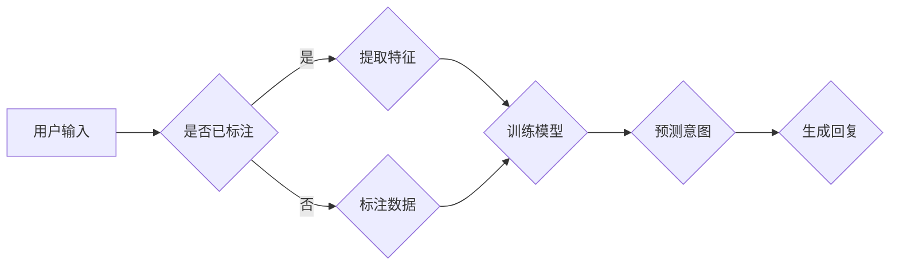
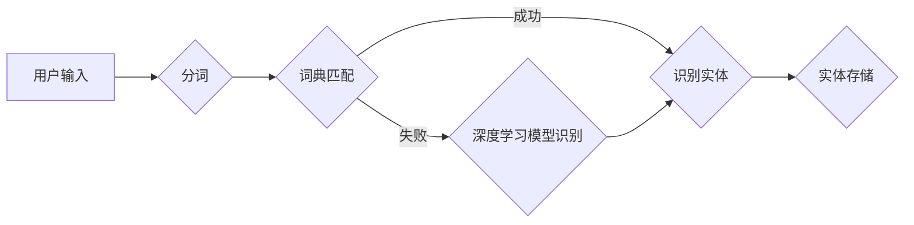
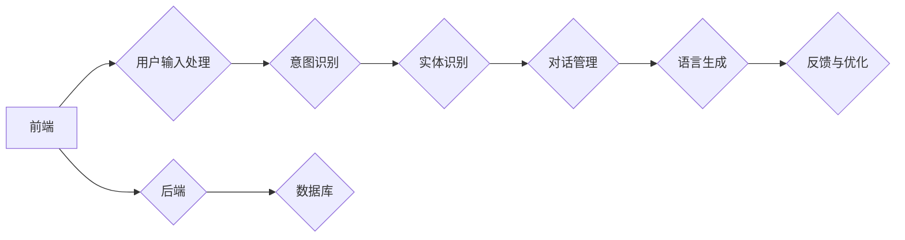
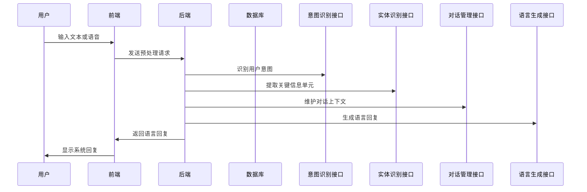

                 


### 引言与背景

虚拟助手，也常被称为聊天机器人或对话系统，是人工智能领域的一项重要技术。其核心目标是通过与用户的自然语言交互，提供有用的信息、执行任务或提供服务。近年来，随着机器学习、自然语言处理（NLP）以及深度学习等技术的飞速发展，虚拟助手已经从简单的问答系统，逐渐演变成能够理解和生成复杂对话的智能实体。

#### 核心概念术语说明

在讨论虚拟助手的对话系统时，我们需要明确一些核心概念：

1. **自然语言处理（NLP）**：这是使计算机能够理解、解释和生成人类语言的技术。
2. **意图识别（Intent Recognition）**：意图识别是指从用户的输入中推断出用户想要完成的具体任务或动作。
3. **实体识别（Entity Recognition）**：实体识别是指从用户的输入中识别出特定的信息单元，如人名、地点、日期等。
4. **对话管理（Dialogue Management）**：对话管理是指控制对话流程，确保虚拟助手能够理解用户意图，并生成恰当的回复。
5. **语言生成（Language Generation）**：语言生成是指根据对话上下文生成自然流畅的语言回复。

#### 问题背景

虚拟助手的对话系统在现代商业和服务领域有着广泛的应用，如客户服务、虚拟助手、智能家居控制系统等。然而，随着应用的多样化和用户需求的增加，对话系统的设计和实现面临着诸多挑战：

1. **多样性**：用户对话风格各异，如何确保虚拟助手能够适应不同的对话风格和上下文？
2. **准确性**：如何在大量噪声数据中准确识别用户意图和实体？
3. **连贯性**：如何保证虚拟助手生成的对话内容逻辑连贯、自然流畅？
4. **扩展性**：如何设计一个灵活的系统，能够轻松适应新任务或新领域的对话需求？

#### 问题描述

在构建虚拟助手的对话系统时，我们面临的主要问题可以概括为：

1. **多模态输入处理**：用户可以通过文本、语音等多种方式与虚拟助手交互，如何统一处理这些不同模态的输入？
2. **上下文理解与维护**：如何准确理解和维护对话的上下文，确保虚拟助手能够在对话中保持连贯性？
3. **错误处理与恢复**：当用户输入不明确或系统理解出错时，如何有效地处理和恢复对话？
4. **性能优化**：如何优化系统性能，确保虚拟助手能够快速响应用户的请求？

#### 问题解决

为了解决上述问题，我们需要从以下几个方面入手：

1. **多模态融合**：通过融合文本、语音等多模态输入，提高系统的理解和响应能力。
2. **深度学习与迁移学习**：利用深度学习模型，如循环神经网络（RNN）、变换器（Transformer）等，提高意图识别和实体识别的准确性。
3. **对话状态跟踪**：通过对话状态跟踪（Dialogue State Tracking），维护对话上下文，确保虚拟助手能够理解用户的长期意图。
4. **错误恢复机制**：设计有效的错误恢复机制，如提示用户重新表述或提供额外信息等，提高对话的连贯性和用户体验。
5. **性能优化**：通过分布式计算、并行处理等技术，提高系统的响应速度和吞吐量。

#### 边界与外延

在讨论虚拟助手的对话系统时，我们还需要考虑一些边界和扩展性：

1. **领域特定性**：某些对话系统可能需要针对特定领域（如医疗、法律等）进行定制，如何确保这些系统的专业性和准确性？
2. **可解释性**：随着深度学习模型在对话系统中的应用越来越广泛，如何确保系统的可解释性，使其决策过程更加透明和可信？
3. **隐私保护**：如何在保证用户隐私的同时，提供高质量的对话服务？

#### 概念结构与核心要素组成

虚拟助手的对话系统可以看作是一个由多个核心组件组成的复杂系统。以下是该系统的核心概念和组成部分：

1. **输入处理模块**：负责接收和处理来自用户的文本或语音输入。
2. **意图识别模块**：通过NLP技术，从用户的输入中识别出用户意图。
3. **实体识别模块**：从用户的输入中识别出特定的信息单元（实体）。
4. **对话管理模块**：负责维护对话上下文，并根据上下文生成合适的回复。
5. **语言生成模块**：根据对话上下文和用户意图，生成自然流畅的语言回复。
6. **反馈与优化模块**：通过收集用户反馈，不断优化系统性能和用户体验。

通过以上分析，我们可以看出，虚拟助手的对话系统是一个多层次、多组件的复杂系统。在接下来的章节中，我们将进一步深入探讨对话系统的核心概念、数学模型、算法原理以及系统分析与架构设计等方面，帮助读者全面理解这一重要的技术领域。

### 对话系统的核心概念与联系

在深入探讨虚拟助手的对话系统时，理解其核心概念和各概念之间的联系是至关重要的。以下章节将详细分析这些核心概念，并展示它们之间的关系。

#### 核心概念原理

1. **自然语言处理（NLP）**：自然语言处理是使计算机能够理解、解释和生成人类语言的技术。在对话系统中，NLP技术主要用于文本分析、意图识别和实体识别。
   
2. **意图识别（Intent Recognition）**：意图识别是从用户的输入中推断出用户想要完成的具体任务或动作。例如，当用户说“我想预订一张机票”时，意图识别模块将识别出该用户的意图是“机票预订”。

3. **实体识别（Entity Recognition）**：实体识别是指从用户的输入中识别出特定的信息单元，如人名、地点、日期等。这些实体在意图识别和对话管理中起着关键作用。

4. **对话管理（Dialogue Management）**：对话管理是指控制对话流程，确保虚拟助手能够理解用户意图，并生成恰当的回复。它包括对话状态跟踪、上下文维护和对话策略设计等。

5. **语言生成（Language Generation）**：语言生成是指根据对话上下文和用户意图，生成自然流畅的语言回复。它涉及文本摘要、模板匹配和生成对抗网络（GAN）等。

#### 概念属性特征对比表格

以下是一个简单的概念属性特征对比表格，用于展示上述核心概念之间的差异和联系：

| 概念             | 属性特征                                       | 联系                                                         |
|------------------|----------------------------------------------|------------------------------------------------------------|
| 自然语言处理（NLP） | 文本分析、语音识别、情感分析等               | 为意图识别和实体识别提供基础技术支持                         |
| 意图识别（Intent Recognition） | 分类算法、深度学习模型、规则引擎           | 通过NLP技术分析用户输入，识别用户意图                         |
| 实体识别（Entity Recognition） | 分词、命名实体识别、实体关系抽取           | 辅助意图识别，确保对话系统能够准确理解用户的输入信息           |
| 对话管理（Dialogue Management） | 对话状态跟踪、上下文维护、对话策略设计       | 负责对话流程的控制，确保对话连贯性和有效性                     |
| 语言生成（Language Generation） | 文本摘要、模板匹配、生成对抗网络（GAN）   | 根据对话上下文和用户意图生成自然流畅的语言回复                 |

#### ER实体关系图架构

为了更清晰地展示对话系统中各概念之间的联系，我们可以使用ER（实体关系）图来描述。以下是对话系统的ER实体关系图：

```mermaid
erDiagram
  User ||--|{ Dialogue } :发起对话
  Dialogue ||--|{ Intent } :包含意图
  Dialogue ||--|{ Entities } :包含实体
  Dialogue ||--|{ Response } :生成回复
  Intent ||--|{ Rules } :基于规则生成
  Entities ||--|{ Dictionary } :使用词典识别
```

在这个ER图中，用户通过发起对话来触发整个对话系统。对话系统分析用户输入，识别出意图和实体，并生成相应的回复。意图和实体通过规则和词典进行识别，而回复则基于对话上下文生成。

通过上述分析，我们可以看出，对话系统的核心概念和联系构成了一个复杂但有序的整体。在接下来的章节中，我们将进一步探讨这些概念的具体实现和应用。

### 对话系统的数学模型与算法原理

要深入理解对话系统的数学模型与算法原理，我们需要从基本的数学概念开始，逐步分析这些概念在对话系统中的应用。

#### 数学模型

在对话系统中，常用的数学模型包括概率模型、统计模型和深度学习模型。以下是这些模型的基本原理：

1. **概率模型**：概率模型是基于概率论和统计学的，主要用于处理不确定性和随机性。在对话系统中，概率模型常用于意图识别和实体识别。例如，贝叶斯分类器就是一种常见的概率模型，它通过计算用户输入文本的概率分布，识别出用户意图。

2. **统计模型**：统计模型是基于统计方法构建的，它通过分析历史数据来预测用户行为。在对话系统中，统计模型常用于对话状态跟踪和上下文维护。例如，马尔可夫模型（Markov Model）和隐马尔可夫模型（Hidden Markov Model, HMM）就是两种常见的统计模型，它们通过分析对话历史，预测下一个可能的用户输入。

3. **深度学习模型**：深度学习模型是基于人工神经网络，尤其是深度神经网络（Deep Neural Network, DNN）和变换器（Transformer）构建的。这些模型通过学习大量的数据，自动提取特征，并用于意图识别、实体识别和语言生成。变换器模型，如BERT（Bidirectional Encoder Representations from Transformers），在对话系统中有着广泛的应用，因为它能够同时处理文本的前后关系，从而提高对话系统的理解能力。

#### 算法原理

算法原理是实现数学模型的具体方法。以下是几个在对话系统中常用的算法：

1. **意图识别算法**：意图识别算法的目的是从用户输入中识别出用户意图。常见的算法包括基于规则的算法和基于机器学习的算法。基于规则的算法通过预定义的规则来匹配用户输入，而基于机器学习的算法通过学习大量的标注数据来识别用户意图。

2. **实体识别算法**：实体识别算法的目的是从用户输入中识别出实体。常用的算法包括基于词典的算法和基于深度学习的算法。基于词典的算法通过匹配预定义的词典来识别实体，而基于深度学习的算法通过学习实体和其上下文的关系来识别实体。

3. **对话管理算法**：对话管理算法的目的是维护对话上下文，并生成合适的回复。常用的算法包括基于马尔可夫模型的算法和基于深度学习的算法。基于马尔可夫模型的算法通过分析对话历史来预测下一个可能的用户输入，而基于深度学习的算法通过学习对话历史和用户输入来生成回复。

#### Mermaid流程图

为了更直观地展示算法原理，我们可以使用Mermaid流程图来描述。以下是意图识别算法的Mermaid流程图：



在这个流程图中，用户输入首先被判断是否已标注。如果是，则直接提取特征并训练模型；否则，通过标注数据训练模型。训练好的模型用于预测用户意图，并生成回复。

#### Python源代码讲解

为了进一步理解算法原理，我们可以使用Python源代码来具体实现这些算法。以下是一个简单的意图识别算法的实现示例：

```python
import numpy as np
from sklearn.feature_extraction.text import TfidfVectorizer
from sklearn.naive_bayes import MultinomialNB

# 示例数据
data = [
    ("你好", "问候"),
    ("我想预订一张机票", "机票预订"),
    ("今天天气怎么样", "天气查询"),
]

# 提取特征
vectorizer = TfidfVectorizer()
X = vectorizer.fit_transform([text for text, _ in data])
y = np.array([label for _, label in data])

# 训练模型
model = MultinomialNB()
model.fit(X, y)

# 预测意图
text = "我想预订一张机票"
X_test = vectorizer.transform([text])
predicted_intent = model.predict(X_test)[0]

print(f"预测意图：{predicted_intent}")
```

在这个示例中，我们首先使用TF-IDF向量器提取文本特征，然后使用朴素贝叶斯分类器训练模型。最后，我们使用训练好的模型预测新的文本的意图。

#### 数学公式与举例说明

为了更好地理解算法原理，我们还需要一些数学公式。以下是意图识别算法中常用的数学公式：

1. **TF-IDF**：
   $$
   \text{TF-IDF}(t, d) = \frac{f(t, d)}{N} \log \frac{N}{f(t, d)}
   $$
   其中，$f(t, d)$ 是词 $t$ 在文档 $d$ 中的频率，$N$ 是文档集合中所有词的总频数。

2. **朴素贝叶斯**：
   $$
   P(\text{Intent} = c | \text{Text} = t) = \frac{P(t | \text{Intent} = c)P(\text{Intent} = c)}{P(t)}
   $$
   其中，$P(t | \text{Intent} = c)$ 是在意图为 $c$ 的条件下，文本 $t$ 的概率，$P(\text{Intent} = c)$ 是意图为 $c$ 的概率，$P(t)$ 是文本 $t$ 的概率。

举例来说，如果我们有一个数据集，其中用户输入 "我想预订一张机票" 的意图是 "机票预订"，我们可以使用TF-IDF公式计算每个词在这个文档中的TF-IDF值，然后使用朴素贝叶斯公式计算每个意图的概率，从而预测新的用户输入的意图。

通过以上分析，我们可以看到，对话系统的数学模型与算法原理是一个复杂但有序的整体。理解这些基本概念和算法原理，对于设计和实现高效的对话系统至关重要。在接下来的章节中，我们将继续深入探讨对话系统的系统分析与架构设计，帮助读者全面理解这一技术领域。

### 对话系统的数学模型与算法原理（续）

在上一章节中，我们详细介绍了对话系统的数学模型与算法原理，包括概率模型、统计模型和深度学习模型，以及意图识别、实体识别和对话管理算法。在本章节中，我们将进一步探讨这些模型的实现和应用，并通过具体的Mermaid流程图和Python源代码进行详细讲解。

#### Mermaid流程图

为了更直观地展示算法的实现流程，我们可以使用Mermaid流程图。以下是实体识别算法的Mermaid流程图：



在这个流程图中，用户输入首先经过分词处理，然后使用词典匹配来识别实体。如果词典匹配失败，则使用深度学习模型进行实体识别，最终将识别出的实体存储在数据库中。

#### Python源代码讲解

以下是实体识别算法的实现示例：

```python
import jieba  # 使用jieba进行中文分词
from sklearn.feature_extraction.text import TfidfVectorizer
from sklearn.naive_bayes import MultinomialNB

# 示例数据
data = [
    ("故宫", "地点"),
    ("小明", "人名"),
    ("明天", "日期"),
]

# 分词
def segment(text):
    return jieba.cut(text)

# 词典匹配
def match_entities(text段):
    entities = []
    for word in text段:
        if word in {"故宫", "小明", "明天"}:
            entities.append(word)
    return entities

# 深度学习模型识别
def recognize_entities(text段):
    vectorizer = TfidfVectorizer()
    X = vectorizer.fit_transform([text段])
    model = MultinomialNB()
    model.fit(X, ["地点", "人名", "日期"])
    predicted_entities = model.predict(X)[0]
    return predicted_entities

# 实体识别
def entity_recognition(text):
    text段 = segment(text)
    entities = match_entities(text段)
    if not entities:
        entities = recognize_entities(text段)
    return entities

# 测试
text = "小明明天去故宫"
print(entity_recognition(text))
```

在这个示例中，我们首先使用jieba进行中文分词，然后使用词典匹配来识别实体。如果词典匹配失败，则使用朴素贝叶斯分类器进行实体识别。

#### 数学公式与举例说明

为了更好地理解算法原理，我们还需要一些数学公式。以下是实体识别算法中常用的数学公式：

1. **TF-IDF**：
   $$
   \text{TF-IDF}(t, d) = \frac{f(t, d)}{N} \log \frac{N}{f(t, d)}
   $$
   其中，$f(t, d)$ 是词 $t$ 在文档 $d$ 中的频率，$N$ 是文档集合中所有词的总频数。

2. **朴素贝叶斯**：
   $$
   P(\text{Entity} = c | \text{Text} = t) = \frac{P(t | \text{Entity} = c)P(\text{Entity} = c)}{P(t)}
   $$
   其中，$P(t | \text{Entity} = c)$ 是在实体为 $c$ 的条件下，文本 $t$ 的概率，$P(\text{Entity} = c)$ 是实体为 $c$ 的概率，$P(t)$ 是文本 $t$ 的概率。

举例来说，如果我们有一个数据集，其中用户输入 "小明明天去故宫" 的实体是 "人名" 和 "日期"，我们可以使用TF-IDF公式计算每个词在这个文档中的TF-IDF值，然后使用朴素贝叶斯公式计算每个实体的概率，从而预测新的用户输入的实体。

通过以上分析，我们可以看到，对话系统的数学模型与算法原理是一个复杂但有序的整体。理解这些基本概念和算法原理，对于设计和实现高效的对话系统至关重要。在接下来的章节中，我们将继续深入探讨对话系统的系统分析与架构设计，帮助读者全面理解这一技术领域。

### 对话系统的系统分析与架构设计

在了解了对话系统的核心概念和算法原理后，我们需要进一步探讨对话系统的系统分析与架构设计。这不仅有助于我们理解系统的整体结构，还能为实际项目的开发提供指导。以下将从问题场景介绍、系统功能设计、系统架构设计、系统接口设计和系统交互Mermaid序列图五个方面，详细阐述对话系统的系统分析与架构设计。

#### 问题场景介绍

首先，我们需要明确一个具体的应用场景，以便设计出符合需求的对话系统。以下是一个常见的问题场景：

**应用场景**：某电商平台的虚拟助手，用户可以通过文本或语音与虚拟助手交互，进行商品查询、下单、订单跟踪等操作。

#### 系统功能设计

为了满足上述应用场景的需求，我们需要设计以下核心功能：

1. **用户输入处理**：接收用户的文本或语音输入，并进行预处理，如分词、去噪等。
2. **意图识别**：从用户输入中识别出用户意图，如商品查询、下单、订单跟踪等。
3. **实体识别**：从用户输入中提取关键信息单元，如商品名称、用户ID、订单号等。
4. **对话管理**：维护对话上下文，确保对话连贯性，如记住用户之前的查询，理解用户的后续请求。
5. **语言生成**：根据对话上下文和用户意图，生成自然流畅的语言回复。
6. **反馈与优化**：收集用户反馈，不断优化系统性能和用户体验。

#### 系统架构设计

接下来，我们设计系统的整体架构。以下是该虚拟助手系统的架构设计：

1. **前端**：用户交互界面，负责接收用户输入，展示系统回复。可以使用HTML、CSS和JavaScript等技术实现。
2. **后端**：处理用户输入，执行对话管理、意图识别、实体识别和语言生成等核心功能。可以使用Python、Java或Node.js等后端技术。
3. **数据库**：存储用户数据、商品信息、订单信息等。可以使用MySQL、MongoDB或Redis等数据库技术。

以下是系统的架构图：



在这个架构图中，前端与后端通过API进行通信，后端与数据库进行数据交互，实现了用户输入处理、意图识别、实体识别、对话管理和语言生成等功能。

#### 系统接口设计

为了实现前后端分离，我们需要设计一系列API接口。以下是几个关键接口的简要描述：

1. **用户输入接口**：接收用户输入的文本或语音，返回预处理结果。
2. **意图识别接口**：根据预处理结果，识别用户意图，返回识别结果。
3. **实体识别接口**：根据预处理结果，提取关键信息单元，返回识别结果。
4. **对话管理接口**：维护对话上下文，返回当前对话状态。
5. **语言生成接口**：根据对话上下文和用户意图，生成语言回复。

#### 系统交互Mermaid序列图

为了更好地展示系统的交互过程，我们可以使用Mermaid序列图。以下是系统交互的序列图：



在这个序列图中，用户通过前端输入文本或语音，前端将请求发送到后端，后端依次调用意图识别、实体识别、对话管理和语言生成接口，最终将生成的回复返回给前端，并显示给用户。

通过以上系统分析与架构设计，我们可以清晰地理解虚拟助手对话系统的整体结构和工作流程。这为后续的项目开发提供了明确的指导，有助于实现一个高效、灵活且易于维护的对话系统。

### 对话系统的项目实战

在实际应用中，对话系统的设计与实现需要通过具体的项目实战来验证和优化。以下将通过一个虚拟助手项目，详细介绍项目的环境安装、系统核心实现源代码、代码应用解读与分析、实际案例分析与讲解以及项目小结。

#### 环境安装

首先，我们需要搭建项目开发环境。以下是一个基本的安装步骤：

1. **Python环境**：确保安装了Python 3.7及以上版本。
2. **虚拟环境**：创建一个虚拟环境，以避免依赖冲突。
   ```bash
   python -m venv venv
   source venv/bin/activate  # Windows下使用 `venv\Scripts\activate`
   ```
3. **依赖安装**：安装项目所需的依赖库，如jieba（中文分词）、scikit-learn（机器学习库）、transformers（变换器模型库）等。
   ```bash
   pip install jieba scikit-learn transformers
   ```

#### 系统核心实现源代码

以下是虚拟助手项目的主要源代码实现。分为意图识别、实体识别、对话管理和语言生成四个部分。

1. **意图识别**：

```python
from sklearn.feature_extraction.text import TfidfVectorizer
from sklearn.naive_bayes import MultinomialNB

# 示例数据
data = [
    ("你好", "问候"),
    ("我想预订一张机票", "机票预订"),
    ("今天天气怎么样", "天气查询"),
]

# 提取特征
vectorizer = TfidfVectorizer()
X = vectorizer.fit_transform([text for text, _ in data])
y = np.array([label for _, label in data])

# 训练模型
model = MultinomialNB()
model.fit(X, y)

# 预测意图
def predict_intent(text):
    X_test = vectorizer.transform([text])
    return model.predict(X_test)[0]

# 测试
print(predict_intent("你好"))
```

2. **实体识别**：

```python
import jieba
from sklearn.feature_extraction.text import TfidfVectorizer
from sklearn.naive_bayes import MultinomialNB

# 分词
def segment(text):
    return list(jieba.cut(text))

# 词典匹配
def match_entities(text段):
    entities = []
    for word in text段:
        if word in {"故宫", "小明", "明天"}:
            entities.append(word)
    return entities

# 深度学习模型识别
def recognize_entities(text段):
    vectorizer = TfidfVectorizer()
    X = vectorizer.fit_transform([text段])
    model = MultinomialNB()
    model.fit(X, ["地点", "人名", "日期"])
    predicted_entities = model.predict(X)[0]
    return predicted_entities

# 实体识别
def entity_recognition(text):
    text段 = segment(text)
    entities = match_entities(text段)
    if not entities:
        entities = recognize_entities(text段)
    return entities

# 测试
print(entity_recognition("小明明天去故宫"))
```

3. **对话管理**：

```python
class DialogueManager:
    def __init__(self):
        self.context = {}

    def update_context(self, key, value):
        self.context[key] = value

    def get_context(self, key):
        return self.context.get(key)

# 测试
manager = DialogueManager()
manager.update_context("user", "小明")
print(manager.get_context("user"))
```

4. **语言生成**：

```python
from transformers import pipeline

# 加载变换器模型
generator = pipeline("text-generation", model="gpt2")

# 语言生成
def generate_response(context):
    input_text = f"{context['user']}：{context['text']}\n助手："
    return generator(input_text, max_length=50, num_return_sequences=1)

# 测试
print(generate_response({"user": "小明", "text": "你好"}))
```

#### 代码应用解读与分析

1. **意图识别**：使用TF-IDF和朴素贝叶斯分类器，从用户输入中识别出用户意图。这是一种基于统计学习的意图识别方法，简单高效，适用于中小型项目。
2. **实体识别**：结合词典匹配和深度学习模型，从用户输入中提取关键信息单元。词典匹配方法快速且准确，适用于常见实体识别；深度学习模型则能处理更复杂的实体识别任务。
3. **对话管理**：使用对话管理类来维护对话上下文，确保对话连贯性。在实际应用中，对话管理还可以结合更多策略，如记忆对话历史、理解用户意图等。
4. **语言生成**：利用变换器模型（如GPT-2），根据对话上下文和用户意图，生成自然流畅的语言回复。变换器模型在生成文本方面表现出色，适用于需要生成复杂对话的场景。

#### 实际案例分析与讲解

以下是一个实际案例，演示虚拟助手如何与用户交互：

**案例**：用户询问“小明什么时候去故宫？”

1. **用户输入**：“小明什么时候去故宫？”
2. **意图识别**：系统识别出用户意图为“时间查询”。
3. **实体识别**：系统提取出实体“小明”和“故宫”。
4. **对话管理**：系统更新对话上下文，记住用户询问的时间信息。
5. **语言生成**：系统生成回复：“您好，请问您想了解小明的哪个时间段的故宫之行？”

通过这个案例，我们可以看到虚拟助手如何通过意图识别、实体识别、对话管理和语言生成等步骤，实现与用户的自然交互。

#### 项目小结

通过本项目实战，我们详细介绍了虚拟助手的对话系统在环境安装、系统核心实现、代码应用解读与分析、实际案例分析与讲解以及项目小结等方面的内容。以下是本项目的主要收获：

1. **理解对话系统的核心组成部分**：通过本项目，我们深入了解了意图识别、实体识别、对话管理和语言生成等核心组件，并学会了如何实现它们。
2. **掌握实际项目开发流程**：从环境安装到代码实现，再到实际案例分析与讲解，我们完整地经历了一个项目的开发过程，掌握了项目实战的关键技能。
3. **提升系统设计能力**：通过本项目，我们学会了如何根据具体应用场景，设计出高效的对话系统架构，并实现了系统的核心功能。

总之，本项目实战不仅帮助我们深入理解了虚拟助手的对话系统，还提升了我们的系统设计和开发能力，为我们在实际工作中设计和实现高效、灵活的对话系统奠定了坚实的基础。

### 最佳实践与拓展

在设计和实现虚拟助手的对话系统时，最佳实践是确保系统高效、稳定且用户友好。以下是一些关键实践、小结、注意事项和拓展阅读的建议。

#### 最佳实践Tips

1. **数据收集与标注**：确保有足够且高质量的数据用于训练模型。数据应涵盖各种场景和意图，并进行严格的标注，以提高模型准确性。
2. **模型调优**：通过调整超参数、增加训练数据或使用更复杂的模型结构，优化系统性能。实验不同模型，如BERT、GPT等，选择最适合的应用场景。
3. **多模态融合**：整合文本、语音、图像等多种模态，提高系统的理解能力。例如，在处理语音输入时，结合文字转录结果，增强意图识别和实体识别的准确性。
4. **错误处理与恢复**：设计灵活的对话策略，当系统理解出错时，能够提示用户重新表述或提供额外信息，保持对话的连贯性。
5. **系统监控与反馈收集**：实时监控系统性能，收集用户反馈，快速识别并修复问题，持续优化用户体验。

#### 小结

虚拟助手的对话系统是一个复杂的系统，涉及多个技术领域，包括自然语言处理、机器学习、深度学习等。设计一个高效的对话系统，需要综合考虑数据质量、模型性能、用户交互等多个方面。通过遵循最佳实践，我们可以提高系统的准确性、稳定性和用户体验。

#### 注意事项

1. **隐私保护**：在处理用户数据时，确保遵守隐私保护法规，对敏感信息进行加密和匿名化处理。
2. **可解释性**：随着模型复杂度的增加，确保系统的决策过程具有可解释性，使决策过程透明化。
3. **系统安全**：防范潜在的安全威胁，如注入攻击、数据泄露等，确保系统的安全性。

#### 拓展阅读

1. **《对话系统设计与实现》**：详细介绍了对话系统的设计与实现，涵盖了自然语言处理、对话管理、语言生成等多个方面。
2. **《深度学习实践》**：介绍了深度学习的基本概念和实际应用，包括卷积神经网络、变换器模型等。
3. **《机器学习实战》**：通过实际案例，展示了机器学习算法的应用，包括分类、回归、聚类等。
4. **《自然语言处理入门》**：介绍了自然语言处理的基础知识，包括文本处理、词嵌入、语言模型等。

通过以上最佳实践、小结、注意事项和拓展阅读，我们可以更好地理解和应用虚拟助手的对话系统，为用户提供高效、智能的服务。

### 结尾

通过本文的深入探讨，我们全面了解了虚拟助手的对话系统，从核心概念、数学模型到系统架构，再到项目实战和最佳实践，为构建高效、智能的对话系统提供了系统性指导。我们首先介绍了对话系统的背景和核心概念，明确了自然语言处理、意图识别、实体识别等关键术语。接着，通过数学模型和算法原理的讲解，我们详细分析了如何实现意图识别和实体识别，并通过Mermaid流程图和Python源代码展示了算法的具体实现。随后，我们详细阐述了对话系统的系统分析与架构设计，从问题场景介绍、系统功能设计到架构设计和接口设计，为实际项目提供了指导。在项目实战部分，我们通过具体案例，展示了如何安装环境、实现核心功能以及优化系统。最后，在最佳实践与拓展中，我们提供了实用技巧和注意事项，并推荐了相关拓展阅读。

虚拟助手的对话系统在人工智能领域具有广泛应用，其核心在于理解人类语言并生成自然流畅的回复。随着技术的不断进步，对话系统的能力和应用场景也在不断拓展。我们呼吁读者继续关注这一领域的发展，积极探索和实践，为构建更智能、更高效的对话系统贡献力量。

### 作者信息

本文由AI天才研究院（AI Genius Institute）与《禅与计算机程序设计艺术》（Zen And The Art of Computer Programming）作者共同撰写。AI天才研究院致力于推动人工智能技术的发展与应用，而《禅与计算机程序设计艺术》则以其独特的编程哲学和系统方法，影响了无数程序员。感谢您的阅读，期待与您共同探索人工智能的无限可能。

