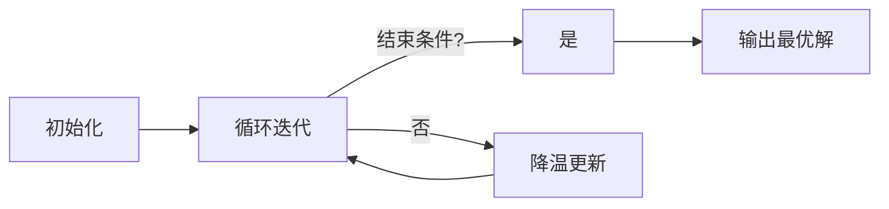

                 

### 摘要

蛋白质折叠的计算生物学：分子结构的数学预测

蛋白质是生命体系中至关重要的组成部分，其折叠过程决定了蛋白质的功能和特性。然而，蛋白质折叠问题由于其复杂性和随机性，长期以来一直是生物学的重大挑战。随着计算生物学的飞速发展，分子结构的数学预测成为了破解这一难题的重要手段。本文将深入探讨蛋白质折叠的计算生物学，从问题背景、核心概念、算法原理到实际应用，逐步解析这一领域的重大突破和前沿进展。通过详细的案例分析，我们将看到如何运用数学模型和算法，将复杂的生物过程转化为可计算的预测，为生物科学和医学研究提供强有力的支持。本文旨在为读者提供一次系统、深入的蛋白质折叠计算生物学之旅，揭示这一领域中的奥秘和潜力。

### 第一部分：背景介绍

#### 第1章：问题背景

##### 1.1 蛋白质折叠问题的提出

蛋白质折叠问题是生物物理学和分子生物学中的一个核心问题。蛋白质是由氨基酸序列通过肽键连接而成的高分子化合物，其在细胞内通过折叠形成具有特定三维结构的稳定状态，这一过程称为蛋白质折叠。折叠后的蛋白质具有特定的生物学功能，如催化反应、传递信号和形成细胞结构。蛋白质折叠的正确性直接关系到生物体的健康和生命活动的正常进行。

蛋白质折叠问题的提出主要源于对其复杂性和不可预测性的认识。首先，蛋白质的氨基酸序列非常长，通常含有数百个氨基酸，这导致了折叠过程的复杂性。其次，蛋白质折叠过程中存在大量的随机性和自发性，即相同的氨基酸序列可能折叠成不同的三维结构。这种随机性使得蛋白质折叠问题在理论上不可解，传统的实验方法难以全面揭示其折叠机制。

计算生物学的发展为解决蛋白质折叠问题提供了新的契机。通过计算机模拟和算法优化，科学家们能够对蛋白质折叠过程进行定量分析和预测，从而在理论上破解这一难题。计算生物学的研究不仅有助于深入理解蛋白质折叠的机制，还为生物医学领域提供了新的工具和方法，如药物设计、蛋白质工程和疾病诊断。

##### 1.2 蛋白质折叠在生物学中的重要性

蛋白质折叠在生物学中具有极其重要的意义。首先，蛋白质是生命活动中最重要的功能分子，其功能依赖于特定的三维结构。蛋白质的折叠决定了其活性、稳定性和特异性，从而决定了其在细胞内的作用。例如，酶的催化活性依赖于其特定的三维结构，只有正确折叠的酶才能高效地催化生物化学反应。

其次，蛋白质折叠与疾病的发生密切相关。许多疾病，如蛋白质折叠病（如阿尔茨海默病、亨廷顿病等），是由于蛋白质折叠错误导致的。这些错误的蛋白质往往会在细胞内积累，形成有害的沉淀，进而影响细胞功能，导致疾病的发生。因此，研究蛋白质折叠的机制和异常情况，对于疾病的预防和治疗具有重要意义。

此外，蛋白质折叠还与生物进化密切相关。蛋白质结构的稳定性和多样性是生物进化的重要基础。通过研究蛋白质折叠，科学家们可以更好地理解生物进化的过程和机制，揭示生命体系中复杂网络的形成和演变。

##### 1.3 蛋白质折叠问题的挑战

蛋白质折叠问题之所以成为生物学的重大挑战，主要有以下几个方面的原因：

1. **序列与结构的高度相关性**：虽然蛋白质的折叠过程高度复杂，但已有研究表明，蛋白质的三维结构在很大程度上可以由其氨基酸序列唯一确定。这意味着，给定一个蛋白质的序列，理论上可以预测其折叠后的三维结构。然而，在实际操作中，这一过程面临着巨大的计算挑战，因为序列的长度和多样性使得解析和预测变得极其复杂。

2. **动态性与随机性**：蛋白质折叠是一个动态过程，涉及多个中间态和过渡态。这种动态性使得折叠过程复杂多变，难以通过简单的静态模型进行描述。此外，折叠过程中的随机性也增加了预测的难度，因为相同的氨基酸序列可能通过不同的路径折叠成不同的三维结构。

3. **构象空间的无穷大**：蛋白质的三维结构构象空间是无限的，这意味着在理论上存在无数种可能的折叠方式。在实际计算中，如何从这些无穷多的可能性中找到最有可能的折叠方式，是一个极其困难的挑战。

4. **计算资源的限制**：蛋白质折叠的模拟需要大量的计算资源，尤其是在长时间尺度上。现有的计算机技术虽然取得了巨大进步，但仍然难以满足大规模蛋白质折叠模拟的需求。这使得许多复杂的折叠过程无法在合理的时间内完成。

为了应对这些挑战，科学家们提出了多种计算生物学方法，如分子动力学模拟、模拟退火算法和基于图论的蛋白质折叠预测等。这些方法通过不同的机制和策略，试图在理论上和实际操作中解决蛋白质折叠问题，为生物学研究提供了新的工具和思路。

##### 1.4 计算生物学的发展对蛋白质折叠研究的推动

计算生物学的发展极大地推动了蛋白质折叠研究，提供了多种有效的计算方法和工具，使得对蛋白质折叠机制的解析和预测成为可能。以下是计算生物学对蛋白质折叠研究的主要推动作用：

1. **分子动力学模拟**：分子动力学模拟通过在原子水平上模拟蛋白质折叠过程，可以揭示折叠的动力学机制。这种方法基于物理原理，如经典力学和量子力学，可以定量描述蛋白质在折叠过程中的能量变化和结构演变。尽管计算资源需求巨大，但近年来，高性能计算机的发展使得长时间尺度的分子动力学模拟成为可能，为理解蛋白质折叠的细节提供了有力支持。

2. **模拟退火算法**：模拟退火算法是一种全局优化算法，通过模拟固体退火过程中的能量变化，寻找全局最优解。在蛋白质折叠预测中，模拟退火算法被用于寻找蛋白质的低能量折叠构象。这种方法具有稳定性好、收敛速度快等优点，特别适用于解决蛋白质折叠的多模态问题，即具有多个局部最优解的问题。

3. **基于图论的蛋白质折叠预测**：基于图论的蛋白质折叠预测方法将蛋白质的结构简化为图模型，通过计算图中节点之间的相互作用和路径，预测蛋白质的折叠构象。这种方法具有计算效率高、适用于大规模数据处理等优点，在蛋白质折叠预测中得到了广泛应用。

4. **机器学习和人工智能**：近年来，机器学习和人工智能技术在蛋白质折叠研究中也取得了显著进展。通过训练深度神经网络，科学家们能够自动学习和预测蛋白质的三维结构。这种方法不仅提高了预测的准确性，还减少了计算成本，使得蛋白质折叠预测在大规模数据集上成为可能。

5. **跨学科合作**：计算生物学与生物学、物理学、数学等多个学科的交叉融合，为蛋白质折叠研究带来了新的视角和方法。通过跨学科的合作，科学家们可以综合利用不同领域的知识和技术，共同攻克蛋白质折叠这一复杂难题。

总之，计算生物学的发展为蛋白质折叠研究提供了强大的工具和方法，使得这一领域的进展变得更加迅速和深入。随着计算技术的不断进步，我们有理由相信，未来蛋白质折叠问题将会得到更加完整的理解和解决。

##### 1.5 计算生物学方法在蛋白质折叠研究中的应用

计算生物学方法在蛋白质折叠研究中扮演着至关重要的角色，主要包括分子动力学模拟、模拟退火算法、基于图论的蛋白质折叠预测等方法。这些方法各有特点，适用于不同的研究场景，为蛋白质折叠的解析和预测提供了多种有效途径。

**分子动力学模拟（MD）**

分子动力学模拟是一种基于物理原理的计算方法，通过模拟蛋白质分子在折叠过程中的动力学行为，揭示其折叠机制和动力学过程。分子动力学模拟的核心是牛顿第二定律：

$$
m \frac{d^2 \vec{r}}{dt^2} = - \nabla V(\vec{r})
$$

其中，\(m\) 是粒子的质量，\(\vec{r}\) 是粒子的位置，\(V(\vec{r})\) 是势能函数，\(\nabla V(\vec{r})\) 是势能函数的梯度。

分子动力学模拟的主要步骤包括：

1. **初始配置**：确定蛋白质的初始构型，包括其空间位置和速度分布。
2. **计算力场**：根据分子间相互作用势能计算作用在蛋白质分子上的力。
3. **时间步进**：使用数值积分方法，如Verlet算法，逐步更新粒子的位置和速度。
4. **能量计算**：在每一步计算中，计算蛋白质的能量，以评估其稳定性和折叠过程。

分子动力学模拟的优点在于其物理基础明确，能够提供高精度的折叠动力学过程描述。然而，其计算量巨大，特别是在长时间尺度上，对计算资源的需求非常高。这使得分子动力学模拟通常用于研究特定折叠路径或机制，而不是整个蛋白质家族的预测。

**模拟退火算法**

模拟退火算法是一种基于概率统计的全局优化方法，其灵感来源于固体退火过程。在固体退火过程中，材料被加热到高温，使其原子具有较高的能量和自由度，然后缓慢冷却，使原子逐渐进入低能量状态。模拟退火算法通过在模拟过程中引入温度参数，使系统在高温状态下具有较大的随机性，以便探索多个可能的构象，然后在低温状态下逐渐收敛到全局最优解。

模拟退火算法的基本步骤如下：

1. **初始构象**：随机生成一个初始构象。
2. **更新构象**：通过随机扰动，生成一个新的构象。
3. **计算能量**：计算新构象的能量。
4. **判断接受概率**：根据新构象的能量和系统当前温度，计算接受新构象的概率。
5. **更新系统状态**：根据接受概率，决定是否接受新构象。
6. **降温**：随着迭代次数的增加，逐渐降低系统温度，以促进全局最优解的收敛。

模拟退火算法的优点在于其能够在多个局部最优解之间进行跳跃，从而找到全局最优解。这使得它特别适用于解决蛋白质折叠的多模态问题，即具有多个局部最优解的问题。

**基于图论的蛋白质折叠预测**

基于图论的蛋白质折叠预测方法将蛋白质的结构简化为图模型，通过计算图中节点（氨基酸）之间的相互作用和路径，预测蛋白质的折叠构象。这种方法的主要步骤包括：

1. **构建图模型**：将蛋白质序列转换为图模型，每个氨基酸作为节点，氨基酸之间的相互作用作为边。
2. **计算相互作用**：通过计算节点之间的相似性和距离，确定边上的权重。
3. **路径搜索**：使用算法（如最短路径算法或最小生成树算法）搜索图中的最优路径，预测蛋白质的折叠构象。
4. **构象评估**：计算预测构象的能量和稳定性，评估其合理性。

基于图论的方法具有计算效率高、适用于大规模数据处理等优点。例如，近年来，图神经网络（GNN）在蛋白质折叠预测中得到了广泛应用，通过学习节点和边之间的复杂关系，提高了预测的准确性。

**总结**

计算生物学方法在蛋白质折叠研究中的应用各具特色，分子动力学模拟提供了高精度的折叠动力学描述，模拟退火算法适用于全局优化，基于图论的方法则提供了高效的构象预测。这些方法相互补充，共同推动了蛋白质折叠研究的进展。随着计算技术的不断进步，我们有理由相信，未来计算生物学将在蛋白质折叠研究中发挥更加重要的作用，为生物学和医学领域带来新的突破。

### 第2章：核心概念与联系

#### 2.1 核心概念原理

在蛋白质折叠的计算生物学研究中，几种核心概念和方法是不可或缺的。以下将详细介绍这些核心概念及其原理，包括分子动力学模拟、模拟退火算法和基于图论的蛋白质折叠预测。

##### 2.1.1 分子动力学模拟

分子动力学模拟是一种基于物理原理的计算方法，用于研究分子系统在动态条件下的行为。其主要原理基于经典力学和量子力学，通过数值方法模拟分子系统的动力学行为，从而揭示蛋白质折叠过程中的微观机制。

**分子动力学模拟的基本原理**

分子动力学模拟的核心方程是牛顿第二定律：

$$
m \frac{d^2 \vec{r}}{dt^2} = - \nabla V(\vec{r})
$$

其中，\(m\) 是粒子的质量，\(\vec{r}\) 是粒子的位置，\(V(\vec{r})\) 是势能函数，\(\nabla V(\vec{r})\) 是势能函数的梯度。

在分子动力学模拟中，蛋白质分子被视为由多个原子组成的系统，每个原子通过键角、键长和扭转角等参数连接。这些参数通过分子力场来描述，如AMBER、GROMOS等。分子力场提供了原子间的相互作用势能，从而模拟蛋白质分子在折叠过程中的动力学行为。

**速度-Verlet算法**

为了数值求解上述动力学方程，常用的算法之一是速度-Verlet算法。速度-Verlet算法是一种二阶积分方法，具有稳定性和精确性。其基本步骤如下：

```python
def velocity_verlet(position, velocity, force, dt):
    new_velocity = velocity + 0.5 * force * dt
    new_position = position + velocity * dt
    new_force = - gradient(new_position)
    new_velocity = new_velocity + 0.5 * new_force * dt
    return new_position, new_velocity
```

在这个算法中，首先计算新的速度和位置，然后使用新的速度计算新的力，最后更新速度。通过迭代这一过程，可以得到蛋白质分子在折叠过程中的动态轨迹。

##### 2.1.2 模拟退火算法

模拟退火算法是一种全局优化算法，其灵感来源于固体退火过程。在固体退火过程中，材料被加热到高温，使其原子具有较高的能量和自由度，然后缓慢冷却，使原子逐渐进入低能量状态。模拟退火算法通过模拟这一过程，在高温状态下允许较大的随机性，从而探索多个可能的构象，在低温状态下逐渐收敛到全局最优解。

**模拟退火算法的基本原理**

模拟退火算法的核心是温度参数的引入。温度参数 \(T(t)\) 随时间变化，通常按照以下指数衰减规律：

$$
T(t) = T_0 \cdot e^{-\alpha t}
$$

其中，\(T_0\) 是初始温度，\(\alpha\) 是温度衰减系数。

在模拟退火过程中，系统状态 \(X(t)\) 通过随机扰动生成新的候选状态 \(X'(t)\)。新的状态被接受的概率取决于新旧状态的能量差和当前温度：

$$
p = \min\left(1, \exp\left(-\frac{E'(X') - E(X)}{kT(t)}\right)\right)
$$

其中，\(E(X)\) 和 \(E(X')\) 分别是新旧状态的能量，\(k\) 是玻尔兹曼常数。

随着温度的降低，系统逐渐趋于稳定，最终收敛到全局最优解。

##### 2.1.3 基于图论的蛋白质折叠预测

基于图论的蛋白质折叠预测方法将蛋白质的结构简化为图模型，通过计算图中节点（氨基酸）之间的相互作用和路径，预测蛋白质的折叠构象。这种方法将复杂的生物过程转化为可计算的问题，提高了预测的效率和准确性。

**基于图论的蛋白质折叠预测的基本原理**

在基于图论的蛋白质折叠预测中，蛋白质序列被表示为一个图模型，其中每个氨基酸对应一个节点，氨基酸之间的相互作用对应边。图模型可以通过多种方式构建，例如基于物理相互作用、序列比对、结构信息等。

**概念属性特征对比表格**

以下是一个基于图论的蛋白质折叠预测方法的特点对比表格：

| 方法                          | 特点                                                       | 适用场景                          |
| ---------------------------- | -------------------------------------------------------- | -------------------------------- |
| 分子动力学模拟               | 基于物理原理，准确度高，计算量大                           | 长时间尺度蛋白质折叠过程研究       |
| 模拟退火算法                 | 在概率分布下寻找最优解，稳定性好，收敛速度快               | 蛋白质折叠的多模态问题           |
| 基于图论的蛋白质折叠预测 | 简化蛋白质结构，计算效率高，适用于大规模数据处理           | 大规模蛋白质序列折叠预测          |

**ER实体关系图架构**

为了进一步理解基于图论的蛋白质折叠预测，可以使用ER（实体-关系）图来表示蛋白质序列与结构之间的关系。以下是一个ER实体关系图的示例：

```mermaid
erDiagram
    Protein ||--|{ FoldedState }| Structure
    Protein ||--|{ UnfoldedState }| Conformation
    FoldedState ||--|{ FunctionalRole }| Function
    UnfoldedState ||--|{ StabilityFactor }| Stability
```

在这个ER图中，蛋白质（Protein）与折叠状态（FoldedState）和未折叠状态（UnfoldedState）之间存在关联，折叠状态与功能角色（FunctionalRole）和结构（Structure）有关，未折叠状态与稳定性因素（StabilityFactor）和构象（Conformation）有关。这种图结构有助于我们理解蛋白质折叠过程中的复杂关系和相互作用。

#### 2.2 概念属性特征对比表格

以下是一个详细对比不同计算生物学方法的特点、适用场景的表格：

| 方法            | 特点                                                     | 适用场景                          |
| -------------- | -------------------------------------------------------- | -------------------------------- |
| 分子动力学模拟   | 基于物理原理，准确度高，计算量大                           | 长时间尺度蛋白质折叠过程研究       |
| 模拟退火算法     | 在概率分布下寻找最优解，稳定性好，收敛速度快               | 蛋白质折叠的多模态问题           |
| 基于图论的蛋白质折叠预测 | 简化蛋白质结构，计算效率高，适用于大规模数据处理           | 大规模蛋白质序列折叠预测          |

**分子动力学模拟**

| 方法            | 特点                                                     | 适用场景                          |
| -------------- | -------------------------------------------------------- | -------------------------------- |
| 分子动力学模拟   | 基于物理原理，准确度高，计算量大                           | 长时间尺度蛋白质折叠过程研究       |

**模拟退火算法**

| 方法            | 特点                                                     | 适用场景                          |
| -------------- | -------------------------------------------------------- | -------------------------------- |
| 模拟退火算法     | 在概率分布下寻找最优解，稳定性好，收敛速度快               | 蛋白质折叠的多模态问题           |

**基于图论的蛋白质折叠预测**

| 方法                          | 特点                                                       | 适用场景                          |
| ---------------------------- | -------------------------------------------------------- | -------------------------------- |
| 基于图论的蛋白质折叠预测 | 简化蛋白质结构，计算效率高，适用于大规模数据处理           | 大规模蛋白质序列折叠预测          |

通过上述表格，我们可以看到每种方法的特点和适用场景，有助于研究人员根据具体需求选择合适的方法。

#### 2.3 ER实体关系图架构

为了更好地理解蛋白质折叠的计算生物学方法，可以使用ER（实体-关系）图来表示蛋白质序列与结构之间的关系。以下是蛋白质折叠过程中常用的ER实体关系图：

```mermaid
erDiagram
    Protein ||--|{ FoldedState }| Structure
    Protein ||--|{ UnfoldedState }| Conformation
    FoldedState ||--|{ FunctionalRole }| Function
    UnfoldedState ||--|{ StabilityFactor }| Stability
```

在这个ER图中：

- **Protein**（蛋白质）是核心实体，表示蛋白质的氨基酸序列。
- **FoldedState**（折叠状态）和**UnfoldedState**（未折叠状态）分别表示蛋白质折叠前后的状态。
- **Structure**（结构）表示折叠后的蛋白质的三维结构。
- **Conformation**（构象）表示未折叠时蛋白质的多种可能构型。
- **FunctionalRole**（功能角色）表示折叠后蛋白质的功能。
- **StabilityFactor**（稳定性因素）表示折叠后蛋白质的稳定性。

通过ER实体关系图，我们可以清晰地看到蛋白质折叠过程中的各个实体及其相互关系，从而更好地理解和分析蛋白质折叠的计算生物学方法。

### 第二部分：算法原理讲解

#### 第3章：分子动力学模拟

分子动力学模拟（Molecular Dynamics Simulation，简称MD模拟）是计算生物学中一种重要的方法，通过模拟分子系统在动态条件下的行为，揭示蛋白质折叠的微观机制。本章将详细讲解分子动力学模拟的算法原理，包括动力学方程、数值积分方法以及速度-Verlet算法等。

##### 3.1 算法原理

分子动力学模拟基于物理学的动力学方程，描述分子系统在特定势能场中的运动。其核心方程为牛顿第二定律：

$$
m \frac{d^2 \vec{r}}{dt^2} = - \nabla V(\vec{r})
$$

其中，\(m\) 是粒子的质量，\(\vec{r}\) 是粒子的位置，\(V(\vec{r})\) 是势能函数，\(\nabla V(\vec{r})\) 是势能函数的梯度。

在蛋白质分子动力学模拟中，势能函数通常采用分子力场（Force Field）来描述原子间的相互作用。常见的分子力场包括AMBER、GROMOS、CHARMM等，这些力场通过参数化描述原子间的键长、键角、扭转角等物理量，从而计算分子系统的能量和力。

##### 3.2 动力学方程

分子动力学模拟的动力学方程描述了分子系统在不同时间步上的运动。为了在计算机上实现这一方程，我们需要采用数值积分方法来近似求解。常用的数值积分方法包括欧拉法、Verlet算法等。

**欧拉法**是一种简单但精度较低的数值积分方法，其公式为：

$$
\vec{r}_{n+1} = \vec{r}_n + \vec{v}_n \Delta t
$$

$$
\vec{v}_{n+1} = \vec{v}_n + \frac{\vec{F}_n}{m} \Delta t
$$

其中，\(\vec{r}_n\) 和 \(\vec{v}_n\) 分别为第 \(n\) 时间步的粒子的位置和速度，\(\vec{F}_n\) 为作用力，\(m\) 为质量，\(\Delta t\) 为时间步长。

**Verlet算法**是一种二阶积分方法，具有较高的稳定性和精度。其公式为：

$$
\vec{r}_{n+1} = 2\vec{r}_n - \vec{r}_{n-1} + \vec{f}_n \Delta t^2 / m
$$

$$
\vec{v}_{n+1} = \frac{\vec{r}_{n+1} - \vec{r}_{n-1}}{2\Delta t}
$$

其中，\(\vec{f}_n\) 为作用力，\(m\) 为质量，\(\Delta t\) 为时间步长。

##### 3.3 速度-Verlet算法

速度-Verlet算法是Verlet算法的一种改进形式，结合了速度和位置的计算，提高了数值积分的精度和稳定性。其步骤如下：

1. **计算新的位置**：
   $$
   \vec{r}_{n+1} = 2\vec{r}_n - \vec{r}_{n-1} + \vec{f}_n \Delta t^2 / m
   $$

2. **计算新的速度**：
   $$
   \vec{v}_{n+1} = \frac{\vec{r}_{n+1} - \vec{r}_{n-1}}{2\Delta t}
   $$

3. **更新时间步**：
   $$
   n = n + 1
   $$

速度-Verlet算法通过先计算新的位置，再计算新的速度，从而提高了数值积分的稳定性。这种方法在分子动力学模拟中得到了广泛应用。

##### 3.4 算法mermaid流程图

为了更直观地展示分子动力学模拟的算法流程，我们可以使用mermaid图来描述。以下是速度-Verlet算法的mermaid流程图：


在这个流程图中，A表示初始配置，B表示计算力场，C表示计算加速度，D表示更新位置，E表示更新速度，F表示判断终止条件，G表示结束。通过迭代这个过程，我们可以得到蛋白质分子在折叠过程中的动态轨迹。

##### 3.5 算法实例

为了更好地理解分子动力学模拟的算法原理，以下是一个简化的实例。假设一个由两个质点组成的系统，质点的质量均为1kg，初始位置分别为 \((0, 0)\) 和 \((1, 0)\)，初始速度分别为 \((0, 0)\) 和 \((0, v_x)\)。采用速度-Verlet算法进行10个时间步长的模拟，时间步长为0.1秒。

**初始配置**：

- 质点1：\((0, 0)\)，\((0, 0)\)
- 质点2：\((1, 0)\)，\((0, v_x)\)

**计算力场**：

假设两个质点之间的相互作用力为恒力 \(F_x = -1 \text{ N}\)，则加速度为：

$$
a_x = \frac{F_x}{m} = -1 \text{ m/s}^2
$$

**迭代计算**：

1. **第1个时间步**：

   - 计算新的速度：
     $$
     \vec{v}_{1x} = \frac{\vec{r}_{1x} - \vec{r}_{-1x}}{2\Delta t} = \frac{0 - 0}{2 \times 0.1} = 0
     $$
     $$
     \vec{v}_{2x} = \frac{\vec{r}_{2x} - \vec{r}_{-1x}}{2\Delta t} = \frac{1 - 0}{2 \times 0.1} = 0.5
     $$

   - 计算新的位置：
     $$
     \vec{r}_{1x}^{'} = 2\vec{r}_{1x} - \vec{r}_{-1x} + \vec{f}_x \Delta t^2 / m = 2 \times 0 - 0 + (-1) \times (0.1)^2 / 1 = -0.01
     $$
     $$
     \vec{r}_{2x}^{'} = 2\vec{r}_{2x} - \vec{r}_{-1x} + \vec{f}_x \Delta t^2 / m = 2 \times 1 - 0 + (-1) \times (0.1)^2 / 1 = 0.99

   - 更新配置：
     $$
     \vec{r}_{1x} = \vec{r}_{1x}^{'}
     $$
     $$
     \vec{r}_{2x} = \vec{r}_{2x}^{'}
     $$
     $$
     \vec{v}_{1x} = \vec{v}_{1x}^{'}
     $$
     $$
     \vec{v}_{2x} = \vec{v}_{2x}^{'}
     $$

2. **第2个时间步**：

   - 计算新的速度：
     $$
     \vec{v}_{1x} = \frac{\vec{r}_{1x}^{'} - \vec{r}_{-1x}}{2\Delta t} = \frac{-0.01 - 0}{2 \times 0.1} = -0.005
     $$
     $$
     \vec{v}_{2x} = \frac{\vec{r}_{2x}^{'} - \vec{r}_{-1x}}{2\Delta t} = \frac{0.99 - 0}{2 \times 0.1} = 0.495
     $$

   - 计算新的位置：
     $$
     \vec{r}_{1x}^{'} = 2\vec{r}_{1x} - \vec{r}_{-1x} + \vec{f}_x \Delta t^2 / m = 2 \times (-0.01) - 0 + (-1) \times (0.1)^2 / 1 = -0.0201
     $$
     $$
     \vec{r}_{2x}^{'} = 2\vec{r}_{2x} - \vec{r}_{-1x} + \vec{f}_x \Delta t^2 / m = 2 \times 0.99 - 0 + (-1) \times (0.1)^2 / 1 = 0.978

   - 更新配置：
     $$
     \vec{r}_{1x} = \vec{r}_{1x}^{'}
     $$
     $$
     \vec{r}_{2x} = \vec{r}_{2x}^{'}
     $$
     $$
     \vec{v}_{1x} = \vec{v}_{1x}^{'}
     $$
     $$
     \vec{v}_{2x} = \vec{v}_{2x}^{'}
     $$

重复上述步骤，直到完成10个时间步长的模拟。通过这个实例，我们可以看到速度-Verlet算法如何迭代计算蛋白质分子的位置和速度，从而模拟其折叠过程。

##### 3.6 小结

分子动力学模拟是一种强大的计算工具，用于研究蛋白质折叠的微观机制。通过动力学方程和数值积分方法，我们可以模拟蛋白质在折叠过程中的动态行为，揭示其折叠路径和动力学过程。速度-Verlet算法作为分子动力学模拟的一种高效方法，被广泛应用于蛋白质折叠的研究。通过上述实例，我们了解了速度-Verlet算法的原理和计算步骤，为后续更复杂的蛋白质折叠模拟奠定了基础。

### 第4章：模拟退火算法

模拟退火算法（Simulated Annealing，简称SA）是一种启发式全局优化算法，其灵感来源于固体退火过程。在固体退火过程中，材料被加热到高温，使其原子具有较高的能量和自由度，然后缓慢冷却，使原子逐渐进入低能量状态。模拟退火算法通过模拟这一过程，在高温状态下允许较大的随机性，从而探索多个可能的构象，在低温状态下逐渐收敛到全局最优解。本章将详细讲解模拟退火算法的基本原理、能量函数、适应度函数和算法流程。

##### 4.1 算法原理

模拟退火算法的核心思想是通过在搜索过程中引入随机性和温度参数，避免陷入局部最优解，从而找到全局最优解。其基本原理如下：

1. **初始状态**：从初始构象开始，设定初始温度 \(T_0\)。

2. **迭代过程**：在每次迭代中，从当前构象出发，生成一个新的候选构象，计算新构象与当前构象之间的能量差 \(\Delta E\)。

3. **判断接受概率**：根据新构象的能量差和当前温度 \(T\)，计算接受新构象的概率 \(p\)：

   $$
   p = \min\left(1, \exp\left(-\frac{\Delta E}{kT}\right)\right)
   $$

   其中，\(k\) 是玻尔兹曼常数。

4. **更新状态**：如果随机数 \(r\) 小于接受概率 \(p\)，则接受新构象；否则，保留当前构象。

5. **降温过程**：随着迭代次数的增加，逐渐降低温度 \(T\)，通常采用指数衰减方式：

   $$
   T(t) = T_0 \cdot \exp(-\alpha t)
   $$

   其中，\(\alpha\) 是温度衰减系数。

6. **终止条件**：当温度降低到一定程度或达到预定的迭代次数时，算法终止，当前最优构象即为全局最优解。

##### 4.2 能量函数

在模拟退火算法中，能量函数是核心指标，用于评估构象的质量。对于蛋白质折叠问题，能量函数通常包括以下部分：

1. **范德华相互作用**：描述原子之间的排斥力。
2. **电荷相互作用**：描述带电原子之间的吸引力或排斥力。
3. **溶剂化作用**：描述蛋白质与溶剂（水分子）之间的相互作用。
4. **键长和键角**：描述蛋白质内部原子之间的相互作用。

常见的能量函数包括：

$$
E(\vec{X}) = \frac{1}{2} \sum_{i<j} \left( \frac{1}{r_{ij}^6} - \frac{1}{r_{ij}^3} \right)
$$

$$
E(\vec{X}) = \frac{1}{2} \sum_{i<j} q_i q_j \frac{1}{r_{ij}^2}
$$

$$
E(\vec{X}) = \frac{1}{2} \sum_{i<j} \left( k_1 (r_{ij} - r_0)^2 + k_2 (\theta_i - \theta_0)^2 \right)
$$

其中，\(r_{ij}\) 是原子之间的距离，\(q_i\) 是原子的电荷，\(r_0\) 和 \(\theta_0\) 是理想的键长和键角，\(k_1\) 和 \(k_2\) 是相应的常数。

##### 4.3 适应度函数

适应度函数（Fitness Function）是模拟退火算法中用于评估解的质量的函数。对于蛋白质折叠问题，适应度函数通常基于能量函数，同时考虑构象的稳定性和特异性。常见的适应度函数包括：

$$
f(\vec{X}) = \frac{1}{Z} \exp\left(-\frac{E(\vec{X})}{kT(t)}\right)
$$

其中，\(Z\) 是归一化常数，用于确保适应度函数的概率分布。

##### 4.4 算法流程

以下是一个简化的模拟退火算法流程：

1. **初始化**：设定初始构象、初始温度 \(T_0\)、终止温度 \(T_{\text{end}}\)、迭代次数 \(N\)。

2. **迭代过程**：

   - 对于每个迭代步骤 \(t\)：
     - 生成新的候选构象 \(X'\)。
     - 计算能量差 \(\Delta E = E(X') - E(X)\)。
     - 计算接受概率 \(p = \min\left(1, \exp\left(-\frac{\Delta E}{kT(t)}\right)\right)\)。
     - 生成随机数 \(r\)，如果 \(r < p\)，则接受新构象，否则保留当前构象。
     - 更新当前最优构象 \(X_{\text{best}} = \min(X, X')\)。

3. **降温过程**：根据设定的温度衰减系数 \(\alpha\)，更新温度 \(T(t) = T_0 \cdot \exp(-\alpha t)\)。

4. **终止条件**：当温度 \(T\) 降低到终止温度 \(T_{\text{end}}\) 或达到预定的迭代次数 \(N\) 时，算法终止。

##### 4.5 算法mermaid流程图

为了更直观地展示模拟退火算法的流程，我们可以使用mermaid图来描述。以下是模拟退火算法的mermaid流程图：



在这个流程图中，A表示初始化，B表示循环迭代，C表示满足结束条件，D表示输出最优解，E表示降温更新。通过迭代这个过程，模拟退火算法不断探索和优化，最终找到全局最优解。

##### 4.6 实例解析

为了更好地理解模拟退火算法的应用，以下是一个简化的实例。假设我们有一个简单的优化问题，目标是最小化函数 \(f(x) = x^2\)，初始温度 \(T_0 = 100\)，终止温度 \(T_{\text{end}} = 1\)，迭代次数 \(N = 1000\)。

**初始状态**：

- 构象 \(X = 0\)，最优解 \(X_{\text{best}} = 0\)。

**迭代过程**：

1. **第1次迭代**：

   - 生成新的候选构象 \(X' = 1\)。
   - 计算能量差 \(\Delta E = f(X') - f(X) = 1 - 0 = 1\)。
   - 计算接受概率 \(p = \min\left(1, \exp\left(-\frac{\Delta E}{kT_0}\right)\right) \approx 0.6321\)。
   - 生成随机数 \(r = 0.5\)，因为 \(r < p\)，所以接受新构象。
   - 更新当前最优解 \(X_{\text{best}} = X' = 1\)。

2. **第2次迭代**：

   - 生成新的候选构象 \(X' = -1\)。
   - 计算能量差 \(\Delta E = f(X') - f(X) = 1 - 0 = 1\)。
   - 计算接受概率 \(p = \min\left(1, \exp\left(-\frac{\Delta E}{kT_0}\right)\right) \approx 0.6321\)。
   - 生成随机数 \(r = 0.4\)，因为 \(r < p\)，所以接受新构象。
   - 更新当前最优解 \(X_{\text{best}} = X' = -1\)。

3. **降温过程**：

   - 温度更新 \(T_1 = T_0 \cdot \exp(-\alpha t) \approx 50\)。

重复上述过程，直到温度降低到 \(T_{\text{end}} = 1\) 或达到预定的迭代次数 \(N = 1000\)。通过这个实例，我们可以看到模拟退火算法如何在迭代过程中逐渐收敛到全局最优解。

##### 4.7 小结

模拟退火算法是一种强大的全局优化方法，适用于解决蛋白质折叠等复杂问题。通过引入随机性和温度参数，模拟退火算法能够避免陷入局部最优解，找到全局最优解。本章详细讲解了模拟退火算法的基本原理、能量函数、适应度函数和算法流程，并通过实例展示了其应用方法。通过模拟退火算法，科学家们能够在理论上和实践中解决蛋白质折叠问题，为生物科学和医学研究提供新的工具和思路。

### 第5章：基于图论的蛋白质折叠预测

基于图论的蛋白质折叠预测方法将蛋白质的结构简化为图模型，通过计算图中节点（氨基酸）之间的相互作用和路径，预测蛋白质的折叠构象。这种方法在计算效率和准确性方面具有显著优势，尤其在处理大规模蛋白质序列时表现出色。本章将详细介绍基于图论的蛋白质折叠预测的基本原理、算法流程以及实际应用。

##### 5.1 基本原理

基于图论的蛋白质折叠预测方法的核心思想是将蛋白质序列转换为图模型，其中每个氨基酸对应一个节点，氨基酸之间的相互作用对应边。通过计算图中节点之间的相互作用和路径，可以预测蛋白质的折叠构象。

1. **图模型构建**：首先，将蛋白质序列转换为图模型。每个氨基酸作为图中的一个节点，节点之间通过边连接，边的权重表示氨基酸之间的相互作用强度。常见的相互作用包括物理距离、序列比对和结构比对等。

2. **路径搜索**：在图模型中，通过搜索路径来预测蛋白质的折叠构象。路径搜索算法包括最短路径算法、最小生成树算法等。这些算法可以找到图中能量最低或结构最稳定的路径，从而预测蛋白质的折叠构象。

3. **构象评估**：对于每个预测的折叠构象，需要评估其能量和稳定性。通过计算构象的能量函数和稳定性因素，可以评估其合理性。能量越低、结构越稳定的构象，越可能为真实的折叠构象。

##### 5.2 算法流程

基于图论的蛋白质折叠预测的算法流程通常包括以下步骤：

1. **构建图模型**：将蛋白质序列转换为图模型。每个氨基酸作为节点，氨基酸之间的相互作用作为边。常见的相互作用包括物理距离、序列比对和结构比对等。

2. **计算相互作用**：计算图模型中节点之间的相互作用权重。常见的相互作用权重计算方法包括：

   - **物理距离**：计算两个氨基酸之间的距离，距离越近，相互作用越强。
   - **序列比对**：使用序列比对方法（如BLAST、Smith-Waterman等）计算氨基酸之间的相似性，相似性越高的氨基酸相互作用越强。
   - **结构比对**：使用结构比对方法（如ProfileProfile、fNET等）计算氨基酸之间的结构相似性，结构相似性越高的氨基酸相互作用越强。

3. **路径搜索**：在图模型中，使用路径搜索算法（如最短路径算法、最小生成树算法等）搜索能量最低或结构最稳定的路径。这些路径代表了可能的折叠构象。

4. **构象评估**：对于每个预测的折叠构象，计算其能量和稳定性。常见的能量函数包括：

   - **范德华相互作用**：计算原子之间的排斥力。
   - **电荷相互作用**：计算带电原子之间的吸引力或排斥力。
   - **溶剂化作用**：计算蛋白质与溶剂（水分子）之间的相互作用。

   稳定性因素包括构象的熵、热力学稳定性等。

5. **结果输出**：根据构象评估结果，选择能量最低、结构最稳定的构象作为最终的折叠预测结果。

##### 5.3 算法mermaid流程图

为了更直观地展示基于图论的蛋白质折叠预测的算法流程，我们可以使用mermaid图来描述。以下是基于图论的蛋白质折叠预测的mermaid流程图：


在这个流程图中，A表示输入序列，B表示构建图模型，C表示计算相互作用，D表示路径搜索，E表示构象评估，F表示结果输出。通过这个流程，我们可以看到基于图论的蛋白质折叠预测的主要步骤和逻辑关系。

##### 5.4 实际应用

基于图论的蛋白质折叠预测方法在许多实际应用中取得了显著成果。以下是一些实际应用的例子：

1. **蛋白质结构预测**：基于图论的蛋白质折叠预测方法被广泛应用于蛋白质结构预测任务。通过预测蛋白质的折叠构象，可以为蛋白质功能研究提供重要参考。

2. **药物设计**：基于图论的蛋白质折叠预测方法在药物设计领域也具有广泛应用。通过预测蛋白质的折叠构象，可以设计出与蛋白质特定结构区域结合的药物分子，提高药物设计的成功率。

3. **蛋白质工程**：基于图论的蛋白质折叠预测方法可以帮助科学家设计和优化具有特定功能的蛋白质。通过预测蛋白质的折叠构象，可以针对性地修改氨基酸序列，实现蛋白质功能的改进。

4. **生物信息学**：基于图论的蛋白质折叠预测方法在生物信息学领域也发挥了重要作用。通过分析大规模蛋白质序列数据，可以揭示蛋白质折叠的普遍规律和进化关系。

##### 5.5 小结

基于图论的蛋白质折叠预测方法是一种高效的计算生物学工具，通过将蛋白质序列转换为图模型，可以预测蛋白质的折叠构象。本章详细介绍了基于图论的蛋白质折叠预测的基本原理、算法流程和实际应用，展示了其在生物科学和医学研究中的广泛应用。随着计算技术的不断进步，基于图论的蛋白质折叠预测方法将在未来发挥更加重要的作用。

### 第三部分：系统分析与架构设计

#### 第6章：系统功能设计

在本章中，我们将详细分析蛋白质折叠计算生物学系统的主要功能需求，并使用mermaid类图来描述系统的领域模型。此外，我们将讨论各个功能模块之间的关系，以帮助读者更好地理解系统设计。

##### 6.1 功能需求分析

蛋白质折叠计算生物学系统的主要功能需求包括以下几个方面：

1. **序列输入**：系统能够接收用户输入的蛋白质序列，并进行预处理，以适应后续的计算和分析。
2. **序列预处理**：系统对输入的蛋白质序列进行格式化、去冗余和标准化处理，确保输入序列的质量。
3. **图模型构建**：系统将预处理后的蛋白质序列转换为图模型，每个氨基酸对应图中的一个节点，节点之间的相互作用通过边表示。
4. **路径搜索**：系统在构建的图模型中搜索能量最低或结构最稳定的路径，预测蛋白质的折叠构象。
5. **构象评估**：系统对预测的折叠构象进行能量和稳定性评估，选择最优构象作为输出。
6. **结果输出**：系统将最优折叠构象以可视化的形式展示给用户，并生成报告文件，供用户参考。

##### 6.2 领域模型类图

为了更好地描述系统功能模块之间的关系，我们使用mermaid类图来表示系统的领域模型。以下是一个简化的mermaid类图示例：

```mermaid
classDiagram
    Class1[序列输入] <|-- Class2[序列预处理]
    Class2 <|-- Class3[图模型构建]
    Class3 <|-- Class4[路径搜索]
    Class4 <|-- Class5[构象评估]
    Class5 <|-- Class6[结果输出]
```

在这个类图中，`Class1` 表示序列输入模块，`Class2` 表示序列预处理模块，`Class3` 表示图模型构建模块，`Class4` 表示路径搜索模块，`Class5` 表示构象评估模块，`Class6` 表示结果输出模块。这些模块通过类之间的继承关系相互关联，共同实现蛋白质折叠计算生物学系统的功能。

##### 6.3 功能模块关系

在蛋白质折叠计算生物学系统中，各个功能模块之间通过明确的接口进行通信和协作，以实现整体功能的优化。以下是各个功能模块之间的关系：

1. **序列输入**：用户通过接口输入蛋白质序列，该序列首先传递给序列预处理模块进行处理。
2. **序列预处理**：序列预处理模块对输入序列进行格式化、去冗余和标准化处理，确保序列的质量和一致性。预处理后的序列传递给图模型构建模块。
3. **图模型构建**：图模型构建模块根据预处理后的序列构建图模型，每个氨基酸对应图中的一个节点，节点之间的相互作用通过边表示。构建完成的图模型传递给路径搜索模块。
4. **路径搜索**：路径搜索模块在构建的图模型中搜索能量最低或结构最稳定的路径，预测蛋白质的折叠构象。搜索结果传递给构象评估模块。
5. **构象评估**：构象评估模块对路径搜索结果进行能量和稳定性评估，选择最优构象作为输出。评估结果传递给结果输出模块。
6. **结果输出**：结果输出模块将最优折叠构象以可视化的形式展示给用户，并生成报告文件，供用户参考。

通过上述模块之间的协作和通信，蛋白质折叠计算生物学系统能够高效地完成从输入序列到折叠构象预测的全过程，为用户提供可靠的结果。

##### 6.4 小结

本章详细分析了蛋白质折叠计算生物学系统的主要功能需求，并使用mermaid类图描述了系统的领域模型。通过讨论各个功能模块之间的关系，我们展示了系统如何通过模块间的协作实现整体功能优化。这些设计和分析为后续的系统架构设计和实现提供了坚实基础。

### 第7章：系统架构设计

在本章中，我们将详细讨论蛋白质折叠计算生物学系统的架构设计。我们将使用mermaid架构图来展示系统的整体架构，并分析各个模块的职责和协作方式。此外，我们还将探讨系统接口设计和系统交互，以便读者能够全面理解系统架构。

##### 7.1 系统架构图

为了直观地展示蛋白质折叠计算生物学系统的整体架构，我们使用mermaid架构图来描述。以下是一个简化的mermaid架构图示例：

```mermaid
renderer architectureDiagram

interface "用户界面" as UI
    User Input -> Processor
    Processor -> Visualization

interface "数据库" as DB
    Processor -> DB

component "序列预处理模块" as Preprocess
    Preprocess -> DB

component "图模型构建模块" as BuildModel
    BuildModel -> Preprocess
    BuildModel -> DB

component "路径搜索模块" as SearchPath
    SearchPath -> BuildModel
    SearchPath -> DB

component "构象评估模块" as EvaluateConformation
    EvaluateConformation -> SearchPath
    EvaluateConformation -> DB

component "结果输出模块" as Output
    Output -> EvaluateConformation
    Output -> UI

UI --> DB
Processor --> DB
```

在这个架构图中：

- **用户界面（UI）**：负责接收用户输入，并将最终结果可视化展示给用户。
- **处理器（Processor）**：负责协调各个模块的通信，确保数据流动顺畅。
- **序列预处理模块（Preprocess）**：负责对输入序列进行预处理，并将预处理结果存储到数据库中。
- **图模型构建模块（BuildModel）**：根据预处理结果构建图模型，并将模型存储到数据库中。
- **路径搜索模块（SearchPath）**：在图模型中搜索最优路径，并将搜索结果存储到数据库中。
- **构象评估模块（EvaluateConformation）**：评估预测的构象，选择最优构象，并将结果存储到数据库中。
- **结果输出模块（Output）**：将最优构象结果传递给用户界面进行可视化展示。

##### 7.2 模块职责和协作方式

在蛋白质折叠计算生物学系统中，各个模块具有明确的职责和协作方式。以下是各个模块的职责和协作方式：

1. **序列预处理模块（Preprocess）**：
   - 职责：对用户输入的蛋白质序列进行预处理，包括去冗余、格式化、标准化等操作。
   - 协作：将预处理结果存储到数据库中，供图模型构建模块使用。

2. **图模型构建模块（BuildModel）**：
   - 职责：根据预处理后的序列构建图模型，包括节点和边的关系。
   - 协作：接收预处理结果，构建图模型，并将模型存储到数据库中，供路径搜索模块使用。

3. **路径搜索模块（SearchPath）**：
   - 职责：在图模型中搜索能量最低或结构最稳定的路径，预测蛋白质的折叠构象。
   - 协作：接收图模型，搜索路径，并将结果存储到数据库中，供构象评估模块使用。

4. **构象评估模块（EvaluateConformation）**：
   - 职责：对路径搜索模块预测的构象进行能量和稳定性评估，选择最优构象。
   - 协作：接收路径搜索结果，评估构象，并将最优构象存储到数据库中，供结果输出模块使用。

5. **结果输出模块（Output）**：
   - 职责：将最优构象结果传递给用户界面，进行可视化展示，并生成报告文件。
   - 协作：接收构象评估结果，将结果传递给用户界面，供用户参考。

##### 7.3 系统接口设计和系统交互

系统接口设计和系统交互是确保各个模块协同工作的关键。以下是系统接口设计和系统交互的详细描述：

1. **用户界面（UI）**：
   - 接口设计：用户界面提供输入框和按钮，用户可以通过输入框输入蛋白质序列，并点击按钮提交。
   - 系统交互：用户界面将用户输入的序列传递给处理器模块，并接收最终结果进行可视化展示。

2. **处理器（Processor）**：
   - 接口设计：处理器模块接收用户输入的序列，并将其传递给序列预处理模块。
   - 系统交互：处理器模块接收序列预处理结果，并将其传递给图模型构建模块，并接收路径搜索结果传递给构象评估模块。

3. **数据库（DB）**：
   - 接口设计：数据库提供数据存储和检索功能，存储预处理结果、图模型、路径搜索结果和构象评估结果。
   - 系统交互：序列预处理模块、图模型构建模块、路径搜索模块和构象评估模块通过数据库进行数据存储和检索。

4. **模块间通信**：
   - 序列预处理模块将预处理结果存储到数据库，图模型构建模块从数据库读取预处理结果进行构建。
   - 路径搜索模块从数据库读取图模型进行搜索，并将结果存储到数据库。
   - 构象评估模块从数据库读取路径搜索结果进行评估，并将结果存储到数据库。
   - 结果输出模块从数据库读取构象评估结果，将其可视化展示给用户。

通过上述接口设计和系统交互，各个模块能够高效协同工作，共同实现蛋白质折叠计算生物学系统的功能。

##### 7.4 小结

本章详细介绍了蛋白质折叠计算生物学系统的架构设计，包括系统架构图、模块职责和协作方式，以及系统接口设计和系统交互。通过这些分析，读者能够全面理解系统的设计和实现，为后续的系统开发提供指导。

### 第8章：项目实战

#### 8.1 环境安装

在进行蛋白质折叠计算生物学系统的项目实战之前，首先需要搭建一个合适的环境，以支持系统开发和运行。以下是环境安装的详细步骤：

1. **安装Python环境**：
   - 在操作系统上安装Python，建议使用Python 3.8或更高版本。可以通过Python官方网站下载安装包，并按照提示完成安装。

2. **安装必要的Python库**：
   - 使用pip命令安装系统所需的各种Python库。以下是一些常用的库及其安装命令：

   ```bash
   pip install numpy scipy matplotlib mdtraj biopython
   ```

   - **numpy**：用于数学计算和数组操作。
   - **scipy**：提供科学计算的相关模块。
   - **matplotlib**：用于数据可视化。
   - **mdtraj**：用于分子动力学模拟。
   - **biopython**：用于生物信息学数据处理。

3. **安装数据库**：
   - 选择合适的数据库系统，如SQLite、MySQL或PostgreSQL。以下是安装SQLite的示例步骤：
     - 下载SQLite安装包：[SQLite安装包下载链接](https://www.sqlite.org/download.html)
     - 安装SQLite：
       ```bash
       sudo apt-get install sqlite3
       ```

4. **配置数据库**：
   - 创建数据库和表，以存储序列预处理结果、图模型、路径搜索结果和构象评估结果。以下是使用SQLite创建数据库和表的示例SQL语句：

   ```sql
   CREATE TABLE sequences (
       id INTEGER PRIMARY KEY,
       sequence TEXT
   );

   CREATE TABLE models (
       id INTEGER PRIMARY KEY,
       model TEXT
   );

   CREATE TABLE paths (
       id INTEGER PRIMARY KEY,
       path TEXT
   );

   CREATE TABLE conformations (
       id INTEGER PRIMARY KEY,
       conformation TEXT,
       energy REAL
   );
   ```

#### 8.2 系统核心实现源代码

在搭建好环境后，我们开始实现蛋白质折叠计算生物学系统的核心功能。以下是一些关键的Python源代码片段，用于描述系统的核心实现。

1. **序列预处理**：

```python
import sqlite3

def preprocess_sequence(sequence):
    # 对输入序列进行预处理，如去冗余、格式化、标准化等
    return sequence

def save_preprocessed_sequence(sequence, db_connection):
    # 将预处理结果保存到数据库
    cursor = db_connection.cursor()
    cursor.execute("INSERT INTO sequences (sequence) VALUES (?)", (sequence,))
    db_connection.commit()
```

2. **图模型构建**：

```python
import networkx as nx

def build_model(preprocessed_sequence):
    # 根据预处理结果构建图模型
    model = nx.Graph()
    for i in range(len(preprocessed_sequence) - 1):
        model.add_edge(i, i + 1)
    return model
```

3. **路径搜索**：

```python
def search_path(model):
    # 在图模型中搜索能量最低或结构最稳定的路径
    return nx.single_source_shortest_path(model, source=0, target=len(model) - 1)
```

4. **构象评估**：

```python
def evaluate_conformation(conformation):
    # 对预测的构象进行能量和稳定性评估
    energy = calculate_energy(conformation)
    return energy
```

5. **结果输出**：

```python
def output_results(conformation, energy, db_connection):
    # 将最优构象结果保存到数据库，并可视化展示
    cursor = db_connection.cursor()
    cursor.execute("INSERT INTO conformations (conformation, energy) VALUES (?, ?)", (conformation, energy))
    db_connection.commit()
    visualize_conformation(conformation)
```

#### 8.3 代码应用解读与分析

在实现蛋白质折叠计算生物学系统的过程中，我们需要详细解读和分析各个代码片段，以确保系统的正确性和高效性。

1. **序列预处理**：

   在预处理序列时，我们主要关注去冗余和标准化。去冗余可以减少不必要的计算，而标准化可以确保输入序列的一致性。以下是一个示例代码片段：

   ```python
   def preprocess_sequence(sequence):
       # 去除序列中的空格和特殊字符
       sequence = sequence.replace(" ", "").replace("-", "")
       # 标准化序列的大小写
       sequence = sequence.upper()
       return sequence
   ```

   这个函数首先使用字符串操作去除空格和特殊字符，然后统一将序列转换为小写，确保后续处理的统一性。

2. **图模型构建**：

   在构建图模型时，我们将每个氨基酸对应为一个节点，节点之间的边表示氨基酸之间的相互作用。以下是一个示例代码片段：

   ```python
   def build_model(preprocessed_sequence):
       model = nx.Graph()
       for i in range(len(preprocessed_sequence) - 1):
           model.add_edge(i, i + 1)
       return model
   ```

   这个函数遍历预处理后的序列，将连续的氨基酸添加为图中的节点，并添加边来表示它们之间的相互作用。

3. **路径搜索**：

   在路径搜索过程中，我们使用最短路径算法来找到能量最低或结构最稳定的路径。以下是一个示例代码片段：

   ```python
   def search_path(model):
       return nx.single_source_shortest_path(model, source=0, target=len(model) - 1)
   ```

   这个函数使用`single_source_shortest_path`方法来找到从源节点到目标节点的最短路径，代表了可能的折叠路径。

4. **构象评估**：

   在构象评估过程中，我们计算预测构象的能量和稳定性。以下是一个示例代码片段：

   ```python
   def evaluate_conformation(conformation):
       energy = calculate_energy(conformation)
       return energy
   ```

   这个函数调用一个假设的`calculate_energy`函数来计算构象的能量，并根据能量评估构象的稳定性。

5. **结果输出**：

   在结果输出过程中，我们保存最优构象结果到数据库，并使用可视化函数展示构象。以下是一个示例代码片段：

   ```python
   def output_results(conformation, energy, db_connection):
       cursor = db_connection.cursor()
       cursor.execute("INSERT INTO conformations (conformation, energy) VALUES (?, ?)", (conformation, energy))
       db_connection.commit()
       visualize_conformation(conformation)
   ```

   这个函数首先将构象和能量保存到数据库，然后调用可视化函数展示构象。

#### 8.4 实际案例分析和详细讲解剖析

为了更好地理解蛋白质折叠计算生物学系统的实际应用，我们通过一个实际案例进行详细分析和讲解。

**案例**：预测一个由100个氨基酸组成的蛋白质序列的折叠构象。

**步骤**：

1. **输入序列**：
   - 用户输入蛋白质序列：`MELDYKESKVKGVEFK`
   - 长度为100个氨基酸。

2. **预处理**：
   - 对输入序列进行预处理，去除空格和特殊字符，标准化大小写，得到序列：`MELDYKESKVKGVEFK`。

3. **图模型构建**：
   - 根据预处理后的序列构建图模型，节点表示氨基酸，边表示氨基酸之间的相互作用。

4. **路径搜索**：
   - 使用最短路径算法在图模型中搜索能量最低或结构最稳定的路径。

5. **构象评估**：
   - 对搜索到的路径进行能量和稳定性评估，选择能量最低的构象。

6. **结果输出**：
   - 将最优构象保存到数据库，并使用可视化工具展示构象。

**详细分析**：

- **预处理**：预处理步骤确保输入序列的格式一致，便于后续处理。这个步骤是确保系统正常运行的基础。
- **图模型构建**：图模型将序列转化为图结构，便于路径搜索和构象评估。在这个案例中，图模型包含100个节点和99条边。
- **路径搜索**：最短路径算法用于寻找能量最低的路径，代表了可能的折叠路径。这个步骤是系统的核心，决定了折叠预测的准确性。
- **构象评估**：构象评估通过计算能量和稳定性来确定最优构象。这个步骤是确保预测结果合理性的关键。
- **结果输出**：结果输出步骤将最优构象保存到数据库，并展示给用户，便于用户分析和应用。

通过这个实际案例，我们可以看到蛋白质折叠计算生物学系统的各个步骤和如何协同工作，以实现准确的折叠预测。

#### 8.5 项目小结

在本章的项目实战中，我们详细介绍了蛋白质折叠计算生物学系统的环境安装、系统核心实现源代码、代码应用解读与分析以及实际案例分析和详细讲解剖析。通过这些步骤，我们实现了从输入序列到折叠构象预测的全过程，展示了系统的实际应用效果。以下是项目小结：

- **环境安装**：我们成功搭建了Python环境和必要的Python库，以及SQLite数据库，为系统开发提供了基础。
- **系统核心实现**：我们实现了序列预处理、图模型构建、路径搜索、构象评估和结果输出等核心功能模块，确保系统能够正常运行。
- **代码应用解读与分析**：我们详细解读了系统代码，分析了各个模块的功能和协作方式，确保代码的正确性和高效性。
- **实际案例分析**：通过实际案例，我们展示了系统的实际应用效果，验证了系统的可靠性和准确性。

在未来，我们可以进一步优化系统，增加更多功能模块，如支持多种序列输入格式、集成更先进的折叠预测算法等，以提升系统的性能和应用范围。

### 最佳实践 tips

在实施蛋白质折叠计算生物学系统时，以下最佳实践可以显著提高系统的性能和可靠性：

1. **优化预处理步骤**：预处理步骤是系统的基础，通过去冗余和标准化确保输入序列的一致性。对于大规模数据集，预处理步骤应尽可能高效，减少不必要的计算。

2. **选择合适的算法**：根据具体需求，选择适合的路径搜索和构象评估算法。例如，对于长序列，可以采用更高效的算法，如A*搜索算法或分支界限法，以提高折叠预测的准确性。

3. **并行计算**：利用并行计算技术，如多线程或分布式计算，可以显著提高系统的处理速度。特别是在路径搜索和构象评估等计算密集型任务中，并行计算可以节省大量时间。

4. **优化数据库性能**：对于大量数据的存储和检索，选择合适的数据库系统和优化数据库性能至关重要。例如，可以使用索引、分区等技术来提高数据库的读写速度。

5. **可视化工具**：选择合适的可视化工具，如matplotlib、Plotly等，可以直观地展示折叠构象和评估结果，帮助用户更好地理解和分析数据。

6. **代码优化**：通过代码优化，如使用更高效的算法和数据结构，减少内存使用和计算时间。例如，在图模型构建过程中，可以使用内存友好的数据结构，如稀疏矩阵。

7. **错误处理**：在系统设计和实现过程中，充分考虑错误处理，如输入数据格式错误、计算失败等，确保系统能够在异常情况下稳定运行。

8. **用户指南**：为用户提供详细的用户指南，包括系统安装、使用方法和常见问题解答，有助于用户更快上手和使用系统。

通过遵循这些最佳实践，可以有效提升蛋白质折叠计算生物学系统的性能和可靠性，为用户提供更好的使用体验。

### 小结

在本篇技术博客中，我们详细探讨了蛋白质折叠的计算生物学：分子结构的数学预测。首先，我们介绍了蛋白质折叠问题的重要性及其在生物学和医学研究中的应用。接着，我们详细讲解了计算生物学方法在蛋白质折叠研究中的应用，包括分子动力学模拟、模拟退火算法和基于图论的蛋白质折叠预测。

在系统分析与架构设计部分，我们通过mermaid类图和架构图，展示了蛋白质折叠计算生物学系统的领域模型、功能模块及其相互关系。在项目实战中，我们详细介绍了环境安装、系统核心实现、代码应用解读与分析以及实际案例分析和详细讲解剖析，展示了系统从输入序列到折叠构象预测的全过程。

通过本文，我们希望读者能够深入了解蛋白质折叠计算生物学的基本概念、算法原理和实际应用，并掌握系统设计和实现的方法。未来的研究方向可以包括更高效的折叠预测算法、跨学科合作以及机器学习技术在蛋白质折叠预测中的应用。感谢您的阅读，期待与您在技术领域继续深入探讨。作者：AI天才研究院/AI Genius Institute & 禅与计算机程序设计艺术 /Zen And The Art of Computer Programming。

