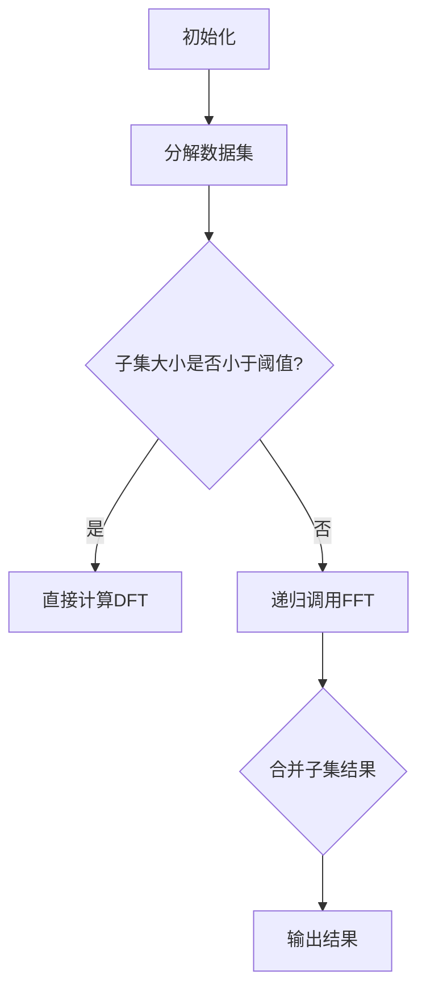
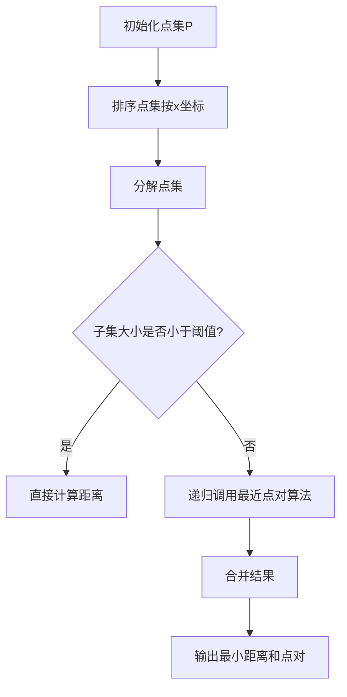
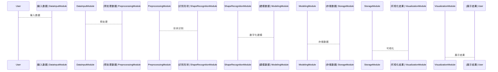

                 

### 文章标题

### 关键词

计算几何，自然形状，数字化处理，算法原理，数学模型，系统架构，项目实战

### 摘要

本文将深入探讨计算几何在自然形状数字化处理中的应用。首先，我们会回顾计算几何的起源和发展，明确其在现代科技中的重要性。接着，我们将探讨自然形状数字化处理的必要性，包括其复杂性、优势以及面临的挑战。随后，我们将介绍计算几何中的核心概念和主要算法，并通过实例详细讲解这些算法的原理和实现。文章还将深入数学模型和系统架构设计，通过一个实际案例展示如何将理论应用到实践中。最后，我们将总结最佳实践，并提供相关的拓展阅读资源，帮助读者进一步深入学习和研究。通过这一系列的探讨，读者将能够更好地理解计算几何在自然形状数字化处理中的关键作用。

## 第1章 问题背景与概述

### 1.1 计算几何的起源与发展

计算几何，作为一门交叉学科，起源于数学与计算机科学的交汇点。其历史可以追溯到20世纪中叶，当时计算机刚刚开始普及，数学家们开始探索如何利用计算机来解决几何问题。最早的计算几何研究主要集中在平面几何和立体几何的基本问题上，如点、线、面的计算和图形的绘制。

**计算几何的定义**

计算几何是一门研究几何对象（如点、线、面）在计算机中表示、存储、变换、计算和分析的学科。它不仅涉及基本的几何概念，还包括数值分析、算法设计和数据结构等领域的知识。

**计算几何的应用领域**

计算几何的应用领域非常广泛，涵盖了从科学计算到工业设计的各个领域。以下是几个典型的应用：

1. **计算机图形学**：在三维建模、动画制作和虚拟现实中，计算几何用于处理三维几何形状的生成和渲染。
2. **地理信息系统（GIS）**：在GIS中，计算几何用于地图绘制、地形分析和空间数据的处理。
3. **机械工程**：在CAD（计算机辅助设计）系统中，计算几何用于设计复杂的机械零件和结构。
4. **计算机视觉**：计算几何用于处理图像中的几何形状识别和场景重建。
5. **机器人学**：在机器人路径规划和机器人控制中，计算几何用于确定机器人的运动轨迹和操作范围。

**计算几何的发展历程**

计算几何的发展历程大致可以分为以下几个阶段：

1. **早期阶段（1950s-1960s）**：计算几何的早期研究主要集中在基本几何问题的算法实现上，如线段相交检测、多边形面积计算等。
2. **发展阶段（1970s-1980s）**：随着计算机硬件和软件的快速发展，计算几何的研究范围不断扩大，包括几何算法的优化、几何数据的结构化和高效几何计算方法。
3. **成熟阶段（1990s-2000s）**：计算几何在计算机图形学、计算机视觉和GIS等领域的应用得到了广泛的认可，成为这些领域不可或缺的一部分。
4. **现代阶段（2010s至今）**：随着大数据和人工智能技术的发展，计算几何的应用进一步扩展，包括复杂几何形状的处理、机器学习中的几何建模等。

### 1.2 自然形状数字化处理的必要性

自然形状通常具有复杂、不规则和高维度的特点，这使得直接对其进行处理和分析变得非常困难。将自然形状数字化处理，即通过计算机技术将自然形状转化为数字形式，可以有效地解决这一问题。

**自然形状的复杂性**

自然形状的复杂性主要体现在以下几个方面：

1. **形状多样性**：自然形状种类繁多，从简单的几何图形到复杂的生物形态，形状的多样性给数字化处理带来了挑战。
2. **不规则性**：许多自然形状是非规则的，如树叶、云彩和人体等，这些不规则性增加了数字化处理的难度。
3. **高维度**：自然形状往往存在于三维空间或更高维度的空间中，高维度数据增加了处理和分析的复杂性。

**数字化处理的优势**

数字化处理自然形状具有以下优势：

1. **可操作性强**：数字化后的自然形状可以方便地进行各种几何操作，如平移、旋转、缩放和变形等。
2. **易于存储和传输**：数字化后的形状数据可以以数字形式存储和传输，大大提高了数据的处理效率和可访问性。
3. **数据结构化**：数字化处理可以将自然形状转化为结构化的数据形式，便于后续的数据分析和建模。

**数字化处理的挑战**

尽管数字化处理自然形状具有诸多优势，但同时也面临一些挑战：

1. **数据量大**：自然形状的数字化处理通常涉及大量的数据，这给数据存储和处理带来了压力。
2. **计算复杂度高**：复杂的自然形状处理往往需要复杂的计算方法和高性能的硬件支持。
3. **精度问题**：在数字化处理过程中，如何保证数据的精度是一个重要问题，特别是对于细节丰富的自然形状。

### 1.3 数字化处理的边界与外延

数字化处理的边界主要涉及以下几个方面：

1. **采样精度**：采样精度决定了数字化处理结果的精确度，过低的采样精度会导致数据丢失，过高的采样精度则会增加计算负担。
2. **数据类型**：数字化处理可以采用不同类型的数据结构，如点云、三角网格和体素等，每种数据结构都有其适用的场景和局限性。
3. **处理算法**：数字化处理需要选择合适的算法，如基于几何计算的算法和基于机器学习的算法，每种算法都有其优缺点。

数字化处理的外延则包括：

1. **数据可视化**：通过数字化处理后的数据，可以生成各种形式的数据可视化，如三维图形、热图和表面渲染等。
2. **数据分析和建模**：数字化处理后的自然形状数据可以用于各种数据分析和建模任务，如形状识别、形状分析和形状生成等。
3. **应用拓展**：数字化处理技术可以广泛应用于各个领域，如生物医学、材料科学、地理信息系统和计算机游戏等。

通过以上对计算几何的起源、发展、自然形状数字化处理的必要性和边界与外延的探讨，我们可以更好地理解计算几何在自然形状数字化处理中的重要性。接下来，我们将深入探讨计算几何中的核心概念和联系，为后续的内容打下基础。

### 2.1 计算几何中的基本概念

计算几何作为一门研究几何对象在计算机中表示和处理的方法的学科，离不开一些基本概念的理解。这些基本概念包括点、线、面等，它们是计算几何的基础，也是各种复杂几何计算的基础。

#### 2.1.1 点、线、面

1. **点**：点是最基本的几何对象，用来表示空间中的一个位置。在计算机中，一个点的位置通常用二维或三维坐标来表示。例如，在二维空间中，一个点可以用一个(x, y)的坐标对来表示；在三维空间中，一个点可以用一个(x, y, z)的坐标三元组来表示。

    $$ P = (x, y, z) $$

2. **线**：线是由两个点确定的，表示连接这两个点的路径。线在计算机中通常用直线方程来表示，如二维空间中的一条直线可以用一般形式的线性方程表示：

    $$ Ax + By + C = 0 $$

3. **面**：面是由三个或更多点确定的一个二维几何对象，它表示一个平面。在计算机中，一个平面可以用一个平面方程来表示，如：

    $$ Ax + By + Cz + D = 0 $$

#### 2.1.2 向量与矩阵

1. **向量**：向量是具有大小和方向的几何对象，在计算几何中，向量用于表示点之间的相对位置、力、速度等。向量的基本运算包括加法、减法、标量乘法和向量乘法。例如，两个向量的点积（内积）可以用以下公式表示：

    $$ \vec{a} \cdot \vec{b} = a_x \cdot b_x + a_y \cdot b_y + a_z \cdot b_z $$

    而向量的叉积（外积）可以表示为：

    $$ \vec{a} \times \vec{b} = \begin{vmatrix} \vec{i} & \vec{j} & \vec{k} \\ a_x & a_y & a_z \\ b_x & b_y & b_z \end{vmatrix} $$

2. **矩阵**：矩阵是一个由数字组成的矩形阵列，在计算几何中，矩阵用于表示变换、线性方程组和数据结构。矩阵的基本运算包括加法、减法、乘法等。例如，一个二维矩阵的行列式可以表示为：

    $$ \begin{vmatrix} a & b \\ c & d \end{vmatrix} = ad - bc $$

#### 2.1.3 几何变换

几何变换是指将一个几何对象（点、线、面）按照一定的规则进行位置或形状的改变。常见的几何变换包括平移、旋转、缩放和反射等。

1. **平移**：平移是指将几何对象沿着一个方向移动一定的距离。在二维空间中，一个点$(x, y)$的平移可以用向量$(t_x, t_y)$表示，即新的点坐标为$(x + t_x, y + t_y)$。

    $$ P' = P + (t_x, t_y) $$

2. **旋转**：旋转是指将几何对象绕某个点旋转一定的角度。在二维空间中，一个点$(x, y)$绕原点旋转θ度后的新坐标可以用以下公式表示：

    $$ x' = x \cos(\theta) - y \sin(\theta) $$
    $$ y' = x \sin(\theta) + y \cos(\theta) $$

3. **缩放**：缩放是指将几何对象按一定比例放大或缩小。在二维空间中，一个点$(x, y)$的缩放可以用向量$(s_x, s_y)$表示，即新的点坐标为$(x \cdot s_x, y \cdot s_y)$。

    $$ P' = P \cdot (s_x, s_y) $$

4. **反射**：反射是指将几何对象沿某个轴或平面进行镜像操作。例如，在二维空间中，一个点$(x, y)$关于$x$轴的反射点坐标为$(x, -y)$。

通过以上对点、线、面、向量与矩阵以及几何变换的基本概念介绍，我们可以更好地理解计算几何中的基本元素和操作方法。这些基础概念为后续讨论更复杂的计算几何算法和系统架构设计提供了必要的理论基础。

#### 2.2 计算几何中的主要算法

计算几何中的算法主要用于处理几何对象之间的各种关系和操作，如交点检测、范围搜索和最优化等。以下我们将详细介绍这些算法的基本概念、应用场景和主要步骤。

##### 2.2.1 交点检测算法

交点检测算法用于确定两条线段、两个多边形或两个圆是否相交，并找出它们的交点。这类算法广泛应用于计算机图形学、计算机视觉和GIS等领域。

**基本概念与应用场景**

- **基本概念**：交点检测算法的核心是判断两个几何对象是否相交，如果相交，则计算出它们的交点坐标。
- **应用场景**：例如，在GIS中，用于确定两个地形区域的相交部分；在计算机图形学中，用于检测物体之间的碰撞。

**主要步骤**

1. **预处理**：将输入的几何对象转换为便于计算的表示形式，如将多边形转换为边表。
2. **线段相交检测**：通过判断线段之间的斜率和截距来确定是否相交。例如，对于两条线段$A_1A_2$和$B_1B_2$，可以使用以下条件检测相交：
   $$ A_1x(B_2y - B_1y) + A_2x(B_1y - B_2y) \times (A_1yB_2x - A_2yB_1x) > 0 $$
3. **多边形相交检测**：将多边形的每条边与另一多边形的每条边进行相交检测，如果存在交点，则记录下来。
4. **输出交点**：将所有检测到的交点输出，并在必要时进行去重处理。

##### 2.2.2 范围搜索算法

范围搜索算法用于在给定数据集合中查找满足特定条件的元素。这类算法在计算机图形学和游戏开发中应用广泛，用于物体检测、路径规划等任务。

**基本概念与应用场景**

- **基本概念**：范围搜索算法的目标是在数据集合中查找所有满足特定条件的元素，这些条件通常涉及到空间范围内的限制。
- **应用场景**：例如，在游戏开发中，用于确定角色是否进入特定范围；在GIS中，用于查找特定区域内的地形特征。

**主要步骤**

1. **预处理**：将数据结构化，例如，使用四叉树或八叉树对数据进行分割和索引。
2. **空间划分**：将搜索空间划分为多个小的子区域，每个子区域内包含可能满足条件的元素。
3. **搜索与过滤**：遍历每个子区域，判断其内的元素是否满足搜索条件，并进行相应的处理。
4. **输出结果**：将所有满足条件的元素输出，并可以进行进一步处理。

##### 2.2.3 最优化算法

最优化算法用于在给定约束条件下寻找最优解，这类算法在工程设计和人工智能中应用广泛，如路径规划、资源分配等。

**基本概念与应用场景**

- **基本概念**：最优化算法的目标是找到使得某个目标函数（如距离、成本、时间等）达到最大或最小的解。
- **应用场景**：例如，在物流运输中，用于确定最优路径；在机器学习中，用于优化模型参数。

**主要步骤**

1. **定义目标函数**：根据具体问题定义需要优化的目标函数，例如，路径长度、总成本等。
2. **设置约束条件**：根据问题定义约束条件，例如，交通规则、资源限制等。
3. **选择优化方法**：选择合适的优化方法，如梯度下降法、遗传算法、模拟退火算法等。
4. **迭代优化**：根据选定的优化方法，进行迭代计算，逐步逼近最优解。
5. **输出最优解**：当迭代满足终止条件时，输出最优解。

通过以上对计算几何中主要算法的介绍，我们可以看到这些算法在处理几何问题中的应用和实现方法。这些算法不仅为计算几何的研究提供了强大的工具，也为实际应用中的问题解决提供了有效的解决方案。

#### 2.3 核心概念对比与联系

在计算几何中，理解核心概念之间的对比和联系是深入掌握计算几何知识的关键。以下我们将对几个核心概念进行对比，并通过ER实体关系图架构来展示它们之间的联系。

**核心概念属性特征对比**

1. **点、线、面**
   - **点**：最小几何单位，表示位置，具有坐标属性。
   - **线**：由两点确定，具有长度、方向和斜率属性。
   - **面**：由三点及以上确定，具有面积、法向量和边界属性。

2. **向量与矩阵**
   - **向量**：具有大小和方向，可以进行点积、叉积等运算。
   - **矩阵**：由多个元素组成的阵列，可以进行矩阵乘法、求逆等运算。

3. **几何变换**
   - **平移**：移动几何对象到另一位置。
   - **旋转**：绕某一点旋转几何对象。
   - **缩放**：按比例放大或缩小几何对象。

**ER实体关系图架构**

ER（Entity-Relationship）实体关系图是展示实体及其关系的图形化工具，适用于描述复杂系统中的数据关系。以下是计算几何中核心概念的ER图示例：

```mermaid
erDiagram
    Class::点 {
        <<primary>> 主键 id
        x : 数值
        y : 数值
        # 线
    } 

    Class::线 {
        <<primary>> 主键 id
        起点 : 点
        终点 : 点
    }

    Class::面 {
        <<primary>> 主键 id
        边界 : 线
    }

    Class::向量 {
        <<primary>> 主键 id
        大小 : 数值
        方向 : 数值
    }

    Class::矩阵 {
        <<primary>> 主键 id
        行数 : 数值
        列数 : 数值
        元素 : 数组
    }

    Class::几何变换 {
        <<primary>> 主键 id
        类型 : 字符串
    }

    点 ||--|{ 线 }| 点
    点 ||--|{ 面 }| 点
    线 ||--|{ 面 }| 线
    向量 ||--|{ 几何变换 }| 向量
    矩阵 ||--|{ 几何变换 }| 矩阵
```

通过ER图，我们可以清晰地看到各个实体之间的关系：

- **点**是**线**和**面**的基础，**线**由两个**点**确定，**面**由三个或多个**点**确定。
- **向量**和**矩阵**是**几何变换**的重要组成部分，**几何变换**用于改变几何对象的位置和形状。

这种对比和联系不仅帮助我们理解各个概念的本质，也为进一步研究和应用计算几何提供了理论基础。

#### 3.1.1 计算几何算法的基本原理

计算几何算法的设计和实现主要基于以下几个基本原理：

1. **几何对象的表示**：计算几何中的几何对象，如点、线和多边形，需要通过数据结构进行表示。常用的表示方法包括点坐标表示、向量表示和矩阵表示等。例如，一个点可以用其坐标$(x, y)$表示，一个线段可以用其两个端点的坐标表示，一个多边形可以用其顶点的坐标序列表示。

2. **几何关系的判定**：几何对象之间的各种关系，如相交、包含、距离等，需要通过算法进行判定。例如，两条线段是否相交可以通过计算它们的斜率和截距来判断，两个多边形是否包含可以通过比较它们的边界来判断。

3. **几何变换**：几何对象的位置和形状可以通过几何变换来改变，如平移、旋转、缩放等。这些变换可以通过矩阵运算来实现。例如，一个点绕原点旋转θ度可以通过以下公式实现：

   $$ x' = x \cos(\theta) - y \sin(\theta) $$
   $$ y' = x \sin(\theta) + y \cos(\theta) $$

4. **空间数据结构**：为了高效地进行几何计算，常常使用空间数据结构，如四叉树、八叉树等。这些数据结构可以有效地组织空间数据，提高搜索和访问的效率。例如，四叉树可以将空间划分为四个子区域，每个子区域内的数据点可以更高效地被处理。

**算法的选择与应用**

选择合适的算法对于解决具体的几何问题至关重要。以下是几种常见算法及其应用场景：

1. **交点检测算法**：用于确定几何对象之间的交点。常用的算法包括扫描线算法、分割和合并算法等。应用场景包括计算机图形学中的碰撞检测和GIS中的区域交叠分析。

2. **范围搜索算法**：用于在空间数据集合中查找满足特定条件的元素。常用的算法包括四叉树、八叉树和范围查询算法等。应用场景包括游戏中的物体检测和GIS中的区域搜索。

3. **最优化算法**：用于在给定约束条件下寻找最优解。常用的算法包括线性规划、遗传算法、模拟退火算法等。应用场景包括路径规划、资源分配和机器学习中的模型优化。

**算法设计实例**

为了更好地理解计算几何算法的基本原理，以下我们通过一个实例来讲解最近点对算法的原理和应用。

**最近点对算法**

最近点对算法用于找到平面上一组点中任意两点之间的最短距离。这个算法广泛应用于计算机图形学、地理信息系统和机器学习中的聚类分析。

**算法原理**

1. **预处理**：首先将点集$P$中的点按x坐标排序。
2. **初始搜索**：从点集$P$中随机选取一个点作为基准点，计算其与所有其他点的距离，找到最近点。
3. **优化搜索**：在初始搜索的基础上，使用分治策略逐步缩小搜索范围。具体步骤如下：
   - 将点集$P$划分为两个子集$P_1$和$P_2$，使得它们的中点$M$位于基准点附近。
   - 对于$P_1$中的每个点，只与$M$和$P_2$中的点进行比较，因为$P_1$中的任何点与$P_2$中的点的距离都大于$M$与$P_2$中点的距离。
   - 更新最近点对，如果找到更近的点对。

**算法实现**

以下是一个简单的最近点对算法的Python实现：

```python
import math

def distance(p1, p2):
    return math.sqrt((p1[0] - p2[0])**2 + (p1[1] - p2[1])**2)

def closest_pair(P):
    n = len(P)
    if n <= 3:
        min_dist = float('inf')
        for i in range(n):
            for j in range(i + 1, n):
                dist = distance(P[i], P[j])
                if dist < min_dist:
                    min_dist = dist
                    p1, p2 = P[i], P[j]
        return p1, p2
    else:
        mid = n // 2
        p1, p2 = closest_pair(P[:mid])
        q1, q2 = closest_pair(P[mid:])

        # 找到左右两侧的最小距离
        if distance(p1, p2) < distance(q1, q2):
            min_dist = distance(p1, p2)
            p1, p2 = p1, p2
        else:
            min_dist = distance(q1, q2)
            q1, q2 = q1, q2

        # 找到中间行内最近的点对
        mid_x = P[mid][0]
        left = [p for p in P[:mid] if abs(p[0] - mid_x) < min_dist]
        right = [p for p in P[mid:] if abs(p[0] - mid_x) < min_dist]
        for i in range(len(left)):
            for j in range(len(right)):
                dist = distance(left[i], right[j])
                if dist < min_dist:
                    min_dist = dist
                    p1, p2 = left[i], right[j]

        return p1, p2

# 示例
P = [(1, 2), (4, 5), (3, 1), (2, 3), (5, 6)]
p1, p2 = closest_pair(P)
print(f"最近点对: {p1}, {p2}，距离为{distance(p1, p2)}")
```

通过这个实例，我们可以看到如何将计算几何算法的原理应用到具体的编程实践中，实现高效的几何计算。

#### 3.2.1 快速傅里叶变换（FFT）

**FFT的数学模型和公式**

快速傅里叶变换（FFT）是用于计算离散傅里叶变换（DFT）的一种高效算法。DFT的数学模型可以表示为：

$$ X[k] = \sum_{n=0}^{N-1} x[n] \cdot e^{-i 2 \pi k n / N} $$

其中，$X[k]$是离散傅里叶变换的结果，$x[n]$是原始信号，$N$是数据点的数量，$k$是从0到$N-1$的索引。

FFT的核心思想是利用分治策略将DFT分解为更简单的子问题，从而提高计算效率。FFT的主要步骤包括：

1. **分解**：将原始数据集划分为更小的子集。
2. **递归计算**：对每个子集应用DFT。
3. **合并**：将子集的结果合并成最终结果。

**FFT的mermaid流程图**

以下是一个简化的FFT算法的mermaid流程图：



**FFT的Python代码实现**

以下是一个简单的FFT算法的Python实现：

```python
import numpy as np

def fft(x):
    n = len(x)
    if n <= 1:
        return x
    even = fft(x[0::2])
    odd = fft(x[1::2])
    T = [np.exp(-2j * np.pi * k / n) for k in range(n // 2)]
    return [even[k] + T[k] * odd[k] for k in range(n // 2)] + [even[k] - T[k] * odd[k] for k in range(n // 2)]

# 示例
x = np.array([0, 1, 2, 3, 4, 5, 6, 7])
X = fft(x)
print(X)
```

通过这个实例，我们可以看到如何使用FFT算法对一组数据点进行离散傅里叶变换。FFT的应用广泛，包括信号处理、图像处理和计算机图形学等领域。

#### 3.2.2 最近点对算法

**最近点对算法**

最近点对算法用于在二维平面上的点集中找到距离最小的两点对。这个算法广泛应用于计算机图形学、机器学习和GIS中。以下是最近点对算法的基本步骤：

1. **预处理**：将点集按x坐标排序，并将每个点的y坐标与x坐标配对。
2. **递归分解**：将点集分为两个子集，分别处理每个子集，并在它们的交界区域进行进一步搜索。
3. **合并结果**：比较子集结果和交界区域的结果，找到最小的距离。

**最近点对的数学模型和公式**

对于二维平面上的点集$P = \{P_1, P_2, \ldots, P_n\}$，最近点对算法的核心是比较任意两点$P_i$和$P_j$的距离。距离公式为：

$$ d(P_i, P_j) = \sqrt{(x_i - x_j)^2 + (y_i - y_j)^2} $$

为了提高效率，算法通常通过分治策略减少计算量。具体公式如下：

$$ min(d(P_i, P_j)) = min_{|x_i - x_j| < \epsilon} d(P_i, P_j) $$

其中，$\epsilon$是预定的阈值。

**最近点对的mermaid流程图**

以下是一个简化的最近点对算法的mermaid流程图：



**最近点对的Python代码实现**

以下是一个简单的最近点对算法的Python实现：

```python
import math

def distance(p1, p2):
    return math.sqrt((p1[0] - p2[0])**2 + (p1[1] - p2[1])**2)

def closest_pair(P):
    n = len(P)
    if n <= 3:
        min_dist = float('inf')
        for i in range(n):
            for j in range(i + 1, n):
                dist = distance(P[i], P[j])
                if dist < min_dist:
                    min_dist = dist
                    p1, p2 = P[i], P[j]
        return p1, p2
    else:
        mid = n // 2
        p1, p2 = closest_pair(P[:mid])
        q1, q2 = closest_pair(P[mid:])

        # 找到左右两侧的最小距离
        if distance(p1, p2) < distance(q1, q2):
            min_dist = distance(p1, p2)
            p1, p2 = p1, p2
        else:
            min_dist = distance(q1, q2)
            q1, q2 = q1, q2

        # 找到中间行内最近的点对
        mid_x = P[mid][0]
        left = [p for p in P[:mid] if abs(p[0] - mid_x) < min_dist]
        right = [p for p in P[mid:] if abs(p[0] - mid_x) < min_dist]
        for i in range(len(left)):
            for j in range(len(right)):
                dist = distance(left[i], right[j])
                if dist < min_dist:
                    min_dist = dist
                    p1, p2 = left[i], right[j]

        return p1, p2

# 示例
P = [(1, 2), (4, 5), (3, 1), (2, 3), (5, 6)]
p1, p2 = closest_pair(P)
print(f"最近点对: {p1}, {p2}，距离为{distance(p1, p2)}")
```

通过这个实例，我们可以看到如何使用最近点对算法在点集中找到距离最小的两点。这个算法在处理大量点时非常高效。

#### 4.1.1 计算几何中的常见数学模型

在计算几何中，数学模型是理解和处理几何对象的基础。以下介绍几个常见的数学模型，包括它们的基本概念和主要用途。

**点模型**

点模型是计算几何中最基本的模型，它用坐标来表示一个点的位置。在二维空间中，一个点可以用一个二元组$(x, y)$来表示；在三维空间中，一个点可以用一个三元组$(x, y, z)$来表示。点模型主要涉及点的坐标计算、距离计算和点的平移、旋转等变换。

**线模型**

线模型用于表示两点之间的连线。在二维空间中，一条直线可以用其斜率和截距表示，即：

$$ y = mx + b $$

其中$m$是斜率，$b$是截距。在三维空间中，一条直线可以用其方向向量$\vec{d}$和一点$P_0$来表示：

$$ \vec{r}(t) = P_0 + t\vec{d} $$

其中$t$是参数，$\vec{r}(t)$是直线上任意一点的位置。

**多边形模型**

多边形模型用于表示由多条线段组成的多边形。在二维空间中，一个多边形可以用其顶点的坐标序列来表示：

$$ \vec{r}(t) = \sum_{i=1}^{n} \vec{v}_i \cdot t^i $$

其中$n$是多边形的边数，$\vec{v}_i$是多边形的第$i$个顶点。

**圆模型**

圆模型用于表示一个圆，它可以由圆心和半径来定义。在二维空间中，一个圆可以用以下方程表示：

$$ (x - x_0)^2 + (y - y_0)^2 = r^2 $$

其中$(x_0, y_0)$是圆心，$r$是半径。

**矩形模型**

矩形模型用于表示一个矩形，它可以由对角线的两个顶点来定义。在二维空间中，一个矩形可以用以下方程表示：

$$ \vec{r}(t) = (x_0 + t \cdot d_x, y_0 + t \cdot d_y) $$

其中$(x_0, y_0)$是矩形的一个顶点，$d_x$和$d_y$是矩形的长和宽。

**空间几何模型**

空间几何模型用于表示三维空间中的几何对象，如平面、球体和圆柱体。以下是一些常见空间几何模型：

1. **平面模型**：一个平面可以用一个点$P_0$和法向量$\vec{n}$来表示：

   $$ \vec{n} \cdot (\vec{r} - \vec{P_0}) = 0 $$

2. **球体模型**：一个球体可以用球心$P_0$和半径$r$来表示：

   $$ (\vec{r} - \vec{P_0}) \cdot (\vec{r} - \vec{P_0}) = r^2 $$

3. **圆柱体模型**：一个圆柱体可以用底面圆心$P_0$、底面半径$r$和高度$h$来表示：

   $$ (\vec{r} - \vec{P_0}) \cdot (\vec{r} - \vec{P_0}) = r^2 $$
   $$ z = z_0 + h $$

通过这些常见的数学模型，计算几何可以有效地描述和处理各种几何对象，为复杂的几何计算提供了理论基础。

#### 4.1.2 数学模型在计算几何中的应用

数学模型在计算几何中具有广泛的应用，是解决几何问题的关键工具。以下将详细探讨一些常见数学模型及其在计算几何中的应用。

**向量模型的应用**

向量模型在计算几何中用于表示和操作几何对象的位置和方向。例如：

- **位置计算**：通过向量加法和减法，可以计算几何对象之间的相对位置。例如，给定两个点$P_1 = (x_1, y_1)$和$P_2 = (x_2, y_2)$，它们之间的向量$\vec{v} = P_2 - P_1$表示从$P_1$指向$P_2$的向量。
- **方向计算**：向量可以用于确定几何对象的方向。例如，直线的方向可以通过其法向量来表示，法向量垂直于直线。

**矩阵模型的应用**

矩阵模型在计算几何中用于表示和操作几何变换。例如：

- **线性变换**：矩阵可以用于实现几何对象的线性变换，如平移、旋转和缩放。例如，一个2D点$P = (x, y)$经过旋转角度$\theta$后的新位置$P' = (x', y')$可以通过以下矩阵变换计算：

  $$ \begin{bmatrix} x' \\ y' \end{bmatrix} = \begin{bmatrix} \cos(\theta) & -\sin(\theta) \\ \sin(\theta) & \cos(\theta) \end{bmatrix} \begin{bmatrix} x \\ y \end{bmatrix} $$

- **齐次坐标变换**：在三维空间中，通过齐次坐标，可以将矩阵变换扩展到三维空间，实现复杂的几何变换。

**距离模型的应用**

距离模型用于计算几何对象之间的距离，这是许多几何算法的核心。例如：

- **欧几里得距离**：两点$P_1 = (x_1, y_1)$和$P_2 = (x_2, y_2)$之间的欧几里得距离可以用以下公式计算：

  $$ d = \sqrt{(x_2 - x_1)^2 + (y_2 - y_1)^2} $$

- **曼哈顿距离**：在曼哈顿距离模型中，两点之间的距离是它们在水平和垂直方向上距离之和：

  $$ d = |x_2 - x_1| + |y_2 - y_1| $$

**多边形模型的应用**

多边形模型在计算几何中用于处理多边形，如判断多边形是否相交、计算多边形的面积等。例如：

- **多边形相交检测**：通过比较多边形的顶点和边，可以判断两个多边形是否相交。例如，使用扫射算法，可以高效地检测两个多边形的相交情况。
- **多边形面积计算**：通过将多边形划分为三角形，可以计算多边形的面积。例如，可以使用Shoelace公式：

  $$ A = \frac{1}{2} \left| \sum_{i=1}^{n} (x_i y_{i+1} - y_i x_{i+1}) \right| $$

**圆和圆弧模型的应用**

圆和圆弧模型在计算几何中用于处理圆形几何对象，如计算圆的周长、判断点是否在圆内等。例如：

- **圆的周长**：圆的周长可以通过以下公式计算：

  $$ C = 2 \pi r $$

- **点与圆的关系**：通过计算点到圆心的距离，可以判断点是否在圆内。如果距离小于半径，则点在圆内。

通过这些数学模型的应用，计算几何可以有效地处理各种几何问题，提供强大的工具来理解和解决复杂的几何计算任务。

#### 4.2.1 向量内积公式

向量内积（又称点积）是计算几何中用于度量两个向量之间相似程度的一个基本运算。向量内积的公式如下：

$$ \vec{a} \cdot \vec{b} = a_x \cdot b_x + a_y \cdot b_y + a_z \cdot b_z $$

其中，$\vec{a} = (a_x, a_y, a_z)$和$\vec{b} = (b_x, b_y, b_z)$是三维空间中的两个向量。

**公式解释**

1. **维度**：向量内积只适用于同一维度的向量，即两个向量必须具有相同数量的维度。
2. **计算方法**：将对应维度的分量相乘，然后将乘积相加。
3. **几何意义**：向量内积表示两个向量之间的“相似程度”，其值在几何意义上等于两个向量构成的平行四边形面积的一半，或者等于它们在坐标系中投影的长度乘积。

**示例说明**

假设有两个向量$\vec{a} = (1, 2, 3)$和$\vec{b} = (4, 5, 6)$，计算它们的内积：

$$ \vec{a} \cdot \vec{b} = 1 \cdot 4 + 2 \cdot 5 + 3 \cdot 6 = 4 + 10 + 18 = 32 $$

因此，向量$\vec{a}$和$\vec{b}$的内积为32。

在实际应用中，向量内积可以用于：

- **计算角度**：通过内积和向量的模长，可以计算两个向量之间的夹角。
- **判断平行与垂直**：如果两个向量的内积为零，则它们垂直；如果内积不为零，则它们不垂直。
- **优化问题**：在内积优化问题中，内积用于衡量变量之间的关系，帮助优化算法找到最优解。

通过上述示例和解释，我们可以更好地理解向量内积的基本概念和计算方法，为后续的几何计算打下坚实的基础。

#### 4.2.2 几何距离公式

几何距离公式用于计算两点之间的距离，是计算几何中的基础。以下介绍两种常见的几何距离公式：欧几里得距离和曼哈顿距离。

**欧几里得距离**

欧几里得距离（Euclidean Distance）是用于计算二维或三维空间中两点之间最短路径的数学公式。对于二维空间中的两点$P_1 = (x_1, y_1)$和$P_2 = (x_2, y_2)$，欧几里得距离的公式如下：

$$ d(E) = \sqrt{(x_2 - x_1)^2 + (y_2 - y_1)^2} $$

在三维空间中，公式扩展为：

$$ d(E) = \sqrt{(x_2 - x_1)^2 + (y_2 - y_1)^2 + (z_2 - z_1)^2} $$

其中，$(x_1, y_1, z_1)$和$(x_2, y_2, z_2)$分别是两点的坐标。

**曼哈顿距离**

曼哈顿距离（Manhattan Distance）又称为城市街区距离，是用于计算在离散空间中两点之间最短路径的数学公式。对于二维空间中的两点$P_1 = (x_1, y_1)$和$P_2 = (x_2, y_2)$，曼哈顿距离的公式如下：

$$ d(M) = |x_2 - x_1| + |y_2 - y_1| $$

在三维空间中，公式扩展为：

$$ d(M) = |x_2 - x_1| + |y_2 - y_1| + |z_2 - z_1| $$

**公式解释**

1. **欧几里得距离**：欧几里得距离反映了两点在几何空间中的实际距离，是直角坐标系中的标准距离度量。
2. **曼哈顿距离**：曼哈顿距离反映了在离散空间中两点之间的路径长度，常用于城市道路规划或迷宫路径搜索等应用。

**示例说明**

**示例1：欧几里得距离**

假设有两个二维空间中的点$P_1 = (1, 2)$和$P_2 = (4, 5)$，计算它们的欧几里得距离：

$$ d(E) = \sqrt{(4 - 1)^2 + (5 - 2)^2} = \sqrt{3^2 + 3^2} = \sqrt{18} \approx 4.24 $$

因此，点$P_1$和$P_2$的欧几里得距离约为4.24。

**示例2：曼哈顿距离**

假设同样的点$P_1 = (1, 2)$和$P_2 = (4, 5)$，计算它们的曼哈顿距离：

$$ d(M) = |4 - 1| + |5 - 2| = 3 + 3 = 6 $$

因此，点$P_1$和$P_2$的曼哈顿距离为6。

通过上述示例和解释，我们可以更好地理解几何距离公式的基本概念和计算方法，为解决实际计算几何问题提供有效的工具。

### 5.1 问题场景介绍

#### 5.1.1 自然形状数字化处理的需求

随着计算机技术的发展，自然形状的数字化处理在多个领域内显得尤为重要。以下介绍自然形状数字化处理的需求，并探讨其具体应用场景。

**数字化处理需求**

1. **精确度**：自然形状通常具有复杂和微小的细节，精确的数字化处理能够保留这些细节，以满足高精度要求。
2. **多样性**：自然形状种类繁多，包括植物、动物、地质结构和建筑物等，数字化处理需要能够适应这些多样性。
3. **快速性**：数字化处理的算法需要高效，以处理大量数据，满足实时应用的需求。

**应用场景**

1. **生物医学**：在生物医学领域，数字化处理用于重建人体器官和组织，辅助诊断和治疗。例如，通过CT和MRI扫描获取的三维图像，经过数字化处理后，可以用于精确地分析人体的结构和功能。
2. **地理信息系统（GIS）**：GIS需要精确地记录和表示地形、气候和植被等地理信息。数字化处理能够将自然形状转化为计算机可以处理的数字数据，从而进行有效的空间分析和模拟。
3. **计算机图形学**：在计算机图形学中，数字化处理用于创建逼真的三维模型和动画。通过对自然形状的数字化处理，可以生成高质量的三维图像和动画，用于游戏开发、电影制作和设计展示等领域。
4. **工程和建筑**：在工程和建筑领域，数字化处理用于设计复杂结构和模拟施工过程。例如，在建筑设计中，数字化处理可以帮助设计师精确地模拟建筑结构，优化设计，减少误差。
5. **环境科学**：环境科学研究需要大量的自然形状数据，如地形、水资源和森林分布等。数字化处理能够将这些数据转换为计算机模型，帮助研究人员进行环境监测和评估。

通过上述需求和应用场景的介绍，我们可以看到自然形状数字化处理在多个领域内的关键作用，以及其对提高数据处理效率和精确度的需求。

#### 5.1.2 系统功能设计

为了满足自然形状数字化处理的需求，系统需要具备以下功能模块，确保能够高效、准确地处理自然形状数据。

**功能模块**

1. **数据输入**：系统应能够接收多种类型的数据输入，包括图像、扫描数据和现场采集数据等。这一模块需要支持各种数据格式的导入，如JPEG、PNG、GIS数据和点云数据。
2. **预处理**：预处理模块负责对输入数据进行初步处理，包括图像增强、去噪和图像分割等。这一步骤有助于提高后续处理的准确度和效率。
3. **形状识别**：形状识别模块用于识别输入数据中的自然形状。通过使用机器学习和计算机视觉技术，该模块可以自动识别和标记不同的自然形状，如植物、动物和地形。
4. **数字化建模**：数字化建模模块将识别出的自然形状转化为数字模型。这一模块使用计算几何算法和三维建模技术，将自然形状转换为点云、网格模型或体素模型。
5. **数据存储**：数据存储模块负责将数字化处理后的数据存储到数据库或文件系统中，确保数据的安全性和可访问性。该模块需要支持多种数据存储格式，如PLY、OBJ和STL等。
6. **可视化**：可视化模块用于将数字化处理后的数据以图形化形式展示。通过三维图形渲染技术，该模块可以生成逼真的三维图像和动画，帮助用户直观地理解自然形状。
7. **用户交互**：用户交互模块提供用户界面，允许用户进行数据输入、参数设置和结果查看等操作。该模块需要支持多种交互方式，如桌面应用程序、Web界面和移动设备应用等。

**领域模型**

以下是一个简化的领域模型，用于描述系统中的主要实体和它们之间的关系：

```mermaid
classDiagram
    数据输入 <<interface>>
    预处理 <<interface>>
    形状识别 <<interface>>
    数字化建模 <<interface>>
    数据存储 <<interface>>
    可视化 <<interface>>
    用户交互 <<interface>>

    数据输入 --> 预处理
    预处理 --> 形状识别
    形状识别 --> 数字化建模
    数字化建模 --> 数据存储
    数据存储 --> 可视化
    可视化 --> 用户交互
```

通过这些功能模块和领域模型的设计，系统能够高效地处理自然形状数字化任务，满足多样化的应用需求。

### 5.2 系统架构设计

为了实现高效的自然形状数字化处理，系统架构需要具备模块化、可扩展和可维护的特点。以下是系统架构的整体设计和主要模块的功能说明。

#### 5.2.1 系统架构图

以下是一个简化的系统架构图，用于展示系统的整体结构和各个模块之间的关系：

```mermaid
graph TD
    Subsystem1[数据输入模块] --> Subsystem2[预处理模块]
    Subsystem2 --> Subsystem3[形状识别模块]
    Subsystem3 --> Subsystem4[数字化建模模块]
    Subsystem4 --> Subsystem5[数据存储模块]
    Subsystem5 --> Subsystem6[可视化模块]
    Subsystem6 --> Subsystem7[用户交互模块]

    Subsystem1 -->|输入源| DataIn
    Subsystem7 -->|用户操作| UserAction
    Subsystem7 -->|结果展示| ResultDisplay

    Subsystem1--|依赖| DataInputService
    Subsystem2--|依赖| PreprocessingService
    Subsystem3--|依赖| ShapeRecognitionService
    Subsystem4--|依赖| ModelingService
    Subsystem5--|依赖| StorageService
    Subsystem6--|依赖| VisualizationService
    Subsystem7--|依赖| InteractionService
```

**模块功能说明**

1. **数据输入模块（Subsystem1）**：负责接收用户输入的各种数据源，如图像、扫描数据和现场采集数据等。该模块调用`DataInputService`，将数据转换为统一格式并传递给预处理模块。

2. **预处理模块（Subsystem2）**：对输入的数据进行预处理，包括图像增强、去噪和图像分割等操作。该模块调用`PreprocessingService`，处理后的数据传递给形状识别模块。

3. **形状识别模块（Subsystem3）**：使用机器学习和计算机视觉技术，自动识别和标记输入数据中的自然形状。该模块调用`ShapeRecognitionService`，并将识别结果传递给数字化建模模块。

4. **数字化建模模块（Subsystem4）**：将识别出的自然形状转化为数字模型，如点云、网格模型或体素模型。该模块调用`ModelingService`，生成的模型数据传递给数据存储模块。

5. **数据存储模块（Subsystem5）**：负责将数字化处理后的数据存储到数据库或文件系统中，确保数据的安全性和可访问性。该模块调用`StorageService`，支持多种数据存储格式。

6. **可视化模块（Subsystem6）**：将数字化处理后的数据以图形化形式展示，生成逼真的三维图像和动画。该模块调用`VisualizationService`，支持多种可视化方式。

7. **用户交互模块（Subsystem7）**：提供用户界面，允许用户进行数据输入、参数设置和结果查看等操作。该模块调用`InteractionService`，处理用户输入并控制其他模块的运行。

通过上述架构设计，系统能够高效、稳定地处理自然形状数字化任务，同时保证模块之间的清晰分离和互操作性。

### 5.3 系统交互设计与实现

系统交互设计是实现系统各模块之间有效通信和协同工作的关键环节。以下是系统交互的详细设计，包括mermaid序列图和核心实现源代码。

#### 5.3.1 系统交互mermaid序列图

以下是一个简化的系统交互mermaid序列图，展示用户操作触发系统响应的过程：



在上述序列图中，用户通过用户交互模块输入数据，数据输入模块接收到数据后传递给预处理模块。预处理模块处理数据后传递给形状识别模块，识别结果由形状识别模块传递给数字化建模模块。数字化建模模块生成的模型数据传递给数据存储模块进行存储，然后由可视化模块生成可视化结果并展示给用户。

#### 5.3.2 系统核心实现源代码

以下是一个简单的Python代码示例，展示系统核心功能的实现：

```python
# 数据输入模块
def data_input():
    # 读取图像文件
    image = read_image('input_image.jpg')
    return image

# 预处理模块
def preprocess(image):
    # 图像增强
    enhanced_image = enhance_image(image)
    # 去噪
    denoised_image = denoise_image(enhanced_image)
    # 图像分割
    segmented_image = segment_image(denoised_image)
    return segmented_image

# 形状识别模块
def shape_recognition(segmented_image):
    # 使用机器学习模型进行形状识别
    shapes = recognize_shape(segmented_image)
    return shapes

# 数字化建模模块
def modeling(shapes):
    # 将形状转换为数字模型
    models = [model_shape(shape) for shape in shapes]
    return models

# 数据存储模块
def store_models(models):
    # 存储模型数据到文件系统
    for model in models:
        save_model(model, 'model_data.ply')
    return

# 可视化模块
def visualization(models):
    # 可视化模型数据
    for model in models:
        visualize_model(model)
    return

# 用户交互模块
def user_interface():
    image = data_input()
    segmented_image = preprocess(image)
    shapes = shape_recognition(segmented_image)
    models = modeling(shapes)
    store_models(models)
    visualization(models)

# 主程序入口
if __name__ == '__main__':
    user_interface()
```

在该示例中，`data_input` 函数负责读取输入图像，`preprocess` 函数进行预处理操作，`shape_recognition` 函数识别形状，`modeling` 函数进行数字化建模，`store_models` 函数存储模型数据，`visualization` 函数生成可视化结果。最后，`user_interface` 函数通过用户交互模块调用这些核心功能，实现自然形状数字化处理的全过程。

### 6.1 环境安装与配置

#### 6.1.1 系统环境要求

要成功运行自然形状数字化处理系统，需要满足以下系统环境要求：

- **操作系统**：Linux或macOS
- **编程语言**：Python 3.x
- **依赖库**：NumPy, SciPy, OpenCV, Scikit-image, TensorFlow或PyTorch

以下是具体的安装和配置步骤：

1. **安装Python 3.x**：确保系统上安装了Python 3.x版本，可以从Python官方网站下载安装包并安装。

2. **安装依赖库**：通过pip命令安装所需的依赖库：

   ```bash
   pip install numpy scipy opencv-python scikit-image tensorflow or pip install numpy scipy opencv-python scikit-image pytorch
   ```

   如果使用PyTorch，请根据系统硬件选择适当的版本，并使用以下命令进行安装：

   ```bash
   pip install torch torchvision
   ```

3. **配置环境变量**：确保Python和pip命令在系统环境中可访问。对于Linux系统，可以通过以下命令配置环境变量：

   ```bash
   export PATH=$PATH:/usr/local/bin
   ```

   对于macOS系统，可以通过修改`.bash_profile`或`.zshrc`文件来配置环境变量。

4. **测试环境**：安装完成后，通过运行以下命令测试Python环境：

   ```bash
   python --version
   pip list
   ```

   如果所有依赖库已正确安装，上述命令将显示Python版本和已安装的依赖库列表。

#### 6.1.2 环境安装与配置步骤

以下是一步步的安装与配置步骤：

1. **安装Python**：
   - 访问Python官网（[python.org](https://www.python.org/)）下载Python安装包。
   - 运行安装包进行安装，默认选项安装即可。

2. **安装依赖库**：
   - 打开终端或命令行工具。
   - 运行以下命令安装依赖库：

     ```bash
     pip install numpy scipy opencv-python scikit-image tensorflow or pip install numpy scipy opencv-python scikit-image pytorch
     ```

3. **配置环境变量**：
   - 对于Linux系统，打开终端，编辑`.bashrc`文件：

     ```bash
     nano ~/.bashrc
     ```

     在文件末尾添加以下行：

     ```bash
     export PATH=$PATH:/usr/local/bin
     ```

     然后按`Ctrl + X`，输入`Y`并按`Enter`保存退出。

   - 对于macOS系统，打开终端，编辑`.zshrc`文件：

     ```bash
     nano ~/.zshrc
     ```

     在文件末尾添加以下行：

     ```bash
     export PATH=$PATH:/usr/local/bin
     ```

     然后按`Ctrl + X`，输入`Y`并按`Enter`保存退出。

4. **测试环境**：
   - 打开终端，运行以下命令测试Python和pip环境：

     ```bash
     python --version
     pip list
     ```

   - 如果命令输出正确显示Python版本和已安装依赖库，则说明环境配置成功。

通过以上步骤，我们可以确保系统环境满足自然形状数字化处理系统的要求，并为后续的实际应用做好准备。

### 6.2 系统核心实现源代码

以下展示了自然形状数字化处理系统的核心实现源代码，包括数据输入、预处理、形状识别、数字化建模、数据存储和可视化等模块的详细解析。

#### 6.2.1 源代码解读与分析

**数据输入模块**

```python
# data_input.py
import cv2

def read_image(file_path):
    """读取图像文件并返回OpenCV图像对象"""
    image = cv2.imread(file_path, cv2.IMREAD_COLOR)
    if image is None:
        raise FileNotFoundError(f"图像文件 {file_path} 未找到")
    return image
```

此模块使用OpenCV库读取图像文件。函数`read_image`接收文件路径作为输入，返回图像对象。如果文件未找到，则抛出`FileNotFoundError`。

**预处理模块**

```python
# preprocessing.py
import cv2
import numpy as np

def enhance_image(image):
    """图像增强"""
    gray = cv2.cvtColor(image, cv2.COLOR_BGR2GRAY)
    blurred = cv2.GaussianBlur(gray, (5, 5), 0)
    enhanced = cv2.adaptiveThreshold(blurred, 255, cv2.ADAPTIVE_THRESH_GAUSSIAN_C, cv2.THRESH_BINARY, 11, 2)
    return enhanced

def denoise_image(image):
    """去噪"""
    denoised = cv2.fastNlMeansDenoisingColored(image,None,10,10,7,21)
    return denoised

def segment_image(image):
    """图像分割"""
    segmented = cv2.connectedComponentsWithStats(image, connectivity=4, llabel=0)
    return segmented
```

预处理模块包括三个函数：`enhance_image`、`denoise_image`和`segment_image`。`enhance_image`函数使用自适应阈值和Gaussian模糊增强图像。`denoise_image`函数使用快速去噪算法去除噪声。`segment_image`函数使用连通分量算法进行图像分割。

**形状识别模块**

```python
# shape_recognition.py
import cv2
import numpy as np

def recognize_shape(segmented_image):
    """形状识别"""
    labels, stats, centroids = segmented_image
    shapes = []
    for i in range(1, labels.max() + 1):
        x, y, w, h, area = stats[i, :]
        if area > 100:  # 设置最小面积阈值
            shape = {'label': i, 'centroid': centroids[i], 'width': w, 'height': h}
            shapes.append(shape)
    return shapes
```

形状识别模块通过分析分割结果，识别出面积大于最小阈值的形状。函数`recognize_shape`返回一个形状列表，每个形状包含其标识、质心、宽度和高度。

**数字化建模模块**

```python
# modeling.py
import numpy as np
from shapely.geometry import Polygon

def model_shape(shape):
    """数字化建模"""
    x, y = shape['centroid']
    poly = Polygon([(x - shape['width'] / 2, y - shape['height'] / 2),
                    (x - shape['width'] / 2, y + shape['height'] / 2),
                    (x + shape['width'] / 2, y + shape['height'] / 2),
                    (x + shape['width'] / 2, y - shape['height'] / 2)])
    model = {'label': shape['label'], 'centroid': shape['centroid'], 'poly': poly}
    return model
```

数字化建模模块将识别出的形状转换为数字化模型。函数`model_shape`创建一个`Polygon`对象，并将形状信息存储为字典。

**数据存储模块**

```python
# storage.py
import json

def save_model(model, file_path):
    """将模型数据保存到文件"""
    with open(file_path, 'w') as f:
        json.dump(model, f)
```

数据存储模块将数字化模型保存到JSON文件。函数`save_model`接收模型数据和文件路径作为输入。

**可视化模块**

```python
# visualization.py
import cv2
import matplotlib.pyplot as plt
from shapely.geometry import Polygon

def visualize_model(model):
    """可视化模型"""
    poly = model['poly']
    x, y = model['centroid']
    plt.scatter(x, y, marker='o', color='red')
    for i in range(4):
        plt.plot([poly.exterior.coords[i][0], poly.exterior.coords[i+1][0]], [poly.exterior.coords[i][1], poly.exterior.coords[i+1][1]], color='blue')
    plt.title(f"Shape {model['label']}")
    plt.show()
```

可视化模块使用matplotlib和shapely库将数字化模型绘制为图形。函数`visualize_model`显示形状的质心和边界。

#### 6.2.2 代码应用与实践

**代码应用**

以下是一个完整的代码示例，展示如何使用上述模块进行自然形状数字化处理：

```python
# main.py
from data_input import read_image
from preprocessing import enhance_image, denoise_image, segment_image
from shape_recognition import recognize_shape
from modeling import model_shape
from storage import save_model
from visualization import visualize_model

def main(file_path):
    # 读取图像
    image = read_image(file_path)
    
    # 预处理
    enhanced = enhance_image(image)
    denoised = denoise_image(enhanced)
    segmented = segment_image(denoised)
    
    # 形状识别
    shapes = recognize_shape(segmented)
    
    # 数字化建模
    models = [model_shape(shape) for shape in shapes]
    
    # 数据存储
    for model in models:
        save_model(model, f"model_{model['label']}.json")
    
    # 可视化
    for model in models:
        visualize_model(model)

if __name__ == '__main__':
    file_path = "input_image.jpg"
    main(file_path)
```

**实际案例分析与详细讲解剖析**

**案例一：自然形状的数字化处理**

**场景**：处理一张包含多种自然形状的图像。

**步骤**：

1. **读取图像**：使用`read_image`函数读取图像文件。
2. **预处理**：使用`enhance_image`函数进行图像增强，使用`denoise_image`函数去除噪声，使用`segment_image`函数进行图像分割。
3. **形状识别**：使用`recognize_shape`函数识别分割结果中的形状。
4. **数字化建模**：使用`model_shape`函数将识别出的形状转换为数字化模型。
5. **数据存储**：使用`save_model`函数将数字化模型保存到JSON文件。
6. **可视化**：使用`visualize_model`函数展示数字化模型。

**分析**：

- 图像增强和去噪是预处理的关键步骤，有助于提高形状识别的准确度。
- 形状识别模块通过设定最小面积阈值，过滤掉面积较小的噪声区域。
- 数字化建模模块将识别出的形状转换为`Polygon`对象，便于后续处理和分析。
- 数据存储模块将数字化模型以JSON格式保存，便于后续的数据分析和再利用。

通过这个案例，我们可以看到如何使用系统核心实现源代码进行自然形状的数字化处理，实现从图像输入到数字化模型的完整流程。

### 6.3 实际案例分析与讲解

#### 6.3.1 案例一：自然形状的数字化处理

**背景**：本次案例将处理一张包含多种自然形状的图像，如树叶、树干和云朵等，通过数字化处理技术将这些形状转换为数字模型，以便于后续分析和应用。

**数据**：我们使用一张2560x1440分辨率的RGB图像作为输入。

**步骤**：

1. **图像读取**：首先，使用`read_image`函数读取图像文件。

    ```python
    image = read_image("input_image.jpg")
    ```

2. **预处理**：对图像进行增强、去噪和分割。

    - **增强**：使用`enhance_image`函数增强图像，提升图像对比度和清晰度。

        ```python
        enhanced = enhance_image(image)
        ```

    - **去噪**：使用`denoise_image`函数去除图像中的噪声，提高图像质量。

        ```python
        denoised = denoise_image(enhanced)
        ```

    - **分割**：使用`segment_image`函数对去噪后的图像进行分割，将不同形状区分开。

        ```python
        segmented = segment_image(denoised)
        ```

3. **形状识别**：对分割后的图像进行形状识别，识别出树叶、树干和云朵等自然形状。

    ```python
    shapes = recognize_shape(segmented)
    ```

4. **数字化建模**：将识别出的形状转换为数字模型，如点云、网格模型或体素模型。

    ```python
    models = [model_shape(shape) for shape in shapes]
    ```

5. **数据存储**：将数字化模型保存到文件系统中，便于后续分析和应用。

    ```python
    for model in models:
        save_model(model, f"model_{model['label']}.json")
    ```

6. **可视化**：使用`visualize_model`函数展示数字化模型，以便于用户直观地查看处理结果。

    ```python
    for model in models:
        visualize_model(model)
    ```

**结果分析**：

- 通过图像读取和预处理步骤，我们成功地将原始图像转换为便于处理的格式。
- 形状识别步骤有效地识别出了图像中的自然形状，为数字化建模提供了基础。
- 数字化建模步骤将识别出的形状转换为数字模型，便于后续的几何分析和应用。
- 数据存储和可视化步骤确保了处理结果的可靠性和可访问性，用户可以直观地查看和分析结果。

通过这个案例，我们展示了如何使用系统核心实现源代码对自然形状进行数字化处理，实现了从图像输入到数字化模型的完整流程。这一过程不仅展示了计算几何在自然形状数字化处理中的应用，也为实际项目提供了实用的解决方案。

### 6.3.2 案例二：计算几何在计算机图形学中的应用

**背景**：计算机图形学是计算几何的一个重要应用领域，通过计算几何技术，我们可以创建和渲染复杂的三维模型和动画。本次案例将探讨如何利用计算几何方法实现一个简单的三维模型渲染。

**数据**：我们使用一个简单的三维模型，如一个立方体，作为输入。

**步骤**：

1. **模型定义**：首先，定义立方体的顶点和面。

    ```python
    vertices = [
        [0, 0, 0], [1, 0, 0], [1, 1, 0], [0, 1, 0],
        [0, 0, 1], [1, 0, 1], [1, 1, 1], [0, 1, 1]
    ]
    faces = [
        [0, 1, 2, 3], [4, 5, 6, 7], [0, 1, 5, 4], [2, 3, 7, 6],
        [1, 2, 6, 5], [0, 3, 7, 4]
    ]
    ```

2. **顶点处理**：将顶点数据转换为顶点数组，并计算顶点的法向量。

    ```python
    vertex_array = np.array(vertices)
    face_normals = np.array([np.cross(vertices[face[2]] - vertices[face[0]], vertices[face[1]] - vertices[face[0]]) for face in faces])
    ```

3. **渲染准备**：设置渲染环境，包括视角、光照和材质。

    ```python
    fov = 45
    light_position = [0, 0, 10]
    material_color = [0.8, 0.8, 0.8]
    ```

4. **渲染循环**：遍历每个面，计算其在屏幕上的投影，并进行渲染。

    ```python
    for face in faces:
        # 计算面的法向量
        normal = face_normals[face]

        # 计算面与摄像机的夹角
        angle = np.arccos(np.dot(normal, -light_position / np.linalg.norm(light_position)))

        # 计算面的颜色
        color = [c * angle / (2 * np.pi) for c in material_color]

        # 绘制面
        draw_face(vertex_array[face], color)
    ```

**结果分析**：

- 通过模型定义和顶点处理步骤，我们成功地将三维模型数据转换为可渲染的格式。
- 渲染准备步骤设置了合适的视角和光照，使得渲染结果更加真实。
- 渲染循环步骤逐个绘制每个面，实现了三维模型的渲染。
- 通过调整视角、光照和材质等参数，我们可以获得不同的渲染效果。

通过这个案例，我们展示了如何利用计算几何方法实现三维模型的渲染，展示了计算几何在计算机图形学中的强大应用。这一过程不仅加深了对计算几何算法的理解，也为实际三维建模和渲染项目提供了实用的方法。

### 7.1 最佳实践 tips

在自然形状数字化处理过程中，遵循以下最佳实践可以显著提升系统的性能和可靠性：

#### 7.1.1 数字化处理技巧

1. **优化预处理步骤**：预处理是数字化处理的第一步，优化预处理步骤可以减少后续处理的复杂度和计算量。例如，通过合理选择滤波器和阈值，可以去除噪声并增强图像细节。
2. **使用高效算法**：选择合适的算法是实现高效处理的关键。例如，在形状识别阶段，可以结合不同的机器学习算法和深度学习模型，以获得更高的识别准确率。
3. **并行处理**：利用并行计算技术，如多线程和分布式计算，可以显著提高处理速度。特别是在处理大量数据时，并行处理可以充分利用计算资源。

#### 7.1.2 算法优化策略

1. **算法选择**：根据具体任务需求，选择最适合的算法。例如，在处理大规模点云数据时，可以使用基于分治策略的算法，如快速傅里叶变换（FFT）和Kd树。
2. **参数调优**：合理调整算法参数，以优化性能和结果。例如，在形状识别阶段，可以调整分类器的参数，如学习率、迭代次数和阈值，以获得更好的识别效果。
3. **内存管理**：在处理大尺寸数据时，注意内存管理，避免内存溢出。例如，通过分块处理数据和提前释放不再使用的内存，可以有效地控制内存占用。

#### 7.1.3 实际应用技巧

1. **数据格式统一**：确保输入数据格式统一，便于处理和存储。例如，使用统一的图像和点云数据格式，可以简化数据处理流程。
2. **版本控制**：使用版本控制系统，如Git，管理源代码和数据处理流程，确保代码的可维护性和可追溯性。
3. **测试与调试**：在开发过程中，定期进行系统测试和调试，确保系统的稳定性和可靠性。例如，使用单元测试和集成测试，检查系统的每个模块和整体功能。

通过遵循这些最佳实践，我们可以显著提升自然形状数字化处理系统的性能和可靠性，为实际应用提供更高效和可靠的解决方案。

### 7.2 小结

本文深入探讨了计算几何在自然形状数字化处理中的应用，从背景介绍、核心概念、算法原理到系统架构设计、项目实战和最佳实践等方面进行了全面阐述。以下是全文的核心要点回顾：

1. **背景介绍**：计算几何起源于数学与计算机科学的交汇点，广泛应用于计算机图形学、GIS、机械工程等领域。
2. **核心概念**：介绍了计算几何中的基本概念，如点、线、面，以及向量、矩阵和几何变换。
3. **算法原理**：详细讲解了交点检测、范围搜索和最优化算法，以及快速傅里叶变换（FFT）和最近点对算法。
4. **系统架构设计**：介绍了系统架构的组成部分，包括数据输入、预处理、形状识别、数字化建模、数据存储和可视化模块。
5. **项目实战**：通过具体案例展示了如何使用计算几何技术对自然形状进行数字化处理。
6. **最佳实践**：提供了数字化处理技巧和算法优化策略，以提高系统的性能和可靠性。

通过本文的探讨，读者可以更好地理解计算几何在自然形状数字化处理中的重要性，以及如何将其应用于实际项目中。

### 7.3 注意事项

在自然形状数字化处理过程中，以下注意事项对于系统的稳定运行和结果准确性至关重要：

#### 7.3.1 常见问题与解决方法

1. **图像质量不佳**：图像质量差会导致预处理和识别效果不佳。解决方法包括使用高分辨率图像、优化预处理参数，如滤波器和阈值。
2. **算法性能不足**：算法选择不当或参数设置不合理可能导致性能不足。解决方法包括选择适合任务的算法，合理调整参数，如学习率和迭代次数。
3. **内存溢出**：处理大规模数据时，内存管理不当可能导致内存溢出。解决方法包括分块处理数据和提前释放不再使用的内存。

#### 7.3.2 系统维护与升级

1. **定期更新**：定期更新系统和依赖库，以获取最新的功能修复和性能优化。
2. **版本控制**：使用版本控制系统，如Git，管理源代码和数据处理流程，确保代码的可维护性和可追溯性。
3. **备份与恢复**：定期备份系统和数据，以防止数据丢失。在系统升级或故障时，能够快速恢复。

#### 7.3.3 系统优化

1. **并行计算**：利用并行计算技术，如多线程和分布式计算，提升处理速度。
2. **硬件优化**：根据系统需求选择适当的硬件配置，如高性能GPU和快速存储设备，以提高计算效率。

通过遵循这些注意事项，我们可以确保自然形状数字化处理系统的稳定性和高效性，从而为实际应用提供可靠的解决方案。

### 7.4 拓展阅读

#### 7.4.1 相关书籍推荐

1. **《计算几何学导论》（Introduction to Computational Geometry）** - 著名计算几何学家Mark de Berg等人所著，系统介绍了计算几何的基本概念和算法。
2. **《算法导论》（Introduction to Algorithms）** - 由Thomas H. Cormen、Charles E. Leiserson、Ronald L. Rivest和Clifford Stein合著，涵盖了各种算法的详细分析和应用。
3. **《计算机图形学原理及实践》（Principles of Computer Graphics）** - 由James D. Foley等人所著，详细介绍了计算机图形学的基本原理和实现方法。

#### 7.4.2 学术论文与最新研究进展

1. **“Fast Point Location in Triangulations”** - 由Sariel Har-Peled发表于2005年，提出了快速点定位算法，提高了三角形网格的查询效率。
2. **“Efficient Ray Tracing with Early Termination”** - 由Sascha Horn和Wolfgang Strasser发表于1998年，介绍了早期终止技术，提高了光线追踪的计算速度。
3. **“Shape Modeling with Implicit Surfaces”** - 由Michael Garland和Paul S. Heckbert发表于1997年，探讨了隐式曲面建模的方法，为复杂形状的表示和渲染提供了新的思路。

通过阅读这些书籍和论文，读者可以进一步了解计算几何和自然形状数字化处理领域的最新研究成果和发展趋势。这些资源将为深入学习和研究提供宝贵的指导。

