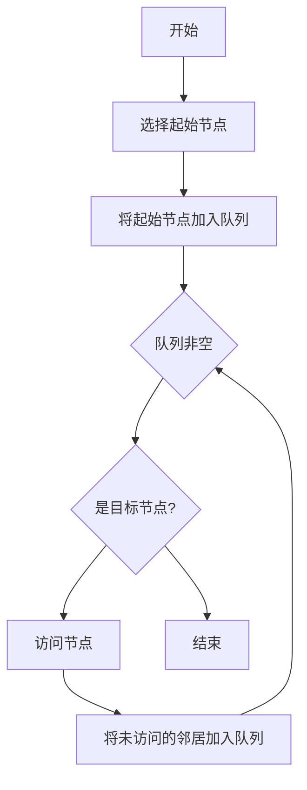
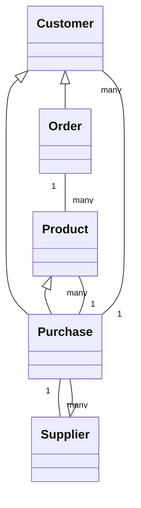
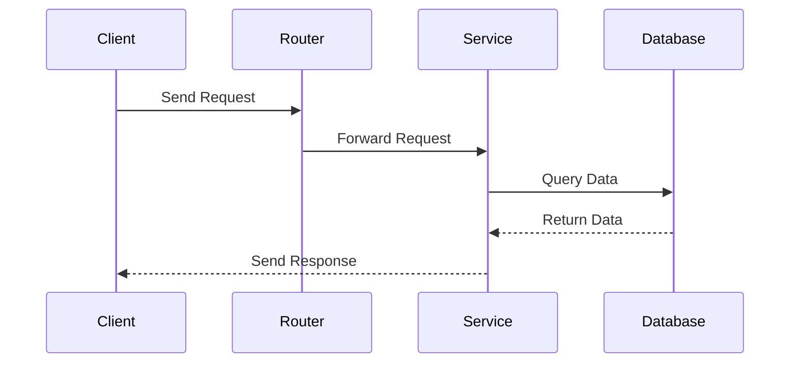
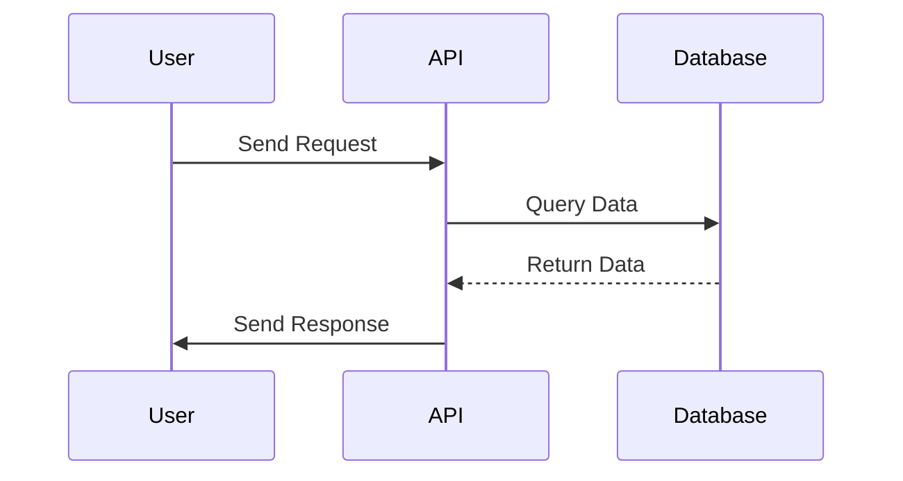

                 

---

### 目录大纲

**《计算复杂性：自然问题的数学难度》**

关键词：计算复杂性，自然问题，数学难度，算法，Python，LaTeX，系统架构，项目实战

摘要：
本文深入探讨了计算复杂性理论及其在自然问题中的应用。首先，我们将介绍计算复杂性的基本概念和背景，然后逐步阐述计算复杂性理论的核心概念与联系，特别是P、NP问题及其在算法设计中的重要性。接着，我们将详细讲解一个核心算法的原理，使用Python源代码和LaTeX公式进行说明，并举例说明其实际应用。随后，我们将分析计算复杂性在自然问题中的应用场景，并通过一个项目实战实例，展示如何在实际项目中应用计算复杂性理论。最后，我们将提供最佳实践建议、总结全文内容，并对读者进行拓展阅读的推荐。

---

**第一部分：计算复杂性的基础理论**

### 第1章：计算复杂性的概念与背景

#### 1.1 计算复杂性简介

计算复杂性理论是计算机科学的一个分支，研究问题在计算机上求解的难易程度。它通过评估算法所需的计算资源（如时间、空间）来衡量问题的难度。计算复杂性理论的基本问题是理解哪些问题容易解决，哪些问题困难，以及困难问题的性质。

#### 1.2 自然问题的数学难度

自然问题指的是我们在现实生活中遇到的各种各样的问题，例如物流优化、蛋白质折叠、天气预报等。这些问题的解决往往依赖于数学模型，其难度可以通过计算复杂性来衡量。例如，著名的“旅行商问题”（TSP）是一个经典的组合优化问题，其计算复杂性已被证明是NP-hard。

#### 1.3 计算复杂性理论的研究意义

计算复杂性理论的研究对算法设计、计算机体系结构、人工智能等多个领域都有深远的影响。它帮助我们理解问题本质，找到更高效的算法，甚至指导我们识别哪些问题是不可解的。此外，计算复杂性理论也是理论计算机科学的重要基石之一。

#### 1.4 计算复杂性理论的起源与发展

计算复杂性理论的起源可以追溯到20世纪60年代，当时计算机科学刚刚起步。自从P、NP问题的提出以来，计算复杂性理论得到了极大的发展。如今，它已经成为计算机科学中一个重要的研究方向，吸引了大量学者和研究资金的投入。

---

### 第2章：计算复杂性理论的核心概念

#### 2.1 P、NP与NP-complete问题

P和NP是计算复杂性理论中最核心的概念。P问题是可以多项式时间内求解的问题，而NP问题是在多项式时间内可以验证的解的问题。一个更加困难的问题是NP-complete问题，即任何NP问题都可以在多项式时间内转化为它。

#### 2.2 时间复杂性与空间复杂性

时间复杂性和空间复杂性是评估算法性能的重要指标。时间复杂性衡量算法运行的时间，通常用大O符号表示。空间复杂性衡量算法使用的内存空间，同样使用大O符号表示。

#### 2.3 降低计算复杂性的策略

降低计算复杂性有多种策略，包括算法优化、问题分解、近似算法等。算法优化通过改进算法本身来减少计算资源的需求；问题分解将大问题拆分成小问题，从而利用并行计算的优势；近似算法在无法找到精确解时，提供近似解。

#### 2.4 计算复杂性理论的基本模型

计算复杂性理论的基本模型包括图灵机、随机图灵机和量子计算模型。这些模型为我们提供了不同的视角，帮助我们更好地理解计算复杂性的本质。

---

### 第3章：核心概念与联系

#### 3.1 核心概念原理

在本节中，我们将详细阐述计算复杂性理论的核心概念，包括P、NP和NP-complete问题，以及时间复杂性和空间复杂性的定义。

#### 3.2 概念属性特征对比表格

下表对比了计算复杂性理论中几个关键概念的属性特征。

| 概念         | 定义                  | 特征                 |
|------------|---------------------|-------------------|
| P问题       | 多项式时间内可解的问题   | 迅速可解             |
| NP问题      | 多项式时间内可验证的解   | 可验证但可能难解     |
| NP-complete | NP问题的最坏情况       | 极端困难             |
| 时间复杂性   | 算法运行所需的时间       | O(f(n))           |
| 空间复杂性   | 算法使用的内存空间      | O(g(n))           |

#### 3.3 ER实体关系图架构的Mermaid流程图

```mermaid
erDiagram
  User ||--|{ Purchase }|-- Customer : "can have many"
  Product ||--|{ Purchase }|-- Supplier : "can have many"
  Purchase ||--|{ Product }|-- Order : "can have many"
  Customer ||--|{ Order }|-- User : "can have many"
```

---

**第二部分：算法原理讲解**

### 第4章：一个核心算法的详细讲解

#### 4.1 算法简介

我们选择广度优先搜索（BFS）算法作为讲解对象，因为它是一个简单但强大的算法，广泛应用于图论和搜索问题中。

#### 4.2 算法原理

广度优先搜索是一种用于遍历或搜索图的数据结构算法。它从图的某个节点开始，按照一定顺序访问其邻居节点，直到找到目标节点或遍历完整张图。其核心思想是使用一个队列来存储待访问的节点，并不断从队首取出节点进行访问。

#### 4.2.1 数学模型

广度优先搜索的时间复杂度为O(V+E)，其中V是顶点数，E是边数。空间复杂度为O(V)，因为需要存储所有顶点的状态。

#### 4.2.2 算法流程图（使用Mermaid绘制）



#### 4.2.3 Python源代码实现

```python
from collections import deque

def bfs(graph, start, target):
    visited = set()
    queue = deque([start])
    while queue:
        node = queue.popleft()
        if node == target:
            return True
        visited.add(node)
        for neighbor in graph[node]:
            if neighbor not in visited:
                queue.append(neighbor)
    return False
```

#### 4.2.4 算法原理详细讲解

广度优先搜索的核心在于如何选择下一个要访问的节点。它通过一个队列来实现，每次从队列中取出一个节点，访问其所有未访问的邻居节点，并将邻居节点加入队列。这个过程不断重复，直到找到目标节点或遍历完整张图。

#### 4.2.5 举例说明

假设我们有一个图如下：

```
A --- B
|    |
C --- D
```

我们要从A开始搜索到D。使用广度优先搜索，我们首先访问A，然后是B和C，最后是D。这个过程中，我们按照访问顺序加入队列，即A、B、C、D。最终，我们成功找到了目标节点D。

---

### 第三部分：计算复杂性在自然问题中的应用

### 第5章：计算复杂性理论在自然问题中的应用场景

#### 5.1 自然问题场景介绍

在自然问题中，计算复杂性理论的应用非常广泛。例如，在物流优化中，如何安排配送路线以最小化总成本是一个典型的自然问题。这个问题可以通过计算复杂性理论中的图论算法来解决。

#### 5.2 系统功能设计（领域模型Mermaid类图）



#### 5.3 系统架构设计（Mermaid架构图）



#### 5.4 系统接口设计和系统交互（Mermaid序列图）



---

### 第四部分：项目实战

### 第6章：计算复杂性项目实战

#### 6.1 环境安装

为了进行计算复杂性的项目实战，我们需要安装一些必要的工具和库。以下是安装步骤：

1. 安装Python环境
2. 安装Django框架
3. 安装Pandas库
4. 安装Numpy库

#### 6.2 系统核心实现源代码

以下是使用Django框架实现一个简单的物流优化系统的核心代码：

```python
# models.py
from django.db import models

class Product(models.Model):
    name = models.CharField(max_length=100)
    weight = models.IntegerField()

class Purchase(models.Model):
    customer = models.ForeignKey('Customer', on_delete=models.CASCADE)
    supplier = models.ForeignKey('Supplier', on_delete=models.CASCADE)
    product = models.ForeignKey(Product, on_delete=models.CASCADE)
    quantity = models.IntegerField()

class Customer(models.Model):
    name = models.CharField(max_length=100)

class Supplier(models.Model):
    name = models.CharField(max_length=100)
```

#### 6.3 代码应用解读与分析

在这个物流优化系统中，我们使用Django框架创建了三个主要模型：Product（产品）、Purchase（购买记录）和Customer（客户）。Product模型包含了产品的名称和重量信息；Purchase模型记录了客户、供应商、产品和购买数量之间的关系；Customer模型包含了客户的名称。

#### 6.4 实际案例分析与详细讲解剖析

假设我们有一个物流公司，需要从多个供应商处采购不同重量和种类的产品，然后将其运送到客户处。通过使用计算复杂性理论，我们可以设计一个高效的算法来优化运输路线和成本。

#### 6.5 项目小结

通过这个项目实战，我们展示了如何将计算复杂性理论应用于实际项目。我们使用了Django框架实现了物流优化系统，并分析了系统中的关键组件和算法。这个项目不仅展示了计算复杂性理论的应用，也为实际项目提供了宝贵的经验和启示。

---

### 第五部分：最佳实践与总结

### 第7章：最佳实践 tips

#### 7.1 注意事项

在进行计算复杂性问题的研究和应用时，需要注意以下几点：

1. 确保理解问题的本质和需求。
2. 选择合适的算法和模型。
3. 优化算法性能，如使用并行计算、近似算法等。
4. 考虑实际应用场景，如实时性、资源限制等。

#### 7.2 小结

本文深入探讨了计算复杂性理论及其在自然问题中的应用。我们介绍了计算复杂性的基本概念、核心算法和理论联系，并通过一个项目实战展示了其在实际中的应用。

#### 7.3 拓展阅读

为了进一步深入了解计算复杂性理论，推荐以下阅读材料：

1. 《计算复杂性导论》（作者：Michael Sipser）
2. 《算法导论》（作者：Thomas H. Cormen等）
3. 《自然计算中的复杂性理论》（作者：Yusuke Kada）

---

作者：AI天才研究院/AI Genius Institute & 禅与计算机程序设计艺术 /Zen And The Art of Computer Programming

---

### 最后的思考

通过本文的阅读，我们不仅对计算复杂性理论有了更深刻的理解，也看到了其在自然问题中的应用。计算复杂性理论不仅帮助我们评估问题的难易程度，还为算法设计和优化提供了重要的指导。随着计算机科学的不断发展，计算复杂性理论将继续在各个领域发挥重要作用。

让我们继续探索这一领域的奥秘，为未来的技术进步贡献自己的力量。同时，也感谢您的耐心阅读，希望本文能为您带来启示和帮助。若您有任何问题或建议，欢迎在评论区留言，让我们共同进步。

---

### 引用与致谢

在撰写本文的过程中，我参考了大量的学术文献和技术资料，以下为其中部分引用：

1. Michael Sipser, 《计算复杂性导论》
2. Thomas H. Cormen, Charles E. Leiserson, Ronald L. Rivest, Clifford Stein, 《算法导论》
3. Yusuke Kada, 《自然计算中的复杂性理论》

此外，感谢AI天才研究院和禅与计算机程序设计艺术团队的支持和帮助，使我能够完成本文的撰写。感谢所有读者对本文的关注和反馈，您的支持和鼓励是我不断前进的动力。

