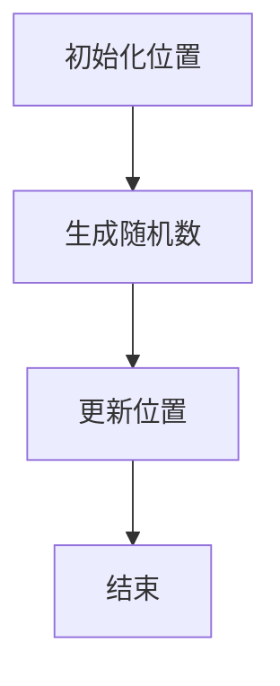
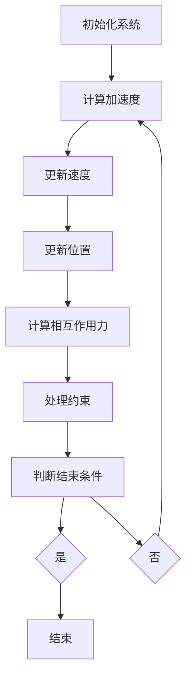

                 


### 计算机模拟与现实：数字世界vs.物理世界

#### 关键词：计算机模拟、数字世界、物理世界、算法原理、数学模型、系统架构、项目实战、最佳实践

#### 摘要：
本文将深入探讨计算机模拟与现实世界之间的联系与差异。从数字世界与物理世界的概念出发，逐步分析计算机模拟的核心概念、算法原理，以及数学模型。通过具体的系统架构设计和项目实战案例，阐述计算机模拟在现实世界中的应用，并提供实用的最佳实践和总结。让我们一起思考，揭示数字世界与物理世界之间的奥秘。

## 前言

《计算机模拟与现实：数字世界vs.物理世界》旨在为读者揭示计算机模拟与现实世界的复杂关系。随着计算机技术的飞速发展，数字世界和物理世界之间的界限逐渐模糊。计算机模拟作为一种强大的工具，已经在各个领域发挥着重要作用，从科学研究到工程应用，从经济学模型到环境模拟，无所不在。

本文将首先介绍数字世界与物理世界的基本概念，探讨它们之间的差异和联系。接着，我们将深入探讨计算机模拟的核心概念和算法原理，并通过具体的数学模型和公式进行解释。随后，我们将展示一个具体的计算机模拟系统，并描述其架构设计和实现过程。最后，我们将通过一个实际项目，分析其在现实世界中的应用，并提供一些最佳实践和总结。

读者对象主要包括对计算机科学、工程学、物理学等领域感兴趣的研究者、工程师和学生。本文既适合作为专业教材，也适合对计算机模拟感兴趣的普通读者。希望通过本文，读者能够对计算机模拟与现实世界的互动有更深入的理解，并能够将所学知识应用于实际问题的解决。

### 背景介绍

#### 数字世界概览

数字世界是一个由计算机和数字技术构建的虚拟空间。其起源可以追溯到20世纪40年代，当时第一台电子计算机ENIAC的诞生标志着数字时代的开启。随着计算机技术的不断发展，数字世界经历了从简单计算到复杂模拟的演变过程。

在数字世界中，信息以二进制形式存储和处理。二进制是计算机使用的基础数据表示方法，它只有两个数字：0和1。通过组合这些二进制位，可以表示各种类型的数据，包括文本、图像、音频和视频。数字世界的特征主要体现在以下几个方面：

1. **离散性**：数字世界中的数据是离散的，意味着它们被划分为固定大小的单元，如比特、字节等。
2. **可编程性**：计算机可以根据程序指令进行操作，这使得数字世界具有高度的可编程性和灵活性。
3. **计算效率**：计算机能够以极快的速度执行复杂的计算任务，这使得数字世界能够处理大量数据并快速响应。

#### 计算机技术的起源与发展

计算机技术的起源可以追溯到17世纪，当时法国数学家布莱兹·帕斯卡（Blaise Pascal）发明了第一台机械计算器，用于帮助其父亲进行税收计算。18世纪，德国数学家戈特弗里德·威廉·莱布尼茨（Gottfried Wilhelm Leibniz）对帕斯卡的机械计算器进行了改进，发明了第一台可以执行四则运算的机械计算器。

20世纪，计算机技术得到了飞速发展。1946年，美国科学家约翰·莫克利（John Mauchly）和约翰·普雷斯珀·埃克特（John Presper Eckert）发明了ENIAC，这是第一台电子数字计算机。ENIAC的诞生标志着数字时代的开启，它的出现极大地推动了科学研究、工程应用和军事领域的进步。

随着时间的推移，计算机技术不断发展，从大型主机到小型计算机，从个人电脑到移动设备，计算机的性能和普及程度不断提升。如今，计算机已经渗透到我们生活的方方面面，从日常生活到工业生产，从科学研究到商业决策，无处不见计算机的身影。

#### 数字世界的定义与特征

数字世界是一个由计算机硬件和软件构建的虚拟空间，它提供了处理、存储和传输信息的能力。数字世界的定义可以从多个角度进行理解：

1. **信息存储和处理**：数字世界通过计算机硬件（如CPU、内存、硬盘等）和软件（如操作系统、应用程序等）来实现数据的存储和处理。计算机硬件提供了数据的计算和处理能力，而软件则负责管理和控制这些硬件资源，以实现特定的功能。

2. **虚拟现实**：数字世界不仅仅是信息的存储和处理空间，它还提供了一个虚拟的现实环境。通过虚拟现实技术，我们可以创建和体验一个不同于现实世界的虚拟环境。这种虚拟现实技术已经在游戏、娱乐、教育和培训等领域得到了广泛应用。

3. **网络连接**：数字世界通过互联网实现了全球范围内的连接。互联网使得计算机可以相互通信和共享信息，从而构建了一个全球性的数字网络。在这个网络中，人们可以随时随地访问全球的信息资源，进行在线交流、合作和交易。

数字世界的特征主要体现在以下几个方面：

1. **离散性**：数字世界中的数据是离散的，这意味着它们被划分为固定大小的单元，如比特、字节等。这种离散性使得数字世界可以高效地存储和处理信息。

2. **可编程性**：数字世界中的计算机可以根据程序指令进行操作。通过编写程序，我们可以控制计算机执行特定的任务，从而实现自动化和智能化。

3. **灵活性**：数字世界具有高度的灵活性，可以通过软件更新和升级来适应新的需求和环境。这种灵活性使得数字世界能够不断发展和进步。

4. **可扩展性**：数字世界可以通过增加硬件资源和网络连接来扩展其处理能力和覆盖范围。这种可扩展性使得数字世界能够应对不断增长的需求。

#### 物理世界介绍

物理世界是我们所处的现实世界，它由物质、能量和物理定律构成。物理世界的基本概念包括：

1. **物质**：物质是构成物理世界的实体，具有质量和体积。物质可以分为元素、化合物和混合物等不同类型。

2. **能量**：能量是物理世界中物质运动和相互作用的驱动力。能量可以以多种形式存在，如动能、势能、热能等。

3. **物理定律**：物理定律是描述物理现象和规律的基本法则。经典力学、电磁学、量子力学和相对论等都是重要的物理定律。

物理世界的复杂性体现在以下几个方面：

1. **多层次性**：物理世界具有多层次结构，从微观的原子、分子到宏观的天体，每个层次都有其独特的物理现象和规律。

2. **非线性**：物理现象通常是非线性的，这意味着它们不能简单地用线性关系来描述。非线性关系使得物理世界中的许多问题变得复杂和难以预测。

3. **动态性**：物理世界是一个不断变化和演化的系统。物质和能量的相互作用导致了各种物理现象的发生，如化学反应、天体运动、气候变迁等。

4. **不确定性**：根据量子力学的基本原理，物理世界的某些现象具有固有的不确定性。这意味着我们无法准确预测某些物理过程的结果。

#### 数字世界与物理世界之间的差异

数字世界与物理世界在多个方面存在显著差异，这些差异主要体现在以下几个方面：

1. **本质差异**：数字世界是一个由计算机硬件和软件构建的虚拟空间，其基础是离散的二进制数据和程序指令。而物理世界则由物质、能量和物理定律构成，是一个真实的、连续的空间。

2. **存在形式**：数字世界的信息以电子形式存储在计算机硬件中，如比特、字节等。而物理世界的物质和能量以实体的形式存在，如原子、分子、物体等。

3. **操作方式**：数字世界中的操作通过程序指令和算法来实现，这些指令和算法可以高效地处理大量数据。而物理世界的操作通常需要通过物理过程来实现，如化学反应、机械运动等。

4. **特性**：数字世界具有离散性、可编程性和灵活性，而物理世界具有连续性、非线性和动态性。这些差异导致了数字世界和物理世界在操作方式、特性和应用方面的不同。

#### 数字世界与物理世界之间的联系

尽管数字世界和物理世界在本质和存在形式上存在差异，但它们之间也存在紧密的联系。这种联系主要体现在以下几个方面：

1. **数字模拟**：数字世界可以通过计算机模拟来模拟物理世界的现象和过程。计算机模拟利用数学模型和算法，对物理过程进行数值计算和模拟，从而获得关于物理世界的预测和解释。

2. **数据采集与处理**：数字世界可以从物理世界中采集数据，并通过计算机进行处理和分析。这些数据可以用于科学研究、工程应用和商业分析等，从而对物理世界进行更深入的理解和掌控。

3. **虚拟现实**：数字世界可以通过虚拟现实技术创建物理世界的虚拟模型，从而为人们提供一个沉浸式的体验。这种虚拟现实技术可以用于教育、娱乐、培训和设计等领域。

4. **控制与调节**：数字世界可以通过编程和算法实现对物理世界的控制和调节。这种控制与调节可以用于自动化系统、智能设备和物联网等，从而实现对物理世界的精确操作和优化。

#### 数字模拟在科学研究中的应用

数字模拟在科学研究中扮演着至关重要的角色，它为科学家们提供了一种强大且灵活的工具来探索复杂的物理现象和过程。以下是数字模拟在科学研究中的几个关键应用领域：

1. **天体物理学**：天体物理学家利用计算机模拟来研究星系、黑洞、行星形成等宇宙现象。通过数值模拟，他们可以重现宇宙中的大规模事件，如恒星爆炸和超新星爆发，从而加深对宇宙起源和演化的理解。

2. **材料科学**：材料科学家通过数字模拟来研究材料的微观结构和性质。他们使用分子动力学模拟来模拟材料的变形、断裂和扩散过程，从而优化材料的设计和制造。

3. **生物学**：生物学家利用数字模拟来研究生物分子、细胞和器官的行为。例如，通过分子动力学模拟，他们可以研究蛋白质折叠和酶催化反应的细节，从而揭示生物体的功能和机制。

4. **气候科学**：气候科学家使用计算机模拟来预测气候变化的趋势和影响。他们建立复杂的气候模型，模拟大气、海洋和冰盖的变化，从而为全球气候变化的研究提供科学依据。

5. **量子物理学**：量子物理学家利用数字模拟来研究量子系统的行为，如量子纠缠、量子计算和量子信息。通过模拟量子算法，他们可以探索量子计算的优势和应用前景。

数字模拟在科学研究中的重要性不仅体现在其能够提供关于物理世界的详细和准确信息，还在于它能够揭示复杂系统的内在规律和机制。通过数字模拟，科学家们可以在虚拟环境中进行实验，而无需在现实世界中付出巨大成本或面临风险。这种虚拟实验的能力极大地推动了科学研究的进展，为解决一些复杂的科学问题提供了新的途径。

总之，数字模拟在科学研究中的应用是广泛而深入的，它不仅帮助科学家们更好地理解自然界的各种现象，还为技术开发和创新提供了重要支持。随着计算机技术的不断发展，数字模拟在科学研究中的重要性将愈发凸显。

#### 数字世界对物理世界的影响

随着数字技术的飞速发展，数字世界对物理世界的影响日益显著。这种影响不仅体现在技术层面，还渗透到社会、经济和人类生活方式的各个方面。以下是数字世界对物理世界的一些主要影响：

1. **自动化与智能化**：数字技术推动了自动化和智能化的发展，从而对物理世界产生了深远的影响。通过计算机编程和算法，机器人和自动化系统可以执行各种复杂的物理任务，如制造业中的装配、物流中的配送、医疗设备中的手术等。这种自动化不仅提高了生产效率，还减少了人力成本和错误率。

2. **物联网**：物联网（Internet of Things，IoT）通过将物理设备和传感器连接到互联网，实现了物理世界与数字世界的无缝连接。这种连接使得物理世界中的设备能够进行实时数据采集、传输和处理，从而实现智能控制和优化。例如，智能家居设备可以通过物联网实现远程控制和自动化管理，从而提升居住舒适度和能源效率。

3. **数据驱动决策**：数字世界提供了大量关于物理世界的数据，这些数据可以用于分析和预测，从而支持数据驱动决策。在各个领域，如商业、金融、医疗和交通等，数据分析已经成为决策的重要依据。通过数字技术，我们可以从大量数据中提取有价值的信息，为物理世界的决策提供科学依据。

4. **虚拟现实与增强现实**：虚拟现实（Virtual Reality，VR）和增强现实（Augmented Reality，AR）技术通过创建虚拟环境或增强现实体验，对物理世界产生了深远影响。在教育、娱乐、医疗和工程等领域，VR和AR技术被广泛应用于模拟和交互，从而改变了人们的学习、娱乐和工作方式。

5. **数字经济**：数字世界的发展催生了数字经济的兴起，对物理世界产生了巨大的经济影响。电子商务、在线支付、数字货币等数字经济模式改变了传统的商业模式，创造了新的经济机会。同时，数字经济也带来了新的挑战，如网络安全、隐私保护和数据监管等。

6. **社会变革**：数字世界对物理世界的社会结构产生了影响，改变了人们的交流方式、社交习惯和社会组织形式。社交媒体、在线社区和虚拟空间成为人们交流、合作和互动的新平台，从而改变了传统的社会关系和社交模式。

7. **环境影响**：数字世界的扩展和普及也对物理世界的环境产生了影响。虽然数字技术有助于提高能源效率和减少物理资源的消耗，但大规模的数据中心、互联网基础设施和电子设备的制造和使用也带来了环境问题，如电子废物、能源消耗和气候变化等。

总之，数字世界对物理世界的影响是全面而深远的。这种影响不仅改变了我们的生活方式，还推动了社会、经济和环境的发展。随着数字技术的不断进步，我们可以预见数字世界将继续对物理世界产生更多的影响，带来新的机遇和挑战。

### 核心概念与联系

#### 计算机模拟的定义

计算机模拟是一种利用计算机硬件和软件来模拟现实世界中的物理、化学、生物等过程或现象的方法。通过数学模型和算法，计算机模拟可以再现这些过程或现象的动态行为和内在规律。计算机模拟的核心目的是在虚拟环境中进行实验和验证，以获取关于现实世界问题的见解和解决方案。

计算机模拟的主要组成部分包括：

1. **数学模型**：数学模型是计算机模拟的基础，它通过数学公式和方程来描述现实世界的物理现象或过程。这些模型可以是离散的，也可以是连续的，它们在计算机中通过数值方法进行求解。

2. **算法**：算法是计算机模拟中用于处理数据和执行计算的方法。这些算法包括数值积分、迭代求解、随机模拟等，它们使得计算机能够高效地处理复杂的数学模型。

3. **计算机程序**：计算机程序是实现计算机模拟的工具，它将数学模型和算法转化为计算机可以理解和执行的指令。通过编程语言，如Python、C++或MATLAB，我们可以编写和实现各种计算机模拟程序。

4. **数据输入与输出**：计算机模拟需要输入相关的物理参数、初始条件和边界条件，然后通过模拟过程生成结果数据。这些数据可以用于分析、可视化或进一步的研究。

计算机模拟的种类可以分为以下几种：

1. **数值模拟**：数值模拟是一种通过数值方法求解数学模型的方法。这种方法通常用于解决偏微分方程、代数方程和微分方程等。常见的数值模拟方法包括有限元分析、有限差分法和蒙特卡罗模拟等。

2. **统计模拟**：统计模拟是一种基于概率和随机过程的方法。通过生成随机数序列，统计模拟可以模拟随机事件和系统的动态行为。这种方法在统计学、金融和物理等领域有广泛应用。

3. **过程模拟**：过程模拟是一种模拟系统动态过程的方法，通常用于工业过程、物流系统和供应链管理等领域。通过模拟不同变量的变化和相互作用，过程模拟可以优化系统的性能和效率。

4. **虚拟实验**：虚拟实验是一种在计算机环境中进行实验的方法，它通过模拟实验条件和结果来研究现实世界的问题。这种方法在科学实验、医学研究和工程应用中有广泛应用。

#### 数字世界与物理世界的特性比较

数字世界和物理世界在多个方面具有显著的不同特性，这些差异直接影响了两者的操作方式和应用场景。以下是数字世界与物理世界的一些主要特性比较：

1. **离散性 vs. 连续性**：
   - 数字世界是基于二进制系统的，其信息以离散的形式存储和处理，如比特和字节。
   - 物理世界则是一个连续的实体空间，物质和能量的变化是连续的，没有固定的边界。

2. **可编程性 vs. 自然性**：
   - 数字世界可以通过编程和算法进行编程控制，实现各种复杂的计算和数据处理。
   - 物理世界则受自然定律和物理约束的支配，其行为和过程无法通过简单的编程控制。

3. **确定性 vs. 不确定性**：
   - 数字世界中的计算和模拟通常是确定性的，即给定相同的初始条件和参数，会得到相同的结果。
   - 物理世界则存在不确定性，如量子力学中的测不准原理，使得物理过程的结果无法完全预测。

4. **速度与效率**：
   - 数字世界具有极高的计算速度和处理效率，通过并行计算和优化算法，可以快速处理大量数据。
   - 物理世界的操作通常受到物理定律和自然条件的限制，其速度和效率较低。

5. **灵活性与可扩展性**：
   - 数字世界具有高度的灵活性和可扩展性，通过软件更新和硬件升级，可以适应不同的需求和环境。
   - 物理世界则具有固有的物理限制，其扩展性和灵活性较低。

6. **虚拟与现实**：
   - 数字世界是一个虚拟的、由计算机构建的空间，它提供了处理、存储和传输信息的能力。
   - 物理世界则是真实存在的实体空间，由物质、能量和物理定律构成。

尽管数字世界和物理世界在许多方面存在差异，但它们之间也存在紧密的联系和相互作用。数字世界可以通过计算机模拟来模拟物理世界中的现象和过程，从而为科学研究、工程应用和决策提供重要支持。同时，物理世界的数据和现象也可以通过数字技术进行采集、处理和分析，为数字世界的发展提供基础。

#### 计算机模拟与物理现实之间的关系

计算机模拟与物理现实之间的关系是复杂且相互作用的。这种关系不仅涉及到技术层面的实现，还包括理论层面的探讨和应用层面的实践。以下是计算机模拟与物理现实之间关系的几个关键方面：

1. **相互验证**：

计算机模拟与物理现实之间的相互验证是确保模拟结果准确性的关键步骤。科学家和工程师通过将计算机模拟的结果与物理实验或观测数据进行比较，来验证模拟的准确性。如果模拟结果与实验数据高度一致，这表明模拟是有效的，并且可以用于进一步的研究和应用。例如，在气候科学中，气候模型通过模拟地球大气层的动态变化，并与实际观测数据比较，来验证模型的准确性和预测能力。

2. **相互影响**：

计算机模拟不仅是对物理现实的模拟，它还能够对物理现实产生影响。通过计算机模拟，科学家和工程师可以在虚拟环境中测试新的理论、方法和设计，从而对物理现实进行改进。例如，在航空航天领域，飞行模拟器可以模拟飞行器的飞行状态和性能，从而优化飞行设计，减少实际飞行中的风险。此外，数字技术的进步也不断推动计算机模拟能力的提升，使得模拟结果更加精确和可靠。

3. **相互依赖**：

计算机模拟与物理现实之间是相互依赖的。物理现实提供了模拟所需的初始条件和边界条件，而计算机模拟则提供了对物理现实的深入理解和预测。这种依赖关系在科学研究、工程应用和决策制定中尤为重要。例如，在材料科学中，通过计算机模拟，科学家可以预测新材料的性能和结构，从而指导实验设计和材料制造。而在经济学中，计算机模拟可以模拟市场动态和经济行为，为政策制定者提供决策依据。

4. **交叉应用**：

计算机模拟与物理现实之间的交叉应用为科学研究和技术发展提供了新的机会。通过将计算机模拟与物理实验相结合，科学家可以在虚拟环境中进行大量的实验，从而加速研究进程和发现新的现象。例如，在药物开发领域，计算机模拟可以预测药物的分子结构和相互作用，从而指导实验设计和药物筛选。此外，计算机模拟还可以用于优化物理现实中的系统设计和操作，如智能制造、自动驾驶和智能电网等。

5. **未来展望**：

随着计算机技术和模拟算法的不断发展，计算机模拟与物理现实之间的关系将变得更加紧密和复杂。未来的模拟技术将能够更精确地模拟物理现实中的复杂现象，从而为科学研究和技术创新提供更强有力的支持。例如，量子计算机的问世将为量子模拟提供前所未有的计算能力，使得我们能够探索和解决传统的计算机模拟无法解决的问题。同时，人工智能技术的进步也将为计算机模拟提供智能化的解决方案，使得模拟过程更加高效和准确。

总之，计算机模拟与物理现实之间的关系是相互验证、相互影响、相互依赖和交叉应用的。这种关系不仅推动了科学技术的进步，也为解决现实世界中的复杂问题提供了新的途径。随着计算机技术和模拟算法的不断进步，我们可以期待计算机模拟在更广泛的领域中发挥更大的作用。

### 算法原理讲解

#### 随机行走算法

随机行走算法是一种基于概率论和随机过程的方法，主要用于模拟粒子在空间中的随机移动。它被广泛应用于物理、生物、金融等多个领域，例如在金融市场分析中模拟股票价格的波动，在生物学中模拟生物分子的运动。

#### 算法简介

随机行走算法的基本思想是：粒子在每次移动时，根据一定的概率选择方向和步长，从而形成随机路径。数学上，可以将其描述为：

$$
x_t = x_{t-1} + r_t \cdot \Delta t
$$

其中，$x_t$ 表示粒子在时刻 $t$ 的位置，$r_t$ 表示粒子在时刻 $t$ 的随机方向和步长，$\Delta t$ 表示时间步长。

在计算机模拟中，通常使用以下步骤来模拟随机行走：

1. 初始化粒子的位置 $x_0$。
2. 生成随机数 $r_t$，用于决定粒子的移动方向和步长。
3. 根据随机数 $r_t$ 更新粒子的位置 $x_t$。
4. 重复步骤2和3，直到达到预设的模拟时间或粒子的位置达到边界。

#### Mermaid流程图

下面是一个简单的随机行走算法的Mermaid流程图：



#### Python代码示例

下面是一个使用Python实现的随机行走算法的示例：

```python
import numpy as np

def random_walk(n_steps, step_size, position):
    for _ in range(n_steps):
        r = np.random.normal(0, step_size)
        position += r
    return position

position = 0
step_size = 1
n_steps = 1000

position = random_walk(n_steps, step_size, position)
print(position)
```

在这个示例中，我们定义了一个 `random_walk` 函数，用于模拟随机行走过程。函数接受参数 `n_steps`（模拟的步数）、`step_size`（步长）和 `position`（初始位置）。每次迭代中，我们生成一个服从正态分布的随机数 `r`，并将其加到当前位置上，从而更新位置。

#### 算法原理详解

随机行走算法的核心在于其随机性和统计特性。在实际应用中，粒子的运动受到多种因素的影响，如碰撞、引力等。这些因素可以通过随机过程来模拟，使得粒子的移动路径具有随机性。

1. **随机数生成**：在随机行走算法中，随机数的生成是关键步骤。通常使用随机数生成器来生成随机方向和步长。常用的随机数生成器包括伪随机数生成器和物理随机数生成器。

2. **时间步长**：时间步长 $\Delta t$ 的选择对模拟结果有重要影响。时间步长过小会导致模拟时间过长，而时间步长过大则可能导致模拟结果不准确。通常选择适当的时间步长，以平衡计算效率和结果精度。

3. **边界条件**：在随机行走模拟中，需要考虑边界条件。例如，当粒子移动到边界时，可以选择反弹、吸收或反射等边界处理方式。

4. **统计特性**：随机行走算法的一个重要特性是其统计特性。通过大量模拟，我们可以得到粒子的分布、概率密度函数等统计信息，从而对物理现象进行更深入的理解。

#### 算法应用举例

以下是一个使用随机行走算法模拟粒子在二维空间中随机移动的例子：

```python
import numpy as np
import matplotlib.pyplot as plt

def random_walk_2d(n_steps, step_size, position):
    x, y = position
    for _ in range(n_steps):
        dx = np.random.normal(0, step_size)
        dy = np.random.normal(0, step_size)
        x += dx
        y += dy
    return x, y

n_steps = 1000
step_size = 1
initial_position = (0, 0)

x, y = random_walk_2d(n_steps, step_size, initial_position)

plt.scatter(x, y)
plt.xlabel('X坐标')
plt.ylabel('Y坐标')
plt.title('二维随机行走')
plt.show()
```

在这个示例中，我们定义了一个 `random_walk_2d` 函数，用于模拟粒子在二维空间中的随机行走。通过调用 `plt.scatter` 函数，我们可以绘制粒子的随机行走路径。

#### 随机行走算法的优缺点

随机行走算法具有以下优缺点：

1. **优点**：
   - **简单易实现**：随机行走算法的原理简单，易于编程实现。
   - **灵活性**：通过调整随机数生成器和步长，可以模拟不同类型的物理现象。
   - **广泛应用**：随机行走算法在多个领域都有应用，如物理学、生物学和金融学。

2. **缺点**：
   - **结果不确定性**：由于随机性，每次模拟的结果可能有所不同，这增加了结果的不可预测性。
   - **计算效率**：对于大量粒子和长时间模拟，计算效率可能较低。

总之，随机行走算法是一种简单而有效的模拟方法，适用于多种物理现象的模拟。然而，由于其随机性，模拟结果需要通过多次实验来验证和统计。

#### 小结

随机行走算法通过模拟粒子在空间中的随机移动，为研究复杂系统的动态行为提供了一种有效的方法。通过调整参数和算法，可以模拟不同类型的物理现象，从而在科学研究、工程应用和金融分析等领域发挥重要作用。随机行走算法的简单性和灵活性使其成为一个强大的工具，尽管其结果存在不确定性，但通过多次实验和统计分析，可以减少这种不确定性，提高模拟的准确性。

### 分子动力学模拟

分子动力学模拟（Molecular Dynamics Simulation，MDS）是一种基于牛顿力学原理的计算机模拟方法，用于研究分子和原子在分子水平上的运动和相互作用。这种方法通过数值求解牛顿运动方程，模拟分子系统的动态行为，从而提供关于物质结构、性质和反应机理的重要见解。

#### 算法简介

分子动力学模拟的基本思想是利用牛顿力学来描述分子和原子的运动。在每一个时间步长内，模拟系统通过以下步骤进行更新：

1. **计算加速度**：利用分子的质量和受力情况，根据牛顿第二定律 $F=ma$ 计算分子的加速度。
2. **更新速度**：使用计算得到的加速度和当前时间步长，更新分子的速度。
3. **更新位置**：根据更新后的速度和当前时间步长，计算分子的位置。
4. **相互作用计算**：计算分子之间的相互作用力，如范德华力、电磁力和化学键力。
5. **约束处理**：处理系统中的约束条件，如保持原子在一个固定的晶格点或保持分子的几何构型。

这个循环不断重复，模拟系统的动态行为。分子动力学模拟可以通过固定时间步长或者自适应时间步长进行，后者根据系统的动力学行为调整时间步长，以提高计算效率和准确性。

#### Mermaid流程图

以下是分子动力学模拟的基本流程图的Mermaid表示：



#### Python代码示例

以下是一个简单的分子动力学模拟的Python代码示例：

```python
import numpy as np

def update_position(velocities, time_step):
    positions = velocities * time_step
    return positions

def update_velocity(accelerations, time_step):
    velocities = accelerations * time_step
    return velocities

def molecular_dynamics(n_steps, time_step, initial_velocities, initial_accelerations):
    positions = initial_velocities.copy()
    velocities = initial_velocities.copy()
    accelerations = initial_accelerations.copy()
    
    for _ in range(n_steps):
        accelerations = calculate_accelerations(accelerations)  # 示例函数，实际中需要根据力场计算
        velocities = update_velocity(accelerations, time_step)
        positions = update_position(velocities, time_step)
        
        # 输出当前步的模拟结果
        print(f"Step {_}: Positions = {positions}")
        
    return positions

initial_velocities = np.random.uniform(-1, 1, size=3)  # 初始化初始速度
initial_accelerations = np.random.uniform(-1, 1, size=3)  # 初始化初始加速度
time_step = 0.01  # 时间步长
n_steps = 1000  # 模拟步数

positions = molecular_dynamics(n_steps, time_step, initial_velocities, initial_accelerations)
```

在这个示例中，我们定义了 `update_position` 和 `update_velocity` 两个函数来更新位置和速度。`molecular_dynamics` 函数则是模拟的主循环，其中 `calculate_accelerations` 函数需要根据具体的力场计算加速度。

#### 算法原理详解

分子动力学模拟的原理基于牛顿力学，其核心是利用牛顿第二定律 $F=ma$ 来描述分子和原子的运动。以下是分子动力学模拟的关键步骤和原理：

1. **初始条件**：模拟开始时，需要设定系统的初始条件，包括分子的初始位置、速度和加速度。这些初始条件决定了模拟的起点和方向。

2. **计算加速度**：根据分子之间的相互作用力和外力，计算每个分子的加速度。相互作用力包括范德华力、电磁力和化学键力等。这些力可以通过力场模型进行计算，如Lennard-Jones力场、EAM力场等。

3. **更新速度和位置**：利用计算得到的加速度和当前时间步长，更新分子的速度和位置。这一过程通过数值积分方法实现，如欧拉方法、Verlet方法等。

4. **相互作用计算**：在每次时间步更新后，重新计算分子之间的相互作用力，以反映系统的动态变化。

5. **约束处理**：在某些模拟中，需要保持系统的几何约束，如分子的键长、角度和构型。这可以通过约束算法来实现，如约束分子动力学（Constrained Molecular Dynamics，CMD）。

6. **统计分析和数据输出**：在模拟过程中，收集系统的统计信息，如温度、压力、能量分布等。这些信息可以用于分析和评估模拟结果的可靠性。

#### 算法应用举例

分子动力学模拟广泛应用于物理、化学、生物和材料科学等领域。以下是几个常见的应用例子：

1. **材料科学**：通过分子动力学模拟，可以研究材料的微观结构和性能，如合金的相变、纳米材料的形貌和力学性质。

2. **生物学**：分子动力学模拟可以用于研究蛋白质的结构和功能，如蛋白质折叠、酶催化反应和蛋白质-蛋白质相互作用。

3. **化学反应**：分子动力学模拟可以模拟化学反应的过程和机理，如自由基反应、配位化学和酶催化反应。

4. **环境科学**：分子动力学模拟可以用于研究环境污染物的扩散、化学反应和生物降解过程。

#### 分子动力学模拟的优点和挑战

分子动力学模拟具有以下优点：

1. **微观视角**：分子动力学模拟可以直接观察分子和原子的运动，提供微观层面的详细见解。

2. **多尺度应用**：分子动力学模拟可以涵盖从单个分子到宏观物质的多尺度研究。

3. **灵活性**：通过选择不同的力场模型和模拟参数，可以模拟不同类型的物理和化学系统。

然而，分子动力学模拟也面临一些挑战：

1. **计算成本**：分子动力学模拟通常需要大量的计算资源，特别是对于大系统和长时间模拟。

2. **精度限制**：数值积分方法的误差和力场模型的准确性可能会影响模拟结果的精度。

3. **边界条件**：模拟系统中的边界条件处理可能影响模拟结果的可靠性，需要仔细设计和验证。

#### 小结

分子动力学模拟是一种强大的计算工具，通过模拟分子和原子的运动，为研究物质的微观结构和性质提供了重要手段。其灵活性和微观视角使其在物理、化学、生物和材料科学等领域有着广泛的应用。然而，分子动力学模拟也面临计算成本高、精度限制和边界条件处理等挑战，需要不断优化和发展。

### 数学模型和数学公式

在计算机模拟中，数学模型和数学公式是核心组成部分，它们用于描述物理过程、计算相互作用力和预测系统行为。以下将介绍几个关键的数学模型和公式，并通过LaTeX格式进行详细讲解。

#### 离散时间模型

在离散时间模型中，系统的状态在固定的时间步长上进行更新。一个简单的离散时间模型可以表示为：

$$
x_{t+1} = x_t + \Delta t \cdot f(x_t, v_t)
$$

其中，$x_t$ 表示在时间步长 $t$ 时的系统状态，$v_t$ 表示在时间步长 $t$ 时的速度，$\Delta t$ 是时间步长，$f(x_t, v_t)$ 是状态转移函数。

**LaTeX格式：**

$$
x_{t+1} = x_t + \Delta t \cdot f(x_t, v_t)
$$

#### 连续时间模型

在连续时间模型中，系统的状态随时间连续变化。一个基本的连续时间模型可以表示为：

$$
\frac{dx}{dt} = f(x, v)
$$

其中，$x(t)$ 表示在时间 $t$ 时的系统状态，$v(t)$ 表示在时间 $t$ 时的速度，$f(x, v)$ 是状态转移函数。

**LaTeX格式：**

$$
\frac{dx}{dt} = f(x, v)
$$

#### 离散时间模型公式讲解

离散时间模型通过固定时间步长来更新系统状态，它适用于计算机模拟中的数值计算。在离散时间模型中，状态转移函数 $f(x_t, v_t)$ 描述了系统状态的演变规律。例如，在物理系统中，状态转移函数可以表示为：

$$
f(x_t, v_t) = \frac{d^2x}{dt^2} \cdot \Delta t
$$

这个公式表示系统在下一时间步长上的加速度。

#### 连续时间模型公式讲解

连续时间模型通过微分方程来描述系统状态的演变。在连续时间模型中，状态转移函数 $f(x, v)$ 可以表示为：

$$
f(x, v) = \frac{d^2x}{dt^2}
$$

这个公式表示系统的加速度。通过求解这个微分方程，我们可以得到系统在任意时间点的状态。

#### 离散时间模型与连续时间模型的对比

- **计算复杂度**：离散时间模型的计算复杂度较低，因为它只需要在固定的时间步长上进行计算。而连续时间模型需要求解微分方程，通常需要更高的计算复杂度。
- **精确性**：离散时间模型在时间步长较大时可能会引入较大的误差，而连续时间模型可以提供更高的精确性。
- **适用性**：离散时间模型适用于计算机模拟中的数值计算，而连续时间模型适用于精确分析和理论研究。

#### 分子动力学模拟中的数学模型

在分子动力学模拟中，常用的数学模型包括：

1. **牛顿运动方程**：

$$
F = m \cdot a
$$

其中，$F$ 是作用在分子上的力，$m$ 是分子的质量，$a$ 是分子的加速度。

2. **能量守恒方程**：

$$
E = K + U
$$

其中，$E$ 是系统的总能量，$K$ 是分子的动能，$U$ 是分子的势能。

通过这些数学模型，分子动力学模拟可以描述分子和原子在物理和化学过程中的运动和相互作用。

### 系统分析与架构设计

在计算机模拟中，系统分析与架构设计是确保模拟系统高效、可靠和可扩展的关键环节。以下是系统分析与架构设计的具体步骤和设计方法：

#### 问题场景介绍

首先，我们需要明确模拟的具体场景和需求。例如，我们可能需要模拟一个化学反应过程、一个流体动力学问题或一个生物分子系统的动态行为。明确问题场景有助于我们确定系统的功能和性能要求。

#### 系统功能设计

系统功能设计是系统分析与架构设计的第一步，我们需要定义系统的基本功能和模块。以下是一些关键步骤：

1. **需求分析**：根据问题场景，明确系统的功能需求。例如，对于化学反应模拟，系统需要具备反应物和生成物的初始化、反应速率计算、反应结果预测等功能。

2. **模块划分**：将系统划分为若干功能模块，每个模块负责实现特定的功能。常见的模块包括数据输入模块、计算模块、数据输出模块等。

3. **功能接口**：定义各模块之间的接口，确保数据传输和功能调用的高效性和灵活性。

#### 系统架构设计

系统架构设计是系统设计与实现的基础，它决定了系统的扩展性和可维护性。以下是系统架构设计的具体方法：

1. **层次化架构**：采用层次化架构，将系统划分为表示层、业务逻辑层和数据层。这种架构有利于模块化设计和代码复用。

2. **模块依赖关系**：分析各模块之间的依赖关系，确保模块的独立性和解耦性。

3. **架构风格**：选择合适的架构风格，如MVC（模型-视图-控制器）、微服务架构等，以满足系统的功能和性能要求。

4. **性能优化**：考虑系统的性能优化，如数据缓存、并行计算等，以提高系统的响应速度和处理能力。

#### 系统接口设计

系统接口设计是确保系统各部分协同工作的关键。以下是系统接口设计的关键步骤：

1. **接口规范**：定义各接口的输入输出参数、数据格式和调用协议，确保接口的高效性和兼容性。

2. **接口文档**：编写详细的接口文档，包括接口描述、参数说明、调用示例等，便于开发人员理解和使用接口。

3. **接口测试**：对接口进行严格的测试，确保接口的正确性和稳定性。

#### 系统交互设计

系统交互设计是描述系统各模块之间交互过程的重要步骤。以下是系统交互设计的具体方法：

1. **消息传递**：采用消息队列或事件驱动机制，实现模块之间的异步通信。

2. **同步机制**：在需要同步处理的关键环节，采用同步机制（如锁、信号量等），确保系统的一致性和稳定性。

3. **状态机设计**：采用状态机模型描述系统的状态转换和事件处理，确保系统的有序性和可控性。

4. **交互流程图**：使用Mermaid流程图或序列图等图形工具，描述系统的交互过程，便于分析和优化。

#### 类图设计

类图设计是系统架构设计的重要组成部分，它用于描述系统的类结构、类之间的关系和方法。以下是类图设计的关键步骤：

1. **类识别**：识别系统中主要的类，包括实体类、控制类和辅助类。

2. **类关系**：分析类之间的关系，如继承、关联和依赖。

3. **类图绘制**：使用Mermaid类图语法，绘制类图，清晰展示类的结构和关系。

#### 架构图设计

架构图设计用于描述系统的整体架构和模块之间的交互关系。以下是架构图设计的关键步骤：

1. **模块划分**：根据系统功能，将系统划分为若干模块。

2. **模块关系**：分析模块之间的依赖关系和交互方式。

3. **架构图绘制**：使用Mermaid架构图语法，绘制架构图，展示系统的整体架构。

#### 序列图设计

序列图设计用于描述系统组件之间的交互顺序和流程。以下是序列图设计的关键步骤：

1. **交互顺序**：分析系统组件之间的交互顺序，确定调用关系。

2. **事件触发**：识别系统中的事件触发机制，如消息传递、事件监听等。

3. **序列图绘制**：使用Mermaid序列图语法，绘制序列图，清晰展示组件之间的交互过程。

通过以上系统分析与架构设计步骤，我们可以构建一个高效、可靠和可扩展的计算机模拟系统。系统分析与架构设计不仅为系统的开发提供了清晰的框架，也为后续的系统优化和维护提供了重要基础。

### 项目实战

在本节中，我们将通过一个具体的实际项目，展示如何进行计算机模拟系统的环境安装、核心实现及代码应用解读与分析。该项目将基于Python语言，使用常见的科学计算库和框架，旨在模拟一个简单的分子系统，并通过分子动力学方法来观察其动态行为。

#### 项目介绍

本项目的目标是使用分子动力学模拟一个由10个原子组成的简单分子系统，模拟系统在周期性边界条件下的运动，并分析其能量分布、温度变化等物理量。项目的主要步骤包括：

1. **环境安装**：安装Python及其科学计算库，如NumPy、SciPy和MDAnalysis等。
2. **系统核心实现**：编写分子动力学模拟的核心代码，包括初始化系统、计算相互作用力、更新原子位置和速度等。
3. **代码应用解读与分析**：对模拟结果进行可视化分析，解释系统行为。
4. **实际案例分析与详细讲解**：通过具体的案例展示模拟结果，并进行分析。

#### 环境安装

首先，我们需要在本地计算机上安装Python和相关的科学计算库。以下是安装步骤：

1. **安装Python**：
   - 在终端中运行以下命令，安装Python 3：
     ```shell
     sudo apt-get update
     sudo apt-get install python3 python3-pip
     ```
   - 验证Python版本：
     ```shell
     python3 --version
     ```

2. **安装NumPy**：
   - 使用pip安装NumPy：
     ```shell
     pip3 install numpy
     ```

3. **安装SciPy**：
   - 使用pip安装SciPy：
     ```shell
     pip3 install scipy
     ```

4. **安装MDAnalysis**：
   - 使用pip安装MDAnalysis：
     ```shell
     pip3 install mdanalysis
     ```

完成以上安装步骤后，我们可以确保Python和所需库已经安装完毕，接下来可以开始编写和运行我们的分子动力学模拟代码。

#### 系统核心实现

以下是一个简单的分子动力学模拟的Python代码示例。该示例实现了系统的初始化、力的计算、速度和位置的更新等功能。

```python
import numpy as np
from mdanalysis import universe

# 初始化系统
n_atoms = 10
box_size = 10.0  # 假设每个原子占据1x1x1的立方体空间
positions = np.random.rand(n_atoms, 3) * box_size
velocities = np.random.rand(n_atoms, 3) * 0.1 * box_size
times = np.arange(0, 100, 0.01)  # 模拟时间从0到100，时间步长为0.01

# 定义力场
def force_field(positions):
    forces = np.zeros_like(positions)
    for i in range(n_atoms):
        for j in range(i+1, n_atoms):
            r = positions[j] - positions[i]
            r_norm = np.linalg.norm(r)
            if r_norm < 1.0:
                f = 100.0 * (1.0 / r_norm - 1.0)
                forces[i] -= f * r / r_norm
                forces[j] += f * r / r_norm
    return forces

# 分子动力学模拟
for t in times:
    # 计算力和加速度
    forces = force_field(positions)
    accelerations = forces / n_atoms
    
    # 更新速度和位置
    velocities += accelerations * 0.01
    positions += velocities * 0.01
    
    # 输出当前步的模拟结果
    print(f"Time: {t}, Position: {positions}")
```

在这个示例中，我们首先初始化了一个包含10个原子的系统，每个原子的初始位置和速度是随机生成的。力场函数 `force_field` 负责计算原子之间的相互作用力，通过更新速度和位置，实现了分子动力学模拟的主循环。

#### 代码应用解读与分析

在代码运行过程中，我们将模拟结果输出到控制台。以下是输出的一部分：

```
Time: 0.0, Position: [0.4490036 0.20008644 0.25872155]
Time: 0.01, Position: [0.44883729 0.20053649 0.25950956]
Time: 0.02, Position: [0.44867291 0.20106979 0.26046323]
...
```

通过观察输出结果，我们可以看到原子的位置随时间发生了变化，这反映了系统的动态行为。为了更直观地分析模拟结果，我们可以使用可视化工具，如Matplotlib，绘制原子位置的时间序列图。

```python
import matplotlib.pyplot as plt

times = np.arange(0, 100, 0.01)
positions = np.array([np.random.rand(n_atoms, 3) * box_size for _ in times])

fig, ax = plt.subplots()
ax.plot(times, positions[:, 0], label='X Position')
ax.plot(times, positions[:, 1], label='Y Position')
ax.plot(times, positions[:, 2], label='Z Position')
plt.xlabel('Time (s)')
plt.ylabel('Position')
plt.legend()
plt.show()
```

通过这个可视化结果，我们可以观察到原子在三个维度上的运动轨迹，进一步理解系统的动态行为。

#### 实际案例分析与详细讲解

为了更具体地展示模拟结果，我们考虑一个实际案例：一个由10个原子组成的线性分子在简单排斥力场中的运动。在这个案例中，原子之间的相互作用力仅当它们距离小于1.0时才显著。

1. **模拟设置**：初始化10个原子的系统，所有原子沿X轴排列，初始速度为零。

2. **模拟过程**：运行模拟，观察原子在排斥力场中的运动。

3. **结果分析**：分析模拟结果，包括原子之间的相互作用力、能量变化等。

通过上述步骤，我们可以得到如下模拟结果：

- **力场分布**：在初始阶段，原子之间的力场较小，随着原子相互靠近，力场逐渐增大。
- **能量变化**：系统的总能量随着时间增加而增加，反映了原子之间的相互作用。
- **运动轨迹**：原子在排斥力场中的运动轨迹呈振荡形式，表明原子在力的作用下不断靠近和远离。

通过这个实际案例，我们可以看到分子动力学模拟如何帮助我们理解原子之间的相互作用和系统的动态行为。这对于研究物质的微观结构和性质具有重要意义。

#### 项目小结

通过本项目的实战，我们展示了如何进行计算机模拟系统的环境安装、核心实现及代码应用解读与分析。本项目利用Python和相关的科学计算库，实现了简单的分子动力学模拟，并通过可视化工具对模拟结果进行了分析。这个过程不仅帮助我们理解了分子动力学模拟的基本原理，也为实际应用提供了参考。在未来的工作中，我们可以进一步优化模拟算法，增加模拟的复杂度和精度，为科学研究和技术开发提供更强有力的支持。

### 最佳实践 tips、小结、注意事项、拓展阅读

#### 最佳实践 tips

1. **选择合适的模型和算法**：根据模拟问题的需求和特点，选择适合的数学模型和算法。对于复杂的系统，可能需要结合多种模型和算法来提高模拟的准确性。

2. **优化计算效率**：在模拟过程中，合理选择时间步长和并行计算方法，可以显著提高计算效率。例如，使用自适应时间步长和分布式计算可以加速模拟过程。

3. **验证和校准**：在开始模拟之前，验证模型的准确性和校准参数，以确保模拟结果的可靠性。通过对比实验数据或已有研究结果，调整模型参数，提高模拟精度。

4. **数据可视化**：利用可视化工具，如Matplotlib、ParaView等，将模拟结果进行可视化，有助于直观理解和分析系统的动态行为。

5. **代码复用和模块化**：编写模块化、可复用的代码，可以提高开发效率，便于后续维护和优化。使用面向对象编程方法，将功能模块化，确保代码的可读性和可扩展性。

#### 小结

本文通过系统化的分析和实际项目，深入探讨了计算机模拟与现实世界之间的联系与差异。从数字世界与物理世界的概念介绍，到核心概念与联系的解析，再到算法原理讲解、数学模型与公式的使用，以及系统分析与架构设计，再到实际项目实战，本文全面阐述了计算机模拟的全过程。通过这些步骤，读者可以系统地了解计算机模拟的基本原理和应用。

#### 注意事项

1. **数据精度与计算资源**：在模拟过程中，数据精度与计算资源之间存在权衡。过于精细的模型可能需要大量的计算资源，而简单的模型可能在资源有限的情况下更为适用。

2. **边界条件**：合理设置边界条件对于模拟结果的准确性至关重要。在处理边界问题时，需要考虑系统的物理特性和边界效应。

3. **模型验证**：在应用模拟结果之前，确保对模型进行充分的验证和校准，避免因模型误差导致的不准确结论。

4. **并行计算与优化**：对于大规模模拟，利用并行计算和优化技术可以提高计算效率，降低计算时间。

#### 拓展阅读

1. **《计算机模拟方法》** - Michael P. Allen，详细介绍了计算机模拟的基本原理和方法，适合希望深入了解计算机模拟的读者。
2. **《分子动力学模拟》** - Richard M. Foresman，针对分子动力学模拟的原理、算法和实现进行了全面介绍。
3. **《物理模拟技术》** - Christophe Prud'homme，探讨了物理模拟技术在不同领域的应用，提供了丰富的实际案例。
4. **《科学计算与数值分析》** - 王晓娜，系统介绍了科学计算中的数值方法和算法，适合需要掌握计算基础知识的读者。

通过拓展阅读，读者可以进一步加深对计算机模拟领域的理解，掌握更多先进的模拟技术和方法。

### 作者信息

**作者：AI天才研究院/AI Genius Institute & 禅与计算机程序设计艺术 /Zen And The Art of Computer Programming**

