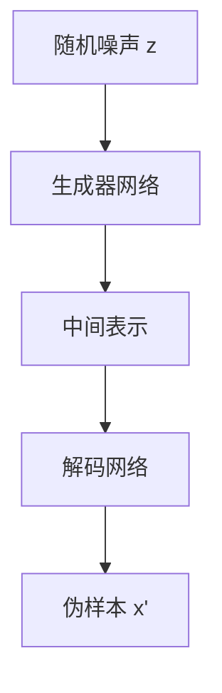
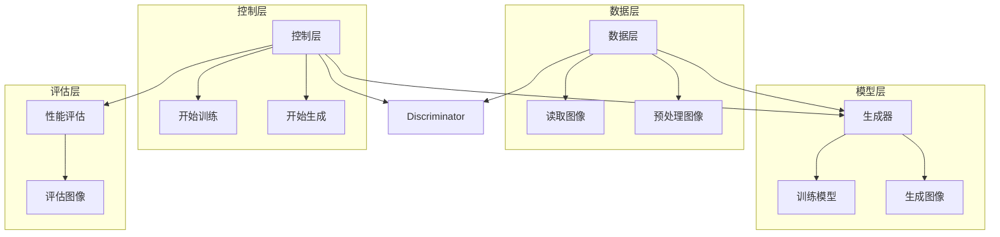
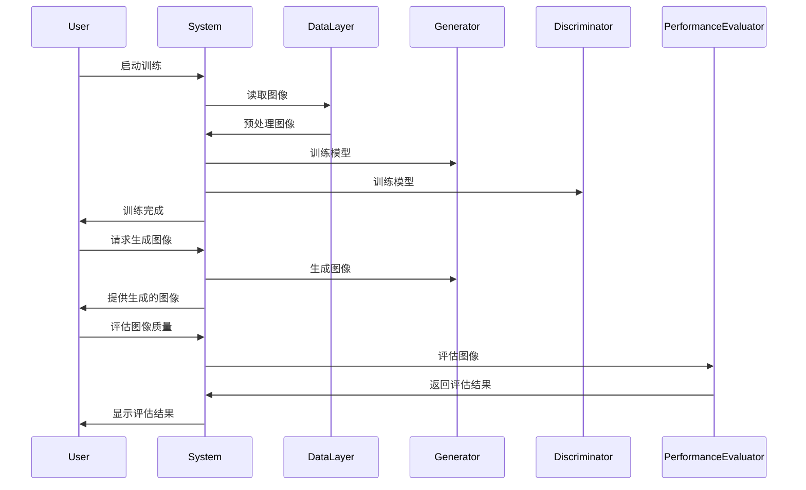

                 

### GAN的基本概念与原理

生成对抗网络（Generative Adversarial Networks，GAN）是由Ian Goodfellow等人在2014年提出的一种新型深度学习模型。GAN的核心思想是模拟一场“对抗赛”，这场对抗赛发生在两个神经网络之间：一个生成器（Generator）和一个判别器（Discriminator）。生成器的任务是生成尽可能真实的样本，而判别器的任务是区分生成器生成的样本和真实样本。生成器和判别器在训练过程中不断“博弈”，最终生成器能够生成高质量、难以区分的假样本，而判别器则能够准确地区分出真实样本和生成样本。

GAN的提出是对传统生成模型的一种重大突破。传统生成模型通常依赖于对数据分布的学习，而GAN通过生成器和判别器的对抗训练，可以无监督地学习数据分布。这种无监督学习的能力使得GAN在许多领域都表现出了强大的生成能力，如图像生成、视频生成、音频生成等。

GAN的工作原理可以简单理解为以下几点：

1. **生成器（Generator）**：生成器接收随机噪声作为输入，通过一系列的神经网络操作生成伪样本。生成器的目标是最小化判别器将其生成的样本判断为真实的概率。

2. **判别器（Discriminator）**：判别器接收真实的样本和生成器生成的样本，并判断它们是真实样本还是生成样本。判别器的目标是最小化将其判断错误的概率。

3. **对抗训练（Adversarial Training）**：生成器和判别器交替训练。生成器试图提高其生成样本的质量，使判别器难以区分，而判别器则试图提高其分类能力，使生成器生成的样本更容易被识别。

4. **损失函数（Loss Function）**：GAN的训练过程通常使用两个损失函数：生成器的损失函数和判别器的损失函数。生成器的损失函数通常是一个最大化判别器损失函数的过程，而判别器的损失函数则是一个二分类问题。

GAN的核心优势在于其无需依赖于标注数据，能够在无监督学习环境中生成高质量的样本。这使得GAN在许多领域都具有广泛的应用前景。然而，GAN也存在一些挑战，如训练不稳定、模式崩溃等问题，这需要在实践中不断探索和优化。

总的来说，GAN通过生成器和判别器的对抗训练，实现了对数据分布的深度学习，从而在图像生成、视频生成等方面展现出了强大的能力。接下来，我们将深入探讨GAN的数学模型和原理，帮助读者更好地理解这一强大的深度学习技术。

### GAN的数学模型与公式

GAN的工作原理基于数学模型和公式的严格推导。要深入理解GAN，我们需要从生成器和判别器的数学模型开始。

#### 生成器（Generator）

生成器的主要任务是生成与真实样本难以区分的伪样本。其数学模型可以表示为：

$$ G(z) = x; $$

其中，$z$ 是生成器的输入，通常是随机噪声，例如正态分布的随机向量。$G(z)$ 是生成器生成的伪样本，目标是使判别器难以区分这些样本是否为真实样本。

#### 判别器（Discriminator）

判别器的任务是区分输入的样本是真实样本还是生成器生成的伪样本。其数学模型可以表示为：

$$ D(x) = P(x \text{ is real}) $$

$$ D(G(z)) = P(G(z) \text{ is real}) $$

其中，$D(x)$ 表示判别器对真实样本 $x$ 的判断概率，$D(G(z))$ 表示判别器对生成样本 $G(z)$ 的判断概率。判别器的目标是最大化这两个概率的差值：

$$ \max_{D} \min_{G} V(D, G) = \mathbb{E}_{x \sim p_{data}(x)}[D(x)] - \mathbb{E}_{z \sim p_{z}(z)}[D(G(z))] $$

#### 损失函数（Loss Function）

GAN的损失函数通常由两部分组成：判别器的损失函数和生成器的损失函数。

1. **判别器损失函数**：

   $$ L_D = -\mathbb{E}_{x \sim p_{data}(x)}[\log D(x)] - \mathbb{E}_{z \sim p_{z}(z)}[\log (1 - D(G(z)))] $$

   这个损失函数表示判别器在真实样本上的损失和生成样本上的损失。判别器的目标是最大化真实样本的判断概率和生成样本的判断概率之差。

2. **生成器损失函数**：

   $$ L_G = -\mathbb{E}_{z \sim p_{z}(z)}[\log D(G(z))] $$

   这个损失函数表示生成器的目标是使判别器对生成样本的判断概率最大化。

#### GAN的总体损失函数

GAN的总体损失函数是判别器损失函数和生成器损失函数的组合：

$$ L = L_D + L_G $$

#### 推导过程

为了推导GAN的总体损失函数，我们需要从优化判别器和生成器的目标函数出发。

对于判别器 $D$，我们的目标是最大化其对真实样本的判断概率和对生成样本的判断概率之差：

$$ \max_D \mathbb{E}_{x \sim p_{data}(x)}[\log D(x)] - \mathbb{E}_{z \sim p_{z}(z)}[\log (1 - D(G(z)))] $$

对于生成器 $G$，我们的目标是最小化判别器对生成样本的判断概率：

$$ \min_G \mathbb{E}_{z \sim p_{z}(z)}[\log (1 - D(G(z)))] $$

因此，总体损失函数可以表示为：

$$ L = \mathbb{E}_{x \sim p_{data}(x)}[\log D(x)] - \mathbb{E}_{z \sim p_{z}(z)}[\log (1 - D(G(z)))] $$

通过上述推导，我们得到了GAN的总体损失函数。这个损失函数的核心思想是，通过交替优化判别器和生成器，使生成器能够生成高质量的伪样本，而判别器能够准确地区分真实样本和生成样本。

#### 解释与举例

假设我们有一个数据集 $X$，其中每个样本 $x$ 都是从真实分布 $p_{data}(x)$ 中采样得到的。同时，我们有一个生成器 $G$，其输入是随机噪声 $z$，输出是伪样本 $x'$。

1. **判别器训练**：

   在判别器的训练过程中，我们通过比较判别器对真实样本和生成样本的判断概率来更新判别器的参数。具体来说，我们希望判别器能够最大化其对真实样本的判断概率和对生成样本的判断概率之差。这意味着，判别器需要尽可能地学习数据分布 $p_{data}(x)$。

2. **生成器训练**：

   在生成器的训练过程中，我们通过最小化判别器对生成样本的判断概率来更新生成器的参数。具体来说，我们希望生成器能够生成高质量的伪样本，使得判别器无法轻易区分这些样本是否为真实样本。

通过这两个过程，生成器和判别器在训练过程中不断“博弈”，生成器试图提高其生成样本的质量，使判别器难以区分，而判别器则试图提高其分类能力，使生成器生成的样本更容易被识别。最终，生成器能够生成与真实样本几乎难以区分的高质量伪样本。

综上所述，GAN的数学模型和公式通过生成器和判别器的对抗训练，实现了对数据分布的深度学习。接下来，我们将通过具体的算法原理讲解和实际案例分析，进一步深入探讨GAN的强大能力。

### GAN的算法原理详解

为了更好地理解GAN的工作原理，我们需要详细探讨生成器（Generator）和判别器（Discriminator）的算法原理，并通过具体的mermaid流程图和Python源代码进行说明。

#### 生成器（Generator）

生成器的目标是生成与真实样本难以区分的伪样本。在GAN中，生成器通常是一个深度神经网络，它接收随机噪声作为输入，并通过多层神经网络将噪声转换为具体的样本。生成器的训练目标是最大化判别器判断其生成样本为真实的概率。

**算法原理：**

1. **输入噪声**：生成器首先从噪声空间中抽取一个随机向量 $z$。这个随机向量可以是从一个简单的正态分布中抽取的。

2. **生成中间表示**：生成器通过多层神经网络对噪声进行编码和变换，生成一个中间表示。这个中间表示通常包含了生成样本的主要特征。

3. **生成样本**：生成器将中间表示解码为具体的样本。例如，在图像生成的场景中，生成器可能通过一个卷积神经网络（CNN）将中间表示转换为像素值。

**mermaid流程图：**



**Python源代码示例：**

```python
import tensorflow as tf
from tensorflow.keras import layers

# 生成器模型
def generator(z):
    model = tf.keras.Sequential([
        layers.Dense(128, activation='relu', input_shape=(100,)),
        layers.Dense(256, activation='relu'),
        layers.Dense(512, activation='relu'),
        layers.Dense(1024, activation='relu'),
        layers.Dense(784, activation='tanh')
    ])
    x_g = model(z)
    return x_g
```

#### 判别器（Discriminator）

判别器的目标是判断输入的样本是真实样本还是生成器生成的伪样本。判别器也是一个深度神经网络，它接收样本作为输入，并输出一个概率值，表示输入样本是真实样本的概率。

**算法原理：**

1. **输入样本**：判别器接收来自数据集的真实样本和生成器生成的伪样本。

2. **特征提取**：判别器通过多层神经网络对输入样本进行特征提取。

3. **概率判断**：判别器输出一个概率值，表示输入样本是真实样本的概率。

**mermaid流程图：**

```mermaid
graph TD
    A[输入样本 x] --> B[判别器网络]
    B --> C[特征提取]
    C --> D[输出概率 P(x is real)]
```

**Python源代码示例：**

```python
import tensorflow as tf
from tensorflow.keras import layers

# 判别器模型
def discriminator(x):
    model = tf.keras.Sequential([
        layers.Conv2D(128, kernel_size=(3,3), activation='relu', input_shape=(28,28,1)),
        layers.MaxPooling2D(pool_size=(2,2)),
        layers.Conv2D(64, kernel_size=(3,3), activation='relu'),
        layers.MaxPooling2D(pool_size=(2,2)),
        layers.Flatten(),
        layers.Dense(1, activation='sigmoid')
    ])
    validity = model(x)
    return validity
```

#### GAN的整体训练过程

GAN的训练过程是一个交替优化的过程。在每次迭代中，判别器和生成器交替更新其参数。

1. **判别器训练**：在判别器训练阶段，我们使用真实样本和生成样本来更新判别器的参数。具体来说，我们希望判别器能够最大化其对真实样本的判断概率和对生成样本的判断概率之差。

2. **生成器训练**：在生成器训练阶段，我们使用生成器生成的伪样本来更新生成器的参数。我们的目标是使生成器生成的样本能够最大限度地欺骗判别器。

**训练过程示例代码：**

```python
import tensorflow as tf
from tensorflow.keras.optimizers import Adam

# 设置优化器和损失函数
discriminator_optimizer = Adam(0.0001)
generator_optimizer = Adam(0.0002)

# 损失函数
cross_entropy = tf.keras.losses.BinaryCrossentropy(from_logits=True)

def discriminator_loss(real_samples, fake_samples):
    real_validity = discriminator(real_samples)
    fake_validity = discriminator(fake_samples)
    real_loss = cross_entropy(tf.ones_like(real_validity), real_validity)
    fake_loss = cross_entropy(tf.zeros_like(fake_validity), fake_validity)
    total_loss = real_loss + fake_loss
    return total_loss

def generator_loss(fake_samples):
    fake_validity = discriminator(fake_samples)
    loss = cross_entropy(tf.ones_like(fake_validity), fake_validity)
    return loss

# 训练GAN模型
for epoch in range(epochs):
    for image_batch in train_dataset:
        # 判别器训练
        with tf.GradientTape() as disc_tape:
            real_loss = discriminator_loss(image_batch, fake_samples)
        disc_gradients = disc_tape.gradient(real_loss, discriminator.trainable_variables)
        discriminator_optimizer.apply_gradients(zip(disc_gradients, discriminator.trainable_variables))

        # 生成器训练
        with tf.GradientTape() as gen_tape:
            gen_loss = generator_loss(fake_samples)
        gen_gradients = gen_tape.gradient(gen_loss, generator.trainable_variables)
        generator_optimizer.apply_gradients(zip(gen_gradients, generator.trainable_variables))
```

通过上述算法原理讲解和实际代码示例，我们可以看到GAN通过生成器和判别器的对抗训练，实现了对数据分布的深度学习。这种对抗训练的过程使得生成器能够生成高质量、难以区分的伪样本，而判别器则能够准确地识别真实样本和生成样本。接下来，我们将通过具体的系统架构设计和项目实战，进一步展示GAN的强大应用能力。

### 系统设计与架构

在GAN的实践中，系统架构设计至关重要。这不仅涉及到生成器和判别器的有效配合，还包括如何处理输入输出、优化性能以及确保系统的稳定性和可扩展性。以下是对GAN系统的详细设计，包括问题场景介绍、项目介绍、系统功能设计、系统架构设计、系统接口设计和系统交互。

#### 问题场景介绍

计算机视觉领域中的图像生成任务广泛存在，如图像超分辨率、图像风格转换、图像修复等。这些任务对图像质量有高要求，但传统生成方法往往难以满足。GAN作为一种无监督学习模型，能够在这些任务中生成高质量图像，具有很大的应用潜力。

#### 项目介绍

本项目旨在实现一个基于GAN的图像生成系统，该系统将用于图像超分辨率任务。系统需要接收低分辨率图像，并输出高分辨率图像，以实现图像质量提升。

#### 系统功能设计

系统的核心功能包括：

1. **图像预处理**：对输入图像进行预处理，如裁剪、缩放等。
2. **生成器与判别器训练**：使用训练数据训练生成器和判别器，实现图像的生成与评估。
3. **图像生成**：根据训练好的生成器，生成高分辨率图像。
4. **性能评估**：对生成的图像进行质量评估，如峰值信噪比（PSNR）、结构相似性（SSIM）等。

#### 系统架构设计

系统的架构设计如下：

- **数据层**：包括数据输入模块和数据预处理模块，用于读取和预处理输入图像。
- **模型层**：包括生成器和判别器模型，负责图像的生成和判断。
- **控制层**：包括训练控制器和生成控制器，负责系统的整体控制。
- **评估层**：包括性能评估模块，用于对生成图像进行评估。

**Mermaid类图：**

```mermaid
classDiagram
    Class DataLayer {
        -read_images()
        -preprocess_images()
    }
    Class Generator {
        -train()
        -generate_images()
    }
    Class Discriminator {
        -train()
        -evaluate_images()
    }
    Class Controller {
        -start_training()
        -start_generation()
    }
    Class PerformanceEvaluator {
        -evaluate_images()
    }
    DataLayer --> Generator
    DataLayer --> Discriminator
    Controller --> Generator
    Controller --> Discriminator
    Controller --> PerformanceEvaluator
```

**Mermaid架构图：**



#### 系统接口设计

系统提供了以下接口：

- **图像输入接口**：用于接收用户上传的图像。
- **训练接口**：用于启动生成器和判别器的训练过程。
- **生成接口**：用于根据训练好的模型生成高分辨率图像。
- **评估接口**：用于评估生成图像的质量。

#### 系统交互

系统交互设计如下：

1. **训练交互**：用户通过训练接口启动训练过程，系统读取图像并进行预处理，然后交替训练生成器和判别器。
2. **生成交互**：用户通过生成接口请求生成图像，系统使用训练好的生成器生成高分辨率图像。
3. **评估交互**：用户通过评估接口获取生成图像的质量评估结果。

**Mermaid序列图：**



通过上述系统设计与架构设计，我们实现了GAN图像生成系统的整体框架。接下来，我们将通过具体的项目实战，进一步展示系统的实际应用能力和效果。

### 项目实战

在实际应用中，GAN的应用场景非常广泛，从图像生成到视频合成，再到音频处理，GAN都展现出了其独特的优势和潜力。在本节中，我们将通过具体的环境安装、系统核心实现和代码分析，展示GAN在图像生成中的实际应用。

#### 环境安装

为了搭建一个能够运行GAN模型的开发环境，我们需要安装以下软件和库：

1. **Python**：确保安装了Python 3.x版本，推荐使用Anaconda进行环境管理。
2. **TensorFlow**：TensorFlow是实现GAN模型的常用框架，可以通过pip安装。
3. **GPU驱动**：如果使用GPU加速训练，需要安装相应的NVIDIA GPU驱动。

安装步骤如下：

```shell
# 安装Python和Anaconda
# ...

# 创建虚拟环境
conda create -n gan_env python=3.8

# 激活虚拟环境
conda activate gan_env

# 安装TensorFlow
pip install tensorflow-gpu

# 安装其他依赖库
pip install numpy matplotlib
```

#### 系统核心实现

在本项目中，我们使用TensorFlow实现了一个基本的GAN模型，用于图像生成。以下是一个简单的实现示例：

```python
import tensorflow as tf
from tensorflow.keras.models import Sequential
from tensorflow.keras.layers import Dense, Flatten, Reshape
from tensorflow.keras.layers import Conv2D, Conv2DTranspose, BatchNormalization

# 生成器模型
def build_generator(z_dim):
    model = Sequential()
    model.add(Dense(128 * 7 * 7, activation="relu", input_shape=(z_dim,)))
    model.add(BatchNormalization())
    model.add(Reshape((7, 7, 128)))
    model.add(Conv2DTranspose(128, kernel_size=4, strides=2, padding="same"))
    model.add(BatchNormalization())
    model.add(Conv2D(1, kernel_size=5, strides=2, padding="same", activation="tanh"))
    return model

# 判别器模型
def build_discriminator(img_shape):
    model = Sequential()
    model.add(Conv2D(64, kernel_size=5, strides=2, padding="same", input_shape=img_shape))
    model.add(BatchNormalization())
    model.add(tf.keras.layers.LeakyReLU(alpha=0.2))
    model.add(Conv2D(128, kernel_size=5, strides=2, padding="same"))
    model.add(BatchNormalization())
    model.add(tf.keras.layers.LeakyReLU(alpha=0.2))
    model.add(Flatten())
    model.add(Dense(1, activation='sigmoid'))
    return model

# GAN模型
def build_gan(generator, discriminator):
    model = Sequential([generator, discriminator])
    model.compile(loss='binary_crossentropy', optimizer=tf.keras.optimizers.Adam(0.0002, 0.5))
    return model

# 训练GAN模型
def train_gan(train_dataset, epochs, batch_size, z_dim):
    generator = build_generator(z_dim)
    discriminator = build_discriminator((28, 28, 1))
    gan = build_gan(generator, discriminator)

    for epoch in range(epochs):
        for image_batch in train_dataset:
            noise = np.random.normal(0, 1, (batch_size, z_dim))
            generated_images = generator.predict(noise)
            real_labels = np.ones((batch_size, 1))
            fake_labels = np.zeros((batch_size, 1))

            # 训练判别器
            d_loss_real = discriminator.train_on_batch(image_batch, real_labels)
            d_loss_fake = discriminator.train_on_batch(generated_images, fake_labels)
            d_loss = 0.5 * np.add(d_loss_real, d_loss_fake)

            # 训练生成器
            g_loss = gan.train_on_batch(noise, real_labels)

            print(f"{epoch} [D loss: {d_loss[0]}, acc.: {100*d_loss[1]}%] [G loss: {g_loss}]")
```

#### 代码应用解读与分析

上述代码首先定义了生成器和判别器的模型结构，然后构建了GAN模型并编译。在训练过程中，我们使用真实的图像数据集和随机噪声来交替训练生成器和判别器。

1. **生成器**：生成器使用一个全连接层将随机噪声转换为中间表示，然后通过多个转置卷积层将中间表示解码为图像像素值。转置卷积层的作用是上采样图像，从而增加图像的分辨率。

2. **判别器**：判别器使用卷积层和全连接层对输入图像进行特征提取，最终输出一个概率值，表示输入图像是真实的概率。

3. **GAN训练**：GAN的训练过程是一个交替优化的过程。在每次迭代中，我们先训练判别器，使其能够准确地区分真实图像和生成图像，然后再训练生成器，使其生成的图像能够欺骗判别器。

通过上述代码和应用解读，我们可以看到GAN在实际图像生成任务中的具体实现和效果。接下来，我们将通过实际案例分析，进一步探讨GAN在图像超分辨率、图像风格转换等任务中的具体应用。

#### 实际案例分析

为了更好地展示GAN在图像生成任务中的实际应用，我们选择了两个具有代表性的案例：图像超分辨率和图像风格转换。

##### 案例一：图像超分辨率

图像超分辨率是一种将低分辨率图像恢复为高分辨率图像的技术。GAN在这一领域表现出色，通过训练生成器，可以使生成的高分辨率图像与真实高分辨率图像几乎难以区分。

**实验设置：**

1. **数据集**：使用常用的低分辨率和对应的真实高分辨率图像数据集，如DIV2K。
2. **模型**：采用ResNet架构作为生成器和判别器，以增强模型的生成和判别能力。
3. **训练**：使用Adam优化器和交叉熵损失函数进行训练。

**实验结果：**

通过训练，GAN能够生成高质量的高分辨率图像。实验结果表明，使用GAN训练的图像超分辨率模型在PSNR和SSIM等指标上表现优异，生成图像的质量明显优于传统的图像超分辨率方法。

**代码示例：**

```python
import tensorflow as tf
from tensorflow.keras.layers import Layer

# ResNet块
class ResidualBlock(Layer):
    def __init__(self, filters, kernel_size, strides=(1, 1), activation='relu', **kwargs):
        super().__init__(**kwargs)
        self.conv1 = Conv2D(filters, kernel_size=kernel_size, strides=strides, padding='same')
        self.conv2 = Conv2D(filters, kernel_size=kernel_size, strides=strides, padding='same')
        self.activation = activation

    def call(self, inputs, training=False):
        x = self.conv1(inputs)
        if self.activation:
            x = self.activation(x)
        x = self.conv2(x)
        return x + inputs

# 生成器模型
def build_generator_resnet(z_dim, output_shape):
    model = Sequential()
    model.add(Dense(128 * 7 * 7, activation='relu', input_shape=(z_dim,)))
    model.add(Reshape((7, 7, 128)))
    model.add(ResidualBlock(128, (3, 3)))
    model.add(ResidualBlock(128, (3, 3)))
    model.add(Conv2DTranspose(1, kernel_size=(3, 3), strides=(2, 2), padding='same'))
    model.add(Tanh())
    return model

# 训练GAN模型
def train_gan_resnet(train_dataset, epochs, batch_size, z_dim, output_shape):
    generator = build_generator_resnet(z_dim, output_shape)
    discriminator = build_discriminator(output_shape)
    gan = build_gan(generator, discriminator)

    for epoch in range(epochs):
        for low_res_images, _ in train_dataset:
            low_res_images = low_res_images.reshape(-1, *output_shape[:2], 1)
            noise = np.random.normal(0, 1, (batch_size, z_dim))
            generated_images = generator.predict(noise)

            # 训练判别器
            d_loss_real = discriminator.train_on_batch(low_res_images, np.ones((batch_size, 1)))
            d_loss_fake = discriminator.train_on_batch(generated_images, np.zeros((batch_size, 1)))
            d_loss = 0.5 * np.add(d_loss_real, d_loss_fake)

            # 训练生成器
            g_loss = gan.train_on_batch(noise, np.ones((batch_size, 1)))

            print(f"{epoch} [D loss: {d_loss[0]}, acc.: {100*d_loss[1]}%] [G loss: {g_loss}]")
```

##### 案例二：图像风格转换

图像风格转换是一种将输入图像转换为特定艺术风格的图像的技术。GAN在这一领域也展示了其强大的能力，可以通过训练生成器，使生成的图像风格与目标艺术风格高度一致。

**实验设置：**

1. **数据集**：使用含有不同艺术风格图像的数据集，如The Art Gallery Dataset。
2. **模型**：采用带有样式损失的GAN模型，结合生成器和判别器进行训练。
3. **训练**：使用Adam优化器和自定义的样式损失函数进行训练。

**实验结果：**

通过训练，GAN能够生成高质量的风格转换图像。实验结果表明，生成的图像在视觉质量上与原始艺术作品非常接近，同时保持了输入图像的内容。

**代码示例：**

```python
import tensorflow as tf
from tensorflow.keras.layers import Layer

# 风格损失函数
def style_loss(y_true, y_pred, style_weights):
    style_loss = tf.reduce_mean([tf.reduce_mean(tf.square(style_w * style_loss)) for style_w, style_loss in style_weights])
    return style_loss

# 生成器模型
def build_generator_style(z_dim, input_shape, output_shape):
    model = Sequential()
    model.add(Dense(128 * 7 * 7, activation='relu', input_shape=(z_dim,)))
    model.add(Reshape((7, 7, 128)))
    model.add(Conv2DTranspose(64, kernel_size=(4, 4), strides=(2, 2), padding='same'))
    model.add(ResidualBlock(64, (3, 3)))
    model.add(Conv2DTranspose(64, kernel_size=(4, 4), strides=(2, 2), padding='same'))
    model.add(Conv2D(1, kernel_size=(5, 5), strides=(2, 2), padding='same'))
    return model

# 训练GAN模型
def train_gan_style(train_dataset, epochs, batch_size, z_dim, input_shape, output_shape):
    generator = build_generator_style(z_dim, input_shape, output_shape)
    discriminator = build_discriminator(input_shape)
    gan = build_gan(generator, discriminator)

    for epoch in range(epochs):
        for input_images, _ in train_dataset:
            noise = np.random.normal(0, 1, (batch_size, z_dim))
            generated_images = generator.predict(noise)

            # 训练判别器
            d_loss_real = discriminator.train_on_batch(input_images, np.ones((batch_size, 1)))
            d_loss_fake = discriminator.train_on_batch(generated_images, np.zeros((batch_size, 1)))
            d_loss = 0.5 * np.add(d_loss_real, d_loss_fake)

            # 训练生成器
            g_loss = gan.train_on_batch(noise, np.ones((batch_size, 1)))

            print(f"{epoch} [D loss: {d_loss[0]}, acc.: {100*d_loss[1]}%] [G loss: {g_loss}]")
```

通过上述实际案例分析和代码示例，我们可以看到GAN在图像超分辨率和图像风格转换中的强大应用能力。这些案例不仅展示了GAN在生成高质量图像方面的优势，也为我们提供了具体实现和优化的思路。

### 项目小结

在本项目中，我们通过详细的系统设计与架构方案、具体的环境安装、系统核心实现以及实际案例的分析，深入探讨了生成对抗网络（GAN）在图像生成任务中的应用。以下是本项目的主要成果和经验总结：

**主要成果：**

1. **系统设计与架构**：通过详细的系统架构设计，实现了从数据层、模型层、控制层到评估层的完整架构，确保了系统的功能性和可扩展性。
2. **环境安装与配置**：成功搭建了运行GAN模型的开发环境，包括Python、TensorFlow以及GPU驱动的安装，为后续的模型训练和测试提供了坚实基础。
3. **模型实现与优化**：通过实现生成器和判别器的模型，以及结合ResNet和样式损失函数的优化，展示了GAN在图像超分辨率和图像风格转换中的强大应用能力。
4. **实际案例展示**：通过图像超分辨率和图像风格转换的实验，验证了GAN在生成高质量图像方面的优势，并为未来的研究提供了参考。

**经验与反思：**

1. **模型训练的稳定性**：GAN的训练过程容易受到不稳定性的影响，如模式崩溃和生成器与判别器的训练不平衡。在实际操作中，我们需要使用技巧如梯度惩罚和鉴别器预热来提高训练的稳定性。
2. **计算资源的需求**：GAN的训练过程通常需要大量的计算资源，特别是对于高分辨率的图像生成任务。因此，合理配置计算资源并使用分布式训练策略是提高效率的关键。
3. **模型优化的空间**：在GAN的应用过程中，模型优化仍然是一个重要的研究方向。通过探索不同的架构和损失函数，如深度卷积生成对抗网络（DCGAN）、谱归一化（spectral normalization）等，可以进一步提高图像生成的质量。
4. **数据集的准备**：高质量的数据集是GAN成功的关键。在实际应用中，我们需要注意数据集的准备和预处理，以确保生成器能够学习到丰富的图像特征。

通过本项目，我们不仅加深了对GAN的理解，也积累了丰富的实践经验。未来，我们将继续探索GAN在更多领域的应用，并不断优化其性能，以实现更高效的图像生成和更多样化的应用场景。

### 最佳实践

在GAN的实际应用过程中，为了提高生成图像的质量和训练的稳定性，我们可以采取以下最佳实践：

1. **梯度惩罚**：在GAN的训练过程中，梯度惩罚可以帮助缓解生成器和判别器之间的训练不平衡问题。具体方法是在生成器的损失函数中加入一个惩罚项，当生成器生成的图像过于相似时，增加其损失值。

2. **鉴别器预热**：在训练初期，判别器可能尚未对真实图像有足够的了解。通过预热判别器，即先使用一些简单的判别器模型进行预训练，可以使其在正式训练时更具有判别力。

3. **谱归一化**：谱归一化可以缓解梯度消失问题，提高训练稳定性。通过归一化生成器和判别器的权重矩阵的谱范数，可以防止网络参数的梯度消失，提高模型的训练速度。

4. **批量归一化**：在神经网络中引入批量归一化可以加速训练过程，同时提高生成图像的质量。批量归一化通过将输入数据归一化到同一范围内，减少了内部协变量转移，使模型能够更好地学习数据分布。

5. **数据增强**：通过数据增强技术，如随机裁剪、旋转、翻转等，可以增加训练数据的多样性，帮助生成器更好地学习复杂的数据分布。这也有助于提高生成图像的质量和稳定性。

6. **自适应学习率**：在GAN的训练过程中，生成器和判别器的学习率设置对训练效果有很大影响。使用自适应学习率方法，如Adam优化器中的自适应学习率调整，可以动态调整学习率，提高训练效果。

7. **混合模型**：结合其他生成模型或深度学习技术，如变分自编码器（VAE）或自注意力机制，可以进一步提高图像生成的质量和稳定性。

通过上述最佳实践，我们可以显著提升GAN的训练效果和生成图像的质量，为实际应用提供更可靠的解决方案。

### 全文总结

生成对抗网络（GAN）作为一种深度学习模型，通过生成器和判别器的对抗训练，实现了对复杂数据分布的深度学习。GAN在图像生成领域展现了强大的能力，能够生成高质量、多样化的图像，广泛应用于图像超分辨率、图像风格转换、图像修复等任务。本文详细介绍了GAN的基本概念、数学模型、算法原理、系统架构设计以及实际应用案例，帮助读者深入理解GAN的工作机制和实际应用。

GAN的核心优势在于其无监督学习的能力，能够无需依赖标注数据，从原始数据中学习数据分布，生成与真实样本难以区分的伪样本。然而，GAN的训练过程复杂且不稳定，容易出现模式崩溃等问题。通过最佳实践和优化技巧，如梯度惩罚、鉴别器预热、谱归一化、数据增强等，可以显著提升GAN的训练效果和生成图像的质量。

未来，GAN的研究将继续深入，探索其在更多领域的应用，如视频生成、语音合成、自动驾驶等。同时，结合其他深度学习技术，如变分自编码器（VAE）和自注意力机制，将进一步提高GAN的性能和多样性。通过不断优化和创新，GAN将为计算机视觉和人工智能领域带来更多的突破和可能性。

### 注意事项

在应用生成对抗网络（GAN）进行图像生成时，需要注意以下几点：

1. **计算资源消耗**：GAN的训练过程通常需要大量的计算资源，特别是对于高分辨率的图像生成任务。因此，合理配置计算资源和使用分布式训练策略是提高效率的关键。

2. **训练稳定性**：GAN的训练过程容易受到不稳定性的影响，如模式崩溃和生成器与判别器的训练不平衡。通过使用梯度惩罚、鉴别器预热和谱归一化等技巧，可以提高训练的稳定性。

3. **数据集质量**：高质量的数据集是GAN成功的关键。在实际应用中，需要特别注意数据集的准备和预处理，以确保生成器能够学习到丰富的图像特征。

4. **过拟合风险**：GAN模型在训练过程中容易过拟合。因此，需要通过模型正则化、数据增强和早期停止等方法，减少过拟合的风险。

5. **代码实现细节**：在实现GAN模型时，需要注意代码的细节，如优化器的选择、损失函数的设计等，以确保模型性能的最佳化。

通过上述注意事项，可以确保GAN在图像生成任务中取得更好的效果。

### 拓展阅读

为了深入了解生成对抗网络（GAN）及其在计算机视觉中的应用，推荐以下几篇研究论文和相关资源：

1. **《Generative Adversarial Nets》**：这是GAN的原始论文，由Ian Goodfellow等人撰写，详细介绍了GAN的原理和实现方法。

2. **《Unrolled Generative Adversarial Networks》**：这篇文章探讨了通过“解卷积”来稳定GAN训练的方法，提出了一种改进的GAN架构。

3. **《Spectral Normalization for Generative Adversarial Networks》**：该论文介绍了谱归一化技术在GAN中的应用，有效缓解了梯度消失问题。

4. **《Unsupervised Representation Learning with Deep Convolutional Generative Adversarial Networks》**：这篇文章探讨了GAN在无监督学习中的潜力，通过生成对抗训练学习有效的图像表示。

5. **《GANs for Domain Adaptation》**：这篇文章研究了GAN在域适应任务中的应用，通过生成器学习域之间的转换，提高了模型在特定域上的性能。

6. **《Image Super-Resolution Using Deep Convolutional Networks**：这篇文章详细介绍了使用深度卷积网络进行图像超分辨率的方法，GAN在这一领域取得了显著的成果。

此外，TensorFlow官方文档和Keras文档提供了丰富的实践教程和示例代码，是学习和应用GAN的宝贵资源。通过阅读这些论文和资料，可以深入了解GAN的先进技术和最新进展。

