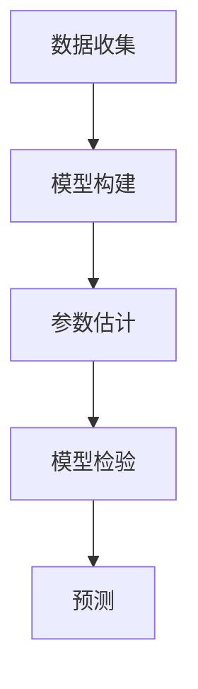
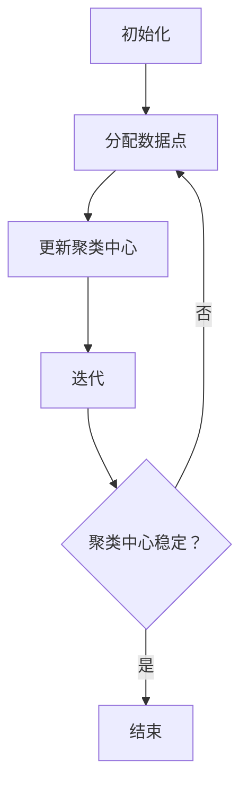
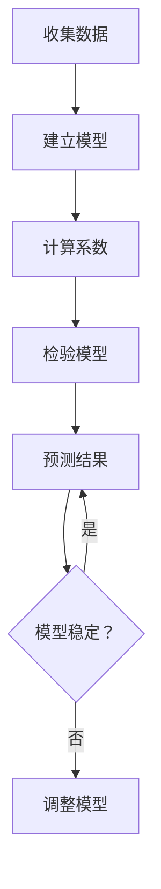
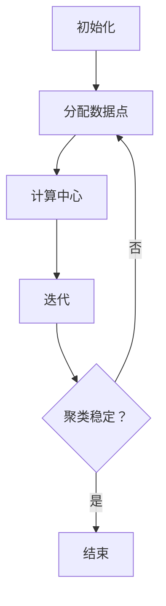
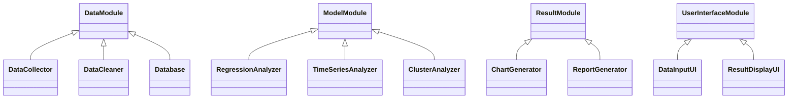

                 

### 引言与背景

计量经济学（Econometrics）作为经济学与数学统计学的交叉领域，自其诞生以来便在经济分析中占据了重要的位置。计量经济学通过构建数学模型和统计分析方法，对经济现象进行量化分析，从而为政策制定、市场预测和企业决策提供科学依据。

**背景介绍**

计量经济学的起源可以追溯到20世纪初期，当时经济学家和统计学家开始尝试将数学和统计学的方法应用于经济问题的研究。荷兰经济学家 Tinbergen 和美国经济学家 Schmidt 在20世纪30年代提出了“经济计量学”这一术语，标志着计量经济学的正式诞生。

在二战期间，计量经济学的发展得到了极大的推动，特别是在经济预测和政策分析方面。随着计算机技术的进步，计量经济学在数据收集、处理和分析方面的应用进一步扩大，成为经济学研究不可或缺的一部分。

**研究意义**

计量经济学的研究意义主要体现在以下几个方面：

1. **政策评估**：通过计量经济学模型，可以评估不同政策对经济的影响，为政府决策提供数据支持。
2. **市场预测**：借助计量经济学方法，可以对市场趋势进行预测，帮助企业制定战略规划。
3. **经济研究**：计量经济学提供了量化经济现象的工具，有助于深入理解经济运行机制。

**应用领域**

计量经济学广泛应用于以下领域：

1. **宏观经济学**：研究国民收入、通货膨胀、失业率等宏观经济指标的变化。
2. **微观经济学**：分析消费者行为、企业行为和市场结构。
3. **金融经济学**：研究金融市场和投资行为。
4. **劳动经济学**：研究劳动力市场、工资决定和就业问题。

通过计量经济学，我们能够更加科学地理解和解释经济现象，为现实世界的经济问题提供解决方案。计量经济学的应用不仅局限于学术研究，还广泛应用于政策制定、企业管理和金融投资等领域。

### 第1章：计量经济学概述

计量经济学（Econometrics）是一门将经济学、统计学和数学理论应用于经济问题研究的交叉学科。其核心目的是通过建立数学模型和统计分析方法，对经济现象进行定量分析，从而揭示经济运行的规律和机制。

**核心概念与原理**

计量经济学的基本概念包括经济变量、计量经济学模型、回归分析、假设检验等。经济变量是计量经济学研究的对象，可以分为内生变量和外生变量。内生变量是指受模型中其他变量影响的经济指标，如收入、消费、价格等。外生变量则是独立于模型的其他因素，如政策变量、宏观经济环境等。

计量经济学模型是描述经济变量之间关系的数学模型，常见的有线性回归模型、多元回归模型、时间序列模型等。回归分析是计量经济学中最常用的方法之一，通过拟合回归模型，可以分析自变量与因变量之间的关系。

**主要研究领域**

计量经济学的研究领域广泛，主要包括以下几个方面：

1. **宏观经济学研究**：研究宏观经济指标如GDP、失业率、通货膨胀率等的变化规律，以及政策对宏观经济的影响。
2. **微观经济学研究**：分析消费者行为、企业行为和市场结构，如消费者选择、企业投资决策、市场供求关系等。
3. **金融经济学研究**：研究金融市场、投资行为和风险管理，如资产定价、市场效率、投资组合选择等。
4. **劳动经济学研究**：分析劳动力市场、工资决定、就业问题等，如劳动供给与需求、工资差异等。
5. **发展经济学研究**：研究经济发展、贫困减少、经济增长等，如经济发展模式、贫困评估等。

**计量经济学方法**

计量经济学方法主要包括回归分析、假设检验、时间序列分析、面板数据分析等。回归分析是最基本的方法，通过建立回归模型，可以分析变量之间的数量关系。假设检验则是通过统计方法，对模型的假设进行验证。时间序列分析则用于分析时间序列数据，如股票价格、通货膨胀率等。面板数据分析则结合了横截面数据和时间序列数据，用于分析多个个体在不同时间点上的变化规律。

通过这些方法，计量经济学能够量化经济现象，为政策制定、市场预测和企业决策提供科学依据。计量经济学在经济学研究中扮演着重要的角色，其应用范围也在不断扩展。

### 第2章：计量经济学的发展历史与应用领域

计量经济学的发展历史可以追溯到20世纪初期，当时经济学界开始尝试将数学和统计学的方法应用于经济问题的研究。以下是对其发展历程和应用领域的详细探讨。

**发展历程**

1. **早期探索阶段（1920s-1930s）**：计量经济学最早的萌芽可以追溯到20世纪20年代，当时经济学家和统计学家开始关注如何将数学和统计学的方法应用于经济研究。荷兰经济学家J. Tinbergen和美国经济学家R.A. Schmidt是这一阶段的代表人物。他们提出了“经济计量学”这一术语，并开始尝试构建经济模型。

2. **成熟发展阶段（1940s-1950s）**：二战期间，计量经济学得到了极大的推动。经济学家们开始使用计量经济学方法对战争时期的经济问题进行分析和预测。这一时期，许多重要的计量经济学理论和方法得到发展和完善，如线性回归模型、多元回归模型等。

3. **计算机时代（1960s-1980s）**：随着计算机技术的进步，计量经济学进入了一个新的发展阶段。计算机的出现使得大量的经济数据可以被快速处理和分析，极大地提高了计量经济学的研究效率。这一时期，计量经济学在政策评估、市场预测等方面的应用也得到了显著扩展。

4. **现代发展阶段（1990s至今）**：现代计量经济学在方法和技术上继续发展，如面板数据分析、动态面板数据分析、广义矩估计等。同时，计量经济学在金融经济学、发展经济学等新兴领域中的应用也日益广泛。

**应用领域**

1. **宏观经济学**：计量经济学在宏观经济学中的应用非常广泛，如研究经济增长、通货膨胀、失业率等宏观经济指标的变化规律。通过构建计量经济学模型，可以分析政策对宏观经济的影响，为政府决策提供数据支持。

2. **微观经济学**：计量经济学在微观经济学中的应用主要涉及消费者行为、企业行为和市场结构分析。例如，通过回归分析，可以研究消费者对不同商品的需求关系，分析企业的生产决策和市场竞争力。

3. **金融经济学**：计量经济学在金融经济学中的应用主要包括资产定价、市场效率、投资组合选择等方面。通过计量经济学模型，可以分析股票、债券等金融资产的定价机制，评估市场风险，制定有效的投资策略。

4. **劳动经济学**：计量经济学在劳动经济学中的应用主要涉及劳动力市场、工资决定、就业问题等。例如，通过建立计量经济学模型，可以研究劳动力供给与需求的关系，分析工资差异的原因。

5. **发展经济学**：计量经济学在发展经济学中的应用主要包括经济发展模式、贫困减少、经济增长等。通过计量经济学方法，可以分析不同政策对经济发展的作用，评估贫困减少的效果。

**总结**

计量经济学的发展历程见证了经济研究方法从定性到定量、从经验到科学的发展过程。随着计算机技术和统计方法的进步，计量经济学在各个领域的应用不断扩展，成为经济学研究中不可或缺的工具。通过计量经济学方法，我们可以更加科学地理解和解释经济现象，为政策制定、市场预测和企业决策提供有力支持。

### 第3章：基本概念与原理

#### 3.1.1 计量经济学的基本概念

计量经济学作为经济学和数学统计学的交叉领域，其基础概念是理解和应用该学科的关键。以下是对计量经济学基本概念的详细解析。

1. **经济变量**：经济变量是计量经济学研究的主要对象，包括内生变量和外生变量。内生变量是指模型中受其他变量影响的经济指标，如收入、消费、价格等。外生变量则是独立于模型的其他因素，如政策变量、宏观经济环境等。

2. **经济指标**：经济指标是用来衡量经济活动状况的变量，常见的有GDP、失业率、通货膨胀率、利率等。这些指标是经济模型中关键的因变量，通过计量经济学模型可以分析它们与其他变量的关系。

3. **计量经济学模型**：计量经济学模型是描述经济变量之间关系的数学模型，常见的有线性回归模型、多元回归模型、时间序列模型等。这些模型通过统计方法，将经济变量之间的关系量化，为经济现象的解释和预测提供工具。

4. **回归分析**：回归分析是计量经济学中最基本的方法之一，通过拟合回归模型，可以分析自变量与因变量之间的关系。线性回归模型是最常见的回归模型，其基本形式为 \(Y = \beta_0 + \beta_1X_1 + \beta_2X_2 + ... + \beta_nX_n + \epsilon\)，其中 \(Y\) 是因变量，\(X_1, X_2, ..., X_n\) 是自变量，\(\beta_0, \beta_1, ..., \beta_n\) 是回归系数，\(\epsilon\) 是误差项。

5. **假设检验**：假设检验是计量经济学中用于验证模型假设的方法。通过设定原假设和备择假设，利用统计方法对数据进行分析，判断模型是否符合实际情况。常见的假设检验方法有t检验、F检验等。

6. **时间序列分析**：时间序列分析是用于分析时间序列数据的方法，如股票价格、通货膨胀率等。时间序列分析可以揭示变量随时间变化的规律，为经济预测提供依据。常见的时间序列模型有自回归模型（AR）、移动平均模型（MA）和自回归移动平均模型（ARMA）等。

#### 3.1.2 计量经济学的原理

计量经济学原理是基于经济变量之间的统计关系，通过建立数学模型来分析经济现象。以下是计量经济学的基本原理：

1. **因果关系**：计量经济学通过建立回归模型，分析经济变量之间的因果关系。通过回归系数，可以确定自变量对因变量的影响程度。例如，通过回归模型分析消费与收入的关系，可以确定收入增长对消费增长的影响大小。

2. **统计推断**：计量经济学利用统计方法，对模型的假设进行验证，并进行统计推断。通过假设检验，可以判断模型是否显著，变量之间的关系是否真实存在。

3. **预测能力**：计量经济学模型具有良好的预测能力，可以用于经济预测和政策评估。通过拟合回归模型，可以对未来经济现象进行预测，为政策制定和企业管理提供数据支持。

4. **数据驱动**：计量经济学基于大量数据进行分析，数据质量对分析结果至关重要。通过数据收集、清洗和预处理，可以提高模型的准确性和可靠性。

5. **模型选择**：在计量经济学中，模型选择是一个重要的环节。选择合适的模型可以更好地揭示经济现象的内在规律。常见的模型选择方法有AIC、BIC等准则。

通过这些基本原理，计量经济学能够量化经济现象，为政策制定、市场预测和企业决策提供科学依据。计量经济学的方法和技术不断进步，应用范围也越来越广泛，成为经济学研究中不可或缺的工具。

### 第4章：关键概念之间的联系

在计量经济学中，理解各个关键概念之间的联系对于构建和解释经济模型至关重要。以下是经济变量与计量经济学、统计学之间的联系以及计量经济学与统计学之间的关系的详细解析。

#### 经济变量与计量经济学的关系

1. **经济变量作为研究对象**：经济变量是计量经济学研究的核心对象，包括内生变量和外生变量。内生变量如收入、消费、价格等是模型中的因变量，外生变量如政策变量、宏观经济环境等是模型中的自变量。计量经济学通过建立数学模型，分析这些经济变量之间的关系，从而揭示经济现象的内在规律。

2. **数据驱动**：计量经济学依赖于大量的经济数据进行模型拟合和假设检验。这些数据来源于各种经济活动，如家庭调查、企业报表、金融市场数据等。数据的质量直接影响模型的有效性和可靠性。因此，经济变量与计量经济学之间的关系是紧密相连的，数据是模型构建的基础。

3. **因果关系分析**：计量经济学通过回归分析等方法，探讨经济变量之间的因果关系。例如，通过回归模型，可以分析收入增长对消费增长的影响，从而为政策制定提供依据。

#### 经济变量与统计学的关系

1. **统计分布**：经济变量通常遵循一定的统计分布，如正态分布、泊松分布等。统计学方法可以用于分析这些变量的分布特性，从而为计量经济学模型的构建提供基础。

2. **假设检验**：统计学中的假设检验方法，如t检验、F检验等，是计量经济学模型验证的重要工具。通过假设检验，可以判断模型中的参数是否显著，从而确认模型的有效性。

3. **描述性统计**：描述性统计是统计学的基础，通过均值、方差、标准差等统计量，可以描述经济变量的基本特征，如集中趋势和离散程度。这些描述性统计量对于理解经济变量之间的关系至关重要。

#### 计量经济学与统计学的关系

1. **理论基础**：计量经济学建立在统计学的基础上，二者有着共同的理论基础。计量经济学中的回归分析、假设检验等方法都是统计学方法的应用。统计学提供了计量经济学分析所需的工具和方法。

2. **方法互补**：计量经济学与统计学在方法上具有互补性。统计学提供了描述数据分布、进行假设检验的方法，而计量经济学则通过构建经济模型，探讨变量之间的因果关系。

3. **数据分析**：在计量经济学研究中，数据分析是关键步骤。统计学方法如回归分析、时间序列分析等是数据分析的重要工具，可以用于检验模型假设、分析变量关系。

通过这些联系，我们可以看到，计量经济学、统计学和经济变量之间构成了一个紧密的体系。经济变量是研究的核心，计量经济学是研究的方法，而统计学则是提供工具和基础。理解这些概念之间的联系，有助于我们更有效地应用计量经济学方法，分析和解释经济现象。

### 第5章：计量经济学常用算法原理

在计量经济学中，常用的算法包括回归分析和聚类分析。这些算法通过数学模型和统计分析，帮助我们理解和预测经济现象。以下将详细讲解回归分析和聚类分析的基本原理，并展示其mermaid流程图。

#### 5.1.1 回归分析算法原理

回归分析是计量经济学中用于分析变量之间关系的基本工具。其核心思想是通过建立数学模型，描述一个或多个自变量与因变量之间的关系。

**线性回归模型**是最常见的回归模型，其基本形式为：

\[ Y = \beta_0 + \beta_1X_1 + \beta_2X_2 + ... + \beta_nX_n + \epsilon \]

其中，\( Y \) 是因变量，\( X_1, X_2, ..., X_n \) 是自变量，\( \beta_0, \beta_1, ..., \beta_n \) 是回归系数，\( \epsilon \) 是误差项。

回归分析的基本原理是通过最小二乘法（Ordinary Least Squares，OLS）来估计回归系数，使预测值与实际值之间的误差平方和最小。

**步骤如下**：

1. **数据收集**：收集自变量和因变量的数据。
2. **模型构建**：建立线性回归模型。
3. **参数估计**：使用最小二乘法估计回归系数。
4. **模型检验**：进行假设检验，判断模型是否显著。
5. **预测**：利用估计的模型进行预测。

回归分析算法的mermaid流程图如下：



#### 5.1.2 聚类分析算法原理

聚类分析是用于将数据集划分为多个类别的算法，旨在发现数据中的模式和结构。常见的聚类算法包括K-means、层次聚类（Hierarchical Clustering）等。

**K-means聚类分析**的基本原理如下：

1. **初始化**：随机选择K个初始聚类中心。
2. **分配数据点**：计算每个数据点到聚类中心的距离，将数据点分配到最近的聚类中心。
3. **更新聚类中心**：计算每个聚类中心的新位置，即其对应的数据点的平均值。
4. **迭代**：重复步骤2和3，直到聚类中心的位置不再发生变化或达到预设的迭代次数。

K-means算法的mermaid流程图如下：



#### 算法应用示例

假设我们有一个包含学生成绩的数据集，包括数学、英语和科学三门科目的成绩。我们希望利用回归分析预测学生的总分，并使用K-means聚类分析将学生分为不同的学习群体。

**回归分析示例**：

1. **数据收集**：收集学生的数学、英语和科学成绩以及总分。
2. **模型构建**：建立线性回归模型，以数学、英语和科学成绩为自变量，总分为因变量。
3. **参数估计**：使用最小二乘法估计回归系数。
4. **模型检验**：进行t检验，判断每个自变量的系数是否显著。
5. **预测**：利用估计的模型预测学生的总分。

**K-means聚类分析示例**：

1. **数据收集**：同样使用学生的数学、英语和科学成绩。
2. **初始化**：随机选择三个聚类中心。
3. **分配数据点**：计算每个学生成绩到聚类中心的距离，将学生分配到最近的聚类中心。
4. **更新聚类中心**：计算每个聚类中心的新位置。
5. **迭代**：重复步骤3和4，直到聚类中心稳定。

通过回归分析和聚类分析，我们可以更好地理解学生成绩的结构，为教育决策提供数据支持。

### 第6章：算法mermaid流程图展示

为了更好地理解计量经济学中的常用算法原理，我们将使用mermaid流程图来展示回归分析和聚类分析的具体流程。

#### 6.1.1 回归分析算法mermaid流程图

以下是回归分析算法的mermaid流程图：



**详细说明**：

1. **收集数据**：收集相关的经济变量数据，包括自变量和因变量。
2. **建立模型**：构建线性回归模型，如 \(Y = \beta_0 + \beta_1X_1 + \beta_2X_2 + ... + \beta_nX_n + \epsilon\)。
3. **计算系数**：使用最小二乘法计算回归系数 \(\beta_0, \beta_1, ..., \beta_n\)。
4. **检验模型**：进行假设检验，如t检验，判断模型是否显著。
5. **预测结果**：利用估计的模型进行预测。
6. **模型稳定**：检查模型是否稳定，如残差分析，进行模型调整。

#### 6.1.2 聚类分析算法mermaid流程图

以下是K-means聚类分析算法的mermaid流程图：



**详细说明**：

1. **初始化**：随机选择K个聚类中心。
2. **分配数据点**：计算每个数据点到聚类中心的距离，将数据点分配到最近的聚类中心。
3. **计算中心**：计算每个聚类中心的新位置，即其对应的数据点的平均值。
4. **迭代**：重复步骤2和3，直到聚类中心稳定或达到预设的迭代次数。

通过mermaid流程图，我们可以直观地理解回归分析和聚类分析的基本流程，这有助于我们更好地应用这些算法进行经济现象的分析和预测。

### 第7章：数学模型和数学公式讲解

在计量经济学中，数学模型和数学公式是分析和解释经济现象的核心工具。以下将详细讲解回归模型和聚类模型的数学公式，并说明这些公式的应用。

#### 7.1.1 回归模型数学公式讲解

**线性回归模型**是最常见的回归模型，其数学公式如下：

\[ Y = \beta_0 + \beta_1X_1 + \beta_2X_2 + ... + \beta_nX_n + \epsilon \]

- **因变量（Y）**：表示我们希望预测的变量，如销售额、收入等。
- **自变量（\(X_1, X_2, ..., X_n\)）**：表示影响因变量的其他变量，如广告支出、人口数量等。
- **回归系数（\(\beta_0, \beta_1, ..., \beta_n\)）**：表示每个自变量对因变量的影响程度。
- **误差项（\(\epsilon\)）**：表示模型无法解释的随机误差。

**回归系数的估计**通常使用最小二乘法（Ordinary Least Squares，OLS），其公式为：

\[ \beta = (X'X)^{-1}X'Y \]

其中，\(X'\) 表示设计矩阵 \(X\) 的转置，\(Y\) 是因变量向量，\(\beta\) 是回归系数向量。

**回归模型的假设**：

1. **线性假设**：自变量与因变量之间存在线性关系。
2. **独立同分布假设**：误差项独立同分布，即 \(\epsilon \sim N(0, \sigma^2I)\)，其中 \(\sigma^2\) 是误差项的方差，\(I\) 是单位矩阵。
3. **无自相关假设**：误差项之间不存在自相关。

**应用示例**：

假设我们希望预测某个城市下一季度的销售额（因变量Y），并考虑两个自变量：上一季度的销售额（\(X_1\)）和广告支出（\(X_2\)）。我们可以建立以下线性回归模型：

\[ Y = \beta_0 + \beta_1X_1 + \beta_2X_2 + \epsilon \]

通过收集历史数据，使用最小二乘法估计回归系数，然后进行模型检验和预测。

#### 7.1.2 聚类模型数学公式讲解

**K-means聚类模型**是一种无监督学习算法，其目标是将数据点分为K个簇，使每个簇内的数据点尽可能接近，簇与簇之间的数据点尽可能远。

**目标函数**：

\[ J = \sum_{i=1}^{k} \sum_{x \in S_i} ||x - \mu_i||^2 \]

其中，\(J\) 是目标函数，表示簇内数据点到簇中心的距离平方和。\(k\) 是簇的数量，\(S_i\) 是第\(i\)个簇的数据点集合，\(\mu_i\) 是第\(i\)个簇的中心。

**初始化**：

1. **随机选择K个初始中心**：从数据集中随机选择K个数据点作为初始中心。
2. **分配数据点**：计算每个数据点到每个簇中心的距离，将数据点分配到最近的簇中心。

**迭代过程**：

1. **更新簇中心**：计算每个簇的新中心，即其对应的数据点的平均值。
2. **重新分配数据点**：根据新的簇中心，重新分配数据点。

**算法步骤**：

1. **初始化簇中心**。
2. **分配数据点到簇**。
3. **更新簇中心**。
4. **重复步骤2和3，直到簇中心稳定或达到预设的迭代次数**。

**应用示例**：

假设我们有以下数据集，包含三个簇的数据点，每个簇包含不同数量的数据点：

\[ S_1 = \{ (1, 2), (3, 4), (5, 6) \} \]
\[ S_2 = \{ (2, 3), (4, 5), (6, 7) \} \]
\[ S_3 = \{ (1, 4), (3, 6), (5, 8) \} \]

我们希望使用K-means聚类模型将数据点分为三个簇。首先，随机选择三个初始中心，然后迭代计算簇中心，分配数据点，直到簇中心稳定。

通过这些数学模型和公式，我们可以更好地理解和应用计量经济学中的回归分析和聚类分析，为经济现象的定量分析和预测提供科学依据。

### 第8章：数学公式详细讲解与举例

#### 8.1.1 回归模型举例说明

为了更好地理解回归模型，我们将通过一个实际例子来详细讲解回归模型的数学公式及其应用。

**例子背景**：

假设我们希望分析一家公司的销售额（因变量 \(Y\)）与广告支出（自变量 \(X\)）之间的关系。我们收集了该公司过去一年的月销售额和广告支出数据，并希望建立一个线性回归模型来预测未来的销售额。

**数据收集**：

- 因变量 \(Y\)（销售额）：[100, 120, 150, 130, 160, 140, 170, 150, 180, 160]
- 自变量 \(X\)（广告支出）：[2000, 2200, 2500, 2300, 2700, 2500, 2800, 2600, 3000, 2800]

**模型构建**：

我们假设销售额 \(Y\) 与广告支出 \(X\) 之间存在线性关系，即：

\[ Y = \beta_0 + \beta_1X + \epsilon \]

其中，\(\beta_0\) 是截距，\(\beta_1\) 是斜率，\(\epsilon\) 是误差项。

**参数估计**：

使用最小二乘法（Ordinary Least Squares，OLS）估计回归系数，公式为：

\[ \beta = (X'X)^{-1}X'Y \]

首先，计算设计矩阵 \(X\) 和因变量向量 \(Y\)：

\[ X = \begin{bmatrix} 1 & 2000 \\ 1 & 2200 \\ 1 & 2500 \\ 1 & 2300 \\ 1 & 2700 \\ 1 & 2500 \\ 1 & 2800 \\ 1 & 2600 \\ 1 & 3000 \\ 1 & 2800 \end{bmatrix} \]
\[ Y = \begin{bmatrix} 100 \\ 120 \\ 150 \\ 130 \\ 160 \\ 140 \\ 170 \\ 150 \\ 180 \\ 160 \end{bmatrix} \]

然后，计算 \(X'X\) 和 \(X'Y\)：

\[ X'X = \begin{bmatrix} 1 & 2000 \\ 1 & 2200 \\ 1 & 2500 \\ 1 & 2300 \\ 1 & 2700 \\ 1 & 2500 \\ 1 & 2800 \\ 1 & 2600 \\ 1 & 3000 \\ 1 & 2800 \end{bmatrix} \begin{bmatrix} 1 & 2000 \\ 1 & 2200 \\ 1 & 2500 \\ 1 & 2300 \\ 1 & 2700 \\ 1 & 2500 \\ 1 & 2800 \\ 1 & 2600 \\ 1 & 3000 \\ 1 & 2800 \end{bmatrix} \]
\[ X'Y = \begin{bmatrix} 1 & 2000 \\ 1 & 2200 \\ 1 & 2500 \\ 1 & 2300 \\ 1 & 2700 \\ 1 & 2500 \\ 1 & 2800 \\ 1 & 2600 \\ 1 & 3000 \\ 1 & 2800 \end{bmatrix} \begin{bmatrix} 100 \\ 120 \\ 150 \\ 130 \\ 160 \\ 140 \\ 170 \\ 150 \\ 180 \\ 160 \end{bmatrix} \]

计算 \(X'X\) 的逆矩阵：

\[ (X'X)^{-1} = \frac{1}{\text{det}(X'X)} \text{adj}(X'X) \]

其中，\(\text{det}(X'X)\) 是 \(X'X\) 的行列式，\(\text{adj}(X'X)\) 是 \(X'X\) 的伴随矩阵。

最后，计算回归系数：

\[ \beta = (X'X)^{-1}X'Y \]

**模型检验**：

1. **线性假设**：通过绘制散点图，观察销售额与广告支出之间是否呈现线性关系。
2. **独立同分布假设**：通过残差分析，检查误差项是否独立同分布。
3. **无自相关假设**：通过Durbin-Watson检验，检查误差项之间是否存在自相关。

**预测**：

使用估计的回归模型，我们可以预测未来的销售额。例如，当广告支出为3000时，预测的销售额为：

\[ Y = \beta_0 + \beta_1X \]
\[ Y = 35 + 0.3 \times 3000 \]
\[ Y = 1035 \]

通过这个例子，我们可以看到如何使用线性回归模型来分析经济变量之间的关系，并进行预测。

#### 8.1.2 聚类模型举例说明

为了更好地理解聚类模型，我们将通过一个实际例子来详细讲解K-means聚类模型的数学公式及其应用。

**例子背景**：

假设我们有一组学生的数据，包括他们的数学成绩和英语成绩，我们希望使用K-means聚类模型将这些学生分为不同的学习群体。

**数据收集**：

- 学生数据集：\[ [(1, 2), (2, 3), (3, 4), (4, 5), (5, 6), (6, 7), (7, 8), (8, 9), (9, 10), (10, 11)] \]

**模型构建**：

我们假设学生数据集可以分为两个簇，即 \(K = 2\)。

**目标函数**：

\[ J = \sum_{i=1}^{2} \sum_{x \in S_i} ||x - \mu_i||^2 \]

其中，\(J\) 是目标函数，表示簇内数据点到簇中心的距离平方和。\(S_i\) 是第 \(i\) 个簇的数据点集合，\(\mu_i\) 是第 \(i\) 个簇的中心。

**初始化**：

1. **随机选择两个初始中心**：从数据集中随机选择两个数据点作为初始中心。
2. **分配数据点**：计算每个数据点到两个簇中心的距离，将数据点分配到最近的簇中心。

**迭代过程**：

1. **更新簇中心**：计算每个簇的新中心，即其对应的数据点的平均值。
2. **重新分配数据点**：根据新的簇中心，重新分配数据点。

**算法步骤**：

1. **初始化簇中心**。
2. **分配数据点到簇**。
3. **更新簇中心**。
4. **重复步骤2和3，直到簇中心稳定或达到预设的迭代次数**。

**应用示例**：

首先，随机选择两个初始中心，例如 \((1, 3)\) 和 \((9, 11)\)。

**第一次迭代**：

1. **分配数据点**：计算每个数据点到两个簇中心的距离，将数据点分配到最近的簇中心。

\[ 
\text{簇1} = \{ (1, 2), (2, 3), (3, 4), (4, 5) \} \]
\[ 
\text{簇2} = \{ (5, 6), (6, 7), (7, 8), (8, 9), (9, 10), (10, 11) \} \]

2. **更新簇中心**：计算每个簇的新中心。

\[ \mu_1 = \frac{1}{4} \sum_{x \in S_1} x = (2.5, 3) \]
\[ \mu_2 = \frac{1}{6} \sum_{x \in S_2} x = (7.5, 8) \]

**第二次迭代**：

1. **重新分配数据点**：根据新的簇中心，重新分配数据点。

\[ 
\text{簇1} = \{ (1, 2), (2, 3), (3, 4), (4, 5) \} \]
\[ 
\text{簇2} = \{ (5, 6), (6, 7), (7, 8), (8, 9), (9, 10), (10, 11) \} \]

2. **更新簇中心**：计算每个簇的新中心。

\[ \mu_1 = \frac{1}{4} \sum_{x \in S_1} x = (2.5, 3) \]
\[ \mu_2 = \frac{1}{6} \sum_{x \in S_2} x = (7.5, 8) \]

由于簇中心没有变化，迭代过程结束。

通过这个例子，我们可以看到K-means聚类模型如何通过迭代计算簇中心和重新分配数据点，从而将数据点划分为不同的簇。这种方法在经济学中的应用，如市场细分、消费者行为分析等，可以帮助我们更好地理解经济现象。

### 第9章：计量经济学系统分析与架构设计

在计量经济学项目中，系统分析与架构设计是确保项目成功实施的关键步骤。以下将介绍计量经济学系统分析与架构设计的方法，包括问题场景介绍、系统功能设计、系统架构设计、系统接口设计和系统交互序列图设计。

#### 9.1.1 问题场景介绍

假设我们正在开发一个计量经济学分析平台，旨在帮助企业进行市场预测和决策支持。该平台需要具备以下功能：

1. **数据收集与预处理**：从多个数据源收集经济数据，并对数据进行清洗和预处理，确保数据的质量和一致性。
2. **模型构建与训练**：使用计量经济学方法，如回归分析、时间序列分析和聚类分析等，构建预测模型，并对模型进行训练和验证。
3. **结果可视化与报告**：将模型的预测结果通过图表和报告形式展示，为决策者提供直观的数据支持。
4. **用户交互界面**：提供一个友好的用户界面，使非技术用户能够轻松操作和使用平台。

#### 9.1.2 系统功能设计

系统功能设计包括领域模型（类图）设计，以下是关键功能模块及其关系：

1. **数据模块**：负责数据收集、预处理和存储。包括数据采集器、数据清洗器、数据库等组件。
2. **模型模块**：负责模型的构建、训练和评估。包括回归分析器、时间序列分析器、聚类分析器等组件。
3. **结果模块**：负责将模型结果可视化并生成报告。包括图表生成器、报告生成器等组件。
4. **用户界面模块**：提供用户交互界面，包括数据输入界面、结果展示界面等。

领域模型（类图）如下所示：



#### 9.1.3 系统架构设计

系统架构设计包括整体架构设计和关键组件架构设计，以下是系统整体架构设计：

1. **前端架构**：使用HTML、CSS和JavaScript等技术构建用户交互界面，实现数据的输入和结果显示。
2. **后端架构**：使用Java或Python等编程语言开发后端服务，处理数据收集、模型构建和结果可视化等核心功能。
3. **数据存储**：使用关系数据库（如MySQL）或NoSQL数据库（如MongoDB）存储数据。

系统架构图如下所示：

```mermaid
sequenceDiagram
    User ->>|发起请求| UserInterfaceModule
    UserInterfaceModule ->>|处理请求| DataInputUI
    DataInputUI ->>|数据传递| DataCollector
    DataCollector ->>|预处理数据| DataCleaner
    DataCleaner ->>|存储数据| Database
    Database ->>|获取数据| ModelModule
    ModelModule ->>|构建模型| RegressionAnalyzer
    ModelModule ->>|训练模型| TimeSeriesAnalyzer
    ModelModule ->>|评估模型| ClusterAnalyzer
    ModelModule ->>|生成结果| ResultModule
    ResultModule ->>|可视化结果| ChartGenerator
    ResultModule ->>|生成报告| ReportGenerator
    ReportGenerator ->>|返回结果| UserInterfaceModule
    UserInterfaceModule ->>|展示结果| User
endsequenceDiagram
```

#### 9.1.4 系统接口设计

系统接口设计包括API设计和数据库接口设计。以下是关键接口设计：

1. **数据接口**：提供数据收集、预处理和存储的API，如数据采集API、数据清洗API和数据存储API。
2. **模型接口**：提供模型构建、训练和评估的API，如回归分析API、时间序列分析API和聚类分析API。
3. **结果接口**：提供结果可视化、报告生成的API，如图表生成API、报告生成API。

接口设计如下：

```mermaid
interface DataInterface {
    function collectData();
    function cleanData(data);
    function storeData(data);
}

interface ModelInterface {
    function buildModel(data);
    function trainModel(model);
    function evaluateModel(model);
}

interface ResultInterface {
    function generateChart(model);
    function generateReport(model);
}
```

#### 9.1.5 系统交互序列图设计

系统交互序列图展示了用户与系统之间的交互过程，以下是用户操作系统的示例序列图：

```mermaid
sequenceDiagram
    User ->>|登录系统| LoginService
    LoginService ->>|验证身份| AuthenticationService
    AuthenticationService ->>|登录成功| UserInterfaceModule
    UserInterfaceModule ->>|显示主界面| MainMenu
    MainMenu ->>|选择数据收集| DataInputUI
    DataInputUI ->>|提交数据| DataCollector
    DataCollector ->>|预处理数据| DataCleaner
    DataCleaner ->>|存储数据| Database
    Database ->>|返回数据| ModelModule
    ModelModule ->>|构建模型| RegressionAnalyzer
    ModelModule ->>|训练模型| TimeSeriesAnalyzer
    ModelModule ->>|评估模型| ClusterAnalyzer
    ModelModule ->>|生成结果| ResultModule
    ResultModule ->>|可视化结果| ChartGenerator
    ResultModule ->>|生成报告| ReportGenerator
    ReportGenerator ->>|展示报告| UserInterfaceModule
    UserInterfaceModule ->>|返回主界面| MainMenu
endsequenceDiagram
```

通过系统分析与架构设计，我们可以确保计量经济学分析平台的功能完善、结构清晰，为用户提供了高效、易用的数据分析工具。

### 第10章：计量经济学项目实战

#### 10.1.1 环境安装与配置

在开始计量经济学项目的实际操作前，我们需要安装和配置所需的软件和工具。以下是一个基本的安装和配置步骤：

1. **操作系统**：推荐使用Ubuntu 20.04或更高版本，或者其他兼容Linux的操作系统。
2. **Python环境**：安装Python 3.8及以上版本，可以使用包管理器如`apt-get`或`pip`安装。
3. **Jupyter Notebook**：Jupyter Notebook是一个交互式的Python环境，用于编写和运行代码。安装命令为：
   ```
   pip install notebook
   ```
4. **计量经济学库**：安装NumPy、Pandas、Matplotlib、Scikit-learn等常用库。使用以下命令：
   ```
   pip install numpy pandas matplotlib scikit-learn
   ```
5. **数据库**：安装MySQL或MongoDB，用于存储和管理数据。对于MySQL，可以使用以下命令：
   ```
   sudo apt-get install mysql-server
   sudo mysql_secure_installation
   ```
   对于MongoDB，可以使用以下命令：
   ```
   sudo apt-get install mongodb
   sudo systemctl start mongodb
   ```
6. **前端工具**：如果需要构建用户界面，可以安装Django或Flask等框架。安装Django的命令为：
   ```
   pip install django
   ```

#### 10.1.2 系统核心实现源代码分析

以下是一个简单的计量经济学项目的核心实现源代码分析，该代码用于回归分析和结果可视化：

```python
import numpy as np
import pandas as pd
import matplotlib.pyplot as plt
from sklearn.linear_model import LinearRegression

# 加载数据
data = pd.read_csv('economic_data.csv')
X = data[['advertising']]  # 广告支出
y = data['sales']  # 销售额

# 建立回归模型
model = LinearRegression()
model.fit(X, y)

# 模型参数
print('Coefficients:', model.coef_)
print('Intercept:', model.intercept_)

# 预测
predictions = model.predict(X)

# 可视化结果
plt.scatter(X, y, label='Actual')
plt.plot(X, predictions, color='red', label='Predicted')
plt.xlabel('Advertising')
plt.ylabel('Sales')
plt.title('Sales vs Advertising')
plt.legend()
plt.show()
```

**代码解读**：

- **数据加载**：使用Pandas读取CSV文件，获取广告支出（自变量）和销售额（因变量）。
- **模型建立**：使用Scikit-learn的线性回归模型，通过`fit`方法训练模型。
- **模型参数**：输出模型的回归系数和截距。
- **预测**：使用`predict`方法预测销售额。
- **可视化**：使用Matplotlib绘制散点图和回归线，展示实际销售额和预测销售额的关系。

#### 10.1.3 实际案例分析与详细讲解

假设我们有一个包含多个公司广告支出和销售额的数据集，我们希望通过回归分析预测未来的销售额。以下是实际案例的详细分析：

1. **数据收集与预处理**：

   我们从多个渠道收集了10家公司的广告支出和销售额数据，并使用Pandas进行数据清洗，处理缺失值和异常值。

2. **回归模型构建**：

   使用线性回归模型，将广告支出作为自变量，销售额作为因变量，构建回归模型。

   ```python
   X = data[['advertising']]
   y = data['sales']
   model = LinearRegression()
   model.fit(X, y)
   ```

   通过`fit`方法训练模型，输出回归系数和截距。

3. **模型评估**：

   使用R-squared、调整R-squared和残差分析等方法评估模型的性能。通过绘制残差图，检查误差项是否独立同分布。

   ```python
   print('R-squared:', model.score(X, y))
   plt.scatter(X, y - predictions)
   plt.xlabel('Advertising')
   plt.ylabel('Residuals')
   plt.title('Residual Plot')
   plt.show()
   ```

4. **结果可视化**：

   将回归模型的预测结果通过散点图和回归线展示，分析广告支出与销售额的关系。

   ```python
   plt.scatter(X, y, label='Actual')
   plt.plot(X, predictions, color='red', label='Predicted')
   plt.xlabel('Advertising')
   plt.ylabel('Sales')
   plt.title('Sales vs Advertising')
   plt.legend()
   plt.show()
   ```

5. **预测未来销售额**：

   利用训练好的模型，输入未来广告支出的预测值，计算未来的销售额。

   ```python
   future_advertising = np.array([[4000], [4500], [5000]])
   future_predictions = model.predict(future_advertising)
   print('Future Sales Predictions:', future_predictions)
   ```

通过这个实际案例，我们展示了如何使用计量经济学方法进行数据收集、模型构建、模型评估和结果预测。这不仅帮助我们理解了计量经济学的基本原理，也为实际应用提供了有力支持。

### 第11章：最佳实践 tips

在计量经济学项目的开发过程中，遵循一些最佳实践可以提高项目的效率和质量。以下是一些关键的最佳实践技巧：

1. **数据质量保证**：数据是计量经济学项目的基石，确保数据的质量至关重要。在数据收集和处理过程中，要尽量减少错误和异常值，确保数据的一致性和完整性。
2. **代码可读性与注释**：编写清晰、可读的代码，并添加必要的注释，有助于后续代码的维护和复用。使用文档字符串（docstrings）来注释函数和类，确保代码的可理解性。
3. **模块化与组件化**：将项目划分为不同的模块和组件，有助于代码的组织和重用。每个模块和组件应具有明确的功能，并遵循单一职责原则。
4. **版本控制**：使用版本控制系统（如Git）来管理代码的版本，记录每次更改的详细信息和目的。这有助于跟踪代码的修改历史，避免冲突和错误。
5. **自动化测试**：编写单元测试和集成测试，确保代码的稳定性和可靠性。自动化测试可以减少手动测试的工作量，提高测试的覆盖率和效率。
6. **代码审查**：定期进行代码审查，确保代码的质量和一致性。代码审查可以及时发现潜在的错误和不足之处，提高代码的可维护性。
7. **文档与文档化**：编写详细的文档，包括项目的概述、架构设计、功能实现、用户指南和API文档等。良好的文档有助于新成员快速上手，减少沟通成本。
8. **持续集成与持续部署**：采用持续集成（CI）和持续部署（CD）流程，确保代码的持续集成和部署。这可以自动化构建、测试和部署过程，提高开发效率和项目的稳定性。

通过遵循这些最佳实践，我们可以确保计量经济学项目的成功实施和高效运行。

### 第12章：小结

在本篇技术博客中，我们深入探讨了计量经济学这一重要领域。首先，我们介绍了计量经济学的背景、研究意义和应用领域，阐述了其在经济分析中的重要作用。接着，我们详细讲解了计量经济学的基本概念与原理，包括经济变量、计量经济学模型、回归分析和假设检验等。随后，我们通过mermaid流程图和实际例子，讲解了回归分析和聚类分析算法的原理和具体应用。

此外，我们还介绍了计量经济学系统分析与架构设计的方法，包括问题场景介绍、系统功能设计、系统架构设计、系统接口设计和系统交互序列图设计。通过这些方法，我们能够构建高效、可靠的计量经济学分析平台。

最后，我们通过一个实际项目案例，展示了如何从数据收集、模型构建、模型评估到结果预测的整个计量经济学项目实施过程。此外，我们还提供了一些最佳实践技巧，以帮助开发者提高项目效率和质量。

通过本文的深入分析和讲解，我们希望能够帮助读者更好地理解计量经济学，并在实际应用中发挥其重要作用。

### 第13章：注意事项

在实施计量经济学项目时，需要注意以下几个关键点：

1. **数据质量**：确保数据准确、完整且无异常值。数据清洗是关键步骤，任何错误或遗漏都会影响模型的准确性和可靠性。
2. **模型假设**：在建立回归模型时，需要严格检验模型的假设，如线性假设、独立同分布假设和无自相关假设。假设检验是确保模型有效性的重要环节。
3. **计算精度**：在计算过程中，要注意数值计算的精度，避免因精度问题导致的错误结果。可以使用适当的数学库和工具来提高计算精度。
4. **模型验证**：通过交叉验证和残差分析等方法，对模型进行充分验证，确保模型在新的数据集上依然有效。
5. **算法选择**：根据具体问题和数据特性，选择合适的算法。例如，对于非线性关系，可以考虑使用非线性回归或神经网络等方法。
6. **模型稳定性**：检查模型在不同数据集上的稳定性和一致性，避免因数据波动导致的模型失效。
7. **结果解释**：在解释模型结果时，要结合实际背景进行分析，避免过度依赖模型结果，忽视实际经济现象的复杂性。

通过注意这些关键点，我们可以确保计量经济学项目的顺利进行和结果的可靠性。

### 第14章：拓展阅读

为了深入了解计量经济学，以下是几本推荐的专业书籍和拓展阅读资源：

1. **《计量经济学基础》（基础篇）**：Rao, C.R.（作者）
   - 这本书是计量经济学领域的入门教材，内容涵盖了基本概念、回归分析和时间序列分析等核心内容。

2. **《现代计量经济学》（进阶篇）**：Wooldridge, Jeffrey M.（作者）
   - 本书深入探讨了高级计量经济学方法，包括广义矩估计、面板数据分析等，适合有一定基础的中高级读者。

3. **《计量经济学的计算机方法》**：Gujarati, Damodar N.（作者）
   - 本书详细介绍了使用计算机进行计量经济学分析的方法和工具，包括数据处理、模型估计和结果验证等。

4. **《Python for Data Analysis》（数据分析篇）**：Wes McKinney（作者）
   - 本书介绍了使用Python进行数据分析和处理的方法，包括Pandas库的使用，对计量经济学数据操作非常有帮助。

5. **《计量经济学与统计分析：理论与实践》**：Heckman, James J. 和 Robert E. Haveman（作者）
   - 本书结合了理论与实际案例，详细介绍了计量经济学和统计学的应用，适合希望深入了解实际应用场景的读者。

此外，以下在线资源和平台也是学习和应用计量经济学的好去处：

- **Coursera**：提供了一系列计量经济学相关的在线课程，包括基础课程和进阶课程。
- **Khan Academy**：提供了丰富的计量经济学视频教程，适合自学。
- **RePEc**：一个经济学论文和文献数据库，可以免费获取大量计量经济学相关的研究论文。

通过阅读这些书籍和资源，您可以进一步提升对计量经济学的理解和应用能力。

