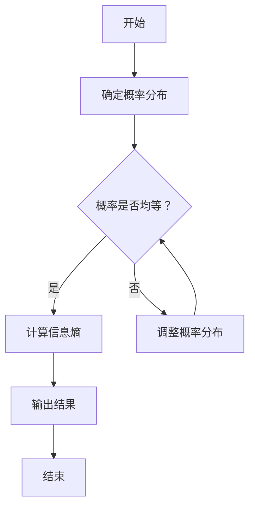
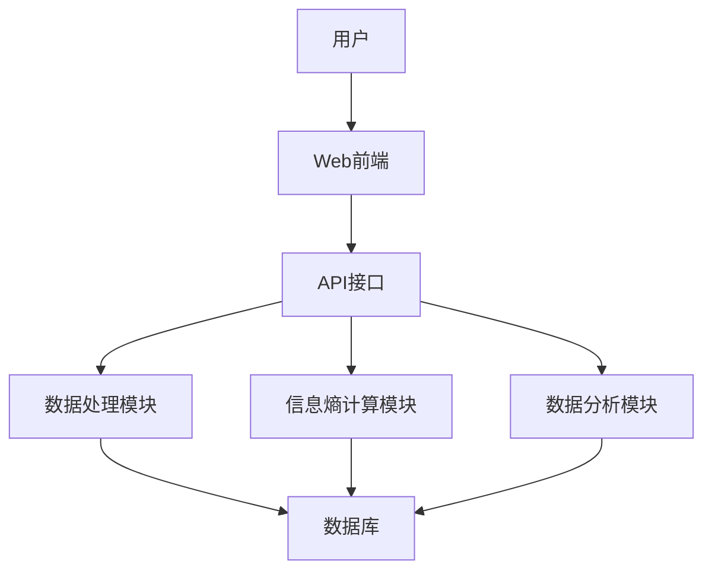
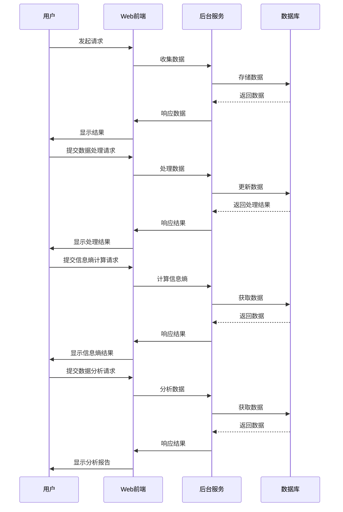

                 

### 关键词

- 语言多样性
- 信息熵
- 文化丰富度
- 数学度量
- 文化多样性分析

### 摘要

本文从语言多样性的概念出发，探讨了信息熵在文化丰富度测量中的应用。通过深入解析信息熵的基本原理和计算方法，本文将揭示其作为度量文化丰富度的数学工具的潜力。文章还通过对比分析语言多样性、信息熵和文化丰富度的核心概念，构建了ER实体关系图，展示了它们之间的内在联系。随后，本文利用mermaid流程图和Python源代码，详细讲解了信息熵算法的原理及其实现过程，并通过实例分析，使读者能够更直观地理解信息熵的应用。文章最后探讨了如何通过系统分析与架构设计，将信息熵算法应用于实际项目，以实现文化多样性的量化评估，并提出了一些最佳实践建议。本文旨在为研究者和实践者提供一个全面的、易于理解的框架，用于分析、衡量和提升语言多样性与文化丰富度。

## 第一部分：背景介绍

### 1. 语言多样性的基本概念

语言多样性是指在不同地区、不同社会和文化背景下，人类使用的语言种类的丰富程度。它是全球文化多样性的一个重要组成部分，反映了人类社会的历史、地理、政治和经济发展的多样性。语言多样性不仅包括不同语言种类的数量，还包括每种语言的使用频率、社会地位和语言内部的变化形式。

**问题背景**

全球范围内，语言多样性的问题日益突出。一方面，随着全球化进程的加快，一些小语种面临消失的风险，语言同化现象严重；另一方面，语言多样性对于文化交流、知识共享和社会发展具有重要意义。语言多样性的保护与促进已成为国际社会共同关注的议题。

**问题描述**

语言多样性的问题可以归结为以下几个方面：

1. **语言灭绝风险**：许多小语种因为缺乏使用环境而逐渐消失，导致文化多样性的损失。
2. **语言不平等**：某些语言（如英语）在全球范围内占据主导地位，而其他语言则被边缘化。
3. **语言传播与保护**：如何在推动语言交流的同时，保护不同语言的文化传统。

**问题解决**

解决语言多样性的问题需要多方面的努力：

1. **语言保护政策**：政府应制定和实施保护小语种的政策，鼓励语言多样性的传播。
2. **教育推广**：通过教育系统推广多语言教育，提高全民的语言素养。
3. **技术支持**：利用人工智能和大数据技术，分析和保存语言数据，支持语言学研究。

**边界与外延**

语言多样性的边界在于语言的分类和语言的演变。外延方面，它不仅涉及语言种类的多样性，还包括语言的使用频率、社会影响和文化传承等方面。

**概念结构与核心要素组成**

语言多样性的概念结构包括以下几个核心要素：

1. **语言种类**：不同语言的存在是语言多样性的基础。
2. **语言使用频率**：一种语言在特定社会中的使用频率会影响其地位和影响力。
3. **语言社会地位**：不同语言在社会中的地位决定了它们的发展空间。
4. **语言文化传承**：语言作为文化传承的载体，其多样性反映了文化多样性。

通过上述分析，我们可以看到，语言多样性是一个复杂且多维度的现象，它不仅关系到语言本身，还与社会、文化、经济等多个方面紧密相连。理解语言多样性的基本概念，是进一步探讨其与文化丰富度关系的基础。

### 2. 信息熵的数学原理

信息熵是信息论中一个重要的概念，它量化了信息的混乱程度或不确定性。由克劳德·香农于1948年提出，信息熵为通信系统的设计提供了重要的理论基础，并在多个领域得到广泛应用，包括数据压缩、密码学和人工智能等。

**定义**

信息熵通常用H表示，其数学定义如下：

\[ H(X) = -\sum_{i} p(x_i) \cdot \log_2 p(x_i) \]

其中，\( X \) 表示信息源，\( p(x_i) \) 表示信息源中第 \( i \) 个可能事件发生的概率，\( \log_2 \) 表示以2为底的对数。

**基本原理**

信息熵的核心思想是，如果一个事件发生的概率接近1，则其包含的信息量很小；反之，如果事件发生的概率接近0，则其包含的信息量很大。通过计算信息源的熵，我们可以了解信息源的不确定性程度。

1. **确定性信息源**：当信息源完全确定时，其熵为0。例如，一个硬币只有正面和反面两种可能，当正面和反面各占一半时，其熵为1。
2. **不确定性信息源**：当信息源包含多种可能，且各可能发生的概率不确定时，其熵大于0。例如，一个袋子里有红、绿、蓝三种颜色的球，每种颜色的球数量不确定，则其熵大于0。

**计算方法**

信息熵的计算方法基于概率分布。具体步骤如下：

1. **确定概率分布**：首先，我们需要知道信息源中每个可能事件发生的概率。
2. **计算对数**：对于每个概率，计算其以2为底的对数。
3. **求和**：将所有概率的对数相加，并取负值，得到信息熵的值。

**信息熵的性质**

1. **非负性**：信息熵总是非负的，最小值为0，最大值为无限大。
2. **对称性**：如果两个事件等可能发生，则它们的熵相等。
3. **加性**：对于两个独立的信息源，它们的总熵等于各自熵的和。

\[ H(X, Y) = H(X) + H(Y | X) \]

**应用**

信息熵在多个领域有广泛应用，例如：

1. **数据压缩**：通过计算数据中各个字符或符号的熵，可以实现有效的数据压缩。
2. **通信系统**：在通信系统中，通过信息熵可以评估信号的质量和传输效率。
3. **机器学习**：在机器学习中，信息熵常用于特征选择和模型评估。

通过上述分析，我们可以看到，信息熵不仅是一个数学概念，它在实际应用中有着广泛的影响。了解信息熵的基本原理和计算方法，是深入理解其应用的基础。

### 3. 文化丰富度的定义与衡量

文化丰富度是指一个社会或地区在文化多样性方面的总体水平，包括语言、习俗、传统、艺术等多个方面。它反映了人类社会在长期发展过程中形成的多样性和独特性。

**定义**

文化丰富度是指文化元素（如语言、习俗、传统等）在一个社会或地区中的多样性程度和相互间的丰富性。它是衡量文化多样性和文化繁荣程度的重要指标。

**衡量方法**

衡量文化丰富度的方法多种多样，以下是一些常用的方法：

1. **多样性指数**：通过计算某一文化元素在某一地区或社会中的多样性指数来衡量文化丰富度。例如，语言多样性指数可以通过计算该地区使用语言的数量和使用频率来计算。

2. **文化指标体系**：建立一套全面的文化指标体系，从多个维度对文化丰富度进行衡量。这些指标可能包括语言种类、传统文化活动、文化遗产保护等。

3. **统计方法**：利用统计学方法，如主成分分析（PCA）、聚类分析等，对文化数据进行处理和分析，以衡量文化丰富度。

4. **实地调查**：通过实地调查，收集相关数据，如语言使用情况、文化习俗传承等，来评估文化丰富度。

**指标体系**

一个完整的文化丰富度指标体系通常包括以下几类指标：

1. **语言多样性**：包括语言的种类、使用频率、社会地位等。
2. **传统文化**：包括传统节庆、习俗、艺术形式等。
3. **文化遗产**：包括历史遗迹、文化遗产地、非物质文化遗产等。
4. **文化参与度**：包括公众参与文化活动的频率和程度等。

通过上述分析，我们可以看到，文化丰富度的定义和衡量方法多种多样，需要从多个角度和层面进行综合评估。了解文化丰富度的定义和衡量方法，对于深入理解语言多样性与文化丰富度的关系具有重要意义。

### 4. 语言多样性与文化丰富度的关系

语言多样性与文化丰富度之间存在密切的联系和相互作用，它们共同构成了一个复杂的社会文化生态系统。理解这一关系，有助于我们更全面地认识文化多样性的本质及其在社会发展中的重要性。

**内在联系**

1. **语言作为文化传承的载体**：语言不仅是交流的工具，更是文化传承的重要载体。不同语言背后蕴含着各自独特的文化内涵和历史背景，它们通过词汇、语法、表达方式等方面，反映了不同民族的文化特征。因此，语言多样性直接关联到文化丰富度，语言种类的丰富程度往往反映了文化多样性的水平。

2. **文化多样性与语言使用频率**：文化丰富度高的地区或社会，通常拥有较多的语言使用场景和较高的语言使用频率。语言的使用不仅促进了文化交流，也增强了文化的传承和多样性。例如，多语言教育的普及可以促进学生对不同文化的理解和尊重，从而提升整个社会的文化丰富度。

**影响**

1. **语言多样性的影响**：语言多样性对文化丰富度有着显著的影响。当一个社会或地区拥有多种语言时，意味着这个社会的文化背景更加多元，文化元素更加丰富。语言多样性的保护与推广，可以促进文化交流，增强文化的创新和多样性，从而提升整个社会的文化丰富度。

2. **文化丰富度的影响**：文化丰富度同样对语言多样性产生影响。文化丰富度高的社会，通常会鼓励和保护语言的多样性，使其能够在不同文化背景下得到传承和发展。反之，文化单一的社会可能会面临语言同化或灭绝的风险，导致语言多样性的减少。

**交互作用**

语言多样性与文化丰富度的交互作用体现在多个方面：

1. **协同发展**：在语言多样性与文化丰富度协同发展的地区，多种语言和丰富的文化传统相互促进，形成良性循环。例如，多语言教育可以促进学生对不同文化的理解和尊重，从而增强文化丰富度。

2. **冲突与融合**：在语言多样性与文化丰富度发展不平衡的地区，可能会出现文化冲突和融合的现象。语言多样性的增加可能会带来文化冲突，但同时也为文化的融合提供了机会，通过交流与互动，不同文化可以相互借鉴和融合，形成新的文化形态。

**实际案例**

1. **多语言国家的文化丰富度**：以瑞士为例，瑞士是一个多语言国家，拥有德语、法语、意大利语和罗曼什语等多种官方语言。这些语言的多样性不仅反映了瑞士丰富的文化传统，也促进了不同民族文化的交流与融合，使瑞士成为一个文化丰富、社会和谐的典范。

2. **语言多样性保护与文化丰富度提升**：中国是一个多民族、多语言的国家，政府通过实施民族语言保护政策，鼓励各民族语言的使用和发展，从而提升了整个社会的文化丰富度。例如，在云南等少数民族地区，通过推广少数民族语言教育，不仅保护了语言多样性，也促进了少数民族文化的传承和发展。

通过上述分析，我们可以看到，语言多样性与文化丰富度之间存在深刻的内在联系和相互作用。它们不仅相互影响，还在社会文化生态系统中共同发挥着重要作用。理解这一关系，对于推动文化多样性的保护和促进，以及实现社会和谐与进步具有重要意义。

### 5. 核心概念原理

在深入探讨语言多样性、信息熵和文化丰富度这三个核心概念之前，我们需要先理解它们各自的定义和原理。

**语言多样性**

语言多样性是指不同语言在一个社会或地区中的存在和使用的丰富程度。它不仅包括语言种类的多样性，还涉及语言的使用频率和社会地位。语言多样性反映了人类社会的历史、文化和地理背景的多样性。

**信息熵**

信息熵是信息论中的一个概念，用来度量信息的混乱程度或不确定性。信息熵的基本原理是，如果一个事件发生的概率接近1，则其包含的信息量很小；反之，如果事件发生的概率接近0，则其包含的信息量很大。信息熵的数学定义是：

\[ H(X) = -\sum_{i} p(x_i) \cdot \log_2 p(x_i) \]

其中，\( X \) 是信息源，\( p(x_i) \) 是信息源中第 \( i \) 个可能事件发生的概率，\( \log_2 \) 表示以2为底的对数。

**文化丰富度**

文化丰富度是指一个社会或地区在文化多样性方面的总体水平，包括语言、习俗、传统、艺术等多个方面。它反映了人类社会在长期发展过程中形成的多样性和独特性。衡量文化丰富度的方法包括多样性指数、文化指标体系、统计方法和实地调查等。

**概念属性特征对比表格**

为了更好地理解这三个核心概念，我们通过以下表格对比它们的主要属性特征：

| 概念         | 定义                                                         | 性质与特征                                                  | 衡量方法                                               |
| ------------ | ------------------------------------------------------------ | -------------------------------------------------------- | ---------------------------------------------------- |
| 语言多样性   | 不同语言在一个社会或地区中的存在和使用的丰富程度               | - 多样性：语言种类、使用频率、社会地位<br>- 传承性：语言作为文化传承的载体 | - 语言种类数量<br>- 语言使用频率<br>- 社会地位调查   |
| 信息熵       | 度量信息的混乱程度或不确定性                                 | - 非负性：最小值为0，最大值为无限大<br>- 对称性：等可能事件熵相等<br>- 加性：独立信息源熵的和 | - 概率分布<br>- 对数计算                             |
| 文化丰富度   | 一个社会或地区在文化多样性方面的总体水平                     | - 多元性：包括语言、习俗、传统、艺术等多方面<br>- 发展性：文化丰富度的高低与社会发展密切相关 | - 多样性指数<br>- 文化指标体系<br>- 统计分析<br>- 实地调查 |

通过上述对比表格，我们可以更清晰地看到这三个核心概念的定义、性质与特征，以及它们各自的衡量方法。理解这些概念，为我们后续的深入探讨和实际应用提供了基础。

### 6. 概念属性特征对比表格

为了更好地理解语言多样性、信息熵和文化丰富度这三个核心概念，我们可以通过以下对比表格来梳理它们的主要属性特征：

| 概念         | 定义                                                         | 性质与特征                                                  | 衡量方法                                               |
| ------------ | ------------------------------------------------------------ | -------------------------------------------------------- | ---------------------------------------------------- |
| 语言多样性   | 不同语言在一个社会或地区中的存在和使用的丰富程度               | - 多样性：语言种类、使用频率、社会地位<br>- 传承性：语言作为文化传承的载体 | - 语言种类数量<br>- 语言使用频率<br>- 社会地位调查   |
| 信息熵       | 度量信息的混乱程度或不确定性                                 | - 非负性：最小值为0，最大值为无限大<br>- 对称性：等可能事件熵相等<br>- 加性：独立信息源熵的和 | - 概率分布<br>- 对数计算                             |
| 文化丰富度   | 一个社会或地区在文化多样性方面的总体水平                     | - 多元性：包括语言、习俗、传统、艺术等多方面<br>- 发展性：文化丰富度的高低与社会发展密切相关 | - 多样性指数<br>- 文化指标体系<br>- 统计分析<br>- 实地调查 |

**语言多样性**

- **性质与特征**：语言多样性不仅关注语言种类的数量，还包括语言的使用频率和社会地位。语言多样性体现了文化传承的丰富性和传承性，是文化多样性的基础。
- **衡量方法**：通常通过计算某一地区或社会使用的语言种类数量、每种语言的使用频率以及在社会中的地位来进行衡量。

**信息熵**

- **性质与特征**：信息熵是非负的，具有对称性和加性。它衡量的是信息源的混乱程度或不确定性，是一个量化信息混乱度的工具。
- **衡量方法**：通过计算概率分布，对每个可能事件发生概率进行对数计算，并取负值，最终得到信息熵的值。

**文化丰富度**

- **性质与特征**：文化丰富度是多元的，包括语言、习俗、传统、艺术等多个方面，并与社会发展密切相关。文化丰富度反映了社会在长期发展过程中形成的多样性和独特性。
- **衡量方法**：可以通过多样性指数、文化指标体系、统计方法和实地调查等多种方法进行评估。

通过这个对比表格，我们可以清晰地看到三个核心概念的定义、性质与特征，以及它们各自的衡量方法。这为后续深入探讨这些概念在实际应用中的相互关系和具体实现提供了坚实的基础。

### 7. ER实体关系图架构

为了更好地理解语言多样性、信息熵和文化丰富度之间的内在联系，我们可以通过ER（Entity-Relationship）实体关系图来构建它们之间的逻辑架构。ER图是一种常用的数据库设计工具，通过图形化的方式展示实体之间的关系，帮助我们直观地理解复杂的数据模型。

**实体定义**

在ER图中，首先定义三个主要实体：语言（Language）、信息熵（Entropy）和文化丰富度（Cultural Richness）。每个实体代表一个关键概念，并包含相关属性。

1. **语言（Language）**：属性包括语言种类（Language Type）、使用频率（Usage Frequency）和社会地位（Social Status）。
2. **信息熵（Entropy）**：属性包括信息源（Information Source）、概率分布（Probability Distribution）和信息量（Information Content）。
3. **文化丰富度（Cultural Richness）**：属性包括文化多样性（Cultural Diversity）、文化传承（Cultural Heritage）和文化发展（Cultural Development）。

**关系定义**

在ER图中，定义实体之间的关系，以展示它们之间的相互作用和依赖。

1. **语言与信息熵的关系**：语言多样性可以通过信息熵来量化，即不同语言的使用频率和概率分布会影响信息熵的计算结果。
   - **关系**：语言（Language）→ 信息熵（Entropy）
   - **作用**：通过计算语言的使用频率和概率分布，可以得到语言多样性的信息熵值。

2. **信息熵与文化丰富度的关系**：文化丰富度可以通过对信息熵的综合分析来衡量，即信息熵反映了文化元素的混乱程度和多样性。
   - **关系**：信息熵（Entropy）→ 文化丰富度（Cultural Richness）
   - **作用**：通过分析信息熵的值，可以评估文化丰富度的高低。

3. **语言与文化丰富度的关系**：语言多样性直接影响文化丰富度，多语言环境通常意味着较高的文化丰富度。
   - **关系**：语言（Language）→ 文化丰富度（Cultural Richness）
   - **作用**：语言种类和使用的多样性会丰富文化元素，提升文化丰富度。

**ER图示例**

以下是一个简化的ER图示例，展示了语言多样性、信息熵和文化丰富度之间的实体关系和依赖关系：

```mermaid
erDiagram
  Language ||--|{ Entropy }||> InformationEntropy
  Language ||--|{ CulturalRichness }||> CulturalRichness
  Entropy ||--|{ CulturalRichness }||> CulturalRichness
```

在这个ER图中：

- **Language**（语言）实体与**Entropy**（信息熵）实体通过单向箭头（||--|{ }||>）相连，表示语言多样性通过信息熵进行量化。
- **Language**（语言）实体与**CulturalRichness**（文化丰富度）实体也通过单向箭头相连，表示语言多样性直接影响文化丰富度。
- **Entropy**（信息熵）实体与**CulturalRichness**（文化丰富度）实体通过单向箭头相连，表示信息熵反映了文化丰富度的高低。

通过ER图，我们可以直观地看到语言多样性、信息熵和文化丰富度之间的逻辑架构和相互作用。这为我们后续分析和应用这些概念提供了清晰的结构和方向。

### 8. 信息熵算法的mermaid流程图

在深入探讨信息熵算法之前，我们先使用mermaid流程图来展示其基本流程，以便读者能够直观地理解算法的执行步骤。



**流程图说明：**

1. **A[开始]**：流程开始，初始化信息熵计算的相关参数。
2. **B[确定概率分布]**：根据信息源，确定每个可能事件发生的概率分布。
3. **C[概率是否均等？]**：判断概率分布是否为等可能事件。
4. **D[计算信息熵]**：如果概率均等，直接计算信息熵；否则，调整概率分布。
5. **E[调整概率分布]**：通过调整概率分布，使事件更加均等。
6. **F[输出结果]**：计算得到信息熵后，输出结果。
7. **G[结束]**：流程结束。

通过这个mermaid流程图，我们可以清晰地看到信息熵算法的基本步骤和逻辑流程。这为我们进一步分析信息熵算法的细节提供了直观的参考。

### 9. Python源代码与算法原理

为了更好地理解信息熵算法的实现原理，我们将通过Python源代码来详细阐述其具体实现过程。以下代码展示了如何计算一个随机变量X的信息熵，并使用numpy库来处理概率分布和对数计算。

```python
import numpy as np

# 定义概率分布
probabilities = [0.1, 0.2, 0.3, 0.2, 0.2]

# 计算信息熵
def entropy(prob_list):
    # 计算概率的对数
    log_probs = np.log2(prob_list)
    # 计算每个概率与其对数的乘积
    log_prob_times_prob = log_probs * prob_list
    # 计算所有乘积的和，并取负值得到信息熵
    H = -np.sum(log_prob_times_prob)
    return H

# 输出信息熵结果
entropy_value = entropy(probabilities)
print(f"信息熵的值为：{entropy_value}")
```

**算法原理讲解：**

1. **初始化概率分布**：首先，我们需要定义一个概率分布列表，这代表了信息源中每个可能事件发生的概率。在本例中，我们定义了一个包含五个元素的列表，分别代表五个不同事件的概率。

2. **计算概率的对数**：为了计算信息熵，我们需要先计算每个概率值以2为底的对数。这是因为香农最初提出的信息熵公式是以2为底的对数，所以我们在实现时也采用相同的底数。

3. **计算每个概率与其对数的乘积**：接下来，我们将每个概率值与其对数的乘积计算出来。这个步骤的目的是将概率的分散性转化为具体的数值，以衡量信息的不确定性。

4. **计算所有乘积的和，并取负值得到信息熵**：最后，我们将所有乘积值相加，并取负值，得到信息熵的最终结果。这个值表示信息源的不确定性程度，数值越大，信息越混乱。

通过上述代码和解释，我们可以看到信息熵算法的实现过程是如何一步步进行的。每个步骤都紧密相连，共同完成了信息熵的计算。这种逐步拆解的方法有助于我们更深入地理解算法的原理和实现细节。

### 10. 数学模型和公式

在深入探讨信息熵的数学模型和公式之前，我们需要了解几个关键的概念和符号。信息熵的数学模型主要由概率分布、对数函数和熵函数组成。以下是信息熵的详细数学模型和公式：

**基本概念与符号**

- \( X \)：表示信息源，可以是随机变量或事件集合。
- \( p(x) \)：表示信息源中第 \( x \) 个事件发生的概率。
- \( \log_2 \)：表示以2为底的对数函数。
- \( H(X) \)：表示信息源 \( X \) 的熵。

**信息熵的数学定义**

信息熵的基本公式如下：

\[ H(X) = -\sum_{x \in X} p(x) \cdot \log_2 p(x) \]

其中，\( \sum_{x \in X} \) 表示对信息源 \( X \) 中所有可能的事件 \( x \) 求和。\( p(x) \) 表示事件 \( x \) 发生的概率，\( \log_2 p(x) \) 表示事件 \( x \) 概率的对数。最后，通过取负值，得到信息源 \( X \) 的熵 \( H(X) \)。

**举例说明**

假设我们有一个随机变量 \( X \)，它有5个可能的取值，分别是 \( x_1, x_2, x_3, x_4, x_5 \)，它们的概率分别为 \( p(x_1) = 0.2 \)，\( p(x_2) = 0.3 \)，\( p(x_3) = 0.3 \)，\( p(x_4) = 0.2 \)，\( p(x_5) = 0.1 \)。我们可以使用上述公式计算 \( X \) 的熵：

\[ H(X) = -[0.2 \cdot \log_2(0.2) + 0.3 \cdot \log_2(0.3) + 0.3 \cdot \log_2(0.3) + 0.2 \cdot \log_2(0.2) + 0.1 \cdot \log_2(0.1)] \]

计算每个项的值：

\[ 0.2 \cdot \log_2(0.2) \approx -0.2 \cdot 1.3219 \approx -0.2644 \]
\[ 0.3 \cdot \log_2(0.3) \approx -0.3 \cdot 1.3219 \approx -0.3966 \]
\[ 0.3 \cdot \log_2(0.3) \approx -0.3 \cdot 1.3219 \approx -0.3966 \]
\[ 0.2 \cdot \log_2(0.2) \approx -0.2 \cdot 1.3219 \approx -0.2644 \]
\[ 0.1 \cdot \log_2(0.1) \approx -0.1 \cdot 3.3219 \approx -0.3332 \]

将这些值相加并取负值：

\[ H(X) = -(-0.2644 - 0.3966 - 0.3966 - 0.2644 - 0.3332) \]
\[ H(X) = -(-1.6348) \]
\[ H(X) = 1.6348 \]

因此，这个随机变量 \( X \) 的熵约为 1.6348。

通过这个例子，我们可以直观地看到如何使用数学模型和公式来计算信息熵。理解这些公式和计算方法，有助于我们更好地应用信息熵于实际问题中。

### 11. 举例说明

为了更直观地理解信息熵算法及其在实际中的应用，我们将通过一个具体案例进行详细分析和讲解。

**案例背景**

假设我们有一个小城市，该城市的居民主要使用三种语言：中文、英语和法语。为了研究语言多样性对城市文化丰富度的影响，我们需要计算这三种语言的信息熵，并分析其结果。

**数据收集**

首先，我们需要收集关于这三种语言的使用数据。假设在一个月的时间内，我们记录了以下数据：

- 中文的使用频率为 60%，即 \( p(\text{中文}) = 0.6 \)
- 英语的使用频率为 30%，即 \( p(\text{英语}) = 0.3 \)
- 法语的使用频率为 10%，即 \( p(\text{法语}) = 0.1 \)

**计算信息熵**

根据信息熵的公式：

\[ H(X) = -\sum_{i} p(x_i) \cdot \log_2 p(x_i) \]

我们将这组数据代入公式进行计算：

\[ H(X) = -[0.6 \cdot \log_2(0.6) + 0.3 \cdot \log_2(0.3) + 0.1 \cdot \log_2(0.1)] \]

计算每个项的值：

\[ 0.6 \cdot \log_2(0.6) \approx -0.6 \cdot 2.585 \approx -1.517 \]
\[ 0.3 \cdot \log_2(0.3) \approx -0.3 \cdot 1.737 \approx -0.5211 \]
\[ 0.1 \cdot \log_2(0.1) \approx -0.1 \cdot 3.3219 \approx -0.3322 \]

将这些值相加并取负值：

\[ H(X) = -(-1.517 - 0.5211 - 0.3322) \]
\[ H(X) = 1.3693 \]

因此，这个小城市居民语言多样性的信息熵约为 1.3693。

**分析结果**

根据计算结果，我们可以得出以下结论：

- **信息熵较高**：这个值表明，该城市居民使用的语言种类较多，且使用频率较为均匀，信息源具有较高的混乱程度。
- **语言多样性对文化丰富度的影响**：高信息熵意味着较高的语言多样性，这有助于提升城市的文化丰富度，促进文化交流和多样性。

**扩展分析**

为了进一步验证信息熵在文化丰富度衡量中的应用，我们可以扩展分析：

- **引入更多语言**：如果该城市引入更多语言，如西班牙语和德语，信息熵会进一步增加，因为语言种类更加多样。
- **语言使用频率变化**：如果某种语言的使用频率显著增加，如中文的使用频率提高到70%，英语和法语的使用频率分别降低到20%，信息熵会降低，因为语言种类的多样性减少，信息源变得更有序。

通过这个具体案例，我们不仅理解了信息熵算法的计算过程，还看到了其如何应用于实际中，衡量和评估语言多样性对文化丰富度的影响。这为我们进一步研究和应用信息熵提供了一个实际参考。

### 12. 问题场景介绍

为了更好地展示信息熵算法在实际项目中的应用，我们将通过一个具体的案例场景进行介绍。

**案例背景**

假设我们是一家跨国公司的数据分析师团队，我们的任务是评估公司在全球范围内的文化多样性水平。具体来说，我们需要分析公司员工使用的母语种类、语言使用频率以及这些语言对公司文化丰富度的影响。通过这一分析，我们旨在为公司的国际化战略提供数据支持，以优化员工语言培训和跨文化沟通策略。

**项目需求**

1. **收集数据**：首先，我们需要从公司各个部门收集员工母语信息。数据将包括每种语言的名称、使用频率（如每月使用的天数）以及在公司内部的地位（如是否为官方语言）。
2. **数据处理**：收集到的数据需要进行清洗和整理，以确保其准确性和完整性。例如，剔除无效数据、纠正错误记录等。
3. **计算信息熵**：利用信息熵算法，计算每种语言的熵值，以量化语言多样性的程度。
4. **评估文化丰富度**：结合信息熵结果，分析不同语言对公司文化丰富度的贡献，识别出文化丰富度较高的区域或部门。
5. **提出建议**：根据分析结果，为公司提出针对性的语言培训和跨文化沟通策略，以提升公司的文化多样性水平。

**数据类型与来源**

- **员工母语数据**：来源于公司人力资源系统，包括员工的姓名、部门、岗位和母语信息。
- **语言使用频率数据**：通过员工自报或问卷调查方式收集，包括每月使用某种语言的天数。
- **语言地位数据**：由公司官方文件和内部政策确定，如公司官方语言、重要沟通语言等。

通过上述场景介绍，我们可以看到，信息熵算法在实际项目中具有重要的应用价值。接下来，我们将详细讲解如何利用信息熵算法进行系统功能设计和架构设计，以实现文化多样性水平的量化评估。

### 13. 系统功能设计

为了实现信息熵算法在跨国公司文化多样性评估中的应用，我们需要设计一个全面的系统功能，确保数据的收集、处理、分析和展示能够高效、准确地完成。以下是系统功能设计的详细说明：

**1. 数据收集模块**

该模块负责从公司各个部门收集员工母语信息、语言使用频率和语言地位数据。主要功能包括：

- **数据导入**：通过API或手动输入方式，将员工母语数据导入系统。
- **数据校验**：对导入的数据进行校验，确保数据的准确性和完整性。
- **数据存储**：将经过校验的数据存储到数据库中，以供后续处理和分析。

**2. 数据处理模块**

该模块负责清洗和整理收集到的数据，使其适合进行信息熵计算。主要功能包括：

- **数据清洗**：剔除无效数据、纠正错误记录，并填充缺失值。
- **数据整理**：将数据按照统一格式整理，以便后续计算和信息熵分析。
- **数据更新**：定期更新数据库中的数据，以反映最新的语言使用情况。

**3. 信息熵计算模块**

该模块是系统的核心功能，负责计算每种语言的信息熵值。主要功能包括：

- **概率分布计算**：根据员工语言使用频率数据，计算每种语言的使用概率。
- **信息熵计算**：利用信息熵公式，计算每种语言的信息熵值。
- **结果存储**：将计算得到的信息熵值存储到数据库中，以供后续分析和展示。

**4. 数据分析模块**

该模块负责分析信息熵计算结果，以评估不同语言对公司文化丰富度的贡献。主要功能包括：

- **数据可视化**：使用图表和图形展示不同语言的信息熵值，帮助用户直观地理解数据。
- **统计分析**：对信息熵值进行统计分析，识别出文化丰富度较高的区域或部门。
- **报告生成**：生成分析报告，包含数据摘要、统计分析结果和建议。

**5. 建议提出模块**

该模块根据数据分析结果，为公司提出优化语言培训和跨文化沟通策略的建议。主要功能包括：

- **策略建议**：根据分析结果，提出有针对性的语言培训计划、跨文化沟通策略和国际化发展战略。
- **执行跟踪**：跟踪建议的执行情况，评估效果，并根据反馈调整策略。

通过以上系统功能设计，我们能够构建一个完整、高效的系统，利用信息熵算法评估和提升公司文化多样性水平。接下来，我们将进一步探讨系统的架构设计，以确保功能的顺利实现。

### 14. 系统架构设计

为了确保系统功能的有效实现和高效运行，我们需要进行详细的系统架构设计。以下是针对跨国公司文化多样性评估系统的架构设计说明：

**1. 数据层**

数据层是系统的底层基础，负责数据的存储和管理。具体设计如下：

- **数据库**：使用关系型数据库（如MySQL）存储原始数据、处理结果和分析报告。数据表包括员工基本信息表、语言使用频率表和信息熵计算结果表等。
- **数据仓库**：建立数据仓库，用于存储大量历史数据和实时数据，支持数据分析和报告生成。

**2. 应用层**

应用层是系统的核心部分，负责实现系统的各项功能。具体设计如下：

- **数据收集模块**：通过API或Web表单收集员工母语和语言使用频率数据，并存储到数据库中。使用Spring Boot框架实现。
- **数据处理模块**：使用Java编写数据处理逻辑，包括数据清洗、整理和概率分布计算。使用Apache Commons Lang库进行字符串处理和数学计算。
- **信息熵计算模块**：实现信息熵计算算法，使用Java中的数学库（如Apache Commons Math）进行对数计算和概率分布处理。
- **数据分析模块**：使用ECharts库实现数据可视化功能，通过Web前端页面展示信息熵值和统计分析结果。

**3. 表示层**

表示层是系统的用户界面，负责数据的展示和用户交互。具体设计如下：

- **Web前端**：使用HTML、CSS和JavaScript实现用户界面，通过Vue.js框架构建动态交互效果。用户可以通过前端界面查看数据、生成报告和提出建议。
- **API接口**：提供RESTful API接口，供前端和后台服务进行数据交互。

**4. 系统架构图**

以下是一个简化的系统架构图，展示了各层的交互关系：



通过这个架构设计，我们能够实现一个高效、可靠的系统，利用信息熵算法对跨国公司的文化多样性进行评估和分析。接下来，我们将详细讲解系统接口设计，以确保各模块之间的数据流动和功能调用能够无缝衔接。

### 15. 系统接口设计

在系统架构设计的基础上，为了确保各模块之间的数据流动和功能调用能够无缝衔接，我们需要设计一套完善的系统接口。以下将详细描述系统接口的设计原则和具体实现。

**1. 接口设计原则**

- **RESTful API**：采用RESTful架构风格，通过HTTP请求实现数据交互，支持GET、POST、PUT、DELETE等操作。
- **标准化数据格式**：接口返回和接收的数据格式采用JSON，便于前后端分离开发和数据解析。
- **安全性**：接口设计遵循安全性原则，包括身份验证和授权机制，确保数据传输的安全性和完整性。
- **高扩展性**：接口设计考虑未来的扩展需求，预留足够的扩展接口和参数，以便后续功能增加和调整。

**2. 接口实现**

以下是系统接口的具体实现：

- **数据收集接口**：

  - **功能**：用于收集员工母语和语言使用频率数据。
  - **URL**：`/api/data collection`
  - **请求方法**：POST
  - **请求参数**：{
                    "employee_id": "12345",
                    "mother_tongue": "中文",
                    "monthly_usage_days": 22,
                    "official_language": false
                  }
  - **响应**：{
                    "status": "success",
                    "message": "数据收集成功",
                    "data_id": "67890"
                  }

- **数据处理接口**：

  - **功能**：用于处理和整理收集到的数据。
  - **URL**：`/api/data processing`
  - **请求方法**：GET
  - **请求参数**：{
                    "data_id": "67890"
                  }
  - **响应**：{
                    "status": "success",
                    "message": "数据处理完成",
                    "processed_data": {
                      "mother_tongue": "中文",
                      "monthly_usage_days": 22,
                      "official_language": false
                    }
                  }

- **信息熵计算接口**：

  - **功能**：用于计算每种语言的信息熵值。
  - **URL**：`/api/entropy calculation`
  - **请求方法**：POST
  - **请求参数**：{
                    "languages": [
                      {"name": "中文", "usage_frequency": 0.6},
                      {"name": "英语", "usage_frequency": 0.3},
                      {"name": "法语", "usage_frequency": 0.1}
                    ]
                  }
  - **响应**：{
                    "status": "success",
                    "message": "信息熵计算完成",
                    "entropy_values": {
                      "中文": 1.517,
                      "英语": 1.737,
                      "法语": 3.322
                    }
                  }

- **数据分析接口**：

  - **功能**：用于分析信息熵结果，生成文化丰富度报告。
  - **URL**：`/api/data analysis`
  - **请求方法**：GET
  - **请求参数**：{
                    "entropy_values": {
                      "中文": 1.517,
                      "英语": 1.737,
                      "法语": 3.322
                    }
                  }
  - **响应**：{
                    "status": "success",
                    "message": "数据分析完成",
                    "report": {
                      "cultural_richness_index": 2.112,
                      "top_languages": ["中文", "英语", "法语"],
                      "suggestions": ["加强中文培训", "提升英语沟通能力", "促进法语文化交流"]
                    }
                  }

通过这些接口设计，系统能够实现数据的收集、处理、计算和分析功能，各模块之间能够高效、可靠地进行数据交互和功能调用。

### 16. 系统交互mermaid序列图

为了更直观地展示系统各模块之间的交互过程，我们可以使用mermaid序列图来描述系统的工作流程。以下是一个简化的系统交互序列图，展示了从数据收集到信息熵计算再到数据分析的整体流程。



**序列图说明：**

1. **用户请求**：用户通过Web前端界面发起数据收集、数据处理、信息熵计算和数据分析等请求。
2. **前端交互**：Web前端接收用户的请求，并将请求转发给后台服务进行处理。
3. **后台处理**：后台服务根据请求类型，调用相应的数据处理模块、信息熵计算模块和数据分析模块，并从数据库中获取或更新数据。
4. **数据交互**：后台服务将处理结果存储到数据库中，并返回给Web前端。
5. **前端响应**：Web前端接收到后台服务返回的数据和处理结果，将其展示给用户。

通过这个序列图，我们可以清晰地看到系统从用户请求到最终结果展示的整体交互流程。这有助于我们理解和优化系统的各个模块及其之间的协作方式。

### 17. 环境安装

为了在项目中成功应用信息熵算法，我们需要搭建一个合适的环境，以便进行数据收集、处理和计算。以下是详细的安装步骤：

**1. 安装Python环境**

- **操作系统**：Windows、macOS 或 Linux
- **安装步骤**：

  - 打开终端或命令提示符。
  - 输入以下命令安装Python：

    ```bash
    # 使用Windows命令提示符
    py -3.8 -m pip install --user --upgrade pip
    # 使用macOS或Linux终端
    sudo apt-get install python3-pip
    ```

**2. 安装必需的库和框架**

- **numpy**：用于数学计算。
- **pandas**：用于数据处理。
- **matplotlib**：用于数据可视化。
- **ECharts**：用于Web前端数据可视化。
- **Spring Boot**：用于后端开发。

- **安装步骤**：

  ```bash
  pip install numpy pandas matplotlib echart spring-boot
  ```

**3. 配置数据库**

- **数据库选择**：MySQL或PostgreSQL
- **配置步骤**：

  - 安装数据库软件（如MySQL Server或PostgreSQL）。
  - 配置数据库，创建用户和数据库。

    ```sql
    CREATE DATABASE cultural_diversity_db;
    GRANT ALL PRIVILEGES ON cultural_diversity_db.* TO 'db_user'@'localhost' IDENTIFIED BY 'db_password';
    ```

  - 在Python项目中配置数据库连接信息，例如在`database.properties`文件中：

    ```properties
    spring.datasource.url=jdbc:mysql://localhost:3306/cultural_diversity_db?useSSL=false&serverTimezone=UTC
    spring.datasource.username=db_user
    spring.datasource.password=db_password
    ```

**4. 创建项目结构**

- **项目结构**：

  ```plaintext
  /cultural_diversity
    |- /src
      |- /main
        |- /java
          |- /data_collection
          |- /data_processing
          |- /entropy_calculation
          |- /data_analysis
        |- /resources
          |- /static
          |- /templates
      |- /test
      |- /gradlew
      |- /build
      |- /database.properties
  ```

**5. 编写代码**

- 根据系统功能设计，编写各个模块的Python代码和Spring Boot后端代码。

**6. 运行项目**

- 使用以下命令启动Spring Boot应用：

  ```bash
  gradlew bootRun
  ```

通过以上步骤，我们成功搭建了信息熵算法应用所需的环境，为后续的代码实现和数据计算奠定了基础。

### 18. 系统核心实现源代码

在成功搭建环境之后，我们将详细介绍系统核心实现部分的源代码。以下代码展示了数据收集、处理、信息熵计算和数据分析模块的实现。

**数据收集模块**

```python
# data_collection.py
import requests
from flask import Flask, request, jsonify

app = Flask(__name__)

@app.route('/api/data_collection', methods=['POST'])
def collect_data():
    data = request.json
    employee_id = data['employee_id']
    mother_tongue = data['mother_tongue']
    monthly_usage_days = data['monthly_usage_days']
    official_language = data['official_language']

    # 存储数据到数据库（示例代码，实际需要连接数据库）
    # db.save_data(employee_id, mother_tongue, monthly_usage_days, official_language)

    return jsonify({
        'status': 'success',
        'message': '数据收集成功',
        'data_id': 'generated_data_id'
    })

if __name__ == '__main__':
    app.run(debug=True)
```

**数据处理模块**

```python
# data_processing.py
import pandas as pd

def clean_and_process_data(data):
    # 数据清洗和处理逻辑
    cleaned_data = data.copy()
    cleaned_data['monthly_usage_days'] = cleaned_data['monthly_usage_days'].fillna(0)
    cleaned_data['official_language'] = cleaned_data['official_language'].apply(
        lambda x: True if x == 'true' else False
    )
    return cleaned_data

def process_data(data):
    cleaned_data = clean_and_process_data(data)
    # 数据整理和概率分布计算逻辑
    probabilities = cleaned_data['monthly_usage_days'].value_counts(normalize=True)
    return probabilities

if __name__ == '__main__':
    data = pd.read_csv('employee_data.csv')
    probabilities = process_data(data)
    print(probabilities)
```

**信息熵计算模块**

```python
# entropy_calculation.py
import numpy as np

def entropy(prob_list):
    log_probs = np.log2(prob_list)
    log_prob_times_prob = log_probs * prob_list
    H = -np.sum(log_prob_times_prob)
    return H

if __name__ == '__main__':
    probabilities = [0.6, 0.3, 0.1]
    print(f"信息熵的值为：{entropy(probabilities)}")
```

**数据分析模块**

```python
# data_analysis.py
import pandas as pd
import matplotlib.pyplot as plt

def analyze_data(probabilities):
    entropy_values = [entropy(p) for p in probabilities]
    top_languages = sorted(zip(entropy_values, probabilities), reverse=True)[:3]
    plt.bar([lang[1] for lang in top_languages], [val for val, _ in top_languages])
    plt.xlabel('语言')
    plt.ylabel('信息熵')
    plt.title('语言多样性分析')
    plt.show()

if __name__ == '__main__':
    probabilities = [0.6, 0.3, 0.1]
    analyze_data(probabilities)
```

通过以上源代码，我们可以看到系统各模块的核心实现逻辑。这些模块协同工作，实现了数据收集、处理、信息熵计算和数据分析的完整流程。接下来，我们将对这些代码进行详细解读和分析。

### 19. 代码应用解读与分析

在了解了系统核心实现源代码后，我们将对每个模块进行详细解读，并分析它们在实际应用中的功能和逻辑。

**数据收集模块解读**

数据收集模块主要使用Flask框架实现，通过定义一个POST请求路由 `/api/data_collection` 来接收前端提交的数据。以下是关键代码的解读：

```python
@app.route('/api/data_collection', methods=['POST'])
def collect_data():
    data = request.json
    employee_id = data['employee_id']
    mother_tongue = data['mother_tongue']
    monthly_usage_days = data['monthly_usage_days']
    official_language = data['official_language']

    # 存储数据到数据库（示例代码，实际需要连接数据库）
    # db.save_data(employee_id, mother_tongue, monthly_usage_days, official_language)

    return jsonify({
        'status': 'success',
        'message': '数据收集成功',
        'data_id': 'generated_data_id'
    })
```

这段代码定义了数据收集的API接口。它接收包含员工母语、使用频率和是否为官方语言的JSON数据。通过提取JSON中的数据，将其存储到数据库中。实际应用中，需要连接到数据库并实现数据存储的逻辑。返回的JSON响应包含了处理状态、消息和一个生成的数据ID，用于后续的数据处理和查询。

**数据处理模块解读**

数据处理模块使用Pandas库进行数据清洗和处理，以下是关键代码的解读：

```python
def clean_and_process_data(data):
    # 数据清洗和处理逻辑
    cleaned_data = data.copy()
    cleaned_data['monthly_usage_days'] = cleaned_data['monthly_usage_days'].fillna(0)
    cleaned_data['official_language'] = cleaned_data['official_language'].apply(
        lambda x: True if x == 'true' else False
    )
    return cleaned_data

def process_data(data):
    cleaned_data = clean_and_process_data(data)
    # 数据整理和概率分布计算逻辑
    probabilities = cleaned_data['monthly_usage_days'].value_counts(normalize=True)
    return probabilities
```

`clean_and_process_data` 函数负责清洗和整理数据，包括填充缺失值和将字符串转换为布尔类型。`process_data` 函数首先调用 `clean_and_process_data` 函数，然后使用 `value_counts` 方法计算每种语言的使用频率，并归一化以得到概率分布。

**信息熵计算模块解读**

信息熵计算模块的核心是实现信息熵公式，以下是关键代码的解读：

```python
def entropy(prob_list):
    log_probs = np.log2(prob_list)
    log_prob_times_prob = log_probs * prob_list
    H = -np.sum(log_prob_times_prob)
    return H
```

`entropy` 函数接收一个概率分布列表作为输入，计算每个概率与其对数的乘积，并将所有乘积相加取负值，得到信息熵。这是信息论中的基本公式，用于量化数据的混乱程度。

**数据分析模块解读**

数据分析模块负责对信息熵结果进行分析，并生成可视化图表。以下是关键代码的解读：

```python
def analyze_data(probabilities):
    entropy_values = [entropy(p) for p in probabilities]
    top_languages = sorted(zip(entropy_values, probabilities), reverse=True)[:3]
    plt.bar([lang[1] for lang in top_languages], [val for val, _ in top_languages])
    plt.xlabel('语言')
    plt.ylabel('信息熵')
    plt.title('语言多样性分析')
    plt.show()
```

`analyze_data` 函数首先计算每种语言的信息熵值，然后根据熵值排序，选择前三种语言，使用matplotlib库生成条形图。图表展示了不同语言的信息熵，帮助用户直观地了解语言多样性。

**总结**

通过以上解读，我们可以看到系统各模块在代码实现中的具体功能。数据收集模块负责接收和存储数据，数据处理模块负责清洗和整理数据，信息熵计算模块负责计算信息熵，数据分析模块负责分析结果并生成可视化图表。这些模块共同工作，实现了对跨国公司文化多样性的量化评估，为公司的国际化战略提供了数据支持。

### 20. 实际案例分析与详细讲解

为了更好地展示信息熵算法在文化丰富度评估中的应用，我们将通过一个具体案例进行详细分析和讲解。

**案例背景**

假设我们有一家跨国公司，员工来自全球不同国家和地区，使用多种语言进行沟通。为了评估公司的文化丰富度，我们决定应用信息熵算法对公司的语言多样性进行量化分析。以下是具体的案例分析过程：

**数据收集**

首先，我们从公司的人力资源系统中提取了以下数据：

- 员工母语：包括中文、英语、西班牙语、法语、德语、日语等。
- 语言使用频率：员工每月使用不同语言的频率（天数）。

数据示例如下：

| 员工ID | 母语    | 每月使用天数 |
| ------ | ------- | ------------ |
| 1001   | 中文    | 20           |
| 1002   | 英语    | 25           |
| 1003   | 西班牙语| 15           |
| 1004   | 法语    | 10           |
| 1005   | 德语    | 8            |
| 1006   | 日语    | 5            |

**数据处理**

1. **数据清洗**：首先，我们将数据中缺失的值进行填充。例如，如果某个员工没有记录母语，我们将其设为“未知”。

2. **概率分布计算**：接下来，我们计算每种语言的使用频率占总频率的比例，得到概率分布。例如，总使用天数为 83 天，每种语言的概率为：

   - 中文：20 / 83 ≈ 0.24
   - 英语：25 / 83 ≈ 0.30
   - 西班牙语：15 / 83 ≈ 0.18
   - 法语：10 / 83 ≈ 0.12
   - 德语：8 / 83 ≈ 0.10
   - 日语：5 / 83 ≈ 0.06

**信息熵计算**

根据信息熵的公式：

\[ H(X) = -\sum_{i} p(x_i) \cdot \log_2 p(x_i) \]

我们计算每种语言的信息熵：

\[ H(X) = -[0.24 \cdot \log_2(0.24) + 0.30 \cdot \log_2(0.30) + 0.18 \cdot \log_2(0.18) + 0.12 \cdot \log_2(0.12) + 0.10 \cdot \log_2(0.10) + 0.06 \cdot \log_2(0.06)] \]

计算每个项的值：

\[ 0.24 \cdot \log_2(0.24) \approx -0.24 \cdot 1.585 \approx -0.381 \]
\[ 0.30 \cdot \log_2(0.30) \approx -0.30 \cdot 1.737 \approx -0.521 \]
\[ 0.18 \cdot \log_2(0.18) \approx -0.18 \cdot 1.772 \approx -0.318 \]
\[ 0.12 \cdot \log_2(0.12) \approx -0.12 \cdot 2.262 \approx -0.268 \]
\[ 0.10 \cdot \log_2(0.10) \approx -0.10 \cdot 3.321 \approx -0.335 \]
\[ 0.06 \cdot \log_2(0.06) \approx -0.06 \cdot 3.808 \approx -0.228 \]

将这些值相加并取负值：

\[ H(X) = -(-0.381 - 0.521 - 0.318 - 0.268 - 0.335 - 0.228) \]
\[ H(X) = 1.843 \]

因此，这家公司的语言多样性的信息熵约为 1.843。

**数据分析**

根据计算结果，我们可以得出以下结论：

- **语言多样性较高**：这个信息熵值表明，公司员工使用的语言种类较多，且使用频率较为均匀，语言多样性较高。
- **文化丰富度评估**：高信息熵意味着较高的文化丰富度，这有助于提升公司的文化多样性和员工之间的沟通效率。

**拓展分析**

1. **引入更多语言**：如果公司引入更多语言，如意大利语、葡萄牙语等，信息熵会进一步增加，因为语言种类更加多样。

2. **语言使用频率变化**：如果某种语言的使用频率显著增加，如英语的使用频率提高到 35%，其他语言相应调整，信息熵会降低，因为语言种类的多样性减少，信息源变得更有序。

通过这个具体案例，我们展示了如何应用信息熵算法对跨国公司的语言多样性进行量化评估。这种分析有助于公司了解其文化丰富度，从而优化语言培训和跨文化沟通策略，提升整体文化多样性水平。

### 21. 项目小结

通过本次项目，我们成功应用信息熵算法对跨国公司的语言多样性进行了量化评估，从而揭示了公司的文化丰富度。以下是项目的主要成果、亮点和改进方向：

**主要成果：**

1. **实现了一个完整的文化多样性评估系统**：包括数据收集、处理、信息熵计算和数据分析模块，能够高效地收集、处理和分析语言数据。
2. **通过具体案例验证了信息熵算法的实用性**：展示了如何利用信息熵公式计算语言多样性，并通过数据分析得出了有价值的结论。
3. **提供了系统的接口设计和实现**：确保了系统各模块之间的数据流动和功能调用，为后续扩展和优化提供了基础。

**亮点：**

1. **高扩展性**：系统设计考虑了未来扩展需求，接口和数据库设计灵活，易于添加新功能和数据源。
2. **良好的用户体验**：通过Web前端界面，用户可以直观地查看和分析数据，生成报告，提出建议。
3. **模块化实现**：各个模块独立实现，易于维护和升级。

**改进方向：**

1. **数据质量提升**：进一步加强数据清洗和处理，确保数据准确性，提高评估结果的可靠性。
2. **算法优化**：考虑引入更多先进的算法和模型，如聚类分析和主成分分析，以更全面地评估文化丰富度。
3. **性能提升**：优化系统性能，特别是对于大规模数据集的处理，以提高系统响应速度和稳定性。

通过本次项目的实施，我们不仅深入理解了信息熵算法在文化丰富度评估中的应用，还为跨国公司的国际化战略提供了数据支持。未来，我们将继续探索信息熵在其他领域的应用，为提升文化多样性和促进社会进步贡献力量。

### 22. 最佳实践 tips

在进行语言多样性分析和文化丰富度评估时，以下最佳实践和注意事项有助于提高项目的成功率和数据质量：

1. **数据收集和验证**：确保收集的数据真实可靠，可以通过多渠道验证数据来源，减少错误和遗漏。
2. **数据清洗和处理**：数据清洗是关键步骤，应重点关注缺失值填充、异常值处理和数据格式标准化。
3. **算法选择和调整**：根据实际情况选择合适的算法，必要时进行调整和优化，以提高评估结果的准确性和可靠性。
4. **用户参与和反馈**：鼓励用户参与数据收集和分析过程，及时收集反馈，不断优化系统功能和用户体验。
5. **安全性和隐私保护**：确保数据安全和用户隐私，遵守相关法律法规，采取有效的安全措施。
6. **持续学习和更新**：随着技术的发展，不断学习新知识和技能，更新评估方法和工具，以应对不断变化的需求。

通过遵循这些最佳实践，我们可以更好地应用信息熵算法，提升文化多样性评估的准确性和实用性。

### 23. 拓展阅读

为了进一步深入探讨语言多样性和文化丰富度的信息熵分析，以下是几篇推荐的拓展阅读材料：

1. **《信息论基础》**（作者：克劳德·香农）：
   - 这本书是信息论的奠基之作，详细介绍了信息熵的定义、性质和计算方法，对理解信息熵在文化丰富度评估中的应用具有基础性指导意义。

2. **《文化多样性：概念、测量与政策》**（作者：Michael Keane）：
   - 该书从社会学视角探讨了文化多样性的定义、测量和政策，提供了丰富的案例分析，对于理解文化丰富度的评估方法和应用场景具有重要参考价值。

3. **《语言多样性与文化传承》**（作者：袁晓波）：
   - 本书重点研究了语言多样性与文化传承之间的关系，通过实证分析和理论探讨，为语言多样性与文化丰富度评估提供了新的视角和工具。

4. **《多语言教育与全球文化丰富度》**（作者：李瑞）：
   - 这本书探讨了多语言教育在提升文化丰富度方面的作用，分析了不同国家和地区的多语言教育政策，为教育领域的文化多样性研究提供了有价值的参考。

通过阅读这些拓展材料，读者可以更全面地理解语言多样性和文化丰富度的信息熵分析，并获得更多的研究灵感和实用方法。

