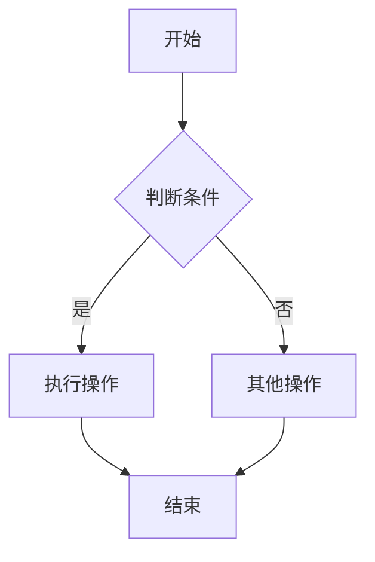

                 


### 文章标题

### 关键词

- 语言与数学结构
- 语法与逻辑交织
- 形式语言理论
- 语义分析
- 自然语言处理

### 摘要

本文深入探讨语言与数学结构之间的关系，特别是语法和逻辑在语言学研究中的应用。通过分析形式语言理论、语法分析算法、语义分析及其在自然语言处理中的实际应用，本文旨在揭示数学工具在语言学研究中的重要性，并探讨未来研究的方向。文章结构清晰，逻辑严密，旨在为读者提供一个全面且深入的视角来理解语言的数学结构。

## 第一部分：语言与数学的基本概念

### 第1章：语言与数学的背景介绍

语言是人类沟通和思维的重要工具，而数学则是一种抽象的符号系统，用于描述自然和人类创造的事物。语言和数学看似迥异，但它们在结构上有许多相似之处。首先，我们需要理解语言的基本概念，包括词汇、语法和语义。词汇是语言的基本单位，语法是词汇的排列规则，而语义则关注语言表达的意义。

数学的基本概念则涉及数、集合、函数、关系等。数学模型可以用来描述现实世界中的各种现象，如物理运动、经济行为等。在数学中，逻辑扮演着核心角色，用于推理和证明。

为了更好地理解语法与逻辑的关系，我们首先需要明确它们的基本概念。语法是指语言的规则体系，它决定了句子结构的正确性。逻辑则是一种推理方法，用于从已知事实推导出新结论。在语言学中，逻辑可以用来分析句子的语义结构，理解句子之间的逻辑关系。

### 第2章：语言的数学结构

#### 第2.1节：语法结构的数学建模

语法结构的数学建模是理解语言数学结构的关键。词汇和句子可以通过数学模型进行形式化表示。例如，词汇可以用符号表示，而句子可以用语法规则和结构解析树来表示。递归语法和产生式规则是两种常见的语法表示方法。

递归语法是一种能够定义自身结构的语法系统。它可以用来描述自然语言中的复杂句子结构。例如，英语中的名词短语和动词短语都可以使用递归语法来表示。

产生式规则是一种基于替换的语法表示方法。它通过一系列的替换规则将输入字符串转换为输出字符串。例如，我们可以使用产生式规则来定义一个简单的语言，如“每个单词都由三个字母组成”。

#### 第2.2节：逻辑与语言的交织

逻辑与语言交织主要体现在语义分析中。语义分析是自然语言处理中的一项重要任务，它旨在理解句子的语义含义。逻辑在语义分析中的应用包括：

1. **逻辑语言**：逻辑语言是一种形式化的语言，用于表达逻辑命题和推理规则。在语义分析中，逻辑语言可以用来表示句子的语义结构，从而更好地理解句子的含义。

2. **语义网络**：语义网络是一种基于逻辑的语言模型，用于表示词与词之间的关系。在语义分析中，语义网络可以用来推理句子中的逻辑关系，从而提高语义理解的准确性。

3. **逻辑推理**：逻辑推理是一种从已知事实推导出新结论的方法。在语义分析中，逻辑推理可以用来推断句子中的隐含含义，从而更好地理解句子的语义。

## 第二部分：数学在语言分析中的应用

### 第3章：数学在语法分析中的应用

语法分析是自然语言处理中的核心任务之一，它旨在将自然语言转换为结构化的语法表示。数学在语法分析中的应用体现在以下几个方面：

1. **形式语言与自动机**：形式语言是一种数学化的语言系统，它包括单词、句子和其他语法结构。自动机是一种理论计算机科学模型，用于识别和接受形式语言。形式语言与自动机的关系是语法分析的基础。

2. **语法分析的算法**：语法分析的算法包括递归下降分析算法和LR分析算法。递归下降分析算法是一种自顶向下的分析方法，它从句子的根节点开始，递归地解析句子中的各个部分。LR分析算法是一种自底向上的分析方法，它从句子的叶节点开始，逐步向上构建句子的语法结构。

### 第4章：逻辑在语义分析中的应用

语义分析是自然语言处理中的另一项重要任务，它旨在理解句子的语义含义。逻辑在语义分析中的应用包括以下几个方面：

1. **语义分析的基本概念**：语义分析的基本概念包括语义角色、语义关系和语义网络。语义角色是指句子中不同成分所扮演的语义角色，如主语、谓语、宾语等。语义关系是指句子中不同成分之间的语义联系，如因果关系、条件关系等。语义网络是一种用于表示语义关系的图形模型。

2. **逻辑在语义分析中的作用**：逻辑在语义分析中的作用主要体现在以下几个方面：

- **语义角色标注**：通过逻辑推理，可以自动识别句子中的语义角色，从而提高语义理解的准确性。
- **语义关系分析**：通过逻辑推理，可以自动分析句子中的语义关系，从而更好地理解句子的语义。
- **语义蕴含**：通过逻辑推理，可以推断句子之间的语义蕴含关系，从而提高语义理解的深度。

## 第三部分：语言的数学模型与计算理论

### 第5章：语言的数学模型与计算理论

语言的数学模型与计算理论是理解语言结构的深层次理论。这部分内容主要涉及以下几个方面：

1. **计算理论的基础**：计算理论是研究计算过程及其局限性的数学分支。它包括算法理论、复杂性理论等。在语言分析中，计算理论可以用来分析语法分析算法的效率和正确性。

2. **语言的数学模型**：语言的数学模型包括形式语言、自动机、上下文无关语法等。这些模型可以用来形式化地表示语言，从而为语言处理提供理论基础。

3. **递归可枚举语言**：递归可枚举语言是一类可以由递归函数枚举的所有字符串组成的语言。在自然语言处理中，递归可枚举语言可以用来描述自然语言中的许多现象。

4. **确定性有限状态语言**：确定性有限状态语言是一类可以由有限状态机识别的语言。在自然语言处理中，确定性有限状态语言可以用来实现简单的语言处理任务。

### 第6章：实际应用案例分析

#### 第6.1节：语言模型在自然语言处理中的应用

语言模型是自然语言处理中的核心工具，它用于预测句子中的下一个词。语言模型可以基于统计方法或神经网络方法。在本节中，我们将讨论以下内容：

1. **统计语言模型**：统计语言模型是一种基于概率统计的方法，它通过统计文本数据来预测下一个词。例如，n-gram语言模型是一种常见的统计语言模型。

2. **神经网络语言模型**：神经网络语言模型是一种基于深度学习的方法，它通过学习文本数据的深层特征来预测下一个词。例如，循环神经网络（RNN）和Transformer模型是两种常见的神经网络语言模型。

3. **语言模型在自然语言处理中的应用**：语言模型可以应用于多种自然语言处理任务，如机器翻译、文本分类、语音识别等。

#### 第6.2节：逻辑在计算机科学中的应用实例

逻辑在计算机科学中有着广泛的应用，特别是在编程语言设计和形式化验证中。在本节中，我们将讨论以下内容：

1. **逻辑编程语言**：逻辑编程语言是一种基于逻辑的编程语言，它使用逻辑公式来表示程序。例如，Prolog是一种常见的逻辑编程语言。

2. **逻辑在形式化验证中的应用**：形式化验证是一种使用数学方法验证程序正确性的方法。逻辑在形式化验证中扮演着核心角色，它用于表示程序的语义和验证条件。

3. **逻辑在人工智能中的应用**：逻辑在人工智能中有着广泛的应用，如知识表示、推理系统、自然语言处理等。

## 第7章：总结与展望

在本章中，我们将总结本书的主要内容和贡献，并探讨未来的研究方向。首先，我们将回顾语言与数学结构之间的关系，强调数学在语言学中的应用。然后，我们将讨论语法分析算法和语义分析技术的重要性。最后，我们将探讨未来的研究方向，如更先进的语言模型、更有效的语义分析方法和跨领域的语言理解技术。

### 总结

本文系统地探讨了语言与数学结构之间的关系，从语法和逻辑的角度分析了语言的形式化和形式化表示。通过分析形式语言理论、语法分析算法、语义分析及其在自然语言处理中的应用，本文揭示了数学工具在语言学研究中的重要性。未来研究可以进一步探索更先进的语言模型、更有效的语义分析方法和跨领域的语言理解技术。

### 展望

未来的研究可以在以下几个方面展开：

1. **深度学习与形式化表示**：结合深度学习和形式化表示，开发新的语言处理模型，以提高语言理解的准确性和效率。

2. **跨语言语义理解**：研究跨语言语义理解，开发能够处理多种语言的语言处理系统。

3. **语言生成与模拟**：探索语言生成的数学模型，开发能够生成自然语言文本的智能系统。

4. **形式化验证与应用**：将形式化验证方法应用于编程语言设计和软件工程，提高软件质量和可靠性。

### 对读者的建议

对于读者来说，理解语言的数学结构有助于深入掌握自然语言处理和计算机科学的原理。建议读者：

1. **学习基础知识**：掌握数学和语言学的基础知识，为深入理解语言与数学结构打下基础。

2. **实践与实验**：通过实践和实验，加深对语言处理算法和技术的理解。

3. **持续学习**：跟踪最新的研究动态，不断更新知识和技能。

### 作者信息

作者：AI天才研究院/AI Genius Institute & 禅与计算机程序设计艺术 /Zen And The Art of Computer Programming

### 最佳实践 Tips

1. **理解核心概念**：深入理解语言与数学结构中的核心概念，如语法、逻辑、形式语言等。

2. **实践算法**：通过编程实践语法分析算法和语义分析技术，加深对理论的理解。

3. **阅读文献**：广泛阅读相关文献，了解最新的研究成果和发展趋势。

4. **批判性思维**：在学习过程中保持批判性思维，分析不同理论和方法的优缺点。

### 小结

本文系统地探讨了语言与数学结构之间的关系，从语法和逻辑的角度分析了语言的形式化和形式化表示。通过分析形式语言理论、语法分析算法、语义分析及其在自然语言处理中的应用，本文揭示了数学工具在语言学研究中的重要性。未来研究可以进一步探索更先进的语言模型、更有效的语义分析方法和跨领域的语言理解技术。

### 注意事项

1. **术语统一**：在文章中使用统一的术语和定义，确保读者能够准确理解。

2. **示例丰富**：使用丰富的示例来阐述理论和方法，帮助读者更好地理解。

3. **图表清晰**：使用清晰的图表来辅助说明，提高文章的可读性。

### 拓展阅读

1. **[Chomsky, N.] (1957). 《句法结构》. MIT Press.
2. **[Hopcroft, J.E., & Ullman, J.D.] (1979). 《形式语言和自动机理论》. Addison-Wesley.
3. **[Lewis, D. (1993). 《逻辑哲学》. Harvard University Press.
4. **[Minsky, M., & Papert, S.] (1988). 《感知器》. MIT Press.
5. **[Goodfellow, I., Bengio, Y., & Courville, A.] (2016). 《深度学习》. MIT Press.

通过本文的详细分析和讨论，读者可以更深入地理解语言的数学结构，以及语法与逻辑在语言学研究中的重要作用。这不仅有助于学术研究，也对自然语言处理和计算机科学的应用具有实际意义。希望本文能为读者的研究和工作提供有益的参考和启示。

### 附录

本文中使用的 Mermaid 流程图、Python 源代码和 LaTeX 公式如下：

#### Mermaid 流程图示例



#### Python 源代码示例

```python
def add(a, b):
    """
    计算两个数的和。
    """
    return a + b

# 调用函数并打印结果
result = add(3, 4)
print("3 + 4 =", result)
```

#### LaTeX 公式示例

独立段落的公式：

$$
E = mc^2
$$

段落内的公式：

$1 < 2$

通过这些示例，读者可以了解如何在文中嵌入 Mermaid 流程图、Python 源代码和 LaTeX 公式。这些工具有助于提高文章的可读性和技术深度。

