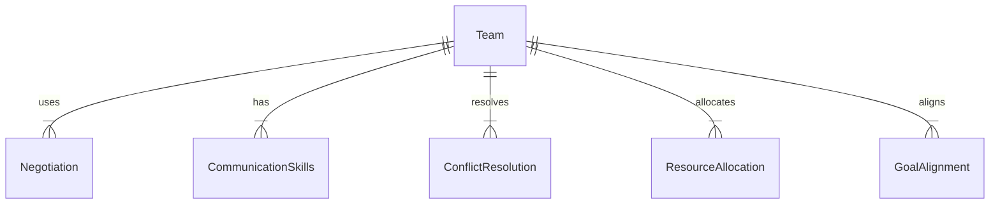
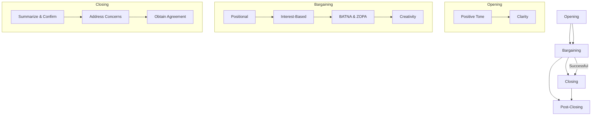

                 

### Introduction to "Negotiation Techniques: Advocating for Maximum Team Benefits"

In today's fast-paced and highly competitive world, the ability to negotiate effectively is a crucial skill that can significantly impact an individual's success in both their personal and professional life. This book, "Negotiation Techniques: Advocating for Maximum Team Benefits," is designed to provide readers with a comprehensive guide to mastering the art of negotiation. By focusing on the unique challenges faced by IT professionals and team leaders, this book aims to equip readers with the tools and strategies necessary to advocate for their team's interests and achieve maximum benefits in negotiation scenarios.

### Keywords

- **Negotiation Techniques**
- **Team Benefits**
- **IT Professionals**
- **Strategic Planning**
- **Communication Skills**
- **Conflict Resolution**

### Summary

The core aim of this book is to delve deep into the intricacies of negotiation, specifically tailored for IT professionals and team leaders. It begins with an overview of the importance of negotiation within team dynamics and then delves into fundamental concepts, preparation techniques, and practical strategies. By breaking down each step of the negotiation process and providing actionable insights, this book empowers readers to build strong relationships, prepare effectively, and execute successful negotiations. Whether negotiating for resource allocation, team expansion, or contract terms, this guide offers a structured approach to achieving favorable outcomes that benefit the entire team.

### Chapter 1: The Importance of Negotiation in Team Dynamics

In the realm of IT and beyond, teams operate in complex environments where effective collaboration and negotiation are pivotal for achieving collective success. This chapter aims to illuminate the profound impact that negotiation skills have on team dynamics, highlighting both the opportunities and challenges that arise from mastering these abilities.

### Background and Core Concepts

Negotiation, at its core, is a process of seeking a mutually beneficial agreement through communication and compromise. In a team setting, negotiation transcends mere transactions; it fosters trust, collaboration, and unity. The significance of negotiation can be observed in various facets:

1. **Resource Allocation**: IT teams often grapple with limited resources such as budget, personnel, and technology. Effective negotiation ensures that these resources are allocated in a manner that maximizes productivity and innovation.
2. **Conflict Resolution**: Disagreements and conflicts are inevitable within any team. Negotiation skills provide a structured approach to resolving conflicts constructively, thereby preserving team cohesion and morale.
3. **Goal Alignment**: Through negotiation, teams can align their individual goals with the broader organizational objectives, ensuring that efforts are synchronized and efficient.
4. **Influence and Leadership**: Strong negotiation skills enhance a team leader's ability to influence stakeholders, secure support for initiatives, and drive team performance.

### Problem Description

Without effective negotiation skills, teams may face several adverse consequences:

1. **Underutilization of Resources**: In the absence of negotiation, valuable resources might be underutilized or misallocated, leading to inefficiencies and missed opportunities.
2. **Increased Conflict**: Miscommunication and misunderstanding can escalate into conflicts that undermine team unity and morale.
3. **Missed Opportunities**: Teams may fail to secure necessary support or resources from stakeholders, hindering project success.
4. **Weakened Leadership**: Leaders lacking negotiation skills may struggle to gain buy-in from team members or secure necessary approvals from higher-ups.

### Solution

To overcome these challenges, it is essential to develop robust negotiation skills within the team. This involves:

1. **Training and Development**: Providing team members with training on negotiation techniques, communication skills, and conflict resolution strategies.
2. **Establishing a Negotiation Culture**: Fostering an environment that encourages open communication, trust, and respect, making it easier for team members to negotiate effectively.
3. **Strategic Planning**: Aligning negotiation objectives with team goals and developing clear strategies to achieve these objectives.
4. **Continuous Improvement**: Encouraging team members to reflect on their negotiation experiences and seek ways to improve their skills.

### Boundary and Scope

The scope of this chapter is to provide an overview of the importance of negotiation in team dynamics and the potential challenges and benefits that arise from mastering these skills. It focuses on the IT industry but can be applicable to any team-oriented environment.

### Core Concepts and Their Relationships

**Negotiation**: The process of seeking mutual agreement through communication and compromise.
- **Communication Skills**: The ability to express ideas clearly and listen effectively.
- **Conflict Resolution**: The method of addressing and resolving disagreements.
- **Resource Allocation**: The process of distributing resources to achieve optimal outcomes.
- **Goal Alignment**: Ensuring individual and team goals are in sync with organizational objectives.

### Mermaid ER Diagram



### Conclusion

Effective negotiation is a cornerstone of successful team management in the IT industry. By understanding its importance and developing the necessary skills, teams can navigate complex challenges, allocate resources efficiently, and achieve their objectives. In the following chapters, we will delve deeper into the core concepts of negotiation and provide practical strategies to enhance these skills within IT teams. Through systematic preparation and execution, teams can advocate for their interests and achieve maximum benefits in their negotiation endeavors.

### Core Concepts of Negotiation

In order to navigate the intricate landscape of negotiation effectively, it is essential to understand its core concepts, principles, and strategies. This chapter will delve into the fundamental elements that underpin successful negotiation, providing a comprehensive framework for readers to build upon.

### Core Concepts

**1. Negotiation Process**: The negotiation process can be visualized as a series of stages, including preparation, communication, bargaining, and closure. Each stage requires a distinct set of skills and strategies to ensure a successful outcome.

**2. Interests and Needs**: At the heart of every negotiation lie the interests and needs of the parties involved. Understanding these can help negotiators devise solutions that are mutually beneficial.

**3. BATNA (Best Alternative to a Negotiated Agreement)**: BATNA is the best alternative outcome if a negotiation fails. It is crucial to identify and understand the other party's BATNA to gauge the potential success of negotiations.

**4. Power Dynamics**: Power dynamics play a significant role in negotiations. Identifying and managing power imbalances can influence the negotiation's direction and outcomes.

**5. Communication Skills**: Effective communication is the cornerstone of successful negotiation. This includes active listening, clear expression of ideas, and the ability to read and respond to non-verbal cues.

### Key Principles

**1. Win-Win Approach**: A win-win approach focuses on finding solutions that satisfy the interests of all parties involved. This principle aims to build long-term relationships and foster a collaborative environment.

**2. Fairness**: Fairness in negotiation ensures that both parties feel that the outcomes are equitable. This can be achieved through transparent processes and clear communication.

**3. Flexibility and Adaptability**: Flexibility allows negotiators to adapt to changing circumstances and find creative solutions. It is essential for navigating complex negotiations effectively.

**4. Preparation**: Proper preparation is the foundation of successful negotiation. It involves understanding the other party's interests, preparing alternatives, and developing a clear negotiation strategy.

**5. Patience and Persistence**: Negotiations often require patience and persistence. Being prepared to handle setbacks and continue negotiations can lead to more favorable outcomes.

### Types of Negotiation Strategies

**1. Competitive Negotiation**: This approach is characterized by a win-lose mindset, where negotiators strive to gain as much as possible at the other party's expense. It is often used in situations where resources are limited, and the parties have strong opposing interests.

**2. Collaborative Negotiation**: Also known as integrative negotiation, this approach focuses on finding mutually beneficial solutions. It emphasizes open communication, joint problem-solving, and building long-term relationships.

**3. Compromising Negotiation**: This strategy involves making concessions to reach a middle ground. It is often used when time is limited or when the parties have differing priorities but are willing to make small sacrifices for a quick resolution.

**4. Avoiding Negotiation**: In some situations, negotiating may not be the best course of action. Avoiding negotiation can be strategic, particularly when the issue is insignificant or when it could harm relationships.

### Mermaid Table for Concept Attributes

```mermaid
table
| Concept       | Definition                                                                                   | Related Concepts                  |
|---------------|----------------------------------------------------------------------------------------------|----------------------------------|
| Negotiation   | The process of seeking mutual agreement through communication and compromise.               | Communication, Bargaining, Closure |
| Interests     | The underlying desires and goals that drive negotiators' actions.                             | Needs, BATNA                     |
| BATNA         | The best alternative to a negotiated agreement if the negotiation fails.                      | Negotiation Process               |
| Power Dynamics| The distribution of power between the parties involved in a negotiation.                       | Negotiation Strategies            |
| Communication | The exchange of information between negotiators, including verbal and non-verbal cues.       | Active Listening, Expressiveness |
| Win-Win       | An approach that aims to satisfy the interests of all parties involved.                       | Competitive, Collaborative        |
| Fairness      | Ensuring that all parties feel that the outcomes of a negotiation are equitable.               | Preparation, Patience             |
| Flexibility   | Adapting to changing circumstances and finding creative solutions.                            | Competitive, Avoiding             |
| Preparation   | Gaining an understanding of the other party's interests and preparing alternatives.           | BATNA, Communication              |
| Patience      | The ability to continue negotiations despite setbacks and maintain a positive attitude.       | Preparation, Flexibility          |
```

### ER Diagram for Key Principles and Strategies

```mermaid
erDiagram
  NegotiationProcess ||--|{ Preparation : is_prepared_by
  NegotiationProcess ||--|{ Communication : involves
  NegotiationProcess ||--|{ Bargaining : includes
  NegotiationProcess ||--|{ Closure : concludes
  WinWin <<|--|{ Interests : seeks_to_satisfy
  Fairness <<|--|{ Preparation : ensures
  Flexibility <<|--|{ NegotiationProcess : guides
  Patience <<|--|{ NegotiationProcess : sustains
  CompetitiveNegotiation ||--|{ PowerDynamics : operates_under
  CollaborativeNegotiation ||--|{ Communication : thrives_on
  CompromisingNegotiation ||--|{ Patience : utilizes
  AvoidingNegotiation ||--|{ Flexibility : employs
```

### Conclusion

Mastering the core concepts and principles of negotiation is crucial for achieving favorable outcomes in any team setting. By understanding the negotiation process, identifying interests and needs, and employing effective strategies, IT professionals and team leaders can advocate for their team's interests and secure maximum benefits. The next chapter will delve deeper into building relationships for successful negotiation, providing insights and strategies to establish trust and effective communication within the team.

### Building Relationships for Successful Negotiation

Effective negotiation is not merely about the tactics and strategies employed during the bargaining process; it fundamentally hinges on the relationships established between the parties involved. Building strong relationships before entering into negotiations is crucial for creating an environment of trust, mutual respect, and understanding. This chapter will explore the importance of relationship-building in negotiation and provide practical techniques to foster such relationships.

### The Importance of Building Relationships

1. **Trust**: Trust is the bedrock of successful negotiation. When parties trust each other, they are more likely to be open and honest, which facilitates effective communication and problem-solving.

2. **Effective Communication**: Strong relationships enhance communication skills. When there is a foundation of trust, negotiators can communicate more openly and listen actively, leading to better understanding and more productive discussions.

3. **Mutual Understanding**: Building relationships allows negotiators to understand each other's perspectives, motivations, and constraints. This understanding can help in finding creative solutions that address everyone's needs.

4. **Conflict Resolution**: Good relationships provide a framework for addressing conflicts constructively. When disagreements arise, negotiators who have built strong relationships are more likely to handle conflicts calmly and collaboratively.

### Communication Skills

1. **Active Listening**: Active listening involves fully concentrating, understanding, responding, and remembering what is being said. It is a critical skill for effective negotiation as it demonstrates respect and fosters understanding.

   - **Practical Tip**: Paraphrase or summarize what the other party says to ensure understanding and show that you are listening.

2. **Clear Expression**: Clear and concise communication helps avoid misunderstandings and keeps the negotiation process on track.

   - **Practical Tip**: Use simple language and avoid jargon that might confuse or alienate the other party.

3. **Non-Verbal Communication**: Non-verbal cues such as body language, facial expressions, and tone of voice convey messages that complement or contradict verbal communication.

   - **Practical Tip**: Be aware of your non-verbal cues and ensure they align with your verbal message to avoid mixed signals.

### Trust-Building Techniques

1. **Openness and honesty**: Being transparent and honest builds trust. Share information and be willing to discuss potential concerns and interests openly.

   - **Practical Tip**: When sharing information, do so in a way that demonstrates your commitment to the overall success of the negotiation.

2. **Consistency**: Consistency in actions and words helps establish trust. Avoid making promises you cannot keep or acting in ways that contradict your stated positions.

   - **Practical Tip**: Be mindful of your actions and ensure they align with your words to maintain a consistent and trustworthy image.

3. **Mutual Respect**: Treat all parties with respect, regardless of their position or role. Recognize and appreciate their contributions and perspectives.

   - **Practical Tip**: Acknowledge the expertise and insights of the other party to show respect and foster a collaborative atmosphere.

4. **Confidentiality**: Maintaining confidentiality around sensitive information builds trust. Assure the other party that their information will be kept confidential.

   - **Practical Tip**: Establish clear confidentiality agreements and adhere to them strictly to maintain trust.

### Conflict Resolution Methods

1. **Early Intervention**: Address conflicts as soon as they arise rather than allowing them to escalate. Early intervention can prevent misunderstandings from becoming entrenched issues.

   - **Practical Tip**: Encourage open dialogue and address disagreements promptly to prevent them from festering.

2. **Collaborative Problem-Solving**: Collaborative problem-solving involves all parties working together to find a solution that meets everyone's needs.

   - **Practical Tip**: Use techniques such as the "brainstorming session" to generate multiple solutions and explore different perspectives.

3. **Seeking Mediation**: When conflicts are difficult to resolve internally, seeking mediation from a neutral third party can help achieve a fair and unbiased resolution.

   - **Practical Tip**: Identify a mediator who is respected by both parties and ensure that the mediation process is transparent and fair.

### Mermaid Table for Relationship-Building Techniques

```mermaid
table
| Skill/Technique       | Description                                                                                   | Practical Tip                                  |
|-----------------------|------------------------------------------------------------------------------------------------|-----------------------------------------------|
| Active Listening      | Fully concentrating, understanding, responding, and remembering what is said.                  | Paraphrase or summarize what the other says.   |
| Clear Expression      | Using simple language and avoiding jargon to convey messages clearly.                         | Use straightforward language.                  |
| Non-Verbal Communication| Using body language, facial expressions, and tone to complement verbal communication.         | Align non-verbal cues with verbal message.      |
| Openness and honesty  | Being transparent and sharing information honestly.                                          | Share information to build trust.              |
| Consistency           | Acting and speaking in ways that are consistent with stated positions.                        | Align actions with words.                      |
| Mutual Respect       | Treating all parties with respect, regardless of their position or role.                      | Acknowledge expertise and insights.            |
| Confidentiality       | Maintaining secrecy around sensitive information to build trust.                            | Establish and adhere to confidentiality agreements. |
| Early Intervention    | Addressing conflicts promptly to prevent escalation.                                         | Encourage open dialogue and prompt action.      |
| Collaborative Problem-Solving| Working together to find solutions that meet everyone's needs.                                | Use brainstorming sessions to explore options.   |
| Seeking Mediation     | Using a neutral third party to resolve conflicts when internal efforts fail.                  | Choose a respected mediator for fair outcomes.  |
```

### Conclusion

Building strong relationships is a foundational element of successful negotiation. By fostering trust, effective communication, and mutual understanding, negotiators can create an environment conducive to achieving favorable outcomes. The next chapter will delve into the critical step of preparing for negotiations, providing strategies and techniques to ensure thorough preparation and effective execution.

### Preparing for Negotiations

The foundation of successful negotiation lies in meticulous preparation. Proper preparation not only increases the likelihood of achieving favorable outcomes but also helps mitigate potential risks and obstacles. This chapter will outline the key steps and considerations involved in preparing for negotiations, ensuring that you are well-equipped to advocate for your team's interests effectively.

### Setting Objectives

**1. Clear and Specific Goals**: Establishing clear and specific negotiation objectives is crucial. These goals should be SMART: Specific, Measurable, Achievable, Relevant, and Time-bound.

**2. Prioritizing Objectives**: Not all objectives carry the same weight. Identify which objectives are most critical for your team and prioritize them accordingly. This will help you allocate your resources effectively and focus on the most impactful goals.

**3. Alternatives**: Develop a list of alternative objectives and solutions. Having alternatives ensures you are not overly dependent on a single outcome and can adapt to different scenarios.

### Conducting Research

**1. Understanding the Other Party**: Gather as much information as possible about the other party's interests, goals, and priorities. This will help you anticipate their position and potential counterarguments.

**2. Market Analysis**: Conduct a thorough market analysis to understand the value and competition for the resources or outcomes you are negotiating. This will help you set realistic and competitive objectives.

**3. Past Negotiations**: Review past negotiations involving the other party to identify patterns, successful strategies, and areas for potential improvement.

### Analyzing Interests and Motivations

**1. Identifying Key Interests**: Understand the underlying interests driving the other party's positions. These may not always be immediately apparent and often require careful analysis and probing questions.

**2. Mapping Motivations**: Once you have identified the key interests, try to map out the motivations behind them. This will help you anticipate their behavior and preferences during negotiations.

**3. Building Rapport**: Use the insights gained from your research to build rapport and establish a positive relationship with the other party. This can help in fostering a more collaborative and open negotiation environment.

### Pre-Negotiation Planning

**1. Negotiation Strategy**: Develop a clear negotiation strategy based on your objectives, research, and understanding of the other party. This strategy should outline the steps you will take, the techniques you will use, and the contingencies you will prepare for.

**2. Role Assignments**: Assign roles to team members based on their strengths and areas of expertise. Clearly define the responsibilities and expectations of each team member to ensure a coordinated approach during negotiations.

**3. Communication Plan**: Develop a communication plan that outlines how information will be shared within your team and with the other party. This plan should include protocols for handling sensitive information and maintaining confidentiality.

### Tools and Resources

**1. Data and Documentation**: Ensure that you have all the necessary data, reports, and documentation to support your position. This information can be invaluable in reinforcing your arguments and building credibility.

**2. Legal and Expert Support**: In complex negotiations, it may be beneficial to involve legal advisors or industry experts who can provide additional insights and support.

**3. Training and Rehearsal**: Conduct negotiation training and rehearsal sessions to prepare your team for the negotiation. These sessions can help build confidence, refine strategies, and identify potential weaknesses.

### Mermaid Table for Preparation Steps

```mermaid
table
| Step                           | Description                                                                                      | Example |
|--------------------------------|-------------------------------------------------------------------------------------------------|---------|
| Setting Objectives             | Establish clear and specific goals for the negotiation.                                        | "Secure an additional budget allocation of $100,000 by Q3." |
| Conducting Research             | Gather information about the other party, market conditions, and past negotiations.            | "Analyze the competitor's pricing strategy."             |
| Analyzing Interests and Motivations| Identify the underlying interests and motivations of the other party.                          | "The other party's primary interest is reducing risk."   |
| Pre-Negotiation Planning        | Develop a negotiation strategy, assign roles, and create a communication plan.                 | "Develop a win-win strategy focusing on long-term benefits." |
| Tools and Resources             | Prepare necessary data, documents, legal support, and conduct training sessions.                | "Compile a comprehensive report on market trends."       |
```

### Conclusion

Preparation is the cornerstone of successful negotiation. By setting clear objectives, conducting thorough research, and understanding the interests and motivations of the other party, you can develop a solid strategy and be well-prepared to navigate the negotiation process effectively. The next chapter will delve into specific negotiation techniques and strategies, providing practical insights to help you execute your plan and achieve your goals.

### Negotiation Techniques in Practice

Having laid a solid foundation through preparation, it is now time to delve into the practical techniques and strategies that can be employed during the negotiation process. This chapter will discuss key negotiation techniques, including opening strategies, bargaining, and closing deals. Through detailed explanations and practical examples, we will explore how to apply these techniques effectively to secure favorable outcomes.

#### Opening Strategies

The opening strategy sets the tone for the entire negotiation and can significantly influence the subsequent discussion. A well-crafted opening can establish rapport, convey credibility, and outline the key issues to be addressed.

**1. Positive and Approachable Tone**: Start with a positive and approachable tone to create a welcoming atmosphere. This can help build initial rapport and encourage open communication.

   **Example**: "I'm excited to discuss this opportunity with you and explore how we can work together to achieve our mutual goals."

**2. Clarity and Conciseness**: Begin with a clear and concise statement that outlines the primary objectives of the negotiation. This helps set expectations and provides a roadmap for the discussion.

   **Example**: "Our primary objective in this negotiation is to secure an additional budget allocation of $100,000 to support our upcoming project."

**3. Building Common Ground**: Identify common ground or shared interests to create a foundation for collaboration. This can help align the parties and reduce initial tension.

   **Example**: "Both our teams recognize the importance of timely project delivery and the value of innovative solutions."

#### Bargaining

Bargaining is the core component of negotiation where parties exchange offers, counteroffers, and concessions to reach a mutually acceptable agreement. Effective bargaining requires a balance of assertiveness, flexibility, and empathy.

**1. Positional Bargaining**: This approach focuses on specific positions and demands without delving into underlying interests. While it can be straightforward, it may lead to less optimal solutions.

   **Example**: "Our budget request is for $100,000, and we would not be able to proceed without this allocation."

**2. Interest-Based Bargaining**: This approach focuses on understanding and addressing the underlying interests of both parties. It is more collaborative and can lead to more creative and mutually beneficial outcomes.

   **Example**: "Our primary interest is to ensure the project's success. We believe that an additional budget of $100,000 is necessary to achieve this goal. What are your concerns regarding this request?"

**3. BATNA and ZOPA**: Understanding the Best Alternative to a Negotiated Agreement (BATNA) and the Zone of Possible Agreement (ZOPA) helps determine the negotiation's potential for success and identify acceptable concessions.

   **Example**: "Our BATNA is to delay the project, which may result in additional costs and missed opportunities. The ZOPA for us is a budget allocation of $80,000, while for you, it might be $90,000."

**4. Creativity and Flexibility**: Be open to exploring alternative solutions and creative approaches. Sometimes, combining different ideas can lead to win-win outcomes.

   **Example**: "Instead of an immediate budget increase, could we explore options for additional funding through cost-saving measures or project adjustments?"

#### Closing Deals

Closing the negotiation effectively is crucial to secure the agreed-upon terms and finalize the agreement. A well-executed closing can help prevent misunderstandings and ensure that all parties are aligned on the next steps.

**1. Summarize and Confirm**: Summarize the key points of the agreement and ask for confirmation to ensure clarity and avoid misunderstandings.

   **Example**: "To summarize, we have agreed to allocate an additional $80,000 to the project budget, with the understanding that we will implement cost-saving measures to offset this allocation. Is that a correct understanding?"

**2. Address Any Remaining Concerns**: Give the other party an opportunity to raise any final concerns or questions before closing the negotiation.

   **Example**: "Is there anything else you would like to discuss before we finalize our agreement?"

**3. Obtain Written Agreement**: Obtain a written agreement that outlines the terms and conditions of the negotiation. This provides a formal record and ensures that all parties are committed to the agreed-upon terms.

   **Example**: "Would you mind sending a formal agreement to both of us for review and signature?"

### Practical Example

**Scenario**: A software development team is negotiating a contract extension with a client to ensure the timely delivery of a critical project.

**Opening Strategy**: 
- Tone: Approachable and positive.
- Statement: "Thank you for the opportunity to discuss the potential contract extension. Our primary goal is to ensure the successful delivery of the project within the agreed timeline."

**Bargaining Techniques**:
- Positional Bargaining: "Our original contract included a deadline of three months, but based on current project progress, we believe an additional two months would be necessary to meet quality standards."
- Interest-Based Bargaining: "Our interest is to deliver a high-quality product that meets your expectations. An extension of two months would allow us to do so without compromising on quality."
- BATNA and ZOPA: "Our BATNA is to delay the project, which may result in additional costs and missed opportunities for both of us. Our ZOPA for a contract extension is two months, while for you, it might be three months."
- Creativity and Flexibility: "Alternatively, could we discuss the possibility of adjusting the project scope to accommodate a shorter timeline or explore additional resources to accelerate the delivery?"

**Closing Deals**:
- Summarize and Confirm: "To summarize, we propose an extension of the contract by two months to ensure the project's successful completion. Would you agree with this proposal?"
- Address Remaining Concerns: "Is there anything else you would like to discuss before we finalize our agreement?"
- Obtain Written Agreement: "Would you mind sending a formal agreement to both of us for review and signature?"

### Mermaid Flowchart for Negotiation Process



### Conclusion

Effective negotiation techniques are essential for achieving favorable outcomes in any professional setting. By employing well-crafted opening strategies, interest-based bargaining, and strategic closing techniques, you can navigate complex negotiations successfully. The next chapter will explore common obstacles in negotiations and provide strategies to overcome them, ensuring that you are well-prepared to handle any challenges that may arise.

### Overcoming Obstacles in Negotiations

While the art of negotiation is grounded in strategy and preparation, the reality often presents a host of challenges that can derail even the most meticulously planned discussions. This chapter will delve into the common obstacles that negotiators may face, offering practical strategies to navigate these hurdles and maintain a positive negotiation environment.

### Power Imbalances

One of the most prevalent challenges in negotiations is the presence of power imbalances, where one party holds significantly more authority or leverage than the other. This dynamic can lead to unequal bargaining power, potentially resulting in an unsatisfactory agreement for one or both parties.

**Strategies to Address Power Imbalances:**

1. **Building Alliances**: Seek support from influential stakeholders within your organization or external allies who can lend credibility and balance the power dynamics. These allies can provide guidance, resources, or even mediate the negotiation process.

2. **Emphasizing Mutual Benefits**: Focus on the mutual benefits of the agreement rather than just the concessions or advantages gained by one party. By highlighting the shared advantages, you can reduce the perception of power imbalances and foster a collaborative atmosphere.

3. **Using Third Parties**: Engage a neutral third party, such as a mediator or arbitrator, to facilitate the negotiation process. This can help level the playing field and provide an unbiased perspective that may be more acceptable to both parties.

4. **Negotiating in Good Faith**: Act in a transparent and honest manner, demonstrating a genuine commitment to finding a fair solution. This can build trust and respect, which can offset some of the imbalance in power.

### Emotional Challenges

Emotions can often run high during negotiations, particularly when the stakes are significant or when fundamental interests are at odds. Unchecked emotions can lead to impasses, aggressive behavior, or even breakdowns in communication.

**Strategies to Manage Emotional Challenges:**

1. **Active Listening and Empathy**: Practice active listening and demonstrate empathy towards the other party's concerns and emotions. Acknowledging their feelings can help de-escalate tension and create a more open and constructive dialogue.

2. **Pause and Reflect**: Take a moment to pause and reflect before responding to emotionally charged statements. This can help you think more objectively and respond in a way that is less likely to escalate the situation.

3. **Emotional Regulation Techniques**: Use techniques such as deep breathing, mindfulness, or brief physical breaks to help manage your emotions during high-stress negotiations.

4. **Conflict Resolution Training**: Invest in training programs that focus on emotional intelligence and conflict resolution. These skills can be invaluable in managing the emotional aspects of negotiations.

### Cultural Differences

Cultural differences can significantly impact negotiations, particularly when parties come from diverse cultural backgrounds. Misunderstandings and communication barriers can arise, leading to conflict and impeding progress.

**Strategies to Navigate Cultural Differences:**

1. **Cultural Awareness and Sensitivity Training**: Develop cultural awareness and sensitivity by educating yourself about the cultural norms, values, and communication styles of the parties involved. This can help you avoid misunderstandings and approach negotiations with cultural sensitivity.

2. **Seek Clarification**: When communication barriers arise, seek clarification rather than making assumptions. Ask open-ended questions to understand the other party's perspective and ensure mutual understanding.

3. **Adapt Communication Styles**: Be flexible in your communication style to accommodate the preferences of the other party. This may involve adjusting the level of formality, directness, or emotional expressiveness in your communication.

4. **Use a Common Language**: If language barriers are an issue, consider using a common language for negotiation or involving interpreters to ensure clear and effective communication.

### Mermaid Table for Overcoming Obstacles

```mermaid
table
| Obstacle                   | Strategies to Address                                         | Example |
|----------------------------|----------------------------------------------------------------|---------|
| Power Imbalances           | Building alliances, emphasizing mutual benefits, using third parties, negotiating in good faith | Engage a neutral mediator. |
| Emotional Challenges       | Active listening, empathy, reflection, emotional regulation techniques | Take a deep breath before responding. |
| Cultural Differences       | Cultural awareness training, seeking clarification, adapting communication styles, using common languages | Use simple, direct language. |
```

### Conclusion

Navigating the complexities of negotiation requires not only strategic planning and effective techniques but also the ability to recognize and address the various obstacles that may arise. By understanding and preparing for power imbalances, emotional challenges, and cultural differences, negotiators can better manage these obstacles and maintain a positive negotiation environment. The next chapter will delve into negotiation in diverse team environments, exploring how to apply these strategies in real-world scenarios and further enhance negotiation outcomes.

### Negotiation in Diverse Team Environments

In today's globalized and multicultural work environment, IT teams often operate across different geographical locations and cultural backgrounds. This diversity brings both opportunities and challenges to the negotiation process. This chapter will explore how to navigate negotiation within diverse team environments, addressing the unique considerations and strategies required to achieve successful outcomes.

### Cross-Cultural Negotiation

Cross-cultural negotiation involves understanding and respecting the cultural norms, values, and communication styles of the parties involved. Different cultures may have varying approaches to negotiation, with some emphasizing direct communication and others valuing indirect and relationship-building.

**Strategies for Cross-Cultural Negotiation:**

1. **Cultural Research and Awareness**: Before engaging in negotiations with individuals from different cultures, conduct thorough research to understand their cultural background, values, and communication styles. This will help you anticipate potential challenges and adapt your approach accordingly.

2. **Develop Cultural Intelligence**: Cultivate cultural intelligence by learning to recognize and appreciate cultural differences. This involves developing empathy, sensitivity, and the ability to adapt communication strategies to suit different cultural contexts.

3. **Use a Common Language**: Ensure effective communication by using a common language for negotiation. If language barriers exist, consider employing interpreters or translation services to facilitate clear and accurate communication.

4. **Emphasize Relationship-Building**: In many cultures, relationship-building is a critical component of negotiation. Take the time to build rapport and trust with the other party before delving into the specifics of the negotiation.

### Global Team Collaboration

Working with teams spread across different time zones and geographical locations adds another layer of complexity to the negotiation process. This requires effective communication and collaboration strategies to ensure all parties are aligned and engaged.

**Strategies for Global Team Collaboration:**

1. **Synchronize Schedules**: Schedule meetings during times that are convenient for all parties involved. Use online tools like calendar sync and time zone converters to facilitate scheduling.

2. **Utilize Technology**: Leverage digital collaboration tools such as video conferencing, project management software, and instant messaging to maintain open lines of communication and ensure timely progress.

3. **Establish Clear Communication Channels**: Define and establish clear communication channels and protocols for the team. This includes guidelines for response times, preferred communication methods, and decision-making processes.

4. **Cultivate a Sense of Unity**: Despite physical and temporal distance, foster a sense of unity and shared purpose among team members. This can be achieved through regular team meetings, virtual team-building activities, and recognizing individual and collective achievements.

### Inclusive Negotiation Practices

In diverse team environments, inclusive negotiation practices are essential to ensure that all voices are heard and respected. This involves creating an environment where all team members feel valued and empowered to contribute their perspectives and ideas.

**Strategies for Inclusive Negotiation Practices:**

1. **Equal Opportunity**: Ensure that all team members have an equal opportunity to participate in negotiations. Avoid dominating the conversation and encourage active participation from quieter or less assertive members.

2. **Diversity of Perspectives**: Embrace diversity of thought and experience. Different perspectives can lead to more innovative solutions and better outcomes. Encourage open dialogue and the sharing of diverse viewpoints.

3. **Active Listening**: Practice active listening to ensure that all team members' perspectives are heard and understood. This involves asking open-ended questions, summarizing points, and seeking clarification when necessary.

4. **Conflict Resolution**: Address conflicts and disagreements in a constructive manner. Foster an environment where conflicts are seen as opportunities for growth and learning rather than as obstacles.

### Case Study: Negotiating a Multi-National IT Project

**Scenario**: A software development company based in the United States is collaborating with a European partner on a cross-border IT project. The teams are located in New York, London, and Berlin.

**Challenge**: The primary challenge is the cultural and time zone differences, which have the potential to hinder effective communication and collaboration.

**Solution**:

1. **Cultural Training**: Conduct cultural training sessions for all team members to enhance their understanding of each other's cultural norms and communication styles.

2. **Synchronization**: Schedule regular meetings during mutually convenient times, such as early mornings in New York and late afternoons in London and Berlin. Use online scheduling tools to coordinate these meetings effectively.

3. **Digital Collaboration Tools**: Utilize tools like Slack for instant messaging, Zoom for video conferencing, and Trello for project management to maintain seamless communication and collaboration.

4. **Rapport-Building**: Organize virtual team-building activities and recognition events to foster a sense of camaraderie and unity among team members.

5. **Active Inclusion**: Ensure that all team members have equal opportunities to contribute to the negotiation process. Create an environment where diverse perspectives are valued and respected.

### Mermaid Class Diagram for Cross-Cultural and Global Collaboration

```mermaid
classDiagram
  TeamMember <<|-- CrossCulturalAwareness
  TeamMember <<|-- DigitalCollaborationTools
  TeamMember <<|-- Synchronization
  TeamMember <<|-- ActiveInclusion
  CrossCulturalAwareness {
    -CulturalTraining
    -CulturalResearch
  }
  DigitalCollaborationTools {
    -VideoConferencing
    -InstantMessaging
    -ProjectManagement
  }
  Synchronization {
    -MutualScheduling
    -TimeZoneManagement
  }
  ActiveInclusion {
    -EqualOpportunity
    -DiversePerspectives
  }
```

### Conclusion

Navigating negotiations in diverse team environments requires a blend of cultural awareness, effective communication strategies, and inclusive practices. By understanding and respecting cultural differences, synchronizing schedules, leveraging digital tools, and fostering an inclusive environment, teams can overcome the challenges of cross-cultural and global collaboration. The next chapter will delve into practical examples and case studies, providing real-world insights and applications of these strategies to further enhance negotiation outcomes.

### Practical Examples and Case Studies

To illustrate the principles and strategies discussed in this book, we will explore several real-world scenarios and case studies that highlight effective negotiation techniques in diverse team environments. These examples will provide practical insights and demonstrate how IT professionals can apply the concepts learned to achieve favorable outcomes.

#### Case Study 1: Securing Additional Resources for a Cross-Functional Project

**Background**: A software development company is working on a cross-functional project that involves multiple teams, including engineering, design, and quality assurance. The project is running behind schedule due to resource constraints, particularly in the engineering team.

**Negotiation Objectives**:
- Secure an additional engineering resource to help meet the project deadline.
- Ensure that the additional resource is allocated for a specific duration to maximize efficiency.

**Strategies Applied**:

1. **Building Relationships**: The project manager established a positive relationship with the head of human resources. They met several times to discuss the project's critical path and the importance of securing additional resources.

2. **Clear Objectives**: The project manager clearly articulated the project's goals, the impact of delays, and the specific duration required for the additional resource.

3. **Interest-Based Bargaining**: The project manager focused on the mutual benefits of securing the additional resource, emphasizing how it would improve the project's chances of success and benefit the organization as a whole.

4. **Preparation**: The project manager conducted thorough research on the availability of resources and potential candidates within the organization. They also prepared a detailed proposal outlining the role and expected outcomes of the additional resource.

**Outcome**: The head of human resources agreed to allocate an additional engineering resource for three months, aligning with the project's critical path and helping the team meet the deadline.

#### Case Study 2: Negotiating a Contract Extension with an International Client

**Background**: An IT consulting firm based in the United States is working on a significant project for a client in Europe. The project is nearing completion, but unforeseen technical challenges have delayed the delivery deadline.

**Negotiation Objectives**:
- Obtain a contract extension to accommodate the extended timeline without incurring additional costs.
- Ensure that the client remains satisfied with the project's quality.

**Strategies Applied**:

1. **Cultural Awareness**: The consulting firm conducted research on European business culture and communication styles to ensure that their approach would be well-received.

2. **Synchronization**: The project manager coordinated with the client to schedule a virtual meeting at a time that was convenient for both parties.

3. **Digital Collaboration Tools**: The project manager used video conferencing and project management tools to maintain open lines of communication and demonstrate the team's commitment to the project's success.

4. **Interest-Based Bargaining**: The project manager emphasized the importance of delivering a high-quality product and proposed a contract extension with no additional costs to the client, focusing on the mutual benefits of maintaining a strong relationship.

5. **Preparation**: The project manager prepared a detailed report outlining the technical challenges, the impact on the project timeline, and potential solutions.

**Outcome**: The client agreed to a contract extension without additional costs, and the project was successfully completed within the extended timeline.

#### Case Study 3: Negotiating Team Roles and Responsibilities in a Multi-National Project

**Background**: A multinational IT company is launching a new product that requires collaboration between teams in different countries. The project is complex, and there are concerns about clear roles and responsibilities among team members.

**Negotiation Objectives**:
- Clarify and establish clear roles and responsibilities for each team member.
- Ensure that all teams are aligned and working towards a common goal.

**Strategies Applied**:

1. **Inclusive Negotiation Practices**: The company organized a series of virtual meetings to discuss and define the roles and responsibilities of each team member. They ensured that all team members had an equal opportunity to contribute their perspectives.

2. **Diversity of Perspectives**: The company encouraged diverse perspectives by inviting team members from different countries to share their insights and experiences.

3. **Active Listening and Empathy**: The project manager practiced active listening and demonstrated empathy towards the concerns of team members from different cultural backgrounds.

4. **Conflict Resolution**: The project manager addressed conflicts and disagreements constructively, using techniques such as mediation to resolve issues and maintain team cohesion.

**Outcome**: Clear roles and responsibilities were established, and all teams were aligned and working towards a common goal. The project was completed successfully within the agreed timeline.

### Mermaid Sequence Diagram for a Multi-National Project Negotiation

```mermaid
sequenceDiagram
  participant PM as Project Manager
  participant C as Client
  participant T1 as Team Member 1
  participant T2 as Team Member 2
  participant T3 as Team Member 3

  PM->>C: Schedule Virtual Meeting
  C->>PM: Confirm Meeting Schedule

  PM->>T1, T2, T3: Prepare for Meeting
  T1->>PM: Share Technical Insights
  T2->>PM: Discuss Design Challenges
  T3->>PM: Present Quality Assurance Concerns

  PM->>C: Present Roles and Responsibilities
  C->>PM: Provide Feedback

  PM->>T1, T2, T3: Discuss and Align on Roles
  T1->>PM: Confirm Role Assignment
  T2->>PM: Confirm Role Assignment
  T3->>PM: Confirm Role Assignment

  PM->>C: Present Final Agreement
  C->>PM: Approve Agreement

  PM->>T1, T2, T3: Communicate Changes
  T1->>PM: Confirm Understanding
  T2->>PM: Confirm Understanding
  T3->>PM: Confirm Understanding
```

### Conclusion

These practical examples and case studies demonstrate how effective negotiation techniques can be applied in diverse team environments to achieve successful outcomes. By building relationships, preparing thoroughly, and employing inclusive negotiation practices, IT professionals can navigate the complexities of cross-cultural and global collaboration. The skills and strategies discussed in this book are invaluable for advocating for team interests and securing maximum benefits in negotiation scenarios. The final chapter will provide a summary of the key insights and offer practical tips for applying these concepts in real-world situations.

### Conclusion and Summary

In conclusion, "Negotiation Techniques: Advocating for Maximum Team Benefits" has provided a comprehensive guide to mastering the art of negotiation in diverse IT environments. Throughout this book, we have explored the importance of negotiation in team dynamics, core negotiation concepts and principles, the art of building relationships, preparation techniques, practical negotiation strategies, and how to overcome common obstacles. Each chapter has been designed to build upon the previous one, creating a cohesive and practical framework for effective negotiation.

**Key Insights:**

1. **The Importance of Negotiation**: Effective negotiation is critical for resource allocation, conflict resolution, and achieving organizational goals. It fosters collaboration and unity within teams.
2. **Core Concepts and Principles**: Understanding the negotiation process, interests, and power dynamics is essential for crafting a successful negotiation strategy.
3. **Relationship-Building**: Trust and mutual respect are foundational to successful negotiations. Strong relationships enhance communication and problem-solving.
4. **Preparation**: Thorough preparation is the cornerstone of successful negotiation. It involves setting clear objectives, conducting research, and understanding the other party's interests.
5. **Negotiation Strategies**: Employing a mix of competitive, collaborative, and compromising strategies can lead to mutually beneficial outcomes.
6. **Overcoming Obstacles**: Addressing power imbalances, emotional challenges, and cultural differences is crucial for navigating complex negotiation scenarios.
7. **Diverse Team Environments**: Cross-cultural and global collaboration requires a tailored approach to negotiation, emphasizing inclusivity and effective communication.

**Practical Tips:**

1. **Start with a Positive Tone**: Begin negotiations with a positive and approachable tone to set a collaborative atmosphere.
2. **Set Clear Objectives**: Define clear, specific, and achievable goals for the negotiation.
3. **Build Relationships**: Take the time to build relationships and establish trust before entering into negotiations.
4. **Use Interest-Based Bargaining**: Focus on underlying interests rather than specific positions to find mutually beneficial solutions.
5. **Prepare Thoroughly**: Conduct thorough research and preparation to understand the other party's perspective and potential counterarguments.
6. **Handle Emotional Challenges**: Practice active listening and emotional regulation techniques to manage emotions during negotiations.
7. **Cultivate Cultural Awareness**: Understand and respect cultural differences to facilitate effective communication and collaboration.
8. **Seek Mediation**: Engage a neutral third party when facing significant power imbalances or cultural differences.

**Further Reading:**

To deepen your understanding and enhance your negotiation skills, consider exploring the following resources:

1. "Getting to Yes: Negotiating Agreement Without Giving In" by Roger Fisher and William Ury.
2. "Never Split the Difference: Negotiating As If Your Life Depended On It" by Chris Voss.
3. "Talk Less, Say More: 9 Game-Changing Negotiation Strategies to Get What You Want" by Elizabeth Douglas.

By applying the insights and strategies discussed in this book, you will be well-equipped to advocate for your team's interests, navigate complex negotiations, and achieve maximum benefits in both your professional and personal life. Remember, negotiation is an ongoing process of learning and improvement. Continuously refine your skills and adapt to new challenges to become a master negotiator.

### Author Information

**Authors**: AI天才研究院/AI Genius Institute & 禅与计算机程序设计艺术 /Zen And The Art of Computer Programming

This book is a collaborative effort from the esteemed AI天才研究院/AI Genius Institute, a leading research organization dedicated to advancing artificial intelligence and fostering innovation, and "Zen And The Art of Computer Programming," a renowned work in the field of computer science that emphasizes deep understanding and creative problem-solving. Together, we bring a wealth of knowledge and expertise to help you master the art of negotiation in the dynamic world of IT.

