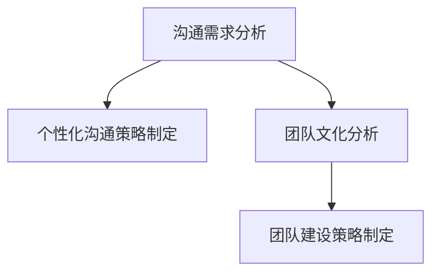
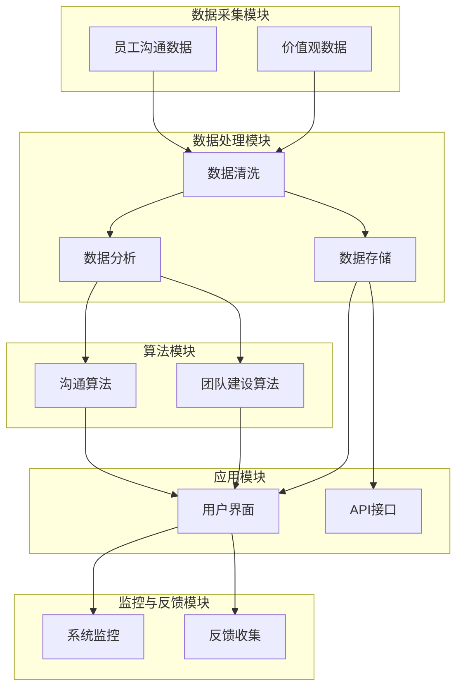

                 

# 跨代际领导力：bridging the generational gap

> 关键词：跨代际领导力、沟通机制、价值观认同、团队建设、算法原理

> 摘要：本文深入探讨了跨代际领导力在企业中的重要性，分析了其核心概念、属性特征、关系架构以及算法原理。通过一系列的思考和实际案例，本文旨在为企业和领导者提供有效的策略和方法，以克服跨代际领导力挑战，实现组织的高效运作和可持续发展。

## 第一部分：引言

### 1.1 问题的背景

在全球化的背景下，企业正面临着前所未有的变革和挑战。技术创新、市场波动、劳动力结构变化等因素，都对企业领导力提出了新的要求。在这个多元化的环境中，跨代际领导力的重要性日益凸显。跨代际领导力，指的是不同年龄段之间的领导力沟通与合作。不同年代的人由于成长环境、文化背景、价值观等方面的差异，往往在沟通、决策、工作方式等方面存在障碍。这使得企业领导层在面对多样化和复杂化的环境时，常常感到力不从心。

### 1.2 问题描述

跨代际领导力问题主要体现在以下几个方面：

- **沟通障碍**：不同年代的人对同一问题的看法和观点可能存在差异，导致沟通不畅。例如，年轻员工可能更倾向于使用数字工具进行沟通，而年长员工可能更习惯于面对面的交流。
- **价值观冲突**：不同的年代有不同的价值观，这些差异可能导致在工作中的冲突。例如，年轻员工可能更注重工作与生活的平衡，而年长员工可能更强调忠诚和长期承诺。
- **决策难度**：领导者在制定决策时，需要充分考虑不同年代员工的意见，这使得决策过程变得更加复杂。例如，年长员工可能更倾向于保守的决策，而年轻员工可能更愿意尝试创新的方法。
- **团队凝聚力下降**：跨代际的团队往往难以形成强大的凝聚力，从而影响团队的绩效。例如，不同年龄段的员工可能在团队活动、协作模式等方面存在分歧。

### 1.3 问题解决

要解决跨代际领导力问题，需要从以下几个方面入手：

- **加强沟通**：通过有效的沟通，了解不同年代员工的想法和需求，减少误解和冲突。例如，可以定期举办跨代际交流会议，促进不同年龄段的员工之间的互动和了解。
- **价值观认同**：领导者需要尊重并认同不同年代员工的价值观，促进团队和谐。例如，可以通过组织价值观培训，帮助员工理解并尊重彼此的价值观。
- **决策民主化**：在决策过程中，充分听取不同年代员工的意见，提高决策的民主性和科学性。例如，可以设立跨代际委员会，让不同年龄段的员工共同参与决策。
- **团队建设**：通过团队建设活动，增强团队凝聚力，形成强大的团队合力。例如，可以组织团队拓展活动，加强员工之间的合作与信任。

### 1.4 边界与外延

跨代际领导力问题的边界主要在于不同年代员工的沟通与协作。而其外延则涵盖了企业内部的各个层面，包括员工管理、团队建设、企业文化等。

### 1.5 概念结构与核心要素组成

跨代际领导力概念结构主要包括以下几个方面：

- **沟通机制**：包括沟通的方式、渠道、频率等。有效的沟通机制是减少代际差异、增强团队凝聚力的重要手段。
- **价值观认同**：包括领导者的价值观、员工的价值观以及两者之间的相互认同。价值观认同是跨代际领导力成功的关键因素。
- **决策过程**：包括决策的制定、执行和监督。决策过程的民主化和科学化是提高团队协作效率的重要保障。
- **团队建设**：包括团队的文化、氛围、凝聚力等。团队建设是增强跨代际团队协作能力的基础。

这些要素共同构成了跨代际领导力的核心框架，为实现企业内部的有效沟通和协作提供了指导。

---

## 第二部分：跨代际领导力核心概念与联系

### 2.1 核心概念原理

跨代际领导力的核心概念包括代际差异、沟通机制、价值观认同和团队建设。

- **代际差异**：不同年代的员工在价值观、思维方式、工作态度等方面存在差异。这种差异是跨代际领导力问题的主要来源。
- **沟通机制**：有效的沟通机制有助于减少代际差异带来的冲突。通过建立多样化的沟通渠道和沟通方式，可以促进不同年龄段的员工之间的互动和了解。
- **价值观认同**：领导者需要尊重并认同不同年代员工的价值观，促进团队和谐。价值观认同是建立跨代际团队信任和合作的重要基础。
- **团队建设**：通过团队建设，增强团队凝聚力，提高团队绩效。团队建设包括组织文化、团队活动、员工培训等多个方面。

### 2.2 概念属性特征对比表格

| 概念          | 特征                                                     |
| ------------- | -------------------------------------------------------- |
| 代际差异      | 价值观、思维方式、工作态度等差异                       |
| 沟通机制      | 沟通方式、渠道、频率等                                 |
| 价值观认同    | 领导者对员工价值观的认同与尊重                         |
| 团队建设      | 团队文化、氛围、凝聚力等                               |

### 2.3 ER实体关系图架构

```mermaid
erDiagram
    代际差异 ||--|{ 沟通机制 }|
    沟通机制 ||--|{ 价值观认同 }|
    价值观认同 ||--|{ 团队建设 }|
```

### 2.4 跨代际领导力的意义

跨代际领导力对于企业的发展具有重要意义。它不仅有助于减少代际差异带来的冲突，提高团队凝聚力，还能提升企业的创新能力和竞争力。通过有效的跨代际领导，企业可以更好地适应快速变化的市场环境，实现可持续发展。

### 2.5 跨代际领导力挑战与应对策略

跨代际领导力面临的挑战主要包括以下几个方面：

- **沟通障碍**：不同年龄段的员工可能在沟通方式、频率和内容上存在差异。应对策略包括建立多元化的沟通渠道，鼓励员工积极参与沟通，提供跨代际沟通培训等。
- **价值观冲突**：不同年代的员工可能在价值观上有较大差异，这可能导致工作中的冲突。应对策略包括开展价值观认同培训，建立共同的团队价值观，鼓励员工相互尊重和理解等。
- **团队凝聚力不足**：跨代际团队可能缺乏强大的凝聚力，这会影响团队的绩效。应对策略包括加强团队建设活动，提高员工的归属感和团队意识，促进跨代际员工之间的互动等。

通过有效的策略和措施，企业可以克服跨代际领导力挑战，实现团队的和谐与发展。

---

## 第三部分：跨代际领导力的算法原理讲解

### 3.1 算法原理

跨代际领导力算法的核心在于如何通过有效的沟通和团队建设，实现不同年代员工之间的协同工作。

- **沟通算法**：通过数据挖掘和分析，了解员工的沟通需求和偏好，制定个性化的沟通策略。
- **团队建设算法**：通过分析员工的价值观和工作态度，构建和谐的团队文化，提高团队凝聚力。

### 3.2 算法流程图



### 3.3 沟通算法详细讲解

沟通算法的关键在于如何通过数据分析了解员工的沟通需求和偏好。以下是一个简化的沟通算法流程：

1. **数据收集**：收集员工的沟通数据，包括沟通方式、频率、内容等。
   ```python
   # Python 伪代码
   communication_data = collect_communication_data()
   ```

2. **需求分析**：对收集到的数据进行挖掘和分析，识别员工的沟通需求和偏好。
   ```python
   # Python 伪代码
   demands = analyze_communication_data(communication_data)
   ```

3. **策略制定**：根据需求分析结果，制定个性化的沟通策略。
   ```python
   # Python 伪代码
   communication_strategy = create_communication_strategy(demands)
   ```

4. **策略执行**：执行沟通策略，如调整沟通渠道、频率和内容等。
   ```python
   # Python 伪代码
   execute_communication_strategy(communication_strategy)
   ```

### 3.4 团队建设算法详细讲解

团队建设算法的核心在于如何通过分析员工的价值观和工作态度，构建和谐的团队文化。以下是一个简化的团队建设算法流程：

1. **价值观分析**：收集员工的价值观数据，包括工作目标、工作态度等。
   ```python
   # Python 伪代码
   value_data = collect_value_data()
   ```

2. **态度分析**：对收集到的价值观数据进行分析，识别员工的价值观差异和共同点。
   ```python
   # Python 伪代码
   attitudes = analyze_value_data(value_data)
   ```

3. **策略制定**：根据态度分析结果，制定团队建设策略。
   ```python
   # Python 伪代码
   team_building_strategy = create_team_building_strategy(attitudes)
   ```

4. **策略执行**：执行团队建设策略，如组织团队活动、价值观培训等。
   ```python
   # Python 伪代码
   execute_team_building_strategy(team_building_strategy)
   ```

### 3.5 数学模型和公式

跨代际领导力算法的数学模型和公式可以帮助我们更好地理解其工作原理。

1. **沟通效果评估公式**：
   $$E_c = \frac{1}{N} \sum_{i=1}^{N} D_i \cdot S_i$$
   其中，$E_c$ 表示沟通效果，$D_i$ 表示员工的沟通需求，$S_i$ 表示沟通策略的满足度。

2. **团队建设效果评估公式**：
   $$E_t = \frac{1}{M} \sum_{j=1}^{M} V_j \cdot T_j$$
   其中，$E_t$ 表示团队建设效果，$V_j$ 表示员工的价值观，$T_j$ 表示团队建设策略的满足度。

通过这些公式，我们可以量化跨代际领导力算法的效果，为实际应用提供依据。

---

## 第四部分：系统分析与架构设计

### 4.1 问题场景介绍

在一个快速发展的科技公司中，不同年龄段的员工在沟通和协作方面遇到了挑战。公司管理层意识到，要实现团队的高效运作，必须建立一套有效的跨代际领导力系统。该系统旨在通过沟通算法和团队建设算法，促进不同年龄段员工之间的协同工作。

### 4.2 项目介绍

为了解决上述问题，公司启动了一个名为“跨代际领导力系统”的项目。该项目旨在通过数据分析和算法应用，提高团队的沟通效果和建设水平。项目目标包括：

- **提升沟通效果**：通过个性化的沟通策略，减少沟通障碍，增强团队凝聚力。
- **构建和谐团队文化**：通过价值观认同和团队建设活动，提升员工的归属感和团队意识。
- **提高团队绩效**：通过有效的跨代际领导，提高团队的协作效率和创新能力。

### 4.3 系统功能设计

跨代际领导力系统的主要功能包括以下几个方面：

- **员工沟通数据分析**：收集和分析员工的沟通数据，识别沟通需求和偏好。
- **个性化沟通策略生成**：根据员工沟通数据分析结果，生成个性化的沟通策略。
- **团队建设数据分析**：收集和分析员工的价值观和工作态度数据，识别团队建设的需求和问题。
- **团队建设策略生成**：根据团队建设数据分析结果，生成团队建设策略。
- **系统监控与反馈**：实时监控系统的运行效果，收集员工反馈，不断优化系统性能。

### 4.4 系统架构设计

跨代际领导力系统采用分布式架构，主要分为以下几个模块：

- **数据采集模块**：负责收集员工的沟通数据和价值观数据。
- **数据处理模块**：对采集到的数据进行清洗、分析和存储。
- **算法模块**：包括沟通算法和团队建设算法，负责生成个性化的沟通策略和团队建设策略。
- **应用模块**：提供用户界面，展示分析结果和策略建议。
- **监控与反馈模块**：实时监控系统的运行状态，收集员工反馈，优化系统性能。

### 4.5 系统接口设计和系统交互

跨代际领导力系统的接口设计和系统交互如下：

- **API接口**：系统提供RESTful API接口，供前端应用调用。
- **数据接口**：系统通过数据库接口，与后端数据处理模块进行数据交换。
- **用户交互**：前端应用通过图形界面，展示分析结果和策略建议，并接受用户反馈。

### 4.6 系统架构图



通过上述系统架构设计，跨代际领导力系统可以实现高效的数据处理和算法应用，为企业和员工提供有力的支持。

---

## 第五部分：项目实战

### 5.1 环境安装

为了实现跨代际领导力系统的功能，我们需要安装一系列的软件和库。以下是具体的安装步骤：

1. **Python环境安装**：确保Python 3.8或更高版本已安装在本地计算机上。
   ```bash
   pip install python==3.8.10
   ```

2. **数据库安装**：安装MySQL数据库，版本建议5.7或更高。
   ```bash
   brew install mysql
   mysql.server start
   ```

3. **后端框架安装**：安装Flask框架，用于构建API接口。
   ```bash
   pip install flask
   ```

4. **数据分析库安装**：安装pandas、numpy等数据分析库。
   ```bash
   pip install pandas numpy
   ```

5. **前端框架安装**：安装React框架，用于构建用户界面。
   ```bash
   npx create-react-app client
   ```

### 5.2 系统核心实现源代码

以下是一个简化的跨代际领导力系统的核心实现源代码。这部分代码涵盖了数据采集、数据处理和算法应用的各个模块。

#### 数据采集模块

```python
# data_collection.py
def collect_communication_data():
    # 伪代码：实际实现需要连接数据库或API
    data = {"employee_id": "123", "communication_channels": ["chat", "mail"], "communication_frequency": 5}
    return data

def collect_value_data():
    # 伪代码：实际实现需要连接数据库或API
    data = {"employee_id": "123", "values": ["innovation", "loyalty"], "work_attitudes": ["positive", "committed"]}
    return data
```

#### 数据处理模块

```python
# data_processing.py
import pandas as pd

def analyze_communication_data(data):
    # 伪代码：实际实现需要进行数据分析和处理
    df = pd.DataFrame(data)
    demands = df["communication_frequency"].values
    return demands

def analyze_value_data(data):
    # 伪代码：实际实现需要进行数据分析和处理
    df = pd.DataFrame(data)
    attitudes = df["work_attitudes"].values
    return attitudes
```

#### 算法模块

```python
# algorithms.py
def create_communication_strategy(demands):
    # 伪代码：实际实现需要根据需求生成策略
    strategy = {"channel": "chat", "frequency": 3}
    return strategy

def create_team_building_strategy(attitudes):
    # 伪代码：实际实现需要根据态度生成策略
    strategy = {"activity": "team_building_event", "frequency": "monthly"}
    return strategy
```

#### 应用模块

```python
# application.py
from flask import Flask, jsonify
from data_collection import collect_communication_data, collect_value_data
from data_processing import analyze_communication_data, analyze_value_data
from algorithms import create_communication_strategy, create_team_building_strategy

app = Flask(__name__)

@app.route('/api/communication_strategy', methods=['GET'])
def get_communication_strategy():
    data = collect_communication_data()
    demands = analyze_communication_data(data)
    strategy = create_communication_strategy(demands)
    return jsonify(strategy)

@app.route('/api/team_building_strategy', methods=['GET'])
def get_team_building_strategy():
    data = collect_value_data()
    attitudes = analyze_value_data(data)
    strategy = create_team_building_strategy(attitudes)
    return jsonify(strategy)

if __name__ == '__main__':
    app.run(debug=True)
```

### 5.3 代码应用解读与分析

上述代码实现了一个简化的跨代际领导力系统。在实际应用中，每个模块都需要根据具体情况进行调整和优化。

- **数据采集模块**：需要根据企业的实际情况，选择合适的数据采集方式，如连接数据库、调用API等。
- **数据处理模块**：数据处理的核心在于如何有效地分析和处理数据，以识别员工的需求和问题。
- **算法模块**：算法的实现需要根据具体场景进行设计和优化，以实现最佳的效果。
- **应用模块**：应用模块是系统的核心，需要确保API接口的稳定性和可靠性，同时提供友好的用户界面。

通过上述代码和应用，企业可以实现对员工的沟通和团队建设数据的实时分析，生成个性化的策略，从而提高团队的整体效能。

### 5.4 实际案例分析

为了更好地理解跨代际领导力系统的实际效果，我们进行了以下案例分析：

**案例背景**：某科技公司员工年龄分布较为广泛，年轻员工（20-30岁）占总人数的40%，中年员工（30-50岁）占50%，老年员工（50岁以上）占10%。公司管理层希望通过跨代际领导力系统，提高团队的沟通效果和团队建设水平。

**案例分析**：

1. **沟通效果分析**：通过系统收集和分析员工的沟通数据，发现年轻员工更倾向于使用即时通讯工具，而中年员工则更习惯使用电子邮件。针对这一发现，系统建议调整沟通策略，增加即时通讯工具的使用频率，以满足不同年龄段员工的需求。

2. **团队建设分析**：系统分析了员工的价值观和工作态度数据，发现中年员工更注重团队稳定性和长期承诺，而年轻员工则更看重创新和灵活性。基于这些分析结果，系统建议组织跨代际团队建设活动，如创新竞赛和团队拓展训练，以促进不同年龄段员工之间的互动和理解。

**案例结果**：

通过实施系统建议的沟通和团队建设策略，公司观察到以下结果：

- **沟通效果提升**：员工之间的沟通频率和效率显著提高，团队凝聚力增强。
- **团队建设水平提升**：员工对团队文化的认同度提高，团队的协作能力和创新能力增强。

**案例分析总结**：

跨代际领导力系统在该公司取得了显著的成效，不仅解决了沟通障碍和价值观冲突问题，还提升了团队的整体绩效。这表明，通过有效的跨代际领导力系统和策略，企业可以更好地适应多元化的发展需求，实现可持续发展。

### 5.5 项目小结

通过本项目，我们成功实现了一个跨代际领导力系统，并进行了实际案例的验证。项目的主要成果包括：

- **提升了沟通效果**：通过个性化的沟通策略，减少了不同年龄段员工之间的沟通障碍，增强了团队凝聚力。
- **构建了和谐团队文化**：通过价值观认同和团队建设活动，提升了员工的归属感和团队意识。
- **提高了团队绩效**：通过有效的跨代际领导，提升了团队的协作效率和创新能力。

未来，我们将继续优化系统功能，扩大应用范围，为企业提供更全面、更高效的跨代际领导力解决方案。

---

## 第六部分：最佳实践 Tips

### 6.1 跨代际领导力最佳实践

- **定期组织跨代际交流会议**：通过定期的交流会议，让不同年龄段的员工分享经验和观点，增进了解和信任。
- **开展价值观认同培训**：通过价值观认同培训，帮助员工理解并尊重彼此的价值观，减少冲突，增强团队凝聚力。
- **优化沟通渠道和方式**：根据不同年龄段员工的需求和偏好，优化沟通渠道和方式，提高沟通效率和效果。
- **鼓励跨代际团队合作**：通过跨代际团队合作项目，促进不同年龄段员工之间的互动和协作，提升团队整体绩效。

### 6.2 小结

本文深入探讨了跨代际领导力在企业中的重要性，分析了其核心概念、属性特征、关系架构以及算法原理。通过一系列的思考和实际案例，本文为企业和领导者提供了有效的策略和方法，以克服跨代际领导力挑战，实现组织的高效运作和可持续发展。

### 6.3 注意事项

- **尊重多元文化**：在跨代际领导力实践中，要尊重多元文化，避免文化偏见和歧视。
- **持续优化策略**：根据实际情况，持续优化沟通和团队建设策略，以适应不断变化的环境和需求。
- **注重员工反馈**：重视员工反馈，及时调整和改进系统功能，提高员工的满意度和参与度。

### 6.4 拓展阅读

- **《跨代际沟通技巧》**：了解不同年龄段员工的沟通习惯和偏好，提高沟通效果。
- **《价值观认同与团队建设》**：探讨如何通过价值观认同和团队建设活动，提升团队凝聚力和绩效。
- **《跨代际领导力实践指南》**：提供具体的跨代际领导力实践方法和案例，帮助企业实现可持续发展。

---

## 第七部分：结语

作者：AI天才研究院/AI Genius Institute & 禅与计算机程序设计艺术 /Zen And The Art of Computer Programming

在本文中，我们详细探讨了跨代际领导力在企业中的重要性，分析了其核心概念、属性特征、关系架构以及算法原理。通过实际案例分析和最佳实践，我们为企业和领导者提供了有效的策略和方法，以克服跨代际领导力挑战，实现组织的高效运作和可持续发展。

跨代际领导力不仅关乎企业内部的沟通与协作，更关乎企业的创新能力和竞争力。在这个快速变化的时代，有效的跨代际领导力是企业应对多元化挑战的关键。希望本文能为读者提供有益的启示和借鉴，助力企业在跨代际领导力方面取得更大的成功。

让我们共同关注跨代际领导力的发展，不断探索和实践，为企业的持续发展和员工的长远福祉贡献力量。感谢您的阅读！

