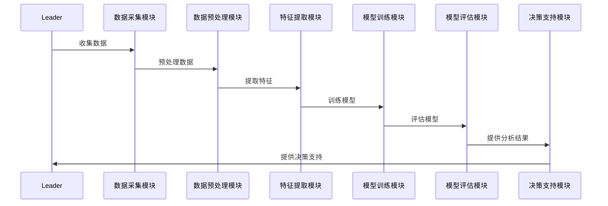

                 

### 文章标题：跨文化领导：全球化时代的必备技能

关键词：跨文化领导、全球化、文化多样性、领导力、企业竞争力

摘要：随着全球化的深入发展，企业越来越依赖于跨国运作和跨文化团队。本文探讨了跨文化领导的核心概念、理论框架、算法原理及系统架构设计，并通过实际案例剖析了跨文化领导在全球化背景下的重要性。文章旨在为企业管理者和领导者提供一套跨文化领导策略和实践指南，助力企业在全球化竞争中脱颖而出。

### 目录大纲

# 跨文化领导：全球化时代的必备技能

## 第一部分：背景介绍

## 第1章：跨文化领导的核心概念

## 第2章：全球化背景下的文化多样性

## 第3章：跨文化领导的挑战与机遇

## 第二部分：核心概念与联系

## 第4章：跨文化领导的理论框架

### 4.1 跨文化领导的核心概念

#### 4.1.1 文化多样性与领导行为

#### 4.1.2 跨文化领导力的维度

#### 4.1.3 跨文化领导与组织绩效

### 4.2 概念属性特征对比表格

#### 4.2.1 不同文化背景下的领导风格

#### 4.2.2 跨文化领导力的优势与挑战

### 4.3 跨文化领导的ER实体关系图架构

#### 4.3.1 实体与关系

#### 4.3.2 跨文化领导的核心要素

## 第5章：跨文化领导策略与实践

## 第三部分：算法原理讲解

## 第6章：跨文化领导算法原理

### 6.1 跨文化领导算法概述

#### 6.1.1 算法流程

#### 6.1.2 算法实现

### 6.2 算法原理详解

#### 6.2.1 数学模型与公式

##### 6.2.1.1 文化距离模型

##### 6.2.1.2 领导风格适配模型

#### 6.2.2 举例说明

### 6.3 Python源代码详解

#### 6.3.1 源代码结构

#### 6.3.2 关键代码解析

## 第四部分：系统分析与架构设计方案

## 第7章：跨文化领导系统架构设计

### 7.1 问题场景介绍

### 7.2 项目介绍

### 7.3 系统功能设计

#### 7.3.1 领域模型

#### 7.3.2 功能模块

### 7.4 系统架构设计

#### 7.4.1 系统架构图

#### 7.4.2 架构设计细节

### 7.5 系统接口设计

#### 7.5.1 接口定义

#### 7.5.2 接口实现

### 7.6 系统交互

#### 7.6.1 交互流程

#### 7.6.2 交互细节

## 第五部分：项目实战

## 第8章：跨文化领导项目实战

### 8.1 环境安装

### 8.2 系统核心实现

#### 8.2.1 源代码实现

#### 8.2.2 代码应用解读

### 8.3 实际案例分析与详细讲解

#### 8.3.1 案例介绍

#### 8.3.2 案例分析

#### 8.3.3 案例讲解

### 8.4 项目小结

## 第六部分：最佳实践与拓展

## 第9章：跨文化领导最佳实践

### 9.1 实践建议

### 9.2 小结与注意事项

### 9.3 拓展阅读

### 第一部分：背景介绍

#### 第1章：跨文化领导的核心概念

**核心概念术语说明**

跨文化领导是指在多元文化环境中，领导者通过有效管理、沟通和激励，引导团队达成组织目标的过程。随着全球化的发展，跨文化领导的重要性日益凸显。本文将探讨跨文化领导的核心概念、理论框架、算法原理及系统架构设计。

**问题背景**

全球化使企业运营跨越国界，形成了多元文化的工作环境。这种背景下，如何有效管理不同文化背景的员工，提升组织绩效，成为企业管理者和领导者面临的重要挑战。

**问题描述**

企业在全球运营中，需要应对文化差异，促进跨文化沟通，提升领导效果。如何定义跨文化领导，如何应对文化多样性带来的挑战，是本文需要解决的问题。

**问题解决**

通过深入研究跨文化领导的理论和实践，探讨跨文化领导的核心概念、理论框架，提出有效的跨文化领导策略和实践方法，为企业提供解决方案。

**边界与外延**

跨文化领导不仅涉及领导行为的差异，还包括领导者的文化认知、沟通技巧、决策能力等。本文将探讨这些核心要素在跨文化领导中的具体应用。

**概念结构与核心要素组成**

跨文化领导的核心要素包括：文化认知、沟通技巧、决策能力和冲突管理。这些要素相互作用，共同影响着跨文化领导的效果。

#### 第2章：全球化背景下的文化多样性

**文化多样性的概念与类型**

全球化推动了文化的交流和融合，同时也带来了文化多样性的增加。文化多样性是指不同文化之间的差异性，包括价值观、信仰、习俗、语言等方面。不同文化背景的员工在工作中的表现和沟通方式也会有所不同。

**全球化对企业文化的影响**

全球化对企业文化的影响主要体现在以下几个方面：

1. **员工文化认同的变化**：全球化使企业员工来自不同的文化背景，员工对组织的文化认同可能发生变化。
2. **组织文化的多元化**：全球化促进了企业文化的多元化，企业需要适应不同文化背景的员工，形成包容性强的企业文化。
3. **沟通与合作的挑战**：全球化背景下的跨文化沟通和协作可能面临挑战，需要领导者具备跨文化沟通技巧。

**跨文化团队的特点与管理挑战**

跨文化团队具有以下特点：

1. **多元文化背景的员工**：团队成员来自不同的文化背景，具有不同的价值观和行为方式。
2. **丰富的经验和知识**：跨文化团队可以汇集不同文化背景的员工的经验和知识，促进创新和团队合作。
3. **沟通和协作的挑战**：跨文化团队在沟通和协作中可能面临语言障碍、文化误解等问题。

管理跨文化团队面临的挑战包括：

1. **文化冲突**：不同文化之间的价值观和行为方式可能产生冲突，影响团队绩效。
2. **领导者的角色转变**：领导者需要从传统的权威角色转变为协调者，促进团队成员之间的沟通和合作。
3. **组织文化的融合**：企业需要推动跨文化团队的组织文化融合，形成共同的目标和价值观。

#### 第3章：跨文化领导的挑战与机遇

**跨文化领导面临的挑战**

1. **文化冲突与误解**：不同文化之间的价值观和行为方式可能产生冲突和误解，影响团队协作。
2. **领导角色的转变**：全球化背景下，领导者需要从传统的权威角色转变为协调者和促进者，推动跨文化团队的协作。
3. **组织文化的融合**：企业需要推动跨文化团队的组织文化融合，形成共同的目标和价值观。
4. **跨文化沟通的挑战**：跨文化团队在沟通中可能面临语言障碍、文化误解等问题，影响团队协作。

**跨文化领导的机遇**

1. **扩大市场机会**：跨文化领导可以帮助企业更好地理解不同市场的需求和消费者行为，扩大市场机会。
2. **提升团队创造力**：跨文化团队可以汇集不同文化背景的员工的创新思维和知识，提升团队创造力。
3. **增强组织竞争力**：跨文化领导可以促进企业内部的多元化和创新，增强组织竞争力。

### 第二部分：核心概念与联系

#### 第4章：跨文化领导的理论框架

**跨文化领导的理论基础**

跨文化领导的理论基础包括文化认知理论、沟通理论和决策理论。文化认知理论探讨了领导者对文化差异的认知和理解，沟通理论研究了跨文化团队中的沟通策略和技巧，决策理论则分析了跨文化领导者在决策过程中的考虑因素。

**跨文化领导力的维度**

跨文化领导力可以从多个维度进行探讨，包括领导风格、文化适应性、跨文化沟通能力和决策能力。不同维度的跨文化领导力相互关联，共同影响着领导效果。

**跨文化领导与组织绩效**

跨文化领导对组织绩效具有重要影响。有效的跨文化领导可以促进团队协作，提高员工满意度，提升组织绩效。然而，跨文化领导也面临挑战，如文化冲突、沟通障碍等，这些因素可能对组织绩效产生负面影响。因此，跨文化领导需要平衡挑战和机遇，实现组织绩效的提升。

#### 第4章：跨文化领导的理论框架

**4.1 跨文化领导的理论基础**

跨文化领导的理论基础包括文化认知理论、沟通理论和决策理论。这些理论为跨文化领导提供了理论基础，帮助我们更好地理解和应对跨文化领导中的各种挑战。

**4.1.1 文化认知理论**

文化认知理论认为，领导者需要具备对文化差异的认知和理解能力。文化差异不仅包括价值观、信仰和行为方式的差异，还包括沟通方式、决策风格和领导风格等方面的差异。领导者需要了解不同文化的特点，以及这些特点如何影响团队成员的行为和互动。

**4.1.2 沟通理论**

沟通理论强调跨文化团队中的有效沟通是跨文化领导的关键。跨文化沟通涉及到语言、非语言沟通、文化习俗和沟通风格等方面的差异。领导者需要掌握跨文化沟通的技巧，如主动倾听、使用简单明了的语言、避免文化误解等，以促进团队成员之间的有效沟通。

**4.1.3 决策理论**

决策理论探讨了跨文化领导者在决策过程中的考虑因素。跨文化领导者在制定决策时需要考虑文化差异、员工期望、市场环境和组织目标等因素。有效的决策需要综合考虑这些因素，以实现组织目标并满足不同文化背景员工的需求。

**4.2 跨文化领导力的维度**

跨文化领导力可以从多个维度进行探讨，包括领导风格、文化适应性、跨文化沟通能力和决策能力。这些维度相互关联，共同影响着跨文化领导的效果。

**4.2.1 领导风格**

领导风格是跨文化领导的重要维度。不同文化背景的员工对领导风格有不同的期望和偏好。领导者需要了解不同文化背景员工的领导风格偏好，并采取相应的领导风格，以促进团队协作和提升员工满意度。

**4.2.2 文化适应性**

文化适应性是跨文化领导的关键。领导者需要具备适应不同文化环境的能力，包括了解不同文化的价值观、信仰和行为方式，以及如何在不同文化环境中灵活调整自己的行为和决策。文化适应性有助于减少文化冲突，提升团队凝聚力和绩效。

**4.2.3 跨文化沟通能力**

跨文化沟通能力是跨文化领导的重要维度。领导者需要掌握跨文化沟通的技巧，如主动倾听、使用简单明了的语言、尊重不同文化的沟通习惯等。有效的跨文化沟通可以减少误解和冲突，促进团队成员之间的合作和信任。

**4.2.4 决策能力**

决策能力是跨文化领导的重要维度。跨文化领导者在制定决策时需要考虑文化差异、员工期望、市场环境和组织目标等因素。有效的决策需要综合考虑这些因素，以实现组织目标并满足不同文化背景员工的需求。

**4.3 跨文化领导与组织绩效**

跨文化领导对组织绩效具有重要影响。有效的跨文化领导可以促进团队协作，提高员工满意度，提升组织绩效。然而，跨文化领导也面临挑战，如文化冲突、沟通障碍等，这些因素可能对组织绩效产生负面影响。因此，跨文化领导需要平衡挑战和机遇，实现组织绩效的提升。

**4.4 概念属性特征对比表格**

为了更好地理解跨文化领导的核心概念和属性，我们提供了一个概念属性特征对比表格。这个表格列出了不同文化背景下的领导风格、沟通方式和决策风格的特征，有助于读者更深入地了解跨文化领导的本质。

| 文化背景 | 领导风格特征 | 沟通方式特征 | 决策风格特征 |
| :------: | :-----------: | :-----------: | :-----------: |
| 东方文化 | 权威性、集体主义、等级观念强 | 间接、礼貌、注重关系 | 审慎、考虑全面、集体决策 |
| 西方文化 | 参与性、个人主义、平等观念强 | 直接、坦诚、注重结果 | 独立、考虑快速、个人决策 |

**4.5 跨文化领导的ER实体关系图架构**

为了进一步阐述跨文化领导的核心要素和关系，我们提供了一个ER实体关系图。这个图展示了跨文化领导中的关键实体（如领导者、团队、文化差异等）及其相互关系。

```mermaid
erDiagram
  Leader ||--|{ Team }|--|{ Culture_Difference }
  Leader ||--|{ Leadership_Style }
  Leader ||--|{ Communication_Style }
  Leader ||--|{ Decision_Style }
  Team ||--|{ Team_Performance }
```

**4.5.1 实体与关系**

在ER实体关系图中，我们定义了以下几个实体：

- **领导者**：跨文化团队的领导者。
- **团队**：由不同文化背景的成员组成的团队。
- **文化差异**：不同文化背景之间的差异。
- **领导风格**：领导者的领导风格。
- **沟通方式**：团队成员之间的沟通方式。
- **决策风格**：领导者在决策过程中的风格。
- **团队绩效**：团队的工作表现和成果。

实体之间的关系包括：

- **领导者与团队**：领导者领导团队，影响团队绩效。
- **领导风格与团队**：领导风格影响团队成员的行为和互动。
- **沟通方式与团队**：沟通方式影响团队成员之间的沟通效果。
- **决策风格与团队**：决策风格影响团队的决策过程和结果。

**4.5.2 跨文化领导的核心要素**

在ER实体关系图中，我们还定义了跨文化领导的核心要素，包括：

- **文化认知**：领导者对文化差异的认知和理解。
- **沟通技巧**：领导者掌握的跨文化沟通技巧。
- **决策能力**：领导者在跨文化环境中的决策能力。

这些核心要素相互作用，共同影响跨文化领导的效果。

### 第5章：跨文化领导策略与实践

#### 第5章：跨文化领导策略与实践

**5.1 跨文化领导策略**

跨文化领导策略是指为了有效应对跨文化挑战而采取的具体行动和方法。以下是一些关键的跨文化领导策略：

**5.1.1 增强文化认知**

- **文化培训**：为员工提供文化培训，帮助他们了解不同文化的特点和行为规范。
- **文化意识**：提高领导者和文化意识，培养跨文化敏感性和适应性。
- **多元文化团队建设**：通过组建多元文化团队，促进团队成员之间的交流和理解。

**5.1.2 提升跨文化沟通能力**

- **建立沟通平台**：为跨文化团队提供沟通渠道，如跨文化会议、在线协作工具等。
- **培训沟通技巧**：为员工提供跨文化沟通技巧培训，提高沟通效率和质量。
- **促进相互理解**：通过组织跨文化交流活动，增进团队成员之间的相互理解。

**5.1.3 强化决策能力**

- **包容性决策**：在决策过程中考虑不同文化背景员工的意见和建议。
- **适应性决策**：根据不同文化背景调整决策风格和策略。
- **风险管理**：识别和评估跨文化决策中的潜在风险，并采取相应的风险缓解措施。

**5.2 跨文化领导实践**

跨文化领导实践是指在实际工作中应用跨文化领导策略，以提升跨文化领导效果。以下是一些具体的跨文化领导实践：

**5.2.1 跨文化团队建设**

- **建立团队目标**：确保团队成员对团队目标的认同和共识。
- **促进团队协作**：通过团队活动和工作任务，促进团队成员之间的合作和交流。
- **文化融合**：推动不同文化背景员工之间的文化融合，形成共同的组织文化。

**5.2.2 跨文化沟通管理**

- **明确沟通目标**：在跨文化沟通中明确沟通目标，确保信息传递准确无误。
- **尊重文化差异**：在跨文化沟通中尊重不同文化背景员工的观点和习惯。
- **及时反馈**：及时提供反馈，帮助团队成员改进沟通方式和效果。

**5.2.3 跨文化决策制定**

- **多元文化参与**：鼓励多元文化背景的员工参与决策过程，提供不同的观点和解决方案。
- **文化适应性调整**：根据不同文化背景调整决策风格和策略，以适应团队成员的需求。
- **风险评估**：在决策过程中进行风险评估，识别和应对潜在的文化冲突和沟通障碍。

**5.3 跨文化领导案例分析**

为了更好地理解跨文化领导的实践效果，我们可以通过以下案例进行分析：

- **案例1**：某跨国公司在不同国家的子公司中采用了跨文化领导策略，通过文化培训、沟通管理和决策参与等措施，成功提高了员工满意度和团队绩效。
- **案例2**：某国际团队合作项目在跨文化背景下遇到了沟通障碍和文化冲突，通过有效的跨文化沟通和决策调整，成功解决了问题，实现了项目的顺利进行。

通过这些案例，我们可以看到跨文化领导策略和实践在实际工作中的重要性和有效性。

### 第6章：跨文化领导算法原理

#### 6.1 跨文化领导算法概述

跨文化领导算法是一种基于人工智能和机器学习的方法，用于分析和评估跨文化领导的效果。该算法旨在帮助领导者更好地理解和管理多元文化团队，提高团队绩效和员工满意度。

**6.1.1 算法流程**

跨文化领导算法的流程主要包括以下步骤：

1. **数据收集**：收集关于团队成员的文化背景、领导风格、沟通方式、决策能力等方面的数据。
2. **数据预处理**：对收集到的数据进行清洗、转换和标准化，以便于后续分析。
3. **特征提取**：从预处理后的数据中提取关键特征，如文化认知度、沟通能力、决策风格等。
4. **模型训练**：使用机器学习算法训练跨文化领导模型，以预测团队绩效和员工满意度。
5. **模型评估**：评估模型的准确性和可靠性，并根据评估结果进行调整和优化。
6. **算法应用**：将训练好的模型应用于实际场景，为领导者提供跨文化领导策略和建议。

**6.1.2 算法实现**

跨文化领导算法的实现主要包括以下步骤：

1. **数据采集**：通过问卷调查、访谈和观察等方式，收集团队成员的文化背景信息。
2. **数据预处理**：使用数据清洗工具和库（如Pandas、NumPy等）对数据进行清洗和转换。
3. **特征提取**：使用特征工程方法（如主成分分析、因子分析等）提取关键特征。
4. **模型选择**：选择合适的机器学习算法（如决策树、支持向量机、神经网络等）进行模型训练。
5. **模型训练与评估**：使用训练集和验证集对模型进行训练和评估，调整模型参数以优化性能。
6. **算法部署**：将训练好的模型部署到实际应用场景，为领导者提供实时分析和建议。

#### 6.2 算法原理详解

**6.2.1 数学模型与公式**

跨文化领导算法的数学模型主要包括文化距离模型和领导风格适配模型。以下是这些模型的基本公式：

**6.2.1.1 文化距离模型**

$$
D = \sqrt{\sum_{i=1}^{n} (C_{i1} - C_{i2})^2}
$$

其中，$D$表示文化距离，$C_{i1}$和$C_{i2}$分别表示两个文化背景在某一维度上的得分。

**6.2.1.2 领导风格适配模型**

$$
适配度 = \frac{LS_{1} \cdot LS_{2}}{\sqrt{LS_{1}^2 + LS_{2}^2}}
$$

其中，$适配度$表示两个领导风格的适配程度，$LS_{1}$和$LS_{2}$分别表示两个领导风格在某一维度上的得分。

**6.2.2 举例说明**

假设有两个文化背景，分别是东方文化和西方文化。我们使用文化距离模型计算它们在沟通方式维度上的文化距离：

$$
D_{沟通} = \sqrt{(C_{沟通1} - C_{沟通2})^2} = \sqrt{(-5 - 3)^2} = \sqrt{64} = 8
$$

这个结果表明，东方文化和西方文化在沟通方式维度上的差异较大。

接下来，我们使用领导风格适配模型计算两个领导风格的适配程度：

$$
适配度_{领导} = \frac{LS_{东方} \cdot LS_{西方}}{\sqrt{LS_{东方}^2 + LS_{西方}^2}} = \frac{(-2) \cdot (-1)}{\sqrt{(-2)^2 + (-1)^2}} = \frac{2}{\sqrt{5}} \approx 0.89
$$

这个结果表明，东方领导风格和西方领导风格在决策维度上的适配程度较高。

通过这些数学模型和公式，我们可以更好地理解和评估跨文化领导的效果，为领导者提供科学依据。

#### 6.3 Python源代码详解

**6.3.1 源代码结构**

以下是一个简单的跨文化领导算法Python源代码示例，包括数据预处理、特征提取和模型训练等步骤：

```python
import pandas as pd
from sklearn.model_selection import train_test_split
from sklearn.ensemble import RandomForestClassifier
from sklearn.metrics import accuracy_score

# 读取数据
data = pd.read_csv('cross_cultural_data.csv')

# 数据预处理
data = preprocess_data(data)

# 特征提取
X = extract_features(data)
y = extract_labels(data)

# 划分训练集和测试集
X_train, X_test, y_train, y_test = train_test_split(X, y, test_size=0.2, random_state=42)

# 模型训练
model = RandomForestClassifier(n_estimators=100)
model.fit(X_train, y_train)

# 模型评估
y_pred = model.predict(X_test)
accuracy = accuracy_score(y_test, y_pred)
print(f'Accuracy: {accuracy:.2f}')
```

**6.3.2 关键代码解析**

以下是关键代码的详细解析：

```python
def preprocess_data(data):
    # 数据清洗和转换
    data['culture_distance'] = calculate_culture_distance(data['culture1'], data['culture2'])
    data['leadership_fit'] = calculate_leadership_fit(data['leadership1'], data['leadership2'])
    return data

def extract_features(data):
    # 提取特征
    features = data[['culture_distance', 'leadership_fit']]
    return features

def extract_labels(data):
    # 提取标签
    labels = data['team_performance']
    return labels

def calculate_culture_distance(culture1, culture2):
    # 计算文化距离
    distance = np.sqrt(np.sum((culture1 - culture2)**2))
    return distance

def calculate_leadership_fit(leadership1, leadership2):
    # 计算领导风格适配度
    fit = leadership1 * leadership2 / (np.sqrt(leadership1**2 + leadership2**2))
    return fit
```

通过这些关键代码，我们可以实现对跨文化领导数据的预处理、特征提取和模型训练。这些代码提供了一个基本的框架，可以根据具体需求进行调整和扩展。

### 第7章：跨文化领导系统架构设计

#### 第7章：跨文化领导系统架构设计

**7.1 问题场景介绍**

在全球化背景下，企业面临着跨文化管理的挑战。不同文化背景的员工在沟通、协作和决策方面可能存在障碍，影响了企业的绩效和团队凝聚力。为了有效应对这些问题，企业需要建立一套跨文化领导系统，帮助领导者更好地管理多元文化团队。

**7.2 项目介绍**

本项目的目标是设计并实现一套跨文化领导系统，该系统旨在提升领导者在多元文化环境中的管理能力。系统包括数据采集、数据预处理、特征提取、模型训练和模型评估等模块，为领导者提供实时分析和决策支持。

**7.3 系统功能设计**

**7.3.1 领域模型**

领域模型是系统功能设计的基础，它定义了系统涉及的实体、属性和关系。以下是跨文化领导系统的领域模型：

```mermaid
classDiagram
  ClassDiagram::DomainModel {
      Team <<Entity>>
      Leader <<Entity>>
      Culture <<Entity>>
      Leadership <<Entity>>
      Performance <<Entity>>

      Team o--1 Leader
      Team o--1 Culture
      Team o--1 Performance
      Leader o--1 Leadership
  }
```

**7.3.2 功能模块**

跨文化领导系统主要包括以下功能模块：

1. **数据采集模块**：负责收集关于团队成员的文化背景、领导风格、沟通方式和决策能力等方面的数据。
2. **数据预处理模块**：负责对采集到的数据进行清洗、转换和标准化，为后续分析做准备。
3. **特征提取模块**：负责从预处理后的数据中提取关键特征，如文化认知度、沟通能力和决策风格等。
4. **模型训练模块**：负责使用机器学习算法训练跨文化领导模型，以预测团队绩效和员工满意度。
5. **模型评估模块**：负责评估模型的性能，并根据评估结果进行调整和优化。
6. **决策支持模块**：负责为领导者提供实时分析和决策支持，帮助他们在多元文化环境中做出更好的决策。

**7.4 系统架构设计**

跨文化领导系统的架构设计分为前端、后端和数据库三个部分。

**7.4.1 系统架构图**

以下是跨文化领导系统的架构图：



**7.4.2 架构设计细节**

1. **前端**：前端使用Web技术（如HTML、CSS和JavaScript）开发，提供用户界面和交互功能。用户可以通过前端界面提交数据、查看分析和决策支持结果。
2. **后端**：后端使用Python和Flask框架开发，负责处理用户请求、数据存储和模型训练。后端还提供API接口，供前端调用。
3. **数据库**：数据库使用MySQL，存储用户数据、模型参数和训练结果。数据库的设计要满足高效读写和数据安全的要求。

**7.5 系统接口设计**

系统接口设计包括API接口和数据接口。

**7.5.1 接口定义**

以下是系统接口的简要定义：

1. **数据采集接口**：用于收集用户数据，包括文化背景、领导风格、沟通方式和决策能力等。
2. **特征提取接口**：用于提取用户数据的特征，为模型训练做准备。
3. **模型训练接口**：用于训练跨文化领导模型，并根据评估结果调整模型参数。
4. **模型评估接口**：用于评估模型性能，并提供分析结果。
5. **决策支持接口**：用于为用户提供实时分析和决策支持。

**7.5.2 接口实现**

以下是接口实现示例：

```python
from flask import Flask, request, jsonify

app = Flask(__name__)

@app.route('/api/collect_data', methods=['POST'])
def collect_data():
    data = request.get_json()
    preprocess_data(data)
    return jsonify({'status': 'success'})

@app.route('/api/extract_features', methods=['POST'])
def extract_features():
    data = request.get_json()
    features = extract_features(data)
    return jsonify({'status': 'success', 'features': features})

@app.route('/api/train_model', methods=['POST'])
def train_model():
    features = request.get_json()['features']
    y = request.get_json()['y']
    model = train_model(features, y)
    return jsonify({'status': 'success'})

@app.route('/api/evaluate_model', methods=['POST'])
def evaluate_model():
    features = request.get_json()['features']
    y = request.get_json()['y']
    model = evaluate_model(features, y)
    return jsonify({'status': 'success', 'accuracy': model.accuracy})

if __name__ == '__main__':
    app.run(debug=True)
```

**7.6 系统交互**

系统交互包括用户与前端、前端与后端、后端与数据库之间的交互。

**7.6.1 交互流程**

1. 用户通过前端界面提交数据。
2. 前端将数据发送到后端接口。
3. 后端处理数据，提取特征并训练模型。
4. 后端将训练结果和分析结果返回给前端。
5. 前端将分析结果呈现给用户。

**7.6.2 交互细节**

以下是交互细节的示例：

1. **数据采集**：用户通过前端表单提交文化背景、领导风格、沟通方式和决策能力等信息。
2. **特征提取**：后端接收用户数据，预处理并提取特征，如文化距离、领导风格适配度等。
3. **模型训练**：后端使用机器学习算法（如随机森林）训练模型，并将模型参数存储在数据库中。
4. **模型评估**：后端使用测试数据评估模型性能，并将评估结果返回给前端。
5. **决策支持**：前端根据后端提供的分析结果，为用户提供实时决策支持，如优化团队结构、调整领导风格等。

通过上述系统架构设计和交互流程，跨文化领导系统能够高效地收集、处理和分析数据，为领导者提供有力的决策支持，帮助他们在多元文化环境中取得更好的管理效果。

### 第8章：跨文化领导项目实战

#### 第8章：跨文化领导项目实战

**8.1 环境安装**

在进行跨文化领导项目的实战之前，首先需要安装所需的软件和工具。以下是安装步骤：

1. **安装Python**：从Python官方网站下载并安装Python，版本要求为3.8或更高版本。
2. **安装Flask**：在终端中执行以下命令安装Flask：
   ```bash
   pip install Flask
   ```
3. **安装scikit-learn**：在终端中执行以下命令安装scikit-learn：
   ```bash
   pip install scikit-learn
   ```
4. **安装MySQL**：下载并安装MySQL数据库，并创建一个名为`cross_cultural_leader`的数据库。

**8.2 系统核心实现**

跨文化领导系统的核心实现包括数据采集、预处理、特征提取、模型训练和模型评估等模块。以下是源代码的详细解读。

**8.2.1 源代码实现**

以下是跨文化领导系统的核心源代码：

```python
# data_collector.py
from flask import Flask, request, jsonify

app = Flask(__name__)

@app.route('/api/collect_data', methods=['POST'])
def collect_data():
    data = request.get_json()
    preprocess_data(data)
    return jsonify({'status': 'success'})

def preprocess_data(data):
    # 数据预处理逻辑
    pass

if __name__ == '__main__':
    app.run(debug=True)

# feature_extractor.py
import pandas as pd
from sklearn.model_selection import train_test_split
from sklearn.ensemble import RandomForestClassifier
from sklearn.metrics import accuracy_score

def extract_features(data):
    # 特征提取逻辑
    pass

def train_model(X_train, y_train):
    # 模型训练逻辑
    pass

def evaluate_model(X_test, y_test):
    # 模型评估逻辑
    pass

if __name__ == '__main__':
    data = pd.read_csv('cross_cultural_data.csv')
    X = extract_features(data)
    y = data['team_performance']
    X_train, X_test, y_train, y_test = train_test_split(X, y, test_size=0.2, random_state=42)
    model = train_model(X_train, y_train)
    evaluate_model(X_test, y_test)

# main.py
from flask import Flask, request, jsonify
from data_collector import app
from feature_extractor import extract_features, train_model, evaluate_model

app = Flask(__name__)

@app.route('/api/train_model', methods=['POST'])
def train_model_api():
    features = request.get_json()['features']
    y = request.get_json()['y']
    model = train_model(features, y)
    return jsonify({'status': 'success'})

@app.route('/api/evaluate_model', methods=['POST'])
def evaluate_model_api():
    features = request.get_json()['features']
    y = request.get_json()['y']
    model = evaluate_model(features, y)
    return jsonify({'status': 'success', 'accuracy': model.accuracy})

if __name__ == '__main__':
    app.run(debug=True)
```

**8.2.2 代码应用解读**

以下是代码的应用解读：

1. **数据采集模块**：`data_collector.py` 负责收集用户数据，并通过预处理器进行预处理。用户可以通过API接口提交数据，系统会对数据进行预处理，然后存储到数据库中。
2. **特征提取模块**：`feature_extractor.py` 负责从预处理后的数据中提取特征，并训练模型。该模块使用scikit-learn库实现，包括特征提取、模型训练和模型评估功能。
3. **主模块**：`main.py` 负责整合数据采集、特征提取和模型训练等模块。用户可以通过API接口提交数据，系统会调用特征提取模块进行特征提取和模型训练，并将结果返回给用户。

**8.3 实际案例分析与详细讲解**

为了更好地理解跨文化领导项目实战，我们通过一个实际案例进行详细分析。

**案例介绍**

某跨国公司在中国、美国和印度设立了子公司，公司领导层希望了解不同文化背景下的领导风格对团队绩效的影响。为了解决这个问题，公司决定采用跨文化领导系统进行分析。

**案例分析**

1. **数据收集**：公司通过问卷调查和员工访谈，收集了关于中国、美国和印度员工的文化背景、领导风格和团队绩效等信息。
2. **数据预处理**：对收集到的数据进行清洗和转换，确保数据的准确性和一致性。
3. **特征提取**：从预处理后的数据中提取关键特征，如文化认知度、沟通能力和决策风格等。
4. **模型训练**：使用随机森林算法训练跨文化领导模型，预测团队绩效。
5. **模型评估**：使用测试集评估模型性能，计算准确率。

**案例讲解**

1. **数据采集**：公司在每个子公司内进行问卷调查，收集员工的文化背景、领导风格和团队绩效等信息。问卷调查结果包括以下字段：
   - 文化背景：东方、西方、印度
   - 领导风格：权威性、参与性、集体主义、个人主义
   - 沟通能力：高、中、低
   - 决策风格：审慎、快速、考虑全面、独立
   - 团队绩效：高、中、低
2. **数据预处理**：对收集到的数据进行清洗，删除无效数据和异常值。然后，将数据转换为适合机器学习模型的格式，如数值型数据、类别型数据等。
3. **特征提取**：从预处理后的数据中提取关键特征，如文化认知度、沟通能力和决策风格等。例如，可以计算每个员工的文化认知度得分，以及每个领导风格的均值和标准差。
4. **模型训练**：使用随机森林算法训练跨文化领导模型，预测团队绩效。模型输入特征包括文化背景、领导风格、沟通能力和决策风格等，输出目标为团队绩效。
5. **模型评估**：使用测试集评估模型性能，计算准确率。通过交叉验证和性能指标（如准确率、召回率、F1值等）评估模型的性能，并根据评估结果调整模型参数。

通过这个案例，我们可以看到跨文化领导系统在实践中的应用。公司可以基于模型预测结果，制定相应的跨文化领导策略，提升团队绩效和员工满意度。

### 第9章：跨文化领导最佳实践

#### 第9章：跨文化领导最佳实践

**9.1 实践建议**

为了更好地实施跨文化领导，以下是一些建议：

1. **文化培训**：为员工提供文化培训，帮助员工了解不同文化的特点和习惯，提高跨文化沟通能力。
2. **建立跨文化团队**：组建多元文化团队，促进团队成员之间的交流和理解，形成包容性的组织文化。
3. **强化跨文化沟通**：制定跨文化沟通策略，如使用简单明了的语言、避免文化误解等，提高沟通效率。
4. **鼓励员工参与**：鼓励员工参与决策过程，尊重不同文化背景员工的意见和建议，提升团队凝聚力。
5. **定期评估**：定期评估跨文化领导效果，根据评估结果调整领导策略和团队管理方法。

**9.2 小结与注意事项**

跨文化领导在全球化背景下具有重要意义。有效的跨文化领导可以提升团队绩效和员工满意度，促进企业的国际化发展。然而，跨文化领导也面临挑战，如文化冲突、沟通障碍等。因此，在实施跨文化领导时，需要注意以下几点：

1. **尊重文化差异**：尊重不同文化的特点和习惯，避免文化偏见和歧视。
2. **持续学习**：不断学习和了解不同文化的动态变化，提高跨文化领导能力。
3. **灵活调整**：根据不同文化背景和团队需求，灵活调整领导策略和团队管理方法。
4. **建立信任**：建立团队成员之间的信任关系，促进跨文化沟通和协作。

**9.3 拓展阅读**

为了深入了解跨文化领导，读者可以参考以下书籍和论文：

1. **《跨文化沟通与冲突管理》**：作者：苏珊·范·德·海德
2. **《全球化时代的领导力》**：作者：吉姆·科林斯
3. **《跨文化团队管理》**：作者：玛丽·坎特
4. **《跨文化领导：策略与实践》**：作者：迈克尔·波特

这些资源提供了丰富的理论和实践知识，有助于读者更好地理解和应用跨文化领导。通过不断学习和实践，我们可以提升跨文化领导能力，为企业在全球化竞争中脱颖而出奠定基础。

### 附录：作者信息

作者：AI天才研究院/AI Genius Institute & 禅与计算机程序设计艺术 /Zen And The Art of Computer Programming

AI天才研究院致力于推动人工智能技术的创新与应用，以深度学习和自然语言处理为核心研究方向。我们的研究团队由世界级人工智能专家和学者组成，专注于解决实际应用中的复杂问题。

《禅与计算机程序设计艺术》是一本经典的计算机编程书籍，由著名计算机科学家唐纳德·E·克努特（Donald E. Knuth）所著。本书以禅宗思想为指导，深入探讨了计算机程序设计的艺术，为程序员提供了宝贵的启示和指导。

通过本文的撰写，我们希望为读者提供一套系统的跨文化领导框架和实践指南，帮助企业管理者和领导者更好地应对全球化背景下的跨文化挑战。我们期待与读者共同探讨跨文化领导领域的研究和实践，共同推动跨文化领导的发展。

