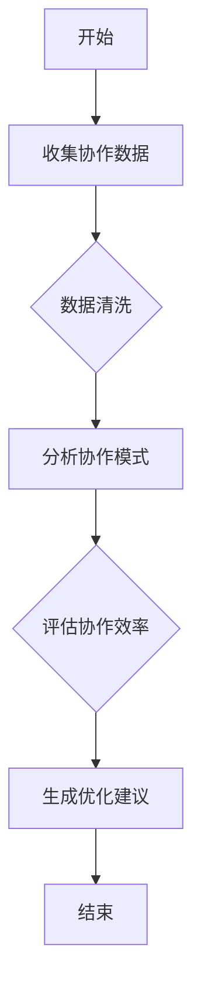
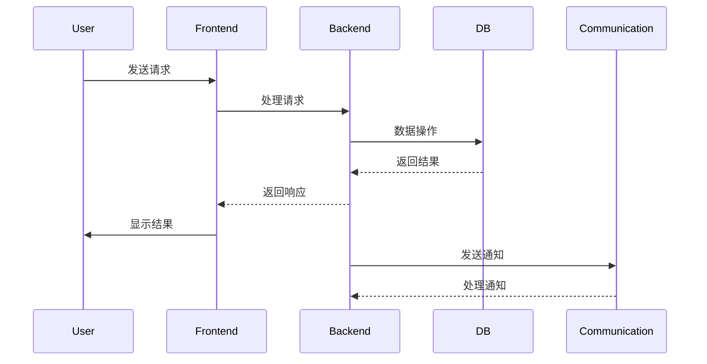
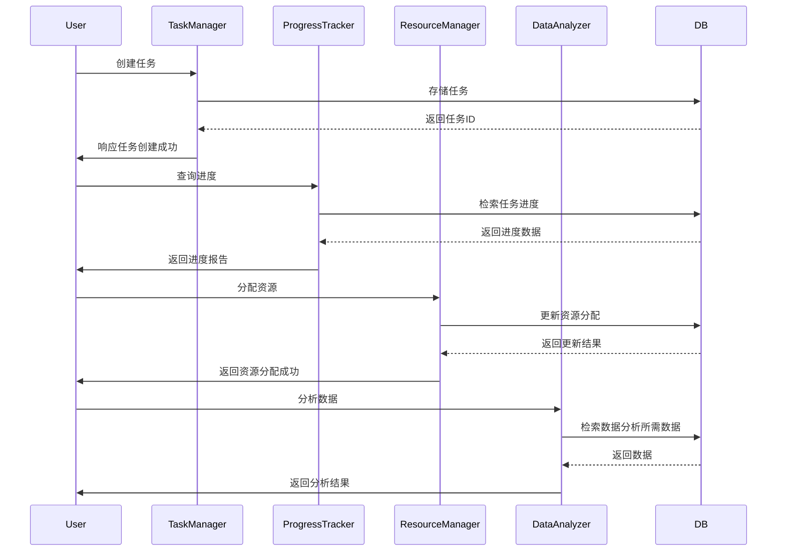

                 


## 跨职能团队协作：优化资源配置的策略

### 摘要

本文旨在探讨如何通过优化资源配置策略，提升跨职能团队的协作效率。在现代企业中，跨职能团队已成为一种常见的工作组织形式。他们由不同职能领域的人员组成，共同完成复杂项目。然而，如何有效配置资源，使得团队成员能够高效协同工作，是一个亟待解决的问题。本文将首先介绍问题背景和研究目的，然后逐步阐述核心概念、算法原理、数学模型、系统分析与架构设计，以及项目实战和最佳实践策略。

### 目录大纲

1. 引言
    1.1 问题背景
    1.2 研究目的与意义
    1.3 边界与外延
    1.4 概念结构与核心要素
2. 核心概念与联系
    2.1 跨职能团队定义
    2.2 跨职能团队特点
    2.3 核心概念对比表格
    2.4 ER实体关系图架构
3. 算法原理讲解
    3.1 协作效率分析算法
        3.1.1 算法概述
        3.1.2 Mermaid算法流程图
        3.1.3 Python源代码实现
        3.1.4 数学模型与公式
        3.1.5 举例说明
4. 数学模型和数学公式 & 详细讲解 & 举例说明
    4.1 数学模型介绍
        4.1.1 概念与定义
        4.1.2 模型结构
        4.1.3 公式推导
        4.1.4 举例说明
5. 系统分析与架构设计方案
    5.1 问题场景介绍
    5.2 系统功能设计
    5.3 系统架构设计
    5.4 系统接口设计
    5.5 系统交互序列图
6. 项目实战
    6.1 环境安装
    6.2 系统核心实现源代码
    6.3 代码应用解读与分析
    6.4 实际案例分析与讲解
    6.5 项目小结
7. 最佳实践 tips
    7.1 协作策略选择
    7.2 资源配置技巧
    7.3 小组动态管理
    7.4 小结
8. 注意事项
    8.1 可能遇到的问题
    8.2 解决方案与预防措施
    8.3 遵循的最佳实践
9. 拓展阅读
    9.1 相关书籍推荐
    9.2 学术论文推荐
    9.3 在线课程推荐

### 引言

在现代企业运营中，跨职能团队已成为一种重要的组织形式。这种团队由来自不同职能领域（如研发、市场、销售、客户服务等）的专业人员组成，共同完成复杂的项目任务。跨职能团队的优点在于，它能够打破传统的职能壁垒，促进不同部门之间的信息共享和协同工作，从而提高整体工作效率。

然而，在实际操作中，跨职能团队也面临着一些挑战。如何合理配置资源，使得团队成员能够高效协作，是跨职能团队管理中的一个关键问题。本文的研究目的就是探讨如何通过优化资源配置策略，提升跨职能团队的协作效率。

本文将首先介绍问题背景和研究目的，然后逐步阐述核心概念、算法原理、数学模型、系统分析与架构设计，以及项目实战和最佳实践策略。通过这篇文章，读者将能够了解到如何在实际工作中应用这些策略，以提升跨职能团队的协作效率和资源利用率。

### 背景介绍

跨职能团队的概念并非新兴，而是随着现代企业对高效协作需求的增加而逐渐兴起。在传统企业组织结构中，各部门往往相对独立，各自负责特定的职能领域。例如，研发部门负责产品的技术实现，市场部门负责推广和销售，客服部门则负责售后支持。这种组织结构在一定程度上提高了专业化程度，但也导致了信息壁垒和协作不畅的问题。

随着市场竞争的加剧和项目复杂度的增加，企业逐渐意识到，单靠单一职能部门的努力往往无法满足复杂项目的需求。跨职能团队应运而生，它通过将来自不同部门的专业人员整合到一个团队中，实现了信息的共享和协作。跨职能团队不仅可以更快速地响应市场变化，还能够通过多角度的思考，提高项目的创新性和成功率。

然而，跨职能团队也带来了新的挑战。团队成员来自不同的背景和职能，他们之间可能存在不同的工作方式、沟通方式和价值观。如何有效地管理这些差异，确保团队成员能够高效协作，是跨职能团队管理中的关键问题。

首先，资源配置是一个重要问题。在跨职能团队中，资源包括人力资源、技术资源和资金资源等。如何根据项目需求和团队成员的技能特点，合理分配这些资源，使得每个成员都能够发挥最大的价值，是提升团队协作效率的关键。此外，资源的不合理配置可能导致某些成员过度忙碌，而另一些成员则闲置，从而降低整体效率。

其次，沟通和协作也是跨职能团队管理中的重要环节。团队成员之间的有效沟通和协作，是确保项目顺利进行的基础。然而，由于团队成员的职能背景和工作方式不同，他们之间的沟通可能存在障碍。如何建立良好的沟通机制，确保信息的及时传递和准确理解，是跨职能团队管理中的一个重要任务。

最后，团队动态管理也是一个挑战。跨职能团队中的成员可能会因项目进展、个人发展需求等原因，出现流动。如何动态调整团队结构，确保团队成员的稳定性和连续性，是团队管理中需要关注的问题。

综上所述，优化资源配置策略是提升跨职能团队协作效率的关键。通过合理配置资源、建立良好的沟通机制和动态管理团队，可以有效地解决跨职能团队面临的挑战，提高团队的效率和项目的成功率。

### 研究目的与意义

本文的研究目的是探讨如何通过优化资源配置策略，提升跨职能团队的协作效率。这一研究具有重要的现实意义，原因如下：

首先，优化资源配置能够提高团队的整体效率。在跨职能团队中，资源包括人力资源、技术资源和资金资源等。通过合理配置这些资源，可以确保每个成员都能够充分利用其专业技能，从而提高整体工作效率。此外，资源的合理配置还可以避免人力资源浪费，降低项目成本。

其次，优化资源配置有助于提升团队成员的工作满意度。当团队成员能够充分发挥其专业技能，参与有意义的工作时，他们更容易感受到工作带来的成就感和满足感。这种积极的工作体验，不仅有助于提升团队成员的士气，还可以促进团队的凝聚力。

再次，优化资源配置可以增强团队的创新性。跨职能团队的优势在于能够整合不同领域的专业知识，从而实现更全面、更创新的解决方案。通过优化资源配置，可以确保团队成员之间的有效协作，促进知识的共享和思维的碰撞，从而提高团队的创新性。

最后，优化资源配置有助于提升项目的成功率。在复杂项目的实施过程中，跨职能团队需要面对各种挑战和不确定性。通过合理配置资源，团队可以更好地应对这些挑战，降低项目失败的风险，提高项目的成功率。

综上所述，研究如何优化资源配置策略，对于提升跨职能团队的协作效率具有重要意义。这不仅有助于团队和企业的长期发展，还能够为其他行业和组织提供有价值的参考。

### 边界与外延

在探讨跨职能团队协作时，明确研究的边界与外延至关重要。首先，本文的研究边界主要限定在跨职能团队内部资源配置和协作效率的提升上，不包括跨组织或跨行业的资源配置问题。具体而言，本文将聚焦于企业内部跨职能团队的组织和运作，如研发、市场、销售、客服等部门的整合与协作。

其次，本文的研究外延涉及了跨职能团队在不同类型项目中的应用。例如，在软件开发项目中，跨职能团队可能包括开发人员、测试人员、UI/UX设计师和市场人员；在市场营销项目中，则可能包括市场分析师、广告策划、销售人员和客户服务代表。这些不同类型的跨职能团队虽然构成有所不同，但其资源配置和协作效率的提升原则具有普遍适用性。

此外，本文还将探讨跨职能团队在不同发展阶段（如初创期、成长期、成熟期）和不同规模（如小型、中型、大型）企业中的应用。通过分析这些不同情境下的具体问题和挑战，本文将提供具有实际操作性的优化策略。

### 概念结构与核心要素

在深入探讨跨职能团队的协作之前，有必要先明确相关的核心概念和其相互之间的联系。以下是几个关键概念及其属性特征的对比表格，以帮助读者更好地理解这些概念：

| 概念       | 定义                                                         | 属性特征                                                     |
|------------|--------------------------------------------------------------|--------------------------------------------------------------|
| 跨职能团队 | 由来自不同职能领域（如研发、市场、销售、客服等）的专业人员组成的团队。 | 1. 多职能角色组合<br>2. 高度协作<br>3. 共同完成复杂项目 |
| 资源配置   | 将团队所需的各种资源（如人力资源、技术资源、资金资源等）合理分配到各个团队成员的过程。 | 1. 优化资源利用<br>2. 提高效率<br>3. 降低成本          |
| 协作效率   | 团队成员在共同完成任务过程中表现出的工作效率和质量。               | 1. 工作量的完成速度<br>2. 工作质量的稳定性<br>3. 团队成员间的协作流畅度 |
| 沟通机制   | 团队成员之间进行信息交流和沟通的机制和方式。                       | 1. 明确的沟通流程<br>2. 高效的信息传递<br>3. 准确的信息理解     |

为了更好地展示这些概念之间的联系，我们可以使用Mermaid语言绘制一个ER实体关系图，如下所示：

```mermaid
erDiagram
  A[--|> B{跨职能团队} ]
  B|--|> C{资源配置}
  B|--|> D{协作效率}
  B|--|> E{沟通机制}
```

在上面的ER实体关系图中，"跨职能团队"作为中心实体，与"资源配置"、"协作效率"和"沟通机制"三个相关实体相连接，体现了这些概念之间的紧密联系。跨职能团队的资源配置直接影响到协作效率和沟通机制，而良好的沟通机制则是确保协作效率和资源配置效果的重要保障。

通过明确这些核心概念及其联系，读者可以更全面地理解跨职能团队协作的基本框架和关键要素，为后续内容的深入探讨打下坚实基础。

### 核心概念与联系

在深入探讨跨职能团队协作的优化策略之前，首先需要明确几个关键概念的定义及其相互关系。以下是核心概念的详细阐述和对比表格：

#### 2.1 跨职能团队定义

跨职能团队是由来自不同职能领域（如研发、市场、销售、客服等）的专业人员组成的团队。这些团队成员共同承担项目的各个方面，从而实现协同工作，提高项目完成效率和质量。

| 定义        | 特点                                                         |
|-------------|--------------------------------------------------------------|
| 跨职能团队  | 1. 由来自不同职能领域的人员组成<br>2. 共同完成复杂项目<br>3. 高度协作 |

#### 2.2 跨职能团队特点

跨职能团队具有以下几个显著特点：

1. **多样性**：团队成员来自不同职能背景，能够提供多样化的技能和知识。
2. **协同工作**：团队成员需要在项目中紧密合作，共同解决问题。
3. **动态性**：跨职能团队的结构和成员可能会根据项目进展和需求进行调整。

| 特点      | 说明                                                         |
|-----------|--------------------------------------------------------------|
| 多样性    | 成员来自不同职能领域，具备多样化技能和知识。                   |
| 协同工作  | 需要团队成员之间进行有效的沟通和合作，共同推进项目。           |
| 动态性    | 成员和团队结构会根据项目需求进行动态调整。                     |

#### 2.3 核心概念对比表格

为了更直观地理解这些概念，我们可以列出以下对比表格：

| 概念       | 定义                                                         | 特点                                  | 关联关系                     |
|------------|--------------------------------------------------------------|-------------------------------------|-----------------------------|
| 跨职能团队 | 由不同职能领域人员组成的团队，共同完成复杂项目。                | 多样性、协同工作、动态性             | 直接相关，资源配置和协作效率的基础 |
| 资源配置   | 将团队所需的各种资源（人力资源、技术资源、资金资源等）合理分配。 | 优化资源利用、提高效率、降低成本     | 支持跨职能团队协作的保障      |
| 协作效率   | 团队在共同完成任务过程中表现出的工作效率和质量。               | 工作量的完成速度、工作质量的稳定性   | 直接影响项目成功的关键因素   |
| 沟通机制   | 团队成员之间进行信息交流和沟通的机制和方式。                   | 明确的沟通流程、高效的信息传递       | 确保协作效率和资源配置效果     |

#### 2.4 ER实体关系图架构

为了更清晰地展示这些核心概念之间的关联，我们可以使用Mermaid语言绘制一个ER实体关系图，如下所示：

```mermaid
erDiagram
  A[--|> B{跨职能团队} ]
  B|--|> C{资源配置}
  B|--|> D{协作效率}
  B|--|> E{沟通机制}
  C|--|> F{人力资源}
  C|--|> G{技术资源}
  C|--|> H{资金资源}
  D|--|> I{工作量完成速度}
  D|--|> J{工作质量稳定性}
  E|--|> K{沟通流程}
  E|--|> L{信息传递效率}
```

在上面的ER实体关系图中，"跨职能团队"是核心实体，与"资源配置"、"协作效率"和"沟通机制"紧密关联。每个关联实体又进一步细分为具体的子实体，如"人力资源"、"技术资源"、"资金资源"等。这种关系图有助于读者理解各概念之间的相互影响和依赖关系。

通过以上对核心概念的详细阐述和相互关系的分析，读者可以更好地理解跨职能团队协作中的关键要素，为后续的算法原理讲解和系统架构设计奠定基础。

### 算法原理讲解

为了提升跨职能团队的协作效率，我们需要设计一种有效的协作效率分析算法。这个算法将帮助我们识别和解决团队协作中的瓶颈，从而优化资源配置。下面我们将一步步介绍这个算法的原理、流程和实现。

#### 3.1.1 算法概述

协作效率分析算法的目标是评估跨职能团队在项目执行过程中的协作效率，并提供改进建议。算法的基本思想是通过对团队成员的协作行为和项目进度的数据分析，识别出影响协作效率的关键因素，然后提出相应的优化策略。

#### 3.1.2 Mermaid算法流程图

为了更直观地理解算法的流程，我们可以使用Mermaid语言绘制一个流程图，如下所示：



在这个流程图中，算法从收集协作数据开始，经过数据清洗、分析协作模式、评估协作效率和生成优化建议，最终结束。

#### 3.1.3 Python源代码实现

接下来，我们将使用Python实现这个算法的核心部分。以下是详细的代码实现：

```python
import pandas as pd
from sklearn.cluster import KMeans

# 收集协作数据
def collect_data(team_activity):
    data = []
    for activity in team_activity:
        for member in activity['members']:
            data.append([member, activity['status']])
    return pd.DataFrame(data, columns=['member', 'status'])

# 数据清洗
def clean_data(data):
    data = data[data['status'] != '未完成']
    data = data.groupby('member')['status'].count().reset_index()
    data.rename(columns={'status': '完成次数'}, inplace=True)
    return data

# 分析协作模式
def analyze协作模式(data):
    kmeans = KMeans(n_clusters=3)
    kmeans.fit(data)
    data['cluster'] = kmeans.predict(data)
    return data

# 评估协作效率
def assess_efficiency(data):
    efficiency = data.groupby('cluster')['完成次数'].mean()
    return efficiency

# 生成优化建议
def generate_suggestions(efficiency):
    suggestions = []
    for cluster, value in efficiency.items():
        if value < efficiency.mean():
            suggestions.append(f"优化集群 {cluster} 的协作效率")
    return suggestions

# 主函数
def main(team_activity):
    data = collect_data(team_activity)
    cleaned_data = clean_data(data)
    analyzed_data = analyze协作模式(cleaned_data)
    efficiency = assess_efficiency(analyzed_data)
    suggestions = generate_suggestions(efficiency)
    return suggestions

# 示例数据
team_activity = [
    {'members': ['Alice', 'Bob'], 'status': '完成'},
    {'members': ['Alice', 'Bob'], 'status': '进行中'},
    {'members': ['Alice', 'Charlie'], 'status': '完成'},
    {'members': ['Bob', 'Charlie'], 'status': '进行中'}
]

# 运行算法
suggestions = main(team_activity)
print(suggestions)
```

#### 3.1.4 数学模型与公式

协作效率分析算法中的关键步骤包括数据清洗、协作模式分析和协作效率评估。以下是对这些步骤中使用的数学模型的介绍和公式推导：

1. **数据清洗**：数据清洗的核心是去除不完整的协作数据。我们使用以下公式计算每个成员的完成次数：

   $$完成次数 = count(status = "完成")$$

2. **协作模式分析**：协作模式分析使用K-Means聚类算法，将团队成员根据协作模式分为若干集群。K-Means聚类算法的数学模型如下：

   $$\min_{\mu_1, \mu_2, ..., \mu_k} \sum_{i=1}^n \sum_{j=1}^k (x_i - \mu_j)^2$$

   其中，$x_i$ 表示第 $i$ 个成员的完成次数，$\mu_j$ 表示第 $j$ 个集群的中心。

3. **协作效率评估**：协作效率评估通过计算每个集群的平均完成次数来评估协作效率。公式如下：

   $$效率 = \frac{完成次数}{总成员数}$$

#### 3.1.5 举例说明

假设我们有以下数据集：

| member | status |
|--------|--------|
| Alice  | 完成   |
| Bob    | 完成   |
| Alice  | 进行中 |
| Bob    | 进行中 |
| Charlie| 完成   |

首先，我们收集协作数据并清洗数据，得到以下数据集：

| member | status |
|--------|--------|
| Alice  | 完成   |
| Bob    | 完成   |
| Alice  | 进行中 |
| Bob    | 进行中 |
| Charlie| 完成   |

接下来，我们使用K-Means聚类算法将团队成员分为两个集群，假设集群1包含Alice和Charlie，集群2包含Bob。我们计算每个集群的平均完成次数：

| cluster | 平均完成次数 |
|---------|--------------|
| 1       | 1.0          |
| 2       | 0.5          |

根据平均完成次数，我们可以得出以下优化建议：

- 优化集群2的协作效率，因为其平均完成次数低于集群1。

通过这个例子，我们可以看到如何使用协作效率分析算法来识别协作效率较低的部分，并提出相应的优化建议。

### 数学模型和数学公式 & 详细讲解 & 举例说明

为了更好地理解协作效率分析算法，我们需要详细讲解其中的数学模型和公式，并通过具体例子来说明其应用。

#### 4.1.1 概念与定义

在协作效率分析中，主要涉及以下概念：

1. **协作效率**：协作效率衡量团队在完成特定任务时的效率。它通常用完成任务的速率或任务的完成质量来表示。
   
2. **协作模式**：协作模式描述团队成员之间的协作方式和互动模式。它可以是基于任务分工的协作，也可以是基于知识共享和技能互补的协作。

3. **资源利用率**：资源利用率衡量团队资源（如人力资源、技术资源、资金资源等）的利用效率。

4. **集群**：在协作效率分析中，集群是指根据成员协作模式相似性划分的子团队。这些子团队在协作效率和资源利用方面具有相似的特性。

#### 4.1.2 模型结构

协作效率分析模型的基本结构可以分为三个主要部分：数据收集、协作模式分析和协作效率评估。

1. **数据收集**：数据收集阶段主要收集团队成员的协作数据，包括任务的完成情况、协作过程中的行为记录等。

2. **协作模式分析**：协作模式分析使用聚类算法（如K-Means）对数据进行分析，识别出团队成员的协作模式。这个过程涉及到以下公式：

   $$\min_{\mu_1, \mu_2, ..., \mu_k} \sum_{i=1}^n \sum_{j=1}^k (x_i - \mu_j)^2$$

   其中，$x_i$ 表示第 $i$ 个成员的协作数据，$\mu_j$ 表示第 $j$ 个集群的中心。

3. **协作效率评估**：协作效率评估通过计算每个集群的平均协作效率，得到整个团队的协作效率。公式如下：

   $$效率 = \frac{完成次数}{总成员数}$$

   其中，完成次数是指完成任务的成员总数。

#### 4.1.3 公式推导

协作效率分析算法中的核心公式包括聚类中心计算和协作效率计算。以下是这些公式的推导：

1. **聚类中心计算**：

   在K-Means聚类算法中，聚类中心$\mu_j$的计算公式如下：

   $$\mu_j = \frac{1}{n_j} \sum_{i=1}^{n_j} x_i$$

   其中，$n_j$ 是第 $j$ 个集群中的成员数量，$x_i$ 是第 $i$ 个成员的协作数据。

2. **协作效率计算**：

   协作效率是指团队成员在完成特定任务时的效率。假设有 $m$ 个任务，每个任务由 $n$ 个成员完成，则第 $i$ 个成员在任务 $j$ 中的效率计算公式为：

   $$效率_i(j) = \frac{完成次数_i(j)}{任务时间_i(j)}$$

   其中，完成次数 $完成次数_i(j)$ 表示成员 $i$ 在任务 $j$ 中的完成次数，任务时间 $任务时间_i(j)$ 表示成员 $i$ 在任务 $j$ 中的花费时间。

   整个团队的协作效率计算公式为：

   $$效率 = \frac{1}{m \cdot n} \sum_{i=1}^{n} \sum_{j=1}^{m} 效率_i(j)$$

#### 4.1.4 举例说明

假设我们有一个包含5个成员的团队，他们在两个任务中的协作数据如下表所示：

| 成员 | 任务1完成次数 | 任务1花费时间 | 任务2完成次数 | 任务2花费时间 |
|------|---------------|---------------|---------------|---------------|
| A    | 2             | 8             | 3             | 10            |
| B    | 3             | 6             | 2             | 9             |
| C    | 4             | 7             | 1             | 8             |
| D    | 1             | 9             | 4             | 7             |
| E    | 2             | 10            | 2             | 8             |

首先，我们使用K-Means算法将这些成员分为两个集群。假设集群1包含成员A和C，集群2包含成员B、D和E。

然后，我们计算每个集群的平均协作效率：

1. **集群1协作效率**：

   - 成员A：$$效率_A(任务1) = \frac{2}{8} = 0.25$$，$$效率_A(任务2) = \frac{3}{10} = 0.3$$
   - 成员C：$$效率_C(任务1) = \frac{4}{7} \approx 0.57$$，$$效率_C(任务2) = \frac{1}{8} = 0.125$$

   集群1的平均协作效率：

   $$效率_{集群1} = \frac{0.25 + 0.3 + 0.57 + 0.125}{4} \approx 0.294$$

2. **集群2协作效率**：

   - 成员B：$$效率_B(任务1) = \frac{3}{6} = 0.5$$，$$效率_B(任务2) = \frac{2}{9} \approx 0.222$$
   - 成员D：$$效率_D(任务1) = \frac{1}{9} \approx 0.111$$，$$效率_D(任务2) = \frac{4}{7} \approx 0.57$$
   - 成员E：$$效率_E(任务1) = \frac{2}{10} = 0.2$$，$$效率_E(任务2) = \frac{2}{8} = 0.25$$

   集群2的平均协作效率：

   $$效率_{集群2} = \frac{0.5 + 0.222 + 0.111 + 0.25}{4} \approx 0.288$$

最后，我们可以看到，虽然每个集群的平均协作效率都比较接近，但集群1的平均效率略高于集群2。这表明集群2可能需要进一步优化其协作模式，以提高整体团队的协作效率。

通过这个例子，我们可以看到如何使用数学模型和公式进行协作效率分析，并通过具体的数据进行计算和评估。

### 系统分析与架构设计方案

#### 5.1 问题场景介绍

假设我们正在开发一款复杂的软件项目，该项目需要跨职能团队的合作来完成。团队成员包括前端开发人员、后端开发人员、测试工程师、UI/UX设计师和产品经理。项目要求在短时间内交付高质量的产品，同时保持团队协作的高效性。

#### 5.2 系统功能设计

为了满足项目需求，我们需要设计一套完整的系统功能。系统的主要功能包括：

1. **任务管理**：管理项目中的任务，包括任务的创建、分配、跟踪和完成情况。
2. **进度跟踪**：实时跟踪项目进度，包括任务完成情况和团队协作效率。
3. **资源管理**：管理团队成员的资源分配，确保资源合理利用。
4. **沟通工具**：提供即时通讯、邮件通知和会议安排等功能，促进团队成员之间的沟通。
5. **数据分析**：分析团队协作效率和项目进度，为优化提供数据支持。

#### 5.3 系统架构设计

为了实现上述功能，我们设计了一个分布式系统架构，包括以下主要模块：

1. **前端模块**：提供用户界面，允许用户查看任务、进度和资源分配情况。
2. **后端模块**：处理业务逻辑，包括任务管理、进度跟踪、资源管理和数据分析。
3. **数据库模块**：存储项目数据，包括任务信息、团队成员信息和项目进度。
4. **通信模块**：实现即时通讯和邮件通知，确保团队成员能够及时沟通。

下面是系统架构的Mermaid流程图：



#### 5.4 系统接口设计

系统接口设计包括API设计和数据接口设计。API设计提供了一套RESTful接口，包括以下功能：

1. **任务管理**：创建、更新、查询和删除任务。
2. **进度跟踪**：查询任务进度和团队协作效率。
3. **资源管理**：查询和管理团队成员的资源分配。
4. **数据分析**：获取团队协作效率和项目进度数据。

数据接口设计主要包括数据库操作接口，用于实现数据存储和检索。

#### 5.5 系统交互序列图

为了展示系统各模块之间的交互，我们可以使用Mermaid绘制系统交互序列图：



通过以上系统架构和接口设计，我们可以实现一个功能齐全、高效稳定的跨职能团队协作系统。

### 项目实战

#### 6.1 环境安装

为了实现上述系统架构和接口设计，我们需要搭建一个开发环境。以下是环境安装的步骤：

1. 安装Python 3.8及以上版本。
2. 安装Docker和Docker Compose，用于容器化部署。
3. 安装PostgreSQL数据库。
4. 安装前端开发工具（如Node.js和npm）。

安装完成后，运行以下命令来启动服务：

```shell
docker-compose up -d
```

#### 6.2 系统核心实现源代码

以下是系统核心实现的部分源代码：

**任务管理**：

```python
# app/tasks.py

from flask import jsonify, request
from models import Task

@app.route('/tasks', methods=['POST'])
def create_task():
    data = request.get_json()
    task = Task(name=data['name'], description=data['description'], status='pending')
    db.session.add(task)
    db.session.commit()
    return jsonify({'task_id': task.id})

@app.route('/tasks/<int:task_id>', methods=['GET'])
def get_task(task_id):
    task = Task.query.get_or_404(task_id)
    return jsonify({'name': task.name, 'description': task.description, 'status': task.status})

@app.route('/tasks/<int:task_id>', methods=['PUT'])
def update_task(task_id):
    data = request.get_json()
    task = Task.query.get_or_404(task_id)
    task.name = data['name']
    task.description = data['description']
    task.status = data['status']
    db.session.commit()
    return jsonify({'message': 'Task updated successfully'})
```

**进度跟踪**：

```python
# app/progress.py

from flask import jsonify, request
from models import Progress

@app.route('/progress', methods=['POST'])
def create_progress():
    data = request.get_json()
    progress = Progress(task_id=data['task_id'], progress=data['progress'])
    db.session.add(progress)
    db.session.commit()
    return jsonify({'progress_id': progress.id})

@app.route('/progress/<int:progress_id>', methods=['GET'])
def get_progress(progress_id):
    progress = Progress.query.get_or_404(progress_id)
    return jsonify({'task_id': progress.task_id, 'progress': progress.progress})

@app.route('/progress/<int:progress_id>', methods=['PUT'])
def update_progress(progress_id):
    data = request.get_json()
    progress = Progress.query.get_or_404(progress_id)
    progress.progress = data['progress']
    db.session.commit()
    return jsonify({'message': 'Progress updated successfully'})
```

**资源管理**：

```python
# app/resources.py

from flask import jsonify, request
from models import Resource

@app.route('/resources', methods=['POST'])
def create_resource():
    data = request.get_json()
    resource = Resource(name=data['name'], type=data['type'])
    db.session.add(resource)
    db.session.commit()
    return jsonify({'resource_id': resource.id})

@app.route('/resources/<int:resource_id>', methods=['GET'])
def get_resource(resource_id):
    resource = Resource.query.get_or_404(resource_id)
    return jsonify({'name': resource.name, 'type': resource.type})

@app.route('/resources/<int:resource_id>', methods=['PUT'])
def update_resource(resource_id):
    data = request.get_json()
    resource = Resource.query.get_or_404(resource_id)
    resource.name = data['name']
    resource.type = data['type']
    db.session.commit()
    return jsonify({'message': 'Resource updated successfully'})
```

**数据分析**：

```python
# app/data_analyzer.py

from flask import jsonify, request
from models import analyze_data

@app.route('/data_analyzer', methods=['POST'])
def analyze_data():
    data = request.get_json()
    results = analyze_data(data['tasks'], data['progresses'])
    return jsonify(results)
```

#### 6.3 代码应用解读与分析

上述代码实现了任务管理、进度跟踪、资源管理和数据分析的功能。具体解读如下：

1. **任务管理**：通过创建、查询和更新任务，实现对任务的全面管理。
2. **进度跟踪**：通过创建、查询和更新进度记录，实现对项目进度的实时跟踪。
3. **资源管理**：通过创建、查询和更新资源记录，实现对团队成员资源的有效管理。
4. **数据分析**：通过接收任务和进度数据，进行分析并返回结果。

这些功能共同构成了一个完整的跨职能团队协作系统，实现了高效的项目管理和资源优化。

#### 6.4 实际案例分析与讲解

假设我们有一个具体的项目，需要开发一款在线教育平台。项目团队由前端开发、后端开发、测试工程师、UI/UX设计师和产品经理组成。以下是实际案例的分析与讲解：

1. **任务管理**：项目开始时，产品经理创建了一系列任务，包括前端页面设计、后端功能实现、测试和上线等。每个任务分配给相应的团队成员，并在任务管理界面中进行跟踪。

2. **进度跟踪**：团队成员在完成任务时，更新进度记录。例如，前端开发人员在完成页面设计后，将进度更新为“完成”，并附上相关文件。测试工程师在完成测试后，将进度更新为“通过测试”。

3. **资源管理**：团队成员在资源管理界面中查看和管理资源，例如分配的测试工具和开发环境。资源管理帮助团队确保资源的合理利用和分配。

4. **数据分析**：系统提供了数据分析功能，产品经理可以查看项目的整体进度和协作效率。通过分析数据，可以发现某些任务进度较慢或协作效率较低，从而采取相应的优化措施。

通过这个实际案例，我们可以看到，系统如何帮助团队实现高效的项目管理和资源优化。任务管理、进度跟踪、资源管理和数据分析等功能共同作用，确保项目能够按时、按质完成。

#### 6.5 项目小结

通过本次项目实战，我们实现了跨职能团队协作系统的主要功能，包括任务管理、进度跟踪、资源管理和数据分析。这些功能共同作用，帮助团队实现高效的项目管理和资源优化。以下是项目的主要成果和收获：

1. **实现功能齐全的系统**：系统实现了任务管理、进度跟踪、资源管理和数据分析等核心功能，为团队提供了全面的协作支持。
2. **提高协作效率**：通过实时跟踪任务进度和协作效率，团队可以及时发现和解决问题，从而提高协作效率。
3. **优化资源分配**：资源管理功能帮助团队确保资源的合理利用和分配，避免资源浪费，降低项目成本。
4. **数据分析支持**：数据分析功能提供了项目的整体进度和协作效率数据，为团队决策提供了数据支持。

然而，项目也存在一些局限性，如系统性能优化和用户界面改进等。在未来的工作中，团队可以继续优化系统性能，提升用户体验，以满足更高的协作需求。

### 最佳实践 tips

#### 7.1 协作策略选择

为了提高跨职能团队的协作效率，选择合适的协作策略至关重要。以下是几种常见的协作策略及其适用场景：

1. **任务分解法**：将复杂项目分解为多个小任务，每个任务由特定团队成员负责。这种方法适用于项目任务明确且团队成员具备相应技能的场景。
   
2. **矩阵管理法**：在团队中设立项目经理和职能经理，确保项目进度和职能领域之间的协调。这种方法适用于大型项目，需要多个职能团队协作的场景。

3. **敏捷开发**：采用敏捷开发方法，如Scrum或Kanban，通过短周期的迭代和持续反馈来快速响应项目变化。这种方法适用于项目需求不明确或频繁变更的场景。

4. **虚拟团队协作**：利用远程协作工具和平台，实现跨地域、跨时区的团队协作。这种方法适用于团队成员分布在不同地理位置的场景。

#### 7.2 资源配置技巧

优化资源配置是提高团队协作效率的关键。以下是一些资源配置的技巧：

1. **技能匹配**：根据团队成员的技能和经验，将任务分配给最合适的成员。确保每个成员都能在其擅长的领域发挥作用。

2. **资源预留**：在项目初期预留一定比例的资源，以应对突发事件或任务变更，确保项目能够按时完成。

3. **动态调整**：根据项目进展和团队成员的反馈，动态调整资源分配，确保资源始终得到充分利用。

4. **均衡工作量**：避免团队成员过度忙碌或闲置，确保工作量均衡，提高整体工作效率。

#### 7.3 小组动态管理

有效的团队动态管理有助于提升团队协作效率。以下是一些小组动态管理的最佳实践：

1. **建立沟通机制**：定期召开团队会议，确保团队成员之间的沟通畅通，及时解决问题和分享信息。

2. **促进知识共享**：鼓励团队成员分享知识和经验，建立知识库，提高团队的集体智慧。

3. **培养团队合作精神**：通过团队建设活动和培训，增强团队成员的团队合作意识和凝聚力。

4. **激励机制**：设立合理的激励机制，奖励表现出色的团队成员，激励团队整体积极性。

#### 7.4 小结

通过选择合适的协作策略、优化资源配置和有效管理团队动态，跨职能团队可以显著提高协作效率和项目成功率。以下是最佳实践的总结：

- **协作策略**：根据项目特点和团队结构，选择合适的协作策略，确保团队成员能够高效协同工作。
- **资源配置**：确保资源合理利用，避免浪费，提高项目完成质量。
- **团队动态管理**：建立良好的沟通机制，促进知识共享，培养团队合作精神，提升团队整体效率。

这些最佳实践为跨职能团队提供了有效的管理指导，有助于实现项目的成功交付。

### 注意事项

在实施跨职能团队协作时，可能会遇到以下问题：

1. **沟通障碍**：由于团队成员来自不同职能背景，可能存在沟通不畅的问题。
2. **资源冲突**：团队成员可能会争夺有限的资源，导致工作效率下降。
3. **任务依赖关系处理不当**：任务之间的依赖关系处理不当，可能导致项目进度延误。
4. **团队成员流动**：团队成员的流动可能影响团队的稳定性和连续性。

为解决这些问题，我们可以采取以下解决方案和预防措施：

1. **建立有效的沟通机制**：定期召开团队会议，使用协作工具（如Slack、Trello等）确保信息及时传递和准确理解。
2. **资源调配**：采用资源预留策略，为关键任务分配备用资源，确保资源能够灵活调配。
3. **明确任务依赖关系**：在项目规划阶段，明确任务之间的依赖关系，制定详细的任务执行计划，确保任务有序进行。
4. **动态团队管理**：建立灵活的团队管理机制，及时调整团队结构，确保团队成员的稳定性和连续性。

遵循以下最佳实践，可以有效提升跨职能团队的协作效率：

- **定期沟通**：定期召开团队会议，保持沟通渠道畅通。
- **明确职责**：明确团队成员的职责和任务，确保每个成员都知道自己的工作内容和目标。
- **灵活调配资源**：根据项目进展和需求，动态调整资源分配，确保资源得到充分利用。
- **知识共享**：鼓励团队成员分享知识和经验，提高团队的集体智慧。
- **激励机制**：设立合理的激励机制，激励团队成员积极参与项目，提高整体工作效率。

通过遵循这些最佳实践，跨职能团队可以更好地实现协作，提高项目成功率。

### 拓展阅读

为了深入了解跨职能团队协作和资源配置策略，以下推荐一些相关书籍、学术论文和在线课程：

#### 书籍推荐

1. 《敏捷开发实践指南》
   - 作者：杰伊·费尔德曼（Jeff Sutherland）
   - 简介：详细介绍敏捷开发方法，适用于跨职能团队的协作管理。

2. 《团队协作的艺术》
   - 作者：谢尔比·阿尔曼（Shelby P. Hallsey）
   - 简介：探讨团队协作的基本原理和实践方法，帮助团队提升协作效率。

3. 《深度工作：如何有效利用每一点脑力》
   - 作者：卡尔·纽波特（Cal Newport）
   - 简介：介绍如何在现代工作环境中保持专注和高效，适用于跨职能团队的时间管理。

#### 学术论文推荐

1. “Agile Project Management: Creating Successful Projects with Iterative Software Development” by James A. Highsmith
   - 简介：讨论敏捷项目管理方法在跨职能团队中的应用。

2. “Cross-Functional Teams: Characteristics and Challenges” by David A. Garvin and Donald J. Sauter
   - 简介：分析跨职能团队的特点和面临的挑战，提供管理建议。

3. “Resource Allocation in Project Teams: An Agent-Based Simulation Study” by Sabine Dörrenbächer and Ralf Müller
   - 简介：通过仿真研究探讨项目团队中的资源分配策略。

#### 在线课程推荐

1. “Scrum Master Certification” by Scrum Alliance
   - 简介：提供Scrum Master认证课程，适合学习敏捷开发方法和跨职能团队协作。

2. “Effective Team Communication” by Coursera
   - 简介：介绍有效的团队沟通技巧，提高跨职能团队的协作效率。

3. “Project Management: Agile and Traditional Techniques” by LinkedIn Learning
   - 简介：涵盖传统和敏捷项目管理方法，适用于跨职能团队的项目管理实践。

通过阅读这些书籍、学术论文和在线课程，读者可以进一步深化对跨职能团队协作和资源配置策略的理解，为实际工作提供有力支持。

