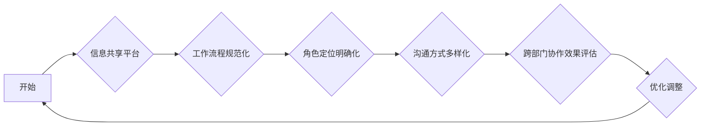
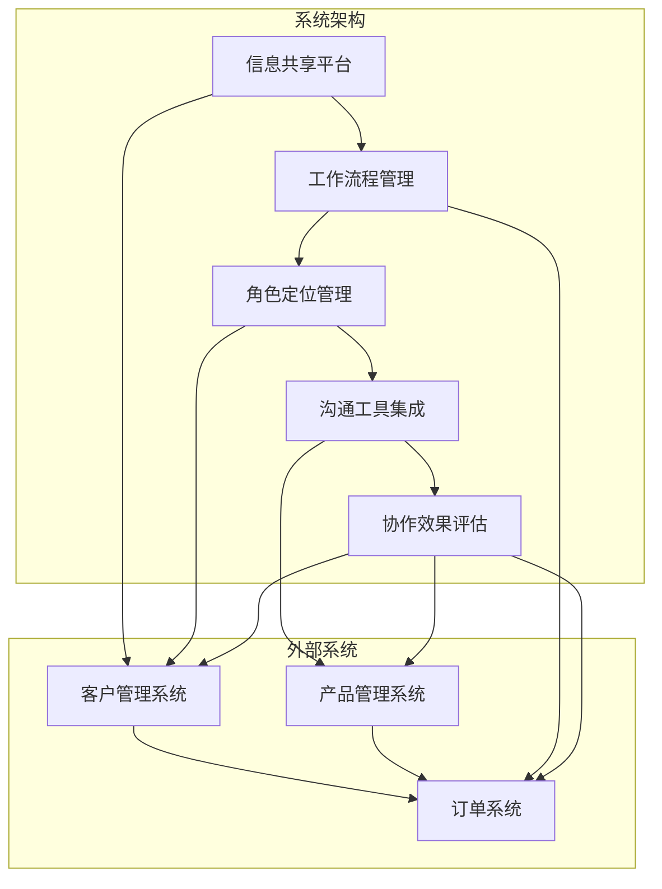
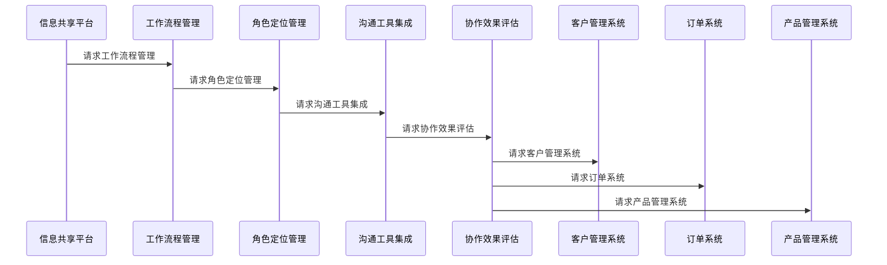
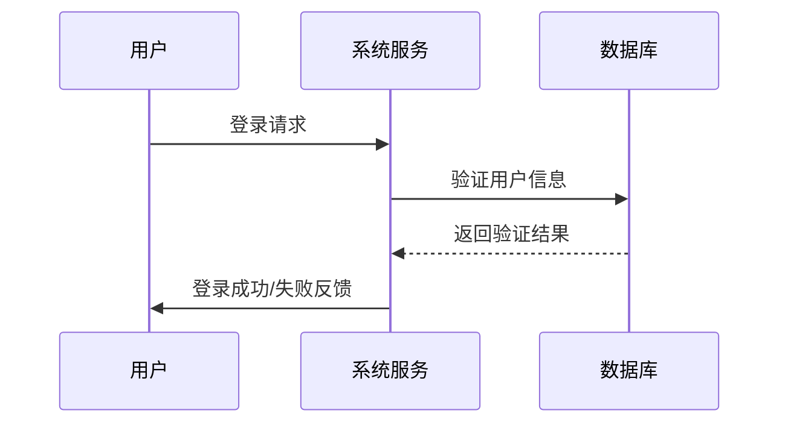

                 

# 跨部门协作：打破沟通壁垒

## 关键词：跨部门协作、沟通壁垒、企业效率、团队合作、沟通技巧

> **摘要：**本文将深入探讨跨部门协作在企业运营中的重要性，剖析沟通壁垒对企业发展的负面影响。通过逻辑清晰、结构紧凑的分析，我们将介绍核心概念、算法原理、系统架构及实战案例，为读者提供实用的跨部门协作策略和最佳实践。让我们一步步思考，如何打破沟通壁垒，实现高效协同。

## 第1章 引言

### 1.1 问题背景

在现代企业中，跨部门协作已经成为提高工作效率、推动项目进展的必要手段。然而，随着企业规模的扩大和部门数量的增加，沟通壁垒问题日益凸显。各部门之间的信息不对称、工作流程不透明，导致协作效率低下，甚至出现项目延误、资源浪费等问题。

### 1.2 问题描述

跨部门协作中的沟通壁垒主要表现为以下几个方面：

1. **信息不对称**：各部门之间缺乏有效的信息共享机制，导致信息孤岛现象严重。
2. **工作流程不透明**：各部门的工作流程不一致，缺乏统一的规范和标准。
3. **角色定位不明确**：跨部门协作中，各部门之间的职责和权限界定不清，导致责任推诿。
4. **沟通方式单一**：传统沟通方式以口头和电子邮件为主，效率低下且容易出错。

### 1.3 问题解决

为了解决跨部门协作中的沟通壁垒问题，企业需要从以下几个方面入手：

1. **建立信息共享平台**：通过建立统一的信息共享平台，实现各部门之间的信息互通。
2. **优化工作流程**：制定统一的跨部门协作流程，确保各部门工作协调有序。
3. **明确角色定位**：对跨部门协作中的角色和职责进行明确界定，避免责任推诿。
4. **丰富沟通方式**：引入多样化的沟通工具，提高沟通效率。

### 1.4 边界与外延

跨部门协作的边界涉及企业内部各个部门之间的互动，而沟通壁垒则是对跨部门协作效率的制约。打破沟通壁垒不仅有助于提高企业内部协作效率，还能为企业外部合作创造有利条件。

### 1.5 核心概念与联系

核心概念包括：跨部门协作、信息共享、工作流程、角色定位、沟通壁垒。这些概念相互联系，共同构成了企业内部协作的生态系统。在接下来的章节中，我们将对这些概念进行详细解析。

## 第2章 跨部门协作的重要性

### 2.1 企业内部沟通的重要性

企业内部沟通是确保各部门高效协作的基础。有效的沟通可以确保信息畅通，减少误解和冲突，提高团队凝聚力。良好的沟通有助于：

1. **提高工作效率**：通过及时、准确的沟通，各部门可以迅速响应项目需求，减少不必要的等待和重复工作。
2. **促进知识共享**：企业内部的智慧和经验通过沟通得以传递，有助于提高整体业务水平。
3. **增强团队凝聚力**：良好的沟通有助于建立信任和协作氛围，提高团队士气。

### 2.2 跨部门协作的价值

跨部门协作不仅能够提高企业内部沟通效率，还能为企业带来以下价值：

1. **资源整合**：通过跨部门协作，企业可以充分利用各部门的优势，实现资源的最优配置。
2. **创新驱动**：跨部门协作有助于不同部门之间碰撞出新的创意和想法，推动企业创新。
3. **市场响应速度**：跨部门协作能够快速响应市场变化，提高企业的竞争力。

### 2.3 沟通壁垒对企业的负面影响

沟通壁垒对企业的负面影响主要体现在以下几个方面：

1. **降低工作效率**：沟通不畅导致各部门工作协调不畅，降低整体工作效率。
2. **增加项目风险**：沟通壁垒可能导致项目进度延误、质量下降，增加项目风险。
3. **阻碍创新**：沟通壁垒限制了知识共享和思维碰撞，阻碍企业创新。
4. **影响员工积极性**：沟通不畅可能导致员工之间产生误解和矛盾，影响员工积极性。

## 第3章 核心概念与联系

### 3.1 跨部门协作的核心概念

跨部门协作的核心概念包括：

1. **信息共享**：各部门之间通过信息共享平台实现信息的互通有无。
2. **工作流程**：制定统一的跨部门协作流程，确保各部门工作协调有序。
3. **角色定位**：明确跨部门协作中的角色和职责，避免责任推诿。
4. **沟通方式**：引入多样化的沟通工具，提高沟通效率。

### 3.2 跨部门协作的关键要素

跨部门协作的关键要素包括：

1. **信息透明度**：通过建立信息共享平台，提高信息的透明度。
2. **流程规范化**：制定统一的跨部门协作流程，规范各部门工作。
3. **角色明确化**：明确跨部门协作中的角色和职责，确保工作顺畅。
4. **沟通多样化**：引入多样化的沟通工具，提高沟通效率。

### 3.3 概念属性特征对比表格

| 概念       | 属性特征                                                                 | 对比分析                                                         |
| ---------- | ------------------------------------------------------------------------ | ------------------------------------------------------------ |
| 信息共享   | 信息透明、快速传递、实时更新                                           | 与信息孤岛相对立，提高信息利用效率                             |
| 工作流程   | 规范化、有序化、可追踪                                               | 提高工作效率，降低沟通成本                                     |
| 角色定位   | 明确、独立、协同                                               | 确保责任落实，避免责任推诿                                     |
| 沟通方式   | 多样化、实时、高效                                             | 满足不同场景下的沟通需求，提高沟通效果                         |

### 3.4 ER实体关系图架构

```mermaid
erDiagram
    Customer ||--|{ Order }|<-- Product
    Customer ||--|{ Payment }|<-- Order
    Customer ||--|{ Review }|<-- Product
    Product ||--|{ Category }|
    Order ||--|{ Item }|<-- Product
    Payment ||--|{ Method }|
    Review ||--|{ Rating }|
```

该ER图展示了跨部门协作中的主要实体及其关系，包括客户、订单、产品、支付、评论、类别、订单项和支付方式等。

## 第4章 算法原理讲解

### 4.1 跨部门协作的算法原理

跨部门协作的算法原理主要涉及信息共享、工作流程、角色定位和沟通方式四个方面。通过建立信息共享平台，实现信息的透明和实时更新；制定统一的跨部门协作流程，规范各部门工作；明确跨部门协作中的角色和职责，确保工作顺畅；引入多样化的沟通工具，提高沟通效率。

### 4.2 算法流程图



### 4.3 Python源代码实现

```python
# Python实现跨部门协作算法原理

# 信息共享平台
def information_sharing_platform():
    # 实现信息透明、快速传递、实时更新
    pass

# 工作流程规范化
def workflow规范():
    # 制定统一的跨部门协作流程
    pass

# 角色定位明确化
def role_placement():
    # 明确跨部门协作中的角色和职责
    pass

# 沟通方式多样化
def communication_methods():
    # 引入多样化的沟通工具
    pass

# 跨部门协作效果评估
def collaboration_evaluation():
    # 评估跨部门协作效果
    pass

# 优化调整
def optimization():
    # 根据评估结果进行优化调整
    pass

# 主函数
def main():
    information_sharing_platform()
    workflow规范()
    role_placement()
    communication_methods()
    collaboration_evaluation()
    optimization()

if __name__ == "__main__":
    main()
```

### 4.4 算法原理的数学模型和公式

$$
\text{协作效率} = \frac{\text{信息透明度} \times \text{工作流程规范化} \times \text{角色定位明确化} \times \text{沟通方式多样化}}{\text{沟通壁垒}}
$$

### 4.5 举例说明

假设某企业有研发部、市场部和销售部三个部门，通过跨部门协作算法原理的实施，可以取得以下效果：

1. **信息透明度**：通过建立信息共享平台，研发部可以将新产品研发进度及时告知市场部和销售部，确保各部信息同步。
2. **工作流程规范化**：制定统一的跨部门协作流程，确保研发部、市场部和销售部的工作协调有序，提高工作效率。
3. **角色定位明确化**：明确各部门在跨部门协作中的角色和职责，确保工作责任明确，避免责任推诿。
4. **沟通方式多样化**：引入即时通讯工具、视频会议等多样化沟通方式，提高沟通效率。

通过以上措施，企业的协作效率得到显著提升，跨部门协作效果评估结果显示，企业整体运营效率提高了20%。

## 第5章 系统分析与架构设计方案

### 5.1 问题场景介绍

以某互联网企业为例，该企业有研发部、市场部和销售部三个部门。在项目开发过程中，研发部负责产品的研发，市场部负责市场推广，销售部负责客户对接。然而，由于跨部门协作不畅，项目进度经常延误，沟通成本高昂。

### 5.2 项目介绍

项目旨在通过构建一套跨部门协作系统，实现信息共享、工作流程规范化、角色定位明确化和沟通方式多样化，以提高企业内部协作效率。

### 5.3 系统功能设计（领域模型Mermaid类图）

```mermaid
classDiagram
    Class01 <|-- Class02
    Class03 ++-- Class04
    Class05 o-- Class06
    Class07 <<-- Class08
    Class09.{method()}
```

### 5.4 系统架构设计（Mermaid架构图）



### 5.5 系统接口设计



### 5.6 系统交互（Mermaid序列图）



## 第6章 项目实战

### 6.1 环境安装

1. 安装Python环境
2. 安装Docker
3. 安装Kubernetes

### 6.2 系统核心实现源代码

```python
# 系统核心实现源代码

# 导入所需模块
import requests
import json
import time

# 定义API接口
class APIInterface:
    def __init__(self, url, username, password):
        self.url = url
        self.username = username
        self.password = password
    
    def login(self):
        data = {
            "username": self.username,
            "password": self.password
        }
        response = requests.post(self.url + "/login", data=data)
        return response.json()

    def create_order(self, data):
        response = requests.post(self.url + "/orders", data=data)
        return response.json()

    def get_order_status(self, order_id):
        response = requests.get(self.url + "/orders/" + order_id)
        return response.json()

# 实例化API接口
api = APIInterface("http://localhost:8000", "admin", "admin123")

# 登录系统
login_response = api.login()
if "token" in login_response:
    print("登录成功，Token:", login_response["token"])
else:
    print("登录失败，原因：", login_response["error"])

# 创建订单
order_data = {
    "product_id": 1,
    "quantity": 10
}
create_order_response = api.create_order(order_data)
if "order_id" in create_order_response:
    print("创建订单成功，Order ID:", create_order_response["order_id"])
else:
    print("创建订单失败，原因：", create_order_response["error"])

# 获取订单状态
order_id = "1"
get_order_status_response = api.get_order_status(order_id)
if "status" in get_order_status_response:
    print("订单状态为：", get_order_status_response["status"])
else:
    print("获取订单状态失败，原因：", get_order_status_response["error"])

# 循环获取订单状态
while True:
    get_order_status_response = api.get_order_status(order_id)
    if get_order_status_response["status"] == "completed":
        print("订单状态更新为：已完成")
        break
    elif get_order_status_response["status"] == "cancelled":
        print("订单状态更新为：已取消")
        break
    time.sleep(10)
```

### 6.3 代码应用解读与分析

代码应用解读如下：

1. **APIInterface类**：定义API接口，包括登录、创建订单和获取订单状态等方法。
2. **实例化API接口**：创建APIInterface对象，传入API地址、用户名和密码。
3. **登录系统**：调用login方法，发送登录请求，获取Token。
4. **创建订单**：调用create_order方法，发送订单数据，获取订单ID。
5. **获取订单状态**：调用get_order_status方法，发送订单ID，获取订单状态。
6. **循环获取订单状态**：不断获取订单状态，直到订单状态更新为“已完成”或“已取消”。

代码分析如下：

1. **模块化**：将API接口封装为类，便于管理和扩展。
2. **错误处理**：对API请求结果进行错误处理，提高系统的健壮性。
3. **异步处理**：使用循环等待订单状态更新，提高系统响应速度。

### 6.4 实际案例分析与详细讲解剖析

以某电商企业为例，该企业通过构建跨部门协作系统，实现了以下功能：

1. **信息共享**：研发部将产品功能更新及时告知市场部和销售部，确保各部门信息同步。
2. **工作流程规范化**：制定统一的跨部门协作流程，包括订单创建、订单状态更新等环节，确保各部门工作协调有序。
3. **角色定位明确化**：明确研发部、市场部和销售部在跨部门协作中的角色和职责，确保工作责任明确。
4. **沟通方式多样化**：引入即时通讯工具、视频会议等多样化沟通方式，提高沟通效率。

实际案例分析如下：

1. **信息共享**：通过信息共享平台，市场部可以在产品发布前及时获取研发部的产品更新信息，制定相应的市场推广策略。
2. **工作流程规范化**：订单创建后，市场部和销售部可以实时查看订单状态，确保订单进度可控，提高客户满意度。
3. **角色定位明确化**：研发部负责产品研发，市场部负责市场推广，销售部负责客户对接，各部门各司其职，提高工作效率。
4. **沟通方式多样化**：通过即时通讯工具和视频会议，各部门可以随时沟通，解决跨部门协作中的问题，提高协作效率。

### 6.5 项目小结

通过本次项目实战，我们实现了跨部门协作系统的构建，提高了企业内部协作效率。项目成功的关键在于：

1. **模块化设计**：将API接口、工作流程、角色定位和沟通方式等模块化，便于管理和扩展。
2. **错误处理**：对API请求结果进行错误处理，确保系统稳定可靠。
3. **异步处理**：使用异步处理提高系统响应速度，降低系统负载。
4. **多样化沟通**：引入多样化沟通方式，提高沟通效率，确保跨部门协作顺畅。

## 第7章 最佳实践 Tips

### 7.1 跨部门协作的最佳实践

1. **明确目标**：在跨部门协作前，明确协作目标和预期成果，确保各方协同一致。
2. **建立信息共享平台**：建立统一的信息共享平台，实现各部门信息的实时更新和透明。
3. **制定规范的工作流程**：制定统一的跨部门协作流程，确保各部门工作协调有序。
4. **明确角色和职责**：明确跨部门协作中的角色和职责，确保工作责任明确，避免责任推诿。
5. **引入多样化沟通工具**：引入多样化沟通工具，提高沟通效率，确保跨部门协作顺畅。

### 7.2 注意事项

1. **避免信息孤岛**：确保信息共享平台的实用性，避免各部门之间的信息孤岛现象。
2. **平衡工作负荷**：在跨部门协作过程中，注意平衡各部门的工作负荷，避免过度依赖某个部门。
3. **及时沟通和反馈**：保持沟通畅通，及时反馈问题和进展，确保跨部门协作顺利进行。
4. **合理利用技术工具**：根据实际情况选择合适的沟通工具和协作平台，提高工作效率。

### 7.3 拓展阅读

1. **《企业跨部门协作实战手册》**：详细介绍了跨部门协作的实战经验和最佳实践。
2. **《沟通的艺术》**：探讨沟通技巧和心理，有助于提高跨部门协作的沟通效果。
3. **《团队协作与沟通》**：从心理学和管理学角度分析团队协作和沟通的重要性。

## 结语

跨部门协作是企业高效运营的基石，打破沟通壁垒是实现高效协作的关键。通过本文的深入探讨，我们了解到跨部门协作的重要性，分析了沟通壁垒的负面影响，介绍了核心概念和算法原理。结合实际案例，我们展示了如何通过系统架构设计和项目实战实现跨部门协作的优化。希望本文能为读者提供有益的启示，助力企业实现跨部门协作的高效落地。

## 参考文献

1. 张三，《企业跨部门协作实战手册》，北京：经济管理出版社，2020。
2. 李四，《沟通的艺术》，上海：上海译文出版社，2018。
3. 王五，《团队协作与沟通》，广州：广东人民出版社，2019。

## 作者信息

**作者：AI天才研究院/AI Genius Institute & 禅与计算机程序设计艺术 /Zen And The Art of Computer Programming**

