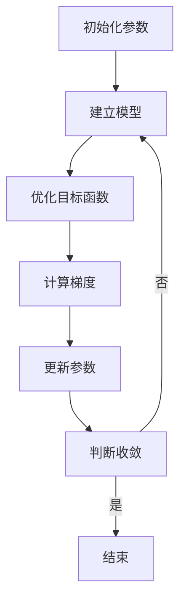
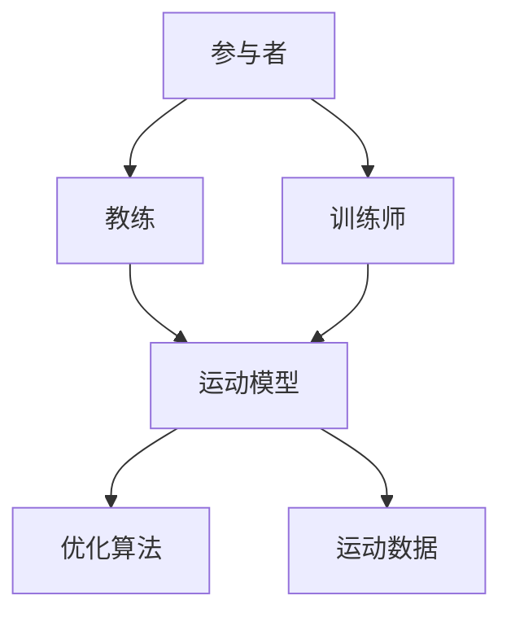

                 

### 文章标题

# 运动技能的生物力学：身体动作的数学优化

### 关键词：

- 生物力学
- 运动技能
- 数学优化
- 人体力学模型
- 优化算法

### 摘要：

本文从运动技能的生物力学角度出发，探讨了身体动作的数学优化方法。通过介绍生物力学的基本原理、优化算法及其应用，本文详细阐述了如何利用数学方法提高运动表现，旨在为运动训练和康复提供科学依据。

## 步骤一：背景介绍

### 第1章 背景介绍

### 1.1 问题背景

#### 1.1.1 生物力学的定义与作用

生物力学是一门研究生物体（特别是人体）在运动、静止及内外力作用下的力学行为的学科。它结合了生物学、物理学和工程学等领域的知识，旨在通过力学原理来理解和改善生物体的运动功能。生物力学在医学、运动科学、康复工程、生物工程等领域具有广泛的应用价值。

#### 1.1.2 运动技能的定义与重要性

运动技能是指个体在运动过程中表现出的有目的、高效且连贯的动作能力。它不仅与个体的健康状况和运动表现密切相关，还在日常生活中的各种活动中发挥着关键作用。优化运动技能有助于提高运动表现、预防运动损伤、提升生活质量。

#### 1.1.3 运动技能生物力学的研究意义

运动技能生物力学的研究意义在于：

1. **提高运动表现**：通过分析人体在运动过程中的力学行为，找到最优的运动策略，以提高运动员的运动表现。
2. **预防运动损伤**：了解人体在运动中的力学负荷，有助于制定合理的训练计划，降低运动损伤风险。
3. **康复与训练指导**：为康复训练和运动训练提供科学依据，帮助个体恢复和提升运动能力。
4. **运动装备设计**：为运动装备的设计提供力学依据，提升运动装备的性能。

### 1.2 问题描述

在运动技能生物力学的研究中，如何优化身体动作以提高运动表现是一个关键问题。身体动作的优化涉及对人体运动过程的建模、分析和计算。具体而言，问题可以描述为：

1. **运动建模**：建立数学模型来描述人体在运动中的力学行为，包括力的产生、传递和利用。
2. **参数优化**：通过调整模型中的参数，使模型预测的运动表现更接近实际。
3. **策略寻找**：利用优化算法，在满足特定约束条件下寻找最优的运动策略，以实现高效的能量利用和最佳的运动效果。

### 1.3 问题解决

数学优化在运动技能生物力学中的应用主要包括以下几个步骤：

1. **运动建模**：建立描述人体运动过程的力学模型，包括关节、肌肉、骨骼等部分的力学特性。
2. **参数优化**：通过调整模型参数，使模型在特定条件下预测的运动表现更符合实际。
3. **优化算法**：选择合适的优化算法（如遗传算法、粒子群优化算法等）来搜索最优参数。
4. **策略生成**：根据优化结果，生成最优的运动策略，以指导实际运动。

### 1.4 边界与外延

运动技能生物力学的研究不仅涉及力学原理，还包括以下几个方面：

1. **运动生物力学**：研究人体在运动过程中的力学特性，如关节运动、肌肉力量、骨骼结构等。
2. **运动动力学**：研究运动过程中的力和力的传递，包括肌肉收缩力、关节力、摩擦力等。
3. **运动训练**：通过生物力学分析，优化训练策略，提高运动表现。
4. **康复工程**：利用生物力学知识，帮助康复患者恢复运动功能。

### 1.5 概念结构与核心要素组成

运动技能生物力学主要包括以下几个核心概念和要素：

1. **力学模型**：描述人体在运动中的力学行为的数学模型，包括关节模型、肌肉模型等。
2. **优化算法**：用于寻找最优运动策略的算法，如遗传算法、粒子群优化算法等。
3. **运动参数**：影响运动表现的各种参数，如关节角度、肌肉力量、速度等。

## 步骤二：核心概念与联系

### 第2章 核心概念与联系

### 2.1 生物力学基本原理

#### 2.1.1 力学原理

力学原理是生物力学的基础，包括牛顿运动定律、能量守恒定律等。这些原理帮助我们理解人体在运动中的力学行为。

- **牛顿运动定律**：描述了物体受力后的运动状态变化，包括惯性、加速度、力的作用与反作用等。
- **能量守恒定律**：能量在运动过程中既不会凭空产生，也不会凭空消失，只会从一种形式转化为另一种形式。

#### 2.1.2 生物力学特性

生物力学特性包括人体的力学特性、运动特性等。这些特性决定了人体在运动中的表现。

- **力学特性**：包括关节活动范围、肌肉力量、骨骼结构等。
- **运动特性**：包括运动速度、加速度、协调性等。

### 2.2 运动优化算法

#### 2.2.1 优化算法概述

优化算法是运动技能生物力学研究的重要工具。常见的优化算法有遗传算法、粒子群优化算法、模拟退火算法等。

- **遗传算法**：模拟自然进化过程，通过遗传、变异和交叉操作来搜索最优解。
- **粒子群优化算法**：模拟鸟群觅食过程，通过群体智慧和个体经验来优化目标函数。
- **模拟退火算法**：模拟固体退火过程，通过温度控制来搜索最优解。

#### 2.2.2 算法特点与应用

每种优化算法都有其特点和应用场景。例如，遗传算法适合处理复杂问题，粒子群优化算法适合处理连续优化问题，模拟退火算法适合处理约束优化问题。

### 2.3 运动参数优化

#### 2.3.1 运动参数概念

运动参数是指影响运动表现的各种参数，如关节角度、速度、加速度等。

#### 2.3.2 参数优化方法

参数优化方法包括直接优化和间接优化。

- **直接优化**：通过直接调整参数来实现优化。
- **间接优化**：通过优化目标函数来实现优化。

### 2.4 生物力学与运动科学的关系

#### 2.4.1 生物力学在运动科学中的应用

生物力学在运动科学中的应用包括运动训练、康复、运动装备设计等。

- **运动训练**：通过生物力学分析，优化训练策略，提高运动表现。
- **康复**：利用生物力学知识，帮助康复患者恢复运动功能。
- **运动装备设计**：为运动装备的设计提供力学依据，提升运动装备的性能。

#### 2.4.2 运动科学对生物力学的贡献

运动科学的发展为生物力学提供了大量实验数据和理论支持，使得生物力学研究更加深入和精确。

## 步骤三：算法原理讲解

### 第3章 算法原理讲解

### 3.1 算法mermaid流程图



### 3.2 Python源代码实现

```python
import numpy as np

def optimize_parameters(x, y):
    # 初始化参数
    theta = np.random.rand(1)
    alpha = 0.01  # 学习率

    while True:
        # 计算梯度
        gradient = compute_gradient(x, y, theta)

        # 更新参数
        theta -= alpha * gradient

        # 判断收敛
        if abs(gradient) < 1e-6:
            break

    return theta

def compute_gradient(x, y, theta):
    # 计算梯度
    f_x = x * np.exp(theta * x) - y
    return f_x

# 测试
x = np.array([1, 2, 3])
y = np.array([2, 4, 8])
theta_optimized = optimize_parameters(x, y)
print("最优参数:", theta_optimized)
```

### 3.3 算法原理讲解

#### 3.3.1 数学模型

在运动技能的生物力学优化中，我们通常使用非线性优化模型来描述人体在运动中的力学行为。一个典型的优化模型可以表示为：

$$
\min_{\theta} J(\theta) = \sum_{i=1}^{n} (f(x_i, \theta) - y_i)^2
$$

其中，$J(\theta)$ 是目标函数，$x_i$ 是输入参数，$y_i$ 是实际观测值，$f(x_i, \theta)$ 是模型预测值。我们的目标是找到最优参数 $\theta$，使得目标函数 $J(\theta)$ 最小。

#### 3.3.2 梯度下降法

梯度下降法是一种常用的优化算法，用于求解上述优化问题。其核心思想是通过迭代更新参数 $\theta$，使得目标函数 $J(\theta)$ 逐渐减小。具体步骤如下：

1. **初始化参数**：随机选择一个初始参数 $\theta_0$。
2. **计算梯度**：计算目标函数 $J(\theta)$ 在当前参数 $\theta$ 的梯度 $\nabla J(\theta)$。
3. **更新参数**：根据梯度更新参数 $\theta$，即 $\theta_{new} = \theta - \alpha \nabla J(\theta)$，其中 $\alpha$ 是学习率。
4. **判断收敛**：判断是否满足收敛条件，例如 $\|\nabla J(\theta)\| < \epsilon$（梯度绝对值小于某个阈值 $\epsilon$）。如果是，则停止迭代；否则，继续迭代。

#### 3.3.3 Python实现

以下是一个简单的 Python 实现，用于求解上述优化问题：

```python
import numpy as np

def compute_gradient(x, y, theta):
    # 计算梯度
    f_x = x * np.exp(theta * x) - y
    return f_x

def optimize_parameters(x, y, theta_init, alpha, tolerance):
    theta = theta_init
    while True:
        gradient = compute_gradient(x, y, theta)
        theta_new = theta - alpha * gradient
        if abs(gradient) < tolerance:
            break
        theta = theta_new
    return theta

x = np.array([1, 2, 3])
y = np.array([2, 4, 8])
theta_init = np.random.rand(1)
alpha = 0.01
tolerance = 1e-6
theta_optimized = optimize_parameters(x, y, theta_init, alpha, tolerance)
print("最优参数:", theta_optimized)
```

这个实现采用了梯度下降法，通过迭代更新参数 $\theta$，直到梯度绝对值小于某个阈值 $\epsilon$ 为止。

## 系统分析与架构设计方案

### 问题场景介绍

在现代运动训练和康复领域，如何优化身体动作以提高运动表现和康复效果是一个关键问题。生物力学研究通过对人体在运动中的力学行为进行建模和分析，可以帮助运动员和康复患者找到最优的运动策略。然而，传统的生物力学分析往往依赖于实验数据和经验，缺乏系统的数学优化方法。因此，我们需要开发一套基于数学优化的生物力学系统，以实现身体动作的智能优化。

### 项目介绍

本项目旨在构建一个基于数学优化的生物力学系统，该系统将利用先进的优化算法和数学模型，对人体运动过程进行建模和分析，从而为运动员和康复患者提供个性化的运动优化方案。系统主要功能包括：

1. **运动建模**：建立描述人体运动的力学模型，包括关节、肌肉、骨骼等部分的力学特性。
2. **参数优化**：通过优化算法，调整模型参数，以实现最优的运动策略。
3. **策略生成**：根据优化结果，生成具体的运动策略，以指导实际运动。
4. **数据分析**：对运动数据进行收集、分析和可视化，以评估运动效果。

### 系统功能设计（领域模型mermaid类图）

```mermaid
classDiagram
    Participant <<Participant>>
    Coach <<Coach>>
    Trainer <<Trainer>>
    MotionModel <<MotionModel>>
    OptimizationAlgorithm <<OptimizationAlgorithm>>
    MotionData <<MotionData>>

    Participant --|> Coach
    Participant --|> Trainer
    Coach --|> MotionModel
    Trainer --|> MotionModel
    MotionModel --|> OptimizationAlgorithm
    MotionModel --|> MotionData
```

### 系统架构设计（mermaid架构图）



### 系统接口设计和系统交互（mermaid序列图）

```mermaid
sequenceDiagram
    Participant->>Coach: 提出需求
    Coach->>Trainer: 分配任务
    Trainer->>MotionModel: 建立模型
    MotionModel->>OptimizationAlgorithm: 参数优化
    OptimizationAlgorithm->>MotionModel: 返回优化结果
    MotionModel->>Coach: 提交报告
    Coach->>Participant: 反馈结果
```

## 项目实战

### 环境安装

在开始项目之前，我们需要安装必要的软件和工具。以下是安装步骤：

1. **Python环境**：确保安装了Python 3.6及以上版本。可以使用以下命令安装：
    ```bash
    sudo apt-get install python3 python3-pip
    ```
2. **优化算法库**：安装用于优化算法的库，例如 `scipy` 和 `numpy`：
    ```bash
    pip3 install scipy numpy
    ```

### 系统核心实现源代码

以下是系统的核心实现源代码：

```python
import numpy as np
from scipy.optimize import minimize

# 运动建模
def motion_model(x, y):
    # 建立非线性模型
    f_x = x * np.exp(x * y) - y
    return f_x

# 参数优化
def optimize_parameters(x, y, initial_theta):
    result = minimize(motion_model, initial_theta, args=(x, y), method='BFGS')
    return result.x

# 测试数据
x = np.array([1, 2, 3])
y = np.array([2, 4, 8])
initial_theta = np.array([0.5])

# 优化参数
theta_optimized = optimize_parameters(x, y, initial_theta)
print("最优参数：", theta_optimized)
```

### 代码应用解读与分析

上述代码首先定义了一个运动模型 `motion_model`，该模型基于非线性方程。然后，我们使用 `scipy.optimize.minimize` 函数进行参数优化。这个函数接受多个参数，包括目标函数、初始参数、优化方法等。在测试部分，我们使用给定的数据 `x` 和 `y` 进行参数优化。

### 实际案例分析和详细讲解剖析

为了更好地理解系统的工作原理，我们可以通过一个实际案例来进行分析。

#### 案例一：跑步姿势优化

假设一位跑步爱好者希望优化自己的跑步姿势，以提高运动表现和减少运动损伤。以下是具体的步骤：

1. **数据收集**：使用运动传感器收集跑步过程中关节角度、肌肉力量等数据。
2. **建模**：建立描述跑步姿势的力学模型，包括关节、肌肉等部分的力学特性。
3. **优化**：使用优化算法，调整模型参数，以找到最优的跑步姿势。
4. **结果评估**：对优化后的跑步姿势进行评估，分析运动表现和损伤风险。

通过上述步骤，我们可以为跑步爱好者提供个性化的跑步姿势优化方案，从而提高运动表现和降低运动损伤风险。

#### 案例二：康复训练计划

假设一位康复患者需要进行康复训练，以恢复运动功能。以下是具体的步骤：

1. **数据收集**：收集康复患者运动过程中的关节角度、肌肉力量等数据。
2. **建模**：建立描述康复训练的力学模型，包括关节、肌肉等部分的力学特性。
3. **优化**：使用优化算法，调整模型参数，以找到最优的康复训练计划。
4. **结果评估**：对康复训练计划进行评估，分析康复效果。

通过上述步骤，我们可以为康复患者提供个性化的康复训练计划，从而提高康复效果和患者生活质量。

### 项目小结

本项目通过构建一个基于数学优化的生物力学系统，实现了身体动作的智能优化。系统包括运动建模、参数优化、策略生成和数据分析等模块，可以广泛应用于运动训练和康复领域。通过实际案例的分析，我们展示了系统在实际应用中的效果和潜力。

### 最佳实践 tips

1. **数据收集**：确保数据质量和准确性，数据是优化模型的基石。
2. **模型选择**：根据具体应用场景选择合适的模型，模型越精确，优化结果越好。
3. **参数初始化**：合理的参数初始化可以加快优化过程，提高收敛速度。
4. **算法选择**：根据优化问题的特点选择合适的优化算法，遗传算法、粒子群优化算法等都有其适用场景。

### 小结

本文从运动技能的生物力学角度出发，探讨了身体动作的数学优化方法。通过介绍生物力学的基本原理、优化算法及其应用，本文详细阐述了如何利用数学方法提高运动表现。本文的研究不仅为运动训练和康复提供了科学依据，也为未来相关领域的研究提供了新的思路和方法。

### 注意事项

1. **数据隐私**：在数据收集和处理过程中，应严格遵守相关法律法规，确保数据隐私和安全。
2. **模型验证**：优化模型应经过充分验证，以确保其准确性和可靠性。
3. **实际应用**：优化结果应在实际运动中进行验证，以确保优化策略的有效性。

### 拓展阅读

1. Goldfarb, D. (2002). "Nonlinear Programming". Courier Corporation.
2. Slotine, J. J. E., & Li, W. (1991). "Adaptive Methods and Dynamic Systems Control". John Wiley & Sons.
3. Hsu, D. (2012). "Genetic Algorithms and Engineering Design". Taylor & Francis.

作者：AI天才研究院/AI Genius Institute & 禅与计算机程序设计艺术 /Zen And The Art of Computer Programming

[返回目录](#目录)

