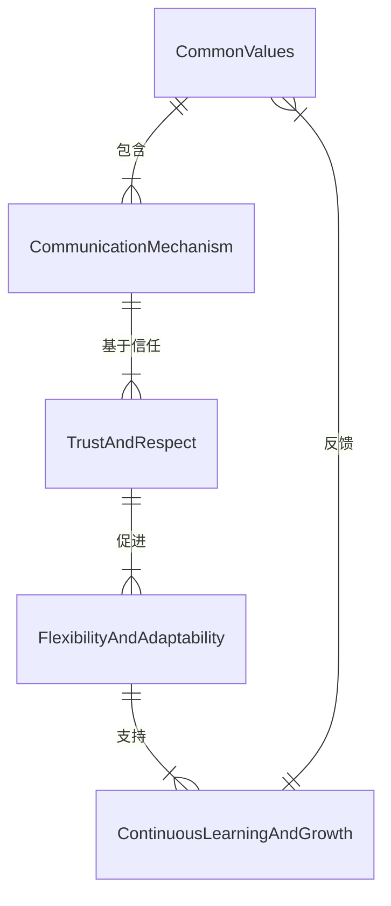

                 

# 远程团队文化：建立虚拟团队凝聚力的策略

## 关键词
远程工作、团队文化、虚拟团队、团队凝聚力、沟通策略、领导力、团队建设

## 摘要
随着数字化时代的到来，远程工作已成为许多企业和组织的常态。然而，远程工作所带来的挑战，如沟通障碍、文化差异和团队凝聚力不足等，也日益凸显。本文旨在探讨远程团队文化的建立，提供一系列策略，以增强虚拟团队的凝聚力，提升团队效能。文章分为以下几个部分：首先，我们将介绍远程团队文化的重要性；接着，分析远程团队面临的挑战；然后，探讨核心概念及其联系；随后，介绍团队沟通策略、领导力与远程团队、团队建设策略；最后，通过实践案例展示策略实施效果，并总结全文，提供拓展阅读建议。

## 目录大纲

### 引言
- 远程工作的背景与现状
- 远程团队文化的定义与重要性

### 远程团队面临的挑战
- 沟通障碍
- 文化差异
- 工作动力与监督

### 核心概念与联系
- 远程团队文化的核心概念
- 关键概念属性特征对比表格
- ER实体关系图

### 团队沟通策略
- 远程沟通的重要性
- 沟通工具与方法
- 沟通障碍与解决策略

### 领导力与远程团队
- 领导者在远程团队中的角色
- 领导力模型在远程团队中的应用
- 领导者如何激发远程团队的潜力

### 团队建设策略
- 团队建设的重要性
- 团队建设方法与技巧
- 团队活动与互动

### 实践案例与策略实施
- 案例介绍
- 案例分析
- 案例启示

### 总结与拓展
- 全文总结
- 最佳实践 tips
- 小结与注意事项
- 拓展阅读建议

### 引言

### 远程工作的背景与现状

在过去的几十年中，远程工作逐渐成为现代工作模式的重要组成部分。随着互联网技术的迅猛发展，远程工作已经不再是一种奢望，而是一种可行的、常态化的工作方式。越来越多的企业和组织开始采用远程工作模式，以提高工作效率、降低成本、吸引和保留人才。

#### 远程工作的定义与类型

远程工作（Remote Work）通常指的是在非传统工作场所进行的任务和工作。根据工作地点和方式，远程工作可以分为以下几种类型：

1. **在家工作**：员工在家中完成工作任务，这是最常见的远程工作形式。
2. **移动办公**：员工在不同的地点，如咖啡店、图书馆或办公室之外的其他场所工作。
3. **远程团队协作**：团队中的成员分布在不同地区，通过网络和工具进行协作。
4. **混合办公**：部分员工在办公室工作，部分员工远程工作，两者相结合。

#### 远程工作的兴起原因

远程工作的兴起主要受到以下几个因素的影响：

1. **技术进步**：互联网和通信技术的发展，使得远程工作变得更加便捷和高效。
2. **经济压力**：企业为了降低成本、提高效率，开始寻求减少办公室租赁和日常运营费用的方法。
3. **员工需求**：现代员工越来越注重工作与生活的平衡，灵活的工作安排能够满足这一需求。
4. **全球化和虚拟化**：全球化带来的业务拓展和虚拟化技术的普及，使得远程工作成为可能。

#### 远程团队文化的定义与重要性

远程团队文化是指远程团队成员在共同工作中形成的共同价值观、行为规范和工作方式。一个良好的远程团队文化能够促进团队成员之间的沟通与合作，提高团队的整体效能。以下是远程团队文化的重要性：

1. **增强团队凝聚力**：通过共同的价值观和目标，团队成员之间能够形成紧密的联系，增强团队凝聚力。
2. **提升工作效率**：明确的沟通和协作机制，能够提高团队的工作效率，减少误解和冲突。
3. **促进创新与协作**：远程工作环境能够激发员工的创新思维，促进团队成员之间的知识共享和协作。
4. **降低员工流失率**：良好的远程团队文化能够提高员工的工作满意度和忠诚度，降低员工流失率。

综上所述，远程团队文化不仅是对远程工作的一种适应，更是提升团队效能和员工满意度的重要保障。在接下来的部分中，我们将深入探讨远程团队面临的挑战，以及如何建立和维护远程团队文化。

### 远程团队面临的挑战

尽管远程工作有许多优势，但它也带来了诸多挑战，特别是在团队文化和凝聚力方面。以下是远程团队面临的几个主要挑战：

#### 沟通障碍

沟通是团队协作的核心，而远程团队在沟通上面临诸多障碍。首先，时区差异会影响到沟通的及时性和效率。不同地区的工作时间不同，可能会导致信息传递延迟。其次，语言和文化差异也可能导致误解和沟通不畅。团队成员可能来自不同的文化背景，有不同的沟通方式和习惯，这会增加沟通的复杂性。

**解决方案**：为了克服沟通障碍，远程团队可以采用以下策略：

1. **统一沟通工具**：选择一套高效的沟通工具，如Slack、Microsoft Teams或Zoom，确保所有团队成员都能顺畅地交流。
2. **建立定期会议**：定期召开会议，确保团队成员能够及时沟通进展、解决问题。
3. **提供跨文化培训**：为团队成员提供跨文化沟通培训，帮助他们了解和适应不同的文化背景和沟通习惯。

#### 文化差异

文化差异是远程团队面临的一大挑战。团队成员来自不同的地区，拥有不同的教育背景、价值观和工作方式，这可能导致团队内部的冲突和误解。文化差异不仅影响沟通，还可能影响团队的决策过程和执行力。

**解决方案**：为了应对文化差异，远程团队可以采取以下措施：

1. **文化敏感性培训**：为团队成员提供文化敏感性培训，帮助他们理解和尊重不同的文化。
2. **建立共同价值观**：明确团队的共同目标和价值观，确保所有成员都朝着同一个方向努力。
3. **加强团队建设**：通过定期的团队活动和互动，增强团队成员之间的联系和信任。

#### 工作动力与监督

远程工作环境下，员工的工作动力和自我监督能力成为关键因素。由于缺乏直接的监督，员工可能会感到孤独、缺乏动力，甚至产生拖延和怠工行为。

**解决方案**：为了激发工作动力和确保自我监督，远程团队可以采取以下策略：

1. **设定明确目标**：为员工设定明确的工作目标和预期成果，确保他们知道自己的职责和任务。
2. **提供反馈和认可**：定期给予员工反馈和认可，鼓励他们保持工作动力。
3. **利用技术工具**：使用项目管理工具和进度追踪软件，帮助员工管理时间和任务，确保工作进度。

#### 工作平衡与压力管理

远程工作虽然提供了灵活的工作时间，但也可能导致工作与生活之间的边界模糊。员工可能会因为工作需要而牺牲个人时间，导致压力增加，甚至影响身心健康。

**解决方案**：为了平衡工作与生活，远程团队可以采取以下措施：

1. **鼓励休息和放松**：鼓励员工在工作间隙进行休息，确保他们有足够的时间放松和充电。
2. **提供心理健康支持**：为员工提供心理健康支持，如在线咨询和放松课程。
3. **明确工作时间**：明确工作时间和休息时间，确保员工能够在工作时间内完成任务，同时有足够的时间休息和与家人相处。

总之，远程团队在面对沟通障碍、文化差异、工作动力与监督、工作平衡与压力管理等问题时，需要采取有效的策略来解决。通过建立良好的沟通机制、文化敏感性、目标设定和心理健康支持，远程团队可以克服这些挑战，提升团队凝聚力和工作效能。在接下来的部分中，我们将深入探讨远程团队文化的核心概念，以及如何通过这些概念来增强团队的凝聚力。

### 核心概念与联系

在探讨远程团队文化时，理解以下几个核心概念及其相互联系是至关重要的。这些概念包括远程团队文化的定义、核心要素和它们之间的关系。

#### 远程团队文化的定义

远程团队文化是指一个虚拟工作团队在远程工作环境中形成的共同价值观、行为规范和工作方式。它不仅包括团队成员之间的互动和沟通方式，还涉及到团队如何处理工作、解决问题以及如何管理项目和任务。远程团队文化是建立高效远程团队的基础，它能够促进团队成员之间的信任、合作和凝聚力。

#### 核心要素

远程团队文化由几个关键要素组成，这些要素相互关联，共同构成一个完整的系统。以下是几个核心要素的简要介绍：

1. **共同价值观**：共同价值观是远程团队文化的基石，它为团队成员提供了共同的指导原则和目标。共同价值观可以帮助团队成员在面对挑战时保持一致，促进团队的协作和合作。
2. **沟通机制**：有效的沟通机制是远程团队文化的重要组成部分。远程团队需要依赖多种沟通工具和方法来保持信息的流通，确保团队成员能够及时获取和共享重要信息。
3. **信任与尊重**：信任和尊重是远程团队文化的关键要素。团队成员之间的信任和尊重能够促进开放的沟通和合作，减少误解和冲突。
4. **灵活性与适应性**：远程团队文化需要具备灵活性和适应性，以应对远程工作环境中不断变化的需求和挑战。灵活的工作安排和适应性的工作方式能够提高团队的工作效率和响应能力。
5. **持续学习与成长**：持续学习与成长是远程团队文化的一部分。远程团队成员需要不断学习新技能和知识，以适应快速变化的工作环境，同时也要鼓励团队成员之间的知识共享和经验交流。

#### 核心要素之间的联系

这些核心要素相互联系，共同构成了远程团队文化的整体框架。以下是这些要素之间的一些联系：

1. **共同价值观与沟通机制**：共同价值观为团队成员提供了沟通的基准和目标。一个明确的共同价值观可以促进团队成员之间的有效沟通，减少误解和冲突。
2. **信任与尊重与沟通机制**：信任和尊重是有效沟通的基础。团队成员之间的信任和尊重能够促进开放的沟通，使团队成员更容易分享信息和观点。
3. **灵活性与适应性**：灵活性和适应性是远程团队文化中不可或缺的要素。一个灵活的团队能够更好地适应远程工作环境中的变化，保持高效的沟通和协作。
4. **持续学习与成长**：持续学习与成长不仅能够提高团队成员的技能和知识，还能促进团队成员之间的知识共享和经验交流，增强团队的凝聚力和创新能力。

#### ER实体关系图

为了更直观地展示这些核心要素之间的联系，我们可以使用ER（实体关系）图来表示。以下是远程团队文化核心要素的ER图：

在这个ER图中，每个要素都表示为一个实体，它们之间的关系通过线条和箭头表示。这个图展示了各个核心要素之间的相互影响和依赖，帮助我们更好地理解远程团队文化的整体结构和运作机制。

总之，理解远程团队文化的核心概念和它们之间的联系是建立和维系一个高效远程团队的关键。通过明确共同价值观、建立有效的沟通机制、培养信任和尊重、保持灵活性和适应性，以及鼓励持续学习和成长，远程团队可以克服远程工作带来的挑战，实现更高的效能和团队凝聚力。

### 团队沟通策略

在远程团队中，沟通策略的选择和实施至关重要。有效的沟通不仅可以消除误解和冲突，还可以促进团队合作，提高工作效率。以下是一些关键的团队沟通策略：

#### 1. 定期会议

定期会议是远程团队沟通的基础。通过定期召开会议，团队成员可以共享信息、讨论问题、制定计划，并保持对项目进展的同步。以下是一些实施定期会议的建议：

- **固定时间**：选择一个固定的会议时间，让所有团队成员都能提前安排时间参加。
- **明确议程**：在会议前发送会议议程，确保所有成员了解会议的主题和目标。
- **有效会议管理**：会议应保持高效，避免冗长和无效的讨论。使用会议纪要记录重要决策和行动计划。

#### 2. 沟通工具的选择

选择合适的沟通工具是确保远程团队沟通顺畅的关键。以下是几种常用的沟通工具：

- **即时通讯工具**：如Slack、Microsoft Teams、WhatsApp等，用于日常交流和快速回复。
- **视频会议工具**：如Zoom、Skype、Google Meet等，用于面对面的沟通和讨论。
- **项目管理工具**：如Trello、Asana、Jira等，用于任务分配和进度跟踪。

#### 3. 跨文化沟通技巧

远程团队往往由来自不同文化背景的成员组成，因此，掌握跨文化沟通技巧至关重要。以下是一些跨文化沟通的建议：

- **了解文化差异**：了解团队成员的文化背景和沟通习惯，避免因文化差异导致的误解。
- **保持开放和尊重**：在沟通中保持开放心态，尊重不同的观点和意见。
- **使用清晰和简洁的语言**：使用简单、易懂的语言表达，避免使用专业术语或模糊的表述。
- **及时反馈和确认**：在沟通过程中，及时给予反馈和确认，确保信息的准确传达。

#### 4. 非正式沟通

非正式沟通对于建立团队关系和增强团队凝聚力同样重要。以下是一些促进非正式沟通的策略：

- **定期的团队活动**：组织定期的在线团队活动，如虚拟聚餐、运动比赛等，以增强团队成员之间的联系。
- **社交平台的使用**：使用专门的社交平台或群组，让团队成员可以分享个人兴趣和日常生活，增进了解和友谊。
- **定期的邮件或消息提醒**：在邮件或消息中，偶尔加入一些轻松的问候或祝福，以保持团队成员之间的温暖和联系。

#### 5. 沟通障碍与解决策略

远程团队在沟通中可能会遇到多种障碍，如技术问题、语言障碍和时间差异。以下是一些解决策略：

- **技术支持**：确保所有团队成员都能访问所需的沟通工具，并提供必要的技术支持。
- **使用翻译工具**：对于语言障碍，可以使用翻译工具或聘请翻译协助沟通。
- **调整会议时间**：考虑到时区差异，选择对团队成员都方便的时间进行会议。

总之，有效的团队沟通策略对于远程团队的成功至关重要。通过定期会议、选择合适的沟通工具、跨文化沟通技巧、非正式沟通和解决沟通障碍，远程团队可以建立高效的沟通机制，提高团队凝聚力和工作效率。

### 领导力与远程团队

在远程团队环境中，领导者的角色尤为重要。领导者不仅需要确保团队目标的实现，还要激励团队成员、管理冲突并提升整体效能。以下是领导者如何在远程团队中发挥关键作用的一些策略：

#### 1. 建立明确的团队目标

远程团队成员通常缺乏面对面的互动，因此，领导者需要确保团队目标明确且具体。通过设定清晰的短期和长期目标，可以帮助团队成员了解自己的职责和期望，从而提高工作动力和方向感。以下是一些步骤：

- **分解目标**：将大目标分解为可操作的小任务，使团队成员能够清晰地了解每个阶段的任务。
- **定期回顾**：定期召开会议，回顾团队的进度，确保团队成员朝着共同的目标前进。
- **提供反馈**：及时给予团队成员反馈，帮助他们了解自己的工作表现，并提供改进的建议。

#### 2. 激励团队成员

在远程环境中，领导者需要采取创新的激励策略来保持团队成员的积极性和工作动力。以下是一些激励团队成员的方法：

- **认可与奖励**：定期对团队成员的表现进行认可和奖励，这可以是一个表扬邮件、一个虚拟奖品或额外的休假时间。
- **提供发展机会**：为团队成员提供职业发展的机会，如参加培训课程或工作轮换，以激发他们的学习热情和职业成长。
- **灵活的工作安排**：提供灵活的工作时间和地点，让团队成员能够更好地平衡工作与生活。

#### 3. 管理冲突

远程团队中的冲突管理是一个复杂的过程，由于缺乏面对面的交流，冲突可能更加难以处理。以下是一些管理冲突的策略：

- **及时介入**：一旦发现冲突，领导者应立即介入，避免冲突升级。
- **倾听与理解**：在处理冲突时，领导者需要耐心倾听双方的意见，试图理解他们的观点和感受。
- **中立调解**：作为中立第三方，领导者应提出合理的解决方案，帮助双方达成共识。
- **建立冲突解决机制**：制定明确的冲突解决流程，确保团队成员在遇到问题时知道如何寻求帮助。

#### 4. 建立信任和尊重

在远程团队中，信任和尊重是团队协作的基础。领导者需要通过以下方式来建立和维护这种信任和尊重：

- **透明沟通**：保持开放的沟通，让团队成员了解团队的整体状况和决策过程。
- **公平对待**：对待每个团队成员都要公平，避免偏袒或歧视。
- **提供支持**：在团队成员遇到困难或需要帮助时，领导者应提供必要的支持和资源。

#### 5. 领导力模型的应用

不同的领导力模型适用于不同的团队环境和情况。以下是几种常见的领导力模型及其在远程团队中的应用：

- **变革型领导**：变革型领导者能够激励团队成员追求更高的目标，推动团队的创新和变革。
- **参与型领导**：参与型领导者鼓励团队成员参与决策过程，提高团队的参与感和归属感。
- **授权型领导**：授权型领导者赋予团队成员自主权和责任感，促进团队成员的自我管理和成长。

总之，领导者是远程团队的核心，他们的作用不仅在于确保团队目标的实现，还在于激发团队成员的潜力、管理冲突和建立信任与尊重。通过有效的领导力策略，远程团队可以克服挑战，实现更高的效能和团队凝聚力。

### 团队建设策略

在远程团队中，团队建设策略对于增强团队凝聚力和提高整体效能至关重要。以下是一些关键的团队建设方法与技巧：

#### 1. 明确团队目标

团队目标是指引团队前进的方向和动力源泉。为了确保所有成员都朝着共同的目标努力，领导者需要明确团队的目标，并将其分解为具体、可衡量的任务。

**实施步骤**：

- **制定共同目标**：与团队成员共同讨论并制定团队目标，确保每个成员都理解并认同这些目标。
- **分解目标**：将大目标分解为小目标，制定详细的行动计划和时间表。
- **定期回顾**：定期召开会议，回顾团队进度，确保团队成员始终朝着目标前进。

#### 2. 建立明确的角色和职责

在远程团队中，明确每个成员的角色和职责有助于避免工作重叠和职责不清的情况。

**实施步骤**：

- **角色定义**：为每个成员定义明确的角色和职责，确保他们知道自己的工作内容和责任。
- **职责分配**：根据团队成员的技能和经验，合理分配任务和职责。
- **沟通与确认**：与团队成员沟通，确保他们了解自己的角色和职责，并能够顺利完成工作任务。

#### 3. 促进团队协作

协作是远程团队成功的关键。为了促进团队协作，领导者需要建立有效的沟通机制和协作工具。

**实施步骤**：

- **选择合适的协作工具**：选择适合团队需求的协作工具，如Slack、Trello、Google Docs等。
- **制定协作流程**：明确团队的协作流程和规范，确保团队成员能够高效地进行协作。
- **定期团队会议**：定期召开团队会议，讨论协作进展和问题，确保团队协作顺畅。

#### 4. 建立信任和尊重

信任和尊重是远程团队协作的基础。为了建立信任和尊重，领导者需要采取一系列措施。

**实施步骤**：

- **透明沟通**：保持开放的沟通，让团队成员了解团队的整体状况和决策过程。
- **公平对待**：对待每个团队成员都要公平，避免偏袒或歧视。
- **鼓励反馈**：鼓励团队成员提出建议和反馈，创建一个开放、包容的团队氛围。

#### 5. 定期团队活动

定期的团队活动有助于增强团队成员之间的联系和友谊，提高团队的凝聚力。

**实施步骤**：

- **组织在线活动**：如虚拟聚餐、在线游戏、运动挑战等，让团队成员有机会放松和交流。
- **鼓励团队参与**：鼓励团队成员积极参与活动，分享个人兴趣和经验。
- **定期反馈**：在活动结束后，收集团队成员的反馈，不断改进活动内容。

#### 6. 提供职业发展机会

为团队成员提供职业发展机会，有助于激发他们的工作热情和动力。

**实施步骤**：

- **职业发展规划**：与团队成员讨论并制定他们的职业发展规划，提供针对性的培训和指导。
- **鼓励学习与成长**：鼓励团队成员参加在线课程、研讨会和工作坊，不断学习和提升自己的技能。
- **提供晋升机会**：为表现出色的团队成员提供晋升机会，激励他们不断追求卓越。

#### 7. 处理冲突和问题

在远程团队中，冲突和问题是不可避免的。领导者需要采取有效的措施来处理这些问题。

**实施步骤**：

- **及时介入**：一旦发现冲突和问题，领导者应立即介入，避免问题升级。
- **倾听和理解**：倾听双方的意见，试图理解他们的观点和感受。
- **中立调解**：作为中立第三方，提出合理的解决方案，帮助双方达成共识。
- **建立冲突解决机制**：制定明确的冲突解决流程，确保团队成员在遇到问题时知道如何寻求帮助。

总之，有效的团队建设策略对于远程团队的稳定和发展至关重要。通过明确团队目标、建立明确的角色和职责、促进团队协作、建立信任和尊重、定期团队活动、提供职业发展机会和有效处理冲突，远程团队可以克服远程工作带来的挑战，实现更高的凝聚力和整体效能。

### 实践案例与策略实施

为了更好地理解上述团队建设策略在实际远程团队中的应用效果，以下我们将通过一个实际案例来展示策略的实施过程和成效。

#### 案例背景

XYZ公司是一家全球性的技术公司，其团队成员分布在全球五个不同地区。由于团队成员之间的文化差异和时区差异，团队在沟通和协作方面面临诸多挑战。为了提高团队的整体效能，公司决定实施一系列团队建设策略。

#### 实施过程

1. **明确团队目标**：

   首先，公司召开了一次全员会议，明确团队的目标和愿景。在这次会议上，领导层与团队成员共同讨论并制定了具体的短期和长期目标，确保每个成员都清楚自己的职责和期望。

   - **短期目标**：提高项目的完成率，减少任务延误。
   - **长期目标**：增强团队凝聚力，提高团队成员的满意度。

2. **建立明确的角色和职责**：

   在明确了团队目标后，公司开始为每个团队成员定义明确的角色和职责。通过内部邮件和在线文档，详细描述了每个角色的职责和工作内容，并组织了一次角色说明会，确保团队成员对各自的角色有清晰的认识。

   - **开发团队**：负责编写和测试代码。
   - **设计团队**：负责UI/UX设计和用户界面开发。
   - **项目经理**：负责协调各方工作，确保项目按时完成。

3. **促进团队协作**：

   为了提高团队协作效率，公司选择了Trello作为项目管理工具。项目经理在Trello上创建了一个项目看板，将所有任务分配给不同的团队成员，并设置了截止日期和优先级。此外，公司还定期召开视频会议，讨论项目进展和解决问题。

   - **任务分配**：将任务分配给合适的团队成员，确保任务能够高效完成。
   - **定期会议**：每周召开一次团队会议，回顾项目进展，讨论遇到的问题和解决方案。

4. **建立信任和尊重**：

   公司注重建立团队内部的信任和尊重。通过定期的员工反馈会议和一对一沟通，领导层与团队成员之间建立了良好的沟通渠道。同时，公司还鼓励团队成员在项目中互相帮助和支持，建立团队合作精神。

   - **员工反馈会议**：每月召开一次员工反馈会议，收集团队成员的建议和反馈。
   - **一对一沟通**：领导层定期与团队成员进行一对一沟通，了解他们的工作情况和需求。

5. **定期团队活动**：

   为了增强团队成员之间的联系，公司定期组织在线团队活动。这些活动包括虚拟聚餐、在线游戏和团队建设训练。通过这些活动，团队成员有机会放松和交流，提高了团队的凝聚力。

   - **虚拟聚餐**：每月组织一次虚拟聚餐，让团队成员有机会一起用餐和交流。
   - **在线游戏**：组织在线游戏比赛，如虚拟桌游或团队运动比赛，增强团队互动。

6. **提供职业发展机会**：

   公司为团队成员提供了丰富的职业发展机会。通过内部培训计划和职业发展规划，团队成员可以不断提升自己的技能和知识。此外，公司还定期举办技术分享会和研讨会，促进团队成员之间的知识共享。

   - **内部培训计划**：为团队成员提供在线课程和专业培训。
   - **职业发展规划**：与团队成员讨论并制定他们的职业发展规划，提供职业咨询和指导。

7. **处理冲突和问题**：

   在团队建设过程中，冲突和问题是不可避免的。公司建立了明确的冲突解决机制，确保团队成员在遇到问题时能够及时得到解决。

   - **冲突解决机制**：制定冲突解决流程，包括召开冲突调解会议和寻求第三方调解。
   - **及时介入**：领导层在发现冲突时及时介入，确保问题得到妥善解决。

#### 实施效果

通过实施上述团队建设策略，XYZ公司取得了显著的效果：

- **团队凝聚力增强**：团队成员之间的联系更加紧密，团队凝聚力得到了显著提升。
- **工作效率提高**：通过明确的角色和职责分配以及高效的协作工具，团队工作效率得到了显著提高。
- **员工满意度提升**：团队成员对工作环境和工作条件更加满意，员工流失率显著下降。
- **项目完成率提高**：项目完成率从原来的70%提升到了90%，任务延误情况大幅减少。

总之，通过有效的团队建设策略，XYZ公司成功克服了远程工作带来的挑战，提高了团队的凝聚力和工作效率，实现了公司的业务目标。

### 总结与拓展

远程团队文化是现代企业中不可或缺的一部分，它不仅影响了团队的工作效率和员工满意度，还直接关系到企业的长期发展。本文通过深入探讨远程团队文化的重要性、面临的挑战、核心概念与联系、团队沟通策略、领导力与远程团队、团队建设策略以及实践案例，提供了建立和维系远程团队文化的一系列有效策略。

#### 最佳实践 tips

1. **定期沟通**：保持定期沟通，确保团队成员之间信息畅通，减少误解和冲突。
2. **文化敏感性**：重视文化差异，提供文化敏感性培训，促进团队成员之间的理解和尊重。
3. **明确目标**：设定明确、具体的团队目标，确保团队成员朝着共同的目标努力。
4. **激励机制**：建立有效的激励机制，如认可与奖励、职业发展机会等，激发团队成员的工作动力。
5. **团队活动**：定期组织团队活动，增强团队成员之间的联系和友谊。

#### 小结与注意事项

1. **团队凝聚力**：团队凝聚力是远程团队成功的关键。通过有效的团队建设策略，可以显著提升团队的凝聚力。
2. **技术支持**：确保团队成员能够访问所需的沟通工具和技术支持，这对于远程团队的顺利运作至关重要。
3. **领导力**：领导者在远程团队中扮演着关键角色。通过提供明确的指导和支持，领导者可以促进团队的发展和成长。
4. **灵活性与适应性**：远程团队需要具备灵活性和适应性，以应对不断变化的工作环境和需求。

#### 拓展阅读建议

1. **《远程工作的艺术》[美] 斯蒂芬·鲍德斯**：这本书详细探讨了远程工作的优势和挑战，提供了实用的建议和策略。
2. **《团队的五项修炼》[美] 丹尼斯·雷恩哈特**：本书介绍了团队建设的关键要素和方法，对于理解团队文化和管理团队具有很高的参考价值。
3. **《远程团队协作实践指南》[美] 布莱恩·罗宾斯**：这本书提供了详细的远程团队协作实践指南，包括沟通策略、团队建设方法等。

通过本文的讨论，我们希望读者能够更好地理解和应用远程团队文化的策略，从而提升团队效能和员工满意度，推动企业的发展。

### 作者

作者：AI天才研究院/AI Genius Institute & 禅与计算机程序设计艺术 /Zen And The Art of Computer Programming

AI天才研究院（AI Genius Institute）是一支致力于人工智能技术研究与创新的团队，致力于推动人工智能技术的应用和发展。同时，作者也是《禅与计算机程序设计艺术》一书的作者，这本书被誉为计算机科学领域的经典之作，深入探讨了计算机编程的哲学和艺术。通过结合前沿的人工智能技术和传统的哲学思考，作者在本文中分享了远程团队文化建设的策略和实践，为现代企业的远程管理工作提供了宝贵的参考和指导。

