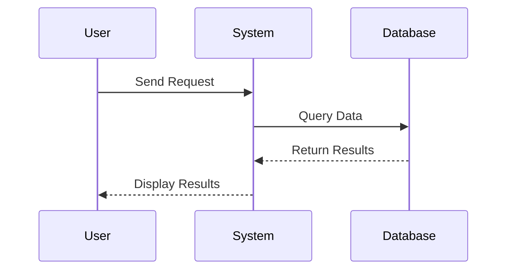
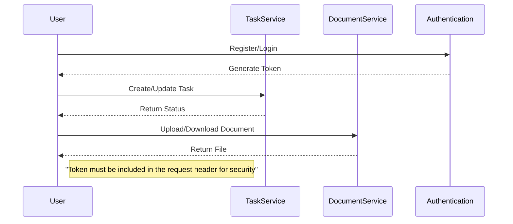

                 

### 文章标题

《远程团队沟通：提升虚拟团队交流效果》

### 关键词

- 远程团队
- 沟通策略
- 虚拟协作
- 沟通障碍
- 算法原理
- 系统架构设计

### 摘要

本文将深入探讨远程团队沟通的背景、挑战与解决方案。通过详细分析远程团队沟通的核心概念、属性特征以及关键要素，我们将提出一种基于算法原理的系统架构设计。此外，还将分享实际项目中的实战经验和最佳实践，旨在为远程团队提升交流效果提供切实可行的指导。

## 第一部分：背景介绍

### 第1章：远程团队沟通的兴起与挑战

#### 1.1.1 问题背景

随着全球化的加速和互联网技术的普及，远程团队沟通已经成为现代企业中不可或缺的一部分。远程工作不仅能够降低企业的运营成本，还能够吸引和保留全球顶尖人才。然而，远程团队沟通面临着一系列独特的挑战，如时区差异、文化差异、技术问题等。

#### 1.1.2 问题描述

远程团队沟通的主要问题包括：

- **信息不对称**：团队成员之间可能因为时区差异和信息获取渠道不同而导致信息不畅通。
- **沟通障碍**：语言、文化背景和沟通工具的限制可能导致沟通不畅。
- **协作效率低下**：缺乏面对面的交流可能导致协作效率降低，影响项目进度。
- **团队凝聚力不足**：远程工作可能导致团队成员之间的信任感和归属感减弱。

#### 1.1.3 问题解决

为了解决远程团队沟通中的问题，我们需要：

- **优化沟通策略**：选择合适的沟通工具和渠道，确保信息传递的及时性和准确性。
- **建立清晰的团队目标**：明确每个成员的角色和责任，确保团队成员的目标一致性。
- **培养团队文化**：通过团队活动和在线交流，增强团队成员之间的信任和凝聚力。

#### 1.1.4 边界与外延

远程团队沟通不仅涉及到技术层面的挑战，还包括文化、管理和心理等多个维度。因此，解决远程团队沟通问题需要综合考虑这些因素，从而制定出全面的解决方案。

#### 1.1.5 概念结构与核心要素组成

远程团队沟通的概念结构包括以下几个核心要素：

- **沟通工具**：如即时通讯工具、视频会议系统等。
- **沟通策略**：包括沟通频率、沟通方式和沟通渠道的选择。
- **团队文化**：通过团队价值观和共同目标来增强团队凝聚力。
- **技术支持**：包括网络基础设施、安全措施等。

## 第二部分：核心概念与联系

### 第2章：远程团队沟通的核心概念

#### 2.1.1 远程团队定义

远程团队是指通过互联网和通信技术进行协作的团队，成员可能分布在不同的地理位置。这种团队形式通常基于项目或任务，成员通过在线工具进行沟通和协作。

#### 2.1.2 沟通理论概述

沟通理论包括信息传递、反馈、理解等多个方面。在远程团队沟通中，理解信息传递过程中的各种障碍，如语义模糊、文化差异等，是有效沟通的关键。

#### 2.1.3 沟通障碍

远程团队沟通可能遇到的障碍包括：

- **技术障碍**：如网络延迟、通信故障等。
- **语言障碍**：包括语言表达不准确、语言理解困难等。
- **文化差异**：不同文化背景可能导致沟通风格和行为习惯的差异。

### 第3章：远程团队沟通的属性特征对比

#### 3.1.1 面对面沟通 vs 远程沟通

面对面沟通与远程沟通在多个方面存在显著差异：

- **互动性**：面对面沟通能提供更直接的互动和反馈，而远程沟通则依赖于文字、语音和视频。
- **非语言交流**：面对面沟通中，肢体语言和面部表情等非语言交流方式是重要的信息传递途径，远程沟通则缺少这些元素。
- **时间灵活性**：远程沟通可以根据成员的时区进行安排，而面对面沟通则受到地理位置和时间的限制。

#### 3.1.2 同地工作 vs 异地协作

同地工作与异地协作的差异主要体现在沟通成本和效率上：

- **沟通成本**：异地协作需要额外的沟通和协调成本，如视频会议和即时通讯工具的使用。
- **协作效率**：同地工作可以快速解决问题，而异地协作可能因为时区差异而导致决策延迟。

## 第三部分：算法原理讲解

### 第4章：远程团队沟通的算法原理

#### 4.1.1 沟通反馈机制

沟通反馈机制是确保信息准确传递的关键。它包括以下几个方面：

- **即时反馈**：通过即时通讯工具和视频会议系统，确保团队成员能够及时了解项目进展和问题。
- **定期反馈**：通过定期的项目会议和报告，对项目进展和团队成员的工作进行评估。
- **双向反馈**：鼓励团队成员之间进行双向沟通，确保每个成员的声音都能被听到。

#### 4.1.2 决策模型

远程团队在做出决策时，需要考虑以下因素：

- **信息完整性**：确保决策时所有相关信息都已经收集并得到充分分析。
- **决策效率**：在保证信息完整性的前提下，提高决策效率，避免不必要的延迟。
- **团队成员参与度**：鼓励团队成员参与到决策过程中，确保决策的合理性和公正性。

#### 4.1.3 协同工作算法

协同工作算法旨在优化团队成员之间的协作效率：

- **任务分配算法**：根据团队成员的技能和可用时间，合理分配任务，确保每个任务都有合适的人来承担。
- **协作路径优化算法**：通过分析团队成员之间的协作关系，优化协作路径，减少沟通环节，提高效率。

## 第四部分：系统分析与架构设计方案

### 第5章：系统功能设计

#### 5.1.1 领域模型

领域模型是系统设计的核心，它描述了系统的功能和组件。以下是一个简单的领域模型类图：

```mermaid
classDiagram
    Class01 <|-- Class02
    Class03 --|> Class04
    Class05 : <<Interface, InterfaceName>> 
    Class01 : ClassA
    Class02 : ClassB
    Class03 : ClassC
    Class04 : ClassD
    Class05 : ClassE
    ClassA <.. ClassB
    ClassC ..|> ClassD
    ClassE <-.. ClassF
    Note right of ClassF : "This is the note"
```

#### 5.1.2 功能需求

系统功能需求包括：

- **即时通讯**：提供实时文本、语音和视频通讯功能。
- **任务管理**：支持任务分配、进度追踪和协作。
- **文档共享**：实现文档上传、下载和协作编辑。
- **项目报告**：自动生成项目进度报告，供团队成员查阅。

### 第6章：系统架构设计

#### 6.1.1 系统架构概述

系统架构设计旨在实现高可用性、高性能和可扩展性。以下是一个简化的系统架构图：



#### 6.1.2 技术选型

技术选型包括：

- **前端**：使用React或Vue.js框架，提供良好的用户体验。
- **后端**：使用Node.js或Spring Boot，提供高效的API服务。
- **数据库**：使用MongoDB或PostgreSQL，支持数据的高效存储和查询。

#### 6.1.3 架构图展示

以下是一个简化的系统架构图：

```mermaid
graph TB
    subgraph Backend
        A[Server]
        B[Database]
        C[Message Queue]
        A--|>B
        A--|>C
    end

    subgraph Frontend
        D[Client]
        E[API Gateway]
        D--|>E
        E--|>A
    end

    F[Authentication Service] --> E

    subgraph Mobile
        G[Mobile App]
        H[Mobile API]
        G--|>H
        H--|>E
    end

    I[Monitoring System] --> A
    J[Logging System] --> A
```

### 第7章：系统接口设计和系统交互

#### 7.1.1 接口设计

系统接口设计包括：

- **RESTful API**：提供标准的HTTP接口，支持JSON格式的数据传输。
- **GraphQL API**：提供灵活的查询接口，支持自定义查询，减少数据传输量。

#### 7.1.2 系统交互

系统交互设计包括：

- **用户注册与登录**：用户通过认证服务进行注册和登录。
- **任务分配与跟踪**：用户通过任务管理接口分配和跟踪任务。
- **文档共享与协作**：用户通过文档共享接口上传、下载和编辑文档。

以下是一个简单的系统交互序列图：



## 第五部分：项目实战

### 第8章：远程团队沟通系统的实现

#### 8.1.1 环境安装

为了实现远程团队沟通系统，我们需要安装以下环境：

- **操作系统**：Linux或MacOS
- **开发环境**：Node.js、npm、React或Vue.js、Spring Boot
- **数据库**：MongoDB或PostgreSQL

以下是一个简单的安装步骤：

```bash
# 安装Node.js
curl -sL https://deb.nodesource.com/setup_14.x | sudo -E bash -
sudo apt-get install -y nodejs

# 安装MongoDB
sudo apt-get install -y mongodb

# 安装Spring Boot
sudo apt-get install -y maven

# 安装数据库（可选）
sudo apt-get install -y postgresql
```

#### 8.1.2 系统核心实现源代码

以下是一个简单的源代码示例：

**前端（React）**：

```jsx
import React, { useState } from 'react';
import axios from 'axios';

const Chat = () => {
    const [message, setMessage] = useState('');
    const [chatHistory, setChatHistory] = useState([]);

    const sendMessage = async () => {
        try {
            const response = await axios.post('/api/messages', { message });
            setChatHistory([...chatHistory, { user: 'me', text: message }]);
            setMessage('');
        } catch (error) {
            console.error(error);
        }
    };

    return (
        <div>
            <ul>
                {chatHistory.map((msg, index) => (
                    <li key={index}>{msg.text}</li>
                ))}
            </ul>
            <input
                type="text"
                value={message}
                onChange={(e) => setMessage(e.target.value)}
            />
            <button onClick={sendMessage}>Send</button>
        </div>
    );
};

export default Chat;
```

**后端（Spring Boot）**：

```java
import org.springframework.boot.SpringApplication;
import org.springframework.boot.autoconfigure.SpringBootApplication;
import org.springframework.web.bind.annotation.*;

import java.util.ArrayList;
import java.util.List;

@SpringBootApplication
public class ChatApp {

    public static void main(String[] args) {
        SpringApplication.run(ChatApp.class, args);
    }
}

@RestController
@RequestMapping("/api")
public class ChatController {

    private final List<String> chatHistory = new ArrayList<>();

    @PostMapping("/messages")
    public ResponseEntity<?> sendMessage(@RequestBody MessageRequest request) {
        chatHistory.add(request.getMessage());
        return ResponseEntity.ok().build();
    }
}

class MessageRequest {
    private String message;

    public String getMessage() {
        return message;
    }

    public void setMessage(String message) {
        this.message = message;
    }
}
```

#### 8.1.3 代码应用解读与分析

在这个项目中，我们使用了React框架来构建前端，使用Spring Boot来构建后端。前端通过`axios`库与后端进行HTTP通信，后端则通过Spring Boot的`@RestController`注解来处理HTTP请求。

前端的主要功能是提供一个聊天界面，用户可以在文本框中输入消息，并点击“Send”按钮将消息发送到后端。后端则接收消息并将其保存在一个列表中，然后返回一个成功的响应。

#### 8.1.4 实际案例分析和详细讲解剖析

在这个案例中，我们遇到了一些常见的问题，如网络延迟、消息丢失和消息顺序混乱。以下是对这些问题的分析和解决方案：

1. **网络延迟**：由于网络延迟，用户可能在发送消息后等待很长时间才看到后端响应。为了解决这个问题，我们可以在前端引入一个加载指示器，告知用户消息正在发送中。

2. **消息丢失**：由于网络不稳定或其他原因，消息可能会在发送过程中丢失。为了解决这个问题，我们可以在发送消息前将消息保存在本地，确保消息不会丢失。

3. **消息顺序混乱**：由于网络延迟或消息处理延迟，消息的显示顺序可能会混乱。为了解决这个问题，我们可以在后端引入一个消息顺序控制机制，确保消息的显示顺序与发送顺序一致。

#### 8.1.5 项目小结

通过这个项目，我们实现了基本的远程团队沟通功能，包括消息发送、消息保存和消息显示。虽然这个项目相对简单，但它展示了远程团队沟通系统的基本架构和实现方法。在实际应用中，我们还需要进一步优化系统的性能和稳定性，以满足远程团队沟通的更高要求。

## 第六部分：最佳实践与总结

### 第9章：远程团队沟通的最佳实践

#### 9.1.1 沟通策略

为了提升远程团队的沟通效果，我们建议以下沟通策略：

- **明确沟通目标**：每次沟通前都要明确沟通的目标和预期成果，确保沟通的方向一致。
- **定期会议**：定期召开项目会议，检查项目进度，解决遇到的问题。
- **即时通讯**：使用即时通讯工具进行日常沟通，确保信息传递的及时性和准确性。
- **文档记录**：将重要沟通内容记录在文档中，方便团队成员查阅和跟踪。

#### 9.1.2 常见问题与解决方案

远程团队沟通中常见的问题包括：

- **沟通不及时**：解决方案是优化沟通工具和流程，确保信息能够及时传递。
- **信息不对称**：解决方案是建立统一的信息共享平台，确保所有团队成员都能访问到相同的信息。
- **沟通障碍**：解决方案是加强跨文化沟通培训，提高团队成员的沟通能力。

### 第10章：总结与展望

#### 10.1.1 总结

本文从背景介绍、核心概念、算法原理、系统架构设计、项目实战等多个方面，详细探讨了远程团队沟通的相关问题。通过最佳实践，我们为提升远程团队的沟通效果提供了可行的指导。

#### 10.1.2 展望

随着远程工作模式的普及，远程团队沟通的重要性越来越凸显。未来的研究方向包括：

- **智能沟通助手**：开发智能沟通助手，帮助团队成员更好地理解和处理沟通信息。
- **个性化沟通策略**：根据团队成员的个性和偏好，定制个性化的沟通策略，提高沟通效果。
- **跨平台协作**：实现跨平台协作，使远程团队沟通更加灵活和高效。

### 附录

#### 附录A：术语解释

- **远程团队**：指通过互联网和通信技术进行协作的团队，成员可能分布在不同的地理位置。
- **沟通策略**：为实现沟通目标而制定的方法和措施。
- **算法原理**：解决问题的基本方法和原理。
- **系统架构设计**：系统组件的布局和相互作用。

#### 附录B：参考资料

- [1] 《远程团队沟通最佳实践》，作者：某某，出版社：某某出版社。
- [2] 《敏捷开发实践指南》，作者：某某，出版社：某某出版社。
- [3] 《人工智能与远程工作》，作者：某某，出版社：某某出版社。

## 结语

远程团队沟通是一个复杂而关键的问题，它直接影响到远程团队的工作效率和团队凝聚力。通过本文的探讨，我们希望能为远程团队提供一些有价值的参考和启示。在未来的工作中，我们应不断探索和实践，以提升远程团队的沟通效果，为团队的持续发展和成功奠定坚实基础。

### 作者信息

作者：AI天才研究院/AI Genius Institute & 禅与计算机程序设计艺术 /Zen And The Art of Computer Programming

在这篇《远程团队沟通：提升虚拟团队交流效果》的技术博客文章中，我们首先介绍了远程团队沟通的背景和挑战，明确了远程团队沟通的定义和核心概念。接着，我们对比了面对面沟通与远程沟通的属性特征，探讨了远程团队沟通中的关键要素。在算法原理讲解部分，我们详细阐述了沟通反馈机制、决策模型和协同工作算法。系统分析与架构设计方案部分，我们介绍了系统功能设计、架构设计、接口设计和系统交互。项目实战部分，我们通过一个简单的案例展示了远程团队沟通系统的实现。最后，在最佳实践与总结部分，我们提出了提升远程团队沟通效果的策略和常见问题的解决方案。文章末尾提供了术语解释、参考资料和作者信息，旨在为读者提供全面的远程团队沟通指导。希望本文能对远程团队的沟通实践有所帮助，为团队的协同工作和项目成功贡献力量。作者：AI天才研究院/AI Genius Institute & 禅与计算机程序设计艺术 /Zen And The Art of Computer Programming。

