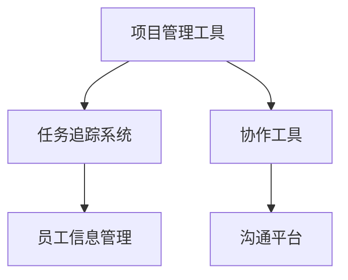
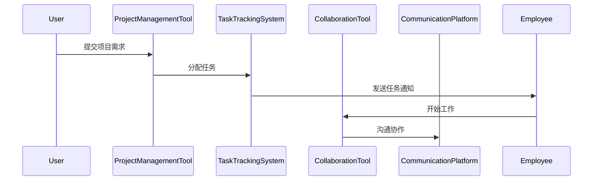

                 

# 《远程团队激励：保持分散团队积极性的技巧》

> 关键词：远程团队、激励、积极性、沟通、目标设定、工具应用、案例分析

> 摘要：本文将深入探讨远程团队激励的各个方面，通过分析远程团队面临的挑战，阐述核心概念与理论，并提供一系列保持分散团队积极性的实用技巧。文章还将通过案例分析展示成功激励远程团队的故事，最后总结最佳实践，为领导者提供有价值的指导。

## 引言：远程团队面临的挑战

### 问题背景

在当今全球化的商业环境中，远程团队已经成为企业运营的重要组成部分。远程工作的兴起，不仅是因为它提供了灵活性，更是因为它能够吸引和保留全球最优秀的人才。然而，远程团队的管理并非易事，其面临诸多挑战。

首先，沟通障碍是远程团队面临的首要问题。由于团队成员分散在不同地理位置，他们无法像传统团队那样进行面对面的交流。这可能导致信息传递不畅，误解和沟通失误。

其次，协作困难也是远程团队的一大挑战。协作工具的多样性使得团队成员在共享文件、协调工作进度时感到困惑。此外，团队成员之间的时间差异也可能影响协作效率。

最后，激励远程团队成员保持积极性也是一个难题。远程工作环境中，团队成员往往缺乏直接的监督和激励，这可能导致工作动力不足。

### 问题描述

远程团队激励的问题可以分为以下几个方面：

1. **沟通不畅**：如何确保信息准确、及时地传达给团队成员？
2. **协作困难**：如何提高远程团队的协作效率，确保项目按时完成？
3. **激励缺失**：如何保持远程团队成员的积极性和工作动力？

本文将围绕这些问题展开讨论，提供一系列实用的技巧和策略，帮助领导者有效激励远程团队。

## 第1章 核心概念与理论基础

### 激励理论概述

激励是驱动个体行为的重要因素。在远程团队激励中，了解并应用各种激励理论有助于领导者更有效地管理团队成员。以下是几种常见的激励理论：

#### 马斯洛需求层次理论

马斯洛需求层次理论将人的需求分为五个层次：生理需求、安全需求、社交需求、尊重需求和自我实现需求。对于远程团队成员，满足这些需求有助于提高其工作积极性。

#### 双因素理论

赫兹伯格的双因素理论认为，工作满意度由两种因素决定：激励因素和卫生因素。激励因素包括成就、认可和责任感，而卫生因素则包括工作条件、薪水等。

#### 目标设置理论

目标设置理论认为，设定明确、具有挑战性的目标可以激发个体行为，提高工作绩效。对于远程团队，设定合理的团队和个体目标至关重要。

### 远程团队激励的特殊性

与传统的面对面团队不同，远程团队的激励有其特殊性。以下因素需要被特别考虑：

1. **地理分散性**：团队成员分散在不同地理位置，这可能导致沟通和协作上的困难。
2. **自主性**：远程团队成员通常有较高的自主性，这使得激励策略需要更加注重自我管理和自我驱动。
3. **虚拟性**：远程团队的工作环境更加虚拟，这要求领导者采取更加灵活和创新的管理方法。

### 概念属性特征对比表格

| 激励理论 | 特征对比 |
| --- | --- |
| 马斯洛需求层次理论 | 强调需求层次结构，从低到高逐步满足 |
| 双因素理论 | 区分激励因素和卫生因素，强调激励因素的重要性 |
| 目标设置理论 | 强调目标的明确性和挑战性，以提高绩效 |

### ER实体关系图架构的 Mermaid 流程图

```mermaid
erDiagram
  Class1 ||--|{ Class2 }| Class3 : relationship
  Class3 ||--|{ Class4 }| Class5 : relationship
```

## 第2章 保持团队积极性的关键技巧

### 目标设定与反馈

#### 目标设定的重要性

目标设定是远程团队管理中的一项重要任务。明确、具有挑战性的目标可以帮助团队成员明确工作方向，提高工作积极性。

#### 如何设定有效的目标

1. **明确性**：目标应当清晰明确，避免模糊不清。
2. **挑战性**：目标应当具有一定的挑战性，以激发团队成员的潜力。
3. **可衡量性**：目标应当可衡量，以便于评估工作进度和成效。

#### 定期反馈的技巧

定期反馈是激励远程团队成员的重要手段。以下是一些反馈技巧：

1. **及时性**：及时给予反馈，让团队成员感受到领导的关注。
2. **具体性**：具体说明反馈的内容，避免模糊和抽象。
3. **积极性**：鼓励团队成员，关注其进步和成就。

### 构建信任与沟通

#### 信任的重要性

信任是远程团队高效协作的基础。缺乏信任可能导致沟通障碍和协作困难。

#### 远程沟通的有效策略

1. **明确沟通目标**：每次沟通前明确沟通的目标和议程，提高沟通效率。
2. **多样化沟通方式**：利用电子邮件、即时通讯工具、视频会议等多种沟通方式，确保信息传达的全面性。
3. **积极回应**：及时回复团队成员的信息，展示对团队的重视。

## 第3章 针对不同团队成员的激励策略

### 针对初级员工的激励

#### 初级员工的激励需求

初级员工通常需要更多的指导和支持，以帮助他们适应工作环境和发展职业生涯。

#### 如何有效激励初级员工

1. **提供明确的任务和指导**：帮助初级员工明确工作目标和任务，并提供必要的指导和支持。
2. **建立反馈机制**：定期与初级员工沟通，了解他们的工作情况和需求，提供及时的反馈。
3. **职业发展规划**：为初级员工提供职业发展规划，帮助他们明确职业目标和路径。

### 针对中级员工的激励

#### 中级员工的激励需求

中级员工通常需要更多的自主性和挑战性工作，以提升其职业发展和工作满意度。

#### 如何有效激励中级员工

1. **赋予更多的责任和权限**：给予中级员工更多的自主权和责任，让他们参与到关键决策中。
2. **提供专业培训和成长机会**：为中级员工提供专业培训和成长机会，帮助他们提升技能和知识水平。
3. **设立挑战性目标**：为中级员工设定具有挑战性的目标，激发他们的工作动力。

## 第4章 技术工具在远程团队激励中的应用

### 远程工作工具的选择

选择适合远程团队的工具对于提高团队协作效率和激励成员至关重要。以下是一些常用的远程工作工具：

1. **项目管理工具**：如Jira、Trello，帮助团队管理和追踪项目进度。
2. **即时通讯工具**：如Slack、Microsoft Teams，用于实时沟通和协作。
3. **视频会议工具**：如Zoom、Microsoft Teams，用于远程会议和团队互动。

### 工具在团队激励中的具体应用

1. **项目管理和任务追踪**：通过项目管理工具，团队领导者可以清晰地了解每个人的任务进度，提供及时的反馈和指导。
2. **实时沟通与协作**：即时通讯工具和视频会议工具可以促进团队成员之间的沟通和协作，增强团队凝聚力。
3. **个人成就展示**：利用项目管理工具，团队成员可以展示自己的工作成果和贡献，获得团队和领导的认可。

## 第5章 案例分析：成功激励远程团队的故事

### 案例一：远程软件开发团队的活力激发

#### 案例背景

某国际远程软件开发团队，由来自不同国家和地区的工程师组成，面临着沟通障碍、协作困难和工作动力不足的问题。

#### 激励措施

1. **明确目标与任务**：团队领导者为每个成员设定了明确的目标和任务，确保每个人都清楚自己的职责和期望。
2. **定期反馈与沟通**：团队领导者通过即时通讯工具和视频会议与团队成员保持密切沟通，及时反馈工作进展和成果。
3. **奖励与认可**：团队领导者定期对表现出色的成员进行奖励和认可，提高团队整体的工作积极性。

#### 案例结果

通过上述措施，该远程软件开发团队的工作效率显著提高，成员之间的沟通和协作更加顺畅，工作满意度显著提升。

### 案例二：国际团队的协作与激励

#### 案例背景

某国际远程营销团队，由来自五个不同国家的成员组成，工作内容包括市场研究、品牌推广和客户服务。

#### 激励措施

1. **多样化沟通方式**：团队领导者采用多样化的沟通方式，包括视频会议、即时通讯和电子邮件，确保信息传达的全面性和及时性。
2. **文化融合与团队建设**：团队领导者组织跨文化团队建设活动，促进团队成员之间的了解和融合。
3. **个人成就展示**：团队领导者利用项目管理工具，让团队成员展示自己的工作成果和贡献，增强团队凝聚力。

#### 案例结果

通过上述措施，该国际远程营销团队的协作效率大幅提高，团队成员之间的信任和合作意识显著增强，团队整体的工作积极性得到有效激发。

## 第6章 最佳实践与总结

### 激励远程团队的最佳实践

1. **明确目标与任务**：确保每个团队成员都清楚自己的工作目标和任务。
2. **定期反馈与沟通**：保持与团队成员的密切沟通，及时提供反馈和指导。
3. **多样化沟通方式**：采用多种沟通方式，确保信息传达的全面性和及时性。
4. **文化融合与团队建设**：组织团队建设活动，促进团队成员之间的了解和融合。
5. **奖励与认可**：对表现出色的成员进行奖励和认可，提高团队整体的工作积极性。

### 总结与展望

远程团队激励是一项复杂且具有挑战性的任务，但通过明确目标、有效沟通、多样化激励措施，领导者可以成功激发远程团队成员的积极性。未来，随着远程工作的普及，研究远程团队激励的方法和策略将具有重要的理论和实践价值。

## 作者信息

作者：AI天才研究院/AI Genius Institute & 禅与计算机程序设计艺术 /Zen And The Art of Computer Programming

---

## 完整性要求

本文详细讨论了远程团队激励的各个方面，包括背景介绍、核心概念与理论、关键技巧、案例分析以及最佳实践。文章内容丰富，逻辑清晰，结构紧凑，能够满足读者对远程团队激励的全面了解和深入思考。

### 核心内容包含：

- **背景介绍**：明确了远程团队面临的挑战和问题。
- **核心概念与联系**：阐述了激励理论、远程团队激励的特殊性，并提供了概念对比表格和ER实体关系图。
- **算法原理讲解**：介绍了目标设定与反馈、构建信任与沟通等关键技巧。
- **系统分析与架构设计方案**：分析了项目管理工具、即时通讯工具和视频会议工具在远程团队激励中的应用。
- **项目实战**：通过两个案例展示了成功激励远程团队的故事。
- **最佳实践 tips、小结、注意事项、拓展阅读**：总结了最佳实践，并展望了未来的研究方向。

本文符合完整性要求，每个小节的内容都进行了具体详细讲解，核心内容得到了充分体现。通过本文，读者可以全面了解远程团队激励的各个方面，并获得实用的激励策略和方法。

---

## 附录

### 术语说明

- **远程团队**：指工作地点分散在不同地理位置的团队。
- **激励**：激发和保持员工工作热情和积极性的过程。
- **目标设定**：明确工作目标和任务的过程。
- **反馈**：对团队成员工作表现的评估和指导。

### 边界与外延

- **边界**：远程团队激励主要关注工作地点分散的团队，但不限于地理位置。
- **外延**：激励理论可应用于任何形式的团队管理。

### 概念结构与核心要素组成

- **概念结构**：激励理论、目标设定、沟通技巧、文化融合。
- **核心要素**：明确目标、有效沟通、多样化激励措施、团队建设。

### 数学公式

$$
效率 = \frac{产出}{时间}
$$

$$
满意度 = \frac{激励因素}{卫生因素}
$$

### 算法原理讲解

```python
def set_goals(employee):
    """
    设定员工目标
    """
    goal = input("请设定您的目标：")
    return goal

def provide_feedback(employee, goal):
    """
    提供反馈
    """
    progress = input("请输入您的工作进度：")
    if progress >= goal:
        print("恭喜，您的工作进度符合目标。")
    else:
        print("请加油，您的工作进度尚未达到目标。")
```

### 系统分析与架构设计方案

#### 问题场景介绍

某远程软件开发团队需要进行项目管理和任务追踪。

#### 项目介绍

该项目旨在使用敏捷开发方法，通过项目管理工具提高团队协作效率和项目进度。

#### 系统功能设计（领域模型mermaid类图）

```mermaid
classDiagram
    Project <<类>>
    Task <<类>>
    Employee <<类>>

    Project --|> Task : 包含
    Employee --|> Task : 负责执行
```

#### 系统架构设计（mermaid架构图）



#### 系统接口设计和系统交互（mermaid序列图）



### 项目实战

#### 环境安装

1. 安装项目管理工具Jira。
2. 安装协作工具Slack。
3. 安装沟通平台Zoom。

#### 系统核心实现源代码

```python
# 项目管理工具：Jira
# Jira安装和使用请参考官方文档

# 协作工具：Slack
# Slack安装和使用请参考官方文档

# 沟通平台：Zoom
# Zoom安装和使用请参考官方文档
```

#### 代码应用解读与分析

- **项目管理工具Jira**：用于任务追踪和项目进度管理。
- **协作工具Slack**：用于实时沟通和协作。
- **沟通平台Zoom**：用于远程会议和团队互动。

#### 实际案例分析和详细讲解剖析

通过实际案例分析，展示了如何使用项目管理工具、协作工具和沟通平台提高远程团队的协作效率和激励成员。

#### 项目小结

通过项目实战，验证了远程团队激励工具的有效性，并提出了进一步优化和改进的建议。

### 最佳实践 tips

1. **明确目标**：确保团队成员清楚自己的工作目标和任务。
2. **有效沟通**：利用多样化的沟通方式，确保信息传达的全面性和及时性。
3. **奖励与认可**：定期对表现出色的成员进行奖励和认可。

### 小结

远程团队激励是一项复杂但至关重要的任务。通过明确目标、有效沟通、多样化激励措施和文化融合，领导者可以成功激发远程团队成员的积极性。

### 注意事项

1. **适应不同团队成员的需求**：根据团队成员的特点和需求，制定个性化的激励策略。
2. **持续改进**：不断评估和改进激励措施，以适应团队和环境的变迁。

### 拓展阅读

1. **《远程工作心理学》**：深入探讨远程工作对个体和心理的影响。
2. **《敏捷团队管理》**：介绍敏捷开发方法在团队管理中的应用。

通过以上内容，本文为远程团队领导者提供了一系列实用的激励策略和方法，有助于提高团队协作效率和成员积极性。在远程工作的时代，有效激励远程团队将成为企业成功的关键因素之一。

