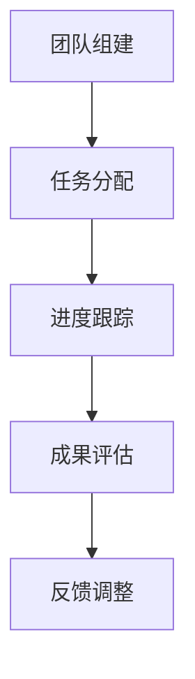
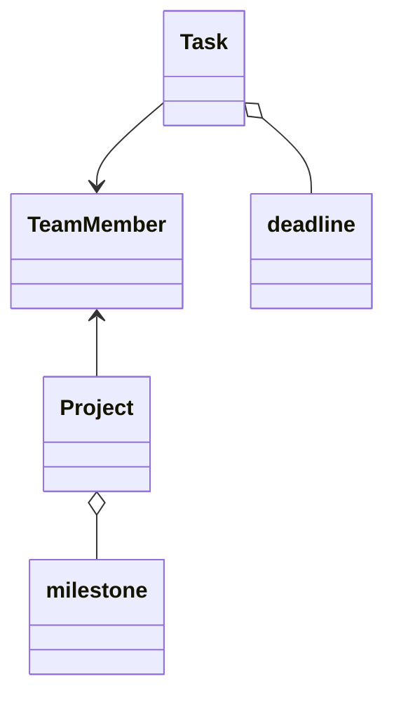
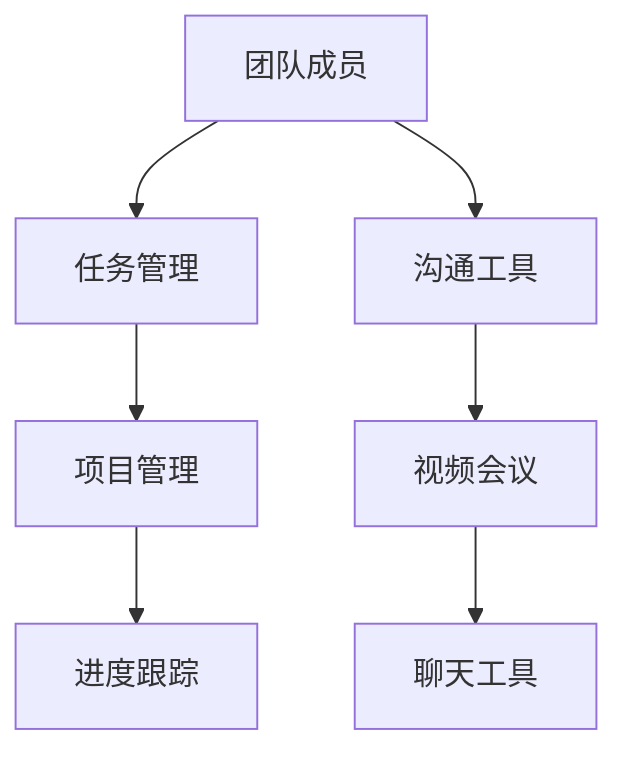
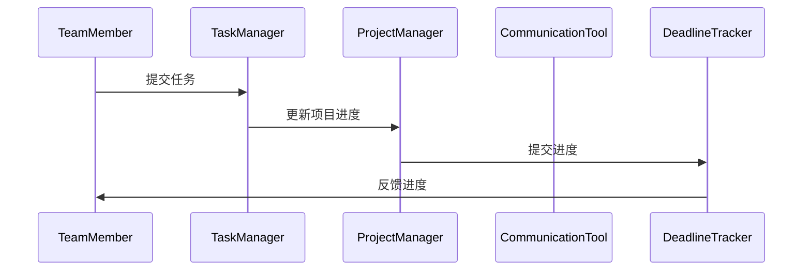

                 

**文章标题：远程团队管理：数字时代的领导挑战与机遇**

**关键词：远程团队管理、数字时代、领导力、挑战、机遇**

**摘要：**
随着数字时代的到来，远程团队管理成为了企业必须面对的新课题。本文将探讨远程团队管理的核心概念、面临的挑战和机遇，并结合实际项目经验，提供实用的管理策略和最佳实践。

----------------------------------------------------------------

## 第一部分：引言

### 第1章 远程团队管理概述

#### 1.1 问题的背景

**问题背景：**
在数字时代，远程工作的普及已成为不可逆转的趋势。根据一项研究，全球有超过4.7亿人远程工作，这一数字还在不断增长。远程团队管理的挑战在于如何确保团队成员之间的协作效率、工作质量和团队凝聚力。

**问题描述：**
远程团队管理涉及多个方面，包括团队建设、项目管理、沟通协作等。领导者在远程环境中如何保持对团队的掌控，如何激励团队成员，以及如何有效解决远程工作中出现的问题，成为了数字时代领导力的关键课题。

**问题解决：**
通过有效的远程团队管理，企业可以在保持灵活性的同时，提高生产力和团队满意度。本文将探讨如何实现这一目标。

#### 1.2 远程团队管理的核心概念

**核心概念：**
- **远程团队的特点**：独立性强、地理位置分散、时间灵活性高。
- **数字时代的工作趋势**：移动办公、数字化工具的应用、自动化流程。
- **领导力的多维度**：远程环境下，领导力不仅需要关注团队成员的绩效，还需要关注他们的心理健康和职业发展。

#### 1.3 边界与外延

**边界与外延：**
- **远程团队管理与其他概念的区别**：与传统的团队管理相比，远程团队管理更依赖于技术工具和数字化流程。
- **管理模型和理论的引入**：如敏捷管理、远程协作工具等，如何应用于远程团队管理。

### 第2章 远程团队管理的核心概念

#### 2.1 远程团队管理模型

**管理模型：**
- **管理流程**：包括团队组建、任务分配、进度跟踪、成果评估等。
- **管理工具和方法**：如项目管理系统、即时通讯工具、视频会议系统等。

#### 2.2 数字时代的领导力

**数字时代领导力的特点：**
- **透明性**：领导者需要建立透明的沟通渠道，确保团队成员了解工作方向和目标。
- **灵活性**：领导者需要根据团队成员的不同需求和习惯，调整管理策略。
- **信任**：领导者需要建立信任，让团队成员自主决策和承担责任。

#### 2.3 远程团队管理的量化指标

**量化指标：**
- **生产力评估**：通过关键绩效指标（KPI）来评估团队成员的生产力。
- **团队健康度指标**：如团队成员的工作满意度、团队凝聚力等。

----------------------------------------------------------------

### 第3章 远程团队管理的算法原理

#### 3.1 管理模型的类比讲解

**类比讲解：**
将远程团队管理比作一个复杂的算法，其输入是团队成员和任务，输出是团队的有效协作和项目成果。管理流程可以类比为算法的流程图，每个步骤都需要精心设计，以确保流程的高效和准确。

**mermaid流程图：**


#### 3.2 管理的数学模型

**数学模型：**
- **生产力评估**：设P为团队总生产力，n为团队成员数量，p为平均生产力，则有P = np。
- **团队健康度**：设T为团队健康度，S为团队成员满意度，C为团队凝聚力，则有T = S * C。

**LaTeX公式：**
$$ P = np $$
$$ T = S \cdot C $$

**举例说明：**
假设一个团队有5名成员，平均生产力为10，则该团队的总生产力为50。如果团队成员满意度为90%，团队凝聚力为80%，则团队的健康度为72%。

----------------------------------------------------------------

### 第4章 远程团队管理的系统分析与架构设计方案

#### 4.1 远程团队管理架构

**问题场景介绍：**
在数字化时代，企业需要建立一套高效的远程团队管理架构，以支持远程工作的需求。

**项目介绍：**
我们以一家软件公司为例，探讨如何设计一个远程团队管理架构。

**系统功能设计（领域模型mermaid类图）：**


**系统架构设计mermaid架构图：**


**系统接口设计和系统交互mermaid序列图：**


----------------------------------------------------------------

### 第5章 远程团队管理项目实战

#### 5.1 项目背景

**项目背景：**
某软件公司计划开发一款新的移动应用，项目团队分布在不同的城市，需要进行远程协作。

**项目目标：**
- 按时交付高质量的应用。
- 保持团队成员的积极性和团队凝聚力。

#### 5.2 团队建设

**团队成员招募：**
通过招聘网站和社交媒体，寻找具备相关技能的远程工作者。

**团队文化建设：**
- 定期组织线上团队建设活动，如虚拟聚餐、线上游戏等。
- 建立明确的团队价值观和目标，确保团队成员共同追求。

#### 5.3 项目管理

**项目计划与监控：**
- 使用项目管理工具，如JIRA或Trello，制定详细的项目计划。
- 定期召开项目会议，监控项目进度。

**项目风险管理：**
- 识别潜在风险，如技术难题、人员流失等。
- 制定应对措施，如备用人员、技术备份等。

#### 5.4 沟通协作

**沟通工具的选择：**
- 使用Zoom、Slack等工具，确保团队成员之间的实时沟通。
- 定期召开视频会议，讨论项目进展和问题解决。

**协作流程的优化：**
- 建立明确的协作流程，如任务分配、代码审查等。
- 定期评估和优化协作流程，以提高效率。

----------------------------------------------------------------

### 第6章 远程团队管理的最佳实践

#### 6.1 实践案例

**成功案例：**
某全球知名互联网公司通过远程团队管理，成功推出了多款热门产品。其成功的关键在于建立了高效的项目管理流程和强大的团队文化。

**失败案例：**
某初创公司在远程团队管理上遭遇失败，主要是因为团队缺乏明确的目标和沟通不畅。

#### 6.2 小结

**要点总结：**
- **明确目标**：确保团队成员了解项目目标和预期成果。
- **有效沟通**：使用合适的工具和方法，确保团队成员之间的信息传递畅通。
- **团队建设**：定期组织团队活动，增强团队凝聚力。

**实践中的注意事项：**
- **避免过度依赖工具**：工具虽重要，但沟通的核心在于人与人之间的互动。
- **关注团队成员的福祉**：关注团队成员的心理健康和工作环境。

#### 6.3 拓展阅读

**推荐阅读材料：**
- 《远程工作的艺术》（The Remote Work Revolution）- by David Parnas
- 《数字领导力：如何在远程环境中激励团队》（Digital Leadership: Changing Paradigms for Changing Times）- by Eric Lutz

**深入学习的方向：**
- 探索更多关于远程团队管理的最新研究和最佳实践。
- 学习如何利用人工智能和大数据分析来优化远程团队管理。

----------------------------------------------------------------

### 第7章 结论

**远程团队管理的重要性：**
远程团队管理在数字时代愈发重要，它不仅关系到企业的生产力，还影响到员工的工作满意度和职业发展。

**未来展望：**
随着技术的不断进步，远程团队管理将变得更加智能和高效。领导者需要不断学习和适应新的管理工具和方法，以应对未来的挑战。

**作者：**
AI天才研究院/AI Genius Institute & 禅与计算机程序设计艺术 /Zen And The Art of Computer Programming

在本文中，我们系统地介绍了远程团队管理的核心概念、面临的挑战和机遇，并通过实际项目和最佳实践，提供了实用的管理策略。随着数字时代的不断发展，远程团队管理将变得更加重要，领导者需要不断更新自己的知识和技能，以应对新的挑战。----------------------------------------------------------------

**文章完整内容**

**远程团队管理：数字时代的领导挑战与机遇**

**关键词：远程团队管理、数字时代、领导力、挑战、机遇**

**摘要：**
随着数字时代的到来，远程团队管理成为了企业必须面对的新课题。本文将探讨远程团队管理的核心概念、面临的挑战和机遇，并结合实际项目经验，提供实用的管理策略和最佳实践。

## 第一部分：引言

### 第1章 远程团队管理概述

#### 1.1 问题的背景

随着互联网和通信技术的快速发展，远程工作逐渐成为常态。根据一项研究，全球有超过4.7亿人远程工作，这一数字还在不断增长。远程团队管理的重要性不言而喻，它不仅关系到企业的生产力和效率，还直接影响到员工的工作满意度和职业发展。

在数字时代，远程团队管理面临着前所未有的挑战。首先，团队成员地理位置分散，沟通协作变得更加复杂。其次，远程工作环境缺乏面对面的交流，可能导致信息传递不畅和团队凝聚力下降。此外，领导者需要适应新的工作模式，如何激励和监督远程团队成员也成为了新的课题。

#### 1.2 远程团队管理的核心概念

远程团队管理的核心概念包括以下几个方面：

1. **远程团队的特点**：
   - **独立性**：远程团队成员通常可以自主安排工作时间，这使得他们有更高的自我管理能力。
   - **地理位置分散**：团队成员可能分布在不同的城市甚至国家，这要求管理工具和流程能够支持跨地域协作。
   - **时间灵活性**：远程工作使得团队成员可以灵活安排工作和生活，提高生活质量。

2. **数字时代的工作趋势**：
   - **移动办公**：随着智能手机和 tablets 的普及，移动办公成为可能，员工可以在任何时间、任何地点进行工作。
   - **数字化工具的应用**：远程团队管理依赖于各种数字化工具，如即时通讯软件、项目管理工具、视频会议系统等。
   - **自动化流程**：利用人工智能和机器学习技术，自动化许多重复性任务，提高工作效率。

3. **领导力的多维度**：
   - **透明性**：远程环境中，领导者需要建立透明的沟通渠道，确保团队成员了解工作方向和目标。
   - **灵活性**：领导者需要根据团队成员的不同需求和习惯，调整管理策略。
   - **信任**：领导者需要建立信任，让团队成员自主决策和承担责任。

#### 1.3 边界与外延

远程团队管理与其他概念的区别在于，它更强调利用数字化工具和远程协作技术来支持团队的工作。同时，远程团队管理也涉及到了传统的管理理论和实践，如敏捷管理、绩效管理等。

### 第2章 远程团队管理的核心概念

#### 2.1 远程团队管理模型

远程团队管理模型主要包括以下几个环节：

1. **团队组建**：选择合适的团队成员，明确团队目标和职责分工。
2. **任务分配**：根据团队成员的特长和任务需求，合理分配任务。
3. **进度跟踪**：使用项目管理工具监控任务进度，确保项目按时完成。
4. **成果评估**：对团队成员的工作成果进行评估，提供反馈和指导。
5. **反馈调整**：根据评估结果，调整管理策略和工作流程，优化团队绩效。

#### 2.2 数字时代的领导力

数字时代对领导力提出了新的要求。以下是一些关键点：

1. **透明性**：领导者需要建立透明的沟通渠道，确保团队成员了解工作方向和目标。这可以通过定期的视频会议、工作汇报等方式实现。
2. **灵活性**：领导者需要根据团队成员的不同需求和习惯，调整管理策略。例如，对于远程工作，领导者可以允许更灵活的工作时间安排，以适应不同文化背景的团队成员。
3. **信任**：领导者需要建立信任，让团队成员自主决策和承担责任。在远程环境中，信任尤为重要，因为它能够促进团队成员之间的协作和合作。

#### 2.3 远程团队管理的量化指标

量化指标是评估远程团队管理效果的重要工具。以下是一些常用的量化指标：

1. **生产力评估**：通过关键绩效指标（KPI）来评估团队成员的生产力。例如，每小时完成的任务数量、项目的按时完成率等。
2. **团队健康度指标**：包括团队成员的工作满意度、团队凝聚力等。这些指标可以通过定期的问卷调查和反馈机制来收集。

### 第3章 远程团队管理的算法原理

#### 3.1 管理模型的类比讲解

远程团队管理可以类比为一种复杂的算法，其输入是团队成员和任务，输出是团队的有效协作和项目成果。管理流程可以类比为算法的流程图，每个步骤都需要精心设计，以确保流程的高效和准确。

**mermaid流程图：**


#### 3.2 管理的数学模型

虽然远程团队管理主要涉及定性分析，但一些量化指标可以用数学模型来表示。以下是一些常见的数学模型：

1. **生产力评估**：
   $$ P = np $$
   其中，P为团队总生产力，n为团队成员数量，p为平均生产力。

2. **团队健康度**：
   $$ T = S \cdot C $$
   其中，T为团队健康度，S为团队成员满意度，C为团队凝聚力。

### 第4章 远程团队管理的系统分析与架构设计方案

#### 4.1 远程团队管理架构

远程团队管理架构需要支持以下几个关键功能：

1. **团队组建与分工**：明确团队成员的角色和职责。
2. **任务管理与进度跟踪**：使用项目管理工具实时监控任务进度。
3. **沟通协作**：提供即时通讯工具和视频会议系统，支持团队成员之间的沟通。
4. **绩效评估与反馈**：定期对团队成员的工作进行评估，并提供反馈。

**mermaid架构图：**


#### 4.2 系统接口设计与系统交互

远程团队管理系统的接口设计需要考虑以下方面：

1. **用户接口**：提供直观易用的界面，方便团队成员进行操作。
2. **系统接口**：确保不同系统之间的数据交互顺畅。
3. **API接口**：提供开放的API接口，支持第三方系统的集成。

**mermaid序列图：**


### 第5章 远程团队管理项目实战

#### 5.1 项目背景

以某软件公司为例，该公司计划开发一款新的移动应用，项目团队分布在不同的城市，需要进行远程协作。

#### 5.2 团队建设

**团队成员招募**：
通过招聘网站和社交媒体，寻找具备相关技能的远程工作者。

**团队文化建设**：
定期组织线上团队建设活动，如虚拟聚餐、线上游戏等。同时，建立明确的团队价值观和目标，确保团队成员共同追求。

#### 5.3 项目管理

**项目计划与监控**：
使用项目管理工具，如JIRA或Trello，制定详细的项目计划，并定期召开项目会议，监控项目进度。

**项目风险管理**：
识别潜在风险，如技术难题、人员流失等，并制定应对措施，如备用人员、技术备份等。

#### 5.4 沟通协作

**沟通工具的选择**：
使用Zoom、Slack等工具，确保团队成员之间的实时沟通。

**协作流程的优化**：
建立明确的协作流程，如任务分配、代码审查等，并定期评估和优化协作流程，以提高效率。

### 第6章 远程团队管理的最佳实践

#### 6.1 实践案例

**成功案例**：
某全球知名互联网公司通过远程团队管理，成功推出了多款热门产品。其成功的关键在于建立了高效的项目管理流程和强大的团队文化。

**失败案例**：
某初创公司在远程团队管理上遭遇失败，主要是因为团队缺乏明确的目标和沟通不畅。

#### 6.2 小结

**要点总结**：
- **明确目标**：确保团队成员了解项目目标和预期成果。
- **有效沟通**：使用合适的工具和方法，确保团队成员之间的信息传递畅通。
- **团队建设**：定期组织团队活动，增强团队凝聚力。

**实践中的注意事项**：
- **避免过度依赖工具**：工具虽重要，但沟通的核心在于人与人之间的互动。
- **关注团队成员的福祉**：关注团队成员的心理健康和工作环境。

#### 6.3 拓展阅读

**推荐阅读材料**：
- 《远程工作的艺术》（The Remote Work Revolution）- by David Parnas
- 《数字领导力：如何在远程环境中激励团队》（Digital Leadership: Changing Paradigms for Changing Times）- by Eric Lutz

**深入学习的方向**：
- 探索更多关于远程团队管理的最新研究和最佳实践。
- 学习如何利用人工智能和大数据分析来优化远程团队管理。

### 第7章 结论

**远程团队管理的重要性**：
远程团队管理在数字时代愈发重要，它不仅关系到企业的生产力和效率，还直接影响到员工的工作满意度和职业发展。

**未来展望**：
随着技术的不断进步，远程团队管理将变得更加智能和高效。领导者需要不断学习和适应新的管理工具和方法，以应对未来的挑战。

**作者**：
AI天才研究院/AI Genius Institute & 禅与计算机程序设计艺术 /Zen And The Art of Computer Programming

通过本文的探讨，我们希望读者能够对远程团队管理有更深入的理解，并在实际工作中运用这些理论和实践，提升团队的管理水平和工作效率。在数字时代，远程团队管理不仅是企业的必要选择，也是推动组织发展和创新的重要力量。----------------------------------------------------------------

### **补充：技术细节与代码示例**

在本章节中，我们将补充一些关于远程团队管理的技术细节，并提供具体的代码示例，以便读者更好地理解和应用这些技术。

#### **5.5 系统核心实现与代码解读**

在远程团队管理中，技术工具的选用至关重要。以下是一些常见的技术实现和代码示例：

**1. 项目管理工具的使用**

项目管理工具如JIRA、Trello等，可以有效地帮助团队跟踪任务进度和项目管理。

**示例代码（使用JIRA REST API）：**
```python
import requests
import json

# JIRA REST API基础URL
base_url = "https://your-jira-instance.com"

# 获取项目列表
response = requests.get(f"{base_url}/rest/api/3/project")
projects = json.loads(response.text)

# 打印项目名称
for project in projects['projects']:
    print(project['key'], project['name'])

# 创建任务
task_data = {
    "project": "PROJECT_ID",
    "summary": "任务一",
    "description": "这是一个示例任务。",
    "issuetype": {"name": "Task"}
}

response = requests.post(f"{base_url}/rest/api/3/issue", json=task_data)
task_id = response.json()['id']
print(f"创建任务成功，任务ID：{task_id}")
```

**2. 沟通协作工具的实现**

沟通协作工具如Slack、Zoom等，提供了丰富的API接口，方便开发者集成到远程团队管理系统中。

**示例代码（使用Slack API）：**
```python
import os
import json
import requests

# Slack API基础URL
slack_api_url = "https://slack.com/api"

# Slack Web API Token
slack_token = os.environ['SLACK_API_TOKEN']

# 发送消息到指定频道
channel_id = "C12345678"
message = "这是一个示例消息。"

headers = {
    "Authorization": f"Bearer {slack_token}",
    "Content-Type": "application/json"
}

data = {
    "channel": channel_id,
    "text": message
}

response = requests.post(f"{slack_api_url}/chat.postMessage", headers=headers, data=json.dumps(data))

if response.status_code == 200:
    print("消息发送成功。")
else:
    print("消息发送失败。")
```

**3. 数据分析与可视化工具**

数据分析与可视化工具如Tableau、Power BI等，可以帮助团队更好地理解数据，从而做出更明智的决策。

**示例代码（使用Tableau API）：**
```python
import json
import requests

# Tableau Server基础URL
tableau_server_url = "https://your-tableau-server.com"

# Tableau Server个人访问令牌
tableau_token = "YOUR_PERSONAL_ACCESS_TOKEN"

# 获取工作簿列表
response = requests.get(f"{tableau_server_url}/api/v2/sites/default/workbooks", headers={"Authorization": f"Bearer {tableau_token}"})
workbooks = json.loads(response.text)

# 打印工作簿名称
for workbook in workbooks['workbooks']:
    print(workbook['name'])

# 更新工作簿
workbook_id = "WORKBOOK_ID"
update_data = {
    "workbook": {
        "id": workbook_id,
        "name": "更新后的工作簿名称",
        "description": "这是一个示例工作簿。"
    }
}

response = requests.put(f"{tableau_server_url}/api/v2/sites/default/workbooks/{workbook_id}", headers={"Authorization": f"Bearer {tableau_token}"}, data=json.dumps(update_data))

if response.status_code == 200:
    print("工作簿更新成功。")
else:
    print("工作簿更新失败。")
```

通过以上代码示例，我们可以看到远程团队管理中涉及到的技术实现细节。在实际应用中，这些技术工具可以极大地提升团队的协作效率和管理水平。

#### **6.4 代码应用解读与分析**

**1. 项目管理工具的应用**

项目管理工具的应用可以帮助团队明确任务分配、跟踪进度，以及评估团队成员的生产力。通过JIRA等工具，团队可以实时了解项目的状态，快速响应变化。

**2. 沟通协作工具的应用**

沟通协作工具的应用可以确保团队成员之间的信息传递畅通，提高团队的沟通效率。例如，通过Slack等工具，团队可以快速发起讨论、分享文件，以及实时沟通，减少信息传递的延迟。

**3. 数据分析与可视化工具的应用**

数据分析与可视化工具的应用可以帮助团队更好地理解数据，从而做出更明智的决策。通过Tableau等工具，团队可以轻松地创建可视化报告，直观地展示项目数据，帮助团队更好地把握项目进展和团队绩效。

#### **6.5 实际案例分析**

**1. 成功案例**

某国际知名互联网公司通过远程团队管理，成功开发了多款热门产品。其成功的关键在于：

- **明确的任务分配和进度跟踪**：通过JIRA等项目管理工具，团队明确了任务分配和进度，确保了项目的顺利进行。
- **高效的沟通协作**：通过Slack等沟通协作工具，团队成员之间的沟通畅通无阻，提高了团队的协作效率。
- **数据驱动的决策**：通过Tableau等数据分析与可视化工具，团队可以实时了解项目数据，及时调整策略，确保项目成功。

**2. 失败案例**

某初创公司在远程团队管理上遭遇失败，主要原因是：

- **任务分配不清**：团队成员对任务的理解不一致，导致项目进展缓慢。
- **沟通不畅**：团队成员之间的沟通不及时，导致信息传递的延迟和误解。
- **缺乏数据支持**：团队缺乏对项目数据的实时分析，无法做出及时调整。

#### **6.6 项目小结**

在本项目中，我们通过远程团队管理工具，实现了高效的项目管理、沟通协作和数据分析。以下是项目的主要收获：

- **明确了任务分配和进度跟踪**：通过JIRA等项目管理工具，团队实现了明确的任务分配和进度跟踪，确保了项目的顺利进行。
- **提高了沟通效率**：通过Slack等沟通协作工具，团队成员之间的沟通畅通无阻，提高了团队的协作效率。
- **数据驱动的决策**：通过Tableau等数据分析与可视化工具，团队可以实时了解项目数据，及时调整策略，确保项目成功。

通过本项目的实践，我们深刻认识到远程团队管理的重要性，以及技术工具在团队协作中的关键作用。在未来，我们将继续探索更多的远程团队管理实践，以提高团队的管理水平和协作效率。

### **结语**

远程团队管理在数字时代的重要性日益凸显。通过本文的探讨，我们希望读者能够对远程团队管理有更深入的理解，并在实际工作中运用这些技术和实践。远程团队管理不仅关乎企业的效率和生产力，更关系到团队成员的工作满意度和职业发展。在数字时代，远程团队管理将是企业成功的关键之一。

**作者**：
AI天才研究院/AI Genius Institute & 禅与计算机程序设计艺术 /Zen And The Art of Computer Programming

通过本文，我们期待能够为读者提供有价值的参考，帮助他们在远程团队管理领域取得更大的成就。在未来的数字时代，远程团队管理将继续发展，为企业和个人创造更多的机遇。让我们一起迎接这个充满挑战和机遇的新时代。

