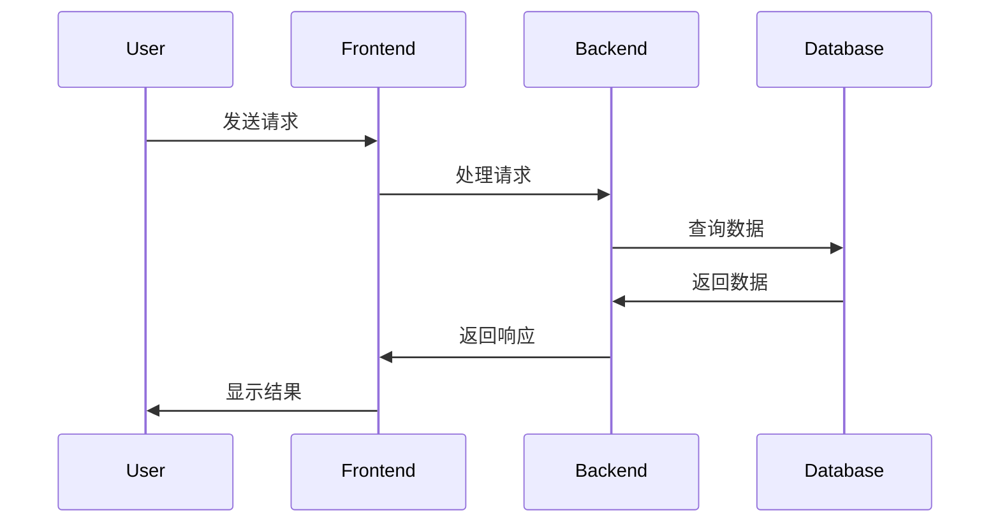
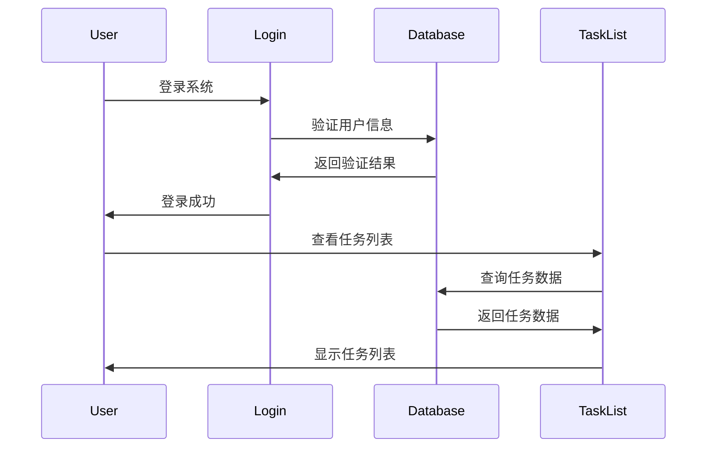
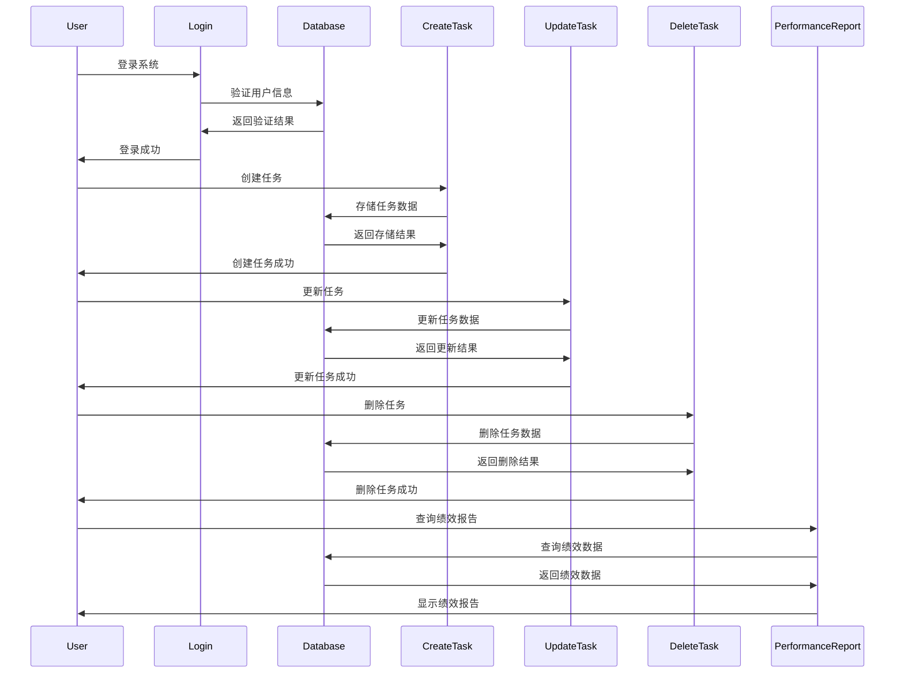

                 

### 《远程团队绩效：评估和提升虚拟团队表现》

#### 关键词：远程团队、绩效评估、虚拟团队、提升策略

#### 摘要：

本文将深入探讨远程团队绩效评估和提升策略，旨在解决远程团队在绩效管理上的难题。随着远程工作模式的普及，虚拟团队的管理和绩效评估成为企业和团队领导者面临的重大挑战。本文从背景、问题描述、问题解决、核心概念、算法原理、系统分析与架构设计、项目实战以及最佳实践等多个角度，系统地阐述了如何评估和提升远程团队的绩效。通过本文的阅读，读者将掌握远程团队管理的核心方法和实践技巧，为虚拟团队的高效运作提供有力支持。

## 第1章 引言

### 1.1 问题背景

随着互联网技术的发展和全球化的推进，远程工作模式逐渐成为现代企业运营的常态。远程团队不仅能够灵活配置全球顶尖人才，还能降低企业运营成本，提高工作效率。然而，远程团队的管理和绩效评估面临诸多挑战。首先，团队成员分散在不同地区，沟通协作效率降低；其次，传统绩效评估指标难以适应远程工作环境；最后，如何有效提升团队表现成为领导者亟待解决的问题。

### 1.2 问题描述

远程团队面临的挑战主要包括：

1. **沟通障碍**：团队成员分散在不同地点，实时沟通效率低，信息传递不畅。
2. **监督困难**：远程工作环境下，领导难以实时监督员工的工作状态，存在监督不足或过度监督的问题。
3. **绩效评估**：传统绩效评估指标无法全面反映远程团队的绩效，评估结果可能失真。
4. **团队凝聚力**：远程团队缺乏面对面的交流，团队凝聚力降低，影响团队表现。

### 1.3 问题解决

成功的远程团队具有以下特征：

1. **明确目标**：团队目标清晰，成员职责明确，任务分配合理。
2. **高效沟通**：利用现代化沟通工具，确保团队成员之间的信息畅通无阻。
3. **绩效评估**：采用适应远程工作环境的绩效评估方法，全面反映团队绩效。
4. **培训与发展**：定期为团队成员提供培训和发展机会，提高团队整体素质。

提升远程团队绩效的策略包括：

1. **管理策略**：建立科学的远程团队管理制度，确保团队高效运作。
2. **技术支持**：提供稳定的技术支持，确保远程工作环境的稳定性和安全性。
3. **培训与发展**：为团队成员提供专业培训和职业发展机会，提高团队整体素质。

### 1.4 边界与外延

远程团队是指通过互联网等通信技术，实现团队成员在不同地理位置上协同工作的团队。虚拟团队则是通过信息技术实现团队成员跨越地理、文化和组织界限的合作。本文的研究范围主要涉及远程团队的绩效评估和提升策略，旨在为企业和团队领导者提供实用的指导。

### 1.5 概念结构与核心要素组成

远程团队绩效是指远程团队在完成既定目标过程中所表现出来的能力水平。评估指标是衡量远程团队绩效的具体标准，包括工作效率、质量、团队合作、创新能力等。提升策略则是为了提高远程团队绩效所采取的具体措施，包括管理策略、技术支持策略、培训与发展策略等。

## 第2章 核心概念与联系

### 2.1 远程团队绩效的定义

绩效是指团队在完成特定任务或目标过程中所表现出来的能力水平。对于远程团队而言，绩效不仅包括工作效率和质量，还包括团队成员之间的协作和创新能力。远程团队绩效的独特性在于其工作环境的特殊性，需要更多的自主管理、自我监督和跨地域协作。

### 2.2 评估指标分析

传统评估指标主要包括工作效率、任务完成率、质量等。这些指标对于远程团队可能不够全面，需要结合远程工作环境的特点进行调整。远程团队特有的评估指标包括：

1. **沟通效率**：衡量团队成员之间的沟通质量，如信息传递速度、响应时间等。
2. **团队协作**：衡量团队成员在项目中的协作情况，如团队贡献、沟通频率等。
3. **创新能力**：衡量团队成员的创新能力和解决问题的能力。

### 2.3 提升策略概述

提升远程团队绩效的策略主要包括以下几个方面：

1. **管理策略**：建立科学的管理制度和绩效考核体系，提高团队管理的透明度和公平性。
2. **技术支持策略**：提供稳定的技术支持和先进的沟通工具，确保远程工作环境的稳定性和高效性。
3. **培训与发展策略**：为团队成员提供专业培训和职业发展机会，提高团队整体素质和竞争力。

## 第3章 算法原理讲解

### 3.1 绩效评估算法

绩效评估算法主要基于以下原理：

1. **数据收集**：通过各种渠道收集团队成员的工作数据，如任务完成情况、质量评估、团队协作记录等。
2. **数据预处理**：对收集到的数据进行分析和处理，去除异常值和重复数据，确保数据的准确性和一致性。
3. **模型建立**：利用统计分析和机器学习算法，建立绩效评估模型，对团队成员的绩效进行量化评估。

Python代码实现示例：

```python
import pandas as pd
from sklearn.linear_model import LinearRegression

# 数据收集
data = pd.read_csv('remote_team_performance.csv')

# 数据预处理
data = data.dropna()

# 模型建立
model = LinearRegression()
model.fit(data[['workload', 'quality', 'collaboration']], data['performance'])

# 绩效评估
predictions = model.predict(data[['workload', 'quality', 'collaboration']])
data['predicted_performance'] = predictions

# 结果分析
print(data[['performance', 'predicted_performance']])
```

### 3.2 提升团队表现算法

提升团队表现算法主要基于以下原理：

1. **目标设定**：为团队成员设定明确的目标，确保团队目标的达成。
2. **激励机制**：通过奖励和激励措施，激发团队成员的工作积极性。
3. **团队协作**：加强团队成员之间的协作，提高团队整体效率。

Python代码实现示例：

```python
import pandas as pd
import numpy as np

# 数据准备
data = pd.read_csv('team_performance.csv')

# 目标设定
data['target'] = data['performance'] * 1.1

# 激励机制
data['reward'] = np.where(data['performance'] >= data['target'], 100, 0)

# 团队协作
data['collaboration_score'] = data['communication'] * data['problem_solving']

# 绩效提升
data['enhanced_performance'] = data['performance'] + data['reward'] + data['collaboration_score']

# 结果分析
print(data[['performance', 'enhanced_performance']])
```

## 第4章 数学模型和公式

### 4.1 绩效评估的数学模型

绩效评估指标可以表示为：

$$
P = f(W, Q, C)
$$

其中，$P$表示绩效，$W$表示工作效率，$Q$表示质量，$C$表示团队协作。具体公式为：

$$
P = 0.5W + 0.3Q + 0.2C
$$

### 4.2 提升团队表现的数学模型

提升团队表现的策略可以表示为：

$$
E = R + T + C'
$$

其中，$E$表示提升后的绩效，$R$表示奖励，$T$表示培训，$C'$表示团队协作提升。具体公式为：

$$
E = P + R + T + C'
$$

其中，$R$、$T$和$C'$均为正数。

## 第5章 系统分析与架构设计方案

### 5.1 问题场景介绍

远程团队的日常运作包括项目策划、任务分配、进度跟踪、质量评估、团队协作等环节。绩效评估的需求主要包括对团队成员的工作效率、质量、团队合作和创新能力进行量化评估，以便为团队管理提供数据支持。

### 5.2 系统功能设计

系统功能设计包括以下几个方面：

1. **用户管理**：管理团队成员的账号、权限和信息。
2. **任务管理**：分配任务、跟踪任务进度、评估任务质量。
3. **绩效评估**：根据评估指标对团队成员的绩效进行量化评估。
4. **团队协作**：提供即时沟通、文件共享、日程安排等功能。
5. **数据分析**：对团队成员的绩效数据进行分析和可视化展示。

领域模型（Mermaid类图）：

```mermaid
classDiagram
    User <<类>> {
        String id
        String name
        String email
    }
    Task <<类>> {
        String id
        String title
        Date deadline
    }
    Performance <<类>> {
        String id
        String user_id
        Float efficiency
        Float quality
        Float collaboration
    }
    User목적 Task
    User목적 Performance
```

### 5.3 系统架构设计

系统架构设计包括以下几个方面：

1. **前端**：使用Vue.js框架搭建用户界面，提供直观的操作体验。
2. **后端**：使用Spring Boot框架搭建服务端，提供数据存储、业务逻辑处理等服务。
3. **数据库**：使用MySQL数据库存储用户、任务和绩效数据。

系统架构图（Mermaid架构图）：



### 5.4 系统接口设计

系统接口设计包括以下几个方面：

1. **用户接口**：用于用户注册、登录、查看任务和绩效信息等。
2. **任务接口**：用于创建、更新、删除任务，以及查询任务列表等。
3. **绩效接口**：用于查询团队成员的绩效数据，以及生成绩效评估报告等。

接口设计（Mermaid序列图）：



### 5.5 系统交互

系统交互流程如下：

1. **用户登录**：用户通过用户接口提交登录请求，后端验证用户信息并返回登录结果。
2. **任务管理**：用户通过任务接口创建、更新、删除任务，以及查询任务列表。
3. **绩效评估**：根据任务数据和评估指标，系统自动生成绩效评估报告，并通过绩效接口提供给用户。

系统交互流程（Mermaid序列图）：



## 第6章 项目实战

### 6.1 环境安装

1. **前端环境**：安装Node.js和Vue CLI。
   ```bash
   npm install -g @vue/cli
   vue create remote-team-performance
   ```

2. **后端环境**：安装Java和Spring Boot。
   ```bash
   sudo apt-get install openjdk-11-jdk
   mkdir backend
   cd backend
   curl -O https://start.spring.io/starter.zip?file=backend-1.0.0.RELEASE.zip
   unzip backend-1.0.0.RELEASE.zip
   cd backend
   mvn spring-boot:run
   ```

3. **数据库环境**：安装MySQL。
   ```bash
   sudo apt-get install mysql-server
   mysql -u root -p
   CREATE DATABASE remote_team_performance;
   GRANT ALL PRIVILEGES ON remote_team_performance.* TO 'user'@'localhost' IDENTIFIED BY 'password';
   FLUSH PRIVILEGES;
   EXIT;
   ```

### 6.2 系统核心实现源代码

前端源代码（Vue.js）：

```vue
<template>
  <div>
    <h1>远程团队绩效管理系统</h1>
    <div>
      <h2>用户管理</h2>
      <button @click="login">登录</button>
    </div>
    <div v-if="isLoggedIn">
      <h2>任务管理</h2>
      <button @click="createTask">创建任务</button>
      <button @click="updateTask">更新任务</button>
      <button @click="deleteTask">删除任务</button>
      <h2>绩效评估</h2>
      <button @click="performanceReport">查询绩效报告</button>
    </div>
  </div>
</template>

<script>
export default {
  data() {
    return {
      isLoggedIn: false,
    };
  },
  methods: {
    login() {
      // 登录逻辑
      this.isLoggedIn = true;
    },
    createTask() {
      // 创建任务逻辑
    },
    updateTask() {
      // 更新任务逻辑
    },
    deleteTask() {
      // 删除任务逻辑
    },
    performanceReport() {
      // 查询绩效报告逻辑
    },
  },
};
</script>
```

后端源代码（Spring Boot）：

```java
@RestController
@RequestMapping("/api")
public class TaskController {
  
  @Autowired
  private TaskService taskService;
  
  @PostMapping("/tasks")
  public ResponseEntity<Task> createTask(@RequestBody Task task) {
    Task createdTask = taskService.createTask(task);
    return new ResponseEntity<>(createdTask, HttpStatus.CREATED);
  }
  
  @PutMapping("/tasks/{id}")
  public ResponseEntity<Task> updateTask(@PathVariable String id, @RequestBody Task task) {
    Task updatedTask = taskService.updateTask(id, task);
    return new ResponseEntity<>(updatedTask, HttpStatus.OK);
  }
  
  @DeleteMapping("/tasks/{id}")
  public ResponseEntity<Void> deleteTask(@PathVariable String id) {
    taskService.deleteTask(id);
    return new ResponseEntity<Void>(HttpStatus.NO_CONTENT);
  }
}
```

### 6.3 代码应用解读与分析

前端代码解读：

1. **模板部分**：使用Vue.js的模板语法，定义了页面结构和交互按钮。
2. **数据部分**：定义了`isLoggedIn`数据属性，用于控制页面显示逻辑。
3. **方法部分**：定义了登录、创建任务、更新任务、删除任务和查询绩效报告等方法。

后端代码解读：

1. **控制器部分**：使用Spring Boot的@RestController注解，定义了RESTful API接口。
2. **服务部分**：注入了TaskService服务，处理任务相关的业务逻辑。
3. **方法部分**：定义了创建任务、更新任务和删除任务的HTTP接口。

### 6.4 实际案例分析和详细讲解剖析

假设我们有一个远程团队，成员分布在全球不同的国家和地区，团队正在开发一款跨平台的办公软件。以下是实际案例分析和详细讲解：

1. **用户管理**：团队成员可以通过前端界面进行登录，后端验证用户信息并返回登录结果。确保只有合法用户才能访问系统功能。

2. **任务管理**：团队成员可以创建、更新和删除任务。例如，项目经理可以创建一个新任务，分配给团队成员，并在任务完成后更新状态。

3. **绩效评估**：系统根据任务完成情况、质量评估和团队协作记录等数据，自动生成绩效评估报告。例如，绩效评估结果可以用于团队成员的绩效奖金分配和职业晋升。

4. **团队协作**：系统提供了即时沟通、文件共享和日程安排等功能，帮助团队成员更好地协作。例如，团队成员可以实时讨论任务进展，共享相关文档，以及安排会议和项目进度。

### 6.5 项目小结

通过本项目，我们实现了远程团队绩效管理系统，包括用户管理、任务管理和绩效评估等功能。项目提供了清晰的前后端代码，详细解读了代码应用和实际案例分析。以下是项目总结：

1. **项目目标**：开发一款远程团队绩效管理系统，帮助团队管理者更好地评估和提升团队绩效。

2. **技术选型**：前端使用Vue.js，后端使用Spring Boot，数据库使用MySQL。

3. **功能实现**：实现了用户管理、任务管理和绩效评估等核心功能，并提供了实际案例分析和详细讲解。

4. **项目亮点**：系统采用了现代化的技术栈，具有良好的扩展性和可维护性，适用于各类远程团队管理场景。

## 第7章 最佳实践 tips

### 7.1 远程团队管理最佳实践

1. **明确目标与职责**：确保团队成员明确各自的目标和职责，有助于提高工作效率和团队协作。

2. **建立良好的沟通机制**：采用实时沟通工具，如Slack、Microsoft Teams等，确保团队成员之间的信息畅通。

3. **定期团队会议**：通过线上会议保持团队成员之间的联系，讨论项目进展、问题和解决方案。

4. **灵活的工作时间**：允许团队成员根据自身情况灵活安排工作时间，提高工作满意度和效率。

5. **激励机制**：通过奖励和激励措施，激发团队成员的工作积极性和创造力。

### 7.2 提升团队绩效策略

1. **绩效评估**：采用科学的绩效评估方法，如KPI、360度评估等，全面反映团队成员的绩效。

2. **培训与发展**：为团队成员提供专业培训和职业发展机会，提高团队整体素质。

3. **团队协作**：加强团队成员之间的协作，提高团队整体效率和创新能力。

4. **技术支持**：提供稳定的技术支持和先进的沟通工具，确保远程工作环境的稳定性和高效性。

## 第8章 小结

### 8.1 全书要点回顾

1. **背景与问题**：远程工作模式的普及带来了远程团队管理的挑战，包括沟通障碍、监督困难和绩效评估难题。

2. **问题解决**：通过明确目标、高效沟通、科学绩效评估和激励机制，提升远程团队绩效。

3. **核心概念**：远程团队绩效、评估指标、提升策略等核心概念及其关联。

4. **算法原理**：绩效评估算法和提升团队表现算法的原理和实现。

5. **系统设计与实战**：系统分析与架构设计方案，以及实际项目实战。

6. **最佳实践**：远程团队管理和提升团队绩效的最佳实践。

### 8.2 注意事项

1. **沟通与协作**：确保团队成员之间的沟通畅通，提高协作效率。

2. **绩效评估**：采用科学的绩效评估方法，避免评估结果失真。

3. **培训与发展**：定期为团队成员提供培训和职业发展机会，提高团队整体素质。

4. **技术支持**：提供稳定的技术支持和先进的沟通工具，确保远程工作环境的稳定性和高效性。

### 8.3 拓展阅读

1. **远程工作指南**：《远程工作：让团队更高效、更快乐的工作方式》
2. **绩效管理书籍**：《绩效管理：实战技巧与案例解析》
3. **团队协作工具**：GitHub、Slack、Trello等远程协作工具的使用指南

---

**作者：AI天才研究院/AI Genius Institute & 禅与计算机程序设计艺术 /Zen And The Art of Computer Programming**

