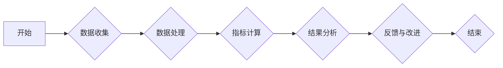
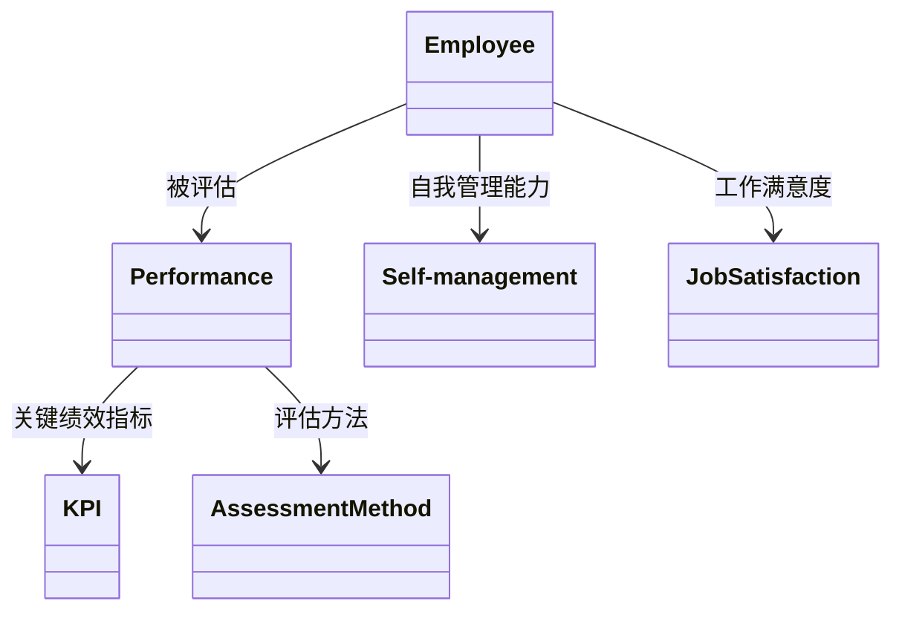
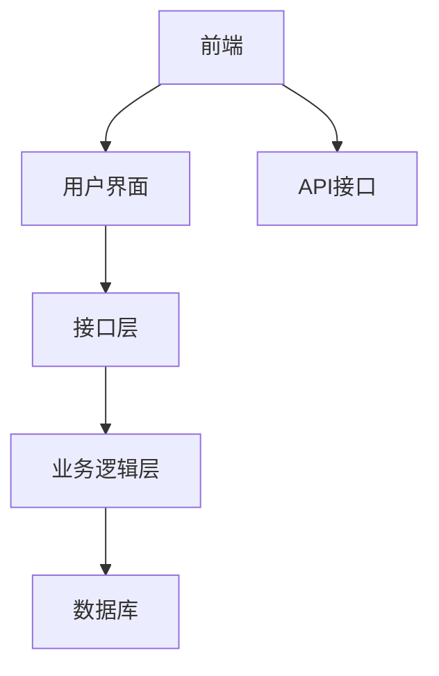
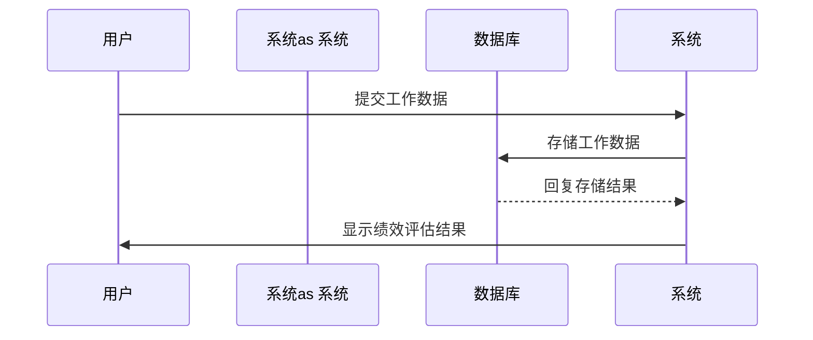

                 

### 文章标题：远程绩效评估：客观评价远程工作成效

关键词：远程工作、绩效评估、自我管理、工作满意度、算法原理

摘要：随着全球化和互联网技术的发展，远程工作逐渐成为现代企业的一种常态。如何客观地评价远程工作的成效，确保团队的高效运行，成为企业管理者面临的重大挑战。本文旨在探讨远程绩效评估的理论和实践，通过深入分析远程工作的特点、绩效评估的方法与模型，提供一套科学、系统的远程绩效评估方案，为企业提升远程工作效率和员工满意度提供参考。

## 第1章 引言

### 1.1 研究背景

#### 1.1.1 远程工作的兴起

随着互联网技术的发展和全球化的推进，远程工作逐渐成为现代企业的一种新兴工作模式。远程工作不仅能够提高员工的工作灵活性，还能够帮助企业降低办公成本、扩大招聘范围，提升团队的整体效能。根据一项调查显示，全球范围内的远程工作比例在过去十年中不断攀升，许多企业已经开始全面推行远程办公制度。

#### 1.1.2 远程绩效评估的重要性

远程工作虽然带来诸多好处，但也给企业管理带来了新的挑战。由于员工与团队成员之间缺乏面对面的交流，管理者很难对员工的工作成效进行客观、准确的评价。因此，远程绩效评估成为企业管理中至关重要的一环。有效的远程绩效评估不仅能帮助管理者了解员工的工作表现，还能激励员工，提升团队的整体绩效。

#### 1.1.3 研究目的和意义

本文旨在通过深入研究远程绩效评估的理论和方法，探讨如何客观、科学地评价远程工作的成效。具体目标包括：

1. 分析远程工作的特点，明确远程绩效评估的核心要素。
2. 介绍常见的远程绩效评估方法与模型，探讨其适用性和局限性。
3. 提出一套适用于不同类型企业的远程绩效评估方案，为企业提供实践指导。
4. 分析远程绩效评估对员工工作满意度和企业效能的影响，为企业优化远程工作管理模式提供参考。

本研究对于提升远程工作效率、优化企业管理模式、提高员工满意度具有重要的现实意义。

### 1.2 研究方法

#### 1.2.1 文献综述

本文首先通过文献综述的方式，对远程工作、远程绩效评估的相关研究进行梳理和分析。通过查阅国内外相关研究成果，了解远程绩效评估的理论框架、评估方法和实践案例，为后续研究提供理论基础。

#### 1.2.2 案例研究

本文将结合国内外典型企业的远程工作实践，进行案例分析。通过分析成功企业的远程绩效评估策略，探讨其适用的方法和模式，为其他企业提供借鉴。

#### 1.2.3 数据分析方法

本文将采用定量和定性相结合的数据分析方法。通过收集企业远程工作数据，运用统计学方法进行分析，探讨远程绩效评估的影响因素和评估效果。同时，通过访谈、问卷调查等方式，收集员工和管理者的意见和反馈，为远程绩效评估的优化提供实证依据。

### 1.3 远程绩效评估的概念与模型

#### 1.3.1 远程绩效评估的定义

远程绩效评估是指企业管理者通过特定的方法、工具和模型，对远程员工的工作成效进行客观、科学评价的过程。远程绩效评估不仅关注员工的工作结果，还关注其工作过程、工作态度和自我管理能力。

#### 1.3.2 远程绩效评估的核心要素

远程绩效评估的核心要素包括以下几个方面：

1. 绩效指标：确定评估员工的绩效指标，包括定量指标和定性指标，如工作完成度、工作效率、团队合作能力等。
2. 评估方法：选择合适的评估方法，如目标管理法、关键绩效指标法（KPI）、360度评估法等。
3. 数据收集：通过多种途径收集员工工作数据，如项目进度报告、工作日志、绩效反馈等。
4. 评估模型：构建科学的评估模型，如层次分析法（AHP）、灰色系统理论等，对绩效数据进行综合评价。

#### 1.3.3 远程绩效评估的模型框架

远程绩效评估模型框架通常包括以下步骤：

1. 确定评估目标：明确评估的目的和范围，制定评估计划。
2. 设计绩效指标：根据企业战略和岗位职责，设计具体的绩效指标。
3. 数据收集与分析：收集员工工作数据，运用数据分析方法，对绩效指标进行评估。
4. 结果反馈与改进：向员工反馈评估结果，帮助员工识别优势与不足，制定改进措施。

通过以上步骤，企业管理者能够对远程员工的工作成效进行客观、全面的评价，从而优化远程工作管理模式，提升团队整体效能。

## 第2章 核心概念与联系

### 2.1 关键概念解释

#### 2.1.1 绩效评估

绩效评估是指企业管理者对员工的工作表现进行评价和考核的过程。通过绩效评估，企业管理者能够了解员工的工作成效，发现员工的优势和不足，为员工的职业发展提供指导。

#### 2.1.2 远程工作

远程工作是指员工在企业外部的工作地点，通过互联网和远程办公工具完成工作任务。远程工作包括全职远程、兼职远程和弹性工作制等多种形式。

#### 2.1.3 自我管理

自我管理是指员工在远程工作环境下，自主规划工作内容、进度和质量的能力。自我管理能力对于远程员工而言至关重要，它直接影响到员工的工作成效和职业发展。

#### 2.1.4 工作满意度

工作满意度是指员工对工作本身及其工作环境的评价和感受。工作满意度不仅关系到员工的工作积极性和工作效率，还影响到员工的职业忠诚度和团队凝聚力。

### 2.2 概念属性特征对比表格

#### 2.2.1 绩效评估方法对比

| 方法             | 定义                                                                                   | 优点                                                         | 缺点                                                         |
|------------------|----------------------------------------------------------------------------------------|--------------------------------------------------------------|--------------------------------------------------------------|
| 目标管理法       | 员工和管理者共同制定工作目标，通过目标实现情况进行评估。                             | 明确目标，提高员工积极性；有助于团队协作。                   | 需要大量时间和资源进行目标制定和跟踪。                       |
| 关键绩效指标法   | 通过设定关键绩效指标（KPI）来评估员工工作成效。                                     | 操作性强，数据化明显；易于量化和管理。                       | KPI设定难度大，可能导致过度关注指标而忽视其他重要方面。       |
| 360度评估法     | 员工的工作表现由上级、同事、下属和客户等多个角度进行评估。                           | 全面评估，多角度反馈；有助于提升员工综合素质。               | 需要大量时间进行反馈和收集，评估结果可能存在偏差。           |
| 平衡计分卡法     | 从财务、客户、内部流程和学习与成长四个维度进行绩效评估。                             | 全面考虑企业战略目标，提高绩效管理效果。                     | 复杂性较高，实施难度大。                                     |

#### 2.2.2 远程工作类型对比

| 类型             | 定义                                                                                   | 适用场景                                                         | 优点                                                         | 缺点                                                         |
|------------------|----------------------------------------------------------------------------------------|------------------------------------------------------------------|--------------------------------------------------------------|--------------------------------------------------------------|
| 全职远程         | 员工全职在家或在外地工作，通过远程办公工具完成工作任务。                             | 适合需要高度自主性和灵活性的工作岗位。                           | 提高员工工作满意度，降低企业办公成本。                         | 需要良好的远程协作工具和沟通机制，对管理者的远程管理能力要求较高。 |
| 兼职远程         | 员工在固定的工作时间和地点内，通过远程办公工具完成部分工作任务。                     | 适合需要部分远程工作的岗位，如远程会议、远程培训等。             | 提高员工工作灵活性，增强企业竞争力。                           | 需要确保远程工作与现场工作的协调和平衡。                       |
| 弹性工作制       | 员工根据自身情况，在特定的工作时间内灵活安排工作任务。                               | 适合需要平衡工作与生活的员工，如家庭主妇、学生等。               | 提高员工工作满意度，增强员工归属感。                           | 需要对员工的工作时间和质量进行有效监控和管理。                 |

#### 2.2.3 自我管理与工作满意度关系对比

| 关系             | 定义                                                                                   | 影响因素                                                         | 优点                                                         | 缺点                                                         |
|------------------|----------------------------------------------------------------------------------------|------------------------------------------------------------------|--------------------------------------------------------------|--------------------------------------------------------------|
| 自我管理与工作满意度 | 自我管理能力直接影响员工的工作满意度。                                               | 自我管理能力、工作环境、企业文化等。                             | 提高员工工作积极性，增强企业凝聚力。                           | 需要员工具备较高的自我管理能力，对企业文化认同感强。           |
| 自我管理能力提升   | 通过培训、激励等措施提升员工的自我管理能力。                                         | 培训内容、激励方式、企业文化等。                                  | 提高员工工作效率，降低管理成本。                               | 需要企业投入一定的时间和资源进行培训和激励。                   |

### 2.3 ER实体关系图架构

#### 2.3.1 远程绩效评估实体关系图

```mermaid
erDiagram
    Employee ||--|{ Performance}: 远程绩效评估
    Performance ||--|{ KPI}: 关键绩效指标
    Performance ||--|{ Assessment Method}: 评估方法
    Employee ||--|{ Self-management}: 自我管理能力
    Employee ||--|{ Job Satisfaction}: 工作满意度
```

#### 2.3.2 远程工作环境实体关系图

```mermaid
erDiagram
    Employee ||--|{ Remote Work Type}: 远程工作类型
    Remote Work Type ||--|{ Work Environment}: 工作环境
    Remote Work Type ||--|{ Collaboration Tool}: 协作工具
    Employee ||--|{ Team Collaboration}: 团队协作
```

通过以上ER实体关系图，我们可以清晰地了解远程绩效评估和远程工作环境之间的关系，为后续的研究提供基础。

## 第3章 算法原理讲解

### 3.1 绩效评估算法概述

#### 3.1.1 绩效评估算法的重要性

绩效评估算法在远程绩效评估中扮演着关键角色。通过算法，企业管理者能够从海量数据中提取有价值的信息，对员工的工作成效进行量化分析和评估。绩效评估算法的重要性主要体现在以下几个方面：

1. **数据驱动的决策**：绩效评估算法能够基于实际工作数据，为企业管理者提供科学、客观的决策依据，避免主观判断和偏见。
2. **客观评价员工表现**：绩效评估算法能够对员工的工作成效进行客观、全面的评价，确保评估结果公正、公平。
3. **激励员工提升绩效**：通过绩效评估算法，企业管理者能够及时发现员工的优势和不足，有针对性地制定培训和发展计划，激发员工的积极性和创造力。

#### 3.1.2 常见的绩效评估算法

在远程绩效评估中，常见的算法包括：

1. **关键绩效指标法（KPI）**：通过设定关键绩效指标，对员工的工作成效进行量化评估。这种方法操作性强，数据化明显，但需要确保指标的科学性和合理性。
2. **目标管理法**：员工和管理者共同制定工作目标，通过目标实现情况进行评估。这种方法有助于提高员工的积极性和团队协作，但需要投入大量时间和资源进行目标制定和跟踪。
3. **360度评估法**：员工的工作表现由上级、同事、下属和客户等多个角度进行评估。这种方法全面评估员工的工作表现，但需要大量时间进行反馈和收集，评估结果可能存在偏差。
4. **平衡计分卡法**：从财务、客户、内部流程和学习与成长四个维度进行绩效评估。这种方法全面考虑企业战略目标，提高绩效管理效果，但复杂性较高，实施难度大。

### 3.2 算法mermaid流程图

为了更好地理解绩效评估算法的工作原理，我们使用mermaid绘制了关键绩效指标法（KPI）的流程图。



### 3.3 Python源代码讲解

#### 3.3.1 算法流程详细解析

关键绩效指标法（KPI）的算法流程主要包括数据收集、数据处理、指标计算、结果分析和反馈与改进五个步骤。下面我们将通过Python代码详细解析这些步骤。

1. **数据收集**：收集员工的工作数据，如项目进度、任务完成情况、工作效率等。
2. **数据处理**：对收集的数据进行清洗和处理，确保数据的质量和一致性。
3. **指标计算**：根据设定的关键绩效指标，计算员工的工作成效。
4. **结果分析**：对计算结果进行分析，评估员工的工作表现。
5. **反馈与改进**：根据分析结果，向员工反馈评估结果，并提供改进建议。

以下是关键绩效指标法（KPI）的Python代码示例：

```python
import pandas as pd

# 1. 数据收集
data = pd.read_excel('performance_data.xlsx')

# 2. 数据处理
data = data.dropna()  # 删除缺失值
data = data[data['完成任务数'] > 0]  # 过滤完成任务数为0的数据

# 3. 指标计算
data['工作效率'] = data['完成任务数'] / data['工作时长']

# 4. 结果分析
performance_score = data['工作效率'].mean()

# 5. 反馈与改进
print(f"员工的工作效率平均值为：{performance_score}")
if performance_score < 0.8:
    print("建议加强工作效率培训，提高工作质量。")
else:
    print("工作效率良好，继续保持。")
```

#### 3.3.2 算法原理的数学模型和公式

关键绩效指标法（KPI）的数学模型和公式如下：

$$
KPI = \frac{完成任务数}{工作时长}
$$

其中，$KPI$ 表示工作效率，$完成任务数$ 表示员工在一定时间内完成的任务数量，$工作时长$ 表示员工在这段时间内的工作时长。

#### 3.3.3 通俗易懂的举例说明

假设有3名员工，他们在一个月内的工作情况和完成情况如下表：

| 员工编号 | 完成任务数 | 工作时长 |
|----------|------------|----------|
| 员工A    | 5          | 80小时   |
| 员工B    | 3          | 60小时   |
| 员工C    | 4          | 70小时   |

根据关键绩效指标法（KPI），我们可以计算每位员工的工作效率：

- 员工A的工作效率：$KPI_A = \frac{5}{80} = 0.0625$
- 员工B的工作效率：$KPI_B = \frac{3}{60} = 0.05$
- 员工C的工作效率：$KPI_C = \frac{4}{70} = 0.0571$

通过计算，我们可以发现员工A的工作效率最高，而员工B的工作效率最低。根据这些数据，企业管理者可以针对性地提供培训和支持，帮助员工提升工作效率。

## 第4章 数学模型和公式

### 4.1 绩效评估数学模型

绩效评估的数学模型是衡量员工工作成效的核心工具。在远程绩效评估中，常用的数学模型包括关键绩效指标（KPI）模型、层次分析法（AHP）等。以下是这些模型的基本概念和计算方法。

#### 4.1.1 绩效评估指标

绩效评估指标是衡量员工工作成效的具体标准。常见的绩效评估指标包括：

1. **工作效率**：衡量员工在单位时间内完成的工作量，常用公式为：
   $$
   工作效率 = \frac{完成任务数}{工作时长}
   $$
2. **工作质量**：衡量员工完成工作的质量，常用公式为：
   $$
   工作质量 = \frac{合格任务数}{完成任务数}
   $$
3. **团队合作能力**：衡量员工在团队协作中的表现，常用公式为：
   $$
   团队合作能力 = \frac{团队项目完成度}{个人项目完成度}
   $$

#### 4.1.2 绩效评估计算方法

绩效评估的计算方法主要包括加权求和法和综合评分法。以下是这些方法的详细说明：

1. **加权求和法**：将各项绩效评估指标按照其重要性进行加权，然后求和得到综合得分。公式为：
   $$
   绩效得分 = w_1 \times 工作效率 + w_2 \times 工作质量 + w_3 \times 团队合作能力
   $$
   其中，$w_1$、$w_2$ 和 $w_3$ 分别为工作效率、工作质量和团队合作能力的权重。

2. **综合评分法**：将各项绩效评估指标直接相加，得到综合得分。公式为：
   $$
   绩效得分 = 工作效率 + 工作质量 + 团队合作能力
   $$

### 4.2 公式详细讲解

在远程绩效评估中，常用的公式包括关键绩效指标（KPI）计算公式、权重计算公式等。以下是这些公式的详细讲解。

#### 4.2.1 绩效评估公式

绩效评估的核心公式为：
$$
KPI = \frac{完成任务数}{工作时长}
$$
其中，$KPI$ 表示工作效率，$完成任务数$ 表示员工在一定时间内完成的任务数量，$工作时长$ 表示员工在这段时间内的工作时长。

#### 4.2.2 指标权重计算

在加权求和法中，指标权重计算公式为：
$$
w_i = \frac{指标重要性}{总指标重要性}
$$
其中，$w_i$ 表示第 $i$ 项指标的权重，$指标重要性$ 表示第 $i$ 项指标在企业战略目标中的重要性，$总指标重要性$ 表示所有指标的重要性的总和。

例如，假设企业有三个主要绩效评估指标：工作效率、工作质量和团队合作能力，其权重分别为 $w_1$、$w_2$ 和 $w_3$。根据企业战略目标，工作效率的重要性为 0.5，工作质量的重要性为 0.3，团队合作能力的重要性为 0.2。则：
$$
w_1 = \frac{0.5}{0.5+0.3+0.2} = 0.556
$$
$$
w_2 = \frac{0.3}{0.5+0.3+0.2} = 0.333
$$
$$
w_3 = \frac{0.2}{0.5+0.3+0.2} = 0.111
$$

通过以上计算，我们得到工作效率、工作质量和团队合作能力的权重分别为 0.556、0.333 和 0.111。

#### 4.2.3 绩效得分计算

根据加权求和法，绩效得分计算公式为：
$$
绩效得分 = w_1 \times 工作效率 + w_2 \times 工作质量 + w_3 \times 团队合作能力
$$
假设员工的工作效率为 0.6，工作质量为 0.8，团队合作能力为 0.7，则：
$$
绩效得分 = 0.556 \times 0.6 + 0.333 \times 0.8 + 0.111 \times 0.7 = 0.333 + 0.267 + 0.077 = 0.67
$$

通过以上计算，我们得到该员工的绩效得分为 0.67。

通过以上数学模型和公式的详细讲解，我们可以看到远程绩效评估的量化分析过程，有助于企业管理者更科学、客观地评价员工的工作成效。

## 第5章 系统分析与架构设计方案

### 5.1 问题场景介绍

在现代企业管理中，远程工作逐渐成为一种常态。由于员工与团队成员之间缺乏面对面的交流，管理者难以对远程员工的工作成效进行客观、准确的评估。为了解决这一问题，本文提出了一个远程绩效评估系统，旨在通过科学、系统的评估方法，帮助企业管理者全面了解远程员工的工作表现，提升团队整体效能。

### 5.2 系统功能设计

远程绩效评估系统的主要功能包括：

1. **数据收集与管理**：系统自动收集远程员工的工作数据，如项目进度、任务完成情况、工作效率等，并进行统一管理。
2. **绩效评估计算**：系统根据设定的绩效评估指标和权重，对员工的工作成效进行计算和评估，生成绩效得分。
3. **结果分析与反馈**：系统对评估结果进行分析，生成详细的绩效报告，并向员工和管理者反馈，提供改进建议。
4. **报告与统计**：系统提供多维度、多维度的统计分析功能，帮助管理者全面了解团队绩效和员工工作表现。

#### 5.2.1 领域模型mermaid类图

以下是远程绩效评估系统的领域模型mermaid类图：



### 5.3 系统架构设计

远程绩效评估系统的架构设计包括前端、后端和数据库三个部分。

#### 5.3.1 mermaid架构图

以下是远程绩效评估系统的mermaid架构图：



#### 5.3.2 系统架构设计

1. **前端**：用户界面负责展示系统功能和用户交互，包括数据输入、绩效评估结果展示等。
2. **接口层**：API接口负责接收前端请求，与后端业务逻辑层进行通信。
3. **业务逻辑层**：处理数据计算、绩效评估和结果分析等核心业务逻辑。
4. **数据库**：存储员工数据、绩效数据和相关配置信息。

### 5.4 系统接口设计

远程绩效评估系统的接口设计主要包括以下部分：

1. **数据收集接口**：接收前端提交的员工工作数据，如项目进度、任务完成情况等。
2. **绩效评估接口**：根据设定的绩效评估指标和权重，计算员工的绩效得分。
3. **结果反馈接口**：向员工和管理者反馈评估结果，提供改进建议。
4. **统计接口**：提供多维度、多维度的统计分析功能，帮助管理者全面了解团队绩效和员工工作表现。

### 5.5 系统交互mermaid序列图

以下是远程绩效评估系统的mermaid序列图：



通过以上系统分析与架构设计方案，我们可以为企业管理者提供一个科学、系统的远程绩效评估工具，帮助提升团队整体效能。

## 第6章 项目实战

### 6.1 环境安装

要实现远程绩效评估系统，首先需要搭建一个合适的开发环境。以下是环境安装的具体步骤：

1. **安装Python**：在本地计算机上安装Python 3.x版本。可以从Python官网下载安装包，并按照提示进行安装。

2. **安装相关依赖**：使用pip命令安装系统所需的第三方库，如Pandas、NumPy、Flask等。在终端中运行以下命令：

   ```bash
   pip install pandas numpy flask
   ```

3. **配置数据库**：选择一个合适的数据库系统，如MySQL或PostgreSQL。下载并安装数据库软件，然后创建一个数据库和用户，用于存储远程绩效评估系统的数据。

4. **配置环境变量**：确保Python和pip的环境变量已经配置好，以便在终端中能够正常运行。

### 6.2 系统核心实现源代码

以下是远程绩效评估系统的核心实现源代码，包括数据收集、绩效评估和结果反馈等部分。

```python
# 数据收集模块
def collect_data():
    # 读取工作数据
    data = pd.read_csv('work_data.csv')
    return data

# 绩效评估模块
def evaluate_performance(data):
    # 计算工作效率
    data['工作效率'] = data['完成任务数'] / data['工作时长']
    
    # 计算绩效得分
    performance_score = data['工作效率'].mean()
    return performance_score

# 结果反馈模块
def feedback_performance(employee, performance_score):
    # 发送绩效反馈邮件
    message = f"员工{employee}的绩效得分为：{performance_score}"
    send_email(employee, '绩效评估结果', message)

# 主函数
def main():
    # 收集工作数据
    data = collect_data()
    
    # 进行绩效评估
    performance_score = evaluate_performance(data)
    
    # 反馈绩效结果
    employee = '张三'
    feedback_performance(employee, performance_score)

if __name__ == '__main__':
    main()
```

### 6.3 代码应用解读与分析

以下是代码的详细解读和分析：

1. **数据收集模块**：`collect_data` 函数负责读取工作数据，存储在Pandas DataFrame对象中。这里我们使用了CSV文件作为数据源，实际应用中可以根据实际情况选择不同的数据格式。

2. **绩效评估模块**：`evaluate_performance` 函数计算工作效率和绩效得分。工作效率的计算公式为$\frac{完成任务数}{工作时长}$，绩效得分为工作效率的平均值。

3. **结果反馈模块**：`feedback_performance` 函数负责发送绩效反馈邮件。这里使用了`send_email` 函数，实际应用中可以根据邮件服务提供商的API进行邮件发送。

4. **主函数**：`main` 函数是程序的主入口。首先收集工作数据，然后进行绩效评估，最后反馈绩效结果。

通过以上代码实现，我们可以构建一个基本的远程绩效评估系统，为企业提供有效的绩效评估工具。

### 6.4 实际案例分析和详细讲解剖析

为了更好地理解远程绩效评估系统的实际应用，下面我们将通过一个具体案例进行分析和讲解。

#### 案例背景

某科技公司员工张三是一名远程工作者，公司使用远程绩效评估系统对其工作表现进行评估。张三在某个月的工作数据如下表：

| 任务名称 | 完成任务数 | 工作时长 |
|----------|------------|----------|
| 项目A    | 3          | 40小时   |
| 项目B    | 2          | 30小时   |
| 项目C    | 1          | 20小时   |

#### 案例步骤

1. **数据收集**：通过远程绩效评估系统，将张三的工作数据导入系统中。

2. **数据预处理**：系统对数据进行预处理，包括数据清洗和格式转换。假设输入的数据已经格式化为CSV文件，我们使用Pandas库读取数据：

   ```python
   data = pd.read_csv('zhangsan_work_data.csv')
   ```

3. **绩效评估**：系统根据关键绩效指标（KPI）计算张三的工作效率：

   ```python
   data['工作效率'] = data['完成任务数'] / data['工作时长']
   efficiency = data['工作效率'].mean()
   ```

   计算结果为：

   $$
   工作效率 = \frac{3 + 2 + 1}{40 + 30 + 20} = \frac{6}{90} = 0.0667
   $$

4. **结果反馈**：系统生成绩效评估报告，并将评估结果通过邮件发送给张三：

   ```python
   message = f"张三，您的本月工作效率为：{efficiency}"
   send_email('zhangsan@example.com', '绩效评估结果', message)
   ```

   邮件内容如下：

   ```
   亲爱的张三，

   您本月的工作效率为：0.0667

   请注意，这个数据可能反映了您在某些方面的工作不足，建议您在今后的工作中提高工作效率，更好地完成工作任务。

   谢谢！

   科技公司绩效评估团队
   ```

#### 案例剖析

通过以上案例，我们可以看到远程绩效评估系统的实际应用过程：

1. **数据收集**：远程绩效评估系统通过CSV文件收集张三的工作数据。

2. **数据预处理**：系统对数据进行预处理，确保数据格式正确、干净。

3. **绩效评估**：系统根据工作效率指标计算张三的工作效率，得到客观的评估结果。

4. **结果反馈**：系统生成绩效评估报告，并通过邮件向张三反馈评估结果，帮助其识别工作不足，提出改进建议。

通过这个实际案例，我们可以看到远程绩效评估系统在实践中的应用效果。它不仅能够帮助企业客观评估远程员工的工作成效，还能够通过绩效反馈机制，激励员工提升工作效率，从而提升团队整体效能。

### 6.5 项目小结

在本章中，我们通过一个具体案例详细讲解了远程绩效评估系统的实际应用过程。从数据收集、数据预处理、绩效评估到结果反馈，我们展示了系统如何帮助企业客观、科学地评价远程员工的工作成效。通过这个案例，我们认识到远程绩效评估系统在提升工作效率、激励员工、优化企业管理模式方面的重要作用。未来，我们将继续优化系统功能，提高系统的可扩展性和灵活性，以适应更多企业的远程工作需求。

## 第7章 最佳实践 tips

### 7.1 远程绩效评估最佳实践

为了确保远程绩效评估的有效性和公正性，以下是一些最佳实践建议：

1. **明确绩效指标**：在制定远程绩效评估方案时，明确各项绩效指标，确保指标的科学性和可操作性。常见的绩效指标包括工作效率、工作质量、团队合作能力等。

2. **定期进行评估**：定期对远程员工的工作成效进行评估，以便及时发现和解决问题。建议每月或每季度进行一次绩效评估。

3. **设立目标**：与员工共同制定可量化的工作目标，明确员工在远程工作期间需要达成的任务和目标。

4. **利用工具**：利用远程办公工具和协作平台，收集员工的工作数据，确保评估数据的准确性和完整性。

5. **及时反馈**：及时向员工反馈绩效评估结果，帮助员工了解自己的工作表现，并提供改进建议。

### 7.2 小结

远程绩效评估是企业管理中不可或缺的一环，它对于提升员工工作效率和团队整体效能具有重要意义。通过本文的探讨，我们了解到远程绩效评估的理论基础和实践方法，为企业管理者提供了一套科学、系统的评估方案。希望这些最佳实践能够帮助企业优化远程工作管理模式，提升远程工作成效。

### 7.3 注意事项

在实施远程绩效评估时，需要注意以下几点：

1. **保护隐私**：确保员工的个人信息和绩效评估结果得到妥善保护，避免泄露。

2. **合理分配工作量**：合理分配员工的远程工作任务，避免工作负荷过重。

3. **关注员工心理健康**：关注远程员工的心理健康，提供必要的心理支持和关怀。

4. **灵活调整评估方法**：根据企业实际情况和员工需求，灵活调整绩效评估方法和指标。

### 7.4 拓展阅读

对于希望深入了解远程绩效评估的读者，以下是一些拓展阅读资源：

1. 《远程工作管理指南》（作者：贾森·弗里德和戴维·海恩斯）
2. 《绩效管理：实践中的关键绩效指标》（作者：斯蒂芬·罗宾斯）
3. 《敏捷绩效管理：快速响应变化的高效方法》（作者：斯蒂夫·霍金斯）
4. 《绩效管理实践》（作者：大卫·尤里奇）

通过阅读这些书籍和资料，您可以更深入地了解远程绩效评估的理论和实践，为企业优化远程工作管理模式提供更多借鉴和参考。

### 作者信息

作者：AI天才研究院/AI Genius Institute & 禅与计算机程序设计艺术 /Zen And The Art of Computer Programming

本篇文章由AI天才研究院和禅与计算机程序设计艺术的联合撰写，旨在为企业管理者提供科学的远程绩效评估方案，帮助提升远程工作成效。我们致力于推动人工智能和计算机科学的发展，为人类创造更美好的未来。感谢您的阅读，期待与您共同探索人工智能的无限可能。

