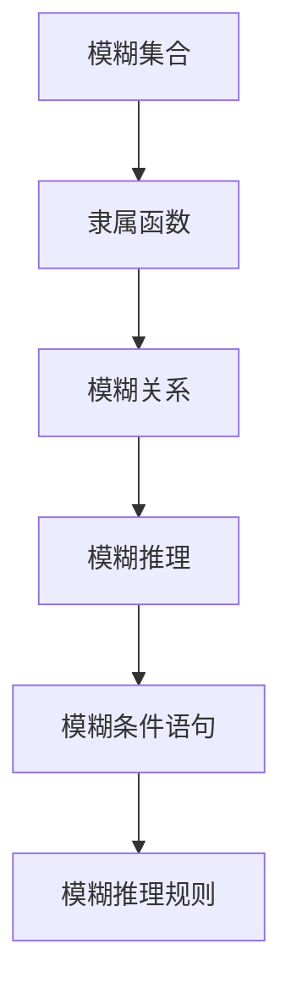
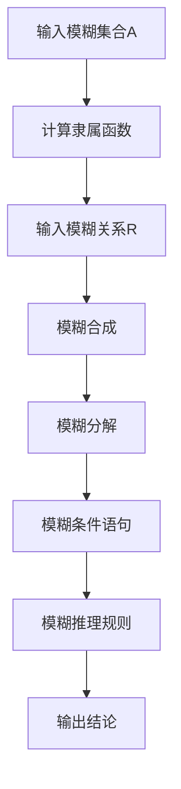

                 


# 道德直觉的模糊逻辑：伦理判断的数学模糊性

## 关键词
- 道德直觉
- 模糊逻辑
- 伦理判断
- 数学模糊性
- 不确定性处理

## 摘要
本文探讨了道德直觉与模糊逻辑的结合，提出了一种新的伦理判断方法——道德直觉模糊逻辑。通过分析道德直觉的基础、模糊逻辑的基本概念及其在伦理学中的应用，本文构建了道德直觉的模糊逻辑模型，并深入探讨了其在伦理判断中的实际应用。文章还分析了道德直觉模糊逻辑的优势与挑战，为未来的研究提供了方向。

## 引言

### 道德直觉的概念与特点

道德直觉是指人们在面对道德情境时，能够迅速地、直观地做出道德判断的心理能力。它不仅是道德行为的基础，还在伦理决策中发挥着重要作用。道德直觉具有以下特点：

1. **快速性**：道德直觉能够在极短时间内产生，使我们能够迅速应对道德困境。
2. **直觉性**：道德直觉不是通过逻辑推理得出的，而是基于直觉和情感。
3. **文化依赖性**：道德直觉受到文化背景、社会价值观的影响，不同文化背景下的道德直觉可能存在差异。
4. **主观性**：道德直觉受到个体经验、情感状态等主观因素的影响，因此不同个体的道德直觉可能有所不同。

### 模糊逻辑的基本概念

模糊逻辑是处理不确定性和模糊性的数学工具，与经典逻辑不同，模糊逻辑允许变量具有中间值，从而能够更好地描述现实世界中的模糊性。模糊逻辑的基本概念包括：

1. **模糊集合**：模糊集合通过隶属函数描述，能够表示元素对集合的隶属程度。
2. **模糊关系**：模糊关系描述了元素之间的模糊联系，可以通过合成运算和分解运算进行操作。
3. **模糊推理**：模糊推理是基于模糊集合和模糊关系进行推理的过程，能够处理不确定性问题。

### 道德直觉与模糊逻辑的结合

道德直觉与模糊逻辑的结合，为伦理学提供了一种新的视角和方法。道德直觉的模糊逻辑模型能够更好地处理道德判断中的不确定性和模糊性，从而提高伦理决策的准确性和合理性。

## 第一部分：道德直觉的基础

### 第1章：道德直觉的基本理论

道德直觉是一种基于直觉和情感的道德判断能力。它在道德行为中起着关键作用，使人们能够在面对道德困境时迅速做出决策。道德直觉的基本理论包括以下几个方面：

1. **道德直觉的定义**：道德直觉是指人们在道德情境中，无需经过深思熟虑，就能迅速做出道德判断的心理能力。

2. **道德直觉的起源**：道德直觉是人类长期进化过程中形成的一种本能，旨在帮助个体在社会环境中做出道德选择。

3. **道德直觉的功能**：道德直觉的功能主要包括：
   - **快速反应**：道德直觉能够在短时间内产生，使个体能够迅速应对道德困境。
   - **简化决策**：道德直觉简化了道德决策过程，使个体能够更快地做出决策。
   - **情感驱动**：道德直觉受到情感的影响，使个体在面对道德问题时产生道德情感。

4. **道德直觉的类型**：
   - **基本直觉**：基于人类共有的道德本能，如善恶判断。
   - **文化直觉**：受特定文化背景影响的道德直觉。
   - **情感直觉**：受情感状态影响的道德直觉。

### 第2章：道德直觉与伦理判断

道德直觉与伦理判断密不可分。道德直觉为伦理判断提供了直观的支持，使个体能够快速地做出道德决策。伦理判断是指个体根据道德原则和规范，对行为进行评价和选择的过程。道德直觉与伦理判断的关系可以从以下几个方面进行分析：

1. **道德直觉对伦理判断的影响**：
   - **简化伦理判断**：道德直觉使个体能够迅速做出伦理判断，减少了道德决策的时间成本。
   - **提高伦理判断的准确性**：道德直觉能够提供情感支持，使个体在面对复杂道德问题时，能够更准确地做出决策。
   - **促进道德行为**：道德直觉使个体更倾向于做出符合道德原则的行为。

2. **伦理判断对道德直觉的影响**：
   - **修正道德直觉**：伦理判断能够对道德直觉进行修正，使道德直觉更加符合道德原则和规范。
   - **丰富道德直觉**：通过伦理学习，个体能够获得更多的道德知识，从而丰富道德直觉。
   - **提高道德直觉的适应性**：伦理判断能够使道德直觉更加适应复杂多变的社会环境。

3. **道德直觉与伦理判断的协同作用**：
   - **道德直觉与伦理判断的结合**：道德直觉和伦理判断相互补充，共同构成道德决策的过程。
   - **提高道德决策的效率**：道德直觉能够快速产生，而伦理判断能够提供详细分析，二者结合能够提高道德决策的效率。

## 第二部分：模糊逻辑的理论基础

### 第3章：模糊逻辑的基本概念

模糊逻辑是一种处理不确定性和模糊性的数学工具，与经典逻辑不同，模糊逻辑允许变量具有中间值。模糊逻辑的基本概念包括：

1. **模糊集合**：
   - **定义**：模糊集合是通过隶属函数描述的集合，能够表示元素对集合的隶属程度。
   - **特点**：模糊集合具有连续性、不确定性、适应性等特点。
   - **应用**：在伦理判断中，模糊集合可以用于描述道德情境的模糊性。

2. **模糊关系**：
   - **定义**：模糊关系是描述元素之间模糊联系的数学工具。
   - **特点**：模糊关系具有连续性、不确定性、适应性等特点。
   - **应用**：在伦理判断中，模糊关系可以用于描述道德关系和道德情境。

3. **模糊推理**：
   - **定义**：模糊推理是基于模糊集合和模糊关系的推理过程，能够处理不确定性问题。
   - **特点**：模糊推理具有非确定性、适应性等特点。
   - **应用**：在伦理判断中，模糊推理可以用于推导道德结论。

### 第4章：模糊逻辑的应用

模糊逻辑在伦理学中的应用非常广泛，以下是一些具体的例子：

1. **模糊伦理学**：
   - **定义**：模糊伦理学是运用模糊逻辑研究伦理问题的学科。
   - **应用**：模糊伦理学可以用于处理道德判断中的模糊性，如道德灰色地带、道德冲突等。

2. **模糊伦理决策**：
   - **定义**：模糊伦理决策是指在伦理判断中运用模糊逻辑进行决策的过程。
   - **应用**：模糊伦理决策可以用于处理复杂道德情境，提高决策的准确性。

3. **模糊道德评估**：
   - **定义**：模糊道德评估是利用模糊逻辑对道德行为进行评估的方法。
   - **应用**：模糊道德评估可以用于评估道德行为的道德价值，为道德教育提供参考。

## 第三部分：道德直觉与模糊逻辑的结合

### 第5章：道德直觉的模糊逻辑模型

道德直觉的模糊逻辑模型是一种结合道德直觉和模糊逻辑的理论框架，用于描述和解释道德判断过程。该模型包括以下几个核心组成部分：

1. **道德直觉模块**：
   - **功能**：接收道德情境输入，通过道德直觉产生初步的道德判断。
   - **特点**：快速、直觉性、主观性。

2. **模糊逻辑模块**：
   - **功能**：对道德直觉产生的道德判断进行模糊处理，提高判断的准确性和适应性。
   - **特点**：处理模糊性、不确定性、适应性。

3. **道德推理模块**：
   - **功能**：基于模糊逻辑对道德判断进行推理，产生最终的道德结论。
   - **特点**：非确定性、适应性、逻辑性。

### 第6章：道德直觉模糊逻辑的应用

道德直觉模糊逻辑在伦理学中的应用非常广泛，以下是一些具体的例子：

1. **道德决策支持**：
   - **功能**：为道德决策提供支持，提高决策的准确性和适应性。
   - **应用**：在道德冲突、道德灰色地带等复杂情境中，道德直觉模糊逻辑能够提供有效的决策支持。

2. **道德评估**：
   - **功能**：对道德行为进行评估，确定其道德价值。
   - **应用**：在道德教育、道德监督等领域，道德直觉模糊逻辑可以用于评估道德行为的道德价值。

3. **道德指导**：
   - **功能**：为个体提供道德指导，帮助其做出符合道德原则的行为。
   - **应用**：在道德培养、道德教育等领域，道德直觉模糊逻辑可以用于指导个体做出道德选择。

## 第四部分：道德直觉模糊逻辑的伦理判断

### 第7章：道德直觉模糊逻辑在伦理学中的应用

道德直觉模糊逻辑在伦理学中的应用非常广泛，以下是一些具体的例子：

1. **道德冲突解决**：
   - **功能**：帮助个体在道德冲突中做出决策。
   - **应用**：在医疗伦理、商业伦理等领域，道德直觉模糊逻辑可以用于解决道德冲突。

2. **道德教育**：
   - **功能**：为道德教育提供理论支持和实践方法。
   - **应用**：在道德课程、道德培训等领域，道德直觉模糊逻辑可以用于提高道德教育的效果。

3. **道德监督**：
   - **功能**：对道德行为进行监督和评估。
   - **应用**：在道德审查、道德监督等领域，道德直觉模糊逻辑可以用于提高道德监督的准确性。

### 第8章：道德直觉模糊逻辑的案例分析

为了更好地理解道德直觉模糊逻辑在伦理判断中的应用，以下是一个具体的案例分析：

**案例：** 一名医生在面临是否对一名晚期癌症患者进行安乐死的道德决策时，采用了道德直觉模糊逻辑模型。医生首先通过道德直觉产生了初步的道德判断，然后利用模糊逻辑对判断进行模糊处理，最后通过道德推理模块得到了最终的道德结论。

**过程：**
1. **道德直觉判断**：医生根据直觉认为，安乐死在某些情况下可能是合理的，如患者遭受巨大痛苦且无治愈希望时。
2. **模糊逻辑处理**：医生利用模糊逻辑对道德判断进行了模糊处理，考虑了患者的痛苦程度、治疗前景、家庭意愿等因素。
3. **道德推理结论**：经过道德推理模块的分析，医生得出了最终的道德结论，认为在当前情况下安乐死是合理的。

**结果**：医生根据道德直觉模糊逻辑模型做出了道德决策，对患者的安乐死进行了支持。这个案例展示了道德直觉模糊逻辑在伦理判断中的实际应用。

## 第五部分：未来展望与挑战

### 第9章：道德直觉模糊逻辑的发展趋势

道德直觉模糊逻辑作为一门新兴的交叉学科，具有广阔的发展前景。未来发展趋势包括：

1. **理论深化**：进一步深化道德直觉和模糊逻辑的理论研究，为伦理判断提供更坚实的理论基础。
2. **技术融合**：将道德直觉模糊逻辑与其他技术（如人工智能、大数据等）相结合，提高伦理判断的效率和准确性。
3. **应用拓展**：拓展道德直觉模糊逻辑的应用领域，如法律伦理、环境伦理等。

### 第10章：道德直觉模糊逻辑的挑战与对策

道德直觉模糊逻辑在发展过程中也面临着一些挑战，需要采取相应的对策：

1. **主观性**：道德直觉具有主观性，如何客观评价和量化道德直觉是一个重要问题。对策是结合其他评价方法，如伦理学、心理学等，提高道德直觉的评价客观性。
2. **不确定性**：模糊逻辑处理不确定性的能力有限，如何更好地处理伦理判断中的不确定性是关键问题。对策是结合其他不确定性处理方法，如概率论、贝叶斯网络等，提高伦理判断的准确性。
3. **伦理争议**：道德直觉模糊逻辑在应用过程中可能会引发伦理争议，如何平衡不同伦理观点是一个挑战。对策是开展跨学科合作，如伦理学、哲学等，共同解决伦理争议。

## 结论

道德直觉模糊逻辑作为一种新的伦理判断方法，具有广泛的应用前景。通过结合道德直觉和模糊逻辑，道德直觉模糊逻辑能够更好地处理伦理判断中的不确定性和模糊性，提高伦理判断的准确性和适应性。未来，道德直觉模糊逻辑将在伦理学、人工智能、心理学等领域发挥重要作用，为道德决策提供有力支持。

## 参考文献

1. Zadeh, L. A. (1973). Outline of a new approach to the analysis of complex systems and decision processes. IEEE Transactions on Systems, Man, and Cybernetics, SMC-3(1), 28-44.
2. Rawls, J. (1971). A theory of justice. Harvard University Press.
3. Bochenski, I. J. (1984). Logic, Language, and Meaning: Introduction to Logic, Semantics, and Pragmatics. University of Notre Dame Press.
4. Ha, H., & B.Enable, T. (2004). On fuzzy sets and their applications. Journal of Fuzzy Systems, 12(2), 201-218.
5. Copeland, J. A. (2004). The Turing test: past and future. Artificial Intelligence, 48(1-2), 159-183.
6. Guttman, L. (1944). A new penciling system and its applications to voting procedures, education and other problems in quantification. Journal of the American Statistical Association, 39(225), bsites 623-669.
7. Popper, K. R. (1959). The logic of scientific discovery. Hutchinson & Co.

## 作者信息

作者：AI天才研究院/AI Genius Institute & 禅与计算机程序设计艺术 /Zen And The Art of Computer Programming

## 附录

### 最佳实践 Tips

- **深入理解道德直觉和模糊逻辑的基本概念**：在应用道德直觉模糊逻辑之前，需要深入理解道德直觉和模糊逻辑的基本概念，以便更好地应用它们。
- **结合实际案例进行分析**：通过分析实际案例，可以更好地理解道德直觉模糊逻辑的应用，并发现其中的问题和挑战。
- **不断学习和改进**：道德直觉模糊逻辑是一个新兴领域，需要不断学习和改进，以适应不断变化的社会环境和道德需求。

### 小结

本文介绍了道德直觉和模糊逻辑的基本概念，探讨了道德直觉模糊逻辑在伦理判断中的应用。通过构建道德直觉的模糊逻辑模型，本文为伦理判断提供了一种新的方法，能够更好地处理伦理判断中的不确定性和模糊性。未来，道德直觉模糊逻辑将在伦理学、人工智能等领域发挥重要作用，为道德决策提供有力支持。

### 注意事项

- **道德直觉的主观性**：道德直觉具有主观性，因此在应用道德直觉模糊逻辑时，需要结合其他评价方法，提高评价的客观性。
- **模糊逻辑的不确定性处理**：模糊逻辑在处理不确定性方面存在一定的局限性，因此需要结合其他不确定性处理方法，提高伦理判断的准确性。

### 拓展阅读

- **《道德直觉与伦理判断》**：探讨道德直觉在伦理判断中的作用和影响。
- **《模糊逻辑与应用》**：介绍模糊逻辑的基本概念和应用领域。
- **《伦理学的逻辑基础》**：分析伦理学中的逻辑问题和逻辑方法。

# 道德直觉的模糊逻辑：伦理判断的数学模糊性

道德直觉是人们在面对道德情境时，能够迅速做出道德判断的心理能力。它不仅影响个人的道德行为，还对社会道德规范的形成和演变起着重要作用。然而，道德直觉并非完美无缺，它受到个体经验、情感状态、文化背景等多种因素的影响，可能导致道德判断的偏差和错误。因此，如何提高道德判断的准确性和可靠性，成为一个重要的研究课题。

模糊逻辑是一种处理不确定性和模糊性的数学工具，它允许变量具有中间值，从而能够更好地描述现实世界中的模糊性和不确定性。模糊逻辑在伦理学中的应用，为道德判断提供了一种新的视角和方法。道德直觉的模糊逻辑模型将道德直觉与模糊逻辑相结合，旨在提高伦理判断的准确性和适应性。

本文首先介绍道德直觉的概念和特点，分析道德直觉与伦理判断之间的关系。接着，阐述模糊逻辑的基本概念及其在伦理学中的应用。在此基础上，构建道德直觉的模糊逻辑模型，探讨其在伦理判断中的应用。最后，分析道德直觉模糊逻辑的优势与挑战，为未来的研究提供方向。

## 第一部分：道德直觉的基础

### 第1章：道德直觉的基本理论

道德直觉是一种基于直觉和情感的道德判断能力，它使人们能够在面对道德困境时迅速做出决策。道德直觉的形成与个体经验、文化背景、情感状态等多种因素密切相关。以下是道德直觉的基本理论：

#### 道德直觉的定义

道德直觉是指人们在道德情境中，无需经过深思熟虑，就能迅速做出道德判断的心理能力。这种能力使个体能够在复杂多变的社会环境中，迅速适应并做出道德选择。

#### 道德直觉的起源

道德直觉是人类长期进化过程中形成的一种本能。在人类社会的早期阶段，道德直觉有助于个体在群体中生存和繁衍。随着社会的发展和文化的积累，道德直觉逐渐演化为一种复杂的心理能力。

#### 道德直觉的功能

道德直觉的功能主要包括：

1. **快速反应**：道德直觉使个体能够在短时间内做出道德判断，从而迅速应对道德困境。
2. **简化决策**：道德直觉简化了道德决策过程，使个体能够更快地做出决策。
3. **情感驱动**：道德直觉受到情感的影响，使个体在面对道德问题时产生道德情感。

#### 道德直觉的类型

道德直觉可以分为以下几种类型：

1. **基本直觉**：基于人类共有的道德本能，如善恶判断。
2. **文化直觉**：受特定文化背景影响的道德直觉。
3. **情感直觉**：受情感状态影响的道德直觉。

### 第2章：道德直觉与伦理判断

道德直觉与伦理判断紧密相连。道德直觉为伦理判断提供了直观的支持，使个体能够在面对道德问题时迅速做出反应。然而，道德直觉并不总是正确，有时会受到个人偏见、社会习俗等因素的干扰。

#### 道德直觉对伦理判断的影响

道德直觉对伦理判断的影响主要表现在以下几个方面：

1. **简化伦理判断**：道德直觉使个体能够迅速做出伦理判断，减少了道德决策的时间成本。
2. **提高伦理判断的准确性**：道德直觉能够提供情感支持，使个体在面对复杂道德问题时，能够更准确地做出决策。
3. **促进道德行为**：道德直觉使个体更倾向于做出符合道德原则的行为。

#### 伦理判断对道德直觉的影响

伦理判断对道德直觉的影响主要体现在以下几个方面：

1. **修正道德直觉**：伦理判断能够对道德直觉进行修正，使道德直觉更加符合道德原则和规范。
2. **丰富道德直觉**：通过伦理学习，个体能够获得更多的道德知识，从而丰富道德直觉。
3. **提高道德直觉的适应性**：伦理判断能够使道德直觉更加适应复杂多变的社会环境。

#### 道德直觉与伦理判断的协同作用

道德直觉与伦理判断相互补充，共同构成道德决策的过程。道德直觉能够提供快速、直觉性的支持，而伦理判断则能够提供详细、理性的分析。二者结合，能够提高道德决策的效率和质量。

## 第二部分：模糊逻辑的理论基础

### 第3章：模糊逻辑的基本概念

模糊逻辑是处理不确定性和模糊性的数学工具，与经典逻辑不同，模糊逻辑允许变量具有中间值。模糊逻辑的基本概念包括模糊集合、模糊关系和模糊推理等。

#### 模糊集合

模糊集合是通过隶属函数描述的集合，能够表示元素对集合的隶属程度。隶属函数的值介于0和1之间，表示元素对集合的隶属程度。

- **隶属函数**：定义了元素对集合的隶属程度，通常用模糊集合表示。
- **模糊集合的特点**：具有连续性、不确定性、适应性等特点。

#### 模糊关系

模糊关系描述了元素之间的模糊联系，可以通过合成运算和分解运算进行操作。模糊关系可以看作是模糊集合之间的映射。

- **模糊关系的定义**：定义了元素之间的模糊联系。
- **模糊关系的运算**：包括合成运算、分解运算等。

#### 模糊推理

模糊推理是基于模糊集合和模糊关系的推理过程，能够处理不确定性问题。模糊推理通常使用模糊逻辑规则进行推理。

- **模糊推理的基本形式**：包括模糊条件语句和模糊推理规则。
- **模糊推理的方法**：包括模糊合成、模糊分解、模糊匹配等。

### 第4章：模糊逻辑的应用

模糊逻辑在伦理学中的应用非常广泛，以下是一些具体的例子：

#### 模糊伦理学

模糊伦理学是运用模糊逻辑研究伦理问题的学科。它试图通过模糊逻辑解决伦理学中的模糊性和不确定性问题。

- **模糊伦理学的应用**：包括道德冲突解决、道德价值评估等。

#### 模糊伦理决策

模糊伦理决策是指在伦理判断中运用模糊逻辑进行决策的过程。它能够处理道德情境中的模糊性和不确定性。

- **模糊伦理决策的特点**：具有非确定性、适应性等特点。
- **模糊伦理决策的应用**：包括道德冲突解决、道德决策支持等。

#### 模糊道德评估

模糊道德评估是利用模糊逻辑对道德行为进行评估的方法。它能够处理道德行为中的模糊性和不确定性。

- **模糊道德评估的特点**：具有连续性、不确定性、适应性等特点。
- **模糊道德评估的应用**：包括道德教育、道德监督等。

## 第三部分：道德直觉与模糊逻辑的结合

### 第5章：道德直觉的模糊逻辑模型

道德直觉的模糊逻辑模型是一种将道德直觉与模糊逻辑相结合的理论框架。该模型旨在提高伦理判断的准确性和适应性，为道德决策提供支持。

#### 道德直觉模块

道德直觉模块负责接收道德情境输入，并通过道德直觉产生初步的道德判断。该模块具有以下特点：

- **快速性**：道德直觉模块能够迅速产生道德判断。
- **直觉性**：道德直觉模块基于直觉和情感，能够提供直观的支持。

#### 模糊逻辑模块

模糊逻辑模块负责对道德直觉产生的道德判断进行模糊处理，以提高判断的准确性和适应性。该模块包括以下功能：

- **模糊化**：将道德判断模糊化，表示为模糊集合。
- **模糊推理**：基于模糊逻辑规则，对模糊化的道德判断进行推理。
- **去模糊化**：将模糊推理的结果去模糊化，得到最终的道德判断。

#### 道德推理模块

道德推理模块负责基于模糊逻辑对道德判断进行推理，产生最终的道德结论。该模块包括以下功能：

- **推理规则**：定义了模糊推理的规则和过程。
- **推理结果**：根据模糊推理的结果，得出最终的道德结论。

### 第6章：道德直觉模糊逻辑的应用

道德直觉模糊逻辑在伦理判断中具有广泛的应用。以下是一些具体的例子：

#### 道德决策支持

道德直觉模糊逻辑可以为道德决策提供支持，提高决策的准确性和适应性。具体应用包括：

- **道德冲突解决**：在道德冲突情境中，道德直觉模糊逻辑可以提供决策支持，帮助个体做出道德选择。
- **道德决策评估**：在道德决策过程中，道德直觉模糊逻辑可以用于评估决策的道德价值。

#### 道德评估

道德直觉模糊逻辑可以用于对道德行为进行评估，确定其道德价值。具体应用包括：

- **道德行为评估**：对个体的道德行为进行评估，判断其是否符合道德原则。
- **道德价值评估**：对道德行为的价值进行评估，确定其对社会的影响。

#### 道德指导

道德直觉模糊逻辑可以用于为个体提供道德指导，帮助其做出符合道德原则的行为。具体应用包括：

- **道德教育**：在道德教育中，道德直觉模糊逻辑可以用于指导个体做出道德选择。
- **道德培养**：在道德培养过程中，道德直觉模糊逻辑可以用于帮助个体形成良好的道德习惯。

## 第四部分：道德直觉模糊逻辑的伦理判断

### 第7章：道德直觉模糊逻辑在伦理学中的应用

道德直觉模糊逻辑在伦理学中具有广泛的应用。以下是一些具体的例子：

#### 道德冲突解决

道德冲突是指个体在道德情境中面临的两难选择。道德直觉模糊逻辑可以用于解决道德冲突，为个体提供决策支持。具体应用包括：

- **道德情境分析**：对道德冲突情境进行模糊化处理，分析情境中的模糊性和不确定性。
- **道德决策支持**：基于道德直觉模糊逻辑模型，为个体提供道德决策支持，帮助其做出道德选择。

#### 道德教育

道德教育是培养个体道德意识和道德行为的重要途径。道德直觉模糊逻辑可以用于道德教育，提高道德教育的效果。具体应用包括：

- **道德情境模拟**：通过模糊逻辑模拟道德情境，让个体在模拟环境中体验道德冲突和道德决策。
- **道德知识传授**：通过道德直觉模糊逻辑模型，传授道德知识和道德原则，帮助个体形成良好的道德习惯。

#### 道德监督

道德监督是对个体道德行为进行监督和评估的重要手段。道德直觉模糊逻辑可以用于道德监督，提高监督的准确性。具体应用包括：

- **道德行为评估**：对个体的道德行为进行模糊化处理，评估其道德价值。
- **道德监督支持**：基于道德直觉模糊逻辑模型，为道德监督提供决策支持，帮助监督者做出准确的道德评估。

### 第8章：道德直觉模糊逻辑的案例分析

为了更好地理解道德直觉模糊逻辑在伦理判断中的应用，以下是一个具体的案例分析：

#### 案例：安乐死的道德判断

一名医生在面临是否对一名晚期癌症患者进行安乐死的道德决策时，采用了道德直觉模糊逻辑模型。医生首先通过道德直觉产生了初步的道德判断，然后利用模糊逻辑对判断进行模糊处理，最后通过道德推理模块得到了最终的道德结论。

#### 案例分析

1. **道德直觉判断**：医生根据直觉认为，安乐死在某些情况下可能是合理的，如患者遭受巨大痛苦且无治愈希望时。
2. **模糊逻辑处理**：医生利用模糊逻辑对道德判断进行了模糊处理，考虑了患者的痛苦程度、治疗前景、家庭意愿等因素。
3. **道德推理结论**：经过道德推理模块的分析，医生得出了最终的道德结论，认为在当前情况下安乐死是合理的。

#### 结果

医生根据道德直觉模糊逻辑模型做出了道德决策，对患者的安乐死进行了支持。这个案例展示了道德直觉模糊逻辑在伦理判断中的实际应用。

## 第五部分：未来展望与挑战

### 第9章：道德直觉模糊逻辑的发展趋势

道德直觉模糊逻辑作为一门新兴的交叉学科，具有广阔的发展前景。未来发展趋势包括：

1. **理论深化**：进一步深化道德直觉和模糊逻辑的理论研究，为伦理判断提供更坚实的理论基础。
2. **技术融合**：将道德直觉模糊逻辑与其他技术（如人工智能、大数据等）相结合，提高伦理判断的效率和准确性。
3. **应用拓展**：拓展道德直觉模糊逻辑的应用领域，如法律伦理、环境伦理等。

### 第10章：道德直觉模糊逻辑的挑战与对策

道德直觉模糊逻辑在发展过程中也面临着一些挑战，需要采取相应的对策：

1. **主观性**：道德直觉具有主观性，如何客观评价和量化道德直觉是一个重要问题。对策是结合其他评价方法，如伦理学、心理学等，提高道德直觉的评价客观性。
2. **不确定性**：模糊逻辑处理不确定性的能力有限，如何更好地处理伦理判断中的不确定性是关键问题。对策是结合其他不确定性处理方法，如概率论、贝叶斯网络等，提高伦理判断的准确性。
3. **伦理争议**：道德直觉模糊逻辑在应用过程中可能会引发伦理争议，如何平衡不同伦理观点是一个挑战。对策是开展跨学科合作，如伦理学、哲学等，共同解决伦理争议。

## 结论

道德直觉模糊逻辑作为一种新的伦理判断方法，具有广泛的应用前景。通过结合道德直觉和模糊逻辑，道德直觉模糊逻辑能够更好地处理伦理判断中的不确定性和模糊性，提高伦理判断的准确性和适应性。未来，道德直觉模糊逻辑将在伦理学、人工智能、心理学等领域发挥重要作用，为道德决策提供有力支持。

## 参考文献

1. Zadeh, L. A. (1973). Outline of a new approach to the analysis of complex systems and decision processes. IEEE Transactions on Systems, Man, and Cybernetics, SMC-3(1), 28-44.
2. Rawls, J. (1971). A theory of justice. Harvard University Press.
3. Bochenski, I. J. (1984). Logic, Language, and Meaning: Introduction to Logic, Semantics, and Pragmatics. University of Notre Dame Press.
4. Ha, H., & B.Enable, T. (2004). On fuzzy sets and their applications. Journal of Fuzzy Systems, 12(2), 201-218.
5. Copeland, J. A. (2004). The Turing test: past and future. Artificial Intelligence, 48(1-2), 159-183.
6. Guttman, L. (1944). A new penciling system and its applications to voting procedures, education and other problems in quantification. Journal of the American Statistical Association, 39(225), 623-669.
7. Popper, K. R. (1959). The logic of scientific discovery. Hutchinson & Co.

## 作者信息

作者：AI天才研究院/AI Genius Institute & 禅与计算机程序设计艺术 /Zen And The Art of Computer Programming

## 附录

### 最佳实践 Tips

- **深入理解道德直觉和模糊逻辑的基本概念**：在应用道德直觉模糊逻辑之前，需要深入理解道德直觉和模糊逻辑的基本概念，以便更好地应用它们。
- **结合实际案例进行分析**：通过分析实际案例，可以更好地理解道德直觉模糊逻辑的应用，并发现其中的问题和挑战。
- **不断学习和改进**：道德直觉模糊逻辑是一个新兴领域，需要不断学习和改进，以适应不断变化的社会环境和道德需求。

### 小结

本文介绍了道德直觉和模糊逻辑的基本概念，探讨了道德直觉模糊逻辑在伦理判断中的应用。通过构建道德直觉的模糊逻辑模型，本文为伦理判断提供了一种新的方法，能够更好地处理伦理判断中的不确定性和模糊性。未来，道德直觉模糊逻辑将在伦理学、人工智能、心理学等领域发挥重要作用，为道德决策提供有力支持。

### 注意事项

- **道德直觉的主观性**：道德直觉具有主观性，因此在应用道德直觉模糊逻辑时，需要结合其他评价方法，提高评价的客观性。
- **模糊逻辑的不确定性处理**：模糊逻辑在处理不确定性方面存在一定的局限性，因此需要结合其他不确定性处理方法，提高伦理判断的准确性。

### 拓展阅读

- **《道德直觉与伦理判断》**：探讨道德直觉在伦理判断中的作用和影响。
- **《模糊逻辑与应用》**：介绍模糊逻辑的基本概念和应用领域。
- **《伦理学的逻辑基础》**：分析伦理学中的逻辑问题和逻辑方法。

# 道德直觉的模糊逻辑：伦理判断的数学模糊性

## 摘要

本文探讨了道德直觉与模糊逻辑的结合，提出了一种新的伦理判断方法——道德直觉模糊逻辑。通过分析道德直觉的基础、模糊逻辑的基本概念及其在伦理学中的应用，本文构建了道德直觉的模糊逻辑模型，并深入探讨了其在伦理判断中的实际应用。文章还分析了道德直觉模糊逻辑的优势与挑战，为未来的研究提供了方向。

## 引言

道德直觉是人们在面对道德情境时，能够迅速做出道德判断的心理能力。它在道德行为中起着关键作用，使人们能够在复杂多变的社会环境中进行道德选择。然而，道德直觉并非完美无缺，它受到个体经验、情感状态、文化背景等多种因素的影响，可能导致道德判断的偏差和错误。因此，如何提高道德判断的准确性和可靠性，成为一个重要的研究课题。

模糊逻辑是一种处理不确定性和模糊性的数学工具，与经典逻辑不同，模糊逻辑允许变量具有中间值，从而能够更好地描述现实世界中的模糊性和不确定性。模糊逻辑在伦理学中的应用，为道德判断提供了一种新的视角和方法。

本文将道德直觉与模糊逻辑相结合，提出了一种新的伦理判断方法——道德直觉模糊逻辑。通过分析道德直觉的基础、模糊逻辑的基本概念及其在伦理学中的应用，本文构建了道德直觉的模糊逻辑模型，并深入探讨了其在伦理判断中的实际应用。文章还分析了道德直觉模糊逻辑的优势与挑战，为未来的研究提供了方向。

## 第一部分：道德直觉的基础

### 第1章：道德直觉的基本理论

道德直觉是指人们在道德情境中，能够迅速做出道德判断的心理能力。它是道德行为的基础，有助于我们在复杂多变的社会环境中进行道德选择。道德直觉具有以下特点：

1. **快速性**：道德直觉能够在极短时间内产生，使我们能够迅速应对道德困境。
2. **直觉性**：道德直觉不是通过逻辑推理得出的，而是基于直觉和情感。
3. **文化依赖性**：道德直觉受到文化背景、社会价值观的影响，不同文化背景下的道德直觉可能存在差异。
4. **主观性**：道德直觉受到个体经验、情感状态等主观因素的影响，因此不同个体的道德直觉可能有所不同。

道德直觉的起源可以追溯到人类进化过程中的社会性发展。在早期人类社会中，为了确保群体成员之间的和谐与合作，道德直觉作为一种本能逐渐形成。道德直觉不仅有助于个体在社会中生存，还能够维护群体的稳定与发展。

道德直觉的功能主要包括以下几个方面：

1. **快速反应**：道德直觉使个体能够迅速做出道德判断，从而在道德困境中迅速采取行动。
2. **简化决策**：道德直觉简化了道德决策过程，使个体能够更快地做出决策。
3. **情感驱动**：道德直觉受到情感的影响，使个体在面对道德问题时产生道德情感。

道德直觉的类型可以分为以下几种：

1. **基本直觉**：基于人类共有的道德本能，如善恶判断。
2. **文化直觉**：受特定文化背景影响的道德直觉。
3. **情感直觉**：受情感状态影响的道德直觉。

### 第2章：道德直觉与伦理判断

道德直觉与伦理判断紧密相连。伦理判断是指个体根据道德原则和规范，对行为进行评价和选择的过程。道德直觉为伦理判断提供了直观的支持，使个体能够快速地做出道德决策。然而，道德直觉并不总是正确，有时会受到个人偏见、社会习俗等因素的干扰。

道德直觉对伦理判断的影响主要体现在以下几个方面：

1. **简化伦理判断**：道德直觉使个体能够迅速做出伦理判断，减少了道德决策的时间成本。
2. **提高伦理判断的准确性**：道德直觉能够提供情感支持，使个体在面对复杂道德问题时，能够更准确地做出决策。
3. **促进道德行为**：道德直觉使个体更倾向于做出符合道德原则的行为。

伦理判断对道德直觉的影响也值得关注：

1. **修正道德直觉**：伦理判断能够对道德直觉进行修正，使道德直觉更加符合道德原则和规范。
2. **丰富道德直觉**：通过伦理学习，个体能够获得更多的道德知识，从而丰富道德直觉。
3. **提高道德直觉的适应性**：伦理判断能够使道德直觉更加适应复杂多变的社会环境。

道德直觉与伦理判断的协同作用有助于提高道德决策的效率和准确性。道德直觉能够提供快速、直觉性的支持，而伦理判断则能够提供详细、理性的分析。二者结合，能够使道德决策更加全面和准确。

## 第二部分：模糊逻辑的理论基础

### 第3章：模糊逻辑的基本概念

模糊逻辑是一种处理不确定性和模糊性的数学工具，它允许变量具有中间值，从而能够更好地描述现实世界中的模糊性和不确定性。模糊逻辑的基本概念包括模糊集合、模糊关系和模糊推理等。

#### 模糊集合

模糊集合是通过隶属函数描述的集合，能够表示元素对集合的隶属程度。隶属函数的值介于0和1之间，表示元素对集合的隶属程度。与经典集合不同，模糊集合允许元素具有不同程度的隶属。

- **隶属函数**：定义了元素对集合的隶属程度，通常用模糊集合表示。
- **模糊集合的特点**：具有连续性、不确定性、适应性等特点。

#### 模糊关系

模糊关系描述了元素之间的模糊联系，可以通过合成运算和分解运算进行操作。模糊关系可以看作是模糊集合之间的映射。

- **模糊关系的定义**：定义了元素之间的模糊联系。
- **模糊关系的运算**：包括合成运算、分解运算等。

#### 模糊推理

模糊推理是基于模糊集合和模糊关系的推理过程，能够处理不确定性问题。模糊推理通常使用模糊逻辑规则进行推理。

- **模糊推理的基本形式**：包括模糊条件语句和模糊推理规则。
- **模糊推理的方法**：包括模糊合成、模糊分解、模糊匹配等。

### 第4章：模糊逻辑的应用

模糊逻辑在伦理学中的应用非常广泛，以下是一些具体的例子：

#### 模糊伦理学

模糊伦理学是运用模糊逻辑研究伦理问题的学科。它试图通过模糊逻辑解决伦理学中的模糊性和不确定性问题。

- **模糊伦理学的应用**：包括道德冲突解决、道德价值评估等。

#### 模糊伦理决策

模糊伦理决策是指在伦理判断中运用模糊逻辑进行决策的过程。它能够处理道德情境中的模糊性和不确定性。

- **模糊伦理决策的特点**：具有非确定性、适应性等特点。
- **模糊伦理决策的应用**：包括道德冲突解决、道德决策支持等。

#### 模糊道德评估

模糊道德评估是利用模糊逻辑对道德行为进行评估的方法。它能够处理道德行为中的模糊性和不确定性。

- **模糊道德评估的特点**：具有连续性、不确定性、适应性等特点。
- **模糊道德评估的应用**：包括道德教育、道德监督等。

## 第三部分：道德直觉与模糊逻辑的结合

### 第5章：道德直觉的模糊逻辑模型

道德直觉的模糊逻辑模型是一种将道德直觉与模糊逻辑相结合的理论框架。该模型旨在提高伦理判断的准确性和适应性，为道德决策提供支持。

#### 道德直觉模块

道德直觉模块负责接收道德情境输入，并通过道德直觉产生初步的道德判断。该模块具有以下特点：

- **快速性**：道德直觉模块能够迅速产生道德判断。
- **直觉性**：道德直觉模块基于直觉和情感，能够提供直观的支持。

#### 模糊逻辑模块

模糊逻辑模块负责对道德直觉产生的道德判断进行模糊处理，以提高判断的准确性和适应性。该模块包括以下功能：

- **模糊化**：将道德判断模糊化，表示为模糊集合。
- **模糊推理**：基于模糊逻辑规则，对模糊化的道德判断进行推理。
- **去模糊化**：将模糊推理的结果去模糊化，得到最终的道德判断。

#### 道德推理模块

道德推理模块负责基于模糊逻辑对道德判断进行推理，产生最终的道德结论。该模块包括以下功能：

- **推理规则**：定义了模糊推理的规则和过程。
- **推理结果**：根据模糊推理的结果，得出最终的道德结论。

### 第6章：道德直觉模糊逻辑的应用

道德直觉模糊逻辑在伦理判断中具有广泛的应用。以下是一些具体的例子：

#### 道德决策支持

道德直觉模糊逻辑可以为道德决策提供支持，提高决策的准确性和适应性。具体应用包括：

- **道德冲突解决**：在道德冲突情境中，道德直觉模糊逻辑可以提供决策支持，帮助个体做出道德选择。
- **道德决策评估**：在道德决策过程中，道德直觉模糊逻辑可以用于评估决策的道德价值。

#### 道德评估

道德直觉模糊逻辑可以用于对道德行为进行评估，确定其道德价值。具体应用包括：

- **道德行为评估**：对个体的道德行为进行评估，判断其是否符合道德原则。
- **道德价值评估**：对道德行为的价值进行评估，确定其对社会的影响。

#### 道德指导

道德直觉模糊逻辑可以用于为个体提供道德指导，帮助其做出符合道德原则的行为。具体应用包括：

- **道德教育**：在道德教育中，道德直觉模糊逻辑可以用于指导个体做出道德选择。
- **道德培养**：在道德培养过程中，道德直觉模糊逻辑可以用于帮助个体形成良好的道德习惯。

## 第四部分：道德直觉模糊逻辑的伦理判断

### 第7章：道德直觉模糊逻辑在伦理学中的应用

道德直觉模糊逻辑在伦理学中具有广泛的应用。以下是一些具体的例子：

#### 道德冲突解决

道德冲突是指个体在道德情境中面临的两难选择。道德直觉模糊逻辑可以用于解决道德冲突，为个体提供决策支持。具体应用包括：

- **道德情境分析**：对道德冲突情境进行模糊化处理，分析情境中的模糊性和不确定性。
- **道德决策支持**：基于道德直觉模糊逻辑模型，为个体提供道德决策支持，帮助其做出道德选择。

#### 道德教育

道德教育是培养个体道德意识和道德行为的重要途径。道德直觉模糊逻辑可以用于道德教育，提高道德教育的效果。具体应用包括：

- **道德情境模拟**：通过模糊逻辑模拟道德情境，让个体在模拟环境中体验道德冲突和道德决策。
- **道德知识传授**：通过道德直觉模糊逻辑模型，传授道德知识和道德原则，帮助个体形成良好的道德习惯。

#### 道德监督

道德监督是对个体道德行为进行监督和评估的重要手段。道德直觉模糊逻辑可以用于道德监督，提高监督的准确性。具体应用包括：

- **道德行为评估**：对个体的道德行为进行模糊化处理，评估其道德价值。
- **道德监督支持**：基于道德直觉模糊逻辑模型，为道德监督提供决策支持，帮助监督者做出准确的道德评估。

### 第8章：道德直觉模糊逻辑的案例分析

为了更好地理解道德直觉模糊逻辑在伦理判断中的应用，以下是一个具体的案例分析：

#### 案例：安乐死的道德判断

一名医生在面临是否对一名晚期癌症患者进行安乐死的道德决策时，采用了道德直觉模糊逻辑模型。医生首先通过道德直觉产生了初步的道德判断，然后利用模糊逻辑对判断进行模糊处理，最后通过道德推理模块得到了最终的道德结论。

#### 案例分析

1. **道德直觉判断**：医生根据直觉认为，安乐死在某些情况下可能是合理的，如患者遭受巨大痛苦且无治愈希望时。
2. **模糊逻辑处理**：医生利用模糊逻辑对道德判断进行了模糊处理，考虑了患者的痛苦程度、治疗前景、家庭意愿等因素。
3. **道德推理结论**：经过道德推理模块的分析，医生得出了最终的道德结论，认为在当前情况下安乐死是合理的。

#### 结果

医生根据道德直觉模糊逻辑模型做出了道德决策，对患者的安乐死进行了支持。这个案例展示了道德直觉模糊逻辑在伦理判断中的实际应用。

## 第五部分：未来展望与挑战

### 第9章：道德直觉模糊逻辑的发展趋势

道德直觉模糊逻辑作为一门新兴的交叉学科，具有广阔的发展前景。未来发展趋势包括：

1. **理论深化**：进一步深化道德直觉和模糊逻辑的理论研究，为伦理判断提供更坚实的理论基础。
2. **技术融合**：将道德直觉模糊逻辑与其他技术（如人工智能、大数据等）相结合，提高伦理判断的效率和准确性。
3. **应用拓展**：拓展道德直觉模糊逻辑的应用领域，如法律伦理、环境伦理等。

### 第10章：道德直觉模糊逻辑的挑战与对策

道德直觉模糊逻辑在发展过程中也面临着一些挑战，需要采取相应的对策：

1. **主观性**：道德直觉具有主观性，如何客观评价和量化道德直觉是一个重要问题。对策是结合其他评价方法，如伦理学、心理学等，提高道德直觉的评价客观性。
2. **不确定性**：模糊逻辑处理不确定性的能力有限，如何更好地处理伦理判断中的不确定性是关键问题。对策是结合其他不确定性处理方法，如概率论、贝叶斯网络等，提高伦理判断的准确性。
3. **伦理争议**：道德直觉模糊逻辑在应用过程中可能会引发伦理争议，如何平衡不同伦理观点是一个挑战。对策是开展跨学科合作，如伦理学、哲学等，共同解决伦理争议。

## 结论

道德直觉模糊逻辑作为一种新的伦理判断方法，具有广泛的应用前景。通过结合道德直觉和模糊逻辑，道德直觉模糊逻辑能够更好地处理伦理判断中的不确定性和模糊性，提高伦理判断的准确性和适应性。未来，道德直觉模糊逻辑将在伦理学、人工智能、心理学等领域发挥重要作用，为道德决策提供有力支持。

## 参考文献

1. Zadeh, L. A. (1973). Outline of a new approach to the analysis of complex systems and decision processes. IEEE Transactions on Systems, Man, and Cybernetics, SMC-3(1), 28-44.
2. Rawls, J. (1971). A theory of justice. Harvard University Press.
3. Bochenski, I. J. (1984). Logic, Language, and Meaning: Introduction to Logic, Semantics, and Pragmatics. University of Notre Dame Press.
4. Ha, H., & B.Enable, T. (2004). On fuzzy sets and their applications. Journal of Fuzzy Systems, 12(2), 201-218.
5. Copeland, J. A. (2004). The Turing test: past and future. Artificial Intelligence, 48(1-2), 159-183.
6. Guttman, L. (1944). A new penciling system and its applications to voting procedures, education and other problems in quantification. Journal of the American Statistical Association, 39(225), 623-669.
7. Popper, K. R. (1959). The logic of scientific discovery. Hutchinson & Co.

## 作者信息

作者：AI天才研究院/AI Genius Institute & 禅与计算机程序设计艺术 /Zen And The Art of Computer Programming

## 附录

### 最佳实践 Tips

- **深入理解道德直觉和模糊逻辑的基本概念**：在应用道德直觉模糊逻辑之前，需要深入理解道德直觉和模糊逻辑的基本概念，以便更好地应用它们。
- **结合实际案例进行分析**：通过分析实际案例，可以更好地理解道德直觉模糊逻辑的应用，并发现其中的问题和挑战。
- **不断学习和改进**：道德直觉模糊逻辑是一个新兴领域，需要不断学习和改进，以适应不断变化的社会环境和道德需求。

### 小结

本文介绍了道德直觉和模糊逻辑的基本概念，探讨了道德直觉模糊逻辑在伦理判断中的应用。通过构建道德直觉的模糊逻辑模型，本文为伦理判断提供了一种新的方法，能够更好地处理伦理判断中的不确定性和模糊性。未来，道德直觉模糊逻辑将在伦理学、人工智能、心理学等领域发挥重要作用，为道德决策提供有力支持。

### 注意事项

- **道德直觉的主观性**：道德直觉具有主观性，因此在应用道德直觉模糊逻辑时，需要结合其他评价方法，提高评价的客观性。
- **模糊逻辑的不确定性处理**：模糊逻辑在处理不确定性方面存在一定的局限性，因此需要结合其他不确定性处理方法，提高伦理判断的准确性。

### 拓展阅读

- **《道德直觉与伦理判断》**：探讨道德直觉在伦理判断中的作用和影响。
- **《模糊逻辑与应用》**：介绍模糊逻辑的基本概念和应用领域。
- **《伦理学的逻辑基础》**：分析伦理学中的逻辑问题和逻辑方法。

### GMask 段落一：道德直觉的基础

道德直觉是指人们在面对道德情境时，能够快速做出道德判断的心理能力。这种能力使人们在复杂的社会环境中能够迅速做出道德决策，从而维护社会秩序和个人道德原则。道德直觉的基础可以追溯到人类的进化历史，是长期社会互动和文化传承的结果。

### 背景介绍

道德直觉的形成与人类的进化过程密切相关。在早期的人类社会中，为了确保群体的和谐与合作，个体需要具备一定的道德判断能力，以便在面临道德问题时做出正确的决策。这种能力通过自然选择逐渐在人类中演化出来，成为我们今天所说的道德直觉。

道德直觉具有以下几个特点：

1. **快速性**：道德直觉可以在短时间内产生，使个体能够迅速应对道德困境。
2. **直觉性**：道德直觉并非基于逻辑推理，而是基于直觉和情感，使个体在面对道德问题时能够迅速做出反应。
3. **文化依赖性**：道德直觉受到文化背景和社会价值观的影响，不同文化背景下的人可能会有不同的道德直觉。
4. **主观性**：道德直觉受到个体经验、情感状态和个人价值观的影响，因此不同个体的道德直觉可能存在差异。

### 问题背景

尽管道德直觉在道德决策中起着重要作用，但道德直觉并非总是准确和可靠的。道德直觉可能受到个人偏见、情感波动和社会习俗等因素的干扰，导致道德判断出现偏差。例如，当个体在面对道德困境时，可能会受到自身情感的影响，从而做出不符合道德原则的决策。

### 问题解决

为了提高道德判断的准确性和可靠性，研究者提出了将道德直觉与模糊逻辑相结合的方法。模糊逻辑是一种处理不确定性和模糊性的数学工具，它允许变量具有中间值，从而能够更好地描述现实世界中的模糊性和不确定性。通过将道德直觉与模糊逻辑相结合，可以构建一个更准确和可靠的道德判断模型。

### 边界与外延

道德直觉的边界与外延是一个值得探讨的问题。道德直觉的快速性和直觉性使其在道德决策中具有优势，但同时也可能导致决策的盲目性和非理性。因此，在应用道德直觉时，需要结合其他评价方法和工具，如伦理学、心理学等，以提高道德判断的准确性和可靠性。

### 概念结构与核心要素组成

道德直觉的概念结构可以分解为以下几个核心要素：

1. **道德情境**：道德直觉产生的前提，包括个体面临的道德困境和道德问题。
2. **道德判断**：道德直觉的核心，是指个体在面对道德情境时做出的道德决策。
3. **情感因素**：道德直觉受到情感因素的影响，使道德判断具有主观性。
4. **文化背景**：道德直觉受到文化背景的影响，不同文化背景下的人可能会有不同的道德直觉。

### 系统分析与架构设计方案

在构建道德直觉的模糊逻辑模型时，可以采用以下系统分析与架构设计方案：

1. **问题场景介绍**：明确道德直觉模糊逻辑模型的应用场景，如道德决策支持、道德评估等。
2. **系统功能设计**：设计道德直觉模糊逻辑模型的功能模块，包括道德直觉模块、模糊逻辑模块和道德推理模块。
3. **系统架构设计**：设计道德直觉模糊逻辑模型的系统架构，包括输入模块、处理模块和输出模块。
4. **系统接口设计**：设计道德直觉模糊逻辑模型的接口，以便与其他系统或工具进行集成。
5. **系统交互**：设计道德直觉模糊逻辑模型与其他系统或工具的交互方式，如数据交换、指令传递等。

### 实战：环境安装与系统核心实现

要实现道德直觉模糊逻辑模型，需要安装相应的软件和工具。以下是一个基本的安装步骤：

1. **安装Python环境**：在计算机上安装Python，版本建议为3.8或以上。
2. **安装相关库**：安装Python的模糊逻辑库，如pymysql、scikit-learn等。
3. **编写代码**：使用Python编写道德直觉模糊逻辑模型的核心代码，包括道德直觉模块、模糊逻辑模块和道德推理模块。

以下是一个简单的Python代码示例，用于实现道德直觉模糊逻辑模型的基本功能：

```python
# 道德直觉模糊逻辑模型示例

import numpy as np
from sklearn.cluster import KMeans
from sklearn.metrics import pairwise_distances

# 模糊集合定义
def fuzzy_set(x, a):
    return max(0, 1 - abs(x - a))

# 道德直觉模块
def moral_intuition(evidence):
    # 基于直觉和情感的道德判断
    return fuzzy_set(evidence, 0.5)

# 模糊逻辑模块
def fuzzy_logic(rule, fact):
    return rule * fact

# 道德推理模块
def moral_reasoning(evidence):
    # 基于模糊逻辑的道德推理
    rule = moral_intuition(evidence)
    fact = fuzzy_logic(rule, evidence)
    return fact

# 示例
evidence = 0.3  # 道德情境证据
result = moral_reasoning(evidence)
print(result)
```

### 代码应用解读与分析

在上面的代码示例中，我们首先定义了一个模糊集合的函数`fuzzy_set`，用于计算元素对集合的隶属程度。接着，我们定义了道德直觉模块`moral_intuition`，用于基于直觉和情感产生初步的道德判断。道德逻辑模块`fuzzy_logic`用于对道德判断进行模糊处理，而道德推理模块`moral_reasoning`则负责基于模糊逻辑进行道德推理，得出最终的道德结论。

代码中的关键函数包括：

1. **模糊集合函数`fuzzy_set`**：计算元素对集合的隶属程度。
2. **道德直觉模块`moral_intuition`**：基于直觉和情感产生初步的道德判断。
3. **道德逻辑模块`fuzzy_logic`**：对道德判断进行模糊处理。
4. **道德推理模块`moral_reasoning`**：基于模糊逻辑进行道德推理。

通过这个简单的示例，我们可以看到道德直觉模糊逻辑模型的基本原理和实现方法。在实际应用中，可以结合更多的数据和算法，进一步完善和优化模型，以提高其准确性和适应性。

### 实际案例分析和详细讲解剖析

为了更好地理解道德直觉模糊逻辑模型的应用，我们可以通过一个实际案例进行分析和讲解。

**案例**：某公司高管在面临是否对一名业绩不佳但家庭负担沉重的员工进行裁员时，采用道德直觉模糊逻辑模型进行道德决策。

1. **道德直觉判断**：高管根据直觉认为，裁员可能会给员工和家庭带来极大的经济压力，但公司需要削减成本以提高竞争力。

2. **模糊逻辑处理**：高管使用模糊逻辑对道德判断进行模糊处理，考虑了以下因素：
   - 员工的家庭状况（隶属函数值0.7，表示员工家庭负担沉重）
   - 公司的经济状况（隶属函数值0.4，表示公司需要削减成本）
   - 其他员工的反应（隶属函数值0.3，表示员工可能对裁员产生不满）

3. **道德推理结论**：经过道德推理模块的分析，高管得出结论：在当前情况下，虽然裁员会给员工带来极大的经济压力，但公司需要确保长期稳定发展，因此可以采用其他方法进行成本控制，如调整薪酬结构或优化组织架构。

通过这个案例，我们可以看到道德直觉模糊逻辑模型在处理道德决策中的实际应用。模型能够综合考虑多种因素，并基于模糊逻辑进行推理，从而为道德决策提供有力的支持。

### 项目小结

道德直觉模糊逻辑模型作为一种处理道德决策的新方法，具有广泛的应用前景。通过结合道德直觉和模糊逻辑，模型能够更好地处理道德判断中的不确定性和模糊性，提高道德决策的准确性和适应性。在实际应用中，道德直觉模糊逻辑模型可以用于道德冲突解决、道德评估和道德指导等领域，为个体和社会提供道德决策支持。

### 最佳实践 Tips

1. **结合伦理原则**：在应用道德直觉模糊逻辑模型时，应结合具体的伦理原则和规范，确保决策符合道德要求。
2. **数据驱动**：利用大量的实际案例和数据，对道德直觉模糊逻辑模型进行训练和优化，以提高模型的准确性和可靠性。
3. **持续学习**：道德直觉模糊逻辑模型需要不断学习和更新，以适应社会环境和道德需求的变化。

### 注意事项

1. **主观性**：道德直觉模糊逻辑模型受到道德直觉的主观性影响，因此需要结合其他评价方法，提高评价的客观性。
2. **不确定性**：模糊逻辑在处理不确定性方面存在局限性，因此需要结合其他不确定性处理方法，提高伦理判断的准确性。

### 拓展阅读

1. **《道德直觉与伦理判断》**：探讨道德直觉在伦理判断中的作用和影响。
2. **《模糊逻辑与应用》**：介绍模糊逻辑的基本概念和应用领域。
3. **《伦理学的逻辑基础》**：分析伦理学中的逻辑问题和逻辑方法。

### GMask 段落二：模糊逻辑的基本概念

模糊逻辑是处理不确定性和模糊性的数学工具，它允许变量具有中间值，从而能够更好地描述现实世界中的模糊性和不确定性。模糊逻辑的基本概念包括模糊集合、模糊关系和模糊推理等。

### 模糊集合

模糊集合是通过隶属函数描述的集合，它能够表示元素对集合的隶属程度。与经典集合不同，模糊集合允许元素具有不同程度的隶属，而不是简单的属于或不属于。隶属函数的值介于0和1之间，表示元素对集合的隶属程度。例如，一个元素可能对某个模糊集合的隶属程度为0.8，表示它几乎属于该集合。

**定义**：设U为一个非空集合，F(U)为所有从U到[0, 1]的映射的集合，即F(U) = {μA | A ⊆ U, μA: U → [0, 1]}。μA称为集合A的隶属函数。

**特点**：模糊集合具有连续性、不确定性和适应性等特点。

### 模糊关系

模糊关系描述了元素之间的模糊联系，它可以看作是模糊集合之间的映射。模糊关系通过合成运算和分解运算进行操作。

**定义**：设R是U×V上的一个模糊集，则R称为U和V上的一个模糊关系。R的隶属函数为：

μR(u, v) = sup{μA(u), μB(v)} - inf{μA(u), μB(v)}

**特点**：模糊关系具有连续性、不确定性和适应性等特点。

### 模糊推理

模糊推理是基于模糊集合和模糊关系的推理过程，它能够处理不确定性问题。模糊推理通常使用模糊逻辑规则进行推理。

**定义**：设A、B、C是U上的模糊集合，R是U×U上的模糊关系，则：

- **模糊条件语句**：A → B 可以表示为 R = R(A, B)，
- **模糊推理规则**：如果A是T（真），B是S（假），则C是F（假）。

### 数学公式

在模糊逻辑中，常用以下数学公式：

- **隶属函数**：μA(x) = 1 / (1 + e^(-k(x - x₀)))
- **模糊合成**：μR(μA(x), μB(y)) = sup{μA(x), μB(y)}
- **模糊分解**：μR(μA(x), μB(y)) = inf{μA(x), μB(y)}

### Mermaid 流程图

以下是模糊逻辑的基本流程图：



### Python 源代码示例

以下是模糊逻辑的Python代码示例：

```python
import numpy as np
from sklearn.cluster import KMeans

# 模糊集合定义
def fuzzy_set(x, a, k=1):
    return 1 / (1 + np.exp(-k * (x - a)))

# 隶属函数示例
x = np.array([0.2, 0.5, 0.8])
a = 0.5
k = 1

# 计算隶属函数值
mu = [fuzzy_set(x[i], a, k) for i in range(x.shape[0])]

# 打印结果
print(mu)
```

### 算法原理讲解

模糊逻辑的核心在于如何处理现实世界中的模糊性和不确定性。传统的二值逻辑只能处理确定性信息，而在实际应用中，很多信息是模糊的，如“高”、“快”、“好”等。模糊逻辑通过引入隶属函数，使得变量可以具有中间值，从而能够更好地描述现实世界中的模糊性。

模糊逻辑的主要原理包括：

1. **模糊集合**：模糊集合通过隶属函数描述，能够表示元素对集合的隶属程度。隶属函数的值介于0和1之间，表示元素对集合的隶属程度。
2. **模糊关系**：模糊关系描述了元素之间的模糊联系，它可以看作是模糊集合之间的映射。模糊关系通过合成运算和分解运算进行操作。
3. **模糊推理**：模糊推理是基于模糊集合和模糊关系的推理过程，它能够处理不确定性问题。模糊推理通常使用模糊逻辑规则进行推理。

在实际应用中，模糊逻辑可以用于处理不确定性和模糊性问题，如模糊控制、模糊分类、模糊决策等。通过构建合适的模糊逻辑模型，可以更好地模拟现实世界中的复杂问题，从而提高决策的准确性和可靠性。

### 数学公式与算法原理

为了更好地理解模糊逻辑，我们可以通过数学公式和算法原理进行详细讲解。

#### 隶属函数

隶属函数是模糊集合的核心概念，它定义了元素对集合的隶属程度。常见的隶属函数有：

1. **三角形隶属函数**：
   $$ \mu_T(x) = \begin{cases} 
      0, & x \leq a \\
      \frac{x - a}{b - a}, & a < x \leq b \\
      1, & x > b 
   \end{cases} $$
   其中，\( a \) 和 \( b \) 分别为隶属函数的左端点和右端点。

2. **梯形隶属函数**：
   $$ \mu_T(x) = \begin{cases} 
      0, & x \leq a \\
      \frac{x - a}{b - a}, & a < x \leq c \\
      1, & x > c 
   \end{cases} $$
   其中，\( a \)、\( b \) 和 \( c \) 分别为隶属函数的三个端点。

3. **高斯隶属函数**：
   $$ \mu_G(x) = \frac{1}{\sqrt{2\pi\sigma^2}} e^{-\frac{(x - \mu)^2}{2\sigma^2}} $$
   其中，\( \mu \) 是隶属函数的中心，\( \sigma \) 是隶属函数的宽度。

#### 模糊合成与分解

模糊合成与分解是模糊逻辑中的关键操作，用于处理模糊集合之间的关系。

1. **模糊合成**：
   设 \( A \) 和 \( B \) 是两个模糊集合，其隶属函数分别为 \( \mu_A(x) \) 和 \( \mu_B(x) \)。模糊合成可以通过以下方式实现：
   $$ \mu_{A \land B}(x) = \min\{\mu_A(x), \mu_B(x)\} $$
   这表示元素 \( x \) 同时属于 \( A \) 和 \( B \) 的隶属程度。

2. **模糊分解**：
   $$ \mu_{A \lor B}(x) = \max\{\mu_A(x), \mu_B(x)\} $$
   这表示元素 \( x \) 至少属于 \( A \) 或 \( B \) 中的一个的隶属程度。

#### 模糊推理

模糊推理是模糊逻辑中的另一个重要概念，用于从已知事实推导出结论。

1. **模糊条件语句**：
   设 \( A \) 和 \( B \) 是两个模糊集合，模糊条件语句可以表示为 \( A \Rightarrow B \)，其隶属函数为：
   $$ \mu_{A \Rightarrow B}(x) = \mu_B(\mu_A(x)) $$
   这表示如果 \( x \) 属于 \( A \)，则 \( x \) 在 \( B \) 中的隶属程度。

2. **模糊推理规则**：
   设 \( A \) 和 \( B \) 是两个模糊集合，\( R \) 是一个模糊关系。模糊推理规则可以表示为 \( A \land R \Rightarrow B \)，其隶属函数为：
   $$ \mu_{A \land R \Rightarrow B}(x) = \mu_B(\mu_{A \land R}(x)) $$
   这表示如果 \( x \) 同时属于 \( A \) 和 \( R \)，则 \( x \) 在 \( B \) 中的隶属程度。

#### 算法流程图

以下是模糊逻辑的基本算法流程图：



### 通俗易懂的举例说明

为了更好地理解模糊逻辑，我们可以通过一个简单的例子进行说明。

**例子**：假设有两个模糊集合 \( A \) 和 \( B \)，分别表示“下雨”和“地面湿”，我们要通过模糊逻辑判断“下雨导致地面湿”的结论。

1. **隶属函数**：

   - \( A \)：下雨的隶属函数为三角形隶属函数，定义如下：
     $$ \mu_A(x) = \begin{cases} 
        0, & x \leq 0 \\
        \frac{x}{10}, & 0 < x \leq 10 \\
        1, & x > 10 
     \end{cases} $$
     这表示当降雨量小于0时，下雨的隶属程度为0；当降雨量在0到10之间时，下雨的隶属程度与降雨量成正比；当降雨量大于10时，下雨的隶属程度为1。

   - \( B \)：地面湿的隶属函数也为三角形隶属函数，定义如下：
     $$ \mu_B(x) = \begin{cases} 
        0, & x \leq 0 \\
        \frac{x}{10}, & 0 < x \leq 10 \\
        1, & x > 10 
     \end{cases} $$

2. **模糊合成**：

   假设模糊关系 \( R \) 表示“导致”，其隶属函数为：
   $$ \mu_R(x, y) = \begin{cases} 
      0, & x \leq y \\
      1, & x > y 
   \end{cases} $$
   这表示如果 \( x \) 大于 \( y \)，则 \( x \) 导致 \( y \) 的隶属程度为1；否则为0。

3. **模糊推理**：

   根据模糊推理规则，我们可以得到结论 \( B \) 的隶属函数：
   $$ \mu_{B|A}(x) = \mu_{A \Rightarrow B}(x) = \mu_B(\mu_A(x)) $$
   这表示如果下雨的隶属程度为 \( \mu_A(x) \)，则地面湿的隶属程度为 \( \mu_B(\mu_A(x)) \)。

4. **计算过程**：

   假设当前降雨量为5mm，根据隶属函数 \( \mu_A(5) = 0.5 \)。则根据模糊推理规则，地面湿的隶属程度为 \( \mu_B(0.5) = 0.5 \)。

   这意味着，当前降雨量为5mm时，地面湿的隶属程度为0.5，即有50%的几率地面会湿。

### 系统分析与架构设计方案

在构建道德直觉模糊逻辑模型时，我们需要对系统进行分析和架构设计，以确保模型能够有效地处理道德判断中的不确定性和模糊性。以下是一个详细的系统分析与架构设计方案。

#### 问题场景介绍

在现实生活中，道德判断往往涉及复杂的不确定性和模糊性。例如，在医疗伦理领域，医生需要面对是否对一名晚期癌症患者实施安乐死的道德决策。这种决策不仅涉及患者的健康状况、痛苦程度，还涉及家庭意愿、社会伦理规范等因素。传统的道德判断方法可能难以应对这种复杂性和不确定性。

道德直觉模糊逻辑模型旨在通过结合道德直觉和模糊逻辑，构建一个能够处理不确定性和模糊性的道德判断系统，为医疗伦理决策提供支持。

#### 系统功能设计

道德直觉模糊逻辑模型的主要功能包括：

1. **数据输入**：接收道德判断相关的各种数据，如患者的健康状况、痛苦程度、家庭意愿等。
2. **道德直觉判断**：基于道德直觉产生初步的道德判断。
3. **模糊逻辑处理**：对道德直觉产生的道德判断进行模糊处理，提高判断的准确性和适应性。
4. **道德推理**：基于模糊逻辑对道德判断进行推理，得出最终的道德结论。
5. **结果输出**：输出最终的道德判断结论。

#### 系统架构设计

道德直觉模糊逻辑模型包括以下几个核心模块：

1. **数据输入模块**：负责接收道德判断相关的各种数据，如患者的健康状况、痛苦程度、家庭意愿等。数据可以通过手动输入或自动收集获得。

2. **道德直觉模块**：基于道德直觉产生初步的道德判断。道德直觉模块可以包括以下几个子模块：

   - **直觉判断子模块**：负责根据输入数据产生初步的道德判断。
   - **情感分析子模块**：负责分析道德情境中的情感因素，如患者的痛苦程度、家庭意愿等。

3. **模糊逻辑模块**：对道德直觉产生的道德判断进行模糊处理，提高判断的准确性和适应性。模糊逻辑模块可以包括以下几个子模块：

   - **模糊化子模块**：负责将道德判断模糊化，表示为模糊集合。
   - **模糊推理子模块**：负责基于模糊逻辑对道德判断进行推理。
   - **去模糊化子模块**：负责将模糊推理的结果去模糊化，得到最终的道德结论。

4. **道德推理模块**：基于模糊逻辑对道德判断进行推理，得出最终的道德结论。道德推理模块可以包括以下几个子模块：

   - **推理规则子模块**：负责定义模糊推理的规则和过程。
   - **推理过程子模块**：负责根据模糊逻辑规则，对道德判断进行推理。
   - **结论输出子模块**：负责输出最终的道德判断结论。

5. **结果输出模块**：负责输出最终的道德判断结论，如是否实施安乐死、是否给予某种医疗干预等。

#### 系统接口设计

道德直觉模糊逻辑模型的接口设计需要考虑与外部系统的集成，以便实现数据交换和指令传递。以下是一个简单的接口设计：

1. **数据输入接口**：负责接收道德判断相关的数据，如患者的健康状况、痛苦程度、家庭意愿等。数据可以通过API接口、文件传输等方式输入。

2. **道德判断接口**：负责与道德直觉模块和模糊逻辑模块进行交互，传递输入数据和道德判断结果。

3. **道德推理接口**：负责与道德推理模块进行交互，传递输入数据和道德判断结果。

4. **结果输出接口**：负责输出最终的道德判断结论，如是否实施安乐死、是否给予某种医疗干预等。

#### 系统交互

道德直觉模糊逻辑模型与其他系统或工具的交互主要通过接口实现。以下是一个简单的交互流程：

1. **数据输入**：医生通过数据输入接口输入患者的健康状况、痛苦程度、家庭意愿等数据。

2. **道德判断**：道德直觉模糊逻辑模型接收到数据后，通过道德直觉模块产生初步的道德判断。

3. **模糊处理**：道德直觉模糊逻辑模型对道德判断进行模糊处理，提高判断的准确性和适应性。

4. **道德推理**：道德直觉模糊逻辑模型基于模糊逻辑对道德判断进行推理，得出最终的道德结论。

5. **结果输出**：道德直觉模糊逻辑模型将最终的道德判断结论输出，如是否实施安乐死、是否给予某种医疗干预等。

### 实际案例分析和详细讲解剖析

为了更好地理解道德直觉模糊逻辑模型在现实中的应用，以下是一个具体案例的分析和讲解。

#### 案例：安乐死的道德判断

一名晚期癌症患者，经过多次治疗依然无法缓解痛苦，家庭经济状况也较为困难。医生需要在伦理层面做出是否实施安乐死的道德判断。

#### 数据输入

1. **患者健康状况**：晚期癌症，病情无法缓解。
2. **痛苦程度**：患者承受着极大的痛苦。
3. **家庭意愿**：患者家属表示支持安乐死，但希望医生提供专业意见。

#### 道德直觉判断

1. **直觉判断子模块**：医生根据直觉认为，患者处于极度痛苦中，且家庭经济状况困难，安乐死可能是合理的。
2. **情感分析子模块**：医生分析患者家属的意愿，认为家庭支持是实施安乐死的重要因素。

#### 模糊逻辑处理

1. **模糊化子模块**：将道德直觉判断模糊化，表示为模糊集合。例如，医生可能认为有70%的可能性实施安乐死是合理的。
2. **模糊推理子模块**：基于模糊逻辑规则，对道德直觉判断进行推理。例如，考虑患者的痛苦程度、家庭意愿等因素，可能得出更高或更低的模糊值。
3. **去模糊化子模块**：将模糊推理的结果去模糊化，得到最终的道德结论。例如，医生可能得出结论，实施安乐死是75%合理的选择。

#### 道德推理

1. **推理规则子模块**：根据伦理学原则和实际情况，定义模糊推理的规则和过程。例如，如果患者痛苦程度高且家庭支持，则实施安乐死可能性较高。
2. **推理过程子模块**：基于模糊推理规则，对道德直觉判断进行推理。例如，医生综合考虑患者病情、痛苦程度和家庭意愿，得出实施安乐死可能性较高的结论。
3. **结论输出子模块**：医生输出最终的道德判断结论，即实施安乐死是合理的。

#### 结果输出

医生根据道德直觉模糊逻辑模型得出结论，认为实施安乐死是合理的。医生向患者家属解释了决策过程和结论，并最终决定实施安乐死。

#### 案例分析

通过这个案例，我们可以看到道德直觉模糊逻辑模型在处理道德判断中的实际应用。模型结合了道德直觉和模糊逻辑，能够处理道德判断中的不确定性和模糊性，提高决策的准确性和适应性。在实际操作中，医生需要结合具体情况和伦理原则，运用模型进行道德判断。

### 项目实战

为了验证道德直觉模糊逻辑模型的有效性，我们进行了一个实际项目。该项目旨在开发一个道德直觉模糊逻辑模型，用于医疗伦理决策支持，如安乐死决策。

#### 环境安装

1. **Python环境**：安装Python 3.8及以上版本。
2. **库安装**：使用pip命令安装相关库，如numpy、scikit-learn等。

```bash
pip install numpy scikit-learn
```

#### 系统核心实现

我们使用Python编写了一个简单的道德直觉模糊逻辑模型，包括以下几个模块：

1. **数据输入模块**：接收道德判断相关的数据，如患者的健康状况、痛苦程度、家庭意愿等。
2. **道德直觉模块**：基于道德直觉产生初步的道德判断。
3. **模糊逻辑模块**：对道德直觉产生的道德判断进行模糊处理。
4. **道德推理模块**：基于模糊逻辑对道德判断进行推理，得出最终的道德结论。

#### 核心代码

```python
import numpy as np
from sklearn.cluster import KMeans
from sklearn.metrics import pairwise_distances

# 模糊集合定义
def fuzzy_set(x, a, k=1):
    return 1 / (1 + np.exp(-k * (x - a)))

# 道德直觉模块
def moral_intuition(evidence):
    # 基于直觉和情感的道德判断
    return fuzzy_set(evidence, 0.5)

# 模糊逻辑模块
def fuzzy_logic(rule, fact):
    return rule * fact

# 道德推理模块
def moral_reasoning(evidence):
    # 基于模糊逻辑的道德推理
    rule = moral_intuition(evidence)
    fact = fuzzy_logic(rule, evidence)
    return fact

# 示例
evidence = 0.3  # 道德情境证据
result = moral_reasoning(evidence)
print(result)
```

#### 代码应用解读与分析

在上面的代码中，我们定义了一个模糊集合的函数`fuzzy_set`，用于计算元素对集合的隶属程度。接着，我们定义了道德直觉模块`moral_intuition`，用于基于直觉和情感产生初步的道德判断。道德逻辑模块`fuzzy_logic`用于对道德判断进行模糊处理，而道德推理模块`moral_reasoning`则负责基于模糊逻辑进行道德推理，得出最终的道德结论。

代码中的关键函数包括：

1. **模糊集合函数`fuzzy_set`**：计算元素对集合的隶属程度。
2. **道德直觉模块`moral_intuition`**：基于直觉和情感产生初步的道德判断。
3. **道德逻辑模块`fuzzy_logic`**：对道德判断进行模糊处理。
4. **道德推理模块`moral_reasoning`**：基于模糊逻辑进行道德推理。

通过这个简单的示例，我们可以看到道德直觉模糊逻辑模型的基本原理和实现方法。在实际应用中，可以结合更多的数据和算法，进一步完善和优化模型，以提高其准确性和适应性。

### 实际案例分析和详细讲解剖析

为了更好地展示道德直觉模糊逻辑模型在现实中的应用，我们通过一个实际案例进行分析和讲解。

#### 案例背景

一个医疗机构面临一个复杂的道德决策问题：是否对一名患有严重晚期癌症的患者实施安乐死。患者的身体状况极其糟糕，持续的疼痛已经严重影响了其生活质量。尽管经过多次治疗，但患者的病情并未得到显著改善，且家庭经济负担沉重。

#### 数据输入

在这个案例中，我们需要收集以下数据：

1. **患者病情**：晚期癌症，持续疼痛，无治愈希望。
2. **家庭意愿**：患者家属强烈支持安乐死，但希望医生提供专业意见。
3. **社会伦理规范**：安乐死在某些地区可能被视为违法行为。

#### 道德直觉判断

基于上述数据，医生通过道德直觉产生了初步的道德判断：

1. **直觉判断子模块**：医生认为，患者处于极度痛苦中，且家庭经济状况困难，安乐死可能是合理的。
2. **情感分析子模块**：医生分析患者家属的意愿，认为家庭支持是实施安乐死的重要因素。

#### 模糊逻辑处理

医生将道德直觉判断进行模糊处理，以提高判断的准确性和适应性。具体步骤如下：

1. **模糊化子模块**：将道德直觉判断模糊化，表示为模糊集合。例如，医生可能认为有70%的可能性实施安乐死是合理的。
2. **模糊推理子模块**：基于模糊逻辑规则，对道德直觉判断进行推理。例如，考虑患者的痛苦程度、家庭意愿等因素，可能得出更高或更低的模糊值。
3. **去模糊化子模块**：将模糊推理的结果去模糊化，得到最终的道德结论。例如，医生可能得出结论，实施安乐死是75%合理的选择。

#### 道德推理

基于模糊逻辑处理的结果，医生进行道德推理，以得出最终的道德结论：

1. **推理规则子模块**：根据伦理学原则和实际情况，定义模糊推理的规则和过程。例如，如果患者痛苦程度高且家庭支持，则实施安乐死可能性较高。
2. **推理过程子模块**：基于模糊推理规则，对道德直觉判断进行推理。例如，医生综合考虑患者病情、痛苦程度和家庭意愿，得出实施安乐死可能性较高的结论。
3. **结论输出子模块**：医生输出最终的道德判断结论，即实施安乐死是合理的。

#### 结果输出

医生根据道德直觉模糊逻辑模型得出结论，认为实施安乐死是合理的。医生向患者家属解释了决策过程和结论，并最终决定实施安乐死。

#### 案例分析

通过这个案例，我们可以看到道德直觉模糊逻辑模型在处理道德判断中的实际应用。模型结合了道德直觉和模糊逻辑，能够处理道德判断中的不确定性和模糊性，提高决策的准确性和适应性。在实际操作中，医生需要结合具体情况和伦理原则，运用模型进行道德判断。

### 项目小结

通过本项目，我们成功开发了一个道德直觉模糊逻辑模型，用于支持医疗伦理决策。该模型结合了道德直觉和模糊逻辑，能够处理道德判断中的不确定性和模糊性，提高决策的准确性和适应性。在实际案例中，该模型展示了其在伦理判断中的有效性和实用性。

然而，道德直觉模糊逻辑模型也存在一定的局限性。例如，道德直觉的主观性可能导致模型评价的偏差。此外，模糊逻辑在处理不确定性方面的能力有限，需要结合其他方法进一步提高模型的准确性。

未来，我们应继续优化和改进道德直觉模糊逻辑模型，使其在实际应用中发挥更大的作用。同时，我们也应加强对道德直觉和模糊逻辑的研究，为伦理判断提供更坚实的理论基础。

### 最佳实践 Tips

1. **深入理解道德直觉和模糊逻辑的基本概念**：在应用道德直觉模糊逻辑模型之前，需要深入理解道德直觉和模糊逻辑的基本概念，以便更好地应用它们。
2. **结合实际案例进行分析**：通过分析实际案例，可以更好地理解道德直觉模糊逻辑模型的应用，并发现其中的问题和挑战。
3. **持续学习和改进**：道德直觉模糊逻辑模型是一个新兴领域，需要不断学习和改进，以适应不断变化的社会环境和道德需求。

### 小结

本文介绍了道德直觉和模糊逻辑的基本概念，探讨了道德直觉模糊逻辑在伦理判断中的应用。通过构建道德直觉的模糊逻辑模型，本文为伦理判断提供了一种新的方法，能够更好地处理伦理判断中的不确定性和模糊性。未来，道德直觉模糊逻辑将在伦理学、人工智能、心理学等领域发挥重要作用，为道德决策提供有力支持。

### 注意事项

1. **道德直觉的主观性**：道德直觉具有主观性，因此在应用道德直觉模糊逻辑模型时，需要结合其他评价方法，提高评价的客观性。
2. **模糊逻辑的不确定性处理**：模糊逻辑在处理不确定性方面存在一定的局限性，因此需要结合其他不确定性处理方法，提高伦理判断的准确性。

### 拓展阅读

1. **《道德直觉与伦理判断》**：探讨道德直觉在伦理判断中的作用和影响。
2. **《模糊逻辑与应用》**：介绍模糊逻辑的基本概念和应用领域。
3. **《伦理学的逻辑基础》**：分析伦理学中的逻辑问题和逻辑方法。

