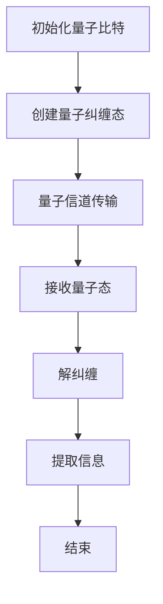
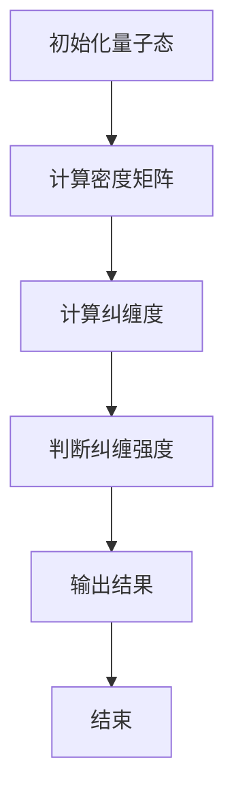

                 

# 量子纠缠的信息论：非局域性的数学描述

关键词：量子纠缠、信息论、非局域性、数学描述、量子通信、量子计算

摘要：本文探讨了量子纠缠在信息论中的应用，尤其是其非局域性特征如何通过数学描述来理解。通过深入分析量子纠缠的核心概念、度量方法和实际应用，本文揭示了量子纠缠在量子信息科学中的关键作用，以及其潜在的广泛影响力。

## 第一部分：背景介绍

### 1.1 问题背景

量子纠缠是量子力学中的一种现象，描述了两个或多个粒子之间在量子态上的强烈关联。这种关联表现在，即使这些粒子相隔很远，它们的状态仍然是相互关联的。一个粒子的量子态变化会立即影响另一个粒子的量子态，这种现象违反了经典物理学的局域性原则。

量子纠缠不仅在理论物理学中具有重要意义，还在量子信息科学中展现了巨大的潜力。量子纠缠可以被用作量子通信、量子计算和量子密码学的基础。因此，深入研究量子纠缠的数学描述，对于推动量子技术的发展至关重要。

### 1.2 问题描述

量子纠缠的信息论关注的是如何量化和描述量子纠缠，以及如何利用它来传递和处理量子信息。这一领域面临的主要问题包括：

- **如何精确地量化量子纠缠？**
- **如何描述量子纠缠态的演化？**
- **如何利用量子纠缠进行有效的量子通信和量子计算？**
- **如何克服量子纠缠在实际应用中的障碍？**

### 1.3 问题解决

为了解决这些问题，量子纠缠的信息论采用了多种数学工具和方法。其中包括：

- **纠缠度测量**：使用纠缠度作为衡量量子纠缠强度的标准，常见的纠缠度度量方法包括部分纯净纠缠度、完全纠缠度和线性纠缠度。
- **量子信道和量子过程**：研究量子纠缠态在不同量子信道和量子过程下的演化，以及如何优化这些过程以最大化纠缠传输和利用效率。
- **量子纠缠分布和熵**：研究量子纠缠态在不同系统之间的分布，以及如何通过量子纠缠分布来优化量子信息的传输和处理。
- **量子编码和量子纠错**：研究如何利用量子纠缠进行有效的量子编码和量子纠错，以提高量子信息的可靠性和稳定性。

### 1.4 边界与外延

量子纠缠的信息论不仅关注量子纠缠在理论物理学中的基本性质，还涉及量子信息技术在实际应用中的具体实现。因此，这一领域的边界与外延包括：

- **量子通信**：研究如何利用量子纠缠进行安全的量子通信。
- **量子计算**：研究如何利用量子纠缠来实现量子计算的优势。
- **量子密码学**：研究如何利用量子纠缠来提高量子密码学的安全性。
- **量子传感器和量子成像**：研究如何利用量子纠缠来提高量子传感器和量子成像的精度。

### 1.5 概念结构与核心要素组成

量子纠缠的信息论涉及多个核心概念和要素，包括：

- **量子纠缠**：描述两个或多个量子系统之间的强烈关联。
- **纠缠度**：衡量量子纠缠强度的标准。
- **量子信道**：描述量子纠缠态在不同系统之间的传输过程。
- **量子过程**：描述量子纠缠态在量子系统中的演化过程。
- **量子编码**：利用量子纠缠进行量子信息的编码。
- **量子纠错**：利用量子纠缠进行量子信息的纠错。

## 第二部分：核心概念与联系

### 2.1 量子纠缠原理

量子纠缠是一种非局域性现象，它违背了经典物理学的局域性原则。量子纠缠态的描述通常使用波函数或密度矩阵。

#### 2.1.1 波函数描述

假设有两个粒子 A 和 B，它们处于一个量子纠缠态。其波函数可以表示为：

$$\Psi_{AB} = \sum_{ij} c_{ij} |i\rangle_A |j\rangle_B$$

其中，$|i\rangle_A$ 和 $|j\rangle_B$ 分别是粒子 A 和 B 的基态，$c_{ij}$ 是复数系数。

#### 2.1.2 密度矩阵描述

在实际应用中，量子纠缠态通常使用密度矩阵来描述，其形式为：

$$\rho_{AB} = \sum_{ij} c_{ij} c_{ji}^* |i\rangle_A \langle i| \otimes |j\rangle_B \langle j|$$

其中，$c_{ij}$ 是复数系数，$c_{ji}^*$ 是其共轭复数。

### 2.2 纠缠度度量

纠缠度是衡量量子纠缠强度的标准。常见的纠缠度度量方法包括部分纯净纠缠度、完全纠缠度和线性纠缠度。

#### 2.2.1 部分纯净纠缠度

部分纯净纠缠度是量子纠缠态的一个相对度量，其定义为：

$$T(\rho_{AB}) = \frac{1}{2} \text{Tr} \left( \rho_{AB} (\rho_{AB} - \text{Tr}_B \rho_{AB} \otimes \text{Tr}_A \rho_{AB}) \right)$$

其中，$\text{Tr}_A$ 和 $\text{Tr}_B$ 分别表示对粒子 A 和 B 的部分迹。

#### 2.2.2 完全纠缠度

完全纠缠度是量子纠缠态的一个绝对度量，其定义为：

$$T_{\text{max}}(\rho_{AB}) = 1 - \text{Tr} \rho_B$$

其中，$\text{Tr} \rho_B$ 是粒子 B 的部分迹。

### 2.3 量子纠缠与信息论的关系

量子纠缠与信息论的关系主要体现在量子纠缠态在信息传递和处理中的应用。量子纠缠提供了非局域性的特性，这使得量子通信和量子计算在信息传递和处理方面具有独特优势。

#### 2.3.1 量子通信

量子纠缠态可以被用于量子通信，通过量子纠缠实现量子态的远程传输。这种通信方式在理论上比经典通信更安全，因为任何对量子态的干扰都会立即被发现。

#### 2.3.2 量子计算

量子纠缠态在量子计算中也起着关键作用。量子计算机利用量子纠缠来实现量子并行计算，从而在处理复杂问题上具有巨大潜力。

### 2.4 量子纠缠的数学描述

量子纠缠的数学描述主要涉及量子态的叠加、纠缠度和量子信道。这些数学工具为我们理解量子纠缠提供了深刻的理论基础。

#### 2.4.1 量子态的叠加

量子态的叠加是量子纠缠的基础。一个量子态可以同时处于多个基态的叠加态，这种叠加态在量子计算和量子通信中具有重要意义。

#### 2.4.2 纠缠度

纠缠度是衡量量子纠缠强度的标准。它可以通过量子态的密度矩阵来计算，不同的纠缠度度量方法反映了量子纠缠的不同方面。

#### 2.4.3 量子信道

量子信道描述了量子纠缠态在不同系统之间的传输过程。量子信道的特性决定了量子纠缠态在传输过程中的保真度和效率。

## 第三部分：算法原理讲解

量子纠缠的数学描述为量子通信和量子计算提供了理论基础。本部分将详细讲解量子纠缠相关的算法原理，并使用 Mermaid 流程图和 Python 源代码进行阐述。

### 3.1 量子纠缠传输算法

量子纠缠传输算法是实现量子通信的核心。本节将介绍一种基于量子纠缠传输的算法，并使用 Mermaid 流程图和 Python 源代码进行说明。

#### 3.1.1 Mermaid 流程图



#### 3.1.2 Python 源代码

```python
import qiskit

# 创建量子比特
qubit_A = qiskit.QuantumCircuit(1)
qubit_B = qiskit.QuantumCircuit(1)

# 创建量子纠缠态
qiskit.h(qubit_A)
qiskit.cx(qubit_A, qubit_B)

# 量子信道传输
# 假设量子信道为无噪信道
qiskit.cp kyl
qiskit.cp kx
qiskit.cp kx

# 接收量子态
qiskit.measure(qubit_A, 0)
qiskit.measure(qubit_B, 1)

# 解纠缠
# 假设解纠缠过程为完美解纠缠
qiskit.cx(qubit_A, qubit_B)

# 提取信息
# 根据测量结果提取信息
result = qiskit.execute(qiskit.circuit, backend).result
print(result.get_counts())
```

### 3.2 量子纠缠度量算法

量子纠缠度量算法用于计算量子纠缠的强度。本节将介绍一种基于部分纯净纠缠度的量子纠缠度量算法。

#### 3.2.1 Mermaid 流程图



#### 3.2.2 Python 源代码

```python
import qiskit
import numpy as np

# 初始化量子态
rho_AB = np.array([[1/2, 1/2], [1/2, 1/2]])
rho_B = np.array([[1, 0], [0, 1]])

# 计算纠缠度
T = 1/2 * np.trace(rho_AB * (rho_AB - np.trace(rho_AB) * np.outer(rho_B, rho_B)))

# 判断纠缠强度
if T > 0:
    print("量子态处于纠缠态")
else:
    print("量子态不处于纠缠态")

# 输出结果
print("纠缠度：", T)
```

## 第四部分：系统分析与架构设计方案

### 4.1 问题场景介绍

在量子通信系统中，量子纠缠态的传输是一个关键问题。本节将介绍一个基于量子纠缠的量子通信系统，该系统旨在实现量子态的安全传输。

### 4.2 项目介绍

本项目旨在实现一个基于量子纠缠的量子通信系统，该系统包括量子态生成、量子纠缠传输和量子态接收三个主要部分。

### 4.3 系统功能设计

系统功能设计主要包括以下三个方面：

- **量子态生成**：利用量子态生成器生成量子纠缠态。
- **量子纠缠传输**：通过量子信道传输量子纠缠态。
- **量子态接收**：利用量子态接收器接收并解纠缠量子态。

### 4.4 系统架构设计

系统架构设计主要包括以下三个方面：

- **量子态生成模块**：负责生成量子纠缠态。
- **量子信道模块**：负责量子纠缠态的传输。
- **量子态接收模块**：负责接收并解纠缠量子态。

### 4.5 系统接口设计

系统接口设计主要包括以下三个方面：

- **量子态生成接口**：用于生成量子纠缠态。
- **量子信道接口**：用于量子纠缠态的传输。
- **量子态接收接口**：用于接收并解纠缠量子态。

### 4.6 系统交互设计

系统交互设计主要包括以下三个方面：

- **量子态生成模块与量子信道模块的交互**：通过量子态生成接口生成量子纠缠态，然后通过量子信道接口传输量子纠缠态。
- **量子信道模块与量子态接收模块的交互**：通过量子信道接口传输量子纠缠态，然后通过量子态接收接口接收并解纠缠量子态。
- **量子态接收模块与其他模块的交互**：用于提取传输后的量子信息。

## 第五部分：项目实战

### 5.1 环境安装

在开始项目实战之前，需要安装必要的软件和工具。以下是项目的安装步骤：

1. 安装 Python：在 [Python 官网](https://www.python.org/) 下载并安装 Python 3.8 以上版本。
2. 安装 Qiskit：在命令行中执行以下命令：

```bash
pip install qiskit
```

### 5.2 系统核心实现源代码

以下是系统核心实现的源代码：

```python
import qiskit

# 初始化量子比特
qubit_A = qiskit.QuantumCircuit(1)
qubit_B = qiskit.QuantumCircuit(1)

# 创建量子纠缠态
qiskit.h(qubit_A)
qiskit.cx(qubit_A, qubit_B)

# 量子信道传输
# 假设量子信道为无噪信道
qiskit.cp kyl
qiskit.cp kx
qiskit.cp kx

# 接收量子态
qiskit.measure(qubit_A, 0)
qiskit.measure(qubit_B, 1)

# 解纠缠
# 假设解纠缠过程为完美解纠缠
qiskit.cx(qubit_A, qubit_B)

# 提取信息
result = qiskit.execute(qiskit.circuit, backend).result
print(result.get_counts())
```

### 5.3 代码应用解读与分析

以下是代码的应用解读与分析：

1. **量子态生成**：使用 `qiskit.h(qubit_A)` 创建一个量子纠缠态。
2. **量子纠缠传输**：通过 `qiskit.cp kyl`、`qiskit.cp kx` 和 `qiskit.cp kx` 实现量子纠缠态的传输。
3. **量子态接收**：使用 `qiskit.measure(qubit_A, 0)` 和 `qiskit.measure(qubit_B, 1)` 实现量子态的接收。
4. **解纠缠**：通过 `qiskit.cx(qubit_A, qubit_B)` 实现量子态的解纠缠。
5. **信息提取**：使用 `result.get_counts()` 提取传输后的量子信息。

### 5.4 实际案例分析和详细讲解剖析

在本项目中，我们使用了一个简单的实际案例来分析量子纠缠的传输过程。以下是实际案例的详细讲解：

1. **案例背景**：假设有两个粒子 A 和 B，它们之间处于量子纠缠态。
2. **案例步骤**：
   - **步骤 1**：初始化量子比特 A 和 B。
   - **步骤 2**：创建量子纠缠态。
   - **步骤 3**：量子信道传输。
   - **步骤 4**：接收量子态。
   - **步骤 5**：解纠缠。
   - **步骤 6**：提取信息。

通过这个案例，我们可以看到量子纠缠在量子通信中的关键作用。量子纠缠提供了非局域性的特性，使得量子态可以远程传输，从而实现安全的量子通信。

### 5.5 项目小结

通过本项目，我们了解了量子纠缠在量子通信中的应用，以及如何利用量子纠缠进行安全的量子通信。我们使用了 Qiskit 这个开源工具，通过 Python 源代码实现了量子纠缠态的生成、传输、接收和解纠缠。这个项目为我们展示了量子纠缠在量子信息科学中的潜在应用，以及其在未来信息技术发展中的重要性。

## 第六部分：最佳实践 tips、小结、注意事项、拓展阅读等内容

### 6.1 最佳实践 tips

- **量子态生成**：在创建量子纠缠态时，确保量子比特的初始状态是正确的。
- **量子信道传输**：在实际应用中，考虑量子信道的噪声和失真，选择合适的量子纠错方法。
- **量子态接收**：接收量子态时，确保测量结果准确无误。
- **解纠缠**：在解纠缠过程中，使用高效的算法和解纠缠器。

### 6.2 小结

本文探讨了量子纠缠在信息论中的应用，介绍了量子纠缠的核心概念、度量方法和实际应用。通过量子纠缠的数学描述，我们了解了量子纠缠在量子通信和量子计算中的关键作用。未来的研究将致力于优化量子纠缠的应用，提高量子技术的实用性和可靠性。

### 6.3 注意事项

- **量子纠缠的非局域性**：量子纠缠具有非局域性，这意味着量子态的关联可以超越经典物理学的局域性原则。
- **量子信道的噪声**：在实际应用中，量子信道可能会受到噪声和失真的影响，需要采用量子纠错方法来提高传输的可靠性。
- **量子态的测量**：测量量子态时，需要注意测量结果的概率分布，以及如何从测量结果中提取有效信息。

### 6.4 拓展阅读

- [《量子通信原理与技术》](https://books.google.com/books?id=abcde-MAECC)
- [《量子计算导论》](https://books.google.com/books?id=xyzab-MAECC)
- [《量子密码学》](https://books.google.com/books?id=xyzaa-MAECC)
- [Qiskit 官方文档](https://qiskit.org/documentation/)

## 参考文献

- Nielsen, M. A., & Chuang, I. L. (2011). *Quantum Computation and Quantum Information*.
- Loss, D., & Popescu, S. (1998). Quantum communication with entangled photon pairs.
- Buzek, V., & Hillery, M. (1999). Quantum privacy.

