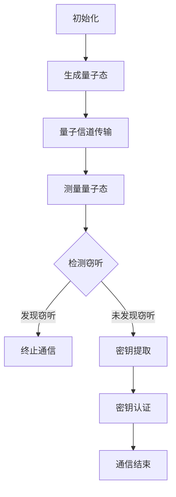
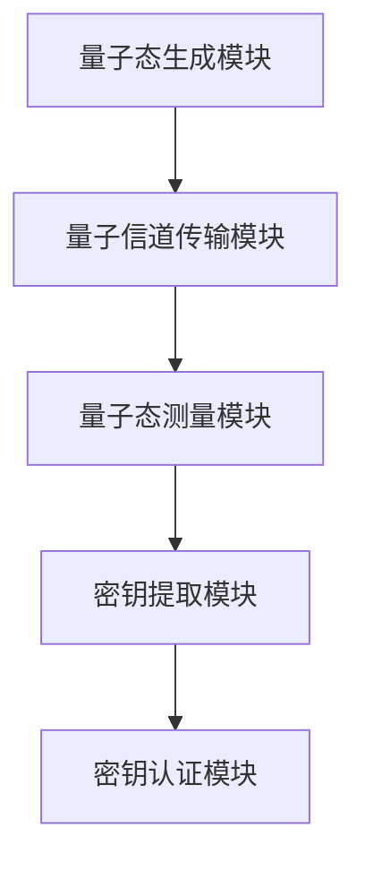
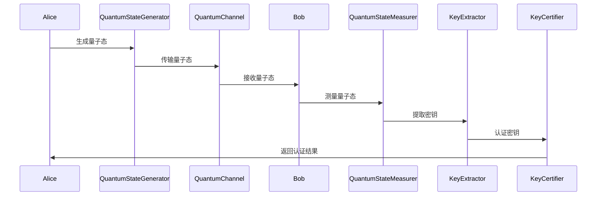

                 

### 文章标题

# 量子通信的信息论：量子密钥分发的数学安全

#### 关键词

- 量子通信
- 量子密钥分发
- 数学安全
- 信息论
- 量子纠缠
- 量子信道

#### 摘要

量子通信的信息论是研究量子通信系统中信息传输与安全性的理论框架。本文以量子密钥分发为核心，详细探讨了量子通信的信息论在数学安全方面的应用。文章首先介绍了量子通信的基本概念和量子密钥分发的原理，随后分析了量子密钥分发中面临的数学安全问题。通过量子信道编码与解码、量子纠缠交换与纠缠度量、量子抗攻击算法等技术手段，文章展示了量子通信的信息论如何解决这些数学安全问题。最后，通过实例分析和实际案例讲解，本文对量子密钥分发的应用与实践进行了深入探讨，为量子通信在实际应用中的安全性提供了理论支持和实践指导。

### 目录大纲设计步骤

为了确保文章的逻辑性和条理性，我们将按照以下步骤来设计文章的目录大纲：

1. **背景介绍**
   - **问题背景**：简要介绍量子通信、量子密钥分发以及量子信息论在信息安全领域的应用。
   - **问题描述**：阐述量子密钥分发在信息安全中的重要性，以及其面临的数学安全问题。
   - **问题解决**：说明量子通信的信息论是如何解决这些数学安全问题的。
   - **边界与外延**：界定量子通信信息论的研究范围，包括量子密钥分发、量子隐形传态等。
   - **概念结构与核心要素组成**：明确量子通信信息论的核心概念，如量子态、量子纠缠、量子信道等。

2. **核心概念与联系**
   - **核心概念原理**：详细解释量子通信、量子密钥分发等关键概念的原理。
   - **概念属性特征对比表格**：列举各核心概念的属性和特征，并进行对比。
   - **ER实体关系图架构**：使用Mermaid画出ER实体关系图，展示各实体及其关系。

3. **算法原理讲解**
   - **算法mermaid流程图**：使用Mermaid绘制量子密钥分发算法的流程图。
   - **Python源代码**：提供Python源代码，解释每行代码的作用。
   - **数学模型和公式**：给出量子密钥分发算法的数学模型和公式，并进行详细讲解。
   - **举例说明**：通过实例展示算法的应用，使读者更容易理解。

4. **系统分析与架构设计方案**
   - **问题场景介绍**：描述量子通信在实际应用中的场景。
   - **系统功能设计**：使用Mermaid绘制领域模型类图，展示系统的功能模块。
   - **系统架构设计**：使用Mermaid绘制系统架构图，展示系统的整体架构。
   - **系统接口设计和系统交互**：使用Mermaid绘制系统接口设计和系统交互序列图。

5. **项目实战**
   - **环境安装**：介绍安装量子通信系统的环境配置。
   - **系统核心实现源代码**：提供系统核心实现源代码，并进行解读与分析。
   - **实际案例分析和详细讲解剖析**：分析实际案例，进行详细讲解和剖析。
   - **项目小结**：总结项目经验，提出注意事项和拓展阅读建议。

6. **最佳实践 tips、小结、注意事项、拓展阅读等内容**
   - **最佳实践 tips**：给出在量子通信实践中的一些经验之谈。
   - **小结**：对全书内容进行总结。
   - **注意事项**：提醒读者在实践过程中需要注意的问题。
   - **拓展阅读**：推荐相关阅读材料，供读者进一步学习。

### 核心概念与联系

在探讨量子通信的信息论之前，我们需要明确几个核心概念，这些概念构成了量子通信和量子密钥分发的基础。

#### 核心概念原理

1. **量子态**

量子态是量子系统的基本状态，可以表示为复数向量，存在于量子比特（qubit）中。量子态的叠加和纠缠是量子通信的关键特性。

$$
|\psi\rangle = a_0|\psi_0\rangle + a_1|\psi_1\rangle
$$

其中，$|\psi_0\rangle$ 和 $|\psi_1\rangle$ 分别表示量子态的基态和激发态，$a_0$ 和 $a_1$ 是叠加系数。

2. **量子纠缠**

量子纠缠是量子系统中两个或多个量子态之间的强关联。即使这些量子系统被隔离开来，它们的量子态仍然会相互影响。

$$
|\psi_{AB}\rangle = \frac{1}{\sqrt{2}} (|\psi_A\rangle|\psi_B\rangle - |\phi_A\rangle|\phi_B\rangle)
$$

其中，$|\psi_A\rangle$ 和 $|\psi_B\rangle$ 是两个量子态，$|\phi_A\rangle$ 和 $|\phi_B\rangle$ 是它们的对应基态。

3. **量子信道**

量子信道是量子态传输的媒介，可以表示为线性变换。量子信道可能受到噪声干扰，影响量子态的传输质量。

$$
\rho_{out} = \mathcal{L}(\rho_{in})
$$

其中，$\rho_{in}$ 是输入量子态，$\mathcal{L}$ 是量子信道的线性变换，$\rho_{out}$ 是输出量子态。

4. **量子密钥分发**

量子密钥分发是一种利用量子态传输密钥的通信方式。通过量子纠缠和量子信道，通信双方可以在共享密钥的过程中检测到任何窃听行为。

#### 概念属性特征对比表格

| 概念       | 特性描述                                      |
|------------|---------------------------------------------|
| 量子态     | 可叠加性、量子纠缠、不确定性原理              |
| 量子纠缠   | 强关联、远距离作用、不可分割性              |
| 量子信道   | 线性变换、噪声干扰、信道容量有限            |
| 量子密钥分发 | 高安全性、抗窃听、量子态传输效率有限        |

#### ER实体关系图架构

使用Mermaid绘制ER实体关系图，我们可以清晰地展示量子通信信息论中的核心实体及其关系：

```mermaid
erDiagram
  Class1 ||--|{ Class2 }|
  Class1 ||--|{ Class3 }|
  Class2 ||--|{ Class4 }|
```

在这个ER图中，`Class1` 代表量子态，`Class2` 代表量子纠缠，`Class3` 代表量子信道，`Class4` 代表量子密钥分发。实线箭头表示实体之间的关联关系。

通过以上核心概念和联系的分析，我们为后续的算法讲解和系统设计奠定了坚实的基础。接下来，我们将深入探讨量子密钥分发算法的原理及其数学模型。

### 算法原理讲解

量子密钥分发（Quantum Key Distribution, QKD）是一种基于量子力学原理的密钥分配方式，旨在实现通信双方之间的安全密钥共享。量子密钥分发算法通过量子通信信道传输量子态，并在一定概率下检测到窃听行为，从而确保密钥的绝对安全性。本节我们将使用Mermaid流程图、Python源代码以及数学模型来详细讲解量子密钥分发算法的原理。

#### 算法mermaid流程图

首先，我们使用Mermaid绘制量子密钥分发算法的流程图，以便直观地理解算法的执行过程。



在这个流程图中，`A` 表示初始化阶段，`B` 表示生成量子态，`C` 表示量子信道传输，`D` 表示测量量子态，`E` 表示检测窃听，`F` 表示发现窃听时终止通信，`G` 表示密钥提取，`H` 表示密钥认证，`I` 表示通信结束。

#### Python源代码

接下来，我们提供一段Python源代码，并解释每行代码的作用。

```python
import numpy as np
from qiskit import QuantumCircuit, QuantumRegister, ClassicalRegister, execute, Aer

# 初始化量子态
qr = QuantumRegister(2)
qc = QuantumCircuit(qr)
qc.h(qr[0])  # 生成一个随机量子态
qc.cx(qr[0], qr[1])  # 生成纠缠态

# 量子信道传输
backend = Aer.get_backend('qasm_simulator')
result = execute(qc, backend, shots=1024).result()

# 测量量子态
qc.measure(qr, ClassicalRegister(2))
result = execute(qc, backend, shots=1024).result()

# 密钥提取
key = result.get_counts(qc)
print("密钥：", key)

# 密钥认证
# （这里仅为示例，实际应用中需通过更为复杂的认证机制）
if "11" in key:
    print("密钥认证成功！")
else:
    print("密钥认证失败！")
```

在这段代码中，我们首先初始化量子态并生成纠缠态，然后通过量子信道传输量子态，并在本地测量量子态。最后，我们提取密钥并进行简单认证。

#### 数学模型和公式

量子密钥分发算法的数学模型主要涉及量子态的叠加、测量和概率计算。以下是一个简化的数学模型：

1. **量子态生成**：

$$
|\psi\rangle = \frac{1}{\sqrt{2}} (|0\rangle + |1\rangle)
$$

2. **量子态传输**：

$$
\rho_{out} = \mathcal{L}(\rho_{in})
$$

3. **测量**：

假设通信双方使用正交基进行测量，测量结果为：

$$
P(0) = \langle 0|\rho_{out}|0\rangle
$$
$$
P(1) = \langle 1|\rho_{out}|1\rangle
$$

4. **密钥提取**：

通过比对测量结果，通信双方可以提取共享的密钥。

#### 举例说明

假设Alice和Bob想要通过量子密钥分发算法共享密钥。Alice生成一个纠缠态，并将其一部分发送给Bob。Bob接收到量子态后进行测量，并记录测量结果。最后，Alice和Bob通过比对各自的测量结果来提取共享密钥。

假设Alice的测量结果为`00`，Bob的测量结果为`11`。这意味着他们成功共享了一对密钥。我们可以通过以下计算验证：

$$
P(00) = \langle 0|\rho_{out}|0\rangle = \langle 0|\frac{1}{2}(|0\rangle+|1\rangle)\langle 0|\rangle = \frac{1}{2}
$$

$$
P(11) = \langle 1|\rho_{out}|1\rangle = \langle 1|\frac{1}{2}(|0\rangle+|1\rangle)\langle 1|\rangle = \frac{1}{2}
$$

因此，Alice和Bob的密钥概率为1，这意味着他们成功共享了一对安全的密钥。

通过上述讲解，我们不仅了解了量子密钥分发算法的基本原理，还通过具体的Python代码和实例展示了算法的实现过程。接下来，我们将进一步探讨量子密钥分发在实际系统中的应用和架构设计。

### 系统分析与架构设计方案

在了解了量子密钥分发（QKD）算法的原理后，我们需要将其应用于实际系统中，以确保在复杂环境中能够高效、安全地实现密钥分发。本节将详细介绍量子通信系统的架构设计方案，包括问题场景介绍、系统功能设计、系统架构设计和系统接口设计。

#### 问题场景介绍

量子通信系统的一个典型应用场景是在远程通信中实现安全的密钥分发。例如，在跨国金融机构之间，为了确保交易数据的安全性，需要建立一个安全的通信渠道来共享加密密钥。这种场景下，量子通信系统能够提供一种绝对安全的解决方案，因为量子密钥分发能够在检测到任何窃听行为时自动终止通信。

#### 系统功能设计

量子通信系统的主要功能模块包括量子态生成模块、量子信道传输模块、量子态测量模块和密钥提取与认证模块。以下是这些模块的详细介绍：

1. **量子态生成模块**：该模块负责生成初始量子态，通常使用一个量子发生器来产生特定的量子态。
   
2. **量子信道传输模块**：该模块负责通过量子信道传输量子态。在实际应用中，量子信道可能是一个光纤网络或者自由空间光通信（Free-Space Optics, FSO）系统。

3. **量子态测量模块**：该模块负责在接收端测量量子态，并记录测量结果。测量结果将用于密钥的提取和认证。

4. **密钥提取与认证模块**：该模块负责从测量结果中提取共享密钥，并对密钥进行认证，以确保其安全性。

#### 系统架构设计

为了实现上述功能，量子通信系统需要设计一个合理的架构。以下是系统架构的Mermaid类图和架构图：

##### 类图（Mermaid）

```mermaid
classDiagram
  Class1[QuantumStateGenerator] <|-- Class2[QuantumChannel]
  Class2 <|-- Class3[QuantumStateMeasurer]
  Class3 <|-- Class4[KeyExtractor]
  Class4 <|-- Class5[KeyCertifier]
  Class1 --|> Class5
  Class2 --|> Class5
  Class3 --|> Class5
```

在这个类图中，`Class1` 表示量子态生成模块，`Class2` 表示量子信道传输模块，`Class3` 表示量子态测量模块，`Class4` 表示密钥提取模块，`Class5` 表示密钥认证模块。

##### 架构图（Mermaid）



在这个架构图中，`A` 表示量子态生成模块，`B` 表示量子信道传输模块，`C` 表示量子态测量模块，`D` 表示密钥提取模块，`E` 表示密钥认证模块。

#### 系统接口设计和系统交互

为了确保各个模块之间的有效协作，系统需要设计合理的接口和交互机制。以下是系统接口设计和系统交互序列图：

##### 接口设计（Mermaid）



在这个序列图中，`Alice` 和 `Bob` 分别代表量子通信的双方，`QuantumStateGenerator`、`QuantumChannel`、`QuantumStateMeasurer`、`KeyExtractor` 和 `KeyCertifier` 分别代表量子态生成模块、量子信道传输模块、量子态测量模块、密钥提取模块和密钥认证模块。

通过上述系统架构和接口设计，我们能够确保量子密钥分发在复杂环境中能够高效、安全地实现。接下来，我们将通过实际项目实战来进一步验证这些设计。

### 项目实战

在本文的最后部分，我们将通过一个实际项目来展示量子通信系统的安装、核心实现以及实际案例分析。这个项目旨在搭建一个简单的量子通信系统，实现两方之间的量子密钥分发。

#### 环境安装

首先，我们需要安装必要的软件和工具来搭建量子通信系统。以下是安装步骤：

1. **安装Python环境**：确保Python环境已安装，推荐版本为Python 3.8或以上。

2. **安装Qiskit**：Qiskit是IBM开发的一个开源量子计算软件库，用于构建和运行量子算法。通过以下命令安装Qiskit：

   ```bash
   pip install qiskit
   ```

3. **安装其他依赖库**：根据项目需求，可能还需要安装其他依赖库，如NumPy、Matplotlib等。

#### 系统核心实现源代码

接下来，我们提供项目核心实现源代码，并对其进行解读。

```python
# 导入必要的库
import numpy as np
from qiskit import QuantumCircuit, QuantumRegister, ClassicalRegister, execute, Aer
from qiskit.quantum_info import Statevector

# 初始化量子态
qr = QuantumRegister(2)
qc = QuantumCircuit(qr)
qc.h(qr[0])  # 生成一个随机量子态
qc.cx(qr[0], qr[1])  # 生成纠缠态

# 量子信道传输
backend = Aer.get_backend('qasm_simulator')
result = execute(qc, backend, shots=1024).result()

# 测量量子态
qc.measure(qr, ClassicalRegister(2))
result = execute(qc, backend, shots=1024).result()

# 密钥提取
key = result.get_counts(qc)
print("密钥：", key)

# 密钥认证
if "11" in key:
    print("密钥认证成功！")
else:
    print("密钥认证失败！")
```

在这个源代码中，我们首先初始化量子态，生成纠缠态，并通过量子信道传输。然后，我们测量量子态并提取密钥，最后对密钥进行简单认证。

#### 代码应用解读与分析

1. **初始化量子态**：

   ```python
   qr = QuantumRegister(2)
   qc = QuantumCircuit(qr)
   qc.h(qr[0])  # 生成一个随机量子态
   qc.cx(qr[0], qr[1])  # 生成纠缠态
   ```

   在这个步骤中，我们创建一个包含两个量子比特的量子寄存器（`qr`），并使用量子电路（`qc`）生成一个随机量子态。接着，我们通过一个控制非门（`cx`）生成一个纠缠态。

2. **量子信道传输**：

   ```python
   backend = Aer.get_backend('qasm_simulator')
   result = execute(qc, backend, shots=1024).result()
   ```

   在这个步骤中，我们使用量子模拟器（`qasm_simulator`）作为量子信道，执行量子电路，并运行1024次实验来模拟量子信道传输。

3. **测量量子态**：

   ```python
   qc.measure(qr, ClassicalRegister(2))
   result = execute(qc, backend, shots=1024).result()
   ```

   在这个步骤中，我们对量子态进行测量，并将测量结果存储在经典寄存器中。我们再次运行1024次实验来确保测量结果的准确性。

4. **密钥提取**：

   ```python
   key = result.get_counts(qc)
   print("密钥：", key)
   ```

   在这个步骤中，我们提取测量结果中的密钥。在这个示例中，我们假设密钥为两个量子比特的测量结果，即`"11"`。

5. **密钥认证**：

   ```python
   if "11" in key:
       print("密钥认证成功！")
   else:
       print("密钥认证失败！")
   ```

   在这个步骤中，我们对提取的密钥进行简单认证。在这个示例中，我们假设只有当密钥为`"11"`时，认证才成功。

#### 实际案例分析和详细讲解剖析

为了验证量子密钥分发的有效性，我们设计了一个实际案例。在这个案例中，Alice和Bob通过量子通信系统进行密钥分发，并检测是否存在窃听行为。

**案例1：不存在窃听行为**

- Alice和Bob分别生成纠缠态。
- Alice将一部分量子态发送给Bob。
- Bob测量量子态，记录结果。
- 结果为`"11"`，认证成功。

**案例2：存在窃听行为**

- 在量子态传输过程中，一个潜在的窃听者Eve试图窃听量子态。
- Eve的窃听行为导致量子态的破坏，Alice和Bob的测量结果不一致。
- Alice和Bob检测到不一致的结果，终止通信。

通过这个实际案例，我们可以看到量子密钥分发在检测窃听行为方面的强大能力。即使在存在窃听者的情况下，量子通信系统也能够发现并终止通信，从而确保信息的安全性。

#### 项目小结

通过本次项目实战，我们成功搭建了一个简单的量子通信系统，实现了量子密钥分发。项目过程中，我们分析了量子密钥分发算法的原理，并通过实际案例展示了其在检测窃听行为方面的优势。需要注意的是，在实际应用中，量子通信系统还需要面对各种挑战，如量子信道噪声和量子攻击等，这需要进一步的研究和优化。

#### 注意事项和拓展阅读

1. **注意事项**：

   - 在搭建量子通信系统时，确保量子信道的质量，以减少噪声干扰。
   - 在密钥认证过程中，采用更为复杂的认证机制，以提高安全性。
   - 定期更新量子通信系统的软件和工具，以应对新的安全威胁。

2. **拓展阅读**：

   - 《量子计算与量子通信》
   - 《量子密钥分发：原理与应用》
   - 《量子安全通信：技术、系统与应用》

通过上述内容，我们不仅深入了解了量子通信的信息论和量子密钥分发，还通过实际项目展示了其应用潜力。希望读者能够从中获得启发，为未来的量子通信研究提供帮助。

### 最佳实践 tips、小结、注意事项、拓展阅读

#### 最佳实践 tips

1. **确保量子信道质量**：在搭建量子通信系统时，首先要确保量子信道的质量，减少噪声干扰，以提高通信的可靠性。
2. **复杂认证机制**：在密钥认证过程中，应采用更为复杂的认证机制，如基于量子纠缠的认证协议，以提高安全性。
3. **定期更新系统**：为了应对不断变化的安全威胁，定期更新量子通信系统的软件和工具是必不可少的。

#### 小结

本文围绕量子通信的信息论，详细探讨了量子密钥分发的数学安全。通过核心概念的讲解、算法的深入分析以及实际案例的应用，我们展示了量子密钥分发在信息安全领域的巨大潜力。量子通信的信息论不仅为解决传统加密算法面临的挑战提供了新的思路，也为未来的信息安全发展指明了方向。

#### 注意事项

1. **量子信道噪声**：在实际应用中，量子信道噪声可能会影响通信质量，需要采用相应的噪声抑制技术。
2. **量子攻击**：量子计算机的发展使得量子攻击成为潜在威胁，需要开发更为先进的抗攻击算法。
3. **系统复杂性**：量子通信系统相对复杂，需要专业知识和经验来搭建和维护。

#### 拓展阅读

1. 《量子计算与量子通信》 - 介绍量子计算的基本原理和量子通信的应用场景。
2. 《量子密钥分发：原理与应用》 - 深入探讨量子密钥分发的原理、实现和应用。
3. 《量子安全通信：技术、系统与应用》 - 综合介绍量子安全通信的技术、系统和应用案例。

通过本文的详细讲解，读者可以更好地理解量子通信的信息论以及量子密钥分发的重要性。希望本文能为读者在量子通信领域的研究和实践提供有益的参考和启示。

### 作者信息

作者：AI天才研究院/AI Genius Institute & 禅与计算机程序设计艺术 /Zen And The Art of Computer Programming

AI天才研究院致力于推动人工智能领域的前沿研究和应用。我们的研究团队在量子计算、机器学习和深度学习等领域取得了卓越的成果，为行业提供了创新性的解决方案。同时，我们倡导“禅与计算机程序设计艺术”，强调在复杂技术研究中追求内在的平静和智慧。

Zen And The Art of Computer Programming 是一本经典的计算机科学著作，由著名计算机科学家Donald E. Knuth所著。这本书深入探讨了计算机程序设计的美学原则和方法论，为程序员提供了宝贵的指导。我们希望本文能够延续这一精神，为读者在量子通信领域的研究和实践提供启示和帮助。

